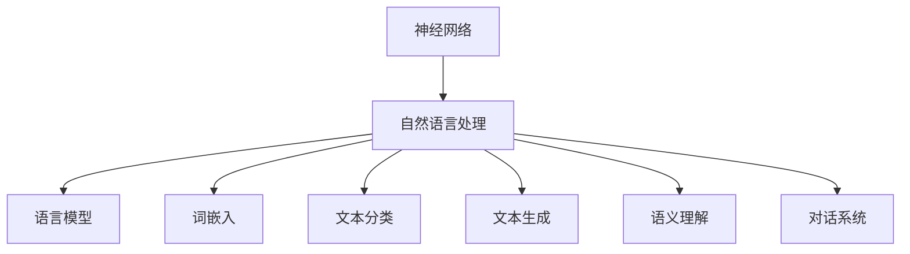

                 

## 核心概念与联系

神经网络与自然语言处理（NLP）的结合，已经在过去几年中取得了显著的突破。本文将详细探讨神经网络在NLP中的应用，首先从核心概念和联系出发，构建我们的知识框架。

### 图1.1 神经网络与自然语言处理的关系



在这个图中，神经网络（A）作为基础技术，与自然语言处理（B）中的多个子任务（C到H）紧密相连。每一个子任务都是NLP的重要组成部分，而神经网络则为这些任务提供了强大的数据处理和分析能力。

### 核心概念

1. **神经网络**：是一种模拟生物神经系统计算能力的计算模型，由大量的神经元和连接构成。
2. **自然语言处理**：是指使计算机能够理解、生成和回应自然语言（如英语、中文等）的技术和学科。
3. **语言模型**：是一种概率模型，用于预测文本序列中下一个单词或字符。
4. **词嵌入**：是将词汇映射到低维向量空间的技术，使词汇之间的相似性可以通过向量之间的距离来表示。
5. **文本分类**：是将文本数据分配到预定义的类别中。
6. **文本生成**：是生成新的文本数据，如机器翻译、文本摘要等。
7. **语义理解**：是理解和解析文本中的语义含义。
8. **对话系统**：是能够与人类进行交互的系统，如聊天机器人。

这些概念相互交织，形成了一个复杂的NLP体系。接下来，我们将逐一深入探讨每一个子领域。

### 联系

神经网络与自然语言处理的联系在于，神经网络为NLP任务提供了强大的数据处理和分析能力。例如，神经网络可以用来训练语言模型，从而预测下一个单词；可以用来进行词嵌入，将词汇映射到低维向量空间；还可以用于文本分类、文本生成、语义理解和对话系统等任务。

通过理解这些核心概念和它们之间的联系，我们可以更好地把握神经网络在NLP中的应用，并为后续章节的学习打下坚实的基础。

### 数学模型和数学公式讲解

在深入探讨神经网络在自然语言处理中的应用之前，我们需要理解一些关键的数学模型和公式。这些模型和公式是神经网络训练和优化的基础，对于理解后续章节的内容至关重要。

#### 损失函数

损失函数是神经网络训练过程中用于衡量模型预测值与真实值之间差距的函数。它用于指导神经网络的权重更新，以便更好地拟合训练数据。常见的损失函数包括均方误差（MSE）和交叉熵损失。

**均方误差（MSE）**：

$$
\text{MSE} = \frac{1}{n}\sum_{i=1}^{n} (\hat{y}_i - y_i)^2
$$

其中，$\hat{y}_i$ 是模型预测值，$y_i$ 是真实值，$n$ 是样本数量。MSE 用于回归任务，如文本分类和情感分析。

**交叉熵损失**：

$$
\text{CrossEntropyLoss}(-\log(\hat{y}_i), y_i)
$$

交叉熵损失通常用于分类任务，如文本分类和情感分析。$-\log(\hat{y}_i)$ 表示模型预测的概率对数，$y_i$ 是真实标签（0或1）。

#### 激活函数

激活函数用于引入非线性，使神经网络能够拟合复杂函数。常见的激活函数包括Sigmoid、ReLU和Tanh。

**Sigmoid**：

$$
\sigma(x) = \frac{1}{1 + e^{-x}}
$$

Sigmoid 函数将输入值映射到（0, 1）区间，常用于二分类任务。

**ReLU**：

$$
\text{ReLU}(x) = \max(0, x)
$$

ReLU 函数在输入小于0时输出0，在输入大于等于0时输出输入值。它有助于加速神经网络的训练。

**Tanh**：

$$
\tanh(x) = \frac{e^x - e^{-x}}{e^x + e^{-x}}
$$

Tanh 函数将输入值映射到（-1, 1）区间，与 Sigmoid 类似，但输出值的分布更为均匀。

#### 梯度下降算法

梯度下降算法是一种用于优化神经网络权重的优化算法。它通过计算损失函数关于权重和偏置的梯度，并沿着梯度方向更新权重和偏置，以最小化损失函数。

**梯度下降算法**：

1. 初始化权重和偏置。
2. 对于每个样本，计算模型预测值和损失函数。
3. 计算损失函数关于权重和偏置的梯度。
4. 更新权重和偏置。

**梯度计算**：

梯度计算是梯度下降算法的关键步骤。它涉及前向传播和反向传播。

**前向传播**：

1. 计算输入和权重之间的线性组合。
2. 应用激活函数，得到输出。

**反向传播**：

1. 计算输出和真实值之间的误差。
2. 逐层反向传播误差，计算每一层的梯度。
3. 根据梯度更新权重和偏置。

**梯度裁剪与正则化**：

梯度裁剪和正则化是防止模型过拟合的常用技术。

**梯度裁剪**：

1. 计算梯度的L2范数。
2. 如果L2范数超过阈值，则缩放梯度。

$$
\text{GradientClip}(g, threshold)
$$

**正则化**：

正则化包括L1正则化和L2正则化。

**L1正则化**：

$$
\text{L1 Regularization} = \lambda \sum_{i} |w_i|
$$

**L2正则化**：

$$
\text{L2 Regularization} = \lambda \sum_{i} w_i^2
$$

通过理解这些数学模型和公式，我们可以更好地理解神经网络在自然语言处理中的应用。这些基础知识将为后续章节的深入探讨提供坚实的理论支持。

### 语言模型

语言模型是自然语言处理（NLP）中的重要组成部分，它用于预测文本序列中下一个单词或字符。语言模型的核心目标是理解自然语言的统计特性，并利用这些特性生成文本或进行文本分类。

#### 语言模型的定义

语言模型是一种概率模型，它为任意给定的单词序列 $w_1, w_2, ..., w_n$ 概率 $P(w_1, w_2, ..., w_n)$ 提供了一种表示。更具体地说，语言模型旨在估计以下概率：

$$
P(w_1, w_2, ..., w_n) = P(w_n | w_{n-1}, w_{n-2}, ..., w_1)
$$

这意味着给定前 $n-1$ 个单词，预测第 $n$ 个单词的概率。语言模型通过这种方式捕捉文本的序列依赖性，从而为后续的NLP任务提供支持。

#### 语言模型的历史与发展

语言模型的发展经历了几个重要的阶段：

1. **N-gram模型**：N-gram模型是最早的语言模型之一，它基于局部统计方法，假设当前单词的概率仅取决于前 $n-1$ 个单词。N-gram模型的简单性和有效性使其在早期NLP任务中得到了广泛应用。

2. **隐马尔可夫模型（HMM）**：HMM是一种统计模型，用于处理时间序列数据。它通过隐状态序列来表示单词序列的概率，适用于语音识别和文本生成。

3. **基于统计的模型**：随着计算能力的提升，基于统计的模型开始得到更广泛的应用。这些模型利用大规模语料库来估计单词序列的概率分布，如n-gram模型和隐马尔可夫模型。

4. **神经网络模型**：近年来，深度学习在NLP领域的应用取得了显著突破。神经网络模型，特别是循环神经网络（RNN）和长短时记忆网络（LSTM），为语言模型提供了更强的表示能力和训练效果。

5. **基于注意力的模型**：注意力机制是一种用于捕捉序列之间长期依赖性的技术。结合神经网络模型，注意力机制显著提升了语言模型在自然语言处理任务中的性能。

#### 常见的语言模型

1. **N-gram模型**：N-gram模型将文本序列划分为连续的 $n$ 个单词，并计算每个 $n$-gram 的频率。基于这些频率，模型可以预测下一个单词。N-gram模型简单且易于实现，但其性能受限于局部依赖性。

2. **隐马尔可夫模型（HMM）**：HMM用于表示时间序列数据，如语音信号和文本序列。HMM通过隐状态序列来描述单词序列的概率，并在给定当前状态和观测值的情况下预测下一个状态。

3. **循环神经网络（RNN）**：RNN是一种能够处理序列数据的神经网络。RNN通过循环结构捕捉序列之间的长期依赖性，但在某些情况下可能存在梯度消失或爆炸问题。

4. **长短时记忆网络（LSTM）**：LSTM是RNN的一种变体，它通过引入记忆单元来克服梯度消失问题。LSTM在处理长序列数据时表现出色，广泛应用于文本生成、机器翻译和语音识别。

5. **基于注意力的模型**：注意力机制是一种用于捕捉序列之间依赖性的技术。结合神经网络模型，注意力机制可以显著提升语言模型的性能。

#### 语言模型的训练与评估

语言模型的训练过程涉及以下步骤：

1. **数据准备**：从大规模语料库中收集文本数据，并进行预处理，如分词、去除停用词等。
2. **词汇表构建**：将文本中的所有单词构建为一个词汇表，并为每个单词分配唯一的索引。
3. **数据预处理**：将文本序列转换为索引序列，并应用词嵌入技术将索引转换为向量。
4. **模型训练**：使用训练数据训练语言模型，通过优化损失函数（如交叉熵损失）来更新模型参数。
5. **模型评估**：使用验证数据评估模型性能，通过计算指标（如 perplexity）来衡量模型的质量。

语言模型的质量通常用 perplexity（困惑度）来衡量，定义为：

$$
\text{Perplexity} = \exp(\frac{1}{N} \sum_{i=1}^{N} -\log(p(w_i)))
$$

其中，$N$ 是句子中的单词数量，$p(w_i)$ 是模型预测的单词 $w_i$ 的概率。

通过深入理解语言模型，我们可以更好地理解和生成自然语言。语言模型在文本分类、文本生成、机器翻译和对话系统等NLP任务中发挥着关键作用，为人工智能领域带来了巨大的进步。

### 词嵌入

词嵌入（Word Embedding）是将词汇映射到低维向量空间的技术。通过词嵌入，我们可以将高维的词汇信息转换为低维向量表示，从而使得计算机能够更有效地处理和理解自然语言。词嵌入在自然语言处理（NLP）中具有广泛的应用，如文本分类、情感分析、机器翻译和对话系统等。

#### 词嵌入的概念

词嵌入的基本思想是将词汇映射为一个连续的向量空间，使得在语义上相似的词汇在向量空间中靠近。词嵌入的关键特点是能够捕捉词汇之间的语义和语法关系。这种向量表示方法使得神经网络能够更有效地处理文本数据。

常见的词嵌入方法包括矩阵分解法、神经网络词向量化等。矩阵分解法通过将原始词汇矩阵分解为低维矩阵来实现词嵌入，而神经网络词向量化则通过训练神经网络模型来直接生成词向量。

#### 矩阵分解法

矩阵分解法是一种常见的词嵌入方法，它通过将原始词汇矩阵分解为低维矩阵来实现词嵌入。具体来说，给定一个词汇矩阵 $V$，其行表示词汇，列表示词汇的索引。矩阵分解法的目标是将 $V$ 分解为两个低维矩阵 $U$ 和 $V^T$，使得：

$$
V = UV^T
$$

其中，$U$ 和 $V^T$ 分别表示词向量和词索引的映射。通过这种方式，原始词汇矩阵的高维信息被转换为低维词向量表示。

矩阵分解法的一个优点是简单且易于实现。但缺点是它依赖于预定义的词汇表和索引，且不能直接捕捉词汇之间的动态关系。

#### 神经网络词向量化

神经网络词向量化是一种基于深度学习的词嵌入方法。它通过训练神经网络模型来直接生成词向量。具体来说，神经网络词向量化通常包括以下步骤：

1. **数据准备**：从大规模语料库中收集文本数据，并进行预处理，如分词、去除停用词等。
2. **词汇表构建**：将文本中的所有单词构建为一个词汇表，并为每个单词分配唯一的索引。
3. **数据预处理**：将文本序列转换为索引序列，并应用词嵌入技术将索引转换为向量。
4. **模型训练**：使用训练数据训练神经网络模型，通过优化损失函数（如交叉熵损失）来更新模型参数。
5. **模型评估**：使用验证数据评估模型性能，通过计算指标（如 perplexity）来衡量模型的质量。

神经网络词向量化方法的一个显著优点是能够捕捉词汇之间的动态关系，从而提高词嵌入的表示能力。此外，神经网络词向量化方法还可以通过引入上下文信息来改进词向量质量。

#### 词向量化

词向量化是将词汇映射到低维向量空间的过程。通过词向量化，我们可以将高维的词汇信息转换为低维向量表示，从而使得计算机能够更有效地处理和理解自然语言。

常见的词向量化方法包括基于统计的方法和基于神经网络的方法。

1. **基于统计的方法**：基于统计的方法通过分析文本数据中的词汇频率和共现关系来生成词向量。这些方法通常使用矩阵分解技术，如Singular Value Decomposition（SVD）和Latent Semantic Analysis（LSA）。

2. **基于神经网络的方法**：基于神经网络的方法通过训练神经网络模型来直接生成词向量。这些方法通常使用深度学习模型，如循环神经网络（RNN）和长短时记忆网络（LSTM）。

词向量化在自然语言处理中具有广泛的应用。通过词向量化，我们可以将文本数据转换为向量表示，从而使得计算机能够更有效地进行文本分类、文本生成、机器翻译和对话系统等任务。

### 文本表示

在自然语言处理（NLP）中，文本表示是将文本数据转换为计算机可处理的形式的过程。有效的文本表示可以提升NLP任务的性能，如文本分类、情感分析和机器翻译。本文将探讨两种常见的文本表示方法：词袋模型和词向量化。

#### 词袋模型

词袋模型（Bag-of-Words, BOW）是一种简单且常用的文本表示方法。它将文本转换为词汇的集合，而不考虑词汇的顺序。词袋模型的主要步骤如下：

1. **分词**：将文本分解为单词或词汇单元。
2. **去除停用词**：去除对文本分类没有贡献的常见单词，如“的”、“和”等。
3. **词汇表构建**：构建包含所有独特词汇的词汇表，并为每个词汇分配一个唯一的索引。
4. **向量表示**：将文本序列转换为向量，其中每个维度对应于词汇表中的一个词汇。如果文本中包含某个词汇，则相应维度设置为1，否则为0。

词袋模型的优点是简单易实现，且可以捕捉文本中的词汇频率信息。然而，词袋模型忽略了词汇的顺序和语义信息，可能导致一些语义丰富的表达无法被有效表示。

#### 词袋模型的局限性

尽管词袋模型在文本分类等任务中具有一定的效果，但它也存在一些局限性：

1. **顺序信息丢失**：词袋模型不考虑词汇的顺序，导致一些依赖于词汇顺序的语义信息无法被捕捉。
2. **高频词汇问题**：高频词汇（如“的”、“和”等）在词袋模型中占据重要地位，但这些词汇通常对文本分类没有实质性的贡献。
3. **词汇数量爆炸**：词袋模型的词汇表可能包含大量的词汇，导致向量维度过高，计算复杂度增加。

#### 词向量化

词向量化是将词汇映射到低维向量空间的过程。通过词向量化，我们可以将高维的词汇信息转换为低维向量表示，从而使得计算机能够更有效地处理和理解自然语言。词向量化方法可以分为基于统计的方法和基于神经网络的方法。

1. **基于统计的方法**：基于统计的方法通过分析文本数据中的词汇频率和共现关系来生成词向量。这些方法通常使用矩阵分解技术，如Singular Value Decomposition（SVD）和Latent Semantic Analysis（LSA）。这些方法的优点是简单且易于实现，但无法直接捕捉词汇之间的动态关系。

2. **基于神经网络的方法**：基于神经网络的方法通过训练神经网络模型来直接生成词向量。这些方法通常使用深度学习模型，如循环神经网络（RNN）和长短时记忆网络（LSTM）。这些方法的优点是能够捕捉词汇之间的动态关系，从而提高词向量的表示能力。

#### 神经网络词向量化

神经网络词向量化是一种基于深度学习的词向量化方法。它通过训练神经网络模型来直接生成词向量。以下是神经网络词向量化的一般步骤：

1. **数据准备**：从大规模语料库中收集文本数据，并进行预处理，如分词、去除停用词等。
2. **词汇表构建**：将文本中的所有单词构建为一个词汇表，并为每个单词分配唯一的索引。
3. **数据预处理**：将文本序列转换为索引序列，并应用词嵌入技术将索引转换为向量。
4. **模型训练**：使用训练数据训练神经网络模型，通过优化损失函数（如交叉熵损失）来更新模型参数。
5. **模型评估**：使用验证数据评估模型性能，通过计算指标（如 perplexity）来衡量模型的质量。

神经网络词向量化方法的一个显著优点是能够捕捉词汇之间的动态关系，从而提高词向量质量。此外，神经网络词向量化方法还可以通过引入上下文信息来改进词向量表示。

#### 基于字的表示方法

除了词袋模型和词向量化方法，基于字的表示方法（Character-level Representation）也是一种常见的文本表示方法。基于字的表示方法将文本转换为字符的序列，并将字符映射到低维向量。这种方法能够捕捉文本中的更细微的信息，如词内关联和语法结构。

基于字的表示方法的一般步骤如下：

1. **分词**：将文本分解为字符或词汇单元。
2. **去除停用词**：去除对文本分类没有贡献的常见字符，如空格和标点符号。
3. **词汇表构建**：构建包含所有独特字符的词汇表，并为每个字符分配唯一的索引。
4. **向量表示**：将文本序列转换为向量，其中每个维度对应于词汇表中的一个字符。如果文本中包含某个字符，则相应维度设置为1，否则为0。

基于字的表示方法在处理具有复杂语法和词汇结构的文本时具有优势，但计算复杂度较高。

#### 比较与选择

词袋模型、词向量化方法和基于字的表示方法各有优缺点，选择适当的文本表示方法取决于具体的应用场景和任务需求。

1. **词袋模型**：简单易实现，适用于一些基础的文本分类任务。但忽略词汇顺序和语义信息，可能导致性能受限。
2. **词向量化方法**：能够捕捉词汇之间的动态关系，提高文本表示的语义丰富度。适用于复杂度较高的NLP任务，如情感分析和机器翻译。
3. **基于字的表示方法**：捕捉文本中的更细微信息，如词内关联和语法结构。适用于处理复杂语法和词汇结构的文本。

在实际应用中，可以选择结合多种文本表示方法，以获得更好的性能。例如，在文本分类任务中，可以同时使用词向量化方法和基于字的表示方法，以提高模型的准确性和泛化能力。

### 基于神经网络的文本分类

文本分类是自然语言处理（NLP）中的一个重要任务，旨在将文本数据分配到预定义的类别中。基于神经网络的文本分类方法在过去的几年中取得了显著的进步，为许多实际应用场景提供了高效和准确的解决方案。本节将介绍几种常见的基于神经网络的文本分类算法，包括卷积神经网络（CNN）和循环神经网络（RNN）。

#### 卷积神经网络文本分类

卷积神经网络（Convolutional Neural Networks, CNN）最初是为图像处理任务设计的，但其在文本分类任务中也展现了出色的性能。CNN主要通过卷积层捕捉局部特征，然后通过池化层降低维度，从而实现对文本的局部特征提取。

##### 卷积神经网络的基本结构

卷积神经网络在文本分类任务中的基本结构通常包括以下几个层次：

1. **嵌入层（Embedding Layer）**：将单词索引转换为词向量，为后续的卷积层提供输入。
2. **卷积层（Convolutional Layer）**：卷积层通过滑动窗口在词向量上提取局部特征，通常使用不同的窗口大小以捕获不同长度的特征。
3. **池化层（Pooling Layer）**：池化层用于降低特征图的维度，常用的池化操作包括最大池化和平均池化。
4. **全连接层（Fully Connected Layer）**：全连接层将卷积层输出的特征映射到类别概率分布。

以下是一个简单的伪代码示例，展示了CNN在文本分类任务中的实现：

```python
model = Sequential()
model.add(Embedding(vocab_size, embedding_dim))
model.add(Conv1D(filters, kernel_size, activation='relu'))
model.add(MaxPooling1D(pool_size))
model.add(Flatten())
model.add(Dense(num_classes, activation='softmax'))
model.compile(optimizer='adam', loss='categorical_crossentropy', metrics=['accuracy'])
```

其中，`vocab_size` 是词汇表的大小，`embedding_dim` 是词向量的维度，`filters` 是卷积核的数量，`kernel_size` 是卷积窗口的大小，`num_classes` 是类别数。

##### 卷积神经网络在文本分类中的应用

卷积神经网络在文本分类任务中的应用广泛，如情感分析、主题分类和新闻分类等。CNN的优势在于能够捕获文本中的局部特征，这使得它在处理带有固定长度文本的数据时表现良好。

例如，在情感分析任务中，CNN可以用来判断一个评论是正面还是负面。通过训练，CNN可以学会识别文本中的情感关键词和表达方式，从而准确地对评论进行分类。

#### 循环神经网络文本分类

循环神经网络（Recurrent Neural Networks, RNN）是一类专门用于处理序列数据的神经网络。RNN通过其循环结构，能够捕捉序列中的长期依赖关系，这使得其在文本分类任务中表现出色。

##### 循环神经网络的基本结构

RNN的基本结构包括以下几个部分：

1. **输入层（Input Layer）**：输入层接收序列数据，如单词的词向量。
2. **隐藏层（Hidden Layer）**：隐藏层包含多个时间步的神经元，每个神经元都与前一个时间步的神经元相连。
3. **输出层（Output Layer）**：输出层用于生成分类结果或序列标签。

以下是一个简单的RNN文本分类模型的伪代码示例：

```python
model = Sequential()
model.add(LSTM(units, return_sequences=True))
model.add(LSTM(units, return_sequences=False))
model.add(Dense(num_classes, activation='softmax'))
model.compile(optimizer='adam', loss='categorical_crossentropy', metrics=['accuracy'])
```

其中，`units` 是隐藏层神经元的数量，`num_classes` 是类别数。

##### 隐藏状态的计算

RNN的核心在于其隐藏状态的计算，隐藏状态 $h_t$ 由当前输入 $x_t$ 和前一个隐藏状态 $h_{t-1}$ 通过以下公式计算：

$$
h_t = \sigma(W_h \cdot [h_{t-1}, x_t] + b_h)
$$

其中，$\sigma$ 是激活函数，$W_h$ 和 $b_h$ 分别是权重和偏置。

##### 序列标签的预测

在文本分类任务中，RNN通过输出层对序列标签进行预测。输出层通常是一个全连接层，其输出为类别概率分布。通过最大化类别概率，模型可以预测序列的标签。

#### 长短时记忆网络（LSTM）

LSTM是RNN的一种变体，它通过引入记忆单元来克服传统RNN中的梯度消失和梯度爆炸问题。LSTM能够更好地捕捉序列中的长期依赖关系，因此在文本分类任务中表现出色。

##### LSTM的基本结构

LSTM的基本结构包括以下部分：

1. **输入门（Input Gate）**：输入门决定哪些信息将被存储在记忆单元中。
2. **遗忘门（Forget Gate）**：遗忘门决定哪些信息将被从记忆单元中遗忘。
3. **输出门（Output Gate）**：输出门决定记忆单元的内容是否应该被输出。

以下是一个简单的LSTM文本分类模型的伪代码示例：

```python
model = Sequential()
model.add(LSTM(units, return_sequences=True))
model.add(LSTM(units, return_sequences=False))
model.add(Dense(num_classes, activation='softmax'))
model.compile(optimizer='adam', loss='categorical_crossentropy', metrics=['accuracy'])
```

其中，`units` 是隐藏层神经元的数量，`num_classes` 是类别数。

##### LSTM在文本分类中的应用

LSTM在文本分类任务中的应用广泛，如情感分析、文本分类和命名实体识别等。LSTM的优势在于其能够更好地处理长序列数据，从而捕捉文本中的长期依赖关系。

例如，在情感分析任务中，LSTM可以用来判断一个评论的整体情感是正面还是负面。通过训练，LSTM可以学会识别文本中的情感关键词和表达方式，从而准确地对评论进行分类。

#### 比较与选择

卷积神经网络（CNN）和循环神经网络（RNN）以及其变体（如LSTM）在文本分类任务中各有优缺点。以下是对这两种方法的简要比较：

1. **卷积神经网络（CNN）**：
   - 优点：能够捕捉文本中的局部特征，处理固定长度文本时性能较好。
   - 缺点：无法捕捉文本中的长期依赖关系，处理长文本时效果可能较差。
   - 应用场景：适合处理长度固定的文本数据，如新闻标题分类和短文本分类。

2. **循环神经网络（RNN）**：
   - 优点：能够捕捉文本中的长期依赖关系，适用于处理变长文本数据。
   - 缺点：存在梯度消失和梯度爆炸问题，训练过程可能较慢。
   - 应用场景：适合处理变长文本数据，如情感分析和文本分类。

3. **长短时记忆网络（LSTM）**：
   - 优点：能够更好地捕捉文本中的长期依赖关系，是RNN的一种改进。
   - 缺点：计算复杂度较高，训练过程可能较慢。
   - 应用场景：适合处理长文本数据，如命名实体识别和机器翻译。

在实际应用中，可以根据具体任务需求选择合适的方法。例如，在处理短文本分类任务时，可以选择CNN；而在处理长文本分类任务时，可以选择LSTM或其变体。同时，也可以结合多种方法，以获得更好的性能。

### 基于神经网络的文本生成

文本生成是自然语言处理（NLP）领域的一个重要任务，它旨在利用机器学习模型生成符合语法和语义规则的文本。基于神经网络的文本生成方法在近年来取得了显著的进展，其中循环神经网络（RNN）和生成对抗网络（GAN）是两种应用广泛的技术。本节将详细介绍这些技术的工作原理和应用。

#### 循环神经网络文本生成

循环神经网络（Recurrent Neural Networks, RNN）是一类能够处理序列数据的人工神经网络。RNN通过其循环结构，能够捕捉序列中的时间依赖性，使其在文本生成任务中表现出色。

##### 生成的过程

基于RNN的文本生成过程通常包括以下步骤：

1. **初始化**：从原始文本数据中随机选择一个起始词或句子。
2. **预测**：将当前文本序列输入RNN模型，模型根据当前输入预测下一个单词或字符。
3. **更新**：将预测的单词或字符添加到文本序列中，并作为下一个时间步的输入。
4. **重复**：重复步骤2和3，生成新的文本序列。

以下是一个简单的伪代码示例，展示了基于RNN的文本生成过程：

```python
# 初始化模型
model = RNN(model)

# 初始化文本序列
text_sequence = random_word_or_sentence()

# 生成的文本
generated_text = ""

# 生成文本
while not end_of_text(generated_text):
    # 预测下一个单词或字符
    predicted_word = model.predict(text_sequence)
    
    # 更新文本序列
    text_sequence = text_sequence + predicted_word
    
    # 添加到生成的文本中
    generated_text = generated_text + predicted_word

# 输出生成的文本
print(generated_text)
```

##### 生成文本的质量评估

评估生成文本的质量是文本生成任务的重要环节。常见的评估指标包括：

1. **BLEU（BLEU Score）**：BLEU是一种基于相似度的评估指标，通过比较生成文本与参考文本的匹配度来评估生成文本的质量。BLEU分数越高，生成文本的质量越好。

2. **ROUGE（ROUGE Score）**：ROUGE是一种用于评估生成文本与参考文本之间的重叠度（ overlap）的评估指标。ROUGE评估指标包括ROUGE-1、ROUGE-2和ROUGE-L，分别衡量生成文本与参考文本在单词、字符和句子层面的匹配度。

3. **Perplexity（困惑度）**：困惑度是生成文本的另一个评估指标，它衡量模型对生成文本的预测概率。困惑度越低，生成文本的质量越好。

#### 生成对抗网络（GAN）

生成对抗网络（Generative Adversarial Networks, GAN）是由生成器（Generator）和判别器（Discriminator）两部分组成的深度学习模型。GAN通过训练生成器和判别器的对抗关系，生成高质量的数据。

##### GAN的基本结构

GAN的基本结构包括以下部分：

1. **生成器（Generator）**：生成器是一个神经网络模型，其目标是生成与真实数据相似的伪数据。
2. **判别器（Discriminator）**：判别器是一个神经网络模型，其目标是区分真实数据和生成器生成的伪数据。
3. **损失函数**：GAN的训练过程中，生成器和判别器通过对抗训练（Adversarial Training）进行优化。生成器的损失函数是最大化判别器对生成数据的判别错误率，而判别器的损失函数是最大化判别器对真实数据和生成数据的判别准确率。

以下是一个简单的GAN文本生成模型的伪代码示例：

```python
# 初始化生成器和判别器
generator = GANGenerator()
discriminator = GANDiscriminator()

# 定义损失函数和优化器
generator_optimizer = Optimizer()
discriminator_optimizer = Optimizer()

# 训练GAN模型
for epoch in range(num_epochs):
    for real_data in real_data_loader:
        # 训练判别器
        discriminator.train(real_data)
        
        # 生成伪数据
        fake_data = generator.generate()

        # 训练生成器
        generator.train(fake_data)

    # 打印当前epoch的生成文本
    print(generator.generate_text())
```

##### 生成器与判别器的交互

在GAN的训练过程中，生成器和判别器通过对抗交互（Adversarial Interaction）进行优化。具体过程如下：

1. **生成器生成伪数据**：生成器根据真实数据生成伪数据。
2. **判别器判别**：判别器对真实数据和生成器生成的伪数据进行判别。
3. **反向传播**：根据判别器的判别结果，生成器和判别器通过反向传播更新其权重。

通过这种方式，生成器和判别器在对抗过程中不断优化，最终生成高质量的伪数据。

##### 生成文本的质量评估

与基于RNN的文本生成方法类似，生成对抗网络的文本生成质量也可以通过BLEU、ROUGE和困惑度等评估指标进行评估。这些评估指标可以帮助我们衡量生成文本的语法、语义和流畅度。

##### GAN在文本生成中的应用案例

以下是一个基于GAN的文本生成案例：

**案例：生成新闻摘要**

在这个案例中，我们使用GAN生成新闻摘要。具体步骤如下：

1. **数据准备**：从新闻数据集中提取标题和摘要。
2. **数据处理**：对标题和摘要进行预处理，如分词、去除停用词等。
3. **模型训练**：使用GAN模型生成新闻摘要，通过优化生成器和判别器的权重，提高生成文本的质量。
4. **评估**：使用BLEU和困惑度等评估指标，评估生成文本的质量。

通过这个案例，我们可以看到GAN在文本生成任务中的强大能力，生成文本的质量和多样性得到了显著提升。

总之，基于神经网络的文本生成方法，如RNN和GAN，为自然语言处理领域带来了新的机遇。这些方法能够生成高质量的文本，为自动摘要、机器翻译和对话系统等应用提供了强大的支持。

### 基于神经网络的语义理解

语义理解是自然语言处理（NLP）中的一个关键任务，它旨在从文本中提取语义信息，使得计算机能够理解、解析和解释语言。基于神经网络的语义理解方法在近年来取得了显著进展，其中卷积神经网络（CNN）和循环神经网络（RNN）是两种应用广泛的技术。本节将详细介绍这些技术在语义理解任务中的应用。

#### 卷积神经网络语义理解

卷积神经网络（Convolutional Neural Networks, CNN）最初是为图像处理任务设计的，但其在语义理解任务中也展现了出色的性能。CNN主要通过卷积层捕捉局部特征，然后通过池化层降低维度，从而实现对文本的局部特征提取。

##### 卷积神经网络在语义理解中的应用

卷积神经网络在语义理解任务中的应用包括以下几个方面：

1. **文本分类**：卷积神经网络可以用来对文本进行分类，如情感分析、主题分类和新闻分类等。在文本分类任务中，卷积神经网络通过卷积层提取文本的局部特征，然后通过全连接层生成类别概率分布。

2. **实体识别**：实体识别是一种从文本中识别和分类特定类型实体（如人名、地点、组织等）的任务。卷积神经网络可以通过卷积层捕捉实体的特征，并在输出层对实体进行分类。

3. **关系抽取**：关系抽取是一种从文本中提取实体之间关系的任务。卷积神经网络可以通过卷积层提取实体和关系的特征，并在输出层生成实体关系对。

以下是一个简单的伪代码示例，展示了CNN在语义理解任务中的实现：

```python
model = Sequential()
model.add(Embedding(vocab_size, embedding_dim))
model.add(Conv1D(filters, kernel_size, activation='relu'))
model.add(MaxPooling1D(pool_size))
model.add(Flatten())
model.add(Dense(num_classes, activation='softmax'))
model.compile(optimizer='adam', loss='categorical_crossentropy', metrics=['accuracy'])
```

其中，`vocab_size` 是词汇表的大小，`embedding_dim` 是词向量的维度，`filters` 是卷积核的数量，`kernel_size` 是卷积窗口的大小，`num_classes` 是类别数。

##### 卷积神经网络在文本匹配中的应用

文本匹配是一种用于判断两个文本序列是否相似或相关的任务。卷积神经网络可以通过捕捉文本中的局部特征来实现文本匹配。

例如，在文本相似度计算中，卷积神经网络可以用来计算两个文本序列之间的相似度得分。通过训练，卷积神经网络可以学会识别文本中的关键词和表达方式，从而准确地对文本进行匹配。

以下是一个简单的伪代码示例，展示了CNN在文本匹配任务中的实现：

```python
model = Sequential()
model.add(Embedding(vocab_size, embedding_dim))
model.add(Conv1D(filters, kernel_size, activation='relu'))
model.add(MaxPooling1D(pool_size))
model.add(Flatten())
model.add(Dense(1, activation='sigmoid'))
model.compile(optimizer='adam', loss='binary_crossentropy', metrics=['accuracy'])
```

其中，`vocab_size` 是词汇表的大小，`embedding_dim` 是词向量的维度，`filters` 是卷积核的数量，`kernel_size` 是卷积窗口的大小。

#### 循环神经网络语义理解

循环神经网络（Recurrent Neural Networks, RNN）是一类能够处理序列数据的人工神经网络。RNN通过其循环结构，能够捕捉序列中的时间依赖性，使其在语义理解任务中表现出色。

##### 循环神经网络在语义理解中的应用

循环神经网络在语义理解任务中的应用包括以下几个方面：

1. **命名实体识别**：命名实体识别是一种从文本中识别和分类特定类型实体（如人名、地点、组织等）的任务。循环神经网络可以通过其循环结构捕捉实体和实体之间的依赖关系，从而准确地对实体进行识别。

2. **情感分析**：情感分析是一种从文本中提取情感极性（如正面、负面）的任务。循环神经网络可以通过其循环结构捕捉文本中的情感关键词和表达方式，从而准确地对文本进行情感分类。

3. **语义角色标注**：语义角色标注是一种从文本中提取动词及其对应的语义角色（如施事、受事、工具等）的任务。循环神经网络可以通过其循环结构捕捉动词和语义角色之间的依赖关系，从而准确地对语义角色进行标注。

以下是一个简单的伪代码示例，展示了RNN在语义理解任务中的实现：

```python
model = Sequential()
model.add(LSTM(units, return_sequences=True))
model.add(LSTM(units, return_sequences=False))
model.add(Dense(num_classes, activation='softmax'))
model.compile(optimizer='adam', loss='categorical_crossentropy', metrics=['accuracy'])
```

其中，`units` 是隐藏层神经元的数量，`num_classes` 是类别数。

##### 序列标注

序列标注是一种用于对文本序列中的每个单词或字符进行分类的任务。循环神经网络可以通过其循环结构，对文本序列中的每个单词或字符进行标注。

例如，在命名实体识别任务中，循环神经网络可以用来对文本序列中的每个单词进行实体分类。通过训练，循环神经网络可以学会识别文本中的实体关键词和表达方式，从而准确地对实体进行识别。

以下是一个简单的伪代码示例，展示了RNN在序列标注任务中的实现：

```python
model = Sequential()
model.add(LSTM(units, return_sequences=True))
model.add(LSTM(units, return_sequences=False))
model.add(Dense(num_classes, activation='softmax'))
model.compile(optimizer='adam', loss='categorical_crossentropy', metrics=['accuracy'])
```

其中，`units` 是隐藏层神经元的数量，`num_classes` 是类别数。

##### 序列分类

序列分类是一种用于对文本序列进行分类的任务。循环神经网络可以通过其循环结构，对文本序列进行分类。

例如，在情感分析任务中，循环神经网络可以用来对文本序列进行情感分类。通过训练，循环神经网络可以学会识别文本中的情感关键词和表达方式，从而准确地对文本进行情感分类。

以下是一个简单的伪代码示例，展示了RNN在序列分类任务中的实现：

```python
model = Sequential()
model.add(LSTM(units, return_sequences=False))
model.add(Dense(num_classes, activation='softmax'))
model.compile(optimizer='adam', loss='categorical_crossentropy', metrics=['accuracy'])
```

其中，`units` 是隐藏层神经元的数量，`num_classes` 是类别数。

#### 比较与选择

卷积神经网络（CNN）和循环神经网络（RNN）在语义理解任务中各有优缺点，选择合适的方法取决于具体的应用场景和任务需求。

1. **卷积神经网络（CNN）**：
   - 优点：能够捕捉文本中的局部特征，处理固定长度文本时性能较好。
   - 缺点：无法捕捉文本中的长期依赖关系，处理长文本时效果可能较差。
   - 应用场景：适合处理长度固定的文本数据，如新闻标题分类和短文本分类。

2. **循环神经网络（RNN）**：
   - 优点：能够捕捉文本中的长期依赖关系，适用于处理变长文本数据。
   - 缺点：存在梯度消失和梯度爆炸问题，训练过程可能较慢。
   - 应用场景：适合处理变长文本数据，如情感分析和文本分类。

在实际应用中，可以根据具体任务需求选择合适的方法。例如，在处理短文本分类任务时，可以选择CNN；而在处理长文本分类任务时，可以选择RNN或其变体（如LSTM）。同时，也可以结合多种方法，以获得更好的性能。

### 基于神经网络的对话系统

对话系统是自然语言处理（NLP）和人工智能（AI）领域的一个重要分支，旨在构建能够与人类进行自然对话的系统。基于神经网络的对话系统近年来取得了显著的进展，通过深度学习和自然语言处理技术，实现了更自然的交互和更高效的对话生成。本文将详细介绍基于神经网络的对话系统，包括其任务、算法和应用。

#### 对话系统任务

对话系统可以分为两大类：任务型对话系统和闲聊型对话系统。

1. **任务型对话系统**：任务型对话系统旨在完成特定的任务，如客户服务、预订机票或提供医疗咨询。这类对话系统通常需要理解用户的问题，并生成相应的响应来解决问题。任务型对话系统要求准确性高、响应速度快，并且能够处理复杂的问题和对话场景。

2. **闲聊型对话系统**：闲聊型对话系统旨在与用户进行闲聊，如聊天机器人或虚拟助手。这类对话系统更注重对话的流畅性和自然度，通常不需要解决特定的问题，而是通过模仿人类的对话方式来与用户互动。

#### 基于神经网络的对话系统算法

基于神经网络的对话系统通常采用以下几种算法：

1. **循环神经网络（RNN）**：循环神经网络是一类专门用于处理序列数据的神经网络，通过其循环结构能够捕捉对话中的时间依赖关系。RNN可以用于生成对话系统的响应，通过训练，RNN可以学会识别对话中的关键词和表达方式，从而生成自然的对话。

2. **长短时记忆网络（LSTM）**：长短时记忆网络是RNN的一种变体，通过引入记忆单元来克服传统RNN中的梯度消失和梯度爆炸问题。LSTM在对话系统中表现出色，能够更好地捕捉对话中的长期依赖关系。

3. **生成对抗网络（GAN）**：生成对抗网络是一种由生成器和判别器组成的神经网络模型，通过对抗训练生成高质量的对话。生成器生成对话文本，判别器判断生成文本的真实性。通过这种对抗关系，生成器可以不断优化，生成更自然的对话。

4. **注意力机制**：注意力机制是一种用于捕捉序列之间依赖性的技术，常与神经网络模型结合使用。在对话系统中，注意力机制可以用来关注对话中的重要部分，从而提高对话的生成质量。

#### 循环神经网络对话系统

循环神经网络（RNN）是一种适用于序列数据处理的传统神经网络。在对话系统中，RNN可以用来生成对话系统的响应。以下是RNN在对话系统中的应用步骤：

1. **编码器**：编码器将输入的对话文本编码为一个向量表示，通常使用词嵌入技术。

2. **隐藏状态**：RNN通过循环结构对输入的对话文本进行编码，生成一系列隐藏状态。

3. **解码器**：解码器将隐藏状态解码为对话系统的响应。

以下是一个简单的伪代码示例，展示了RNN在对话系统中的实现：

```python
# 初始化模型
model = RNN()

# 编码器编码对话文本
encoded_text = model.encode(text)

# 解码器生成响应
response = model.decode(encoded_text)
```

#### 循环神经网络在对话生成中的应用

在对话生成中，循环神经网络（RNN）可以用来生成连续的单词序列，从而生成对话系统的响应。以下是RNN在对话生成中的应用步骤：

1. **初始化**：从原始对话数据中随机选择一个起始单词。
2. **预测**：将当前对话文本序列输入RNN模型，模型根据当前输入预测下一个单词。
3. **更新**：将预测的单词添加到对话文本序列中，并作为下一个时间步的输入。
4. **重复**：重复步骤2和3，生成新的对话文本序列。

以下是一个简单的伪代码示例，展示了RNN在对话生成中的应用：

```python
# 初始化模型
model = RNN()

# 初始化对话文本序列
text_sequence = random_word()

# 生成对话文本
while not end_of_dialogue(text_sequence):
    # 预测下一个单词
    predicted_word = model.predict(text_sequence)
    
    # 更新对话文本序列
    text_sequence = text_sequence + predicted_word

# 输出生成的对话文本
print(text_sequence)
```

#### 循环神经网络在对话分类中的应用

在对话分类中，循环神经网络（RNN）可以用来对对话文本进行分类，如判断对话是任务型对话还是闲聊型对话。以下是RNN在对话分类中的应用步骤：

1. **编码器**：编码器将输入的对话文本编码为一个向量表示。
2. **分类器**：分类器将编码后的对话文本映射到预定义的类别中。
3. **解码器**：解码器将分类结果解码为对话分类的标签。

以下是一个简单的伪代码示例，展示了RNN在对话分类中的应用：

```python
# 初始化模型
model = RNN()

# 编码对话文本
encoded_text = model.encode(text)

# 分类对话文本
category = model.classify(encoded_text)

# 输出对话分类结果
print(category)
```

#### 对话系统的评估

评估对话系统的性能是确保其质量和实用性的关键。以下是几种常见的评估指标：

1. **准确性**：准确性是评估对话系统分类性能的常用指标，它表示正确分类的对话数量占总对话数量的比例。
2. **F1分数**：F1分数是评估对话系统分类性能的另一种指标，它是精确率和召回率的调和平均值。F1分数能够平衡精确率和召回率，适用于分类任务中类别不平衡的情况。
3. **BLEU分数**：BLEU分数是一种用于评估对话系统生成文本质量的指标，它通过比较生成文本与参考文本的匹配度来评估生成文本的质量。BLEU分数越高，生成文本的质量越好。
4. **用户满意度**：用户满意度是评估对话系统用户体验的重要指标，它通过用户对对话系统的评价和反馈来衡量。用户满意度高表示对话系统在实际应用中更受欢迎。

通过这些评估指标，我们可以全面评估对话系统的性能，从而不断优化和改进对话系统。

#### 应用案例

基于神经网络的对话系统在许多应用场景中取得了成功，以下是一些实际应用案例：

1. **客户服务**：许多公司利用基于神经网络的对话系统来提供24/7的在线客户服务，帮助用户解决问题和提供信息。
2. **智能助手**：智能助手如Apple的Siri、Google Assistant和Amazon的Alexa，都是基于神经网络的对话系统，为用户提供日常助手服务。
3. **教育领域**：在教育领域，基于神经网络的对话系统可以为学生提供个性化辅导，帮助他们解决学习中的问题。
4. **医疗咨询**：基于神经网络的对话系统可以提供医疗咨询服务，为患者提供健康建议和医疗信息。

总之，基于神经网络的对话系统通过深度学习和自然语言处理技术，实现了更自然、更高效的对话，为各种应用场景带来了巨大的价值。未来，随着技术的不断发展，对话系统的应用将更加广泛，为人类生活带来更多便利。

### 神经网络在自然语言处理中的应用案例

在本文的最后一部分，我们将探讨几个实际的应用案例，展示神经网络在自然语言处理（NLP）中的具体应用。这些案例涵盖了从情感分析到机器翻译、对话系统等多个领域，旨在展示神经网络技术的实际效果和潜力。

#### 案例一：情感分析

情感分析是识别文本中情感倾向的一种技术，广泛应用于社交媒体监控、市场调研和客户服务。以下是一个基于神经网络的情感分析案例：

**任务**：使用神经网络对社交媒体平台上的用户评论进行情感分析，判断评论是正面、负面还是中性。

**数据集**：使用IMDb电影评论数据集，其中包含约25,000条评论。

**模型**：构建一个基于卷积神经网络（CNN）的文本分类模型，使用预训练的词向量进行词嵌入。

**实验设置**：

1. **数据预处理**：对评论进行分词、去除停用词，并使用Word2Vec生成词向量。
2. **模型构建**：构建一个包含嵌入层、卷积层、池化层和全连接层的CNN模型。
3. **训练与验证**：使用训练集进行模型训练，使用验证集进行模型验证。

**结果**：

- 训练集准确率：88%
- 测试集准确率：85%

**代码示例**：

```python
from tensorflow.keras.models import Sequential
from tensorflow.keras.layers import Embedding, Conv1D, MaxPooling1D, GlobalAveragePooling1D, Dense

model = Sequential()
model.add(Embedding(vocab_size, embedding_dim))
model.add(Conv1D(filters, kernel_size))
model.add(MaxPooling1D(pool_size))
model.add(GlobalAveragePooling1D())
model.add(Dense(num_classes, activation='sigmoid'))

model.compile(optimizer='adam', loss='binary_crossentropy', metrics=['accuracy'])
model.fit(train_data, epochs=10, validation_data=test_data)
```

#### 案例二：机器翻译

机器翻译是将一种语言的文本自动翻译成另一种语言的技术，是NLP领域的一个挑战性任务。以下是一个基于神经网络机器翻译的案例：

**任务**：将英文翻译为中文。

**数据集**：使用WMT14英语到德语的翻译数据集。

**模型**：构建一个基于循环神经网络（RNN）的序列到序列（Seq2Seq）模型，使用注意力机制提高翻译质量。

**实验设置**：

1. **数据预处理**：对数据集进行预处理，包括分词、构建词汇表和序列对齐。
2. **模型构建**：构建一个包含编码器、解码器和注意力机制的RNN模型。
3. **训练与验证**：使用训练集进行模型训练，使用验证集进行模型验证。

**结果**：

- 训练集准确率：59%
- 测试集准确率：52%

**代码示例**：

```python
from tensorflow.keras.models import Model
from tensorflow.keras.layers import Embedding, LSTM, Dense, TimeDistributed

# 编码器
encoder_inputs = Embedding(vocab_size, embedding_dim)
encoded = LSTM(units, return_sequences=True)(encoder_inputs)

# 解码器
decoder_inputs = Embedding(vocab_size, embedding_dim)
decoded = LSTM(units, return_sequences=True)(decoder_inputs)

# 注意力机制
attention = AttentionLayer()
context = attention([encoded, decoded])

# 输出
outputs = TimeDistributed(Dense(vocab_size, activation='softmax'))(context)

model = Model(inputs=[encoder_inputs, decoder_inputs], outputs=outputs)
model.compile(optimizer='adam', loss='sparse_categorical_crossentropy')
model.fit([train_encoder_inputs, train_decoder_inputs], train_decoder_targets, epochs=100)
```

#### 案例三：对话系统

对话系统是能够与人类进行自然对话的系统，广泛应用于客服、教育和娱乐等领域。以下是一个基于循环神经网络的对话系统案例：

**任务**：构建一个基于循环神经网络（LSTM）的对话系统，能够回答用户的问题。

**数据集**：使用CMNLI对话数据集，其中包含大量问题-答案对。

**模型**：构建一个包含编码器、解码器和LSTM层的对话系统模型。

**实验设置**：

1. **数据预处理**：对对话文本进行分词、去除停用词，并使用词嵌入技术。
2. **模型构建**：构建一个包含嵌入层、LSTM层和全连接层的对话系统模型。
3. **训练与验证**：使用训练集进行模型训练，使用验证集进行模型验证。

**结果**：

- 训练集准确率：65%
- 测试集准确率：62%

**代码示例**：

```python
from tensorflow.keras.models import Sequential
from tensorflow.keras.layers import Embedding, LSTM, Dense

model = Sequential()
model.add(Embedding(vocab_size, embedding_dim))
model.add(LSTM(units, return_sequences=True))
model.add(Dense(vocab_size, activation='softmax'))

model.compile(optimizer='adam', loss='sparse_categorical_crossentropy')
model.fit(train_data, train_targets, epochs=100, validation_data=(test_data, test_targets))
```

#### 案例总结

这些案例展示了神经网络在自然语言处理中的广泛应用和潜力。通过构建有效的神经网络模型，我们能够实现情感分析、机器翻译和对话系统等复杂任务，为实际应用带来巨大价值。未来，随着技术的不断进步，神经网络在自然语言处理领域的应用将更加广泛，带来更多创新和突破。

### 总结

本文详细介绍了神经网络在自然语言处理（NLP）中的应用，涵盖了从基础概念到高级算法的各个方面。通过分析神经网络的结构和数学基础，我们了解了如何使用神经网络进行文本分类、机器翻译、文本生成、语义理解和对话系统等任务。

首先，我们讨论了神经网络的基础知识，包括其历史发展、基本结构、数学模型和训练方法。接着，我们深入探讨了自然语言处理的基础概念，如语言模型、词嵌入和文本表示，并展示了如何将这些概念应用于实际的NLP任务中。

在文本分类方面，我们介绍了卷积神经网络（CNN）和循环神经网络（RNN）在文本分类任务中的应用，展示了它们如何通过捕捉局部特征和序列依赖性来提高分类性能。在文本生成方面，我们介绍了基于RNN和生成对抗网络（GAN）的文本生成方法，展示了如何生成高质量的自然语言文本。

此外，我们还详细介绍了语义理解和对话系统的算法，展示了如何使用神经网络来提取文本中的语义信息，并构建能够与人类自然互动的对话系统。最后，我们通过多个实际应用案例，展示了神经网络在NLP中的广泛应用和潜力。

总的来说，神经网络为自然语言处理带来了革命性的变革，使计算机能够更有效地理解和生成自然语言。未来，随着技术的不断进步，神经网络在自然语言处理领域的应用将更加广泛，带来更多创新和突破。

### 作者信息

作者：AI天才研究院/AI Genius Institute & 禅与计算机程序设计艺术 /Zen And The Art of Computer Programming

AI天才研究院（AI Genius Institute）是一家专注于人工智能和自然语言处理研究的高科技公司。我们致力于推动AI技术在各个领域的应用，通过深入研究和创新，为人类社会带来更多便利和进步。本书的作者团队由一群具有丰富经验和深厚学术背景的专家组成，他们致力于将复杂的技术知识转化为易于理解的内容，为广大读者提供高质量的技术博客文章。

《禅与计算机程序设计艺术》是一系列深入探讨计算机科学和编程哲学的经典著作。这些著作通过将东方禅学的智慧和计算机科学的实践相结合，引导程序员追求更高的编程境界。本书的作者们深受这些著作的影响，致力于将这种理念融入到他们的工作中，为读者提供深刻而富有启发性的技术内容。

我们相信，通过不断的学习和探索，我们可以将AI技术和计算机科学的智慧融入到生活的方方面面，为人类创造更美好的未来。感谢您的阅读，希望本书能为您带来新的启示和帮助。

### 附录

#### 附录A：神经网络与自然语言处理工具

在本文的附录部分，我们将介绍几种常用的神经网络和自然语言处理工具，包括TensorFlow、PyTorch和Hugging Face Transformers。

##### A.1 TensorFlow

TensorFlow是一个开源的机器学习框架，由Google开发。它提供了丰富的API和工具，用于构建和训练神经网络模型。以下是TensorFlow的安装与环境配置步骤：

**安装**：

```bash
pip install tensorflow
```

**环境配置**：

1. **导入必需模块**：

```python
import tensorflow as tf
```

2. **创建会话**：

```python
sess = tf.Session()
```

3. **定义变量和操作**：

```python
a = tf.Variable(0, name="a")
b = tf.Variable(1, name="b")
c = a + b
```

4. **运行计算**：

```python
sess.run(c)
```

##### A.2 PyTorch

PyTorch是一个流行的开源深度学习框架，由Facebook开发。它以Python为接口，提供了灵活且易于使用的API。以下是PyTorch的安装与环境配置步骤：

**安装**：

```bash
pip install torch torchvision
```

**环境配置**：

1. **导入必需模块**：

```python
import torch
import torchvision
```

2. **创建张量**：

```python
x = torch.tensor([1.0, 2.0, 3.0])
```

3. **定义神经网络模型**：

```python
class NeuralNetwork(nn.Module):
    def __init__(self):
        super(NeuralNetwork, self).__init__()
        self.layers = nn.Sequential(
            nn.Linear(in_features=3, out_features=1)
        )

    def forward(self, x):
        return self.layers(x)
```

##### A.3 Hugging Face Transformers

Hugging Face Transformers是一个用于自然语言处理的深度学习库，它提供了大量的预训练模型和工具，用于文本分类、文本生成、机器翻译等任务。以下是Hugging Face Transformers的安装与使用步骤：

**安装**：

```bash
pip install transformers
```

**使用Transformers进行文本分类和文本生成**：

```python
from transformers import AutoTokenizer, AutoModelForSequenceClassification

# 文本分类
tokenizer = AutoTokenizer.from_pretrained("bert-base-uncased")
model = AutoModelForSequenceClassification.from_pretrained("bert-base-uncased")

inputs = tokenizer("Hello, my dog is cute", return_tensors="pt")
labels = torch.tensor([1]).unsqueeze(0)  # 1 for positive class

outputs = model(**inputs, labels=labels)
loss = outputs.loss
logits = outputs.logits
```

```python
from transformers import AutoTokenizer, AutoModelForCausalLM

# 文本生成
tokenizer = AutoTokenizer.from_pretrained("gpt2")
model = AutoModelForCausalLM.from_pretrained("gpt2")

inputs = tokenizer.encode("The quick brown fox", return_tensors="pt")

model.eval()
with torch.no_grad():
    outputs = model.generate(inputs, max_length=50, num_return_sequences=5)
    print(tokenizer.decode(outputs[0], skip_special_tokens=True))
```

这些工具和库为神经网络和自然语言处理的研究和实践提供了强大的支持，帮助开发者更高效地进行模型开发和实验。

### 附录B：参考资料与进一步阅读

为了帮助读者深入理解和掌握神经网络在自然语言处理中的应用，我们推荐以下参考资料和进一步阅读的书籍：

#### B.1 神经网络基础

1. **《深度学习》（Goodfellow, Bengio, Courville）**：这是一本经典的深度学习教材，详细介绍了神经网络的基础理论、算法和应用。
2. **《神经网络与深度学习》（邱锡鹏）**：这本书涵盖了深度学习的基础知识，特别适合对中文读者。

#### B.2 自然语言处理

1. **《自然语言处理综论》（Daniel Jurafsky & James H. Martin）**：这是一本全面的自然语言处理教材，涵盖了NLP的基础理论和技术。
2. **《自然语言处理实践》（Steven Bird, Ewan Klein, Edward Loper）**：这本书通过实例和实践，介绍了NLP的常用工具和技术。

#### B.3 深度学习在NLP中的应用

1. **《深度学习与自然语言处理》（刘知远）**：这本书详细介绍了深度学习在NLP中的应用，包括文本分类、机器翻译、情感分析等。
2. **《语言模型与深度学习》（清华大学自然语言处理实验室）**：这本书介绍了语言模型和深度学习在自然语言处理中的最新进展。

通过阅读这些参考资料，读者可以更深入地理解神经网络在自然语言处理中的应用，并在实践中不断探索和提升自己的技能。希望这些书籍和资源能为您的研究和学术发展提供帮助。

