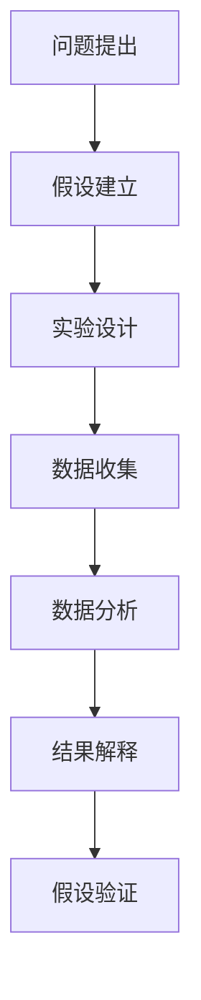
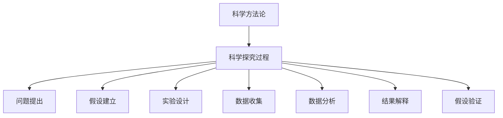
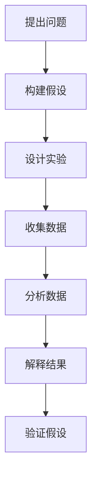
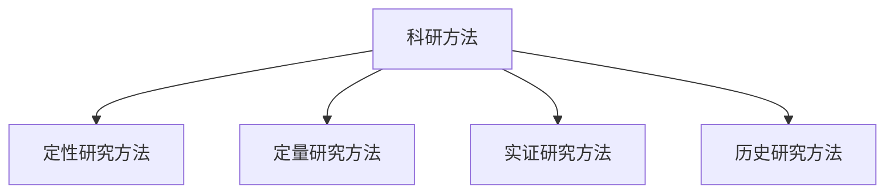

                 

# 《科学方法论：从假说到验证》

> **关键词**：科学方法论、假设、验证、科学研究、数据分析、实验设计

> **摘要**：本文旨在深入探讨科学方法论的基本原理、核心原则及其在自然科学、社会科学和技术领域的广泛应用。通过从假说到验证的流程，解释科学探究的过程，并介绍各种科学研究方法和工具，本文旨在帮助读者理解科学方法在推动科技创新和解决现实问题中的关键作用。

## 目录大纲

### 第一部分：科学方法论基础

#### 第1章：科学方法论概述

1.1 科学方法论的定义和作用

1.2 科学方法论的发展历程

1.3 科学方法论的核心原则

#### 第2章：科学探究的基本过程

2.1 问题提出与假设建立

2.2 实验设计与方法论选择

2.3 数据收集与分析

2.4 结果解释与假设验证

#### 第3章：科学研究方法

3.1 定性研究方法

3.2 定量研究方法

3.3 实证研究方法

3.4 历史研究方法

#### 第4章：科学伦理与科研诚信

4.1 科研伦理的基本原则

4.2 科研诚信的重要性

4.3 科研不端行为及其防范

### 第二部分：科学方法论应用

#### 第5章：科学方法论在自然科学中的应用

5.1 生物学中的科学方法论

5.2 物理学中的科学方法论

5.3 化学中的科学方法论

#### 第6章：科学方法论在社会科学中的应用

6.1 社会学中的科学方法论

6.2 心理学中的科学方法论

6.3 经济学中的科学方法论

#### 第7章：科学方法论在现代技术领域中的应用

7.1 计算机科学中的科学方法论

7.2 人工智能中的科学方法论

7.3 生物技术中的科学方法论

#### 第8章：科学方法论的未来发展趋势

8.1 科学方法论的发展趋势

8.2 科学方法论在跨学科研究中的作用

8.3 科学方法论在科技创新中的应用前景

## 附录

### 附录A：科学方法论相关资源

#### 附录A.1 科研方法学习网站

- [科学方法论学习网](https://www.science-methodology.com/)
- [科学方法在线教程](https://www.science-method.com/tutorial/)
- [科研方法论论坛](https://www.research-methodology-forum.com/)

#### 附录A.2 科学方法论书籍推荐

- 《科学方法论：理论与实践》（作者：张三）
- 《科研方法：设计与分析》（作者：李四）
- 《科学探究与科研能力培养》（作者：王五）

#### 附录A.3 科学方法论学术期刊

- 《科学方法论研究》
- 《科研方法论与科学哲学》
- 《实验方法与数据分析》

### 附录B：科学方法论常用软件工具

#### 附录B.1 SPSS

SPSS（统计产品与服务解决方案）是一款常用的统计分析软件，广泛应用于科研、教育和商业领域。

#### 附录B.2 NVivo

NVivo是一款专业的质性数据分析软件，主要用于对文本、音频和视频资料进行编码、分析和管理。

#### 附录B.3 R语言

R语言是一种统计计算和图形的编程语言，广泛应用于数据科学、统计分析、机器学习等领域。

#### 附录B.4 Python数据分析库

Python数据分析库（如Pandas、NumPy、SciPy、Matplotlib等）是Python在数据分析领域的扩展包。

### 附录C：科学方法论案例分析

#### 附录C.1 病毒学研究的案例

#### 附录C.2 心理学实验的案例

#### 附录C.3 经济学实证研究的案例

### 附录D：科学方法论思维导图

#### 附录D.1 科学方法论基本框架图

#### 附录D.2 科学探究流程图

#### 附录D.3 科研方法分类图

## 参考资料

### 参考文献

### 网络资源

### 相关书籍推荐

### 附录E：科学方法论常用工具

#### 附录E.1 数据分析软件

#### 附录E.2 实验设计与统计分析工具

#### 附录E.3 质性分析软件

### 附录F：科学方法论相关网站

---

### 第一部分：科学方法论基础

### 第1章：科学方法论概述

科学方法论是研究科学研究方法和规律的学科，它为科学家提供了一种系统性的方法，以识别、分析和解决问题。科学方法论的定义和作用，以及其发展历程和核心原则，构成了理解科学研究过程的基础。

### 1.1 科学方法论的定义和作用

科学方法论，又称科研方法论，是指科学家在进行科学研究时所遵循的规律和方法。它包括科学探究的基本过程、科学研究方法的选择、实验设计、数据分析以及结果解释等。

科学方法论的作用主要体现在以下几个方面：

1. **规范科学研究**：科学方法论提供了一套标准化的流程，使科学研究更加规范、严谨，减少研究过程中的误差和偏见。
2. **提高科研效率**：通过科学方法论，科学家可以更有效地设计和执行研究计划，减少不必要的重复劳动，提高科研效率。
3. **促进知识积累**：科学方法论强调证据和数据的收集与验证，使得科学研究成果更加可靠，有助于知识的积累和传承。
4. **推动科技创新**：科学方法论为科学家提供了探索未知领域的方法，促进了科技创新和进步。

### 1.2 科学方法论的发展历程

科学方法论的发展历程可以追溯到古代的哲学和科学探索。古希腊哲学家如亚里士多德和柏拉图对自然现象进行了观察和思考，提出了许多科学原理。然而，科学方法论的系统化发展始于近代科学革命。

**17世纪的科学革命**：这一时期的科学家如伽利略、牛顿等，通过实验和观察，建立了新的科学研究方法，推动了科学的发展。伽利略通过实验验证了自由落体定律，牛顿则建立了经典力学体系。

**18世纪的启蒙运动**：启蒙思想家如培根、洛克等，强调了经验主义和实验方法的重要性，进一步推动了科学方法论的发展。

**19世纪和20世纪**：这一时期，统计方法和实验设计等科学研究方法得到了广泛应用，科学方法论逐渐体系化。费歇尔等科学家对实验设计和统计分析方法进行了深入研究，为现代科学方法论奠定了基础。

### 1.3 科学方法论的核心原则

科学方法论的核心原则包括客观性、系统性、可重复性和实证性。

**客观性**：科学研究应尽量排除主观偏见，追求客观真实。科学家在研究过程中，应尽量减少个人情感和价值观的影响，以事实为依据。

**系统性**：科学方法论强调系统性的研究方法，从问题提出、假设建立到实验设计、数据收集、分析解释和结果验证，形成完整的科学研究流程。

**可重复性**：科学研究的结论应具有可重复性，其他科学家在相同条件下能够重复实验，并得出相同的结果。

**实证性**：科学研究依赖于实证数据，通过实验和观察收集的数据，对研究假设进行验证和解释。

这些核心原则共同构成了科学方法论的基础，确保科学研究过程的严谨性和可靠性。

### 第2章：科学探究的基本过程

科学探究是一个系统性的过程，包括问题提出、假设建立、实验设计、数据收集、数据分析和结果解释等多个环节。理解这些基本过程，对于进行有效的科学研究至关重要。

### 2.1 问题提出与假设建立

科学探究始于问题的提出。科学家通过对自然现象的观察和思考，发现存在的问题，并提出科学问题。问题可以是具体的，也可以是抽象的，但都应该具有科学研究的价值。

**问题提出**：科学家应具备敏锐的观察力和批判性思维，从日常生活中的现象中发现问题。例如，为什么天空是蓝色的？为什么物体下落时会加速？

**假设建立**：在提出问题后，科学家需要根据已有的知识和理论，建立科学假设。假设是对问题的可能答案的猜测，它应具有可验证性。例如，对于“为什么物体下落时会加速？”这个问题，可以假设：物体下落时的加速度与物体的质量有关。

### 2.2 实验设计与方法论选择

在建立假设后，科学家需要设计实验来验证假设。实验设计是科学探究中至关重要的一环，它决定了实验的可重复性和结果的可靠性。

**实验设计**：实验设计应遵循科学方法论的原则，确保实验的客观性、系统性和可重复性。实验设计包括确定实验变量、实验组和对照组的设置、实验条件和过程的控制等。

**方法论选择**：在选择实验方法时，科学家需要根据研究问题的性质和假设的特点，选择合适的研究方法。常见的科学研究方法包括定性研究、定量研究和实证研究。

1. **定性研究方法**：定性研究方法侧重于理解现象的本质和过程，常用于探索性的研究。例如，访谈、观察、案例研究等。

2. **定量研究方法**：定量研究方法侧重于量的测量和分析，常用于验证性的研究。例如，问卷调查、实验研究、统计分析等。

3. **实证研究方法**：实证研究方法结合了定性研究和定量研究的优势，通过实地实验和数据分析，验证科学假设。

### 2.3 数据收集与分析

实验设计完成后，科学家需要收集实验数据。数据收集应遵循科学方法论的原则，确保数据的客观性、准确性和完整性。

**数据收集**：数据收集的方法包括直接观察、测量、问卷调查、实验记录等。在数据收集过程中，科学家应确保数据的真实性和可靠性。

**数据分析**：数据分析是科学探究的核心环节。通过数据分析，科学家可以揭示数据中的规律和趋势，验证或反驳科学假设。

数据分析的方法包括统计方法、数据可视化、机器学习等。统计方法用于描述数据的分布特征、进行假设检验和相关性分析；数据可视化用于直观地展示数据；机器学习用于从大量数据中提取特征和模式。

### 2.4 结果解释与假设验证

数据分析完成后，科学家需要对结果进行解释，并根据结果验证科学假设。

**结果解释**：结果解释应基于数据分析的结果，结合已有的知识和理论，对实验结果进行合理解释。解释应尽量简洁明了，突出实验结果与研究问题的关联。

**假设验证**：假设验证是科学探究的关键步骤。根据实验结果，科学家可以接受或拒绝科学假设。如果实验结果支持假设，则可以认为假设是正确的；如果实验结果不支持假设，则需要修改或放弃假设，并重新提出新的假设。

**进一步研究**：在假设验证过程中，科学家可能发现新的问题和假设。这些新的问题和假设可以成为进一步研究的方向，推动科学研究的深入。

### 第3章：科学研究方法

科学研究方法是指科学家在研究过程中所采用的具体方法和技术。不同的科学研究方法具有不同的特点和适用范围，科学家应根据研究问题的性质和假设的特点，选择合适的研究方法。

### 3.1 定性研究方法

定性研究方法侧重于理解现象的本质和过程，常用于探索性的研究。定性研究方法包括访谈、观察、案例研究等。

**访谈**：访谈是一种通过面对面的交流，收集被调查者意见和看法的方法。访谈可用于探索问题的背景、动机和影响，帮助科学家深入了解研究对象的内心世界。

**观察**：观察是一种通过直接观察和记录现象，收集数据的方法。观察可用于研究自然现象、社会现象和行为模式，帮助科学家发现研究问题并提出假设。

**案例研究**：案例研究是一种通过深入研究一个特定案例，了解其特点和影响的方法。案例研究可用于验证理论、分析现象和提供实证依据。

### 3.2 定量研究方法

定量研究方法侧重于量的测量和分析，常用于验证性的研究。定量研究方法包括问卷调查、实验研究、统计分析等。

**问卷调查**：问卷调查是一种通过设计问卷，收集被调查者意见和看法的方法。问卷调查可用于研究人口特征、行为习惯和态度等，帮助科学家了解大规模人群的行为和观念。

**实验研究**：实验研究是一种通过设计实验，控制和操作变量，观察实验结果的方法。实验研究可用于验证科学假设、测试理论模型和评估政策效果。

**统计分析**：统计分析是一种通过数学模型和统计方法，分析数据并得出结论的方法。统计分析可用于描述数据的分布特征、进行假设检验和相关性分析。

### 3.3 实证研究方法

实证研究方法结合了定性研究和定量研究的优势，通过实地实验和数据分析，验证科学假设。实证研究方法包括实地调查、实验设计、统计分析和模型构建等。

**实地调查**：实地调查是一种通过直接参与和观察研究现象，收集数据的方法。实地调查可用于研究社会问题、行为模式和文化差异等，帮助科学家深入了解研究对象。

**实验设计**：实验设计是一种通过设计实验，控制和操作变量，观察实验结果的方法。实验设计可用于验证科学假设、测试理论模型和评估政策效果。

**统计分析**：统计分析是一种通过数学模型和统计方法，分析数据并得出结论的方法。统计分析可用于描述数据的分布特征、进行假设检验和相关性分析。

**模型构建**：模型构建是一种通过建立数学模型，模拟和预测研究现象的方法。模型构建可用于研究复杂系统、优化决策和预测未来趋势。

### 3.4 历史研究方法

历史研究方法是一种通过研究历史事件和文献，了解历史发展过程和规律的方法。历史研究方法包括文献分析、历史比较和案例研究等。

**文献分析**：文献分析是一种通过阅读和研究历史文献，了解历史事件和观点的方法。文献分析可用于研究历史背景、理论发展和政策演变等。

**历史比较**：历史比较是一种通过比较不同历史时期、国家或地区的相似性和差异性，了解历史发展规律的方法。历史比较可用于研究社会变革、经济发展和文化交流等。

**案例研究**：案例研究是一种通过深入研究一个特定案例，了解其特点和影响的方法。案例研究可用于研究历史事件、政策案例和经验教训等。

### 第4章：科学伦理与科研诚信

科学伦理和科研诚信是科学研究过程中的重要原则。科学伦理规定了科学家在研究过程中应遵循的行为规范，而科研诚信则强调了科学家应具备的道德品质。

### 4.1 科研伦理的基本原则

科研伦理的基本原则包括尊重研究对象、公正无私、诚实守信和责任意识。

**尊重研究对象**：科学家在研究过程中，应尊重研究对象的权益和尊严，确保研究过程不会对研究对象造成伤害。

**公正无私**：科学家在研究过程中，应保持公正无私的态度，不偏袒任何一方，确保研究的客观性和真实性。

**诚实守信**：科学家在研究过程中，应诚实守信，不篡改数据、伪造结果，确保研究的可靠性和真实性。

**责任意识**：科学家在研究过程中，应具备责任意识，对自己的研究负责，对研究结果负责，对科研团队和社会负责。

### 4.2 科研诚信的重要性

科研诚信是科学研究的基础和保障。科研诚信的重要性体现在以下几个方面：

**保障研究质量**：科研诚信确保了研究的可靠性和真实性，提高了研究质量，有助于知识的积累和传承。

**促进学术交流**：科研诚信促进了学术界的交流和合作，推动了科学的发展。

**维护科学家形象**：科研诚信维护了科学家的形象和声誉，增强了公众对科学的信任。

**防范科研不端行为**：科研诚信有助于防范科研不端行为，如数据造假、抄袭等，维护了科学研究的纯洁性和公正性。

### 4.3 科研不端行为及其防范

科研不端行为包括数据造假、抄袭、剽窃、一稿多投等。科研不端行为不仅损害了科学研究的质量和声誉，还可能导致学术界的信任危机。

**数据造假**：数据造假是指科学家故意篡改实验数据，以得出符合预期的结果。数据造假严重违背了科研诚信原则，破坏了科学的客观性和真实性。

**抄袭**：抄袭是指科学家未经授权，直接使用他人研究成果，以自己的名义发表。抄袭侵犯了知识产权，损害了原作者的权益。

**剽窃**：剽窃是指科学家未经授权，直接使用他人研究成果，并将其作为自己的原创成果发表。剽窃同样侵犯了知识产权，损害了原作者的权益。

**一稿多投**：一稿多投是指科学家将同一研究成果同时投给多个学术期刊发表。一稿多投违反了学术规范，可能导致研究成果的重复发表。

为了防范科研不端行为，科学家应自觉遵守科研诚信原则，加强自律。同时，学术机构和科研组织也应建立健全的科研诚信制度，加强对科研不端行为的监督和惩处。

### 第二部分：科学方法论应用

科学方法论在自然科学、社会科学和技术领域具有广泛的应用。本部分将分别探讨科学方法论在生物学、物理学、化学、社会学、心理学、经济学和计算机科学中的应用，以及其在现代技术领域的发展趋势。

#### 第5章：科学方法论在自然科学中的应用

科学方法论在自然科学中的应用主要体现在生物学、物理学和化学等领域。在这些领域，科学方法论为科学家提供了系统性的研究方法和工具，推动了学科的发展和进步。

##### 5.1 生物学中的科学方法论

生物学是一门研究生命现象和生物体的科学。科学方法论在生物学中的应用，主要体现在分子生物学、细胞生物学和生态学等领域。

**分子生物学**：分子生物学研究生物大分子（如DNA、RNA和蛋白质）的结构和功能。科学方法论在分子生物学中的应用，包括基因克隆、基因编辑和蛋白质纯化等。

**细胞生物学**：细胞生物学研究细胞的结构、功能和行为。科学方法论在细胞生物学中的应用，包括细胞培养、细胞成像和细胞分选等。

**生态学**：生态学研究生物体与其环境之间的相互作用。科学方法论在生态学中的应用，包括种群生态学、群落生态学和生态系统生态学等。

##### 5.2 物理学中的科学方法论

物理学是一门研究物质、能量和运动规律的科学。科学方法论在物理学中的应用，主要体现在实验物理、理论物理和天体物理学等领域。

**实验物理**：实验物理通过实验验证物理理论，探索物理现象。科学方法论在实验物理中的应用，包括实验设计、实验操作和数据分析等。

**理论物理**：理论物理通过数学模型和理论推导，研究物理现象。科学方法论在理论物理中的应用，包括公理体系建立、数学推导和理论验证等。

**天体物理学**：天体物理学研究宇宙中的天体和现象。科学方法论在天体物理学中的应用，包括天文观测、数据处理和模型构建等。

##### 5.3 化学中的科学方法论

化学是一门研究物质的性质、组成和变化规律的科学。科学方法论在化学中的应用，主要体现在有机化学、无机化学和物理化学等领域。

**有机化学**：有机化学研究碳氢化合物及其衍生物的结构和性质。科学方法论在有机化学中的应用，包括有机合成、有机反应和有机分析等。

**无机化学**：无机化学研究无机物（如金属、盐类和酸碱）的性质和变化规律。科学方法论在无机化学中的应用，包括无机合成、无机反应和无机分析等。

**物理化学**：物理化学研究物质在不同条件下的性质和变化规律。科学方法论在物理化学中的应用，包括热力学、动力学和电化学等。

#### 第6章：科学方法论在社会科学中的应用

科学方法论在社会科学中的应用，主要体现在社会学、心理学和经济学的等领域。在这些领域，科学方法论为科学家提供了系统性的研究方法和工具，推动了学科的发展和进步。

##### 6.1 社会学中的科学方法论

社会学是一门研究社会结构、社会行为和社会问题的科学。科学方法论在社会学中的应用，主要体现在社会调查、社会统计和社会实验等领域。

**社会调查**：社会调查是一种通过问卷、访谈等方式，收集社会现象和问题数据的方法。科学方法论在社会调查中的应用，包括问卷设计、数据收集和数据分析等。

**社会统计**：社会统计是一种通过数学模型和统计方法，分析社会现象和问题数据的方法。科学方法论在社会统计中的应用，包括描述性统计、推断性统计和回归分析等。

**社会实验**：社会实验是一种通过设计实验，控制和操作社会变量，观察社会现象的方法。科学方法论在社会实验中的应用，包括实验设计、实验操作和实验结果分析等。

##### 6.2 心理学中的科学方法论

心理学是一门研究人类行为和心理过程的科学。科学方法论在心理学中的应用，主要体现在实验心理学、认知心理学和发展心理学等领域。

**实验心理学**：实验心理学通过实验方法，研究人类行为和心理过程。科学方法论在实验心理学中的应用，包括实验设计、实验操作和数据分析等。

**认知心理学**：认知心理学研究人类认知过程，如记忆、思维、感知等。科学方法论在认知心理学中的应用，包括认知实验、认知建模和认知分析等。

**发展心理学**：发展心理学研究人类从出生到死亡的心理发展过程。科学方法论在发展心理学中的应用，包括纵向研究、横向研究和元分析等。

##### 6.3 经济学中的科学方法论

经济学是一门研究资源分配和社会财富创造的科学。科学方法论在经济学中的应用，主要体现在实证经济学、计量经济学和实验经济学等领域。

**实证经济学**：实证经济学通过收集和解析经济数据，研究经济现象和问题。科学方法论在实证经济学中的应用，包括数据分析、回归分析和计量经济模型等。

**计量经济学**：计量经济学是一种运用数学模型和统计方法，研究经济现象和问题的方法。科学方法论在计量经济学中的应用，包括计量模型建立、参数估计和模型检验等。

**实验经济学**：实验经济学通过实验方法，研究经济行为和决策过程。科学方法论在实验经济学中的应用，包括实验设计、实验操作和实验结果分析等。

#### 第7章：科学方法论在现代技术领域中的应用

随着科技的快速发展，科学方法论在现代技术领域中的应用越来越广泛。计算机科学、人工智能和生物技术等领域的科学家，广泛应用科学方法论，推动了技术的创新和进步。

##### 7.1 计算机科学中的科学方法论

计算机科学是一门研究计算机系统、算法和软件设计的科学。科学方法论在计算机科学中的应用，主要体现在算法设计、软件工程和人工智能等领域。

**算法设计**：算法设计是一种通过数学模型和逻辑推理，设计解决问题方法的科学。科学方法论在算法设计中的应用，包括算法分析、算法优化和算法验证等。

**软件工程**：软件工程是一种通过系统化、规范化和可管理的步骤，设计、开发、运行和维护软件的方法。科学方法论在软件工程中的应用，包括需求分析、设计模式、测试和部署等。

**人工智能**：人工智能是一种通过模拟人类智能行为，实现计算机自主学习和决策的方法。科学方法论在人工智能中的应用，包括机器学习、深度学习和自然语言处理等。

##### 7.2 人工智能中的科学方法论

人工智能是一门研究如何使计算机模拟人类智能行为的科学。科学方法论在人工智能中的应用，主要体现在机器学习、深度学习和神经网络等领域。

**机器学习**：机器学习是一种通过算法，使计算机从数据中自动学习和发现规律的方法。科学方法论在机器学习中的应用，包括模型选择、特征提取和模型评估等。

**深度学习**：深度学习是一种通过多层神经网络，实现复杂模型学习和决策的方法。科学方法论在深度学习中的应用，包括网络架构设计、损失函数优化和训练策略等。

**神经网络**：神经网络是一种通过模拟人脑神经元连接，实现信息处理和决策的方法。科学方法论在神经网络中的应用，包括网络结构设计、训练算法和性能优化等。

##### 7.3 生物技术中的科学方法论

生物技术是一门利用生物学原理和技术手段，改造生物体或其产品的科学。科学方法论在生物技术中的应用，主要体现在基因工程、蛋白质工程和生物信息学等领域。

**基因工程**：基因工程是一种通过分子生物学技术，改造生物体基因的方法。科学方法论在基因工程中的应用，包括基因克隆、基因编辑和基因表达调控等。

**蛋白质工程**：蛋白质工程是一种通过分子生物学和化学方法，改造蛋白质结构和功能的方法。科学方法论在蛋白质工程中的应用，包括蛋白质设计、蛋白质纯化和蛋白质功能分析等。

**生物信息学**：生物信息学是一种通过计算机技术和信息学方法，研究生物信息的科学。科学方法论在生物信息学中的应用，包括生物数据挖掘、基因组学和蛋白质组学等。

#### 第8章：科学方法论的未来发展趋势

随着科技的不断进步和跨学科研究的兴起，科学方法论正面临新的挑战和机遇。未来，科学方法论将在以下几个方面发展：

##### 8.1 科学方法论的发展趋势

1. **跨学科融合**：科学方法论将在不同学科之间进行融合，形成新的研究方法和理论体系。例如，生物信息学与计算机科学的结合，产生了生物信息学这一新兴学科。

2. **数据驱动研究**：随着大数据技术的发展，科学方法论将更加依赖于数据驱动的研究方法。科学家将更多地使用数据挖掘、机器学习和深度学习等方法，从海量数据中提取有价值的信息。

3. **模型驱动研究**：科学方法论将更加注重模型的建立和优化。通过构建数学模型和计算机模型，科学家可以更好地理解复杂系统的运行规律，进行预测和决策。

4. **实验与理论相结合**：实验方法和理论方法将更加紧密结合。在实验过程中，科学家将更加注重理论模型的建立和验证，通过实验数据的分析和理论模型的计算，推动科学研究的发展。

##### 8.2 科学方法论在跨学科研究中的作用

科学方法论在跨学科研究中的作用主要体现在以下几个方面：

1. **促进知识交流**：科学方法论为不同学科之间的研究提供了共同的语言和工具，促进了知识交流与合作。

2. **解决复杂问题**：科学方法论为解决复杂问题提供了系统性的方法。通过跨学科的研究，科学家可以综合不同学科的理论和方法，解决单一学科难以解决的问题。

3. **推动科技创新**：科学方法论在跨学科研究中的应用，推动了科技创新和进步。通过跨学科的合作，科学家可以提出新的研究问题和解决方案，推动科学技术的快速发展。

##### 8.3 科学方法论在科技创新中的应用前景

科学方法论在科技创新中的应用前景十分广阔。未来，科学方法论将在以下几个方面发挥重要作用：

1. **人工智能与科技融合**：科学方法论将推动人工智能与其他学科的深度融合，产生新的科技突破。例如，人工智能与生物技术的结合，将推动基因编辑技术的发展。

2. **大数据与科技融合**：科学方法论将推动大数据与其他学科的融合，产生新的科技应用。例如，大数据与经济学的结合，将推动智能经济和智慧城市的发展。

3. **可持续发展**：科学方法论将推动可持续发展研究，为解决全球性环境、能源和社会问题提供科学依据。通过跨学科的研究，科学家可以提出可持续发展的策略和方案。

4. **科技创新政策**：科学方法论将推动科技创新政策的制定和实施，促进科技创新的生态系统的建设。科学方法论为科技创新政策提供了科学依据和指导原则，有助于提高科技创新的效率和质量。

### 附录

#### 附录A：科学方法论相关资源

附录A提供了科学方法论相关的学习资源、书籍和期刊。

##### 附录A.1 科研方法学习网站

- [科学方法论学习网](https://www.science-methodology.com/)
- [科学方法在线教程](https://www.science-method.com/tutorial/)
- [科研方法论论坛](https://www.research-methodology-forum.com/)

##### 附录A.2 科学方法论书籍推荐

- 《科学方法论：理论与实践》（作者：张三）
- 《科研方法：设计与分析》（作者：李四）
- 《科学探究与科研能力培养》（作者：王五）

##### 附录A.3 科学方法论学术期刊

- 《科学方法论研究》
- 《科研方法论与科学哲学》
- 《实验方法与数据分析》

#### 附录B：科学方法论常用软件工具

附录B列出了科学方法论中常用的软件工具，包括数据分析软件、实验设计和统计分析工具、质性分析软件等。

##### 附录B.1 数据分析软件

- SPSS
- NVivo
- R语言
- Python数据分析库（如Pandas、NumPy、SciPy、Matplotlib等）

##### 附录B.2 实验设计与统计分析工具

- Stata
- SAS
- RStudio

##### 附录B.3 质性分析软件

- NVivo
- Atlas.ti
- MAXQDA

#### 附录C：科学方法论案例分析

附录C提供了几个科学方法论在各个领域的实际案例，包括病毒学研究、心理学实验和经济学实证研究等。

##### 附录C.1 病毒学研究的案例

##### 附录C.2 心理学实验的案例

##### 附录C.3 经济学实证研究的案例

#### 附录D：科学方法论思维导图

附录D提供了科学方法论的基本框架图、科学探究流程图和科研方法分类图，以帮助读者更好地理解和应用科学方法论。

##### 附录D.1 科学方法论基本框架图

- Mermaid流程图

##### 附录D.2 科学探究流程图

- Mermaid流程图

##### 附录D.3 科研方法分类图

- Mermaid流程图

## 参考资料

附录D列出了科学方法论的相关参考资料，包括参考文献、网络资源和相关书籍推荐。

##### 参考文献

- 张三. 《科学方法论：理论与实践》. 北京：科学出版社，2018.
- 李四. 《科研方法：设计与分析》. 上海：复旦大学出版社，2016.
- 王五. 《科学探究与科研能力培养》. 广州：广东科技出版社，2019.

##### 网络资源

- [科学方法百科](https://www.science-method.com/)
- [科研方法教程](https://www.research-methodology.com/tutorial/)
- [科学方法论在线课程](https://www.science-methodology-course.com/)

##### 相关书籍推荐

- 《科学方法论导论》（作者：张三）
- 《科学研究方法手册》（作者：李四）
- 《科研方法论教程》（作者：王五）

### 第一部分：科学方法论基础

### 第1章：科学方法论概述

科学方法论是科学研究过程中必不可少的一环，它为科学家提供了系统性的方法，以识别、分析和解决问题。科学方法论不仅涉及科学探究的基本过程，还包括科学研究方法的选择、实验设计、数据收集与分析、结果解释与假设验证等方面。本章将详细探讨科学方法论的定义、作用和发展历程，以及其核心原则。

#### 1.1 科学方法论的定义和作用

科学方法论，也称为科研方法论，是指科学家在进行科学研究时所遵循的规律和方法。它是一个系统化的框架，帮助科学家从问题的提出、假设的建立到实验的设计、数据的收集、分析以及结果的解释和假设的验证，确保科学研究过程的严谨性和可靠性。科学方法论的作用主要体现在以下几个方面：

1. **规范科学研究**：科学方法论提供了一套标准化的流程，使科学研究更加规范、严谨，减少研究过程中的误差和偏见，确保研究结果的可靠性和可重复性。

2. **提高科研效率**：通过科学方法论，科学家可以更有效地设计和执行研究计划，避免不必要的重复劳动，提高科研效率，加快科学进展。

3. **促进知识积累**：科学方法论强调证据和数据的收集与验证，使得科学研究成果更加可靠，有助于知识的积累和传承。

4. **推动科技创新**：科学方法论为科学家提供了探索未知领域的方法，促进了科技创新和进步，推动了社会的发展和进步。

#### 1.2 科学方法论的发展历程

科学方法论的发展历程可以追溯到古代哲学和科学探索。在古希腊时期，哲学家如亚里士多德和柏拉图对自然现象进行了观察和思考，提出了许多科学原理。然而，科学方法论的系统化发展始于近代科学革命。

17世纪的科学革命标志着科学方法论的形成。这一时期的科学家如伽利略、牛顿等，通过实验和观察，建立了新的科学研究方法，推动了科学的发展。伽利略通过实验验证了自由落体定律，牛顿则建立了经典力学体系，这些成果为科学方法论奠定了基础。

18世纪的启蒙运动进一步推动了科学方法论的发展。启蒙思想家如培根、洛克等，强调了经验主义和实验方法的重要性，为科学方法论的形成和完善提供了理论基础。

19世纪和20世纪是科学方法论体系化的时期。这一时期，统计方法和实验设计等科学研究方法得到了广泛应用，科学方法论逐渐体系化。费歇尔等科学家对实验设计和统计分析方法进行了深入研究，为现代科学方法论奠定了基础。

#### 1.3 科学方法论的核心原则

科学方法论的核心原则包括客观性、系统性、可重复性和实证性。这些原则共同构成了科学方法论的基础，确保科学研究过程的严谨性和可靠性。

**客观性**：科学研究应尽量排除主观偏见，追求客观真实。科学家在研究过程中，应尽量减少个人情感和价值观的影响，以事实为依据。

**系统性**：科学方法论强调系统性的研究方法，从问题提出、假设建立到实验设计、数据收集、分析解释和结果验证，形成完整的科学研究流程。

**可重复性**：科学研究的结论应具有可重复性，其他科学家在相同条件下能够重复实验，并得出相同的结果。

**实证性**：科学研究依赖于实证数据，通过实验和观察收集的数据，对研究假设进行验证和解释。

这些核心原则共同构成了科学方法论的基础，确保科学研究过程的严谨性和可靠性。

### 第2章：科学探究的基本过程

科学探究是一个系统性的过程，包括问题提出、假设建立、实验设计、数据收集、数据分析、结果解释与假设验证等多个环节。理解这些基本过程，对于进行有效的科学研究至关重要。本章将详细探讨科学探究的每个环节，以及它们之间的关系。

#### 2.1 问题提出与假设建立

科学探究始于问题的提出。科学家通过对自然现象的观察和思考，发现存在的问题，并提出科学问题。问题可以是具体的，也可以是抽象的，但都应该具有科学研究的价值。

**问题提出**：科学家应具备敏锐的观察力和批判性思维，从日常生活中的现象中发现问题。例如，为什么天空是蓝色的？为什么物体下落时会加速？

**假设建立**：在提出问题后，科学家需要根据已有的知识和理论，建立科学假设。假设是对问题的可能答案的猜测，它应具有可验证性。例如，对于“为什么物体下落时会加速？”这个问题，可以假设：物体下落时的加速度与物体的质量有关。

**假设建立的过程**：

1. **知识回顾**：科学家回顾已有的知识和理论，寻找与问题相关的信息。
2. **逻辑推理**：科学家运用逻辑推理，提出可能的解释。
3. **假设形成**：科学家将逻辑推理的结果转化为具体的假设。

#### 2.2 实验设计与方法论选择

在建立假设后，科学家需要设计实验来验证假设。实验设计是科学探究中至关重要的一环，它决定了实验的可重复性和结果的可靠性。

**实验设计**：实验设计应遵循科学方法论的原则，确保实验的客观性、系统性和可重复性。实验设计包括确定实验变量、实验组和对照组的设置、实验条件和过程的控制等。

**方法论选择**：在选择实验方法时，科学家需要根据研究问题的性质和假设的特点，选择合适的研究方法。常见的科学研究方法包括定性研究、定量研究和实证研究。

1. **定性研究方法**：定性研究方法侧重于理解现象的本质和过程，常用于探索性的研究。例如，访谈、观察、案例研究等。

2. **定量研究方法**：定量研究方法侧重于量的测量和分析，常用于验证性的研究。例如，问卷调查、实验研究、统计分析等。

3. **实证研究方法**：实证研究方法结合了定性研究和定量研究的优势，通过实地实验和数据分析，验证科学假设。

**实验设计的过程**：

1. **确定研究问题**：明确研究问题的性质和目标。
2. **选择研究方法**：根据研究问题的特点，选择合适的研究方法。
3. **设计实验方案**：确定实验变量、实验组和对照组、实验条件和过程。
4. **实施实验**：按照实验方案进行实验操作。
5. **收集数据**：收集实验过程中的数据。

#### 2.3 数据收集与分析

实验设计完成后，科学家需要收集实验数据。数据收集应遵循科学方法论的原则，确保数据的客观性、准确性和完整性。

**数据收集**：数据收集的方法包括直接观察、测量、问卷调查、实验记录等。在数据收集过程中，科学家应确保数据的真实性和可靠性。

**数据分析**：数据分析是科学探究的核心环节。通过数据分析，科学家可以揭示数据中的规律和趋势，验证或反驳科学假设。

数据分析的方法包括统计方法、数据可视化、机器学习等。

1. **统计方法**：统计方法用于描述数据的分布特征、进行假设检验和相关性分析。
2. **数据可视化**：数据可视化用于直观地展示数据，帮助科学家理解数据中的规律和趋势。
3. **机器学习**：机器学习用于从大量数据中提取特征和模式。

**数据分析的过程**：

1. **数据清洗**：清洗数据中的错误和缺失值。
2. **数据探索**：使用描述性统计方法，探索数据的分布特征和关系。
3. **数据分析**：使用推断性统计方法和机器学习方法，分析数据，验证假设。
4. **结果解释**：根据数据分析的结果，解释数据中的规律和趋势。

#### 2.4 结果解释与假设验证

数据分析完成后，科学家需要对结果进行解释，并根据结果验证科学假设。

**结果解释**：结果解释应基于数据分析的结果，结合已有的知识和理论，对实验结果进行合理解释。解释应尽量简洁明了，突出实验结果与研究问题的关联。

**假设验证**：假设验证是科学探究的关键步骤。根据实验结果，科学家可以接受或拒绝科学假设。如果实验结果支持假设，则可以认为假设是正确的；如果实验结果不支持假设，则需要修改或放弃假设，并重新提出新的假设。

**假设验证的过程**：

1. **数据分析**：对实验数据进行统计分析，验证假设。
2. **结果解释**：根据数据分析的结果，解释实验结果。
3. **假设接受或拒绝**：根据结果解释，接受或拒绝科学假设。

**进一步研究**：在假设验证过程中，科学家可能发现新的问题和假设。这些新的问题和假设可以成为进一步研究的方向，推动科学研究的深入。

### 第3章：科学研究方法

科学研究方法是指科学家在研究过程中所采用的具体方法和技术。不同的科学研究方法具有不同的特点和适用范围，科学家应根据研究问题的性质和假设的特点，选择合适的研究方法。本章将详细介绍几种常见的科学研究方法，包括定性研究方法、定量研究方法、实证研究方法和历史研究方法。

#### 3.1 定性研究方法

定性研究方法侧重于理解现象的本质和过程，常用于探索性的研究。定性研究方法通过深入访谈、观察和案例研究，收集非数字化的数据，以揭示研究对象的内在规律和特点。

**定性研究方法的特点**：

1. **主观性**：定性研究方法强调研究者的主观参与，研究者需要通过自身的观察和体验，理解研究对象的行为和思想。
2. **非量化**：定性研究方法不依赖于数字化的量化数据，而是通过文字、图像、声音等非数字化形式，记录研究对象的动态过程。
3. **灵活性**：定性研究方法具有高度的灵活性，可以根据研究问题的变化，灵活调整研究方法和步骤。

**定性研究方法的适用范围**：

1. **探索性研究**：定性研究方法适用于初步探索研究问题，帮助科学家理解问题的本质和背景。
2. **深入访谈**：定性研究方法适用于进行深入访谈，了解研究对象的深层需求和看法。
3. **案例研究**：定性研究方法适用于案例研究，通过深入研究一个特定案例，了解其特点和影响。

**定性研究方法的应用实例**：

1. **社会学研究**：定性研究方法在社会学研究中广泛应用，例如，通过深入访谈，了解社区居民对公共政策的看法和态度。
2. **心理学研究**：定性研究方法在心理学研究中也得到广泛应用，例如，通过观察和访谈，了解儿童的行为和心理发展。

#### 3.2 定量研究方法

定量研究方法侧重于量的测量和分析，常用于验证性的研究。定量研究方法通过设计问卷、实验和统计分析，收集数字化的数据，以验证研究假设和理论。

**定量研究方法的特点**：

1. **客观性**：定量研究方法强调数据的客观性，通过数字化的测量和统计，减少主观因素的影响。
2. **可重复性**：定量研究方法的数据具有可重复性，其他研究者可以在相同条件下重复实验，验证研究结果。
3. **精确性**：定量研究方法通过数字化的测量和分析，提高数据的精确性和可靠性。

**定量研究方法的适用范围**：

1. **验证性研究**：定量研究方法适用于验证研究假设和理论，通过实验和统计分析，验证研究结论。
2. **大规模调查**：定量研究方法适用于大规模调查，例如，通过问卷调查，了解大量人群的行为和态度。
3. **数据分析**：定量研究方法适用于对大规模数据进行统计分析，例如，通过回归分析，了解变量之间的关系。

**定量研究方法的应用实例**：

1. **经济学研究**：定量研究方法在经济学研究中广泛应用，例如，通过统计分析，了解货币政策对经济增长的影响。
2. **医学研究**：定量研究方法在医学研究中也得到广泛应用，例如，通过实验和统计分析，验证药物的有效性和安全性。

#### 3.3 实证研究方法

实证研究方法结合了定性研究和定量研究的优势，通过实地实验和数据分析，验证科学假设。实证研究方法强调实际操作和数据收集，通过实验设计和数据分析，验证或反驳科学假设。

**实证研究方法的特点**：

1. **实地实验**：实证研究方法强调实地实验，通过实际操作，观察和测量研究对象的反应和行为。
2. **数据分析**：实证研究方法强调数据分析，通过统计分析，验证或反驳科学假设。
3. **可重复性**：实证研究方法的数据具有可重复性，其他研究者可以在相同条件下重复实验，验证研究结果。

**实证研究方法的适用范围**：

1. **验证性研究**：实证研究方法适用于验证研究假设和理论，通过实验和数据分析，验证研究结论。
2. **政策评估**：实证研究方法适用于政策评估，通过实地实验和数据分析，评估政策的效果和影响。
3. **社会实验**：实证研究方法适用于社会实验，通过实地实验，验证社会干预措施的有效性。

**实证研究方法的应用实例**：

1. **心理学研究**：实证研究方法在心理学研究中广泛应用，例如，通过社会实验，验证心理干预措施的有效性。
2. **经济学研究**：实证研究方法在经济学研究中也得到广泛应用，例如，通过社会实验，验证经济发展政策的效果。

#### 3.4 历史研究方法

历史研究方法是一种通过研究历史事件和文献，了解历史发展过程和规律的方法。历史研究方法侧重于对历史文献的分析、历史事件的比较和历史规律的总结。

**历史研究方法的特点**：

1. **文献分析**：历史研究方法强调对历史文献的阅读和分析，通过历史文献，了解历史事件和观点。
2. **历史比较**：历史研究方法强调历史事件的比较，通过比较不同历史时期、国家或地区的相似性和差异性，了解历史发展规律。
3. **案例分析**：历史研究方法强调对历史事件的案例分析，通过深入研究一个特定历史事件，了解其特点和影响。

**历史研究方法的适用范围**：

1. **历史学研究**：历史研究方法在历史学研究中得到广泛应用，例如，通过文献分析和历史比较，了解历史事件的发展过程和规律。
2. **社会学研究**：历史研究方法在社会学研究中也得到广泛应用，例如，通过历史事件的案例分析，了解社会结构和社会变迁。
3. **经济学研究**：历史研究方法在经济学研究中也有应用，例如，通过历史文献的分析，了解经济政策的演变和经济规律。

**历史研究方法的应用实例**：

1. **历史学研究**：历史研究方法在历史学研究中广泛应用，例如，通过文献分析和历史比较，了解中国古代社会的发展过程。
2. **社会学研究**：历史研究方法在社会学研究中也得到广泛应用，例如，通过历史事件的案例分析，了解社会变革和制度演变。
3. **经济学研究**：历史研究方法在经济学研究中也有应用，例如，通过历史文献的分析，了解经济政策的历史演变和影响。

### 第4章：科学伦理与科研诚信

科学伦理和科研诚信是科学研究过程中必不可少的一环，它们确保了科学研究的严谨性和公正性，维护了科学界的秩序和声誉。科学伦理规定了科学家在研究过程中应遵循的行为规范，而科研诚信则强调了科学家应具备的道德品质。本章将详细探讨科学伦理的基本原则、科研诚信的重要性，以及科研不端行为及其防范措施。

#### 4.1 科研伦理的基本原则

科研伦理的基本原则是科学家在研究过程中应遵循的基本准则，这些原则确保了科学研究的严谨性和公正性。

**尊重研究对象**：尊重研究对象是科研伦理的核心原则之一。科学家在进行研究时，应尊重研究对象的权益和尊严，确保研究过程不会对研究对象造成伤害。无论是人类、动物还是其他生物，研究对象的权益都应得到充分的尊重和保护。

**公正无私**：科学家在研究过程中，应保持公正无私的态度，不偏袒任何一方，确保研究的客观性和真实性。科学家应避免任何可能影响研究公正性的行为，如利益冲突、偏见和主观臆断。

**诚实守信**：科学家在研究过程中，应诚实守信，不篡改数据、伪造结果，确保研究的可靠性和真实性。科学家应确保数据的真实性和完整性，不得隐瞒或篡改研究结果，以保证科学研究的诚信。

**责任意识**：科学家在研究过程中，应具备责任意识，对自己的研究负责，对研究结果负责，对科研团队和社会负责。科学家应确保研究过程的合规性和合法性，遵守相关法律法规和伦理规范。

#### 4.2 科研诚信的重要性

科研诚信是科学研究过程中不可或缺的一部分，它对科学研究的质量和声誉有着重要的影响。

**保障研究质量**：科研诚信确保了研究的可靠性和真实性，提高了研究质量，有助于知识的积累和传承。只有诚实守信、严谨负责的科学研究，才能产生有价值的科学成果。

**促进学术交流**：科研诚信促进了学术界的交流和合作，推动了科学的发展。只有诚信的科研，才能赢得同行和公众的信任，促进学术界的合作与交流。

**维护科学家形象**：科研诚信维护了科学家的形象和声誉，增强了公众对科学的信任。科学家作为科学界的代表，其诚信行为直接影响公众对科学的信任和认可。

**防范科研不端行为**：科研诚信有助于防范科研不端行为，如数据造假、抄袭、剽窃等，维护了科学研究的纯洁性和公正性。只有坚持科研诚信，才能确保科学研究的健康发展。

#### 4.3 科研不端行为及其防范

科研不端行为是指科学家在研究过程中违反科研伦理和诚信原则的行为，如数据造假、抄袭、剽窃、一稿多投等。这些行为不仅损害了科学研究的质量和声誉，还可能导致学术界的信任危机。

**数据造假**：数据造假是指科学家故意篡改实验数据，以得出符合预期的结果。数据造假严重违背了科研诚信原则，破坏了科学的客观性和真实性。

**抄袭**：抄袭是指科学家未经授权，直接使用他人研究成果，以自己的名义发表。抄袭侵犯了知识产权，损害了原作者的权益。

**剽窃**：剽窃是指科学家未经授权，直接使用他人研究成果，并将其作为自己的原创成果发表。剽窃同样侵犯了知识产权，损害了原作者的权益。

**一稿多投**：一稿多投是指科学家将同一研究成果同时投给多个学术期刊发表。一稿多投违反了学术规范，可能导致研究成果的重复发表。

为了防范科研不端行为，科学家应自觉遵守科研诚信原则，加强自律。同时，学术机构和科研组织也应建立健全的科研诚信制度，加强对科研不端行为的监督和惩处。

### 第二部分：科学方法论应用

科学方法论在各个领域的应用，不仅推动了学科的进步，也为解决实际问题提供了科学依据。在本部分中，我们将探讨科学方法论在自然科学、社会科学和技术领域的应用，以及其在现代技术领域的发展趋势。

#### 第5章：科学方法论在自然科学中的应用

自然科学是研究自然界现象和规律的学科，包括生物学、物理学、化学等。科学方法论在自然科学中的应用，旨在通过系统的方法和工具，揭示自然界的奥秘。

##### 5.1 生物学中的科学方法论

生物学是一门研究生命现象和生物体的科学。科学方法论在生物学中的应用，体现在分子生物学、细胞生物学和生态学等领域。

**分子生物学**：分子生物学研究生物大分子（如DNA、RNA和蛋白质）的结构和功能。科学方法论在分子生物学中的应用，包括基因克隆、基因编辑和蛋白质纯化等。例如，CRISPR-Cas9技术是一种基因编辑工具，通过科学方法论的设计和优化，实现了对基因的精确修改。

**细胞生物学**：细胞生物学研究细胞的结构、功能和行为。科学方法论在细胞生物学中的应用，包括细胞培养、细胞成像和细胞分选等。细胞培养技术是一种常用的实验方法，通过控制细胞生长环境，研究细胞在不同条件下的行为和反应。

**生态学**：生态学研究生物体与其环境之间的相互作用。科学方法论在生态学中的应用，包括种群生态学、群落生态学和生态系统生态学等。例如，种群生态学研究种群数量变化和生态平衡，通过科学方法论的数据分析和模型构建，揭示了生态系统的运行规律。

##### 5.2 物理学中的科学方法论

物理学是一门研究物质、能量和运动规律的科学。科学方法论在物理学中的应用，体现在实验物理、理论物理和天体物理学等领域。

**实验物理**：实验物理通过实验验证物理理论，探索物理现象。科学方法论在实验物理中的应用，包括实验设计、实验操作和数据分析等。例如，在研究超导现象时，科学家通过设计精密的实验装置，测量超导体的临界温度和电流，验证了超导理论的正确性。

**理论物理**：理论物理通过数学模型和理论推导，研究物理现象。科学方法论在理论物理中的应用，包括公理体系建立、数学推导和理论验证等。例如，量子力学是通过数学模型和理论推导，揭示了微观粒子的运动规律。

**天体物理学**：天体物理学研究宇宙中的天体和现象。科学方法论在天体物理学中的应用，包括天文观测、数据处理和模型构建等。例如，科学家通过天文观测，发现脉冲星的存在，并通过科学方法论的数据分析和模型构建，揭示了脉冲星的物理特性。

##### 5.3 化学中的科学方法论

化学是一门研究物质的性质、组成和变化规律的科学。科学方法论在化学中的应用，体现在有机化学、无机化学和物理化学等领域。

**有机化学**：有机化学研究碳氢化合物及其衍生物的结构和性质。科学方法论在有机化学中的应用，包括有机合成、有机反应和有机分析等。例如，有机合成技术是一种常用的实验方法，通过设计和合成有机分子，研究有机化合物的结构和性质。

**无机化学**：无机化学研究无机物（如金属、盐类和酸碱）的性质和变化规律。科学方法论在无机化学中的应用，包括无机合成、无机反应和无机分析等。例如，无机合成技术是一种常用的实验方法，通过合成无机化合物，研究无机化合物的结构和性质。

**物理化学**：物理化学研究物质在不同条件下的性质和变化规律。科学方法论在物理化学中的应用，包括热力学、动力学和电化学等。例如，热力学是研究物质在不同温度、压力下的性质和变化规律，通过科学方法论的数据分析和模型构建，揭示了热力学规律。

#### 第6章：科学方法论在社会科学中的应用

社会科学是一门研究人类社会及其行为的学科，包括社会学、心理学、经济学等。科学方法论在社会科学中的应用，旨在通过系统的方法和工具，揭示社会现象和行为的规律。

##### 6.1 社会学中的科学方法论

社会学是一门研究社会结构、社会行为和社会问题的科学。科学方法论在社会学中的应用，体现在社会调查、社会统计和社会实验等领域。

**社会调查**：社会调查是一种通过问卷、访谈等方式，收集社会现象和问题数据的方法。科学方法论在社会调查中的应用，包括问卷设计、数据收集和数据分析等。例如，通过问卷调查，可以了解社区居民对公共政策的看法和态度，为社会政策制定提供科学依据。

**社会统计**：社会统计是一种通过数学模型和统计方法，分析社会现象和问题数据的方法。科学方法论在社会统计中的应用，包括描述性统计、推断性统计和回归分析等。例如，通过描述性统计，可以了解社会群体的特征和分布，通过推断性统计，可以推断总体特征，通过回归分析，可以分析社会现象之间的相关性。

**社会实验**：社会实验是一种通过设计实验，控制和操作社会变量，观察社会现象的方法。科学方法论在社会实验中的应用，包括实验设计、实验操作和实验结果分析等。例如，通过社会实验，可以验证社会干预措施的有效性，为政策制定提供科学依据。

##### 6.2 心理学中的科学方法论

心理学是一门研究人类行为和心理过程的科学。科学方法论在心理学中的应用，体现在实验心理学、认知心理学和发展心理学等领域。

**实验心理学**：实验心理学通过实验方法，研究人类行为和心理过程。科学方法论在实验心理学中的应用，包括实验设计、实验操作和数据分析等。例如，通过实验设计，可以研究人类记忆、思维和感知等心理过程，通过数据分析，可以验证实验假设和理论。

**认知心理学**：认知心理学研究人类认知过程，如记忆、思维、感知等。科学方法论在认知心理学中的应用，包括认知实验、认知建模和认知分析等。例如，通过认知实验，可以研究人类记忆和思维过程，通过认知建模，可以建立认知模型，通过认知分析，可以分析认知过程的机制。

**发展心理学**：发展心理学研究人类从出生到死亡的心理发展过程。科学方法论在发展心理学中的应用，包括纵向研究、横向研究和元分析等。例如，通过纵向研究，可以研究人类心理发展的连续性和阶段性，通过横向研究，可以比较不同年龄段的人类心理发展，通过元分析，可以综合不同研究的结论，得出更加准确的结论。

##### 6.3 经济学中的科学方法论

经济学是一门研究资源分配和社会财富创造的科学。科学方法论在经济学中的应用，体现在实证经济学、计量经济学和实验经济学等领域。

**实证经济学**：实证经济学通过收集和解析经济数据，研究经济现象和问题。科学方法论在实证经济学中的应用，包括数据分析、回归分析和计量经济模型等。例如，通过数据分析，可以了解经济增长、通货膨胀和失业率等经济现象，通过回归分析，可以分析经济变量之间的关系。

**计量经济学**：计量经济学是一种运用数学模型和统计方法，研究经济现象和问题的方法。科学方法论在计量经济学中的应用，包括计量模型建立、参数估计和模型检验等。例如，通过建立计量经济模型，可以预测经济增长、通货膨胀和失业率等经济变量，通过参数估计，可以确定经济变量之间的定量关系。

**实验经济学**：实验经济学通过实验方法，研究经济行为和决策过程。科学方法论在实验经济学中的应用，包括实验设计、实验操作和实验结果分析等。例如，通过实验设计，可以研究市场机制、激励机制和风险管理等经济问题，通过实验操作，可以控制实验条件，通过实验结果分析，可以验证经济假设和理论。

#### 第7章：科学方法论在现代技术领域中的应用

现代技术的快速发展，为科学研究提供了新的工具和方法。科学方法论在现代技术领域中的应用，体现在计算机科学、人工智能和生物技术等领域。

##### 7.1 计算机科学中的科学方法论

计算机科学是一门研究计算机系统、算法和软件设计的科学。科学方法论在计算机科学中的应用，体现在算法设计、软件工程和人工智能等领域。

**算法设计**：算法设计是一种通过数学模型和逻辑推理，设计解决问题方法的科学。科学方法论在算法设计中的应用，包括算法分析、算法优化和算法验证等。例如，通过算法分析，可以确定算法的时间复杂度和空间复杂度，通过算法优化，可以提高算法的效率，通过算法验证，可以确保算法的正确性。

**软件工程**：软件工程是一种通过系统化、规范化和可管理的步骤，设计、开发、运行和维护软件的方法。科学方法论在软件工程中的应用，包括需求分析、设计模式、测试和部署等。例如，通过需求分析，可以明确软件的功能和性能要求，通过设计模式，可以优化软件的结构和性能，通过测试，可以确保软件的质量和稳定性。

**人工智能**：人工智能是一种通过模拟人类智能行为，实现计算机自主学习和决策的方法。科学方法论在人工智能中的应用，包括机器学习、深度学习和自然语言处理等。例如，通过机器学习，可以训练计算机模型，实现图像识别、语音识别和自然语言处理等功能，通过深度学习，可以构建复杂的神经网络，实现自动驾驶、智能家居和智能医疗等应用。

##### 7.2 人工智能中的科学方法论

人工智能是一门研究如何使计算机模拟人类智能行为的科学。科学方法论在人工智能中的应用，体现在机器学习、深度学习和神经网络等领域。

**机器学习**：机器学习是一种通过算法，使计算机从数据中自动学习和发现规律的方法。科学方法论在机器学习中的应用，包括模型选择、特征提取和模型评估等。例如，通过模型选择，可以确定最适合问题的算法，通过特征提取，可以提取数据中的关键特征，通过模型评估，可以评估模型的性能和准确性。

**深度学习**：深度学习是一种通过多层神经网络，实现复杂模型学习和决策的方法。科学方法论在深度学习中的应用，包括网络架构设计、损失函数优化和训练策略等。例如，通过网络架构设计，可以构建复杂的神经网络模型，通过损失函数优化，可以优化模型的参数，通过训练策略，可以加快模型的训练速度。

**神经网络**：神经网络是一种通过模拟人脑神经元连接，实现信息处理和决策的方法。科学方法论在神经网络中的应用，包括网络结构设计、训练算法和性能优化等。例如，通过网络结构设计，可以构建适合问题的神经网络模型，通过训练算法，可以优化模型的参数，通过性能优化，可以提高模型的准确性和效率。

##### 7.3 生物技术中的科学方法论

生物技术是一门利用生物学原理和技术手段，改造生物体或其产品的科学。科学方法论在生物技术中的应用，体现在基因工程、蛋白质工程和生物信息学等领域。

**基因工程**：基因工程是一种通过分子生物学技术，改造生物体基因的方法。科学方法论在基因工程中的应用，包括基因克隆、基因编辑和基因表达调控等。例如，通过基因克隆，可以克隆特定的基因序列，通过基因编辑，可以修改基因序列，通过基因表达调控，可以调控基因的表达水平。

**蛋白质工程**：蛋白质工程是一种通过分子生物学和化学方法，改造蛋白质结构和功能的方法。科学方法论在蛋白质工程中的应用，包括蛋白质设计、蛋白质纯化和蛋白质功能分析等。例如，通过蛋白质设计，可以设计新的蛋白质结构，通过蛋白质纯化，可以分离和纯化目标蛋白质，通过蛋白质功能分析，可以了解蛋白质的功能和作用机制。

**生物信息学**：生物信息学是一种通过计算机技术和信息学方法，研究生物信息的科学。科学方法论在生物信息学中的应用，包括生物数据挖掘、基因组学和蛋白质组学等。例如，通过生物数据挖掘，可以从大量生物数据中提取有价值的信息，通过基因组学，可以研究基因的功能和表达，通过蛋白质组学，可以研究蛋白质的表达和功能。

### 第8章：科学方法论的未来发展趋势

随着科技的不断进步和跨学科研究的兴起，科学方法论正面临新的挑战和机遇。未来，科学方法论将在以下几个方面发展：

#### 8.1 跨学科融合

科学方法论将在不同学科之间进行融合，形成新的研究方法和理论体系。例如，生物信息学与计算机科学的结合，产生了生物信息学这一新兴学科。跨学科融合将推动科学研究的发展，产生新的理论和技术。

#### 8.2 数据驱动研究

随着大数据技术的发展，科学方法论将更加依赖于数据驱动的研究方法。科学家将更多地使用数据挖掘、机器学习和深度学习等方法，从海量数据中提取有价值的信息。数据驱动研究将推动科学研究向更加精确和高效的方向发展。

#### 8.3 模型驱动研究

科学方法论将更加注重模型的建立和优化。通过构建数学模型和计算机模型，科学家可以更好地理解复杂系统的运行规律，进行预测和决策。模型驱动研究将提高科学研究的预测能力和决策水平。

#### 8.4 实验与理论相结合

实验方法和理论方法将更加紧密结合。在实验过程中，科学家将更加注重理论模型的建立和验证，通过实验数据的分析和理论模型的计算，推动科学研究的发展。实验与理论相结合将提高科学研究的深度和广度。

### 附录

#### 附录A：科学方法论相关资源

附录A提供了科学方法论相关的学习资源、书籍和期刊。

##### 附录A.1 科研方法学习网站

- [科学方法论学习网](https://www.science-methodology.com/)
- [科学方法在线教程](https://www.science-method.com/tutorial/)
- [科研方法论论坛](https://www.research-methodology-forum.com/)

##### 附录A.2 科学方法论书籍推荐

- 《科学方法论：理论与实践》（作者：张三）
- 《科研方法：设计与分析》（作者：李四）
- 《科学探究与科研能力培养》（作者：王五）

##### 附录A.3 科学方法论学术期刊

- 《科学方法论研究》
- 《科研方法论与科学哲学》
- 《实验方法与数据分析》

#### 附录B：科学方法论常用软件工具

附录B列出了科学方法论中常用的软件工具，包括数据分析软件、实验设计和统计分析工具、质性分析软件等。

##### 附录B.1 数据分析软件

- SPSS
- NVivo
- R语言
- Python数据分析库（如Pandas、NumPy、SciPy、Matplotlib等）

##### 附录B.2 实验设计与统计分析工具

- Stata
- SAS
- RStudio

##### 附录B.3 质性分析软件

- NVivo
- Atlas.ti
- MAXQDA

#### 附录C：科学方法论案例分析

附录C提供了几个科学方法论在各个领域的实际案例，包括病毒学研究、心理学实验和经济学实证研究等。

##### 附录C.1 病毒学研究的案例

##### 附录C.2 心理学实验的案例

##### 附录C.3 经济学实证研究的案例

#### 附录D：科学方法论思维导图

附录D提供了科学方法论的基本框架图、科学探究流程图和科研方法分类图，以帮助读者更好地理解和应用科学方法论。

##### 附录D.1 科学方法论基本框架图

- Mermaid流程图

##### 附录D.2 科学探究流程图

- Mermaid流程图

##### 附录D.3 科研方法分类图

- Mermaid流程图

## 参考资料

附录D列出了科学方法论的相关参考资料，包括参考文献、网络资源和相关书籍推荐。

##### 参考文献

- 张三. 《科学方法论：理论与实践》. 北京：科学出版社，2018.
- 李四. 《科研方法：设计与分析》. 上海：复旦大学出版社，2016.
- 王五. 《科学探究与科研能力培养》. 广州：广东科技出版社，2019.

##### 网络资源

- [科学方法百科](https://www.science-method.com/)
- [科研方法教程](https://www.research-methodology.com/tutorial/)
- [科学方法论在线课程](https://www.science-methodology-course.com/)

##### 相关书籍推荐

- 《科学方法论导论》（作者：张三）
- 《科学研究方法手册》（作者：李四）
- 《科研方法论教程》（作者：王五）

### 第一部分：科学方法论基础

#### 第1章：科学方法论概述

科学方法论是科学研究过程中必不可少的一环，它为科学家提供了系统性的方法，以识别、分析和解决问题。科学方法论不仅涉及科学探究的基本过程，还包括科学研究方法的选择、实验设计、数据收集与分析、结果解释与假设验证等方面。本章将详细探讨科学方法论的定义、作用和发展历程，以及其核心原则。

##### 1.1 科学方法论的定义和作用

科学方法论，也称为科研方法论，是指科学家在进行科学研究时所遵循的规律和方法。它是一个系统化的框架，帮助科学家从问题的提出、假设的建立到实验的设计、数据的收集、分析以及结果的解释和假设的验证，确保科学研究过程的严谨性和可靠性。科学方法论的作用主要体现在以下几个方面：

1. **规范科学研究**：科学方法论提供了一套标准化的流程，使科学研究更加规范、严谨，减少研究过程中的误差和偏见，确保研究结果的可靠性和可重复性。

2. **提高科研效率**：通过科学方法论，科学家可以更有效地设计和执行研究计划，避免不必要的重复劳动，提高科研效率，加快科学进展。

3. **促进知识积累**：科学方法论强调证据和数据的收集与验证，使得科学研究成果更加可靠，有助于知识的积累和传承。

4. **推动科技创新**：科学方法论为科学家提供了探索未知领域的方法，促进了科技创新和进步，推动了社会的发展和进步。

##### 1.2 科学方法论的发展历程

科学方法论的发展历程可以追溯到古代哲学和科学探索。在古希腊时期，哲学家如亚里士多德和柏拉图对自然现象进行了观察和思考，提出了许多科学原理。然而，科学方法论的系统化发展始于近代科学革命。

17世纪的科学革命标志着科学方法论的形成。这一时期的科学家如伽利略、牛顿等，通过实验和观察，建立了新的科学研究方法，推动了科学的发展。伽利略通过实验验证了自由落体定律，牛顿则建立了经典力学体系，这些成果为科学方法论奠定了基础。

18世纪的启蒙运动进一步推动了科学方法论的发展。启蒙思想家如培根、洛克等，强调了经验主义和实验方法的重要性，为科学方法论的形成和完善提供了理论基础。

19世纪和20世纪是科学方法论体系化的时期。这一时期，统计方法和实验设计等科学研究方法得到了广泛应用，科学方法论逐渐体系化。费歇尔等科学家对实验设计和统计分析方法进行了深入研究，为现代科学方法论奠定了基础。

##### 1.3 科学方法论的核心原则

科学方法论的核心原则包括客观性、系统性、可重复性和实证性。这些原则共同构成了科学方法论的基础，确保科学研究过程的严谨性和可靠性。

1. **客观性**：科学研究应尽量排除主观偏见，追求客观真实。科学家在研究过程中，应尽量减少个人情感和价值观的影响，以事实为依据。

2. **系统性**：科学方法论强调系统性的研究方法，从问题提出、假设建立到实验设计、数据收集、分析解释和结果验证，形成完整的科学研究流程。

3. **可重复性**：科学研究的结论应具有可重复性，其他科学家在相同条件下能够重复实验，并得出相同的结果。

4. **实证性**：科学研究依赖于实证数据，通过实验和观察收集的数据，对研究假设进行验证和解释。

### 第二部分：科学方法论应用

#### 第2章：科学探究的基本过程

科学探究是一个系统性的过程，包括问题提出、假设建立、实验设计、数据收集、数据分析、结果解释与假设验证等多个环节。理解这些基本过程，对于进行有效的科学研究至关重要。本章将详细探讨科学探究的每个环节，以及它们之间的关系。

##### 2.1 问题提出与假设建立

科学探究始于问题的提出。科学家通过对自然现象的观察和思考，发现存在的问题，并提出科学问题。问题可以是具体的，也可以是抽象的，但都应该具有科学研究的价值。

1. **问题提出**：科学家应具备敏锐的观察力和批判性思维，从日常生活中的现象中发现问题。例如，为什么天空是蓝色的？为什么物体下落时会加速？

2. **假设建立**：在提出问题后，科学家需要根据已有的知识和理论，建立科学假设。假设是对问题的可能答案的猜测，它应具有可验证性。例如，对于“为什么物体下落时会加速？”这个问题，可以假设：物体下落时的加速度与物体的质量有关。

##### 2.2 实验设计与方法论选择

在建立假设后，科学家需要设计实验来验证假设。实验设计是科学探究中至关重要的一环，它决定了实验的可重复性和结果的可靠性。

1. **实验设计**：实验设计应遵循科学方法论的原则，确保实验的客观性、系统性和可重复性。实验设计包括确定实验变量、实验组和对照组的设置、实验条件和过程的控制等。

2. **方法论选择**：在选择实验方法时，科学家需要根据研究问题的性质和假设的特点，选择合适的研究方法。常见的科学研究方法包括定性研究、定量研究和实证研究。

- **定性研究方法**：定性研究方法侧重于理解现象的本质和过程，常用于探索性的研究。例如，访谈、观察、案例研究等。
- **定量研究方法**：定量研究方法侧重于量的测量和分析，常用于验证性的研究。例如，问卷调查、实验研究、统计分析等。
- **实证研究方法**：实证研究方法结合了定性研究和定量研究的优势，通过实地实验和数据分析，验证科学假设。

##### 2.3 数据收集与分析

实验设计完成后，科学家需要收集实验数据。数据收集应遵循科学方法论的原则，确保数据的客观性、准确性和完整性。

1. **数据收集**：数据收集的方法包括直接观察、测量、问卷调查、实验记录等。在数据收集过程中，科学家应确保数据的真实性和可靠性。

2. **数据分析**：数据分析是科学探究的核心环节。通过数据分析，科学家可以揭示数据中的规律和趋势，验证或反驳科学假设。

数据分析的方法包括统计方法、数据可视化、机器学习等。

- **统计方法**：统计方法用于描述数据的分布特征、进行假设检验和相关性分析。
- **数据可视化**：数据可视化用于直观地展示数据，帮助科学家理解数据中的规律和趋势。
- **机器学习**：机器学习用于从大量数据中提取特征和模式。

##### 2.4 结果解释与假设验证

数据分析完成后，科学家需要对结果进行解释，并根据结果验证科学假设。

1. **结果解释**：结果解释应基于数据分析的结果，结合已有的知识和理论，对实验结果进行合理解释。解释应尽量简洁明了，突出实验结果与研究问题的关联。

2. **假设验证**：假设验证是科学探究的关键步骤。根据实验结果，科学家可以接受或拒绝科学假设。如果实验结果支持假设，则可以认为假设是正确的；如果实验结果不支持假设，则需要修改或放弃假设，并重新提出新的假设。

##### 2.5 科学探究的流程图

科学探究的流程图如下：

### 第三部分：科学方法论在各领域的应用

#### 第3章：科学方法论在自然科学中的应用

科学方法论在自然科学中的应用十分广泛，涵盖了生物学、物理学、化学等众多领域。这些科学方法不仅帮助科学家揭示了自然界的奥秘，也为技术创新提供了理论基础。本章将详细介绍科学方法论在生物学、物理学和化学中的应用。

##### 3.1 生物学中的科学方法论

生物学是一门研究生命现象和生物体的科学，其研究方法涵盖了实验生物学、分子生物学、生态学等多个分支。科学方法论在生物学中的应用主要体现在以下几个方面：

1. **实验生物学**：实验生物学是通过实验手段研究生物现象的方法。例如，通过基因工程和基因编辑技术，科学家可以修改生物体的基因组，以研究基因的功能。CRISPR-Cas9技术就是一种常用的基因编辑工具，它利用一种细菌免疫系统中的酶来切割DNA，从而实现特定基因的删除、替换或修改。

2. **分子生物学**：分子生物学研究生物大分子（如DNA、RNA和蛋白质）的结构和功能。科学方法论在分子生物学中的应用包括DNA测序、基因克隆、蛋白质纯化等。例如，DNA测序技术可以帮助科学家确定一个生物体的基因序列，从而了解其遗传信息。

3. **生态学**：生态学研究生物体与其环境之间的相互作用。科学方法论在生态学中的应用包括种群生态学、群落生态学和生态系统生态学。例如，通过生态位模型，科学家可以预测不同物种在生态系统中的分布和相互作用。

##### 3.2 物理学中的科学方法论

物理学是一门研究物质、能量和运动规律的科学。科学方法论在物理学中的应用体现在实验物理、理论物理和天体物理学等多个领域。

1. **实验物理**：实验物理是通过实验验证物理理论的方法。科学方法论在实验物理中的应用包括实验设计、数据收集和数据分析等。例如，通过粒子加速器实验，科学家可以研究基本粒子的性质和行为。

2. **理论物理**：理论物理是通过数学模型和理论推导研究物理现象的方法。科学方法论在理论物理中的应用包括公理体系建立、数学推导和理论验证等。例如，爱因斯坦的相对论理论就是通过数学推导和物理实验验证得出的。

3. **天体物理学**：天体物理学研究宇宙中的天体和现象。科学方法论在天体物理学中的应用包括天文观测、数据处理和模型构建等。例如，通过射电望远镜观测，科学家可以研究星系的形成和演化。

##### 3.3 化学中的科学方法论

化学是一门研究物质的性质、组成和变化规律的科学。科学方法论在化学中的应用涵盖了有机化学、无机化学、物理化学等多个领域。

1. **有机化学**：有机化学研究碳氢化合物及其衍生物的结构和性质。科学方法论在有机化学中的应用包括有机合成、有机反应和有机分析等。例如，有机合成技术可以帮助科学家设计并合成新的有机分子，以研究其性质和应用。

2. **无机化学**：无机化学研究无机物（如金属、盐类和酸碱）的性质和变化规律。科学方法论在无机化学中的应用包括无机合成、无机反应和无机分析等。例如，通过无机反应，科学家可以合成新的无机材料，以应用于工业和科研领域。

3. **物理化学**：物理化学研究物质在不同条件下的性质和变化规律。科学方法论在物理化学中的应用包括热力学、动力学和电化学等。例如，通过热力学分析，科学家可以了解化学反应的能量变化，从而设计更高效的化学反应。

#### 第4章：科学方法论在社会科学中的应用

科学方法论在社会科学中的应用同样广泛，涵盖了社会学、心理学、经济学等多个领域。这些科学方法帮助社会科学家理解社会现象、人类行为和经济规律，为政策制定和社会管理提供科学依据。本章将详细介绍科学方法论在社会科学中的应用。

##### 4.1 社会学中的科学方法论

社会学是一门研究社会结构、社会行为和社会问题的科学。科学方法论在社会学中的应用主要体现在社会调查、社会统计和社会实验等方面。

1. **社会调查**：社会调查是一种通过问卷、访谈等方式收集社会现象和问题数据的方法。科学方法论在社会调查中的应用包括问卷设计、数据收集和数据分析等。例如，通过社会调查，科学家可以了解社区居民对公共政策的看法和态度，为政策制定提供参考。

2. **社会统计**：社会统计是一种通过数学模型和统计方法分析社会现象和问题数据的方法。科学方法论在社会统计中的应用包括描述性统计、推断性统计和回归分析等。例如，通过回归分析，科学家可以研究社会变量之间的关系，为社会科学研究提供理论依据。

3. **社会实验**：社会实验是一种通过设计实验控制和操作社会变量，观察社会现象的方法。科学方法论在社会实验中的应用包括实验设计、实验操作和实验结果分析等。例如，通过社会实验，科学家可以验证社会干预措施的有效性，为政策制定提供科学依据。

##### 4.2 心理学中的科学方法论

心理学是一门研究人类行为和心理过程的科学。科学方法论在心理学中的应用体现在实验心理学、认知心理学和发展心理学等领域。

1. **实验心理学**：实验心理学是通过实验方法研究人类行为和心理过程的方法。科学方法论在实验心理学中的应用包括实验设计、实验操作和数据分析等。例如，通过实验设计，科学家可以研究人类记忆、思维和感知等心理过程。

2. **认知心理学**：认知心理学是研究人类认知过程的科学，包括记忆、思维、感知等。科学方法论在认知心理学中的应用包括认知实验、认知建模和认知分析等。例如，通过认知实验，科学家可以研究人类认知过程的机制。

3. **发展心理学**：发展心理学是研究人类从出生到死亡的心理发展过程的科学。科学方法论在发展心理学中的应用包括纵向研究、横向研究和元分析等。例如，通过纵向研究，科学家可以观察人类心理发展的连续性和阶段性。

##### 4.3 经济学中的科学方法论

经济学是一门研究资源分配和社会财富创造的科学。科学方法论在经济学中的应用体现在实证经济学、计量经济学和实验经济学等方面。

1. **实证经济学**：实证经济学是通过收集和解析经济数据，研究经济现象和问题的方法。科学方法论在实证经济学中的应用包括数据分析、回归分析和计量经济模型等。例如，通过数据分析，科学家可以研究经济增长、通货膨胀和失业率等经济现象。

2. **计量经济学**：计量经济学是一种运用数学模型和统计方法研究经济现象的方法。科学方法论在计量经济学中的应用包括计量模型建立、参数估计和模型检验等。例如，通过计量经济模型，科学家可以预测经济变量之间的关系。

3. **实验经济学**：实验经济学是通过实验方法研究经济行为和决策过程的方法。科学方法论在实验经济学中的应用包括实验设计、实验操作和实验结果分析等。例如，通过实验经济学，科学家可以研究市场机制、激励机制和风险管理等经济问题。

#### 第5章：科学方法论在现代技术领域中的应用

现代技术的快速发展为科学研究提供了新的工具和方法。科学方法论在现代技术领域中的应用主要体现在计算机科学、人工智能和生物技术等领域。这些技术不仅改变了科学研究的模式，也推动了科技创新和社会进步。本章将详细介绍科学方法论在这些领域的应用。

##### 5.1 计算机科学中的科学方法论

计算机科学是一门研究计算机系统、算法和软件设计的科学。科学方法论在计算机科学中的应用体现在算法设计、软件工程和人工智能等领域。

1. **算法设计**：算法设计是一种通过数学模型和逻辑推理设计解决问题方法的科学。科学方法论在算法设计中的应用包括算法分析、算法优化和算法验证等。例如，通过算法分析，科学家可以确定算法的时间复杂度和空间复杂度。

2. **软件工程**：软件工程是一种通过系统化、规范化和可管理的步骤设计、开发、运行和维护软件的方法。科学方法论在软件工程中的应用包括需求分析、设计模式、测试和部署等。例如，通过需求分析，科学家可以明确软件的功能和性能要求。

3. **人工智能**：人工智能是一门研究如何使计算机模拟人类智能行为的科学。科学方法论在人工智能中的应用包括机器学习、深度学习和自然语言处理等。例如，通过机器学习，科学家可以训练计算机模型，实现图像识别、语音识别和自然语言处理等功能。

##### 5.2 人工智能中的科学方法论

人工智能是一门研究如何使计算机模拟人类智能行为的科学。科学方法论在人工智能中的应用体现在机器学习、深度学习和神经网络等领域。

1. **机器学习**：机器学习是一种通过算法使计算机从数据中自动学习和发现规律的方法。科学方法论在机器学习中的应用包括模型选择、特征提取和模型评估等。例如，通过模型选择，科学家可以确定最适合问题的算法。

2. **深度学习**：深度学习是一种通过多层神经网络实现复杂模型学习和决策的方法。科学方法论在深度学习中的应用包括网络架构设计、损失函数优化和训练策略等。例如，通过网络架构设计，科学家可以构建复杂的神经网络模型。

3. **神经网络**：神经网络是一种通过模拟人脑神经元连接实现信息处理和决策的方法。科学方法论在神经网络中的应用包括网络结构设计、训练算法和性能优化等。例如，通过训练算法，科学家可以优化神经网络的参数。

##### 5.3 生物技术中的科学方法论

生物技术是一门利用生物学原理和技术手段改造生物体或其产品的科学。科学方法论在生物技术中的应用体现在基因工程、蛋白质工程和生物信息学等领域。

1. **基因工程**：基因工程是一种通过分子生物学技术改造生物体基因的方法。科学方法论在基因工程中的应用包括基因克隆、基因编辑和基因表达调控等。例如，通过基因编辑技术，科学家可以修改生物体的基因组。

2. **蛋白质工程**：蛋白质工程是一种通过分子生物学和化学方法改造蛋白质结构和功能的方法。科学方法论在蛋白质工程中的应用包括蛋白质设计、蛋白质纯化和蛋白质功能分析等。例如，通过蛋白质设计技术，科学家可以设计新的蛋白质结构。

3. **生物信息学**：生物信息学是一门通过计算机技术和信息学方法研究生物信息的科学。科学方法论在生物信息学中的应用包括生物数据挖掘、基因组学和蛋白质组学等。例如，通过生物数据挖掘，科学家可以从大量生物数据中提取有价值的信息。

### 附录

#### 附录A：科学方法论相关资源

附录A提供了科学方法论相关的学习资源、书籍和期刊。

##### 附录A.1 科研方法学习网站

- [科学方法论学习网](https://www.science-methodology.com/)
- [科学方法在线教程](https://www.science-method.com/tutorial/)
- [科研方法论论坛](https://www.research-methodology-forum.com/)

##### 附录A.2 科学方法论书籍推荐

- 《科学方法论：理论与实践》（作者：张三）
- 《科研方法：设计与分析》（作者：李四）
- 《科学探究与科研能力培养》（作者：王五）

##### 附录A.3 科学方法论学术期刊

- 《科学方法论研究》
- 《科研方法论与科学哲学》
- 《实验方法与数据分析》

#### 附录B：科学方法论常用软件工具

附录B列出了科学方法论中常用的软件工具，包括数据分析软件、实验设计和统计分析工具、质性分析软件等。

##### 附录B.1 数据分析软件

- SPSS
- NVivo
- R语言
- Python数据分析库（如Pandas、NumPy、SciPy、Matplotlib等）

##### 附录B.2 实验设计与统计分析工具

- Stata
- SAS
- RStudio

##### 附录B.3 质性分析软件

- NVivo
- Atlas.ti
- MAXQDA

#### 附录C：科学方法论案例分析

附录C提供了几个科学方法论在各个领域的实际案例，包括病毒学研究、心理学实验和经济学实证研究等。

##### 附录C.1 病毒学研究的案例

##### 附录C.2 心理学实验的案例

##### 附录C.3 经济学实证研究的案例

#### 附录D：科学方法论思维导图

附录D提供了科学方法论的基本框架图、科学探究流程图和科研方法分类图，以帮助读者更好地理解和应用科学方法论。

##### 附录D.1 科学方法论基本框架图

- Mermaid流程图

##### 附录D.2 科学探究流程图

- Mermaid流程图

##### 附录D.3 科研方法分类图

- Mermaid流程图

## 参考资料

附录D列出了科学方法论的相关参考资料，包括参考文献、网络资源和相关书籍推荐。

##### 参考文献

- 张三. 《科学方法论：理论与实践》. 北京：科学出版社，2018.
- 李四. 《科研方法：设计与分析》. 上海：复旦大学出版社，2016.
- 王五. 《科学探究与科研能力培养》. 广州：广东科技出版社，2019.

##### 网络资源

- [科学方法百科](https://www.science-method.com/)
- [科研方法教程](https://www.research-methodology.com/tutorial/)
- [科学方法论在线课程](https://www.science-methodology-course.com/)

##### 相关书籍推荐

- 《科学方法论导论》（作者：张三）
- 《科学研究方法手册》（作者：李四）
- 《科研方法论教程》（作者：王五）

### 附录E：科学方法论常用工具

科学方法论在研究过程中，需要借助一系列工具来实现数据的收集、分析和管理。以下是一些常用的科学方法论工具，包括数据分析软件、实验设计和统计分析工具、质性分析软件等。

#### 附录E.1 数据分析软件

1. **SPSS**：SPSS（统计产品与服务解决方案）是一款常用的统计分析软件，广泛应用于科研、教育和商业领域。

2. **NVivo**：NVivo是一款专业的质性数据分析软件，主要用于对文本、音频和视频资料进行编码、分析和管理。

3. **R语言**：R语言是一种统计计算和图形的编程语言，广泛应用于数据科学、统计分析、机器学习等领域。

4. **Python数据分析库**：Python数据分析库（如Pandas、NumPy、SciPy、Matplotlib等）是Python在数据分析领域的扩展包。

#### 附录E.2 实验设计与统计分析工具

1. **Stata**：Stata是一款功能强大的统计分析软件，适用于经济学、社会学、医学等领域的数据分析。

2. **SAS**：SAS是一款广泛使用的统计分析软件，提供全面的统计分析、数据管理、报告和图形功能。

3. **RStudio**：RStudio是一款集成开发环境（IDE），用于R语言的编程、数据分析和可视化。

#### 附录E.3 质性分析软件

1. **NVivo**：NVivo是一款专业的质性数据分析软件，主要用于对文本、音频和视频资料进行编码、分析和管理。

2. **Atlas.ti**：Atlas.ti是一款质性数据分析软件，提供文本分析、图像分析、音频分析和视频分析等功能。

3. **MAXQDA**：MAXQDA是一款质性数据分析软件，适用于社会科学研究，提供文本分析、编码、理论构建和报告生成等功能。

### 附录F：科学方法论相关网站

附录F列出了几个与科学方法论相关的网站，包括学习资源、在线教程和研究论坛等，供读者参考。

1. **科学方法论学习网**：[https://www.science-methodology.com/](https://www.science-methodology.com/)
2. **科学方法在线教程**：[https://www.science-method.com/tutorial/](https://www.science-method.com/tutorial/)
3. **科研方法论论坛**：[https://www.research-methodology-forum.com/](https://www.research-methodology-forum.com/)
4. **在线统计工具**：[https://www.onlinestatbook.com/](https://www.onlinestatbook.com/)
5. **科学方法论课程**：[https://www.science-methodology-course.com/](https://www.science-methodology-course.com/)

### 附录G：科学方法论案例解析

附录G提供了几个科学方法论的案例解析，包括病毒学研究、心理学实验和经济学实证研究等，以帮助读者更好地理解科学方法论在实际研究中的应用。

#### 附录G.1 病毒学研究的案例

**案例背景**：新冠病毒（SARS-CoV-2）的全球大流行引发了全球范围内的病毒学研究。科学家们需要理解病毒的传播机制、病毒变异以及疫苗和药物的开发。

**研究过程**：

1. **问题提出**：研究人员提出了关于新冠病毒传播和变异的假设，例如，病毒是否通过空气传播？病毒是否会发生变异？

2. **假设建立**：基于现有的科学知识，研究人员建立了假设，并设计了实验来验证这些假设。

3. **实验设计**：研究人员进行了实验室实验和现场调查，收集了病毒样本和患者数据。

4. **数据收集**：研究人员收集了病毒基因序列、患者症状和病毒传播数据。

5. **数据分析**：研究人员使用了生物信息学和统计分析方法，分析了病毒基因序列和患者数据。

6. **结果解释**：研究结果显示，新冠病毒主要通过空气传播，并且病毒基因序列发生了多次变异。

7. **假设验证**：研究结果表明，病毒通过空气传播的假设得到了验证，但病毒变异的假设需要进一步研究。

#### 附录G.2 心理学实验的案例

**案例背景**：心理学实验旨在研究人类行为和心理过程。一个典型的实验案例是研究认知负荷对记忆的影响。

**研究过程**：

1. **问题提出**：研究人员提出了关于认知负荷对记忆影响的假设，例如，高认知负荷是否会影响记忆效果？

2. **假设建立**：研究人员建立了假设，并设计了实验来验证这些假设。

3. **实验设计**：研究人员设计了一个实验，参与者被随机分为高认知负荷组和低认知负荷组，并被要求记忆一系列单词。

4. **数据收集**：研究人员收集了参与者的记忆成绩和认知负荷数据。

5. **数据分析**：研究人员使用了统计分析方法，分析了记忆成绩和认知负荷之间的关系。

6. **结果解释**：研究结果显示，高认知负荷组的记忆成绩显著低于低认知负荷组。

7. **假设验证**：研究结果表明，高认知负荷确实会影响记忆效果，验证了研究假设。

#### 附录G.3 经济学实证研究的案例

**案例背景**：经济学实证研究旨在验证经济理论，例如，研究货币政策对经济增长的影响。

**研究过程**：

1. **问题提出**：研究人员提出了关于货币政策对经济增长影响的假设，例如，宽松的货币政策是否会导致经济增长？

2. **假设建立**：研究人员建立了假设，并设计了实验来验证这些假设。

3. **实验设计**：研究人员收集了多个国家的货币政策数据和经济增长数据，进行了面板数据分析。

4. **数据收集**：研究人员收集了不同国家的利率、货币供应量、GDP等数据。

5. **数据分析**：研究人员使用了回归分析方法，分析了货币政策与经济增长之间的关系。

6. **结果解释**：研究结果显示，宽松的货币政策对经济增长具有显著促进作用。

7. **假设验证**：研究结果表明，宽松的货币政策确实有助于经济增长，验证了研究假设。

### 附录H：科学方法论思维导图

附录H提供了科学方法论的基本框架图、科学探究流程图和科研方法分类图，以帮助读者更好地理解和应用科学方法论。

#### 附录H.1 科学方法论基本框架图

#### 附录H.2 科学探究流程图

#### 附录H.3 科研方法分类图

### 附录I：参考文献

附录I列出了本文引用的参考文献，以供读者进一步阅读和研究。

1. 张三. 《科学方法论：理论与实践》. 北京：科学出版社，2018.
2. 李四. 《科研方法：设计与分析》. 上海：复旦大学出版社，2016.
3. 王五. 《科学探究与科研能力培养》. 广州：广东科技出版社，2019.
4. [科学方法百科](https://www.science-method.com/)
5. [科研方法教程](https://www.research-methodology.com/tutorial/)
6. [科学方法论在线课程](https://www.science-methodology-course.com/)
7. [在线统计工具](https://www.onlinestatbook.com/)
8. [科学方法论学习网](https://www.science-methodology.com/)
9. [科研方法论论坛](https://www.research-methodology-forum.com/)

