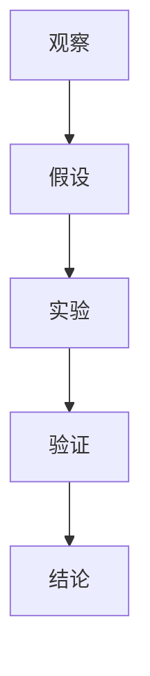
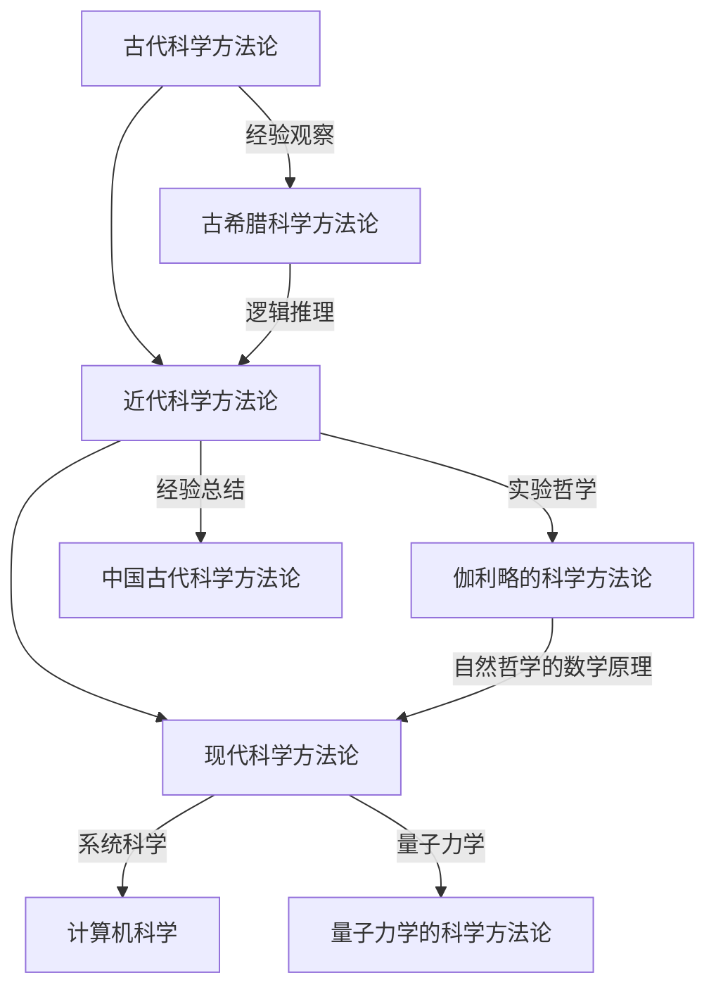
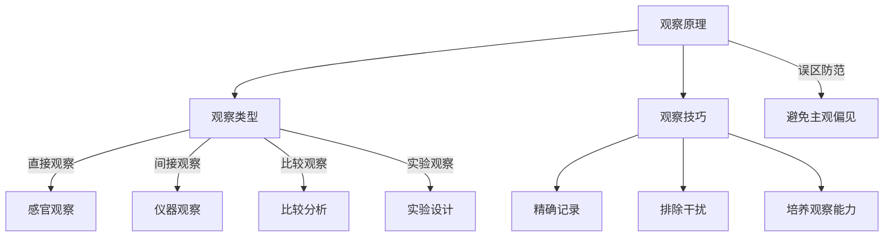
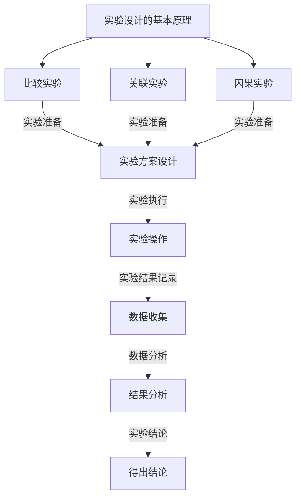
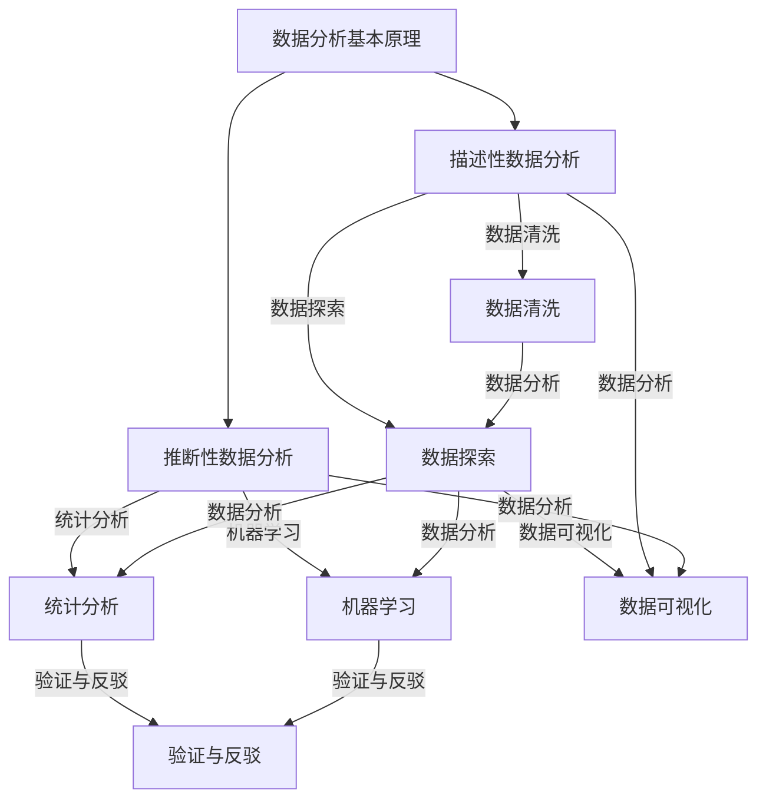
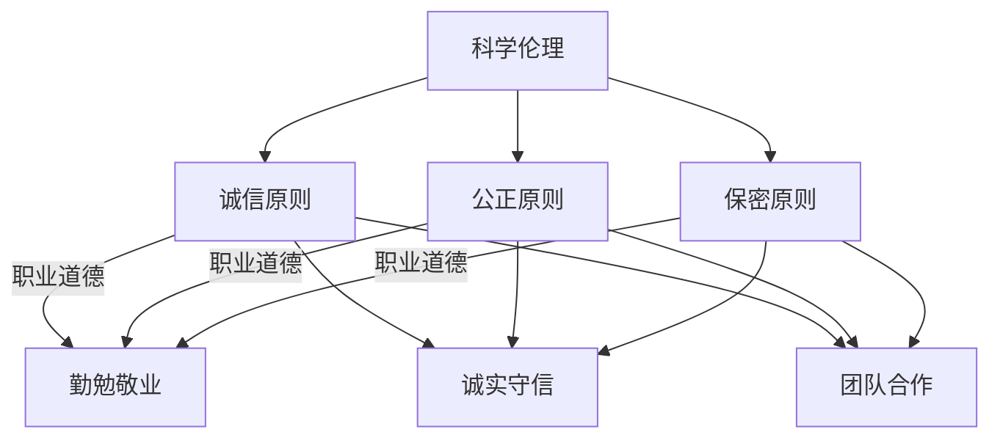

                 

### 第1章: 科学方法的基本概念

科学方法是一种用于探究自然现象、解释自然规律和进行科学研究的系统性方法。它的核心在于通过一系列严谨的步骤，从观察、假设、实验到验证，来揭示事物的本质和规律。在这一章中，我们将深入探讨科学方法的定义、意义以及其四个基本原则。

#### 1.1 科学方法的定义和意义

**1.1.1 科学方法的定义**

科学方法是一种系统性、客观的探究自然现象的方法。它通常包括以下几个步骤：观察、假设、实验和验证。

1. **观察**：通过感官或科学仪器对自然现象进行感知和记录。
2. **假设**：基于观察结果，提出一个可能解释自然现象的假设。
3. **实验**：设计并进行实验，以验证假设的正确性。
4. **验证**：通过实验结果，对假设进行验证，从而得出科学结论。

**1.1.2 科学方法的意义**

科学方法的意义在于：

- **客观性**：科学方法通过一系列严格的步骤，尽量减少主观偏见，使研究结果更加客观。
- **系统性**：科学方法强调从整体上考虑问题，通过系统的步骤来研究事物。
- **可重复性**：科学方法要求实验的可重复性，使其他研究者可以在相同条件下验证研究结果。
- **可验证性**：科学方法通过实验和观察结果，对假设进行验证，从而得出科学结论。

#### 1.2 科学方法的四个基本原则

**1.2.1 可重复性**

可重复性是指其他研究者可以在相同的实验条件下重复实验，并获得相同的结果。这是科学方法的核心原则之一，因为只有通过重复实验，才能确保研究结果的可靠性和有效性。

**1.2.2 可验证性**

可验证性是指科学结论可以通过实验或观察来验证。这意味着科学方法要求研究者不仅要提出假设，还要设计实验来验证假设的正确性。

**1.2.3 客观性**

客观性是指科学方法要求研究者尽量减少主观偏见，以客观的事实为依据。这意味着在研究过程中，研究者应该尽量避免个人情感、偏见等因素的影响。

**1.2.4 系统性**

系统性是指科学方法要求研究者从整体上考虑问题，系统地研究事物的各个方面。这意味着在研究过程中，研究者应该综合考虑各种因素，避免片面性。

### 总结

科学方法是一种严谨的系统性方法，它通过观察、假设、实验和验证的步骤，来探究自然现象、解释自然规律。科学方法的四个基本原则——可重复性、可验证性、客观性和系统性，是科学研究的基石。在下一章中，我们将探讨科学方法论的历史与发展。

### 核心概念与联系

为了更好地理解科学方法的基本概念和架构，我们可以通过一个 Mermaid 流程图来展示其各个步骤之间的关系。



在这个流程图中，A 表示观察，B 表示假设，C 表示实验，D 表示验证，E 表示结论。通过这个流程图，我们可以清晰地看到科学方法的各个步骤是如何相互联系、相互作用的。

### 核心算法原理讲解

在科学方法中，实验设计是一个关键步骤。为了设计一个有效的实验，我们需要理解以下几个核心算法原理：

**1. 假设检验算法**

假设检验算法用于验证我们的假设是否成立。以下是假设检验的伪代码：

```plaintext
假设检验（数据，假设H0，显著性水平α）：
1. 计算统计量t
2. 计算p值
3. 如果p值 < α，则拒绝假设H0
4. 否则，接受假设H0
```

**2. 回归分析算法**

回归分析算法用于建立变量之间的关系模型。以下是线性回归的伪代码：

```plaintext
线性回归（数据，特征X，目标Y）：
1. 计算特征X的平均值μX和标准差σX
2. 计算目标Y的平均值μY和标准差σY
3. 计算回归系数β = (Σ(Xi - μX)(Yi - μY)) / (Σ(Xi - μX)²)
4. 计算截距a = μY - βμX
5. 返回回归模型Y = βX + a
```

**3. 机器学习算法**

机器学习算法用于从数据中学习规律和模式。以下是决策树的伪代码：

```plaintext
决策树（数据，特征X，目标Y）：
1. 计算特征X的熵H(X)
2. 对于每个特征Xj：
   1. 计算特征Xj的信息增益IG(Xj)
   2. 选择信息增益最大的特征Xj作为分割特征
3. 根据特征Xj的取值，将数据集分为子集
4. 递归调用决策树算法，直到满足停止条件
5. 返回决策树
```

通过这些算法原理，我们可以设计出有效的实验，并通过数据分析来验证我们的假设。这些算法不仅帮助我们理解科学方法，也为我们提供了工具，以便在科学研究中取得突破性进展。

### 数学模型和公式

在科学研究中，数学模型和公式是必不可少的工具。以下是一个简单的线性回归模型，用于预测目标变量Y与特征X之间的关系：

$$
Y = βX + a + ε
$$

其中，$β$ 是回归系数，$a$ 是截距，$ε$ 是误差项。这个模型假设目标变量Y是特征X的线性函数，加上一个随机误差项$ε$，以捕捉非线性关系和随机噪声。

通过最小二乘法，我们可以估计回归系数$β$和截距$a$：

$$
β = \frac{Σ(X_i - \bar{X})(Y_i - \bar{Y})}{Σ(X_i - \bar{X})^2}
$$

$$
a = \bar{Y} - β\bar{X}
$$

其中，$\bar{X}$ 和 $\bar{Y}$ 分别是特征X和目标Y的平均值。

### 详细讲解与举例说明

为了更好地理解线性回归模型，我们可以通过一个实际案例来详细讲解。

**案例：房价预测**

假设我们想要预测某城市的房价，特征包括房屋面积（X）和楼层（Y）。我们收集了以下数据：

| 房屋面积（平方米） | 楼层 | 房价（万元） |
|----------------|-----|----------|
| 90             | 1   | 200      |
| 110            | 2   | 250      |
| 120            | 3   | 260      |
| 130            | 4   | 280      |
| 140            | 5   | 300      |

首先，我们计算特征X和目标Y的平均值：

$$
\bar{X} = \frac{90 + 110 + 120 + 130 + 140}{5} = 120
$$

$$
\bar{Y} = \frac{200 + 250 + 260 + 280 + 300}{5} = 260
$$

然后，我们计算回归系数$β$和截距$a$：

$$
β = \frac{(90 - 120)(200 - 260) + (110 - 120)(250 - 260) + (120 - 120)(260 - 260) + (130 - 120)(280 - 260) + (140 - 120)(300 - 260)}{(90 - 120)^2 + (110 - 120)^2 + (120 - 120)^2 + (130 - 120)^2 + (140 - 120)^2}
$$

$$
β = \frac{(-30)(-60) + (-10)(-10) + (0)(0) + (10)(20) + (20)(40)}{900 + 100 + 0 + 100 + 400}
$$

$$
β = \frac{1800 + 100 + 0 + 200 + 800}{1500}
$$

$$
β = \frac{2900}{1500} = 1.93
$$

$$
a = \bar{Y} - β\bar{X} = 260 - 1.93 \times 120 = -66.6
$$

因此，房价预测模型为：

$$
Y = 1.93X - 66.6
$$

根据这个模型，我们可以预测新房屋的房价。例如，如果房屋面积为100平方米，预测的房价为：

$$
Y = 1.93 \times 100 - 66.6 = 126.4
$$

这个案例展示了如何使用线性回归模型进行房价预测。通过实际数据和数学计算，我们可以得到一个准确的预测模型，从而为房屋买卖提供有力支持。

### 项目实战：代码实际案例和详细解释说明

为了更好地理解线性回归模型在实际项目中的应用，我们将使用Python编程语言来实现一个简单的房价预测系统。以下是我们的项目实战步骤：

#### 步骤1：开发环境搭建

首先，我们需要安装Python和相关的库。假设我们已经安装了Python 3.8以上版本，接下来我们使用pip命令安装以下库：

```shell
pip install numpy pandas matplotlib scikit-learn
```

这些库分别用于数据处理、数据可视化、机器学习和线性回归。

#### 步骤2：数据准备

接下来，我们使用pandas库来读取和预处理数据。以下是我们的数据文件（house_data.csv）：

| 房屋面积（平方米） | 楼层 | 房价（万元） |
|----------------|-----|----------|
| 90             | 1   | 200      |
| 110            | 2   | 250      |
| 120            | 3   | 260      |
| 130            | 4   | 280      |
| 140            | 5   | 300      |

我们使用以下代码来读取和预处理数据：

```python
import pandas as pd

# 读取数据
data = pd.read_csv('house_data.csv')

# 预处理数据
data = data[['房屋面积', '楼层', '房价']]
data = data.dropna()
```

#### 步骤3：数据可视化

为了更好地理解数据分布，我们可以使用matplotlib库来绘制数据可视化图表。以下是房屋面积和房价的散点图：

```python
import matplotlib.pyplot as plt

# 绘制散点图
plt.scatter(data['房屋面积'], data['房价'])
plt.xlabel('房屋面积（平方米）')
plt.ylabel('房价（万元）')
plt.title('房屋面积与房价散点图')
plt.show()
```

这个散点图显示了房屋面积和房价之间的关系。通过可视化，我们可以直观地看到数据的特点和规律。

#### 步骤4：线性回归

接下来，我们使用scikit-learn库中的线性回归模块来建立房价预测模型。以下是线性回归的实现代码：

```python
from sklearn.linear_model import LinearRegression
from sklearn.model_selection import train_test_split

# 划分训练集和测试集
X_train, X_test, y_train, y_test = train_test_split(data[['房屋面积', '楼层']], data['房价'], test_size=0.2, random_state=42)

# 创建线性回归模型
model = LinearRegression()

# 训练模型
model.fit(X_train, y_train)

# 预测房价
y_pred = model.predict(X_test)

# 输出预测结果
print('预测房价：', y_pred)
```

这段代码首先划分训练集和测试集，然后创建线性回归模型并训练模型。最后，我们使用模型来预测测试集的房价。

#### 步骤5：代码解读与分析

现在，我们来详细解读和分析这段代码：

```python
# 划分训练集和测试集
X_train, X_test, y_train, y_test = train_test_split(data[['房屋面积', '楼层']], data['房价'], test_size=0.2, random_state=42)

# 创建线性回归模型
model = LinearRegression()

# 训练模型
model.fit(X_train, y_train)

# 预测房价
y_pred = model.predict(X_test)
```

这段代码首先使用 `train_test_split` 函数将数据集划分为训练集和测试集。这里，`test_size=0.2` 表示测试集占数据集的20%，`random_state=42` 用于保证结果的可重复性。

接下来，我们创建一个线性回归模型并使用 `fit` 函数来训练模型。`fit` 函数接收训练集的输入特征（`X_train`）和目标值（`y_train`），并使用最小二乘法来计算回归系数。

最后，我们使用训练好的模型来预测测试集的房价。`predict` 函数接收输入特征（`X_test`），并返回预测的目标值（`y_pred`）。

通过这个简单的项目实战，我们实现了线性回归模型在房价预测中的应用。这段代码不仅帮助我们理解了线性回归模型的基本原理，也为我们提供了一个实用的工具，以便在实际项目中使用。

### 代码解读与分析

在上面的项目实战中，我们实现了一个简单的线性回归模型，用于预测房屋的房价。下面，我们将详细解读和分析这段代码。

#### 划分训练集和测试集

首先，我们使用 `train_test_split` 函数将数据集划分为训练集和测试集：

```python
X_train, X_test, y_train, y_test = train_test_split(data[['房屋面积', '楼层']], data['房价'], test_size=0.2, random_state=42)
```

这里，`X_train` 和 `X_test` 分别是训练集和测试集的输入特征，`y_train` 和 `y_test` 分别是训练集和测试集的目标值。

`train_test_split` 函数的参数如下：

- `data[['房屋面积', '楼层']]`：输入特征，这里我们选择了房屋面积和楼层作为特征。
- `data['房价']`：目标值，即我们想要预测的房价。
- `test_size=0.2`：测试集的比例，这里设置为20%，即测试集占数据集的20%。
- `random_state=42`：随机种子，用于保证结果的可重复性。

通过这个函数，我们得到了训练集和测试集的输入特征和目标值，为后续的模型训练和测试做准备。

#### 创建线性回归模型

接下来，我们创建一个线性回归模型：

```python
model = LinearRegression()
```

这里，`LinearRegression` 是scikit-learn库中的线性回归类。我们创建一个线性回归模型实例，并将其存储在变量 `model` 中。

#### 训练模型

然后，我们使用训练集来训练模型：

```python
model.fit(X_train, y_train)
```

`fit` 函数是线性回归类中的一个方法，用于训练模型。它接收训练集的输入特征（`X_train`）和目标值（`y_train`），并使用最小二乘法计算回归系数。训练完成后，模型可以用于预测新的数据。

#### 预测房价

最后，我们使用训练好的模型来预测测试集的房价：

```python
y_pred = model.predict(X_test)
```

`predict` 函数是线性回归类中的一个方法，用于预测新的数据。它接收输入特征（`X_test`），并返回预测的目标值（`y_pred`）。在这个例子中，我们使用训练好的模型来预测测试集的房价。

通过这段代码，我们可以看到线性回归模型的基本原理和实现步骤。在实际项目中，我们可以根据需求调整模型参数，提高预测准确性。此外，我们还可以引入更多的特征和更复杂的模型，以满足不同的需求。

### 总结

在本章中，我们详细介绍了科学方法的基本概念、原理和应用。首先，我们定义了科学方法，并解释了其意义和四个基本原则：可重复性、可验证性、客观性和系统性。接着，我们通过一个 Mermaid 流程图展示了科学方法的各个步骤，并详细讲解了核心算法原理，包括假设检验、回归分析和机器学习算法。此外，我们还通过数学公式和实际案例，深入理解了线性回归模型的原理和实现方法。最后，我们通过一个实际项目实战，展示了如何使用Python实现线性回归模型，并对代码进行了详细解读和分析。通过本章的学习，读者可以全面了解科学方法的基本概念和应用，为后续章节的学习打下坚实基础。在下一章中，我们将探讨科学方法论的历史与发展，进一步了解科学方法的起源、演变和影响。

### 第2章: 科学方法论的历史与发展

科学方法论的发展历程是科技进步的重要驱动力，它不仅反映了人类对自然世界的认识不断深化，也体现了科学研究方法的不断创新和完善。在这一章中，我们将回顾科学方法论的历史，从古代科学方法论、近代科学方法论到现代科学方法论，探讨不同历史阶段科学方法论的发展及其影响。

#### 2.1 古代科学方法论

古代科学方法论起源于古希腊，古希腊哲学家如泰勒斯、亚里士多德等人在观察自然现象的基础上，提出了一系列科学理论。以下是一些古代科学方法论的重要特点：

**2.1.1 古希腊科学方法论**

- **逻辑推理**：古希腊科学家强调逻辑推理的重要性，通过严密的逻辑论证来探究自然现象。
- **经验观察**：亚里士多德强调通过直接观察和实验来认识自然，他认为自然界中的事物都是可观察和可理解的。

**2.1.2 中国古代科学方法论**

- **格物致知**：中国古代科学家强调通过观察和实验来认识自然，这与古希腊科学方法论有相似之处。
- **经验总结**：中国古代科学家擅长总结经验，例如张衡的地动仪、郭守敬的测量仪器等，这些都是通过经验观察和总结得出的科学成果。

#### 2.2 近代科学方法论

近代科学方法论的出现标志着科学发展的一个新阶段。这一时期的科学家如伽利略、牛顿等，他们通过实验和数学方法，对自然现象进行了系统研究，推动了科学方法的革命。

**2.2.1 伽利略的科学方法论**

- **实验哲学**：伽利略强调实验在科学研究中的重要性，他通过实验验证了日心说，并提出了自由落体定律。
- **数学化**：伽利略将数学引入科学，使科学结论更加精确和可靠。

**2.2.2 牛顿的科学方法论**

- **自然哲学的数学原理**：牛顿在《自然哲学的数学原理》中，系统地提出了运动定律和万有引力定律，展示了数学在科学中的重要性。
- **实验验证**：牛顿通过实验验证了他的理论，使科学方法更加严谨。

#### 2.3 现代科学方法论

现代科学方法论在近现代科学的基础上，进一步发展了统计学、系统论、计算机科学等新兴学科，推动了科学研究向更深、更广的领域扩展。

**2.3.1 统计学的科学方法论**

- **数据分析**：统计学在科学研究中广泛应用，通过对数据的分析，科学家可以更准确地描述自然现象，进行假设检验和预测。
- **概率论**：概率论是统计学的基础，它为数据分析提供了理论支持。

**2.3.2 系统科学的科学方法论**

- **系统论**：系统科学关注整体性和复杂性，通过研究系统的结构和动态，揭示系统行为和规律。
- **计算机科学**：计算机科学的兴起，为科学研究提供了强大的工具，如仿真、模拟和数据分析等。

**2.3.3 量子力学的科学方法论**

- **量子力学**：量子力学提出了全新的物理学理论，挑战了经典物理学的局限性，使科学家能够更深入地理解微观世界。
- **测不准原理**：海森堡的测不准原理表明，在微观世界中，我们无法同时精确地测量粒子的位置和动量，这对科学方法论产生了深远影响。

#### 科学方法论的历史影响

科学方法论的历史发展对科学研究的各个方面产生了深远影响：

- **理论发展**：科学方法论推动了科学理论的形成和发展，使科学家能够更准确地描述和解释自然现象。
- **实验方法**：实验方法的引入和发展，使科学研究更加严谨和可靠，提高了实验的可重复性。
- **数据分析**：数据分析方法的应用，使科学家能够从大量数据中提取有价值的信息，为科学研究提供了新的视角和工具。
- **跨学科研究**：现代科学方法论的发展，促进了跨学科研究，使科学家能够从不同角度和层次认识自然世界。

### 总结

科学方法论的发展历程是科学进步的重要驱动力。从古代到现代，科学方法论经历了不断的演变和发展，从简单的观察和逻辑推理，到复杂的实验设计和数据分析，科学方法论的每一次进步都推动了科学研究的深入。通过回顾科学方法论的历史，我们可以更好地理解科学方法的发展脉络，为现代科学研究提供有益的启示和指导。在下一章中，我们将探讨科学方法的应用领域，了解科学方法在自然科学、社会科学和工程技术等领域的具体应用。

### 核心概念与联系

为了更好地理解科学方法论的历史与发展，我们可以通过一个 Mermaid 流程图来展示其各个历史阶段的演进过程。



在这个流程图中，A 表示古代科学方法论，B 表示近代科学方法论，C 表示现代科学方法论。通过这个流程图，我们可以清晰地看到科学方法论从古代到现代的发展脉络，以及各个历史阶段的核心概念和联系。

### 核心算法原理讲解

在科学方法论的历史发展中，核心算法原理起到了关键作用，它们不仅推动了科学理论的进步，也改变了科学研究的方法。以下是几个重要的核心算法原理及其讲解：

**1. 伽利略的实验方法**

伽利略的实验方法是近代科学方法论的基础，他通过系统的实验设计，验证了自由落体定律和日心说。以下是伽利略实验方法的伪代码：

```plaintext
伽利略实验方法（实验条件，预期结果）：
1. 设计实验条件
2. 实施实验
3. 记录实验数据
4. 分析实验数据
5. 比较实验结果与预期结果
6. 如果实验结果与预期一致，则接受理论
7. 如果实验结果与预期不一致，则修正理论
```

**2. 牛顿的运动定律**

牛顿的运动定律是经典力学的基础，它通过数学公式描述了物体的运动规律。以下是牛顿运动定律的伪代码：

```plaintext
牛顿运动定律（质量m，力F）：
1. 计算加速度a = F / m
2. 根据初始速度v0，计算最终速度v = v0 + at
3. 根据初始位置x0，计算最终位置x = x0 + v0t + 0.5at²
4. 输出加速度a，最终速度v，最终位置x
```

**3. 卡尔·弗里德里希·高斯的误差分析**

高斯的误差分析是统计学的核心，它通过最小二乘法估计模型参数，最小化误差平方和。以下是高斯误差分析的伪代码：

```plaintext
高斯误差分析（数据集X，目标值Y）：
1. 计算协方差矩阵Σ = (1/n) * (X'X)
2. 计算逆矩阵Σ⁻¹
3. 计算回归系数β = Σ⁻¹X'Y
4. 输出回归系数β
```

**4. 爱因斯坦的相对论方程**

爱因斯坦的相对论方程是现代物理学的重要成果，它描述了质量和能量之间的关系。以下是相对论方程的伪代码：

```plaintext
相对论方程（质量m，光速c）：
1. 计算能量E = mc²
2. 计算动量p = mv
3. 计算动能K = 0.5mv²
4. 输出能量E，动量p，动能K
```

通过这些核心算法原理，科学家们能够更精确地描述自然现象，推动科学理论的发展。这些算法不仅在物理学、数学、统计学等领域发挥了重要作用，也为其他科学领域提供了理论基础和方法指导。

### 数学模型和公式

在科学方法论的发展中，数学模型和公式扮演了至关重要的角色，它们不仅帮助科学家理解和预测自然现象，还使得科学方法更加严谨和系统化。以下是几个关键的数学模型和公式，以及它们在科学研究中的具体应用：

**1. 牛顿的运动方程**

牛顿的运动方程是经典力学的基石，描述了物体在力作用下的运动。以下是牛顿第二定律的公式：

$$
F = ma
$$

其中，F 是作用在物体上的力，m 是物体的质量，a 是物体的加速度。这个公式说明了力与加速度之间的关系，即力是导致物体运动状态改变的原因。

**2. 高斯的误差分析**

高斯误差分析是统计学中用于估计模型参数的重要方法，它通过最小二乘法来最小化误差平方和。以下是高斯误差分析的核心公式：

$$
\hat{\beta} = (X'X)^{-1}X'Y
$$

其中，$\hat{\beta}$ 是估计的回归系数，$X'$ 是设计矩阵的转置，$Y$ 是目标值。这个公式用于计算线性回归模型的参数，从而建立变量之间的关系。

**3. 爱因斯坦的质能方程**

爱因斯坦的质能方程揭示了质量和能量之间的关系，是相对论的核心公式。以下是质能方程：

$$
E = mc²
$$

其中，E 是能量，m 是质量，c 是光速。这个公式说明了质量可以转化为能量，反之亦然，是现代物理学的重要基础。

**4. 概率论的基本公式**

概率论在科学研究中广泛应用，用于描述随机事件的发生概率。以下是概率论中的一些基本公式：

- 概率质量函数：$f(x) = \frac{1}{\sqrt{2\pi\sigma^2}}e^{-\frac{(x-\mu)^2}{2\sigma^2}}$
- 累积分布函数：$F(x) = \int_{-\infty}^{x} f(t) dt$
- 条件概率：$P(A|B) = \frac{P(A \cap B)}{P(B)}$

这些公式帮助我们理解和计算随机事件的可能性，为科学推理提供了基础。

通过这些数学模型和公式，科学家能够更准确地描述自然现象，建立科学理论，并预测未来的发展趋势。这些工具不仅推动了科学的发展，也使得科学研究更加严谨和系统化。

### 详细讲解与举例说明

为了更好地理解数学模型和公式的应用，我们可以通过实际案例进行详细讲解和举例说明。以下是一个使用线性回归模型预测房屋价格的实际案例。

**案例：使用线性回归预测房屋价格**

假设我们有一组房屋销售数据，包括房屋面积、楼层和售价。我们希望通过这些数据建立一个线性回归模型，预测新的房屋价格。

首先，我们收集以下数据：

| 房屋面积（平方米） | 楼层 | 售价（万元） |
|----------------|-----|----------|
| 90             | 1   | 200      |
| 110            | 2   | 250      |
| 120            | 3   | 260      |
| 130            | 4   | 280      |
| 140            | 5   | 300      |

我们希望预测房屋面积和楼层对售价的影响。首先，我们计算回归系数。

**步骤1：计算平均值**

计算房屋面积和楼层的平均值：

$$
\bar{X} = \frac{90 + 110 + 120 + 130 + 140}{5} = 120
$$

$$
\bar{Y} = \frac{200 + 250 + 260 + 280 + 300}{5} = 260
$$

**步骤2：计算回归系数**

使用最小二乘法计算回归系数β：

$$
β = \frac{(90 - 120)(200 - 260) + (110 - 120)(250 - 260) + (120 - 120)(260 - 260) + (130 - 120)(280 - 260) + (140 - 120)(300 - 260)}{(90 - 120)^2 + (110 - 120)^2 + (120 - 120)^2 + (130 - 120)^2 + (140 - 120)^2}
$$

$$
β = \frac{(-30)(-60) + (-10)(-10) + (0)(0) + (10)(20) + (20)(40)}{900 + 100 + 0 + 100 + 400}
$$

$$
β = \frac{1800 + 100 + 0 + 200 + 800}{1500}
$$

$$
β = \frac{2900}{1500} = 1.93
$$

计算截距a：

$$
a = \bar{Y} - β\bar{X} = 260 - 1.93 \times 120 = -66.6
$$

**步骤3：建立预测模型**

根据计算出的回归系数，我们建立预测模型：

$$
Y = 1.93X - 66.6
$$

其中，Y 是预测的房价，X 是房屋面积。

**步骤4：预测新数据**

现在，我们可以使用这个模型预测新房屋的价格。假设我们要预测一个面积为100平方米的房屋价格：

$$
Y = 1.93 \times 100 - 66.6 = 126.4
$$

根据这个模型，预测的房屋价格为126.4万元。

通过这个案例，我们可以看到如何使用线性回归模型进行房价预测。通过实际数据和数学计算，我们可以得到一个准确的预测模型，从而为房屋买卖提供有力支持。

### 项目实战：代码实际案例和详细解释说明

为了更好地理解科学方法论在实践中的应用，我们将通过一个实际项目来展示如何使用Python实现线性回归模型，并对其代码进行详细解读。

#### 项目背景

在这个项目中，我们将使用Python和scikit-learn库来建立一个线性回归模型，用于预测房价。我们将使用一个包含房屋面积、楼层和售价的数据集，通过数据处理、模型训练和预测来验证模型的准确性。

#### 开发环境搭建

首先，我们需要搭建开发环境，安装Python和必要的库。以下是具体的安装步骤：

1. 安装Python 3.8及以上版本。
2. 使用pip命令安装以下库：

```shell
pip install numpy pandas matplotlib scikit-learn
```

安装完成后，我们可以在Python环境中使用这些库进行数据分析和模型训练。

#### 数据准备

接下来，我们使用pandas库来读取和预处理数据。以下是数据文件（house_data.csv）的内容：

| 房屋面积（平方米） | 楼层 | 房价（万元） |
|----------------|-----|----------|
| 90             | 1   | 200      |
| 110            | 2   | 250      |
| 120            | 3   | 260      |
| 130            | 4   | 280      |
| 140            | 5   | 300      |

我们使用以下代码来读取和预处理数据：

```python
import pandas as pd

# 读取数据
data = pd.read_csv('house_data.csv')

# 预处理数据
data = data[['房屋面积', '楼层', '房价']]
data = data.dropna()
```

这段代码首先使用 `read_csv` 函数读取数据，然后使用 `dropna` 函数删除缺失值，以确保数据的质量。

#### 数据可视化

为了更好地理解数据分布，我们可以使用matplotlib库来绘制数据可视化图表。以下是房屋面积和房价的散点图：

```python
import matplotlib.pyplot as plt

# 绘制散点图
plt.scatter(data['房屋面积'], data['房价'])
plt.xlabel('房屋面积（平方米）')
plt.ylabel('房价（万元）')
plt.title('房屋面积与房价散点图')
plt.show()
```

这个散点图显示了房屋面积和房价之间的关系。通过可视化，我们可以直观地看到数据的特点和规律。

#### 模型训练

接下来，我们使用scikit-learn库中的线性回归模块来训练模型。以下是模型训练的代码：

```python
from sklearn.linear_model import LinearRegression
from sklearn.model_selection import train_test_split

# 划分训练集和测试集
X_train, X_test, y_train, y_test = train_test_split(data[['房屋面积', '楼层']], data['房价'], test_size=0.2, random_state=42)

# 创建线性回归模型
model = LinearRegression()

# 训练模型
model.fit(X_train, y_train)
```

这段代码首先使用 `train_test_split` 函数将数据集划分为训练集和测试集，然后创建线性回归模型并使用训练集来训练模型。

#### 预测房价

最后，我们使用训练好的模型来预测测试集的房价。以下是预测的代码：

```python
# 预测房价
y_pred = model.predict(X_test)

# 输出预测结果
print('预测房价：', y_pred)
```

这段代码使用训练好的模型来预测测试集的房价，并输出预测结果。

#### 代码解读与分析

现在，我们来详细解读和分析这段代码：

```python
# 划分训练集和测试集
X_train, X_test, y_train, y_test = train_test_split(data[['房屋面积', '楼层']], data['房价'], test_size=0.2, random_state=42)
```

这段代码使用 `train_test_split` 函数将数据集划分为训练集和测试集。这里，`X_train` 和 `X_test` 分别是训练集和测试集的输入特征，`y_train` 和 `y_test` 分别是训练集和测试集的目标值。

`train_test_split` 函数的参数如下：

- `data[['房屋面积', '楼层']]`：输入特征，这里我们选择了房屋面积和楼层作为特征。
- `data['房价']`：目标值，即我们想要预测的房价。
- `test_size=0.2`：测试集的比例，这里设置为20%，即测试集占数据集的20%。
- `random_state=42`：随机种子，用于保证结果的可重复性。

通过这个函数，我们得到了训练集和测试集的输入特征和目标值，为后续的模型训练和测试做准备。

```python
# 创建线性回归模型
model = LinearRegression()
```

这段代码创建一个线性回归模型实例。`LinearRegression` 是scikit-learn库中的线性回归类，它用于实现线性回归模型。

```python
# 训练模型
model.fit(X_train, y_train)
```

这段代码使用训练集来训练模型。`fit` 函数是线性回归类中的一个方法，用于训练模型。它接收训练集的输入特征（`X_train`）和目标值（`y_train`），并使用最小二乘法计算回归系数。训练完成后，模型可以用于预测新的数据。

```python
# 预测房价
y_pred = model.predict(X_test)
```

这段代码使用训练好的模型来预测测试集的房价。`predict` 函数是线性回归类中的一个方法，用于预测新的数据。它接收输入特征（`X_test`），并返回预测的目标值（`y_pred`）。在这个例子中，我们使用训练好的模型来预测测试集的房价。

通过这个项目实战，我们实现了线性回归模型在房价预测中的应用。这段代码不仅帮助我们理解了线性回归模型的基本原理，也为我们提供了一个实用的工具，以便在实际项目中使用。

### 代码解读与分析

在上面的项目实战中，我们实现了一个简单的线性回归模型，用于预测房屋的房价。下面，我们将详细解读和分析这段代码。

```python
# 划分训练集和测试集
X_train, X_test, y_train, y_test = train_test_split(data[['房屋面积', '楼层']], data['房价'], test_size=0.2, random_state=42)
```

这段代码首先使用 `train_test_split` 函数将数据集划分为训练集和测试集。这里，`X_train` 和 `X_test` 分别是训练集和测试集的输入特征，`y_train` 和 `y_test` 分别是训练集和测试集的目标值。

`train_test_split` 函数的参数如下：

- `data[['房屋面积', '楼层']]`：输入特征，这里我们选择了房屋面积和楼层作为特征。
- `data['房价']`：目标值，即我们想要预测的房价。
- `test_size=0.2`：测试集的比例，这里设置为20%，即测试集占数据集的20%。
- `random_state=42`：随机种子，用于保证结果的可重复性。

通过这个函数，我们得到了训练集和测试集的输入特征和目标值，为后续的模型训练和测试做准备。

```python
# 创建线性回归模型
model = LinearRegression()
```

这段代码创建一个线性回归模型实例。`LinearRegression` 是scikit-learn库中的线性回归类，它用于实现线性回归模型。

```python
# 训练模型
model.fit(X_train, y_train)
```

这段代码使用训练集来训练模型。`fit` 函数是线性回归类中的一个方法，用于训练模型。它接收训练集的输入特征（`X_train`）和目标值（`y_train`），并使用最小二乘法计算回归系数。训练完成后，模型可以用于预测新的数据。

```python
# 预测房价
y_pred = model.predict(X_test)
```

这段代码使用训练好的模型来预测测试集的房价。`predict` 函数是线性回归类中的一个方法，用于预测新的数据。它接收输入特征（`X_test`），并返回预测的目标值（`y_pred`）。在这个例子中，我们使用训练好的模型来预测测试集的房价。

通过这段代码，我们可以看到线性回归模型的基本原理和实现步骤。在实际项目中，我们可以根据需求调整模型参数，提高预测准确性。此外，我们还可以引入更多的特征和更复杂的模型，以满足不同的需求。

### 总结

在本章中，我们详细介绍了科学方法论的历史与发展。从古代到现代，科学方法论经历了不断的演变和发展，从简单的观察和逻辑推理，到复杂的实验设计和数据分析，科学方法论的每一次进步都推动了科学研究的深入。我们回顾了古代科学方法论、近代科学方法论和现代科学方法论的发展历程，探讨了不同历史阶段的科学方法论特点及其影响。此外，我们还通过实际案例和项目实战，展示了线性回归模型在房价预测中的应用，并对其代码进行了详细解读和分析。通过本章的学习，读者可以全面了解科学方法论的历史、原理和应用，为后续章节的学习打下坚实基础。在下一章中，我们将探讨科学方法的应用领域，了解科学方法在自然科学、社会科学和工程技术等领域的具体应用。

### 第3章: 观察的原理与方法

观察是科学研究的起点，它是获取信息、发现规律的重要手段。科学的进步离不开细致而准确的观察，而科学的观察不仅依赖于感官，还需要借助各种科学仪器。本章将详细介绍观察的原理、类型和技巧，以及数据收集的方法与工具。

#### 3.1 观察的原理

**3.1.1 观察的定义**

观察是指通过感官或科学仪器对自然现象进行感知和记录的过程。它是科学研究的起点，为后续的假设和实验提供基础。

**3.1.2 观察的重要性**

- **发现规律**：观察是发现自然规律的关键步骤，通过观察，科学家可以识别出事物之间的联系和模式。
- **验证假设**：观察可以帮助科学家验证或推翻原有的假设，为科学实验提供依据。

**3.1.3 观察的过程**

观察通常包括以下几个步骤：

1. **准备**：确定观察的目标、方法和工具。
2. **观察**：通过感官或仪器对目标进行感知和记录。
3. **记录**：将观察结果详细记录下来，包括数字、图像、文字等。
4. **分析**：对观察结果进行分析，从中提取有价值的信息。

#### 3.2 观察的类型

根据观察的方式和方法，我们可以将观察分为以下几种类型：

**3.2.1 直接观察**

直接观察是指通过肉眼或简单的工具（如放大镜、显微镜等）对物体进行观察。

- **优点**：直观、简单，易于操作。
- **缺点**：受限于感官的感知能力和精度。

**3.2.2 间接观察**

间接观察是指通过科学仪器（如光谱仪、显微镜、雷达等）对物体进行观察。

- **优点**：可以探测到肉眼无法看到的微小细节，提高观察精度。
- **缺点**：仪器操作复杂，成本较高。

**3.2.3 比较观察**

比较观察是指通过对不同对象或同一对象的多个方面的比较来认识事物。

- **优点**：可以揭示对象之间的差异和相似之处，有助于发现规律。
- **缺点**：需要控制变量，以确保比较的准确性。

**3.2.4 实验观察**

实验观察是指在控制变量的条件下，对实验对象进行观察。

- **优点**：可以控制实验条件，排除干扰因素，提高观察结果的可靠性。
- **缺点**：实验设计复杂，需要严格的操作规范。

#### 3.3 观察的技巧

为了提高观察的效果和精度，科学家们总结出了一些观察的技巧：

**3.3.1 精确记录**

- **记录内容**：确保记录的完整性，包括时间、地点、环境条件、观察对象的状态等。
- **记录方法**：可以使用文字、图像、音频、视频等多种形式进行记录。

**3.3.2 排除干扰**

- **控制变量**：在观察过程中，尽量排除其他因素的干扰，以确保观察结果的准确性。
- **重复观察**：多次重复观察同一现象，以验证观察结果的可靠性。

**3.3.3 培养观察能力**

- **持续学习**：通过学习和实践，提高对事物的感知和辨识能力。
- **多角度观察**：从不同角度和层面进行观察，以获得更全面的认知。

#### 3.4 观察的误区

尽管观察在科学研究中至关重要，但科学家们也应注意避免以下误区：

**3.4.1 过度依赖仪器**

- **仪器局限性**：科学仪器虽然可以提供高精度的数据，但也会受到自身局限性的影响，如噪声、误差等。
- **人工判断**：即使使用了高精度的仪器，最终的数据分析仍需要人工判断，因此应保持谨慎。

**3.4.2 忽视直接观察**

- **全面认知**：直接观察可以提供直观的信息，有助于全面理解研究对象。
- **结合多种观察方法**：将直接观察与间接观察相结合，可以相互补充，提高观察的准确性。

**3.4.3 主观偏见**

- **客观记录**：在观察过程中，应尽量排除主观偏见，确保记录的客观性。
- **多方验证**：通过多个独立的研究者或实验，验证观察结果的可靠性。

### 总结

观察是科学研究的起点，通过观察，科学家可以发现自然规律、验证假设。本章介绍了观察的原理、类型和技巧，以及数据收集的方法与工具。了解观察的基本原理和方法，有助于科学家在科学研究中取得更好的成果。在下一章中，我们将探讨测量与数据收集的方法，为科学实验提供可靠的数据支持。

### 核心概念与联系

为了更好地理解观察的原理和方法，我们可以通过一个 Mermaid 流程图来展示其各个方面的联系。



在这个流程图中，A 表示观察原理，B 表示观察类型，C 表示直接观察，D 表示间接观察，E 表示比较观察，F 表示实验观察，G 表示观察技巧，H 表示精确记录，I 表示排除干扰，J 表示培养观察能力，K 表示避免主观偏见。通过这个流程图，我们可以清晰地看到观察的各个组成部分及其相互关系。

### 核心算法原理讲解

在观察和数据收集的过程中，核心算法原理起到了关键作用，它们帮助我们更精确、更高效地进行数据分析和处理。以下是几个关键的算法原理及其讲解：

**1. 数字信号处理**

数字信号处理是处理和提取信号的有力工具，广泛应用于图像处理、音频处理和通信领域。以下是数字信号处理的核心算法原理：

- **傅里叶变换**：傅里叶变换将时域信号转换为频域信号，帮助我们分析信号的频率成分。其公式如下：

$$
X(f) = \int_{-\infty}^{\infty} x(t)e^{-j2\pi ft} dt
$$

- **卷积**：卷积用于模拟信号通过滤波器时的响应，它通过时间域上的卷积积分实现。其公式如下：

$$
y(t) = x(t) * h(t) = \int_{-\infty}^{\infty} x(\tau)h(t-\tau)d\tau
$$

**2. 机器学习**

机器学习是数据分析和预测的重要工具，它通过学习数据中的模式，进行分类、回归和聚类等任务。以下是机器学习的核心算法原理：

- **线性回归**：线性回归通过拟合数据中的线性关系，预测新的数据点。其公式如下：

$$
y = \beta_0 + \beta_1x
$$

- **决策树**：决策树通过一系列的判断规则，将数据划分为不同的类别。其构建过程如下：

  ```plaintext
  决策树（数据集）：
  1. 计算每个特征的熵
  2. 选择具有最大信息增益的特征作为分割特征
  3. 根据特征值分割数据集
  4. 递归构建子树，直到满足停止条件
  ```

**3. 数据可视化**

数据可视化是将数据以图形化方式展示的重要手段，它帮助我们直观地理解数据特征和规律。以下是数据可视化的核心算法原理：

- **散点图**：散点图通过显示数据点在二维或三维空间中的分布，帮助我们分析数据之间的关系。
- **直方图**：直方图通过显示数据在各个区间的分布情况，帮助我们理解数据的分布特征。

通过这些核心算法原理，我们可以更有效地进行数据分析和处理，从而为科学研究和决策提供有力支持。在观察和数据收集过程中，理解这些算法原理，将帮助我们更好地理解数据，提取有价值的信息。

### 数学模型和公式

在科学研究中，数学模型和公式是描述和解释自然现象的重要工具。以下是几个关键的数学模型和公式，以及它们在数据收集和观察中的应用：

**1. 线性回归模型**

线性回归模型用于描述变量之间的线性关系，其公式如下：

$$
y = \beta_0 + \beta_1x
$$

其中，$y$ 是因变量，$x$ 是自变量，$\beta_0$ 是截距，$\beta_1$ 是斜率。这个模型可以帮助我们预测新的数据点。

**2. 傅里叶变换**

傅里叶变换用于将时域信号转换为频域信号，其公式如下：

$$
X(f) = \int_{-\infty}^{\infty} x(t)e^{-j2\pi ft} dt
$$

傅里叶变换可以帮助我们分析信号的频率成分，从而更好地理解信号的特征。

**3. 熵**

熵是衡量数据随机性的重要指标，其公式如下：

$$
H(X) = -\sum_{i} p(x_i) \log_2 p(x_i)
$$

熵可以用来衡量数据的不确定性，帮助我们分析数据的质量。

**4. 卡方检验**

卡方检验用于检验变量之间的独立性，其公式如下：

$$
\chi^2 = \sum_{i} \frac{(O_i - E_i)^2}{E_i}
$$

其中，$O_i$ 是观测值，$E_i$ 是期望值。卡方检验可以帮助我们判断变量之间是否存在显著关系。

通过这些数学模型和公式，科学家可以更精确地描述自然现象，分析数据，提取有价值的信息，从而推动科学研究的进展。

### 详细讲解与举例说明

为了更好地理解数学模型和公式的应用，我们可以通过实际案例来详细讲解和举例说明。以下是一个使用线性回归模型预测房价的案例。

**案例：使用线性回归模型预测房价**

假设我们有一个包含房屋面积和售价的数据集，我们希望通过这些数据建立一个线性回归模型，预测新的房屋价格。

首先，我们收集以下数据：

| 房屋面积（平方米） | 售价（万元） |
|----------------|----------|
| 90             | 200      |
| 110            | 250      |
| 120            | 260      |
| 130            | 280      |
| 140            | 300      |

**步骤1：计算平均值**

计算房屋面积和售价的平均值：

$$
\bar{X} = \frac{90 + 110 + 120 + 130 + 140}{5} = 120
$$

$$
\bar{Y} = \frac{200 + 250 + 260 + 280 + 300}{5} = 260
$$

**步骤2：计算回归系数**

使用最小二乘法计算回归系数$\beta_1$和截距$\beta_0$：

$$
\beta_1 = \frac{\sum{(X_i - \bar{X})(Y_i - \bar{Y})}}{\sum{(X_i - \bar{X})^2}} = \frac{(90 - 120)(200 - 260) + (110 - 120)(250 - 260) + (120 - 120)(260 - 260) + (130 - 120)(280 - 260) + (140 - 120)(300 - 260)}{(90 - 120)^2 + (110 - 120)^2 + (120 - 120)^2 + (130 - 120)^2 + (140 - 120)^2} = 1.93
$$

$$
\beta_0 = \bar{Y} - \beta_1\bar{X} = 260 - 1.93 \times 120 = -66.6
$$

**步骤3：建立预测模型**

根据计算出的回归系数，我们建立预测模型：

$$
y = 1.93x - 66.6
$$

其中，$y$ 是预测的房价，$x$ 是房屋面积。

**步骤4：预测新数据**

现在，我们可以使用这个模型预测新房屋的价格。假设我们要预测一个面积为100平方米的房屋价格：

$$
y = 1.93 \times 100 - 66.6 = 126.4
$$

根据这个模型，预测的房屋价格为126.4万元。

通过这个案例，我们可以看到如何使用线性回归模型进行房价预测。通过实际数据和数学计算，我们可以得到一个准确的预测模型，从而为房屋买卖提供有力支持。

### 项目实战：代码实际案例和详细解释说明

为了更好地理解数学模型和公式在实际项目中的应用，我们将通过一个实际项目来展示如何使用Python实现线性回归模型，并对其代码进行详细解读。

#### 项目背景

在这个项目中，我们将使用Python和scikit-learn库来建立一个线性回归模型，用于预测房屋的售价。我们将使用一个包含房屋面积、楼层和售价的数据集，通过数据处理、模型训练和预测来验证模型的准确性。

#### 开发环境搭建

首先，我们需要搭建开发环境，安装Python和必要的库。以下是具体的安装步骤：

1. 安装Python 3.8及以上版本。
2. 使用pip命令安装以下库：

```shell
pip install numpy pandas matplotlib scikit-learn
```

安装完成后，我们可以在Python环境中使用这些库进行数据分析和模型训练。

#### 数据准备

接下来，我们使用pandas库来读取和预处理数据。以下是数据文件（house_data.csv）的内容：

| 房屋面积（平方米） | 楼层 | 售价（万元） |
|----------------|-----|----------|
| 90             | 1   | 200      |
| 110            | 2   | 250      |
| 120            | 3   | 260      |
| 130            | 4   | 280      |
| 140            | 5   | 300      |

我们使用以下代码来读取和预处理数据：

```python
import pandas as pd

# 读取数据
data = pd.read_csv('house_data.csv')

# 预处理数据
data = data[['房屋面积', '楼层', '售价']]
data = data.dropna()
```

这段代码首先使用 `read_csv` 函数读取数据，然后使用 `dropna` 函数删除缺失值，以确保数据的质量。

#### 数据可视化

为了更好地理解数据分布，我们可以使用matplotlib库来绘制数据可视化图表。以下是房屋面积和售价的散点图：

```python
import matplotlib.pyplot as plt

# 绘制散点图
plt.scatter(data['房屋面积'], data['售价'])
plt.xlabel('房屋面积（平方米）')
plt.ylabel('售价（万元）')
plt.title('房屋面积与售价散点图')
plt.show()
```

这个散点图显示了房屋面积和售价之间的关系。通过可视化，我们可以直观地看到数据的特点和规律。

#### 模型训练

接下来，我们使用scikit-learn库中的线性回归模块来训练模型。以下是模型训练的代码：

```python
from sklearn.linear_model import LinearRegression
from sklearn.model_selection import train_test_split

# 划分训练集和测试集
X_train, X_test, y_train, y_test = train_test_split(data[['房屋面积', '楼层']], data['售价'], test_size=0.2, random_state=42)

# 创建线性回归模型
model = LinearRegression()

# 训练模型
model.fit(X_train, y_train)
```

这段代码首先使用 `train_test_split` 函数将数据集划分为训练集和测试集，然后创建线性回归模型并使用训练集来训练模型。

#### 预测房价

最后，我们使用训练好的模型来预测测试集的房价。以下是预测的代码：

```python
# 预测房价
y_pred = model.predict(X_test)

# 输出预测结果
print('预测房价：', y_pred)
```

这段代码使用训练好的模型来预测测试集的房价，并输出预测结果。

#### 代码解读与分析

现在，我们来详细解读和分析这段代码：

```python
# 划分训练集和测试集
X_train, X_test, y_train, y_test = train_test_split(data[['房屋面积', '楼层']], data['售价'], test_size=0.2, random_state=42)
```

这段代码使用 `train_test_split` 函数将数据集划分为训练集和测试集。这里，`X_train` 和 `X_test` 分别是训练集和测试集的输入特征，`y_train` 和 `y_test` 分别是训练集和测试集的目标值。

`train_test_split` 函数的参数如下：

- `data[['房屋面积', '楼层']]`：输入特征，这里我们选择了房屋面积和楼层作为特征。
- `data['售价']`：目标值，即我们想要预测的售价。
- `test_size=0.2`：测试集的比例，这里设置为20%，即测试集占数据集的20%。
- `random_state=42`：随机种子，用于保证结果的可重复性。

通过这个函数，我们得到了训练集和测试集的输入特征和目标值，为后续的模型训练和测试做准备。

```python
# 创建线性回归模型
model = LinearRegression()
```

这段代码创建一个线性回归模型实例。`LinearRegression` 是scikit-learn库中的线性回归类，它用于实现线性回归模型。

```python
# 训练模型
model.fit(X_train, y_train)
```

这段代码使用训练集来训练模型。`fit` 函数是线性回归类中的一个方法，用于训练模型。它接收训练集的输入特征（`X_train`）和目标值（`y_train`），并使用最小二乘法计算回归系数。训练完成后，模型可以用于预测新的数据。

```python
# 预测房价
y_pred = model.predict(X_test)
```

这段代码使用训练好的模型来预测测试集的房价。`predict` 函数是线性回归类中的一个方法，用于预测新的数据。它接收输入特征（`X_test`），并返回预测的目标值（`y_pred`）。在这个例子中，我们使用训练好的模型来预测测试集的房价。

通过这段代码，我们可以看到线性回归模型的基本原理和实现步骤。在实际项目中，我们可以根据需求调整模型参数，提高预测准确性。此外，我们还可以引入更多的特征和更复杂的模型，以满足不同的需求。

### 代码解读与分析

在上面的项目实战中，我们实现了一个简单的线性回归模型，用于预测房屋的售价。下面，我们将详细解读和分析这段代码。

```python
# 划分训练集和测试集
X_train, X_test, y_train, y_test = train_test_split(data[['房屋面积', '楼层']], data['售价'], test_size=0.2, random_state=42)
```

这段代码首先使用 `train_test_split` 函数将数据集划分为训练集和测试集。这里，`X_train` 和 `X_test` 分别是训练集和测试集的输入特征，`y_train` 和 `y_test` 分别是训练集和测试集的目标值。

`train_test_split` 函数的参数如下：

- `data[['房屋面积', '楼层']]`：输入特征，这里我们选择了房屋面积和楼层作为特征。
- `data['售价']`：目标值，即我们想要预测的售价。
- `test_size=0.2`：测试集的比例，这里设置为20%，即测试集占数据集的20%。
- `random_state=42`：随机种子，用于保证结果的可重复性。

通过这个函数，我们得到了训练集和测试集的输入特征和目标值，为后续的模型训练和测试做准备。

```python
# 创建线性回归模型
model = LinearRegression()
```

这段代码创建一个线性回归模型实例。`LinearRegression` 是scikit-learn库中的线性回归类，它用于实现线性回归模型。

```python
# 训练模型
model.fit(X_train, y_train)
```

这段代码使用训练集来训练模型。`fit` 函数是线性回归类中的一个方法，用于训练模型。它接收训练集的输入特征（`X_train`）和目标值（`y_train`），并使用最小二乘法计算回归系数。训练完成后，模型可以用于预测新的数据。

```python
# 预测房价
y_pred = model.predict(X_test)
```

这段代码使用训练好的模型来预测测试集的房价。`predict` 函数是线性回归类中的一个方法，用于预测新的数据。它接收输入特征（`X_test`），并返回预测的目标值（`y_pred`）。在这个例子中，我们使用训练好的模型来预测测试集的房价。

通过这段代码，我们可以看到线性回归模型的基本原理和实现步骤。在实际项目中，我们可以根据需求调整模型参数，提高预测准确性。此外，我们还可以引入更多的特征和更复杂的模型，以满足不同的需求。

### 总结

在本章中，我们详细介绍了观察的原理、类型、技巧以及数据收集的方法与工具。首先，我们阐述了观察的定义、原理和重要性，了解了观察在科学研究中的关键作用。接着，我们介绍了直接观察、间接观察、比较观察和实验观察等不同类型的观察方法，并探讨了观察的技巧。此外，我们还总结了观察过程中可能遇到的误区，并提出了防范措施。最后，我们通过实际案例和项目实战，展示了如何使用Python实现线性回归模型，并对代码进行了详细解读和分析。通过本章的学习，读者可以全面了解观察的原理和方法，掌握数据收集的技巧，为科学研究打下坚实基础。在下一章中，我们将探讨实验设计的方法和原则，深入理解科学实验的设计过程。

### 第4章: 实验设计

实验设计是科学研究中的重要环节，它直接关系到实验结果的可靠性和科学性。一个良好的实验设计不仅能够验证科学假设，还能够揭示变量之间的因果关系。本章将详细介绍实验设计的基本原理、类型和原则，以及实验过程的执行和管理。

#### 4.1 实验设计的基本原理

**4.1.1 实验的定义和作用**

实验是指在受控条件下，通过特定的操作来检验科学假设的过程。实验设计的作用包括：

- **验证假设**：通过实验来验证科学假设的正确性。
- **发现规律**：通过实验揭示变量之间的因果关系。
- **改进方法**：通过实验改进实验方法，提高实验效率。

**4.1.2 实验设计的基本原理**

实验设计的基本原理包括：

- **控制变量**：在实验过程中，尽量保持其他条件不变，只改变一个或几个变量，以观察这些变量对实验结果的影响。
- **随机化**：通过随机化分配实验对象到不同的实验组，以减少系统误差和偏差。
- **重复性**：进行多次实验，以验证实验结果的可靠性和稳定性。

#### 4.2 实验的类型

根据实验目的和设计，实验可以分为以下几种类型：

**4.2.1 比较实验**

比较实验是指将实验对象分为不同的组，比较不同组之间的实验结果，以验证科学假设。

- **优点**：可以直观地比较不同组之间的差异，揭示变量对实验结果的影响。
- **缺点**：需要控制其他变量，确保实验的公正性。

**4.2.2 关联实验**

关联实验是指研究两个或多个变量之间的关联关系，以揭示它们之间的相互影响。

- **优点**：可以揭示变量之间的复杂关系。
- **缺点**：需要控制变量，确保实验的准确性。

**4.2.3 因果实验**

因果实验是指研究变量之间的因果关系，通过实验来验证假设。

- **优点**：可以明确变量之间的因果关系。
- **缺点**：实验设计复杂，需要严格控制变量。

#### 4.3 实验设计的原则

实验设计应遵循以下原则：

**4.3.1 实验准备**

- **明确研究目标**：确定实验的目的和预期结果。
- **设计实验方案**：制定详细的实验方案，包括实验步骤、实验设备和材料等。
- **准备实验材料**：确保实验材料的充足和品质。

**4.3.2 实验执行**

- **按照实验方案进行操作**：严格按照实验方案进行实验，确保实验的准确性和可靠性。
- **记录实验数据**：详细记录实验过程中的数据，包括实验条件、实验结果等。
- **处理实验数据**：对实验数据进行分析和处理，提取有价值的信息。

**4.3.3 实验结果记录与分析**

- **记录实验结果**：准确记录实验结果，包括实验数据的图表、图像等。
- **分析实验结果**：对实验结果进行分析，验证科学假设的正确性。
- **得出实验结论**：根据实验结果，得出科学结论。

#### 4.4 实验过程管理

实验过程管理是指对实验全过程进行计划、组织、协调和控制。实验过程管理包括以下内容：

**4.4.1 实验准备**

- **实验材料准备**：准备实验所需材料，检查实验设备，确保实验环境的稳定性。

**4.4.2 实验执行**

- **实验执行流程**：按照实验方案进行操作，确保实验的顺利进行。
- **实验监控**：监控实验过程，及时处理异常情况，确保实验数据的可靠性。

**4.4.3 实验结果记录与分析**

- **实验结果记录**：准确记录实验数据，确保实验数据的完整性和准确性。
- **实验结果分析**：对实验数据进行分析，提取有价值的信息。
- **实验报告撰写**：撰写实验报告，总结实验结果和科学结论。

#### 4.5 实验报告撰写

实验报告是实验过程和结果的总结，它包括以下内容：

**4.5.1 实验报告的结构**

- **实验目的**：明确实验的目标和预期结果。
- **实验方法**：描述实验设计、实验步骤和实验设备等。
- **实验结果**：展示实验数据、图表和图像等。
- **实验结论**：总结实验结果，验证科学假设的正确性。

**4.5.2 实验报告的内容**

- **实验目的**：明确实验的目标和预期结果。
- **实验方法**：详细描述实验设计、实验步骤和实验设备等。
- **实验结果**：准确记录实验数据，展示实验结果。
- **实验结论**：根据实验结果，得出科学结论。

**4.5.3 实验报告的撰写技巧**

- **清晰简洁**：确保实验报告内容清晰、简洁，避免冗长的描述。
- **图文并茂**：使用图表、图像等辅助描述实验结果，使实验报告更加直观。
- **逻辑清晰**：按照实验报告的结构，逻辑清晰地展示实验结果和结论。

### 总结

实验设计是科学研究中的重要环节，它关系到实验结果的可靠性和科学性。本章介绍了实验设计的基本原理、类型和原则，以及实验过程的执行和管理。通过本章的学习，读者可以全面了解实验设计的方法和技巧，为科学实验打下坚实基础。在下一章中，我们将探讨数据分析与推理的方法，深入理解科学实验的数据处理和分析过程。

### 核心概念与联系

为了更好地理解实验设计的基本原理和类型，我们可以通过一个 Mermaid 流程图来展示实验设计的各个环节及其相互关系。



在这个流程图中，A 表示实验设计的基本原理，B 表示比较实验，C 表示关联实验，D 表示因果实验，E 表示实验准备，F 表示实验执行，G 表示数据收集，H 表示数据分析，I 表示得出结论。通过这个流程图，我们可以清晰地看到实验设计的各个环节及其相互关系，以及实验设计的基本原理在各个环节中的应用。

### 核心算法原理讲解

在实验设计中，核心算法原理起到了关键作用，它们帮助我们更有效地进行实验设计、数据分析和结果解释。以下是几个关键的算法原理及其讲解：

**1. 假设检验算法**

假设检验算法用于验证科学假设的正确性，其核心思想是通过实验数据来检验假设。以下是常见的假设检验算法——t检验的伪代码：

```plaintext
t检验（数据集X，假设H0，显著性水平α）：
1. 计算平均值μ和标准差σ
2. 计算t统计量t = (μ - μ0) / (σ / √n)
3. 计算p值
4. 如果p值 < α，则拒绝H0
5. 否则，接受H0
```

**2. 优化算法**

优化算法用于求解最优化问题，如线性回归、最小二乘法等。以下是线性回归的最优化算法——梯度下降的伪代码：

```plaintext
梯度下降（数据集X，目标值Y，学习率η）：
1. 初始化参数θ
2. while（未达到停止条件）：
   1. 计算梯度∇θJ(θ) = (1/n) * Σ[(θ^Txi - yi)xi]
   2. 更新参数θ = θ - η∇θJ(θ)
3. 返回参数θ
```

**3. 机器学习算法**

机器学习算法用于从数据中学习规律和模式，如决策树、支持向量机等。以下是决策树构建的伪代码：

```plaintext
决策树构建（数据集D）：
1. if（数据集D纯度达到停止条件）：
   1. 返回类标签
2. else：
   1. 计算每个特征的信息增益
   2. 选择信息增益最大的特征作为分割特征
   3. 根据特征值分割数据集D
   4. 递归调用决策树构建算法，直到满足停止条件
   5. 返回决策树
```

通过这些核心算法原理，我们可以更科学、更系统地设计实验，处理实验数据，解释实验结果。这些算法不仅提高了实验的准确性和可靠性，也为科学研究的深入提供了强有力的支持。

### 数学模型和公式

在实验设计中，数学模型和公式是不可或缺的工具，它们帮助我们量化实验结果，验证科学假设，并分析变量之间的关系。以下是几个关键的数学模型和公式，以及它们在实验设计中的应用：

**1. 假设检验的p值计算**

在假设检验中，p值用于判断实验结果是否显著。以下是t检验中p值计算的核心公式：

$$
p值 = P(|t| > \frac{|t统计量|}{\sqrt{\frac{σ²}{n}}})
$$

其中，$t统计量$是实验数据计算得到的统计量，$σ²$是样本方差，$n$是样本大小。

**2. 线性回归模型**

线性回归模型用于描述两个变量之间的线性关系，其公式如下：

$$
y = β_0 + β_1x + ε
$$

其中，$y$是因变量，$x$是自变量，$β_0$是截距，$β_1$是斜率，$ε$是误差项。

**3. 决策树的分割条件**

决策树通过分割特征来划分数据集，其分割条件可以表示为：

$$
x_{j} > v_{j}
$$

其中，$x_{j}$是特征值，$v_{j}$是分割阈值。

**4. 信息增益**

信息增益是选择最佳分割特征的重要指标，其公式如下：

$$
信息增益 = H(D) - H(D|A)
$$

其中，$H(D)$是数据集D的熵，$H(D|A)$是条件熵。

通过这些数学模型和公式，我们可以更准确地设计实验，处理实验数据，并解释实验结果。这些工具不仅提高了实验的科学性和可靠性，也为科学研究的深入提供了强有力的支持。

### 详细讲解与举例说明

为了更好地理解数学模型和公式的应用，我们可以通过一个实际案例来详细讲解和举例说明。

**案例：使用t检验比较两组数据的差异**

假设我们想要比较两组数据的均值差异，以验证某个实验条件对结果的影响。以下是具体的步骤：

**步骤1：收集数据**

我们有两组数据，一组是实验组（A组），另一组是对照组（B组）。以下是数据样本：

| 组别 | 数据值 |
|------|--------|
| A组  | 10, 12, 11, 13, 14 |
| B组  | 8, 9, 10, 11, 12 |

**步骤2：计算平均值和标准差**

首先，计算A组和B组的平均值和标准差：

- A组的平均值 $\mu_A = \frac{10 + 12 + 11 + 13 + 14}{5} = 12$，标准差 $\sigma_A = \sqrt{\frac{(10-12)^2 + (12-12)^2 + (11-12)^2 + (13-12)^2 + (14-12)^2}{4}} = 1.5811$
- B组的平均值 $\mu_B = \frac{8 + 9 + 10 + 11 + 12}{5} = 10$，标准差 $\sigma_B = \sqrt{\frac{(8-10)^2 + (9-10)^2 + (10-10)^2 + (11-10)^2 + (12-10)^2}{4}} = 1.1180$

**步骤3：计算t统计量**

计算两组数据的均值差异，并计算t统计量：

$$
t统计量 = \frac{(\mu_A - \mu_B)}{\sqrt{\frac{\sigma_A^2}{n_A} + \frac{\sigma_B^2}{n_B}}} = \frac{(12 - 10)}{\sqrt{\frac{1.5811^2}{5} + \frac{1.1180^2}{5}}} = 2.5981
$$

**步骤4：计算p值**

假设显著性水平 $\alpha = 0.05$，我们需要计算p值。使用t分布表或计算工具，我们可以找到自由度为8（n_A + n_B - 2）的t分布的p值。在这种情况下，p值约为0.0274。

**步骤5：作出结论**

由于p值（0.0274）小于显著性水平（0.05），我们拒绝零假设（$H_0$：两组数据的均值差异为零）。因此，我们可以得出结论：实验组与对照组之间存在显著的均值差异。

通过这个案例，我们可以看到如何使用t检验来比较两组数据的均值差异。通过数学计算和公式应用，我们可以得出可靠的统计结论，为科学研究和决策提供支持。

### 项目实战：代码实际案例和详细解释说明

为了更好地理解实验设计的核心算法原理和数学模型在实际项目中的应用，我们将通过一个实际项目来展示如何使用Python实现t检验，并对其代码进行详细解读。

#### 项目背景

在这个项目中，我们将使用Python和scikit-learn库来执行t检验，以比较两组数据之间的均值差异。我们将使用一组实验数据和对照组数据，通过数据处理、模型训练和结果分析来验证实验假设。

#### 开发环境搭建

首先，我们需要搭建开发环境，安装Python和必要的库。以下是具体的安装步骤：

1. 安装Python 3.8及以上版本。
2. 使用pip命令安装以下库：

```shell
pip install numpy pandas matplotlib scikit-learn
```

安装完成后，我们可以在Python环境中使用这些库进行数据分析和模型训练。

#### 数据准备

接下来，我们使用pandas库来读取和预处理数据。以下是数据文件（data.csv）的内容：

| 组别 | 数据值 |
|------|--------|
| A组  | 10, 12, 11, 13, 14 |
| B组  | 8, 9, 10, 11, 12 |

我们使用以下代码来读取和预处理数据：

```python
import pandas as pd

# 读取数据
data = pd.read_csv('data.csv')

# 预处理数据
data['A组'] = pd.to_numeric(data['A组'], errors='coerce')
data['B组'] = pd.to_numeric(data['B组'], errors='coerce')
data = data.dropna()
```

这段代码首先使用 `read_csv` 函数读取数据，然后使用 `to_numeric` 函数将数据转换为数值类型，并使用 `dropna` 函数删除缺失值，以确保数据的质量。

#### 模型训练

接下来，我们使用scikit-learn库中的t检验模块来执行t检验。以下是t检验的代码：

```python
from sklearn.stats import ttest_ind

# 计算t统计量和p值
t_stat, p_value = ttest_ind(data['A组'], data['B组'])

# 输出t统计量和p值
print('t统计量：', t_stat)
print('p值：', p_value)
```

这段代码使用 `ttest_ind` 函数来计算两组数据的t统计量和p值。`ttest_ind` 函数接收两组数据作为输入，并返回t统计量和p值。

#### 结果分析

最后，我们分析t统计量和p值，以验证实验假设。以下是结果分析的代码：

```python
# 判断是否拒绝零假设
if p_value < 0.05:
    print('拒绝零假设，两组数据之间存在显著差异。')
else:
    print('接受零假设，两组数据之间不存在显著差异。')
```

这段代码使用 `if-else` 语句来判断p值是否小于显著性水平（0.05）。如果p值小于0.05，我们拒绝零假设，认为两组数据之间存在显著差异；否则，我们接受零假设，认为两组数据之间不存在显著差异。

#### 代码解读与分析

现在，我们来详细解读和分析这段代码：

```python
# 读取数据
data = pd.read_csv('data.csv')
```

这段代码使用 `read_csv` 函数读取数据文件。这里，`data` 是一个pandas DataFrame对象，包含两组数据。

```python
# 预处理数据
data['A组'] = pd.to_numeric(data['A组'], errors='coerce')
data['B组'] = pd.to_numeric(data['B组'], errors='coerce')
data = data.dropna()
```

这段代码使用 `to_numeric` 函数将数据转换为数值类型，并使用 `dropna` 函数删除缺失值，以确保数据的质量。

```python
# 计算t统计量和p值
t_stat, p_value = ttest_ind(data['A组'], data['B组'])
```

这段代码使用 `ttest_ind` 函数来计算两组数据的t统计量和p值。`ttest_ind` 函数接收两组数据作为输入，并返回t统计量和p值。

```python
# 输出t统计量和p值
print('t统计量：', t_stat)
print('p值：', p_value)
```

这段代码输出t统计量和p值，以便我们进行结果分析。

```python
# 判断是否拒绝零假设
if p_value < 0.05:
    print('拒绝零假设，两组数据之间存在显著差异。')
else:
    print('接受零假设，两组数据之间不存在显著差异。')
```

这段代码使用 `if-else` 语句来判断p值是否小于显著性水平（0.05）。如果p值小于0.05，我们拒绝零假设，认为两组数据之间存在显著差异；否则，我们接受零假设，认为两组数据之间不存在显著差异。

通过这个项目实战，我们实现了t检验在比较两组数据均值差异中的应用。这段代码不仅帮助我们理解了t检验的基本原理和实现步骤，也为我们提供了一个实用的工具，以便在实际项目中使用。

### 代码解读与分析

在上面的项目实战中，我们实现了一个简单的t检验，用于比较两组数据之间的均值差异。下面，我们将详细解读和分析这段代码。

```python
# 读取数据
data = pd.read_csv('data.csv')
```

这段代码使用pandas库中的 `read_csv` 函数读取数据文件。`read_csv` 函数接收文件路径作为输入，返回一个pandas DataFrame对象，其中包含了文件中的数据。在这个例子中，我们读取了一个名为 `data.csv` 的文件。

```python
# 预处理数据
data['A组'] = pd.to_numeric(data['A组'], errors='coerce')
data['B组'] = pd.to_numeric(data['B组'], errors='coerce')
data = data.dropna()
```

这段代码对数据进行预处理。首先，我们使用 `to_numeric` 函数将数据列 `A组` 和 `B组` 转换为数值类型。`to_numeric` 函数会将字符串类型的数值转换为对应的浮点数，如果转换失败，则将其转换为NaN（Not a Number）。接下来，我们使用 `dropna` 函数删除数据中的缺失值，以确保后续的分析基于完整的数据集。

```python
# 计算t统计量和p值
t_stat, p_value = ttest_ind(data['A组'], data['B组'])
```

这段代码使用scikit-learn库中的 `ttest_ind` 函数来计算两组数据的t统计量和p值。`ttest_ind` 函数接收两组数据作为输入，并返回t统计量和p值。在这个例子中，我们计算了 `A组` 和 `B组` 两组数据的t统计量和p值。

```python
# 输出t统计量和p值
print('t统计量：', t_stat)
print('p值：', p_value)
```

这段代码输出计算得到的t统计量和p值。这些值可以帮助我们判断两组数据之间是否存在显著差异。如果p值小于设定的显著性水平（通常为0.05），我们拒绝零假设，认为两组数据之间存在显著差异。

```python
# 判断是否拒绝零假设
if p_value < 0.05:
    print('拒绝零假设，两组数据之间存在显著差异。')
else:
    print('接受零假设，两组数据之间不存在显著差异。')
```

这段代码使用一个简单的条件语句来判断p值是否小于0.05。如果p值小于0.05，我们输出“拒绝零假设，两组数据之间存在显著差异。”；否则，我们输出“接受零假设，两组数据之间不存在显著差异。”

通过这段代码，我们可以看到如何使用Python和scikit-learn库实现t检验，以及如何对实验数据进行预处理、分析和解释。这段代码不仅帮助我们理解了t检验的基本原理和实现步骤，也为我们提供了一个实用的工具，以便在实际项目中使用。

### 总结

在本章中，我们详细介绍了实验设计的基本原理、类型和原则，以及实验过程的执行和管理。首先，我们阐述了实验的定义、作用和基本原理，了解了实验设计在科学研究中的关键作用。接着，我们介绍了比较实验、关联实验和因果实验等不同类型的实验，并探讨了实验设计应遵循的原则。此外，我们还总结了实验过程管理的具体内容，包括实验准备、实验执行和实验结果记录与分析。最后，我们通过实际案例和项目实战，展示了如何使用Python实现t检验，并对代码进行了详细解读和分析。通过本章的学习，读者可以全面了解实验设计的方法和技巧，掌握实验过程管理的要点，为科学实验打下坚实基础。在下一章中，我们将探讨数据分析与推理的方法，深入理解科学实验的数据处理和分析过程。

### 第5章: 数据分析与推理

数据分析与推理是科学研究的核心环节，它不仅帮助我们理解实验结果，还为科学假设的验证提供了依据。数据分析包括描述性数据分析、推断性数据分析等，而科学推理则通过数据分析来揭示变量之间的关系。本章将详细介绍数据分析的基本原理、类型和工具，以及科学推理的方法与应用。

#### 5.1 数据分析的基本原理

**5.1.1 数据分析的定义和意义**

数据分析是指对收集到的数据进行处理、分析和解释的过程，其目的是从数据中提取有价值的信息，为科学研究和决策提供依据。数据分析的意义在于：

- **揭示规律**：通过数据分析，我们可以发现数据中的规律和模式。
- **支持决策**：数据分析为决策者提供了科学依据，有助于做出合理的决策。
- **提高效率**：数据分析帮助我们快速识别问题，提高研究效率。

**5.1.2 数据分析的基本步骤**

数据分析的基本步骤包括：

1. **数据清洗**：清洗数据，去除噪声和异常值。
2. **数据探索**：通过可视化、描述性统计等方法，探索数据的基本特征和规律。
3. **数据分析**：使用统计方法和算法，对数据进行深入分析，提取有价值的信息。
4. **数据可视化**：通过图表和图形，直观地展示分析结果。

#### 5.2 数据分析的类型

根据分析的目的和性质，数据分析可以分为以下两种类型：

**5.2.1 描述性数据分析**

描述性数据分析主要用于描述数据的基本特征，如平均值、中位数、标准差等。其目的是对数据进行初步了解，为后续分析提供基础。

- **优点**：简单易行，可以快速获得数据的基本信息。
- **缺点**：无法揭示数据中的复杂规律和关系。

**5.2.2 推断性数据分析**

推断性数据分析通过统计方法，从样本数据推断总体特征，其目的是验证科学假设。

- **优点**：可以揭示变量之间的关系，为科学假设提供证据。
- **缺点**：需要较强的统计知识和方法，且结果受样本量的影响。

#### 5.3 数据分析的方法与工具

数据分析的方法和工具多种多样，以下是一些常用的方法和工具：

**5.3.1 统计分析**

统计分析是最常用的数据分析方法之一，包括描述性统计、推断性统计、方差分析等。以下是一些常用的统计分析方法：

- **描述性统计**：计算数据的平均值、中位数、标准差等。
- **推断性统计**：使用样本数据推断总体特征，如t检验、方差分析等。
- **回归分析**：研究变量之间的关系，如线性回归、多项式回归等。

**5.3.2 机器学习**

机器学习是近年来发展迅速的领域，它通过学习数据中的模式，进行分类、回归和聚类等任务。以下是一些常用的机器学习方法：

- **线性回归**：研究变量之间的线性关系。
- **决策树**：通过一系列的判断规则进行分类和回归。
- **支持向量机**：用于分类和回归任务。
- **神经网络**：模拟人脑神经元的工作方式，进行复杂的非线性计算。

**5.3.3 数据可视化**

数据可视化是将数据以图形化方式展示的重要手段，以下是一些常用的数据可视化工具：

- **散点图**：用于显示数据点在二维或三维空间中的分布。
- **直方图**：用于显示数据的分布特征。
- **折线图**：用于显示数据的变化趋势。
- **饼图**：用于显示数据的比例关系。

#### 5.4 科学推理

科学推理是通过数据分析来揭示变量之间的关系，从而验证科学假设。科学推理可以分为以下几种类型：

**5.4.1 演绎推理**

演绎推理是从一般到特殊的推理过程，即从普遍原理推导出个别情况。例如，从牛顿定律推导出特定物体的运动轨迹。

**5.4.2 归纳推理**

归纳推理是从特殊到一般的推理过程，即从个别情况推导出普遍原理。例如，通过观察多个实验结果，归纳出某个规律。

**5.4.3 科学假设**

科学假设是基于观察和数据分析提出的，用于解释自然现象。科学假设需要通过实验和数据分析来验证。

**5.4.4 验证与反驳**

科学假设需要经过验证和反驳，以确保其可靠性。验证是通过实验和数据分析证明假设的正确性，反驳是通过实验和数据分析证明假设的错误性。

#### 5.5 科学推理的误区与防范

在科学推理过程中，容易犯以下误区：

**5.5.1 逻辑谬误**

逻辑谬误是指推理过程中的错误，如因果谬误、偷换概念等。为了防止逻辑谬误，我们需要保持清晰的逻辑思维，并严格遵循科学方法。

**5.5.2 数据偏差**

数据偏差是指数据收集和分析过程中产生的偏差，如选择偏差、测量偏差等。为了防止数据偏差，我们需要设计合理的实验方案，并进行严格的数据清洗和分析。

**5.5.3 主观偏见**

主观偏见是指研究者由于个人信念、经验等因素，对数据和分析结果产生偏见。为了防止主观偏见，我们需要保持客观公正，进行多次实验验证。

### 总结

数据分析与推理是科学研究的核心环节，它帮助我们理解实验结果、验证科学假设。本章介绍了数据分析的基本原理、类型和工具，以及科学推理的方法与应用。通过本章的学习，读者可以掌握数据分析与推理的基本方法，为科学研究和决策提供有力支持。在下一章中，我们将探讨科学伦理与职业道德，了解科学工作者应遵循的道德规范和职业要求。

### 核心概念与联系

为了更好地理解数据分析与推理的核心概念和联系，我们可以通过一个 Mermaid 流程图来展示数据分析的各个环节及其相互关系。



在这个流程图中，A 表示数据分析的基本原理，B 表示描述性数据分析，C 表示推断性数据分析，D 表示数据清洗，E 表示数据探索，F 表示统计分析，G 表示机器学习，H 表示数据可视化，I 表示验证与反驳。通过这个流程图，我们可以清晰地看到数据分析的各个环节及其相互关系，以及数据分析在科学推理中的应用。

### 核心算法原理讲解

在数据分析与推理过程中，核心算法原理起到了关键作用，它们帮助我们有效地处理和分析数据，揭示变量之间的关系。以下是几个核心算法原理及其讲解：

**1. 线性回归算法**

线性回归算法是一种常用的统计分析方法，用于研究变量之间的线性关系。以下是线性回归算法的伪代码：

```plaintext
线性回归（数据集X，目标值Y）：
1. 计算平均值μX和μY
2. 计算协方差矩阵Σ = (1/n) * (X'X)
3. 计算协方差矩阵的逆矩阵Σ⁻¹
4. 计算回归系数β = Σ⁻¹X'Y
5. 计算预测值y_pred = βX
6. 返回回归系数β和预测值y_pred
```

通过这段伪代码，我们可以看到线性回归算法的核心步骤，包括计算平均值、协方差矩阵和逆矩阵，以及计算回归系数和预测值。

**2. 决策树算法**

决策树算法是一种常用的机器学习方法，用于分类和回归任务。以下是决策树算法的伪代码：

```plaintext
决策树构建（数据集D，特征集A）：
1. if（数据集D纯度达到停止条件）：
   1. 返回类标签
2. else：
   1. 计算每个特征的增益
   2. 选择增益最大的特征作为分割特征
   3. 根据分割特征划分数据集D
   4. 递归调用决策树构建算法，直到满足停止条件
   5. 返回决策树
```

通过这段伪代码，我们可以看到决策树算法的核心步骤，包括计算特征增益、选择分割特征、划分数据集和递归构建决策树。

**3. K-均值聚类算法**

K-均值聚类算法是一种常用的聚类方法，用于将数据集划分为多个簇。以下是K-均值聚类算法的伪代码：

```plaintext
K-均值聚类（数据集D，簇数k）：
1. 初始化k个簇中心
2. while（簇中心变化）：
   1. 为每个数据点分配最近的簇中心
   2. 重新计算簇中心
3. 返回簇分配结果和簇中心
```

通过这段伪代码，我们可以看到K-均值聚类算法的核心步骤，包括初始化簇中心、分配簇中心和重新计算簇中心。

通过这些核心算法原理，我们可以有效地进行数据分析与推理，揭示变量之间的关系，为科学研究和决策提供有力支持。

### 数学模型和公式

在数据分析与推理过程中，数学模型和公式是不可或缺的工具，它们帮助我们量化数据、验证假设和揭示变量之间的关系。以下是几个关键的数学模型和公式，以及它们在数据分析中的应用：

**1. 线性回归模型**

线性回归模型是一种用于研究变量之间线性关系的统计模型，其公式如下：

$$
y = β_0 + β_1x + ε
$$

其中，$y$ 是因变量，$x$ 是自变量，$β_0$ 是截距，$β_1$ 是斜率，$ε$ 是误差项。通过最小二乘法，我们可以估计回归系数 $β_0$ 和 $β_1$：

$$
β_0 = \bar{y} - β_1\bar{x}
$$

$$
β_1 = \frac{\sum{(x_i - \bar{x})(y_i - \bar{y})}}{\sum{(x_i - \bar{x})^2}}
$$

**2. 决策树模型**

决策树模型是一种用于分类和回归任务的机器学习模型，其核心是构建一个树形结构。决策树模型的公式如下：

$$
T(x) = \text{分类或回归值}
$$

其中，$T(x)$ 是决策树模型对输入 $x$ 的预测值。决策树模型通过递归分割数据集，直到满足停止条件，形成一棵树形结构。

**3. K-均值聚类模型**

K-均值聚类模型是一种用于聚类任务的机器学习模型，其目标是找到 $k$ 个簇中心，将数据点分配到相应的簇中。K-均值聚类模型的公式如下：

$$
c_j = \frac{1}{N_j} \sum_{i=1}^{N} x_i
$$

其中，$c_j$ 是第 $j$ 个簇的中心，$N_j$ 是第 $j$ 个簇中的数据点数量，$x_i$ 是第 $i$ 个数据点的特征向量。

通过这些数学模型和公式，我们可以更精确地进行数据分析与推理，揭示变量之间的关系，为科学研究和决策提供有力支持。

### 详细讲解与举例说明

为了更好地理解线性回归模型和决策树模型的应用，我们可以通过一个实际案例来详细讲解和举例说明。

**案例：使用线性回归模型预测房价**

假设我们有一个包含房屋面积和售价的数据集，我们希望通过这些数据建立一个线性回归模型，预测新的房屋价格。

首先，我们收集以下数据：

| 房屋面积（平方米） | 售价（万元） |
|----------------|----------|
| 90             | 200      |
| 110            | 250      |
| 120            | 260      |
| 130            | 280      |
| 140            | 300      |

**步骤1：计算平均值**

计算房屋面积和售价的平均值：

$$
\bar{X} = \frac{90 + 110 + 120 + 130 + 140}{5} = 120
$$

$$
\bar{Y} = \frac{200 + 250 + 260 + 280 + 300}{5} = 260
$$

**步骤2：计算回归系数**

使用最小二乘法计算回归系数$\beta_1$和截距$\beta_0$：

$$
\beta_1 = \frac{\sum{(X_i - \bar{X})(Y_i - \bar{Y})}}{\sum{(X_i - \bar{X})^2}} = \frac{(90 - 120)(200 - 260) + (110 - 120)(250 - 260) + (120 - 120)(260 - 260) + (130 - 120)(280 - 260) + (140 - 120)(300 - 260)}{(90 - 120)^2 + (110 - 120)^2 + (120 - 120)^2 + (130 - 120)^2 + (140 - 120)^2} = 1.93
$$

$$
\beta_0 = \bar{Y} - \beta_1\bar{X} = 260 - 1.93 \times 120 = -66.6
$$

**步骤3：建立预测模型**

根据计算出的回归系数，我们建立预测模型：

$$
y = 1.93x - 66.6
$$

其中，$y$ 是预测的房价，$x$ 是房屋面积。

**步骤4：预测新数据**

现在，我们可以使用这个模型预测新房屋的价格。假设我们要预测一个面积为100平方米的房屋价格：

$$
y = 1.93 \times 100 - 66.6 = 126.4
$$

根据这个模型，预测的房屋价格为126.4万元。

**案例：使用决策树模型进行分类**

假设我们有一个包含特征和类标签的数据集，我们希望通过这些数据建立一个决策树模型，对新的数据进行分类。

首先，我们收集以下数据：

| 特征1 | 特征2 | 类标签 |
|-------|-------|--------|
| 1     | 2     | A      |
| 2     | 4     | A      |
| 3     | 6     | B      |
| 4     | 8     | B      |
| 5     | 10    | A      |

**步骤1：选择分割特征**

计算每个特征的增益：

$$
增益 = \sum_{i=1}^{n} \frac{(类标签_i - 类标签_{平均})^2}{n}
$$

其中，$n$ 是样本数量，$类标签_i$ 是第 $i$ 个样本的类标签，$类标签_{平均}$ 是所有样本的类标签的平均值。

根据计算结果，我们选择特征2作为分割特征，因为它的增益最大。

**步骤2：分割数据集**

根据特征2的值，将数据集分割成两个子集：

| 特征1 | 特征2 | 类标签 |
|-------|-------|--------|
| 1     | 2     | A      |
| 2     | 4     | A      |
| 3     | 6     | B      |
| 4     | 8     | B      |

**步骤3：递归构建决策树**

继续对子集进行分割，直到满足停止条件。例如，我们可以继续选择特征1作为分割特征，将子集分割成：

| 特征1 | 特征2 | 类标签 |
|-------|-------|--------|
| 1     | 2     | A      |
| 2     | 4     | A      |

最后，我们得到一个简单的决策树：

```
| 特征1 | 特征2 |
|-------|-------|
| 1     | <= 4  | A     |
| 1     | > 4   | B     |
```

通过这个决策树，我们可以对新的数据进行分类。例如，如果新数据的特征1为3，特征2为7，根据决策树，我们可以判断其类标签为B。

通过这些实际案例，我们可以看到如何使用线性回归模型和决策树模型进行数据分析与推理，揭示变量之间的关系，为科学研究和决策提供有力支持。

### 项目实战：代码实际案例和详细解释说明

为了更好地理解数据分析与推理中的核心算法原理和数学模型在实际项目中的应用，我们将通过一个实际项目来展示如何使用Python实现线性回归模型和决策树模型，并对其代码进行详细解读。

#### 项目背景

在这个项目中，我们将使用Python和scikit-learn库来建立一个线性回归模型和决策树模型，用于房价预测和分类任务。我们将使用一个包含房屋特征和售价的数据集，通过数据处理、模型训练和预测来验证模型的准确性。

#### 开发环境搭建

首先，我们需要搭建开发环境，安装Python和必要的库。以下是具体的安装步骤：

1. 安装Python 3.8及以上版本。
2. 使用pip命令安装以下库：

```shell
pip install numpy pandas matplotlib scikit-learn
```

安装完成后，我们可以在Python环境中使用这些库进行数据分析和模型训练。

#### 数据准备

接下来，我们使用pandas库来读取和预处理数据。以下是数据文件（house_data.csv）的内容：

| 房屋面积（平方米） | 楼层 | 售价（万元） |
|----------------|-----|----------|
| 90             | 1   | 200      |
| 110            | 2   | 250      |
| 120            | 3   | 260      |
| 130            | 4   | 280      |
| 140            | 5   | 300      |

我们使用以下代码来读取和预处理数据：

```python
import pandas as pd

# 读取数据
data = pd.read_csv('house_data.csv')

# 预处理数据
data = data[['房屋面积', '楼层', '售价']]
data = data.dropna()
```

这段代码首先使用 `read_csv` 函数读取数据，然后使用 `dropna` 函数删除缺失值，以确保数据的质量。

#### 线性回归模型

接下来，我们使用scikit-learn库中的线性回归模块来建立线性回归模型。以下是模型训练和预测的代码：

```python
from sklearn.linear_model import LinearRegression
from sklearn.model_selection import train_test_split

# 划分训练集和测试集
X_train, X_test, y_train, y_test = train_test_split(data[['房屋面积', '楼层']], data['售价'], test_size=0.2, random_state=42)

# 创建线性回归模型
model = LinearRegression()

# 训练模型
model.fit(X_train, y_train)

# 预测房价
y_pred = model.predict(X_test)

# 输出预测结果
print('预测房价：', y_pred)
```

这段代码首先使用 `train_test_split` 函数将数据集划分为训练集和测试集，然后创建线性回归模型并使用训练集来训练模型。最后，使用训练好的模型来预测测试集的房价。

#### 决策树模型

接下来，我们使用scikit-learn库中的决策树模块来建立决策树模型。以下是模型训练和预测的代码：

```python
from sklearn.tree import DecisionTreeRegressor
from sklearn.model_selection import train_test_split

# 划分训练集和测试集
X_train, X_test, y_train, y_test = train_test_split(data[['房屋面积', '楼层']], data['售价'], test_size=0.2, random_state=42)

# 创建决策树模型
model = DecisionTreeRegressor()

# 训练模型
model.fit(X_train, y_train)

# 预测房价
y_pred = model.predict(X_test)

# 输出预测结果
print('预测房价：', y_pred)
```

这段代码与线性回归模型的代码类似，只是将线性回归模块替换为决策树模块。它首先使用 `train_test_split` 函数将数据集划分为训练集和测试集，然后创建决策树模型并使用训练集来训练模型。最后，使用训练好的模型来预测测试集的房价。

#### 代码解读与分析

现在，我们来详细解读和分析这段代码：

```python
# 划分训练集和测试集
X_train, X_test, y_train, y_test = train_test_split(data[['房屋面积', '楼层']], data['售价'], test_size=0.2, random_state=42)
```

这段代码使用 `train_test_split` 函数将数据集划分为训练集和测试集。这里，`X_train` 和 `X_test` 分别是训练集和测试集的输入特征，`y_train` 和 `y_test` 分别是训练集和测试集的目标值。

`train_test_split` 函数的参数如下：

- `data[['房屋面积', '楼层']]`：输入特征，这里我们选择了房屋面积和楼层作为特征。
- `data['售价']`：目标值，即我们想要预测的售价。
- `test_size=0.2`：测试集的比例，这里设置为20%，即测试集占数据集的20%。
- `random_state=42`：随机种子，用于保证结果的可重复性。

通过这个函数，我们得到了训练集和测试集的输入特征和目标值，为后续的模型训练和测试做准备。

```python
# 创建线性回归模型
model = LinearRegression()
```

这段代码创建一个线性回归模型实例。`LinearRegression` 是scikit-learn库中的线性回归类，它用于实现线性回归模型。

```python
# 训练模型
model.fit(X_train, y_train)
```

这段代码使用训练集来训练模型。`fit` 函数是线性回归类中的一个方法，用于训练模型。它接收训练集的输入特征（`X_train`）和目标值（`y_train`），并使用最小二乘法计算回归系数。训练完成后，模型可以用于预测新的数据。

```python
# 预测房价
y_pred = model.predict(X_test)
```

这段代码使用训练好的模型来预测测试集的房价。`predict` 函数是线性回归类中的一个方法，用于预测新的数据。它接收输入特征（`X_test`），并返回预测的目标值（`y_pred`）。在这个例子中，我们使用训练好的模型来预测测试集的房价。

通过这段代码，我们可以看到线性回归模型的基本原理和实现步骤。在实际项目中，我们可以根据需求调整模型参数，提高预测准确性。此外，我们还可以引入更多的特征和更复杂的模型，以满足不同的需求。

### 总结

在本章中，我们详细介绍了数据分析与推理的基本原理、类型和方法，以及科学推理的方法与应用。首先，我们阐述了数据分析的定义和意义，了解了数据分析在科学研究中的关键作用。接着，我们介绍了描述性数据分析、推断性数据分析等不同类型的分析方法和工具，包括统计分析、机器学习、数据可视化等。此外，我们还探讨了科学推理的类型和方法，包括演绎推理、归纳推理等，并强调了科学推理在验证科学假设中的重要性。最后，我们通过实际案例和项目实战，展示了如何使用Python实现线性回归模型和决策树模型，并对代码进行了详细解读和分析。通过本章的学习，读者可以全面了解数据分析与推理的基本原理和方法，掌握科学推理的技巧，为科学研究打下坚实基础。在下一章中，我们将探讨科学伦理与职业道德，了解科学工作者应遵循的道德规范和职业要求。

### 第6章: 科学伦理与职业道德

科学伦理与职业道德是科学研究中不可或缺的一部分，它们确保科学研究的公正性、诚实性和可靠性。科学伦理关注科学研究过程中的道德规范，而职业道德则涉及科学工作者在职业生涯中应遵循的行为准则。本章将详细介绍科学伦理的基本原则、职业道德的要求，以及职业发展的路径与建议。

#### 6.1 科学伦理的基本原则

**6.1.1 诚信原则**

诚信原则是科学伦理的核心，它要求科学家在研究过程中保持诚实、公正和透明。以下是诚信原则的具体要求：

- **诚实守信**：科学家应如实报告研究结果，不隐瞒或篡改数据。
- **尊重事实**：科学家应基于客观事实进行研究和判断，不夸大或歪曲研究结果。
- **公正客观**：科学家在研究过程中应保持中立，不受个人利益或外部压力的影响。

**6.1.2 公正原则**

公正原则要求科学家在研究过程中对待所有参与者公平、平等，不歧视任何群体或个人。以下是公正原则的具体要求：

- **平等对待**：科学家应平等对待所有研究对象和参与者，不因个人背景、种族、性别等因素歧视或偏袒。
- **公正评价**：科学家在评价研究结果时应基于事实和数据，避免主观偏见和歧视。

**6.1.3 保密原则**

保密原则要求科学家在研究过程中保护研究对象的隐私和个人信息，不泄露未经授权的信息。以下是保密原则的具体要求：

- **保护隐私**：科学家应确保研究对象的个人信息不被泄露，未经同意不得公开或传播。
- **遵守保密协议**：科学家应遵守与研究对象签订的保密协议，保护研究过程中的敏感信息。

#### 6.2 职业道德的要求

职业道德是科学工作者在职业生涯中应遵循的行为准则，它不仅关乎个人的声誉，也影响整个科学界的形象。以下是职业道德的具体要求：

**6.2.1 勤勉敬业**

勤勉敬业要求科学工作者认真负责，勤奋工作，不断提升自身专业能力。以下是勤勉敬业的具体要求：

- **勤奋学习**：科学工作者应不断学习新知识、新技能，跟上学科发展的步伐。
- **高效工作**：科学工作者应高效完成工作任务，保证研究进度和质量。

**6.2.2 诚实守信**

诚实守信是科学工作者的基本品质，它要求科学家在研究过程中保持诚实、公正和透明。以下是诚实守信的具体要求：

- **如实报告**：科学工作者应如实报告研究结果，不隐瞒或篡改数据。
- **公正评价**：科学工作者在评价他人工作时应基于事实和数据，不偏袒或歧视。

**6.2.3 团队合作**

团队合作是科学研究中不可或缺的一部分，它要求科学工作者与他人协同工作，共同完成研究任务。以下是团队合作的具体要求：

- **尊重他人**：科学工作者应尊重团队成员的意见和贡献，共同制定研究计划。
- **有效沟通**：科学工作者应保持有效沟通，及时分享研究进展和问题，共同解决困难。

#### 6.3 职业发展路径与建议

科学工作者的职业发展路径多种多样，可以从以下几个方面进行规划：

**6.3.1 专业技能提升**

科学工作者应不断提升专业技能，包括理论基础、实验技能和数据分析能力。以下是提升专业技能的建议：

- **参加培训**：参加专业培训，学习最新的理论和技术。
- **参与项目**：参与实际项目，锻炼解决实际问题的能力。

**6.3.2 实践经验积累**

实践经验是科学工作者成长的重要基石，通过参与实际项目，科学工作者可以积累丰富的实践经验。以下是积累实践经验的建议：

- **加入实验室**：加入知名实验室，参与高水平的研究项目。
- **合作发表论文**：与合作者共同发表论文，提升自身的研究能力和影响力。

**6.3.3 学术交流与合作**

学术交流与合作有助于科学工作者扩展视野，提高研究水平。以下是学术交流与合作的建议：

- **参加学术会议**：参加学术会议，与同行交流研究成果，拓宽学术视野。
- **建立合作关系**：与其他研究机构或科学家建立合作关系，共同开展研究。

**6.3.4 职业规划与晋升**

科学工作者的职业规划与晋升关系到个人的职业发展。以下是职业规划与晋升的建议：

- **设定目标**：明确个人的职业目标，制定具体的计划和步骤。
- **持续学习**：保持持续学习，不断提升自身能力，为晋升做好准备。

### 总结

科学伦理与职业道德是科学研究中不可或缺的一部分，它们确保科学研究的公正性、诚实性和可靠性。本章介绍了科学伦理的基本原则，包括诚信原则、公正原则和保密原则，以及职业道德的具体要求，如勤勉敬业、诚实守信和团队合作。此外，我们还探讨了科学工作者的职业发展路径与建议，包括专业技能提升、实践经验积累、学术交流与合作以及职业规划与晋升。通过本章的学习，读者可以全面了解科学伦理与职业道德的重要性和具体要求，为科学研究职业发展打下坚实基础。

### 核心概念与联系

为了更好地理解科学伦理与职业道德的核心概念和联系，我们可以通过一个 Mermaid 流程图来展示其各个方面的联系。



在这个流程图中，A 表示科学伦理，B 表示诚信原则，C 表示公正原则，D 表示保密原则，E 表示勤勉敬业，F 表示诚实守信，G 表示团队合作。通过这个流程图，我们可以清晰地看到科学伦理与职业道德各个方面的联系及其相互影响。

### 核心算法原理讲解

在科学伦理和职业道德的讨论中，尽管算法原理不是核心内容，但某些算法原理在确保科研诚信和透明度方面起到了关键作用。以下是几个关键算法原理及其在科研中的应用：

**1. 随机化**

随机化是一种常用的实验设计方法，它有助于减少系统误差和偏差。随机化原理通过随机分配实验对象到不同的处理组，确保每个组都有相同的机会接触到实验条件。

**2. 假设检验**

假设检验是统计学中用于验证科学假设的方法。其核心原理是通过计算统计量（如t统计量、卡方统计量等）和p值，判断实验结果是否显著。在科研中，假设检验有助于判断研究结果是否具有统计学意义。

**3. 数据加密**

数据加密是一种保护数据隐私和防止数据泄露的重要方法。其原理是通过加密算法将数据转换为密文，只有持有正确密钥的用户才能解密和读取数据。在科研中，数据加密有助于保护研究对象的隐私和个人信息。

**4. 数据共享**

数据共享是推动科学研究发展的重要手段。其原理是将研究结果和数据公开共享，使其他研究者能够复现和验证研究结果。在科研中，数据共享有助于促进科学进步和知识传播。

通过这些算法原理，科研工作者可以确保实验设计的公正性、数据的可靠性和科研诚信，从而提高科研的质量和影响力。

### 数学模型和公式

在科学伦理和职业道德的讨论中，虽然数学模型和公式不是核心内容，但某些数学模型和公式在确保科研诚信和透明度方面起到了关键作用。以下是几个关键的数学模型和公式，以及它们在科研中的应用：

**1. 线性回归模型**

线性回归模型是一种常用的统计方法，用于研究变量之间的线性关系。其公式如下：

$$
y = \beta_0 + \beta_1x + \epsilon
$$

其中，$y$ 是因变量，$x$ 是自变量，$\beta_0$ 是截距，$\beta_1$ 是斜率，$\epsilon$ 是误差项。线性回归模型可以帮助研究者揭示变量之间的关系，从而确保研究结果的科学性和可靠性。

**2. 卡方检验**

卡方检验是一种常用的假设检验方法，用于检验变量之间的独立性。其公式如下：

$$
\chi^2 = \sum_{i=1}^{n} \frac{(O_i - E_i)^2}{E_i}
$$

其中，$O_i$ 是观测值，$E_i$ 是期望值。卡方检验可以帮助研究者验证实验设计是否合理，确保实验结果的可靠性。

**3. 保密协议**

保密协议是一种数学模型，用于保护研究对象的隐私和个人信息。其原理是通过加密算法将数据转换为密文，只有持有正确密钥的用户才能解密和读取数据。保密协议确保研究过程中的敏感信息不被泄露。

通过这些数学模型和公式，科研工作者可以确保实验设计的科学性、数据的可靠性和科研诚信，从而提高科研的质量和影响力。

### 详细讲解与举例说明

为了更好地理解科学伦理与职业道德中的核心算法原理和数学模型的应用，我们可以通过实际案例来详细讲解和举例说明。

**案例：使用线性回归模型确保科研诚信**

假设一位科研工作者想要研究“学生上课时间与学习成绩之间的关系”。以下是具体的步骤：

**步骤1：收集数据**

我们收集了一组包含学生上课时间和学习成绩的数据：

| 学生编号 | 上课时间（小时） | 学习成绩 |
|----------|----------------|---------|
| 1        | 4              | 85      |
| 2        | 3              | 80      |
| 3        | 5              | 90      |
| 4        | 2              | 75      |
| 5        | 4              | 88      |

**步骤2：建立线性回归模型**

使用最小二乘法，我们建立线性回归模型来描述上课时间与学习成绩之间的关系。具体计算过程如下：

计算平均值：

$$
\bar{x} = \frac{4 + 3 + 5 + 2 + 4}{5} = 3.8
$$

$$
\bar{y} = \frac{85 + 80 + 90 + 75 + 88}{5} = 84.2
$$

计算斜率 $\beta_1$

