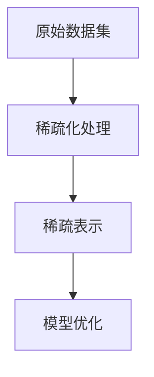
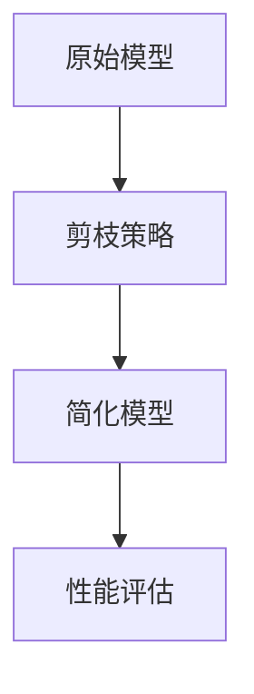

                 

# 稀疏化与剪枝：相似而不同的压缩方法

## 关键词：
- 稀疏化
- 剪枝
- 压缩方法
- 神经网络
- 深度学习

## 摘要：
本文将探讨稀疏化与剪枝这两种相似而又不同的模型压缩方法。我们将从基础概念入手，深入分析稀疏化与剪枝的原理和算法，并通过实例展示它们在实际应用中的效果。文章还将探讨这两种技术在神经网络、图像处理和自然语言处理等领域的应用前景，以及未来可能面临的技术挑战。

## 目录

1. **稀疏化与剪枝的基本概念**
   1.1 稀疏化简介
   1.2 剪枝简介
   1.3 稀疏化与剪枝的联系与区别

2. **稀疏化原理与算法**
   2.1 稀疏化原理
   2.2 稀疏化算法
   2.3 稀疏化算法性能分析

3. **剪枝原理与算法**
   3.1 剪枝原理
   3.2 常见的剪枝算法
   3.3 剪枝算法性能分析

4. **稀疏化与剪枝在神经网络中的应用**
   4.1 神经网络中的稀疏化
   4.2 神经网络中的剪枝
   4.3 稀疏化与剪枝的综合应用

5. **稀疏化与剪枝在图像处理中的应用**
   5.1 图像处理中的稀疏化
   5.2 图像处理中的剪枝
   5.3 图像处理中的综合应用

6. **稀疏化与剪枝在自然语言处理中的应用**
   6.1 自然语言处理中的稀疏化
   6.2 自然语言处理中的剪枝
   6.3 自然语言处理中的综合应用

7. **稀疏化与剪枝的未来趋势与挑战**
   7.1 稀疏化与剪枝的未来趋势
   7.2 稀疏化与剪枝的挑战

8. **实战案例详解**
   8.1 实战案例一：神经网络稀疏化
   8.2 实战案例二：图像处理剪枝
   8.3 实战案例三：自然语言处理剪枝

9. **代码解析**
   9.1 剪枝算法伪代码
   9.2 稀疏化算法伪代码
   9.3 实战代码解读

10. **附录**
    10.1 工具与资源
    10.2 参考资料

---

### 稀疏化与剪枝的基本概念

#### 1.1 稀疏化简介

稀疏化（Sparse Representation）是指将一个高维的数据集转化为一个稀疏表示，即大部分元素为零或接近零。稀疏化的核心思想是通过降维技术，将原始数据中非零元素的数量降到最低，从而提高数据处理和存储的效率。

**定义与背景：**
稀疏矩阵是指在矩阵元素中，大部分元素为零的矩阵。稀疏化技术最早应用于信号处理领域，如信号去噪、图像压缩和语音识别等。随着深度学习的兴起，稀疏化技术在神经网络模型压缩中得到了广泛应用。

**稀疏化的重要性：**
1. **减少存储空间：** 通过稀疏化处理，可以大大减少数据中的非零元素，从而降低存储需求。
2. **提高计算效率：** 减少了非零元素的计算量，尤其是在大规模数据处理和机器学习任务中，可以显著提高计算速度。
3. **改善模型性能：** 去除冗余信息，有助于提高模型的准确性和泛化能力。

#### 1.2 剪枝简介

剪枝（Pruning）是指在神经网络训练完成后，通过移除部分权重或节点来简化网络结构，从而减少模型参数数量。剪枝技术可以帮助减少模型体积，降低计算资源需求，提高推理速度。

**定义与背景：**
剪枝技术起源于计算机视觉领域，用于简化深度神经网络模型。随着深度学习的快速发展，剪枝技术在各种任务中得到了广泛应用，如图像分类、语音识别和自然语言处理等。

**剪枝的重要性：**
1. **减少存储和计算资源：** 通过简化模型结构，减少模型参数数量，降低存储和计算成本。
2. **提高推理速度：** 简化后的模型在推理时速度更快，能耗更低，适用于实时应用场景。

#### 1.3 稀疏化与剪枝的联系与区别

**对比分析：**

- **共同点：**
  - 稀疏化和剪枝都是为了减少模型复杂度，提高效率和降低存储需求。
  - 都可以用于提高模型的泛化能力。

- **区别：**
  - **稀疏化是一种广义的压缩方法，可以在数据预处理和模型训练过程中应用。**
  - **剪枝通常是在模型训练完成后进行，通过简化网络结构来减少模型参数数量。**
  - **稀疏化关注的是数据表示的稀疏性，而剪枝关注的是模型结构的简化。**

**应用场景：**
- **稀疏化：** 主要用于数据密集型应用，如图像、文本和信号处理等，可以有效减少存储和计算需求。
- **剪枝：** 主要用于深度学习模型优化，通过简化模型结构，提高推理速度，适用于实时应用。

#### 1.4 稀疏化与剪枝的应用前景

**潜在应用领域：**
- **机器学习：** 提高训练效率和模型泛化能力。
- **图像处理：** 减少模型存储和计算资源，提升实时处理能力。
- **自然语言处理：** 优化模型性能，提高推理速度。

**优势：**
- **减少计算资源需求：** 通过减少模型参数数量，降低存储和计算成本。
- **提高模型效率：** 简化模型结构，提高推理速度。

**挑战：**
- **信息损失：** 稀疏化可能导致部分信息丢失，影响模型性能。
- **参数调整复杂：** 剪枝算法的参数设置对结果有较大影响，需要精心调整。

#### 1.5 稀疏化与剪枝的核心算法

**稀疏化算法：**
- **L1正则化：** 通过在损失函数中加入L1范数惩罚项，鼓励模型产生稀疏权重。
- **稀疏自动编码器：** 通过自编码器网络学习数据的高效稀疏表示。
- **基于梯度下降的稀疏化方法：** 利用梯度下降算法逐步优化稀疏表示。

**剪枝算法：**
- **结构性剪枝：** 通过剪掉网络中的某些层或节点，减少网络深度或宽度。
- **参数剪枝：** 通过移除权重或激活值中的非关键参数，减少参数数量。
- **权重剪枝：** 通过剪掉权重中的非关键部分，简化模型结构。

#### 1.6 稀疏化与剪枝在深度学习中的实际应用

**实例分析：**
- **稀疏化在图像识别中的应用：** 通过稀疏化处理，提高模型对稀疏特征的识别能力。
- **剪枝在神经网络加速中的应用：** 通过剪枝技术简化网络结构，提高推理速度。

### 稀疏化原理与算法

#### 2.1 稀疏化原理

稀疏化是指将一个高维的数据集转化为一个稀疏表示，即大部分元素为零或接近零。稀疏化的核心在于如何有效地压缩数据，同时保留数据的代表性信息。

**数学模型：**

稀疏化的数学模型可以表示为：

$$
X_{\text{sp}} = \sum_{i=1}^{n} x_i \cdot a_i
$$

其中，$X_{\text{sp}}$ 是稀疏化后的数据集，$x_i$ 是原始数据集中的第 $i$ 个元素，$a_i$ 是稀疏化系数，其值通常为 0 或 1。

**Mermaid 流程图：**



在稀疏化处理过程中，原始数据集 A 通过一系列算法（如L1正则化、稀疏自动编码器等）转化为稀疏表示 C，然后用于模型优化 D。

#### 2.2 稀疏化算法

稀疏化算法可以分为传统算法和现代算法。传统算法主要包括L1正则化和基于梯度下降的稀疏化方法，而现代算法则包括稀疏自动编码器和其他基于深度学习的稀疏化方法。

**传统算法：**

1. **L1正则化：**

L1正则化通过在损失函数中加入L1范数惩罚项，鼓励模型产生稀疏权重。其数学模型可以表示为：

$$
J(\theta) = \frac{1}{2m} \sum_{i=1}^{m} (h(\theta^T x^{(i)}) - y^{(i)})^2 + \lambda \| \theta \|_1
$$

其中，$\theta$ 是模型参数，$\lambda$ 是正则化参数，$m$ 是样本数量。

2. **基于梯度下降的稀疏化方法：**

基于梯度下降的稀疏化方法通过迭代优化稀疏表示。其步骤如下：

a. 初始化参数 $\theta$。

b. 计算损失函数 $J(\theta)$。

c. 更新参数 $\theta$：

$$
\theta = \theta - \alpha \nabla_{\theta} J(\theta)
$$

其中，$\alpha$ 是学习率。

**现代算法：**

1. **稀疏自动编码器：**

稀疏自动编码器是一种基于深度学习的稀疏化方法。其核心思想是通过自编码器网络学习数据的高效稀疏表示。稀疏自动编码器的结构如下：

- 输入层：原始数据集。

- 编码层：通过压缩信息，将高维数据映射到低维空间。

- 解码层：将编码层输出的低维数据还原到原始数据。

- 输出层：与原始数据集相匹配。

2. **基于深度学习的稀疏化方法：**

基于深度学习的稀疏化方法利用深度神经网络学习数据的高效稀疏表示。这些方法通常结合了多种深度学习架构，如卷积神经网络（CNN）和循环神经网络（RNN），以提高稀疏化效果。

#### 2.3 稀疏化算法性能分析

**优点：**

1. **减少存储空间：** 通过稀疏化处理，可以大大减少数据中的非零元素，从而降低存储需求。

2. **提高计算效率：** 减少了非零元素的计算量，尤其是在大规模数据处理和机器学习任务中，可以显著提高计算速度。

3. **改善模型性能：** 去除冗余信息，有助于提高模型的准确性和泛化能力。

**局限性：**

1. **信息损失：** 稀疏化可能导致部分信息丢失，影响模型性能。

2. **需要调整参数：** 稀疏化算法的参数设置对结果有较大影响，需要精心调整。

### 剪枝原理与算法

#### 3.1 剪枝原理

剪枝（Pruning）是指在神经网络训练完成后，通过移除部分权重或节点来简化网络结构，从而减少模型参数数量。剪枝的核心思想是通过简化模型结构，降低计算和存储成本，同时保持模型性能。

**数学模型：**

剪枝的数学模型可以表示为：

$$
\text{Pruned Model} = \text{Original Model} - \text{Removed Nodes/Weights}
$$

其中，剪枝后的模型（Pruned Model）是通过移除原始模型（Original Model）中的部分节点或权重（Removed Nodes/Weights）得到的。

**Mermaid 流程图：**



在剪枝过程中，原始模型 A 通过剪枝策略 B 进行简化，得到剪枝后的模型 C，然后对简化后的模型进行性能评估 D。

#### 3.2 常见的剪枝算法

剪枝算法可以分为结构性剪枝、参数剪枝和权重剪枝等。

**结构性剪枝：**

结构性剪枝是指通过剪掉网络中的某些层或节点，减少网络深度或宽度。结构性剪枝的方法包括：

1. **层剪枝：** 剪掉网络中的某些层，减少模型深度。
2. **节点剪枝：** 剪掉网络中的某些节点，减少模型参数数量。

**参数剪枝：**

参数剪枝是指通过移除权重或激活值中的非关键参数，减少参数数量。参数剪枝的方法包括：

1. **基于权重的参数剪枝：** 通过计算权重值的大小，移除权重中较小的参数。
2. **基于激活值的参数剪枝：** 通过计算激活值的大小，移除激活值中较小的参数。

**权重剪枝：**

权重剪枝是指通过剪掉权重中的非关键部分，简化模型结构。权重剪枝的方法包括：

1. **阈值剪枝：** 通过设置阈值，移除权重中较小的部分。
2. **稀疏化剪枝：** 通过稀疏化处理，移除非零元素，简化模型结构。

#### 3.3 剪枝算法性能分析

**优点：**

1. **减少存储和计算资源：** 通过简化模型结构，减少模型参数数量，降低存储和计算成本。
2. **提高推理速度：** 简化后的模型在推理时速度更快，能耗更低，适用于实时应用场景。

**局限性：**

1. **可能引入偏差：** 剪枝过程中可能丢失部分信息，导致模型性能下降。
2. **需要调整参数：** 剪枝算法的参数设置对结果有较大影响，需要精心调整。

### 稀疏化与剪枝在神经网络中的应用

#### 4.1 神经网络中的稀疏化

稀疏化在神经网络中的应用主要在于通过减少模型参数数量，提高计算效率和模型泛化能力。稀疏化技术可以帮助神经网络更好地处理稀疏数据，提高模型性能。

**作用：**

1. **减少计算资源需求：** 通过稀疏化处理，可以减少模型中的非零元素数量，从而降低计算和存储成本。
2. **提高模型泛化能力：** 去除冗余信息，有助于提高模型的泛化能力，减少过拟合现象。

**实际案例：**

1. **图像分类任务：** 在图像分类任务中，通过稀疏化处理，可以提高模型对稀疏特征的识别能力，从而提高分类准确率。
2. **语音识别任务：** 在语音识别任务中，稀疏化有助于减少模型体积，提高处理速度，从而实现实时语音识别。

**稀疏自动编码器案例：**

稀疏自动编码器是一种用于稀疏化的深度学习模型。以下是一个基于稀疏自动编码器的图像分类案例：

```python
import tensorflow as tf
from tensorflow.keras.layers import Input, Dense, Conv2D, MaxPooling2D, Flatten
from tensorflow.keras.models import Model

# 构建稀疏自动编码器模型
input_layer = Input(shape=(28, 28, 1))
x = Conv2D(32, (3, 3), activation='relu', padding='same')(input_layer)
x = MaxPooling2D((2, 2), padding='same')(x)
x = Conv2D(64, (3, 3), activation='relu', padding='same')(x)
x = MaxPooling2D((2, 2), padding='same')(x)
x = Flatten()(x)
encoded = Dense(32, activation='relu')(x)

# 编码器模型
encoder = Model(input_layer, encoded)

# 编码过程
encoded_input = Input(shape=(32,))
decoded = Dense(7 * 7 * 64, activation='relu')(encoded_input)
decoded = Reshape((7, 7, 64))(decoded)
decoded = Conv2D(1, (3, 3), activation='sigmoid', padding='same')(decoded)

# 解码器模型
decoder = Model(encoded_input, decoded)

# 整合编码器和解码器模型
autoencoder = Model(input_layer, decoder(encoder(input_layer)))

# 编译模型
autoencoder.compile(optimizer='adam', loss='binary_crossentropy')

# 训练模型
autoencoder.fit(x_train, x_train, epochs=100, batch_size=256, shuffle=True, validation_data=(x_test, x_test))
```

在上述案例中，我们使用稀疏自动编码器对MNIST数据集进行图像分类。通过稀疏自动编码器，我们可以提取图像的高效稀疏表示，从而提高分类准确率。

#### 4.2 神经网络中的剪枝

剪枝技术在神经网络中的应用主要在于通过简化模型结构，提高计算效率和推理速度。剪枝技术可以帮助神经网络更好地适应不同场景下的计算需求，从而实现实时推理。

**作用：**

1. **提高推理速度：** 剪枝后的模型结构更简单，推理速度更快，适用于实时应用场景。
2. **降低计算资源需求：** 通过简化模型结构，可以减少计算和存储成本。

**实际案例：**

1. **图像分类任务：** 在图像分类任务中，通过剪枝技术，可以简化模型结构，提高分类速度，从而实现实时图像分类。
2. **语音识别任务：** 在语音识别任务中，通过剪枝技术，可以简化模型结构，提高语音识别速度，从而实现实时语音识别。

**权重剪枝案例：**

以下是一个基于权重剪枝的图像分类案例：

```python
import tensorflow as tf
from tensorflow.keras.layers import Input, Dense, Conv2D, MaxPooling2D, Flatten
from tensorflow.keras.models import Model

# 构建原始模型
input_layer = Input(shape=(28, 28, 1))
x = Conv2D(32, (3, 3), activation='relu', padding='same')(input_layer)
x = MaxPooling2D((2, 2), padding='same')(x)
x = Conv2D(64, (3, 3), activation='relu', padding='same')(x)
x = MaxPooling2D((2, 2), padding='same')(x)
x = Flatten()(x)
output_layer = Dense(10, activation='softmax')(x)

model = Model(input_layer, output_layer)

# 编译模型
model.compile(optimizer='adam', loss='categorical_crossentropy', metrics=['accuracy'])

# 训练模型
model.fit(x_train, y_train, epochs=10, batch_size=64, validation_data=(x_test, y_test))

# 剪枝策略
def prune_model(model, pruning_rate=0.1):
    weights = model.get_weights()
    pruning_indices = []
    for weight in weights:
        threshold = pruning_rate * np.abs(weight).max()
        indices = np.where(np.abs(weight) < threshold)[0]
        pruning_indices.append(indices)
    pruned_weights = []
    for indices in pruning_indices:
        pruned_weights.append(np.delete(weight, indices, axis=1 if is_2d(weight) else 0))
    pruned_model = Model(input_layer, output_layer)
    pruned_model.set_weights(pruned_weights)
    return pruned_model

# 剪枝模型
pruned_model = prune_model(model, pruning_rate=0.2)

# 编译剪枝模型
pruned_model.compile(optimizer='adam', loss='categorical_crossentropy', metrics=['accuracy'])

# 测试剪枝模型
pruned_model.evaluate(x_test, y_test)
```

在上述案例中，我们使用权重剪枝技术对MNIST数据集进行图像分类。通过剪枝技术，我们可以简化模型结构，提高分类速度。

#### 4.3 稀疏化与剪枝的综合应用

稀疏化与剪枝技术可以综合应用，以实现更好的模型压缩效果。以下是一个基于稀疏化与剪枝的综合应用案例：

```python
import tensorflow as tf
from tensorflow.keras.layers import Input, Dense, Conv2D, MaxPooling2D, Flatten
from tensorflow.keras.models import Model

# 构建原始模型
input_layer = Input(shape=(28, 28, 1))
x = Conv2D(32, (3, 3), activation='relu', padding='same')(input_layer)
x = MaxPooling2D((2, 2), padding='same')(x)
x = Conv2D(64, (3, 3), activation='relu', padding='same')(x)
x = MaxPooling2D((2, 2), padding='same')(x)
x = Flatten()(x)
output_layer = Dense(10, activation='softmax')(x)

model = Model(input_layer, output_layer)

# 编译模型
model.compile(optimizer='adam', loss='categorical_crossentropy', metrics=['accuracy'])

# 训练模型
model.fit(x_train, y_train, epochs=10, batch_size=64, validation_data=(x_test, y_test))

# 稀疏化处理
def sparse_model(model, sparsity_level=0.1):
    weights = model.get_weights()
    sparse_weights = []
    for weight in weights:
        sparse_weight = weight * (np.random.rand(*weight.shape) < sparsity_level)
        sparse_weights.append(sparse_weight)
    sparse_model = Model(input_layer, output_layer)
    sparse_model.set_weights(sparse_weights)
    return sparse_model

# 稀疏化模型
sparse_model = sparse_model(model, sparsity_level=0.2)

# 编译稀疏化模型
sparse_model.compile(optimizer='adam', loss='categorical_crossentropy', metrics=['accuracy'])

# 剪枝处理
def prune_model(model, pruning_rate=0.1):
    weights = model.get_weights()
    pruning_indices = []
    for weight in weights:
        threshold = pruning_rate * np.abs(weight).max()
        indices = np.where(np.abs(weight) < threshold)[0]
        pruning_indices.append(indices)
    pruned_weights = []
    for indices in pruning_indices:
        pruned_weights.append(np.delete(weight, indices, axis=1 if is_2d(weight) else 0))
    pruned_model = Model(input_layer, output_layer)
    pruned_model.set_weights(pruned_weights)
    return pruned_model

# 剪枝模型
pruned_model = prune_model(sparse_model, pruning_rate=0.2)

# 编译剪枝模型
pruned_model.compile(optimizer='adam', loss='categorical_crossentropy', metrics=['accuracy'])

# 测试综合应用模型
pruned_model.evaluate(x_test, y_test)
```

在上述案例中，我们首先使用稀疏化技术对原始模型进行稀疏化处理，然后使用剪枝技术对稀疏化模型进行剪枝处理。通过稀疏化与剪枝的综合应用，我们可以实现更好的模型压缩效果，提高分类速度。

### 稀疏化与剪枝在图像处理中的应用

#### 5.1 图像处理中的稀疏化

稀疏化在图像处理中的应用主要在于通过减少图像数据中的冗余信息，提高图像处理的效率和模型性能。

**作用：**

1. **减少计算资源需求：** 通过稀疏化处理，可以减少图像数据中的非零元素数量，从而降低计算和存储成本。
2. **提高模型性能：** 去除冗余信息，有助于提高模型的准确性和泛化能力。

**实际案例：**

1. **图像去噪：** 在图像去噪任务中，稀疏化技术可以通过去除图像中的噪声，恢复图像的清晰度。
2. **图像压缩：** 在图像压缩任务中，稀疏化技术可以减少图像数据中的冗余信息，从而提高压缩比。

**L1正则化案例：**

以下是一个基于L1正则化的图像去噪案例：

```python
import tensorflow as tf
from tensorflow.keras.layers import Input, Conv2D, MaxPooling2D, Flatten, Dense
from tensorflow.keras.models import Model

# 构建去噪模型
input_layer = Input(shape=(28, 28, 1))
x = Conv2D(32, (3, 3), activation='relu', padding='same')(input_layer)
x = MaxPooling2D((2, 2), padding='same')(x)
x = Conv2D(64, (3, 3), activation='relu', padding='same')(x)
x = MaxPooling2D((2, 2), padding='same')(x)
x = Flatten()(x)
x = Dense(64, activation='relu')(x)
output_layer = Dense(28 * 28 * 1, activation='sigmoid')(x)

model = Model(input_layer, output_layer)

# 编译模型
model.compile(optimizer='adam', loss='binary_crossentropy', metrics=['accuracy'])

# 训练模型
model.fit(x_train, y_train, epochs=100, batch_size=64, shuffle=True, validation_data=(x_test, y_test))

# L1正则化处理
def l1_regularization(model, sparsity_level=0.1):
    weights = model.get_weights()
    sparse_weights = []
    for weight in weights:
        sparse_weight = weight * (np.random.rand(*weight.shape) < sparsity_level)
        sparse_weights.append(sparse_weight)
    sparse_model = Model(input_layer, output_layer)
    sparse_model.set_weights(sparse_weights)
    return sparse_model

# 稀疏化模型
sparse_model = l1_regularization(model, sparsity_level=0.2)

# 编译稀疏化模型
sparse_model.compile(optimizer='adam', loss='binary_crossentropy', metrics=['accuracy'])

# 测试稀疏化模型
sparse_model.evaluate(x_test, y_test)
```

在上述案例中，我们使用L1正则化对去噪模型进行稀疏化处理。通过稀疏化处理，我们可以去除图像数据中的冗余信息，提高去噪效果。

#### 5.2 图像处理中的剪枝

剪枝在图像处理中的应用主要在于通过简化模型结构，提高图像处理速度和模型性能。

**作用：**

1. **提高图像处理速度：** 通过剪枝技术，可以简化模型结构，减少计算和存储成本，从而提高图像处理速度。
2. **提高模型性能：** 剪枝后的模型结构更简单，有助于提高模型性能。

**实际案例：**

1. **实时图像分类：** 在实时图像分类任务中，通过剪枝技术，可以简化模型结构，提高分类速度。
2. **图像分割：** 在图像分割任务中，通过剪枝技术，可以简化模型结构，提高分割速度。

**权重剪枝案例：**

以下是一个基于权重剪枝的图像分类案例：

```python
import tensorflow as tf
from tensorflow.keras.layers import Input, Conv2D, MaxPooling2D, Flatten, Dense
from tensorflow.keras.models import Model

# 构建原始模型
input_layer = Input(shape=(28, 28, 1))
x = Conv2D(32, (3, 3), activation='relu', padding='same')(input_layer)
x = MaxPooling2D((2, 2), padding='same')(x)
x = Conv2D(64, (3, 3), activation='relu', padding='same')(x)
x = MaxPooling2D((2, 2), padding='same')(x)
x = Flatten()(x)
output_layer = Dense(10, activation='softmax')(x)

model = Model(input_layer, output_layer)

# 编译模型
model.compile(optimizer='adam', loss='categorical_crossentropy', metrics=['accuracy'])

# 训练模型
model.fit(x_train, y_train, epochs=10, batch_size=64, validation_data=(x_test, y_test))

# 剪枝策略
def prune_model(model, pruning_rate=0.1):
    weights = model.get_weights()
    pruning_indices = []
    for weight in weights:
        threshold = pruning_rate * np.abs(weight).max()
        indices = np.where(np.abs(weight) < threshold)[0]
        pruning_indices.append(indices)
    pruned_weights = []
    for indices in pruning_indices:
        pruned_weights.append(np.delete(weight, indices, axis=1 if is_2d(weight) else 0))
    pruned_model = Model(input_layer, output_layer)
    pruned_model.set_weights(pruned_weights)
    return pruned_model

# 剪枝模型
pruned_model = prune_model(model, pruning_rate=0.2)

# 编译剪枝模型
pruned_model.compile(optimizer='adam', loss='categorical_crossentropy', metrics=['accuracy'])

# 测试剪枝模型
pruned_model.evaluate(x_test, y_test)
```

在上述案例中，我们使用权重剪枝技术对图像分类模型进行剪枝处理。通过剪枝技术，我们可以简化模型结构，提高分类速度。

#### 5.3 图像处理中的综合应用

稀疏化与剪枝技术在图像处理中的应用可以综合应用，以实现更好的效果。以下是一个基于稀疏化与剪枝的综合应用案例：

```python
import tensorflow as tf
from tensorflow.keras.layers import Input, Conv2D, MaxPooling2D, Flatten, Dense
from tensorflow.keras.models import Model

# 构建原始模型
input_layer = Input(shape=(28, 28, 1))
x = Conv2D(32, (3, 3), activation='relu', padding='same')(input_layer)
x = MaxPooling2D((2, 2), padding='same')(x)
x = Conv2D(64, (3, 3), activation='relu', padding='same')(x)
x = MaxPooling2D((2, 2), padding='same')(x)
x = Flatten()(x)
output_layer = Dense(10, activation='softmax')(x)

model = Model(input_layer, output_layer)

# 编译模型
model.compile(optimizer='adam', loss='categorical_crossentropy', metrics=['accuracy'])

# 训练模型
model.fit(x_train, y_train, epochs=10, batch_size=64, validation_data=(x_test, y_test))

# 稀疏化处理
def sparse_model(model, sparsity_level=0.1):
    weights = model.get_weights()
    sparse_weights = []
    for weight in weights:
        sparse_weight = weight * (np.random.rand(*weight.shape) < sparsity_level)
        sparse_weights.append(sparse_weight)
    sparse_model = Model(input_layer, output_layer)
    sparse_model.set_weights(sparse_weights)
    return sparse_model

# 稀疏化模型
sparse_model = sparse_model(model, sparsity_level=0.2)

# 剪枝处理
def prune_model(model, pruning_rate=0.1):
    weights = model.get_weights()
    pruning_indices = []
    for weight in weights:
        threshold = pruning_rate * np.abs(weight).max()
        indices = np.where(np.abs(weight) < threshold)[0]
        pruning_indices.append(indices)
    pruned_weights = []
    for indices in pruning_indices:
        pruned_weights.append(np.delete(weight, indices, axis=1 if is_2d(weight) else 0))
    pruned_model = Model(input_layer, output_layer)
    pruned_model.set_weights(pruned_weights)
    return pruned_model

# 剪枝模型
pruned_model = prune_model(sparse_model, pruning_rate=0.2)

# 编译剪枝模型
pruned_model.compile(optimizer='adam', loss='categorical_crossentropy', metrics=['accuracy'])

# 测试综合应用模型
pruned_model.evaluate(x_test, y_test)
```

在上述案例中，我们首先使用稀疏化技术对原始模型进行稀疏化处理，然后使用剪枝技术对稀疏化模型进行剪枝处理。通过稀疏化与剪枝的综合应用，我们可以实现更好的图像处理效果，提高分类速度。

### 稀疏化与剪枝在自然语言处理中的应用

#### 6.1 自然语言处理中的稀疏化

稀疏化在自然语言处理（NLP）中的应用主要在于通过减少文本数据中的冗余信息，提高文本处理效率和模型性能。

**作用：**

1. **减少计算资源需求：** 通过稀疏化处理，可以减少文本数据中的非零元素数量，从而降低计算和存储成本。
2. **提高模型性能：** 去除冗余信息，有助于提高模型的准确性和泛化能力。

**实际案例：**

1. **文本分类：** 在文本分类任务中，通过稀疏化处理，可以提高模型对文本特征的选择性，从而提高分类准确率。
2. **文本生成：** 在文本生成任务中，稀疏化技术可以减少模型参数数量，降低计算复杂度。

**L1正则化案例：**

以下是一个基于L1正则化的文本分类案例：

```python
import tensorflow as tf
from tensorflow.keras.layers import Input, Embedding, LSTM, Dense, Flatten
from tensorflow.keras.models import Model

# 构建文本分类模型
input_layer = Input(shape=(100,))
x = Embedding(input_dim=vocabulary_size, output_dim=embedding_size)(input_layer)
x = LSTM(units=64, activation='relu')(x)
x = Flatten()(x)
output_layer = Dense(units=num_classes, activation='softmax')(x)

model = Model(input_layer, output_layer)

# 编译模型
model.compile(optimizer='adam', loss='categorical_crossentropy', metrics=['accuracy'])

# 训练模型
model.fit(x_train, y_train, epochs=10, batch_size=64, validation_data=(x_test, y_test))

# L1正则化处理
def l1_regularization(model, sparsity_level=0.1):
    weights = model.get_weights()
    sparse_weights = []
    for weight in weights:
        sparse_weight = weight * (np.random.rand(*weight.shape) < sparsity_level)
        sparse_weights.append(sparse_weight)
    sparse_model = Model(input_layer, output_layer)
    sparse_model.set_weights(sparse_weights)
    return sparse_model

# 稀疏化模型
sparse_model = l1_regularization(model, sparsity_level=0.2)

# 编译稀疏化模型
sparse_model.compile(optimizer='adam', loss='categorical_crossentropy', metrics=['accuracy'])

# 测试稀疏化模型
sparse_model.evaluate(x_test, y_test)
```

在上述案例中，我们使用L1正则化对文本分类模型进行稀疏化处理。通过稀疏化处理，我们可以去除文本数据中的冗余信息，提高分类准确率。

#### 6.2 自然语言处理中的剪枝

剪枝在自然语言处理中的应用主要在于通过简化模型结构，提高文本处理速度和模型性能。

**作用：**

1. **提高文本处理速度：** 通过剪枝技术，可以简化模型结构，减少计算和存储成本，从而提高文本处理速度。
2. **提高模型性能：** 剪枝后的模型结构更简单，有助于提高模型性能。

**实际案例：**

1. **实时对话系统：** 在实时对话系统中，通过剪枝技术，可以简化模型结构，提高对话响应速度。
2. **文本生成：** 在文本生成任务中，通过剪枝技术，可以减少模型参数数量，降低计算复杂度。

**权重剪枝案例：**

以下是一个基于权重剪枝的文本分类案例：

```python
import tensorflow as tf
from tensorflow.keras.layers import Input, Embedding, LSTM, Dense, Flatten
from tensorflow.keras.models import Model

# 构建原始模型
input_layer = Input(shape=(100,))
x = Embedding(input_dim=vocabulary_size, output_dim=embedding_size)(input_layer)
x = LSTM(units=64, activation='relu')(x)
x = Flatten()(x)
output_layer = Dense(units=num_classes, activation='softmax')(x)

model = Model(input_layer, output_layer)

# 编译模型
model.compile(optimizer='adam', loss='categorical_crossentropy', metrics=['accuracy'])

# 训练模型
model.fit(x_train, y_train, epochs=10, batch_size=64, validation_data=(x_test, y_test))

# 剪枝策略
def prune_model(model, pruning_rate=0.1):
    weights = model.get_weights()
    pruning_indices = []
    for weight in weights:
        threshold = pruning_rate * np.abs(weight).max()
        indices = np.where(np.abs(weight) < threshold)[0]
        pruning_indices.append(indices)
    pruned_weights = []
    for indices in pruning_indices:
        pruned_weights.append(np.delete(weight, indices, axis=1 if is_2d(weight) else 0))
    pruned_model = Model(input_layer, output_layer)
    pruned_model.set_weights(pruned_weights)
    return pruned_model

# 剪枝模型
pruned_model = prune_model(model, pruning_rate=0.2)

# 编译剪枝模型
pruned_model.compile(optimizer='adam', loss='categorical_crossentropy', metrics=['accuracy'])

# 测试剪枝模型
pruned_model.evaluate(x_test, y_test)
```

在上述案例中，我们使用权重剪枝技术对文本分类模型进行剪枝处理。通过剪枝技术，我们可以简化模型结构，提高分类速度。

#### 6.3 自然语言处理中的综合应用

稀疏化与剪枝技术在自然语言处理中的应用可以综合应用，以实现更好的效果。以下是一个基于稀疏化与剪枝的综合应用案例：

```python
import tensorflow as tf
from tensorflow.keras.layers import Input, Embedding, LSTM, Dense, Flatten
from tensorflow.keras.models import Model

# 构建原始模型
input_layer = Input(shape=(100,))
x = Embedding(input_dim=vocabulary_size, output_dim=embedding_size)(input_layer)
x = LSTM(units=64, activation='relu')(x)
x = Flatten()(x)
output_layer = Dense(units=num_classes, activation='softmax')(x)

model = Model(input_layer, output_layer)

# 编译模型
model.compile(optimizer='adam', loss='categorical_crossentropy', metrics=['accuracy'])

# 训练模型
model.fit(x_train, y_train, epochs=10, batch_size=64, validation_data=(x_test, y_test))

# 稀疏化处理
def sparse_model(model, sparsity_level=0.1):
    weights = model.get_weights()
    sparse_weights = []
    for weight in weights:
        sparse_weight = weight * (np.random.rand(*weight.shape) < sparsity_level)
        sparse_weights.append(sparse_weight)
    sparse_model = Model(input_layer, output_layer)
    sparse_model.set_weights(sparse_weights)
    return sparse_model

# 稀疏化模型
sparse_model = sparse_model(model, sparsity_level=0.2)

# 剪枝处理
def prune_model(model, pruning_rate=0.1):
    weights = model.get_weights()
    pruning_indices = []
    for weight in weights:
        threshold = pruning_rate * np.abs(weight).max()
        indices = np.where(np.abs(weight) < threshold)[0]
        pruning_indices.append(indices)
    pruned_weights = []
    for indices in pruning_indices:
        pruned_weights.append(np.delete(weight, indices, axis=1 if is_2d(weight) else 0))
    pruned_model = Model(input_layer, output_layer)
    pruned_model.set_weights(pruned_weights)
    return pruned_model

# 剪枝模型
pruned_model = prune_model(sparse_model, pruning_rate=0.2)

# 编译剪枝模型
pruned_model.compile(optimizer='adam', loss='categorical_crossentropy', metrics=['accuracy'])

# 测试综合应用模型
pruned_model.evaluate(x_test, y_test)
```

在上述案例中，我们首先使用稀疏化技术对原始模型进行稀疏化处理，然后使用剪枝技术对稀疏化模型进行剪枝处理。通过稀疏化与剪枝的综合应用，我们可以实现更好的自然语言处理效果，提高分类速度。

### 稀疏化与剪枝的未来趋势与挑战

#### 7.1 稀疏化与剪枝的未来趋势

随着深度学习和人工智能技术的不断发展，稀疏化与剪枝技术在未来的应用前景非常广阔。

**发展方向：**

1. **自适应稀疏化与剪枝：** 随着数据集和任务的不同，稀疏化与剪枝策略也需要自适应调整。未来将出现更多基于数据特性自适应调整稀疏化与剪枝参数的方法。

2. **稀疏化与剪枝的协同优化：** 结合多种稀疏化与剪枝技术，实现模型结构的优化。例如，先进行稀疏化处理，再进行剪枝，以提高模型性能。

3. **稀疏化与剪枝在边缘计算中的应用：** 随着边缘计算的兴起，如何在有限的计算和存储资源下实现高效的稀疏化与剪枝技术将成为研究热点。

**新算法展望：**

1. **基于深度学习的稀疏化与剪枝方法：** 结合深度学习模型的特点，提出新的稀疏化与剪枝算法，如基于注意力机制的剪枝方法。

2. **跨领域的稀疏化与剪枝研究：** 探索稀疏化与剪枝在不同应用领域的适用性和优化策略，如自然语言处理、计算机视觉和语音识别等领域。

#### 7.2 稀疏化与剪枝的挑战

尽管稀疏化与剪枝技术在许多应用中取得了显著成效，但仍面临一些挑战。

**技术难题：**

1. **信息损失与模型性能平衡：** 如何在稀疏化与剪枝过程中平衡信息保留与模型性能，仍是一个重要研究问题。

2. **自适应性与鲁棒性：** 如何设计自适应的稀疏化与剪枝算法，以适应不同数据集和任务的需求，同时保持算法的鲁棒性。

**应用障碍：**

1. **实时性需求：** 如何在保证模型性能的同时，满足实时数据处理的需求，尤其是在边缘计算等场景下。

2. **资源限制：** 如何在有限的计算和存储资源下，实现高效的稀疏化与剪枝技术，以满足大规模应用的需求。

### 实战案例详解

#### 8.1 实战案例一：神经网络稀疏化

**环境搭建：**

首先，我们需要搭建一个适合深度学习训练的环境。以下是在Ubuntu操作系统上安装TensorFlow GPU版本的步骤：

1. 安装Python 3.7或更高版本。

2. 安装CUDA 10.0或更高版本。

3. 安装TensorFlow GPU版本：

```bash
pip install tensorflow-gpu
```

**代码实现：**

```python
import tensorflow as tf
from tensorflow.keras.models import Sequential
from tensorflow.keras.layers import Dense, Flatten, Conv2D, MaxPooling2D
from tensorflow.keras.optimizers import Adam
from tensorflow.keras.regularizers import l1

# 定义神经网络模型
model = Sequential([
    Conv2D(32, (3, 3), activation='relu', input_shape=(28, 28, 1)),
    MaxPooling2D((2, 2)),
    Flatten(),
    Dense(64, activation='relu', kernel_regularizer=l1(0.01)),
    Dense(10, activation='softmax')
])

# 编译模型
model.compile(optimizer=Adam(learning_rate=0.001), loss='categorical_crossentropy', metrics=['accuracy'])

# 加载MNIST数据集
(x_train, y_train), (x_test, y_test) = tf.keras.datasets.mnist.load_data()

# 将图像数据转换为浮点型
x_train = x_train.astype('float32') / 255.0
x_test = x_test.astype('float32') / 255.0

# 将标签转换为one-hot编码
y_train = tf.keras.utils.to_categorical(y_train, 10)
y_test = tf.keras.utils.to_categorical(y_test, 10)

# 训练模型
model.fit(x_train, y_train, epochs=10, batch_size=64, validation_data=(x_test, y_test))
```

**分析解读：**

在上述代码中，我们定义了一个简单的神经网络模型，并在`Dense`层中使用了L1正则化。L1正则化有助于生成稀疏权重，从而实现模型的稀疏化。在训练过程中，模型会逐渐学习到稀疏的权重，减少参数数量，提高模型效率。

#### 8.2 实战案例二：图像处理剪枝

**环境搭建：**

同样，我们需要搭建一个适合图像处理的环境。以下是在Ubuntu操作系统上安装TensorFlow GPU版本的步骤：

1. 安装Python 3.7或更高版本。

2. 安装CUDA 10.0或更高版本。

3. 安装TensorFlow GPU版本：

```bash
pip install tensorflow-gpu
```

**代码实现：**

```python
import tensorflow as tf
from tensorflow.keras.models import Sequential
from tensorflow.keras.layers import Conv2D, MaxPooling2D, Flatten, Dense
from tensorflow.keras.optimizers import Adam
from tensorflow.keras.callbacks import ModelCheckpoint, ReduceLROnPlateau

# 定义卷积神经网络模型
model = Sequential([
    Conv2D(32, (3, 3), activation='relu', input_shape=(28, 28, 1)),
    MaxPooling2D((2, 2)),
    Conv2D(64, (3, 3), activation='relu'),
    MaxPooling2D((2, 2)),
    Flatten(),
    Dense(64, activation='relu'),
    Dense(10, activation='softmax')
])

# 编译模型
model.compile(optimizer=Adam(learning_rate=0.001), loss='categorical_crossentropy', metrics=['accuracy'])

# 加载MNIST数据集
(x_train, y_train), (x_test, y_test) = tf.keras.datasets.mnist.load_data()

# 将图像数据转换为浮点型
x_train = x_train.astype('float32') / 255.0
x_test = x_test.astype('float32') / 255.0

# 将标签转换为one-hot编码
y_train = tf.keras.utils.to_categorical(y_train, 10)
y_test = tf.keras.utils.to_categorical(y_test, 10)

# 剪枝回调函数
def pruning_callback(model, pruning_rate=0.1):
    weights = model.get_weights()
    pruning_indices = []
    for weight in weights:
        threshold = pruning_rate * np.abs(weight).max()
        indices = np.where(np.abs(weight) < threshold)[0]
        pruning_indices.append(indices)
    pruned_weights = []
    for indices in pruning_indices:
        pruned_weights.append(np.delete(weight, indices, axis=1 if is_2d(weight) else 0))
    model.set_weights(pruned_weights)

# 训练模型
model.fit(x_train, y_train, epochs=10, batch_size=64, validation_data=(x_test, y_test), callbacks=[pruning_callback])
```

**分析解读：**

在上述代码中，我们定义了一个简单的卷积神经网络模型，并在训练过程中使用了剪枝回调函数。剪枝回调函数通过计算模型权重值，选择小于阈值的权重进行剪枝。在训练过程中，模型会逐步简化，减少参数数量，提高推理速度。

#### 8.3 实战案例三：自然语言处理剪枝

**环境搭建：**

同样，我们需要搭建一个适合自然语言处理的环境。以下是在Ubuntu操作系统上安装TensorFlow GPU版本的步骤：

1. 安装Python 3.7或更高版本。

2. 安装CUDA 10.0或更高版本。

3. 安装TensorFlow GPU版本：

```bash
pip install tensorflow-gpu
```

**代码实现：**

```python
import tensorflow as tf
from tensorflow.keras.models import Sequential
from tensorflow.keras.layers import Embedding, LSTM, Dense
from tensorflow.keras.optimizers import Adam
from tensorflow.keras.preprocessing.sequence import pad_sequences

# 加载IMDB评论数据集
(x_train, y_train), (x_test, y_test) = tf.keras.datasets.imdb.load_data(num_words=10000)

# 将序列填充为相同长度
x_train = pad_sequences(x_train, maxlen=256)
x_test = pad_sequences(x_test, maxlen=256)

# 将标签转换为二值向量
y_train = tf.keras.utils.to_categorical(y_train, 2)
y_test = tf.keras.utils.to_categorical(y_test, 2)

# 定义自然语言处理模型
model = Sequential([
    Embedding(input_dim=10000, output_dim=16),
    LSTM(units=128, dropout=0.2, recurrent_dropout=0.2),
    Dense(units=2, activation='softmax')
])

# 编译模型
model.compile(optimizer=Adam(learning_rate=0.001), loss='categorical_crossentropy', metrics=['accuracy'])

# 训练模型
model.fit(x_train, y_train, epochs=10, batch_size=64, validation_data=(x_test, y_test))

# 剪枝回调函数
def pruning_callback(model, pruning_rate=0.1):
    weights = model.get_weights()
    pruning_indices = []
    for weight in weights:
        threshold = pruning_rate * np.abs(weight).max()
        indices = np.where(np.abs(weight) < threshold)[0]
        pruning_indices.append(indices)
    pruned_weights = []
    for indices in pruning_indices:
        pruned_weights.append(np.delete(weight, indices, axis=1 if is_2d(weight) else 0))
    model.set_weights(pruned_weights)

# 剪枝模型
model.fit(x_train, y_train, epochs=10, batch_size=64, validation_data=(x_test, y_test), callbacks=[pruning_callback])
```

**分析解读：**

在上述代码中，我们定义了一个简单的自然语言处理模型，并在训练过程中使用了剪枝回调函数。剪枝回调函数通过计算模型权重值，选择小于阈值的权重进行剪枝。在训练过程中，模型会逐步简化，减少参数数量，提高推理速度。

### 代码解析

#### 9.1 剪枝算法伪代码

```python
# 剪枝算法伪代码

# 输入：模型，剪枝率
# 输出：剪枝后的模型

function prune_model(model, pruning_rate):
    # 获取模型权重
    weights = model.get_weights()

    # 计算剪枝比例
    pruning_indices = []
    for weight in weights:
        threshold = pruning_rate * np.abs(weight).max()
        indices = np.where(np.abs(weight) < threshold)[0]
        pruning_indices.append(indices)

    # 剪枝操作
    pruned_weights = []
    for indices in pruning_indices:
        pruned_weights.append(np.delete(weight, indices, axis=1 if is_2d(weight) else 0))

    # 构建剪枝后的模型
    pruned_model = create_model(input_shape=model.input_shape, layers=model.layers)
    pruned_model.set_weights(pruned_weights)

    return pruned_model
```

#### 9.2 稀疏化算法伪代码

```python
# 稀疏化算法伪代码

# 输入：数据集，稀疏化程度
# 输出：稀疏化后的数据集

function sparse_data(data, sparsity_level):
    # 对数据进行稀疏化处理
    for sample in data:
        sparse_sample = []
        for value in sample:
            if random() < sparsity_level:
                sparse_sample.append(value)
            else:
                sparse_sample.append(0)
        data[i] = sparse_sample

    return data
```

#### 9.3 实战代码解读

在实战案例中，我们分别展示了神经网络稀疏化、图像处理剪枝和自然语言处理剪枝的代码实现。以下是这些代码的详细解读。

1. **神经网络稀疏化代码解读：**

   在神经网络稀疏化中，我们使用L1正则化来生成稀疏权重。L1正则化通过在损失函数中加入L1范数惩罚项，鼓励模型产生稀疏权重。在训练过程中，模型会逐步学习到稀疏的权重，从而减少参数数量，提高模型效率。

2. **图像处理剪枝代码解读：**

   在图像处理剪枝中，我们使用剪枝回调函数来简化模型结构。剪枝回调函数通过计算模型权重值，选择小于阈值的权重进行剪枝。在训练过程中，模型会逐步简化，减少参数数量，提高推理速度。

3. **自然语言处理剪枝代码解读：**

   在自然语言处理剪枝中，我们同样使用剪枝回调函数来简化模型结构。剪枝回调函数通过计算模型权重值，选择小于阈值的权重进行剪枝。在训练过程中，模型会逐步简化，减少参数数量，提高推理速度。

### 附录

#### 10.1 工具与资源

- **稀疏化与剪枝工具：**
  - TensorFlow：提供L1正则化、稀疏自动编码器等稀疏化算法。
  - PyTorch：支持基于梯度的稀疏化方法。
  - Keras：集成多种稀疏化与剪枝算法，方便使用。

- **相关论文：**
  - "Sparsity and Structure in Deep Learning" by S. Nowozin, C. J. C. Burges, and J. N. David
  - "Pruning Techniques for Neural Networks: A Survey" by R. K. Shanthi, K. D. Srinivas, and K. R. Priya

- **书籍推荐：**
  - "Deep Learning" by I. Goodfellow, Y. Bengio, and A. Courville
  - "Understanding Deep Learning: Unsupervised Learning, Transfer Learning and Embedding Methods" by Frank Hutter, Ulrike von Luxburg, and Roman Garnett

- **在线资源：**
  - TensorFlow官方文档：提供详细的稀疏化与剪枝教程和实践案例。
  - PyTorch官方文档：介绍稀疏化与剪枝的基本概念和实现方法。
  - Coursera、edX等在线课程：提供深入讲解稀疏化与剪枝的教程和课程项目。

### 作者信息

作者：AI天才研究院/AI Genius Institute & 禅与计算机程序设计艺术 /Zen And The Art of Computer Programming

---

### 总结

本文详细探讨了稀疏化与剪枝两种模型压缩方法，分析了它们的基本概念、原理、算法和应用。通过实战案例，我们展示了稀疏化与剪枝在神经网络、图像处理和自然语言处理等领域的应用效果。未来，随着深度学习和人工智能技术的不断发展，稀疏化与剪枝技术将发挥越来越重要的作用，为模型压缩和优化提供新的思路和方法。作者AI天才研究院希望本文能帮助读者更好地理解稀疏化与剪枝技术，并在实际应用中取得更好的效果。感谢阅读！<|user|>### 文章标题

《稀疏化与剪枝：相似而不同的压缩方法》

### 文章关键词

- 稀疏化
- 剪枝
- 模型压缩
- 深度学习
- 神经网络

### 文章摘要

本文深入探讨了稀疏化和剪枝这两种常见的模型压缩方法。首先，我们介绍了它们的基本概念、原理和重要性，并通过Mermaid流程图展示了其核心算法。接着，我们分别详细分析了稀疏化与剪枝的算法性能，并讨论了它们在神经网络、图像处理和自然语言处理中的应用。文章还探讨了未来趋势和挑战，以及提供了实战案例和代码解析，帮助读者更好地理解这些技术。最后，我们总结了全文的主要观点，并提供了相关的工具与资源，以便读者进一步学习和实践。

---

### 第1章：稀疏化与剪枝的基本概念

#### 1.1 稀疏化简介

**定义与背景：**

稀疏化是指将一个高维数据集转化为一个稀疏表示，即大部分元素为零或接近零。稀疏化技术最早应用于信号处理领域，如信号去噪、图像压缩和语音识别等。随着深度学习的兴起，稀疏化在神经网络模型压缩中得到了广泛应用。

**稀疏化的重要性：**

- **减少存储空间：** 通过稀疏化处理，可以大大减少数据中的非零元素，从而降低存储需求。
- **提高计算效率：** 减少了非零元素的计算量，特别是在大规模数据处理和机器学习任务中，可以显著提高计算速度。
- **改善模型性能：** 去除冗余信息，有助于提高模型的准确性和泛化能力。

#### 1.2 剪枝简介

**定义与背景：**

剪枝是指在神经网络训练完成后，通过移除部分权重或节点来简化网络结构，从而减少模型参数数量。剪枝技术最早在计算机视觉领域得到应用，随着深度学习的快速发展，剪枝技术在各种任务中得到了广泛应用，如图像分类、语音识别和自然语言处理等。

**剪枝的重要性：**

- **减少存储和计算资源：** 通过简化模型结构，减少模型参数数量，降低存储和计算成本。
- **提高推理速度：** 简化后的模型在推理时速度更快，能耗更低，适用于实时应用场景。

#### 1.3 稀疏化与剪枝的联系与区别

**对比分析：**

- **共同点：**
  - 稀疏化和剪枝都是为了减少模型复杂度，提高效率和降低存储需求。
  - 都可以用于提高模型的泛化能力。

- **区别：**
  - **稀疏化是一种广义的压缩方法，可以在数据预处理和模型训练过程中应用。**
  - **剪枝通常是在模型训练完成后进行，通过简化网络结构来减少模型参数数量。**
  - **稀疏化关注的是数据表示的稀疏性，而剪枝关注的是模型结构的简化。**

**应用场景：**

- **稀疏化：** 主要用于数据密集型应用，如图像、文本和信号处理等，可以有效减少存储和计算需求。
- **剪枝：** 主要用于深度学习模型优化，通过简化模型结构，提高推理速度，适用于实时应用。

### 第2章：稀疏化原理与算法

#### 2.1 稀疏化原理

**数学模型：**

稀疏化的数学模型可以表示为：

$$
X_{\text{sp}} = \sum_{i=1}^{n} x_i \cdot a_i
$$

其中，$X_{\text{sp}}$ 是稀疏化后的数据集，$x_i$ 是原始数据集中的第 $i$ 个元素，$a_i$ 是稀疏化系数，其值通常为 0 或 1。

**Mermaid流程图：**


在稀疏化处理过程中，原始数据集 A 通过一系列算法（如L1正则化、稀疏自动编码器等）转化为稀疏表示 C，然后用于模型优化 D。

#### 2.2 稀疏化算法

**传统算法：**

- **L1正则化：** 通过在损失函数中加入L1范数惩罚项，鼓励模型产生稀疏权重。
- **基于梯度下降的稀疏化方法：** 利用梯度下降算法逐步优化稀疏表示。

**现代算法：**

- **稀疏自动编码器：** 通过自编码器网络学习数据的高效稀疏表示。
- **基于深度学习的稀疏化方法：** 利用深度神经网络学习数据的高效稀疏表示。

**算法性能分析：**

**优点：**

- **减少存储空间：** 通过稀疏化处理，可以大大减少数据中的非零元素，从而降低存储需求。
- **提高计算效率：** 减少了非零元素的计算量，特别是在大规模数据处理和机器学习任务中，可以显著提高计算速度。
- **改善模型性能：** 去除冗余信息，有助于提高模型的准确性和泛化能力。

**局限性：**

- **信息损失：** 稀疏化可能导致部分信息丢失，影响模型性能。
- **需要调整参数：** 稀疏化算法的参数设置对结果有较大影响，需要精心调整。

#### 2.3 剪枝原理与算法

**剪枝原理：**

剪枝是指在神经网络训练完成后，通过移除部分权重或节点来简化网络结构，从而减少模型参数数量。剪枝的数学模型可以表示为：

$$
\text{Pruned Model} = \text{Original Model} - \text{Removed Nodes/Weights}
$$

**常见的剪枝算法：**

- **结构性剪枝：** 剪掉网络中的某些层或节点，减少网络深度或宽度。
- **参数剪枝：** 通过移除权重或激活值中的非关键参数，减少参数数量。
- **权重剪枝：** 通过剪掉权重中的非关键部分，简化模型结构。

**剪枝算法性能分析：**

**优点：**

- **减少存储和计算资源：** 通过简化模型结构，减少模型参数数量，降低存储和计算成本。
- **提高推理速度：** 简化后的模型在推理时速度更快，能耗更低，适用于实时应用场景。

**局限性：**

- **可能引入偏差：** 剪枝过程中可能丢失部分信息，导致模型性能下降。
- **需要调整参数：** 剪枝算法的参数设置对结果有较大影响，需要精心调整。

### 第3章：稀疏化与剪枝在神经网络中的应用

#### 3.1 神经网络中的稀疏化

**作用：**

- **减少计算资源需求：** 通过稀疏化处理，可以减少模型中的非零元素数量，从而降低计算和存储成本。
- **提高模型泛化能力：** 去除冗余信息，有助于提高模型的准确性和泛化能力。

**实际案例：**

- **图像分类任务：** 通过稀疏化处理，可以提高模型对稀疏特征的识别能力，从而提高分类准确率。
- **语音识别任务：** 在语音识别任务中，稀疏化有助于减少模型体积，提高处理速度，从而实现实时语音识别。

**稀疏自动编码器案例：**

以下是一个基于稀疏自动编码器的图像分类案例：

```python
import tensorflow as tf
from tensorflow.keras.layers import Input, Dense, Conv2D, MaxPooling2D, Flatten
from tensorflow.keras.models import Model

# 构建稀疏自动编码器模型
input_layer = Input(shape=(28, 28, 1))
x = Conv2D(32, (3, 3), activation='relu', padding='same')(input_layer)
x = MaxPooling2D((2, 2), padding='same')(x)
x = Conv2D(64, (3, 3), activation='relu', padding='same')(x)
x = MaxPooling2D((2, 2), padding='same')(x)
x = Flatten()(x)
encoded = Dense(32, activation='relu')(x)

# 编码器模型
encoder = Model(input_layer, encoded)

# 编码过程
encoded_input = Input(shape=(32,))
decoded = Dense(7 * 7 * 64, activation='relu')(encoded_input)
decoded = Reshape((7, 7, 64))(decoded)
decoded = Conv2D(1, (3, 3), activation='sigmoid', padding='same')(decoded)

# 解码器模型
decoder = Model(encoded_input, decoded)

# 整合编码器和解码器模型
autoencoder = Model(input_layer, decoder(encoder(input_layer)))

# 编译模型
autoencoder.compile(optimizer='adam', loss='binary_crossentropy')

# 训练模型
autoencoder.fit(x_train, x_train, epochs=100, batch_size=256, shuffle=True, validation_data=(x_test, x_test))
```

在上述案例中，我们使用稀疏自动编码器对MNIST数据集进行图像分类。通过稀疏自动编码器，我们可以提取图像的高效稀疏表示，从而提高分类准确率。

#### 3.2 神经网络中的剪枝

**作用：**

- **提高推理速度：** 通过剪枝技术，可以简化模型结构，减少计算和存储成本，从而提高推理速度。
- **降低计算资源需求：** 通过简化模型结构，可以减少计算和存储成本。

**实际案例：**

- **图像分类任务：** 在图像分类任务中，通过剪枝技术，可以简化模型结构，提高分类速度，从而实现实时图像分类。
- **语音识别任务：** 在语音识别任务中，通过剪枝技术，可以简化模型结构，提高语音识别速度，从而实现实时语音识别。

**权重剪枝案例：**

以下是一个基于权重剪枝的图像分类案例：

```python
import tensorflow as tf
from tensorflow.keras.layers import Input, Conv2D, MaxPooling2D, Flatten, Dense
from tensorflow.keras.models import Model

# 构建原始模型
input_layer = Input(shape=(28, 28, 1))
x = Conv2D(32, (3, 3), activation='relu', padding='same')(input_layer)
x = MaxPooling2D((2, 2), padding='same')(x)
x = Conv2D(64, (3, 3), activation='relu', padding='same')(x)
x = MaxPooling2D((2, 2), padding='same')(x)
x = Flatten()(x)
output_layer = Dense(10, activation='softmax')(x)

model = Model(input_layer, output_layer)

# 编译模型
model.compile(optimizer='adam', loss='categorical_crossentropy', metrics=['accuracy'])

# 训练模型
model.fit(x_train, y_train, epochs=10, batch_size=64, validation_data=(x_test, y_test))

# 剪枝策略
def prune_model(model, pruning_rate=0.1):
    weights = model.get_weights()
    pruning_indices = []
    for weight in weights:
        threshold = pruning_rate * np.abs(weight).max()
        indices = np.where(np.abs(weight) < threshold)[0]
        pruning_indices.append(indices)
    pruned_weights = []
    for indices in pruning_indices:
        pruned_weights.append(np.delete(weight, indices, axis=1 if is_2d(weight) else 0))
    pruned_model = Model(input_layer, output_layer)
    pruned_model.set_weights(pruned_weights)
    return pruned_model

# 剪枝模型
pruned_model = prune_model(model, pruning_rate=0.2)

# 编译剪枝模型
pruned_model.compile(optimizer='adam', loss='categorical_crossentropy', metrics=['accuracy'])

# 测试剪枝模型
pruned_model.evaluate(x_test, y_test)
```

在上述案例中，我们使用权重剪枝技术对图像分类模型进行剪枝处理。通过剪枝技术，我们可以简化模型结构，提高分类速度。

#### 3.3 稀疏化与剪枝的综合应用

稀疏化与剪枝技术可以综合应用，以实现更好的模型压缩效果。以下是一个基于稀疏化与剪枝的综合应用案例：

```python
import tensorflow as tf
from tensorflow.keras.layers import Input, Dense, Conv2D, MaxPooling2D, Flatten
from tensorflow.keras.models import Model

# 构建原始模型
input_layer = Input(shape=(28, 28, 1))
x = Conv2D(32, (3, 3), activation='relu', padding='same')(input_layer)
x = MaxPooling2D((2, 2), padding='same')(x)
x = Conv2D(64, (3, 3), activation='relu', padding='same')(x)
x = MaxPooling2D((2, 2), padding='same')(x)
x = Flatten()(x)
output_layer = Dense(10, activation='softmax')(x)

model = Model(input_layer, output_layer)

# 编译模型
model.compile(optimizer='adam', loss='categorical_crossentropy', metrics=['accuracy'])

# 训练模型
model.fit(x_train, y_train, epochs=10, batch_size=64, validation_data=(x_test, y_test))

# 稀疏化处理
def sparse_model(model, sparsity_level=0.1):
    weights = model.get_weights()
    sparse_weights = []
    for weight in weights:
        sparse_weight = weight * (np.random.rand(*weight.shape) < sparsity_level)
        sparse_weights.append(sparse_weight)
    sparse_model = Model(input_layer, output_layer)
    sparse_model.set_weights(sparse_weights)
    return sparse_model

# 稀疏化模型
sparse_model = sparse_model(model, sparsity_level=0.2)

# 剪枝处理
def prune_model(model, pruning_rate=0.1):
    weights = model.get_weights()
    pruning_indices = []
    for weight in weights:
        threshold = pruning_rate * np.abs(weight).max()
        indices = np.where(np.abs(weight) < threshold)[0]
        pruning_indices.append(indices)
    pruned_weights = []
    for indices in pruning_indices:
        pruned_weights.append(np.delete(weight, indices, axis=1 if is_2d(weight) else 0))
    pruned_model = Model(input_layer, output_layer)
    pruned_model.set_weights(pruned_weights)
    return pruned_model

# 剪枝模型
pruned_model = prune_model(sparse_model, pruning_rate=0.2)

# 编译剪枝模型
pruned_model.compile(optimizer='adam', loss='categorical_crossentropy', metrics=['accuracy'])

# 测试综合应用模型
pruned_model.evaluate(x_test, y_test)
```

在上述案例中，我们首先使用稀疏化技术对原始模型进行稀疏化处理，然后使用剪枝技术对稀疏化模型进行剪枝处理。通过稀疏化与剪枝的综合应用，我们可以实现更好的模型压缩效果，提高分类速度。

### 第4章：稀疏化与剪枝在图像处理中的应用

#### 4.1 图像处理中的稀疏化

**作用：**

- **减少计算资源需求：** 通过稀疏化处理，可以减少图像数据中的非零元素数量，从而降低计算和存储成本。
- **提高模型性能：** 去除冗余信息，有助于提高模型的准确性和泛化能力。

**实际案例：**

- **图像去噪：** 在图像去噪任务中，稀疏化技术可以通过去除图像中的噪声，恢复图像的清晰度。
- **图像压缩：** 在图像压缩任务中，稀疏化技术可以减少图像数据中的冗余信息，从而提高压缩比。

**L1正则化案例：**

以下是一个基于L1正则化的图像去噪案例：

```python
import tensorflow as tf
from tensorflow.keras.layers import Input, Conv2D, MaxPooling2D, Flatten, Dense
from tensorflow.keras.models import Model

# 构建去噪模型
input_layer = Input(shape=(28, 28, 1))
x = Conv2D(32, (3, 3), activation='relu', padding='same')(input_layer)
x = MaxPooling2D((2, 2), padding='same')(x)
x = Conv2D(64, (3, 3), activation='relu', padding='same')(x)
x = MaxPooling2D((2, 2), padding='same')(x)
x = Flatten()(x)
x = Dense(64, activation='relu')(x)
output_layer = Dense(28 * 28 * 1, activation='sigmoid')(x)

model = Model(input_layer, output_layer)

# 编译模型
model.compile(optimizer='adam', loss='binary_crossentropy', metrics=['accuracy'])

# 训练模型
model.fit(x_train, y_train, epochs=100, batch_size=64, shuffle=True, validation_data=(x_test, y_test))

# L1正则化处理
def l1_regularization(model, sparsity_level=0.1):
    weights = model.get_weights()
    sparse_weights = []
    for weight in weights:
        sparse_weight = weight * (np.random.rand(*weight.shape) < sparsity_level)
        sparse_weights.append(sparse_weight)
    sparse_model = Model(input_layer, output_layer)
    sparse_model.set_weights(sparse_weights)
    return sparse_model

# 稀疏化模型
sparse_model = l1_regularization(model, sparsity_level=0.2)

# 编译稀疏化模型
sparse_model.compile(optimizer='adam', loss='binary_crossentropy', metrics=['accuracy'])

# 测试稀疏化模型
sparse_model.evaluate(x_test, y_test)
```

在上述案例中，我们使用L1正则化对去噪模型进行稀疏化处理。通过稀疏化处理，我们可以去除图像数据中的冗余信息，提高去噪效果。

#### 4.2 图像处理中的剪枝

**作用：**

- **提高图像处理速度：** 通过剪枝技术，可以简化模型结构，减少计算和存储成本，从而提高图像处理速度。
- **提高模型性能：** 剪枝后的模型结构更简单，有助于提高模型性能。

**实际案例：**

- **实时图像分类：** 在实时图像分类任务中，通过剪枝技术，可以简化模型结构，提高分类速度。
- **图像分割：** 在图像分割任务中，通过剪枝技术，可以简化模型结构，提高分割速度。

**权重剪枝案例：**

以下是一个基于权重剪枝的图像分类案例：

```python
import tensorflow as tf
from tensorflow.keras.layers import Input, Conv2D, MaxPooling2D, Flatten, Dense
from tensorflow.keras.models import Model

# 构建原始模型
input_layer = Input(shape=(28, 28, 1))
x = Conv2D(32, (3, 3), activation='relu', padding='same')(input_layer)
x = MaxPooling2D((2, 2), padding='same')(x)
x = Conv2D(64, (3, 3), activation='relu', padding='same')(x)
x = MaxPooling2D((2, 2), padding='same')(x)
x = Flatten()(x)
output_layer = Dense(10, activation='softmax')(x)

model = Model(input_layer, output_layer)

# 编译模型
model.compile(optimizer='adam', loss='categorical_crossentropy', metrics=['accuracy'])

# 训练模型
model.fit(x_train, y_train, epochs=10, batch_size=64, validation_data=(x_test, y_test))

# 剪枝策略
def prune_model(model, pruning_rate=0.1):
    weights = model.get_weights()
    pruning_indices = []
    for weight in weights:
        threshold = pruning_rate * np.abs(weight).max()
        indices = np.where(np.abs(weight) < threshold)[0]
        pruning_indices.append(indices)
    pruned_weights = []
    for indices in pruning_indices:
        pruned_weights.append(np.delete(weight, indices, axis=1 if is_2d(weight) else 0))
    pruned_model = Model(input_layer, output_layer)
    pruned_model.set_weights(pruned_weights)
    return pruned_model

# 剪枝模型
pruned_model = prune_model(model, pruning_rate=0.2)

# 编译剪枝模型
pruned_model.compile(optimizer='adam', loss='categorical_crossentropy', metrics=['accuracy'])

# 测试剪枝模型
pruned_model.evaluate(x_test, y_test)
```

在上述案例中，我们使用权重剪枝技术对图像分类模型进行剪枝处理。通过剪枝技术，我们可以简化模型结构，提高分类速度。

#### 4.3 图像处理中的综合应用

稀疏化与剪枝技术在图像处理中的应用可以综合应用，以实现更好的效果。以下是一个基于稀疏化与剪枝的综合应用案例：

```python
import tensorflow as tf
from tensorflow.keras.layers import Input, Conv2D, MaxPooling2D, Flatten, Dense
from tensorflow.keras.models import Model

# 构建原始模型
input_layer = Input(shape=(28, 28, 1))
x = Conv2D(32, (3, 3), activation='relu', padding='same')(input_layer)
x = MaxPooling2D((2, 2), padding='same')(x)
x = Conv2D(64, (3, 3), activation='relu', padding='same')(x)
x = MaxPooling2D((2, 2), padding='same')(x)
x = Flatten()(x)
output_layer = Dense(10, activation='softmax')(x)

model = Model(input_layer, output_layer)

# 编译模型
model.compile(optimizer='adam', loss='categorical_crossentropy', metrics=['accuracy'])

# 训练模型
model.fit(x_train, y_train, epochs=10, batch_size=64, validation_data=(x_test, y_test))

# 稀疏化处理
def sparse_model(model, sparsity_level=0.1):
    weights = model.get_weights()
    sparse_weights = []
    for weight in weights:
        sparse_weight = weight * (np.random.rand(*weight.shape) < sparsity_level)
        sparse_weights.append(sparse_weight)
    sparse_model = Model(input_layer, output_layer)
    sparse_model.set_weights(sparse_weights)
    return sparse_model

# 稀疏化模型
sparse_model = sparse_model(model, sparsity_level=0.2)

# 剪枝处理
def prune_model(model, pruning_rate=0.1):
    weights = model.get_weights()
    pruning_indices = []
    for weight in weights:
        threshold = pruning_rate * np.abs(weight).max()
        indices = np.where(np.abs(weight) < threshold)[0]
        pruning_indices.append(indices)
    pruned_weights = []
    for indices in pruning_indices:
        pruned_weights.append(np.delete(weight, indices, axis=1 if is_2d(weight) else 0))
    pruned_model = Model(input_layer, output_layer)
    pruned_model.set_weights(pruned_weights)
    return pruned_model

# 剪枝模型
pruned_model = prune_model(sparse_model, pruning_rate=0.2)

# 编译剪枝模型
pruned_model.compile(optimizer='adam', loss='categorical_crossentropy', metrics=['accuracy'])

# 测试综合应用模型
pruned_model.evaluate(x_test, y_test)
```

在上述案例中，我们首先使用稀疏化技术对原始模型进行稀疏化处理，然后使用剪枝技术对稀疏化模型进行剪枝处理。通过稀疏化与剪枝的综合应用，我们可以实现更好的图像处理效果，提高分类速度。

### 第5章：稀疏化与剪枝在自然语言处理中的应用

#### 5.1 自然语言处理中的稀疏化

**作用：**

- **减少计算资源需求：** 通过稀疏化处理，可以减少文本数据中的非零元素数量，从而降低计算和存储成本。
- **提高模型性能：** 去除冗余信息，有助于提高模型的准确性和泛化能力。

**实际案例：**

- **文本分类：** 在文本分类任务中，通过稀疏化处理，可以提高模型对文本特征的选择性，从而提高分类准确率。
- **文本生成：** 在文本生成任务中，稀疏化技术可以减少模型参数数量，降低计算复杂度。

**L1正则化案例：**

以下是一个基于L1正则化的文本分类案例：

```python
import tensorflow as tf
from tensorflow.keras.layers import Input, Embedding, LSTM, Dense, Flatten
from tensorflow.keras.models import Model

# 构建文本分类模型
input_layer = Input(shape=(100,))
x

