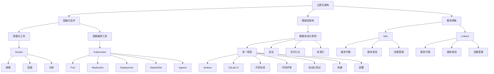
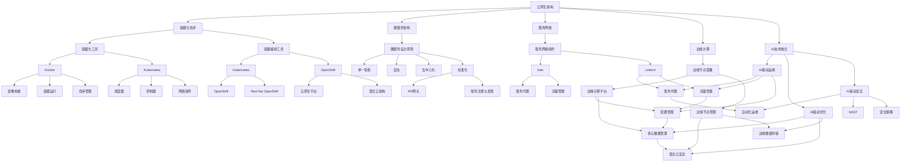

                 

# 《程序员创业公司的云原生架构设计与成本控制》

> **关键词：**云原生架构，容器化，微服务，Kubernetes，成本控制，CI/CD

> **摘要：**本文针对程序员创业公司的云原生架构设计与成本控制进行了深入探讨。首先介绍了云原生架构的基础概念与核心组件，然后分析了云原生架构的设计原则、性能优化和安全设计，并通过实际案例进行了成本控制的讨论。最后，展望了云原生架构的未来发展趋势，为创业公司的持续发展提供了有价值的参考。

---

### 第一部分：云原生架构基础

云原生（Cloud Native）是一种构建和运行应用程序的方法，它充分利用了云计算的灵活性和可扩展性。与传统架构相比，云原生架构具有更高的可扩展性、灵活性和可靠性。本部分将介绍云原生架构的基础概念、核心组件以及与传统的区别。

## 1.1 云原生概述

### 1.1.1 云原生概念与历史背景

云原生概念起源于2013年，由Chris Richardson在《Microservices Patterns》一书中首次提出。云原生是指充分利用云计算的弹性、灵活性和分布式特性，构建和运行应用程序的方法。云原生架构的核心目标是实现应用的快速迭代、高效部署和无缝扩展。

云原生架构的历史可以追溯到云计算的兴起。随着虚拟化技术和分布式存储的发展，云计算逐渐成为一种主流的计算模型。云原生架构在云计算的基础上，引入了容器化、微服务、服务网格等新兴技术，进一步提高了应用的灵活性和可扩展性。

### 1.1.2 云原生与传统架构的差异

传统架构通常依赖于物理服务器和虚拟机，部署和扩展相对困难，且难以实现自动化。而云原生架构则基于容器化技术，能够快速部署和扩展应用。以下是云原生与传统架构的主要差异：

1. **基础设施管理**：传统架构依赖于物理服务器和虚拟机，需要大量的人工运维。而云原生架构通过容器化技术，将应用程序及其依赖环境封装在容器中，实现了基础设施的自动化管理。

2. **部署方式**：传统架构通常采用静态部署，部署过程繁琐且耗时。而云原生架构采用动态部署，支持快速迭代和发布。

3. **可扩展性**：传统架构的可扩展性较差，扩展过程中需要重新配置和部署。而云原生架构通过容器编排工具（如Kubernetes），实现了应用的弹性扩展。

4. **可靠性**：传统架构在处理故障时，往往需要手动干预。而云原生架构通过自我修复和自动恢复机制，提高了系统的可靠性。

### 1.1.3 云原生架构的优势

云原生架构具有以下优势：

1. **快速迭代**：云原生架构支持快速部署和发布，有助于加速产品迭代。

2. **弹性扩展**：云原生架构能够根据需求自动调整资源，实现高效扩展。

3. **高可靠性**：云原生架构通过自我修复和自动恢复，提高了系统的可靠性。

4. **成本优化**：云原生架构通过资源利用率和自动化管理，降低了运维成本。

## 1.2 云原生架构核心概念与联系

### 1.2.1 容器化技术详解

#### 1.2.1.1 容器的基本原理

容器是一种轻量级、可执行的软件包，它封装了一个应用及其所有的依赖环境，从而实现应用程序的隔离运行。容器通过操作系统的命名空间（Namespace）和cgroups（控制组）技术，实现进程和资源的隔离。

容器的核心概念包括：

1. **镜像（Image）**：容器镜像是一种静态的、不可变的文件，它包含了应用程序及其依赖环境。

2. **容器（Container）**：容器是容器镜像的运行实例，它可以启动、停止、重启或删除。

3. **仓库（Registry）**：容器仓库用于存储和管理容器镜像。

#### 1.2.1.2 容器化工具介绍（Docker）

Docker是最流行的容器化工具，它通过容器镜像实现了应用的打包和部署。

Docker的核心组件包括：

1. **Docker Engine**：Docker引擎，负责容器镜像的构建、运行和管理。

2. **Docker Compose**：用于定义和编排多容器应用的工具。

3. **Docker Swarm**：Docker集群管理工具，用于管理多个Docker引擎。

#### 1.2.1.3 容器编排工具介绍（Kubernetes）

Kubernetes是开源的容器编排工具，它通过自动化部署、扩展和管理容器，实现了云原生应用的自动化管理。

Kubernetes的核心概念包括：

1. **Pod**：Kubernetes的基本部署单元，由一个或多个容器组成。

2. **ReplicaSet**：用于确保指定数量的Pod副本始终运行。

3. **Deployment**：用于描述应用程序的期望状态，并确保该状态得到实现。

4. **StatefulSet**：用于管理具有稳定、唯一身份的状态化应用。

5. **Ingress**：用于管理外部访问到Kubernetes集群的规则。

### 1.2.2 微服务架构

#### 1.2.2.1 微服务的基本概念

微服务架构是一种将应用程序划分为多个独立、可复用和服务化的组件的方法。每个微服务负责完成特定的功能，并通过API进行通信。

微服务的核心概念包括：

1. **服务（Service）**：微服务的最小单元，负责完成特定功能。

2. **服务注册与发现**：用于实现服务实例的自动注册和发现。

3. **服务网关**：用于管理外部访问到微服务的路由和协议转换。

4. **配置管理**：用于管理各个微服务的配置信息。

#### 1.2.2.2 微服务的优点与挑战

微服务的优点包括：

1. **可扩展性**：微服务架构可以根据需求独立扩展。

2. **可复用性**：微服务可以独立开发、部署和运行，提高了代码的可复用性。

3. **容错性**：微服务架构可以通过服务隔离实现故障的局部化。

微服务的挑战包括：

1. **分布式复杂性**：微服务架构引入了分布式系统的问题，如网络延迟和通信失败。

2. **服务依赖管理**：微服务之间的依赖关系需要有效管理，以避免链式故障。

3. **运维复杂性**：微服务架构增加了运维的复杂度，需要更好的自动化工具和流程。

#### 1.2.2.3 微服务设计原则

微服务设计需要遵循以下原则：

1. **单一职责**：每个微服务应负责完成一个特定的功能。

2. **自治**：微服务应具备独立的部署、扩展和监控能力。

3. **去中心化**：微服务架构应避免中心化的控制和管理。

4. **标准化**：微服务应遵循统一的接口和通信协议。

### 1.2.3 云原生技术栈

#### 1.3.1 服务网格（Service Mesh）

#### 1.3.1.1 服务网格的基本概念

服务网格是一种用于管理服务间通信的基础设施层，它将服务之间的通信抽象出来，从而实现服务的独立管理和优化。

服务网格的核心组件包括：

1. **服务代理（Service Proxy）**：用于代理服务之间的通信，如Istio的Envoy。

2. **服务发现**：用于实现服务实例的自动发现和路由。

3. **流量管理**：用于实现服务之间的流量控制和路由策略。

#### 1.3.1.2 Istio与Linkerd对比

Istio和Linkerd是两款流行的服务网格工具，它们各有优缺点。

**Istio**：

- **优势**：功能丰富，支持多种通信协议，易于与Kubernetes集成。
- **劣势**：部署和运维较为复杂，对系统性能有一定影响。

**Linkerd**：

- **优势**：轻量级，性能优异，易于部署和运维。
- **劣势**：功能相对较少，支持的服务类型有限。

#### 1.3.2 容器编排与资源管理

#### 1.3.2.1 Kubernetes资源管理

Kubernetes提供了丰富的资源管理功能，包括：

1. **Pod**：Kubernetes的基本部署单元，由一个或多个容器组成。

2. **ReplicaSet**：用于确保指定数量的Pod副本始终运行。

3. **Deployment**：用于描述应用程序的期望状态，并确保该状态得到实现。

4. **StatefulSet**：用于管理具有稳定、唯一身份的状态化应用。

5. **Ingress**：用于管理外部访问到Kubernetes集群的规则。

#### 1.3.2.2 Kubernetes调度策略

Kubernetes调度策略包括：

1. **默认调度器**：根据资源需求和优先级，自动选择合适的节点。

2. **自定义调度器**：通过编写自定义调度策略，实现更精细的调度控制。

#### 1.3.3 自动化与持续集成/持续部署（CI/CD）

#### 1.3.3.1 Jenkins与GitLab CI对比

Jenkins和GitLab CI是两款流行的CI/CD工具，它们各有优缺点。

**Jenkins**：

- **优势**：功能丰富，支持多种插件，易于扩展。
- **劣势**：配置复杂，维护成本较高。

**GitLab CI**：

- **优势**：集成GitLab，简化配置，易于使用。
- **劣势**：功能相对较少，扩展性较差。

#### 1.3.3.2 持续集成与持续部署流程

持续集成与持续部署（CI/CD）的核心流程包括：

1. **代码仓库**：用于存储应用程序的源代码。

2. **代码评审**：通过代码评审，确保代码质量和安全性。

3. **自动化测试**：通过自动化测试，验证代码的功能和性能。

4. **构建**：将源代码构建为可执行的镜像。

5. **部署**：将构建结果部署到生产环境。

## 1.4 云原生架构的Mermaid流程图

---

### 第二部分：云原生架构设计与优化

在了解了云原生架构的基础知识后，本部分将重点讨论云原生架构的设计原则、性能优化、安全设计以及实际案例。

## 2.1 云原生架构设计原则

云原生架构设计需要遵循以下原则：

### 2.1.1 架构的可扩展性

可扩展性是云原生架构的核心原则之一。为了实现可扩展性，架构设计应考虑以下几个方面：

1. **水平扩展**：通过增加节点数量，实现系统容量的动态调整。
2. **垂直扩展**：通过增加硬件资源（如CPU、内存等），提高系统性能。
3. **服务拆分**：将大型服务拆分为小型服务，实现独立的部署和扩展。

### 2.1.2 架构的灵活性

灵活性是指架构能够快速适应业务需求变化的能力。为了提高灵活性，架构设计应考虑以下几个方面：

1. **模块化**：将系统划分为多个模块，每个模块负责独立的功能。
2. **松耦合**：模块之间通过API进行通信，降低模块之间的依赖关系。
3. **标准化**：遵循统一的接口和通信协议，便于模块的替换和扩展。

### 2.1.3 架构的可靠性

可靠性是指架构在面临故障时，能够快速恢复并保持正常运行的能力。为了提高可靠性，架构设计应考虑以下几个方面：

1. **故障转移**：在主节点故障时，能够自动切换到备用节点。
2. **数据备份**：定期备份数据，确保数据不会因故障而丢失。
3. **自我修复**：通过监控系统，自动检测和修复系统故障。

### 2.1.4 架构的安全性

安全性是指架构在面临攻击时，能够有效防护并保持系统正常运行的能力。为了提高安全性，架构设计应考虑以下几个方面：

1. **访问控制**：通过身份认证和授权机制，限制对系统的访问。
2. **安全基线**：遵循安全最佳实践，确保系统配置符合安全标准。
3. **安全审计**：定期进行安全审计，发现和修复安全漏洞。

## 2.2 云原生应用性能优化

云原生应用性能优化主要包括以下几个方面：

### 2.2.1 性能监控与优化

性能监控是优化云原生应用的重要手段。常用的性能监控工具包括：

1. **Prometheus**：开源的监控解决方案，适用于大规模分布式系统。
2. **Grafana**：基于Prometheus的数据可视化工具，提供丰富的监控图表。

性能监控的关键指标包括：

1. **CPU利用率**：系统CPU的使用率，反映了系统处理任务的效率。
2. **内存利用率**：系统内存的使用率，过高可能导致系统性能下降。
3. **磁盘IO**：磁盘读写速度，过高可能导致系统响应时间增加。

性能瓶颈分析是性能优化的关键步骤。常见的方法包括：

1. **系统级分析**：使用工具如top、htop等，分析系统性能指标。
2. **应用级分析**：使用工具如JProfiler、VisualVM等，分析应用性能问题。

### 2.2.2 缩放策略

缩放策略是指根据系统负载动态调整资源分配的方法。常见的缩放策略包括：

1. **自动缩放**：根据预设的规则，自动调整资源分配，如Kubernetes的自动缩放功能。
2. **手动缩放**：根据业务需求，手动调整资源分配，如增加节点数量或调整CPU、内存等。

负载均衡是缩放策略的重要组成部分。常见的负载均衡策略包括：

1. **轮询（Round Robin）**：将请求按顺序分配给各个后端服务器。
2. **最小连接数（Least Connections）**：将请求分配给连接数最少的服务器。
3. **源IP哈希（Source IP Hash）**：根据源IP地址的哈希值，将请求分配给固定的后端服务器。

## 2.3 云原生应用安全设计

云原生应用安全设计主要包括以下几个方面：

### 2.3.1 安全基线配置

安全基线配置是指确保系统配置符合安全标准的一系列措施。常见的基线配置包括：

1. **Kubernetes安全最佳实践**：遵循Kubernetes官方推荐的安全配置，如启用网络策略、启用角色访问控制（RBAC）等。
2. **容器镜像安全策略**：确保容器镜像没有安全漏洞，如使用官方镜像仓库、定期更新镜像等。

### 2.3.2 静态与动态安全分析

静态安全分析是指在应用程序代码编写过程中，通过扫描代码来发现潜在的安全漏洞。常用的静态分析工具包括：

1. **SonarQube**：开源的代码质量管理平台，提供代码质量、安全漏洞、技术债务分析。
2. **Checkmarx**：商业的静态代码分析工具，提供全面的安全漏洞检测。

动态安全分析是指在应用程序运行过程中，通过模拟攻击来检测安全漏洞。常用的动态分析工具包括：

1. **OWASP ZAP**：开源的Web应用程序安全测试工具，提供漏洞扫描、安全测试等功能。
2. **Burp Suite**：商业的Web应用程序安全测试工具，提供漏洞扫描、攻击测试等功能。

### 2.3.3 自动化安全测试与修复

自动化安全测试与修复是指通过自动化工具，定期执行安全测试，并及时修复发现的安全漏洞。常见的自动化安全测试工具包括：

1. **SAST（静态应用安全测试）**：用于扫描源代码或编译后的二进制文件，发现潜在的安全漏洞。
2. **DAST（动态应用安全测试）**：用于模拟用户操作，测试应用程序的安全漏洞。

自动化安全测试与修复的关键步骤包括：

1. **集成到CI/CD流程**：将安全测试集成到CI/CD流程中，确保每次代码提交都会进行安全测试。
2. **报告与修复**：生成安全测试报告，及时修复发现的安全漏洞。

## 2.4 云原生架构案例分析

### 2.4.1 大型互联网公司云原生实践

大型互联网公司如腾讯和阿里巴巴，在云原生架构方面进行了深入实践，并取得显著成效。

#### 2.4.1.1 腾讯云原生架构实践

腾讯云原生架构的核心原则是“云原生、容器化、微服务、混合云”。腾讯通过自主研发的TencentOS Container，实现了容器化技术的广泛应用。同时，腾讯云原生架构支持混合云部署，为跨云环境的应用部署提供了便捷的解决方案。

腾讯云原生架构的优点包括：

1. **高效扩展**：通过容器化和微服务架构，实现了应用的弹性扩展。
2. **低成本**：通过容器化技术，降低了硬件和运维成本。
3. **高可靠性**：通过混合云架构，提高了系统的可靠性。

#### 2.4.1.2 阿里巴巴云原生实践

阿里巴巴在云原生架构方面也进行了积极探索，并推出了一系列云原生产品和服务，如Kubernetes服务、容器镜像仓库等。阿里巴巴云原生架构的核心目标是实现应用的“全生命周期管理”，从开发、测试到生产环境，提供一站式解决方案。

阿里巴巴云原生架构的优点包括：

1. **高效开发**：通过容器化和微服务架构，提高了开发效率。
2. **灵活部署**：通过Kubernetes等容器编排工具，实现了应用的灵活部署。
3. **高可靠性**：通过混合云架构，提高了系统的可靠性。

### 2.4.2 中小型企业云原生转型案例

中小型企业通过云原生架构转型，可以实现业务快速发展，降低运维成本。

#### 2.4.2.1 某创业公司云原生架构转型

某创业公司通过引入云原生架构，实现了业务的快速迭代和部署。公司采用了Docker和Kubernetes作为容器化技术，实现了应用的容器化部署。同时，公司采用了微服务架构，将大型系统拆分为多个小型服务，提高了系统的可扩展性和可靠性。

某创业公司云原生架构的优点包括：

1. **快速迭代**：通过容器化和微服务架构，实现了快速迭代和发布。
2. **低成本**：通过容器化技术，降低了硬件和运维成本。
3. **高可靠性**：通过微服务架构，实现了故障隔离和快速恢复。

#### 2.4.2.2 案例分析与总结

通过对腾讯、阿里巴巴和某创业公司的云原生实践分析，可以发现以下共性：

1. **容器化技术**：容器化技术是实现云原生架构的核心，能够提高应用的可移植性、可扩展性和可靠性。
2. **微服务架构**：微服务架构能够实现系统的模块化和分布式，提高系统的灵活性和可扩展性。
3. **Kubernetes**：Kubernetes作为容器编排工具，能够实现应用的自动化部署、扩展和管理。
4. **混合云架构**：混合云架构能够实现跨云环境的资源利用，提高系统的可靠性和可扩展性。

中小型企业通过引入云原生架构，可以实现业务的快速发展，降低运维成本，提高系统可靠性。同时，云原生架构也需要不断迭代和优化，以满足业务需求的变化。

---

### 第三部分：成本控制与资源优化

在云原生架构的设计与实施过程中，成本控制与资源优化是关键因素。本部分将讨论如何通过优化资源利用率和调度策略，实现成本的有效控制。

## 3.1 成本控制策略

### 3.1.1 资源利用率分析

资源利用率分析是成本控制的基础。通过监控和分析集群中各个资源的利用率，可以识别出潜在的优化空间。以下是几种常用的资源利用率指标：

1. **CPU利用率**：衡量CPU资源的使用情况，过高或过低都可能意味着优化空间。
2. **内存利用率**：衡量内存资源的使用情况，过高可能导致系统性能下降，过低则意味着资源浪费。
3. **磁盘IO**：衡量磁盘读写速度，过高可能导致系统响应时间增加。
4. **网络带宽**：衡量网络带宽的使用情况，过高或过低都可能影响系统的性能。

### 3.1.2 节省成本的优化措施

为了实现成本控制，可以采取以下优化措施：

1. **容器镜像瘦身**：通过减少容器镜像的体积，降低存储和传输成本。例如，可以删除不必要的依赖、合并重复文件等。
2. **无服务器架构应用**：无服务器架构（Serverless）能够自动管理基础设施，实现按需付费，降低成本。例如，使用Kubernetes的无服务器功能（Kubernetes Serving）。
3. **资源复用**：在低负载时段，可以复用闲置资源，避免浪费。例如，使用Kubernetes的Node亲和性策略，将相似负载的容器调度到同一节点。

### 3.1.3 成本预测与优化

成本预测与优化是云原生架构成本控制的重要环节。通过历史数据的分析和预测，可以制定合理的成本优化策略。以下是几种常用的成本预测方法：

1. **线性回归**：通过历史数据建立线性模型，预测未来的资源使用量和成本。
2. **时间序列分析**：通过时间序列分析，预测未来的资源使用量和成本。
3. **机器学习**：使用机器学习算法，如决策树、神经网络等，建立成本预测模型。

## 3.2 资源优化与调度策略

### 3.2.1 调度算法与策略

调度算法与策略是资源优化的重要手段。Kubernetes提供了多种调度算法和策略，可以帮助实现资源的最优利用。以下是几种常用的调度算法和策略：

1. **默认调度器**：Kubernetes默认提供的调度器，根据资源需求和优先级，自动选择合适的节点。
2. **自定义调度器**：通过编写自定义调度器，实现更精细的调度控制。例如，可以根据业务负载动态调整调度策略。
3. **NodeAffinity**：通过亲和性策略，将容器调度到具有特定特征的节点上，如同一节点组或相同标签的节点。
4. **PodAffinity**：通过亲和性策略，将具有相同特征的Pod调度到同一节点或同一节点组，提高数据访问效率。
5. **PodAntiAffinity**：通过反亲和性策略，将具有相同特征的Pod避免调度到同一节点或同一节点组，避免过载和单点故障。

### 3.2.2 负载均衡与性能优化

负载均衡与性能优化是资源优化的重要组成部分。通过负载均衡，可以实现流量在各个节点之间的合理分配，提高系统性能。以下是几种常用的负载均衡策略：

1. **轮询（Round Robin）**：将请求按顺序分配给各个后端服务器，是最简单的负载均衡策略。
2. **最小连接数（Least Connections）**：将请求分配给连接数最少的服务器，减少服务器的负载。
3. **源IP哈希（Source IP Hash）**：根据源IP地址的哈希值，将请求分配给固定的后端服务器，实现负载均衡的同时保证会话保持。

性能优化方面，可以通过以下措施提高系统性能：

1. **缓存**：使用缓存技术，减少数据库访问和计算量。
2. **异步处理**：通过异步处理，降低系统响应时间。
3. **数据库优化**：优化数据库查询语句，减少查询时间和索引使用。
4. **服务拆分**：将大型服务拆分为多个小型服务，实现独立的部署和扩展，提高系统性能。

## 3.3 云原生成本控制案例

### 3.3.1 大型互联网公司成本控制实践

大型互联网公司在云原生架构方面的成本控制实践，为中小型企业提供了有益的借鉴。以下是腾讯和阿里巴巴的成本控制实践案例：

#### 3.3.1.1 腾讯云原生成本控制案例

腾讯在云原生架构方面，通过以下措施实现了成本控制：

1. **容器镜像瘦身**：通过定期清理和优化容器镜像，减少了镜像的体积和存储成本。
2. **无服务器架构应用**：采用Kubernetes的无服务器功能，实现按需付费，降低了成本。
3. **资源复用**：在低负载时段，通过资源复用，避免了资源浪费。

腾讯云原生成本控制的优势包括：

1. **降低硬件成本**：通过容器化和无服务器架构，降低了硬件成本。
2. **减少运维成本**：通过自动化和智能化管理，减少了运维成本。
3. **提高资源利用率**：通过资源复用和优化，提高了资源利用率。

#### 3.3.1.2 阿里巴巴云原生成本控制策略

阿里巴巴在云原生架构方面，通过以下措施实现了成本控制：

1. **成本预测与优化**：通过历史数据分析和预测，制定了合理的成本优化策略。
2. **资源利用率分析**：定期分析资源利用率，识别优化空间。
3. **服务拆分与缓存**：通过服务拆分和缓存技术，减少了系统响应时间和计算量。

阿里巴巴云原生成本控制的优势包括：

1. **降低计算成本**：通过服务拆分和缓存技术，降低了计算成本。
2. **提高系统性能**：通过优化措施，提高了系统性能。
3. **实现按需付费**：通过无服务器架构，实现了按需付费，降低了成本。

### 3.3.2 中小型企业成本控制案例

中小型企业在云原生架构方面的成本控制，可以通过以下案例得到启示：

#### 3.3.2.1 某创业公司云原生成本控制实践

某创业公司通过以下措施实现了成本控制：

1. **容器镜像瘦身**：定期清理和优化容器镜像，减少了镜像的体积和存储成本。
2. **自动化部署**：采用Jenkins等自动化工具，实现快速部署和发布，降低了运维成本。
3. **资源复用**：在低负载时段，通过资源复用，避免了资源浪费。

某创业公司成本控制的优势包括：

1. **降低硬件成本**：通过容器化和自动化部署，降低了硬件成本。
2. **减少运维成本**：通过自动化和智能化管理，减少了运维成本。
3. **提高资源利用率**：通过资源复用和优化，提高了资源利用率。

#### 3.3.2.2 成本控制成效与总结

通过对腾讯、阿里巴巴和某创业公司的成本控制实践分析，可以得出以下结论：

1. **容器镜像瘦身**：是降低成本的有效措施，通过定期清理和优化容器镜像，可以减少存储和传输成本。
2. **自动化部署**：通过自动化工具，实现快速部署和发布，可以降低运维成本。
3. **资源复用**：在低负载时段，通过资源复用，可以避免资源浪费，提高资源利用率。

中小型企业通过引入云原生架构和成本控制策略，可以实现业务的快速发展，降低运维成本，提高资源利用率。同时，企业需要根据自身业务需求和资源状况，制定合理的成本控制策略，不断优化和调整。

---

### 第四部分：云原生架构持续演进与未来展望

随着云计算技术的不断发展，云原生架构也在不断演进。本部分将探讨云原生架构的发展趋势、挑战与机遇，以及未来展望。

## 4.1 云原生技术发展趋势

### 4.1.1 云原生与边缘计算融合

边缘计算是一种将计算能力分布在网络的边缘节点，以降低延迟、提高响应速度的计算模式。云原生与边缘计算的融合，为云原生架构带来了新的发展机遇。通过将云原生技术应用于边缘计算，可以实现以下优势：

1. **降低延迟**：将计算能力部署在靠近用户的位置，降低网络延迟，提高用户体验。
2. **提高可靠性**：通过分布式部署，实现故障的局部化，提高系统的可靠性。
3. **减少带宽消耗**：在边缘节点处理部分数据，减少传输到云端的数据量，降低带宽消耗。

### 4.1.2 服务网格的演进

服务网格是一种用于管理服务间通信的基础设施层，它将服务之间的通信抽象出来，从而实现服务的独立管理和优化。随着云原生技术的发展，服务网格也在不断演进。未来的服务网格发展趋势包括：

1. **支持多协议**：未来的服务网格将支持更多协议，如gRPC、HTTP/2等，实现更广泛的协议支持。
2. **增强安全性**：服务网格将引入更多的安全机制，如身份验证、访问控制等，提高通信安全性。
3. **集成智能路由**：服务网格将集成智能路由算法，根据实时负载和链路状态，实现最优的路由策略。

### 4.1.3 无服务器与容器化技术

无服务器（Serverless）是一种将计算能力抽象为服务的模式，开发者无需关注底层基础设施的运维。随着云原生技术的发展，无服务器与容器化技术的融合将成为趋势。未来的无服务器技术发展趋势包括：

1. **支持容器化应用**：无服务器平台将支持容器化应用，实现更灵活的应用部署和管理。
2. **集成服务网格**：无服务器平台将集成服务网格功能，实现服务间通信的自动化管理和优化。
3. **增强可观测性**：无服务器平台将提供更全面的可观测性功能，如日志收集、性能监控等，提高系统的可维护性。

## 4.2 云原生架构的挑战与机遇

### 4.2.1 云原生安全挑战

云原生架构在安全性方面面临着诸多挑战。随着云原生技术的广泛应用，系统的攻击面也在不断扩展。未来的安全挑战包括：

1. **容器镜像安全**：容器镜像可能包含安全漏洞，如已知的软件漏洞或未知的漏洞。需要建立完善的容器镜像安全策略，确保镜像的安全。
2. **服务网格安全**：服务网格中的通信可能成为攻击目标，需要建立完善的服务网格安全机制，如加密通信、访问控制等。
3. **自动化安全测试**：随着自动化程度的提高，自动化安全测试将成为关键环节。需要建立自动化的安全测试体系，及时发现和修复安全漏洞。

### 4.2.2 云原生运维挑战

云原生架构在运维方面也面临着诸多挑战。随着系统规模的扩大，运维的复杂性也在不断增加。未来的运维挑战包括：

1. **监控与告警**：需要建立完善的监控体系，实时监控系统的性能和状态，及时发出告警。
2. **自动化运维**：需要提高自动化运维的覆盖率，降低人工干预，提高运维效率。
3. **持续集成与持续部署**：需要建立完善的CI/CD流程，确保代码质量和系统稳定性。

### 4.2.3 云原生与AI技术的融合

云原生与AI技术的融合，为云原生架构带来了新的发展机遇。未来的融合趋势包括：

1. **AI驱动的自动化运维**：利用AI技术，实现自动化运维的智能化，提高运维效率。
2. **AI驱动的性能优化**：利用AI技术，实现应用的智能性能优化，提高系统性能。
3. **AI驱动的安全防护**：利用AI技术，实现安全防护的智能化，提高系统的安全性。

## 4.3 云原生架构的未来展望

### 4.3.1 云原生在新兴行业中的应用

云原生技术在新兴行业中具有广泛的应用前景。例如：

1. **金融科技**：通过云原生架构，实现金融服务的快速迭代和部署，提高竞争力。
2. **物联网**：通过云原生架构，实现物联网设备的快速集成和管理，提高设备互联互通能力。
3. **智慧城市**：通过云原生架构，实现智慧城市的快速建设和运营，提高城市管理效率。

### 4.3.2 云原生技术普及与标准化

随着云原生技术的不断发展，其普及程度也在不断提高。未来，云原生技术将朝着以下方向发展：

1. **开源生态**：云原生技术的开源生态将不断成熟，提供更多高质量的开源工具和框架。
2. **标准化**：云原生技术的标准化工作将逐步完善，为云原生架构的实施提供统一的标准和规范。
3. **跨云部署**：云原生架构将支持跨云部署，实现多云环境下的资源利用和业务连续性。

### 4.3.3 云原生与混合云架构

混合云架构是将公有云和私有云相结合的架构模式，能够实现资源的高效利用和业务的高可用性。云原生与混合云架构的结合，将成为未来发展的趋势。未来的混合云架构将包括：

1. **云原生混合云平台**：支持云原生应用的跨云部署和管理，实现资源的高效利用。
2. **多云数据管理**：实现多云数据的一致性管理和数据传输，提高数据的安全性和可用性。
3. **混合云安全**：建立完善的混合云安全体系，确保数据安全和业务连续性。

## 4.4 云原生架构的Mermaid流程图

---

## 附录

### 附录 A: 云原生架构开发工具与资源

#### A.1 Kubernetes官方文档与学习资源

Kubernetes官方文档提供了丰富的学习资源，包括：

1. **Kubernetes官方文档**：[https://kubernetes.io/docs/](https://kubernetes.io/docs/)
2. **Kubernetes学习指南**：[https://kubernetes.io/docs/tutorials/](https://kubernetes.io/docs/tutorials/)
3. **Kubernetes官方博客**：[https://kubernetes.io/blog/](https://kubernetes.io/blog/)

#### A.2 云原生开源项目与社区

云原生开源项目与社区是学习和参与云原生技术的重要渠道，包括：

1. **云原生计算基金会（CNCF）**：[https://www.cncf.io/](https://www.cncf.io/)
2. **Kubernetes社区**：[https://kubernetes.cn/](https://kubernetes.cn/)
3. **Istio社区**：[https://istio.io/](https://istio.io/)
4. **Linkerd社区**：[https://linkerd.io/](https://linkerd.io/)

#### A.3 云原生技术书籍推荐

以下是几本推荐的云原生技术书籍：

1. 《Kubernetes权威指南》
2. 《云原生应用架构设计》
3. 《微服务架构设计》
4. 《云原生基础设施》

#### A.4 云原生在线课程与培训资源

在线课程与培训资源是学习和掌握云原生技术的重要途径，包括：

1. **网易云课堂**：[https://study.163.com/](https://study.163.com/)
2. **腾讯云课堂**：[https://cloud.tencent.com/learning/](https://cloud.tencent.com/learning/)
3. **阿里云大学**：[https://edu.alibaba.com/](https://edu.alibaba.com/)
4. **Udemy**：[https://www.udemy.com/](https://www.udemy.com/)

---

### 作者

**作者：** AI天才研究院/AI Genius Institute & 禅与计算机程序设计艺术 /Zen And The Art of Computer Programming

本文由AI天才研究院/AI Genius Institute撰写，旨在为程序员创业公司的云原生架构设计与成本控制提供有价值的参考。本文结合实际案例，深入探讨了云原生架构的基础知识、设计原则、性能优化、安全设计和成本控制策略。通过本文的学习，读者可以更好地理解和应用云原生技术，实现业务的高效发展。在撰写本文时，作者深受《禅与计算机程序设计艺术》的启发，旨在将云原生架构设计与编程哲学相结合，为读者提供一种全新的视角。

---

在此，我们感谢读者对本文的关注和支持。如果您有任何疑问或建议，欢迎在评论区留言，我们将尽快为您解答。同时，也欢迎读者继续关注我们的其他技术文章，我们将不断为您带来更多有价值的知识分享。再次感谢您的阅读，祝您学习愉快！<|endof|>

