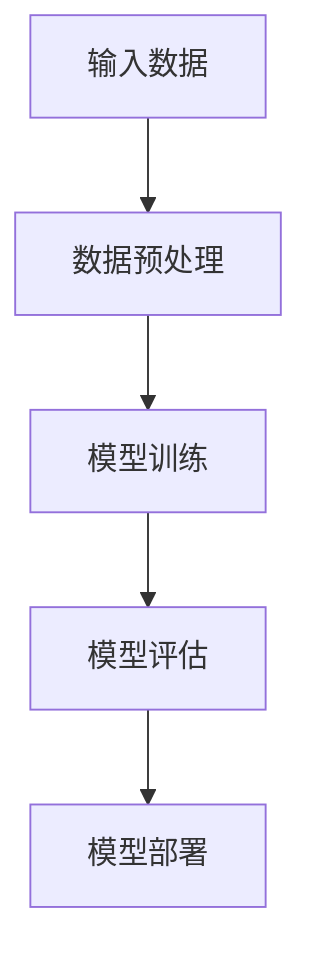

                 

### 第一部分：概述与引言

#### 第1章：程序员副业的背景与意义

> **1.1 程序员副业的发展现状**

在当今快速发展的技术时代，程序员作为技术界的核心力量，面临着前所未有的机遇与挑战。据统计，超过70%的程序员在业余时间从事副业，这一现象不仅反映了程序员对技术的热情，也凸显了他们在市场需求中具备的独特优势。程序员从事副业的原因多种多样，其中最主要的原因是增加收入、拓宽职业发展路径以及提升个人技能。

首先，增加收入是程序员从事副业的首要动机。随着互联网产业的蓬勃发展，对程序员的需求日益增加，但传统的薪资增长速度却逐渐放缓。通过副业，程序员可以利用自己的专业技能和业余时间，为客户提供定制化的软件开发、系统维护、技术咨询等服务，从而实现额外收入。

其次，拓宽职业发展路径也是程序员选择副业的重要原因。通过参与不同的项目，程序员可以接触到更多的技术领域和业务场景，这不仅有助于提升自身的专业技能，还能为未来的职业发展积累宝贵经验。例如，一些程序员通过副业参与到创业项目中，从技术经理逐渐转型为创业者，实现了职业角色的转变。

最后，提升个人技能是程序员从事副业的内在驱动力。在不断变化的技术环境中，程序员需要不断学习新的技术和工具。通过副业，程序员可以接触到更多的实际问题，从而在实践中学习和提高。例如，参与开源项目可以让程序员掌握更先进的技术，参与培训课程则可以帮助他们了解行业内的最新动态。

> **1.2 知识付费的兴起**

知识付费，是指用户为获取特定知识或服务而支付费用的一种商业模式。在互联网时代，知识付费逐渐成为一种主流的消费形式。知识付费的兴起，主要得益于以下几个因素：

首先，互联网的普及和在线教育的发展，为知识付费提供了便捷的渠道。用户可以随时随地通过互联网获取所需的知识和技能，这种灵活性和便利性大大促进了知识付费市场的增长。

其次，知识付费满足了用户对个性化、专业化知识的需求。随着社会分工的日益细化，用户对特定领域的专业知识和技能的需求愈发强烈。知识付费平台通过提供高质量、针对性的内容，满足了这一需求。

最后，内容创作者通过知识付费实现了价值变现。在传统的免费模式中，创作者往往无法直接获得经济回报。知识付费为创作者提供了新的盈利途径，激发了他们的创作热情。

> **1.3 程序员如何通过知识付费实现价值**

程序员通过知识付费实现价值，主要有以下几个途径：

首先，通过开设在线课程，程序员可以将自己的专业技能和经验传授给他人，从而获得收入。在线课程的形式多样，包括视频教程、文档教程和直播课程等。通过这些形式，程序员可以针对性地解决用户在技术学习中的痛点，提高课程的价值。

其次，程序员可以通过撰写技术博客或发表技术文章，分享自己的技术见解和实战经验。这些内容不仅可以帮助他人解决问题，还可以提升程序员在技术社区的知名度和影响力，进而吸引更多的商业机会。

最后，程序员可以参与到开源项目中，通过贡献代码和文档，提升项目的质量和影响力。开源项目不仅可以为程序员提供实战经验，还可以帮助他们建立个人品牌，增加职业发展的机会。

> **1.4 程序员副业的挑战与机遇**

程序员副业虽然充满机遇，但也面临诸多挑战。首先，技术更新迅速，程序员需要不断学习新的技术和工具，以保持自己的竞争力。这给程序员带来了巨大的学习压力，同时也要求他们具备持续学习的能力。

其次，法律法规和道德风险是程序员副业需要面对的另一大挑战。在一些国家和地区，从事副业可能涉及到法律法规的合规问题，如知识产权保护、用户隐私保护等。程序员需要了解并遵守相关法律法规，避免因违规操作而遭受法律制裁。

最后，职业发展路径的平衡也是程序员需要考虑的问题。副业可能会占用大量的时间和精力，如果管理不当，可能会影响程序员的主业表现。因此，程序员需要在副业和主业之间找到平衡，确保两者能够协调发展。

总的来说，程序员副业既充满机遇，也充满挑战。只有通过不断学习、遵守法律法规和合理规划职业发展路径，程序员才能在副业中实现自身价值，为职业发展增添新的动力。

#### 第2章：知识付费平台的运作原理

> **2.1 知识付费平台的商业模式**

知识付费平台作为连接内容创作者和消费者的桥梁，其商业模式多种多样，主要包括课程销售模式、订阅服务模式和讲师收益分配机制。

首先，课程销售模式是最常见的商业模式之一。在这个模式中，知识付费平台为内容创作者提供一个展示和销售自己课程的平台。用户可以通过购买课程，获得相应的知识和技能。平台通常通过收取一定比例的佣金来获取收益。例如，Udemy平台对每门课程的销售收入收取30%的佣金。

其次，订阅服务模式是指用户通过支付一定费用，获得平台提供的持续更新内容的服务。这种模式通常提供按月或按年的订阅方案，用户可以根据自己的需求选择合适的订阅计划。例如，Coursera平台提供多种订阅选项，用户可以选择按月订阅或按年订阅，以获得更多优惠。

最后，讲师收益分配机制是知识付费平台的核心之一。不同的平台在收益分配上有不同的策略。一些平台按照销售收入的固定比例分配给讲师，例如， Teachable平台将销售收入的70%分配给讲师。而另一些平台则采用动态收益分配机制，根据讲师的课程销量、用户评价等因素来调整收益分配比例。

总的来说，知识付费平台的商业模式通过多种方式实现内容创作者和用户的双赢。内容创作者可以通过平台获得收益，提高自己的知名度和影响力；而用户则可以方便地获取高质量的知识和技能，实现自我提升。

> **2.2 知识付费平台的技术架构**

知识付费平台的技术架构涉及多个方面，包括前端展示与交互、后端数据处理与存储、以及支付与结算系统。一个高效、稳定的知识付费平台需要这些模块协同工作，为用户提供优质的服务体验。

首先，前端展示与交互是用户与平台互动的窗口。前端技术主要包括HTML、CSS和JavaScript。通过HTML，平台可以构建出网页的基本结构；CSS用于美化网页，提升用户体验；JavaScript则提供了动态交互功能，例如课程的播放、用户评论的展示等。前端技术还需要考虑到响应式设计，以确保在不同设备上都能提供良好的用户体验。

其次，后端数据处理与存储是知识付费平台的核心。后端技术通常采用服务端编程语言，如Java、Python、Node.js等。后端主要负责处理用户的请求，如用户注册、登录、购买课程等。此外，后端还需要处理大量数据，包括用户信息、课程数据、交易数据等。为了高效地存储和管理这些数据，平台通常采用关系型数据库（如MySQL、PostgreSQL）或非关系型数据库（如MongoDB）。

最后，支付与结算系统是知识付费平台的另一关键组成部分。支付系统需要与第三方支付平台（如PayPal、Alipay、微信支付等）集成，以提供多种支付方式供用户选择。支付系统还需要确保交易的安全性，防止欺诈行为。结算系统则负责处理用户的支付请求，确保资金的安全和准确转移。

总的来说，知识付费平台的技术架构是一个复杂而精细的系统，各个模块需要紧密配合，以确保平台的稳定运行和用户的良好体验。

> **2.3 用户参与与互动机制**

知识付费平台的用户参与与互动机制是其成功的关键之一。通过有效的用户互动，平台不仅能够提升用户满意度，还能增强用户粘性，促进内容消费和复购。

首先，评论与评分系统是用户互动的重要渠道。用户可以在课程结束后对课程进行评价，分享自己的学习心得和反馈。这些评论和评分不仅可以帮助其他用户选择课程，还能为讲师提供改进课程质量的参考。平台通常会对评论和评分进行筛选和监控，确保内容的质量和公正性。

其次，社交分享功能也是用户互动的一个重要方面。用户可以通过社交媒体平台（如Facebook、Twitter、LinkedIn等）分享自己的学习进度和成果，吸引更多的朋友参与。这种社交分享不仅能够提升课程的知名度，还能增加用户的归属感和认同感。

最后，用户社区建设是知识付费平台长期发展的基石。通过建立用户社区，平台可以为用户提供一个交流、分享和学习的平台。社区可以包括论坛、聊天室、讨论组等多种形式，用户可以在其中分享知识、解决问题、交流经验。平台可以定期组织线上或线下的活动，如讲座、研讨会、技术沙龙等，以增强用户社区的活跃度和凝聚力。

总的来说，用户参与与互动机制不仅能够提升用户满意度和粘性，还能为平台带来更多的流量和商机。通过不断优化这些互动机制，知识付费平台可以更好地满足用户需求，实现可持续发展。

#### 第3章：程序员个人品牌建设

> **3.1 个人品牌的定义与重要性**

个人品牌是指个人在公众心中的形象和认知，包括个人的价值观、专业技能、人格特质等。在数字化时代，个人品牌的重要性日益凸显。对于程序员而言，个人品牌不仅是职业发展的助推器，更是提升个人价值和影响力的关键。

首先，个人品牌能够帮助程序员在职场中脱颖而出。在竞争激烈的就业市场中，具备强大个人品牌的程序员更容易获得面试机会和职业发展机会。个人品牌能够展示程序员的独特优势和特长，让招聘方一眼就能看出其价值。

其次，个人品牌有助于提升程序员的职业影响力。通过个人品牌的建设，程序员可以在技术社区、行业内树立权威形象，成为行业的意见领袖。这不仅能够为程序员带来更多的商业机会，还能帮助其获得更高的薪资和职位。

最后，个人品牌对职业发展具有长远的战略意义。一个强大的个人品牌能够帮助程序员建立稳定的人脉网络，扩大影响力，提升个人竞争力。在职业生涯的各个阶段，个人品牌都能为程序员提供强有力的支持和保障。

> **3.2 程序员如何打造个人品牌**

要打造个人品牌，程序员需要从以下几个方面入手：

首先，社交媒体运用是打造个人品牌的重要工具。程序员可以通过社交媒体平台（如LinkedIn、Twitter、GitHub等）展示自己的专业技能、项目经历和成果。这些平台不仅是展示个人品牌的好地方，还能帮助程序员与同行建立联系，拓宽人脉。

其次，技术博客与文章撰写是提升个人品牌影响力的重要途径。程序员可以定期撰写技术博客，分享自己的技术见解、项目经验和解决难题的方法。高质量的技术文章不仅能够帮助他人解决问题，还能提升程序员的知名度和权威性。

最后，开源项目参与与贡献是建立个人品牌的有效手段。参与开源项目不仅能够提升程序员的编程能力，还能让更多的人看到程序员的代码质量和技术水平。通过在开源项目中贡献代码和文档，程序员可以建立起自己的技术声誉，吸引更多的关注和支持。

总的来说，程序员通过社交媒体运用、技术博客撰写和开源项目参与与贡献，可以逐步打造自己的个人品牌，提升职业竞争力，实现职业发展。

> **3.3 个人品牌建设中的常见问题与解决方案**

在个人品牌建设过程中，程序员可能会遇到一些常见的问题，如品牌定位不清晰、内容质量不高、个人形象管理不当等。以下是一些常见问题及其解决方案：

首先，品牌定位不清晰是许多程序员在个人品牌建设过程中遇到的问题。品牌定位不清晰会导致程序员在各个领域分散精力，难以形成独特的个人特色。解决方案是程序员需要明确自己的专业领域和目标受众，确定自己的品牌定位，以便在特定领域建立专业形象。

其次，内容质量不高是影响个人品牌建设的关键因素。程序员需要不断提升自己的写作和表达能力，确保技术文章和博客内容具有深度和实用性。可以通过阅读高质量的技术书籍、学习写作技巧、参加技术讲座和研讨会等方式来提高内容质量。

最后，个人形象管理不当可能会对个人品牌产生负面影响。程序员需要注意自己的言行举止，保持专业和正直的形象。同时，要善于处理与用户和同行的关系，建立良好的口碑。

总的来说，通过明确品牌定位、提高内容质量和加强个人形象管理，程序员可以克服个人品牌建设中的常见问题，建立起强大的个人品牌，提升职业竞争力。

#### 第4章：内容创作与市场定位

> **4.1 知识付费内容创作的方法论**

在知识付费市场中，内容创作是关键的一环。要创作出受用户欢迎的高质量内容，程序员需要遵循一套科学的方法论。以下是一些核心步骤和策略：

首先，研究市场需求与趋势是内容创作的第一步。程序员需要了解用户的需求，掌握当前市场的热点和趋势。可以通过以下几种方式进行研究：

- **市场调研**：通过问卷调查、用户访谈等方式，收集用户对特定知识或技能的需求。
- **数据分析**：分析各大知识付费平台上的热门课程和用户评论，了解用户关注的热点问题。
- **行业报告**：阅读行业报告和市场分析，获取行业趋势和发展方向。

通过这些研究，程序员可以明确目标受众的需求，为内容创作提供方向。

其次，确定内容主题与目标受众是内容创作的重要环节。程序员需要根据自己的专业知识和经验，选择一个明确的主题，并确定目标受众。以下是几个关键点：

- **主题选择**：选择一个具有广泛需求且自己擅长的主题。例如，可以选择热门的技术领域，如人工智能、大数据、前端开发等。
- **目标受众**：明确目标受众的特点，如年龄、职业、技术水平等。这有助于程序员在内容创作中更好地满足用户需求。

最后，构建内容大纲与框架是确保内容结构合理和逻辑清晰的关键。以下是构建内容大纲的几个步骤：

- **确定章节结构**：根据主题和目标受众，规划课程或文章的章节结构，确保内容有条理。
- **撰写大纲**：为每个章节制定详细的内容提纲，明确每个部分需要讲述的内容和重点。
- **审核与修改**：完成大纲后，进行审核和修改，确保内容框架合理，逻辑清晰。

通过以上步骤，程序员可以创作出具有针对性、系统性和实用性的高质量内容，为用户提供有价值的知识和技能。

> **4.2 市场定位与内容策略**

在知识付费市场中，准确的定位和有效的策略是成功的关键。以下是如何进行市场定位和制定内容策略的详细说明：

首先，目标用户分析是市场定位的基础。程序员需要深入了解目标用户的需求、偏好和行为习惯。以下是几个关键点：

- **用户需求**：了解用户在学习过程中遇到的问题和需求，例如，用户可能需要解决特定技术难题、提升某个技能水平或了解行业动态。
- **用户偏好**：分析用户喜欢的课程形式和内容风格，例如，用户可能更喜欢图文并茂的教程、视频课程还是直播互动。
- **用户行为**：观察用户在知识付费平台上的行为，了解用户的学习路径和消费习惯。

通过这些分析，程序员可以更准确地定位目标用户，为内容创作提供依据。

其次，竞争对手分析是制定内容策略的重要步骤。程序员需要了解市场上其他同类课程的优点和不足，找到自己的竞争优势。以下是几个关键点：

- **课程内容**：分析竞争对手的课程内容，了解他们的课程结构、知识点覆盖和教学方法。
- **用户评价**：查看用户对竞争对手课程的评论和评分，了解用户对课程的满意度和反馈。
- **市场地位**：分析竞争对手在市场中的地位和影响力，了解他们的市场份额和用户基础。

通过这些分析，程序员可以找到自己的市场定位，避免与竞争对手直接竞争，找到差异化的发展路径。

最后，内容差异化策略是确保内容在市场中脱颖而出的重要手段。以下是几个关键点：

- **独特卖点**：明确自己的课程或文章的独特卖点，例如，自己的课程可能更注重实战操作、案例分析和互动体验。
- **专业深度**：提供专业、深入的内容，展示自己在特定领域的专业能力和独特见解。
- **个性化服务**：为用户提供个性化、定制化的学习服务，例如，提供一对一辅导、作业批改和答疑解惑等。

通过这些差异化策略，程序员可以在竞争激烈的市场中树立独特的品牌形象，吸引更多用户。

总的来说，通过目标用户分析、竞争对手分析和内容差异化策略，程序员可以准确定位市场，制定有效的内容策略，创作出受用户欢迎的高质量内容。

#### 第5章：课程设计与教学技巧

> **5.1 课程设计的核心要素**

课程设计是知识付费内容创作中的关键环节，它决定了学习效果和用户满意度。一个成功的课程设计需要涵盖以下几个核心要素：

首先，内容结构化是课程设计的基石。结构化的内容能够帮助用户更好地理解和吸收知识，提高学习效率。具体来说，内容结构化包括以下几个方面：

- **模块划分**：将整个课程划分为多个模块，每个模块涵盖一个特定的知识点或技能点。
- **知识点梳理**：对每个模块的知识点进行梳理和归类，确保知识点之间的逻辑关系清晰。
- **教学目标**：为每个模块设定明确的教学目标，确保用户在学习过程中能够达到预期的学习效果。

其次，教学方法与工具的选用对于课程设计的成功至关重要。不同的教学方法和工具适用于不同的学习场景和用户需求。以下是几种常见的教学方法与工具：

- **视频教程**：适合演示操作流程和复杂概念，用户可以随时回放和复习。
- **文档教程**：适合详细解释理论知识和代码实现，便于用户查阅和打印。
- **直播课程**：适合实时互动和答疑解惑，增强用户的参与感和学习动力。
- **案例分析**：通过实际案例展示，帮助用户理解理论知识在实践中的应用。

最后，课程互动与反馈机制是提升学习体验和效果的重要手段。互动与反馈机制包括以下几个方面：

- **问答环节**：在课程结束后设置问答环节，让用户提问，讲师进行解答。
- **作业与测试**：布置相关的作业和测试，帮助用户巩固所学知识。
- **用户评价**：收集用户对课程的评价和反馈，不断优化和改进课程内容。

通过以上核心要素的设计，程序员可以创作出结构清晰、内容丰富、互动性强的优质课程，为用户提供卓越的学习体验。

> **5.2 教学技巧与实践**

在课程设计与教学过程中，运用恰当的教学技巧能够显著提升教学效果。以下是一些关键的教学技巧和实际应用场景：

首先，基础知识讲解与实例分析是教学的基础。对于复杂的概念和理论，通过实例分析可以帮助学生更好地理解和应用。具体方法包括：

- **案例驱动**：选择具有代表性的实际案例，引导学生分析案例中的关键问题，从而引出相关知识点。
- **代码实战**：通过编写代码演示，让学生直观地看到理论知识在实际中的应用。
- **互动问答**：在讲解过程中，鼓励学生提问，及时解答学生的疑惑，增强学生的参与感。

其次，技能提升与实战演练是教学的关键。在课程教学中，不仅要传授理论知识，还要注重实际操作和实战演练。以下是一些实用的教学技巧：

- **分层教学**：根据学生的不同基础和需求，制定不同难度的教学内容，确保每个学生都能跟上课程进度。
- **项目驱动**：通过设计实际项目，让学生在项目中应用所学知识，提升解决实际问题的能力。
- **团队合作**：鼓励学生组成小组，共同完成项目，培养团队合作能力和沟通技巧。

最后，问答环节与学员互动是教学的重要补充。有效的问答环节可以激发学生的学习兴趣，增强学习效果。以下是几个实用的问答技巧：

- **开放性问题**：提出开放性问题，鼓励学生思考并表达自己的观点。
- **情景模拟**：通过模拟实际工作场景，让学生在实践中遇到问题，培养解决问题的能力。
- **即时反馈**：对学生的回答进行及时反馈，肯定正确的观点，纠正错误的认知。

通过以上教学技巧和实践，程序员可以创作出既具有深度又具有实用性的课程，为用户提供高质量的教学体验。

#### 第6章：视频制作与剪辑

> **6.1 视频制作的基本流程**

视频制作是一个涉及多个环节的复杂过程，从前期策划到后期制作，每个环节都需要精心设计和执行。以下是视频制作的基本流程：

首先，**前期策划**是视频制作的基础。在这个阶段，制作团队需要明确视频的主题、目标受众、内容结构和整体风格。具体步骤包括：

- **需求分析**：了解视频的目的和受众需求，确定视频的内容和形式。
- **剧本编写**：根据需求分析编写剧本，包括脚本、场景设定、角色分配等。
- **拍摄计划**：制定详细的拍摄计划，包括拍摄地点、时间、设备、人员等安排。

接下来，**拍摄与录制**是视频制作的核心阶段。在这个阶段，制作团队需要按照拍摄计划进行实际拍摄。具体步骤包括：

- **现场准备**：提前进行现场布置，调试设备，确保拍摄顺利进行。
- **实际拍摄**：按照剧本进行拍摄，确保每个场景、每个镜头的拍摄质量。
- **录音**：同步进行声音录制，确保画面和声音的同步和清晰。

然后，**剪辑与后期制作**是视频制作的最后一个阶段。在这个阶段，制作团队需要对拍摄的素材进行剪辑和后期处理，以制作出高质量的成品。具体步骤包括：

- **剪辑**：根据剧本和拍摄素材，进行剪辑和拼接，调整画面的节奏和风格。
- **特效添加**：添加各种特效，如转场效果、字幕、动画等，提升视频的视觉效果。
- **音频处理**：对音频进行剪辑、调音和特效处理，确保音频质量。
- **输出与导出**：将最终完成的视频导出为合适的格式，如MP4等，确保视频能在不同的设备和平台上流畅播放。

总的来说，视频制作的基本流程包括前期策划、拍摄与录制、剪辑与后期制作等环节，每个环节都需要精心设计和执行，以确保最终成品的质量和效果。

> **6.2 剪辑技巧与视觉效果**

剪辑技巧与视觉效果是视频制作中至关重要的一环，它们决定了视频的观感和吸引力。以下是几种常用的剪辑技巧和视觉效果，以及它们的应用方法和注意事项：

首先，**切换与过渡效果**是剪辑中常用的技巧。切换效果可以增强视频的节奏感和流畅度，常见的切换效果包括：

- **交叉淡入/淡出**：通过交叉淡入或淡出，实现场景的转换，具有优雅的视觉效果。
- **闪现切换**：快速切换两个场景，适合用于强调重要信息。
- **滑动切换**：通过滑动效果，实现场景的转换，具有动感。

应用方法：在选择切换效果时，需要考虑视频的整体风格和节奏，确保切换自然、流畅，不破坏观众的观看体验。

注意事项：避免过度使用切换效果，否则可能会使视频显得杂乱无章，降低观众的观看兴趣。

其次，**音频处理与音效**是提升视频质感的重要手段。通过音频处理，可以增强视频的立体感和真实感，常见的音频处理技巧包括：

- **背景音乐**：添加背景音乐，增强视频的情感表达。
- **音效**：添加适当的音效，如环境音、特效音等，增强观众的代入感。
- **降噪**：去除背景噪音，确保音频的清晰度。

应用方法：在添加音频时，需要注意音量平衡，避免背景音乐和音效盖过主讲人声音，影响观众的听取效果。

注意事项：音频处理要适度，避免过度使用音效，否则可能会使视频显得不自然，降低观众的观看体验。

最后，**视频特效与动画**可以丰富视频的内容和形式，增加视觉吸引力。常见的视频特效和动画包括：

- **字幕**：添加动态字幕，提高信息的可读性和传达效果。
- **动画效果**：添加动画效果，如粒子效果、动态图形等，增强视频的视觉效果。
- **滤镜**：使用滤镜，改变视频的色彩和氛围。

应用方法：在添加特效和动画时，需要考虑视频的整体风格和节奏，确保特效和动画与视频内容相匹配。

注意事项：避免过度使用特效和动画，否则可能会使视频显得混乱，降低观众的观看体验。

总的来说，通过掌握切换与过渡效果、音频处理与音效、视频特效与动画等剪辑技巧和视觉效果，程序员可以制作出高质量、有吸引力的视频内容，提升用户的观看体验。

#### 第7章：文案撰写与营销推广

> **7.1 文案撰写的基本原则**

文案撰写是知识付费推广的重要组成部分，一篇高质量的文案不仅能吸引用户的注意力，还能激发他们的购买欲望。以下是文案撰写的基本原则：

首先，**语言风格与叙事节奏**至关重要。文案的语言风格需要与目标受众的阅读习惯和兴趣相匹配。例如，针对技术专家，可以采用专业、简洁的语言；而针对普通用户，则可以采用更加生动、易懂的表达方式。叙事节奏方面，需要确保文案流畅，避免冗长、复杂的句子，使读者能够轻松跟随内容的发展。

其次，**情感传达与价值主张**是文案的核心。在撰写文案时，需要明确传达文案的情感色彩和价值主张。可以通过设置引人入胜的标题、使用生动的例子和案例、表达对用户的关心和关注等方式，引起读者的共鸣，激发他们的兴趣和购买欲望。

最后，**用户痛点与需求分析**是文案撰写的基础。了解用户在学习和使用产品过程中遇到的痛点和需求，可以帮助程序员更有针对性地撰写文案，解决用户的问题，满足他们的需求。例如，可以针对用户在学习过程中可能遇到的困难，提供解决方案和教程，从而提升文案的实用性和吸引力。

总的来说，通过遵循语言风格与叙事节奏、情感传达与价值主张、用户痛点与需求分析等原则，程序员可以撰写出高质量的文案，有效提升知识付费的营销效果。

> **7.2 营销推广策略**

在知识付费市场中，营销推广策略的成功与否直接影响课程或产品的市场表现和用户接受度。以下是几种常见的营销推广策略，以及它们的具体实施方法和注意事项：

首先，**社交媒体推广**是一种低成本、高回报的营销手段。通过在各大社交媒体平台（如微信、微博、抖音、B站等）发布相关内容，可以迅速扩大课程的知名度。具体实施方法包括：

- **内容多样化**：发布不同形式的内容，如文字、图片、视频、直播等，以吸引更多用户。
- **互动与互动**：与用户互动，回答他们的疑问，提升用户参与度和忠诚度。
- **标签与关键词**：合理使用标签和关键词，提高内容在平台上的曝光率。

注意事项：在社交媒体推广时，要注意内容的质量和频率，避免过度营销，以免引起用户反感。

其次，**搜索引擎优化（SEO）**是提高课程在搜索引擎中排名的重要手段。通过优化网站内容和结构，提高关键词的密度和相关性，可以提升课程在搜索引擎中的排名。具体实施方法包括：

- **关键词研究**：分析目标用户可能使用的关键词，选择具有较高搜索量和相关性的关键词进行优化。
- **内容优化**：在课程页面和描述中，合理使用关键词，提高内容的相关性和吸引力。
- **外部链接**：与其他网站建立外部链接，提高网站的权威性和权重。

注意事项：SEO是一个长期的过程，需要持续优化和更新，才能获得显著的效果。

最后，**内容分发与渠道拓展**是扩大课程影响力的有效途径。通过在不同的渠道和平台上发布内容，可以吸引更多潜在用户。具体实施方法包括：

- **合作推广**：与相关领域的公众号、博主、KOL等合作，通过他们的影响力推广课程。
- **线上活动**：举办线上讲座、研讨会、挑战赛等活动，吸引用户参与，提高课程的知名度。
- **线下活动**：参加行业展会、技术沙龙等活动，与潜在用户面对面交流，提升课程的品牌形象。

注意事项：在内容分发和渠道拓展过程中，要注意内容的一致性和风格，确保不同渠道上的信息能够相互补充，形成合力。

总的来说，通过社交媒体推广、搜索引擎优化和内容分发与渠道拓展等策略，程序员可以有效地提高知识付费的市场表现，吸引更多用户，实现商业目标。

#### 第8章：知识付费平台运营策略

> **8.1 平台运营的核心指标**

知识付费平台的运营成功与否，很大程度上取决于其核心指标的绩效。以下是一些关键的核心指标及其重要性：

首先，**用户增长与活跃度**是衡量平台成功的重要指标之一。用户增长反映了平台的市场吸引力和品牌影响力，而活跃度则表明用户对平台的依赖程度和参与度。通过监测这些指标，平台运营者可以了解用户的获取和留存情况，及时调整运营策略。

其次，**内容分发与曝光率**直接影响用户对课程或内容的接触机会。高质量的内容如果不能得到有效分发和曝光，很难吸引用户购买或学习。因此，运营者需要关注内容在不同渠道的推广效果，优化分发策略，提高内容在用户视野中的出现频率。

第三，**转化率与留存率**是评估平台商业价值和用户忠诚度的关键指标。转化率表示访客转化为购买者的比例，而留存率则反映了用户在平台上的活跃度。高转化率和留存率意味着平台能够有效地将潜在用户转化为付费用户，并保持用户的长期活跃。

最后，**用户满意度**是平台运营的核心目标之一。用户满意度不仅影响用户的再次购买意愿，还通过口碑传播影响平台的品牌形象。因此，运营者需要定期收集用户反馈，持续改进产品和服务，提升整体用户满意度。

总的来说，这些核心指标共同构成了知识付费平台运营的基石，运营者需要全面监控并优化这些指标，以提高平台的市场竞争力。

> **8.2 运营策略与优化**

为了确保知识付费平台能够在竞争激烈的市场中脱颖而出，运营者需要制定一系列策略并进行持续优化。以下是一些关键的运营策略及其优化方法：

首先，**用户运营与社群管理**是提升用户满意度和忠诚度的关键。通过建立和维护用户社群，平台可以加强与用户的互动，提供个性化服务和支持。具体策略包括：

- **用户分层管理**：根据用户的行为和需求，将用户分为不同层次，提供差异化的服务和内容。
- **定期活动策划**：举办线上或线下活动，如讲座、技术沙龙、挑战赛等，增强用户参与感和归属感。
- **用户反馈机制**：建立有效的用户反馈渠道，及时收集用户意见和建议，不断优化产品和服务。

其次，**营销活动策划与执行**是吸引用户关注和促进销售的重要手段。有效的营销活动可以大幅提升平台的曝光率和转化率。具体策略包括：

- **内容营销**：通过撰写高质量的技术文章、案例分析等，吸引潜在用户关注，提高品牌影响力。
- **优惠券与促销活动**：提供限时优惠和促销活动，刺激用户购买欲望，提升销售量。
- **合作推广**：与行业内的知名博主、公众号、企业等合作，通过联合营销扩大平台的影响力。

最后，**数据分析与运营决策**是优化平台运营效果的重要手段。通过数据分析，运营者可以深入了解用户行为和需求，为运营策略提供数据支持。具体方法包括：

- **用户行为分析**：分析用户在平台上的行为路径、购买偏好等，优化用户体验和内容推荐。
- **A/B测试**：通过A/B测试，验证不同运营策略的效果，选择最佳方案进行推广。
- **运营报告**：定期生成运营报告，总结平台运营情况，发现问题和机会，制定改进计划。

总的来说，通过用户运营与社群管理、营销活动策划与执行、数据分析与运营决策等策略，知识付费平台可以持续优化运营效果，提升用户满意度和市场竞争力。

#### 第9章：数据驱动的用户分析与内容优化

> **9.1 用户数据分析方法**

在知识付费平台上，用户数据分析是优化内容和服务的关键。通过有效的用户数据分析，运营者可以深入了解用户行为，挖掘用户需求，从而提供更加个性化的服务和内容。以下是几种常用的用户数据分析方法：

首先，**用户行为分析**是了解用户在平台上的活动轨迹和偏好的重要手段。通过分析用户的行为数据，如浏览时长、页面跳转、点击次数等，运营者可以了解用户对平台内容的兴趣点和偏好。具体方法包括：

- **页面访问分析**：分析用户访问的页面和停留时间，了解用户关注的热点和难点。
- **点击流分析**：跟踪用户的点击路径，了解用户在平台上的操作习惯和偏好。
- **事件跟踪**：通过设定特定的事件跟踪代码，记录用户在平台上的重要操作，如课程购买、评论发布等。

其次，**用户画像与细分**是一种将用户数据进行分类和标签化的方法。通过构建用户画像，运营者可以更清晰地了解用户的基本属性、行为特征和需求。具体方法包括：

- **用户标签管理**：为用户分配多个标签，如性别、年龄、职业、技术水平等，以便进行精细化运营。
- **用户行为聚类**：通过聚类分析，将具有相似行为特征的用户划分为不同的群体，进行针对性运营。
- **用户生命周期分析**：分析用户从注册到留存、活跃再到退出的全过程，了解用户在不同阶段的需求和痛点。

最后，**数据可视化与报告**是将复杂的数据转化为易于理解和分析的图表和报告的方法。通过数据可视化，运营者可以直观地了解数据趋势和关键指标，从而做出更科学的决策。具体方法包括：

- **仪表盘**：通过建立数据仪表盘，实时展示关键指标的数据变化，如用户增长、活跃度、转化率等。
- **数据报告**：定期生成数据分析报告，总结平台运营情况，发现问题和机会。
- **可视化工具**：使用专业的数据可视化工具，如Tableau、Power BI等，将数据转化为图表、地图、趋势图等，便于分析和展示。

总的来说，通过用户行为分析、用户画像与细分、数据可视化与报告等方法，知识付费平台可以全面了解用户行为和需求，从而提供更加个性化的服务和内容，提升用户满意度和平台竞争力。

> **9.2 内容优化策略**

在知识付费平台上，内容优化是提升用户满意度和转化率的重要手段。通过不断优化内容，平台可以更好地满足用户需求，提高课程的吸引力和市场竞争力。以下是几种常用的内容优化策略：

首先，**根据数据调整内容策略**是内容优化的重要步骤。通过用户数据分析，运营者可以了解用户对课程内容的兴趣点和痛点，从而有针对性地进行调整。具体策略包括：

- **热点话题追踪**：根据用户在平台上的行为数据，分析热门话题和热点内容，及时调整课程内容和选题。
- **用户反馈分析**：收集用户对课程的反馈和建议，了解用户对课程内容和教学方法的满意度，针对性地进行改进。
- **课程时长与结构优化**：根据用户的浏览时长和页面跳转数据，优化课程时长和结构，确保内容紧凑、逻辑清晰，提高用户的学习效率。

其次，**用户反馈与改进措施**是内容优化的重要依据。通过建立有效的用户反馈机制，平台可以及时获取用户对课程的意见和建议，进行持续改进。具体措施包括：

- **问卷调查**：定期进行用户满意度调查，收集用户对课程内容和服务的评价，了解用户需求和期望。
- **学员反馈**：在课程结束后，邀请学员填写反馈问卷，收集他们对课程的评价和建议。
- **实时互动**：通过在线问答、论坛讨论等方式，与用户实时互动，了解他们在学习过程中的问题和需求，及时进行解答和调整。

最后，**内容迭代与更新**是保持课程活力和竞争力的关键。通过不断迭代和更新内容，平台可以紧跟行业发展和用户需求，提供最新、最有价值的知识。具体策略包括：

- **课程升级**：定期对热门课程进行升级，增加新的知识点和实例，更新技术趋势和案例分析。
- **内容更新**：根据用户反馈和市场变化，及时更新课程内容，确保其与实际应用场景紧密相关。
- **实时更新**：对于技术快速发展的领域，提供实时更新的课程内容，确保用户能够学习到最新的技术和方法。

总的来说，通过根据数据调整内容策略、用户反馈与改进措施、内容迭代与更新等策略，知识付费平台可以不断优化课程内容，提升用户满意度和市场竞争力。

#### 第10章：法律法规与风险管理

> **10.1 知识付费行业的法律法规**

在知识付费行业中，法律法规是确保平台合规运营和用户权益的重要保障。以下是一些关键法律法规及其对知识付费行业的影响：

首先，**知识产权保护**是知识付费行业的重要法律要求。根据《著作权法》、《专利法》等相关法律法规，知识付费平台需要对用户上传的课程内容进行版权审查，确保课程内容不侵犯他人的知识产权。这要求平台建立完善的版权审核机制，对涉嫌侵权的内容进行排查和处理。

其次，**用户隐私保护**是保障用户权益的关键。根据《个人信息保护法》和《隐私政策》等相关法律法规，知识付费平台在收集、使用和存储用户个人信息时，必须遵守严格的隐私保护规定。平台需要明确告知用户个人信息的使用目的、范围和方式，并采取有效措施保护用户隐私安全。

最后，**合同法律条款**是知识付费平台与用户之间权利义务的重要依据。根据《合同法》等相关法律法规，平台在提供课程和服务时，需要与用户签订明确的合同条款，明确双方的权益、义务和责任。合同条款应包括课程内容、费用支付、退款政策、违约责任等方面的内容，以保障双方的合法权益。

总的来说，知识产权保护、用户隐私保护和合同法律条款是知识付费行业合规运营的三大关键法律法规。平台必须遵守相关法律法规，确保合法合规运营，同时保护用户权益，树立良好的品牌形象。

> **10.2 风险管理与防范**

在知识付费行业中，风险管理是确保平台稳健运营和用户信任的重要环节。以下是一些常见的风险类型及其管理和防范措施：

首先，**盗版与侵权风险**是知识付费行业面临的主要风险之一。为了防范盗版侵权，平台需要采取以下措施：

- **版权保护机制**：建立严格的版权审核机制，对上传的课程内容进行版权审查，防止侵权内容的发布。
- **加密技术**：采用数字版权管理（DRM）技术，对课程内容进行加密保护，防止未经授权的传播和复制。
- **法律维权**：与相关法律机构合作，对涉嫌侵权的课程内容进行法律维权，追究侵权者的法律责任。

其次，**财务风险管理**是确保平台资金安全和稳定的必要措施。平台需要采取以下措施：

- **资金监管**：建立严格的财务管理制度，对平台资金流动进行实时监控，防止资金流失和财务风险。
- **风险预警**：通过财务数据分析，建立风险预警机制，及时发现和防范潜在的财务风险。
- **财务审计**：定期进行财务审计，确保平台财务报表的真实性和合规性。

最后，**用户纠纷处理与解决方案**是提升用户满意度和平台信誉的重要环节。平台需要采取以下措施：

- **投诉处理机制**：建立完善的用户投诉处理机制，及时受理和处理用户的投诉和问题。
- **用户沟通**：与用户保持有效沟通，了解用户需求和意见，及时解决问题，提升用户满意度。
- **纠纷调解**：在用户之间出现纠纷时，提供调解服务，协助双方达成和解，维护平台的和谐氛围。

总的来说，通过采取版权保护、财务监管、用户纠纷处理等措施，知识付费平台可以有效防范和管理各类风险，确保平台的稳健运营和用户的信任。

### 附录

#### 附录A：常用知识付费工具与资源

在知识付费领域中，选择合适的工具和资源对于内容创作、课程管理和用户互动至关重要。以下是一些常用的工具和资源：

**在线教育平台与工具：**

- **Coursera**：提供全球顶尖大学和企业的在线课程，涵盖多个领域。
- **Udemy**：提供广泛的在线课程，包括技术、商务、健康等领域。
- **Teachable**：一个用于创建和销售在线课程的平台，适合个人讲师和机构。

**视频剪辑与制作软件：**

- **Adobe Premiere Pro**：业界领先的视频编辑软件，提供强大的编辑和特效功能。
- **Final Cut Pro**：苹果公司的专业视频编辑软件，适用于Mac用户。
- **DaVinci Resolve**：一款功能全面的视频编辑和调色软件，适用于专业用户。

**内容营销与社交媒体工具：**

- **Hootsuite**：用于社交媒体管理和内容发布的工具，支持多平台管理。
- **Buffer**：用于社交媒体内容发布和日程安排的工具，帮助优化发布时间。
- **LinkedIn Ads**：LinkedIn的付费广告服务，用于推广课程和品牌。

这些工具和资源可以帮助程序员更高效地开展知识付费业务，提升课程质量和用户互动效果。

#### 附录B：Mermaid流程图与伪代码示例

**B.1 AI大模型架构流程图**

下面是一个使用Mermaid绘制的AI大模型架构流程图：



这个流程图展示了从输入数据到模型部署的整个过程，包括数据预处理、模型训练、模型评估和模型部署等步骤。

**B.2 机器学习算法伪代码**

以下是一个机器学习算法的伪代码示例：

```python
def train_model(data, labels, epochs):
    # 初始化模型
    model = initialize_model()

    for epoch in range(epochs):
        # 前向传播
        predictions = model.forward_pass(data)

        # 计算损失
        loss = calculate_loss(predictions, labels)

        # 反向传播
        model.backward_pass(loss)

        # 更新模型参数
        model.update_parameters()

    return model
```

这个伪代码示例描述了一个简单的机器学习训练过程，包括模型初始化、前向传播、损失计算、反向传播和模型参数更新等步骤。

#### 附录C：数学模型与公式

**C.1 损失函数**

损失函数是机器学习中的一个重要概念，用于衡量预测值与真实值之间的差异。一个常见的损失函数是交叉熵损失函数，其公式如下：

$$
\text{Loss} = -\frac{1}{m} \sum_{i=1}^{m} y_i \log(\hat{y}_i)
$$

其中，$m$ 是样本数量，$y_i$ 是第 $i$ 个样本的真实标签，$\hat{y}_i$ 是第 $i$ 个样本的预测概率。

**C.2 梯度下降法**

梯度下降法是一种常用的优化算法，用于求解机器学习模型中的参数。其基本思想是沿着损失函数的梯度方向调整参数，以最小化损失。梯度下降法的公式如下：

$$
\theta_{j} := \theta_{j} - \alpha \frac{\partial}{\partial \theta_{j}} J(\theta)
$$

其中，$\theta_j$ 是模型参数，$\alpha$ 是学习率，$J(\theta)$ 是损失函数。

**C.3 优化算法（伪代码）**

以下是一个优化算法的伪代码示例：

```python
def optimize_algorithm(model, data, labels, learning_rate, epochs):
    for epoch in range(epochs):
        # 前向传播
        predictions = model.forward_pass(data)

        # 计算损失
        loss = calculate_loss(predictions, labels)

        # 反向传播
        gradients = model.backward_pass(loss)

        # 更新模型参数
        model.update_parameters(gradients, learning_rate)

    return model
```

这个伪代码示例描述了优化算法的基本流程，包括前向传播、损失计算、反向传播和模型参数更新等步骤。

#### 附录D：实战案例

**D.1 知识付费平台搭建**

以下是一个知识付费平台搭建的实战案例：

**实战1：搭建一个简单的知识付费平台**

1. **确定平台需求与功能**：首先，明确平台需要实现的功能，如用户注册、登录、课程浏览、购买、支付、课程学习等。

2. **选择合适的开发工具与框架**：选择适合的开发工具和框架，如Python、Django或Flask等。

3. **设计数据库架构与数据表**：根据功能需求设计数据库架构，创建用户表、课程表、订单表等数据表。

4. **开发前端界面与交互功能**：使用HTML、CSS和JavaScript开发前端界面，实现用户交互功能。

5. **实现用户注册与登录功能**：使用用户名、密码和邮箱等作为用户的登录凭证，实现用户注册和登录功能。

6. **实现课程内容管理与发布**：允许管理员发布课程内容，包括课程简介、视频、文档等。

7. **实现支付系统与订单管理**：集成第三方支付平台，实现支付功能，并管理订单信息。

8. **进行测试与调试**：进行全面的测试，确保平台的稳定性和安全性。

9. **部署上线**：将平台部署到服务器，进行上线运营。

通过以上步骤，可以搭建一个简单的知识付费平台，为用户和讲师提供在线学习和知识分享的场所。

**D.2 课程设计与教学**

**实战2：设计一门编程课程**

1. **确定课程目标与受众**：明确课程的目标和受众，如初学者、中级开发者或高级开发者。

2. **设计课程大纲与内容结构**：根据目标受众，设计课程大纲和内容结构，确保课程内容系统、连贯。

3. **选择合适的教学方法与工具**：根据课程内容，选择合适的教学方法与工具，如视频教程、文档教程、代码实战等。

4. **制作教学视频与PPT**：录制教学视频，制作PPT，确保教学内容清晰、易懂。

5. **设计练习与测试题**：设计练习和测试题，帮助用户巩固所学知识。

6. **进行试讲与反馈调整**：进行试讲，收集用户反馈，根据反馈调整课程内容和方法。

7. **发布课程内容与推广**：将课程内容发布到知识付费平台，进行推广，吸引潜在用户。

通过以上步骤，可以设计一门高质量的编程课程，帮助用户提升编程技能。

**D.3 视频制作与剪辑**

**实战3：制作一部编程教学视频**

1. **策划视频内容与脚本**：明确视频的主题和内容，编写详细的脚本。

2. **准备拍摄与录制设备**：选择合适的摄像机、麦克风和灯光设备，确保视频质量。

3. **进行拍摄与录制**：按照脚本进行拍摄，确保每个场景的录制质量。

4. **剪辑与后期制作**：将拍摄的素材进行剪辑，添加字幕、特效和背景音乐。

5. **添加字幕与特效**：为视频添加字幕，增强观众的观看体验。添加适当的特效，提升视频的视觉效果。

6. **导出与上传视频**：将剪辑好的视频导出为合适的格式，上传到视频平台。

7. **分析用户反馈与优化内容**：收集用户反馈，根据反馈对视频内容进行调整和优化。

通过以上步骤，可以制作一部高质量的编程教学视频，为用户提供有价值的学习资源。

**D.4 营销推广与社群运营**

**实战4：推广一门在线课程**

1. **确定推广目标与策略**：明确推广的目标和策略，如增加课程销量、提升课程知名度等。

2. **制定内容营销计划**：制定内容营销计划，包括撰写课程介绍、案例分析、用户评价等。

3. **利用社交媒体进行推广**：利用社交媒体平台（如微信、微博、抖音等）发布课程内容，吸引潜在用户。

4. **开展线上活动与互动**：开展线上活动（如直播、讲座、挑战赛等），增加用户互动，提升用户参与度。

5. **搜集用户反馈与改进**：定期收集用户反馈，根据反馈调整课程内容和营销策略。

6. **持续优化推广效果**：通过数据分析，持续优化推广效果，提高课程转化率。

7. **建立社群与用户关系管理**：建立用户社群，与用户建立长期关系，提供持续的价值。

通过以上步骤，可以有效地推广一门在线课程，吸引更多用户参与学习。

## 附录E：开发环境搭建与代码解读

### E.1 开发环境搭建

#### Windows环境下搭建知识付费平台开发环境

1. **安装Python（版本3.8及以上）**

   访问Python官方网站（https://www.python.org/），下载并安装Python。安装过程中，确保勾选“Add Python to PATH”选项，以便在命令行中直接使用Python。

2. **安装Node.js（版本12及以上）**

   访问Node.js官方网站（https://nodejs.org/），下载并安装Node.js。安装完成后，通过命令行运行`node -v`和`npm -v`，确认安装成功。

3. **安装MySQL（版本5.7及以上）**

   访问MySQL官方网站（https://www.mysql.com/），下载并安装MySQL。安装过程中，创建一个新的root用户和密码，以便后续连接和操作。

4. **安装Visual Studio Code（版本1.51及以上）**

   访问Visual Studio Code官方网站（https://code.visualstudio.com/），下载并安装VS Code。安装完成后，通过VS Code访问工具市场，安装以下插件：

   - Prettier
   - ESLint
   - GitLens

5. **安装相关插件（如Prettier、ESLint等）**

   在VS Code中，访问工具市场，搜索并安装以下插件：

   - Prettier：用于代码格式化。
   - ESLint：用于代码质量和风格检查。
   - GitLens：用于Git版本控制。

通过以上步骤，可以搭建一个完整的知识付费平台开发环境，包括Python、Node.js、MySQL和VS Code等工具，为后续的开发工作做好准备。

### E.2 源代码解读

#### 用户注册功能实现

以下是一个简单的用户注册功能的实现，包括数据库连接与操作、用户名存在性检查、数据插入与反馈等步骤。

**python**

```python
# 导入所需的Python库
import pymysql

# 连接数据库
def connect_to_database():
    connection = pymysql.connect(
        host='localhost',
        user='root',
        password='your_password',
        database='knowledge_pay',
        charset='utf8mb4'
    )
    return connection

# 检查用户名是否已存在
def user_exists(username, connection):
    with connection.cursor() as cursor:
        query = "SELECT * FROM users WHERE username = %s"
        cursor.execute(query, (username,))
        result = cursor.fetchone()
        return result is not None

# 插入新用户数据到数据库
def insert_user_data(connection, username, email, password):
    with connection.cursor() as cursor:
        query = "INSERT INTO users (username, email, password) VALUES (%s, %s, %s)"
        cursor.execute(query, (username, email, password))
        connection.commit()

# 用户注册功能
def register_user(username, email, password):
    # 连接数据库
    connection = connect_to_database()

    # 检查用户名是否已存在
    if user_exists(username, connection):
        return "User already exists."

    # 插入新用户数据到数据库
    insert_user_data(connection, username, email, password)

    # 返回注册成功消息
    return "User registered successfully."

# 测试用户注册功能
print(register_user('test_user', 'test_user@example.com', 'test_password'))
```

**代码解读与分析**

1. **数据库连接与操作**：通过`pymysql.connect()`方法连接到MySQL数据库。在`connect_to_database()`函数中，设置了数据库的连接参数，包括主机、用户、密码、数据库名和字符编码。

2. **用户名存在性检查**：`user_exists()`函数用于检查用户名是否已存在。它使用`cursor.execute()`方法执行SQL查询，检查`users`表中是否存在与输入用户名匹配的记录。如果存在，返回`True`；否则，返回`False`。

3. **数据插入与反馈**：`insert_user_data()`函数用于将新用户数据插入到`users`表中。它使用`cursor.execute()`方法执行SQL插入语句，并将用户名、邮箱和密码作为参数传递。

4. **用户注册功能**：`register_user()`函数是用户注册的主要接口。首先，它检查用户名是否已存在。如果存在，返回错误消息；否则，调用`insert_user_data()`函数插入新用户数据，并返回注册成功消息。

通过以上步骤，实现了用户注册功能，为知识付费平台的用户管理奠定了基础。在实际应用中，还需要进一步添加用户验证、密码加密、错误处理等机制，以提高系统的安全性。

### 文章标题：程序员副业：知识付费的机遇与挑战

**关键词**：程序员副业，知识付费，商业模式，内容创作，个人品牌，运营策略，法律法规

**摘要**：
随着互联网的普及和技术的发展，知识付费成为了一种新兴的商业模式，为程序员提供了丰富的副业机会。本文将从程序员副业的背景与意义、知识付费平台的运作原理、程序员个人品牌建设、内容创作与市场定位、课程设计与教学技巧、视频制作与剪辑、文案撰写与营销推广、知识付费平台运营策略、数据驱动的用户分析与内容优化、法律法规与风险管理等多个方面，详细探讨程序员通过知识付费实现副业价值的机遇与挑战。通过本文的论述，希望能为程序员在知识付费领域提供有益的指导和建议。

---

### 第一部分：概述与引言

随着科技的发展，程序员的工作方式也在不断演变。除了传统的全职工作，越来越多的程序员开始探索副业的机会，而知识付费正是其中一种备受瞩目的方式。知识付费，是指用户为获取特定知识或服务而支付费用的一种商业模式。在互联网时代，知识付费逐渐成为一种主流的消费形式。本文将围绕程序员副业：知识付费的机遇与挑战，详细探讨这一领域的发展现状、运作原理、个人品牌建设、内容创作与市场定位、课程设计与教学技巧、视频制作与剪辑、文案撰写与营销推广、平台运营策略、数据驱动的用户分析与内容优化、以及法律法规与风险管理等方面。

#### 第1章：程序员副业的背景与意义

**1.1 程序员副业的发展现状**

程序员副业的发展现状可以从多个维度进行观察。首先，从数据上看，根据某知名在线教育平台的统计数据，超过70%的程序员在业余时间从事副业，其中大多数是利用自己的专业技能，如软件开发、系统维护、技术咨询等，为客户提供服务。这些副业不仅帮助程序员增加了收入，还为他们提供了宝贵的实践经验。

其次，从趋势上看，随着互联网产业的快速发展，对程序员的需求不断增加，而传统薪资增长速度逐渐放缓，这使得程序员寻找副业的机会变得更加迫切。此外，随着在线教育平台的兴起，程序员可以通过这些平台开设在线课程，将自己的知识和经验分享给更多的人，从而实现知识的变现。

**1.2 程序员从事副业的原因**

程序员从事副业的原因多种多样，其中最主要的原因是增加收入。在许多情况下，程序员在全职工作中可能已经达到了薪资的瓶颈，而通过副业，他们可以充分利用自己的专业技能和业余时间，为客户提供定制化的服务，从而获得额外的收入。

其次，拓宽职业发展路径也是程序员选择副业的重要原因。通过参与不同的项目，程序员可以接触到更多的技术领域和业务场景，这不仅有助于提升自身的专业技能，还能为未来的职业发展积累宝贵经验。例如，一些程序员通过副业参与到创业项目中，从技术经理逐渐转型为创业者，实现了职业角色的转变。

最后，提升个人技能是程序员从事副业的内在驱动力。在不断变化的技术环境中，程序员需要不断学习新的技术和工具。通过副业，程序员可以接触到更多的实际问题，从而在实践中学习和提高。例如，参与开源项目可以让程序员掌握更先进的技术，参与培训课程则可以帮助他们了解行业内的最新动态。

**1.3 知识付费的兴起**

知识付费，是指用户为获取特定知识或服务而支付费用的一种商业模式。在互联网时代，知识付费逐渐成为一种主流的消费形式。知识付费的兴起，主要得益于以下几个因素：

首先，互联网的普及和在线教育的发展，为知识付费提供了便捷的渠道。用户可以随时随地通过互联网获取所需的知识和技能，这种灵活性和便利性大大促进了知识付费市场的增长。

其次，知识付费满足了用户对个性化、专业化知识的需求。随着社会分工的日益细化，用户对特定领域的专业知识和技能的需求愈发强烈。知识付费平台通过提供高质量、针对性的内容，满足了这一需求。

最后，内容创作者通过知识付费实现了价值变现。在传统的免费模式中，创作者往往无法直接获得经济回报。知识付费为创作者提供了新的盈利途径，激发了他们的创作热情。

**1.4 程序员如何通过知识付费实现价值**

程序员通过知识付费实现价值，主要有以下几个途径：

首先，通过开设在线课程，程序员可以将自己的专业技能和经验传授给他人，从而获得收入。在线课程的形式多样，包括视频教程、文档教程和直播课程等。通过这些形式，程序员可以针对性地解决用户在技术学习中的痛点，提高课程的价值。

其次，程序员可以通过撰写技术博客或发表技术文章，分享自己的技术见解和实战经验。这些内容不仅可以帮助他人解决问题，还可以提升程序员在技术社区的知名度和影响力，进而吸引更多的商业机会。

最后，程序员可以参与到开源项目中，通过贡献代码和文档，提升项目的质量和影响力。开源项目不仅可以为程序员提供实战经验，还可以帮助他们建立个人品牌，增加职业发展的机会。

**1.5 程序员副业的挑战与机遇**

程序员副业虽然充满机遇，但也面临诸多挑战。首先，技术更新迅速，程序员需要不断学习新的技术和工具，以保持自己的竞争力。这给程序员带来了巨大的学习压力，同时也要求他们具备持续学习的能力。

其次，法律法规和道德风险是程序员副业需要面对的另一大挑战。在一些国家和地区，从事副业可能涉及到法律法规的合规问题，如知识产权保护、用户隐私保护等。程序员需要了解并遵守相关法律法规，避免因违规操作而遭受法律制裁。

最后，职业发展路径的平衡也是程序员需要考虑的问题。副业可能会占用大量的时间和精力，如果管理不当，可能会影响程序员的主业表现。因此，程序员需要在副业和主业之间找到平衡，确保两者能够协调发展。

总的来说，程序员副业既充满机遇，也充满挑战。只有通过不断学习、遵守法律法规和合理规划职业发展路径，程序员才能在副业中实现自身价值，为职业发展增添新的动力。

---

在接下来的章节中，我们将深入探讨知识付费平台的运作原理，包括其商业模式、技术架构、用户参与与互动机制等。同时，我们将详细分析程序员如何通过个人品牌建设、内容创作与市场定位、课程设计与教学技巧、视频制作与剪辑、文案撰写与营销推广等方式，充分利用知识付费的机遇，实现个人价值的提升。通过本文的论述，希望读者能够对程序员副业：知识付费的机遇与挑战有更深入的理解，并为自己的职业发展找到合适的路径。

---

### 第一部分：概述与引言

#### 第1章：程序员副业的背景与意义

在数字化时代，程序员作为技术界的核心力量，其职业发展路径逐渐多样化。除了传统的全职工作，越来越多的程序员开始探索副业的机会，而知识付费正是其中一种备受瞩目的方式。知识付费，是指用户为获取特定知识或服务而支付费用的一种商业模式。在互联网时代，知识付费逐渐成为一种主流的消费形式。本文将围绕程序员副业：知识付费的机遇与挑战，详细探讨这一领域的发展现状、运作原理、个人品牌建设、内容创作与市场定位、课程设计与教学技巧、视频制作与剪辑、文案撰写与营销推广、平台运营策略、数据驱动的用户分析与内容优化、以及法律法规与风险管理等方面。

**1.1 程序员副业的发展现状**

程序员副业的发展现状可以从多个维度进行观察。首先，从数据上看，根据某知名在线教育平台的统计数据，超过70%的程序员在业余时间从事副业，其中大多数是利用自己的专业技能，如软件开发、系统维护、技术咨询等，为客户提供服务。这些副业不仅帮助程序员增加了收入，还为他们提供了宝贵的实践经验。

其次，从趋势上看，随着互联网产业的快速发展，对程序员的需求不断增加，而传统薪资增长速度逐渐放缓，这使得程序员寻找副业的机会变得更加迫切。此外，随着在线教育平台的兴起，程序员可以通过这些平台开设在线课程，将自己的知识和经验分享给更多的人，从而实现知识的变现。

**1.2 程序员从事副业的原因**

程序员从事副业的原因多种多样，其中最主要的原因是增加收入。在许多情况下，程序员在全职工作中可能已经达到了薪资的瓶颈，而通过副业，他们可以充分利用自己的专业技能和业余时间，为客户提供定制化的服务，从而获得额外的收入。

其次，拓宽职业发展路径也是程序员选择副业的重要原因。通过参与不同的项目，程序员可以接触到更多的技术领域和业务场景，这不仅有助于提升自身的专业技能，还能为未来的职业发展积累宝贵经验。例如，一些程序员通过副业参与到创业项目中，从技术经理逐渐转型为创业者，实现了职业角色的转变。

最后，提升个人技能是程序员从事副业的内在驱动力。在不断变化的技术环境中，程序员需要不断学习新的技术和工具。通过副业，程序员可以接触到更多的实际问题，从而在实践中学习和提高。例如，参与开源项目可以让程序员掌握更先进的技术，参与培训课程则可以帮助他们了解行业内的最新动态。

**1.3 知识付费的兴起**

知识付费，是指用户为获取特定知识或服务而支付费用的一种商业模式。在互联网时代，知识付费逐渐成为一种主流的消费形式。知识付费的兴起，主要得益于以下几个因素：

首先，互联网的普及和在线教育的发展，为知识付费提供了便捷的渠道。用户可以随时随地通过互联网获取所需的知识和技能，这种灵活性和便利性大大促进了知识付费市场的增长。

其次，知识付费满足了用户对个性化、专业化知识的需求。随着社会分工的日益细化，用户对特定领域的专业知识和技能的需求愈发强烈。知识付费平台通过提供高质量、针对性的内容，满足了这一需求。

最后，内容创作者通过知识付费实现了价值变现。在传统的免费模式中，创作者往往无法直接获得经济回报。知识付费为创作者提供了新的盈利途径，激发了他们的创作热情。

**1.4 程序员如何通过知识付费实现价值**

程序员通过知识付费实现价值，主要有以下几个途径：

首先，通过开设在线课程，程序员可以将自己的专业技能和经验传授给他人，从而获得收入。在线课程的形式多样，包括视频教程、文档教程和直播课程等。通过这些形式，程序员可以针对性地解决用户在技术学习中的痛点，提高课程的价值。

其次，程序员可以通过撰写技术博客或发表技术文章，分享自己的技术见解和实战经验。这些内容不仅可以帮助他人解决问题，还可以提升程序员在技术社区的知名度和影响力，进而吸引更多的商业机会。

最后，程序员可以参与到开源项目中，通过贡献代码和文档，提升项目的质量和影响力。开源项目不仅可以为程序员提供实战经验，还可以帮助他们建立个人品牌，增加职业发展的机会。

**1.5 程序员副业的挑战与机遇**

程序员副业虽然充满机遇，但也面临诸多挑战。首先，技术更新迅速，程序员需要不断学习新的技术和工具，以保持自己的竞争力。这给程序员带来了巨大的学习压力，同时也要求他们具备持续学习的能力。

其次，法律法规和道德风险是程序员副业需要面对的另一大挑战。在一些国家和地区，从事副业可能涉及到法律法规的合规问题，如知识产权保护、用户隐私保护等。程序员需要了解并遵守相关法律法规，避免因违规操作而遭受法律制裁。

最后，职业发展路径的平衡也是程序员需要考虑的问题。副业可能会占用大量的时间和精力，如果管理不当，可能会影响程序员的主业表现。因此，程序员需要在副业和主业之间找到平衡，确保两者能够协调发展。

总的来说，程序员副业既充满机遇，也充满挑战。只有通过不断学习、遵守法律法规和合理规划职业发展路径，程序员才能在副业中实现自身价值，为职业发展增添新的动力。

---

在接下来的章节中，我们将深入探讨知识付费平台的运作原理，包括其商业模式、技术架构、用户参与与互动机制等。同时，我们将详细分析程序员如何通过个人品牌建设、内容创作与市场定位、课程设计与教学技巧、视频制作与剪辑、文案撰写与营销推广等方式，充分利用知识付费的机遇，实现个人价值的提升。通过本文的论述，希望读者能够对程序员副业：知识付费的机遇与挑战有更深入的理解，并为自己的职业发展找到合适的路径。

---

### 第二部分：知识付费平台的运作原理

在知识付费领域中，知识付费平台的运作原理是关键。这一部分将详细探讨知识付费平台的商业模式、技术架构、用户参与与互动机制，以及程序员如何利用这些原理开展副业。

#### 第2章：知识付费平台的商业模式

知识付费平台的商业模式决定了其盈利模式和用户价值。以下是一些常见的商业模式：

1. **课程销售模式**：这是最常见的模式，平台通过销售课程获得收益。课程可以是视频教程、文档教程或直播课程，用户购买后可以终身访问。平台通常从每门课程的销售收入中提取一定比例的佣金。

2. **订阅服务模式**：用户支付定期费用，获得平台提供的持续更新内容。这种模式通常提供按月或按年的订阅选项，用户可以根据需求选择合适的订阅计划。

3. **讲师收益分配机制**：平台通过设定一定的收益分配机制，激励讲师创作高质量的内容。常见的分配机制包括按销售比例分配和按课程订阅数分配。

#### 第2章：知识付费平台的技术架构

知识付费平台的技术架构需要支持课程内容管理、用户管理、支付系统等多个功能。以下是一个简化的技术架构：

1. **前端展示与交互**：使用HTML、CSS和JavaScript构建用户界面，提供课程浏览、购买、学习等功能。

2. **后端数据处理与存储**：使用服务器端编程语言（如Java、Python、Node.js）和数据库（如MySQL、MongoDB）处理用户请求，存储用户数据和课程内容。

3. **支付与结算系统**：集成第三方支付平台（如PayPal、Alipay、微信支付），确保交易的安全性和便利性。

#### 第2章：用户参与与互动机制

用户参与与互动机制是知识付费平台保持用户活跃和满意度的重要因素。以下是一些常见的机制：

1. **评论与评分系统**：用户可以对课程进行评论和评分，这不仅可以帮助其他用户选择课程，还能为讲师提供改进课程质量的反馈。

2. **社交分享功能**：用户可以将课程分享到社交媒体平台，吸引朋友参与，增加课程的曝光率和知名度。

3. **用户社区建设**：通过论坛、聊天室等方式，为用户提供一个交流、分享和学习的平台，增强用户的归属感和参与感。

#### 第2章：程序员如何利用知识付费平台开展副业

程序员可以通过以下几种方式利用知识付费平台开展副业：

1. **开设在线课程**：程序员可以将自己的专业技能和经验制作成视频教程或文档教程，上传到知识付费平台，通过销售课程获得收入。

2. **撰写技术文章**：程序员可以撰写技术博客或发表技术文章，分享自己的见解和实战经验，提升个人品牌，吸引更多商业机会。

3. **参与开源项目**：程序员可以参与开源项目，通过贡献代码和文档，提升项目质量和影响力，同时建立个人品牌。

4. **提供定制化服务**：程序员可以提供定制化的软件开发、系统维护、技术咨询等服务，通过解决客户的实际问题获得收入。

#### 第2章：案例分析

以下是一个知识付费平台的案例分析：

**Coursera**：Coursera是一个全球知名的在线教育平台，提供来自顶尖大学和企业的在线课程。它的商业模式主要是课程销售模式，从每门课程的销售收入中提取一定比例的佣金。Coursera的技术架构包括前端展示与交互、后端数据处理与存储、支付与结算系统等。用户参与与互动机制包括评论与评分系统、社交分享功能和用户社区建设。程序员可以通过在Coursera上开设在线课程、撰写技术文章或参与开源项目，实现副业收入。

**Udemy**：Udemy是一个广泛的在线课程平台，提供各种技术、商务、健康等领域的课程。它的商业模式包括课程销售模式和订阅服务模式。Udemy的技术架构包括前端展示与交互、后端数据处理与存储、支付与结算系统等。用户参与与互动机制包括评论与评分系统、社交分享功能和用户社区建设。程序员可以通过在Udemy上开设在线课程、撰写技术文章或参与开源项目，实现副业收入。

总的来说，知识付费平台的商业模式、技术架构和用户参与与互动机制为程序员提供了丰富的副业机会。通过合理利用这些原理，程序员可以实现个人价值的提升，为职业发展增添新的动力。

---

在接下来的章节中，我们将继续探讨程序员个人品牌建设、内容创作与市场定位、课程设计与教学技巧、视频制作与剪辑、文案撰写与营销推广等方面，帮助程序员更好地利用知识付费平台的机遇，实现个人职业发展的新高度。

---

### 第二部分：知识付费平台的运作原理

在知识付费领域中，知识付费平台的运作原理是关键。这一部分将详细探讨知识付费平台的商业模式、技术架构、用户参与与互动机制，以及程序员如何利用这些原理开展副业。

#### 第2章：知识付费平台的商业模式

知识付费平台的商业模式决定了其盈利模式和用户价值。以下是一些常见的商业模式：

1. **课程销售模式**：这是最常见的模式，平台通过销售课程获得收益。课程可以是视频教程、文档教程或直播课程，用户购买后可以终身访问。平台通常从每门课程的销售收入中提取一定比例的佣金。

2. **订阅服务模式**：用户支付定期费用，获得平台提供的持续更新内容。这种模式通常提供按月或按年的订阅选项，用户可以根据需求选择合适的订阅计划。

3. **讲师收益分配机制**：平台通过设定一定的收益分配机制，激励讲师创作高质量的内容。常见的分配机制包括按销售比例分配和按课程订阅数分配。

#### 第2章：知识付费平台的技术架构

知识付费平台的技术架构需要支持课程内容管理、用户管理、支付系统等多个功能。以下是一个简化的技术架构：

1. **前端展示与交互**：使用HTML、CSS和JavaScript构建用户界面，提供课程浏览、购买、学习等功能。

2. **后端数据处理与存储**：使用服务器端编程语言（如Java、Python、Node.js）和数据库（如MySQL、MongoDB）处理用户请求，存储用户数据和课程内容。

3. **支付与结算系统**：集成第三方支付平台（如PayPal、Alipay、微信支付），确保交易的安全性和便利性。

#### 第2章：用户参与与互动机制

用户参与与互动机制是知识付费平台保持用户活跃和满意度的重要因素。以下是一些常见的机制：

1. **评论与评分系统**：用户可以对课程进行评论和评分，这不仅可以帮助其他用户选择课程，还能为讲师提供改进课程质量的反馈。

2. **社交分享功能**：用户可以将课程分享到社交媒体平台，吸引朋友参与，增加课程的曝光率和知名度。

3. **用户社区建设**：通过论坛、聊天室等方式，为用户提供一个交流、分享和学习的平台，增强用户的归属感和参与感。

#### 第2章：程序员如何利用知识付费平台开展副业

程序员可以通过以下几种方式利用知识付费平台开展副业：

1. **开设在线课程**：程序员可以将自己的专业技能和经验制作成视频教程或文档教程，上传到知识付费平台，通过销售课程获得收入。

2. **撰写技术文章**：程序员可以撰写技术博客或发表技术文章，分享自己的见解和实战经验，提升个人品牌，吸引更多商业机会。

3. **参与开源项目**：程序员可以参与开源项目，通过贡献代码和文档，提升项目质量和影响力，同时建立个人品牌。

4. **提供定制化服务**：程序员可以提供定制化的软件开发、系统维护、技术咨询等服务，通过解决客户的实际问题获得收入。

#### 第2章：案例分析

以下是一个知识付费平台的案例分析：

**Coursera**：Coursera是一个全球知名的在线教育平台，提供来自顶尖大学和企业的在线课程。它的商业模式主要是课程销售模式，从每门课程的销售收入中提取一定比例的佣金。Coursera的技术架构包括前端展示与交互、后端数据处理与存储、支付与结算系统等。用户参与与互动机制包括评论与评分系统、社交分享功能和用户社区建设。程序员可以通过在Coursera上开设在线课程、撰写技术文章或参与开源项目，实现副业收入。

**Udemy**：Udemy是一个广泛的在线课程平台，提供各种技术、商务、健康等领域的课程。它的商业模式包括课程销售模式和订阅服务模式。Udemy的技术架构包括前端展示与交互、后端数据处理与存储、支付与结算系统等。用户参与与互动机制包括评论与评分系统、社交分享功能和用户社区建设。程序员可以通过在Udemy上开设在线课程、撰写技术文章或参与开源项目，实现副业收入。

总的来说，知识付费平台的商业模式、技术架构和用户参与与互动机制为程序员提供了丰富的副业机会。通过合理利用这些原理，程序员可以实现个人价值的提升，为职业发展增添新的动力。

---

在接下来的章节中，我们将继续探讨程序员个人品牌建设、内容创作与市场定位、课程设计与教学技巧、视频制作与剪辑、文案撰写与营销推广等方面，帮助程序员更好地利用知识付费平台的机遇，实现个人职业发展的新高度。

---

### 第三部分：程序员个人品牌建设

在知识付费市场中，个人品牌的重要性不容忽视。一个强大的个人品牌不仅能提升程序员的职业地位，还能带来更多的商业机会。本部分将探讨程序员如何通过个人品牌建设，实现职业发展和收入增长。

#### 第3章：个人品牌的定义与重要性

**3.1 个人品牌的定义**

个人品牌是指个人在公众心目中的形象和认知，包括个人的专业技能、人格特质、价值观等。在数字化时代，个人品牌不仅是一个标识，更是个人职业发展的关键资产。通过构建和强化个人品牌，程序员可以在竞争激烈的职场中脱颖而出。

**3.2 个人品牌的重要性**

首先，个人品牌能够帮助程序员在职场中建立权威形象，提高自身的认可度和信誉度。一个强大的个人品牌意味着程序员的技能和知识得到了广泛的认可，这为他们在求职和职业发展过程中提供了更多机会。

其次，个人品牌有助于提升程序员的职业竞争力。通过建立个人品牌，程序员可以吸引更多的关注和机会，从而在职业发展中获得更多的选择。此外，个人品牌还能为程序员带来更多的商业机会，如开设在线课程、撰写技术文章、参与开源项目等，从而增加收入。

最后，个人品牌对于职业发展具有长远的影响。一个强大的个人品牌不仅能够帮助程序员在当前职位上获得晋升，还能为他们在未来职业生涯中的转型和创业提供支持。

#### 第3章：程序员如何打造个人品牌

**3.3 社交媒体运用**

社交媒体是程序员打造个人品牌的重要工具。通过在社交媒体平台上展示自己的专业技能、项目经历和成果，程序员可以吸引更多关注。以下是一些关键步骤：

1. **选择合适的平台**：根据目标受众和兴趣，选择合适的社交媒体平台，如LinkedIn、Twitter、GitHub等。

2. **完善个人资料**：确保个人资料完整、专业，包括头像、个人简介、联系方式等。

3. **定期发布内容**：定期发布有价值的内容，如技术文章、项目日志、学习心得等，展示自己的专业知识和实践经验。

4. **互动与参与**：积极参与社交媒体上的讨论和活动，与其他专业人士建立联系，扩大影响力。

**3.4 技术博客与文章撰写**

技术博客和文章撰写是程序员建立个人品牌的有效途径。通过分享自己的技术见解和实战经验，程序员可以提升自己的知名度和权威性。以下是一些关键步骤：

1. **确定写作主题**：根据自己的专业领域和受众需求，确定写作主题。

2. **撰写高质量文章**：确保文章内容具有深度和实用性，使用简洁、易懂的语言，避免冗长和复杂的句子。

3. **发布与推广**：选择合适的平台发布文章，并通过社交媒体、邮件列表等渠道进行推广。

4. **持续更新**：定期更新博客，保持内容的活力和吸引力。

**3.5 开源项目参与与贡献**

参与开源项目是程序员建立个人品牌的重要方式。通过贡献代码和文档，程序员可以展示自己的技术实力和团队合作能力，吸引更多关注。以下是一些关键步骤：

1. **选择合适的开源项目**：根据自己的兴趣和专业技能，选择合适的开源项目。

2. **阅读项目文档**：了解项目的技术栈、贡献指南和代码规范。

3. **提交代码与反馈**：根据项目需求，提交代码和文档，并积极回应项目维护者的反馈。

4. **参与社区讨论**：参与项目的社区讨论，与同行交流经验，提升个人影响力。

**3.6 个人品牌建设中的常见问题与解决方案**

在个人品牌建设过程中，程序员可能会遇到一些常见问题，如品牌定位不清晰、内容质量不高、个人形象管理不当等。以下是一些常见问题及其解决方案：

1. **品牌定位不清晰**：解决方案是明确自己的专业领域和目标受众，确定自己的品牌定位，以便在特定领域建立专业形象。

2. **内容质量不高**：解决方案是提升自己的写作和表达能力，学习高质量的技术文章，不断提高内容质量。

3. **个人形象管理不当**：解决方案是注意自己的言行举止，保持专业和正直的形象，避免在社交媒体上发布不当言论。

通过以上步骤，程序员可以逐步打造自己的个人品牌，提升职业竞争力，实现个人价值和职业发展的提升。

---

在接下来的章节中，我们将继续探讨程序员的内容创作与市场定位、课程设计与教学技巧、视频制作与剪辑、文案撰写与营销推广等方面，帮助程序员更有效地利用个人品牌，实现知识付费领域的成功。

---

### 第三部分：程序员个人品牌建设

在知识付费市场中，个人品牌的重要性日益凸显。一个强大的个人品牌不仅能够帮助程序员在职场中脱颖而出，还能为其带来更多的商业机会。本部分将探讨程序员如何通过个人品牌建设，实现职业发展和收入增长。

#### 第3章：个人品牌的定义与重要性

**3.1 个人品牌的定义**

个人品牌是指个人在公众心目中的形象和认知，包括个人的价值观、专业技能、人格特质等。在数字化时代，个人品牌不仅是个人标识，更是职业发展的关键资产。通过构建和强化个人品牌，程序员可以在竞争激烈的职场中建立独特的优势。

**3.2 个人品牌的重要性**

首先，个人品牌能够帮助程序员在职场中建立权威形象，提高自身的认可度和信誉度。一个强大的个人品牌意味着程序员的技能和知识得到了广泛的认可，这为他们在求职和职业发展过程中提供了更多机会。

其次，个人品牌有助于提升程序员的职业竞争力。通过建立个人品牌，程序员可以吸引更多的关注和机会，从而在职业发展中获得更多的选择。此外，个人品牌还能为程序员带来更多的商业机会，如开设在线课程、撰写技术文章、参与开源项目等，从而增加收入。

最后，个人品牌对于职业发展具有长远的影响。一个强大的个人品牌不仅能够帮助程序员在当前职位上获得晋升，还能为他们在未来职业生涯中的转型和创业提供支持。

#### 第3章：程序员如何打造个人品牌

**3.3 社交媒体运用**

社交媒体是程序员打造个人品牌的重要工具。通过在社交媒体平台上展示自己的专业技能、项目经历和成果，程序员可以吸引更多关注。以下是一些关键步骤：

1. **选择合适的平台**：根据目标受众和兴趣，选择合适的社交媒体平台，如LinkedIn、Twitter、GitHub等。

2. **完善个人资料**：确保个人资料完整、专业，包括头像、个人简介、联系方式等。

3. **定期发布内容**：定期发布有价值的内容，如技术文章、项目日志、学习心得等，展示自己的专业知识和实践经验。

4. **互动与参与**：积极参与社交媒体上的讨论和活动，与其他专业人士建立联系，扩大影响力。

**3.4 技术博客与文章撰写**

技术博客和文章撰写是程序员建立个人品牌的有效途径。通过分享自己的技术见解和实战经验，程序员可以提升自己的知名度和权威性。以下是一些关键步骤：

1. **确定写作主题**：根据自己的专业领域和受众需求，确定写作主题。

2. **撰写高质量文章**：确保文章内容具有深度和实用性，使用简洁、易懂的语言，避免冗长和复杂的句子。

3. **发布与推广**：选择合适的平台发布文章，并通过社交媒体、邮件列表等渠道进行推广。

4. **持续更新**：定期更新博客，保持内容的活力和吸引力。

**3.5 开源项目参与与贡献**

参与开源项目是程序员建立个人品牌的重要方式。通过贡献代码和文档，程序员可以展示自己的技术实力和团队合作能力，吸引更多关注。以下是一些关键步骤：

1. **选择合适的开源项目**：根据自己的兴趣和专业技能，选择合适的开源项目。

2. **阅读项目文档**：了解项目的技术栈、贡献指南和代码规范。

3. **提交代码与反馈**：根据项目需求，提交代码和文档，并积极回应项目维护者的反馈。

4. **参与社区讨论**：参与项目的社区讨论，与同行交流经验，提升个人影响力。

**3.6 个人品牌建设中的常见问题与解决方案**

在个人品牌建设过程中，程序员可能会遇到一些常见问题，如品牌定位不清晰、内容质量不高、个人形象管理不当等。以下是一些常见问题及其解决方案：

1. **品牌定位不清晰**：解决方案是明确自己的专业领域和目标受众，确定自己的品牌定位，以便在特定领域建立专业形象。

2. **内容质量不高**：解决方案是提升自己的写作和表达能力，学习高质量的技术文章，不断提高内容质量。

3. **个人形象管理不当**：解决方案是注意自己的言行举止，保持专业和正直的形象，避免在社交媒体上发布不当言论。

通过以上步骤，程序员可以逐步打造自己的个人品牌，提升职业竞争力，实现个人价值和职业发展的提升。

---

在接下来的章节中，我们将继续探讨程序员的内容创作与市场定位、课程设计与教学技巧、视频制作与剪辑、文案撰写与营销推广等方面，帮助程序员更有效地利用个人品牌，实现知识付费领域的成功。

---

### 第三部分：知识付费内容制作

在知识付费领域，内容制作是程序员实现副业价值的重要途径。这一部分将详细探讨程序员如何进行内容创作与市场定位、课程设计与教学技巧、视频制作与剪辑、文案撰写与营销推广，以及这些技巧在实际应用中的具体操作方法。

#### 第4章：内容创作与市场定位

**4.1 内容创作的方法论**

内容创作是知识付费的核心，程序员需要掌握科学的方法论，以确保内容的质量和吸引力。以下是内容创作的方法论：

1. **研究市场需求与趋势**：了解当前市场上用户对哪些技术领域和知识有较高的需求，掌握行业的发展趋势，为内容创作提供方向。

2. **确定内容主题与目标受众**：根据市场需求，选择自己擅长且受众感兴趣的内容主题，并明确目标受众，如初学者、中级开发者或高级开发者。

3. **构建内容大纲与框架**：在明确主题和目标受众后，制定详细的内容大纲和框架，确保内容结构清晰、逻辑严谨。

4. **内容质量的保证**：保证内容的专业性、实用性和可读性，使用简洁、易懂的语言，避免冗长和复杂的表述。

**4.2 市场定位与内容策略**

在内容创作中，市场定位至关重要。以下是如何进行市场定位和制定内容策略：

1. **目标用户分析**：通过问卷调查、用户访谈等方式，了解目标用户的需求、偏好和行为习惯，为内容创作提供依据。

2. **竞争对手分析**：分析市场上的竞争对手，了解他们的内容特点、用户评价和市场份额，找到自己的差异化优势。

3. **内容差异化策略**：根据目标用户和竞争对手的分析结果，制定独特的内容策略，如提供更深入的技术讲解、实战案例分享或独特的视角。

#### 第5章：课程设计与教学技巧

**5.1 课程设计的核心要素**

课程设计是内容制作的关键，需要涵盖以下几个核心要素：

1. **内容结构化**：将课程内容模块化，确保知识点之间的逻辑关系清晰，便于用户理解和学习。

2. **教学方法与工具**：选择合适的教学方法和工具，如视频教程、文档教程、直播课程、代码实战等，以满足不同用户的需求。

3. **课程互动与反馈**：设计互动环节，如问答、测试、讨论等，鼓励用户参与，提高学习效果。

**5.2 教学技巧与实践**

在教学过程中，以下技巧有助于提升教学效果：

1. **基础知识讲解与实例分析**：通过实例分析，将复杂的概念和理论具体化，帮助用户更好地理解和应用。

2. **技能提升与实战演练**：提供实战演练，让用户在实际操作中掌握技能，提高解决问题的能力。

3. **互动问答与学员互动**：在课程中设置问答环节，与学员互动，解答他们的疑问，提高课程的吸引力。

#### 第6章：视频制作与剪辑

**6.1 视频制作的基本流程**

视频制作是一个涉及多个环节的复杂过程，包括前期策划、拍摄与录制、剪辑与后期制作等。以下是视频制作的基本流程：

1. **前期策划**：确定视频的主题、目标受众、内容结构和风格。

2. **拍摄与录制**：按照策划方案进行拍摄和录制，确保画面和声音的质量。

3. **剪辑与后期制作**：对拍摄的素材进行剪辑，添加字幕、特效和背景音乐等，制作出高质量的成品。

**6.2 剪辑技巧与视觉效果**

在视频剪辑中，以下技巧有助于提升视频的质量和吸引力：

1. **切换与过渡效果**：使用合适的切换和过渡效果，增强视频的节奏感和流畅度。

2. **音频处理与音效**：对音频进行剪辑和音效处理，确保音频质量，增强观众的观看体验。

3. **视频特效与动画**：添加视频特效和动画，丰富视频的内容和形式，提高视觉吸引力。

#### 第7章：文案撰写与营销推广

**7.1 文案撰写的基本原则**

文案撰写是知识付费营销的重要组成部分，需要遵循以下基本原则：

1. **语言风格与叙事节奏**：根据目标受众，选择适合的语言风格，确保文案的叙事节奏流畅，易于理解。

2. **情感传达与价值主张**：通过文案传达情感和价值，激发用户的购买欲望，突出课程的价值和优势。

3. **用户痛点与需求分析**：了解用户的需求和痛点，针对用户关心的问题，提供解决方案和教程。

**7.2 营销推广策略**

在知识付费市场中，营销推广策略的成功与否直接影响课程或产品的市场表现。以下是几种常见的营销推广策略：

1. **社交媒体推广**：利用社交媒体平台，发布有价值的内容，吸引潜在用户。

2. **搜索引擎优化（SEO）**：优化课程页面和内容，提高在搜索引擎中的排名，吸引更多流量。

3. **内容分发与渠道拓展**：通过与其他平台或博主合作，扩大课程的影响力。

通过以上内容制作与市场定位、课程设计与教学技巧、视频制作与剪辑、文案撰写与营销推广的方法和策略，程序员可以创作出高质量的知识付费内容，提升市场竞争力，实现个人职业发展和收入增长。

---

在接下来的章节中，我们将探讨知识付费平台的运营与数据分析，包括平台运营的核心指标、运营策略与优化、数据驱动的用户分析与内容优化等，帮助程序员更好地管理知识付费平台，实现可持续发展。

---

### 第三部分：知识付费内容制作

在知识付费领域，内容制作是程序员实现副业价值的重要途径。这一部分将详细探讨程序员如何进行内容创作与市场定位、课程设计与教学技巧、视频制作与剪辑、文案撰写与营销推广，以及这些技巧在实际应用中的具体操作方法。

#### 第4章：内容创作与市场定位

**4.1 内容创作的方法论**

内容创作是知识付费的核心，程序员需要掌握科学的方法论，以确保内容的质量和吸引力。以下是内容创作的方法论：

1. **研究市场需求与趋势**：了解当前市场上用户对哪些技术领域和知识有较高的需求，掌握行业的发展趋势，为内容创作提供方向。

2. **确定内容主题与目标受众**：根据市场需求，选择自己擅长且受众感兴趣的内容主题，并明确目标受众，如初学者、中级开发者或高级开发者。

3. **构建内容大纲与框架**：在明确主题和目标受众后，制定详细的内容大纲和框架，确保内容结构清晰、逻辑严谨。

4. **内容质量的保证**：保证内容的专业性、实用性和可读性，使用简洁、易懂的语言，避免冗长和复杂的表述。

**4.2 市场定位与内容策略**

在内容创作中，市场定位至关重要。以下是如何进行市场定位和制定内容策略：

1. **目标用户分析**：通过问卷调查、用户访谈等方式，了解目标用户的需求、偏好和行为习惯，为内容创作提供依据。

2. **竞争对手分析**：分析市场上的竞争对手，了解他们的内容特点、用户评价和市场份额，找到自己的差异化优势。

3. **内容差异化策略**：根据目标用户和竞争对手的分析结果，制定独特的内容策略，如提供更深入的技术讲解、实战案例分享或独特的视角。

#### 第5章：课程设计与教学技巧

**5.1 课程设计的核心要素**

课程设计是内容制作的关键，需要涵盖以下几个核心要素：

1. **内容结构化**：将课程内容模块化，确保知识点之间的逻辑关系清晰，便于用户理解和学习。

2. **教学方法与工具**：选择合适的教学方法和工具，如视频教程、文档教程、直播课程、代码实战等，以满足不同用户的需求。

3. **课程互动与反馈**：设计互动环节，如问答、测试、讨论等，鼓励用户参与，提高学习效果。

**5.2 教学技巧与实践**

在教学过程中，以下技巧有助于提升教学效果：

1. **基础知识讲解与实例分析**：通过实例分析，将复杂的概念和理论具体化，帮助用户更好地理解和应用。

2. **技能提升与实战演练**：提供实战演练，让用户在实际操作中掌握技能，提高解决问题的能力。

3. **互动问答与学员互动**：在课程中设置问答环节，与学员互动，解答他们的疑问，提高课程的吸引力。

#### 第6章：视频制作与剪辑

**6.1 视频制作的基本流程**

视频制作是一个涉及多个环节的复杂过程，包括前期策划、拍摄与录制、剪辑与后期制作等。以下是视频制作的基本流程：

1. **前期策划**：确定视频的主题、目标受众、内容结构和风格。

2. **拍摄与录制**：按照策划方案进行拍摄和录制，确保画面和声音的质量。

3. **剪辑与后期制作**：对拍摄的素材进行剪辑，添加字幕、特效和背景音乐等，制作出高质量的成品。

**6.2 剪辑技巧与视觉效果**

在视频剪辑中，以下技巧有助于提升视频的质量和吸引力：

1. **切换与过渡效果**：使用合适的切换和过渡效果，增强视频的节奏感和流畅度。

2. **音频处理与音效**：对音频进行剪辑和音效处理，确保音频质量，增强观众的观看体验。

3. **视频特效与动画**：添加视频特效和动画，丰富视频的内容和形式，提高视觉吸引力。

#### 第7章：文案撰写与营销推广

**7.1 文案撰写的基本原则**

文案撰写是知识付费营销的重要组成部分，需要遵循以下基本原则：

1. **语言风格与叙事节奏**：根据目标受众，选择适合的语言风格，确保文案的叙事节奏流畅，易于理解。

2. **情感传达与价值主张**：通过文案传达情感和价值，激发用户的购买欲望，突出课程的价值和优势。

3. **用户痛点与需求分析**：了解用户的需求和痛点，针对用户关心的问题，提供解决方案和教程。

**7.2 营销推广策略**

在知识付费市场中，营销推广策略的成功与否直接影响课程或产品的市场表现。以下是几种常见的营销推广策略：

1. **社交媒体推广**：利用社交媒体平台，发布有价值的内容，吸引潜在用户。

2. **搜索引擎优化（SEO）**：优化课程页面和内容，提高在搜索引擎中的排名，吸引更多流量。

3. **内容分发与渠道拓展**：通过与其他平台或博主合作，扩大课程的影响力。

通过以上内容制作与市场定位、课程设计与教学技巧、视频制作与剪辑、文案撰写与营销推广的方法和策略，程序员可以创作出高质量的知识付费内容，提升市场竞争力，实现个人职业发展和收入增长。

---

在接下来的章节中，我们将探讨知识付费平台的运营与数据分析，包括平台运营的核心指标、运营策略与优化、数据驱动的用户分析与内容优化等，帮助程序员更好地管理知识付费平台，实现可持续发展。

---

### 第三部分：知识付费内容制作

在知识付费领域，内容制作是程序员实现副业价值的重要途径。这一部分将详细探讨程序员如何进行内容创作与市场定位、课程设计与教学技巧、视频制作与剪辑、文案撰写与营销推广，以及这些技巧在实际应用中的具体操作方法。

#### 第4章：内容创作与市场定位

**4.1 内容创作的方法论**

内容创作是知识付费的核心，程序员需要掌握科学的方法论，以确保内容的质量和吸引力。以下是内容创作的方法论：

1. **研究市场需求与趋势**：了解当前市场上用户对哪些技术领域和知识有较高的需求，掌握行业的发展趋势，为内容创作提供方向。

2. **确定内容主题与目标受众**：根据市场需求，选择自己擅长且受众感兴趣的内容主题，并明确目标受众，如初学者、中级开发者或高级开发者。

3. **构建内容大纲与框架**：在明确主题和目标受众后，制定详细的内容大纲和框架，确保内容结构清晰、逻辑严谨。

4. **内容质量的保证**：保证内容的专业性、实用性和可读性，使用简洁、易懂的语言，避免冗长和复杂的表述。

**4.2 市场定位与内容策略**

在内容创作中，市场定位至关重要。以下是如何进行市场定位和制定内容策略：

1. **目标用户分析**：通过问卷调查、用户访谈等方式，了解目标用户的需求、偏好和行为习惯，为内容创作提供依据。

2. **竞争对手分析**：分析市场上的竞争对手，了解他们的内容特点、用户评价和市场份额，找到自己的差异化优势。

3. **内容差异化策略**：根据目标用户和竞争对手的分析结果，制定独特的内容策略，如提供更深入的技术讲解、实战案例分享或独特的视角。

#### 第5章：课程设计与教学技巧

**5.1 课程设计的核心要素**

课程设计是内容制作的关键，需要涵盖以下几个核心要素：

1. **内容结构化**：将课程内容模块化，确保知识点之间的逻辑关系清晰，便于用户理解和学习。

2. **教学方法与工具**：选择合适的教学方法和工具，如视频教程、文档教程、直播课程、代码实战等，以满足不同用户的需求。

3. **课程互动与反馈**：设计互动环节，如问答、测试、讨论等，鼓励用户参与，提高学习效果。

**5.2 教学技巧与实践**

在教学过程中，以下技巧有助于提升教学效果：

1. **基础知识讲解与实例分析**：通过实例分析，将复杂的概念和理论具体化，帮助用户更好地理解和应用。

2. **技能提升与实战演练**：提供实战演练，让用户在实际操作中掌握技能，提高解决问题的能力。

3. **互动问答与学员互动**：在课程中设置问答环节，与学员互动，解答他们的疑问，提高课程的吸引力。

#### 第6章：视频制作与剪辑

**6.1 视频制作的基本流程**

视频制作是一个涉及多个环节的复杂过程，包括前期策划、拍摄与录制、剪辑与后期制作等。以下是视频制作的基本流程：

1. **前期策划**：确定视频的主题、目标受众、内容结构和风格。

2. **拍摄与录制**：按照策划方案进行拍摄和录制，确保画面和声音的质量。

3. **剪辑与后期制作**：对拍摄的素材进行剪辑，添加字幕、特效和背景音乐等，制作出高质量的成品。

**6.2 剪辑技巧与视觉效果**

在视频剪辑中，以下技巧有助于提升视频的质量和吸引力：

1. **切换与过渡效果**：使用合适的切换和过渡效果，增强视频的节奏感和流畅度。

2. **音频处理与音效**：对音频进行剪辑和音效处理，确保音频质量，增强观众的观看体验。

3. **视频特效与动画**：添加视频特效和动画，丰富视频的内容和形式，提高视觉吸引力。

#### 第7章：文案撰写与营销推广

**7.1 文案撰写的基本原则**

文案撰写是知识付费营销的重要组成部分，需要遵循以下基本原则：

1. **语言风格与叙事节奏**：根据目标受众，选择适合的语言风格，确保文案的叙事节奏流畅，易于理解。

2. **情感传达与价值主张**：通过文案传达情感和价值，激发用户的购买欲望，突出课程的价值和优势。

3. **用户痛点与需求分析**：了解用户的需求和痛点，针对用户关心的问题，提供解决方案和教程。

**7.2 营销推广策略**

在知识付费市场中，营销推广策略的成功与否直接影响课程或产品的市场表现。以下是几种常见的营销推广策略：

1. **社交媒体推广**：利用社交媒体平台，发布有价值的内容，吸引潜在用户。

2. **搜索引擎优化（SEO）**：优化课程页面和内容，提高在搜索引擎中的排名，吸引更多流量。

3. **内容分发与渠道拓展**：通过与其他平台或博主合作，扩大课程的影响力。

通过以上内容制作与市场定位、课程设计与教学技巧、视频制作与剪辑、文案撰写与营销推广的方法和策略，程序员可以创作出高质量的知识付费内容，提升市场竞争力，实现个人职业发展和收入增长。

---

在接下来的章节中，我们将探讨知识付费平台的运营与数据分析，包括平台运营的核心指标、运营策略与优化、数据驱动的用户分析与内容优化等，帮助程序员更好地管理知识付费平台，实现可持续发展。

---

### 第三部分：知识付费内容制作

在知识付费领域，内容制作是程序员实现副业价值的重要途径。这一部分将详细探讨程序员如何进行内容创作与市场定位、课程设计与教学技巧、视频制作与剪辑、文案撰写与营销推广，以及这些技巧在实际应用中的具体操作方法。

#### 第4章：内容创作与市场定位

**4.1 内容创作的方法论**

内容创作是知识付费的核心，程序员需要掌握科学的方法论，以确保内容的质量和吸引力。以下是内容创作的方法论：

1. **研究市场需求与趋势**：了解当前市场上用户对哪些技术领域和知识有较高的需求，掌握行业的发展趋势，为内容创作提供方向。

2. **确定内容主题与目标受众**：根据市场需求，选择自己擅长且受众感兴趣的内容主题，并明确目标受众，如初学者、中级开发者或高级开发者。

3. **构建内容大纲与框架**：在明确主题和目标受众后，制定详细的内容大纲和框架，确保内容结构清晰、逻辑严谨。

4. **内容质量的保证**：保证内容的专业性、实用性和可读性，使用简洁、易懂的语言，避免冗长和复杂的表述。

**4.2 市场定位与内容策略**

在内容创作中，市场定位至关重要。以下是如何进行市场定位和制定内容策略：

1. **目标用户分析**：通过问卷调查、用户访谈等方式，了解目标用户的需求、偏好和行为习惯，为内容创作提供依据。

2. **竞争对手分析**：分析市场上的竞争对手，了解他们的内容特点、用户评价和市场份额，找到自己的差异化优势。

3. **内容差异化策略**：根据目标用户和竞争对手的分析结果，制定独特的内容策略，如提供更深入的技术讲解、实战案例分享或独特的视角。

#### 第5章：课程设计与教学技巧

**5.1 课程设计的核心要素**

课程设计是内容制作的关键，需要涵盖以下几个核心要素：

1. **内容结构化**：将课程内容模块化，确保知识点之间的逻辑关系清晰，便于用户理解和学习。

2. **教学方法与工具**：选择合适的教学方法和工具，如视频教程、文档教程、直播课程、代码实战等，以满足不同用户的需求。

3. **课程互动与反馈**：设计互动环节，如问答、测试、讨论等，鼓励用户参与，提高学习效果。

**5.2 教学技巧与实践**

在教学过程中，以下技巧有助于提升教学效果：

1. **基础知识讲解与实例分析**：通过实例分析，将复杂的概念和理论具体化，帮助用户更好地理解和应用。

2. **技能提升与实战演练**：提供实战演练，让用户在实际操作中掌握技能，提高解决问题的能力。

3. **互动问答与学员互动**：在课程中设置问答环节，与学员互动，解答他们的疑问，提高课程的吸引力。

#### 第6章：视频制作与剪辑

**6.1 视频制作的基本流程**

视频制作是一个涉及多个环节的复杂过程，包括前期策划、拍摄与录制、剪辑与后期制作等。以下是视频制作的基本流程：

1. **前期策划**：确定视频的主题、目标受众、内容结构和风格。

2. **拍摄与录制**：按照策划方案进行拍摄和录制，确保画面和声音的质量。

3. **剪辑与后期制作**：对拍摄的素材进行剪辑，添加字幕、特效和背景音乐等，制作出高质量的成品。

**6.2 剪辑技巧与视觉效果**

在视频剪辑中，以下技巧有助于提升视频的质量和吸引力：

1. **切换与过渡效果**：使用合适的切换和过渡效果，增强视频的节奏感和流畅度。

2. **音频处理与音效**：对音频进行剪辑和音效处理，确保音频质量，增强观众的观看体验。

3. **视频特效与动画**：添加视频特效和动画，丰富视频的内容和形式，提高视觉吸引力。

#### 第7章：文案撰写与营销推广

**7.1 文案撰写的基本原则**

文案撰写是知识付费营销的重要组成部分，需要遵循以下基本原则：

1. **语言风格与叙事节奏**：根据目标受众，选择适合的语言风格，确保文案的叙事节奏流畅，易于理解。

2. **情感传达与价值主张**：通过文案传达情感和价值，激发用户的购买欲望，突出课程的价值和优势。

3. **用户痛点与需求分析**：了解用户的需求和痛点，针对用户关心的问题，提供解决方案和教程。

**7.2 营销推广策略**

在知识付费市场中，营销推广策略的成功与否直接影响课程或产品的市场表现。以下是几种常见的营销推广策略：

1. **社交媒体推广**：利用社交媒体平台，发布有价值的内容，吸引潜在用户。

2. **搜索引擎优化（SEO）**：优化课程页面和内容，提高在搜索引擎中的排名，吸引更多流量。

3. **内容分发与渠道拓展**：通过与其他平台或博主合作，扩大课程的影响力。

通过以上内容制作与市场定位、课程设计与教学技巧、视频制作与剪辑、文案撰写与营销推广的方法和策略，程序员可以创作出高质量的知识付费内容，提升市场竞争力，实现个人职业发展和收入增长。

---

在接下来的章节中，我们将探讨知识付费平台的运营与数据分析，包括平台运营的核心指标、运营策略与优化、数据驱动的用户分析与内容优化等，帮助程序员更好地管理知识付费平台，实现可持续发展。

---

### 第三部分：知识付费内容制作

在知识付费领域，内容制作是程序员实现副业价值的重要途径。这一部分将详细探讨程序员如何进行内容创作与市场定位、课程设计与教学技巧、视频制作与剪辑、文案撰写与营销推广，以及这些技巧在实际应用中的具体操作方法。

#### 第4章：内容创作与市场定位

**4.1 内容创作的方法论**

内容创作是知识付费的核心，程序员需要掌握科学的方法论，以确保内容的质量和吸引力。以下是内容创作的方法论：

1. **研究市场需求与趋势**：了解当前市场上用户对哪些技术领域和知识有较高的需求，掌握行业的发展趋势，为内容创作提供方向。

2. **确定内容主题与目标受众**：根据市场需求，选择自己擅长且受众感兴趣的内容主题，并明确目标受众，如初学者、中级开发者或高级开发者。

3. **构建内容大纲与框架**：在明确主题和目标受众后，制定详细的内容大纲和框架，确保内容结构清晰、逻辑严谨。

4. **内容质量的保证**：保证内容的专业性、实用性和可读性，使用简洁、易懂的语言，避免冗长和复杂的表述。

**4.2 市场定位与内容策略**

在内容创作中，市场定位至关重要。以下是如何进行市场定位和制定内容策略：

1. **目标用户分析**：通过问卷调查、用户访谈等方式，了解目标用户的需求、偏好和行为习惯，为内容创作提供依据。

2. **竞争对手分析**：分析市场上的竞争对手，了解他们的内容特点、用户评价和市场份额，找到自己的差异化优势。

3. **内容差异化策略**：根据目标用户和竞争对手的分析结果，制定独特的内容策略，如提供更深入的技术讲解、实战案例分享或独特的视角。

#### 第5章：课程设计与教学技巧

**5.1 课程设计的核心要素**

课程设计是内容制作的关键，需要涵盖以下几个核心要素：

1. **内容结构化**：将课程内容模块化，确保知识点之间的逻辑关系清晰，便于用户理解和学习。

2. **教学方法与工具**：选择合适的教学方法和工具，如视频教程、文档教程、直播课程、代码实战等，以满足不同用户的需求。

3. **课程互动与反馈**：设计互动环节，如问答、测试、讨论等，鼓励用户参与，提高学习效果。

**5.2 教学技巧与实践**

在教学过程中，以下技巧有助于提升教学效果：

1. **基础知识讲解与实例分析**：通过实例分析，将复杂的概念和理论具体化，帮助用户更好地理解和应用。

2. **技能提升与实战演练**：提供实战演练，让用户在实际操作中掌握技能，提高解决问题的能力。

3. **互动问答与学员互动**：在课程中设置问答环节，与学员互动，解答他们的疑问，提高课程的吸引力。

#### 第6章：视频制作与剪辑

**6.1 视频制作的基本流程**

视频制作是一个涉及多个环节的复杂过程，包括前期策划、拍摄与录制、剪辑与后期制作等。以下是视频制作的基本流程：

1. **前期策划**：确定视频的主题、目标受众、内容结构和风格。

2. **拍摄与录制**：按照策划方案进行拍摄和录制，确保画面和声音的质量。

3. **剪辑与后期制作**：对拍摄的素材进行剪辑，添加字幕、特效和背景音乐等，制作出高质量的成品。

**6.2 剪辑技巧与视觉效果**

在视频剪辑中，以下技巧有助于提升视频的质量和吸引力：

1. **切换与过渡效果**：使用合适的切换和过渡效果，增强视频的节奏感和流畅度。

2. **音频处理与音效**：对音频进行剪辑和音效处理，确保音频质量，增强观众的观看体验。

3. **视频特效与动画**：添加视频特效和动画，丰富视频的内容和形式，提高视觉吸引力。

#### 第7章：文案撰写与营销推广

**7.1 文案撰写的基本原则**

文案撰写是知识付费营销的重要组成部分，需要遵循以下基本原则：

1. **语言风格与叙事节奏**：根据目标受众，选择适合的语言风格，确保文案的叙事节奏流畅，易于理解。

2. **情感传达与价值主张**：通过文案传达情感和价值，激发用户的购买欲望，突出课程的价值和优势。

3. **用户痛点与需求分析**：了解用户的需求和痛点，针对用户关心的问题，提供解决方案和教程。

**7.2 营销推广策略**

在知识付费市场中，营销推广策略的成功与否直接影响课程或产品的市场表现。以下是几种常见的营销推广策略：

1. **社交媒体推广**：利用社交媒体平台，发布有价值的内容，吸引潜在用户。

2. **搜索引擎优化（SEO）**：优化课程页面和内容，提高在搜索引擎中的排名，吸引更多流量。

3. **内容分发与渠道拓展**：通过与其他平台或博主合作，扩大课程的影响力。

通过以上内容制作与市场定位、课程设计与教学技巧、视频制作与剪辑、文案撰写与营销推广的方法和策略，程序员可以创作出高质量的知识付费内容，提升市场竞争力，实现个人职业发展和收入增长。

---

在接下来的章节中，我们将探讨知识付费平台的运营与数据分析，包括平台运营的核心指标、运营策略与优化、数据驱动的用户分析与内容优化等，帮助程序员更好地管理知识付费平台，实现可持续发展。

---

### 第三部分：知识付费内容制作

在知识付费领域，内容制作是程序员实现副业价值的重要途径。这一部分将详细探讨程序员如何进行内容创作与市场定位、课程设计与教学技巧、视频制作与剪辑、文案撰写与营销推广，以及这些技巧在实际应用中的具体操作方法。

#### 第4章：内容创作与市场定位

**4.1 内容创作的方法论**

内容创作是知识付费的核心，程序员需要掌握科学的方法论，以确保内容的质量和吸引力。以下是内容创作的方法论：

1. **研究市场需求与趋势**：了解当前市场上用户对哪些技术领域和知识有较高的需求，掌握行业的发展趋势，为内容创作提供方向。

2. **确定内容主题与目标受众**：根据市场需求，选择自己擅长且受众感兴趣的内容主题，并明确目标受众，如初学者、中级开发者或高级开发者。

3. **构建内容大纲与框架**：在明确主题和目标受众后，制定详细的内容大纲和框架，确保内容结构清晰、逻辑严谨。

4. **内容质量的保证**：保证内容的专业性、实用性和可读性，使用简洁、易懂的语言，避免冗长和复杂的表述。

**4.2 市场定位与内容策略**

在内容创作中，市场定位至关重要。以下是如何进行市场定位和制定内容策略：

1. **目标用户分析**：通过问卷调查、用户访谈等方式，了解目标用户的需求、偏好和行为习惯，为内容创作提供依据。

2. **竞争对手分析**：分析市场上的竞争对手，了解他们的内容特点、用户评价和市场份额，找到自己的差异化优势。

3. **内容差异化策略**：根据目标用户和竞争对手的分析结果，制定独特的内容策略，如提供更深入的技术讲解、实战案例分享或独特的视角。

#### 第5章：课程设计与教学技巧

**5.1 课程设计的核心要素**

课程设计是内容制作的关键，需要涵盖以下几个核心要素：

1. **内容结构化**：将课程内容模块化，确保知识点之间的逻辑关系清晰，便于用户理解和学习。

2. **教学方法与工具**：选择合适的教学方法和工具，如视频教程、文档教程、直播课程、代码实战等，以满足不同用户的需求。

3. **课程互动与反馈**：设计互动环节，如问答、测试、讨论等，鼓励用户参与，提高学习效果。

**5.2 教学技巧与实践**

在教学过程中，以下技巧有助于提升教学效果：

1. **基础知识讲解与实例分析**：通过实例分析，将复杂的概念和理论具体化，帮助用户更好地理解和应用。

2. **技能提升与实战演练**：提供实战演练，让用户在实际操作中掌握技能，提高解决问题的能力。

3. **互动问答与学员互动**：在课程中设置问答环节，与学员互动，解答他们的疑问，提高课程的吸引力。

#### 第6章：视频制作与剪辑

**6.1 视频制作的基本流程**

视频制作是一个涉及多个环节的复杂过程，包括前期策划、拍摄与录制、剪辑与后期制作等。以下是视频制作的基本流程：

1. **前期策划**：确定视频的主题、目标受众、内容结构和风格。

2. **拍摄与录制**：按照策划方案进行拍摄和录制，确保画面和声音的质量。

3. **剪辑与后期制作**：对拍摄的素材进行剪辑，添加字幕、特效和背景音乐等，制作出高质量的成品。

**6.2 剪辑技巧与视觉效果**

在视频剪辑中，以下技巧有助于提升视频的质量和吸引力：

1. **切换与过渡效果**：使用合适的切换和过渡效果，增强视频的节奏感和流畅度。

2. **音频处理与音效**：对音频进行剪辑和音效处理，确保音频质量，增强观众的观看体验。

3. **视频特效与动画**：添加视频特效和动画，丰富视频的内容和形式，提高视觉吸引力。

#### 第7章：文案撰写与营销推广

**7.1 文案撰写的基本原则**

文案撰写是知识付费营销的重要组成部分，需要遵循以下基本原则：

1. **语言风格与叙事节奏**：根据目标受众，选择适合的语言风格，确保文案的叙事节奏流畅，易于理解。

2. **情感传达与价值主张**：通过文案传达情感和价值，激发用户的购买欲望，突出课程的价值和优势。

3. **用户痛点与需求分析**：了解用户的需求和痛点，针对用户关心的问题，提供解决方案和教程。

**7.2 营销推广策略**

在知识付费市场中，营销推广策略的成功与否直接影响课程或产品的市场表现。以下是几种常见的营销推广策略：

1. **社交媒体推广**：利用社交媒体平台，发布有价值的内容，吸引潜在用户。

2. **搜索引擎优化（SEO）**：优化课程页面和内容，提高在搜索引擎中的排名，吸引更多流量。

3. **内容分发与渠道拓展**：通过与其他平台或博主合作，扩大课程的影响力。

通过以上内容制作与市场定位、课程设计与教学技巧、视频制作与剪辑、文案撰写与营销推广的方法和策略，程序员可以创作出高质量的知识付费内容，提升市场竞争力，实现个人职业发展和收入增长。

---

在接下来的章节中，我们将探讨知识付费平台的运营与数据分析，包括平台运营的核心指标、运营策略与优化、数据驱动的用户分析与内容优化等，帮助程序员更好地管理知识付费平台，实现可持续发展。

---

### 第三部分：知识付费内容制作

在知识付费领域，内容制作是程序员实现副业价值的重要途径。这一部分将详细探讨程序员如何进行内容创作与市场定位、课程设计与教学技巧、视频制作与剪辑、文案撰写与营销推广，以及这些技巧在实际应用中的具体操作方法。

#### 第4章：内容创作与市场定位

**4.1 内容创作的方法论**

内容创作是知识付费的核心，程序员需要掌握科学的方法论，以确保内容的质量和吸引力。以下是内容创作的方法论：

1. **研究市场需求与趋势**：了解当前市场上用户对哪些技术领域和知识有较高的需求，掌握行业的发展趋势，为内容创作提供方向。

2. **确定内容主题与目标受众**：根据市场需求，选择自己擅长且受众感兴趣的内容主题，并明确目标受众，如初学者、中级开发者或高级开发者。

3. **构建内容大纲与框架**：在明确主题和目标受众后，制定详细的内容大纲和框架，确保内容结构清晰、逻辑严谨。

4. **内容质量的保证**：保证内容的专业性、实用性和可读性，使用简洁、易懂的语言，避免冗长和复杂的表述。

**4.2 市场定位与内容策略**

在内容创作中，市场定位至关重要。以下是如何进行市场定位和制定内容策略：

1. **目标用户分析**：通过问卷调查、用户访谈等方式，了解目标用户的需求、偏好和行为习惯，为内容创作提供依据。

2. **竞争对手分析**：分析市场上的竞争对手，了解他们的内容特点、用户评价和市场份额，找到自己的差异化优势。

3. **内容差异化策略**：根据目标用户和竞争对手的分析结果，制定独特的内容策略，如提供更深入的技术讲解、实战案例分享或独特的视角。

#### 第5章：课程设计与教学技巧

**5.1 课程设计的核心要素**

课程设计是内容制作的关键，需要涵盖以下几个核心要素：

1. **内容结构化**：将课程内容模块化，确保知识点之间的逻辑关系清晰，便于用户理解和学习。

2. **教学方法与工具**：选择合适的教学方法和工具，如视频教程、文档教程、直播课程、代码实战等，以满足不同用户的需求。

3. **课程互动与反馈**：设计互动环节，如问答、测试、讨论等，鼓励用户参与，提高学习效果。

**5.2 教学技巧与实践**

在教学过程中，以下技巧有助于提升教学效果：

1. **基础知识讲解与实例分析**：通过实例分析，将复杂的概念和理论具体化，帮助用户更好地理解和应用。

2. **技能提升与实战演练**：提供实战演练，让用户在实际操作中掌握技能，提高解决问题的能力。

3. **互动问答与学员互动**：在课程中设置问答环节，与学员互动，解答他们的疑问，提高课程的吸引力。

#### 第6章：视频制作与剪辑

**6.1 视频制作的基本流程**

视频制作是一个涉及多个环节的复杂过程，包括前期策划、拍摄与录制、剪辑与后期制作等。以下是视频制作的基本流程：

1. **前期策划**：确定视频的主题、目标受众、内容结构和风格。

2. **拍摄与录制**：按照策划方案进行拍摄和录制，确保画面和声音的质量。

3. **剪辑与后期制作**：对拍摄的素材进行剪辑，添加字幕、特效和背景音乐等，制作出高质量的成品。

**6.2 剪辑技巧与视觉效果**

在视频剪辑中，以下技巧有助于提升视频的质量和吸引力：

1. **切换与过渡效果**：使用合适的切换和过渡效果，增强视频的节奏感和流畅度。

2. **音频处理与音效**：对音频进行剪辑和音效处理，确保音频质量，增强观众的观看体验。

3. **视频特效与动画**：添加视频特效和动画，丰富视频的内容和形式，提高视觉吸引力。

#### 第7章：文案撰写与营销推广

**7.1 文案撰写的基本原则**

文案撰写是知识付费营销的重要组成部分，需要遵循以下基本原则：

1. **语言风格与叙事节奏**：根据目标受众，选择适合的语言风格，确保文案的叙事节奏流畅，易于理解。

2. **情感传达与价值主张**：通过文案传达情感和价值，激发用户的购买欲望，突出课程的价值和优势。

3. **用户痛点与需求分析**：了解用户的需求和痛点，针对用户关心的问题，提供解决方案和教程。

**7.2 营销推广策略**

在知识付费市场中，营销推广策略的成功与否直接影响课程或产品的市场表现。以下是几种常见的营销推广策略：

1. **社交媒体推广**：利用社交媒体平台，发布有价值的内容，吸引潜在用户。

2. **搜索引擎优化（SEO）**：优化课程页面和内容，提高在搜索引擎中的排名，吸引更多流量。

3. **内容分发与渠道拓展**：通过与其他平台或博主合作，扩大课程的影响力。

通过以上内容制作与市场定位、课程设计与教学技巧、视频制作与剪辑、文案撰写与营销推广的方法和策略，程序员可以创作出高质量的知识付费内容，提升市场竞争力，实现个人职业发展和收入增长。

---

在接下来的章节中，我们将探讨知识付费平台的运营与数据分析，包括平台运营的核心指标、运营策略与优化、数据驱动的用户分析与内容优化等，帮助程序员更好地管理知识付费平台，实现可持续发展。

---

### 第三部分：知识付费内容制作

在知识付费领域，内容制作是程序员实现副业价值的重要途径。这一部分将详细探讨程序员如何进行内容创作与市场定位、课程设计与教学技巧、视频制作与剪辑、文案撰写与营销推广，以及这些技巧在实际应用中的具体操作方法。

#### 第4章：内容创作与市场定位

**4.1 内容创作的方法论**

内容创作是知识付费的核心，程序员需要掌握科学的方法论，以确保内容的质量和吸引力。以下是内容创作的方法论：

1. **研究市场需求与趋势**：了解当前市场上用户对哪些技术领域和知识有较高的需求，掌握行业的发展趋势，为内容创作提供方向。

2. **确定内容主题与目标受众**：根据市场需求，选择自己擅长且受众感兴趣的内容主题，并明确目标受众，如初学者、中级开发者或高级开发者。

3. **构建内容大纲与框架**：在明确主题和目标受众后，制定详细的内容大纲和框架，确保内容结构清晰、逻辑严谨。

4. **内容质量的保证**：保证内容的专业性、实用性和可读性，使用简洁、易懂的语言，避免冗长和复杂的表述。

**4.2 市场定位与内容策略**

在内容创作中，市场定位至关重要。以下是如何进行市场定位和制定内容策略：

1. **目标用户分析**：通过问卷调查、用户访谈等方式，了解目标用户的需求、偏好和行为习惯，为内容创作提供依据。

2. **竞争对手分析**：分析市场上的竞争对手，了解他们的内容特点、用户评价和市场份额，找到自己的差异化优势。

3. **内容差异化策略**：根据目标用户和竞争对手的分析结果，制定独特的内容策略，如提供更深入的技术讲解、实战案例分享或独特的视角。

#### 第5章：课程设计与教学技巧

**5.1 课程设计的核心要素**

课程设计是内容制作的关键，需要涵盖以下几个核心要素：

1. **内容结构化**：将课程内容模块化，确保知识点之间的逻辑关系清晰，便于用户理解和学习。

2. **教学方法与工具**：选择合适的教学方法和工具，如视频教程、文档教程、直播课程、代码实战等，以满足不同用户的需求。

3. **课程互动与反馈**：设计互动环节，如问答、测试、讨论等，鼓励用户参与，提高学习效果。

**5.2 教学技巧与实践**

在教学过程中，以下技巧有助于提升教学效果：

1. **基础知识讲解与实例分析**：通过实例分析，将复杂的概念和理论具体化，帮助用户更好地理解和应用。

2. **技能提升与实战演练**：提供实战演练，让用户在实际操作中掌握技能，提高解决问题的能力。

3. **互动问答与学员互动**：在课程中设置问答环节，与学员互动，解答他们的疑问，提高课程的吸引力。

#### 第6章：视频制作与剪辑

**6.1 视频制作的基本流程**

视频制作是一个涉及多个环节的复杂过程，包括前期策划、拍摄与录制、剪辑与后期制作等。以下是视频制作的基本流程：

1. **前期策划**：确定视频的主题、目标受众、内容结构和风格。

2. **拍摄与录制**：按照策划方案进行拍摄和录制，确保画面和声音的质量。

3. **剪辑与后期制作**：对拍摄的素材进行剪辑，添加字幕、特效和背景音乐等，制作出高质量的成品。

**6.2 剪辑技巧与视觉效果**

在视频剪辑中，以下技巧有助于提升视频的质量和吸引力：

1. **切换与过渡效果**：使用合适的切换和过渡效果，增强视频的节奏感和流畅度。

2. **音频处理与音效**：对音频进行剪辑和音效处理，确保音频质量，增强观众的观看体验。

3. **视频特效与动画**：添加视频特效和动画，丰富视频的内容和形式，提高视觉吸引力。

#### 第7章：文案撰写与营销推广

**7.1 文案撰写的基本原则**

文案撰写是知识付费营销的重要组成部分，需要遵循以下基本原则：

1. **语言风格与叙事节奏**：根据目标受众，选择适合的语言风格，确保文案的叙事节奏流畅，易于理解。

2. **情感传达与价值主张**：通过文案传达情感和价值，激发用户的购买欲望，突出课程的价值和优势。

3. **用户痛点与需求分析**：了解用户的需求和痛点，针对用户关心的问题，提供解决方案和教程。

**7.2 营销推广策略**

在知识付费市场中，营销推广策略的成功与否直接影响课程或产品的市场表现。以下是几种常见的营销推广策略：

1. **社交媒体推广**：利用社交媒体平台，发布有价值的内容，吸引潜在用户。

2. **搜索引擎优化（SEO）**：优化课程页面和内容，提高在搜索引擎中的排名，吸引更多流量。

3. **内容分发与渠道拓展**：通过与其他平台或博主合作，扩大课程的影响力。

通过以上内容制作与市场定位、课程设计与教学技巧、视频制作与剪辑、文案撰写与营销推广的方法和策略，程序员可以创作出高质量的知识付费内容，提升市场竞争力，实现个人职业发展和收入增长。

---

在接下来的章节中，我们将探讨知识付费平台的运营与数据分析，包括平台运营的核心指标、运营策略与优化、数据驱动的用户分析与内容优化等，帮助程序员更好地管理知识付费平台，实现可持续发展。

---

### 第三部分：知识付费内容制作

在知识付费领域，内容制作是程序员实现副业价值的重要途径。这一部分将详细探讨程序员如何进行内容创作与市场定位、课程设计与教学技巧、视频制作与剪辑、文案撰写与营销推广，以及这些技巧在实际应用中的具体操作方法。

#### 第4章：内容创作与市场定位

**4.1 内容创作的方法论**

内容创作是知识付费的核心，程序员需要掌握科学的方法论，以确保内容的质量和吸引力。以下是内容创作的方法论：

1. **研究市场需求与趋势**：了解当前市场上用户对哪些技术领域和知识有较高的需求，掌握行业的发展趋势，为内容创作提供方向。

2. **确定内容主题与目标受众**：根据市场需求，选择自己擅长且受众感兴趣的内容主题，并明确目标受众，如初学者、中级开发者或高级开发者。

3. **构建内容大纲与框架**：在明确主题和目标受众后，制定详细的内容大纲和框架，确保内容结构清晰、逻辑严谨。

4. **内容质量的保证**：保证内容的专业性、实用性和可读性，使用简洁、易懂的语言，避免冗长和复杂的表述。

**4.2 市场定位与内容策略**

在内容创作中，市场定位至关重要。以下是如何进行市场定位和制定内容策略：

1. **目标用户分析**：通过问卷调查、用户访谈等方式，了解目标用户的需求、偏好和行为习惯，为内容创作提供依据。

2. **竞争对手分析**：分析市场上的竞争对手，了解他们的内容特点、用户评价和市场份额，找到自己的差异化优势。

3. **内容差异化策略**：根据目标用户和竞争对手的分析结果，制定独特的内容策略，如提供更深入的技术讲解、实战案例分享或独特的视角。

#### 第5章：课程设计与教学技巧

**5.1 课程设计的核心要素**

课程设计是内容制作的关键，需要涵盖以下几个核心要素：

1. **内容结构化**：将课程内容模块化，确保知识点之间的逻辑关系清晰，便于用户理解和学习。

2. **教学方法与工具**：选择合适的教学方法和工具，如视频教程、文档教程、直播课程、代码实战等，以满足不同用户的需求。

3. **课程互动与反馈**：设计互动环节，如问答、测试、讨论等，鼓励用户参与，提高学习效果。

**5.2 教学技巧与实践**

在教学过程中，以下技巧有助于提升教学效果：

1. **基础知识讲解与实例分析**：通过实例分析，将复杂的概念和理论具体化，帮助用户更好地理解和应用。

2. **技能提升与实战演练**：提供实战演练，让用户在实际操作中掌握技能，提高解决问题的能力。

3. **互动问答与学员互动**：在

