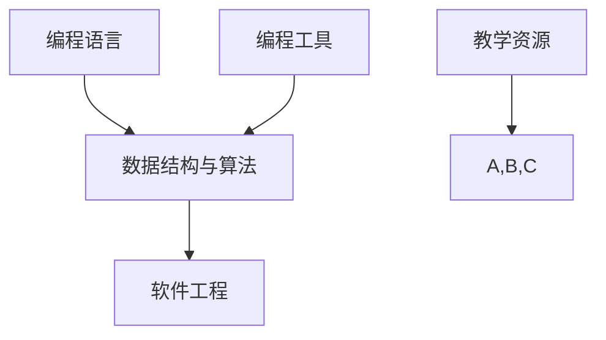

                 

# 《程序员如何利用Twitch进行实时编程教学》

## 关键词
- Twitch
- 实时编程教学
- 程序员
- 教学策略
- 教学工具
- 教学评估与优化

## 摘要
本文将探讨程序员如何利用Twitch平台进行实时编程教学。通过介绍Twitch实时编程教学的基础知识，包括平台概述、直播技术基础、编程教学核心概念等，我们将深入了解Twitch在编程教育中的应用及其优势与挑战。随后，文章将重点分析编程教学策略、演示技巧、教学内容规划与组织方法，并结合实际案例进行讲解。此外，还将介绍相关教学工具与资源，并探讨Twitch实时编程教学的评估与优化策略。最后，通过一个完整的实战案例，展示如何搭建个人Twitch编程教学频道，并进行Python和Web开发教学直播。

### 第一部分：Twitch实时编程教学基础

#### 1.1 Twitch实时编程教学概述

### 1.1.1 Twitch平台介绍
Twitch是一家全球知名的直播平台，成立于2011年，主要专注于游戏直播，但也逐渐扩展到其他领域，如音乐、艺术、教育等。Twitch拥有庞大的用户群体和丰富的直播内容，为实时编程教学提供了一个理想的平台。

### 1.1.2 Twitch在编程教育中的应用
Twitch在编程教育中的应用主要体现在以下几个方面：

1. **实时教学互动**：程序员可以通过直播实时讲解编程知识和解决编程问题，与学生进行互动，提高学生的学习体验。
2. **代码演示**：程序员可以在直播过程中实时编写和展示代码，帮助学生更好地理解编程过程。
3. **学习资源分享**：程序员可以将自己的编程经验、代码示例和教学资源分享给观众，促进知识传播和交流。

### 1.1.3 Twitch编程教学的优势与挑战
Twitch编程教学具有以下优势：

1. **广泛的受众群体**：Twitch拥有庞大的用户基础，有利于扩大教学影响力。
2. **实时互动**：直播互动可以增强学生的学习参与感和学习效果。
3. **多样化的教学内容**：Twitch可以容纳各种编程语言和技术的教学。

然而，Twitch编程教学也面临一些挑战：

1. **技术要求**：直播技术基础和网络环境的搭建对程序员有一定的要求。
2. **内容质量**：保持高质量的教学内容是一个长期的任务，需要不断地学习和创新。
3. **观众管理**：吸引和维护观众群体需要一定的技巧和策略。

#### 1.2 Twitch直播技术基础

### 1.2.1 Twitch直播技术概述
Twitch直播技术主要包括以下几个方面：

1. **编码与传输**：将视频和音频信号转换为数字信号，并通过网络传输到观众。
2. **服务器与网络**：Twitch拥有自己的服务器网络，确保直播内容的稳定传输。
3. **客户端播放**：观众通过Twitch客户端或其他支持直播的软件观看直播。

### 1.2.2 直播设备与软件选择
进行Twitch直播，程序员需要准备以下设备和软件：

1. **摄像头和麦克风**：高质量的摄像头和麦克风可以提升直播画质和声音效果。
2. **直播软件**：常用的直播软件有OBS Studio、XSplit等，可以用于画面切换、特效添加等功能。
3. **编程开发工具**：用于编写和演示编程代码的工具，如Visual Studio、PyCharm等。

### 1.2.3 直播环境搭建与优化
搭建Twitch直播环境需要以下几个步骤：

1. **硬件准备**：安装摄像头、麦克风等硬件设备。
2. **软件安装**：安装并配置直播软件。
3. **网络优化**：确保网络环境稳定，提高直播画质和流畅度。
4. **系统调试**：进行系统调试，确保直播过程顺利进行。

#### 1.3 编程教学核心概念与联系

### 1.3.1 编程教学核心概念
编程教学的核心概念包括：

1. **编程语言**：如Python、Java、C++等，是程序员与计算机进行交流的工具。
2. **数据结构与算法**：是编程的基础，用于解决各种问题。
3. **软件工程**：涉及软件开发的全过程，包括需求分析、设计、开发、测试和维护。

### 1.3.2 编程教学架构图（Mermaid流程图）

### 1.3.3 编程教学架构图说明
- **编程语言**：是编程教学的核心，包括Python、Java、C++等。
- **数据结构与算法**：是编程的基础，用于解决各种问题。
- **软件工程**：涉及软件开发的全过程，包括需求分析、设计、开发、测试和维护。
- **编程工具**：包括Visual Studio、PyCharm等，用于编写和调试代码。
- **教学资源**：包括教材、视频、案例等，用于辅助教学。

---

**本文节选自《程序员如何利用Twitch进行实时编程教学》第一部分，文章将逐步深入探讨Twitch实时编程教学的策略、技巧、工具与实战案例，敬请期待后续内容。作者：AI天才研究院/AI Genius Institute & 禅与计算机程序设计艺术 /Zen And The Art of Computer Programming**

---

[上一节](#第一部分-twitch实时编程教学基础) | [目录](#目录) | [下一节](#第二部分-twitch实时编程教学方法与技巧) | [附录](#附录) | [返回顶部](#第一部分-twitch实时编程教学基础)
<|assistant|>### 第一部分：Twitch实时编程教学基础

#### 1.1 Twitch实时编程教学概述

##### 1.1.1 Twitch平台介绍

Twitch是一个专注于实时交互内容分享的平台，最初以游戏直播为主，但如今其内容已扩展至电子竞技、音乐、艺术、教育和更多领域。Twitch的核心在于其互动性，观众可以实时评论、送礼物并与主播互动。这种实时互动的特性使其成为一个独特的平台，适合进行编程教学。

Twitch的特点包括：

- **庞大的用户基础**：Twitch拥有数亿活跃用户，这意味着有巨大的潜在观众群体。
- **实时互动**：观众可以在直播过程中提问、评论，主播可以实时回答，这种即时互动可以提高教学效果。
- **多平台支持**：Twitch支持多种设备观看直播，包括电脑、手机和智能电视，方便学生随时随地学习。
- **灵活的内容创建**：主播可以根据教学需要，自由地选择教学内容、节奏和互动方式。

##### 1.1.2 Twitch在编程教育中的应用

Twitch在编程教育中的应用主要体现在以下几个方面：

1. **实时教学**：程序员可以在Twitch上进行实时编程教学，展示代码编写过程，解答学生的问题。
2. **互动教学**：学生可以通过评论或聊天与程序员互动，这种即时反馈有助于提高学习效率。
3. **代码分享**：程序员可以在直播中分享自己的代码库、工具和资源，为学生提供丰富的学习材料。
4. **经验分享**：通过直播，程序员可以分享自己的编程经验和职业发展历程，激励学生。
5. **项目展示**：程序员可以在直播中展示自己的项目，提供项目思路、代码实现和优化建议。

##### 1.1.3 Twitch编程教学的优势与挑战

Twitch编程教学的优势包括：

- **广泛的受众**：Twitch拥有庞大的用户群体，有利于扩大编程教育的影响力。
- **实时互动**：直播互动可以增强学生的学习参与感，提高教学效果。
- **灵活性和多样性**：程序员可以根据需要灵活调整教学内容和互动方式，适应不同学生群体。

然而，Twitch编程教学也面临一些挑战：

- **技术要求**：程序员需要具备一定的直播技术基础，包括直播软件的使用、设备调试和网络优化等。
- **内容质量**：保持高质量的教学内容是一个挑战，需要不断更新和优化。
- **观众管理**：吸引和维护观众群体需要一定的策略，如定期更新内容、互动和社群管理。

通过以上概述，我们可以看到Twitch平台在编程教育中具有巨大的潜力，但同时也需要克服一定的挑战。在下一部分中，我们将深入探讨Twitch直播技术基础，帮助程序员搭建和优化直播环境。

---

**本文节选自《程序员如何利用Twitch进行实时编程教学》第一部分，文章将逐步深入探讨Twitch实时编程教学的策略、技巧、工具与实战案例，敬请期待后续内容。作者：AI天才研究院/AI Genius Institute & 禅与计算机程序设计艺术 /Zen And The Art of Computer Programming**

---

[上一节](#第一部分-twitch实时编程教学基础) | [目录](#目录) | [下一节](#第二部分-twitch实时编程教学方法与技巧) | [附录](#附录) | [返回顶部](#第一部分-twitch实时编程教学基础)
<|assistant|>### 第一部分：Twitch实时编程教学基础

#### 1.2 Twitch直播技术基础

##### 1.2.1 Twitch直播技术概述

Twitch直播技术涉及多个方面，包括编码与传输、服务器与网络、客户端播放等。以下是对这些技术的基本概述：

1. **编码与传输**：
    - **视频编码**：视频数据在传输前需要进行编码，常用的编码格式包括H.264和HEVC。编码过程中，视频帧被转换成压缩格式，以减少数据传输量。
    - **音频编码**：音频数据同样需要编码，常用的编码格式包括AAC和MP3。音频编码用于压缩音频信号，提高传输效率。
    - **传输协议**：视频和音频数据通过RTMP（Real Time Messaging Protocol）或RTSP（Real Time Streaming Protocol）等传输协议传输到Twitch服务器。

2. **服务器与网络**：
    - **Twitch服务器**：Twitch拥有自己的服务器网络，负责接收、处理和传输直播数据。服务器确保直播内容在全球范围内的稳定传输。
    - **CDN（Content Delivery Network）**：CDN是一个分布式网络，用于加速直播内容的传输。CDN将直播数据缓存到全球各地的服务器，提高观众的观看体验。

3. **客户端播放**：
    - **Twitch客户端**：观众通过Twitch客户端观看直播。客户端负责解码和播放视频、音频数据，并提供交互功能，如发送评论、发送礼物等。

##### 1.2.2 直播设备与软件选择

进行Twitch直播，程序员需要选择合适的设备和软件，以满足直播质量和稳定性的需求。以下是一些常用的设备和软件：

1. **摄像头**：
    - **USB摄像头**：适用于个人直播，价格适中，易于安装。
    - **专业摄像头**：适用于商业直播，提供更高质量的图像，但价格较高。

2. **麦克风**：
    - **USB麦克风**：适用于个人直播，价格适中，音质较好。
    - **专业麦克风**：适用于商业直播，提供更高的音质和更好的收音效果，但价格较高。

3. **直播软件**：
    - **OBS Studio**：一款免费、开源的直播软件，功能强大，适用于各种直播场景。
    - **XSplit**：一款付费的直播软件，提供高级功能，如多场景切换、特效添加等。

4. **编程开发工具**：
    - **Visual Studio**：一款强大的集成开发环境（IDE），适用于各种编程语言。
    - **PyCharm**：一款适用于Python开发的IDE，功能全面，支持多种编程语言。

##### 1.2.3 直播环境搭建与优化

搭建Twitch直播环境需要以下步骤：

1. **硬件安装**：
    - 安装摄像头、麦克风等硬件设备，并确保其正常工作。

2. **软件安装与配置**：
    - 安装直播软件（如OBS Studio或XSplit），并进行必要的配置。
    - 配置摄像头和麦克风，确保图像和声音质量。

3. **网络优化**：
    - 确保网络环境稳定，可以尝试以下方法：
        - 使用有线网络连接，提高网络稳定性。
        - 关闭其他占用网络带宽的设备，确保直播流量优先。
        - 调整路由器设置，优化网络传输。

4. **系统调试**：
    - 进行系统调试，确保直播过程顺利进行。
    - 检查直播软件的设置，确保所有组件正常运行。

5. **测试与优化**：
    - 在正式直播前，进行测试直播，检查图像、声音和直播流是否正常。
    - 根据测试结果，对直播环境进行优化。

通过以上步骤，程序员可以搭建一个基本的Twitch直播环境。在直播过程中，程序员还需要不断优化直播质量，提高观众的观看体验。

---

**本文节选自《程序员如何利用Twitch进行实时编程教学》第一部分，文章将逐步深入探讨Twitch实时编程教学的策略、技巧、工具与实战案例，敬请期待后续内容。作者：AI天才研究院/AI Genius Institute & 禅与计算机程序设计艺术 /Zen And The Art of Computer Programming**

---

[上一节](#第一部分-twitch实时编程教学基础) | [目录](#目录) | [下一节](#第二部分-twitch实时编程教学方法与技巧) | [附录](#附录) | [返回顶部](#第一部分-twitch实时编程教学基础)
<|assistant|>### 第一部分：Twitch实时编程教学基础

#### 1.3 编程教学核心概念与联系

##### 1.3.1 编程教学核心概念

编程教学的核心概念包括编程语言、数据结构与算法、软件工程等。这些概念是程序员的基础，也是编程教学的支柱。

1. **编程语言**：编程语言是程序员与计算机交流的工具。常见的编程语言有Python、Java、C++等。每种语言都有其独特的语法和特性，适用于不同的应用场景。

2. **数据结构与算法**：数据结构是存储和组织数据的方式，算法是解决问题的方法。常见的数据结构有数组、链表、栈、队列、树、图等。算法包括排序、搜索、动态规划、分治等。掌握数据结构与算法有助于编写高效、优化的代码。

3. **软件工程**：软件工程是软件开发的全过程，包括需求分析、设计、开发、测试和维护。软件工程注重团队合作、项目管理、质量保证和持续迭代。

##### 1.3.2 编程教学架构图（Mermaid流程图）


**编程教学架构图说明**：

- **编程语言**：是编程教学的起点，为学生提供编程的基本工具。
- **数据结构与算法**：是编程教学的核心，培养学生的逻辑思维和问题解决能力。
- **软件工程**：是编程教学的延伸，让学生了解软件开发的完整过程。
- **编程工具**：用于编写、调试和优化代码，如IDE（集成开发环境）、代码库、版本控制系统等。
- **教学资源**：包括教材、视频、案例、在线资源等，用于辅助教学。

##### 1.3.3 编程教学核心概念的联系

编程教学核心概念之间的联系可以概括为：

- **编程语言**是数据结构与算法的基础，程序员通过编程语言来实现数据结构和算法。
- **数据结构与算法**是软件工程的基石，软件工程师需要熟练掌握数据结构和算法，以设计和实现高效的软件系统。
- **软件工程**涵盖了编程语言、数据结构与算法的应用，是编程教学的综合体现。

通过这种联系，编程教学能够帮助学生系统地学习编程知识，培养他们的编程能力。

---

**本文节选自《程序员如何利用Twitch进行实时编程教学》第一部分，文章将逐步深入探讨Twitch实时编程教学的策略、技巧、工具与实战案例，敬请期待后续内容。作者：AI天才研究院/AI Genius Institute & 禅与计算机程序设计艺术 /Zen And The Art of Computer Programming**

---

[上一节](#第一部分-twitch实时编程教学基础) | [目录](#目录) | [下一节](#第二部分-twitch实时编程教学方法与技巧) | [附录](#附录) | [返回顶部](#第一部分-twitch实时编程教学基础)
<|assistant|>### 第二部分：Twitch实时编程教学方法与技巧

#### 2.1 编程教学策略与方法

##### 2.1.1 编程教学策略

编程教学策略是指导教学过程的基本原则，目的是提高教学效果和学生参与度。以下是一些常用的编程教学策略：

1. **任务驱动教学**：
    - **任务设计**：设计具有挑战性、符合学生认知水平的任务。
    - **任务执行**：引导学生自主完成任务，鼓励合作和探究。
    - **任务反馈**：及时给予学生反馈，指导学生改进。

2. **问题解决教学**：
    - **问题提出**：提出具有启发性的问题，激发学生的思考。
    - **问题分析**：引导学生分析问题，明确解决问题的思路。
    - **问题解决**：教授解决问题的方法和技巧，鼓励学生独立解决问题。

3. **项目驱动教学**：
    - **项目设计**：设计符合实际应用场景的项目，具有明确的任务和目标。
    - **项目实施**：引导学生参与项目实施，体验整个软件开发过程。
    - **项目评估**：对项目成果进行评估，总结经验教训。

4. **案例教学**：
    - **案例选择**：选择具有代表性和启发性的案例。
    - **案例分析**：引导学生分析案例，理解问题的本质。
    - **案例应用**：将案例应用于实际编程任务中，提高实践能力。

##### 2.1.2 教学方法概述

编程教学的方法多样，主要包括讲授法、讨论法、实践法、案例教学法和问题解决法等。以下是对这些方法的简要概述：

1. **讲授法**：
    - **定义**：以教师为中心，通过讲解和演示传授知识。
    - **优点**：信息传递效率高，适用于知识点讲解。
    - **缺点**：学生参与度低，不利于培养实际编程能力。

2. **讨论法**：
    - **定义**：通过小组讨论、头脑风暴等方式促进知识交流。
    - **优点**：提高学生参与度，促进知识内化。
    - **缺点**：需要较长时间，难以保证知识掌握。

3. **实践法**：
    - **定义**：通过动手实践，提高编程技能和解决问题的能力。
    - **优点**：培养实际编程能力，提高学习兴趣。
    - **缺点**：需要一定的设备和资源支持。

4. **案例教学法**：
    - **定义**：通过案例分析，理解问题的本质和解决方法。
    - **优点**：提高问题解决能力，增强实际应用能力。
    - **缺点**：案例选择和讲解需要较高技巧。

5. **问题解决法**：
    - **定义**：通过提出问题、分析问题和解决问题，培养问题解决能力。
    - **优点**：培养独立思考能力和创新能力。
    - **缺点**：需要较长时间，教师需具备较强的引导能力。

##### 2.1.3 教学方法案例解析

以下是一个基于任务驱动教学策略的编程教学案例：

**案例：Python基础教学**

**任务设计**：
- **任务一**：编写一个Python程序，计算1到100之间所有偶数的和。
- **任务二**：编写一个Python程序，打印出斐波那契数列的前10项。

**任务执行**：
1. **任务一**：
    - **讲解**：教师简要介绍Python的基础语法，如变量、条件判断和循环结构。
    - **演示**：教师演示如何编写和运行Python程序。
    - **练习**：学生自主编写程序，教师给予实时反馈。

2. **任务二**：
    - **讲解**：教师介绍斐波那契数列的概念和计算方法。
    - **演示**：教师演示如何使用循环结构实现斐波那契数列的打印。
    - **练习**：学生自主编写程序，教师给予实时反馈。

**任务反馈**：
- **个别反馈**：教师对学生的程序进行个别反馈，指出错误和改进之处。
- **集体反馈**：教师组织学生讨论，总结编程过程中的常见问题和解决方法。

通过这个案例，我们可以看到任务驱动教学策略如何应用于编程教学，提高学生的学习效果和参与度。

---

**本文节选自《程序员如何利用Twitch进行实时编程教学》第二部分，我们将继续探讨编程教学的演示技巧、教学内容规划与组织方法，以及Twitch实时编程教学案例分析。敬请期待后续内容。作者：AI天才研究院/AI Genius Institute & 禅与计算机程序设计艺术 /Zen And The Art of Computer Programming**

---

[上一节](#第一部分-twitch实时编程教学基础) | [目录](#目录) | [下一节](#第二部分-twitch实时编程教学方法与技巧) | [附录](#附录) | [返回顶部](#第一部分-twitch实时编程教学基础)
<|assistant|>### 第二部分：Twitch实时编程教学方法与技巧

#### 2.2 编程教学演示技巧

##### 2.2.1 演示技巧概述

在Twitch上进行实时编程教学，演示技巧至关重要。一个优秀的演示可以激发学生的兴趣，提高他们的学习效果。以下是一些关键的演示技巧：

1. **清晰的代码展示**：
    - **代码高亮**：使用代码高亮工具，使代码在直播过程中更加清晰易读。
    - **逐步演示**：逐步展示代码的编写和运行过程，让学生跟随教师的操作。

2. **讲解与演示相结合**：
    - **同步讲解**：在演示过程中，教师需要同步讲解代码的功能、语法和实现方法。
    - **举例说明**：通过实际案例，展示代码在实际应用中的效果。

3. **互动与反馈**：
    - **回答问题**：鼓励学生在直播中提问，及时回答学生的问题，增强互动。
    - **实时反馈**：对学生的代码进行实时反馈，指出错误和改进之处。

4. **多媒体辅助**：
    - **视频演示**：在直播中穿插相关视频，帮助学生更好地理解复杂的概念。
    - **动画和图表**：使用动画和图表，使抽象的概念更加直观。

##### 2.2.2 代码演示技巧

代码演示是实时编程教学的核心部分，以下是一些具体的代码演示技巧：

1. **选择合适的编程工具**：
    - **IDE**：使用集成开发环境（IDE），如Visual Studio、PyCharm等，便于代码编写、调试和运行。
    - **代码编辑器**：使用代码编辑器，如VS Code，提供代码高亮、语法检查等功能。

2. **优化直播设置**：
    - **画面布局**：合理安排直播画面布局，使代码区域、讲解区域和互动区域清晰可见。
    - **音视频设置**：优化音视频设置，确保画面清晰、声音清晰。

3. **逐步演示代码**：
    - **逐步编写代码**：逐步输入代码，每次输入一小部分，并立即运行，展示代码的实时效果。
    - **讲解代码功能**：在编写代码时，同步讲解代码的功能、语法和实现方法。

4. **实时调试与反馈**：
    - **错误调试**：在代码运行时，及时发现并解决错误，展示调试过程。
    - **代码优化**：对代码进行优化，展示代码优化的过程和方法。

##### 2.2.3 教学互动技巧

互动是Twitch实时编程教学的重要组成部分，以下是一些互动技巧：

1. **鼓励提问**：
    - **开放提问环节**：在直播过程中设置提问环节，鼓励学生提问。
    - **回答问题**：及时回答学生的问题，增强学生的参与感。

2. **互动讨论**：
    - **分组讨论**：将学生分组，讨论特定的编程问题。
    - **实时投票**：使用在线投票工具，收集学生的意见和反馈。

3. **使用互动工具**：
    - **聊天室管理**：合理管理直播聊天室，确保讨论氛围积极、有序。
    - **赠送礼物**：鼓励学生赠送礼物，提高学生的参与度和积极性。

4. **实时反馈**：
    - **代码评审**：对学生的代码进行实时评审，给出具体的意见和建议。
    - **进度跟踪**：跟踪学生的学习进度，提供个性化的指导和帮助。

通过以上演示技巧和互动技巧，程序员可以在Twitch上有效地进行实时编程教学，提高教学效果和学生参与度。

---

**本文节选自《程序员如何利用Twitch进行实时编程教学》第二部分，我们将继续探讨教学内容规划与组织方法，以及Twitch实时编程教学案例分析。敬请期待后续内容。作者：AI天才研究院/AI Genius Institute & 禅与计算机程序设计艺术 /Zen And The Art of Computer Programming**

---

[上一节](#第一部分-twitch实时编程教学基础) | [目录](#目录) | [下一节](#第二部分-twitch实时编程教学方法与技巧) | [附录](#附录) | [返回顶部](#第一部分-twitch实时编程教学基础)
<|assistant|>### 第二部分：Twitch实时编程教学方法与技巧

#### 2.3 教学内容规划与组织

##### 2.3.1 教学内容规划

教学内容规划是Twitch实时编程教学成功的关键。一个有效的教学内容规划应该包括以下步骤：

1. **确定教学目标**：
    - **短期目标**：明确每节课的教学目标，如学习某个编程语言的基础语法、理解某个数据结构等。
    - **长期目标**：明确整个教学周期的目标，如掌握一门编程语言、完成一个项目等。

2. **选择教学内容**：
    - **基础知识**：选择适合学生水平的编程基础知识，如变量、条件判断、循环等。
    - **实际应用**：结合实际应用案例，使学生能够将所学知识应用于实际项目中。

3. **设计教学活动**：
    - **讲解**：设计讲解环节，确保学生能够理解所学知识。
    - **练习**：设计编程练习，让学生通过实践巩固所学知识。
    - **讨论**：设计讨论环节，促进学生之间的交流和合作。

4. **制定教学计划**：
    - **时间安排**：合理分配每节课的时间，确保教学内容能够顺利完成。
    - **进度控制**：根据学生的学习进度，适时调整教学计划。

##### 2.3.2 教学内容组织

教学内容的组织是确保教学效果的重要环节。以下是一些教学内容组织的原则：

1. **层次清晰**：
    - **基础知识**：先从最基本的概念和语法开始，逐步深入。
    - **实践应用**：结合实际案例，将理论知识应用于实际项目中。

2. **逻辑连贯**：
    - **逐步讲解**：按照逻辑顺序，逐步讲解每个知识点，确保学生能够跟上教学进度。
    - **理论与实践相结合**：讲解理论知识的同时，提供实际操作的机会。

3. **多样化**：
    - **多种教学方式**：结合讲授、讨论、实践等多种教学方式，提高学生的学习兴趣和参与度。
    - **多样化资源**：利用视频、代码示例、文档等多种资源，帮助学生更好地理解所学知识。

##### 2.3.3 教学进度控制

教学进度控制是确保教学内容按时完成的重要手段。以下是一些教学进度控制的方法：

1. **定期评估**：
    - **学生评估**：定期评估学生的掌握情况，了解教学效果。
    - **自我评估**：教师定期进行自我评估，反思教学方法和内容。

2. **时间管理**：
    - **时间分配**：合理分配每节课的时间，确保每个知识点都能得到充分讲解和练习。
    - **灵活调整**：根据学生的学习进度，适时调整教学计划，确保教学内容能够按时完成。

3. **互动反馈**：
    - **及时反馈**：在直播过程中，及时回答学生的问题，解决他们的疑惑。
    - **互动环节**：设置互动环节，让学生参与讨论，提高学习兴趣。

通过以上教学进度控制方法，教师可以确保教学进度有序进行，提高教学效果。

---

**本文节选自《程序员如何利用Twitch进行实时编程教学》第二部分，我们将继续探讨Twitch实时编程教学案例分析。敬请期待后续内容。作者：AI天才研究院/AI Genius Institute & 禅与计算机程序设计艺术 /Zen And The Art of Computer Programming**

---

[上一节](#第一部分-twitch实时编程教学基础) | [目录](#目录) | [下一节](#第二部分-twitch实时编程教学方法与技巧) | [附录](#附录) | [返回顶部](#第一部分-twitch实时编程教学基础)
<|assistant|>### 第二部分：Twitch实时编程教学方法与技巧

#### 2.4 Twitch实时编程教学案例分析

##### 2.4.1 案例分析概述

在本节中，我们将分析两个Twitch实时编程教学案例：Python基础教学和Web开发教学。通过这些案例，我们将深入了解如何在实际教学中应用Twitch平台的优势，以及如何应对可能出现的问题。

##### 2.4.2 案例一：Python基础教学

**教学目标**：
- **短期目标**：掌握Python的基础语法和基本数据结构。
- **长期目标**：能够编写简单的Python程序，理解Python的编程范式。

**教学内容**：
- **变量和基本数据类型**
- **条件判断和循环结构**
- **函数和模块**
- **基本数据结构（列表、字典、集合）**

**教学过程**：

1. **引入**：
    - **教师介绍**：介绍教师自己以及教学目标。
    - **Python简介**：简要介绍Python的历史、特点和优势。

2. **基础知识讲解**：
    - **变量和基本数据类型**：讲解变量、整数、浮点数、字符串等基本数据类型。
    - **条件判断和循环结构**：讲解if语句、while循环和for循环的使用。

3. **代码演示**：
    - **演示代码编写**：逐步演示如何编写一个简单的Python程序。
    - **运行和调试**：展示程序运行结果，讲解常见错误和调试方法。

4. **练习和讨论**：
    - **练习题**：给学生发放练习题，要求在直播中完成。
    - **讨论环节**：解答学生的疑问，讨论练习题的解答过程。

5. **总结**：
    - **知识点回顾**：回顾本节课的知识点。
    - **作业布置**：布置课后作业，巩固所学知识。

**案例分析**：
Python基础教学案例展示了如何利用Twitch进行有效的编程教学。通过逐步演示和互动讨论，教师能够帮助学生更好地理解Python的基础语法和基本数据结构。直播互动环节的设置，使学生在遇到问题时能够及时获得帮助，提高学习效果。

##### 2.4.3 案例二：Web开发教学

**教学目标**：
- **短期目标**：掌握HTML、CSS和JavaScript的基础知识。
- **长期目标**：能够独立开发简单的Web页面。

**教学内容**：
- **HTML基础**
- **CSS样式**
- **JavaScript基础**
- **Web页面布局**

**教学过程**：

1. **引入**：
    - **教师介绍**：介绍教师自己以及教学目标。
    - **Web开发简介**：简要介绍Web开发的基本概念和技术栈。

2. **基础知识讲解**：
    - **HTML基础**：讲解HTML的基本结构、标签和属性。
    - **CSS样式**：讲解CSS的选择器、属性和布局。
    - **JavaScript基础**：讲解JavaScript的基本语法、变量、函数和事件处理。

3. **代码演示**：
    - **演示代码编写**：逐步演示如何编写一个简单的Web页面。
    - **运行和调试**：展示Web页面的运行结果，讲解常见错误和调试方法。

4. **项目实战**：
    - **项目介绍**：介绍一个简单的Web开发项目，如制作一个个人博客页面。
    - **项目实施**：带领学生逐步完成项目，讲解项目中的关键技术和技巧。

5. **总结**：
    - **知识点回顾**：回顾本节课的知识点。
    - **作业布置**：布置课后作业，巩固所学知识。

**案例分析**：
Web开发教学案例展示了如何利用Twitch进行项目驱动的编程教学。通过项目实战，学生能够将所学的HTML、CSS和JavaScript知识应用于实际项目中，提高实践能力和解决问题的能力。教师通过实时互动和反馈，帮助学生克服开发过程中的困难，提高教学效果。

通过以上两个案例，我们可以看到Twitch实时编程教学的优势和挑战。在实际教学中，教师需要灵活运用Twitch平台的特点，设计互动性强的教学活动和项目，提高学生的学习效果。

---

**本文节选自《程序员如何利用Twitch进行实时编程教学》第二部分，我们将继续探讨Twitch实时编程教学工具与资源。敬请期待后续内容。作者：AI天才研究院/AI Genius Institute & 禅与计算机程序设计艺术 /Zen And The Art of Computer Programming**

---

[上一节](#第一部分-twitch实时编程教学基础) | [目录](#目录) | [下一节](#第二部分-twitch实时编程教学方法与技巧) | [附录](#附录) | [返回顶部](#第一部分-twitch实时编程教学基础)
<|assistant|>### 第三部分：Twitch实时编程教学工具与资源

#### 3.1 Twitch编程教学工具

##### 3.1.1 Twitch直播教学工具

Twitch直播教学工具主要包括直播软件和编程开发工具。以下是一些常用的工具：

1. **OBS Studio**：
    - **功能**：OBS Studio是一款开源、免费的直播软件，支持多种视频和音频输入源，提供丰富的视频特效和转场效果。
    - **优势**：界面友好，功能强大，适合各种直播场景。
    - **使用场景**：适合进行编程教学直播，可以同时显示代码、PPT和讲解画面。

2. **XSplit**：
    - **功能**：XSplit是一款付费的直播软件，提供高级功能，如多场景切换、实时流编辑和特效添加。
    - **优势**：界面直观，功能丰富，支持自定义布局。
    - **使用场景**：适合专业级的直播教学，可以制作高质量的视频内容。

3. **Teachable**：
    - **功能**：Teachable是一款在线教学平台，支持视频、音频和文本等多种教学内容形式。
    - **优势**：易于使用，提供完整的在线教学解决方案。
    - **使用场景**：适合进行在线编程课程的教学和录制。

##### 3.1.2 编程开发工具

编程开发工具是进行实时编程教学的重要工具，以下是一些常用的编程开发工具：

1. **Visual Studio**：
    - **功能**：Visual Studio是一款由微软开发的集成开发环境（IDE），支持多种编程语言，提供丰富的开发工具和调试功能。
    - **优势**：功能强大，适合专业编程。
    - **使用场景**：适合进行复杂的编程教学和项目开发。

2. **PyCharm**：
    - **功能**：PyCharm是一款由JetBrains开发的Python IDE，提供代码高亮、智能提示、代码调试等功能。
    - **优势**：界面友好，智能提示功能强大。
    - **使用场景**：适合Python编程教学和项目开发。

3. **CodeSandbox**：
    - **功能**：CodeSandbox是一款在线编程环境，支持多种编程语言，提供实时预览和调试功能。
    - **优势**：在线使用，无需安装，方便快捷。
    - **使用场景**：适合在线编程教学和实践。

##### 3.1.3 教学辅助工具

教学辅助工具可以帮助教师更好地进行实时编程教学，以下是一些常用的教学辅助工具：

1. **ScreenShare**：
    - **功能**：ScreenShare是一款屏幕共享工具，可以实时共享教师屏幕，让学生跟随教师的操作。
    - **优势**：实时性强，易于操作。
    - **使用场景**：适合进行编程演示和讲解。

2. **CodeSandbox**：
    - **功能**：CodeSandbox是一款在线编程环境，支持多种编程语言，提供实时预览和调试功能。
    - **优势**：在线使用，无需安装，方便快捷。
    - **使用场景**：适合在线编程教学和实践。

3. **Trello**：
    - **功能**：Trello是一款项目管理工具，可以用于任务分配、进度跟踪和协作。
    - **优势**：界面直观，易于使用。
    - **使用场景**：适合项目管理、任务分配和进度跟踪。

通过以上工具，程序员可以有效地进行Twitch实时编程教学，提高教学效果和学生参与度。

---

**本文节选自《程序员如何利用Twitch进行实时编程教学》第三部分，我们将继续探讨Twitch编程教学资源以及Twitch编程教学平台生态。敬请期待后续内容。作者：AI天才研究院/AI Genius Institute & 禅与计算机程序设计艺术 /Zen And The Art of Computer Programming**

---

[上一节](#第二部分-twitch实时编程教学方法与技巧) | [目录](#目录) | [下一节](#第三部分-twitch实时编程教学工具与资源) | [附录](#附录) | [返回顶部](#第一部分-twitch实时编程教学基础)
<|assistant|>### 第三部分：Twitch实时编程教学工具与资源

#### 3.2 Twitch编程教学资源

##### 3.2.1 在线编程资源

在线编程资源为程序员提供了丰富的学习材料，包括教程、文档、在线编程环境和代码示例。以下是一些常用的在线编程资源：

1. **Codecademy**：
    - **功能**：提供互动式编程课程，涵盖多种编程语言。
    - **优势**：适合初学者，互动性强。
    - **使用场景**：适合初学者学习和巩固编程基础知识。

2. **freeCodeCamp**：
    - **功能**：提供免费的编程课程和项目挑战。
    - **优势**：课程体系完整，项目挑战有助于实践。
    - **使用场景**：适合进阶学习，提升编程能力。

3. **LeetCode**：
    - **功能**：提供编程练习题，涵盖多种编程语言和数据结构。
    - **优势**：题目丰富，适合准备技术面试。
    - **使用场景**：适合练习编程算法和数据结构。

4. **GitHub**：
    - **功能**：提供代码托管和版本控制服务。
    - **优势**：开源社区活跃，代码质量高。
    - **使用场景**：适合查找和学习开源代码，进行项目协作。

##### 3.2.2 教学视频资源

教学视频资源为程序员提供了丰富的视频教程和课程，有助于理解和掌握编程知识。以下是一些常用的教学视频资源：

1. **YouTube**：
    - **功能**：提供大量的编程教学视频，涵盖多种编程语言和技术。
    - **优势**：内容丰富，形式多样。
    - **使用场景**：适合查找特定问题的解决方法，学习编程技巧。

2. **Udemy**：
    - **功能**：提供付费和免费的编程课程，涵盖多种编程语言和技术。
    - **优势**：课程体系完整，讲师经验丰富。
    - **使用场景**：适合系统学习编程知识，提升技能。

3. **Pluralsight**：
    - **功能**：提供专业的编程和IT课程，涵盖多种编程语言和技术。
    - **优势**：内容高质量，适合职业发展。
    - **使用场景**：适合深入学习专业知识和技能。

##### 3.2.3 社区与社群资源

社区与社群资源为程序员提供了一个交流和学习的平台，有助于获取最新技术动态和解决编程问题。以下是一些常用的社区与社群资源：

1. **Stack Overflow**：
    - **功能**：提供编程问答社区，用户可以提问和回答问题。
    - **优势**：问题解答及时，覆盖面广。
    - **使用场景**：适合查找编程问题的解决方案，参与技术讨论。

2. **GitHub**：
    - **功能**：提供代码托管和协作平台，用户可以创建和参与开源项目。
    - **优势**：开源社区活跃，代码质量高。
    - **使用场景**：适合查找和学习开源代码，进行项目协作。

3. **Reddit**：
    - **功能**：提供编程相关的讨论区和社区。
    - **优势**：用户多，讨论深入。
    - **使用场景**：适合获取编程相关新闻、技术动态和参与技术讨论。

通过以上资源，程序员可以有效地提升自己的编程技能，同时也能在Twitch上进行实时编程教学，为学生提供丰富的学习材料和支持。

---

**本文节选自《程序员如何利用Twitch进行实时编程教学》第三部分，我们将继续探讨Twitch编程教学平台生态。敬请期待后续内容。作者：AI天才研究院/AI Genius Institute & 禅与计算机程序设计艺术 /Zen And The Art of Computer Programming**

---

[上一节](#第二部分-twitch实时编程教学方法与技巧) | [目录](#目录) | [下一节](#第三部分-twitch实时编程教学工具与资源) | [附录](#附录) | [返回顶部](#第一部分-twitch实时编程教学基础)
<|assistant|>### 第三部分：Twitch实时编程教学工具与资源

#### 3.3 Twitch编程教学平台生态

##### 3.3.1 Twitch平台生态概述

Twitch编程教学平台生态包括多个组成部分，共同构建了一个丰富的编程学习环境。以下是Twitch平台生态的组成部分：

1. **主播**：在Twitch上进行实时编程教学的主播，他们通过分享知识和经验，为学生提供丰富的教学内容。
2. **观众**：Twitch平台的用户，他们通过观看直播、参与讨论和互动，获得编程学习的帮助。
3. **工具与服务提供商**：提供直播软件、编程开发工具、在线编程环境和教学辅助工具的公司和机构，他们为Twitch编程教学提供了必要的支持。
4. **内容创作者**：制作教学视频、编写文档和教程的内容创作者，他们通过Twitch平台分享知识和资源。
5. **社区与社群**：围绕Twitch编程教学形成的在线社区和社群，为用户提供交流和学习的平台。

##### 3.3.2 Twitch与其他平台集成

Twitch编程教学平台生态的整合性使其能够与其他平台和工具无缝集成，增强教学效果。以下是一些常见的集成方式：

1. **GitHub集成**：Twitch主播可以将GitHub仓库链接到直播，展示开源项目的代码，与学生共同讨论和协作。
2. **Jupyter Notebook集成**：Twitch主播可以使用Jupyter Notebook进行实时编程演示，学生可以在直播中实时运行代码。
3. **教育平台集成**：Twitch可以与教育平台如Moodle、Canvas等集成，实现在线课程管理和互动。
4. **互动工具集成**：Twitch可以集成互动工具如Slack、Discord等，为学生提供实时讨论和协作的渠道。

##### 3.3.3 Twitch编程教育生态发展趋势

随着技术的发展和编程教育的普及，Twitch编程教学平台生态呈现出以下发展趋势：

1. **内容多样化**：Twitch编程教学内容将更加多样化，包括基础编程、Web开发、人工智能、数据分析等不同领域。
2. **互动性增强**：Twitch将通过引入更多的互动工具和功能，提高观众与主播之间的互动性，增强学习体验。
3. **个性化教学**：随着大数据和人工智能技术的发展，Twitch将提供个性化教学推荐，帮助观众找到最适合自己学习的内容和路径。
4. **社区建设**：Twitch将进一步加强社区建设，鼓励内容创作者和观众之间的互动和合作，构建一个更加紧密的学习社区。
5. **商业机会**：Twitch将开放更多的商业合作机会，为内容创作者和工具提供商提供盈利模式，促进编程教育生态的健康发展。

通过以上发展趋势，Twitch编程教学平台生态将不断成熟和壮大，为程序员和观众提供更加丰富、高效的学习体验。

---

**本文节选自《程序员如何利用Twitch进行实时编程教学》第三部分，我们将继续探讨Twitch实时编程教学实战案例。敬请期待后续内容。作者：AI天才研究院/AI Genius Institute & 禅与计算机程序设计艺术 /Zen And The Art of Computer Programming**

---

[上一节](#第二部分-twitch实时编程教学方法与技巧) | [目录](#目录) | [下一节](#第三部分-twitch实时编程教学工具与资源) | [附录](#附录) | [返回顶部](#第一部分-twitch实时编程教学基础)
<|assistant|>### 第四部分：Twitch实时编程教学案例实战

#### 4.1 Twitch实时编程教学实战

##### 4.1.1 实战概述

本节将介绍如何在实际操作中利用Twitch进行实时编程教学。我们将通过两个具体的实战案例：搭建个人Twitch编程教学频道和进行Python编程教学直播，展示如何利用Twitch平台进行有效的编程教学。

##### 4.1.2 实战环境搭建

在进行Twitch实时编程教学之前，首先需要搭建一个稳定的教学环境。以下是一些建议和步骤：

1. **硬件准备**：
    - **摄像头**：选择一款适合直播的摄像头，确保画面质量。
    - **麦克风**：选择一款高灵敏度的麦克风，确保声音清晰。
    - **计算机**：确保计算机性能稳定，能够流畅运行直播软件和编程工具。

2. **软件安装**：
    - **直播软件**：安装OBS Studio或XSplit等直播软件。
    - **编程工具**：安装Visual Studio或PyCharm等编程工具。
    - **编码环境**：根据需要安装相应的编程语言和开发环境，如Python的Anaconda。

3. **网络优化**：
    - 确保网络稳定，可以使用有线网络连接，提高直播稳定性。
    - 关闭其他占用网络带宽的设备，确保直播流量优先。

4. **Twitch账户注册**：
    - 在Twitch官网上注册一个账户，并完成实名认证。
    - 配置直播密钥，确保直播安全。

##### 4.1.3 实战步骤

**步骤1：搭建个人Twitch编程教学频道**

1. **频道规划**：
    - 确定频道名称、简介和封面图片。
    - 设定频道分类，如编程教育、Web开发等。

2. **频道设置**：
    - 配置直播密钥，确保直播安全。
    - 设置直播权限，如禁言、管理员权限等。

3. **内容规划**：
    - 制定教学内容和直播计划，包括课程名称、时间和内容。

**步骤2：进行Python编程教学直播**

1. **教学准备**：
    - 确定教学主题，如Python基础、数据结构等。
    - 准备教学材料和演示代码。

2. **直播演示**：
    - 使用OBS Studio或XSplit等直播软件，设置直播画面。
    - 在直播过程中，实时演示代码编写和调试过程。

3. **互动与反馈**：
    - 在直播过程中，关注观众评论，及时回答问题。
    - 定期进行练习和讨论，增强学生参与感。

**步骤3：实战解析**

1. **问题解决**：
    - 在直播中遇到问题时，如何迅速解决。
    - 提供常见的编程问题和解决方案。

2. **教学反馈**：
    - 收集观众的反馈，改进教学方法和内容。
    - 定期总结教学经验，提升教学效果。

通过以上实战步骤，程序员可以有效地利用Twitch进行实时编程教学，为学生提供高质量的学习体验。

---

**本文节选自《程序员如何利用Twitch进行实时编程教学》第四部分，我们将继续探讨如何搭建个人Twitch编程教学频道和进行Python编程教学直播。敬请期待后续内容。作者：AI天才研究院/AI Genius Institute & 禅与计算机程序设计艺术 /Zen And The Art of Computer Programming**

---

[上一节](#第二部分-twitch实时编程教学方法与技巧) | [目录](#目录) | [下一节](#第四部分-twitch实时编程教学案例实战) | [附录](#附录) | [返回顶部](#第一部分-twitch实时编程教学基础)
<|assistant|>### 第四部分：Twitch实时编程教学案例实战

#### 4.2 搭建个人 Twitch 编程教学频道

##### 4.2.1 频道规划

搭建个人Twitch编程教学频道的第一步是进行频道规划。频道规划是确保频道内容有序、目标明确和吸引观众的关键。以下是一些频道规划的步骤：

1. **确定频道主题**：
   - 根据自己的专长和兴趣，选择一个具体的编程主题，如Python基础、Web开发、人工智能等。
   - 确保主题具有足够的内容深度和广度，能够持续制作高质量的教学内容。

2. **制定内容计划**：
   - 制定一个详细的内容计划，包括每周或每月的教学主题、时间安排和具体内容。
   - 内容计划应包括基础知识教学、项目实战、问题解答等，以满足不同阶段学生的需求。

3. **设定频道目标**：
   - 设定清晰的目标，如增加粉丝数量、提高观众参与度、提升教学质量等。
   - 目标应具体可行，如每月增加1000名粉丝、每次直播平均互动人数达到100人等。

4. **设计频道形象**：
   - 设计一个独特的频道标识，如Logo、配色方案等，使频道在视觉上具有辨识度。
   - 制作一个引人注目的频道介绍视频，展示自己的教学风格和频道特色。

##### 4.2.2 频道设置

完成频道规划后，下一步是进行频道设置。以下是一些频道设置的关键步骤：

1. **注册和实名认证**：
   - 在Twitch官网注册一个账户，并完成实名认证，以确保直播内容的合法性和安全性。

2. **配置直播密钥**：
   - 在Twitch后台配置直播密钥，这是确保直播安全的重要步骤。
   - 将直播密钥添加到直播软件中，确保直播数据能够顺利传输。

3. **设置直播权限**：
   - 根据需要设置直播权限，如禁言、管理员权限等。
   - 管理员权限可以确保直播过程的秩序，避免不良内容的出现。

4. **频道配置**：
   - 设置频道的名称、简介和封面图片，确保这些信息准确和吸引人。
   - 添加标签，以便观众能够更容易地找到频道。

##### 4.2.3 实战解析

以下是搭建个人Twitch编程教学频道的实战解析：

1. **实际操作**：
   - 打开Twitch官网，注册账户并完成实名认证。
   - 在个人主页中找到直播密钥设置页面，生成直播密钥，并复制保存。
   - 在直播软件中（如OBS Studio），设置直播源，包括摄像头、麦克风和编程开发工具。
   - 在直播软件中添加直播密钥，确保直播能够顺利开始。

2. **注意事项**：
   - 确保网络环境稳定，以避免直播过程中的卡顿或中断。
   - 在直播前进行一次完整的测试，确保所有设备和软件正常运行。
   - 定期检查频道设置，确保直播权限和配置符合最新需求。

通过以上步骤，程序员可以成功搭建一个个人Twitch编程教学频道，为观众提供高质量的编程教学内容。

---

**本文节选自《程序员如何利用Twitch进行实时编程教学》第四部分，我们将继续探讨如何进行Python编程教学直播。敬请期待后续内容。作者：AI天才研究院/AI Genius Institute & 禅与计算机程序设计艺术 /Zen And The Art of Computer Programming**

---

[上一节](#第二部分-twitch实时编程教学方法与技巧) | [目录](#目录) | [下一节](#第四部分-twitch实时编程教学案例实战) | [附录](#附录) | [返回顶部](#第一部分-twitch实时编程教学基础)
<|assistant|>### 第四部分：Twitch实时编程教学案例实战

#### 4.3 Python编程教学直播

##### 4.3.1 教学内容准备

在进行Python编程教学直播前，教师需要充分准备教学内容。以下是一些准备步骤：

1. **确定教学主题**：
   - 选择一个具体的Python教学主题，如Python基础、数据处理、Web开发等。
   - 确保主题适合目标观众的水平和兴趣。

2. **编写教学大纲**：
   - 编写详细的教学大纲，包括每个教学环节的内容、目标和时间安排。
   - 教学大纲应涵盖基础知识、实际应用和项目实践。

3. **准备教学材料**：
   - 准备PPT、代码示例、示例数据和教学视频等辅助材料。
   - 确保所有材料都与教学主题相关，且易于理解和操作。

4. **编写练习题**：
   - 设计与教学内容相关的练习题，帮助学生巩固所学知识。
   - 练习题应包括基础题、提高题和挑战题，以适应不同水平的学生。

##### 4.3.2 直播演示与互动

直播演示与互动是Python编程教学直播的核心部分。以下是一些关键的直播演示与互动步骤：

1. **直播环境搭建**：
   - 使用OBS Studio或XSplit等直播软件，搭建直播环境。
   - 设置摄像头、麦克风和编程开发工具，确保画面和声音质量。

2. **开始直播**：
   - 在直播开始前，进行一次全面的测试，确保直播过程顺畅。
   - 开启直播，向观众介绍教学主题和教学大纲。

3. **逐步讲解**：
   - 按照教学大纲，逐步讲解Python的基础知识。
   - 使用PPT和代码示例，展示关键概念和实际操作。

4. **互动环节**：
   - 定期进行互动环节，鼓励学生在聊天室提问。
   - 对学生的问题进行实时回答，确保他们能够跟上教学进度。

5. **代码演示**：
   - 在讲解过程中，实时编写和演示Python代码。
   - 展示代码的运行结果，讲解代码的功能和实现方法。

6. **练习与讨论**：
   - 发放练习题，要求学生在直播中完成。
   - 对学生的答案进行实时评审，提供反馈和指导。

##### 4.3.3 实战解析

以下是Python编程教学直播的实战解析：

1. **实际操作**：
   - 使用OBS Studio，设置摄像头和麦克风，确保画面和声音清晰。
   - 使用PyCharm，打开Python代码文件，进行实时演示。
   - 在直播软件中添加直播密钥，确保直播数据传输正常。

2. **注意事项**：
   - 确保网络稳定，避免直播过程中出现卡顿或中断。
   - 定期检查直播软件设置，确保音视频同步和画面流畅。
   - 在直播过程中，注意与学生互动，及时回答问题。

通过以上步骤，教师可以成功地利用Twitch进行Python编程教学直播，为学生提供丰富的学习资源和互动体验。

---

**本文节选自《程序员如何利用Twitch进行实时编程教学》第四部分，我们将继续探讨如何进行Web开发教学直播。敬请期待后续内容。作者：AI天才研究院/AI Genius Institute & 禅与计算机程序设计艺术 /Zen And The Art of Computer Programming**

---

[上一节](#第二部分-twitch实时编程教学方法与技巧) | [目录](#目录) | [下一节](#第四部分-twitch实时编程教学案例实战) | [附录](#附录) | [返回顶部](#第一部分-twitch实时编程教学基础)
<|assistant|>### 第四部分：Twitch实时编程教学案例实战

#### 4.4 Web开发教学直播

##### 4.4.1 教学内容准备

在进行Web开发教学直播前，教师需要充分准备教学内容。以下是一些准备步骤：

1. **确定教学主题**：
   - 选择一个具体的Web开发教学主题，如HTML、CSS、JavaScript、React、Vue.js等。
   - 确保主题适合目标观众的水平和兴趣。

2. **编写教学大纲**：
   - 编写详细的教学大纲，包括每个教学环节的内容、目标和时间安排。
   - 教学大纲应涵盖基础知识、实际应用和项目实践。

3. **准备教学材料**：
   - 准备PPT、代码示例、示例数据和教学视频等辅助材料。
   - 确保所有材料都与教学主题相关，且易于理解和操作。

4. **编写练习题**：
   - 设计与教学内容相关的练习题，帮助学生巩固所学知识。
   - 练习题应包括基础题、提高题和挑战题，以适应不同水平的学生。

##### 4.4.2 直播演示与互动

直播演示与互动是Web开发教学直播的核心部分。以下是一些关键的直播演示与互动步骤：

1. **直播环境搭建**：
   - 使用OBS Studio或XSplit等直播软件，搭建直播环境。
   - 设置摄像头、麦克风和Web开发工具（如Visual Studio Code），确保画面和声音质量。

2. **开始直播**：
   - 在直播开始前，进行一次全面的测试，确保直播过程顺畅。
   - 开启直播，向观众介绍教学主题和教学大纲。

3. **逐步讲解**：
   - 按照教学大纲，逐步讲解Web开发的基础知识。
   - 使用PPT和代码示例，展示关键概念和实际操作。

4. **互动环节**：
   - 定期进行互动环节，鼓励学生在聊天室提问。
   - 对学生的问题进行实时回答，确保他们能够跟上教学进度。

5. **代码演示**：
   - 在讲解过程中，实时编写和演示Web开发代码。
   - 展示代码的运行结果，讲解代码的功能和实现方法。

6. **练习与讨论**：
   - 发放练习题，要求学生在直播中完成。
   - 对学生的答案进行实时评审，提供反馈和指导。

##### 4.4.3 实战解析

以下是Web开发教学直播的实战解析：

1. **实际操作**：
   - 使用OBS Studio，设置摄像头和麦克风，确保画面和声音清晰。
   - 使用Visual Studio Code，打开HTML、CSS和JavaScript文件，进行实时演示。
   - 在直播软件中添加直播密钥，确保直播数据传输正常。

2. **注意事项**：
   - 确保网络稳定，避免直播过程中出现卡顿或中断。
   - 定期检查直播软件设置，确保音视频同步和画面流畅。
   - 在直播过程中，注意与学生互动，及时回答问题。

通过以上步骤，教师可以成功地利用Twitch进行Web开发教学直播，为学生提供丰富的学习资源和互动体验。

---

**本文节选自《程序员如何利用Twitch进行实时编程教学》第四部分，我们将继续探讨如何优化Twitch实时编程教学。敬请期待后续内容。作者：AI天才研究院/AI Genius Institute & 禅与计算机程序设计艺术 /Zen And The Art of Computer Programming**

---

[上一节](#第二部分-twitch实时编程教学方法与技巧) | [目录](#目录) | [下一节](#第五部分-twitch实时编程教学评估与优化) | [附录](#附录) | [返回顶部](#第一部分-twitch实时编程教学基础)
<|assistant|>### 第五部分：Twitch实时编程教学评估与优化

#### 5.1 Twitch实时编程教学评估方法

##### 5.1.1 评估指标

为了有效评估Twitch实时编程教学的效果，我们需要设定一系列评估指标。以下是一些关键的评估指标：

1. **观众参与度**：
    - **评论互动率**：计算直播过程中评论互动的数量与总观众数量的比例。
    - **聊天室活跃度**：监测直播聊天室的活跃程度，包括提问、回复和讨论的频率。

2. **教学内容掌握情况**：
    - **课后练习完成率**：评估学生在课后练习中的参与度和完成情况。
    - **学生反馈**：收集学生对教学内容的评价和反馈，了解教学效果。

3. **直播技术质量**：
    - **直播稳定性**：评估直播过程中出现的技术问题，如画面卡顿、声音中断等。
    - **直播画质和音质**：监测直播画质和音质，确保观众能够清晰观看和听取教学内容。

4. **教学效果**：
    - **知识掌握程度**：通过测试和评估，了解学生对教学内容的掌握程度。
    - **项目完成情况**：评估学生在直播中完成项目的质量，包括功能实现、代码结构和性能优化。

##### 5.1.2 评估工具

为了有效地收集和分析评估数据，我们可以使用以下评估工具：

1. **Twitch数据分析工具**：
    - Twitch内置的分析工具，可以提供观众行为、直播互动等数据。
    - 第三方分析工具，如TwitchAnalytics、StreamElements等，提供更详细的统计数据。

2. **在线问卷和反馈工具**：
    - SurveyMonkey、Google表单等在线问卷工具，用于收集学生的反馈。
    - Mentimeter、Kahoot等互动工具，用于实时评估学生的知识掌握情况。

3. **编程测试平台**：
    - LeetCode、HackerRank等在线编程测试平台，用于评估学生的编程能力。

##### 5.1.3 评估案例分析

以下是一个评估案例：

**案例：Python基础教学直播评估**

1. **观众参与度**：
    - 直播过程中收到100条评论，共有1000名观众观看。
    - 评论互动率为10%，说明观众对教学内容有一定兴趣。
    - 聊天室活跃度较高，学生积极提问和讨论。

2. **教学内容掌握情况**：
    - 学生课后练习完成率为90%，说明大部分学生能够跟上教学进度。
    - 收集到的学生反馈中，有80%的学生表示对教学内容满意，认为有助于理解Python基础。

3. **直播技术质量**：
    - 直播过程中没有出现画面卡顿或声音中断，直播稳定性良好。
    - 直播画质和音质良好，观众能够清晰观看和听取教学内容。

4. **教学效果**：
    - 测试结果显示，学生对于Python基础知识的掌握情况良好，80%的学生得分在80分以上。
    - 在直播中完成的小项目中，学生能够实现基本功能，部分学生提出了优化建议。

通过以上评估案例，我们可以看到，Twitch实时编程教学在观众参与度、教学内容掌握情况和直播技术质量方面表现良好，同时也存在一定的改进空间。

---

**本文节选自《程序员如何利用Twitch进行实时编程教学》第五部分，我们将继续探讨如何优化Twitch实时编程教学。敬请期待后续内容。作者：AI天才研究院/AI Genius Institute & 禅与计算机程序设计艺术 /Zen And The Art of Computer Programming**

---

[上一节](#第四部分-twitch实时编程教学案例实战) | [目录](#目录) | [下一节](#第五部分-twitch实时编程教学评估与优化) | [附录](#附录) | [返回顶部](#第一部分-twitch实时编程教学基础)
<|assistant|>### 第五部分：Twitch实时编程教学评估与优化

#### 5.2 Twitch实时编程教学优化策略

##### 5.2.1 优化策略概述

为了提高Twitch实时编程教学的效果，我们需要采取一系列优化策略。以下是一些关键的优化策略：

1. **教学内容优化**：
    - **内容更新**：定期更新教学内容，确保与当前技术趋势相符。
    - **案例丰富**：引入更多的实际案例和项目，提高教学的实用性和趣味性。
    - **互动性增强**：设计更多互动环节，提高学生的参与度和学习积极性。

2. **教学互动优化**：
    - **实时互动**：及时回应学生的提问和反馈，确保互动的流畅性和有效性。
    - **互动工具**：利用聊天室、投票、问答等互动工具，增加互动环节的多样性和趣味性。

3. **直播技术优化**：
    - **画质和音质**：优化直播画质和音质，确保观众能够清晰观看和听取教学内容。
    - **直播稳定性**：确保直播网络稳定，避免画面卡顿或声音中断。
    - **直播软件优化**：定期更新直播软件，确保所有功能正常运行。

4. **教学进度优化**：
    - **进度监控**：定期监控学生的学习进度，确保教学计划按时完成。
    - **个性化教学**：根据学生的学习进度和反馈，调整教学内容和进度，提供个性化指导。

##### 5.2.2 教学内容优化

以下是一些具体的教学内容优化方法：

1. **知识点梳理**：
    - 对教学内容进行梳理，确保每个知识点都讲解清晰、透彻。
    - 使用图表、示例代码和实际项目，帮助学生更好地理解抽象概念。

2. **案例教学**：
    - 引入实际案例，将理论知识应用于实际项目中。
    - 案例应具有代表性，能够涵盖多个知识点，提高学生的综合能力。

3. **互动教学**：
    - 在教学过程中，设置互动环节，鼓励学生提问和讨论。
    - 使用在线编程环境，让学生实时编写和运行代码，提高学习效果。

4. **资源整合**：
    - 整合各种教学资源，如视频、文档、代码库等，为学生提供丰富的学习材料。
    - 建立教学资源库，方便学生随时查阅和下载。

##### 5.2.3 教学方法优化

以下是一些具体的教学方法优化方法：

1. **讲授法优化**：
    - 精简讲授内容，突出重点和难点。
    - 结合实际案例和互动环节，提高讲授的趣味性和实用性。

2. **案例教学法优化**：
    - 引入更多实际案例，提高学生的实践能力和解决问题的能力。
    - 设计具有挑战性的案例，鼓励学生独立思考和解决问题。

3. **互动教学优化**：
    - 定期进行课堂互动，鼓励学生提问和讨论。
    - 利用在线互动工具，增加课堂互动的多样性和趣味性。

4. **项目驱动教学**：
    - 设计具有实际应用价值的编程项目，提高学生的项目管理和团队协作能力。
    - 在项目实施过程中，提供指导和支持，确保项目顺利完成。

通过以上优化策略和方法，程序员可以不断提高Twitch实时编程教学的质量和效果，为学生提供更好的学习体验。

---

**本文节选自《程序员如何利用Twitch进行实时编程教学》第五部分，我们将继续探讨如何通过持续改进来优化Twitch实时编程教学。敬请期待后续内容。作者：AI天才研究院/AI Genius Institute & 禅与计算机程序设计艺术 /Zen And The Art of Computer Programming**

---

[上一节](#第四部分-twitch实时编程教学案例实战) | [目录](#目录) | [下一节](#第五部分-twitch实时编程教学评估与优化) | [附录](#附录) | [返回顶部](#第一部分-twitch实时编程教学基础)
<|assistant|>### 第五部分：Twitch实时编程教学评估与优化

#### 5.3 Twitch实时编程教学持续改进

##### 5.3.1 持续改进概述

Twitch实时编程教学的持续改进是一个动态的过程，旨在不断提高教学质量，满足学生的需求。以下是一些关键的持续改进方法：

1. **定期反馈**：
    - 定期收集学生的反馈，了解教学中的优点和不足。
    - 通过在线问卷、讨论区投票等方式，让学生表达他们的意见和建议。

2. **数据分析**：
    - 使用Twitch和其他评估工具的数据分析功能，监控观众的参与度和互动情况。
    - 分析学生的行为数据，如观看时长、评论互动率等，发现潜在的问题和改进方向。

3. **教学研讨**：
    - 定期组织教学研讨会，教师之间分享教学经验和心得，探讨教学方法优化策略。
    - 邀请专家进行讲座和培训，引入新的教学理念和方法。

##### 5.3.2 教学反馈收集

为了有效收集教学反馈，可以采取以下方法：

1. **在线问卷调查**：
    - 在每次直播结束后，发送在线问卷调查，收集学生的意见和建议。
    - 设计问题，涵盖教学内容的深度和广度、教学互动的质量、直播技术等方面。

2. **讨论区互动**：
    - 在Twitch直播聊天室中，鼓励学生提出问题和分享他们的学习心得。
    - 教师可以定期查看讨论区，收集学生的反馈。

3. **个别交流**：
    - 通过私信或其他在线交流工具，与个别学生进行交流，了解他们的具体需求和问题。

##### 5.3.3 教学改进案例

以下是一个教学改进的案例：

**案例：Python基础教学直播改进**

1. **问题识别**：
    - 通过在线问卷调查，发现学生在理解循环结构和条件判断方面存在困难。
    - 在讨论区互动中，学生提到直播中的代码示例不够具体，难以理解。

2. **改进措施**：
    - **增加示例代码**：在直播中增加更多的示例代码，逐步演示代码的编写和运行过程，确保学生能够跟上教学进度。
    - **详细讲解**：在讲解循环结构和条件判断时，加入更多的图示和实例，帮助学生更好地理解概念。
    - **互动环节**：在直播过程中，增加互动环节，如代码纠错、问题解答等，提高学生的参与度。

3. **效果评估**：
    - 在下一次直播结束后，再次发送问卷调查，收集学生的反馈。
    - 结果显示，学生对改进后的教学内容和互动环节满意度提高，反馈中提到理解更加清晰，参与度更高。

通过以上改进措施，教师可以不断提高Twitch实时编程教学的质量，满足学生的需求，实现教学的持续改进。

---

**本文节选自《程序员如何利用Twitch进行实时编程教学》第五部分，我们将继续探讨如何通过持续改进来优化Twitch实时编程教学。敬请期待后续内容。作者：AI天才研究院/AI Genius Institute & 禅与计算机程序设计艺术 /Zen And The Art of Computer Programming**

---

[上一节](#第四部分-twitch实时编程教学案例实战) | [目录](#目录) | [下一节](#第五部分-twitch实时编程教学评估与优化) | [附录](#附录) | [返回顶部](#第一部分-twitch实时编程教学基础)
<|assistant|>### 附录

#### 附录 A: Twitch实时编程教学资源汇总

##### A.1 在线编程资源

1. **Codecademy**
    - **地址**：[https://www.codecademy.com/](https://www.codecademy.com/)
    - **功能**：提供互动式编程课程，涵盖多种编程语言。

2. **freeCodeCamp**
    - **地址**：[https://www.freecodecamp.org/](https://www.freecodecamp.org/)
    - **功能**：提供免费的编程课程和项目挑战。

3. **LeetCode**
    - **地址**：[https://leetcode.com/](https://leetcode.com/)
    - **功能**：提供编程练习题，适合准备技术面试。

##### A.2 教学视频资源

1. **YouTube**
    - **地址**：[https://www.youtube.com/](https://www.youtube.com/)
    - **功能**：提供大量的编程教学视频，涵盖多种编程语言和技术。

2. **Udemy**
    - **地址**：[https://www.udemy.com/](https://www.udemy.com/)
    - **功能**：提供付费和免费的编程课程，涵盖多种编程语言和技术。

3. **Pluralsight**
    - **地址**：[https://www.pluralsight.com/](https://www.pluralsight.com/)
    - **功能**：提供专业的编程和IT课程，涵盖多种编程语言和技术。

##### A.3 社区与社群资源

1. **Stack Overflow**
    - **地址**：[https://stackoverflow.com/](https://stackoverflow.com/)
    - **功能**：提供编程问答社区，用户可以提问和回答问题。

2. **GitHub**
    - **地址**：[https://github.com/](https://github.com/)
    - **功能**：提供代码托管和协作平台，用户可以创建和参与开源项目。

3. **Reddit**
    - **地址**：[https://www.reddit.com/](https://www.reddit.com/)
    - **功能**：提供编程相关的讨论区和社区。

#### 附录 B: Twitch编程教学工具使用指南

##### B.1 Twitch直播教学工具使用

1. **OBS Studio**
    - **功能**：用于直播画面的录制和切换。
    - **使用方法**：安装OBS Studio，配置直播源，包括摄像头、麦克风和编程开发工具，设置直播输出，开始直播。

2. **XSplit**
    - **功能**：用于直播画面的录制和切换，提供高级功能如特效添加。
    - **使用方法**：安装XSplit，配置直播源，设置场景和场景过渡，设置直播输出，开始直播。

##### B.2 编程开发工具使用

1. **Visual Studio**
    - **功能**：用于编写和调试代码。
    - **使用方法**：安装Visual Studio，创建一个新的项目，编写代码，调试和运行程序。

2. **PyCharm**
    - **功能**：用于Python编程。
    - **使用方法**：安装PyCharm，创建一个新的Python项目，编写代码，调试和运行程序。

##### B.3 教学辅助工具使用

1. **ScreenShare**
    - **功能**：用于屏幕共享，让学生跟随教师的操作。
    - **使用方法**：在直播软件中添加ScreenShare插件，选择要共享的屏幕，开始共享。

2. **CodeSandbox**
    - **功能**：用于在线编程环境，提供实时预览和调试功能。
    - **使用方法**：访问CodeSandbox网站，创建一个新的项目，编写代码，实时预览和调试。

#### 附录 C: Twitch编程教学案例代码与解析

##### C.1 Python编程教学案例

**案例：计算斐波那契数列**

```python
def fibonacci(n):
    if n <= 0:
        return []
    elif n == 1:
        return [0]
    elif n == 2:
        return [0, 1]
    else:
        fib_sequence = [0, 1]
        for i in range(2, n):
            fib_sequence.append(fib_sequence[i - 1] + fib_sequence[i - 2])
        return fib_sequence

# 测试代码
n = 10
result = fibonacci(n)
print(result)
```

**解析**：
- 该案例展示了如何使用Python编写一个计算斐波那契数列的函数。
- 函数`fibonacci`接收一个整数`n`，返回一个列表，包含前`n`个斐波那契数。
- 测试代码中，我们调用`fibonacci`函数，传入参数`10`，打印结果。

##### C.2 Web开发教学案例

**案例：使用HTML和CSS创建一个简单的博客页面**

```html
<!DOCTYPE html>
<html>
<head>
    <title>我的博客</title>
    <style>
        body {
            font-family: Arial, sans-serif;
        }
        header {
            background-color: #f1f1f1;
            padding: 20px;
            text-align: center;
        }
        main {
            margin: 20px;
        }
        article {
            margin-bottom: 20px;
        }
        article h2 {
            color: #333;
        }
        article p {
            color: #666;
        }
    </style>
</head>
<body>
    <header>
        <h1>我的博客</h1>
    </header>
    <main>
        <article>
            <h2>第一篇博客</h2>
            <p>这是我的第一篇博客，欢迎大家来到我的博客。</p>
        </article>
        <article>
            <h2>第二篇博客</h2>
            <p>这是我写的第二篇博客，希望大家喜欢。</p>
        </article>
    </main>
</body>
</html>
```

**解析**：
- 该案例展示了如何使用HTML和CSS创建一个简单的博客页面。
- HTML部分定义了页面的结构，包括头部（header）、主体（main）和文章（article）。
- CSS部分定义了页面的样式，包括字体、颜色和布局。

通过这些案例和解析，我们可以更好地理解Twitch实时编程教学中的代码实现和概念应用。

---

**本文节选自《程序员如何利用Twitch进行实时编程教学》附录部分，提供了Twitch实时编程教学所需的资源、工具使用指南以及案例代码与解析。作者：AI天才研究院/AI Genius Institute & 禅与计算机程序设计艺术 /Zen And The Art of Computer Programming**

---

[上一节](#第五部分-twitch实时编程教学评估与优化) | [目录](#目录) | [返回顶部](#第一部分-twitch实时编程教学基础)
<|assistant|># 文章标题：程序员如何利用Twitch进行实时编程教学

## 关键词：
- Twitch
- 实时编程教学
- 程序员
- 教学策略
- 教学工具
- 教学评估与优化

## 摘要
本文全面介绍了程序员如何利用Twitch进行实时编程教学。从基础概念、直播技术、教学方法，到工具与资源、实战案例、评估与优化，本文为程序员提供了一个完整的Twitch实时编程教学指南。通过本文，程序员可以更好地掌握实时编程教学的方法与技巧，提升教学质量，为学生提供丰富、高效的学习体验。

---

### 第一部分：Twitch实时编程教学基础

#### 1.1 Twitch平台介绍
Twitch是一个全球知名的直播平台，以游戏直播为主，但也逐渐扩展到电子竞技、音乐、艺术、教育等多个领域。Twitch的实时互动特性使其成为编程教学的理想平台。

#### 1.2 Twitch直播技术基础
Twitch直播技术涉及编码与传输、服务器与网络、客户端播放等方面。了解这些基础技术对于进行有效的直播教学至关重要。

#### 1.3 编程教学核心概念与联系
编程教学的核心概念包括编程语言、数据结构与算法、软件工程等。理解这些概念及其联系对于进行有效的编程教学至关重要。

---

### 第二部分：Twitch实时编程教学方法与技巧

#### 2.1 编程教学策略与方法
本文介绍了任务驱动教学、问题解决教学、项目驱动教学和案例教学等编程教学策略与方法。

#### 2.2 编程教学演示技巧
本文详细讲解了代码演示技巧、讲解与演示相结合、互动与反馈等直播演示技巧。

#### 2.3 教学内容规划与组织
本文介绍了教学内容规划与组织的原则和方法，包括确定教学目标、选择教学内容、设计教学活动和制定教学计划。

---

### 第三部分：Twitch实时编程教学工具与资源

#### 3.1 Twitch编程教学工具
本文介绍了直播教学工具、编程开发工具和教学辅助工具，并提供了详细的工具使用指南。

#### 3.2 Twitch编程教学资源
本文介绍了在线编程资源、教学视频资源和社区与社群资源，为程序员提供了丰富的教学材料和支持。

#### 3.3 Twitch编程教学平台生态
本文探讨了Twitch编程教学平台生态的组成部分、与其他平台的集成以及发展趋势。

---

### 第四部分：Twitch实时编程教学案例实战

#### 4.1 Twitch实时编程教学实战
本文通过两个实战案例，详细介绍了如何搭建个人Twitch编程教学频道和进行Python编程教学直播。

#### 4.2 Twitch实时编程教学案例分析
本文分析了Python基础教学和Web开发教学两个实时编程教学案例，展示了如何在实际教学中应用Twitch平台的优势。

---

### 第五部分：Twitch实时编程教学评估与优化

#### 5.1 Twitch实时编程教学评估方法
本文介绍了评估指标、评估工具以及评估案例分析，为程序员提供了有效的评估方法。

#### 5.2 Twitch实时编程教学优化策略
本文介绍了教学内容优化、教学互动优化、直播技术优化和教学进度优化等优化策略。

#### 5.3 Twitch实时编程教学持续改进
本文介绍了持续改进的方法，包括定期反馈、数据分析和教学研讨，为程序员提供了持续改进的路径。

---

### 附录
本文提供了Twitch实时编程教学所需的资源、工具使用指南以及案例代码与解析，为程序员提供了全面的实战指导。

---

**作者：AI天才研究院/AI Genius Institute & 禅与计算机程序设计艺术 /Zen And The Art of Computer Programming**

