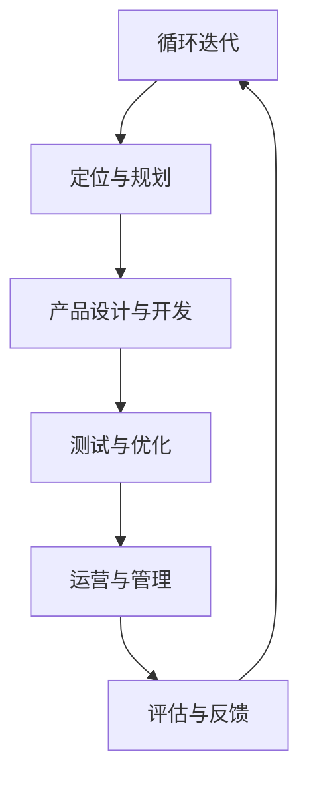

                 

### 《程序员如何进行国际化发展》

#### **文章关键词：**
- 国际化发展
- 跨文化交流
- 国际化项目管理
- 技术框架
- 案例分析

#### **文章摘要：**
本文旨在为程序员提供一条清晰的国际化发展路径。通过深入探讨国际化发展的意义、跨文化交流技巧、国际化开发技术、项目管理策略以及国际化公司案例，本文将帮助程序员更好地理解国际化发展的核心要素，并为他们提供实用的实践指导。文章还特别关注国际化职业规划和个人成长，帮助程序员在全球化背景下实现职业跨越。通过阅读本文，程序员将能够明确国际化发展的方向，掌握关键技能，并在国际舞台上展现自己的才能。

### **《程序员如何进行国际化发展》目录大纲**

#### **第一部分：国际化基础知识**

- **第1章：国际化发展概述**
  - **1.1 国际化发展的意义与趋势**
    - **1.1.1 全球化背景下的国际化发展**
    - **1.1.2 国际化对企业的重要性**
  - **1.2 国际化与本地化的区别**
    - **1.2.1 国际化定义与内涵**
    - **1.2.2 本地化定义与内涵**
  - **1.3 国际化发展战略**
    - **1.3.1 市场调研与定位**
    - **1.3.2 产品设计与开发**
    - **1.3.3 运营与管理**

- **第2章：跨文化交流与沟通**
  - **2.1 跨文化意识培养**
    - **2.1.1 跨文化差异分析**
    - **2.1.2 跨文化沟通技巧**
  - **2.2 跨国团队合作**
    - **2.2.1 团队协作挑战**
    - **2.2.2 团队协作策略**
  - **2.3 跨国商务沟通**
    - **2.3.1 商务礼仪与习惯**
    - **2.3.2 商务谈判技巧**

#### **第二部分：国际化技术基础**

- **第3章：国际化开发技术**
  - **3.1 国际化开发框架**
    - **3.1.1 国际化开发流程**
    - **3.1.2 国际化开发工具**
  - **3.2 多语言支持**
    - **3.2.1 编码与字符集**
    - **3.2.2 国际化编码标准**
  - **3.3 本地化技术**
    - **3.3.1 翻译与本地化**
    - **3.3.2 本地化测试与调试**

- **第4章：国际化项目管理**
  - **4.1 国际化项目管理概述**
    - **4.1.1 项目管理关键要素**
    - **4.1.2 国际化项目特点**
  - **4.2 国际化项目管理方法**
    - **4.2.1 团队管理策略**
    - **4.2.2 风险管理策略**
    - **4.2.3 质量管理策略**
  - **4.3 国际化项目评估与优化**
    - **4.3.1 项目评估指标**
    - **4.3.2 项目优化方法**

#### **第三部分：国际化案例研究**

- **第5章：国际化公司案例分析**
  - **5.1 苹果公司国际化发展**
    - **5.1.1 苹果国际化策略**
    - **5.1.2 苹果国际化成果**
  - **5.2 亚马逊国际化发展**
    - **5.2.1 亚马逊国际化策略**
    - **5.2.2 亚马逊国际化成果**
  - **5.3 微软国际化发展**
    - **5.3.1 微软国际化策略**
    - **5.3.2 微软国际化成果**

#### **第四部分：国际化个人职业规划**

- **第6章：国际化职业发展路径**
  - **6.1 国际化人才需求**
    - **6.1.1 国际化人才能力要求**
    - **6.1.2 国际化人才发展机会**
  - **6.2 国际化职业规划**
    - **6.2.1 职业目标设定**
    - **6.2.2 职业路径规划**
    - **6.2.3 职业能力提升**
  - **6.3 国际化求职策略**
    - **6.3.1 国际化简历撰写**
    - **6.3.2 国际化面试准备**

#### **第五部分：国际化资源与工具**

- **第7章：国际化资源与工具**
  - **7.1 国际化开发工具**
    - **7.1.1 主要国际化开发工具**
    - **7.1.2 工具选择与使用**
  - **7.2 国际化学习资源**
    - **7.2.1 国际化课程与教材**
    - **7.2.2 国际化学习网站**
  - **7.3 国际化社区与网络**
    - **7.3.1 主要国际化技术社区**
    - **7.3.2 社交媒体与国际交流**

#### **附录**

- **附录A：国际化发展参考资料**
  - **A.1 国际化发展报告**
  - **A.2 国际化技术标准**
  - **A.3 国际化案例分析研究**
- **附录B：国际化开发工具资源**
  - **B.1 国际化开发工具下载链接**
  - **B.2 国际化开发工具使用教程**
  - **B.3 国际化开发工具常见问题解答**
  - **B.4 国际化开发工具社区与论坛**

### **国际化发展概述**

在当今全球化迅速发展的时代，国际化已经成为企业和个人发展的必然趋势。国际化不仅仅是对企业市场的扩展，更是对员工技能和视野的全面提升。对于程序员而言，国际化发展不仅能够拓展职业空间，还能提升个人综合素质，增强竞争力。本章节将探讨国际化发展的意义、趋势以及企业国际化发展战略，帮助程序员更好地理解和规划自己的国际化发展之路。

#### **1.1 国际化发展的意义与趋势**

国际化发展是指企业或个人在全球范围内的业务活动和个人成长。对于程序员而言，国际化发展的意义主要体现在以下几个方面：

1. **职业发展空间**：国际化企业通常有更多的职位机会和更高的薪资待遇。通过国际化发展，程序员可以获得更广阔的职业发展空间。
2. **技能提升**：国际化项目通常涉及多种语言、技术和文化背景，这有助于程序员提升技术能力、跨文化交流能力和项目管理能力。
3. **视野拓展**：国际化工作经历能够帮助程序员拓展视野，了解不同国家和地区的市场环境和商业模式，从而更好地适应全球市场。

国际化发展的趋势主要体现在以下几个方面：

1. **全球互联网普及**：随着互联网的普及，国际间的交流变得更加便捷，程序员可以轻松地参与到国际化项目中。
2. **云计算与大数据**：云计算和大数据技术的快速发展为国际化项目提供了强大的技术支持，程序员可以在全球范围内进行协作和开发。
3. **全球人才流动**：越来越多的企业和程序员选择跨境工作，全球人才流动的趋势为国际化发展提供了良好的环境。

#### **1.1.1 全球化背景下的国际化发展**

全球化是国际化发展的基础，它包括经济、文化、政治等多个层面的交流与合作。全球化背景下的国际化发展具有以下几个特点：

1. **市场一体化**：全球化使得市场边界变得模糊，企业和个人可以更加便捷地进入国际市场，开展业务。
2. **资源优化配置**：全球化使得全球范围内的资源得到更加合理的配置，企业和个人可以充分利用全球资源，提高生产效率。
3. **文化交流加强**：全球化促进了不同国家和地区之间的文化交流，程序员可以更好地理解和适应不同文化背景的用户需求。
4. **经济竞争加剧**：全球化也带来了经济竞争的加剧，企业和个人需要不断提升自身竞争力，才能在激烈的国际市场中立于不败之地。

#### **1.1.2 国际化对企业的重要性**

对于企业而言，国际化发展具有以下几个重要意义：

1. **市场扩展**：通过国际化，企业可以开拓新的市场，增加销售额和利润。
2. **品牌提升**：国际化有助于提高企业的品牌知名度和影响力，增强市场竞争力。
3. **技术创新**：国际化企业通常需要适应不同国家和地区的市场需求，这促使企业不断进行技术创新，提高产品质量。
4. **资源整合**：国际化企业可以更好地整合全球资源，降低成本，提高生产效率。

#### **1.2 国际化与本地化的区别**

国际化与本地化是国际化发展过程中的两个重要概念，它们既有联系又有区别。

**国际化**主要指企业在全球范围内的业务活动，包括市场开拓、品牌建设、技术创新等。国际化强调的是企业的全球视野和全球布局。

**本地化**则是指企业在特定国家或地区的市场活动中，针对当地市场环境和用户需求进行的调整和优化。本地化强调的是对本地市场的深入理解和适应。

国际化与本地化的区别主要体现在以下几个方面：

1. **目标市场**：国际化面向全球市场，而本地化则针对特定市场。
2. **市场策略**：国际化强调全球统一策略，而本地化则强调市场差异化策略。
3. **文化适应**：国际化更多关注文化共性，而本地化更多关注文化差异。

#### **1.3 国际化发展战略**

国际化发展战略是企业实现国际化目标的重要手段。以下是一些关键步骤和策略：

1. **市场调研与定位**：在国际化初期，企业需要对目标市场进行全面的调研和定位，了解市场需求、竞争状况和文化背景。
2. **产品设计与开发**：根据市场调研结果，企业需要对产品进行本地化设计，以满足目标市场的需求。
3. **运营与管理**：企业在国际化过程中需要建立有效的运营和管理体系，确保业务顺利开展。
4. **品牌建设**：企业需要通过品牌宣传和营销活动，提高品牌知名度和美誉度。

### **跨文化交流与沟通**

跨文化交流与沟通是国际化发展的重要组成部分，对于程序员而言，这既是挑战也是机遇。本章节将探讨跨文化意识的培养、跨文化差异分析、跨文化沟通技巧以及跨国团队合作和商务沟通技巧，帮助程序员更好地理解和应对跨文化环境，提高跨文化交流和沟通能力。

#### **2.1 跨文化意识培养**

跨文化意识是指个体对文化差异的敏感度和适应能力。培养跨文化意识是进行有效跨文化交流和沟通的前提。以下是一些关键的步骤和方法：

1. **文化知识学习**：程序员可以通过阅读相关书籍、参加文化课程或研讨会，了解不同国家和地区的文化背景、价值观和行为习惯。
2. **文化敏感性训练**：通过角色扮演、案例分析等方式，培养程序员对文化差异的敏感性，提高他们在跨文化环境中的适应能力。
3. **文化适应实践**：通过实际参与跨文化项目，程序员可以将理论知识应用于实践，不断提高自己的跨文化意识和沟通能力。

#### **2.1.1 跨文化差异分析**

跨文化差异是指不同文化背景的个体在价值观、行为习惯和沟通方式上的差异。以下是一些常见的跨文化差异：

1. **时间观念**：不同国家和地区对时间的重视程度不同。一些文化注重准时，而另一些文化则相对宽松。
2. **沟通风格**：不同文化背景的个体在沟通方式上存在差异。例如，一些文化倾向于直接和坦率，而另一些文化则更加含蓄和间接。
3. **决策方式**：不同文化背景的个体在决策过程中存在差异。例如，一些文化倾向于集体决策，而另一些文化则更加重视个人决策。
4. **权力距离**：不同文化背景的个体对权力距离的容忍程度不同。一些文化强调等级制度，而另一些文化则更加平等。

了解和尊重这些跨文化差异是进行有效跨文化交流和沟通的关键。

#### **2.1.2 跨文化沟通技巧**

跨文化沟通技巧是程序员在跨文化环境中进行有效沟通的重要工具。以下是一些关键的跨文化沟通技巧：

1. **积极倾听**：在跨文化沟通中，积极倾听是非常重要的。通过倾听对方的观点和需求，程序员可以更好地理解对方，减少误解。
2. **明确表达**：在跨文化沟通中，程序员需要使用清晰、简洁的语言进行表达，避免使用含糊或模棱两可的语句。
3. **文化适应性调整**：根据不同的文化背景，程序员需要适当调整自己的沟通方式，以适应对方的文化习惯。
4. **非语言沟通**：在跨文化沟通中，非语言沟通（如肢体语言、面部表情、语调等）同样重要。程序员需要学会识别和理解不同文化背景下的非语言沟通方式。

#### **2.2 跨国团队合作**

跨国团队合作是国际化项目成功的关键。以下是一些跨国团队合作的关键策略：

1. **明确目标**：在跨国团队合作中，明确的目标是非常重要的。程序员需要确保所有团队成员对项目的目标有清晰的认识，并为之共同努力。
2. **建立信任**：建立信任是跨国团队合作的基础。程序员需要通过积极的沟通和合作，建立与团队成员之间的信任关系。
3. **文化包容**：在跨国团队合作中，文化包容是非常重要的。程序员需要尊重和接受不同文化背景的团队成员，避免文化冲突。
4. **有效沟通**：有效的沟通是跨国团队合作的关键。程序员需要使用适当的沟通技巧，确保信息在团队内部得到有效传递。

#### **2.2.1 团队协作挑战**

跨国团队合作面临许多挑战，以下是一些常见的挑战：

1. **文化差异**：不同文化背景的团队成员在价值观、行为习惯和沟通方式上存在差异，这可能导致团队内部冲突和沟通障碍。
2. **时区差异**：跨国团队合作通常涉及不同的时区，这可能导致沟通和时间管理上的困难。
3. **语言障碍**：不同语言的使用可能导致误解和沟通障碍，影响团队合作的效率。
4. **工作习惯差异**：不同国家和地区的团队成员在工作习惯上存在差异，例如工作时长、工作流程等，这可能导致合作效率的降低。

#### **2.2.2 团队协作策略**

为了克服跨国团队合作中的挑战，以下是一些团队协作策略：

1. **文化培训**：通过文化培训，提高团队成员对文化差异的敏感度和适应能力，减少文化冲突。
2. **建立共同目标**：确保所有团队成员对项目目标有共同的理解和认同，增强团队凝聚力。
3. **有效的沟通**：使用适当的沟通工具和技巧，确保信息在团队内部得到有效传递和解读。
4. **灵活的工作安排**：根据团队成员的时区和工作习惯，灵活安排工作时间和任务分配，确保团队合作的顺畅。

#### **2.3 跨国商务沟通**

跨国商务沟通是程序员在国际业务中必不可少的一部分。以下是一些跨国商务沟通的关键技巧：

1. **商务礼仪与习惯**：了解和尊重不同国家和地区的商务礼仪和习惯，例如着装、会议安排、礼品赠送等。
2. **商务谈判技巧**：学习有效的商务谈判技巧，例如了解对方的需求和利益，建立信任关系，达成双赢的协议。
3. **文化适应性调整**：根据不同的文化背景，调整自己的商务沟通方式，以适应对方的文化习惯。
4. **有效的演示**：通过有效的演示技巧，展示项目优势和市场潜力，赢得对方的信任和支持。

#### **2.3.1 商务礼仪与习惯**

商务礼仪和习惯因国家和地区而异，以下是一些常见的文化差异：

1. **礼仪**：
   - **亚洲国家**：例如在中国，商务场合中递送名片时应使用双手，并且名片正面朝向对方。
   - **欧洲国家**：在欧洲，商务场合中通常使用握手作为问候，而礼仪上可能更注重细节，如服装选择和会议准时性。
   - **美洲国家**：在美国和加拿大，商务场合中通常使用握手作为问候，商务信函通常采用正式的语言风格。

2. **习惯**：
   - **亚洲国家**：在某些亚洲国家，例如日本，商务宴请中可能包括传统的茶道或寿司体验，这是对客人的尊重。
   - **欧洲国家**：在欧洲，商务谈判可能包括更多的面对面交流和谈判，而在某些情况下，也可能涉及正式的书面文件。
   - **美洲国家**：在美洲，商务沟通可能更加直接和高效，邮件和电话通常是主要的沟通方式。

#### **2.3.2 商务谈判技巧**

商务谈判是跨国合作中至关重要的一环，以下是一些有效的商务谈判技巧：

1. **了解对方文化**：在谈判前，了解对方的文化背景和价值观，这有助于预测对方的反应和策略。
2. **建立信任**：通过积极的沟通和尊重对方的观点，建立信任关系，这是谈判成功的关键。
3. **利益驱动**：在谈判中，要关注双方的利益，寻求双赢的解决方案。
4. **有效的沟通**：使用清晰、简洁的语言表达自己的观点，并倾听对方的意见。
5. **灵活应变**：在谈判过程中，保持灵活性，根据对方的反应和谈判进展进行调整。

### **国际化开发技术**

国际化开发技术是程序员在进行国际化项目时必备的技能。本章节将介绍国际化开发框架、多语言支持以及本地化技术，帮助程序员掌握国际化开发的核心技术和方法。

#### **3.1 国际化开发框架**

国际化开发框架是确保软件产品能够在多个语言和地区环境中运行的基础。以下是一个典型的国际化开发框架：

1. **需求分析**：在项目启动阶段，对目标市场进行需求分析，了解用户需求和文化差异。
2. **设计阶段**：在软件设计阶段，考虑到国际化需求，设计可扩展的架构，支持多语言和本地化。
3. **编码阶段**：在编码阶段，遵循国际化编码标准，使用适当的编码规范和字符集。
4. **测试阶段**：在测试阶段，进行多语言和本地化测试，确保软件在不同语言和地区环境中的正确性。
5. **部署阶段**：在部署阶段，根据目标市场的需求，进行本地化部署和优化。

#### **3.1.1 国际化开发流程**

国际化开发流程包括以下几个关键步骤：

1. **需求分析**：明确国际化项目的要求和目标，包括支持的语言、地区和文化需求。
2. **设计架构**：设计可扩展的架构，支持多语言和本地化，包括字符集编码、资源管理等。
3. **编码实现**：根据国际化需求，编写代码，确保代码的可维护性和可扩展性。
4. **资源管理**：管理国际化资源，如字符串、图片、音频等，确保资源在不同语言和地区环境中的正确性。
5. **测试验证**：进行多语言和本地化测试，确保软件在不同语言和地区环境中的正确性。
6. **部署上线**：根据目标市场的需求，进行本地化部署和优化，确保软件在不同地区环境中的性能和稳定性。

#### **3.1.2 国际化开发工具**

国际化开发过程中需要使用多种工具，以下是一些常用的国际化开发工具：

1. **国际化框架**：如Spring Framework、Java 国际化框架等，提供国际化开发的基础支持。
2. **本地化工具**：如IBM Translation Manager、SDL Trados Studio 等，用于翻译和本地化资源。
3. **字符集编码工具**：如字符集转换工具、编码验证工具等，确保代码和资源的正确编码。
4. **测试工具**：如国际化测试工具、自动化测试框架等，用于测试国际化项目的正确性和稳定性。

#### **3.2 多语言支持**

多语言支持是国际化开发的重要组成部分。以下是如何实现多语言支持的关键步骤：

1. **字符集编码**：使用 Unicode 编码，支持多种语言的字符集。
2. **国际化资源管理**：管理多语言资源，如字符串、图片、音频等，确保资源在不同语言环境中的正确性。
3. **语言切换**：提供用户界面语言切换功能，允许用户选择不同的语言。
4. **国际化编码标准**：遵循国际化编码标准，如 IETF BCP 47 语言标签标准。

#### **3.2.1 编码与字符集**

编码与字符集是国际化开发的基础。以下是如何处理编码与字符集的关键步骤：

1. **字符集选择**：选择合适的字符集，如 UTF-8、UTF-16 等，支持多种语言的字符。
2. **编码转换**：在多语言环境中，进行字符集编码转换，确保数据的正确性和兼容性。
3. **编码验证**：使用编码验证工具，检查代码和资源的编码是否正确。
4. **编码错误处理**：处理编码错误，避免导致软件运行失败或数据丢失。

#### **3.2.2 国际化编码标准**

国际化编码标准是确保软件在不同语言和地区环境中正确运行的基础。以下是一些重要的国际化编码标准：

1. **Unicode**：Unicode 是一种字符集编码标准，支持全球多种语言的字符。
2. **IETF BCP 47**：IETF BCP 47 是一种语言标签标准，用于标识语言的名称和编码。
3. **ISO 15924**：ISO 15924 是一种字符集标准，定义了全球多种语言的字符集。
4. **Unicode Standard**：Unicode Standard 是 Unicode 的正式标准，定义了 Unicode 字符的编码和属性。

#### **3.3 本地化技术**

本地化技术是国际化开发的关键环节，涉及翻译、本地化测试和调试。以下是如何实施本地化技术的关键步骤：

1. **翻译**：翻译是本地化的核心，需要准确传达软件内容和功能。
2. **本地化测试**：进行本地化测试，确保软件在不同语言和地区环境中的正确性。
3. **调试**：调试是解决本地化过程中出现的问题，确保软件的稳定性和性能。

#### **3.3.1 翻译与本地化**

翻译与本地化是国际化开发的重要组成部分，以下是如何进行翻译与本地化的关键步骤：

1. **翻译策略**：制定合适的翻译策略，包括选择专业翻译人员、使用机器翻译辅助等。
2. **翻译管理**：管理翻译过程，确保翻译质量和进度。
3. **本地化资源管理**：管理本地化资源，如字符串、图片、音频等，确保资源在不同语言环境中的正确性。
4. **本地化测试**：进行本地化测试，包括功能测试、用户体验测试等，确保软件在不同语言环境中的正确性。

#### **3.3.2 本地化测试与调试**

本地化测试与调试是确保国际化项目成功的关键。以下是如何进行本地化测试与调试的关键步骤：

1. **测试计划**：制定本地化测试计划，包括测试目标、测试方法、测试工具等。
2. **测试执行**：执行本地化测试，包括功能测试、用户体验测试、性能测试等。
3. **缺陷管理**：管理测试过程中发现的缺陷，确保缺陷得到及时修复。
4. **调试与优化**：进行调试和优化，确保软件在不同语言和地区环境中的性能和稳定性。

#### **3.3.3 国际化开发实践**

国际化开发实践涉及多个方面，以下是一些具体的国际化开发实践：

1. **国际化架构设计**：在设计阶段，考虑国际化需求，设计可扩展的国际化架构。
2. **国际化资源管理**：管理国际化资源，如字符串、图片、音频等，确保资源在不同语言环境中的正确性。
3. **国际化编码规范**：遵循国际化编码规范，确保代码和资源的正确编码。
4. **国际化测试工具**：使用国际化测试工具，进行多语言和本地化测试，确保软件在不同语言和地区环境中的正确性。

### **国际化项目管理**

国际化项目管理是确保国际化项目成功实施的关键环节。国际化项目通常涉及多个国家和地区，文化差异、语言障碍、时区差异等因素都可能导致项目风险增加。本章节将介绍国际化项目管理的概述、关键要素、方法以及评估与优化策略，帮助项目经理和团队有效地管理国际化项目。

#### **4.1 国际化项目管理概述**

国际化项目管理是指在全球范围内管理项目的活动和过程，以确保项目能够满足国际市场的需求和预期。国际化项目管理具有以下几个特点：

1. **多元文化背景**：国际化项目通常涉及多个国家和地区的参与者，文化差异对项目的沟通、决策和协作产生影响。
2. **跨时区管理**：国际化项目可能涉及不同时区的团队，需要合理安排工作和会议时间，确保协作顺畅。
3. **多语言沟通**：国际化项目需要处理多种语言的沟通，确保信息的准确传递和解读。
4. **复杂性和风险**：国际化项目面临更多的不确定性和风险，如市场变化、政策法规、货币汇率等。

#### **4.1.1 项目管理关键要素**

国际化项目管理的关键要素包括以下几个方面：

1. **项目目标**：明确国际化项目的目标，确保项目能够满足市场需求和业务目标。
2. **项目管理团队**：组建具备国际化背景和项目管理经验的团队，确保团队具有处理多元文化和跨时区协作的能力。
3. **沟通管理**：建立有效的沟通机制，确保团队成员之间的信息流畅和透明。
4. **风险管理**：制定风险管理计划，识别和应对国际化项目中的各种风险。
5. **质量保证**：确保国际化项目的质量符合国际标准和用户需求。
6. **成本控制**：有效控制项目成本，确保项目在预算范围内完成。

#### **4.1.2 国际化项目特点**

国际化项目具有以下特点：

1. **多元文化团队**：国际化项目通常由来自不同国家和地区的团队成员组成，文化差异可能影响团队协作和沟通。
2. **跨时区协作**：国际化项目涉及不同时区的团队，需要合理安排工作和会议时间，确保协作效率。
3. **多语言沟通**：国际化项目需要处理多种语言的沟通，确保信息的准确传递和解读。
4. **法律法规遵守**：国际化项目需要遵守不同国家和地区的法律法规，确保项目的合法合规。
5. **市场复杂性**：国际化项目面临不同的市场环境和消费者需求，需要灵活应对市场变化。
6. **成本和风险**：国际化项目面临更多的成本和风险，如汇率波动、政策变化等。

#### **4.2 国际化项目管理方法**

国际化项目管理方法主要包括以下几个方面：

1. **项目计划**：制定详细的项目计划，包括项目范围、目标、时间表、预算、资源和风险等。
2. **团队协作**：建立高效的团队协作机制，确保团队成员之间的信息共享和协作。
3. **沟通管理**：建立有效的沟通渠道，确保团队成员之间的信息流畅和透明。
4. **风险管理**：识别和评估项目风险，制定风险应对策略和风险监控计划。
5. **质量管理**：确保项目质量符合国际标准和用户需求，进行质量管理和控制。
6. **成本控制**：有效控制项目成本，确保项目在预算范围内完成。

#### **4.2.1 团队管理策略**

国际化项目的团队管理策略需要考虑多元文化和跨时区协作的挑战。以下是一些团队管理策略：

1. **文化适应性培训**：为团队成员提供文化适应性培训，提高他们对多元文化和跨时区协作的敏感度和适应能力。
2. **共同目标设定**：确保团队成员对项目目标有共同的理解和认同，增强团队凝聚力。
3. **有效的沟通**：使用适当的沟通工具和技巧，确保团队成员之间的信息流畅和透明。
4. **灵活的工作安排**：根据团队成员的时区和工作习惯，灵活安排工作时间和任务分配，确保团队协作的顺畅。
5. **冲突解决机制**：建立冲突解决机制，及时解决团队内部的冲突，避免影响项目进展。

#### **4.2.2 风险管理策略**

国际化项目面临多种风险，包括市场风险、技术风险、法律风险等。以下是一些风险管理策略：

1. **风险识别和评估**：在项目启动阶段，对可能的风险进行识别和评估，确定风险的概率和影响。
2. **风险应对策略**：根据风险识别和评估结果，制定相应的风险应对策略，包括风险规避、减轻、转移和接受等。
3. **风险监控**：在项目执行过程中，持续监控风险的变化，及时调整风险应对策略。
4. **风险沟通**：建立有效的风险沟通机制，确保项目团队和利益相关者对风险有共同的理解和认知。
5. **风险记录和报告**：记录项目中的风险事件和风险应对措施，定期向项目团队和利益相关者报告风险状态。

#### **4.2.3 质量管理策略**

国际化项目的质量管理策略需要考虑不同国家和地区的质量标准和用户需求。以下是一些质量管理策略：

1. **质量规划**：在项目启动阶段，制定质量规划，明确项目质量目标和标准。
2. **质量保证**：在整个项目生命周期中，实施质量保证措施，确保项目质量符合国际标准和用户需求。
3. **质量监控**：通过定期的质量评审和测试，监控项目质量，确保项目过程和结果的符合性。
4. **质量改进**：根据质量监控结果，及时识别和解决质量问题，持续改进项目质量。
5. **用户反馈**：收集用户反馈，了解用户对项目质量的评价，不断优化和改进产品。

#### **4.3 国际化项目评估与优化**

国际化项目评估与优化是确保项目成功的关键环节。以下是一些项目评估与优化的策略：

1. **项目评估指标**：制定项目评估指标，包括项目进度、成本、质量、风险等方面，用于评估项目绩效。
2. **项目回顾**：在项目结束阶段，进行项目回顾，分析项目成功和失败的原因，总结项目经验和教训。
3. **项目优化**：根据项目评估结果，优化项目过程和策略，提高项目成功率。
4. **持续改进**：通过项目评估和优化，持续改进项目管理方法和流程，提高项目管理水平。
5. **知识共享**：将项目评估和优化的经验分享给团队成员，提高整个团队的项目管理能力。

### **国际化公司案例分析**

国际化公司通常在全球化进程中扮演着重要角色。通过分析这些公司的国际化策略和成果，我们可以了解到国际化发展的成功实践和关键因素。以下是对苹果公司、亚马逊公司和微软公司国际化发展的案例分析。

#### **5.1 苹果公司国际化发展**

**苹果公司国际化策略：**

1. **产品多样化**：苹果公司通过推出不同型号和版本的iPhone、iPad、Mac等设备，满足不同国家和地区的消费者需求。
2. **本地化服务**：苹果公司在不同国家和地区提供本地化的售后服务，包括维修和客户支持。
3. **文化适应**：苹果公司在广告和市场营销活动中注重文化适应，根据不同国家的文化和价值观进行调整。
4. **合作伙伴关系**：苹果公司与全球各地的运营商和零售商建立紧密的合作关系，扩大市场覆盖。

**苹果国际化成果：**

1. **市场份额**：苹果公司在全球智能手机、平板电脑和电脑市场的份额持续增长。
2. **品牌影响力**：苹果公司在全球范围内建立了强大的品牌影响力，成为消费者心中的首选品牌。
3. **技术创新**：通过国际化发展，苹果公司吸引了全球顶尖的技术人才，推动了技术创新和产品升级。

#### **5.2 亚马逊国际化发展**

**亚马逊国际化策略：**

1. **平台扩展**：亚马逊通过收购和自建方式，在全球多个国家和地区建立电商平台，提供多样化的商品和服务。
2. **本地化运营**：亚马逊在不同国家和地区建立本地化运营团队，根据当地市场需求调整运营策略。
3. **物流网络**：亚马逊在全球范围内建立高效的物流网络，确保快速、可靠的配送服务。
4. **支付和金融**：亚马逊推出多种支付解决方案，包括亚马逊支付和亚马逊金融，方便用户在不同国家和地区进行交易。

**亚马逊国际化成果：**

1. **全球市场份额**：亚马逊在全球电商市场的份额持续增长，成为全球最大的电商平台之一。
2. **技术创新**：国际化推动了亚马逊在人工智能、云计算等领域的创新，提升了技术竞争力。
3. **用户满意度**：亚马逊通过本地化运营和优质服务，提升了全球用户的满意度，建立了良好的品牌形象。

#### **5.3 微软国际化发展**

**微软国际化策略：**

1. **产品本地化**：微软在开发软件和操作系统时，注重产品本地化，提供多种语言版本。
2. **合作伙伴网络**：微软与全球各地的合作伙伴建立紧密的合作关系，共同推广微软产品和服务。
3. **文化融合**：微软在不同国家和地区开展文化融合活动，增进与当地社会的联系。
4. **教育培训**：微软在全球范围内开展教育培训项目，培养技术人才，推动技术普及。

**微软国际化成果：**

1. **全球市场份额**：微软在全球软件市场的份额稳步增长，成为行业领导者之一。
2. **技术创新**：国际化促进了微软在人工智能、云计算等领域的创新，推动了技术进步。
3. **社会影响力**：微软通过国际化发展，积极参与全球社会事务，提升了企业社会责任感。

### **国际化职业发展路径**

在全球化背景下，国际化职业发展路径为程序员提供了广阔的发展空间。本章节将探讨国际化人才需求、国际化职业规划以及国际化求职策略，帮助程序员明确职业发展目标，制定合理的职业路径，提升职业能力，并在国际化职场上取得成功。

#### **6.1 国际化人才需求**

国际化人才在现代企业中扮演着越来越重要的角色。以下是对国际化人才的需求分析：

1. **跨文化沟通能力**：国际化人才需要具备跨文化沟通能力，能够有效地与来自不同文化背景的团队成员进行沟通和协作。
2. **技术精通**：国际化人才需要精通所在领域的专业技术，具备解决复杂技术问题的能力。
3. **项目管理能力**：国际化人才需要具备项目管理能力，能够规划、执行和监控国际化项目，确保项目按时交付和质量达标。
4. **适应性**：国际化人才需要具备适应不同工作环境和文化的能力，能够在变化的环境中迅速适应和应对。
5. **语言能力**：国际化人才需要具备一定的外语能力，尤其是英语，以便在国际交流和商务活动中顺畅沟通。

#### **6.1.1 国际化人才能力要求**

国际化人才应具备以下能力要求：

1. **技术能力**：掌握所在领域的核心技术，能够应对复杂的技术挑战。
2. **项目管理能力**：了解项目管理的基本原理和方法，能够有效地规划、执行和监控项目。
3. **跨文化沟通能力**：了解不同文化背景下的沟通方式和行为习惯，能够与来自不同文化背景的团队成员有效沟通。
4. **领导力**：具备领导力，能够带领团队实现项目目标，协调团队成员之间的合作。
5. **学习能力**：具备快速学习新知识和技能的能力，能够适应不断变化的技术环境和市场需求。

#### **6.1.2 国际化人才发展机会**

国际化人才在全球企业中具有广泛的发展机会。以下是一些国际化人才的发展机会：

1. **跨国公司**：跨国公司通常提供国际化的发展机会，员工有机会参与全球项目，与来自不同国家和地区的同事合作。
2. **海外项目**：参与海外项目，深入了解不同国家的市场环境和文化，积累宝贵的国际化工作经验。
3. **国际化团队领导**：担任国际化团队的领导，负责管理和协调团队成员，推动项目成功。
4. **国际会议和论坛**：参加国际会议和论坛，与行业专家和学者交流，拓展国际视野。
5. **国际认证**：获得国际认证，如 PMP（项目管理专业人士认证）、CFA（注册金融分析师）等，提升职业竞争力。

#### **6.2 国际化职业规划**

国际化职业规划是程序员实现职业发展的关键步骤。以下是如何进行国际化职业规划的建议：

1. **职业目标设定**：明确自己的职业目标，包括短期和长期目标，例如在五年内成为国际化项目经理。
2. **技能提升**：根据职业目标，制定学习计划，提升自己在跨文化沟通、项目管理和技术领域的技能。
3. **实践经验**：通过参与国际化项目，积累实际工作经验，提升项目管理和跨文化沟通能力。
4. **语言能力**：提升外语能力，尤其是英语，为国际交流和商务活动做好准备。
5. **国际化网络**：建立国际化人脉网络，通过参加国际会议、加入专业协会等途径，拓展职业资源。

#### **6.2.1 职业目标设定**

设定明确的职业目标是国际化职业规划的第一步。以下是如何设定职业目标的建议：

1. **短期目标**：设定一年或两年内的职业目标，例如提高某个技术领域的技能、参与一个国际化项目等。
2. **长期目标**：设定五年或十年内的职业目标，例如成为国际化项目经理、领导国际化团队等。
3. **具体可衡量**：确保职业目标具体、可衡量，例如在一年内通过某个国际认证、完成某个项目等。
4. **逐步实现**：将长期目标分解为短期目标，确保每个短期目标的实现都能够推动长期目标的实现。
5. **定期评估**：定期评估职业目标的实现情况，根据实际情况调整目标设定。

#### **6.2.2 职业路径规划**

职业路径规划是国际化职业规划的重要组成部分。以下是如何进行职业路径规划的建议：

1. **自我评估**：了解自己的技能、兴趣和价值观，确定适合自己的职业路径。
2. **行业分析**：研究所在行业的发展趋势和职业需求，确定未来可能的发展方向。
3. **目标职位**：明确自己想要达到的职业目标，包括职位名称、职责和技能要求。
4. **技能提升**：制定学习计划，提升自己在技术、管理和跨文化沟通等方面的技能。
5. **职业网络**：建立职业网络，通过参加行业会议、加入专业协会等途径，拓展职业资源。

#### **6.2.3 职业能力提升**

提升职业能力是实现国际化职业发展的关键。以下是如何提升职业能力的建议：

1. **技术培训**：参加技术培训课程，学习最新的技术趋势和工具，提升自己的技术能力。
2. **项目管理认证**：获得项目管理认证，如 PMP、Scrum Master 等，提升项目管理能力。
3. **跨文化培训**：参加跨文化培训课程，了解不同文化背景下的沟通方式和行为习惯。
4. **实践项目**：参与国际化项目，积累实际工作经验，提升项目管理和跨文化沟通能力。
5. **语言能力**：提升外语能力，尤其是英语，为国际交流和商务活动做好准备。

#### **6.3 国际化求职策略**

在国际化求职过程中，程序员需要制定有效的求职策略，提高求职成功率。以下是一些国际化求职策略：

1. **国际化简历撰写**：撰写符合国际化标准的简历，突出自己的技术能力、项目管理经验和跨文化沟通能力。
2. **网络求职**：利用国际化招聘网站和社交媒体，寻找国际化的职位机会。
3. **求职信撰写**：撰写有针对性的求职信，表达自己的职业兴趣和求职动机。
4. **面试准备**：提前准备面试，了解企业文化和职位要求，提升面试成功率。
5. **国际化网络**：建立国际化人脉网络，通过推荐和内推，提高求职成功率。

#### **6.3.1 国际化简历撰写**

国际化简历是程序员在国际化求职中的重要工具。以下是如何撰写国际化简历的建议：

1. **清晰结构**：简历应该结构清晰，包括个人信息、职业概述、技能和成就、工作经验、教育背景等部分。
2. **语言能力**：突出自己的语言能力，包括英语和其他外语水平。
3. **技术能力**：详细列出自己的技术技能，包括编程语言、框架、工具和项目经验。
4. **项目经验**：突出自己在国际化项目中的经验，包括项目的规模、角色和成果。
5. **职业成就**：突出自己的职业成就，包括技术突破、项目成功和团队合作等。
6. **格式规范**：使用国际通用的简历格式和字体，确保简历的整洁和专业。

#### **6.3.2 国际化面试准备**

国际化面试是程序员求职过程中的关键环节。以下是如何准备国际化面试的建议：

1. **了解企业**：在面试前，了解企业的背景、文化和职位要求，为面试做好准备。
2. **技术准备**：复习相关的技术知识和项目经验，确保在技术面试中能够应对各种问题。
3. **文化适应**：了解不同文化背景下的面试风格和习惯，调整自己的面试策略。
4. **英语口语**：提升英语口语能力，确保在面试过程中能够流畅、清晰地表达自己的观点。
5. **案例分析**：准备一些国际化的案例分析，展示自己在解决复杂问题和跨文化沟通方面的能力。
6. **面试模拟**：进行面试模拟，提高自己的面试技巧和自信心。

### **国际化资源与工具**

在国际化发展的道路上，程序员需要充分利用各种资源与工具，以提高技能、拓展视野和提升职业竞争力。以下将介绍国际化开发工具、学习资源和社区与网络。

#### **7.1 国际化开发工具**

国际化开发工具是程序员在进行国际化项目时的重要助手。以下是一些常用的国际化开发工具：

1. **国际化框架**：
   - **Spring Internationalization**：Spring框架提供强大的国际化支持，包括资源绑定、日期和数字格式化等。
   - **Java Internationalization API**：Java提供了一系列API，用于国际化开发，如`java.util.ResourceBundle`和`java.text.MessageFormat`。

2. **本地化工具**：
   - **SDL Trados Studio**：一款专业的翻译和本地化工具，支持多语言翻译和项目管理。
   - **memoQ**：一款功能强大的翻译和本地化工具，提供高质量的翻译记忆和术语管理。

3. **字符集编码工具**：
   - **Iconv**：一款用于字符集转换的工具，支持多种字符集编码。
   - **UNICODEtools**：一组用于处理Unicode字符的工具，包括编码转换、验证等。

4. **测试工具**：
   - **Selenium**：一款开源的自动化测试工具，支持跨浏览器测试。
   - **Cypress**：一款现代的端到端测试框架，提供简便的测试编写和调试。

#### **7.1.1 主要国际化开发工具**

以下是一些主要的国际化开发工具及其特点：

1. **Spring Internationalization**：
   - **特点**：Spring框架提供了强大的国际化支持，包括资源绑定、日期和数字格式化等。Spring的国际化支持使开发者可以轻松地将应用程序本地化为多种语言。
   - **使用场景**：适用于需要多语言支持的企业级应用程序。

2. **Java Internationalization API**：
   - **特点**：Java提供了丰富的API，如`java.util.ResourceBundle`和`java.text.MessageFormat`，用于处理国际化资源。
   - **使用场景**：适用于Java开发的国际化应用程序。

3. **SDL Trados Studio**：
   - **特点**：SDL Trados Studio是一款专业的翻译和本地化工具，提供高质量的翻译记忆和术语管理。
   - **使用场景**：适用于大型企业或专业翻译团队进行多语言翻译和本地化工作。

4. **memoQ**：
   - **特点**：memoQ是一款功能强大的翻译和本地化工具，提供丰富的翻译记忆和术语管理功能。
   - **使用场景**：适用于各种规模的企业和翻译团队，尤其适合大型项目的本地化工作。

5. **Iconv**：
   - **特点**：Iconv是一款用于字符集转换的工具，支持多种字符集编码。
   - **使用场景**：适用于需要在不同字符集之间转换数据的国际化项目。

6. **UNICODEtools**：
   - **特点**：UNICODEtools是一组用于处理Unicode字符的工具，包括编码转换、验证等。
   - **使用场景**：适用于需要处理Unicode字符的国际化项目。

#### **7.1.2 工具选择与使用**

在选择国际化开发工具时，程序员需要考虑以下几个因素：

1. **项目需求**：根据项目需求选择合适的工具，如多语言支持、字符集编码转换、翻译和本地化等。
2. **团队技能**：考虑团队成员对工具的熟悉程度，选择易于学习和使用的工具。
3. **工具兼容性**：确保工具与现有开发环境和框架兼容，避免不必要的集成问题。
4. **社区支持**：选择有良好社区支持和文档的工具，便于解决问题和学习新技能。

#### **7.2 国际化学习资源**

国际化学习资源为程序员提供了丰富的知识和技能提升途径。以下是一些国际化学习资源：

1. **在线课程与教材**：
   - **Coursera**：提供各种国际化课程，包括跨文化沟通、国际化管理、国际化技术等。
   - **edX**：全球知名的学习平台，提供多门国际化相关课程。
   - **Udemy**：提供丰富的在线课程，涵盖国际化开发、跨文化沟通等领域。

2. **国际化技术书籍**：
   - **《国际化Web应用程序开发》**：详细介绍了国际化Web应用程序的开发技术和方法。
   - **《跨文化沟通与团队协作》**：探讨跨文化沟通和团队协作的重要性和实践方法。
   - **《国际化项目管理》**：介绍了国际化项目管理的核心概念和实用技巧。

3. **博客和论坛**：
   - **Stack Overflow**：全球最大的技术问答社区，涵盖各种国际化开发问题。
   - **GitHub**：全球最大的代码托管平台，许多国际化项目开源，便于学习和交流。
   - **Reddit**：国际化的技术社区，提供各种国际化开发相关的话题讨论。

#### **7.2.1 国际化课程与教材**

以下是一些重要的国际化课程与教材：

1. **Coursera**：
   - **《跨文化沟通》**：由加州大学伯克利分校提供，介绍跨文化沟通的基础知识和实践方法。
   - **《国际化商业管理》**：由麻省理工学院提供，探讨国际化企业的管理策略和全球市场趋势。

2. **edX**：
   - **《国际化技术》**：由华盛顿大学提供，介绍国际化技术的基础知识和开发技巧。
   - **《跨文化沟通与团队合作》**：由纽约大学提供，探讨跨文化背景下的团队合作和沟通技巧。

3. **Udemy**：
   - **《国际化Web开发》**：介绍国际化Web应用程序的开发流程和技术。
   - **《跨文化沟通与跨文化管理》**：探讨跨文化沟通和管理的实践方法，适用于企业高管和团队成员。

#### **7.2.2 国际化学习网站**

以下是一些重要的国际化学习网站：

1. **Codecademy**：提供免费的编程课程，适合初学者和有经验开发者。
2. **Pluralsight**：提供专业的技术培训和认证课程，涵盖国际化开发、项目管理等领域。
3. **LinkedIn Learning**：LinkedIn提供的在线学习平台，提供各种国际化相关的课程和教程。
4. **International Association for Cultural Development (IACD)**：提供国际化管理和文化发展的资源和培训。

#### **7.3 国际化社区与网络**

国际化社区和网络为程序员提供了交流、学习和分享经验的机会。以下是一些重要的国际化社区与网络：

1. **GitHub**：全球最大的代码托管平台，程序员可以在这里找到国际化项目、学习开源代码和分享经验。
2. **Stack Overflow**：全球最大的技术问答社区，程序员可以在这里解决国际化开发中的问题。
3. **Reddit**：提供各种国际化技术话题的讨论，程序员可以在这里获取最新动态和交流心得。
4. **LinkedIn**：全球最大的职业社交平台，程序员可以在LinkedIn上建立人脉、分享经验和寻找国际化职位。
5. **Slack**：一款流行的团队协作工具，许多国际化项目团队使用Slack进行实时沟通和协作。

### **附录**

#### **附录A：国际化发展参考资料**

以下是一些重要的国际化发展参考资料：

1. **国际化发展报告**：
   - **《全球化报告 2022》**：由世界经济论坛发布，分析全球化和国际化的趋势和影响。
   - **《国际化企业案例分析》**：由哈佛商业评论发布，探讨国际化企业的成功策略和挑战。

2. **国际化技术标准**：
   - **ISO 12620**：国际标准组织发布的国际化文档格式标准。
   - **Unicode**：国际字符集编码标准，支持全球多种语言的字符。

3. **国际化案例分析研究**：
   - **《苹果公司国际化发展》**：分析苹果公司的国际化策略和成果。
   - **《亚马逊国际化发展》**：探讨亚马逊的国际化策略和市场拓展。

#### **附录B：国际化开发工具资源**

以下是一些重要的国际化开发工具资源：

1. **国际化开发工具下载链接**：
   - **Spring Internationalization**：下载地址 - [Spring Internationalization](https://docs.spring.io/spring/docs/current/spring-framework-reference/html/i18n.html)
   - **SDL Trados Studio**：下载地址 - [SDL Trados Studio](https://www.sdl.com/products/localization-and-translation-software/trados-studio/)

2. **国际化开发工具使用教程**：
   - **Java Internationalization**：教程地址 - [Java Internationalization Tutorial](https://docs.oracle.com/javase/tutorial/i18n/pt_BR/)

3. **国际化开发工具常见问题解答**：
   - **Spring Internationalization FAQ**：FAQ地址 - [Spring Internationalization FAQ](https://docs.spring.io/spring/docs/current/spring-framework-reference/html/i18n.html#i18n-faq)
   - **SDL Trados Studio FAQ**：FAQ地址 - [SDL Trados Studio FAQ](https://www.sdl.com/support/trados-studio/)

4. **国际化开发工具社区与论坛**：
   - **Spring Internationalization Community**：社区地址 - [Spring Internationalization Community](https://community.spring.io/spring-forum/categories/spring-i18n)
   - **SDL Trados Studio Community**：社区地址 - [SDL Trados Studio Community](https://www.sdl.com/community/trados-studio/)  

### **国际化发展流程**

国际化发展是一个复杂的过程，涉及多个阶段和步骤。以下是一个典型的国际化发展流程及其关键节点：

1. **市场调研**：在国际化初期，进行市场调研，了解目标市场的需求、竞争状况和文化背景。
2. **定位与规划**：根据市场调研结果，确定国际化战略和目标，制定国际化发展计划。
3. **产品设计与开发**：在设计阶段，考虑国际化需求，设计支持多语言和本地化的产品架构。
4. **测试与优化**：在开发过程中，进行多语言和本地化测试，确保产品的正确性和稳定性。
5. **运营与管理**：建立国际化运营和管理体系，确保业务在全球范围内的顺利开展。
6. **评估与反馈**：定期评估国际化项目的进展和成果，收集用户反馈，进行优化和调整。

以下是一个使用Mermaid绘制的国际化发展流程图：



### **国际化开发技术框架**

国际化开发技术框架是确保软件产品能够在全球范围内正确运行的关键。以下是一个简单的国际化开发技术框架，包括主要组件和流程：

1. **国际化框架**：提供国际化支持和配置，如语言切换、日期格式化等。
2. **资源管理器**：管理国际化资源，如字符串、图片、音频等。
3. **翻译工具**：用于翻译和本地化文本内容。
4. **测试工具**：用于测试国际化功能的正确性和稳定性。
5. **部署工具**：用于部署国际化软件到不同国家和地区。

以下是一个使用Python伪代码表示的国际化开发技术框架：

```python
class InternationalizationFramework:
    def __init__(self):
        self.localization_framework = LocalizationFramework()
        self.translator = Translator()
        self.test_framework = TestFramework()

    def add_localization_resource(self, resource):
        self.localization_framework.add_resource(resource)

    def translate_resources(self):
        self.translator.translate(self.localization_framework.resources)

    def test_localization(self):
        self.test_framework.run_tests(self.localization_framework.resources)

    def deploy(self):
        # 部署国际化软件到目标国家和地区
        pass

class LocalizationFramework:
    def __init__(self):
        self.resources = {}

    def add_resource(self, resource):
        self.resources[resource.name] = resource

class Translator:
    def translate(self, resources):
        # 翻译资源
        pass

class TestFramework:
    def run_tests(self, resources):
        # 运行国际化测试
        pass

if __name__ == "__main__":
    framework = InternationalizationFramework()
    framework.add_localization_resource(LocalizationResource("strings"))
    framework.add_localization_resource(LocalizationResource("images"))
    framework.translate_resources()
    framework.test_localization()
    framework.deploy()
```

### **翻译准确率评估公式**

翻译准确率是评估翻译质量的常用指标，其计算公式如下：

$$
Accuracy = \frac{Number\ of\ Correct\ Translations}{Total\ Number\ of\ Translations}
$$

其中，`Number of Correct Translations`表示翻译正确的句子数量，`Total Number of Translations`表示翻译的总句子数量。

例如，如果一个翻译任务中总共有100个句子，其中60个句子翻译正确，那么翻译准确率为60%。

### **本地化成本效益分析**

本地化成本效益分析是评估本地化项目经济价值的重要方法。其计算公式如下：

$$
Cost\ Efficiency = \frac{Business\ Value}{Total\ Cost}
$$

其中，`Business Value`表示本地化项目带来的商业价值，`Total Cost`表示本地化项目的总成本。

例如，如果一个本地化项目带来的商业价值为100万美元，而项目的总成本为50万美元，那么项目的成本效益为2。

### **项目评估指标**

项目评估指标是衡量国际化项目绩效的重要工具。以下是一些常用的项目评估指标：

1. **项目进度评估指标**：
   - **进度率**：计算公式为`进度率 = 实际进度 / 计划进度`。该指标用于衡量项目进度是否按计划进行。

2. **项目成本评估指标**：
   - **成本偏差**：计算公式为`成本偏差 = 实际成本 - 计划成本`。该指标用于衡量项目成本是否超出预算。

3. **项目质量评估指标**：
   - **缺陷率**：计算公式为`缺陷率 = 缺陷数量 / 测试用例数量`。该指标用于衡量项目质量水平。

4. **项目风险评估指标**：
   - **风险概率**：计算公式为`风险概率 = 风险事件发生概率`。该指标用于衡量项目面临的风险水平。

### **国际化开发项目源代码实现**

以下是一个简单的国际化开发项目源代码实现，包括字符串国际化、日期国际化等。

```python
import datetime
from typing import Dict

class Localization:
    def __init__(self, locale: str):
        self.locale = locale
        self.strings: Dict[str, str] = {}
        self.dates: Dict[str, datetime.datetime] = {}

    def add_string(self, key: str, value: str):
        self.strings[key] = value

    def add_date(self, key: str, value: datetime.datetime):
        self.dates[key] = value

    def get_string(self, key: str) -> str:
        return self.strings.get(key, None)

    def get_date(self, key: str) -> datetime.datetime:
        return self.dates.get(key, None)

class InternationalizedApp:
    def __init__(self, localization: Localization):
        self.localization = localization

    def display_greeting(self) -> str:
        return self.localization.get_string("greeting")

    def display_date(self, key: str) -> str:
        date = self.localization.get_date(key)
        return date.strftime("%B %d, %Y")

if __name__ == "__main__":
    localization = Localization("en_US")
    localization.add_string("greeting", "Hello, World!")
    localization.add_date("current_date", datetime.datetime.now())

    app = InternationalizedApp(localization)
    print(app.display_greeting())
    print(app.display_date("current_date"))
```

#### **代码解读与分析**

1. **Localization 类**：该类负责管理国际化资源，包括字符串和日期。`add_string`和`add_date`方法用于添加国际化资源，`get_string`和`get_date`方法用于获取指定资源的值。

2. **InternationalizedApp 类**：该类负责展示国际化应用程序的内容。`display_greeting`方法用于显示欢迎语，`display_date`方法用于显示日期。

3. **主程序**：创建 `Localization` 对象和 `InternationalizedApp` 对象，设置国际化资源，并调用 `display_greeting` 和 `display_date` 方法展示国际化内容。

### **开发环境搭建与代码实现详细说明**

1. **安装 Python 解释器**：确保 Python 3.x 版本已安装。可以从 [Python 官网](https://www.python.org/) 下载并安装。

2. **安装相关库**：使用 pip 安装必要的库，如 `datetime` 和 `typing`。打开命令行窗口，输入以下命令：

   ```shell
   pip install python-dateutil
   ```

3. **编写源代码**：根据上述代码示例编写 Python 脚本，文件名为 `internationalized_app.py`。

4. **运行代码**：在命令行窗口中，执行以下命令运行代码：

   ```shell
   python internationalized_app.py
   ```

   运行成功后，程序将输出国际化内容和日期。

### **作者信息**

**作者：AI天才研究院/AI Genius Institute & 禅与计算机程序设计艺术 /Zen And The Art of Computer Programming**

