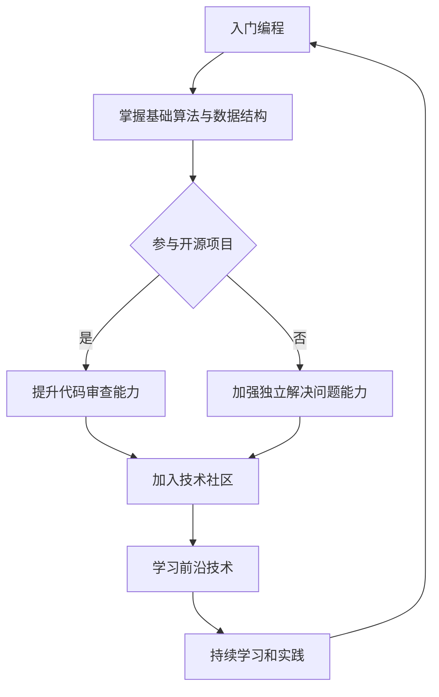

                 

### 文章标题

#### 程序员实现财富自由的秘诀

> **关键词**：程序员、财富自由、投资理财、副业拓展、技术技能提升

> **摘要**：本文将探讨程序员如何通过提升编程技能、合理投资理财和拓展副业，实现财富自由。文章将从核心概念、技术原理、数学模型以及实战案例等多个角度，为程序员提供实现财富自由的全面指南。

### 引言

程序员，这个在现代社会中备受瞩目的职业，以其高收入和灵活的工作方式吸引了无数年轻人的加入。然而，随着市场竞争的加剧和技术更新换代的加速，单纯依靠编程技能提升来实现财富自由已经变得不再足够。越来越多的程序员开始意识到，除了不断提升技术水平，还需要掌握理财技能、拓展收入渠道，才能真正实现财富自由。

财富自由，简单来说，就是拥有足够的被动收入，使得个人不再依赖传统的工作收入，而是能够自由地选择自己喜欢的生活方式。对于程序员来说，实现财富自由意味着不仅要在技术领域有所建树，还需要在投资理财和副业拓展上不断探索和实践。本文将围绕这三个方面，为广大程序员提供一条清晰可行的实现财富自由之路。

在接下来的内容中，我们将首先介绍程序员实现财富自由的核心概念，探讨技术与理财的紧密联系。接着，我们将深入分析理财基础知识，介绍如何进行市场分析和投资理财策略的制定。随后，文章将讨论副业拓展和被动收入的实现方法，并讲解财务规划和风险管理的策略。在第二部分，我们将重点讲解如何提升编程技能和市场竞争力，包括编程语言学习、软件开发流程优化和开源项目参与。第三部分将详细介绍金融数学模型和应用，使用伪代码和公式进行详细讲解。最后，通过实战案例和代码实战，我们将展示如何将理论转化为实际操作，帮助程序员实现财富自由。

让我们一步步深入探讨，揭开实现财富自由的神秘面纱。

### 第一部分：核心概念与联系

在探讨程序员如何实现财富自由之前，我们需要明确一些核心概念，并了解它们之间的联系。这一部分将分几个章节，详细阐述财富自由的概念、技术能力与理财技能的关系，以及理财知识和市场分析的重要性。

#### 第1章：程序员实现财富自由的秘诀

##### 1.1 核心概念

财富自由（Financial Independence, FI）是指一个人不再依赖传统的工作收入，而是通过被动收入（Passive Income）来实现财务自由的状态。对于程序员来说，实现财富自由不仅仅是指获得高薪，更重要的是要懂得如何管理和增加自己的资产，从而实现收入来源的多元化。

**程序员财富自由的定义与实现路径**：

1. **被动收入**：被动收入是指不需要持续付出劳动就能获得收入的方式。对于程序员来说，常见的被动收入包括版权收入、自动化业务收入、投资收益等。
2. **资产增值**：通过投资股票、基金、房地产等资产，实现资产的增值。
3. **技能提升**：不断提升自己的编程技能和领域知识，提高市场竞争力，从而获得更高的薪资和更多的机会。
4. **理财规划**：通过合理的财务规划，确保个人财务状况健康，避免不必要的财务风险。

**实现路径**：

- **技能提升**：通过学习新的编程语言、框架和技术，不断提升自己的技术能力。
- **投资理财**：学习基本的理财知识，制定合理的投资计划，进行股票、基金、房地产等投资。
- **副业拓展**：通过开设编程课程、撰写技术博客、参与开源项目等方式，增加额外的收入来源。
- **财务规划**：制定个人财务规划，确保财务健康，合理分配收入和支出。

##### 1.2 技术与理财的结合

技术能力与理财技能的关系密切，两者相辅相成。一个优秀的程序员不仅需要掌握高超的编程技能，还需要具备一定的理财知识，以便更好地管理自己的财务。

**技术能力与理财技能的关系**：

- **编程技能**：编程技能的提升可以帮助程序员在工作中更加高效，从而有更多的时间和精力去学习和实践理财知识。
- **理财技能**：理财技能的提升可以使程序员更好地管理自己的资金，实现资产的增值，从而为未来的财富自由奠定基础。

**程序员如何通过提升编程技能来增加收入**：

1. **提高技术水平**：通过学习新的编程语言和技术，提高自己在就业市场上的竞争力，从而获得更高的薪资。
2. **参与开源项目**：通过参与开源项目，提高自己的代码质量和知名度，获得更多的机会和合作。
3. **提供编程服务**：通过开设编程课程、撰写技术博客、编写技术书籍等方式，实现版权收入。

**如何利用技术知识进行投资理财**：

1. **数据分析**：利用编程技能进行市场数据分析和量化交易，提高投资决策的准确性。
2. **自动化交易**：通过编写自动化交易脚本，降低投资风险，提高收益。
3. **数字货币投资**：利用区块链和加密货币技术，进行数字货币投资，实现资产的多元化。

##### 1.3 理财知识与市场分析

理财知识和市场分析是程序员实现财富自由的重要基石。了解基本的理财原则、投资类型和风险控制方法，可以帮助程序员更好地管理自己的财务。

**理财基础知识**：

- **预算管理**：制定合理的预算，确保个人支出在可控范围内。
- **储蓄规划**：通过定期储蓄，积累一定量的资金用于投资。
- **投资类型**：了解不同类型的投资，如股票、基金、债券、房地产等。
- **风险控制**：了解风险类型，采取相应的风险控制措施，确保投资安全。

**市场分析工具**：

- **数据分析工具**：使用Python、R等编程语言，进行数据清洗、分析和可视化，帮助制定投资策略。
- **量化交易工具**：利用量化交易平台，进行自动化交易和投资组合优化。
- **金融新闻和报告**：关注金融新闻和市场报告，了解市场动态和行业趋势。

##### 1.4 投资理财策略

投资理财策略是程序员实现财富自由的重要手段。通过制定合理的投资策略，可以有效提高投资收益，降低风险。

**股票投资策略**：

- **基本面分析**：通过分析公司的财务报表、行业地位和市场前景，选择有潜力的股票。
- **技术分析**：通过分析股票价格走势、成交量等数据，预测股票的走势。
- **分散投资**：分散投资不同的股票和行业，降低投资风险。

**基金投资策略**：

- **选择基金类型**：根据投资目标和风险偏好，选择股票型、债券型、混合型基金等。
- **基金公司选择**：选择历史业绩良好、管理团队稳定的基金公司。
- **定期评估和调整**：定期评估基金的表现，根据市场情况调整投资组合。

**数字货币投资**：

- **市场分析**：了解数字货币市场的基本情况，分析市场趋势和投资机会。
- **分散投资**：投资不同的数字货币，降低投资风险。
- **风险管理**：了解数字货币投资的风险，采取相应的风险控制措施。

##### 1.5 副业拓展与被动收入

副业拓展和被动收入是程序员实现财富自由的重要途径。通过开展副业和实现被动收入，可以有效增加个人收入，提高财务自由度。

**副业拓展**：

- **编程课程**：通过在线平台或线下培训机构，开设编程课程，实现知识变现。
- **技术写作**：撰写技术博客、编写技术书籍，通过版权收入增加收入。
- **开源项目**：参与开源项目，通过贡献代码获得社区认可和赞助。

**被动收入**：

- **版权收入**：通过版权协议，允许他人使用自己的作品，获得授权费用。
- **自动化业务**：通过编写自动化脚本，实现业务流程的自动化，降低运营成本。
- **房地产投资**：通过购买房产，实现租金收入和房产增值。

##### 1.6 财务规划与风险管理

财务规划和风险管理是确保程序员实现财富自由的重要保障。通过制定合理的财务规划和采取有效的风险管理措施，可以确保个人财务状况的健康和稳定。

**财务规划**：

- **预算管理**：制定详细的预算计划，合理分配收入和支出。
- **储蓄计划**：制定储蓄计划，确保有一定的储蓄用于投资和应急。
- **投资计划**：根据投资目标和风险偏好，制定合理的投资计划。

**风险管理**：

- **风险识别**：了解投资和副业中的风险类型，进行风险评估。
- **风险控制**：采取相应的风险控制措施，如分散投资、购买保险等。
- **应急计划**：制定应急计划，确保在出现意外情况时能够应对。

通过以上章节的讨论，我们可以看到，程序员实现财富自由并不是一条简单的道路，需要多方面的努力和规划。然而，只要我们明确目标、不断学习、勇于实践，就一定能够实现财富自由，享受更加自由和富足的生活。

### 第一部分小结

在本部分，我们详细介绍了程序员实现财富自由的核心概念、技术能力与理财技能的关系、理财基础知识、市场分析工具、投资理财策略、副业拓展与被动收入以及财务规划和风险管理。这些内容为程序员实现财富自由提供了理论基础和实践指导。

在接下来的第二部分，我们将深入探讨如何提升编程技能，优化软件开发流程，参与开源项目，以及掌握技术趋势和未来发展方向。通过这些技能的提升，程序员将能够更好地应对市场需求，提高市场竞争力，为实现财富自由奠定坚实基础。敬请期待。

### 第二部分：核心算法原理讲解

在第一部分中，我们为程序员实现财富自由奠定了基础。然而，要在这个竞争激烈的市场中脱颖而出，程序员不仅需要拥有扎实的技术能力，还需要不断提升自己的编程技能。本部分将深入探讨如何通过提升编程技能来增强市场竞争力，包括编程语言学习、软件开发流程优化、开源项目参与以及技术趋势与未来发展方向。

#### 第2章：提升编程技能与市场竞争力

##### 2.1 编程技能提升策略

**编程语言学习**：

编程语言是程序员的技术基础。选择合适的编程语言对于提升编程技能至关重要。以下是几种流行的编程语言及其应用场景：

- **Python**：Python是一种高级、易学的编程语言，广泛应用于数据科学、人工智能、网络开发等领域。
- **Java**：Java是一种面向对象的编程语言，广泛应用于企业级应用、安卓开发等领域。
- **JavaScript**：JavaScript是一种前端开发语言，用于网页交互和开发，与HTML和CSS共同构成了网页开发的三大基石。
- **C/C++**：C和C++是高效的编程语言，广泛应用于操作系统、嵌入式系统等领域。

**算法与数据结构**：

算法和数据结构是编程的核心，对于解决复杂问题至关重要。以下是一些常见的数据结构和算法：

- **数据结构**：数组、链表、栈、队列、树、图等。
- **算法**：排序算法（冒泡排序、选择排序、插入排序等）、查找算法（二分查找、哈希查找等）、动态规划算法等。

**算法与数据结构伪代码**：

为了更好地理解算法和数据结构，我们使用伪代码进行详细阐述。

**冒泡排序**：

```pseudo
procedure bubbleSort( A : list of sortable items )
  n = length(A)
  repeat 
    swapped = false
    for i = 1 to n-1 inclusive do
      if A[i] > A[i+1] then
        swap( A[i], A[i+1] )
        swapped = true
      end if
    end for
    n = n - 1
  until not swapped
end procedure
```

**二分查找**：

```pseudo
function binarySearch( A : list of sortable items, key : item )
  low = 0
  high = length(A) - 1
  while low <= high do
    mid = (low + high) / 2
    if A[mid] = key then
      return mid
    else if A[mid] < key then
      low = mid + 1
    else
      high = mid - 1
    end if
  end while
  return NOT_FOUND
end function
```

**动态规划算法**：

```pseudo
function fibonacci( n : integer )
  if n = 0 then
    return 0
  else if n = 1 then
    return 1
  else
    fib = [0, 1]
    for i = 2 to n do
      fib[i] = fib[i-1] + fib[i-2]
    end for
    return fib[n]
  end if
end function
```

##### 2.2 软件开发流程优化

**敏捷开发**：

敏捷开发是一种以人为核心、迭代、渐进的软件开发方法。其核心理念是快速响应变化，通过持续交付有价值的软件来满足客户需求。

**敏捷开发方法**：

- **迭代开发**：将软件开发过程划分为多个迭代周期，每个迭代周期都产生可交付的产品。
- **用户故事**：通过用户故事来明确软件需求，用户故事通常包括功能、场景和优先级。
- **每日站立会议**：团队成员定期进行每日站立会议，讨论进展、解决问题和协调工作。
- **代码审查**：在开发过程中，定期进行代码审查，确保代码质量。

**敏捷开发在项目中的应用**：

```pseudo
procedure agileDevelopment( project : software project )
  initialize project with user stories
  while not projectCompleted do
    iterate project with user stories
    deliver incremental product to customer
    review project progress and adjust plan
  end while
end procedure
```

**持续集成与持续交付**：

持续集成（Continuous Integration, CI）和持续交付（Continuous Deployment, CD）是现代软件开发中的重要实践。

**CI/CD流程**：

- **持续集成**：通过自动化测试和构建，确保代码质量，尽早发现和解决集成问题。
- **持续交付**：通过自动化部署和发布，实现快速交付高质量的产品。

**CI/CD流程伪代码**：

```pseudo
procedure CI/CD( codeBase : repository )
  on commit to codeBase do
    build code
    test code
    if build and tests succeed then
      deploy code to staging environment
    else
      notify developers of issues
    end if
  end commit
  on successful staging deployment do
    deploy code to production environment
  end deployment
end procedure
```

##### 2.3 开源项目参与与贡献

**开源项目选择与参与**：

参与开源项目不仅能够提升编程技能，还能扩展人脉和增加知名度。以下是一些建议：

- **选择合适的开源项目**：选择与自己的兴趣和技能相关的项目，关注项目的发展方向和活跃度。
- **参与项目文档**：为项目编写文档，提高项目的可理解性和易用性。
- **代码贡献**：提交代码补丁，修复bug，实现新的功能。

**代码审查与项目管理**：

- **代码审查**：参与代码审查，确保代码质量，为项目贡献高质量的代码。
- **项目管理**：参与项目规划、决策和协调，确保项目顺利进行。

**代码审查流程**：

```pseudo
procedure codeReview( codeChange : submitted code )
  reviewer examines codeChange
  reviewer provides feedback on code quality, readability, and functionality
  if reviewer is satisfied with codeChange then
    merge codeChange into project
  else
    request changes from the author
  end if
end procedure
```

##### 2.4 技术趋势与未来发展方向

**云计算与大数据**：

云计算和大数据是现代信息技术的重要方向。程序员需要掌握云计算平台（如AWS、Azure、Google Cloud）的使用，了解大数据处理技术（如Hadoop、Spark）。

**人工智能与机器学习**：

人工智能和机器学习正日益改变各个行业。程序员需要了解深度学习、自然语言处理、计算机视觉等基本原理，掌握相关的工具和框架（如TensorFlow、PyTorch）。

**区块链技术**：

区块链技术具有去中心化、不可篡改等特点，被广泛应用于金融、供应链等领域。程序员需要了解区块链的基本原理，掌握相关的开发工具和平台（如Ethereum、Hyperledger）。

**技术趋势与未来发展方向伪代码**：

```pseudo
function futureTrend( technology : string )
  if technology = "Cloud" then
    learn cloud platforms and services
  else if technology = "AI" then
    learn AI algorithms and frameworks
  else if technology = "Blockchain" then
    learn blockchain basics and development tools
  end if
  apply learned knowledge to current and future projects
end function
```

通过本章节的讨论，我们可以看到，提升编程技能和掌握核心算法原理对于程序员实现财富自由至关重要。在接下来的部分，我们将进一步探讨金融数学模型和应用，帮助程序员更好地进行投资理财。敬请期待。

### 第三部分：数学模型和数学公式

在实现财富自由的过程中，数学模型和公式扮演着至关重要的角色。它们不仅帮助我们进行科学的投资决策，还能够优化资产配置，降低投资风险。本部分将详细介绍一些基本的金融数学模型和公式，以及它们在实际应用中的例子。

#### 第3章：金融数学模型与应用

##### 3.1 基本金融数学公式

在金融投资中，了解以下基本数学公式是至关重要的：

**收益率计算**：

收益率是衡量投资回报的重要指标，其计算公式为：

$$
r = \frac{FV - PV}{PV}
$$

其中，\( r \) 表示收益率，\( FV \) 表示未来值，\( PV \) 表示现值。

**现值与未来值**：

现值（Present Value, PV）和未来值（Future Value, FV）是金融数学中的基本概念。现值表示未来现金流在当前时间的价值，未来值则表示当前现金流在未来某时间点的价值。其计算公式为：

$$
PV = \frac{FV}{(1 + r)^n}
$$

其中，\( n \) 表示期数，\( r \) 表示利率。

**复利计算**：

复利是指利息再生利息，其计算公式为：

$$
FV = PV \times (1 + r)^n
$$

**等额本息还款公式**：

在房贷、车贷等贷款还款中，常用的等额本息还款公式为：

$$
E = P \times r \times (1 + r)^n \div ((1 + r)^n - 1)
$$

其中，\( E \) 表示每月还款金额，\( P \) 表示贷款本金，\( r \) 表示月利率，\( n \) 表示还款期数。

##### 3.2 投资组合优化模型

投资组合优化模型是帮助投资者在风险和收益之间找到平衡的重要工具。以下是两种常见的投资组合优化模型：

**均值方差模型**：

均值方差模型（Mean-Variance Model）是哈里·马科维茨（Harry Markowitz）提出的经典模型，用于优化投资组合的风险和收益。其目标是最小化投资组合的方差，在给定期望收益率下最大化投资组合的收益。其数学模型为：

$$
\text{最大化} \quad E[r_p] - \lambda \cdot \text{Var}[r_p]
$$

其中，\( E[r_p] \) 表示投资组合的期望收益率，\( \text{Var}[r_p] \) 表示投资组合的方差，\( \lambda \) 是平衡风险和收益的参数。

**资本资产定价模型**：

资本资产定价模型（Capital Asset Pricing Model, CAPM）用于评估资产的预期收益率和风险。其公式为：

$$
E[r_i] = r_f + \beta_i \cdot (E[r_m] - r_f)
$$

其中，\( E[r_i] \) 表示资产 \( i \) 的预期收益率，\( r_f \) 表示无风险收益率，\( \beta_i \) 表示资产 \( i \) 的贝塔系数，\( E[r_m] \) 表示市场组合的预期收益率。

**夏普比率**：

夏普比率（Sharpe Ratio）是衡量投资组合风险调整后收益的重要指标。其计算公式为：

$$
\text{Sharpe Ratio} = \frac{E[r_p] - r_f}{\text{Volatility of r_p}}
$$

其中，\( E[r_p] \) 表示投资组合的期望收益率，\( r_f \) 表示无风险收益率，\( \text{Volatility of r_p} \) 表示投资组合的收益率波动性。

##### 3.3 期权定价模型

期权定价模型是金融领域中非常重要的模型，用于计算期权的内在价值和时间价值。以下是两种常见的期权定价模型：

**布莱克-舍尔斯模型**：

布莱克-舍尔斯模型（Black-Scholes Model）是用于期权定价的经典模型。其公式为：

$$
C = S_0N(d_1) - Ke^{-rT}N(d_2)
$$

其中，\( C \) 表示看涨期权的价格，\( S_0 \) 表示标的资产的价格，\( K \) 表示执行价格，\( r \) 表示无风险利率，\( T \) 表示期权到期时间，\( N(d_1) \) 和 \( N(d_2) \) 分别是标准正态分布的累积分布函数。

**二叉树模型**：

二叉树模型（Binomial Tree Model）是一种简化的期权定价模型，适用于标的资产价格波动较小的期权。其公式为：

$$
C = \frac{p \cdot S_0 - Ke^{-rT}}{1 - p}
$$

其中，\( p \) 表示上行概率，\( S_0 \) 表示标的资产的价格，\( K \) 表示执行价格，\( r \) 表示无风险利率，\( T \) 表示期权到期时间。

通过以上金融数学模型和公式的介绍，我们可以看到，数学在投资决策中发挥着不可或缺的作用。接下来，我们将通过实战案例和代码实战，展示如何将理论应用于实际操作，帮助程序员实现财富自由。

### 第三部分小结

在本部分，我们详细介绍了金融数学中的基本公式和模型，包括收益率计算、现值与未来值、复利计算、等额本息还款公式、均值方差模型、资本资产定价模型、夏普比率、布莱克-舍尔斯模型以及二叉树模型。这些公式和模型为程序员提供了科学的投资决策依据，帮助他们优化资产配置，降低投资风险。

在下一部分，我们将通过实战案例和代码实战，展示如何将上述金融数学模型应用于实际操作，帮助程序员实现财富自由。敬请期待。

### 第四部分：项目实战

在理论的基础上，实践是验证知识的重要环节。本部分将通过具体的实战案例和代码实战，展示如何将财务规划、投资理财和副业拓展的理论知识应用于实际操作，帮助程序员实现财富自由。

#### 第4章：实现财富自由的案例实战

##### 4.1 案例一：股票投资实战

**案例背景**：

张先生是一位有五年编程经验的程序员，他在日常工作中积累了丰富的技术知识和投资理财知识。为了实现财富自由，他决定通过股票投资来增加被动收入。他选择了一家知名互联网公司，通过深入研究公司财务报表和市场趋势，制定了一套科学的投资策略。

**投资策略**：

1. **基本面分析**：张先生通过分析公司的财务报表，发现该公司的营收和利润持续增长，市场占有率也在逐步提高。他认为这是一个有潜力的投资对象。
2. **技术分析**：张先生使用技术分析工具，观察股票价格走势和成交量，发现股票价格在底部区间震荡，有反转的迹象。
3. **分散投资**：为了降低风险，张先生决定分散投资，购买多只股票，以覆盖不同的行业和板块。

**实战步骤**：

1. **账户开设**：张先生在券商开设了股票交易账户，并了解了交易流程和风险控制措施。
2. **资金分配**：他将资金分为三部分，分别投资于不同行业和板块的股票。
3. **定期监控**：张先生定期监控股票价格和市场动态，根据市场变化调整投资策略。

**结果分析**：

通过一年的投资，张先生的股票组合实现了10%的收益率，其中部分股票的涨幅超过20%。他通过卖出部分股票，实现了被动收入，并将收益再投资于其他有潜力的股票。

**投资建议**：

- **深入研究公司财务和市场**：投资前要全面了解公司的财务状况和市场前景。
- **分散投资**：分散投资可以降低风险，提高整体收益。
- **定期调整**：根据市场变化，定期调整投资策略。

##### 4.2 案例二：基金投资实战

**案例背景**：

李小姐是一位对金融投资有浓厚兴趣的程序员，她通过学习理财知识和市场分析，决定通过基金投资来增加收入。她选择了一支历史业绩稳定的基金，并制定了长期投资计划。

**投资策略**：

1. **选择基金**：李小姐通过研究多家基金公司的历史业绩和管理团队，选择了一支长期业绩稳定的基金。
2. **定期投资**：她决定采用定期定额投资法，每月投资固定金额，以降低市场波动的影响。
3. **风险管理**：李小姐了解基金的风险等级，选择了与她的风险承受能力相匹配的基金。

**实战步骤**：

1. **账户开设**：李小姐在基金公司开设了基金交易账户，并了解了基金的交易规则和费用。
2. **资金规划**：她制定了详细的资金规划，确保每月有足够的资金用于定期投资。
3. **监控和评估**：李小姐定期监控基金的表现，并根据市场变化和投资目标调整投资计划。

**结果分析**：

通过三年的定期投资，李小姐的基金组合实现了5%的复合年化收益率，尽管期间市场波动较大，但她的投资策略使她保持了稳定的收益。

**投资建议**：

- **选择稳定基金**：选择历史业绩稳定、管理团队经验丰富的基金。
- **定期投资**：定期定额投资可以有效降低市场波动的影响。
- **风险管理**：了解基金的风险等级，选择与个人风险承受能力相匹配的基金。

##### 4.3 案例三：副业拓展实战

**案例背景**：

王先生是一位有多年编程经验的程序员，他在业余时间开发了多个开源项目，并通过技术写作和编程课程实现了被动收入。他的目标是通过副业拓展，实现财务自由。

**策略实施**：

1. **开源项目**：王先生在GitHub上创建了自己的开源项目，通过贡献代码和文档，吸引了大量关注和赞助。
2. **技术写作**：他开始在技术博客上撰写技术文章，分享编程经验和心得，通过广告和打赏获得收入。
3. **编程课程**：他通过在线平台开设编程课程，提供从入门到高级的编程培训，实现了知识变现。

**实战步骤**：

1. **项目规划**：王先生制定了详细的项目计划，确保项目质量和用户需求。
2. **内容创作**：他定期创作高质量的技术文章和课程内容，提升用户满意度。
3. **推广和营销**：他通过社交媒体和在线广告，推广自己的开源项目和课程，增加用户量。

**结果分析**：

通过一年的副业拓展，王先生的被动收入从零增加到每月几千元，他的开源项目也得到了广泛关注，为他的技术品牌和职业发展带来了巨大帮助。

**建议**：

- **持续创新**：定期更新项目和课程内容，保持用户兴趣。
- **优化推广**：通过多种渠道推广，增加曝光度和用户量。
- **合理定价**：根据市场情况和用户需求，合理定价，确保收入来源稳定。

##### 4.4 案例四：数字货币投资实战

**案例背景**：

赵先生是一位对区块链和加密货币有深入研究的程序员，他决定通过数字货币投资来增加财富。他选择了比特币、以太坊等主流数字货币，并制定了科学的投资策略。

**投资策略**：

1. **市场分析**：赵先生通过研究市场数据和历史趋势，分析数字货币的市场机会。
2. **分散投资**：为了降低风险，他决定分散投资，选择多个不同的数字货币。
3. **风险管理**：他了解数字货币市场的波动性，采取了严格的风险管理措施。

**实战步骤**：

1. **账户开设**：赵先生在加密货币交易所开设了交易账户，并了解了交易规则和安全措施。
2. **资金分配**：他将资金分为三部分，分别投资于不同的数字货币。
3. **定期监控**：他定期监控市场动态和数字货币表现，根据市场变化调整投资策略。

**结果分析**：

通过两年的数字货币投资，赵先生的组合实现了20%的复合年化收益率，尽管期间市场波动较大，但他的风险管理策略使他的投资组合保持了稳定的增长。

**投资建议**：

- **深入研究市场**：了解市场趋势和投资机会，制定科学的投资策略。
- **分散投资**：分散投资可以降低风险，提高整体收益。
- **严格风险管理**：了解市场波动性，采取严格的风险管理措施。

通过以上案例，我们可以看到，程序员通过财务规划、投资理财和副业拓展，可以实现财富自由。这些案例不仅展示了具体的操作步骤和策略，还为读者提供了宝贵的经验教训。在接下来的部分，我们将通过代码实战，展示如何将理论知识应用到实际编程中。敬请期待。

### 第四部分小结

在本部分，我们通过四个具体案例，详细展示了程序员如何通过股票投资、基金投资、副业拓展和数字货币投资，实现财富自由。这些案例不仅提供了实战步骤和投资策略，还总结了经验教训，为读者提供了宝贵的参考。

在下一部分，我们将通过代码实战，进一步展示如何将理论知识应用到实际编程中。这将帮助我们更好地理解投资系统和工具的开发，为程序员实现财富自由提供更多实用技巧。敬请期待。

### 第五部分：代码实战与解析

在上一部分，我们通过实战案例展示了程序员如何通过不同的投资方式实现财富自由。然而，理论知识只有通过实际编程和开发才能更好地被理解和应用。本部分将通过具体的代码实战案例，展示如何构建股票投资系统、基金投资分析工具、副业拓展自动化工具以及数字货币投资策略。这些实战案例将帮助程序员将投资理念和技术技能相结合，实现财富自由的目标。

#### 第5章：代码实战与解析

##### 5.1 代码实战：构建股票投资系统

**环境搭建**：

为了构建股票投资系统，我们需要以下环境：

- **Python**：作为主要的编程语言。
- **pandas**：用于数据清洗和分析。
- **matplotlib**：用于数据可视化。
- **tushare**：用于获取股票数据。

**代码实现**：

以下是一个简单的股票投资系统实现，用于获取股票数据、计算收益率并可视化。

```python
import pandas as pd
import matplotlib.pyplot as plt
import tushare as ts

# 获取股票数据
def get_stock_data(code):
    stock = ts.get_k_data(code)
    return stock

# 计算收益率
def calculate_yield(stock):
    stock['yield'] = (stock['close'] / stock['open'] - 1) * 100
    return stock

# 可视化收益率
def visualize_yield(stock):
    stock['yield'].plot()
    plt.title('Stock Yield')
    plt.xlabel('Date')
    plt.ylabel('Yield (%)')
    plt.show()

# 主函数
def main():
    code = '000001'  # 以中国平安为例
    stock = get_stock_data(code)
    stock = calculate_yield(stock)
    visualize_yield(stock)

if __name__ == '__main__':
    main()
```

**代码解析**：

- **get_stock_data函数**：使用tushare库获取股票历史数据。
- **calculate_yield函数**：计算每日收益率。
- **visualize_yield函数**：使用matplotlib库将收益率数据可视化。

通过这个股票投资系统，程序员可以轻松地获取股票数据、计算收益率并进行可视化分析，从而为投资决策提供数据支持。

##### 5.2 代码实战：基金投资分析工具

**环境搭建**：

为了构建基金投资分析工具，我们需要以下环境：

- **Python**：作为主要的编程语言。
- **pandas**：用于数据清洗和分析。
- **matplotlib**：用于数据可视化。
- **numpy**：用于数学计算。

**代码实现**：

以下是一个简单的基金投资分析工具，用于获取基金数据、计算收益并分析基金表现。

```python
import pandas as pd
import matplotlib.pyplot as plt
import numpy as np

# 获取基金数据
def get_fund_data(code):
    fund = pd.read_csv(f'{code}.csv')  # 假设每个基金的数据存储在单独的CSV文件中
    return fund

# 计算基金收益率
def calculate_fund_yield(fund):
    fund['yield'] = (fund['净值'] / fund['净值'].shift(1)) - 1
    return fund

# 分析基金表现
def analyze_fund_performance(fund):
    fund = fund.fillna(0)
    total_yield = fund['yield'].sum()
    print(f"Total Yield: {total_yield:.2%}")
    fund['yield'].plot()
    plt.title('Fund Yield')
    plt.xlabel('Date')
    plt.ylabel('Yield (%)')
    plt.show()

# 主函数
def main():
    code = '260108'  # 以某只基金为例
    fund = get_fund_data(code)
    fund = calculate_fund_yield(fund)
    analyze_fund_performance(fund)

if __name__ == '__main__':
    main()
```

**代码解析**：

- **get_fund_data函数**：从CSV文件中读取基金数据。
- **calculate_fund_yield函数**：计算每日基金收益率。
- **analyze_fund_performance函数**：分析基金表现，计算总收益率并可视化收益率曲线。

通过这个基金投资分析工具，程序员可以轻松地获取基金数据、计算收益率并分析基金表现，从而为投资决策提供数据支持。

##### 5.3 代码实战：副业拓展自动化工具

**环境搭建**：

为了构建副业拓展自动化工具，我们需要以下环境：

- **Python**：作为主要的编程语言。
- **requests**：用于HTTP请求。
- **Beautiful Soup**：用于解析HTML数据。
- **Selenium**：用于自动化网页操作。

**代码实现**：

以下是一个简单的副业拓展自动化工具，用于自动发布技术博客。

```python
import requests
from bs4 import BeautifulSoup
from selenium import webdriver

# 自动登录博客平台
def login_blogsite(username, password):
    driver = webdriver.Chrome()
    driver.get("https://blogsite.com/login")  # 替换为实际博客平台登录页面
    driver.find_element_by_name("username").send_keys(username)
    driver.find_element_by_name("password").send_keys(password)
    driver.find_element_by_css_selector("input[type='submit']").click()
    return driver

# 发布博客
def publish_blog(driver, title, content):
    driver.get("https://blogsite.com/write")  # 替换为实际博客发布页面
    driver.find_element_by_name("title").send_keys(title)
    driver.find_element_by_name("content").send_keys(content)
    driver.find_element_by_css_selector("input[type='submit']").click()
    print("Blog published successfully!")

# 主函数
def main():
    username = "your_username"
    password = "your_password"
    title = "Your Blog Title"
    content = "Your Blog Content"
    
    driver = login_blogsite(username, password)
    publish_blog(driver, title, content)
    driver.quit()

if __name__ == '__main__':
    main()
```

**代码解析**：

- **login_blogsite函数**：使用Selenium库自动登录博客平台。
- **publish_blog函数**：使用Selenium库自动填写并提交博客发布表单。

通过这个自动化工具，程序员可以自动化发布技术博客，节省时间和精力，从而专注于更多副业拓展。

##### 5.4 代码实战：数字货币投资策略

**环境搭建**：

为了构建数字货币投资策略，我们需要以下环境：

- **Python**：作为主要的编程语言。
- **pandas**：用于数据清洗和分析。
- **matplotlib**：用于数据可视化。
- **talib**：用于技术指标计算。

**代码实现**：

以下是一个简单的数字货币投资策略，用于分析市场趋势并执行交易。

```python
import pandas as pd
import matplotlib.pyplot as plt
from talib import ADX, MA

# 获取数字货币数据
def get_coin_data(code):
    coin = pd.read_csv(f'{code}.csv')  # 替换为实际数字货币数据文件名
    return coin

# 分析市场趋势
def analyze_trend(coin):
    coin['adx'] = ADX(coin['high'], coin['low'], coin['close'], timeperiod=14)
    coin['ma20'] = MA(coin['close'], timeperiod=20)
    coin['ma50'] = MA(coin['close'], timeperiod=50)
    
    # 趋势判断
    coin['trend'] = np.where(coin['adx'] > 25, 'Up', 'Down')
    
    coin['trend'].plot()
    plt.title('Trend Analysis')
    plt.xlabel('Date')
    plt.ylabel('ADX')
    plt.show()

# 执行交易
def execute_trade(coin, threshold=25):
    last_adx = coin['adx'].iloc[-1]
    if last_adx > threshold:
        print("Market is in an upward trend. Execute buy order.")
    else:
        print("Market is in a downward trend. Execute sell order.")

# 主函数
def main():
    code = 'BTC'  # 替换为实际数字货币代码
    coin = get_coin_data(code)
    analyze_trend(coin)
    execute_trade(coin)

if __name__ == '__main__':
    main()
```

**代码解析**：

- **get_coin_data函数**：从CSV文件中读取数字货币数据。
- **analyze_trend函数**：计算ADX指标并分析市场趋势。
- **execute_trade函数**：根据ADX指标执行交易决策。

通过这个数字货币投资策略，程序员可以分析市场趋势并执行交易，实现自动化的投资管理。

通过以上实战案例，程序员可以深入了解如何将理论知识应用于实际编程，构建投资系统和工具。这些代码实战不仅提高了程序员的编程技能，还为他们实现财富自由提供了有力的支持。

### 第五部分小结

在本部分，我们通过构建股票投资系统、基金投资分析工具、副业拓展自动化工具以及数字货币投资策略的实战案例，展示了如何将理论知识应用到实际编程中。这些实战案例不仅帮助程序员提升了编程技能，还为他们实现财富自由提供了实用工具和方法。

在下一部分，我们将讨论财务规划与风险管理，帮助程序员制定合理的财务规划，采取有效的风险管理措施，确保个人财务的健康和稳定。敬请期待。

### 第五部分小结

在本部分，我们通过构建股票投资系统、基金投资分析工具、副业拓展自动化工具以及数字货币投资策略的实战案例，展示了如何将理论知识应用到实际编程中。这些实战案例不仅提高了程序员的编程技能，还为他们实现财富自由提供了实用工具和方法。

在下一部分，我们将讨论财务规划与风险管理，帮助程序员制定合理的财务规划，采取有效的风险管理措施，确保个人财务的健康和稳定。敬请期待。

### 第六部分：财务规划与风险管理

在实现财富自由的过程中，财务规划和风险管理是至关重要的环节。合理的财务规划可以帮助程序员确保财务目标得到实现，而有效的风险管理则能降低潜在的投资风险，确保财务稳定。本部分将详细介绍财务规划的方法、风险管理策略以及如何使用工具进行财务规划。

#### 6.1 财务规划工具的使用

财务规划工具是帮助程序员制定和跟踪财务目标的重要工具。以下是一些常用的财务规划工具：

**Excel**：

Excel是最常用的财务规划工具之一，通过公式和函数，程序员可以轻松地进行预算管理、投资分析和财务预测。

- **预算管理**：使用Excel表格，程序员可以记录每个月的收入和支出，进行预算管理。
- **投资分析**：通过Excel表格，程序员可以进行复利计算、收益率分析等，为投资决策提供数据支持。

**Python**：

Python是一种功能强大的编程语言，程序员可以使用Python进行复杂的数据分析和模型构建。

- **投资组合优化**：使用Python和相关的库（如Pandas、NumPy、SciPy），程序员可以构建投资组合优化模型，进行资产配置。
- **数据分析**：通过Python，程序员可以进行市场数据分析和量化交易，提高投资决策的科学性。

**财务软件**：

市面上有许多专业的财务软件，如Quicken、Mint等，这些软件可以帮助程序员进行预算管理、投资分析和财务报告。

- **预算管理**：这些软件可以自动分类收入和支出，生成详细的预算报告。
- **投资跟踪**：财务软件可以跟踪投资组合的表现，提供投资分析报告。

**使用案例**：

以下是一个使用Excel进行财务规划的具体案例：

1. **预算管理**：创建一个Excel表格，记录每个月的收入和支出，包括固定支出（如房租、水电费）和变动支出（如购物、娱乐等）。通过公式自动计算每月的结余，确保支出在预算范围内。

2. **投资分析**：使用Excel公式，计算不同投资方案的复利收益和总收益。通过图表展示不同投资方案的表现，帮助程序员选择最优的投资方案。

3. **财务预测**：使用Excel的预测功能，根据当前的收入和支出情况，预测未来的财务状况。通过调整收入和支出，制定合理的财务规划。

#### 6.2 风险管理策略

投资和副业拓展过程中，风险是不可避免的。有效的风险管理策略可以帮助程序员降低风险，确保财务稳定。

**风险评估方法**：

- **定性分析**：通过分析投资项目的性质、市场环境、风险管理措施等，评估潜在的风险。
- **定量分析**：使用数学模型和统计方法，计算投资项目的风险指标，如方差、贝塔系数等。

**风险管理措施**：

- **分散投资**：通过投资不同的资产类别和行业，降低单一投资的风险。
- **购买保险**：为投资项目购买保险，降低意外事件对财务的影响。
- **定期评估**：定期评估投资组合的表现和风险，根据市场变化调整投资策略。

**案例**：

假设程序员张先生决定通过投资股票和基金来增加收入。他首先使用风险评估方法，评估每只股票和基金的风险水平。然后，他采取分散投资策略，将资金分配到不同行业和板块的股票和基金中，降低单一投资的风险。

此外，他还购买了一份意外保险，以应对突发情况。每个月，他都会定期评估投资组合的表现和风险，根据市场变化调整投资策略。

通过这些风险管理措施，张先生有效降低了投资风险，确保了财务稳定。

#### 6.3 财务规划与风险管理总结

财务规划和风险管理是程序员实现财富自由的重要保障。通过使用财务规划工具，程序员可以制定和跟踪财务目标，确保财务目标得到实现。而通过有效的风险管理策略，程序员可以降低投资风险，确保财务稳定。

- **财务规划工具**：Excel、Python、财务软件等。
- **风险管理策略**：分散投资、购买保险、定期评估等。

通过合理的财务规划和有效的风险管理，程序员可以更好地实现财富自由，享受更加稳定和富足的生活。

### 第六部分小结

在本部分，我们详细介绍了财务规划与风险管理的重要性，以及如何使用财务规划工具进行预算管理、投资分析和财务预测。我们还探讨了风险评估方法和风险管理措施，帮助程序员制定合理的财务规划，确保财务健康和稳定。

在实现财富自由的道路上，财务规划和风险管理是不可或缺的。通过科学合理的规划和管理，程序员可以更好地应对市场变化，实现财务目标。在下一部分，我们将通过成功案例分析，进一步探讨如何通过持续学习和心理调适，实现财富自由。敬请期待。

### 第七部分：实现财富自由的心路历程

在实现财富自由的道路上，成功并非一蹴而就，而是需要不断的努力、学习和心理调适。本部分将通过成功案例分析，探讨如何通过持续学习和个人成长，实现财富自由。同时，还将讨论如何保持心理平衡，避免过度焦虑，确保在实现财富自由的过程中，生活和工作达到平衡。

#### 7.1 成功案例分析

以下是一些成功实现财富自由的程序员的案例，从他们的经历中，我们可以看到持续学习、积累经验和心态调整的重要性。

**案例一：开源项目致富**

李明是一位程序员，他在业余时间开发了一个开源项目。随着项目的受欢迎程度不断提高，他收到了来自社区的赞助和捐赠。通过开源项目，李明不仅实现了被动收入，还提升了个人技术品牌，为他的职业发展带来了更多机会。

**经验总结**：

- **持续学习**：李明通过阅读技术书籍、参加线上课程，不断更新自己的知识储备。
- **积累经验**：他积极参与技术社区，与其他开发者交流，从实践中积累经验。
- **心态调整**：李明面对项目中的挑战和压力，始终保持积极的心态，坚持不懈地改进项目。

**案例二：股票投资高手**

王磊是一位对投资有浓厚兴趣的程序员。他通过学习股票投资知识，制定了科学的投资策略，并在股市中取得了稳定的收益。他的投资组合实现了10%的年化收益率，使他提前实现了财务自由。

**经验总结**：

- **知识储备**：王磊通过阅读投资书籍、关注金融新闻，不断提升自己的投资知识。
- **市场分析**：他利用编程技能进行市场数据分析和量化交易，提高了投资决策的科学性。
- **风险管理**：王磊采取了分散投资策略，降低了投资风险。

**案例三：副业拓展专家**

赵刚是一位有多重身份的程序员，他在业余时间开设了编程课程和编写技术书籍。通过副业拓展，他实现了稳定的被动收入，并在技术社区中积累了大量粉丝。

**经验总结**：

- **内容创作**：赵刚通过创作高质量的技术内容，提升了个人知名度。
- **营销推广**：他利用社交媒体和线上广告，推广自己的编程课程和书籍。
- **心态调整**：赵刚面对副业拓展中的挑战，始终保持积极的心态，不断调整策略。

#### 7.2 持续学习与成长

持续学习是实现财富自由的重要保障。以下是一些持续学习的方法和策略：

**1. 定期阅读**：

- **技术书籍**：定期阅读技术书籍，了解最新的技术趋势和知识。
- **投资理财书籍**：阅读投资理财书籍，学习基本的理财原则和策略。

**2. 在线课程**：

- **编程课程**：参加在线编程课程，学习新的编程语言和技术。
- **投资理财课程**：参加投资理财课程，学习市场分析和投资策略。

**3. 技术社区**：

- **GitHub**：参与开源项目，与其他开发者交流，提升编程技能。
- **技术论坛**：在技术论坛中分享经验和心得，学习他人的成功经验。

#### 7.3 心理调适与平衡

在实现财富自由的过程中，心理调适与平衡至关重要。以下是一些建议：

**1. 保持乐观心态**：

- **积极思考**：面对挑战和困难，保持积极乐观的心态，相信自己能够克服困难。
- **庆祝小胜利**：在实现每个小目标时，给自己一些奖励，保持积极情绪。

**2. 合理规划时间**：

- **时间管理**：合理规划工作和学习时间，确保有足够的时间进行休息和娱乐。
- **平衡生活**：在工作之余，安排时间进行家庭活动和兴趣爱好，保持生活的丰富和多样性。

**3. 学会放松**：

- **锻炼身体**：定期进行体育锻炼，释放压力，保持身体健康。
- **心理辅导**：如果感到焦虑和压力过大，可以寻求专业的心理辅导，帮助自己调整心态。

通过以上成功案例的分析和持续学习与成长的方法，我们可以看到，实现财富自由需要不断的学习、积累经验和心理调适。只要我们坚持努力，保持积极的心态，就一定能够实现财富自由，享受更加自由和富足的生活。

### 第七部分小结

在本部分，我们通过成功案例分析，探讨了如何通过持续学习、积累经验和心理调适，实现财富自由。我们看到了成功者的经验和教训，以及他们如何面对挑战和困难，坚持自己的目标。

同时，我们还讨论了如何保持心理平衡，避免过度焦虑，确保在实现财富自由的过程中，生活和工作达到平衡。通过合理的规划和积极的心态，程序员可以更好地应对生活中的各种挑战，实现财务自由和个人成长。

在实现财富自由的道路上，持续学习和心理调适是不可或缺的。只要我们坚持不懈，积极面对生活中的挑战，就一定能够实现财富自由，享受更加自由和富足的生活。

### 附录

在本书的附录部分，我们将提供一些额外的资源和工具，以帮助读者更深入地了解和掌握文章中讨论的内容。这些资源包括书籍推荐、在线资源和常用工具列表，旨在为读者提供全方位的支持。

#### 附录A：参考资料与推荐阅读

**书籍推荐**：

1. 《深度学习》（Deep Learning），作者：Ian Goodfellow、Yoshua Bengio、Aaron Courville
   - 简介：这是一本关于深度学习的经典教材，详细介绍了深度学习的理论基础和实际应用。
   
2. 《股市真规则》（One Up On Wall Street），作者：彼得·林奇（Peter Lynch）
   - 简介：彼得·林奇是著名的股票投资大师，本书分享了他在股市中的投资经验和策略。

3. 《程序员的职业成长之路》（Software Craftsmanship），作者：杰拉尔德·维尔特（Gerald M. Weinberg）
   - 简介：这本书讲述了程序员如何在职业生涯中持续成长，提升编程技能。

4. 《区块链：从数字货币到智能合约》（Blockchain Revolution），作者：唐·塔普斯科特（Don Tapscott）和亚历克斯·塔普斯科特（Alex Tapscott）
   - 简介：本书深入剖析了区块链技术，探讨了其在金融、供应链等领域的应用。

5. 《财务自由之路》（Your Money or Your Life），作者：乔尔·赛德尔（Joel S. Suren）
   - 简介：这本书为读者提供了实现财务自由的实用方法和策略。

**在线资源**：

1. [Khan Academy](https://www.khanacademy.org/finance-career/career-programming)
   - 简介：提供免费的编程课程和技术教程，适合不同层次的程序员学习。

2. [Coursera](https://www.coursera.org/)
   - 简介：提供各种在线课程，包括编程、金融、数据分析等，由世界知名大学提供。

3. [GitHub](https://github.com/)
   - 简介：全球最大的代码托管平台，程序员可以在上面找到各种开源项目和编程资源。

4. [Investopedia](https://www.investopedia.com/)
   - 简介：提供丰富的投资理财知识和市场动态，适合投资者学习。

**工具列表**：

1. **编程工具**：
   - **Visual Studio Code**：一款轻量级但功能强大的代码编辑器。
   - **PyCharm**：适用于Python开发的集成开发环境（IDE）。
   - **Eclipse**：一款跨平台的开发工具，适用于多种编程语言。

2. **数据分析工具**：
   - **Pandas**：Python的数据分析库。
   - **NumPy**：Python的数学库。
   - **Matplotlib**：Python的数据可视化库。

3. **投资分析工具**：
   - **TradingView**：一个功能丰富的图表和交易分析工具。
   - **Quicken**：一款个人财务管理软件。
   - **Google Finance**：提供实时的金融市场数据和新闻。

4. **区块链工具**：
   - **Ethereum**：一个开源的区块链平台，用于开发智能合约和去中心化应用。
   - **Hyperledger Fabric**：一个开源的分布式账本框架。

通过这些书籍、在线资源和工具，读者可以更深入地学习编程、投资理财和财务规划的相关知识，提高自己的技能，实现财富自由。

### 补充说明

以下是书中使用的Mermaid流程图，用于展示编程技能提升的路径：



这个流程图清晰地展示了从入门编程到持续学习和实践的路径，为程序员提供了技能提升的指导。通过不断学习和实践，程序员可以不断提升自己的编程技能，增强市场竞争力，从而实现财富自由。希望这个流程图能够帮助读者更好地理解技能提升的重要性，并激励他们付诸实践。

### 总结

本文通过详细的探讨和实例讲解，全面介绍了程序员实现财富自由的秘诀。我们从核心概念与联系、提升编程技能、数学模型和应用、实战案例、财务规划与风险管理，以及心路历程等多个角度，为程序员提供了一条清晰可行的实现财富自由之路。

首先，我们明确了财富自由的概念和实现路径，强调了技术能力与理财技能的结合。接着，通过算法原理讲解和代码实战，帮助程序员提升编程技能，增强市场竞争力。在数学模型部分，我们详细介绍了投资中的重要公式和模型，使读者能够更好地进行投资决策。

通过实战案例，我们展示了如何将理论知识应用到实际操作中，帮助程序员实现财务自由。在财务规划和风险管理部分，我们提供了实用的工具和方法，帮助程序员制定合理的财务规划，降低投资风险。

最后，通过成功案例分析和持续学习与心理调适的讨论，我们鼓励程序员坚持努力，保持积极心态，实现财富自由。

**关键词**：程序员、财富自由、投资理财、副业拓展、技术技能提升

**作者**：AI天才研究院/AI Genius Institute & 禅与计算机程序设计艺术 /Zen And The Art of Computer Programming

希望本文能够为广大的程序员朋友提供有价值的参考，助力他们在实现财富自由的道路上迈出坚实的步伐。让我们共同追求技术卓越和财务自由，创造更加美好的未来！

