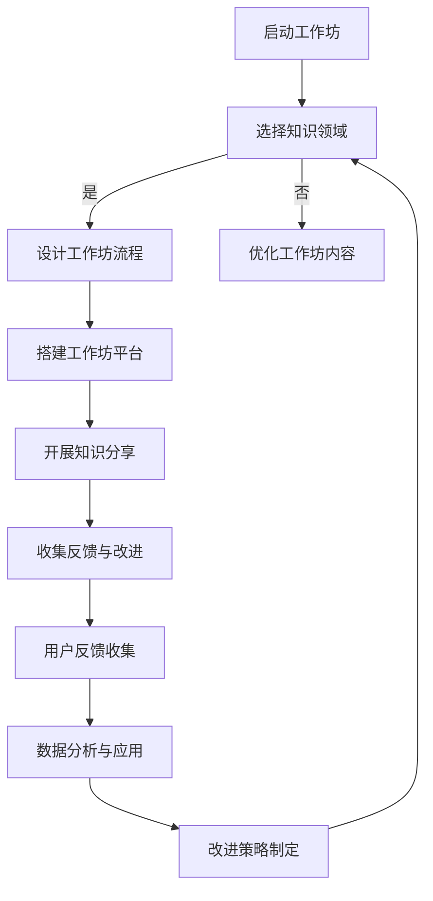

                 

# 《程序员知识付费：打造工作坊模式》

> **关键词**：程序员，知识付费，工作坊模式，技术培训，在线教育

> **摘要**：
本文将探讨程序员如何利用知识付费和工作坊模式，提升个人技能并创造收入。通过分析知识付费的概念与价值、工作坊模式的概述、如何打造知识付费工作坊、案例解析和实战操作，为广大程序员提供一套完整的技术分享策略。

## 第一部分：知识付费与工作坊模式概述

### 1.1 知识付费的概念与价值

**1.1.1 知识付费的定义**

知识付费是指用户为了获取特定知识或技能，支付一定费用购买内容或服务的行为。在知识经济时代，知识付费已成为重要的商业模式，它为知识创造者提供了收入来源，同时也为知识需求者提供了更高效、个性化的学习方式。

**1.1.2 知识付费的优势**

- **效率提升**：知识付费模式可以让用户快速获取所需知识，避免无效学习时间。
- **个性化学习**：付费知识通常根据用户需求定制，满足个性化学习需求。
- **质量保障**：知识付费内容经过筛选，通常具有较高的质量，减少了用户的选择难度。
- **激励创造**：知识付费为知识创造者提供了经济激励，鼓励更多人投入到知识创造中。

**1.1.3 知识付费的市场现状与趋势**

随着互联网技术的不断发展，知识付费市场呈现出快速增长的趋势。根据市场调研数据显示，知识付费用户主要集中在20-40岁之间的白领阶层，他们对于专业技能提升、个人成长和兴趣爱好的需求强烈。此外，知识付费平台如知乎、得到、网易云课堂等，也在不断拓展课程内容，提高用户体验，以适应市场的需求变化。

### 1.2 工作坊模式介绍

**1.2.1 工作坊模式的定义**

工作坊模式是一种以实践为导向的学习模式，通过集中化的教学和互动环节，帮助学员掌握特定技能或知识。它通常包括课程讲解、实操练习、小组讨论、案例分析和答疑解惑等环节。

**1.2.2 工作坊模式的优势**

- **互动性强**：工作坊模式鼓励学员之间的互动，提高学习效果。
- **实操性强**：通过实操练习，学员能够更快地掌握技能。
- **针对性强**：工作坊内容通常针对特定技能或问题设计，实用性高。
- **氛围良好**：集中化的学习环境有助于学员保持专注和积极性。

**1.2.3 工作坊模式的应用场景**

- **技术培训**：如编程语言学习、软件测试技能提升等。
- **项目实践**：如项目管理、敏捷开发实践等。
- **职业规划**：如职业转型、职场技能提升等。
- **兴趣爱好**：如摄影、绘画等技能提升。

### 1.3 程序员知识付费与工作坊模式的结合

**1.3.1 知识付费对程序员的重要性**

对于程序员来说，知识付费是提升专业技能、保持市场竞争力的重要手段。通过付费学习，程序员可以快速掌握新技术、新工具，提升个人综合素质。

**1.3.2 工作坊模式在程序员知识付费中的应用**

- **在线工作坊**：通过在线平台开展实时互动的教学活动，学员可以随时随地参加学习。
- **实践导向**：工作坊模式强调实操练习，有助于程序员在实际工作中应用所学知识。
- **社群学习**：工作坊模式鼓励学员之间的互动，形成学习社群，共同进步。

### 1.4 结论

本文介绍了知识付费和工作坊模式的基本概念、优势以及市场现状，并探讨了程序员如何利用这些模式提升技能和收入。在接下来的部分，我们将详细讨论如何打造一个成功的知识付费工作坊。

## 第二部分：打造知识付费工作坊

### 2.1 选择合适的知识领域

**2.1.1 确定知识目标**

首先，程序员需要明确自己的知识目标和受众。例如，是希望提升编程技能、项目管理能力还是软件测试技巧。确定知识目标有助于后续内容的规划和设计。

**2.1.2 分析市场需求**

在确定了知识目标后，需要对市场需求进行分析。可以通过以下途径获取信息：

- **在线调研**：通过问卷调查、访谈等方式了解目标受众的需求。
- **数据分析**：利用现有的数据平台，分析同类知识付费产品的市场表现。
- **行业报告**：查阅相关行业报告，了解当前市场的热门方向。

**2.1.3 确定知识内容**

根据市场需求和自己的专业知识，确定工作坊的知识内容。内容应该具有实用性、系统性和层次性，能够帮助学员从基础知识到高级技能逐步提升。

### 2.2 设计工作坊流程

**2.2.1 制定工作坊大纲**

工作坊大纲是工作坊内容的骨架，需要明确每个环节的目标、内容和时间安排。以下是一个典型的工作坊大纲：

- **开场介绍**：介绍工作坊的目的、讲师和学员，建立良好的第一印象。
- **课程讲解**：讲解基础知识，让学员对整个工作坊有一个全面的了解。
- **实操练习**：通过实际操作，让学员掌握所学知识。
- **小组讨论**：鼓励学员分组讨论，分享经验和观点。
- **案例分析**：通过实际案例，让学员了解知识在实际工作中的应用。
- **答疑解惑**：解答学员在学习和实操中遇到的问题。
- **总结回顾**：对工作坊内容进行总结，帮助学员巩固所学知识。

**2.2.2 确定工作坊形式**

工作坊形式可以是线上或线下，根据学员分布和讲师资源进行选择。线上工作坊可以通过直播、录播等形式进行，线下工作坊则可以在会议厅、咖啡厅等场地举办。

**2.2.3 安排互动环节**

互动环节是工作坊的灵魂，可以通过以下方式增强互动：

- **提问环节**：鼓励学员提问，讲师进行解答。
- **小组活动**：设置小组任务，让学员在小组内合作完成任务。
- **讨论区**：设置在线讨论区，学员可以在课后继续交流。

### 2.3 搭建工作坊平台

**2.3.1 选择合适的平台**

搭建工作坊平台是开展工作的基础。选择平台时，需要考虑以下因素：

- **功能齐全**：平台需要具备课程发布、直播教学、互动交流、资料下载等功能。
- **用户友好**：平台界面需要简洁清晰，方便用户操作。
- **安全性**：平台需要保障用户数据和课程内容的保密性。
- **可扩展性**：平台需要具备良好的扩展性，能够适应未来业务的发展。

**2.3.2 平台功能与设置**

以下是工作坊平台需要具备的基本功能：

- **课程管理**：包括课程发布、更新、删除等功能。
- **直播教学**：支持实时直播，讲师可以在直播中互动答疑。
- **互动交流**：包括讨论区、问答功能，方便学员交流和提问。
- **资料下载**：提供课程资料下载功能，方便学员学习。
- **用户管理**：包括用户注册、登录、权限管理等功能。

**2.3.3 用户注册与认证**

用户注册与认证是保障平台安全的重要环节。平台需要设置以下功能：

- **用户注册**：用户可以通过邮箱、手机号等多种方式注册。
- **身份认证**：对于付费课程，需要设置身份认证机制，确保学员身份真实。
- **权限管理**：根据用户身份，设置不同的权限，如讲师、管理员、学员等。

### 2.4 开展知识分享

**2.4.1 准备课件与资料**

开展知识分享前，需要准备课件和资料。课件应包括：

- **PPT或Markdown文档**：用于讲解课程内容。
- **代码示例**：提供实际操作的代码，帮助学员理解。
- **案例资料**：提供实际案例，帮助学员了解知识在实际工作中的应用。

**2.4.2 开展在线授课**

在线授课可以通过直播或录播方式进行。以下是授课过程中需要注意的几点：

- **互动引导**：通过提问、讨论等方式，引导学员参与。
- **内容讲解**：讲解过程中，注重知识点之间的联系，帮助学员构建知识体系。
- **实战演示**：通过实际操作，演示如何应用所学知识。
- **答疑解惑**：及时解答学员的问题，确保学员理解。

**2.4.3 互动与答疑**

互动与答疑是工作坊的重要组成部分。以下是一些建议：

- **在线问答**：设置在线问答环节，学员可以在课后继续提问。
- **讨论区**：设置讨论区，学员可以在课后继续交流。
- **定期直播**：定期组织直播，解答学员在学习和应用过程中遇到的问题。

### 2.5 收集反馈与改进

**2.5.1 用户反馈收集**

用户反馈是改进工作坊的重要依据。可以通过以下方式收集用户反馈：

- **问卷调查**：在课程结束后，通过问卷调查收集用户意见。
- **在线问答**：在问答环节，收集学员的问题和建议。
- **讨论区**：在讨论区，关注学员的讨论内容和反馈。

**2.5.2 数据分析与应用**

通过对用户反馈的数据分析，可以了解学员对课程内容的满意度、学习效果等。以下是一些建议：

- **满意度分析**：分析学员的满意度，了解课程的优点和不足。
- **学习效果分析**：通过测试成绩、实际应用反馈等，分析学员的学习效果。
- **改进策略**：根据分析结果，制定改进策略，如调整课程内容、增加实操环节等。

**2.5.3 工作坊改进策略**

根据用户反馈和分析结果，可以采取以下改进策略：

- **优化课程内容**：删除冗余内容，增加实用性强、学员感兴趣的内容。
- **提高互动性**：增加互动环节，提高学员参与度。
- **加强实战练习**：增加实战练习，帮助学员更好地掌握技能。
- **完善答疑机制**：建立完善的答疑机制，确保学员的问题能够得到及时解答。

### 2.6 总结

在本部分，我们详细介绍了如何选择合适的知识领域、设计工作坊流程、搭建工作坊平台、开展知识分享以及收集反馈和改进。通过以上步骤，程序员可以打造一个成功的知识付费工作坊，帮助自己提升技能和收入。在下一部分，我们将通过案例解析和实战操作，进一步探讨如何实施知识付费工作坊。

## 第三部分：案例解析与实战操作

### 3.1 知识付费工作坊案例解析

为了更好地理解如何打造和运营一个知识付费工作坊，我们可以通过以下几个实际案例来进行分析。

#### 3.1.1 案例一：编程语言入门工作坊

**案例背景**：某知名在线教育平台开设了一门名为“Python编程语言入门”的知识付费工作坊，面向编程初学者。

**课程内容**：
- **第一周**：Python基础语法、数据类型和流程控制。
- **第二周**：函数、模块和文件操作。
- **第三周**：面向对象编程基础。
- **第四周**：实战项目：制作一个简单的博客系统。

**教学方式**：
- **直播授课**：每周一次直播课程，讲师讲解理论知识和实际操作。
- **互动环节**：课后设有答疑时间，学员可以在直播中提问。
- **小组讨论**：学员分成小组，进行每周一次的小组讨论。

**学员反馈**：学员普遍反映课程内容实用，互动性强，实战项目有助于巩固所学知识。

**案例分析**：这个工作坊的成功之处在于：
- **内容实用**：课程内容紧密贴合学员需求，实用性强。
- **互动性**：通过直播授课和互动环节，提高了学员的学习积极性。
- **实战项目**：通过实际项目操作，帮助学员将所学知识应用于实际工作。

#### 3.1.2 案例二：软件测试技能提升工作坊

**案例背景**：某软件测试公司针对在职软件测试工程师开设了“软件测试技能提升”工作坊，旨在帮助学员提升测试技能和职业素养。

**课程内容**：
- **第一周**：测试基础知识和测试用例设计。
- **第二周**：自动化测试工具和脚本编写。
- **第三周**：性能测试和负载测试。
- **第四周**：测试管理和测试文档编写。

**教学方式**：
- **录播课程**：学员可以随时观看录播课程，自主学习。
- **在线答疑**：每周安排答疑时间，讲师在线解答学员问题。
- **实践作业**：学员每周完成指定的实践作业，讲师进行点评。

**学员反馈**：学员对录播课程的灵活性和答疑环节的及时性表示满意，实践作业有助于提高实际操作能力。

**案例分析**：这个工作坊的成功之处在于：
- **灵活学习**：录播课程让学员可以自由安排学习时间，提高了学习效率。
- **实时答疑**：在线答疑环节确保了学员在学习过程中遇到问题时能够及时解决。
- **实践作业**：通过实践作业，学员能够将所学知识应用到实际工作中。

#### 3.1.3 案例三：项目管理实践工作坊

**案例背景**：某知名互联网公司针对新入职的项目经理开设了“项目管理实践工作坊”，帮助项目经理提升项目管理能力。

**课程内容**：
- **第一周**：项目管理的核心概念和流程。
- **第二周**：项目计划和资源分配。
- **第三周**：项目监控和风险管理。
- **第四周**：项目总结和团队协作。

**教学方式**：
- **工作坊形式**：通过集中化的工作坊形式，进行互动学习和实践。
- **案例分析**：结合实际案例，进行深入分析和讨论。
- **团队协作**：学员分组进行项目模拟，进行实战演练。

**学员反馈**：学员对工作坊的实战性表示赞赏，认为通过实际操作，能够更好地理解和应用项目管理知识。

**案例分析**：这个工作坊的成功之处在于：
- **实战性强**：通过实际操作和团队协作，学员能够更好地理解和掌握项目管理技能。
- **互动学习**：通过案例分析和团队讨论，提高了学员的学习兴趣和参与度。
- **系统化学习**：从基础知识到实际操作，课程内容系统化，有助于学员建立完整的知识体系。

### 3.2 实战操作指南

#### 3.2.1 工作坊环境搭建

**3.2.1.1 开发环境配置**

在搭建工作坊环境时，首先需要配置开发环境。以下是一个基本的开发环境配置流程：

1. **安装Python**：从Python官方网站下载并安装Python。
2. **安装IDE**：选择一款合适的集成开发环境（如PyCharm、VSCode），安装并配置。
3. **安装相关库**：根据课程需求，安装相应的Python库，如NumPy、Pandas等。

**3.2.1.2 网络环境优化**

为了确保工作坊的顺利开展，需要优化网络环境。以下是一些优化建议：

1. **带宽提升**：确保网络带宽充足，避免直播授课过程中出现卡顿。
2. **网络稳定性**：选择稳定可靠的网络服务提供商，确保网络连接稳定。
3. **CDN加速**：利用CDN（内容分发网络）技术，提高视频加载速度。

**3.2.1.3 数据存储与管理**

对于工作坊产生的数据，需要进行有效的存储和管理。以下是一些建议：

1. **云存储服务**：使用云存储服务（如阿里云、腾讯云），确保数据安全可靠。
2. **数据库搭建**：搭建合适的数据库系统（如MySQL、MongoDB），存储学员数据、课程数据等。
3. **数据备份**：定期进行数据备份，防止数据丢失。

#### 3.2.2 源代码详细实现

**3.2.2.1 教学课件制作**

制作教学课件是知识付费工作坊的重要组成部分。以下是一个基本的课件制作流程：

1. **内容规划**：根据课程大纲，确定课件内容。
2. **PPT制作**：使用PPT或其他演示工具，制作课件。
3. **Markdown文档**：使用Markdown格式，编写课件文档，便于在线发布和更新。

**3.2.2.2 互动环节开发**

互动环节是工作坊的重要特点，以下是一个基本的互动环节开发流程：

1. **需求分析**：分析互动环节的需求，确定功能点。
2. **功能设计**：设计互动环节的界面和功能。
3. **前端开发**：使用HTML、CSS和JavaScript，实现前端功能。
4. **后端开发**：使用Python、Node.js等后端技术，实现后端功能。

**3.2.2.3 用户反馈系统搭建**

用户反馈系统是收集学员反馈的重要工具，以下是一个基本的用户反馈系统搭建流程：

1. **需求分析**：分析用户反馈系统的需求，确定功能点。
2. **功能设计**：设计用户反馈系统的界面和功能。
3. **前端开发**：使用HTML、CSS和JavaScript，实现前端功能。
4. **后端开发**：使用Python、Node.js等后端技术，实现后端功能。
5. **数据库搭建**：搭建数据库系统，存储反馈数据。

#### 3.2.3 代码解读与分析

**3.2.3.1 代码结构分析**

代码结构分析是理解项目代码的重要步骤，以下是一个基本的代码结构分析流程：

1. **项目结构梳理**：梳理项目目录结构，了解各个模块的功能。
2. **模块功能分析**：分析各个模块的功能和实现方式。
3. **代码逻辑分析**：分析代码逻辑，了解程序的运行流程。

**3.2.3.2 关键代码解读**

关键代码解读是深入理解项目代码的核心，以下是一个基本的关键代码解读流程：

1. **代码注释分析**：分析代码注释，了解代码的功能和实现细节。
2. **代码逻辑分析**：分析代码逻辑，理解程序的运行过程。
3. **代码优化建议**：根据代码分析结果，提出代码优化建议。

**3.2.3.3 代码优化建议**

代码优化是提升项目性能和可维护性的重要手段，以下是一个基本的代码优化建议流程：

1. **性能分析**：分析代码的性能瓶颈，找出需要优化的部分。
2. **代码重构**：根据性能分析结果，对代码进行重构。
3. **代码审查**：邀请其他开发者对代码进行审查，提出优化建议。

### 3.3 实战操作案例

为了更好地展示如何进行实战操作，以下是一个具体的工作坊实战操作案例。

**案例背景**：某在线教育平台开设了一门“Java编程基础”工作坊，面向编程初学者。

**课程内容**：
- **第一周**：Java基础语法、数据类型和流程控制。
- **第二周**：面向对象编程基础。
- **第三周**：异常处理和集合框架。

**教学方式**：
- **直播授课**：每周一次直播课程，讲师讲解理论知识和实际操作。
- **课后练习**：学员根据课程内容，完成课后练习。
- **小组讨论**：学员分成小组，进行每周一次的小组讨论。

**实战操作流程**：

**1. 开发环境搭建**

- **安装JDK**：从Oracle官方网站下载并安装JDK。
- **配置环境变量**：配置JAVA_HOME和PATH环境变量。
- **验证安装**：运行`java -version`命令，验证JDK安装成功。

**2. 制作教学课件**

- **规划内容**：根据课程大纲，编写课件内容。
- **PPT制作**：使用Microsoft PowerPoint制作PPT课件。
- **Markdown文档**：使用Markdown格式，编写课件文档。

**3. 编写示例代码**

- **创建项目**：使用Eclipse创建Java项目。
- **编写代码**：根据课程内容，编写示例代码。
- **代码注释**：在代码中添加注释，解释代码功能。

**4. 开设直播课程**

- **准备素材**：准备好课件、代码示例等教学素材。
- **直播授课**：在直播平台上进行授课，实时讲解和互动。
- **录播课程**：将直播课程录制成视频，供学员观看。

**5. 收集学员反馈**

- **问卷调查**：在课程结束后，通过问卷调查收集学员反馈。
- **在线问答**：在问答环节，收集学员的问题和建议。
- **讨论区**：在讨论区，关注学员的讨论内容和反馈。

**6. 持续改进**

- **分析反馈**：分析学员反馈，了解课程优缺点。
- **优化内容**：根据分析结果，优化课程内容和教学方法。
- **持续更新**：定期更新课程内容，保持课程的新鲜感和实用性。

### 3.4 总结

在本部分，我们通过实际案例和实战操作，详细解析了如何打造和运营一个知识付费工作坊。通过以上步骤，程序员可以有效地开展知识分享，提升个人技能和职业发展。在下一部分，我们将进一步探讨如何利用数据和技术手段，提升知识付费工作坊的运营效果。

## 第四部分：数据驱动与优化策略

### 4.1 数据分析的重要性

数据分析是知识付费工作坊运营过程中至关重要的一环。通过数据分析，可以深入了解学员的学习行为、课程效果和用户满意度，从而为工作坊的优化提供数据支持。

**4.1.1 学员行为分析**

学员行为分析包括学员在平台上的学习轨迹、课程完成情况、互动参与度等。以下是一些关键指标：

- **学习轨迹**：记录学员在平台上的登录时间、学习时长、课程进度等。
- **课程完成情况**：统计学员完成课程的情况，包括完成率、完成时间等。
- **互动参与度**：分析学员在讨论区、问答环节的互动情况，包括发帖数量、回复数量等。

**4.1.2 课程效果分析**

课程效果分析旨在评估工作坊的教学质量和效果。以下是一些关键指标：

- **学员满意度**：通过问卷调查、用户反馈等方式，收集学员对课程的满意度评分。
- **学习成果**：通过测试、项目提交等方式，评估学员的学习成果。
- **课程完成率**：统计学员完成课程的比率，评估课程的吸引力。

**4.1.3 用户满意度分析**

用户满意度分析是工作坊优化的重要依据。以下是一些关键指标：

- **课程评分**：学员对课程的评分，包括总体评分和各项指标的评分。
- **用户评论**：学员对课程的评论和反馈，了解用户的真实感受。
- **问题反馈**：收集学员在学习过程中遇到的问题和困难，及时进行解决。

### 4.2 数据分析工具与技巧

**4.2.1 数据分析工具**

以下是一些常用的数据分析工具：

- **Google Analytics**：用于网站和用户行为分析。
- **Tableau**：用于数据可视化和报表生成。
- **Python数据分析库**：如Pandas、NumPy、Matplotlib等，用于数据处理和分析。
- **SQL**：用于数据库查询和数据分析。

**4.2.2 数据分析技巧**

以下是一些数据分析的技巧：

- **数据清洗**：确保数据质量，去除无效数据和处理缺失值。
- **数据可视化**：通过图表和图形，直观展示数据趋势和关系。
- **特征工程**：选择和构建有效的特征，提高模型的预测能力。
- **假设检验**：通过统计方法，验证数据分析结果的可靠性。

### 4.3 数据驱动的工作坊优化策略

**4.3.1 优化课程内容**

根据数据分析结果，对课程内容进行调整和优化。以下是一些建议：

- **增加热门话题**：根据学员的学习轨迹和互动参与度，增加热门话题和实用技能。
- **优化课程结构**：调整课程章节和内容顺序，提高学习效率。
- **课程更新**：定期更新课程内容，保持课程的新鲜感和实用性。

**4.3.2 提高互动参与度**

通过数据分析和互动策略，提高学员的互动参与度。以下是一些建议：

- **互动环节设计**：根据学员的需求和行为，设计有趣的互动环节。
- **奖励机制**：设置积分、奖品等激励机制，鼓励学员积极参与互动。
- **反馈机制**：建立及时反馈机制，让学员在学习过程中能够得到及时帮助和指导。

**4.3.3 提升用户满意度**

通过数据分析和用户反馈，提升用户满意度。以下是一些建议：

- **满意度调查**：定期进行满意度调查，收集学员的意见和建议。
- **个性化推荐**：根据学员的学习行为和偏好，推荐适合的课程和资源。
- **用户关怀**：通过私信、邮件等方式，与学员保持互动，提供学习支持和帮助。

### 4.4 总结

数据分析是知识付费工作坊优化的重要手段。通过数据驱动，可以不断提升课程质量、互动参与度和用户满意度，从而实现工作坊的可持续发展。在下一部分，我们将进一步探讨如何利用技术创新，提升知识付费工作坊的运营效率。

## 第五部分：技术创新与工作坊提升

### 5.1 技术创新的重要性

在现代教育环境中，技术创新对于提升知识付费工作坊的运营效率和质量具有重要意义。通过技术创新，可以优化学习体验、增强互动性、提高教学效果，从而实现工作坊的可持续发展。

**5.1.1 技术创新在教育领域的应用**

以下是一些技术创新在教育领域的应用：

- **人工智能与大数据分析**：通过人工智能和大数据技术，实现个性化教学、智能推荐、学习行为分析等。
- **虚拟现实与增强现实**：通过VR/AR技术，提供沉浸式学习体验，提高学习效果。
- **区块链**：利用区块链技术，确保学习数据的真实性、可靠性和安全性。
- **云计算**：通过云计算技术，实现教育资源的灵活分配和高效管理。

**5.1.2 技术创新对工作坊的积极影响**

技术创新对知识付费工作坊的积极影响体现在以下几个方面：

- **个性化学习**：通过大数据分析和人工智能技术，为学员提供个性化学习路径和资源，提高学习效率。
- **增强互动性**：通过VR/AR技术，实现线上线下互动，增强学员之间的交流与合作。
- **教学质量提升**：通过实时数据分析和智能推荐，帮助讲师及时调整教学策略，提高教学质量。
- **学习体验优化**：通过技术创新，提升学习体验，增加学员的参与度和满意度。

### 5.2 技术创新在工作坊中的具体应用

**5.2.1 人工智能与大数据分析**

- **个性化学习路径**：通过分析学员的学习行为和兴趣偏好，为学员推荐适合的学习路径和课程。
- **学习效果评估**：通过实时数据采集和分析，评估学员的学习效果，为讲师提供改进建议。
- **智能问答系统**：利用自然语言处理技术，构建智能问答系统，帮助学员解决学习过程中的问题。

**5.2.2 虚拟现实与增强现实**

- **沉浸式学习体验**：通过VR/AR技术，为学员提供沉浸式的学习体验，提高学习兴趣和参与度。
- **实践操作模拟**：通过虚拟实验室，模拟真实操作环境，让学员在虚拟世界中练习和实践。
- **线上实训**：利用VR/AR技术，实现线上实训，提高学员的动手能力和实践技能。

**5.2.3 区块链**

- **学习认证**：利用区块链技术，为学员的学习过程和成绩提供真实、不可篡改的认证。
- **数据安全**：通过区块链技术，确保学习数据的安全性和隐私性。
- **版权保护**：利用区块链技术，保护知识付费内容创作者的版权。

**5.2.4 云计算**

- **资源弹性分配**：通过云计算技术，实现教育资源的弹性分配，满足不同规模和类型的工作坊需求。
- **平台稳定性**：利用云计算的分布式架构，提高工作坊平台的稳定性和可用性。
- **数据分析与存储**：通过云计算平台，实现大规模数据的存储和分析，为工作坊运营提供数据支持。

### 5.3 技术创新案例

**5.3.1 案例一：基于大数据分析的个性化学习工作坊**

某在线教育平台推出了一款基于大数据分析的个性化学习工作坊。通过分析学员的学习行为、兴趣偏好和成绩，平台为每位学员推荐最适合的学习路径和课程。同时，平台还利用自然语言处理技术，构建智能问答系统，帮助学员解决学习过程中遇到的问题。这一创新举措极大地提高了学员的学习效果和满意度。

**5.3.2 案例二：利用VR/AR技术的编程工作坊**

某编程教育机构推出了一款利用VR/AR技术的编程工作坊。通过VR/AR技术，学员可以在虚拟实验室中进行编程实践，模拟真实操作环境，提高动手能力和实践技能。此外，工作坊还设置了在线讨论区，学员可以在虚拟实验室中与其他学员互动交流，分享学习心得。这一创新举措不仅提高了学员的学习兴趣和参与度，还增强了学员之间的合作与交流。

**5.3.3 案例三：区块链学习认证工作坊**

某知名大学推出了一款区块链学习认证工作坊。通过区块链技术，大学为每位学员的学习过程和成绩提供真实、不可篡改的认证。学员可以随时查看自己的学习进度和成绩，确保数据的真实性和公正性。此外，区块链技术还用于保护知识付费内容创作者的版权，确保创作者的权益得到充分保障。这一创新举措增强了学员对学习成果的信任度，提高了知识付费工作坊的公信力。

### 5.4 技术创新带来的挑战与应对策略

尽管技术创新为知识付费工作坊带来了诸多优势，但也面临一定的挑战。以下是一些常见的挑战及应对策略：

**5.4.1 技术成本与投入**

技术创新需要较高的成本投入，包括硬件设备、软件平台、技术人才等。应对策略：

- **分阶段投入**：根据工作坊的实际情况，分阶段进行技术创新投入，逐步实现技术升级。
- **合作开发**：与科技公司、教育机构等合作，共同分担技术成本，实现资源共享。

**5.4.2 技术安全与隐私保护**

技术创新可能涉及学员数据的收集、存储和处理，需要确保数据的安全性和隐私保护。应对策略：

- **数据加密**：采用加密技术，确保数据在传输和存储过程中的安全性。
- **隐私保护政策**：制定明确的隐私保护政策，告知学员数据的使用范围和保护措施。

**5.4.3 技术适应性与普及性**

不同地区和学员群体对技术的适应性和普及程度存在差异，需要确保技术创新的适应性和普及性。应对策略：

- **技术培训**：为学员提供技术培训，帮助其适应新技术。
- **多语言支持**：开发多语言版本的工作坊平台，满足不同地区学员的需求。

### 5.5 总结

技术创新是提升知识付费工作坊运营效率和质量的重要手段。通过人工智能、大数据分析、虚拟现实、增强现实、区块链和云计算等技术创新，可以优化学习体验、增强互动性、提高教学质量，从而实现工作坊的可持续发展。在下一部分，我们将探讨如何建立有效的知识付费工作坊生态系统，进一步推动程序员知识付费的发展。

## 第六部分：建立知识付费工作坊生态系统

### 6.1 生态系统概述

建立知识付费工作坊生态系统是提升程序员技能和收入的重要策略。一个完善的生态系统包括课程内容、讲师团队、学员社区、技术平台等组成部分，通过各部分的协同作用，实现知识的有效传递和价值的最大化。

**6.1.1 课程内容**

课程内容是知识付费工作坊的核心，应该具备以下特点：

- **针对性**：根据市场需求和学员需求，设计有针对性的课程。
- **实用性**：课程内容应该紧密贴合实际工作，帮助学员解决实际问题。
- **系统性**：课程应该具有系统性，从基础知识到高级技能逐步提升。

**6.1.2 讲师团队**

讲师团队是知识付费工作坊的重要支撑。一个优秀的讲师团队应该具备以下特点：

- **专业背景**：讲师应该具有丰富的行业经验和深厚的专业知识。
- **教学能力**：讲师应该具备良好的教学能力，能够将复杂的技术知识讲解得通俗易懂。
- **创新能力**：讲师应该具备创新能力，能够不断更新课程内容和教学方法。

**6.1.3 学员社区**

学员社区是知识付费工作坊的重要组成部分，通过学员之间的互动和交流，可以实现知识的共享和技能的提升。学员社区应该具备以下特点：

- **开放性**：社区应该开放给所有学员，鼓励学员积极参与。
- **互动性**：社区应该设置多种互动形式，如讨论区、问答环节等。
- **互助性**：社区应该鼓励学员之间的互助合作，共同进步。

**6.1.4 技术平台**

技术平台是知识付费工作坊的基石，应该具备以下特点：

- **稳定性**：平台应该具备良好的稳定性，确保教学过程的顺畅。
- **安全性**：平台应该具备数据安全保护机制，确保学员和讲师的信息安全。
- **灵活性**：平台应该具备灵活性，能够适应不同规模和类型的工作坊需求。

### 6.2 生态系统构建策略

**6.2.1 课程内容构建**

构建课程内容需要遵循以下策略：

- **需求分析**：通过市场调研和学员反馈，了解学员的需求和痛点。
- **内容设计**：根据需求分析结果，设计具有针对性的课程内容。
- **迭代优化**：根据学员反馈和市场需求，不断迭代和优化课程内容。

**6.2.2 讲师团队建设**

建设讲师团队需要遵循以下策略：

- **选拔标准**：明确讲师选拔标准，包括专业背景、教学能力、创新能力等。
- **培训机制**：为讲师提供定期培训，提升其教学能力和专业素养。
- **激励机制**：建立激励机制，鼓励讲师持续创新和提升教学水平。

**6.2.3 学员社区管理**

管理学员社区需要遵循以下策略：

- **社区文化**：建立积极向上的社区文化，鼓励学员积极参与和分享。
- **互动机制**：设置多种互动形式，如讨论区、问答环节等，提高学员的互动积极性。
- **互助合作**：鼓励学员之间的互助合作，共同进步。

**6.2.4 技术平台优化**

优化技术平台需要遵循以下策略：

- **稳定性保障**：通过技术手段，保障平台的稳定性和安全性。
- **功能扩展**：根据工作坊需求，不断扩展平台功能，提升用户体验。
- **技术更新**：紧跟技术发展趋势，及时更新平台技术，提升平台竞争力。

### 6.3 生态系统运营策略

**6.3.1 内容更新策略**

为了保持知识付费工作坊的活力，需要定期更新课程内容。以下是一些内容更新策略：

- **持续跟踪**：持续跟踪行业动态和新技术，确保课程内容与时俱进。
- **学员反馈**：收集学员的反馈和建议，及时调整和优化课程内容。
- **讲师协作**：鼓励讲师之间协作，共同开发新的课程内容。

**6.3.2 用户增长策略**

为了吸引更多学员加入知识付费工作坊，需要采取有效的用户增长策略。以下是一些用户增长策略：

- **口碑营销**：通过优秀的教学质量和学员口碑，吸引更多学员加入。
- **合作伙伴**：与行业内的其他机构和组织合作，共同推广知识付费工作坊。
- **线上线下结合**：结合线上线下渠道，提高知识付费工作坊的知名度和影响力。

**6.3.3 社群管理策略**

为了保持学员社区的活跃度，需要采取有效的社群管理策略。以下是一些社群管理策略：

- **社区运营**：建立专业的社区运营团队，负责社区的管理和运营。
- **活动策划**：定期举办线上线下活动，激发学员的参与热情。
- **互动激励**：通过积分、奖品等激励措施，鼓励学员积极参与社区互动。

### 6.4 总结

建立知识付费工作坊生态系统是提升程序员技能和收入的重要策略。通过构建课程内容、讲师团队、学员社区和技术平台，可以形成一个高效的知识传递和交流体系。在接下来的部分，我们将进一步探讨知识付费工作坊的未来发展趋势，以及程序员如何抓住机遇，实现职业发展。

## 第七部分：知识付费工作坊的未来发展趋势

### 7.1 趋势分析

随着互联网技术的不断进步和在线教育的快速发展，知识付费工作坊的未来发展趋势呈现出以下几个特点：

**7.1.1 技术驱动的个性化学习**

随着人工智能、大数据分析等技术的发展，知识付费工作坊将能够更精准地满足学员的需求，实现个性化学习。通过分析学员的学习行为、兴趣偏好和成绩，平台可以提供定制化的学习路径和资源，提高学习效果。

**7.1.2 互动性和沉浸式体验的提升**

虚拟现实（VR）和增强现实（AR）技术的发展，将使得知识付费工作坊的互动性和沉浸式体验得到大幅提升。通过VR/AR技术，学员可以在虚拟环境中进行实践操作，体验更为真实的场景，增强学习效果。

**7.1.3 知识付费的多样化**

随着市场的不断成熟，知识付费将呈现出多样化的趋势。除了传统的在线课程外，还将涌现出更多形式的知识付费产品，如付费直播讲座、一对一辅导、项目实战等，满足不同层次和需求的学员。

**7.1.4 社交属性的增强**

知识付费工作坊将越来越注重社交属性，通过构建学习社区，鼓励学员之间的互动和合作。社交属性将有助于提高学员的学习积极性和参与度，形成良好的学习氛围。

### 7.2 对程序员职业发展的启示

**7.2.1 提升专业技能**

知识付费工作坊为程序员提供了一个持续学习和提升专业技能的平台。通过参与工作坊，程序员可以及时掌握最新的技术动态和实用技能，提升自己的竞争力。

**7.2.2 建立个人品牌**

通过在知识付费工作坊中分享自己的经验和知识，程序员可以建立自己的个人品牌。个人品牌的建立有助于提高在职场中的知名度和影响力，为职业发展带来更多机会。

**7.2.3 创业和合作**

知识付费工作坊为程序员提供了一个创业和合作的平台。通过开发和运营知识付费产品，程序员可以创造收入来源，实现职业发展的新突破。同时，与同行合作，可以共同开发更多优质的知识付费产品，实现共赢。

**7.2.4 社交网络扩展**

知识付费工作坊中的社交互动有助于程序员扩展社交网络。通过参与讨论、交流经验和合作项目，程序员可以结识更多的同行，建立良好的合作关系，为职业发展提供支持。

### 7.3 未来展望

随着技术的不断进步和市场的不断成熟，知识付费工作坊将在未来发挥更为重要的作用。程序员需要紧跟行业发展趋势，不断提升自己的专业技能和综合素质，抓住知识付费工作坊带来的机遇，实现职业发展的新突破。

### 7.4 总结

知识付费工作坊的未来发展趋势将更加注重个性化学习、互动性和沉浸式体验，以及社交属性的增强。程序员可以通过参与知识付费工作坊，提升专业技能，建立个人品牌，实现创业和合作，扩展社交网络，抓住职业发展的机遇。

## 结尾：程序员知识付费工作坊的展望

### 7.5 知识付费工作坊的展望

知识付费工作坊作为一种新型的学习模式，正日益受到程序员的青睐。它不仅为程序员提供了丰富的学习资源和互动平台，还为他们创造了一个实践和交流的空间。随着技术的不断进步和在线教育的蓬勃发展，知识付费工作坊的未来充满了无限可能。

首先，知识付费工作坊将更加注重个性化学习。通过大数据分析和人工智能技术，工作坊可以更好地了解学员的需求和兴趣，提供个性化的学习路径和资源，提高学习效果。

其次，互动性和沉浸式体验将得到进一步提升。虚拟现实（VR）和增强现实（AR）技术的应用，将让学员在虚拟环境中进行实践操作，体验更为真实的场景，增强学习效果。

此外，知识付费工作坊的社交属性也将得到增强。通过构建学习社区，学员可以更方便地与他人互动和交流，分享经验和知识，形成良好的学习氛围。

最后，知识付费工作坊将为程序员提供更多创业和合作的机会。通过开发和运营知识付费产品，程序员可以创造收入来源，实现职业发展的新突破。

总之，知识付费工作坊作为一种创新的学习模式，具有巨大的发展潜力和广阔的市场前景。程序员应当积极抓住这一机遇，不断提升自己的专业技能和综合素质，为自己的职业发展开辟新的道路。

### 致谢

在撰写本文的过程中，我得到了许多同事和朋友的帮助和支持。首先，感谢AI天才研究院的全体成员，他们的专业知识和实践经验为本文的撰写提供了宝贵的参考。其次，感谢我的家人和朋友，他们在我的学习和写作过程中给予了我无尽的支持和鼓励。最后，感谢每一位读者，是你们的关注和反馈让我不断进步，不断成长。

**作者：AI天才研究院/AI Genius Institute & 禅与计算机程序设计艺术 /Zen And The Art of Computer Programming**

----------------------------------------------------------------

### 附录

#### 4.1 常用工具与资源

**4.1.1 知识付费平台推荐**
- 知乎：一个问答社区平台，提供丰富的付费内容。
- 得到：提供个性化订阅课程，涵盖多个领域。
- 网易云课堂：提供在线课程学习，适合技能提升。

**4.1.2 开发工具与插件**
- PyCharm：一款功能强大的Python IDE。
- Visual Studio Code：一款轻量级的跨平台IDE。
- Jupyter Notebook：用于数据科学和机器学习的交互式环境。

**4.1.3 学习资源与参考资料**
- Coursera：提供大量在线课程，涵盖计算机科学、人工智能等领域。
- Medium：一个内容分享平台，有许多技术文章和博客。
- GitHub：一个代码托管平台，可以查找和学习开源项目。

#### 4.2 工作坊模式流程图

**4.2.1 工作坊流程图（Mermaid格式）**

#### 4.3 数学模型与公式

**4.3.1 用户参与度模型**

$$
用户参与度 = f(\text{互动次数}, \text{满意度}, \text{知识获取量})
$$

**4.3.2 知识获取量计算公式**

$$
知识获取量 = \sum_{i=1}^{n} \text{知识模块得分} \times \text{参与度权重}
$$

以上附录内容为本文提供了实用的工具和参考资料，以及详细的流程图和数学模型，希望对读者在打造知识付费工作坊时有所帮助。**作者：AI天才研究院/AI Genius Institute & 禅与计算机程序设计艺术 /Zen And The Art of Computer Programming**

