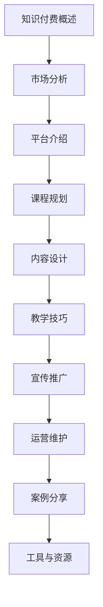

                 

### 《程序员知识付费：打造问答课程》

> **关键词**：知识付费、程序员、问答课程、平台选择、教学技巧、案例分析、工具资源

> **摘要**：本文将深入探讨程序员如何通过打造问答课程参与知识付费市场。我们将从市场分析、平台选择、课程设计、教学技巧、宣传推广和实战案例等多个方面，为程序员提供全方位的指导，帮助他们在知识付费领域获得成功。

### 《程序员知识付费：打造问答课程》目录大纲

---

### 第一部分：知识付费概述

#### 第1章：知识付费市场分析

##### 1.1 知识付费的概念与现状
##### 1.2 知识付费市场的机遇与挑战
##### 1.3 程序员在知识付费市场的定位

#### 第2章：知识付费平台介绍

##### 2.1 主流知识付费平台
##### 2.2 程序员知识付费平台的特性
##### 2.3 平台选择与策略

### 第二部分：问答课程设计

#### 第3章：问答课程规划

##### 3.1 课程目标与定位
##### 3.2 课程内容设计
##### 3.3 课程时间规划

#### 第4章：问答课程内容设计

##### 4.1 知识点梳理
##### 4.2 问答形式与互动设计
##### 4.3 案例分析

#### 第5章：问答课程教学技巧

##### 5.1 教学方法选择
##### 5.2 问答引导技巧
##### 5.3 常见问题处理

#### 第6章：课程宣传与推广

##### 6.1 内容营销策略
##### 6.2 社交媒体推广
##### 6.3 合作伙伴选择

#### 第7章：问答课程运营与维护

##### 7.1 用户反馈与改进
##### 7.2 课程更新与迭代
##### 7.3 营销策略调整

### 第三部分：实战案例分享

#### 第8章：成功案例分析

##### 8.1 案例介绍
##### 8.2 案例分析
##### 8.3 案例启示

### 附录

#### 附录A：问答课程开发工具与资源

##### A.1 开发工具介绍
##### A.2 资源链接
##### A.3 开发指南

#### 附录B：问答课程设计流程图

---

**附录：Mermaid 流�程图**



**附录：问答课程内容设计伪代码**

```plaintext
function design_question_course(content, questions) {
    // 初始化课程内容
    course_content = initialize_course_content(content);

    // 遍历问题列表，添加到课程内容
    for (question in questions) {
        add_question_to_course(course_content, question);
    }

    // 设计问答互动
    interactive_asks = design_interactive_asks(course_content);

    return course_content, interactive_asks;
}

// 初始化课程内容
function initialize_course_content(content) {
    // 根据内容生成课程结构
    return course_structure;
}

// 添加问题到课程内容
function add_question_to_course(course_content, question) {
    // 将问题添加到课程内容中
    course_content.push(question);
}

// 设计问答互动
function design_interactive_asks(course_content) {
    // 根据课程内容设计问答互动
    interactive_asks = [];
    for (content in course_content) {
        interactive_asks.push(generate_interactive_ask(content));
    }
    return interactive_asks;
}

// 生成问答互动
function generate_interactive_ask(content) {
    // 根据内容生成问答互动
    return interactive_ask;
}
```

**附录：数学模型与公式**

$$
\text{用户满意度} = \frac{\text{用户获得的知识价值}}{\text{用户付出的代价}} + \text{用户对平台的信任度}
$$

- 用户满意度越高，课程越受欢迎。

**附录：项目实战**

- 开发环境搭建：
  - 安装问答课程平台所需的依赖库和框架。
  - 配置数据库，确保数据的存储和安全性。

- 源代码实现：
  - 课程内容管理系统的实现，包括课程内容的添加、修改、删除等功能。
  - 问答功能模块的开发，包括问题的提出、回答、评价等功能。

- 代码解读与分析：
  - 对关键代码进行解读，解释其实现原理和功能。
  - 分析代码的性能和优化可能性，提高课程平台的用户体验。

通过以上目录大纲，这本书将全面覆盖程序员知识付费领域，从市场分析到课程设计，再到实战案例，帮助读者深入了解和掌握知识付费的各个环节。

---

现在，我们将根据以上目录大纲，逐步深入分析每一个章节的内容。

## 第一部分：知识付费概述

### 第1章：知识付费市场分析

#### 1.1 知识付费的概念与现状

知识付费是指用户为获取有价值的信息、知识或技能而支付的费用。在互联网时代，知识付费逐渐成为一种重要的商业模式。知识付费的主要形式包括在线课程、电子书、问答咨询、付费专栏等。

目前，知识付费市场正处于快速发展阶段。根据数据显示，2020年中国知识付费市场规模已达到592亿元，预计未来几年仍将保持高速增长。知识付费市场的主要驱动力包括：

1. **信息过载**：互联网上的信息爆炸式增长，用户难以筛选有价值的内容。
2. **时间碎片化**：现代人的时间越来越碎片化，需要高效获取知识。
3. **自我提升需求**：人们越来越重视自我提升，愿意为知识投资。
4. **内容创作者的崛起**：越来越多的专业人才、行业专家投身知识付费领域。

#### 1.2 知识付费市场的机遇与挑战

知识付费市场提供了丰富的机遇，同时也存在一定的挑战。

**机遇：**

1. **用户需求旺盛**：随着社会进步和人们生活水平的提高，对知识的渴求愈发强烈。
2. **技术支持**：互联网、人工智能、大数据等技术的发展，为知识付费提供了强大的支持。
3. **市场细分**：知识付费市场逐渐细分，针对不同用户群体提供个性化服务。

**挑战：**

1. **内容质量参差不齐**：市场上存在大量质量低劣的内容，影响用户满意度。
2. **用户信任问题**：用户对知识付费平台的信任度不高，担心付费后得不到应有的价值。
3. **竞争激烈**：知识付费市场吸引了大量参与者，竞争日趋激烈。

#### 1.3 程序员在知识付费市场的定位

程序员在知识付费市场中具有重要的地位。一方面，程序员是技术知识的创造者和传播者；另一方面，程序员自身也有强烈的学习和分享需求。程序员在知识付费市场的定位包括：

1. **内容创作者**：程序员可以创作技术教程、编程课程、技术博客等，分享自己的知识和经验。
2. **咨询服务提供者**：程序员可以为其他程序员或企业提供技术咨询服务，解决实际问题。
3. **平台运营者**：程序员可以运营自己的知识付费平台，提供一站式服务。

### 第2章：知识付费平台介绍

#### 2.1 主流知识付费平台

当前，国内主流的知识付费平台包括：

1. **得到**：以专栏、课程、直播等形式提供知识服务，覆盖财经、管理、科技等多个领域。
2. **喜马拉雅**：主打音频课程，用户群体广泛，涵盖教育、生活、娱乐等多个方面。
3. **网易云课堂**：提供IT、语言、职业发展等领域的在线课程，用户主要集中在程序员群体。
4. **知乎**：以问答社区为基础，提供付费专栏、课程等服务，用户主要集中在专业人士。

#### 2.2 程序员知识付费平台的特性

程序员知识付费平台具有以下特性：

1. **技术导向**：平台内容以技术为主，包括编程语言、框架、算法等。
2. **实战性强**：平台课程注重实战操作，帮助程序员解决实际问题。
3. **互动性高**：平台提供问答、讨论等功能，促进程序员之间的交流与合作。

#### 2.3 平台选择与策略

程序员在选择知识付费平台时，可以从以下几个方面进行考虑：

1. **内容质量**：选择内容丰富、专业度高的平台，确保学习效果。
2. **用户体验**：考虑平台的界面设计、操作便捷性、学习氛围等因素。
3. **价格策略**：根据自身预算和需求，选择性价比高的课程或会员服务。
4. **互动与交流**：选择能够提供良好互动与交流的平台，促进知识共享与成长。

### 总结

知识付费市场为程序员提供了广阔的发展空间。通过分析市场现状、机遇与挑战，以及选择合适的知识付费平台，程序员可以更好地发挥自身优势，打造有影响力的问答课程，实现知识变现与自我提升。

接下来，我们将进入第二部分，探讨如何设计一款成功的问答课程。

---

在接下来的文章中，我们将继续探讨问答课程的设计与实施，包括课程规划、内容设计、教学技巧、宣传推广等方面。敬请期待。

