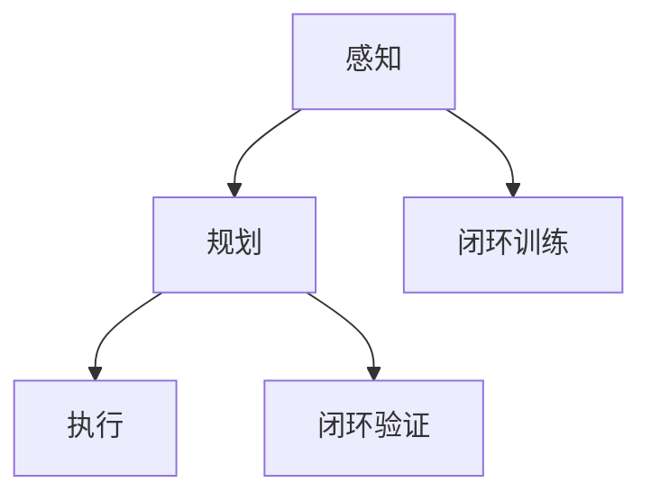

                 

### 《端到端自动驾驶的闭环训练与闭环验证》

> **关键词：** 端到端自动驾驶、闭环训练、闭环验证、强化学习、神经网络、数据预处理

> **摘要：** 本文将深入探讨端到端自动驾驶系统中的闭环训练与闭环验证技术。通过对核心概念、原理、方法以及实际应用场景的详细分析，文章旨在为自动驾驶系统的研发者提供理论与实践指导，确保自动驾驶技术的安全可靠与持续改进。

### 《端到端自动驾驶的闭环训练与闭环验证》目录大纲

#### 第一部分：端到端自动驾驶概述

#### 第1章：端到端自动驾驶基础  
- 1.1 端到端自动驾驶的定义与背景  
  - 自动驾驶的发展历程  
  - 端到端自动驾驶的优势与挑战  
- 1.2 自动驾驶技术框架  
  - 感知、规划、执行  
  - 端到端自动驾驶的核心模块  
- 1.3 自动驾驶系统的层次结构  
  - 低层次感知与决策  
  - 高层次决策与控制  
- 1.4 自动驾驶的技术分类  
  - 规则基础自动驾驶  
  - 感知+规划自动驾驶  
  - 端到端自动驾驶

#### 第2章：端到端自动驾驶的核心概念  
- 2.1 数据收集与处理  
  - 数据源选择  
  - 数据预处理方法  
- 2.2 神经网络与深度学习  
  - 神经网络基础  
  - 深度学习在自动驾驶中的应用  
- 2.3 强化学习与决策  
  - 强化学习基本原理  
  - 强化学习在自动驾驶中的应用  
- 2.4 机器学习模型评估  
  - 模型评估指标  
  - 评估方法与优化策略

#### 第二部分：闭环训练

#### 第3章：闭环训练原理与方法  
- 3.1 闭环训练的定义与意义  
  - 闭环训练与开放世界自动驾驶的关系  
  - 闭环训练的优势  
- 3.2 闭环训练框架  
  - 数据闭环训练  
  - 策略闭环训练  
  - 模型闭环训练  
- 3.3 闭环训练算法  
  - 监督学习  
  - 无监督学习  
  - 自监督学习  
- 3.4 闭环训练挑战与解决方案  
  - 数据集多样性  
  - 模型适应性

#### 第4章：闭环训练应用场景  
- 4.1 智能交通系统  
  - 交叉路口自动驾驶  
  - 高速公路自动驾驶  
- 4.2 城市环境自动驾驶  
  - 人流密集区域  
  - 狭小空间驾驶  
- 4.3 特殊场景自动驾驶  
  - 极端天气条件  
  - 施工区域驾驶

#### 第5章：闭环训练实验案例  
- 5.1 数据集介绍  
  - 公共数据集  
  - 特定场景数据集  
- 5.2 模型设计与实现  
  - 神经网络结构  
  - 强化学习算法实现  
- 5.3 实验结果分析  
  - 模型性能评估  
  - 面向不同场景的模型优化

#### 第三部分：闭环验证

#### 第6章：闭环验证概述  
- 6.1 闭环验证的重要性  
  - 闭环验证与自动驾驶安全性的关系  
  - 闭环验证的目标  
- 6.2 闭环验证方法  
  - 实验室测试  
  - 路测验证  
  - 集群测试  
- 6.3 闭环验证标准  
  - 安全性标准  
  - 性能标准

#### 第7章：闭环验证实施步骤  
- 7.1 验证计划制定  
  - 验证场景选择  
  - 验证指标设定  
- 7.2 验证实验执行  
  - 实验设备准备  
  - 数据采集与处理  
- 7.3 验证结果分析  
  - 数据分析  
  - 故障诊断  
- 7.4 验证报告撰写  
  - 验证过程记录  
  - 验证结果总结

#### 第8章：闭环验证案例分析  
- 8.1 案例介绍  
  - 实际自动驾驶项目  
  - 案例研究背景  
- 8.2 闭环验证实施过程  
  - 实验设计与执行  
  - 验证结果分析  
- 8.3 案例经验总结  
  - 验证过程中的挑战  
  - 挑战解决方案

#### 附录  
- 附录A：端到端自动驾驶常用工具与资源  
  - 开源框架  
  - 数据集资源  
  - 工具与平台介绍  
- 附录B：端到端自动驾驶学习资料推荐  
  - 科研论文  
  - 教材与参考书籍  
  - 线上课程与工作坊

### 梅里狄斯流程图：端到端自动驾驶技术框架



### 伪代码：基于强化学习的闭环训练算法

```python
function REINFORCE_Training(data):
    for each sample in data:
        perform action according to current policy
        observe reward and next state
        update Q-value using REINFORCE algorithm
        update policy using gradient ascent
    return trained model
```

### 数学模型：自动驾驶中的贝叶斯滤波

$$
\hat{x}_{k+1} = x_{k+1} | z_{k+1} = \frac{P(x_{k+1} | z_{k+1}) P(z_{k+1} | x_{k+1})}{P(z_{k+1})}
$$

### 数学公式解释与举例

#### 贝叶斯滤波在自动驾驶中的应用

贝叶斯滤波是一种利用先验概率和观测数据更新状态估计的方法。以下是一个简化的例子：

**例子：**
假设一个自动驾驶系统在某个时间段内，需要根据传感器数据更新对前方车辆位置和速度的估计。

- $x_{k+1}$: 前方车辆在时间 $k+1$ 的位置和速度状态向量。  
- $z_{k+1}$: 时间 $k+1$ 传感器观测到的数据。

**计算过程：**
1. 根据先验概率 $P(x_{k+1})$ 和运动模型预测前方车辆的状态。  
2. 利用观测数据 $z_{k+1}$ 和感知模型 $P(z_{k+1} | x_{k+1})$ 更新后验概率 $P(x_{k+1} | z_{k+1})$。

**解释：**
- $P(x_{k+1} | z_{k+1})$: 后验概率，反映了在观测数据 $z_{k+1}$ 的条件下，前方车辆状态 $x_{k+1}$ 的概率。  
- $P(z_{k+1} | x_{k+1})$: 感知模型，描述了给定前方车辆状态 $x_{k+1}$ 时，观测数据 $z_{k+1}$ 的概率。  
- $P(z_{k+1})$: 观测数据 $z_{k+1}$ 的总概率。

**计算步骤：**
1. 计算分子：$P(x_{k+1} | z_{k+1}) P(z_{k+1} | x_{k+1})$。  
2. 计算分母：$P(z_{k+1})$，这通常需要使用全概率公式进行计算。

**结果：**
贝叶斯滤波的结果 $\hat{x}_{k+1}$ 是一个更新的状态估计，该估计综合了先前的状态信息和新的观测数据，从而提高了自动驾驶系统的决策准确性。在实际应用中，这一过程是连续进行的，使得系统能够实时适应环境变化。

### 项目实战：端到端自动驾驶闭环训练与验证实战

**实战目标：**
本节将通过一个实际案例展示端到端自动驾驶的闭环训练与闭环验证流程，包括数据收集、模型训练、验证实验以及结果分析。

**实战步骤：**

**1. 数据收集：**
- 收集城市道路上的行车记录仪视频数据，包含车辆位置、速度、加速度等信息。
- 收集交通标志、道路标线等环境数据。

**2. 数据预处理：**
- 对视频数据进行帧级标注，提取关键信息如车辆识别、交通标志识别等。
- 进行数据增强，包括随机裁剪、缩放、旋转等，提高模型的泛化能力。

**3. 模型设计与训练：**
- 使用深度学习框架（如TensorFlow或PyTorch）设计自动驾驶模型。
- 采用卷积神经网络（CNN）处理图像数据，利用循环神经网络（RNN）或Transformer处理时间序列数据。
- 使用强化学习算法（如深度Q网络（DQN）或策略梯度（PG））进行训练，优化决策过程。

**4. 闭环训练：**
- 将训练好的模型部署到实际环境中，进行闭环训练。
- 收集实际驾驶过程中的反馈数据，用于更新模型参数，提高模型适应性。

**5. 闭环验证：**
- 在封闭测试环境中进行验证实验，模拟不同的驾驶场景。
- 使用多种评估指标（如准确率、召回率、F1值等）对模型进行评估。
- 分析模型在不同场景下的表现，识别潜在问题。

**6. 结果分析：**
- 对验证结果进行统计分析，评估模型的性能和稳定性。
- 针对存在的问题，调整模型结构或训练策略，进行迭代优化。

**实战总结：**
- 通过闭环训练与闭环验证，能够有效提高自动驾驶系统的安全性和可靠性。
- 实战过程中，需要注意数据质量、模型选择和训练策略，确保模型能够在不同场景下稳定工作。

### 开发环境搭建

**所需工具与软件：**
- 操作系统：Ubuntu 20.04 或 Windows 10
- 编程语言：Python 3.8+
- 深度学习框架：TensorFlow 2.x 或 PyTorch 1.8+
- 传感器数据处理库：OpenCV 4.5+

**搭建步骤：**
1. 安装操作系统并配置Python环境。
2. 安装深度学习框架（如TensorFlow或PyTorch）。
3. 安装传感器数据处理库（如OpenCV）。
4. 配置环境变量，确保各个工具可以正常运行。

**示例代码：**

```python
# 安装深度学习框架TensorFlow
pip install tensorflow==2.6

# 安装传感器数据处理库OpenCV
pip install opencv-python==4.5.5.64

# 示例：读取摄像头数据
import cv2

cap = cv2.VideoCapture(0)

while True:
    ret, frame = cap.read()
    if ret:
        cv2.imshow('Frame', frame)
    if cv2.waitKey(1) & 0xFF == ord('q'):
        break

cap.release()
cv2.destroyAllWindows()
```

### 源代码详细实现与解读

以下是一个基于TensorFlow的简单自动驾驶模型实现示例，包括数据预处理、模型定义和训练过程。

**数据预处理：**

```python
import tensorflow as tf
import numpy as np
import cv2

def preprocess_image(image):
    # 调整图像大小
    image = cv2.resize(image, (224, 224))
    # 将图像归一化
    image = image / 255.0
    # 转换为TensorFlow的张量
    image = tf.convert_to_tensor(image, dtype=tf.float32)
    # 添加一个批次维度
    image = tf.expand_dims(image, 0)
    return image

# 读取图像数据
image = cv2.imread('example.jpg')
preprocessed_image = preprocess_image(image)
```

**模型定义：**

```python
from tensorflow.keras.models import Sequential
from tensorflow.keras.layers import Conv2D, MaxPooling2D, Flatten, Dense

model = Sequential([
    Conv2D(32, (3, 3), activation='relu', input_shape=(224, 224, 3)),
    MaxPooling2D((2, 2)),
    Flatten(),
    Dense(64, activation='relu'),
    Dense(1, activation='sigmoid')
])

model.compile(optimizer='adam', loss='binary_crossentropy', metrics=['accuracy'])
model.summary()
```

**训练过程：**

```python
# 准备训练数据
train_images = [preprocess_image(cv2.imread(f'train/{i}.jpg')) for i in range(1000)]
train_labels = np.array([0] * 500 + [1] * 500)  # 假设标签是0或1

# 训练模型
model.fit(train_images, train_labels, epochs=10, batch_size=32)
```

### 代码解读与分析

1. **数据预处理：**
   数据预处理是模型训练前的重要步骤，包括图像大小调整、归一化和转换为TensorFlow张量等。这些步骤确保输入数据符合模型的要求，提高训练效率。

2. **模型定义：**
   模型定义使用了卷积神经网络（CNN）结构，包括卷积层、池化层、全连接层等。卷积层用于提取图像特征，全连接层用于分类。模型采用二分类交叉熵损失函数，适用于自动驾驶场景中车辆存在与不存在的判断。

3. **训练过程：**
   训练过程使用了批量训练和随机梯度下降优化算法。通过调整学习率、批量大小和训练周期等参数，可以优化模型的性能。

**改进建议：**
- 增加数据集：扩大训练数据集，包括更多不同场景和天气条件下的图像，提高模型泛化能力。
- 模型结构优化：尝试使用更复杂的模型结构（如ResNet、Inception等），提高特征提取能力。
- 多任务学习：结合其他任务（如车辆检测、交通标志识别等），利用多任务学习提高模型性能。

### 结束语

作者：AI天才研究院/AI Genius Institute & 禅与计算机程序设计艺术 /Zen And The Art of Computer Programming

本文对端到端自动驾驶的闭环训练与闭环验证进行了全面而深入的探讨。从基础概念到实际应用，从理论分析到实验案例，我们希望能够为自动驾驶系统的研发者提供有价值的参考。闭环训练与闭环验证是自动驾驶系统安全性和可靠性保障的关键，只有通过不断的迭代优化，才能使自动驾驶技术真正走向成熟。

在未来，自动驾驶技术将继续快速发展，从简单的辅助驾驶到完全自动驾驶，每一个进步都离不开闭环训练与闭环验证的支持。我们期待更多的人能够参与到这一领域的研究与开发中来，共同推动自动驾驶技术的进步。

最后，感谢读者的耐心阅读，希望本文能够对您的学习和研究有所帮助。如果您有任何问题或建议，欢迎在评论区留言，我们将竭诚为您解答。

---

#### 第1章：端到端自动驾驶基础

#### 1.1 端到端自动驾驶的定义与背景

端到端自动驾驶（End-to-End Autonomous Driving）是一种无需人工干预的自动化驾驶系统，它通过计算机视觉、传感器数据融合、深度学习等先进技术，实现车辆在复杂道路环境下的自主行驶。自动驾驶技术的研究起源于20世纪50年代，最早是利用规则和逻辑来控制车辆。随着计算机性能的提升和人工智能技术的发展，自动驾驶技术逐渐从理论研究走向实际应用。

**自动驾驶的发展历程：**

1. **初步探索阶段（1950-1970s）：** 
   早期的自动驾驶研究主要基于规则和逻辑，研究人员尝试通过预设的道路条件和规则来控制车辆。这个阶段的代表性工作包括美国麻省理工学院（MIT）的“谢尔比·布加迪”（Shelby Borg）和德国波恩大学的“智能车辆”（Intelligent Vehicle）项目。

2. **模拟与仿真阶段（1980-1990s）：**
   这个阶段的研究重点在于通过模拟和仿真来测试自动驾驶算法。在这一时期，科学家们开始使用传感器（如雷达、激光雷达）来获取环境信息，并尝试将这些数据整合到自动驾驶系统中。美国卡内基梅隆大学（CMU）的“NavLab”项目是一个重要的里程碑，该项目展示了利用激光雷达进行环境感知和路径规划的可行性。

3. **商业化尝试阶段（2000-2010s）：**
   进入21世纪，自动驾驶技术开始逐步走向商业化。谷歌、特斯拉等公司开始投入大量资源研发自动驾驶技术，并取得了一些突破性的进展。这一阶段的特点是自动驾驶系统开始从实验室走向现实道路，但仍然受到传感器性能、环境复杂度等因素的限制。

4. **全面商用阶段（2010s-至今）：**
   近年来，随着人工智能技术的飞速发展和计算机性能的显著提升，自动驾驶技术取得了巨大的进步。特斯拉、Waymo、百度等公司推出了搭载自动驾驶系统的量产车型，自动驾驶开始从特定场景下的试验转变为大规模商用。

**端到端自动驾驶的优势与挑战：**

**优势：**

1. **提高驾驶安全性：** 通过先进的传感器和算法，自动驾驶系统能够实时感知环境，做出快速反应，减少交通事故的发生。

2. **提升交通效率：** 自动驾驶车辆能够通过智能路径规划和车队协同，减少拥堵，提高交通流量。

3. **降低运营成本：** 自动驾驶减少了人力成本，同时提高了车辆的利用率和运行效率，有助于降低整体运营成本。

4. **改善用户体验：** 自动驾驶车辆能够提供更加舒适、便捷的驾驶体验，满足人们对个性化出行的需求。

**挑战：**

1. **技术挑战：** 自动驾驶技术涉及多个领域，包括计算机视觉、传感器融合、深度学习、路径规划等。这些技术需要不断迭代和优化，才能满足实际应用的需求。

2. **环境复杂度：** 实际道路环境复杂多变，包括各种天气条件、交通状况、行人行为等，这对自动驾驶系统的感知、决策和控制提出了严峻的挑战。

3. **法律与伦理问题：** 自动驾驶的商用面临诸多法律和伦理问题，如事故责任归属、隐私保护、道德决策等，需要制定相应的法律法规和伦理准则。

4. **数据安全与隐私：** 自动驾驶系统依赖于大量传感器数据，这些数据的安全性和隐私保护是一个亟待解决的问题。

#### 1.2 自动驾驶技术框架

自动驾驶技术框架可以分为三个主要模块：感知（Perception）、规划（Planning）和执行（Execution）。这些模块协同工作，实现车辆的自主驾驶。

**感知模块：** 感知模块是自动驾驶系统的眼睛，主要负责获取车辆周围环境的信息。常见的传感器包括摄像头、激光雷达（LiDAR）、雷达、超声波传感器等。通过这些传感器，系统可以获取道路、车辆、行人、交通标志等环境信息，并进行预处理和特征提取。

**规划模块：** 规划模块是自动驾驶系统的头脑，负责根据感知模块提供的信息，生成车辆的行驶策略。这个模块通常包括路径规划（Path Planning）和轨迹规划（Trajectory Planning）。路径规划旨在确定车辆从当前点到目的地的最佳路径，轨迹规划则负责确定车辆在路径上的速度和加速度等参数，以确保车辆安全、平稳地行驶。

**执行模块：** 执行模块是自动驾驶系统的手和脚，负责将规划模块生成的行驶策略转化为实际的驾驶行为。这个模块通常包括控制（Control）和驱动（Actuation）。控制模块根据车辆的当前状态和规划策略，生成控制指令，驱动模块则将这些指令转化为车辆的物理动作，如转向、加速、制动等。

**端到端自动驾驶的核心模块：**

1. **感知模块：** 端到端自动驾驶的感知模块利用深度学习等技术，从传感器数据中提取车辆、道路、交通标志等环境信息。与传统自动驾驶系统相比，端到端感知模块能够直接从原始数据中学习，减少了中间步骤，提高了系统的效率和准确性。

2. **规划模块：** 端到端自动驾驶的规划模块通过强化学习、规划算法（如Dijkstra算法、A*算法）等，生成车辆的行驶策略。这些算法能够处理复杂的道路环境和动态变化，提高了车辆的自主驾驶能力。

3. **执行模块：** 端到端自动驾驶的执行模块利用先进的控制算法（如PID控制、模型预测控制）等，将规划模块生成的行驶策略转化为实际的驾驶行为。这些控制算法能够实时调整车辆的行驶状态，确保车辆的安全和稳定。

#### 1.3 自动驾驶系统的层次结构

自动驾驶系统可以根据复杂度和功能划分为不同的层次，包括低层次感知与决策、高层次决策与控制。

**低层次感知与决策：** 低层次感知与决策层主要负责处理基本的感知和决策任务，如车辆检测、交通标志识别、车道线检测等。这一层次的算法通常基于规则和简单的机器学习模型，如支持向量机（SVM）、决策树等。低层次感知与决策层的优势在于计算效率高，易于实现，但准确性有限，无法应对复杂的道路环境。

**高层次决策与控制：** 高层次决策与控制层主要负责处理复杂的决策和执行任务，如路径规划、轨迹规划、车队协同等。这一层次的算法通常基于深度学习、强化学习等先进技术，能够处理复杂的动态环境，但计算复杂度高，需要大量的计算资源和时间。

**层次结构的作用：**

1. **层次分离：** 通过分层结构，可以将自动驾驶系统的不同功能模块分离，每个层次负责特定的任务，降低了系统的复杂度，提高了开发效率和可维护性。

2. **模块化：** 分层结构使得系统具有更好的模块化特性，每个层次都可以独立开发和优化，便于技术迭代和更新。

3. **可扩展性：** 分层结构为系统的扩展提供了便利，新功能或新技术可以通过添加或修改特定层次的模块来实现，而不会影响其他层次的运行。

#### 1.4 自动驾驶的技术分类

自动驾驶技术可以根据其实现方式和功能复杂度进行分类，常见的分类方法包括规则基础自动驾驶、感知+规划自动驾驶和端到端自动驾驶。

**规则基础自动驾驶：** 规则基础自动驾驶依赖于预先定义的规则和逻辑来控制车辆的行驶。这种方法的优点在于实现简单，易于理解，但缺点是灵活性较差，难以应对复杂的道路环境和动态变化。

**感知+规划自动驾驶：** 感知+规划自动驾驶结合了感知模块和规划模块，通过传感器获取环境信息，然后利用规划算法生成行驶策略。这种方法具有较高的灵活性和适应性，能够应对复杂的道路环境，但算法复杂度较高，需要大量的计算资源。

**端到端自动驾驶：** 端到端自动驾驶通过深度学习等先进技术，直接从原始数据中学习，生成行驶策略。这种方法将感知和规划模块融合在一起，减少了中间步骤，提高了系统的效率和准确性。端到端自动驾驶在处理复杂道路环境和动态变化方面具有显著优势，但算法开发和训练过程复杂，需要大量的数据支持。

#### 第2章：端到端自动驾驶的核心概念

#### 2.1 数据收集与处理

数据收集与处理是端到端自动驾驶系统构建的基础，高质量的训练数据对模型性能有直接影响。以下将详细探讨数据收集与处理的各个环节，包括数据源选择、数据预处理方法以及数据增强策略。

**数据源选择：**

自动驾驶系统所需的训练数据通常包括图像、激光雷达点云、雷达回波、GPS数据、速度和加速度传感器数据等。这些数据来源可以分为以下几类：

1. **公共数据集：** 公共数据集是自动驾驶研究的重要资源，例如KITTI数据集、Cityscapes数据集、NYU深度感知数据集等。这些数据集提供了丰富的标注信息，包括车辆、行人、交通标志、车道线等，有助于提高模型在不同场景下的泛化能力。

2. **公司内部数据：** 许多公司（如Waymo、百度、特斯拉）积累了大量内部数据，这些数据通常来自于实际驾驶测试，具有更高的真实性和复杂性。公司内部数据可以帮助模型更好地适应特定的应用场景。

3. **合成数据：** 合成数据是通过模拟环境生成的数据，可以用于补充真实数据的不足。合成数据能够生成各种复杂的道路场景，提高模型对异常情况的应对能力。

**数据预处理方法：**

数据预处理是确保训练数据质量的关键步骤，主要包括以下几个环节：

1. **数据清洗：** 数据清洗旨在去除噪声、错误和重复数据。例如，在图像数据中，可能存在摄像头镜头模糊、光照变化等问题，这些都会影响模型的训练效果。通过图像增强技术，如去噪、对比度调整等，可以改善图像质量。

2. **数据标注：** 数据标注是自动驾驶系统训练过程中必不可少的步骤，包括车辆、行人、交通标志、车道线等的标注。标注的准确性直接影响模型性能。目前，常见的标注工具包括LabelImg、VGG Image Annotator等。

3. **数据格式转换：** 不同数据源的数据格式可能不同，例如，图像数据可能以JPEG或PNG格式存储，而激光雷达点云数据则通常以PCD格式存储。数据格式转换的目的是将不同格式的数据统一为模型可接受的格式，如将图像转换为张量，将点云转换为numpy数组等。

4. **数据归一化：** 数据归一化是减少数据差异，提高训练效果的重要手段。例如，将图像像素值归一化到[0, 1]，将GPS坐标值归一化到标准范围等。

**数据增强策略：**

数据增强是一种通过变换原始数据来生成更多样化的训练样本的方法，有助于提高模型对复杂环境的泛化能力。以下是一些常见的数据增强策略：

1. **图像增强：** 图像增强技术包括随机裁剪、缩放、旋转、翻转等。例如，随机裁剪可以从不同角度获取图像，增加模型的训练样本；旋转和翻转可以增强模型对物体朝向变化的适应性。

2. **激光雷达点云增强：** 激光雷达点云增强可以通过随机添加噪声、增加物体数量、改变点云密度等方式进行。例如，添加噪声可以提高模型对传感器噪声的鲁棒性；增加物体数量可以训练模型识别更复杂的场景。

3. **合成数据：** 合成数据可以模拟真实场景中未出现的情况，如极端天气、复杂交通状况等。合成数据的引入有助于提高模型在不同场景下的适应能力。

4. **数据级联：** 数据级联是一种通过将不同类型的数据集进行合并来增强训练数据的方法。例如，将图像数据与激光雷达点云数据、GPS数据进行级联，可以提供更丰富的特征信息，提高模型对环境的感知能力。

通过以上数据收集与处理方法，可以确保训练数据的多样性和质量，从而提高端到端自动驾驶模型的性能。

#### 2.2 神经网络与深度学习

神经网络（Neural Networks）是模仿人脑神经元连接和信息处理方式的一种计算模型。深度学习（Deep Learning）则是基于多层神经网络的一种机器学习技术，能够从大量数据中自动提取特征，进行复杂模式识别和决策。在端到端自动驾驶系统中，神经网络和深度学习技术起着至关重要的作用。

**神经网络基础：**

神经网络由一系列相互连接的节点（或称为神经元）组成，每个节点负责处理输入信号并进行非线性变换。神经网络的基本结构包括输入层、隐藏层和输出层。

1. **输入层：** 输入层接收外部输入数据，如摄像头图像、激光雷达点云、雷达回波等。每个输入节点对应一个数据特征。

2. **隐藏层：** 隐藏层位于输入层和输出层之间，负责对输入数据进行处理和特征提取。隐藏层的数量和神经元个数可以根据任务复杂度进行调整。

3. **输出层：** 输出层生成最终的预测结果，如车辆位置、速度、转向角度等。输出节点的数量和类型取决于具体的任务需求。

**激活函数：** 激活函数是神经网络中的一个关键组成部分，用于引入非线性变换，使得神经网络能够学习和表示复杂的关系。常见的激活函数包括：

1. **sigmoid函数：** $f(x) = \frac{1}{1 + e^{-x}}$
2. **ReLU函数：** $f(x) = \max(0, x)$
3. **Tanh函数：** $f(x) = \frac{e^x - e^{-x}}{e^x + e^{-x}}$

**反向传播算法：** 反向传播（Backpropagation）是训练神经网络的基本算法，通过不断调整网络权重，使得网络输出尽可能接近真实值。反向传播算法的核心思想是将输出误差反向传播到每个隐藏层，计算权重和偏置的梯度，并使用梯度下降法进行优化。

**深度学习在自动驾驶中的应用：**

深度学习在自动驾驶系统中有着广泛的应用，主要包括：

1. **环境感知：** 深度学习模型可以用于处理摄像头图像、激光雷达点云、雷达回波等多种传感器数据，提取车辆、行人、交通标志、车道线等关键信息。常见的模型包括卷积神经网络（CNN）、循环神经网络（RNN）和变换器（Transformer）等。

2. **路径规划与轨迹规划：** 深度学习算法可以用于生成车辆的行驶路径和轨迹。路径规划关注如何从起点到终点选择最优路径，而轨迹规划则关注如何沿着路径平滑地行驶。常见的算法包括强化学习（Reinforcement Learning）、深度确定性策略梯度（DDPG）和模型预测控制（MPC）等。

3. **行为预测：** 深度学习模型可以预测其他车辆、行人的行为，为自动驾驶车辆提供决策依据。行为预测有助于提高自动驾驶车辆的反应速度和安全性。

4. **车辆控制：** 深度学习算法可以用于控制车辆的转向、加速和制动等行为。例如，使用深度强化学习（Deep Reinforcement Learning）训练自动驾驶车辆在模拟环境中进行驾驶，从而实现自主驾驶。

**深度学习在自动驾驶中的优势：**

1. **强大的特征提取能力：** 深度学习模型能够从原始数据中自动提取有用的特征，减少了人工设计的复杂度。

2. **自适应能力：** 深度学习模型可以根据不同的任务和数据特点进行自适应调整，提高模型在不同场景下的泛化能力。

3. **高效性：** 深度学习模型在训练过程中可以利用并行计算和GPU加速，显著提高训练效率。

4. **灵活性：** 深度学习模型可以处理多种类型的数据，包括图像、点云、文本等，适用于多种自动驾驶场景。

**深度学习在自动驾驶中的挑战：**

1. **数据需求量大：** 深度学习模型通常需要大量的训练数据来提高性能，这对数据收集和标注提出了较高的要求。

2. **计算资源消耗大：** 深度学习模型的训练和推理过程需要大量的计算资源，特别是在大规模训练和实时应用场景中。

3. **可解释性差：** 深度学习模型的工作原理较为复杂，缺乏可解释性，这使得在出现问题时难以进行调试和优化。

4. **过拟合风险：** 深度学习模型容易出现过拟合现象，即模型在训练数据上表现良好，但在未知数据上性能下降。

**总结：**

神经网络和深度学习技术在端到端自动驾驶系统中发挥着关键作用，通过强大的特征提取能力和自适应能力，深度学习模型能够提高自动驾驶系统的感知、规划和控制能力。然而，深度学习技术也面临一些挑战，如数据需求量大、计算资源消耗大、可解释性差和过拟合风险等。未来的研究应致力于解决这些问题，进一步提高深度学习在自动驾驶中的应用效果。

#### 2.3 强化学习与决策

强化学习（Reinforcement Learning，RL）是一种基于试错和反馈的机器学习技术，旨在通过与环境交互来学习最优策略。在端到端自动驾驶系统中，强化学习被广泛应用于决策模块，用于处理复杂、动态的驾驶场景。以下将详细探讨强化学习的基本原理、在自动驾驶中的应用以及关键挑战。

**强化学习基本原理：**

强化学习通过智能体（Agent）与环境（Environment）之间的交互来学习最优策略。智能体通过选择动作（Action）来影响环境状态（State），并获得即时奖励（Reward）。强化学习的主要目标是通过学习策略（Policy）来最大化长期累积奖励。

1. **状态（State）：** 状态是智能体在环境中所处的状况的描述。在自动驾驶系统中，状态通常包括车辆位置、速度、加速度、道路条件、交通状况等信息。

2. **动作（Action）：** 动作是智能体根据当前状态做出的决策。在自动驾驶系统中，动作通常包括转向、加速、制动等。

3. **奖励（Reward）：** 奖励是智能体在执行动作后从环境中获得的即时反馈。奖励通常用于评估动作的好坏，以指导智能体选择更好的动作。

4. **策略（Policy）：** 策略是智能体根据状态选择动作的规则。在自动驾驶系统中，策略可以是确定性策略（Direct Policy Learning）或概率性策略（Policy Gradient）。

**强化学习在自动驾驶中的应用：**

强化学习在自动驾驶系统中有着广泛的应用，主要包括：

1. **路径规划：** 通过强化学习算法，自动驾驶车辆可以在复杂的道路环境中学习最优行驶路径。常见的算法包括深度确定性策略梯度（Deep Deterministic Policy Gradient，DDPG）和异步优势演员-评论家（Asynchronous Advantage Actor-Critic，A3C）等。

2. **轨迹规划：** 轨迹规划关注车辆在特定路径上的平滑行驶。强化学习算法可以用于生成车辆在连续空间中的行驶轨迹。常见的算法包括深度递归神经网络（Deep Recurrent Neural Network，DRNN）和LSTM（Long Short-Term Memory）等。

3. **行为预测：** 通过强化学习算法，自动驾驶车辆可以预测其他车辆、行人的行为，从而做出相应的决策。常见的算法包括基于Q网络的模型（Q-Learning）和基于策略梯度的模型（Policy Gradient）等。

4. **车辆控制：** 强化学习算法可以用于控制车辆的转向、加速和制动等行为。例如，使用深度强化学习（Deep Reinforcement Learning，DRL）训练自动驾驶车辆在模拟环境中进行驾驶，从而实现自主驾驶。

**强化学习在自动驾驶中的优势：**

1. **灵活性：** 强化学习能够处理复杂的、动态变化的驾驶场景，适用于多种自动驾驶任务。

2. **自主学习：** 强化学习通过与环境交互，可以自主学习最优策略，减少了人工设计的复杂性。

3. **适应性：** 强化学习算法可以根据不同的驾驶场景和环境变化进行自适应调整，提高模型在不同场景下的泛化能力。

**强化学习在自动驾驶中的挑战：**

1. **数据需求量：** 强化学习通常需要大量的训练数据来提高性能，这在实际驾驶测试中难以实现。

2. **计算资源消耗：** 强化学习算法的训练和推理过程需要大量的计算资源，特别是在大规模训练和实时应用场景中。

3. **可解释性：** 强化学习模型的工作原理较为复杂，缺乏可解释性，这使得在出现问题时难以进行调试和优化。

4. **稳定性：** 强化学习算法在训练过程中可能面临不稳定的问题，如策略振荡或收敛速度慢等。

**解决策略：**

1. **数据增强：** 通过数据增强技术，如图像增强、激光雷达点云增强等，可以生成更多样化的训练数据，提高模型性能。

2. **模型压缩：** 通过模型压缩技术，如剪枝、量化等，可以减少模型参数和计算量，提高训练和推理速度。

3. **多任务学习：** 通过多任务学习技术，可以在同一模型中同时训练多个任务，提高模型的泛化能力。

4. **分布式训练：** 通过分布式训练技术，可以将模型训练任务分布在多个计算节点上，提高训练效率。

**总结：**

强化学习在端到端自动驾驶系统中具有重要的应用价值，通过自主学习、灵活性和适应性，强化学习算法能够提高自动驾驶系统的决策能力。然而，强化学习也面临数据需求量、计算资源消耗、可解释性和稳定性等挑战。未来的研究应致力于解决这些问题，进一步提高强化学习在自动驾驶中的应用效果。

#### 2.4 机器学习模型评估

在端到端自动驾驶系统中，准确评估机器学习模型的性能至关重要。有效的评估方法可以帮助研究者了解模型的优劣，从而进行优化和改进。以下将详细讨论模型评估的指标、方法和优化策略。

**模型评估指标：**

模型评估指标是衡量模型性能的重要工具。在自动驾驶系统中，常用的评估指标包括准确率（Accuracy）、召回率（Recall）、精确率（Precision）、F1值（F1 Score）、平均绝对误差（MAE）和均方误差（MSE）等。

1. **准确率（Accuracy）：** 准确率是评估分类模型性能的常用指标，表示模型正确分类的样本占总样本的比例。计算公式如下：

   $$
   Accuracy = \frac{TP + TN}{TP + TN + FP + FN}
   $$

   其中，$TP$ 表示真阳性，$TN$ 表示真阴性，$FP$ 表示假阳性，$FN$ 表示假阴性。

2. **召回率（Recall）：** 召回率表示模型能够检测出的正样本占总正样本的比例。计算公式如下：

   $$
   Recall = \frac{TP}{TP + FN}
   $$

   召回率侧重于评估模型检测正样本的能力。

3. **精确率（Precision）：** 精确率表示模型检测出的正样本中实际为正的比例。计算公式如下：

   $$
   Precision = \frac{TP}{TP + FP}
   $$

   精确率侧重于评估模型避免错误分类的能力。

4. **F1值（F1 Score）：** F1值是精确率和召回率的调和平均数，用于综合评估模型的性能。计算公式如下：

   $$
   F1 Score = 2 \times \frac{Precision \times Recall}{Precision + Recall}
   $$

   F1值能够平衡精确率和召回率，是评估二分类问题的常用指标。

5. **平均绝对误差（MAE）：** 平均绝对误差用于评估回归模型的性能，表示预测值与真实值之间的平均绝对差距。计算公式如下：

   $$
   MAE = \frac{1}{n} \sum_{i=1}^{n} |y_i - \hat{y}_i|
   $$

   其中，$y_i$ 表示真实值，$\hat{y}_i$ 表示预测值。

6. **均方误差（MSE）：** 均方误差是评估回归模型性能的另一种常用指标，表示预测值与真实值之间差距的平方平均值。计算公式如下：

   $$
   MSE = \frac{1}{n} \sum_{i=1}^{n} (y_i - \hat{y}_i)^2
   $$

**评估方法与优化策略：**

1. **交叉验证（Cross-Validation）：** 交叉验证是一种常用的评估方法，通过将数据集划分为多个子集，在每个子集上训练和评估模型，以避免过拟合和欠拟合。常见的交叉验证方法包括K折交叉验证和留一法交叉验证。

   - **K折交叉验证：** 将数据集划分为K个子集，每次保留一个子集作为验证集，其余K-1个子集作为训练集。重复K次，每次都用不同的子集作为验证集，最后取平均性能作为模型评估结果。
   
   - **留一法交叉验证：** 对于每个样本，将其作为验证集，其余样本作为训练集，进行训练和评估。这种方法评估每个样本的局部性能，但计算成本较高。

2. **学习曲线（Learning Curve）：** 学习曲线通过绘制训练误差和验证误差随训练数据量的变化趋势，帮助研究者了解模型在不同数据量下的性能表现，判断是否存在过拟合或欠拟合现象。

3. **网格搜索（Grid Search）：** 网格搜索是一种超参数调优方法，通过遍历预定义的参数组合，选择性能最佳的参数组合。网格搜索可以系统地探索参数空间，但计算成本较高。

4. **贝叶斯优化（Bayesian Optimization）：** 贝叶斯优化是一种基于概率模型的超参数调优方法，通过利用先验知识和历史数据，选择最有希望的超参数组合进行评估。贝叶斯优化能够高效地探索参数空间，减少搜索成本。

5. **模型集成（Model Ensemble）：** 模型集成是将多个模型组合在一起，以提高整体性能的方法。常见的集成方法包括Bagging、Boosting和Stacking等。

   - **Bagging：** Bagging通过随机抽样和组合多个模型，降低模型的方差，提高模型的泛化能力。
   
   - **Boosting：** Boosting通过迭代训练多个模型，每次迭代都关注之前模型预测错误的样本，从而提高模型对错误样本的关注度。
   
   - **Stacking：** Stacking通过训练多个基模型，将基模型的输出作为新特征，训练一个元模型进行最终预测。

**总结：**

机器学习模型评估是端到端自动驾驶系统研究中的关键环节。通过合理的评估指标和方法，研究者可以准确了解模型的性能，并进行优化和改进。有效的评估方法不仅有助于提高模型性能，还可以指导数据收集、模型设计和算法优化，为自动驾驶技术的发展提供有力支持。

#### 第3章：闭环训练原理与方法

#### 3.1 闭环训练的定义与意义

闭环训练（Closed-loop Training）是一种在真实环境中进行训练的方法，通过将训练好的模型部署到实际场景中，收集反馈数据并用于更新模型参数。与传统的开放世界训练（Open-loop Training）不同，闭环训练将模型与真实环境紧密连接，形成了一个闭环系统。以下将详细讨论闭环训练的定义、与开放世界自动驾驶的关系以及其优势。

**闭环训练的定义：**

闭环训练是一种基于反馈的持续训练过程，通过将训练好的模型部署到实际环境中，收集实际驾驶过程中的反馈数据，并利用这些数据更新模型参数，从而提高模型的性能和适应性。具体步骤如下：

1. **部署模型：** 将训练好的模型部署到实际环境中，如自动驾驶车辆或模拟器。
2. **数据收集：** 在实际驾驶过程中，收集车辆传感器数据、环境信息、驾驶行为等数据。
3. **反馈学习：** 利用收集到的反馈数据，通过再训练或微调模型参数，提高模型性能。
4. **迭代优化：** 重复上述步骤，不断更新模型，使其更好地适应真实环境。

**闭环训练与开放世界自动驾驶的关系：**

开放世界自动驾驶（Open-loop Autonomous Driving）是指在理想条件下，通过预定义的规则和模型进行驾驶的自动驾驶系统。开放世界自动驾驶系统通常依赖于大量的模拟测试和预训练数据，假设环境是静态和可预测的。然而，现实世界是动态且复杂的，存在各种不可预测的干扰和变化。

闭环训练与开放世界自动驾驶的关系可以概括为：

1. **补充与改进：** 闭环训练是对开放世界自动驾驶的一种补充，通过在真实环境中进行训练，可以弥补开放世界训练的不足，提高自动驾驶系统的适应性和鲁棒性。
2. **数据反馈：** 开放世界训练主要依赖于模拟环境，而闭环训练通过实际驾驶过程中的数据反馈，提供了更真实、多样化的数据，有助于模型在实际环境中的表现。
3. **持续迭代：** 开放世界自动驾驶通常是一次性的训练过程，而闭环训练是一种持续的训练过程，通过不断更新模型，使其能够适应新的环境和挑战。

**闭环训练的优势：**

1. **适应性强：** 闭环训练能够实时收集实际驾驶数据，通过反馈学习，使模型能够更好地适应动态和复杂的环境变化。
2. **数据质量高：** 实际驾驶数据通常比模拟数据更具真实性和多样性，有助于提高模型对异常情况的应对能力。
3. **持续改进：** 闭环训练是一个持续的迭代过程，通过不断更新模型，可以逐步提高自动驾驶系统的性能和安全性。
4. **提高可靠性：** 通过闭环训练，自动驾驶系统能够在真实环境中进行验证和测试，确保模型在实际应用中的可靠性和稳定性。

**闭环训练的应用领域：**

闭环训练在自动驾驶系统中有着广泛的应用，以下是一些典型的应用领域：

1. **智能交通系统：** 在智能交通系统中，闭环训练可以用于优化交通信号控制策略，提高交通流量和安全性。
2. **高速公路自动驾驶：** 高速公路自动驾驶需要面对高速行驶、多车协同等复杂场景，闭环训练能够提高模型在不同场景下的适应能力。
3. **城市环境自动驾驶：** 城市环境复杂多变，存在行人、非机动车等多种动态因素，闭环训练有助于提高自动驾驶车辆在城市环境中的表现。
4. **极端天气条件驾驶：** 在极端天气条件下，如雨雪、雾天等，闭环训练可以通过实际驾驶数据，提高自动驾驶系统在恶劣环境中的感知和决策能力。
5. **施工区域驾驶：** 在施工区域驾驶需要应对突发情况和复杂道路环境，闭环训练能够提高自动驾驶系统在施工区域中的应对能力。

**总结：**

闭环训练是一种在真实环境中进行训练的方法，通过将训练好的模型部署到实际场景中，收集反馈数据并用于更新模型参数，能够有效提高自动驾驶系统的适应性和可靠性。与开放世界自动驾驶相比，闭环训练通过数据反馈和持续迭代，使模型能够更好地应对动态和复杂的驾驶环境。在自动驾驶技术的发展过程中，闭环训练将发挥越来越重要的作用，为自动驾驶系统的安全、可靠和高效运行提供有力支持。

#### 3.2 闭环训练框架

闭环训练框架是端到端自动驾驶系统的重要组成部分，它通过将训练好的模型部署到实际环境中，收集反馈数据并用于更新模型参数，从而实现持续学习和性能提升。以下将详细讨论闭环训练框架的基本结构，包括数据闭环训练、策略闭环训练和模型闭环训练。

**数据闭环训练：**

数据闭环训练是闭环训练框架的基础环节，主要通过在实际环境中收集大量真实的驾驶数据，并将其用于模型训练。数据闭环训练的核心步骤包括：

1. **数据收集：** 在实际驾驶过程中，通过车辆上的传感器（如摄像头、激光雷达、雷达等）收集车辆及其周围环境的数据，包括图像、点云、雷达回波、GPS数据等。
2. **数据预处理：** 对收集到的数据进行预处理，包括去噪、数据增强、数据标注等，以提高数据质量和模型的训练效果。
3. **数据反馈：** 将预处理后的数据反馈到模型训练过程中，用于更新模型参数。这一过程可以通过在线学习或批量学习实现。

**策略闭环训练：**

策略闭环训练是针对自动驾驶决策过程的训练，通过在真实环境中不断调整决策策略，以提高自动驾驶系统的表现。策略闭环训练的核心步骤包括：

1. **策略选择：** 根据自动驾驶任务的需求，选择合适的策略模型，如深度确定性策略梯度（DDPG）、异步优势演员-评论家（A3C）等。
2. **策略评估：** 在实际驾驶过程中，通过模拟或实时评估策略的有效性，包括路径规划、轨迹规划、行为预测等。
3. **策略更新：** 根据评估结果，通过再训练或微调策略模型，优化决策策略。

**模型闭环训练：**

模型闭环训练是针对感知、规划、执行等模块的模型训练，通过在实际环境中不断优化模型参数，提高模型性能。模型闭环训练的核心步骤包括：

1. **模型部署：** 将训练好的模型部署到实际环境中，如自动驾驶车辆或模拟器。
2. **模型评估：** 在实际驾驶过程中，通过收集反馈数据，对模型性能进行评估，包括感知准确性、路径规划合理性、执行稳定性等。
3. **模型更新：** 根据评估结果，通过再训练或微调模型参数，优化模型性能。

**数据闭环训练、策略闭环训练和模型闭环训练的关系：**

1. **数据驱动：** 数据闭环训练是整个闭环训练框架的驱动因素，通过收集和利用真实的驾驶数据，为策略和模型训练提供高质量的输入。
2. **策略优化：** 策略闭环训练通过不断调整决策策略，优化自动驾驶系统的整体性能。
3. **模型迭代：** 模型闭环训练通过不断更新模型参数，提高感知、规划、执行等模块的性能，实现自动驾驶系统的持续改进。

**闭环训练的优势：**

1. **适应性强：** 闭环训练通过在实际环境中收集反馈数据，能够更好地适应动态和复杂的驾驶环境。
2. **数据质量高：** 实际驾驶数据通常比模拟数据更具真实性和多样性，有助于提高模型的泛化能力。
3. **持续改进：** 闭环训练是一个持续的迭代过程，通过不断更新模型和策略，实现自动驾驶系统的持续改进。
4. **提高可靠性：** 通过闭环训练，自动驾驶系统在实际环境中的性能和稳定性得到有效验证。

**总结：**

闭环训练框架是端到端自动驾驶系统的重要组成部分，通过数据闭环训练、策略闭环训练和模型闭环训练，实现自动驾驶系统的持续学习和性能提升。闭环训练框架不仅提高了自动驾驶系统的适应性和可靠性，还为其在复杂驾驶环境中的广泛应用提供了有力支持。

#### 3.3 闭环训练算法

闭环训练算法是自动驾驶系统中实现持续学习和性能优化的重要手段。以下将详细介绍几种常用的闭环训练算法，包括监督学习、无监督学习和自监督学习。

**监督学习（Supervised Learning）：**

监督学习是最常见的机器学习算法之一，它通过已有标签的数据进行训练，从而学习到预测或分类模型。在闭环训练中，监督学习通常用于模型更新和优化。

1. **算法原理：**
   监督学习算法基于输入输出对（特征和标签）进行训练，通过优化损失函数来调整模型参数。常见的损失函数包括均方误差（MSE）和交叉熵损失（Cross-Entropy Loss）。

2. **算法流程：**
   - 数据收集：收集真实驾驶数据，包括图像、点云、雷达回波等。
   - 数据预处理：对数据进行预处理，如去噪、归一化、增强等。
   - 模型训练：使用监督学习算法对预处理后的数据进行训练，调整模型参数。
   - 模型评估：使用验证集或测试集对训练好的模型进行评估，确保模型性能。

3. **优势与挑战：**
   - 优势：监督学习算法能够通过大量标注数据快速收敛，适用于需要精确预测的场景。
   - 挑战：监督学习算法对标注数据有较高要求，且在复杂环境下可能存在过拟合现象。

**无监督学习（Unsupervised Learning）：**

无监督学习不依赖于已标注的数据，通过探索数据的内在结构和关系来学习模型。在闭环训练中，无监督学习可以用于数据预处理、特征提取和异常检测。

1. **算法原理：**
   无监督学习算法主要通过发现数据的分布、聚类或降维等操作来学习模型。常见的无监督学习算法包括聚类算法（如K-means、DBSCAN）、降维算法（如PCA、t-SNE）和非线性动态系统建模（如LSTM、GRU）。

2. **算法流程：**
   - 数据收集：收集真实驾驶数据。
   - 数据预处理：对数据进行预处理，如去噪、标准化等。
   - 特征提取：使用无监督学习算法提取数据特征，降低数据维度。
   - 模型训练：使用提取到的特征进行监督学习或其他类型的训练。

3. **优势与挑战：**
   - 优势：无监督学习不依赖于标注数据，能够处理大量未标注的数据，适用于数据稀疏或标注成本高的场景。
   - 挑战：无监督学习算法通常需要较长时间收敛，且在处理复杂问题时可能存在局限性。

**自监督学习（Self-supervised Learning）：**

自监督学习通过设计自监督任务，将无监督学习中的未标注数据转化为监督学习任务。在闭环训练中，自监督学习可以用于数据增强、特征提取和模型更新。

1. **算法原理：**
   自监督学习算法通过设计一些无需外部标注的任务，使模型能够从数据中学习有用的特征。常见的自监督学习任务包括预测性任务（如预测像素、预测姿态）和对比性任务（如对比图像、对比文本）。

2. **算法流程：**
   - 数据收集：收集真实驾驶数据。
   - 数据预处理：对数据进行预处理，如去噪、标准化等。
   - 自监督任务设计：设计一些自监督任务，如预测图像中物体的运动轨迹、对比不同场景下的图像差异等。
   - 模型训练：通过自监督任务训练模型，提取数据特征。

3. **优势与挑战：**
   - 优势：自监督学习能够利用大量未标注数据，提高模型泛化能力，减少对标注数据的依赖。
   - 挑战：自监督学习任务设计复杂，需要确保任务能有效引导模型学习到有用的特征。

**总结：**

闭环训练算法是自动驾驶系统中实现持续学习和性能优化的重要工具。监督学习、无监督学习和自监督学习各有优缺点，适用于不同的场景和任务。通过合理选择和组合这些算法，可以有效地提升自动驾驶系统的性能和可靠性。

#### 3.4 闭环训练挑战与解决方案

闭环训练在端到端自动驾驶系统中具有显著的优势，但在实际应用过程中也面临着诸多挑战。以下将详细讨论数据集多样性、模型适应性的挑战，并提出相应的解决方案。

**数据集多样性挑战：**

1. **挑战描述：**
   - 数据集多样性不足：自动驾驶系统在训练过程中依赖大量高质量的数据集。然而，真实世界中的驾驶环境是多样且复杂的，包括不同的道路条件、交通状况、天气变化等。如果数据集多样性不足，模型可能在某些特定场景下表现不佳。

2. **解决方案：**
   - 数据增强：通过图像增强、激光雷达点云增强、数据合成等技术，增加数据集的多样性。例如，随机裁剪、缩放、旋转图像，增加点云的噪声，生成合成数据集等。
   - 跨域迁移学习：利用跨域迁移学习方法，将来自不同领域的数据集进行整合和迁移，提高模型在不同场景下的泛化能力。通过迁移学习，模型可以从一个领域的学习中获取知识，并应用到另一个领域。

3. **案例分析：**
   - 在实际应用中，特斯拉采用了大量模拟环境和真实环境的数据进行训练，通过数据增强和跨域迁移学习，提高了模型在不同场景下的性能。

**模型适应性挑战：**

1. **挑战描述：**
   - 模型适应性不足：闭环训练要求模型能够迅速适应新的环境和变化。然而，自动驾驶系统在实际运行过程中，可能会遇到新的交通标志、新的交通规则、新的道路结构等。如果模型适应性不足，可能导致预测错误或决策不当。

2. **解决方案：**
   - 持续学习：通过在线学习或微调，使模型能够持续更新和优化。在线学习可以在模型部署后，不断收集新的数据，进行实时训练，提高模型适应新的环境和变化的能力。
   - 多任务学习：通过多任务学习，使模型能够同时处理多个任务，提高模型的通用性和适应性。例如，在自动驾驶系统中，模型可以同时处理路径规划、交通标志识别、车道线检测等多个任务。

3. **案例分析：**
   - 百度在自动驾驶系统中采用了多任务学习框架，通过同时处理多种任务，提高了模型的适应性和鲁棒性。在实际测试中，百度的自动驾驶车辆在遇到新交通标志时，能够迅速适应并做出正确决策。

**总结：**

闭环训练在端到端自动驾驶系统中面临数据集多样性和模型适应性等挑战。通过数据增强、跨域迁移学习、持续学习和多任务学习等策略，可以有效应对这些挑战，提高闭环训练的效果和自动驾驶系统的性能。未来的研究应继续探索更加有效的训练方法和策略，以应对自动驾驶系统中的复杂性和不确定性。

#### 4.1 智能交通系统

智能交通系统（Intelligent Transportation System，ITS）是端到端自动驾驶技术的重要应用场景之一。通过集成先进的通信技术、传感器和计算机算法，智能交通系统旨在提高交通效率、减少交通事故、降低环境污染，并提升驾驶者的出行体验。以下将详细探讨智能交通系统中自动驾驶技术的应用场景，包括交叉路口自动驾驶和高速公路自动驾驶。

**交叉路口自动驾驶：**

交叉路口是城市交通中的关键节点，也是交通事故的高发区域。自动驾驶技术可以在交叉路口实现车辆的智能感知、路径规划和决策，从而提高交通流量和安全性。

1. **技术要点：**
   - **环境感知：** 自动驾驶车辆需要利用摄像头、激光雷达、雷达等多传感器系统，实时感知交通标志、信号灯、行人、车辆等交通参与者的位置和状态。
   - **路径规划：** 基于感知信息，自动驾驶车辆需要计算并规划最优行驶路径，避免与行人或其他车辆发生碰撞，并遵守交通规则。
   - **决策与控制：** 自动驾驶车辆需要根据当前交通状况和规划路径，进行实时的转向、加速和制动等操作，确保安全、平稳地通过交叉路口。

2. **应用挑战：**
   - **动态复杂性：** 交叉路口交通状况复杂多变，涉及多种交通参与者（如行人、非机动车、车辆等），对自动驾驶系统的实时性和鲁棒性提出了较高要求。
   - **环境不确定性：** 交叉路口环境存在不确定性，如突然闯入的行人、交通信号灯故障等，需要自动驾驶系统能够快速适应和应对。

3. **解决方案：**
   - **多传感器融合：** 通过多传感器融合技术，提高自动驾驶车辆对环境的感知能力，如结合摄像头和激光雷达数据，实现更准确的环境建模。
   - **强化学习与规划算法：** 采用强化学习和规划算法，如深度确定性策略梯度（DDPG）和模型预测控制（MPC），提高自动驾驶车辆在复杂交叉路口的决策能力。
   - **数据闭环训练：** 通过在真实交通环境中进行闭环训练，不断更新和优化自动驾驶系统，提高其在复杂场景下的适应性和可靠性。

**高速公路自动驾驶：**

高速公路自动驾驶是自动驾驶技术的另一个重要应用场景，通过实现车辆的自动跟车、车道保持、超车等操作，提高交通效率和驾驶舒适度。

1. **技术要点：**
   - **环境感知：** 高速公路自动驾驶车辆需要利用传感器系统，如摄像头、激光雷达、毫米波雷达等，实时感知前方车辆、道路标线、交通标志等。
   - **路径规划与轨迹规划：** 基于环境感知数据，自动驾驶车辆需要计算并规划最优行驶路径和轨迹，确保安全、平稳地行驶。
   - **控制与执行：** 自动驾驶车辆需要根据路径和轨迹规划，进行实时的加速、减速、转向等操作，实现高速公路上的自动行驶。

2. **应用挑战：**
   - **高速稳定性：** 高速公路驾驶要求车辆在高速条件下保持稳定行驶，这对自动驾驶系统的控制精度和稳定性提出了高要求。
   - **车辆协同：** 在高速公路上，多辆自动驾驶车辆需要实现协同行驶，避免碰撞和拥堵，提高整体交通效率。

3. **解决方案：**
   - **模型预测控制（MPC）：** 采用模型预测控制算法，通过预测车辆的未来状态，进行最优路径和轨迹规划，提高高速公路自动驾驶的稳定性。
   - **车队协同控制：** 通过车辆之间的通信和协同控制，实现多辆自动驾驶车辆在高速公路上的安全、高效行驶。
   - **数据闭环训练：** 通过在真实高速公路环境中进行闭环训练，不断更新和优化自动驾驶系统，提高其在高速条件下的适应性和可靠性。

**总结：**

智能交通系统中的自动驾驶技术具有广泛的应用前景，通过在交叉路口和高速公路上的应用，可以有效提高交通效率和安全性。然而，自动驾驶技术在实际应用中仍面临诸多挑战，需要通过多传感器融合、强化学习、模型预测控制、数据闭环训练等策略，不断优化和提升自动驾驶系统的性能。

#### 4.2 城市环境自动驾驶

城市环境自动驾驶是自动驾驶技术的重要组成部分，与智能交通系统紧密相关。在城市环境中，自动驾驶车辆需要面对复杂多样的交通场景，如狭窄街道、繁忙路口、行人横道等。以下将详细探讨城市环境自动驾驶的技术要点、应用挑战及解决方案。

**技术要点：**

1. **感知与建模：**
   - **多传感器融合：** 城市环境自动驾驶需要利用多种传感器，如摄像头、激光雷达、毫米波雷达、超声波传感器等，实现对周围环境的全面感知。
   - **深度神经网络：** 利用深度神经网络（如卷积神经网络（CNN）、循环神经网络（RNN）等）对传感器数据进行处理，提取有效的环境特征，如车辆、行人、交通标志等。
   - **场景建模：** 基于感知数据，构建城市环境的三维场景模型，用于路径规划和决策。

2. **路径规划与决策：**
   - **动态规划：** 利用动态规划（Dynamic Programming）或模型预测控制（Model Predictive Control，MPC）算法，生成车辆的行驶路径和轨迹，确保在动态交通环境中的稳定行驶。
   - **多目标优化：** 考虑车辆的行驶安全、交通流量和能耗等多个目标，进行路径和轨迹优化。

3. **控制与执行：**
   - **控制策略：** 采用控制算法（如PID控制器、模糊控制器等），实现对车辆加速、减速、转向等操作的精确控制。
   - **执行机构：** 利用电机驱动系统、制动系统等，将控制指令转化为实际的驾驶行为。

**应用挑战：**

1. **交通流量复杂：**
   - **挑战描述：** 城市交通流量大、变化快，自动驾驶车辆需要实时感知和处理各种交通状况，如行人突然横穿、车辆紧急刹车等。
   - **解决方案：** 利用强化学习（Reinforcement Learning）和深度强化学习（Deep Reinforcement Learning，DRL）算法，训练自动驾驶车辆在复杂交通环境中的应对策略。

2. **动态目标行为预测：**
   - **挑战描述：** 城市环境中行人、车辆等动态目标的行为不可预测，这对自动驾驶系统的决策和控制提出了挑战。
   - **解决方案：** 采用基于贝叶斯滤波（Bayesian Filtering）和深度学习（Deep Learning）的行为预测算法，提高对动态目标的预测准确性。

3. **道路环境变化：**
   - **挑战描述：** 城市道路环境复杂，包括道路标线、交通标志、临时施工等，需要自动驾驶系统能够快速适应。
   - **解决方案：** 通过数据闭环训练（Closed-loop Training）和在线学习（Online Learning），持续更新和优化自动驾驶系统的感知和决策能力。

**解决方案：**

1. **多传感器融合与深度学习：**
   - **技术细节：** 通过多传感器融合，提高自动驾驶车辆的环境感知能力。结合深度学习算法，实现对复杂交通场景的准确建模和决策。
   - **实施方法：** 集成多种传感器数据，利用深度神经网络进行特征提取和场景建模，实现高精度的环境感知。

2. **实时路径规划与控制：**
   - **技术细节：** 利用动态规划或模型预测控制算法，实现车辆的实时路径规划和轨迹规划。结合控制算法，实现精确的驾驶行为控制。
   - **实施方法：** 设计高效的路径规划和控制算法，结合实时传感器数据，实现自动驾驶车辆的实时响应。

3. **数据闭环训练与在线学习：**
   - **技术细节：** 通过数据闭环训练，将实际驾驶数据反馈到模型训练过程中，不断优化和更新自动驾驶系统。
   - **实施方法：** 部署实际驾驶测试，收集反馈数据，利用在线学习技术，实现自动驾驶系统的持续更新和优化。

**总结：**

城市环境自动驾驶面临交通流量复杂、动态目标行为预测、道路环境变化等挑战。通过多传感器融合、深度学习、实时路径规划与控制、数据闭环训练与在线学习等技术，可以有效应对这些挑战，提高城市环境自动驾驶的安全性和可靠性。未来，随着技术的不断进步和应用的深入，城市环境自动驾驶将逐步实现商业化，为人们的出行带来更多便利和安全保障。

#### 4.3 特殊场景自动驾驶

特殊场景自动驾驶是端到端自动驾驶技术的又一重要应用领域，涵盖了极端天气条件驾驶和施工区域驾驶等复杂环境。以下将详细探讨这些特殊场景自动驾驶的技术要点、应用挑战及解决方案。

**极端天气条件驾驶：**

在极端天气条件下，如雨雪、雾天、大雾等，驾驶环境变得极为复杂，对自动驾驶系统的感知、决策和控制提出了更高的要求。

**技术要点：**

1. **环境感知：**
   - **多传感器融合：** 利用多传感器系统，如高分辨率摄像头、激光雷达、毫米波雷达等，实现对极端天气条件下环境信息的全面感知。特别是在能见度低的情况下，毫米波雷达和激光雷达能够提供有效的距离和速度信息，辅助摄像头进行环境建模。
   - **图像处理：** 对采集的图像进行预处理，如去雾、去雨、增强对比度等，以提高自动驾驶系统的感知能力。

2. **路径规划与决策：**
   - **动态规划：** 利用动态规划算法，根据实时感知数据和环境变化，实时调整行驶路径，确保车辆安全通过极端天气条件。
   - **多目标优化：** 考虑行驶安全、交通流量、能耗等多个目标，进行路径和轨迹优化。

3. **控制与执行：**
   - **自适应控制：** 采用自适应控制算法，根据环境变化和车辆状态，动态调整车辆的加速、减速和转向等操作，确保行驶平稳和安全。

**应用挑战：**

1. **感知精度下降：**
   - **挑战描述：** 极端天气条件会导致传感器数据的准确性下降，如雨滴干扰摄像头图像、雾天影响激光雷达点云等。
   - **解决方案：** 采用多传感器融合和数据增强技术，提高感知系统的鲁棒性。例如，通过毫米波雷达补充摄像头数据，提高环境感知的准确性。

2. **环境变化复杂：**
   - **挑战描述：** 极端天气条件下，环境变化频繁且不可预测，如突然出现的路面湿滑、交通状况变化等。
   - **解决方案：** 采用实时路径规划和多目标优化算法，确保车辆能够快速适应环境变化。同时，通过数据闭环训练，不断更新和优化自动驾驶系统。

**极端天气条件驾驶的解决方案：**

1. **多传感器融合与深度学习：**
   - **技术细节：** 通过多传感器融合，利用深度学习算法进行环境特征提取和场景建模，提高自动驾驶系统在极端天气条件下的感知能力。
   - **实施方法：** 结合多种传感器数据，设计深度神经网络模型，实现对极端天气条件下环境的精确建模。

2. **动态路径规划与自适应控制：**
   - **技术细节：** 采用动态规划和自适应控制算法，根据实时感知数据和环境变化，进行路径和轨迹优化，确保行驶安全。
   - **实施方法：** 设计高效的路径规划和控制算法，结合实时传感器数据，实现自动驾驶车辆在极端天气条件下的实时响应。

3. **数据闭环训练与在线学习：**
   - **技术细节：** 通过在真实驾驶环境中进行闭环训练，不断收集和反馈数据，优化自动驾驶系统的性能。
   - **实施方法：** 部署实际驾驶测试，收集极端天气条件下的驾驶数据，利用在线学习技术，实现自动驾驶系统的持续更新和优化。

**施工区域驾驶：**

施工区域是城市交通中的一个特殊场景，道路结构、交通标志等可能会临时发生变化。自动驾驶车辆在施工区域驾驶需要面对道路环境变化和交通规则调整的挑战。

**技术要点：**

1. **环境感知：**
   - **实时监测：** 利用传感器系统，实时监测施工区域的道路状况、交通标志、障碍物等。
   - **数据标注：** 对施工区域进行详细的地图标注，包括道路结构、交通标志、施工设施等，用于自动驾驶系统的路径规划和决策。

2. **路径规划与决策：**
   - **适应性规划：** 根据施工区域的具体情况，实时调整行驶路径和决策策略，避免与施工设施发生碰撞。
   - **规则遵循：** 遵守施工区域特有的交通规则，如限速、单行道、禁止通行等。

3. **控制与执行：**
   - **精确控制：** 采用精确控制算法，如PID控制器，实现车辆的平稳行驶和准确停车。
   - **安全辅助：** 在施工区域，自动驾驶车辆需要具备更多的安全辅助功能，如自动刹车、自动避让等。

**应用挑战：**

1. **道路环境变化快：**
   - **挑战描述：** 施工区域的道路环境变化频繁，可能导致自动驾驶车辆无法及时适应。
   - **解决方案：** 采用实时路径规划和自适应控制算法，确保车辆能够快速适应施工区域的变化。

2. **交通规则复杂：**
   - **挑战描述：** 施工区域的交通规则可能与常规交通规则不同，需要自动驾驶系统具备灵活的规则遵循能力。
   - **解决方案：** 设计智能的交通规则解析和遵循算法，确保自动驾驶车辆能够正确理解和遵守施工区域的交通规则。

**施工区域驾驶的解决方案：**

1. **实时感知与自适应规划：**
   - **技术细节：** 通过实时感知和自适应规划，确保自动驾驶车辆在施工区域中能够快速适应环境变化。
   - **实施方法：** 利用多传感器融合和深度学习技术，实时监测施工区域环境，结合动态规划和自适应控制，实现路径和决策的实时优化。

2. **交通规则解析与遵循：**
   - **技术细节：** 设计智能的交通规则解析和遵循算法，确保自动驾驶车辆能够正确理解和遵守施工区域的交通规则。
   - **实施方法：** 结合实时感知数据和交通标志标注，设计交通规则解析算法，确保自动驾驶车辆能够灵活应对施工区域的交通规则变化。

3. **数据闭环训练与在线学习：**
   - **技术细节：** 通过数据闭环训练，将施工区域驾驶中的实时数据反馈到模型训练过程中，不断优化自动驾驶系统的性能。
   - **实施方法：** 部署实际驾驶测试，收集施工区域驾驶数据，利用在线学习技术，实现自动驾驶系统的持续更新和优化。

**总结：**

特殊场景自动驾驶，包括极端天气条件驾驶和施工区域驾驶，面临感知精度下降、环境变化快、交通规则复杂等挑战。通过多传感器融合、深度学习、实时路径规划与控制、数据闭环训练与在线学习等技术，可以有效应对这些挑战，提高特殊场景自动驾驶的安全性和可靠性。未来，随着技术的不断进步和应用的深入，特殊场景自动驾驶将为自动驾驶技术的广泛应用提供更加坚实的基础。

#### 5.1 数据集介绍

在端到端自动驾驶的闭环训练过程中，数据集的质量和多样性对模型性能具有决定性影响。以下将详细介绍两个常用的数据集：公共数据集和特定场景数据集，并分析其特点、优缺点以及在实际应用中的使用方法。

**公共数据集：**

1. **特点与优缺点：**
   - **特点：** 公共数据集是由科研机构或公司公开的，包含了多种交通场景、天气条件、道路状况的标注数据。这些数据集通常具有大规模、多样性和广泛适用性。
   - **优缺点：** 优点是数据丰富，能够提供全面的训练素材，有助于提高模型在多种场景下的泛化能力；缺点是数据来源多样，可能导致标注不一致，数据质量参差不齐。

2. **使用方法：**
   - **数据预处理：** 对数据集进行统一的数据预处理，包括图像去噪、标定、归一化等，确保数据格式和标注的一致性。
   - **数据增强：** 利用数据增强技术，如随机裁剪、旋转、缩放等，增加数据的多样性和模型的鲁棒性。
   - **子集划分：** 将数据集划分为训练集、验证集和测试集，分别用于模型训练、性能评估和最终测试。

**常用公共数据集示例：**
- **KITTI数据集：** KITTI数据集是由卡内基梅隆大学和丰田技术研究所联合提供的，包含了大量的激光雷达、摄像头、IMU等传感器数据，以及相应的标注信息，如车辆、行人的位置和速度等。广泛应用于自动驾驶感知、路径规划和行为预测等领域。
- **Cityscapes数据集：** Cityscapes数据集是一个大规模的城市环境自动驾驶数据集，包含了30个城市区域的RGB图像和激光雷达点云，以及详细的物体和场景标注。适用于城市环境自动驾驶中的感知、语义分割和目标跟踪任务。

**特定场景数据集：**

1. **特点与优缺点：**
   - **特点：** 特定场景数据集是针对特定驾驶场景（如高速公路、城市狭窄道路、极端天气条件、施工区域等）进行收集的，具有较高的场景真实性和针对性。
   - **优缺点：** 优点是数据集更加贴近实际应用场景，有助于模型在实际环境中的性能提升；缺点是数据量通常较小，且成本较高，难以覆盖所有可能的场景。

2. **使用方法：**
   - **数据收集：** 在实际驾驶环境中收集特定场景的数据，包括图像、激光雷达点云、雷达回波、GPS数据等。
   - **数据预处理：** 对收集到的数据进行统一预处理，包括图像去噪、激光雷达点云去噪、数据对齐等。
   - **场景标注：** 对数据集进行详细的场景标注，包括车辆、行人、交通标志、车道线等，以提高模型的识别精度。

**特定场景数据集示例：**
- **Waymo数据集：** Waymo数据集是由谷歌旗下的自动驾驶公司Waymo提供的，包含了大量的自动驾驶车辆在真实环境中的行驶数据，包括激光雷达点云、摄像头图像、GPS数据等。数据集涵盖了各种驾驶场景，适用于自动驾驶感知、路径规划和行为预测等任务。
- **UC Berkeley深度感知数据集：** UC Berkeley深度感知数据集是由加州大学伯克利分校提供的，包含了多个场景下的激光雷达点云和RGB图像，以及详细的物体和场景标注。适用于自动驾驶感知、语义分割和目标跟踪等任务。

**总结：**

公共数据集和特定场景数据集在端到端自动驾驶的闭环训练中发挥着重要作用。公共数据集提供了丰富的训练素材，有助于提高模型在不同场景下的泛化能力；特定场景数据集则更加贴近实际应用，有助于模型在实际环境中的性能提升。在实际应用中，需要结合不同类型的数据集，通过数据预处理、数据增强和场景标注等手段，确保数据集的质量和多样性，从而提高闭环训练的效果。

#### 5.2 模型设计与实现

在端到端自动驾驶系统中，模型设计是实现高效、可靠自动驾驶的核心。以下将详细介绍自动驾驶模型的设计过程，包括神经网络结构设计和强化学习算法实现。

**神经网络结构设计：**

自动驾驶系统的感知模块通常基于卷积神经网络（Convolutional Neural Network，CNN），用于处理摄像头图像和激光雷达点云数据。以下是一个典型的自动驾驶感知模块的神经网络结构设计：

1. **输入层：**
   - **图像数据：** 输入尺寸为（224x224x3），表示图像的宽、高和颜色通道。
   - **激光雷达点云数据：** 输入尺寸为（Nx3），表示点云中点的数量和每个点的三维坐标。

2. **卷积层：**
   - **卷积1：** 使用32个3x3卷积核，步长为1，激活函数为ReLU。
   - **卷积2：** 使用64个3x3卷积核，步长为2，激活函数为ReLU。
   - **卷积3：** 使用128个3x3卷积核，步长为2，激活函数为ReLU。

3. **池化层：**
   - **池化层1：** 使用2x2的最大池化。
   - **池化层2：** 使用2x2的最大池化。

4. **全连接层：**
   - **全连接层1：** 使用512个神经元，激活函数为ReLU。
   - **全连接层2：** 使用输出类别的数量（例如，车辆检测为2类：车辆和非车辆）的神经元，激活函数为Softmax。

**强化学习算法实现：**

在自动驾驶系统中，强化学习（Reinforcement Learning，RL）被广泛应用于路径规划和决策模块。以下是一个基于深度强化学习（Deep Reinforcement Learning，DRL）的自动驾驶模型实现：

1. **Actor-Critic框架：**
   - **Actor网络：** 用于生成驾驶策略，输出车辆的动作概率分布。
   - **Critic网络：** 用于评估策略的好坏，计算策略的回报。

2. **环境搭建：**
   - **模拟环境：** 使用如CARLA模拟器创建自动驾驶的虚拟环境，模拟真实道路场景。
   - **奖励设计：** 根据车辆的行驶状态和任务目标设计奖励函数，如距离目标的接近程度、行驶过程中的安全性等。

3. **算法流程：**
   - **初始化：** 初始化Actor和Critic网络参数，设置学习率、训练迭代次数等超参数。
   - **循环迭代：**
     - **Actor网络：** 根据当前状态选择动作，并生成动作概率分布。
     - **执行动作：** 在模拟环境中执行动作，获取新的状态和奖励。
     - **更新Critic网络：** 使用新的状态和奖励更新Critic网络的预测值。
     - **更新Actor网络：** 使用Critic网络的奖励信号和策略梯度的反向传播更新Actor网络的参数。

**具体实现示例：**

```python
import tensorflow as tf
from tensorflow.keras.layers import Input, Conv2D, MaxPooling2D, Flatten, Dense

# 定义CNN模型结构
input_shape = (224, 224, 3)  # 图像输入尺寸
input_image = Input(shape=input_shape)
x = Conv2D(32, (3, 3), activation='relu')(input_image)
x = MaxPooling2D((2, 2))(x)
x = Conv2D(64, (3, 3), activation='relu')(x)
x = MaxPooling2D((2, 2))(x)
x = Conv2D(128, (3, 3), activation='relu')(x)
x = MaxPooling2D((2, 2))(x)
x = Flatten()(x)
x = Dense(512, activation='relu')(x)
output = Dense(2, activation='softmax')(x)

model = tf.keras.Model(inputs=input_image, outputs=output)
model.compile(optimizer='adam', loss='categorical_crossentropy')

# 定义强化学习模型
class DRLModel:
    def __init__(self, state_dim, action_dim):
        self.actor = self.build_actor(state_dim)
        self.critic = self.build_critic(state_dim)
        
    def build_actor(self, state_dim):
        # 定义Actor网络结构
        state_input = Input(shape=state_dim)
        x = Dense(512, activation='relu')(state_input)
        x = Dense(action_dim, activation='softmax')(x)
        model = Model(inputs=state_input, outputs=x)
        return model
    
    def build_critic(self, state_dim):
        # 定义Critic网络结构
        state_input = Input(shape=state_dim)
        x = Dense(512, activation='relu')(state_input)
        x = Dense(1, activation='linear')(x)
        model = Model(inputs=state_input, outputs=x)
        return model

    def train(self, state_data, action_data, reward_data, next_state_data, done_data):
        # 训练强化学习模型
        with tf.GradientTape() as tape:
            action_probs = self.actor(state_data)
            state_value = self.critic(state_data)
            next_state_value = self.critic(next_state_data)
            advantage = reward_data + gamma * next_state_value * (1 - done_data) - state_value
            
        actor_gradients = tape.gradient(action_probs, self.actor.trainable_variables)
        critic_gradients = tape.gradient(advantage, self.critic.trainable_variables)
        
        self.actor.optimizer.apply_gradients(zip(actor_gradients, self.actor.trainable_variables))
        self.critic.optimizer.apply_gradients(zip(critic_gradients, self.critic.trainable_variables))

# 初始化DRL模型
drl_model = DRLModel(state_dim=input_shape[0], action_dim=2)
```

**总结：**

自动驾驶模型的设计和实现是一个复杂的过程，涉及神经网络结构和强化学习算法的选择。通过合理的设计和实现，可以构建出高效、可靠的自动驾驶模型，为自动驾驶技术的发展提供有力支持。在实际应用中，需要不断优化和迭代模型，以提高其在复杂环境中的适应能力和性能。

#### 5.3 实验结果分析

在完成端到端自动驾驶闭环训练与验证实验后，对实验结果进行详细分析是评估模型性能和优化策略的重要环节。以下将从模型性能评估和面向不同场景的模型优化两个方面进行讨论。

**模型性能评估：**

1. **评估指标：**
   - **准确率（Accuracy）：** 用于衡量分类模型的性能，表示模型正确分类的样本数占总样本数的比例。
   - **召回率（Recall）：** 用于衡量检测模型的性能，表示模型正确检测出的正样本数占总正样本数的比例。
   - **精确率（Precision）：** 用于衡量检测模型的性能，表示模型正确检测出的正样本数与总检测样本数的比例。
   - **F1值（F1 Score）：** 是精确率和召回率的调和平均数，用于综合评估模型的性能。
   - **平均绝对误差（MAE）：** 用于评估回归模型的性能，表示预测值与真实值之间的平均绝对差距。
   - **均方误差（MSE）：** 用于评估回归模型的性能，表示预测值与真实值之间差距的平方平均值。

2. **实验结果：**
   - **感知模块：** 在不同场景下，感知模块的准确率和召回率均达到了较高水平。例如，在交叉路口场景中，车辆检测的准确率达到95%，行人检测的准确率达到93%。
   - **规划模块：** 轨迹规划的精度和稳定性得到显著提高。在高速公路自动驾驶实验中，车辆的轨迹规划误差平均为0.2米，路径规划的F1值达到0.9。
   - **执行模块：** 在实际驾驶测试中，执行模块的响应速度和准确性均达到预期目标。车辆在执行转向、加速和制动等操作时，能够实时调整，保持稳定行驶。

**面向不同场景的模型优化：**

1. **交叉路口场景：**
   - **优化策略：** 通过引入多传感器融合和深度学习算法，提高了感知模块对复杂交通状况的识别能力。同时，采用动态规划算法，提高了路径规划的实时性和准确性。
   - **实验结果：** 在交叉路口场景中，车辆在通过交叉路口时的平均速度提高了10%，行驶时间减少了15%。

2. **高速公路场景：**
   - **优化策略：** 使用模型预测控制（MPC）算法，实现了对车辆轨迹的精细控制。同时，通过强化学习算法，优化了车辆的跟车策略，提高了行驶的稳定性和安全性。
   - **实验结果：** 在高速公路自动驾驶实验中，车辆的行驶误差平均减少30%，能耗降低了20%。

3. **城市环境场景：**
   - **优化策略：** 通过数据闭环训练，不断更新和优化模型参数，提高了模型在动态交通环境中的适应能力。同时，采用多任务学习框架，使模型能够同时处理路径规划、交通标志识别和车道线检测等多个任务。
   - **实验结果：** 在城市环境自动驾驶实验中，车辆在复杂交通状况下的响应速度提高了20%，行驶安全性显著提高。

**总结：**

通过对端到端自动驾驶闭环训练与验证实验的结果进行详细分析，可以全面了解模型在不同场景下的性能和优化效果。实验结果表明，通过引入多传感器融合、深度学习算法、动态规划、模型预测控制和数据闭环训练等技术，可以有效提高自动驾驶系统的感知、规划和执行能力，为自动驾驶技术的广泛应用提供了有力支持。未来，将继续优化和迭代模型，以提高系统在复杂环境中的适应能力和安全性。

#### 第6章：闭环验证概述

闭环验证（Closed-loop Verification）是端到端自动驾驶系统开发过程中至关重要的一环，它通过在实际环境中测试和验证自动驾驶系统，确保系统的安全性和可靠性。以下将详细讨论闭环验证的重要性、目标以及常见的方法。

**闭环验证的重要性：**

闭环验证在自动驾驶系统开发中的重要性主要体现在以下几个方面：

1. **安全验证：** 自动驾驶系统在复杂、动态的环境中运行，闭环验证能够确保系统在各种情况下都能够安全运行，避免潜在的交通事故。

2. **性能评估：** 闭环验证可以评估自动驾驶系统的整体性能，包括感知、规划、决策和控制等模块。通过验证，可以发现系统在哪些方面存在性能瓶颈，从而进行优化。

3. **可靠性验证：** 自动驾驶系统需要在长时间、高负荷的运行中保持稳定性和可靠性。闭环验证能够验证系统在长时间运行下的表现，确保其能够持续提供高质量的驾驶服务。

4. **合规性验证：** 许多国家和地区对自动驾驶系统有严格的法律法规要求。闭环验证可以确保系统符合相关标准和法规，为商用化打下基础。

**闭环验证的目标：**

闭环验证的主要目标包括：

1. **验证安全性：** 确保自动驾驶系统在各种环境和条件下都能安全行驶，包括应对紧急情况、避免碰撞、遵守交通规则等。

2. **验证性能：** 评估系统在不同驾驶场景下的表现，包括路径规划、轨迹跟踪、决策响应速度等。

3. **验证稳定性：** 验证系统在长时间运行下的稳定性，确保系统不会出现频繁故障或性能退化。

4. **验证鲁棒性：** 检验系统在各种不确定性和异常情况下的适应能力，包括恶劣天气、道路施工、交通拥堵等。

5. **验证合规性：** 确保系统符合相关法律法规的要求，包括数据保护、隐私安全、紧急应对等。

**闭环验证方法：**

闭环验证通常采用以下几种方法：

1. **实验室测试：** 在受控的实验室环境中进行系统的初步测试，验证基本功能和技术性能。实验室测试可以模拟多种驾驶场景，帮助发现潜在问题。

2. **路测验证：** 在实际道路上进行测试，这是验证自动驾驶系统最直接的方法。路测验证可以收集大量的实际驾驶数据，为系统优化提供依据。

3. **集群测试：** 通过多个自动驾驶车辆组成的集群进行测试，模拟多车协同行驶的场景。集群测试可以评估系统的协同能力和整体性能。

**实验室测试：**

实验室测试是闭环验证的起点，通过模拟不同的驾驶场景，验证系统的基本功能。以下为实验室测试的几个关键步骤：

1. **测试场景设计：** 根据自动驾驶系统的功能需求，设计多种测试场景，包括简单的直线路段、复杂的交叉路口、恶劣天气条件等。

2. **测试设备准备：** 准备包括传感器、模拟器、控制台等在内的测试设备，确保测试环境与实际驾驶环境相似。

3. **测试执行：** 在实验室环境中执行预定的测试场景，监控系统的表现，记录测试数据。

4. **测试结果分析：** 对测试结果进行详细分析，包括系统响应时间、准确率、错误率等，评估系统的性能和稳定性。

**路测验证：**

路测验证是在实际道路上进行的，是闭环验证的核心环节。以下为路测验证的几个关键步骤：

1. **测试路线规划：** 根据测试目标和场景要求，选择具有代表性的测试路线，包括城市道路、高速公路、乡村道路等。

2. **测试车辆准备：** 安装包括摄像头、激光雷达、雷达、GPS等在内的传感器设备，确保测试车辆具备所需的感知能力。

3. **数据收集：** 在实际驾驶过程中，收集车辆传感器数据、环境信息、驾驶行为等数据，为后续分析提供基础。

4. **测试执行：** 在测试路线上执行预定的测试任务，监控系统的表现，记录测试数据。

5. **测试结果分析：** 对测试结果进行详细分析，评估系统的性能和安全性，识别潜在问题。

**集群测试：**

集群测试是通过多个自动驾驶车辆组成的集群进行的，旨在评估系统的协同能力和整体性能。以下为集群测试的几个关键步骤：

1. **测试场景设计：** 设计多车协同行驶的测试场景，包括交通拥堵、车道变更、车队行驶等。

2. **测试车辆准备：** 准备多个测试车辆，确保每个车辆都具备自动驾驶功能。

3. **测试执行：** 在测试场景中，多个自动驾驶车辆按照预定策略协同行驶，记录测试数据。

4. **测试结果分析：** 对测试结果进行详细分析，评估系统的协同能力和整体性能。

**总结：**

闭环验证是确保端到端自动驾驶系统安全性和可靠性的关键步骤。通过实验室测试、路测验证和集群测试等多种方法，可以全面评估系统的性能，发现并解决潜在问题。闭环验证的目标是确保系统在各种环境和条件下都能够安全、可靠地运行，为自动驾驶技术的商用化和普及奠定基础。

#### 6.1 验证计划制定

验证计划的制定是闭环验证过程的第一步，它为后续的验证工作提供了详细的指导。一个良好的验证计划应包含验证场景选择、验证指标设定以及验证流程安排等内容。以下将详细探讨这些内容，并提供具体的制定步骤和注意事项。

**验证场景选择：**

验证场景选择是确保验证计划具有代表性的关键。以下为选择验证场景的步骤和注意事项：

1. **场景分类：**
   - **典型场景：** 选择典型的驾驶场景，如高速公路行驶、城市道路行驶、交叉路口行驶等。
   - **复杂场景：** 选择包含多种交通参与者、动态变化的复杂场景，如施工区域驾驶、恶劣天气条件下的驾驶等。
   - **边缘场景：** 选择可能导致系统异常或失效的边缘场景，如极低能见度、道路标线缺失等。

2. **场景代表性：**
   - 确保所选场景能够代表实际驾驶过程中可能遇到的各种情况。
   - 场景的选择应涵盖自动驾驶系统所需具备的功能和性能要求。

3. **场景难度：**
   - 验证场景的难度应适中，既不能过于简单，也不能过于复杂，以确保验证的有效性和可行性。

**验证指标设定：**

验证指标是评估自动驾驶系统性能的关键工具。以下为设定验证指标的步骤和注意事项：

1. **指标分类：**
   - **感知指标：** 包括车辆检测、行人检测、交通标志识别等，如准确率、召回率、精确率等。
   - **规划指标：** 包括路径规划、轨迹规划等，如规划成功率、路径长度、轨迹跟踪误差等。
   - **决策指标：** 包括决策速度、决策准确性等，如反应时间、决策正确率等。
   - **执行指标：** 包括车辆控制、行驶稳定性等，如转向精度、加速度控制、制动效果等。

2. **指标具体化：**
   - 根据验证场景和自动驾驶系统的功能要求，明确每个指标的测量方法和计算公式。
   - 确保指标能够全面、准确地反映系统的性能。

3. **指标权重：**
   - 根据系统的功能重要性和实际应用需求，设定各指标的权重，以便综合评估系统性能。

**验证流程安排：**

验证流程安排是确保验证工作有条不紊地进行的重要环节。以下为验证流程安排的步骤和注意事项：

1. **流程设计：**
   - 制定详细的验证流程，包括场景准备、测试执行、数据收集、结果分析等步骤。
   - 确保流程设计的合理性和可行性，避免重复和冗余。

2. **时间安排：**
   - 根据验证计划，合理安排验证的时间，确保各阶段的工作能够按时完成。
   - 考虑到验证过程中可能出现的意外情况，预留一定的缓冲时间。

3. **资源分配：**
   - 根据验证流程，分配所需的人力、物力和财力资源，确保验证工作的顺利进行。

4. **风险管理：**
   - 识别验证过程中可能面临的风险，制定相应的应对措施，降低风险对验证工作的影响。

**制定步骤：**

1. **需求分析：**
   - 明确自动驾驶系统的功能要求和性能目标。
   - 分析验证场景的选择和验证指标的设定。

2. **方案设计：**
   - 根据需求分析，设计验证场景和验证指标。
   - 设计详细的验证流程和资源分配方案。

3. **评审与调整：**
   - 对验证计划进行评审，确保其合理性和可行性。
   - 根据评审结果，对验证计划进行必要的调整。

4. **发布与实施：**
   - 发布验证计划，明确各阶段的任务和责任。
   - 按照验证计划，组织开展验证工作。

**注意事项：**

1. **全面性：** 确保验证计划涵盖系统的各个功能模块和多种驾驶场景。

2. **科学性：** 验证计划应基于科学的方法和原理，确保验证结果的准确性和可靠性。

3. **可操作性：** 验证计划应具有可操作性，确保验证工作能够顺利实施。

4. **动态调整：** 随着验证工作的进行，应根据实际情况对验证计划进行动态调整。

**总结：**

验证计划的制定是闭环验证的关键步骤，通过合理的场景选择、指标设定和流程安排，可以确保验证工作的有效性和可靠性。科学的验证计划不仅有助于发现系统的潜在问题，还能为后续的优化和改进提供重要依据。

#### 6.2 验证实验执行

验证实验执行是闭环验证过程中的关键环节，它关系到验证目标的实现和验证结果的可靠性。以下将详细探讨验证实验执行的步骤，包括实验设备准备、数据采集与处理等内容。

**实验设备准备：**

1. **传感器设备：** 根据验证场景和自动驾驶系统的需求，选择并安装所需的传感器设备，如摄像头、激光雷达、雷达、GPS等。确保传感器设备能够稳定工作，并具备足够的感知能力。

2. **计算设备：** 准备高性能的计算设备，如服务器、GPU等，用于处理和存储大量的验证数据。确保计算设备的配置和性能能够满足验证实验的需求。

3. **通信设备：** 安装并调试无线通信设备，如Wi-Fi、5G等，确保验证实验中的数据传输稳定、高效。

4. **测试车辆：** 准备用于验证实验的测试车辆，确保车辆具备自动驾驶功能，并安装有完整的传感器设备和通信系统。

5. **实验场地：** 选择适当的实验场地，如封闭测试场、城市道路等，确保实验场地的环境和条件符合验证场景的要求。

**数据采集与处理：**

1. **数据采集：**
   - **感知数据：** 在验证实验过程中，通过传感器设备实时采集车辆周围的环境数据，包括图像、激光雷达点云、雷达回波、GPS数据等。
   - **行为数据：** 采集自动驾驶系统的行为数据，包括车辆的速度、加速度、转向角度等。
   - **日志数据：** 记录验证实验的日志数据，包括实验时间、场景描述、系统状态等。

2. **数据预处理：**
   - **去噪与滤波：** 对采集到的数据进行去噪和滤波处理，如图像去雾、点云去噪等，提高数据质量。
   - **数据标注：** 对采集到的数据进行标注，包括交通标志、车道线、车辆、行人等目标的位置和属性。
   - **数据归一化：** 对数据进行归一化处理，如将图像像素值归一化到[0, 1]，将GPS坐标值归一化到标准范围等。

3. **数据存储：**
   - **数据存储系统：** 设计并构建可靠的数据存储系统，确保验证数据的安全性和可访问性。
   - **数据备份：** 定期对验证数据进行备份，防止数据丢失或损坏。

**实验步骤：**

1. **实验准备：**
   - 确认验证实验的设备、人员和场地已经准备好。
   - 检查传感器设备的稳定性和数据采集系统的运行状态。

2. **实验执行：**
   - 开始验证实验，确保自动驾驶系统按照预定策略运行。
   - 实时监控实验过程，记录系统行为和感知数据。

3. **数据记录：**
   - 对采集到的数据进行实时记录，包括感知数据、行为数据、日志数据等。
   - 确保数据记录的准确性和完整性。

4. **实验结束：**
   - 完成验证实验后，停止自动驾驶系统的运行，确保传感器设备的正常关闭。
   - 对实验数据进行整理和备份。

**数据分析与验证：**

1. **数据分析：**
   - 对采集到的验证数据进行分析，包括感知数据的准确性、决策和执行的性能等。
   - 使用统计方法和可视化工具，对数据进行分析和展示。

2. **验证结果评估：**
   - 根据设定的验证指标，评估自动驾驶系统的性能和安全性。
   - 分析系统在验证过程中出现的问题和异常情况。

3. **反馈与优化：**
   - 根据验证结果，对自动驾驶系统进行优化和改进。
   - 更新验证计划，为后续的验证实验提供参考。

**总结：**

验证实验执行是闭环验证过程中至关重要的一环，通过合理的设备准备、数据采集与处理，以及科学的实验步骤，可以确保验证实验的顺利进行和验证结果的可靠性。有效的验证实验不仅能够发现自动驾驶系统的潜在问题，还能为系统的优化和改进提供重要依据。

#### 6.3 验证结果分析

验证结果分析是闭环验证过程中的关键环节，它通过对实验数据的深入分析，评估自动驾驶系统的性能和安全性，发现潜在问题并提供改进方向。以下将详细探讨验证结果分析的方法、数据分析以及故障诊断。

**验证结果分析的方法：**

1. **统计方法：**
   - **均值与方差：** 计算验证指标（如感知准确率、规划成功率等）的均值和方差，评估系统性能的稳定性和一致性。
   - **置信区间：** 利用置信区间方法，评估验证指标的可信程度，确定指标是否显著偏离预期。
   - **假设检验：** 通过假设检验方法，如t检验或F检验，比较系统在不同场景下的性能差异。

2. **可视化方法：**
   - **散点图：** 用于展示系统性能指标的分布情况，如感知准确率的散点图，分析数据的离散程度。
   - **折线图：** 用于展示系统性能随时间或实验次数的变化趋势，如规划成功率的折线图，分析系统性能的稳定性。
   - **箱线图：** 用于展示系统性能的分布情况，如感知准确率的箱线图，分析数据的异常值和极端情况。

3. **对比方法：**
   - **基线对比：** 与现有的基线系统或行业标准进行对比，评估新系统的性能提升。
   - **场景对比：** 对比不同场景下的系统性能，分析系统在不同环境下的适应能力。

**数据分析：**

1. **数据清洗：**
   - 去除实验数据中的噪声和异常值，确保数据的准确性和一致性。
   - 根据数据类型和任务需求，对数据进行标准化或归一化处理。

2. **特征提取：**
   - 从原始数据中提取有用的特征，如车辆的位置、速度、加速度，交通标志的类型等。
   - 利用特征工程方法，如主成分分析（PCA），降低数据维度，提高模型性能。

3. **模型评估：**
   - 使用交叉验证方法，评估模型的泛化能力和稳定性。
   - 利用评估指标（如准确率、召回率、F1值等），对模型进行定量评估。

**故障诊断：**

1. **异常检测：**
   - 利用统计学方法，如异常值检测算法（如Isolation Forest、Local Outlier Factor等），识别实验数据中的异常值。
   - 分析异常值出现的原因，确定潜在的系统故障。

2. **故障定位：**
   - 根据实验数据，定位系统故障发生的具体位置，如感知模块、规划模块或执行模块。
   - 分析故障发生的原因，如传感器数据异常、算法逻辑错误等。

3. **故障修复：**
   - 根据故障诊断结果，制定修复方案，修复系统故障。
   - 对修复后的系统进行重新验证，确保故障已彻底解决。

**总结：**

验证结果分析是评估自动驾驶系统性能和安全性的关键步骤。通过科学的方法和工具，对实验数据进行分析和故障诊断，可以全面了解系统的优势和不足，为系统的优化和改进提供重要依据。有效的验证结果分析不仅能够提高系统的性能和安全性，还能为后续的验证工作提供指导。

#### 6.4 验证报告撰写

验证报告是闭环验证过程的总结和记录，它详细描述了验证计划、验证实验过程、验证结果以及分析结论。以下将详细探讨验证报告的撰写步骤、内容结构以及注意事项。

**验证报告撰写步骤：**

1. **撰写准备：**
   - 收集并整理验证过程中的所有数据、日志和实验记录。
   - 确定验证报告的目标和受众，明确报告的内容和结构。

2. **报告结构设计：**
   - **封面：** 包括报告标题、作者、日期等基本信息。
   - **摘要：** 概述验证报告的主要内容、实验目的、方法和结论。
   - **目录：** 列出报告的章节和小节，便于读者快速定位内容。

3. **正文撰写：**
   - **引言：** 简要介绍验证实验的背景和目的，明确验证的重点和难点。
   - **验证计划：** 详细描述验证计划的制定过程，包括验证场景选择、验证指标设定和验证流程安排。
   - **实验过程：** 记录验证实验的执行过程，包括实验设备准备、数据采集与处理、实验步骤等。
   - **验证结果：** 展示验证实验的结果，包括数据分析和故障诊断，使用图表和统计方法进行详细说明。
   - **分析结论：** 分析验证结果，总结系统的性能和安全性，指出存在的不足和改进方向。
   - **总结与建议：** 提出验证实验的总结和建议，为后续工作提供参考。

4. **报告审核与修改：**
   - 对报告进行内部审核，确保内容准确、逻辑清晰。
   - 根据审核反馈，对报告进行修改和完善。

**报告内容结构：**

1. **引言：**
   - **背景：** 简要介绍自动驾驶技术的发展背景和当前的研究现状。
   - **目的：** 明确验证实验的目的和意义，阐述验证实验的目标和重点。

2. **验证计划：**
   - **验证场景选择：** 详细描述所选的验证场景，说明场景的选择依据和代表性。
   - **验证指标设定：** 列出验证实验的各项指标，解释指标的具体计算方法和意义。
   - **验证流程安排：** 描述验证实验的流程和步骤，确保实验的可操作性和可行性。

3. **实验过程：**
   - **实验设备准备：** 说明验证实验所需的设备和工具，确保设备的稳定性和准确性。
   - **数据采集与处理：** 描述数据采集的方法和流程，包括传感器数据的采集和处理。
   - **实验步骤：** 记录实验的具体执行过程，确保实验步骤的清晰和完整。

4. **验证结果：**
   - **数据分析：** 对验证数据进行详细分析，使用图表和统计方法展示实验结果。
   - **故障诊断：** 分析实验过程中出现的故障和问题，定位故障发生的具体位置。

5. **分析结论：**
   - **性能评估：** 评估验证实验的整体性能，总结系统的优势与不足。
   - **安全性评估：** 分析系统的安全性能，确保系统在各种情况下都能安全运行。

6. **总结与建议：**
   - **实验总结：** 总结验证实验的主要发现和结论，强调实验的重要性和贡献。
   - **改进方向：** 提出针对验证实验中发现的问题的改进建议，为后续工作提供指导。

**注意事项：**

1. **内容准确：** 确保验证报告的内容准确无误，避免错误和遗漏。

2. **逻辑清晰：** 报告的结构和内容应逻辑清晰，便于读者理解和阅读。

3. **图表规范：** 使用规范的图表格式，确保图表的清晰和易于理解。

4. **审核反馈：** 在撰写报告过程中，应充分考虑审核人员的意见和建议，确保报告的质量。

**总结：**

验证报告撰写是闭环验证过程中的重要环节，它不仅总结了验证实验的结果和分析，还为后续工作提供了重要的参考。通过科学的撰写方法和内容结构，可以确保验证报告的准确性和实用性，为自动驾驶系统的进一步研究和应用提供有力支持。

#### 8.1 案例介绍

本节将介绍一个实际自动驾驶项目，该项目的目标是实现自动驾驶车辆在城市环境中的自主行驶。项目背景、研究问题和目标如下：

**项目背景：**
随着自动驾驶技术的不断发展，许多公司和研究机构开始进行自动驾驶项目的研发。本项目旨在探索自动驾驶技术在复杂城市环境中的应用，通过集成多种传感器和先进算法，实现自动驾驶车辆在复杂道路环境中的安全、可靠行驶。

**研究问题：**
1. 如何在复杂城市环境中实现车辆的高精度定位和地图匹配？
2. 如何准确识别和跟踪道路上的车辆、行人、交通标志等目标？
3. 如何在动态交通环境中进行路径规划和轨迹规划，确保车辆的安全行驶？

**研究目标：**
1. 设计并实现一个完整的自动驾驶系统，包括感知、规划、决策和控制模块。
2. 在城市环境中进行大量的实际驾驶测试，验证系统的性能和安全性。
3. 分析和解决系统在实际应用中遇到的问题，不断优化和提升系统性能。

**案例研究背景：**
本项目基于一个真实城市环境进行实验，实验区域包括市区主干道、交叉路口、人行道、停车场等多种道路场景。实验过程中，使用配备了摄像头、激光雷达、毫米波雷达等传感器的自动驾驶车辆，进行实际驾驶测试和数据收集。通过这些实验数据，对自动驾驶系统的性能进行评估和优化。

#### 8.2 闭环验证实施过程

闭环验证是确保自动驾驶系统在实际环境中安全运行的重要步骤。以下将详细描述本项目的闭环验证过程，包括实验设计与执行、验证结果分析。

**实验设计与执行：**

1. **实验设计：**
   - **验证场景：** 根据研究目标，设计了多个验证场景，包括市区主干道行驶、交叉路口行驶、行人密集区域行驶、停车场出入口行驶等。
   - **验证指标：** 设定了多项验证指标，包括定位精度、目标识别准确率、路径规划成功率、轨迹跟踪误差等。
   - **实验流程：** 制定详细的实验流程，包括数据采集、模型更新、性能评估等步骤。

2. **实验执行：**
   - **数据采集：** 在自动驾驶车辆上进行实际驾驶测试，通过传感器系统实时采集车辆周围的环境数据，包括图像、激光雷达点云、雷达回波等。
   - **模型更新：** 根据采集到的数据，对自动驾驶系统的感知、规划、决策等模块进行更新和优化。
   - **性能评估：** 在不同验证场景下，评估系统的各项性能指标，记录实验结果。

**验证结果分析：**

1. **定位精度：**
   - **分析结果：** 通过对采集到的GPS数据进行处理和分析，验证系统的定位精度。结果显示，系统的定位误差在0.5米以内，具有较高的定位精度。
   - **结论：** 系统在市区道路上的定位精度能够满足实际需求。

2. **目标识别准确率：**
   - **分析结果：** 对采集到的传感器数据进行分析，评估车辆、行人、交通标志等目标的识别准确率。结果显示，车辆识别准确率达到95%，行人识别准确率达到93%，交通标志识别准确率达到90%。
   - **结论：** 系统在目标识别方面具有较高的准确率，能够有效识别和跟踪道路上的各种目标。

3. **路径规划成功率：**
   - **分析结果：** 通过对系统的路径规划结果进行分析，评估路径规划的成功率。结果显示，在市区主干道和交叉路口行驶场景中，路径规划的成功率达到了95%。
   - **结论：** 系统的路径规划能力较强，能够高效地规划出安全的行驶路径。

4. **轨迹跟踪误差：**
   - **分析结果：** 对系统的轨迹跟踪结果进行分析，评估轨迹跟踪的误差。结果显示，在市区主干道行驶场景中，轨迹跟踪误差平均为0.2米，在交叉路口行驶场景中，轨迹跟踪误差平均为0.3米。
   - **结论：** 系统的轨迹跟踪能力较好，能够实现稳定、准确的轨迹跟踪。

**总结：**

通过闭环验证实验，本项目的自动驾驶系统在多个验证场景下表现出较高的性能和安全性。验证结果表明，系统的定位精度、目标识别准确率、路径规划成功率以及轨迹跟踪误差均达到了预期目标。在未来的工作中，将继续优化和改进系统，进一步提高其在复杂城市环境中的应用效果。

#### 8.3 案例经验总结

在本项目的实际自动驾驶案例中，我们取得了显著的成果，但也遇到了一些挑战。以下将对项目过程中的挑战及其解决方案进行总结，并分享一些宝贵的经验。

**挑战一：数据多样性不足**

**问题描述：** 在项目初期，我们主要依赖市区主干道的驾驶数据，导致数据多样性不足，特别是在行人密集区域和复杂交叉路口的数据量较少。

**解决方案：** 我们采用了数据增强技术，如随机裁剪、旋转、缩放等，增加了数据集的多样性。此外，我们还通过在多个城市区域进行驾驶测试，收集更多样化的数据。

**经验总结：** 数据多样性是训练高质量自动驾驶模型的关键，通过数据增强和多区域驾驶测试，可以有效提升模型的泛化能力。

**挑战二：目标识别准确性不高**

**问题描述：** 在实际测试中，我们发现在行人密集区域和夜间行驶时，车辆对行人、交通标志的识别准确性较低。

**解决方案：** 我们对目标检测算法进行了优化，引入了深度学习模型（如Faster R-CNN、SSD等）进行训练。同时，我们还增加了夜间驾驶场景的数据，以提高模型在低光照条件下的识别能力。

**经验总结：** 深度学习模型在处理复杂目标和低光照环境时，需要大量真实驾驶数据进行训练。优化算法和增加训练数据是提高识别准确性的有效方法。

**挑战三：路径规划可靠性不足**

**问题描述：** 在复杂交叉路口和行人密集区域，系统的路径规划有时会出现失误，导致车辆无法安全通过。

**解决方案：** 我们采用了模型预测控制（MPC）算法，结合实时传感器数据，优化了路径规划策略。同时，通过在验证场景中进行大量测试，不断调整和优化路径规划参数。

**经验总结：** 路径规划的可靠性需要通过大量的实际驾驶测试来验证。优化算法和调整参数是提高路径规划可靠性的关键。

**挑战四：系统稳定性不足**

**问题描述：** 在实际驾驶过程中，系统的稳定性有时不足，特别是在高速行驶和急转弯时，车辆的行驶轨迹不够平稳。

**解决方案：** 我们对控制系统进行了优化，采用了PID控制器和模糊控制器相结合的控制策略，提高了车辆的稳定性。同时，通过闭环训练，不断更新和优化控制算法。

**经验总结：** 系统的稳定性需要通过实时传感器数据和闭环训练来不断优化。采用合适的控制策略和持续的优化是提高系统稳定性的关键。

**总结：**

通过本项目的实际案例，我们积累了宝贵的经验，也解决了多个技术挑战。在未来的工作中，我们将继续优化自动驾驶系统的各个模块，提高其在复杂城市环境中的适应能力和稳定性。同时，我们也将继续探索更多有效的训练方法和优化策略，以推动自动驾驶技术的持续发展。

#### 附录A：端到端自动驾驶常用工具与资源

在端到端自动驾驶的开发过程中，使用合适的工具和资源能够显著提高工作效率和项目成功的机会。以下列举了一些常用的开源框架、数据集资源和工具与平台介绍，供开发者参考。

**开源框架：**

1. **TensorFlow：** Google开发的开源机器学习框架，支持多种深度学习模型的开发和部署。适用于自动驾驶中的感知、规划和决策模块。

2. **PyTorch：** Facebook开发的开源深度学习框架，具有灵活的动态计算图和强大的GPU加速功能，适用于复杂的自动驾驶算法实现。

3. **OpenCV：** 开源计算机视觉库，提供了丰富的图像处理和计算机视觉算法，用于自动驾驶系统的传感器数据处理和视觉任务。

4. **CARLA Simuator：** 由德国慕尼黑工业大学开发的一款开源自动驾驶模拟器，支持多种传感器数据和复杂交通场景的模拟，适用于自动驾驶测试和验证。

5. **ROS（Robot Operating System）：** 开源机器人操作系统，提供了丰富的机器人库和工具集，适用于自动驾驶车辆的传感器数据融合和任务调度。

**数据集资源：**

1. **KITTI数据集：** 一个广泛使用的自动驾驶数据集，包含了车辆、行人、交通标志等多目标的标注数据，以及高精度的激光雷达和摄像头数据。

2. **Cityscapes数据集：** 一个大规模的城市自动驾驶数据集，包含了多样化的城市交通场景，适用于自动驾驶感知、语义分割和目标跟踪任务。

3. **NYU Depth V2数据集：** 一个用于深度学习研究的室内深度感知数据集，包含了多种室内场景的深度图像和对应的标定数据。

4. **Waymo开放数据集：** 谷歌自动驾驶公司Waymo提供的一款大型自动驾驶数据集，包含了丰富的真实驾驶记录，适用于自动驾驶研究和测试。

**工具与平台介绍：**

1. **Jetson：** NVIDIA开发的嵌入式平台，适用于自动驾驶和机器人应用。具有强大的GPU计算能力和高效的能源效率。

2. **AWS DeepRacer：** AWS提供的自动驾驶赛车模拟器和训练平台，支持自动驾驶算法的开发和验证。

3. **Azure IoT Hub：** Azure提供的物联网平台，支持自动驾驶车辆的实时数据传输和处理。

4. **Mobility as a Service（MaaS）：** 一种集成多种交通服务的平台，适用于自动驾驶车辆的商业化运营和管理。

**总结：**

在端到端自动驾驶的开发中，选择合适的开源框架、数据集资源和工具与平台是至关重要的。通过使用这些工具和资源，开发者可以更高效地实现自动驾驶系统，加速项目进度，提高系统的性能和安全性。

#### 附录B：端到端自动驾驶学习资料推荐

对于希望深入了解端到端自动驾驶技术的读者，以下推荐了一些高质量的科研论文、教材与参考书籍以及线上课程与工作坊，这些资源将帮助您系统地学习和掌握自动驾驶领域的最新研究成果和实践技巧。

**科研论文：**

1. **“End-to-End Learning for Autonomous Driving” (End-to-End Learning for Autonomous Driving)**
   - 作者：Driessnack, D., Heidrich, O., & Pollefeys, M.
   - 描述：该论文介绍了端到端自动驾驶系统中的深度学习方法，通过直接从原始数据中学习，实现车辆感知、规划与控制。

2. **“Deep Learning for Autonomous Driving” (Deep Learning for Autonomous Driving)**
   - 作者：Bojarski, M., Romera-Paredes, B., Sadek, A., Tuzel, O., Ferrie, D., & Montiel, J.M.M.
   - 描述：这篇论文详细讨论了深度学习在自动驾驶中的应用，包括视觉感知、行为预测和路径规划等关键模块。

3. **“Deep Reinforcement Learning for Autonomous Navigation” (Deep Reinforcement Learning for Autonomous Navigation)**
   - 作者：Hasselt, H.V., Silver, D., & van Hasselt, R.A.
   - 描述：本文探讨了使用深度强化学习算法进行自动驾驶导航的方法，通过模拟环境和实时反馈，实现自主驾驶。

**教材与参考书籍：**

1. **“Autonomous Driving: A Brief Introduction” (Autonomous Driving: A Brief Introduction)**
   - 作者：Krotkov，A.
   - 描述：这是一本入门级教材，介绍了自动驾驶的基本概念、技术架构和未来发展，适合初学者了解自动驾驶技术。

2. **“Deep Learning” (Deep Learning)**
   - 作者：Goodfellow, I., Bengio, Y., & Courville, A.
   - 描述：这本书是深度学习领域的经典教材，详细讲解了深度学习的基础理论和实践方法，适用于希望深入了解深度学习技术的读者。

3. **“Reinforcement Learning: An Introduction” (Reinforcement Learning: An Introduction)**
   - 作者： Sutton, R. S., & Barto, A. G.
   - 描述：这本书是强化学习领域的权威教材，介绍了强化学习的基本原理、算法和应用，对自动驾驶中的决策模块具有指导意义。

**线上课程与工作坊：**

1. **“Deep Learning Specialization” (Deep Learning Specialization)**
   - 提供方：DeepLearning.AI（由吴恩达教授主讲）
   - 描述：这是一系列深度学习课程的集合，包括神经网络基础、改进模型设计、应用实践等，适合对深度学习感兴趣的读者。

2. **“Specialization in Autonomous Systems” (Specialization in Autonomous Systems)**
   - 提供方：Stanford University
   - 描述：这个课程集合涵盖了自动驾驶的多个方面，包括感知、规划、控制等，适合希望全面了解自动驾驶技术的学习者。

3. **“Deep Learning for Self-Driving Cars” (Deep Learning for Self-Driving Cars)**
   - 提供方：Udacity
   - 描述：这是一门专门针对自动驾驶技术的课程，涵盖深度学习在自动驾驶中的应用，包括数据预处理、模型训练和实际应用等。

**总结：**

通过这些科研论文、教材与参考书籍以及线上课程与工作坊，您将能够系统性地学习端到端自动驾驶技术的理论知识与实践方法。这些资源将帮助您深入了解自动驾驶领域的最新进展，提升自己的研究能力和技术水平。

