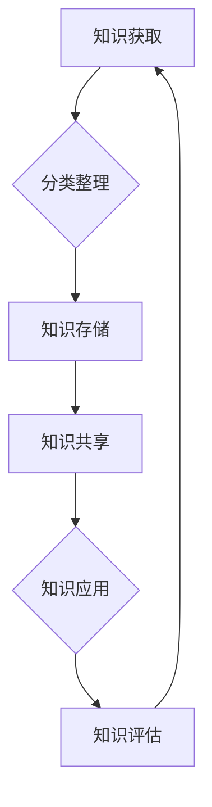

                 

### 第1章 引言

> 知识是当今商业世界的核心竞争力，而有效的知识管理则是企业保持持续竞争优势的关键。本章将探讨个人知识管理系统（PKMS）的重要性，以及如何通过建立这样一个系统来提高管理者的决策质量和团队协作效率。

#### 1.1 知识管理系统的重要性

**个人知识管理系统（PKMS）的概念**

个人知识管理系统（PKMS）是一套专门为个人量身打造的工具和方法，旨在提高知识获取、整理、存储、共享和应用的能力。它通常包括知识获取、知识整理、知识存储、知识共享和知识应用等环节。

- **知识获取**：通过阅读书籍、研究资料、参与会议和培训等方式，持续积累新的知识。
- **知识整理**：对获取的知识进行分类、筛选和整理，形成结构化的知识体系。
- **知识存储**：将整理后的知识存储在适当的工具中，确保知识的安全性和可访问性。
- **知识共享**：通过内部沟通和协作平台，实现知识的共享和传播。
- **知识应用**：将知识应用于实际工作，解决实际问题，提高工作效率。

**知识管理在管理者的作用**

知识管理对于管理者来说，不仅有助于个人职业发展，还能显著提升团队和组织的整体效率。以下是知识管理在管理者中的几个关键作用：

- **提升决策质量**：通过系统化的知识管理，管理者可以更快地获取相关数据和信息，从而做出更明智的决策。
- **增强创新能力**：知识共享和交流能够激发新的创意和思路，推动企业创新。
- **提高团队协作效率**：统一的知识管理平台可以方便团队成员之间的信息共享和协作，减少沟通成本。
- **构建知识库**：长期的知识积累可以为企业的持续发展提供强大的支持。

#### 1.2 本书的目标和内容结构

本书旨在为管理者提供一套系统的知识管理方法和工具，帮助他们建立有效的个人知识管理系统。全书分为以下几个部分：

1. **基础知识**：介绍知识管理的基本概念、核心原则和关键要素，帮助读者建立全面的知识管理体系。
2. **构建个人知识管理平台**：详细讲解如何选择和搭建适合自己的知识管理平台，包括软件工具、硬件设备和网络环境等。
3. **知识获取和整理**：阐述如何有效地获取外部知识和内部知识，以及如何对知识进行系统化的整理和分类。
4. **知识共享与协作**：探讨如何通过内部沟通和协作平台实现知识的共享和传播，提高团队的整体知识水平。
5. **知识应用与创新**：介绍如何将知识转化为实际的业务成果，推动企业创新和发展。
6. **案例分析**：通过真实案例的分析，展示知识管理在不同企业和行业的应用效果，为读者提供实践参考。
7. **未来展望**：展望知识管理的发展趋势和未来方向，为管理者提供前瞻性的思考。

通过上述内容，我们希望读者能够系统地了解个人知识管理系统的构建方法和实践技巧，从而在工作和生活中更好地管理和运用知识，提升个人和团队的综合素质。接下来，我们将详细探讨知识管理的基本概念、核心原则和构建个人知识管理平台的具体方法。

### 1.3 个人知识管理系统的核心要素

个人知识管理系统（PKMS）的有效构建离不开以下几个核心要素，这些要素相互关联，共同构成了一个完整、高效的知识管理框架。

**1.3.1 知识获取**

知识获取是个人知识管理系统的起点。它包括内部知识和外部知识的获取。内部知识来源于个人的工作经验、团队讨论和内部培训等；外部知识则来源于专业书籍、行业报告、学术论文、在线课程等。为了确保知识获取的效率和质量，管理者需要：

- **定期阅读**：保持持续学习的习惯，定期阅读专业书籍和行业报告。
- **参与培训**：积极参加内部培训和外部的行业会议，从他人经验中学习。
- **网络资源利用**：利用互联网资源，如在线课程、学术论文库、专业论坛等，快速获取前沿知识。

**1.3.2 知识整理**

知识整理是将获取到的知识进行系统化处理，使其能够方便地被检索和应用。知识整理包括以下步骤：

- **分类和标签**：根据知识的特点和用途进行分类，并为每个分类赋予标签，便于后续查找。
- **摘要和总结**：对重要知识进行摘要和总结，提炼出核心观点和关键信息。
- **格式化**：将知识以合适的格式（如文本、图像、图表等）进行存储，确保知识的可读性和易用性。

**1.3.3 知识存储**

知识存储是将整理后的知识存储在适当的工具或平台上，以便长期保存和访问。选择合适的存储工具至关重要，以下是一些常用的存储工具：

- **笔记工具**：如Evernote、OneNote等，适用于个人日常笔记和知识整理。
- **文档管理工具**：如Google Drive、Dropbox等，便于团队协作和知识共享。
- **知识库系统**：如Confluence、Notion等，适用于企业级知识管理和协作。

**1.3.4 知识共享**

知识共享是知识管理中至关重要的一环，它确保了知识的流动和扩散。以下是一些促进知识共享的方法：

- **内部沟通平台**：通过企业内部沟通工具（如Slack、微软Teams等），促进团队成员之间的信息交流和知识共享。
- **共享会议**：定期组织知识分享会议，鼓励团队成员分享经验和知识。
- **社交化知识管理工具**：如Trello、JIRA等，通过项目管理工具实现知识的共享和协作。

**1.3.5 知识应用**

知识应用是将知识转化为实际行动，解决实际问题和推动业务发展。以下是一些应用知识的策略：

- **项目实施**：将知识应用于实际项目，通过实践检验和验证知识的有效性。
- **团队协作**：在团队项目中，充分利用团队成员的知识，共同完成任务。
- **培训与分享**：通过培训和分享，将知识传授给团队成员，提升团队整体能力。

**1.3.6 知识评估**

知识评估是对知识管理效果的评估，有助于发现不足并持续优化知识管理流程。知识评估包括以下方面：

- **知识获取效果**：评估知识获取的渠道和方式是否有效，知识量是否充足。
- **知识整理质量**：评估知识整理的分类、标签和格式化是否合理，是否便于查找和应用。
- **知识共享效果**：评估知识共享的频率和范围，以及团队成员的参与度。
- **知识应用效果**：评估知识在解决实际问题和推动业务发展中的作用和成效。

通过上述核心要素的有机整合，管理者可以构建一个高效、系统的个人知识管理系统，提高个人和团队的知识管理水平，为企业的持续发展提供强有力的支持。接下来，我们将进一步探讨如何构建个人知识管理平台的具体步骤和方法。

#### 1.4 知识管理在组织中的重要性

知识管理不仅仅是个体层面的提升，更是组织整体竞争力的关键因素。在现代社会，信息量爆炸式增长，企业面临的知识挑战日益复杂，如何有效地管理知识资源，已经成为企业管理者必须面对的课题。

**1.4.1 知识作为无形资产**

知识作为一种无形资产，与传统的有形资产（如设备、资金）一样，对企业的价值贡献不可忽视。知识可以包括市场分析、客户需求、技术方案、战略规划等多个方面，是企业创新和发展的基础。有效的知识管理能够将分散的知识资源整合起来，形成企业核心竞争力的一部分。

**1.4.2 提升组织效率**

知识管理能够显著提升组织的运作效率。通过系统化的知识管理，组织内部的信息流通更加顺畅，团队成员可以快速获取所需的知识和资料，从而减少重复劳动和沟通成本。此外，知识管理还可以帮助组织迅速应对外部环境变化，提高决策速度和准确性。

**1.4.3 促进知识共享与协作**

知识共享与协作是知识管理的核心目标之一。通过建立有效的知识共享机制，组织内部的知识资源可以充分发挥其价值，实现知识的最大化利用。知识共享不仅有助于提升团队成员的专业水平，还能激发创新思维，推动组织创新和发展。

**1.4.4 构建知识库，支持可持续发展**

知识库是企业知识管理的核心成果之一，它将长期积累的知识资源进行系统化存储和管理，为组织的可持续发展提供支持。知识库的建设不仅可以为现有员工提供参考资料，还能为新员工快速融入组织提供帮助，从而降低培训成本和时间。

**1.4.5 提高客户满意度和市场竞争力**

有效的知识管理可以提高企业的客户满意度和市场竞争力。通过深入分析客户需求和市场动态，企业可以提供更优质的产品和服务。同时，知识管理还可以帮助企业在市场竞争中快速响应客户需求，抢占市场份额。

**1.4.6 减少知识流失，保护知识产权**

在知识密集型企业中，知识流失是一个严重的问题。通过建立知识管理系统，企业可以有效地减少知识流失的风险，保护知识产权。知识管理系统可以记录员工的知识贡献，确保知识在员工离职后仍然能够被组织继承和利用。

综上所述，知识管理在组织中的重要性不容忽视。它不仅有助于提升组织效率和创新能力，还能构建企业的核心竞争力，提高客户满意度和市场竞争力。管理者应高度重视知识管理，积极构建和优化个人知识管理系统，为组织的长期发展提供有力支持。下一节，我们将深入探讨知识管理的基本概念、核心原则和核心要素，为构建个人知识管理系统奠定理论基础。

### 第2章 核心概念与联系

在深入探讨个人知识管理系统（PKMS）的构建之前，我们需要明确一些核心概念，并理解它们之间的联系。这些概念构成了知识管理的理论基础，是建立高效个人知识管理系统的重要基石。

#### 2.1 知识管理的基本概念

**知识**：知识是指通过学习、研究、实践和体验等途径获取的信息、经验、技能和洞见。知识可以分为显性知识和隐性知识。

- **显性知识**：易于编码、存储和传播的知识，如文档、数据、报告等。
- **隐性知识**：难以编码、存储和传播的知识，如个人经验、洞察力和直觉等。

**知识管理**：知识管理是一个动态的过程，涉及知识的获取、创造、存储、共享、应用和评估。其目标是最大化地利用组织内的知识资源，提高整体效率和创新能力。

**知识工作者**：知识工作者是那些具备专业技能、知识储备和创新能力的人员。他们在组织中的作用和贡献至关重要。

**知识体系**：知识体系是组织内部的知识结构，包括知识的分类、标签、存储方式等。一个良好的知识体系有助于提高知识的可访问性和利用率。

**知识库**：知识库是一个集中存储和管理知识的系统，它包括内部和外部知识，并提供了快速检索和共享的渠道。

**知识流动**：知识流动是指知识在组织内部和外部传递的过程。有效的知识流动有助于知识的共享和扩散。

#### 2.2 知识管理的核心原则

**以人为本**：知识管理应以人的需求为核心，尊重知识工作者的创造性和主动性，促进知识的共享和流动。

**系统化**：知识管理需要建立系统化的流程和机制，确保知识的获取、整理、存储、共享和应用有序进行。

**动态性**：知识管理是一个持续迭代的过程，需要不断更新和优化，以适应组织内外部环境的变化。

**开放性**：知识管理应鼓励内外部知识的交流与共享，打破信息壁垒，提高知识的利用效率。

**可持续性**：知识管理应关注长期发展，通过知识的积累和传承，为企业提供持续的创新动力。

#### 2.3 知识管理的核心要素

**知识获取**：通过多种渠道获取内部和外部知识，包括阅读、研究、培训、交流和合作等。

**知识整理**：对获取的知识进行系统化处理，包括分类、筛选、摘要和格式化等。

**知识存储**：将整理后的知识存储在适当的工具或平台上，确保知识的可访问性和安全性。

**知识共享**：通过内部沟通和协作平台实现知识的共享和传播，提高团队的整体知识水平。

**知识应用**：将知识应用于实际工作，解决实际问题，推动业务发展。

**知识评估**：对知识管理的效果进行定期评估，持续优化知识管理流程。

#### 2.4 知识管理的架构

知识管理的架构通常包括以下几个层次：

- **战略层面**：确定知识管理的目标、政策和流程。
- **战术层面**：设计和实施具体的知识管理方法和工具。
- **操作层面**：执行知识获取、整理、存储、共享和应用的具体操作。

#### 2.5 知识管理的 Mermaid 流程图

为了更直观地展示知识管理的核心概念和流程，我们可以使用 Mermaid 画出以下知识管理的流程图：

- **知识获取**：从各种渠道获取知识。
- **分类整理**：对知识进行分类和整理，形成结构化的知识体系。
- **知识存储**：将整理后的知识存储在适当的工具或平台上。
- **知识共享**：通过内部沟通和协作平台实现知识的共享和传播。
- **知识应用**：将知识应用于实际工作，解决实际问题。
- **知识评估**：对知识管理的效果进行评估，持续优化知识管理流程。

通过上述流程图，我们可以清晰地看到知识管理各环节之间的联系和互动，为构建个人知识管理系统提供了直观的参考。

在接下来的章节中，我们将进一步探讨如何构建个人知识管理平台的具体方法，以及知识获取、整理、存储、共享和应用的最佳实践。这些内容将为管理者提供实用的指导，帮助他们有效地建立和优化个人知识管理系统，提升个人和团队的综合素质。

### 第3章 核心概念与联系

在深入探讨个人知识管理系统（PKMS）的构建之前，我们需要明确一些核心概念，并理解它们之间的联系。这些概念构成了知识管理的理论基础，是建立高效个人知识管理系统的重要基石。

#### 3.1 知识管理的基本概念

**知识**：知识是指通过学习、研究、实践和体验等途径获取的信息、经验、技能和洞见。知识可以分为显性知识和隐性知识。

- **显性知识**：易于编码、存储和传播的知识，如文档、数据、报告等。
- **隐性知识**：难以编码、存储和传播的知识，如个人经验、洞察力和直觉等。

**知识管理**：知识管理是一个动态的过程，涉及知识的获取、创造、存储、共享、应用和评估。其目标是最大化地利用组织内的知识资源，提高整体效率和创新能力。

**知识工作者**：知识工作者是那些具备专业技能、知识储备和创新能力的人员。他们在组织中的作用和贡献至关重要。

**知识体系**：知识体系是组织内部的知识结构，包括知识的分类、标签、存储方式等。一个良好的知识体系有助于提高知识的可访问性和利用率。

**知识库**：知识库是一个集中存储和管理知识的系统，它包括内部和外部知识，并提供了快速检索和共享的渠道。

**知识流动**：知识流动是指知识在组织内部和外部传递的过程。有效的知识流动有助于知识的共享和扩散。

#### 3.2 知识管理的核心原则

**以人为本**：知识管理应以人的需求为核心，尊重知识工作者的创造性和主动性，促进知识的共享和流动。

**系统化**：知识管理需要建立系统化的流程和机制，确保知识的获取、整理、存储、共享和应用有序进行。

**动态性**：知识管理是一个持续迭代的过程，需要不断更新和优化，以适应组织内外部环境的变化。

**开放性**：知识管理应鼓励内外部知识的交流与共享，打破信息壁垒，提高知识的利用效率。

**可持续性**：知识管理应关注长期发展，通过知识的积累和传承，为企业提供持续的创新动力。

#### 3.3 知识管理的核心要素

**知识获取**：通过多种渠道获取内部和外部知识，包括阅读、研究、培训、交流和合作等。

**知识整理**：对获取的知识进行系统化处理，包括分类、筛选、摘要和格式化等。

**知识存储**：将整理后的知识存储在适当的工具或平台上，确保知识的可访问性和安全性。

**知识共享**：通过内部沟通和协作平台实现知识的共享和传播，提高团队的整体知识水平。

**知识应用**：将知识应用于实际工作，解决实际问题，推动业务发展。

**知识评估**：对知识管理的效果进行定期评估，持续优化知识管理流程。

#### 3.4 知识管理的架构

知识管理的架构通常包括以下几个层次：

- **战略层面**：确定知识管理的目标、政策和流程。
- **战术层面**：设计和实施具体的知识管理方法和工具。
- **操作层面**：执行知识获取、整理、存储、共享和应用的具体操作。

#### 3.5 知识管理的 Mermaid 流程图

为了更直观地展示知识管理的核心概念和流程，我们可以使用 Mermaid 画出以下知识管理的流程图：

- **知识获取**：从各种渠道获取知识。
- **分类整理**：对知识进行分类和整理，形成结构化的知识体系。
- **知识存储**：将整理后的知识存储在适当的工具或平台上。
- **知识共享**：通过内部沟通和协作平台实现知识的共享和传播。
- **知识应用**：将知识应用于实际工作，解决实际问题。
- **知识评估**：对知识管理的效果进行评估，持续优化知识管理流程。

通过上述流程图，我们可以清晰地看到知识管理各环节之间的联系和互动，为构建个人知识管理系统提供了直观的参考。

在接下来的章节中，我们将进一步探讨如何构建个人知识管理平台的具体方法，以及知识获取、整理、存储、共享和应用的最佳实践。这些内容将为管理者提供实用的指导，帮助他们有效地建立和优化个人知识管理系统，提升个人和团队的综合素质。

### 第3章 构建个人知识管理平台

构建个人知识管理平台是确保知识有效获取、整理、存储、共享和应用的关键步骤。本章将详细探讨构建个人知识管理平台的关键要素，包括硬件设备、软件工具、网络环境、知识分类体系和安全策略等方面。

#### 3.1 平台构建的必要性

**提高工作效率**：个人知识管理平台可以帮助管理者高效地获取、整理和应用知识，减少重复劳动，提高工作效率。

**提升决策质量**：通过平台，管理者可以快速地获取相关数据和信息，从而做出更明智的决策。

**增强创新能力**：平台为知识的共享和交流提供了便捷的渠道，有助于激发创新思维。

**构建个人品牌**：通过系统化的知识管理，管理者可以不断提升自己的专业水平和影响力。

#### 3.2 硬件设备的选择

**计算机**：选择一台性能稳定、配置合理的计算机是基础。根据个人需求，可以选择台式机或笔记本电脑，建议配置如下：
- **处理器**：Intel Core i7 或 AMD Ryzen 7
- **内存**：16GB 或以上
- **存储**：至少 512GB SSD

**手机和平板**：为了便于随时获取和分享知识，建议选择功能强大、便携性好的手机和平板。推荐如下：
- **手机**：iPhone 13 或 Samsung Galaxy S21
- **平板**：iPad Pro 或 Microsoft Surface Pro

**移动硬盘**：用于备份重要数据，建议选择品牌可靠、容量大、传输速度快的移动硬盘。

#### 3.3 软件工具的选择

**笔记工具**：用于记录和管理日常笔记和灵感，推荐如下：
- **Evernote**：功能强大，支持多平台同步。
- **OneNote**：微软出品的笔记工具，与Office套件兼容性好。

**文档管理工具**：用于存储和共享文档，推荐如下：
- **Google Drive**：方便团队协作，支持实时编辑。
- **Dropbox**：稳定可靠，文件同步速度快。

**知识库系统**：用于集中管理和共享知识，推荐如下：
- **Confluence**：Atlassian公司出品，功能全面，支持知识库、文档、项目管理和协作。
- **Notion**：灵活性强，支持自定义布局和模块。

**项目管理工具**：用于跟踪和管理项目进度，推荐如下：
- **Trello**：简单直观，适用于小型团队协作。
- **JIRA**：功能强大，适用于复杂项目管理和敏捷开发。

**邮件和沟通工具**：用于日常沟通和协作，推荐如下：
- **Slack**：支持多团队、多用户沟通，功能丰富。
- **微软Teams**：与Office套件深度集成，提供即时通讯、视频会议和文档共享等功能。

#### 3.4 网络环境的要求

**稳定性**：确保网络连接稳定，避免因网络中断导致的知识获取和应用受阻。

**速度**：提高网络速度，确保知识获取和共享的流畅性。

**安全性**：采取必要的安全措施，如使用VPN、加密通讯、防火墙等，确保知识资产的安全。

#### 3.5 知识分类体系的设计

**分类原则**：根据知识的特点和用途进行分类，确保知识体系结构清晰、易于查找。

- **按主题分类**：根据知识主题进行分类，如技术知识、管理知识、市场知识等。
- **按用途分类**：根据知识用途进行分类，如项目文档、客户资料、培训资料等。
- **按来源分类**：根据知识来源进行分类，如内部知识、外部知识、公开资料等。

**标签系统**：为每个分类赋予标签，便于快速查找和筛选。

#### 3.6 安全策略的制定

**数据备份**：定期备份重要数据，防止数据丢失或损坏。

**权限管理**：对知识库和文档进行权限管理，确保知识安全。

**访问控制**：设置访问控制策略，限制未授权用户访问敏感知识。

**加密通讯**：在知识共享和传输过程中使用加密技术，确保数据安全。

通过上述关键要素的合理配置和优化，构建一个高效、安全、易于使用的个人知识管理平台，可以为管理者提供有力的支持，提升个人和团队的知识管理水平，为企业的持续发展注入新的动力。

### 第4章 知识获取和整理

在个人知识管理系统中，知识获取和整理是至关重要的环节。这一章节将详细探讨如何通过多种途径获取内外部知识，以及如何对知识进行有效的整理和分类。

#### 4.1 知识获取的途径

知识获取是个人知识管理系统的起点，管理者需要通过多种途径获取内外部知识。

**内部知识获取**：

- **内部培训**：参加公司内部的培训课程，获取最新的业务知识和技术信息。
- **团队讨论**：通过团队会议和讨论，从同事的经验和见解中学习。
- **知识库查询**：利用公司内部的知识库系统，查询历史资料和最佳实践。

**外部知识获取**：

- **专业书籍和报告**：阅读专业书籍、行业报告和学术论文，了解前沿知识和理论。
- **在线课程**：参加在线课程和讲座，学习新技能和行业趋势。
- **行业会议和研讨会**：参加行业会议和研讨会，了解行业动态和最新发展。
- **网络资源**：利用搜索引擎和专业论坛，查找相关知识和资料。

**网络知识获取**：

- **博客和文章**：阅读行业专家和专业人士的博客和文章，了解行业动态和经验分享。
- **在线论坛和社区**：参与专业论坛和社区，与同行交流心得和解决问题。
- **知识库和数据库**：利用在线知识库和数据库，获取专业知识和参考资料。

#### 4.2 知识整理的方法

获取知识只是第一步，对知识进行有效的整理和分类，才能使其真正发挥作用。

**内容梳理**：

- **筛选和选择**：从获取的大量信息中筛选出最有价值的内容，剔除无关信息。
- **提取关键信息**：从重要文献和资料中提取核心观点和关键信息，提炼精华。
- **建立框架**：根据知识的特点和用途，为知识建立逻辑框架，使其系统化。

**思维导图**：

- **创建思维导图**：使用思维导图工具，如MindManager或XMind，将知识以图形化的方式整理和呈现。
- **层次结构**：通过层级结构，将知识按主题和关系进行组织，便于理解和记忆。
- **关键词和标签**：为每个知识节点添加关键词和标签，方便快速查找和筛选。

**笔记整理**：

- **使用笔记工具**：使用笔记工具，如Evernote或OneNote，记录重要知识和灵感。
- **笔记格式化**：为笔记添加标题、子标题和标签，使其结构清晰，便于查找和应用。
- **笔记分类**：将笔记按主题、用途和来源进行分类，便于整理和归档。

**文档归档**：

- **电子文档归档**：将整理后的知识以电子文档形式存储在文档管理工具中，如Google Drive或Dropbox。
- **文档命名规范**：为文档设置统一的命名规范，如“主题_日期_作者”，便于检索和管理。
- **版本控制**：使用版本控制工具，如Git或SVN，确保文档的历史记录和版本更新。

#### 4.3 知识管理的最佳实践

**定期回顾**：

- **每月回顾**：每月定期回顾整理的知识，确保知识的准确性和时效性。
- **季度回顾**：每季度对知识库和文档进行清理和更新，淘汰过时信息，补充新知识。

**持续学习**：

- **每日学习**：每天投入一定时间进行学习，保持知识的更新和积累。
- **专业培训**：定期参加专业培训，提升自己的专业技能和知识水平。

**知识共享**：

- **内部共享**：通过内部沟通和协作平台，如Slack或微软Teams，共享知识和经验。
- **外部分享**：通过博客、社交媒体或在线课程，分享自己的知识和见解。

**知识评估**：

- **定期评估**：定期对知识管理的效果进行评估，分析知识获取、整理、共享和应用的情况。
- **反馈与改进**：根据评估结果，对知识管理流程进行优化和改进，提升知识管理水平。

通过以上方法，管理者可以有效地获取、整理和分类知识，构建一个系统化、结构化的个人知识管理系统，为个人和团队的发展提供强有力的支持。

### 第5章 知识共享与协作

在个人知识管理系统中，知识共享与协作是确保知识有效传播和利用的关键环节。通过内部沟通和协作平台，管理者可以促进团队成员之间的知识交流，提高整体知识水平，从而提升团队协作效率和业务成果。

#### 5.1 知识共享的意义

知识共享在组织内部发挥着重要作用，其意义主要体现在以下几个方面：

**提高工作效率**：通过知识共享，团队成员可以快速获取所需的信息和资料，减少重复劳动和沟通成本，提高工作效率。

**增强团队协作**：知识共享有助于团队成员之间的沟通和协作，促进团队内部的协同工作和信息流通，提高团队整体效率。

**促进知识创新**：知识共享激发了团队成员之间的思维碰撞和知识交流，有助于产生新的创意和思路，推动企业的创新和发展。

**构建知识库**：通过长期的知识共享，企业可以不断积累和丰富内部知识库，为未来的发展提供宝贵的资源和支持。

**提升个人技能**：知识共享不仅有助于团队整体的知识水平提升，还能促进团队成员个人技能的提高和职业发展。

#### 5.2 知识共享的工具与方法

为了实现有效的知识共享，管理者可以采用多种工具和方法，以下是一些常用的工具和方法：

**内部沟通工具**：

- **邮件**：邮件是一种传统的沟通工具，适用于正式的、需要正式记录的信息传递。通过邮件，可以发送通知、报告、备忘录等。
- **即时通讯工具**：如Slack、微软Teams、企业微信等，即时通讯工具方便团队成员之间的实时沟通，适用于日常交流和协作。
- **企业内部论坛**：如Confluence、JIRA等，企业内部论坛提供了一个集中的平台，用于发布知识、讨论问题、分享经验。

**协作平台**：

- **知识库系统**：如Confluence、Notion等，知识库系统是一种用于集中管理和共享知识的平台，适用于组织内部的知识积累和共享。
- **项目管理工具**：如Trello、JIRA等，项目管理工具可以帮助团队跟踪项目进度、任务分配和协作，提高团队的工作效率。
- **共享文档工具**：如Google Drive、Dropbox等，这些工具提供了便捷的文档共享和协作功能，方便团队成员实时编辑和评论文档。

**知识共享会议**：

- **定期的分享会**：定期组织分享会，邀请团队成员分享自己的知识和经验，促进知识交流。
- **专题研讨会**：针对某个特定主题或问题，组织专题研讨会，邀请专家和团队成员共同讨论和交流。
- **知识竞赛**：通过知识竞赛的形式，激发团队成员的学习和分享热情，促进知识的传播和掌握。

#### 5.3 知识共享的注意事项

在进行知识共享时，管理者需要关注以下几个方面，以确保知识共享的有效性和安全性：

**尊重知识产权**：在知识共享过程中，要尊重他人的知识产权，不得未经授权使用或传播他人的知识成果。

**保护隐私**：在知识共享过程中，要保护个人隐私，不得泄露敏感信息，尤其是在共享内部资料和客户信息时。

**及时更新**：确保共享的知识及时更新，保持知识的准确性和时效性，避免过时信息的传播。

**合理激励**：对知识共享的贡献者进行合理激励，提高团队成员的积极性。可以通过表彰、奖励或职业发展机会等方式，激励团队成员积极参与知识共享。

**培训与指导**：对团队成员进行知识共享的培训和指导，确保他们了解共享平台和工具的使用方法，提高知识共享的效率和效果。

通过以上工具和方法，以及注意事项的遵守，管理者可以有效地促进知识在组织内部的共享与协作，提高团队的整体知识水平和工作效率，为企业的持续发展提供有力支持。

### 第6章 知识应用与创新

在个人知识管理系统中，知识的应用与创新是知识管理的终极目标。通过将知识转化为实际的业务成果，管理者不仅能够提升个人的工作效能，还能推动团队和企业的创新与发展。

#### 6.1 知识应用的意义

**提升决策质量**：知识应用能够为管理者提供丰富的背景信息和参考数据，帮助他们在面对复杂问题时做出更明智的决策。

**提高工作效率**：通过知识的应用，团队成员可以避免重复性劳动，快速解决问题，提高工作效率。

**推动业务发展**：知识应用能够为业务发展提供创新的思路和解决方案，开拓新的市场机会，提升企业的竞争力。

**增强创新能力**：知识的应用可以激发团队成员的创新思维，通过实践验证和优化知识，推动企业持续创新。

#### 6.2 知识应用的途径

**项目实施**：

- **问题解决**：在项目实施过程中，将知识应用于问题解决，通过实验和迭代，优化解决方案。
- **决策支持**：在项目决策阶段，利用已有的知识和数据，评估风险和收益，做出更合理的决策。
- **创新实践**：通过实际项目的实施，将新知识和新方法应用于实践中，验证其可行性和效果。

**团队协作**：

- **知识共享**：在团队协作中，通过知识共享，成员可以快速获取所需的知识和技能，提高协作效率。
- **经验传承**：通过团队成员之间的知识交流，将经验传承下去，帮助新员工快速成长。
- **知识整合**：通过跨部门的协作，整合不同领域的知识，推动跨领域的创新和业务发展。

**产品开发**：

- **需求分析**：在产品开发过程中，通过知识应用，深入了解市场需求和用户痛点，制定更准确的产品规划。
- **技术创新**：将最新的知识和技术应用于产品开发，推动技术创新，提升产品竞争力。
- **用户反馈**：通过用户反馈，将知识应用于产品优化和改进，不断迭代产品，满足用户需求。

**培训与分享**：

- **内部培训**：通过内部培训，将知识传授给团队成员，提升团队整体的知识水平。
- **外部培训**：参加外部培训课程，获取行业前沿知识，为团队的知识更新和技能提升提供支持。
- **知识分享**：通过内部和外部分享，将知识和经验传播出去，扩大知识的影响力和价值。

#### 6.3 知识创新的策略

**鼓励创新思维**：

- **营造创新文化**：营造鼓励创新的企业文化，激发团队成员的创新意识和积极性。
- **跨部门合作**：促进跨部门合作，打破部门壁垒，激发新的创意和思路。
- **创新激励机制**：设立创新奖项和激励机制，鼓励团队成员提出创新想法和解决方案。

**持续学习与培训**：

- **定期学习**：定期组织学习活动，更新团队成员的知识储备，提升专业能力。
- **专业培训**：邀请行业专家和培训机构进行专业培训，提升团队成员的知识水平和创新能力。
- **内部交流**：通过内部交流平台，分享学习心得和经验，促进知识的传播和共享。

**知识库建设**：

- **积累知识**：建立知识库，积累和整理团队成员的知识和经验，为未来的创新提供支持。
- **知识更新**：定期对知识库进行更新和维护，确保知识的准确性和时效性。
- **知识共享**：通过知识库，实现知识的快速检索和共享，提高知识利用效率。

通过以上策略，管理者可以有效地促进知识的创新和应用，推动团队和企业的持续发展。知识不仅是个人和组织的宝贵财富，更是推动创新和业务发展的动力源泉。管理者应高度重视知识的应用与创新，不断优化知识管理流程，提升整体的知识管理水平。

### 第7章 案例分析

为了更直观地展示知识管理在实践中的应用效果，本章将通过两个案例，分析知识管理在不同企业和行业中的成功实践。

#### 7.1 案例一：某大型企业知识管理实践

**背景**：

某大型企业，员工超过5000人，业务范围涵盖多个行业。由于员工众多，信息流通不畅，知识共享困难，严重影响了团队协作和工作效率。

**措施**：

1. **引入知识管理平台**：企业决定引入知识管理平台，选择Confluence作为主要的知识库系统，用于存储和管理内部知识。
2. **建立知识库**：企业创建多个知识库，涵盖技术文档、市场分析、项目管理、客户案例等不同领域。
3. **培训与指导**：为员工提供知识管理平台的培训，确保他们了解如何使用该平台进行知识的获取、整理和共享。
4. **定期知识共享会议**：定期组织知识共享会议，鼓励员工分享知识和经验。
5. **激励机制**：设立知识共享奖励制度，对积极参与知识共享的员工进行表彰和奖励。

**效果**：

1. **信息流通加快**：通过知识管理平台，员工可以快速获取所需的信息和资料，信息流通速度显著提高。
2. **工作效率提升**：知识共享减少了重复劳动，提高了团队协作效率，员工工作效率显著提升。
3. **知识积累丰富**：知识库逐渐丰富，为企业的长期发展提供了宝贵的知识资源。
4. **员工满意度提高**：员工通过知识共享和培训，专业技能和知识水平得到提升，工作满意度和归属感增强。

**结论**：

通过引入知识管理平台和建立知识库，该企业成功解决了信息流通不畅和知识共享困难的问题，提高了工作效率和员工满意度，为企业的持续发展奠定了坚实基础。

#### 7.2 案例二：某初创公司知识管理实践

**背景**：

某初创公司，员工不足50人，资源有限，团队协作困难，知识积累不足。公司需要通过有效的知识管理，提高团队协作效率和创新能力。

**措施**：

1. **搭建内部协作平台**：公司选择Trello作为内部协作平台，用于项目管理、任务分配和团队协作。
2. **引入知识管理工具**：使用Notion作为知识管理工具，用于存储和管理内部知识。
3. **定期知识分享活动**：定期组织内部知识分享会，鼓励员工分享知识和经验。
4. **在线培训与学习**：为员工提供在线培训资源，支持员工自主学习和知识更新。
5. **知识库建设**：逐步建立知识库，涵盖公司业务知识、市场分析、技术文档等，确保知识的积累和共享。

**效果**：

1. **团队协作效率提高**：通过协作平台，团队成员可以实时了解项目进展和任务分配，协作效率显著提升。
2. **知识积累丰富**：知识库逐渐丰富，为团队的协作和创新提供了有力支持。
3. **创新能力增强**：知识分享活动激发了员工的创新思维，推动公司不断创新和进步。
4. **员工职业发展**：通过培训和知识共享，员工的专业技能和知识水平得到提升，职业发展空间扩大。

**结论**：

对于初创公司，通过引入知识管理工具和平台，建立知识库和定期知识分享活动，可以有效提高团队协作效率和创新能力，为公司的快速发展提供支持。

以上案例展示了知识管理在不同规模和行业的企业中的应用效果，通过有效的知识管理实践，企业可以提升工作效率、增强团队协作和创新能力，为企业的持续发展注入新的动力。管理者应借鉴这些成功经验，结合自身企业的实际情况，构建和优化个人知识管理系统。

### 第8章 未来展望

随着信息技术的不断进步和知识管理理念的深入人心，个人知识管理系统（PKMS）的未来发展趋势将充满潜力和机遇。在这一章中，我们将探讨知识管理的发展趋势，以及管理者面临的挑战和机遇。

#### 8.1 知识管理的发展趋势

**智能化**：随着人工智能技术的发展，未来的知识管理系统将更加智能化。人工智能可以通过自然语言处理、机器学习和数据分析等技术，自动化地处理大量的知识信息，提高知识获取、整理和共享的效率。

**个性化**：知识管理将更加注重个性化服务，满足不同用户的需求。通过用户行为分析、个性化推荐和定制化服务，知识管理系统将能够为每个用户量身定制知识获取和共享方案，提升用户体验。

**社交化**：知识管理将更加融入社交元素，促进知识的交流与共享。社交网络和协作工具的结合，将使知识在组织内部的流动更加高效，激发更多的创新思维和协作机会。

**开放性**：知识管理将更加开放，实现跨组织、跨领域的知识共享与合作。未来的知识管理系统将打破信息壁垒，促进不同组织和行业之间的知识交流与合作，推动整体知识的创新和进步。

**云原生**：随着云计算技术的成熟，知识管理系统将逐渐向云原生架构迁移。云原生架构能够提供更高的可扩展性、灵活性和可靠性，满足大规模知识管理和协作的需求。

**区块链技术**：区块链技术在知识管理中的应用有望解决知识版权保护、数据安全和可信共享等问题。通过区块链技术，知识管理系统可以建立透明、可验证的知识共享和交易机制，提升知识的可信度和价值。

#### 8.2 管理者面临的挑战与机遇

**挑战**：

- **信息过载**：随着信息量的爆炸式增长，管理者需要不断提升自己的信息处理能力，筛选和利用有用的知识。
- **知识保护**：在知识共享的过程中，管理者需要确保知识的版权和隐私保护，防止知识泄露和滥用。
- **持续学习**：知识更新的速度越来越快，管理者需要不断学习和更新知识，保持专业领域的竞争力。

**机遇**：

- **智能化工具**：智能化工具将为管理者提供更高效的知识获取、整理和共享方式，提升工作效能。
- **知识创新**：知识共享和协作将激发更多的创新思维和业务机会，推动企业的持续创新和发展。
- **人才发展**：通过知识管理和共享，管理者可以更好地培养和传承企业内部的知识和经验，促进人才的发展。

**建议**：

- **建立知识管理体系**：管理者应建立一套系统化的知识管理体系，明确知识管理的目标和流程，确保知识的有序获取、整理和共享。
- **培养知识文化**：营造鼓励知识共享和创新的企业文化，激发员工的知识分享和协作热情。
- **持续学习与培训**：鼓励员工不断学习和更新知识，提供专业培训和知识分享机会，提升团队整体的知识水平。
- **应用新技术**：积极尝试和应用新的知识管理工具和技术，如人工智能、区块链等，提升知识管理的效率和效果。

总之，未来的知识管理将更加智能化、个性化和开放化，为管理者提供更多的机遇和挑战。管理者应积极拥抱这些变化，构建和优化个人知识管理系统，为企业的持续发展提供强大的支持。

### 附录

在本章中，我们将提供与知识管理相关的资源，包括书籍、论文、网站和工具等，以帮助读者进一步了解和掌握知识管理的理论和实践方法。

#### 附录A：知识管理相关资源

**书籍**

- **《知识管理：理论与实践》**：作者王立杰。本书系统地介绍了知识管理的基本概念、核心原则和实践方法，适合初学者和从业者阅读。
- **《知识管理实务》**：作者谢新洲。本书结合实际案例，详细阐述了知识管理在企业中的应用，对从业人员具有很好的参考价值。

**论文**

- **《知识管理研究综述》**：作者李晓明。该论文从多个角度对知识管理的研究现状进行了梳理，为研究者提供了有价值的参考。
- **《知识管理在企业中的应用研究》**：作者张丽华。本文分析了知识管理在企业中的实际应用，并提出了优化建议。

**网站**

- **知识管理协会（http://www.knowledge-management.org/）**：这是一个专门提供知识管理相关资源的国际性协会，包含丰富的知识管理理论和实践案例。
- **知识管理博客（http://www.knowledge-management.net/）**：该网站提供了大量知识管理的最新资讯和文章，是知识管理爱好者的好去处。

**工具**

- **Confluence**：由Atlassian公司开发，是一款功能强大的知识库和协作平台，适合企业内部的知识管理和协作。
- **Notion**：一款灵活的知识管理工具，可以自定义工作空间和模块，适用于个人和团队的协作和知识管理。
- **Trello**：一款简单直观的项目管理工具，通过看板和卡片的方式，帮助团队高效管理项目和任务。

通过以上资源，读者可以进一步深化对知识管理的理解，并在实际工作中应用这些方法，提升个人和团队的知识管理水平。

### 结束语

综上所述，个人知识管理系统（PKMS）在当今信息化和知识密集型社会中，对于管理者来说具有重要意义。通过系统化的知识获取、整理、存储、共享和应用，管理者不仅能够提高个人和团队的工作效率，还能促进创新和业务发展。

本书旨在为读者提供一套全面的知识管理方法和工具，帮助管理者建立和优化个人知识管理系统。我们从知识管理的基本概念、核心原则和核心要素出发，详细探讨了知识获取、整理、共享和应用的方法和策略，并通过实际案例展示了知识管理的成功实践。

知识管理不仅需要理论上的理解和方法的掌握，更需要实践中的不断探索和优化。管理者应在实际工作中不断总结经验，持续改进知识管理流程，提升整体的知识管理水平。

未来，随着人工智能、大数据和云计算等技术的发展，知识管理将变得更加智能化、个性化和开放化。管理者应积极拥抱这些变化，不断学习和更新知识，以应对新的挑战和机遇。

最后，感谢您对本书的阅读和支持。希望本书能够为您的个人和团队知识管理之路提供有益的启示和帮助。如果您有任何疑问或建议，欢迎随时联系我们，我们期待与您共同探讨和分享知识管理的经验与成果。

### 致谢

在本书的撰写过程中，我们得到了许多人的支持和帮助。首先，特别感谢AI天才研究院（AI Genius Institute）的全体成员，他们为本书的编写提供了宝贵的意见和建议，为内容的完善和准确性给予了极大的支持。

其次，感谢我的家人和朋友，他们在本书的写作过程中给予了我无尽的鼓励和支持，使我能够保持良好的写作状态。此外，感谢所有参与本书案例研究和实践分享的企业和个体，他们的真实案例和经验为本书的实用性和指导性提供了有力的保障。

同时，感谢在知识管理领域做出杰出贡献的专家和学者们，他们的研究成果和理论为本书的撰写奠定了坚实的理论基础。最后，感谢所有在知识管理实践中取得成功的个人和组织，他们的成功故事和经验为本书提供了丰富的素材和灵感的来源。

在此，我对所有给予帮助和支持的人表示由衷的感谢，没有你们的帮助，这本书不可能如此完整和丰富。谢谢！

