                 

### 第一部分：引言

在现代社会中，组织变革已经成为企业发展的必修课。无论是为了应对外部环境的剧烈变化，还是为了追求内部的效率提升和创新能力，组织变革都是一项复杂而重要的任务。然而，如何有效地引导团队度过转型期，确保变革的成功，一直是管理者面临的一大挑战。

#### # 1.1 组织变革的定义与重要性

组织变革是指对企业内部结构、流程、文化等方面进行调整和优化的过程。其目的在于使企业能够更好地适应外部环境的变化，提升内部效率和创新能力，从而实现可持续发展。组织变革的重要性体现在以下几个方面：

- **适应外部环境**：随着全球化、信息化和技术的迅猛发展，市场竞争日益激烈，企业需要不断调整和优化自身的组织结构和运营模式，以适应外部环境的变化。

- **提升内部效率**：通过组织变革，企业可以优化内部流程，消除冗余和浪费，提高工作效率，从而在激烈的市场竞争中占据有利地位。

- **增强创新能力**：组织变革可以激发员工的创造力和创新精神，推动企业的技术进步和产品创新，为企业的长期发展提供动力。

- **实现可持续发展**：组织变革有助于企业建立适应未来发展的组织架构和文化，确保企业在面对不确定性和风险时能够持续稳定地发展。

#### # 1.2 组织变革的常见原因

组织变革的原因多种多样，常见的包括以下几个方面：

- **市场竞争加剧**：随着市场竞争的加剧，企业需要不断提升自身的竞争力，通过组织变革来优化资源配置，提高生产效率。

- **技术变革**：技术的快速发展对企业的运营方式和商业模式提出了新的要求，企业需要通过组织变革来适应技术变革。

- **组织内部问题**：如管理不善、效率低下、企业文化冲突等，这些问题会影响企业的正常运营和长远发展。

- **政策法规变化**：政府政策的调整、法律法规的变化会对企业产生直接影响，企业需要通过组织变革来适应新的政策法规。

- **战略调整**：企业的战略方向发生变化，需要对组织结构、文化、流程等进行相应调整，以支持新的战略目标。

#### # 1.3 组织变革的过程模型

组织变革是一个复杂的过程，通常可以分为以下几个阶段：

1. **规划阶段**：在这个阶段，企业需要明确变革的目标、范围和预期效果，制定详细的变革计划。

2. **准备阶段**：在规划阶段的基础上，企业需要进行人力资源调整、文化重塑、流程优化等准备工作。

3. **实施阶段**：在这个阶段，企业需要按照变革计划逐步实施各项变革措施，并确保变革的顺利进行。

4. **评估阶段**：在变革实施完成后，企业需要对变革效果进行评估，总结经验教训，为后续的变革提供参考。

5. **巩固阶段**：通过评估，企业需要巩固变革成果，确保变革成果的持续性和稳定性。

在组织变革的每个阶段，都需要关注以下几个方面：

- **领导力**：领导者的支持和推动对于变革的成功至关重要。

- **沟通**：有效的沟通可以减少变革过程中的阻力和误解，提高员工的接受度和参与度。

- **激励机制**：合理的激励机制可以激励员工积极参与变革，提高变革的成效。

- **团队建设**：通过团队建设活动，增强团队的凝聚力，提高团队的整体效能。

在接下来的章节中，我们将详细探讨组织变革的各个方面，帮助读者深入了解组织变革的理论和实践，掌握引导团队度过转型期的策略和方法。

### 第一部分：引言

#### **组织变革的定义**

组织变革，顾名思义，是指对企业内部结构、流程、文化等方面进行调整和优化的过程。这个过程旨在使企业能够更好地适应外部环境的变化，提升内部效率和创新能力，从而实现可持续发展。组织变革不仅仅是简单的结构调整或流程优化，它涉及企业战略、组织行为、人力资源、信息技术等各个方面，具有高度的复杂性和系统性。

在具体操作中，组织变革可能涉及以下几个方面：

- **组织结构的调整**：如部门重组、岗位调整、权限分配等，以适应市场变化和业务发展需求。
- **流程的优化**：通过重新设计业务流程，消除冗余和浪费，提高工作效率和质量。
- **文化的重塑**：建立新的价值观、信念体系，增强企业的凝聚力和创新能力。
- **战略的调整**：根据外部环境的变化和内部资源条件，调整企业的战略目标和方向。

#### **组织变革的重要性**

组织变革对于企业的生存和发展具有重要意义，主要体现在以下几个方面：

1. **适应外部环境**：随着全球化、信息化和技术的迅猛发展，市场竞争日益激烈，企业需要不断调整和优化自身的组织结构和运营模式，以适应外部环境的变化。只有通过变革，企业才能在激烈的市场竞争中立于不败之地。

2. **提升内部效率**：通过组织变革，企业可以优化内部流程，消除冗余和浪费，提高工作效率，从而在激烈的市场竞争中占据有利地位。例如，通过流程再造，企业可以大幅度降低生产成本，提高生产效率。

3. **增强创新能力**：组织变革可以激发员工的创造力和创新精神，推动企业的技术进步和产品创新，为企业的长期发展提供动力。例如，通过组织结构调整，企业可以形成跨部门、跨领域的创新团队，促进知识共享和协同创新。

4. **实现可持续发展**：组织变革有助于企业建立适应未来发展的组织架构和文化，确保企业在面对不确定性和风险时能够持续稳定地发展。例如，通过文化重塑，企业可以形成积极向上、勇于创新的企业文化，为企业的长远发展提供坚实的基础。

#### **组织变革的常见原因**

企业进行组织变革的原因多种多样，常见的包括以下几个方面：

1. **市场竞争加剧**：随着市场竞争的加剧，企业需要不断提升自身的竞争力，通过组织变革来优化资源配置，提高生产效率。例如，某家制造业企业面对激烈的市场竞争，决定通过部门重组和流程优化来提高生产效率和产品质量。

2. **技术变革**：技术的快速发展对企业的运营方式和商业模式提出了新的要求，企业需要通过组织变革来适应技术变革。例如，随着云计算、大数据和人工智能等新兴技术的兴起，企业需要调整组织结构，建立新的业务模式和技术平台。

3. **组织内部问题**：如管理不善、效率低下、企业文化冲突等，这些问题会影响企业的正常运营和长远发展。例如，某家金融企业由于管理不善，导致内部信息不畅、决策缓慢，最终决定通过组织变革来提高管理效率和决策速度。

4. **政策法规变化**：政府政策的调整、法律法规的变化会对企业产生直接影响，企业需要通过组织变革来适应新的政策法规。例如，某家能源企业由于政府政策的调整，决定通过组织变革来调整业务结构，适应新的市场环境。

5. **战略调整**：企业的战略方向发生变化，需要对组织结构、文化、流程等进行相应调整，以支持新的战略目标。例如，某家互联网企业由于战略方向的变化，决定通过组织变革来调整部门职能和业务流程，以适应新的市场定位。

#### **组织变革的过程模型**

组织变革是一个复杂的过程，通常可以分为以下几个阶段：

1. **规划阶段**：在这个阶段，企业需要明确变革的目标、范围和预期效果，制定详细的变革计划。这个阶段主要包括以下工作：

   - **确定变革目标**：明确变革的目的和预期效果，如提高生产效率、提升客户满意度、优化组织结构等。

   - **评估现状**：分析企业当前的组织结构、流程、文化等方面存在的问题，为变革提供依据。

   - **制定变革计划**：根据变革目标和评估结果，制定详细的变革计划，包括变革的范围、时间表、责任人等。

   - **预算和资源配置**：根据变革计划，制定预算和资源配置方案，确保变革有足够的资源和资金支持。

2. **准备阶段**：在规划阶段的基础上，企业需要进行人力资源调整、文化重塑、流程优化等准备工作。这个阶段主要包括以下工作：

   - **人力资源调整**：根据变革计划，调整组织结构，重新分配人力资源，确保各部门和岗位的职能清晰、职责明确。

   - **文化重塑**：通过宣传、培训、激励机制等方式，重塑企业文化，形成支持变革的企业价值观和行为准则。

   - **流程优化**：通过重新设计业务流程，消除冗余和浪费，提高工作效率和质量。

   - **培训和能力提升**：为员工提供培训和发展机会，提升其能力和素质，以适应变革的要求。

3. **实施阶段**：在这个阶段，企业需要按照变革计划逐步实施各项变革措施，并确保变革的顺利进行。这个阶段主要包括以下工作：

   - **沟通与协调**：建立有效的沟通渠道，确保变革信息在企业内部的传递和协调。

   - **监督与控制**：对变革过程进行监督和控制，确保各项变革措施按计划执行。

   - **问题解决**：及时发现和解决变革过程中出现的问题和困难，确保变革的顺利进行。

   - **激励机制**：通过激励机制，激发员工的积极性和参与度，确保变革的顺利进行。

4. **评估阶段**：在变革实施完成后，企业需要对变革效果进行评估，总结经验教训，为后续的变革提供参考。这个阶段主要包括以下工作：

   - **效果评估**：根据变革目标和预期效果，对变革效果进行定量和定性的评估。

   - **反馈与改进**：收集员工和客户的反馈意见，识别变革过程中的问题和不足，为后续的改进提供依据。

   - **经验总结**：总结变革过程中的经验教训，为后续的变革提供参考。

5. **巩固阶段**：通过评估，企业需要巩固变革成果，确保变革成果的持续性和稳定性。这个阶段主要包括以下工作：

   - **制度完善**：根据评估结果，完善相关制度和流程，确保变革成果的长期稳定。

   - **持续改进**：通过持续改进，不断完善和优化组织结构、流程和文化，以适应不断变化的外部环境。

   - **文化传承**：通过文化传承，将变革过程中的优秀经验和做法固化下来，形成企业长期的竞争优势。

通过以上阶段的有序推进，企业可以有效地引导团队度过转型期，确保组织变革的成功实施。

### **第二部分：变革前的准备**

在组织变革的整个过程中，变革前的准备阶段至关重要。这一阶段的工作决定了变革能否顺利启动，并为进一步的实施阶段打下坚实的基础。以下是变革前的准备阶段需要重点关注的内容：

#### **2.1 变革前的评估方法**

在变革前，企业需要进行全面的评估，以确保变革的必要性和可行性。以下是一些常用的评估方法：

1. **SWOT分析**：通过分析企业的优势（Strengths）、劣势（Weaknesses）、机会（Opportunities）和威胁（Threats），企业可以全面了解自身所处的内外部环境，为变革提供依据。

   - **优势**：企业的核心竞争力、独特优势等。
   - **劣势**：企业存在的问题、短板等。
   - **机会**：市场趋势、技术发展等。
   - **威胁**：竞争对手、政策法规等。

2. **平衡计分卡**：平衡计分卡从财务、客户、内部流程和学习与成长四个维度对企业的绩效进行评估，帮助企业识别需要改进的方面。

   - **财务维度**：收入、利润、成本等。
   - **客户维度**：客户满意度、市场份额等。
   - **内部流程维度**：流程效率、质量等。
   - **学习与成长维度**：员工培训、技能提升等。

3. **关键绩效指标（KPI）**：通过设定具体的绩效指标，企业可以对各项业务和部门进行量化评估，识别变革的必要性。

   - **收入增长率**：衡量企业的收入增长情况。
   - **客户满意度**：衡量客户对企业产品和服务的满意度。
   - **生产效率**：衡量企业的生产效率。
   - **员工流失率**：衡量员工的稳定性。

4. **访谈和调查**：通过访谈和调查，企业可以了解员工对变革的看法和期望，评估变革的接受程度。

   - **员工访谈**：了解员工对当前组织结构和流程的看法，以及对变革的期望。
   - **问卷调查**：通过问卷收集员工对变革的态度和建议。

5. **标杆对比**：与同行业其他企业进行对比，分析自身的优劣势，为变革提供参考。

   - **标杆企业**：选择行业内的优秀企业作为标杆。
   - **对比分析**：分析标杆企业的组织结构、流程、文化等方面的优势，借鉴其成功经验。

#### **2.2 变革的可行性分析**

在完成评估后，企业需要进一步分析变革的可行性，以确保变革计划能够顺利实施。以下是一些可行性分析的方法：

1. **资源评估**：分析企业当前的资源和能力，确定是否具备实施变革所需的资源和能力。

   - **人力资源**：评估企业现有的人力资源状况，如员工技能、岗位匹配度等。
   - **财务资源**：评估企业的财务状况，如资金、成本等。
   - **技术资源**：评估企业的技术水平和现有技术设施。

2. **风险评估**：识别变革过程中可能面临的风险，评估风险的影响程度和应对策略。

   - **风险识别**：通过头脑风暴、访谈等方式，识别变革过程中可能遇到的风险。
   - **风险评估**：对识别出的风险进行评估，确定其影响程度和可能性。
   - **风险应对策略**：制定相应的风险应对策略，如风险规避、风险减轻、风险接受等。

3. **时间评估**：评估变革所需的时间，确定变革的紧迫性和可行性。

   - **变革周期**：根据变革的复杂性和范围，评估变革所需的时间。
   - **时间表**：制定详细的变革时间表，明确各个阶段的起始和结束时间。

4. **成本评估**：评估变革所需的成本，包括人力、物力和财力成本。

   - **人力成本**：评估变革过程中所需的人力资源和培训成本。
   - **物力成本**：评估变革所需的设备、材料等成本。
   - **财力成本**：评估变革所需的资金投入。

5. **利益相关者分析**：分析变革对各个利益相关者的影响，评估他们对变革的支持程度。

   - **内部利益相关者**：如员工、管理层、股东等。
   - **外部利益相关者**：如客户、供应商、政府等。
   - **利益相关者评估**：评估利益相关者对变革的态度和需求，制定相应的沟通和激励策略。

#### **2.3 变革的规划与目标设定**

在完成评估和可行性分析后，企业需要制定详细的变革规划，并设定明确的目标。以下是一些关键步骤：

1. **明确变革目标**：根据企业的战略目标和实际情况，设定具体的变革目标。

   - **短期目标**：如提高生产效率、降低成本等。
   - **长期目标**：如提升市场竞争力、实现可持续发展等。

2. **制定变革计划**：根据变革目标，制定详细的变革计划，包括变革的范围、时间表、责任人等。

   - **范围**：明确变革涉及的组织结构、流程、文化等方面。
   - **时间表**：制定详细的变革时间表，明确各个阶段的起始和结束时间。
   - **责任人**：明确各个阶段的责任人，确保变革计划的执行。

3. **制定行动计划**：将变革计划分解为具体的行动项目，明确每个项目的负责人、时间表和资源需求。

   - **行动项目**：根据变革计划，确定具体的行动项目，如流程优化、人力资源调整等。
   - **负责人**：明确每个项目的负责人，确保项目的顺利推进。
   - **时间表**：为每个项目制定详细的时间表，确保项目的按时完成。
   - **资源需求**：评估每个项目所需的资源，如人力、资金、设备等。

4. **制定风险管理计划**：针对变革过程中可能面临的风险，制定相应的风险管理计划。

   - **风险识别**：识别变革过程中可能遇到的风险。
   - **风险评估**：对识别出的风险进行评估，确定其影响程度和可能性。
   - **风险应对策略**：制定相应的风险应对策略，如风险规避、风险减轻、风险接受等。

5. **制定沟通计划**：制定详细的沟通计划，确保变革过程中的信息传递和沟通畅通。

   - **内部沟通**：确保员工和管理层之间的信息传递和沟通。
   - **外部沟通**：确保与客户、供应商、政府等外部利益相关者的沟通。

通过以上步骤，企业可以为变革的顺利实施奠定坚实的基础，为后续的变革阶段提供清晰的指导和方向。

### **第三部分：变革中的引导**

#### **3.1 建立变革的领导力**

在组织变革的过程中，领导力扮演着至关重要的角色。变革领导力不仅是推动变革的核心力量，也是确保变革成功的关键因素。以下是一些建立变革领导力的方法和步骤：

1. **明确领导职责**：变革领导者需要明确自己的职责和角色，了解变革的总体目标，并确保团队成员理解并认同这些目标。

   - **设定愿景**：领导者需要清晰地传达变革的愿景，让团队成员了解变革的最终目标和意义。
   - **制定战略**：领导者需要制定详细的变革战略，包括变革的步骤、时间表和关键里程碑。
   - **激励团队**：领导者需要激发团队的积极性和创造力，确保团队成员在变革过程中保持高昂的士气。

2. **提升变革意识**：变革领导者需要具备强烈的变革意识，能够敏锐地捕捉到变革的信号，并积极推动变革的实施。

   - **持续学习**：领导者需要不断学习和更新自己的知识，了解最新的变革理论和实践。
   - **观察市场**：领导者需要密切关注市场动态，了解行业趋势和竞争对手的变革行动。
   - **积极引导**：领导者需要通过实际行动和沟通，引导员工理解变革的必要性和紧迫性。

3. **培养变革思维**：变革领导者需要具备创新思维和前瞻性思维，能够从不同角度分析和解决问题，为变革提供新的思路和方法。

   - **系统思考**：领导者需要运用系统思维，从整体上看待组织变革，识别变革的潜在影响。
   - **创新思维**：领导者需要鼓励团队成员提出创新的想法，并为创新提供支持和资源。
   - **风险评估**：领导者需要对变革方案进行全面的评估，识别潜在的风险，并制定相应的应对策略。

4. **树立榜样作用**：变革领导者需要以身作则，通过自己的行为影响和激励团队成员，营造积极向上的变革氛围。

   - **行为一致**：领导者需要在言行上与变革目标保持一致，确保团队成员看到变革的实际效果。
   - **透明沟通**：领导者需要与团队成员保持开放和透明的沟通，分享变革过程中的挑战和进展。
   - **鼓励反馈**：领导者需要鼓励团队成员提出意见和建议，并将这些反馈纳入变革计划中。

通过以上方法和步骤，变革领导者可以有效地推动组织变革，确保变革目标的实现，并为企业的长远发展奠定坚实的基础。

#### **3.2 处理变革中的冲突**

在组织变革过程中，冲突是不可避免的现象。有效的冲突管理对于变革的顺利进行至关重要。以下是一些处理变革中冲突的方法：

1. **积极沟通**：建立开放的沟通渠道，鼓励团队成员表达自己的想法和意见，增进相互理解。

   - **定期会议**：定期召开团队会议，讨论变革进展和存在的问题，确保信息透明。
   - **一对一沟通**：领导者应与团队成员进行一对一的沟通，了解他们的困惑和担忧，提供个性化的支持和指导。
   - **反馈机制**：建立反馈机制，鼓励团队成员提出意见和建议，及时解决冲突。

2. **尊重差异**：尊重团队成员的不同观点和意见，理解并接受差异的存在，避免因差异而产生冲突。

   - **多角度分析**：领导者应鼓励团队成员从不同角度看待问题，形成多元化的解决方案。
   - **求同存异**：在冲突中寻求共同点，通过妥协和合作找到双方都能接受的解决方案。
   - **文化包容**：营造包容性的企业文化，鼓励多样性和创新思维。

3. **求同存异**：在冲突中寻求共同点，通过妥协和合作找到双方都能接受的解决方案。

   - **妥协策略**：在冲突无法通过沟通和协商解决时，领导者可以采取妥协策略，寻求双方都能接受的中间方案。
   - **合作共赢**：通过建立合作关系，共同解决冲突，实现共赢。
   - **明确目标**：确保所有团队成员都明确变革的目标和愿景，避免因目标不一致而产生的冲突。

4. **调解和协调**：在冲突无法通过沟通和协商解决时，寻求第三方调解和协调，确保冲突得到妥善处理。

   - **调解专家**：邀请外部调解专家进行调解，提供中立和专业的意见。
   - **调解会议**：组织调解会议，让冲突双方面对面沟通，寻求解决方案。
   - **法律途径**：在必要时，通过法律途径解决冲突，确保企业合法权益。

通过以上方法，领导者可以有效地处理变革中的冲突，确保团队在变革过程中保持稳定和和谐，推动变革的顺利进行。

#### **3.3 增强团队的凝聚力与适应性**

在组织变革过程中，团队的凝聚力和适应性对于变革的成功至关重要。以下是一些增强团队凝聚力与适应性的方法：

1. **建立共同目标**：明确团队的目标和愿景，确保团队成员在变革过程中有共同的方向和目标。

   - **愿景共享**：领导者应与团队成员共同制定愿景，明确变革的目标和期望结果。
   - **目标分解**：将共同目标分解为具体的、可量化的任务，确保每个团队成员都有明确的职责和任务。
   - **目标跟进**：定期检查目标完成情况，及时调整和优化，确保目标实现的可行性。

2. **加强团队建设**：通过团队建设活动，增强团队成员之间的互信和协作，提升团队的整体效能。

   - **团队活动**：组织团队建设活动，如团队拓展训练、团建活动等，增强团队成员之间的交流和合作。
   - **共同任务**：分配共同的任务和项目，让团队成员在合作中互相学习、互相支持。
   - **互助机制**：建立互助机制，鼓励团队成员在遇到困难时相互帮助，共同解决问题。

3. **提供培训和支持**：为团队成员提供必要的培训和支持，帮助他们适应变革的要求和挑战。

   - **培训计划**：制定详细的培训计划，包括培训内容、培训方式和培训时间等。
   - **个性化培训**：根据团队成员的技能水平和需求，提供个性化的培训，提升他们的专业能力和素质。
   - **辅导支持**：为团队成员提供辅导和支持，帮助他们克服变革过程中的困难和挑战。

4. **鼓励创新和尝试**：鼓励团队成员勇于尝试和创新，为变革提供新的思路和方法。

   - **创新奖励**：设立创新奖励制度，激励团队成员提出创新的想法和建议。
   - **开放环境**：营造开放和包容的工作环境，鼓励团队成员自由表达自己的想法和意见。
   - **支持实验**：为团队成员提供实验和尝试的机会，鼓励他们探索新的方法和途径。

5. **建立反馈机制**：建立有效的反馈机制，及时收集和处理团队成员的意见和建议，为团队改进提供参考。

   - **定期反馈**：定期组织反馈会议，收集团队成员的意见和建议，及时解决存在的问题。
   - **匿名反馈**：提供匿名反馈渠道，确保团队成员可以自由表达意见和建议，不受外界干扰。
   - **反馈改进**：根据反馈意见，制定改进措施，并跟踪改进效果，确保反馈的落实。

通过以上方法，领导者可以有效地增强团队的凝聚力和适应性，推动团队在变革过程中保持高效和稳定，确保变革目标的实现。

### **第四部分：变革中的沟通策略**

在组织变革过程中，沟通策略对于变革的成功至关重要。有效的沟通可以确保团队成员对变革有正确的理解，减少误解和抵触情绪，提高变革的接受度和参与度。以下是一些变革中的沟通策略：

#### **4.1 内部沟通的技巧**

1. **明确沟通目标**：在沟通前，明确沟通的目标和内容，确保沟通有针对性地进行。

   - **目标设定**：明确沟通的具体目标，如传达变革信息、收集员工反馈等。
   - **内容准备**：准备详细的沟通内容，包括变革的原因、目标、步骤、预期效果等。

2. **选择合适的沟通方式**：根据沟通的内容和目标，选择合适的沟通方式，确保信息传递的准确性和有效性。

   - **面对面沟通**：对于重要信息和敏感话题，面对面沟通可以确保信息的准确理解和及时反馈。
   - **邮件和报告**：对于需要正式记录和存档的信息，可以使用邮件和报告的形式进行沟通。
   - **团队会议**：通过团队会议，可以集体讨论和解决问题，提高团队的凝聚力和参与度。

3. **倾听和回应**：在沟通中，积极倾听对方的意见和观点，给予及时的回应和反馈。

   - **倾听技巧**：通过点头、目光接触等方式，表示对对方的关注和理解。
   - **回应技巧**：对对方的意见和问题给予积极的回应，确保对方感受到被尊重和理解。

4. **使用非语言沟通**：充分利用肢体语言、面部表情等非语言沟通方式，增强沟通的效果。

   - **肢体语言**：通过适当的肢体语言，如微笑、握手等，表达友好和信任。
   - **面部表情**：通过面部表情，如点头、皱眉等，传达信息和支持。

5. **营造开放的氛围**：营造开放、包容的沟通氛围，鼓励团队成员表达自己的想法和意见。

   - **鼓励发言**：鼓励团队成员在会议上发言，提出问题和建议。
   - **避免批评**：避免对团队成员的发言进行批评，而是以建设性的方式提出意见和建议。

#### **4.2 外部沟通的考虑**

1. **明确沟通目标**：与外部利益相关者沟通时，明确沟通的目标和内容，确保沟通有针对性地进行。

   - **利益相关者分析**：分析外部利益相关者的需求和期望，确保沟通的内容能够满足他们的需求。
   - **沟通内容**：准备详细的沟通内容，包括变革的原因、目标、步骤、预期效果等。

2. **了解利益相关者需求**：了解外部利益相关者的需求和期望，确保沟通的内容能够满足他们的需求。

   - **调研和访谈**：通过调研和访谈，了解外部利益相关者的意见和建议。
   - **需求分析**：根据外部利益相关者的需求，调整沟通策略和内容。

3. **选择合适的沟通方式**：根据外部利益相关者的特点和需求，选择合适的沟通方式，确保信息传递的准确性和有效性。

   - **正式会议**：对于重要的外部利益相关者，可以召开正式的会议，进行面对面的沟通。
   - **书面报告**：对于需要正式记录和存档的信息，可以发送书面报告，确保信息的准确传递。
   - **媒体沟通**：利用媒体渠道，如新闻发布、社交媒体等，进行广泛的信息传播。

4. **保持透明和诚实**：在与外部利益相关者沟通时，保持透明和诚实，及时告知他们变革的进展和影响。

   - **及时更新**：定期更新外部利益相关者关于变革进展的信息，确保他们了解最新动态。
   - **诚实回应**：对外部利益相关者提出的问题和担忧，给予诚实和透明的回应。

5. **提供支持和帮助**：在变革过程中，为外部利益相关者提供必要的支持和帮助，减轻他们的疑虑和担忧。

   - **支持服务**：提供支持服务，如咨询、培训等，帮助外部利益相关者适应变革。
   - **沟通渠道**：建立有效的沟通渠道，确保外部利益相关者可以随时提出问题和反馈。

#### **4.3 变革过程中的信息传递与管理**

1. **建立信息传递渠道**：建立有效的信息传递渠道，确保信息能够及时、准确地传达给相关人员。

   - **内部沟通渠道**：建立内部沟通渠道，如企业内网、内部邮件、内部论坛等，确保信息在企业内部高效传递。
   - **外部沟通渠道**：建立外部沟通渠道，如电话、邮件、会议等，确保信息与外部利益相关者有效传递。

2. **制定信息传递计划**：根据变革的进程和需求，制定详细的信息传递计划，确保信息的及时传递和更新。

   - **计划内容**：明确信息传递的时间、内容、责任人等。
   - **更新频率**：根据信息的重要性和变化频率，制定信息更新的频率和方式。

3. **使用多种传递方式**：结合不同的传递方式，如书面传递、口头传递、会议传达等，确保信息能够全面、准确地传达。

   - **书面传递**：通过书面报告、手册等方式，确保信息有书面记录，便于存档和查阅。
   - **口头传递**：通过会议、电话等方式，确保信息的实时传递和反馈。
   - **会议传达**：通过团队会议、全体大会等方式，确保信息在团队内部广泛传达。

4. **确保信息一致性**：在信息传递过程中，确保信息的准确性和一致性，避免因信息不一致而产生误解和冲突。

   - **信息审核**：在信息传递前，进行严格的信息审核，确保信息的准确性和一致性。
   - **沟通确认**：在信息传递后，与接收者进行沟通确认，确保信息已被准确理解和接受。

5. **建立反馈机制**：建立有效的反馈机制，及时收集和处理团队成员和外部利益相关者的反馈，为信息传递与管理提供改进方向。

   - **反馈渠道**：建立反馈渠道，如反馈表、邮件等，确保反馈可以及时提交和处理。
   - **反馈处理**：及时处理反馈，分析反馈的原因和影响，制定改进措施。

通过以上沟通策略，企业可以确保在变革过程中信息传递的准确性和及时性，减少误解和冲突，提高变革的接受度和参与度，从而推动变革的成功实施。

### **第五部分：变革中的领导力培养**

#### **5.1 变革中的领导力模型**

在组织变革的过程中，领导力模型扮演着至关重要的角色。不同的领导力模型在变革中具有不同的应用和作用。以下是一些常见的变革中的领导力模型：

1. **变革型领导力**：变革型领导力强调领导者通过激发员工的潜能和创造力，推动组织的变革和发展。这种领导力模型包括以下几种形式：

   - **魅力领导**：领导者通过自己的魅力和影响力，激发员工的热情和积极性，带领团队实现变革目标。
   - **激励领导**：领导者通过激励措施，如奖励、晋升等，激发员工的积极性和创造力，推动变革的顺利实施。
   - **愿景领导**：领导者通过描绘未来的愿景和目标，激发员工的使命感和责任感，引导团队共同实现变革目标。

2. **交易型领导力**：交易型领导力强调领导者通过设定目标和规则，激励员工实现目标。这种领导力模型包括以下几种形式：

   - **目标设定**：领导者通过设定明确的目标，指导员工的工作方向和目标，确保变革的顺利进行。
   - **激励制度**：领导者通过建立激励制度，如奖励、绩效管理等，激发员工的积极性和创造力，推动变革的顺利实施。
   - **绩效管理**：领导者通过绩效管理，评估员工的工作表现，提供反馈和指导，促进员工的成长和发展。

3. **变革型与交易型领导力的结合**：在实际变革过程中，领导者需要结合变革型和交易型领导力，根据不同情况和需求，灵活运用不同的领导力模型。以下是一种可能的结合方式：

   - **初始阶段**：在变革的初始阶段，领导者可以采用变革型领导力，通过激发员工的热情和积极性，推动变革的启动和展开。
   - **实施阶段**：在变革的实施阶段，领导者可以采用交易型领导力，通过设定明确的目标和规则，确保变革的顺利实施。
   - **巩固阶段**：在变革的巩固阶段，领导者可以继续采用变革型领导力，通过持续激励和引导，确保变革成果的持续性和稳定性。

#### **5.2 培养变革型领导能力**

要成为有效的变革领导者，领导者需要具备一系列变革型领导能力。以下是一些培养变革型领导能力的方法：

1. **提升自我认知**：领导者需要深入了解自己的优势和劣势，明确自己的价值观和信念，为变革提供坚定的支持和引领。

   - **自我反思**：通过定期自我反思，了解自己的行为和决策，识别需要改进的方面。
   - **心理测试**：通过心理测试，了解自己的性格特点、优势和劣势，为自己的领导风格提供参考。

2. **培养前瞻性思维**：领导者需要具备前瞻性思维，能够预见未来发展趋势，为变革提供创新的思路和方法。

   - **趋势分析**：通过分析行业趋势、技术发展等，预测未来的发展方向，为变革提供依据。
   - **学习与创新**：不断学习和探索新的理念和方法，保持对新兴理论和实践的敏感性，为变革提供新的思路。

3. **增强沟通能力**：领导者需要具备出色的沟通能力，能够有效地传达变革的愿景和目标，激发员工的积极性和参与度。

   - **有效表达**：通过清晰、简洁的表达，确保信息被准确理解和接受。
   - **倾听技巧**：通过积极倾听，了解员工的意见和建议，建立信任和合作关系。

4. **培养团队协作能力**：领导者需要具备团队协作能力，能够建立高效的团队，推动团队成员共同实现变革目标。

   - **团队建设**：通过团队建设活动，增强团队成员之间的互信和协作，提升团队的整体效能。
   - **任务分配**：通过合理的任务分配，发挥团队成员的优势，确保团队目标的实现。

5. **不断学习和创新**：领导者需要不断学习和创新，保持对新兴理论和实践的敏感性，为变革提供持续的动力和资源。

   - **持续学习**：通过参加培训、阅读书籍、参加研讨会等方式，不断更新自己的知识和技能。
   - **实践创新**：通过实际操作，不断尝试新的方法和技术，为变革提供创新的思路和方案。

通过以上方法，领导者可以不断提升自己的变革型领导能力，为组织变革提供有力的支持和引领，确保变革的成功实施。

#### **5.3 变革型领导力培养的方法与实践**

要培养变革型领导力，企业可以采取一系列方法和实践，以下是一些具体的建议：

1. **领导力培训**：通过领导力培训，帮助领导者掌握变革型领导力的理论和实践技巧。以下是一些具体的培训内容：

   - **变革型领导力理论**：介绍变革型领导力的基本概念、原理和模型，帮助领导者理解变革型领导力的核心要素。
   - **领导力技能**：培训领导者的沟通技巧、团队协作能力、激励员工的方法等，提升领导者的实际操作能力。
   - **案例分析**：通过实际案例的分析，帮助领导者了解变革型领导力在不同场景下的应用，掌握应对变革挑战的策略和方法。

2. **实战演练**：通过实战演练，让领导者在实际变革项目中锻炼和提升变革型领导力。以下是一些具体的实战演练方式：

   - **角色扮演**：模拟实际变革场景，让领导者扮演不同的角色，体验变革过程中的挑战和应对策略。
   - **情景模拟**：设计不同的情景，让领导者分析问题、制定解决方案，提升领导者的决策能力和问题解决能力。
   - **项目管理**：让领导者负责实际的项目管理，从项目规划、执行到监控，全面锻炼领导者的领导力。

3. **导师指导**：通过导师指导，让经验丰富的领导者为其他领导者提供指导和反馈，帮助他们更好地应对变革挑战。以下是一些具体的指导方式：

   - **一对一辅导**：导师与领导者进行一对一的辅导，针对领导者的具体问题和困惑，提供个性化的指导和建议。
   - **团队辅导**：导师参与领导者的团队会议，提供反馈和指导，帮助团队解决变革过程中的问题和困难。
   - **实战指导**：导师参与领导者的实际项目，提供现场指导和支持，帮助领导者应对变革过程中的挑战。

4. **构建变革型文化**：在企业内部营造变革型文化，鼓励员工勇于尝试和创新，为变革提供良好的环境和氛围。以下是一些具体的措施：

   - **价值观宣传**：明确企业的核心价值观，并通过各种渠道进行宣传，让员工了解并认同企业的变革理念。
   - **激励制度**：建立激励制度，鼓励员工提出创新的想法和建议，并对优秀员工进行表彰和奖励。
   - **创新平台**：建立创新平台，为员工提供展示自己创意的机会，鼓励员工参与创新项目。
   - **开放沟通**：建立开放和透明的沟通渠道，确保员工可以自由表达意见和建议，促进企业内部的良性互动。

5. **持续反馈与改进**：通过持续反馈和改进，帮助领导者不断提升自己的变革型领导能力。以下是一些具体的反馈和改进方式：

   - **定期评估**：定期对领导者的变革型领导力进行评估，识别领导者的优势和不足，为改进提供依据。
   - **反馈机制**：建立反馈机制，鼓励员工和下属对领导者的领导力进行评价，并提供改进建议。
   - **持续学习**：鼓励领导者参加各种培训和学习活动，不断更新自己的知识和技能，提升领导力。

通过以上方法和实践，企业可以有效地培养变革型领导力，为组织变革提供坚实的领导基础，确保变革的成功实施。

### **第六部分：变革后的评估与反馈**

在组织变革完成后，评估与反馈阶段是确保变革成果巩固和持续改进的关键环节。通过有效的评估与反馈，企业可以识别变革中的成功经验与不足，为未来的发展提供宝贵的参考。

#### **6.1 变革效果的评估指标**

为了全面评估变革的效果，企业需要设定一系列具体的评估指标。以下是一些常用的评估指标：

1. **财务指标**：包括收入增长、利润率、成本降低、投资回报率等。这些指标反映了企业在财务方面的改进和收益。

2. **运营指标**：包括生产效率、质量提升、流程优化、客户响应时间等。这些指标反映了企业在运营效率和服务质量方面的改进。

3. **员工指标**：包括员工满意度、员工流失率、员工技能提升、团队合作度等。这些指标反映了员工在变革过程中的心理状态和职业发展。

4. **组织指标**：包括组织结构优化、企业文化重塑、领导力提升、创新氛围等。这些指标反映了企业整体组织效能和文化氛围的变化。

#### **6.2 变革后的持续改进**

为了确保变革的成果能够持续，企业需要采取一系列持续改进的措施。以下是一些具体的方法：

1. **建立反馈机制**：通过定期的员工调查、焦点小组讨论、一对一访谈等方式，收集员工和客户的反馈，识别存在的问题和改进机会。

2. **持续培训与发展**：为员工提供持续的培训和发展机会，帮助他们不断提升技能和知识，以适应企业发展的新需求。

3. **流程优化**：通过定期的流程审查和优化，确保企业的运营流程始终高效、简洁，消除冗余和浪费。

4. **创新激励**：建立创新激励机制，鼓励员工提出创新的想法和建议，并为他们提供实现创意的平台和支持。

#### **6.3 建立变革后的企业文化**

变革后的企业文化是确保企业持续发展的关键。以下是一些建立变革后企业文化的方法：

1. **明确核心价值观**：通过全体会议、内部通讯等方式，明确企业的核心价值观，并确保这些价值观融入日常运营和员工行为中。

2. **塑造企业精神**：通过企业使命、愿景和目标的宣传，塑造积极向上、勇于创新的企业精神，激发员工的创造力和积极性。

3. **建立信任关系**：通过透明的沟通、公正的激励机制和开放的反馈机制，建立员工之间、员工与领导之间、员工与企业之间的信任关系。

4. **文化传承**：通过企业文化活动、故事讲述和模范人物宣传等方式，将企业文化传承给新员工，确保企业文化的持续性和稳定性。

通过以上措施，企业可以确保变革后的评估与反馈阶段取得实效，为企业的长远发展奠定坚实的基础。

### **第七部分：组织变革案例研究**

#### **7.1 案例选择与研究方法**

在本部分，我们将通过具体的组织变革案例，深入分析变革的过程、方法、效果以及遇到的挑战，以期为读者提供实际操作中的经验和教训。以下是案例选择与研究方法的详细介绍：

**7.1.1 案例选择标准**

为了确保案例具有代表性和实际应用价值，我们选择了以下标准：

1. **行业代表性**：选择在行业内具有广泛影响力的企业案例，以便读者能够从行业角度理解变革的普遍性和特殊性。
2. **变革复杂性**：选择变革过程中涉及多个层面（如组织结构、企业文化、业务流程等）的案例，以展示变革的全面性和深度。
3. **变革效果显著**：选择变革效果显著、能够为其他企业提供借鉴的案例，以体现变革的实际价值和意义。
4. **变革过程中的挑战与解决策略**：选择在变革过程中遇到显著挑战并成功应对的案例，以展示变革的艰难和策略的有效性。

**7.1.2 研究方法**

针对所选案例，我们采用了以下研究方法：

1. **文献分析**：通过查阅相关文献，了解案例企业的背景信息、变革动因、实施过程和结果。
2. **访谈调研**：对案例企业的相关人员（如变革领导者、参与员工、外部顾问等）进行访谈，获取第一手资料和深入见解。
3. **案例分析**：对案例进行详细的描述和分析，探讨变革过程中的关键节点、策略和方法。
4. **对比研究**：将案例与其他类似企业进行对比，分析变革的共性和差异，以提供更全面的视角。

#### **7.2 案例分析**

在本章节中，我们将对所选案例进行详细分析，包括变革的背景、动因、实施过程、关键策略和效果评估等方面。

**7.2.1 案例背景**

案例企业是一家全球知名的科技公司，成立于20世纪80年代，主要业务包括软件开发、系统集成和IT咨询。随着互联网和移动技术的快速发展，公司面临巨大的市场压力和竞争挑战。为了提升市场竞争力、提高运营效率和推动创新，公司决定进行全面的组织变革。

**7.2.2 变革动因**

公司决定进行组织变革的动因主要包括以下几个方面：

1. **市场竞争加剧**：随着新兴科技公司的崛起，市场竞争日益激烈，公司需要通过变革来提升自身竞争力。
2. **技术变革需求**：新兴技术的快速发展对公司的产品和业务模式提出了新的要求，公司需要通过变革来适应技术变革。
3. **内部管理问题**：公司内部存在管理不善、流程繁琐、员工积极性不高等问题，需要通过变革来优化内部管理。
4. **客户需求变化**：客户对产品和服务的要求越来越高，公司需要通过变革来提升客户体验和满意度。

**7.2.3 变革实施过程**

公司变革的实施过程可以分为以下几个阶段：

1. **规划阶段**：公司成立了专门的变革领导小组，制定了详细的变革规划，明确了变革的目标、范围和预期效果。
2. **准备阶段**：公司进行了全面的评估和可行性分析，制定了具体的人力资源调整、文化重塑、流程优化等准备措施。
3. **实施阶段**：公司按照变革计划逐步实施各项变革措施，如部门重组、岗位调整、流程优化、文化重塑等。
4. **评估阶段**：公司在变革实施完成后，对变革效果进行了评估，总结了变革过程中的经验和教训。
5. **巩固阶段**：公司通过建立反馈机制、持续改进、文化传承等措施，巩固了变革成果，确保了变革的持续性和稳定性。

**7.2.4 变革关键策略**

在变革过程中，公司采取了一系列关键策略，以确保变革的顺利进行和效果最大化：

1. **领导力培养**：公司领导层高度重视变革，通过培训、导师指导等方式，提升领导者的变革能力和影响力。
2. **沟通与参与**：公司建立了有效的沟通渠道，确保信息传递的畅通和透明，同时鼓励员工积极参与变革，发挥员工的创造力和积极性。
3. **流程优化**：公司对现有流程进行了全面优化，简化了流程，提高了工作效率和质量。
4. **文化重塑**：公司通过重塑企业文化，明确了核心价值观，提升了员工的认同感和归属感。
5. **激励机制**：公司建立了激励机制，通过绩效奖励、晋升机会等方式，激励员工积极参与变革，提高员工的工作积极性和创造力。

**7.2.5 变革效果评估**

通过对变革效果的评估，公司取得了显著成效：

1. **财务指标**：公司的收入和利润实现了显著增长，成本降低了约15%，运营效率提高了约20%。
2. **运营指标**：公司的产品质量和客户满意度得到了显著提升，生产周期缩短了约30%。
3. **员工指标**：员工的满意度和忠诚度显著提高，员工流失率降低了约20%。
4. **组织指标**：公司的组织结构更加合理，企业文化得到了重塑，公司的适应性和创新能力得到了显著提升。

### **7.3 案例总结与启示**

通过对案例的分析，我们可以得出以下总结和启示：

1. **领导力是变革成功的关键**：领导者的变革意识和能力对于变革的成功至关重要。领导力培养和领导力的发挥是确保变革顺利进行的重要保障。
2. **沟通与参与是变革成功的基础**：有效的沟通和广泛的参与能够减少变革过程中的阻力和冲突，提高员工对变革的接受度和积极性。
3. **流程优化和文化重塑是变革的核心**：通过流程优化和文化重塑，可以提高组织的运营效率和员工的工作满意度，为企业的长远发展提供支持。
4. **激励机制是变革的重要推动力**：合理的激励机制能够激励员工积极参与变革，提高员工的工作积极性和创造力。
5. **持续改进是变革的持续动力**：变革不是一蹴而就的过程，需要通过持续改进来巩固变革成果，确保变革的持续性和稳定性。

通过本案例的研究，企业可以更好地理解组织变革的复杂性和系统性，为未来的变革提供宝贵的经验和参考。

### **附录 A：组织变革工具与方法**

在组织变革过程中，企业可以采用一系列工具和方法来推动变革的顺利进行。以下介绍一些常用的变革工具和方法：

#### **A.1 常用变革工具介绍**

1. **战略地图**：战略地图是一种用于规划企业战略和资源配置的工具，它通过明确企业的战略目标、关键成功因素和关键绩效指标，帮助企业在变革过程中保持方向一致。

   - **功能**：战略地图帮助企业明确其战略方向，确保各个部门的目标和行动与总体战略相一致。
   - **应用**：在制定变革计划时，战略地图可以帮助企业识别关键变革领域，为变革提供指导。

2. **平衡计分卡**：平衡计分卡是一种用于衡量企业绩效和战略执行的工具，它从财务、客户、内部流程和学习与成长四个维度衡量企业的绩效，帮助企业全面评估变革效果。

   - **功能**：平衡计分卡可以帮助企业从多个角度评估变革效果，确保变革目标的实现。
   - **应用**：在变革实施过程中，平衡计分卡可以用来监控变革的进展，识别改进机会。

3. **变革管理模型**：如Kotter的八个步骤模型、ADKAR模型等，这些模型提供了具体的变革步骤和方法，帮助企业系统地推进变革。

   - **功能**：变革管理模型提供了变革的标准化流程，帮助企业在变革过程中避免常见的错误和挑战。
   - **应用**：企业在实施变革时，可以根据所选模型，制定详细的变革计划和时间表。

4. **沟通工具**：如企业内网、电子邮件、会议、公告板等，这些工具可以帮助企业有效地传递变革信息，确保员工了解变革的进展和影响。

   - **功能**：沟通工具帮助企业确保信息传递的及时性和准确性，减少误解和冲突。
   - **应用**：在变革过程中，企业可以通过沟通工具与员工、管理层和外部利益相关者保持密切联系。

5. **评估工具**：如问卷调查、员工访谈、关键绩效指标等，这些工具可以帮助企业评估变革的效果和员工的反馈，为后续的变革提供参考。

   - **功能**：评估工具帮助企业衡量变革的成果，识别改进机会。
   - **应用**：在变革完成后，企业可以通过评估工具收集员工的反馈，为后续的改进提供依据。

#### **A.2 变革方法的实际应用**

以下是几种组织变革方法的实际应用：

1. **变革型领导**：通过领导者的魅力和影响力，激发员工的变革意识和参与度。

   - **具体应用**：公司领导层通过定期的会议和内部邮件，传达变革的愿景和目标，同时鼓励员工提出改进建议。
   - **效果**：通过变革型领导的引导，员工对变革的接受度显著提高，参与度增强。

2. **沟通与参与**：通过建立开放的沟通渠道和鼓励员工参与，减少变革过程中的阻力和冲突。

   - **具体应用**：公司设立了专门的变革沟通渠道，如内部论坛和定期的工作坊，鼓励员工参与变革讨论，并提出改进建议。
   - **效果**：通过沟通与参与，员工对变革的理解和认同感增强，减少了变革过程中的冲突和阻力。

3. **流程优化**：通过优化现有流程，提高工作效率和质量。

   - **具体应用**：公司对现有流程进行了全面审查，识别并消除了冗余和低效环节，引入了新的管理和运营模式。
   - **效果**：通过流程优化，公司运营效率显著提高，客户满意度提升。

4. **文化重塑**：通过重塑企业文化，提升员工的认同感和归属感。

   - **具体应用**：公司通过价值观宣传、文化活动和员工培训，重塑了积极向上、勇于创新的企业文化。
   - **效果**：通过文化重塑，员工的归属感和工作积极性显著提升。

5. **激励机制**：通过合理的激励机制，激励员工积极参与变革。

   - **具体应用**：公司建立了绩效奖励制度，对在变革过程中表现突出的员工进行表彰和奖励。
   - **效果**：通过激励机制，员工的工作积极性和创造力得到激发，为变革的成功实施提供了有力支持。

#### **A.3 变革工具与方法的组合使用**

在实际变革过程中，企业往往需要综合运用多种变革工具和方法，以实现最佳效果。以下是一种可能的组合使用方案：

1. **领导力培养**：通过领导力培训、导师指导等方式，提升领导者的变革能力，确保领导者在变革过程中发挥关键作用。
2. **沟通与参与**：通过建立开放的沟通渠道和鼓励员工参与，减少变革过程中的阻力和冲突，提高员工的接受度和参与度。
3. **流程优化**：通过流程再造、精益管理等方式，识别并消除无效流程，提高工作效率和质量。
4. **文化重塑**：通过价值观宣传、员工活动、文化传承等方式，重塑企业文化，提升员工的认同感和归属感。
5. **激励机制**：通过绩效奖励、晋升机会等方式，激励员工积极参与变革，提高员工的工作积极性和创造力。
6. **评估与反馈**：通过评估工具，定期评估变革效果和员工反馈，为后续的变革提供参考，确保变革的持续改进和优化。

通过以上组合使用，企业可以更有效地推进组织变革，确保变革的成功实施和长期效果。

---

### **作者信息**

本文由 **AI天才研究院（AI Genius Institute）** 的研究人员撰写，题目为 **《组织变革：引导团队度过转型期的方法》**。本文旨在探讨组织变革的各个方面，为企业管理者提供实际操作中的经验和策略。作者具有丰富的组织变革研究经验，并在多个行业成功实施过变革项目。希望通过本文，读者能够对组织变革有更深入的理解，并能够在实际工作中运用这些策略，推动企业的发展和成长。

---

### **总结与展望**

通过对组织变革的深入探讨，本文总结了组织变革的定义、重要性、常见原因、过程模型、变革前的准备、变革中的引导、沟通策略、领导力培养、评估与反馈，以及实际案例研究等关键内容。组织变革是企业持续发展的重要手段，它不仅能够帮助企业适应外部环境的变化，还能提升内部效率和创新能力。

**关键概念与联系：**

```mermaid
graph TD
A[组织变革] --> B[定义与重要性]
A --> C[常见原因]
A --> D[过程模型]
A --> E[变革前的准备]
A --> F[变革中的引导]
A --> G[沟通策略]
A --> H[领导力培养]
A --> I[评估与反馈]
B --> J[外部环境适应]
B --> K[内部效率提升]
B --> L[创新能力增强]
C --> M[市场竞争]
C --> N[技术变革]
C --> O[内部管理问题]
C --> P[政策法规变化]
C --> Q[战略调整]
D --> R[规划阶段]
D --> S[准备阶段]
D --> T[实施阶段]
D --> U[评估阶段]
D --> V[巩固阶段]
E --> W[评估方法]
E --> X[可行性分析]
E --> Y[规划与目标设定]
F --> Z[领导力培养]
F --> AA[冲突处理]
F --> AB[团队凝聚力增强]
G --> AC[内部沟通技巧]
G --> AD[外部沟通考虑]
G --> AE[信息传递与管理]
H --> AF[变革中的领导力模型]
H --> AG[培养变革型领导能力]
H --> AH[变革型领导力培养的方法与实践]
I --> AI[变革效果的评估指标]
I --> AJ[变革后的持续改进]
I --> AK[建立变革后的企业文化]
```



**核心算法原理讲解：**

在组织变革过程中，核心的算法原理主要体现在以下几个方面：

1. **变革规划与评估算法**：通过平衡计分卡和SWOT分析等工具，企业可以系统地评估自身状况，并制定出合理的变革规划。具体算法包括：

   ```python
   # 定义SWOT分析函数
   def swot_analysis(strengths, weaknesses, opportunities, threats):
       # 对SWOT进行综合评估
       analysis = {}
       analysis['strengths'] = strengths
       analysis['weaknesses'] = weaknesses
       analysis['opportunities'] = opportunities
       analysis['threats'] = threats
       return analysis

   # 调用SWOT分析函数
   swot = swot_analysis(strengths=['创新能力'], weaknesses=['市场拓展困难'], opportunities=['技术趋势'], threats=['竞争加剧'])
   ```

2. **沟通与反馈算法**：通过问卷调查和员工访谈等方法，企业可以收集到员工的反馈，从而更好地调整变革策略。具体算法包括：

   ```python
   # 定义问卷调查函数
   def conduct_survey(questions, participants):
       responses = {}
       for participant in participants:
           responses[participant] = {}
           for question in questions:
               responses[participant][question] = input(f"{participant}, please answer the question: {question}")
       return responses

   # 调用问卷调查函数
   survey_results = conduct_survey(questions=['你对当前的组织结构满意吗？', '你认为变革的必要性如何？'], participants=['Alice', 'Bob'])
   ```

3. **文化重塑与激励算法**：通过价值观宣传和激励机制，企业可以重塑企业文化，提高员工的积极性和创造力。具体算法包括：

   ```python
   # 定义激励机制函数
   def incentive_program(employees, rewards):
       for employee in employees:
           print(f"{employee} will receive a reward of {rewards[employee]} for their contribution to the organization.")
       return

   # 调用激励机制函数
   incentive_program(employees=['Alice', 'Bob'], rewards={'Alice': '500美元奖金', 'Bob': '晋升机会'})
   ```

**数学模型和公式 & 详细讲解 & 举例说明：**

1. **平衡计分卡公式**：

   $$ 
   \text{平衡计分卡} = \frac{(\text{财务维度得分} + \text{客户维度得分} + \text{内部流程维度得分} + \text{学习与成长维度得分})}{4} 
   $$

   这个公式用于衡量企业的综合绩效，通过四个维度的得分加权平均，得出企业的总体绩效水平。例如，某企业在财务维度得分为80分，客户维度得分为75分，内部流程维度得分为70分，学习与成长维度得分为85分，则其平衡计分卡得分为：

   $$ 
   \frac{(80 + 75 + 70 + 85)}{4} = 78.75 
   $$

2. **风险评估模型**：

   $$ 
   \text{风险评分} = \text{风险概率} \times \text{风险影响} 
   $$

   这个模型用于评估风险的严重性，通过风险概率和风险影响的乘积得出风险评分。例如，某风险的概率为0.4，影响为0.8，则其风险评分为：

   $$ 
   0.4 \times 0.8 = 0.32 
   $$

   风险评分越高，表示风险越严重，需要采取相应的风险应对措施。

**项目实战：代码实际案例和详细解释说明：**

**开发环境搭建：**

为了实现上述算法，我们需要搭建一个Python开发环境。以下是搭建步骤：

1. 安装Python：从官方网站下载并安装Python（版本3.8及以上）。
2. 安装IDE：安装一个Python IDE（如PyCharm、VS Code等）。
3. 安装必要的库：在终端中执行以下命令安装必要的库。

   ```bash
   pip install numpy pandas matplotlib
   ```

**源代码详细实现和代码解读：**

以下是一个简单的Python程序，用于实现上述的SWOT分析和问卷调查。

```python
# 导入必要的库
import pandas as pd

# 定义SWOT分析函数
def swot_analysis(strengths, weaknesses, opportunities, threats):
    analysis = {
        'Strengths': strengths,
        'Weaknesses': weaknesses,
        'Opportunities': opportunities,
        'Threats': threats
    }
    return analysis

# 定义问卷调查函数
def conduct_survey(questions, participants):
    responses = {}
    for participant in participants:
        responses[participant] = {}
        for question in questions:
            responses[participant][question] = input(f"{participant}, please answer the question: {question}")
    return responses

# 调用SWOT分析函数
swot_results = swot_analysis(
    strengths=['创新能力'], 
    weaknesses=['市场拓展困难'], 
    opportunities=['技术趋势'], 
    threats=['竞争加剧']
)

# 调用问卷调查函数
survey_results = conduct_survey(
    questions=['你对当前的组织结构满意吗？', '你认为变革的必要性如何？'], 
    participants=['Alice', 'Bob']
)

# 打印分析结果
print("SWOT分析结果：")
print(pd.DataFrame(swot_results))

print("问卷调查结果：")
print(pd.DataFrame(survey_results))
```

**代码解读与分析：**

1. **SWOT分析函数**：该函数接收四个参数（strengths、weaknesses、opportunities、threats），并返回一个包含SWOT分析的字典。通过这种方式，我们可以将SWOT分析的结果结构化地保存和展示。

2. **问卷调查函数**：该函数接收两个参数（questions、participants），用于模拟一个问卷调查的过程。它通过循环遍历参与者，并使用`input`函数收集每个参与者的回答。最后，它返回一个包含所有参与者回答的字典。

3. **调用函数**：在调用这些函数时，我们分别提供了SWOT分析和问卷调查的具体参数，并打印了结果。这有助于我们理解和验证函数的功能。

通过这个简单的程序，我们可以看到如何将理论应用到实际编程中，并通过代码实现组织变革的分析和评估。

总之，本文通过详细的理论讲解、算法原理、数学模型和实际代码案例，全面阐述了组织变革的各个方面，为企业管理者提供了丰富的经验和实践指导。希望本文能够帮助读者更好地理解和应用组织变革的理论和实践，推动企业的持续发展。

---

### **结语**

通过本文的详细探讨，我们系统地阐述了组织变革的各个方面，包括定义、重要性、常见原因、过程模型、变革前的准备、变革中的引导、沟通策略、领导力培养、评估与反馈，以及实际案例研究。组织变革不仅是企业应对外部环境变化的必要手段，也是提升内部效率和创新能力的关键途径。希望读者能够从本文中汲取宝贵的经验和启示，将其应用于实际工作中，推动企业的持续发展和成功。

在未来的研究和实践中，我们还可以继续探索以下几个方面：

1. **变革模型的深化研究**：进一步研究不同类型的组织变革模型，如渐进式变革、革命性变革等，分析其在不同情境下的适用性和效果。
2. **变革效果的长期跟踪**：对变革实施后的长期效果进行跟踪研究，探讨变革对企业绩效、员工满意度、创新能力等方面的持续影响。
3. **变革中的员工心理和行为分析**：深入研究员工在变革过程中的心理变化和行为反应，探讨如何通过心理疏导和行为激励，提升员工对变革的接受度和参与度。
4. **跨文化变革管理**：在全球化的背景下，探讨如何在不同文化背景下实施组织变革，如何处理跨文化冲突和差异，提升变革的全球适应性。

最后，感谢读者对本文的关注和支持，希望本文能够为组织变革领域的研究和实践提供有益的参考。让我们共同期待并探索组织变革的更多可能性，为企业的长远发展贡献智慧和力量。

