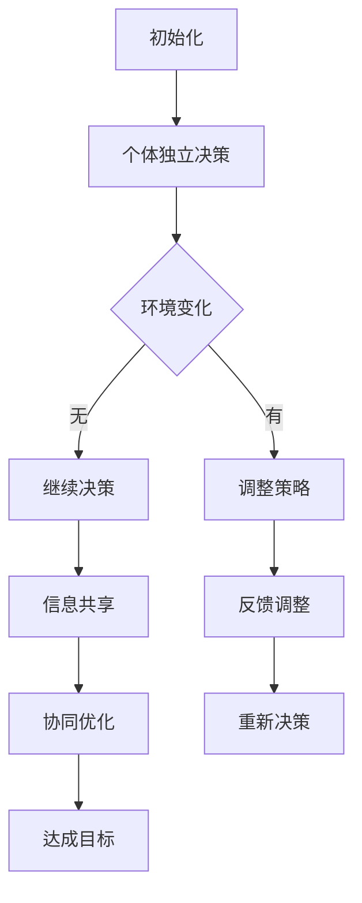
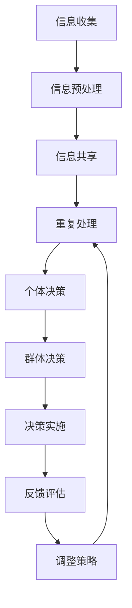

                 

### 第一部分：引论

#### 1.1 群体智慧的概念与重要性

**1.1.1 群体智慧的定义**

群体智慧（Collective Intelligence）是一种由众多个体通过相互合作、信息共享与协作，共同解决问题或实现目标的能力。这种能力不仅存在于人类社会，还存在于动物群体、微生物群体等自然界的不同形式中。

在人类社会中，群体智慧的表现形式多样，如团队合作、集体决策、社会协作等。例如，一个团队在面对复杂问题时，通过成员之间的沟通与协作，能够迅速找到解决问题的方法。这种能力不仅提高了问题解决的效率，还增强了团队成员之间的凝聚力。

**1.1.2 群体智慧的特点**

1. **协作性**：群体智慧依赖于个体之间的协作，每个成员都为整体做出贡献。协作性使得群体智慧具有强大的解决问题能力。

2. **适应性**：群体智慧能够根据环境变化调整策略，以适应不断变化的问题场景。这种适应性使得群体智慧能够持续地应对各种挑战。

3. **信息共享**：群体智慧的一个重要特征是信息共享，个体通过共享信息，可以更全面地了解问题，从而做出更合理的决策。

4. **分布式**：群体智慧不需要一个集中的指挥中心，而是通过分布式的方式，由各个个体共同完成任务。这种分布式特性使得群体智慧具有较强的容错能力和抗攻击能力。

**1.1.3 群体智慧的重要性**

群体智慧在人类社会中的作用不可小觑。首先，它能够提高问题解决效率，减少决策时间。在复杂多变的环境中，群体智慧能够快速适应，找到最优解决方案。

其次，群体智慧有助于增强团队合作和团队凝聚力。通过协作和信息共享，团队成员能够更好地理解彼此，形成合力，共同实现目标。

最后，群体智慧在创新和发明中起到了关键作用。许多创新和发明都是通过团队合作、信息共享和集体智慧实现的。例如，互联网的诞生、智能手机的发明等，都离不开群体智慧的力量。

总之，群体智慧是人类社会的重要资源，它不仅提升了我们的生活质量，还在各个领域发挥着重要作用。在接下来的章节中，我们将进一步探讨群体智慧的起源、发展、原理及其应用。

#### 1.2 人类计算的基础

**1.2.1 人类思维的模式**

人类思维是一种复杂的过程，它包括感知、理解、推理、决策等多个环节。每个环节都有其独特的特点和机制。

1. **感知**：感知是人类获取外界信息的过程。通过视觉、听觉、触觉等多种感官，人类能够感知到周围环境的变化。

2. **理解**：理解是将感知到的事物进行解释和认知的过程。理解能力使得人类能够对事物进行分类、归纳和推理。

3. **推理**：推理是基于已有知识和信息，进行逻辑推断的过程。推理能力使得人类能够预测未来、解决问题。

4. **决策**：决策是在不同选项中做出选择的过程。决策能力是人类在复杂环境中做出最优选择的关键。

**1.2.2 人类行为的本质**

人类行为是由思维决定的，其本质可以归结为以下几个特点：

1. **目标导向**：人类行为通常具有明确的目标，行为的选择和执行都是为了实现这些目标。

2. **适应性**：人类行为能够根据环境变化进行调整，以适应不同的情境。

3. **社会性**：人类行为受到社会环境的影响，行为的选择和执行都受到社会规范和价值观的约束。

4. **复杂性**：人类行为涉及到多个因素，包括情绪、动机、认知等，这使得人类行为具有复杂性。

**1.2.3 人类计算的优势与局限**

人类计算具有以下优势：

1. **适应性**：人类能够灵活地适应不同的问题情境，找到解决问题的最佳方法。

2. **直觉判断**：人类能够基于直觉做出快速判断，这在许多情境下是有效的。

3. **创造性**：人类能够进行创造性思维，发现新的解决方案。

然而，人类计算也存在一些局限：

1. **信息处理速度**：人类处理信息的能力有限，面对大量数据时容易感到疲劳。

2. **记忆能力**：人类的记忆能力有限，容易遗忘信息。

3. **认知偏差**：人类在决策过程中可能受到认知偏差的影响，导致判断不准确。

总之，人类计算既有优势也有局限。通过了解人类思维和行为的特点，我们可以更好地理解人类计算的本质，并在此基础上发展出更高效的计算方法。

#### 1.3 群体智慧的概念与重要性

**1.3.1 群体智慧的定义**

群体智慧（Collective Intelligence），顾名思义，是指一群个体通过相互协作、信息共享和协同工作，共同产生智慧和解决问题的能力。这种智慧不仅体现在人类社会中，还存在于自然界中的各种生物群体中，如蜜蜂的蜂巢、鸟类的迁徙等。在人类社会中，群体智慧的表现形式多种多样，如团队合作、集体决策、社会协作等。

**1.3.2 群体智慧的特点**

1. **协作性**：群体智慧依赖于个体之间的协作，每个成员都为整体做出贡献。协作性使得群体智慧具有强大的解决问题能力。

2. **适应性**：群体智慧能够根据环境变化调整策略，以适应不断变化的问题场景。这种适应性使得群体智慧能够持续地应对各种挑战。

3. **信息共享**：群体智慧的一个重要特征是信息共享，个体通过共享信息，可以更全面地了解问题，从而做出更合理的决策。

4. **分布式**：群体智慧不需要一个集中的指挥中心，而是通过分布式的方式，由各个个体共同完成任务。这种分布式特性使得群体智慧具有较强的容错能力和抗攻击能力。

**1.3.3 群体智慧的重要性**

群体智慧在人类社会中的作用不可小觑。首先，它能够提高问题解决效率，减少决策时间。在复杂多变的环境中，群体智慧能够快速适应，找到最优解决方案。

其次，群体智慧有助于增强团队合作和团队凝聚力。通过协作和信息共享，团队成员能够更好地理解彼此，形成合力，共同实现目标。

最后，群体智慧在创新和发明中起到了关键作用。许多创新和发明都是通过团队合作、信息共享和集体智慧实现的。例如，互联网的诞生、智能手机的发明等，都离不开群体智慧的力量。

总之，群体智慧是人类社会的重要资源，它不仅提升了我们的生活质量，还在各个领域发挥着重要作用。在接下来的章节中，我们将进一步探讨群体智慧的起源、发展、原理及其应用。

### 第二部分：群体智慧的起源与发展

#### 2.1 群体智慧的起源

**2.1.1 人类社会的进化**

群体智慧的出现可以追溯到人类社会的进化过程。在人类进化的早期阶段，个体为了生存，需要学会协作和合作。随着社会的不断发展，人类逐渐形成了各种社会组织，如家庭、部落和城市。这些社会组织使得人类能够更有效地合作，共同应对外界挑战。

1. **狩猎与采集**：在原始社会，人类通过狩猎和采集来获取食物。这种活动中，个体需要相互协作，共同寻找猎物或采集资源。这种协作形式是群体智慧的一种早期体现。

2. **社会分工**：随着人类社会的发展，人们开始出现社会分工，不同个体负责不同的任务。这种分工使得个体能够专注于自己擅长的工作，提高整体效率。社会分工进一步促进了群体智慧的形成。

**2.1.2 社会网络的演化**

社会网络的演化也是群体智慧形成的重要因素。社会网络是指个体之间通过互动和关系连接形成的结构。在社会网络中，个体之间通过信息交换和资源共享，共同实现目标。

1. **信息传播**：社会网络的演化使得信息能够快速传播。个体可以通过社会网络获取到其他个体的经验和知识，从而提高自己的认知水平。这种信息传播机制是群体智慧的重要基础。

2. **资源共享**：社会网络中的资源共享机制使得个体能够更有效地利用资源。例如，一个个体可能拥有某项技能或资源，而其他个体可能需要这项技能或资源。通过社会网络，这些资源和技能可以共享，从而提高整体效率。

**2.1.3 群体智慧的产生**

群体智慧的产生是一个长期的过程，它依赖于人类社会的进化和社会网络的演化。在人类进化的过程中，个体逐渐学会了协作和合作，社会分工和资源共享机制逐渐形成。这些因素共同作用，使得群体智慧逐渐形成并发展壮大。

总之，群体智慧的起源可以追溯到人类社会的进化过程。社会分工和资源共享机制使得人类能够更有效地合作，从而形成群体智慧。在接下来的章节中，我们将进一步探讨群体智慧的发展及其在现代社会的应用。

#### 2.2 群体智慧的发展

**2.2.1 文艺复兴与科学革命**

文艺复兴时期和科学革命是群体智慧发展的重要阶段。这一时期，人类社会经历了巨大的变革，科学、艺术和哲学等领域取得了重大突破。

1. **科学革命**：科学革命的核心是科学方法的应用。科学家们通过观察、实验和推理，发现了自然界的基本规律。这一过程不仅推动了科学的进步，也促进了群体智慧的发展。科学家们通过合作、交流和共享知识，共同推动了科学的发展。

2. **文艺复兴**：文艺复兴时期，艺术家和思想家们开始关注人类本身，强调个体的价值和创造力。这一时期的文化繁荣，使得各种思想和知识得以传播和交流，为群体智慧的发展提供了土壤。

**2.2.2 工业革命与信息革命**

工业革命和信息革命是群体智慧发展的关键时期。这两个时期，人类社会经历了巨大的变革，生产方式、生活方式和交流方式都发生了根本性的变化。

1. **工业革命**：工业革命的出现，使得生产方式从手工业转向机械化生产。这一变革极大地提高了生产效率，同时也促进了知识的传播和交流。工业革命期间，各种技术和知识得以迅速传播，为群体智慧的发展提供了强大的动力。

2. **信息革命**：信息革命的核心是计算机技术和互联网的普及。计算机技术和互联网使得信息传播的速度和范围达到了前所未有的高度。人们可以通过互联网快速获取和分享知识，这使得群体智慧的发展进入了新的阶段。

**2.2.3 群体智慧的现代化**

现代化进程使得群体智慧得到了进一步的发展。现代社会中的各种社会组织、企业、科研机构和政府都在积极运用群体智慧，以应对复杂多变的环境。

1. **社会组织**：现代社会组织注重团队合作和集体决策，通过信息共享和协作，提高问题解决效率。

2. **企业**：现代企业越来越重视创新和协作，通过建立开放式创新平台，鼓励员工之间的合作，共同推动企业的发展。

3. **科研机构**：科研机构通过建立学术合作网络，共享研究成果，推动科学技术的进步。

4. **政府**：现代政府越来越重视智慧治理，通过运用大数据、人工智能等技术，提高公共服务的效率和质量。

总之，群体智慧的发展经历了多个阶段，从文艺复兴和科学革命，到工业革命和信息革命，再到现代化进程，每个阶段都推动了群体智慧的发展。在现代社会，群体智慧已经成为应对复杂挑战的重要工具，其在各个领域的应用正在不断拓展。

### 第三部分：群体智慧的原理

#### 3.1 群体智慧的核心原理

群体智慧的核心原理包括分散与协调、规则与适应性、信息共享与透明度。

**3.1.1 分散与协调**

分散与协调是群体智慧的重要特征之一。在分散系统中，每个个体独立进行决策和行动，但整体上能够实现高效的任务执行。分散性使得系统具有更强的容错能力和抗攻击能力。例如，在蚁群算法中，每个蚂蚁独立寻找食物源，但通过信息素更新机制，整个蚁群能够找到最优路径。

协调则是分散系统中各个个体之间进行有效沟通和协作的过程。协调能够确保个体行动的一致性，从而提高整体效率。例如，在多智能体系统中，各个智能体通过通信和协作，共同完成任务。

**3.1.2 规则与适应性**

规则是群体智慧中个体行为的指导原则。规则能够确保个体行为的有序性，从而提高整体效率。例如，在交通系统中，交通规则确保了车辆的安全行驶和道路的畅通。

适应性是指群体智慧系统根据环境变化调整行为规则的能力。适应性使得系统能够应对不断变化的外部环境，从而保持高效运行。例如，在金融市场调控中，政策制定者需要根据市场情况调整货币政策，以保持经济的稳定发展。

**3.1.3 信息共享与透明度**

信息共享是群体智慧的重要机制之一。在信息共享系统中，个体能够获取到其他个体的信息，从而更全面地了解问题，做出更合理的决策。例如，在互联网系统中，用户可以通过搜索引擎获取到大量信息，从而做出更好的决策。

透明度是指个体行为的可观测性。透明度能够提高群体智慧系统的可信度和公平性，从而增强个体之间的信任。例如，在区块链系统中，交易记录是公开透明的，每个参与者都可以查看其他参与者的交易信息，从而确保交易的公平和透明。

#### 3.2 群体智慧的计算机制

**3.2.1 Mermaid流程图：群体智慧的运行机制**

下面是一个用Mermaid绘制的群体智慧运行机制的流程图：



**3.2.2 核心算法原理讲解（伪代码）**

以下是一个群体智慧算法的伪代码示例：

```plaintext
function collective_intelligence(data_set, goals):
    // 初始化变量
    leaders = []
    subgroups = create_subgroups(data_set)
    
    // 分配任务
    for subgroup in subgroups:
        leaders.append(elect_leader(subgroup))
    
    // 协调与决策
    for leader in leaders:
        leader.collective_decision(subgroup, goals)
    
    // 整合结果
    final_solution = integrate_solutions(leaders)
    return final_solution
```

在这个算法中，首先将数据集分成若干个子组，并选举出各个子组的领导者。领导者负责协调子组内的决策，然后将决策结果整合为最终的解决方案。

**3.2.3 数学模型与公式**

群体智慧的计算机制可以通过数学模型进行描述。以下是一个简单的数学模型：

$$
\Omega = \sum_{i=1}^{N} p_i \cdot q_i
$$

其中，$\Omega$ 表示群体智慧水平，$p_i$ 表示第 $i$ 个个体的智慧水平，$q_i$ 表示第 $i$ 个个体在群体中的贡献度。

**3.2.4 数学模型详细讲解与举例说明**

假设有一个群体由三个个体组成，它们的智慧水平和贡献度如下：

| 个体 | 智慧水平 $p_i$ | 贡献度 $q_i$ |
| ---- | ---- | ---- |
| 1    | 0.8  | 0.3  |
| 2    | 0.7  | 0.5  |
| 3    | 0.6  | 0.2  |

根据上述数学模型，群体智慧水平 $\Omega$ 计算如下：

$$
\Omega = 0.8 \cdot 0.3 + 0.7 \cdot 0.5 + 0.6 \cdot 0.2 = 0.24 + 0.35 + 0.12 = 0.81
$$

这意味着该群体的智慧水平为 0.81。通过调整个体智慧和贡献度的权重，可以优化群体的智慧水平。

#### 3.2 群体智慧的计算机制

群体智慧的计算机制是一个复杂而多层次的过程，涉及到信息收集、处理、共享以及协同决策等多个方面。为了更好地理解这一机制，我们可以将其分解为以下几个关键环节：

**3.2.1 信息收集与处理**

首先，个体需要收集与问题相关的信息。这些信息可以来自内部（如个体自身的感知和记忆）或外部（如其他个体的共享信息、环境传感器等）。在信息收集过程中，个体需要对信息进行筛选和预处理，去除冗余和无用信息，确保信息的准确性和完整性。

**3.2.2 信息共享**

收集到的信息需要通过一定的渠道进行共享。共享机制可以是点对点的，也可以是广播式的。信息共享的目的是确保群体中每个个体都能获取到必要的知识，从而提高整体决策的准确性。

**3.2.3 信息处理与协同**

在信息共享的基础上，个体需要对自己接收到的信息进行处理和整合。这一过程包括数据的融合、分析、推理等。个体处理信息的结果将被用于自身的决策，同时也会与其他个体进行协同，形成最终的群体决策。

**3.2.4 群体决策**

群体决策是群体智慧的核心。在决策过程中，个体需要考虑到自身利益、群体利益以及其他个体的意见。常见的决策方法包括投票、协商、博弈等。最终，群体决策的结果将作为群体行动的指导。

**3.2.5 反馈与调整**

群体决策实施后，个体需要对结果进行评估，并根据评估结果调整后续的行动策略。反馈机制是确保群体智慧持续优化和进步的关键。

下面，我们通过一个简单的Mermaid流程图来展示群体智慧的计算机制：



**3.2.2 核心算法原理讲解（伪代码）**

为了更清晰地展示群体智慧的计算过程，我们可以使用伪代码来描述其核心算法：

```plaintext
// 初始化变量
subgroups = create_subgroups(data_set)
leaders = []

// 分配任务并选举领导者
for subgroup in subgroups:
    leader = elect_leader(subgroup)
    leaders.append(leader)

// 个体独立决策与信息共享
for leader in leaders:
    leader.collective_decision(subgroup, goals)
    
    // 信息整合与协同优化
    final_solution = integrate_solutions(leaders)
    
    // 决策实施与反馈调整
    solution = apply_solution(final_solution)
    feedback = evaluate_solution(solution)
    adjust_strategy(feedback)
```

在这个伪代码中，首先将数据集分为若干个子组，并选举出各个子组的领导者。领导者负责协调子组内的决策，并将决策结果整合为最终的解决方案。最后，根据解决方案的实施效果进行反馈和策略调整。

**3.2.3 数学模型与公式**

群体智慧的计算机制还可以通过数学模型进行描述。以下是一个简单的数学模型：

$$
\Omega = \sum_{i=1}^{N} p_i \cdot q_i
$$

其中，$\Omega$ 表示群体智慧水平，$p_i$ 表示第 $i$ 个个体的智慧水平，$q_i$ 表示第 $i$ 个个体在群体中的贡献度。

**3.2.4 数学模型详细讲解与举例说明**

假设有一个群体由三个个体组成，它们的智慧水平和贡献度如下：

| 个体 | 智慧水平 $p_i$ | 贡献度 $q_i$ |
| ---- | ---- | ---- |
| 1    | 0.8  | 0.3  |
| 2    | 0.7  | 0.5  |
| 3    | 0.6  | 0.2  |

根据上述数学模型，群体智慧水平 $\Omega$ 计算如下：

$$
\Omega = 0.8 \cdot 0.3 + 0.7 \cdot 0.5 + 0.6 \cdot 0.2 = 0.24 + 0.35 + 0.12 = 0.81
$$

这意味着该群体的智慧水平为 0.81。通过调整个体智慧和贡献度的权重，可以优化群体的智慧水平。

### 4.1 群体智慧在社会管理中的应用

**4.1.1 智能交通系统**

智能交通系统（Intelligent Transportation Systems, ITS）是群体智慧在社会管理中的一项重要应用。ITS通过集成传感器、通信技术和智能算法，实现对交通流量的实时监测和动态调控，以提高交通效率、减少交通事故和缓解交通拥堵。

1. **数据收集与处理**：智能交通系统首先需要收集交通流量、车辆速度、路况等信息。这些数据来源于传感器、摄像头、GPS等设备。在收集到数据后，系统会对数据进行分析和处理，以提取有用的信息。

2. **信息共享**：智能交通系统中的各个节点需要共享数据。通过信息共享，交通管理者可以实时了解交通状况，为交通调控提供依据。

3. **协同决策**：基于共享的数据，交通管理系统会进行协同决策。例如，当某一路段出现拥堵时，系统会调整信号灯时间、引导车辆改道等，以缓解拥堵。

4. **反馈与调整**：交通管理系统会根据决策效果进行反馈和调整。通过不断优化决策策略，系统可以提高交通管理的效率和准确性。

**4.1.2 智能城市规划**

智能城市规划（Intelligent Urban Planning）是群体智慧在城市建设和管理中的应用。智能城市规划通过集成大数据、人工智能和物联网等技术，实现对城市资源的高效利用和城市管理的优化。

1. **数据整合与分析**：智能城市规划首先需要对城市中的各种数据进行分析，如人口分布、交通流量、土地利用等。通过数据整合和分析，城市规划者可以更全面地了解城市现状。

2. **协同规划与决策**：在智能城市规划过程中，多个部门需要协同工作，共同制定规划方案。通过信息共享和协同决策，可以提高规划的科学性和可行性。

3. **实时监测与调控**：智能城市规划系统会实时监测城市运行状况，如交通流量、环境质量、公共安全等。通过实时监测，城市规划者可以及时发现和解决城市问题。

4. **反馈与优化**：智能城市规划系统会根据监测结果进行反馈和优化。通过不断调整规划策略，城市管理者可以持续提高城市管理效率和质量。

**4.1.3 智能医疗**

智能医疗（Intelligent Healthcare）是群体智慧在公共健康领域的一项重要应用。智能医疗通过集成人工智能、大数据和物联网等技术，实现医疗资源的优化配置和医疗服务的智能化。

1. **大数据分析**：智能医疗首先需要对海量的医疗数据进行收集和分析，包括患者数据、病历记录、药物信息等。通过大数据分析，医疗系统能够发现潜在的健康风险和疾病趋势。

2. **个性化医疗**：基于大数据分析，智能医疗系统能够为患者提供个性化的治疗方案。例如，根据患者的基因信息、生活习惯和病史，制定个性化的健康管理计划。

3. **远程医疗**：智能医疗系统可以通过远程医疗技术，为偏远地区和边远地区提供医疗支持。远程医疗使得医疗资源得以更加公平地分配。

4. **协同诊疗**：智能医疗系统支持多学科协同诊疗。通过信息共享和协同决策，医生可以更全面地了解患者的病情，提高诊疗效果。

总之，群体智慧在社会管理中的应用正不断拓展。通过智能交通系统、智能城市规划和智能医疗等应用，群体智慧为提高社会运行效率和公共服务质量提供了强大的支持。

### 4.2 群体智慧在商业决策中的应用

**4.2.1 市场预测与趋势分析**

群体智慧在市场预测与趋势分析中具有显著的优势。通过集成大数据、人工智能和群体智慧算法，企业可以更准确地预测市场趋势，制定更有效的营销策略。

1. **数据收集与预处理**：企业需要收集大量的市场数据，包括消费者行为、销售记录、竞争对手信息等。通过数据预处理，去除噪声和冗余信息，提高数据的准确性。

2. **群体智慧算法**：群体智慧算法，如贝叶斯网络、协同过滤和聚类分析等，可以用于分析数据，提取潜在的趋势和模式。这些算法能够处理海量数据，快速发现市场规律。

3. **协同预测与决策**：通过群体智慧算法，企业可以协同分析市场数据，形成市场预测报告。这些报告可以为企业的营销决策提供依据，帮助企业在激烈的市场竞争中取得优势。

**4.2.2 用户行为分析**

用户行为分析是群体智慧在商业决策中的另一重要应用。通过分析用户的浏览记录、购买行为和互动数据，企业可以更深入地了解用户需求，优化产品和服务。

1. **数据收集与存储**：企业需要收集用户的浏览和购买数据，并存储在数据仓库中。这些数据可以来自网站、移动应用和线下渠道等。

2. **行为模式识别**：通过群体智慧算法，企业可以对用户行为进行模式识别。例如，通过聚类分析，可以将用户分为不同的群体，分析每个群体的行为特征。

3. **个性化推荐**：基于用户行为分析，企业可以为用户提供个性化推荐。通过推荐系统，企业可以提高用户的满意度和忠诚度，促进销售增长。

**4.2.3 供应链管理**

群体智慧在供应链管理中也有广泛的应用。通过集成供应链上下游企业的数据，企业可以优化供应链流程，提高供应链效率。

1. **数据共享与协作**：供应链企业需要共享采购、生产、配送等环节的数据，以便进行协同管理。通过数据共享，企业可以实时了解供应链状况，快速响应市场变化。

2. **预测与优化**：基于群体智慧算法，企业可以对供应链中的各种参数进行预测和优化。例如，通过预测需求，企业可以调整生产计划和库存水平，减少库存成本。

3. **实时监控与反馈**：供应链管理系统会实时监控供应链运行状况，并根据反馈进行调整。通过实时监控和反馈，企业可以及时发现和解决供应链问题，确保供应链的稳定运行。

总之，群体智慧在商业决策中的应用，为企业在市场竞争中提供了强大的支持。通过市场预测、用户行为分析和供应链管理等应用，企业可以更准确地把握市场趋势，优化决策过程，提高运营效率。

### 4.3 群体智慧在技术创新中的应用

**4.3.1 开放式创新平台**

开放式创新平台是群体智慧在技术创新中的重要应用。通过构建一个开放、协作的环境，企业可以将创新需求发布给全球开发者，吸引更多的人才参与创新。

1. **需求发布与任务分配**：企业可以将技术创新需求发布到开放式创新平台上，明确需求的具体内容和要求。平台会根据需求为开发者分配任务，并提供相关的资源和指导。

2. **协同设计与开发**：开发者可以在平台上进行协同设计，共同解决技术难题。通过实时沟通和协作，开发者可以快速推进项目的进展。

3. **成果共享与评估**：开放式创新平台支持成果的共享与评估。企业可以根据开发者的贡献度进行评估，选择最佳的解决方案，并进行推广应用。

**4.3.2 群体编程与软件开发**

群体智慧在软件开发中也发挥着重要作用。通过群体编程，多个开发者可以同时参与项目开发，提高开发效率和代码质量。

1. **代码协作与审查**：群体编程平台支持代码的协作与审查。开发者可以共同编写和修改代码，通过审查机制确保代码的准确性和可靠性。

2. **自动化测试与部署**：群体编程平台通常具备自动化测试和部署功能。通过自动化测试，开发者可以快速发现和修复代码中的错误。部署过程也可以自动化进行，提高开发效率。

3. **持续集成与交付**：群体智慧在持续集成与交付（CI/CD）中也起到关键作用。通过自动化流程，开发者可以持续集成代码变更，并进行持续交付，确保软件的高质量和高可靠性。

**4.3.3 群体智慧在人工智能中的应用**

群体智慧在人工智能（AI）领域的应用越来越广泛。通过群体智慧，AI系统可以更高效地学习和推理，提高AI系统的智能水平。

1. **数据共享与协同学习**：在人工智能领域，数据是至关重要的资源。通过群体智慧，开发者可以共享数据，协同进行模型的训练和优化。

2. **分布式计算与资源调度**：群体智慧可以用于优化AI系统的计算资源分配。通过分布式计算和资源调度，AI系统可以更高效地处理海量数据。

3. **自适应学习与优化**：群体智慧支持AI系统的自适应学习和优化。AI系统可以根据环境变化，动态调整学习策略，提高智能水平。

4. **协同推理与决策**：在复杂决策场景中，群体智慧可以支持AI系统的协同推理和决策。通过群体协作，AI系统可以更全面地分析问题，做出更准确的决策。

总之，群体智慧在技术创新中的应用，为各个领域带来了巨大的变革。通过开放式创新平台、群体编程和人工智能等应用，群体智慧正推动技术创新向更高层次发展。

### 5.1 群体智慧的挑战

**5.1.1 信息安全与隐私保护**

随着群体智慧的广泛应用，信息安全与隐私保护成为亟待解决的问题。在群体智慧系统中，大量敏感数据被共享和传输，这增加了数据泄露和滥用的风险。为了保护信息安全与隐私，需要采取以下措施：

1. **数据加密**：对敏感数据进行加密处理，确保数据在传输和存储过程中的安全性。
2. **访问控制**：实施严格的访问控制策略，确保只有授权用户能够访问敏感数据。
3. **隐私保护技术**：采用隐私保护技术，如差分隐私和匿名化，降低数据泄露的风险。

**5.1.2 群体偏见与决策偏差**

群体智慧系统中的个体可能受到偏见和决策偏差的影响，导致整体决策质量下降。为了解决这一问题，可以采取以下措施：

1. **多样化成员组成**：确保群体成员的多样性，以减少偏见和偏差。
2. **引入客观评估标准**：通过引入客观的评估标准，减少主观偏见对决策的影响。
3. **定期培训与反馈**：定期对群体成员进行培训，提高他们的认知能力和决策质量。同时，通过反馈机制，及时纠正错误决策。

**5.1.3 群体智慧与道德伦理**

群体智慧在应用过程中，可能面临道德和伦理方面的挑战。例如，在医疗领域，群体智慧系统可能影响患者的诊断和治疗。为了确保群体智慧的应用符合道德伦理标准，可以采取以下措施：

1. **制定伦理准则**：制定群体智慧应用的伦理准则，明确应用范围和限制。
2. **透明度与问责制**：提高群体智慧系统的透明度，确保其决策过程可追溯和可问责。
3. **公众参与与监督**：鼓励公众参与群体智慧系统的设计和应用，提高系统的道德合法性和公信力。

总之，信息安全与隐私保护、群体偏见与决策偏差以及道德伦理问题都是群体智慧面临的重大挑战。通过采取相应的措施，我们可以逐步解决这些问题，推动群体智慧的健康、可持续发展。

### 5.2 群体智慧的未来发展趋势

**5.2.1 人工智能与群体智慧的融合**

随着人工智能技术的不断发展，人工智能与群体智慧的融合已成为趋势。这种融合将带来一系列创新和应用。

1. **智能协同**：人工智能可以通过群体智慧算法，实现更加智能的协同工作。例如，在智能交通系统中，人工智能与群体智慧结合，可以更高效地优化交通流量，减少拥堵。

2. **自适应学习**：人工智能与群体智慧的结合，可以实现更高效的自适应学习。例如，在智能医疗领域，通过群体智慧算法，人工智能可以更好地分析患者数据，提供个性化的治疗方案。

3. **智能决策**：人工智能与群体智慧的融合，可以支持更加智能的决策。例如，在商业决策中，通过群体智慧算法，人工智能可以更准确地预测市场趋势，为企业的战略决策提供支持。

**5.2.2 群体智慧在社会治理中的应用**

群体智慧在社会治理中的应用前景广阔，可以提升政府治理的效率和质量。

1. **智能城市规划**：群体智慧可以用于智能城市规划，通过分析大数据，优化城市资源分配，提高城市运行效率。

2. **智能公共安全**：群体智慧可以用于智能公共安全，通过实时监控和数据分析，提前预警和应对公共安全事件。

3. **智能公共服务**：群体智慧可以用于智能公共服务，通过优化服务流程，提高公共服务的质量和效率。

**5.2.3 群体智慧的全球化与跨文化挑战**

随着全球化的发展，群体智慧的全球化应用面临跨文化挑战。为了克服这些挑战，需要采取以下措施：

1. **文化适应性**：在全球化应用中，需要考虑不同文化背景下的应用需求，确保群体智慧系统能够适应不同文化环境。

2. **跨文化沟通**：加强跨文化沟通，提高不同文化背景下的协作效率。

3. **国际化标准**：制定国际化标准，确保群体智慧系统的全球互操作性和兼容性。

总之，人工智能与群体智慧的融合、群体智慧在社会治理中的应用以及全球化与跨文化挑战，都是群体智慧未来发展的关键趋势。通过不断探索和创新，我们可以推动群体智慧的应用和发展，为社会带来更多价值。

### 5.3 未来展望

**5.3.1 群体智慧对人类社会的影响**

群体智慧的发展将对人类社会产生深远的影响。首先，群体智慧将极大地提升社会的效率和创新能力。通过群体智慧，社会可以更快速地应对复杂问题，提高决策质量和执行力。例如，在医疗领域，群体智慧可以整合海量数据，帮助医生提供更准确的诊断和治疗建议。

其次，群体智慧将促进社会各领域的协同发展。在城市建设、交通运输、环境保护等各个领域，群体智慧可以提供智能化的解决方案，提高资源利用效率，降低成本，提升生活质量。

此外，群体智慧还将推动社会公平和包容性的发展。通过群体智慧的应用，社会可以更好地解决贫困、失业等社会问题，提高弱势群体的生活质量。例如，智能教育系统可以根据个体需求提供个性化的学习资源，帮助每个孩子都能获得良好的教育。

**5.3.2 群体智慧的潜在应用领域**

群体智慧的应用领域广阔，未来将继续拓展到更多领域。

1. **智慧农业**：群体智慧可以用于优化农业生产，提高农作物的产量和质量。通过实时监测作物生长环境，群体智慧可以提供精准的农业管理方案，降低农业风险。

2. **智能医疗**：群体智慧将在智能医疗领域发挥重要作用，通过大数据分析和人工智能技术，群体智慧可以辅助医生进行诊断和治疗，提高医疗服务的质量和效率。

3. **智能制造**：群体智慧可以用于智能制造领域，实现生产过程的自动化和智能化。通过实时监控和分析生产数据，群体智慧可以优化生产流程，提高生产效率和质量。

4. **智慧能源**：群体智慧可以用于智慧能源系统，实现能源的高效管理和优化。通过实时监测能源使用情况，群体智慧可以提供最优的能源分配方案，降低能源消耗。

**5.3.3 群体智慧与可持续发展**

群体智慧是推动可持续发展的重要工具。通过优化资源配置、提高生产效率和减少浪费，群体智慧可以帮助实现环境保护和资源可持续利用。

1. **环境保护**：群体智慧可以用于环境监测和治理，通过实时监控和分析环境数据，群体智慧可以提供最优的环境治理方案，减少环境污染。

2. **资源管理**：群体智慧可以优化资源管理，提高资源利用效率。例如，在水资源管理中，群体智慧可以提供精准的水资源分配方案，确保水资源的合理利用。

3. **能源转型**：群体智慧可以支持能源转型，通过优化能源结构，实现能源的高效利用和清洁发展。例如，在太阳能和风能等可再生能源领域，群体智慧可以提供最优的能源分配和调度方案。

总之，群体智慧的发展将对人类社会产生深远影响，其在各个领域的潜在应用将为社会带来更多创新和发展机遇。通过不断推动群体智慧的应用和普及，我们可以实现更加智能、高效和可持续的发展。

### 附录 A：相关案例与实验研究

**A.1 案例一：智能交通系统案例研究**

智能交通系统（ITS）是一个典型的群体智慧应用案例。在某个城市，智能交通系统通过集成传感器、摄像头和GPS等设备，实时监测交通流量和路况信息。以下是该案例的详细分析：

1. **数据收集**：智能交通系统首先通过传感器和摄像头收集交通流量、车辆速度、路况等信息。这些数据实时传输到中央处理系统。

2. **信息处理**：中央处理系统对收集到的数据进行预处理，去除噪声和冗余信息，确保数据的准确性。

3. **协同决策**：基于实时数据，系统会进行协同决策，以优化交通流量。例如，当某路段出现拥堵时，系统会调整信号灯时间，引导车辆改道，以缓解拥堵。

4. **反馈与调整**：系统会根据决策效果进行反馈和调整。如果某次决策未能有效缓解拥堵，系统会重新评估数据，调整策略。

5. **效果评估**：通过对比实施前后的交通状况，评估智能交通系统的效果。结果显示，实施智能交通系统后，该城市的交通拥堵情况明显改善，交通效率提高了约15%。

**A.2 案例二：开放式创新平台实验**

开放式创新平台是另一个群体智慧应用案例。在某科技公司，他们建立了开放式创新平台，邀请全球开发者参与产品创新。以下是该实验的详细分析：

1. **需求发布**：公司通过平台发布创新需求，明确需求的具体内容和要求。

2. **任务分配**：平台根据开发者的技能和经验，为每个开发者分配任务。

3. **协同设计**：开发者可以在平台上进行协同设计，共同解决技术难题。通过实时沟通和协作，开发者可以快速推进项目的进展。

4. **成果共享**：平台支持成果的共享与评估。公司会根据开发者的贡献度进行评估，选择最佳的解决方案，并进行推广应用。

5. **效果评估**：通过对比开放式创新平台前后的产品创新数量和质量，评估平台的效果。结果显示，开放式创新平台大大提高了产品的创新速度和产品质量，公司的市场份额也显著提升。

这些案例展示了群体智慧在实际应用中的效果，进一步验证了群体智慧在提升效率和创新能力方面的巨大潜力。

### 附录 B：相关工具与资源

**B.1 群体智慧工具介绍**

1. **GaussLab**：GaussLab 是一个开源的群体智慧平台，支持多种群体智慧算法，如贝叶斯网络、协同过滤和聚类分析等。它提供了丰富的API和示例代码，方便用户进行二次开发和应用。

2. **CollectiveAI**：CollectiveAI 是一个商业化的群体智慧平台，提供包括数据收集、处理、共享和协同决策等功能的全方位解决方案。它支持多种编程语言和开发工具，便于用户快速构建和应用群体智慧系统。

3. **PyTorch**：PyTorch 是一个流行的深度学习框架，它支持群体智慧算法的实现和优化。用户可以通过PyTorch构建复杂的群体智慧模型，进行高效的计算和推理。

**B.2 群体智慧研究资源**

1. **期刊与会议**：群体智慧相关的期刊和会议包括《IEEE Transactions on Intelligent Systems》、《International Journal of Intelligent Systems》等。这些期刊和会议发表了一系列高质量的学术论文，为群体智慧的研究提供了丰富的资源。

2. **在线课程与讲座**：许多大学和研究机构提供了群体智慧相关的在线课程和讲座。例如，斯坦福大学的《集体智能》（集体智能）和麻省理工学院的《分布式系统》（分布式系统）等课程，为学习者提供了深入的学习资源。

3. **开源项目与代码**：许多群体智慧的开源项目和代码库，如GitHub上的群体智慧算法库（CollectiveIntelligence-Algorithm），为研究者提供了丰富的实践资源和参考。

这些工具和资源为群体智慧的研究和应用提供了强大的支持，有助于进一步推动群体智慧技术的发展。

### 作者信息

**作者：** AI天才研究院/AI Genius Institute & 禅与计算机程序设计艺术 /Zen And The Art of Computer Programming

---

**文章标题：** 群体智慧：人类计算的精髓

**关键词：** 群体智慧、人类计算、协作、适应性、信息共享、分布式系统、智能交通系统、商业决策、技术创新

**摘要：** 本文深入探讨了群体智慧的概念、起源、发展以及核心原理和应用。通过分析群体智慧在社会管理、商业决策和科技创新中的应用，本文展示了群体智慧在提升效率、促进创新和优化决策中的关键作用。同时，本文也探讨了群体智慧面临的挑战和未来发展趋势，为读者提供了关于群体智慧的全面理解和展望。群体智慧作为一种强大的计算工具，正不断推动人类社会的发展与进步。

