                 

### 《自动驾驶公司的数据采集车队运营管理》

> **关键词：** 自动驾驶，数据采集，车队运营，管理，安全技术

> **摘要：** 本文深入探讨了自动驾驶公司在进行数据采集时，如何有效运营和管理数据采集车队。通过分析数据采集车队的基本概念、架构、运营管理以及安全管理，我们旨在为自动驾驶领域的专业人士提供一套完整的运营管理指南，以促进自动驾驶技术的发展和应用。

### 目录大纲

1. **第一部分：自动驾驶数据采集车队概述**
    1. **第1章：自动驾驶与数据采集基础**
        1. **1.1 自动驾驶技术概述**
        2. **1.2 数据采集的重要性**
        3. **1.3 数据采集车队的概念**
    2. **第2章：自动驾驶数据采集车队的架构**
        1. **2.1 车辆硬件配置**
        2. **2.2 数据采集流程**
        3. **2.3 数据处理与存储**
    3. **第3章：自动驾驶数据采集车队的运营管理**
        1. **3.1 运营管理概述**
        2. **3.2 车队调度策略**
        3. **3.3 数据采集质量保障**
    4. **第4章：自动驾驶数据采集车队的安全管理**
        1. **4.1 安全管理的重要性**
        2. **4.2 安全管理措施**
        3. **4.3 应急处置预案**
    5. **第5章：自动驾驶数据采集车队的维护与升级**
        1. **5.1 维护策略**
        2. **5.2 软件升级管理**
        3. **5.3 车辆生命周期管理**

2. **第二部分：自动驾驶数据采集车队的应用与案例**
    1. **第6章：自动驾驶数据采集车队的应用领域**
        1. **6.1 道路测绘**
        2. **6.2 道路检测与维护**
        3. **6.3 道路安全监控**
    2. **第7章：自动驾驶数据采集车队的成功案例**
        1. **7.1 案例一：某城市道路测绘项目**
        2. **7.2 案例二：某高速公路安全监控项目**
        3. **7.3 案例三：自动驾驶技术研发项目**

3. **第三部分：自动驾驶数据采集车队的发展趋势**
    1. **第8章：自动驾驶数据采集车队的未来发展趋势**
        1. **8.1 新技术与应用**
        2. **8.2 法规与政策**
        3. **8.3 数据利用与价值**

4. **附录**
    1. **附录A：自动驾驶数据采集车队相关术语解释**
    2. **附录B：自动驾驶数据采集车队常用工具与资源**

---

接下来的章节中，我们将逐一探讨自动驾驶数据采集车队的各个关键方面，为读者提供一个全面的运营管理指南。

---

### 第一部分：自动驾驶数据采集车队概述

#### 第1章：自动驾驶与数据采集基础

自动驾驶技术是当今科技领域的重要研究方向，其核心目标是通过传感器、计算机视觉和机器学习等手段，使车辆能够在没有人类司机干预的情况下安全、可靠地运行。自动驾驶技术的应用前景广阔，涵盖了从辅助驾驶到完全无人驾驶的各种场景。而数据采集则是实现自动驾驶技术的关键步骤之一。

#### 1.1 自动驾驶技术概述

自动驾驶技术的核心是感知、规划和控制。感知系统负责收集车辆周围环境的信息，包括路况、行人、车辆等；规划系统根据感知信息生成行驶路线和决策；控制系统则负责将决策转化为具体的动作，如转向、加速、制动等。

根据国际自动机工程师学会（SAE）的划分，自动驾驶技术可以分为以下几个等级：

- 级别0：完全由人类司机控制。
- 级别1-2：辅助驾驶，部分功能自动化。
- 级别3：有条件自动驾驶，车辆在特定情况下能够完全接管驾驶。
- 级别4-5：完全自动驾驶，车辆在所有情况下都能自主驾驶。

图 1-1 自动驾驶等级划分


#### 1.2 数据采集的重要性

数据采集是自动驾驶技术的基石。通过数据采集，车辆可以获得真实世界的环境信息，这些信息是训练机器学习模型、优化自动驾驶算法的重要资源。数据采集不仅包括静态信息，如道路标志、交通信号灯等，还包括动态信息，如其他车辆的运动轨迹、行人的行为等。

在自动驾驶技术中，数据采集的主要目的是：

- 提供用于训练和验证的样本数据。
- 辅助驾驶决策，提高行驶安全性。
- 改善自动驾驶算法的准确性和鲁棒性。

图 1-2 数据采集在自动驾驶中的作用

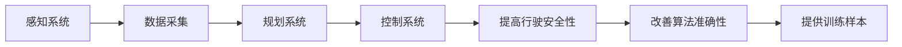

#### 1.3 数据采集车队的概念

数据采集车队是指一组配备有高级感知设备和计算平台的车辆，用于在现实环境中进行数据采集。数据采集车队可以包括多种类型的车辆，如轿车、货车、公交车等，这些车辆通常安装有高分辨率摄像头、激光雷达、GPS等传感器，能够实时捕捉道路环境信息。

数据采集车队的组成主要包括：

- **感知硬件**：如摄像头、激光雷达、GPS等，用于收集环境数据。
- **计算平台**：如高性能计算机、GPU等，用于实时处理和存储数据。
- **数据传输设备**：如4G/5G网络设备，用于将采集到的数据实时传输到数据中心。

图 1-3 数据采集车队的组成

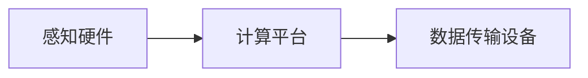

通过数据采集车队，自动驾驶公司能够高效、大规模地收集道路环境数据，为自动驾驶系统的开发和优化提供宝贵的数据资源。接下来，我们将进一步探讨自动驾驶数据采集车队的架构和运营管理。

---

在下一章中，我们将深入分析自动驾驶数据采集车队的架构，包括车辆硬件配置、数据采集流程以及数据处理与存储方案。

---

## 第2章：自动驾驶数据采集车队的架构

数据采集车队的成功运作依赖于其高效、稳定的架构设计。本章节将详细介绍自动驾驶数据采集车队的架构，包括车辆硬件配置、数据采集流程以及数据处理与存储方案。

### 2.1 车辆硬件配置

车辆硬件配置是数据采集车队的关键组成部分，决定了数据采集的准确性和效率。以下是车辆硬件配置的主要组成部分：

#### 感知硬件

感知硬件负责收集车辆周围的环境信息。主要设备包括：

- **摄像头**：用于捕获道路场景和周围物体的图像信息。高分辨率摄像头能够提供更清晰的图像，有助于提高自动驾驶算法的准确性。
- **激光雷达（LiDAR）**：用于测量车辆与周围物体之间的距离，生成高精度的三维点云数据。激光雷达具有强穿透能力和远距离探测能力，适用于复杂环境的数据采集。
- **GPS**：用于获取车辆的位置信息，确保数据采集的精确性。
- **IMU（惯性测量单元）**：用于测量车辆的加速度和角速度，辅助自动驾驶算法进行运动预测。

图 2-1 车辆感知硬件配置

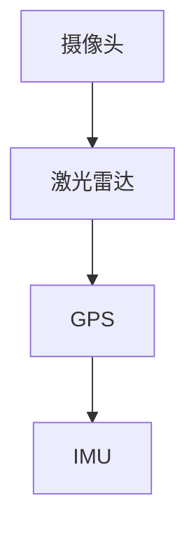

#### 计算平台

计算平台负责实时处理和存储采集到的数据。主要设备包括：

- **高性能计算机**：用于实时处理大量的数据，运行复杂的算法模型。
- **GPU（图形处理单元）**：用于加速数据计算和算法训练，提高处理速度和效率。
- **存储设备**：用于存储采集到的原始数据和预处理后的数据，支持大规模数据的存储和快速访问。

图 2-2 车辆计算平台配置

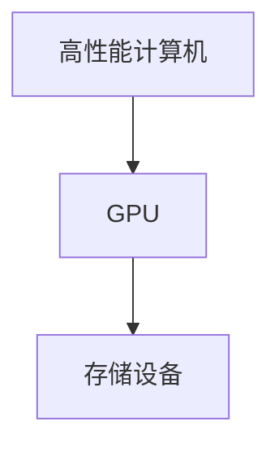

#### 数据传输设备

数据传输设备负责将采集到的数据实时传输到数据中心。主要设备包括：

- **4G/5G网络设备**：用于实现高速、稳定的数据传输，确保数据采集的实时性和完整性。
- **无线传输模块**：用于在车辆之间传输数据，实现多车协同数据采集。

图 2-3 车辆数据传输设备配置

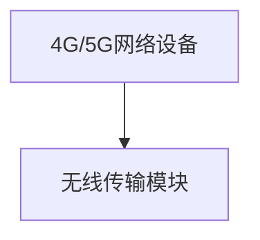

### 2.2 数据采集流程

数据采集流程是数据采集车队的核心环节，决定了数据采集的完整性和准确性。以下是数据采集的基本流程：

#### 数据采集

数据采集包括以下步骤：

1. **感知数据采集**：车辆上的感知硬件（摄像头、激光雷达、GPS、IMU等）实时采集道路场景和周围物体的信息。
2. **数据预处理**：对采集到的原始数据进行预处理，包括图像增强、点云滤波、数据去噪等，以提高数据质量。

图 2-4 数据采集流程

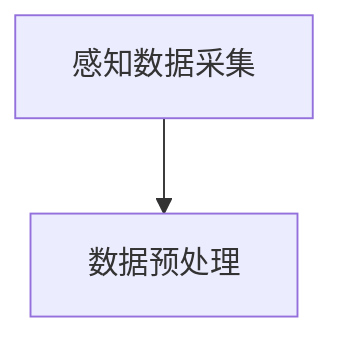

#### 数据传输

数据传输包括以下步骤：

1. **实时数据传输**：通过4G/5G网络设备或无线传输模块，将预处理后的数据实时传输到数据中心或云端。
2. **数据存储**：将传输到的数据进行存储，以便后续的数据处理和分析。

图 2-5 数据传输流程

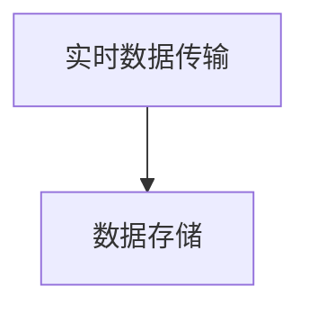

### 2.3 数据处理与存储

数据处理与存储是数据采集车队的关键环节，决定了数据的有效利用和长期存储。以下是数据处理与存储的基本方案：

#### 数据处理

数据处理包括以下步骤：

1. **数据融合**：将不同感知设备采集到的数据进行融合，生成统一的数据集。
2. **数据标注**：对采集到的数据进行标注，标记道路标志、交通信号灯、行人等物体，以便进行后续的训练和验证。
3. **数据清洗**：对数据进行清洗，去除噪声数据和异常值，保证数据的质量和一致性。
4. **数据建模**：利用机器学习算法对数据进行分析和建模，提取有用的特征，构建自动驾驶算法模型。

图 2-6 数据处理流程

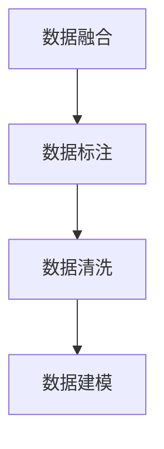

#### 数据存储

数据存储包括以下方案：

1. **分布式存储**：采用分布式存储系统（如HDFS、Cassandra等），实现大规模数据的分布式存储和管理，保证数据的高可用性和可靠性。
2. **云存储**：利用云存储服务（如AWS S3、Google Cloud Storage等），实现数据的远程存储和访问，方便数据的备份和恢复。
3. **数据湖**：构建数据湖（如Apache Hadoop、Amazon S3等），实现对多源数据的统一存储和管理，支持数据分析和挖掘。

图 2-7 数据存储方案

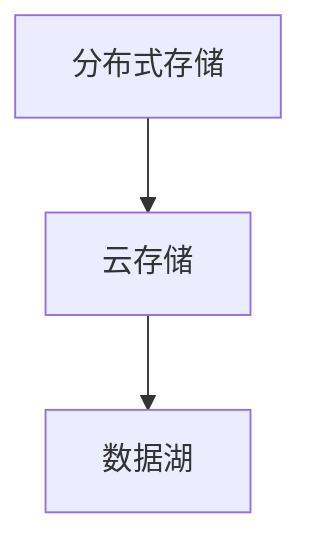

通过以上架构设计，自动驾驶数据采集车队能够高效、稳定地运作，为自动驾驶系统的开发和优化提供可靠的数据支持。在下一章中，我们将深入探讨自动驾驶数据采集车队的运营管理，包括运营管理概述、车队调度策略和数据采集质量保障。

---

在下一章中，我们将详细讨论自动驾驶数据采集车队的运营管理，重点关注运营管理的目的、核心内容以及车队调度策略等方面。

---

## 第3章：自动驾驶数据采集车队的运营管理

### 3.1 运营管理概述

自动驾驶数据采集车队的运营管理是一个复杂而系统化的过程，其核心目标是通过高效的管理策略和科学的调度，确保数据采集工作的高效、准确和持续进行。运营管理的有效实施不仅能够提高数据采集的质量和数量，还能降低运营成本，提升企业的核心竞争力。

#### 运营管理的目的

自动驾驶数据采集车队的运营管理主要涵盖以下几个方面的目的：

1. **确保数据采集的全面性和准确性**：通过科学的管理和调度，确保采集到的数据能够全面、准确地反映实际道路环境。
2. **提高运营效率**：优化调度策略，提高数据采集车队的运行效率，减少不必要的时间浪费。
3. **降低运营成本**：通过合理的资源配置和调度，降低运营成本，提高企业的经济效益。
4. **保障数据安全**：确保数据在采集、传输和存储过程中的安全性，防止数据泄露或损坏。
5. **支持持续改进**：通过数据分析和反馈，不断优化自动驾驶算法和运营管理策略。

#### 运营管理的核心内容

自动驾驶数据采集车队的运营管理涉及多个方面，主要包括以下几个方面：

1. **车辆管理**：包括车辆维护、保养、更新和调度。确保车辆处于良好运行状态，提高数据采集的稳定性和可靠性。
2. **数据管理**：包括数据采集、预处理、标注、存储和传输。确保数据质量，支持后续的数据分析和建模。
3. **调度管理**：包括车队调度策略的制定和执行。通过优化调度，提高数据采集的效率和覆盖范围。
4. **安全管理**：包括数据安全和车辆运行安全。制定并执行相关安全政策和措施，防止安全风险。
5. **质量管理**：包括数据质量和运营过程的质量控制。建立质量标准，监控和评估运营效果。

### 3.2 车队调度策略

车队调度是自动驾驶数据采集车队运营管理中的关键环节，其核心目标是优化数据采集的效率和质量。以下是一些常见的车队调度策略：

#### 1. 基于时间规划的调度策略

这种策略通过预先规划数据采集的时间表，确保在不同时间段和环境中都能有效地进行数据采集。例如，在高峰时段进行交通流量数据采集，在夜间进行道路标志和信号灯的数据采集。

图 3-1 基于时间规划的调度策略

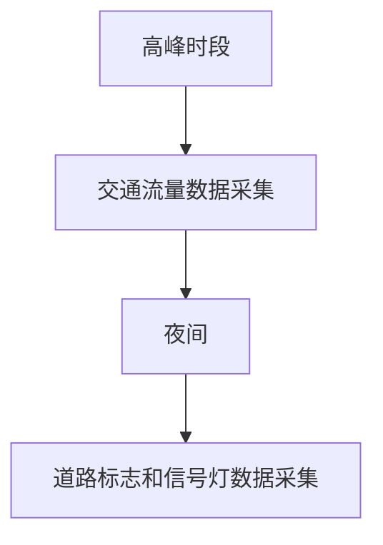

#### 2. 基于需求响应的调度策略

这种策略根据实时需求进行调度，能够快速响应特定数据采集任务。例如，当某个地区发生交通事故或道路施工时，立即调整车队进行相关数据采集。

图 3-2 基于需求响应的调度策略

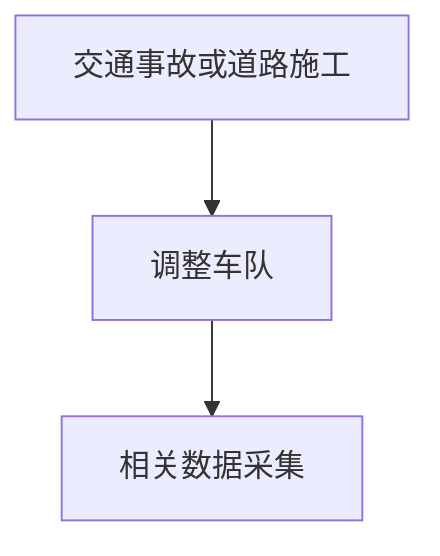

#### 3. 基于资源优化的调度策略

这种策略通过优化车辆和资源的利用，提高数据采集的效率和覆盖范围。例如，根据车辆的状态和传感器的性能，合理分配数据采集任务。

图 3-3 基于资源优化的调度策略

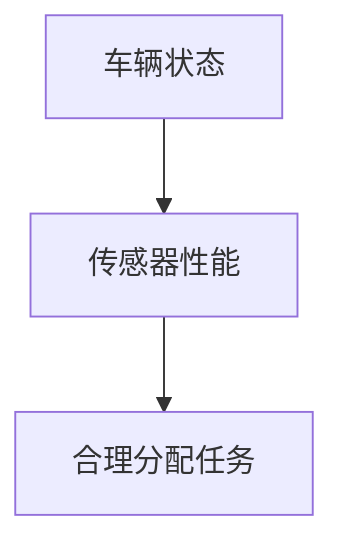

#### 案例分析

某自动驾驶公司需要在一个城市进行道路测绘数据采集，以下是该公司采用的一种优化调度策略：

1. **需求分析**：分析城市道路结构、交通流量和采集任务需求，确定数据采集的重点区域和时间。
2. **时间规划**：根据交通流量高峰时段和夜间道路状况，制定时间表，确保在不同时间段采集到高质量的数据。
3. **资源优化**：根据车辆和传感器的状态，合理分配数据采集任务，确保车辆和传感器的高效利用。
4. **实时调整**：根据实时交通状况和采集任务进展，灵活调整调度策略，确保采集任务的顺利进行。

通过以上调度策略，该公司成功完成了道路测绘数据采集任务，采集到的数据质量高且覆盖范围广，为自动驾驶算法的开发和优化提供了宝贵的数据资源。

### 3.3 数据采集质量保障

数据采集质量是自动驾驶数据采集车队运营管理的关键指标，直接影响到自动驾驶系统的性能和可靠性。以下是一些保障数据采集质量的关键措施：

#### 1. 数据质量标准

制定数据质量标准，明确数据采集的要求和评价指标。例如，图像分辨率、点云数据精度、GPS定位精度等。

#### 2. 数据预处理

对采集到的原始数据进行预处理，包括图像增强、点云滤波、去噪等，提高数据的质量和一致性。

#### 3. 数据标注

对采集到的数据进行标注，标记道路标志、交通信号灯、行人等物体，确保数据的有效利用。

#### 4. 数据清洗

对数据进行清洗，去除噪声数据和异常值，确保数据的准确性和一致性。

#### 5. 数据审核

建立数据审核机制，对采集到的数据进行定期审核，发现并纠正数据质量问题。

#### 6. 数据监控

建立数据监控系统，实时监控数据采集过程，确保数据采集的稳定性和可靠性。

通过以上措施，可以有效保障数据采集的质量，为自动驾驶系统的开发和优化提供可靠的数据支持。在下一章中，我们将探讨自动驾驶数据采集车队的安全管理，重点关注安全管理的重要性、措施和应急预案。

---

在下一章中，我们将详细探讨自动驾驶数据采集车队的安全管理，包括安全管理的重要性、具体措施以及应急处置预案。

---

## 第4章：自动驾驶数据采集车队的安全管理

自动驾驶数据采集车队在运行过程中涉及大量的数据和硬件设备，因此安全管理至关重要。有效的安全管理不仅可以保护数据的安全和完整性，还能保障车队运行的稳定性和可靠性。本章将详细探讨自动驾驶数据采集车队的安全管理，包括其重要性、具体措施和应急处置预案。

### 4.1 安全管理的重要性

自动驾驶数据采集车队的运营涉及到多个方面，包括数据安全、车辆运行安全以及网络安全等。安全管理的重要性主要体现在以下几个方面：

1. **数据安全**：自动驾驶数据采集车队收集的数据是自动驾驶系统训练和优化的重要资源。如果数据被篡改或泄露，可能会导致自动驾驶系统性能下降，甚至危及车辆和行人的安全。
2. **车辆运行安全**：数据采集车队在道路上行驶，需要面对各种交通状况和环境变化。保障车辆的运行安全，是确保数据采集工作顺利进行的前提。
3. **网络安全**：数据采集车队通过网络将数据传输到数据中心，网络安全是保障数据传输过程安全和防止网络攻击的关键。
4. **法规遵从**：自动驾驶数据采集车队的运营需要遵守相关的法律法规和标准，确保其合法合规。

图 4-1 安全管理的重要性

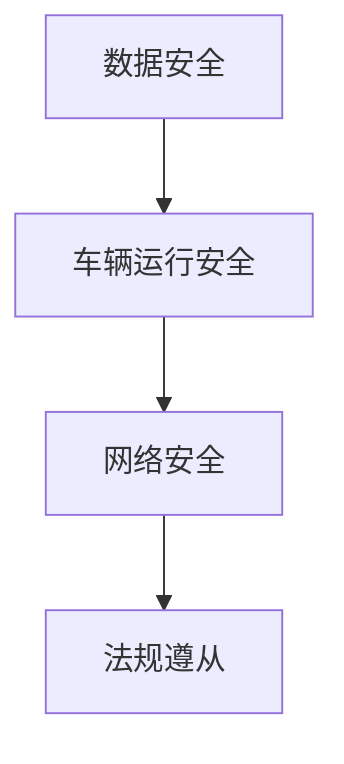

### 4.2 安全管理措施

为了保障自动驾驶数据采集车队的安全，需要采取一系列有效的安全管理措施。以下是一些关键措施：

#### 1. 数据安全措施

- **数据加密**：对采集到的数据进行加密处理，确保数据在传输和存储过程中的安全性。
- **访问控制**：建立严格的访问控制机制，确保只有授权人员才能访问敏感数据。
- **备份与恢复**：定期备份数据，并建立数据恢复机制，确保在数据丢失或损坏时能够迅速恢复。

图 4-2 数据安全措施

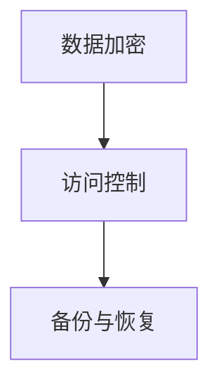

#### 2. 车辆运行安全措施

- **车辆维护**：定期对车辆进行维护和保养，确保车辆处于良好运行状态。
- **驾驶培训**：对驾驶人员进行专业的驾驶培训，提高其应对各种交通状况的能力。
- **紧急处置**：制定紧急处置预案，确保在发生意外时能够迅速采取有效措施。

图 4-3 车辆运行安全措施

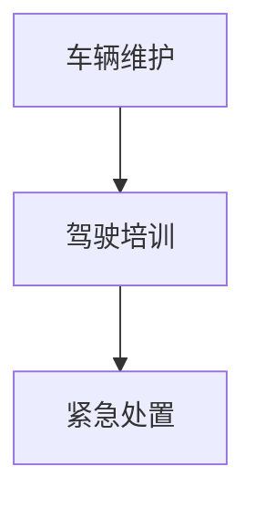

#### 3. 网络安全措施

- **网络安全防护**：部署防火墙、入侵检测系统和防病毒软件，防止网络攻击和恶意软件入侵。
- **数据传输加密**：使用加密技术确保数据在传输过程中的安全性。
- **安全监控**：建立实时监控机制，监控网络流量和数据传输情况，及时发现和处理异常情况。

图 4-4 网络安全措施

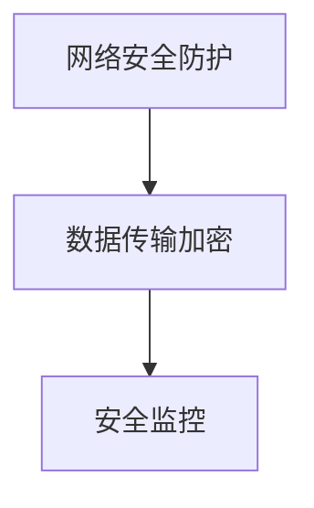

### 4.3 应急处置预案

在自动驾驶数据采集车队的运营过程中，可能会遇到各种突发情况，如数据泄露、车辆故障、网络攻击等。制定完善的应急处置预案，可以确保在发生突发事件时能够迅速响应和处理，最大限度地降低损失。以下是一个典型的应急处置预案：

#### 1. 数据泄露应急处置

- **立即停机**：在发现数据泄露时，立即停止数据采集和传输，防止进一步数据泄露。
- **分析原因**：对数据泄露的原因进行详细分析，找出漏洞并修复。
- **通知相关部门**：及时通知相关部门，如数据安全团队、法律部门等，采取相应措施。
- **数据恢复**：根据备份策略，恢复被泄露的数据，确保数据完整性。

图 4-5 数据泄露应急处置预案

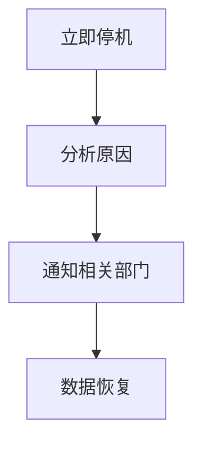

#### 2. 车辆故障应急处置

- **现场救援**：在车辆发生故障时，立即通知救援人员，进行现场救援。
- **车辆维修**：对故障车辆进行维修，确保车辆能够恢复正常运行。
- **数据备份**：在车辆维修过程中，确保采集到的数据得到备份，防止数据丢失。

图 4-6 车辆故障应急处置预案

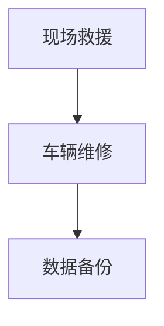

#### 3. 网络攻击应急处置

- **立即停机**：在网络攻击发生时，立即停止数据采集和传输，防止攻击扩散。
- **分析攻击源**：对网络流量进行分析，找出攻击源并进行封禁。
- **通知相关部门**：及时通知网络安全团队、IT部门等，采取相应措施。
- **系统加固**：对系统进行加固和修复，防止类似攻击再次发生。

图 4-7 网络攻击应急处置预案

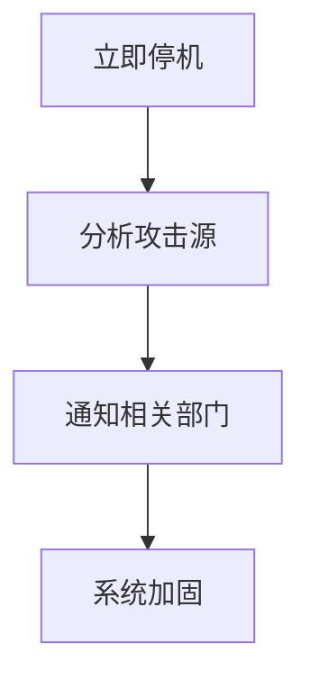

通过以上安全管理措施和应急处置预案，可以有效保障自动驾驶数据采集车队的安全运行，为自动驾驶技术的发展和应用提供坚实的安全保障。在下一章中，我们将探讨自动驾驶数据采集车队的维护与升级，包括维护策略、软件升级管理和车辆生命周期管理。

---

在下一章中，我们将详细讨论自动驾驶数据采集车队的维护与升级，重点关注维护策略、软件升级管理以及车辆生命周期管理。

---

## 第5章：自动驾驶数据采集车队的维护与升级

自动驾驶数据采集车队的长期稳定运行和维护是保障数据采集效率和数据质量的关键。本章节将详细探讨自动驾驶数据采集车队的维护与升级，包括维护策略、软件升级管理和车辆生命周期管理。

### 5.1 维护策略

数据采集车队的维护策略是确保车队运行稳定性和数据采集准确性的重要措施。以下是一些关键的维护策略：

#### 1. 定期检查与维护

- **传感器检查**：定期检查摄像头、激光雷达等传感器的状态，确保其正常工作。
- **车辆状态检查**：定期检查车辆的机械部分，如轮胎、刹车系统、电池等，确保车辆运行正常。
- **计算平台检查**：定期检查计算平台的硬件和软件状态，确保其能够高效处理数据。

图 5-1 定期检查与维护

```mermaid
graph TD
A[传感器检查] --> B[车辆状态检查]
B --> C[计算平台检查]
```

#### 2. 异常处理

- **故障报警**：在传感器或计算平台出现故障时，立即触发报警机制，通知相关人员处理。
- **紧急修复**：在发现传感器或车辆出现故障时，立即进行紧急修复，确保数据采集工作不受影响。

图 5-2 异常处理

```mermaid
graph TD
A[故障报警] --> B[紧急修复]
```

#### 3. 预防性维护

- **定期更新传感器软件**：定期更新传感器的软件，以修复已知的漏洞和缺陷。
- **车辆保养计划**：制定详细的车辆保养计划，包括轮胎更换、机油更换等，确保车辆的长期运行。

图 5-3 预防性维护

```mermaid
graph TD
A[传感器软件更新] --> B[车辆保养计划]
```

### 5.2 软件升级管理

软件升级管理是确保数据采集车队软件系统保持最新状态的重要环节。以下是一些关键的软件升级管理策略：

#### 1. 软件版本控制

- **版本管理**：使用版本控制系统（如Git）对软件代码进行版本控制，确保软件的版本可控。
- **变更日志**：记录每个软件版本的变更内容，方便追踪和管理。

图 5-4 软件版本控制

```mermaid
graph TD
A[版本管理] --> B[变更日志]
```

#### 2. 软件升级流程

- **测试环境**：在正式部署前，先在测试环境中进行软件升级测试，确保升级后的系统稳定可靠。
- **逐步部署**：分阶段部署软件升级，避免一次性升级带来的潜在风险。
- **监控与反馈**：在软件升级后，实时监控系统运行状态，收集用户反馈，及时发现和解决潜在问题。

图 5-5 软件升级流程

```mermaid
graph TD
A[测试环境] --> B[逐步部署]
B --> C[监控与反馈]
```

#### 3. 软件更新策略

- **定期更新**：制定定期更新策略，确保软件系统能够持续保持最新状态。
- **紧急修复**：对于关键漏洞和紧急问题，及时发布修复补丁，确保系统安全稳定。

图 5-6 软件更新策略

```mermaid
graph TD
A[定期更新] --> B[紧急修复]
```

### 5.3 车辆生命周期管理

车辆生命周期管理是确保数据采集车队车辆能够长期稳定运行的重要策略。以下是一些关键的车辆生命周期管理策略：

#### 1. 车辆更新与替换

- **评估性能**：定期评估车辆的性能和状态，根据评估结果决定是否进行更新或替换。
- **更新策略**：根据车辆的使用频率和性能需求，制定合理的车辆更新策略，确保车队始终处于最佳状态。

图 5-7 车辆更新与替换

```mermaid
graph TD
A[评估性能] --> B[更新策略]
```

#### 2. 车辆退役处理

- **退役评估**：对即将退役的车辆进行详细评估，确保退役过程不影响数据采集工作。
- **退役计划**：制定退役计划，包括车辆拆卸、数据清理、车辆报废等环节，确保退役过程有序进行。

图 5-8 车辆退役处理

```mermaid
graph TD
A[退役评估] --> B[退役计划]
```

通过以上维护与升级策略，自动驾驶数据采集车队可以长期稳定运行，为自动驾驶技术的发展和应用提供坚实的技术支持。在下一章中，我们将探讨自动驾驶数据采集车队的应用领域，包括道路测绘、道路检测与维护以及道路安全监控。

---

在下一章中，我们将详细探讨自动驾驶数据采集车队的应用领域，分析其在道路测绘、道路检测与维护以及道路安全监控等方面的实际应用。

---

## 第6章：自动驾驶数据采集车队的应用领域

自动驾驶数据采集车队在各个领域的应用正逐渐扩展，其高效的数据采集能力和强大的数据处理能力使其在道路测绘、道路检测与维护以及道路安全监控等领域发挥着重要作用。本章节将深入探讨自动驾驶数据采集车队的应用领域，分析其在不同领域的实际应用。

### 6.1 道路测绘

道路测绘是自动驾驶数据采集车队的重要应用之一。通过高精度的数据采集设备，如激光雷达、GPS和摄像头，自动驾驶数据采集车队能够获取道路的精确三维模型、道路标志和交通信号灯等信息。

#### 数据采集方法

道路测绘的数据采集方法主要包括以下步骤：

1. **高精度定位**：利用GPS获取车辆的精确位置信息，为后续数据采集提供空间参考。
2. **激光雷达扫描**：使用激光雷达对道路周围环境进行扫描，生成高精度的三维点云数据。
3. **摄像头拍摄**：利用高分辨率摄像头拍摄道路场景，获取道路标志、交通信号灯等图像信息。
4. **数据融合**：将激光雷达点云数据和摄像头图像数据进行融合，生成完整的道路三维模型。

图 6-1 道路测绘数据采集流程

```mermaid
graph TD
A[高精度定位] --> B[激光雷达扫描]
B --> C[摄像头拍摄]
C --> D[数据融合]
```

#### 测绘数据的处理与应用

采集到的测绘数据需要进行预处理、标注和建模，以生成可用于自动驾驶算法训练和优化的数据集。以下是一些关键的步骤：

1. **数据预处理**：对采集到的原始数据进行滤波、去噪等处理，提高数据质量。
2. **数据标注**：对道路标志、交通信号灯等进行标注，为后续的算法训练提供标签。
3. **数据建模**：利用机器学习算法对数据进行分析和建模，提取有用的特征，构建道路检测和识别模型。

图 6-2 测绘数据处理与应用流程

```mermaid
graph TD
A[数据预处理] --> B[数据标注]
B --> C[数据建模]
```

#### 应用案例

某城市在进行道路改造项目前，利用自动驾驶数据采集车队对现有道路进行详细测绘。通过采集到的测绘数据，该项目团队生成了精确的道路三维模型，并对道路标志和交通信号灯进行了详细标注。这些数据为道路改造提供了重要参考，大大提高了道路改造的准确性和效率。

### 6.2 道路检测与维护

自动驾驶数据采集车队在道路检测与维护领域也有着广泛的应用。通过采集到的道路数据，可以对道路的平整度、裂缝、坑洞等问题进行检测，并及时进行维护，确保道路的安全性和舒适性。

#### 数据采集方法

道路检测与维护的数据采集方法主要包括以下步骤：

1. **车载传感器**：使用车载传感器（如激光雷达、摄像头、GPS等）对道路进行扫描和拍摄。
2. **数据预处理**：对采集到的原始数据进行滤波、去噪等处理，提高数据质量。
3. **数据标注**：对检测到的道路问题进行标注，如裂缝、坑洞等。
4. **数据建模**：利用机器学习算法对道路问题进行分类和识别。

图 6-3 道路检测与维护数据采集流程

```mermaid
graph TD
A[车载传感器] --> B[数据预处理]
B --> C[数据标注]
C --> D[数据建模]
```

#### 路况数据的处理与应用

采集到的路况数据需要进行预处理、标注和建模，以生成可用于道路维护和优化的数据集。以下是一些关键的步骤：

1. **数据预处理**：对采集到的原始数据进行滤波、去噪等处理，提高数据质量。
2. **数据标注**：对检测到的道路问题进行标注，如裂缝、坑洞等。
3. **数据建模**：利用机器学习算法对道路问题进行分类和识别，为道路维护提供决策支持。

图 6-4 路况数据处理与应用流程

```mermaid
graph TD
A[数据预处理] --> B[数据标注]
B --> C[数据建模]
```

#### 应用案例

某城市交通管理部门利用自动驾驶数据采集车队对城市道路进行检测与维护。通过采集到的路况数据，该部门能够及时发现道路问题，并进行及时维护，提高了道路的安全性和舒适性。同时，通过数据分析和建模，该部门还优化了道路维护策略，降低了维护成本。

### 6.3 道路安全监控

自动驾驶数据采集车队在道路安全监控领域同样发挥着重要作用。通过采集到的道路数据，可以对车辆行驶状态、交通流量、事故风险等进行实时监控和分析，提高道路安全性和交通效率。

#### 数据采集方法

道路安全监控的数据采集方法主要包括以下步骤：

1. **车载传感器**：使用车载传感器（如激光雷达、摄像头、GPS等）对道路和车辆进行扫描和拍摄。
2. **数据预处理**：对采集到的原始数据进行滤波、去噪等处理，提高数据质量。
3. **数据标注**：对监控到的交通事件进行标注，如车辆超速、违反交通规则等。
4. **数据建模**：利用机器学习算法对交通事件进行分类和识别。

图 6-5 道路安全监控数据采集流程

```mermaid
graph TD
A[车载传感器] --> B[数据预处理]
B --> C[数据标注]
C --> D[数据建模]
```

#### 监控数据的处理与分析

采集到的监控数据需要进行预处理、标注和建模，以生成可用于安全监控和交通优化分析的数据集。以下是一些关键的步骤：

1. **数据预处理**：对采集到的原始数据进行滤波、去噪等处理，提高数据质量。
2. **数据标注**：对监控到的交通事件进行标注，如车辆超速、违反交通规则等。
3. **数据建模**：利用机器学习算法对交通事件进行分类和识别，为道路安全管理提供决策支持。

图 6-6 监控数据处理与分析流程

```mermaid
graph TD
A[数据预处理] --> B[数据标注]
B --> C[数据建模]
```

#### 应用案例

某城市交通管理部门利用自动驾驶数据采集车队对城市道路进行安全监控。通过采集到的道路数据，该部门能够实时监控车辆行驶状态和交通流量，及时发现和处理交通事件，提高了道路安全性和交通效率。同时，通过数据分析和建模，该部门还优化了交通信号灯控制策略，减少了交通拥堵。

通过以上应用案例可以看出，自动驾驶数据采集车队在道路测绘、道路检测与维护以及道路安全监控等领域的实际应用具有显著的优势，为城市交通管理提供了强大的技术支持。

---

在下一章中，我们将分享自动驾驶数据采集车队的成功案例，包括道路测绘项目、高速公路安全监控项目和自动驾驶技术研发项目，详细分析每个项目的背景、实施过程和成果。

---

## 第7章：自动驾驶数据采集车队的成功案例

自动驾驶数据采集车队在实际应用中取得了诸多成功案例，这些案例展示了数据采集车队在不同领域的应用潜力和价值。本章将详细介绍三个典型的成功案例：某城市道路测绘项目、某高速公路安全监控项目以及某自动驾驶技术研发项目。

### 7.1 案例一：某城市道路测绘项目

#### 背景与目标

某城市为了提升交通基础设施建设和优化城市规划，决定开展一次全面的道路测绘项目。项目目标是通过高精度的数据采集，生成城市道路的三维模型，以便于后续的城市规划和道路改造工作。

#### 实施过程

1. **数据采集**：项目团队部署了多辆自动驾驶数据采集车队，包括高分辨率摄像头、激光雷达和GPS设备。车队在城市的主要道路、次干道和支路上进行数据采集，共采集了超过1000公里的道路数据。
2. **数据预处理**：采集到的数据经过预处理，包括滤波、去噪和图像增强等步骤，以确保数据质量。
3. **数据融合**：将激光雷达点云数据和摄像头图像数据进行融合，生成精确的三维道路模型。
4. **数据建模**：利用机器学习算法对数据进行分析，提取有用的特征，生成道路标志、交通信号灯等标注数据。
5. **成果展示**：生成的三维道路模型被用于城市规划软件，为城市规划和道路改造提供了重要参考。

#### 项目成果

通过本次道路测绘项目，城市交通管理部门获得了精确的三维道路模型，提高了城市规划和道路改造的准确性和效率。同时，数据采集过程中生成的标注数据也为自动驾驶算法的开发提供了宝贵的训练资源。

### 7.2 案例二：某高速公路安全监控项目

#### 背景与目标

某高速公路管理部门为了提升道路安全性和交通效率，决定开展一次高速公路安全监控项目。项目目标是通过数据采集和监控分析，及时发现和处理道路安全隐患，提高道路运行安全。

#### 实施过程

1. **数据采集**：项目团队在高速公路的关键路段部署了自动驾驶数据采集车队，包括激光雷达、摄像头和GPS设备。车队对道路、车辆和交通流量进行实时数据采集。
2. **数据预处理**：采集到的数据经过预处理，包括滤波、去噪和图像增强等步骤，以确保数据质量。
3. **数据建模**：利用机器学习算法对数据进行分析，识别道路隐患，如车辆超速、违反交通规则等。
4. **实时监控**：建立实时监控平台，对采集到的数据进行实时分析和预警，及时发现和处理安全隐患。
5. **数据反馈**：将监控结果反馈给高速公路管理部门，为道路安全管理提供决策支持。

#### 项目成果

通过本次高速公路安全监控项目，高速公路管理部门能够实时监控道路状况，及时发现和处理安全隐患，提高了道路运行安全性和交通效率。同时，数据采集和分析结果也为道路维护和优化提供了重要参考。

### 7.3 案例三：某自动驾驶技术研发项目

#### 背景与目标

某自动驾驶公司为了加速自动驾驶技术研发，决定利用自动驾驶数据采集车队进行大规模的数据采集和算法训练。项目目标是通过高质量的数据集，提高自动驾驶算法的准确性和鲁棒性。

#### 实施过程

1. **数据采集**：项目团队部署了多辆自动驾驶数据采集车队，覆盖了城市道路、高速公路和复杂路况。车队共采集了超过100万公里的道路数据。
2. **数据预处理**：采集到的数据经过预处理，包括滤波、去噪和图像增强等步骤，以确保数据质量。
3. **数据标注**：对采集到的数据进行标注，标记道路标志、交通信号灯、行人等物体。
4. **数据建模**：利用机器学习算法对数据进行分析和建模，提取有用的特征，生成自动驾驶算法模型。
5. **算法训练**：使用标注后的数据集对自动驾驶算法进行训练和优化，提高算法的准确性和鲁棒性。

#### 项目成果

通过本次自动驾驶技术研发项目，公司成功训练出了多套高精度的自动驾驶算法模型，提高了自动驾驶系统的准确性和稳定性。这些算法模型为自动驾驶车辆的商业化应用提供了坚实的技术保障。

以上三个成功案例展示了自动驾驶数据采集车队在不同领域的实际应用和价值。通过高质量的数据采集和数据分析，自动驾驶数据采集车队为城市交通管理、道路安全和自动驾驶技术研发提供了有力支持。

---

在最后一部分，我们将探讨自动驾驶数据采集车队的未来发展趋势，包括新技术应用、法规与政策以及数据利用与价值。

---

## 第8章：自动驾驶数据采集车队的未来发展趋势

随着自动驾驶技术的快速发展，数据采集车队在自动驾驶系统中的应用将愈加广泛和深入。未来，自动驾驶数据采集车队将在新技术应用、法规与政策以及数据利用与价值等方面迎来新的发展机遇和挑战。

### 8.1 新技术应用

#### 5G技术

5G技术的普及将大大提升自动驾驶数据采集车队的传输速度和稳定性。5G网络的高带宽、低延迟特点，能够满足大规模数据实时传输的需求，为自动驾驶系统的实时决策和响应提供有力支持。此外，5G网络还支持车联网（V2X）技术，实现车辆之间、车辆与基础设施之间的信息共享和协同，进一步提升自动驾驶的安全性和效率。

#### 边缘计算技术

边缘计算技术将数据处理能力从云端转移到车辆边缘设备，实现实时数据分析和处理。这对于自动驾驶数据采集车队尤为重要，因为车辆在行驶过程中需要快速处理大量感知数据，以做出即时决策。边缘计算能够降低数据传输延迟，提高数据处理的实时性和可靠性，从而提升自动驾驶系统的性能和稳定性。

### 8.2 法规与政策

#### 自动驾驶数据采集相关政策

各国政府正积极制定自动驾驶数据采集的相关政策，以规范自动驾驶技术的发展和应用。这些政策主要包括数据安全、隐私保护、数据共享和开放等方面。例如，美国、欧洲和中国等国家已经出台了一系列数据采集和使用的法规，要求企业遵守数据保护标准，确保数据的合法合规使用。

#### 数据安全法规与标准

随着数据采集规模的扩大，数据安全成为自动驾驶数据采集车队面临的重要挑战。未来，各国将加强对自动驾驶数据采集的安全监管，制定更加严格的数据安全法规和标准。这包括数据加密、访问控制、网络安全防护等方面，以确保数据在采集、传输和存储过程中的安全性和隐私保护。

### 8.3 数据利用与价值

#### 数据挖掘与分析

自动驾驶数据采集车队收集的数据不仅用于自动驾驶系统的开发，还可以应用于交通管理、城市规划、交通安全等领域。通过数据挖掘和分析，可以从大量数据中提取有价值的信息，如交通流量模式、道路使用情况、事故发生原因等。这些信息为政府和企业提供了重要的决策支持，有助于优化交通基础设施和提升交通管理水平。

#### 数据商业化的前景

随着数据采集技术的进步和数据分析能力的提升，自动驾驶数据采集车队的商业价值将不断凸显。企业可以通过数据共享、数据交易、数据分析服务等商业模式，将数据转化为实际商业利益。例如，交通管理部门可以通过数据服务优化交通信号控制，降低交通拥堵；保险公司可以通过车辆数据优化保险定价，提高服务质量。

#### 智能交通系统

自动驾驶数据采集车队与智能交通系统（ITS）的结合，将大大提升交通管理和服务的智能化水平。通过实时数据采集和分析，智能交通系统能够动态调整交通信号、优化路线规划、预测交通流量等，提高道路使用效率和安全性。未来，智能交通系统将依赖于自动驾驶数据采集车队的支持，实现更智能、更高效的城市交通管理。

综上所述，自动驾驶数据采集车队的未来发展趋势充满机遇和挑战。通过新技术应用、法规政策完善和数据价值挖掘，自动驾驶数据采集车队将在自动驾驶技术的发展和智能交通系统的构建中发挥越来越重要的作用。

---

## 附录

### 附录A：自动驾驶数据采集车队相关术语解释

- **自动驾驶**：指通过传感器、计算机视觉、机器学习等技术，使车辆能够在没有人类司机干预的情况下安全、可靠地运行。
- **数据采集**：指收集车辆周围环境信息的过程，包括道路、交通信号、车辆和行人等。
- **激光雷达（LiDAR）**：一种利用激光脉冲测量目标物体距离和形态的遥感技术。
- **GPS**：全球定位系统，用于获取车辆的位置信息。
- **IMU**：惯性测量单元，用于测量车辆的加速度和角速度。
- **数据预处理**：对采集到的原始数据进行滤波、去噪、图像增强等处理，以提高数据质量。
- **数据标注**：对采集到的数据进行标记，如道路标志、交通信号灯、行人等。
- **数据融合**：将不同来源的数据（如激光雷达点云、摄像头图像等）进行整合，以生成更全面的数据集。
- **数据存储**：将采集到的数据存储到数据库或存储设备中，以备后续分析和处理。
- **边缘计算**：将数据处理能力从云端转移到靠近数据源的边缘设备，以实现实时数据分析和处理。

### 附录B：自动驾驶数据采集车队常用工具与资源

- **数据采集硬件设备**：
  - **摄像头**：如Sony IMX477、OmniVision OV9282等。
  - **激光雷达**：如Velodyne HDL-32E、Ouster OS1等。
  - **GPS**：如Garmin GPSMAP 66s、Novatel ODU8等。
  - **IMU**：如Xsens MTi-G-716、MPU6050等。

- **数据处理软件工具**：
  - **数据预处理**：如OpenCV、PCL（Point Cloud Library）等。
  - **数据标注**：如LabelImg、NuScenes Dataset等。
  - **数据存储**：如HDFS、Cassandra等。
  - **数据分析**：如TensorFlow、PyTorch等。

- **车队管理平台**：
  - **车队调度**：如Schedulix、Celularis等。
  - **数据监控**：如Kibana、Grafana等。
  - **安全防护**：如Nginx、Splunk等。

这些工具和资源为自动驾驶数据采集车队的运营和管理提供了全面的解决方案，有助于提升数据采集和处理效率，保障车队的稳定运行。

---

### 作者信息

**作者：AI天才研究院/AI Genius Institute & 禅与计算机程序设计艺术 /Zen And The Art of Computer Programming**

在本文中，我们深入探讨了自动驾驶数据采集车队的运营管理，包括其架构、运营管理、安全管理以及维护与升级等方面。通过分析成功案例和未来发展趋势，我们展示了自动驾驶数据采集车队在实际应用中的重要性和潜在价值。希望本文能为自动驾驶领域的专业人士提供有价值的参考和启示。

