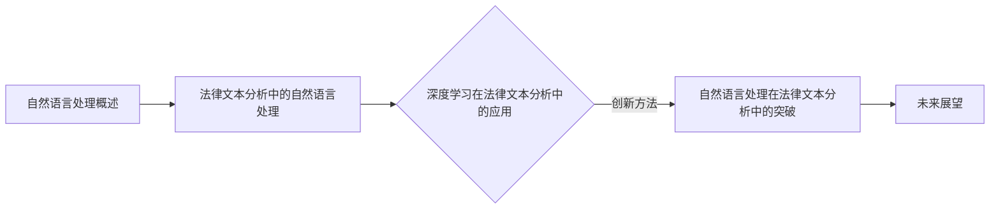

                 

# 自然语言处理在法律文本分析中的突破

> **关键词：自然语言处理，法律文本分析，深度学习，文本分类，实体识别，信息抽取**

> **摘要：本文系统地探讨了自然语言处理在法律文本分析中的应用，包括文本预处理、文本分类、实体识别、信息抽取等关键技术。通过具体案例和实践，展示了自然语言处理技术在法律文本分析中的实际应用和突破。**

----------------------------------------------------------------

## 引言

随着信息技术的飞速发展，自然语言处理（Natural Language Processing, NLP）已经成为计算机科学和人工智能领域中的一个重要分支。NLP旨在让计算机理解和生成人类语言，从而实现人机交互和信息处理的自动化。近年来，随着深度学习等先进技术的引入，NLP在文本分类、情感分析、机器翻译等领域取得了显著的进展。

在法律领域，随着法律文档数量的不断增加，传统的法律文本分析手段已经无法满足日益增长的办公需求。自然语言处理技术的引入，为法律文本分析带来了新的可能性。本文将系统地探讨自然语言处理在法律文本分析中的应用，包括文本预处理、文本分类、实体识别、信息抽取等关键技术。通过具体案例和实践，展示自然语言处理技术在法律文本分析中的实际应用和突破。

## 第一部分：自然语言处理概述

### 第1章：自然语言处理基础

#### 第1.1节：自然语言处理的概念与范围

自然语言处理（NLP）是计算机科学、人工智能和语言学领域的一个交叉学科，旨在让计算机理解和生成人类语言。NLP涵盖了从文本处理到语义理解等多个层面，其基本目标是实现人与计算机之间的自然语言交互。

NLP的基本概念包括：

- **文本处理**：涉及文本的格式化、分词、词性标注等基础操作。
- **句法分析**：通过语法规则分析文本结构，理解句子成分之间的关系。
- **语义理解**：理解文本中的含义和语义，包括词义消歧、实体识别等。

NLP的任务分类：

- **文本分类**：将文本分类到预定义的类别中，如新闻分类、垃圾邮件过滤等。
- **信息抽取**：从文本中提取出关键信息，如命名实体识别、关系提取等。
- **机器翻译**：将一种语言的文本翻译成另一种语言。
- **对话系统**：实现人与计算机之间的自然对话。

NLP的发展历程：

- **早期方法**：基于规则的方法和统计方法。
- **现代方法**：引入深度学习等先进技术，如卷积神经网络（CNN）、递归神经网络（RNN）、Transformer等。

#### 第1.2节：语言模型与词向量

语言模型（Language Model）是NLP中用于预测文本序列的概率模型。N-gram模型是最早也是最简单的一种语言模型，它通过统计前N个单词（或字符）的出现频率来预测下一个单词（或字符）。N-gram模型的基本概率计算公式如下：

$$
P(w_n | w_{n-1}, w_{n-2}, ..., w_1) = \frac{count(w_{n-1}, w_{n-2}, ..., w_1, w_n)}{count(w_{n-1}, w_{n-2}, ..., w_1)}
$$

词向量（Word Vector）是将单词映射到一个固定维度的向量空间，以便在机器学习中进行处理。词嵌入（Word Embedding）技术通过将单词映射到低维向量，使得具有相似语义的单词在向量空间中接近。Word2Vec是一种典型的词向量生成方法，它通过训练神经网络来预测单词的上下文。Word2Vec的基本损失函数如下：

$$
L = -\sum_{i=1}^{N} \sum_{w \in C} [y(w) \cdot log(p(w))]
$$

其中，$N$ 是句子长度，$C$ 是句子中的单词集合，$y(w)$ 是单词 $w$ 的标签（1或0），$p(w)$ 是单词 $w$ 的概率分布。

#### 第1.3节：自然语言处理的应用领域

自然语言处理的应用领域非常广泛，涵盖了文本分类与情感分析、信息抽取与实体识别、机器翻译与语音识别等多个方面。

- **文本分类与情感分析**：通过分类模型对文本进行分类，如新闻分类、情感分类等。情感分析用于判断文本的情感极性，如正面、负面或中性。
- **信息抽取与实体识别**：从文本中自动提取出关键信息，如命名实体识别、关系提取等。命名实体识别用于识别文本中的特定实体，如人名、地点、组织等。
- **机器翻译**：将一种语言的文本翻译成另一种语言。近年来，基于神经网络的机器翻译模型取得了显著进展，如基于Transformer的BERT模型。
- **语音识别**：将语音信号转换为文本。语音识别技术广泛应用于语音助手、语音搜索等领域。

### 第2章：自然语言处理的数学基础

#### 第2.1节：线性代数基础

线性代数是自然语言处理中的重要数学工具，用于处理矩阵和向量。以下是一些基础的线性代数概念：

- **矩阵与向量操作**：包括矩阵的加法、减法、乘法等基本操作。
- **线性方程组的求解**：如高斯消元法、矩阵求逆等。
- **特征值与特征向量**：特征值和特征向量是矩阵的重要属性，用于矩阵的分解和特征提取。

#### 第2.2节：概率论基础

概率论是自然语言处理中的另一个重要数学工具，用于处理随机事件和概率。以下是一些基础的概率论概念：

- **随机事件与概率**：随机事件是可能发生的事件，概率是衡量事件发生可能性的一种量度。
- **条件概率与贝叶斯定理**：条件概率是已知一个事件发生时，另一个事件发生的概率。贝叶斯定理是一种计算后验概率的公式。
- **熵与信息论**：熵是衡量信息不确定性的量度，信息论是研究信息传输和处理的数学理论。

#### 第2.3节：优化算法基础

优化算法是自然语言处理中的核心技术，用于训练模型和求解优化问题。以下是一些基础的优化算法：

- **梯度下降法**：梯度下降法是一种迭代优化算法，通过不断更新参数来最小化损失函数。
- **随机梯度下降法**：随机梯度下降法是梯度下降法的一种改进，每次迭代只随机选择一部分样本来计算梯度。
- **其他优化算法**：包括共轭梯度法、牛顿法等。

### 第二部分：法律文本分析中的自然语言处理

#### 第3章：法律文本预处理

法律文本预处理是法律文本分析中的关键步骤，旨在将原始法律文本转换为适合进一步分析的形式。以下是小节内容：

#### 第3.1节：文本清洗与预处理

文本清洗与预处理包括以下步骤：

- **去除标点符号与停用词**：标点符号和停用词（如“的”、“和”等）通常对文本分析没有贡献，因此需要去除。
- **词形还原与词干提取**：词形还原是将不同形态的词转换为基本形式，词干提取是将词的衍生形式还原为词干。
- **语义角色标注与实体识别**：语义角色标注是标记词在句子中的角色，如主语、谓语等。实体识别是识别文本中的特定实体，如人名、地名、组织名等。

#### 第3.2节：法律术语识别

法律术语识别是法律文本分析中的关键任务，旨在识别文本中的法律术语。以下是小节内容：

- **法律术语的收集与分类**：法律术语的收集是构建法律术语库的基础。法律术语可以按类别进行分类，如合同法术语、刑法术语等。
- **基于规则的方法**：基于规则的方法是通过定义一系列规则来识别法律术语。这种方法通常依赖于专业的法律知识和经验。
- **基于深度学习的方法**：基于深度学习的方法通过训练神经网络模型来自动识别法律术语。这种方法可以处理复杂的术语识别任务，但需要大量的训练数据和计算资源。

#### 第3.3节：法律文本分类与聚类

法律文本分类与聚类是法律文本分析中的常见任务，旨在对法律文本进行分类和聚类。以下是小节内容：

- **分类算法介绍**：分类算法是将文本分类到预定义的类别中。常见的分类算法包括朴素贝叶斯、支持向量机、决策树等。
- **聚类算法介绍**：聚类算法是将相似文本聚为一类。常见的聚类算法包括K-means、层次聚类等。
- **实际案例分析**：在实际案例中，法律文本分类与聚类可以用于法律文档分类、案件相似度分析等。

#### 第4章：法律文本的情感分析

法律文本的情感分析是判断法律文本中的情感极性、情感强度和情感时态等。以下是小节内容：

#### 第4.1节：情感分析基础

- **情感极性分类**：情感极性分类是判断法律文本是正面、负面还是中性。常用的情感极性分类算法包括朴素贝叶斯、支持向量机等。
- **情感强度分析**：情感强度分析是判断法律文本中情感的程度。常见的情感强度分析算法包括基于词典的方法和基于机器学习的方法。
- **情感时态分析**：情感时态分析是判断法律文本中的情感时态，如过去、现在或未来。情感时态分析有助于理解法律文本的动态变化。

#### 第4.2节：基于规则的情感分析方法

基于规则的情感分析方法是通过定义一系列规则来判断法律文本的情感。以下是小节内容：

- **情感词典法**：情感词典法是通过构建情感词典来识别法律文本中的情感。情感词典包含一系列情感词及其情感极性。
- **基于规则的情感分析流程**：基于规则的情感分析流程包括文本预处理、情感词典匹配、情感极性判断等步骤。

#### 第4.3节：基于深度学习的情感分析方法

基于深度学习的情感分析方法通过训练神经网络模型来自动判断法律文本的情感。以下是小节内容：

- **卷积神经网络（CNN）在情感分析中的应用**：CNN可以用于捕捉文本的局部特征，从而提高情感分析的准确率。
- **递归神经网络（RNN）在情感分析中的应用**：RNN可以用于处理序列数据，如文本序列，从而捕捉文本的全局特征。
- **实际案例分析**：通过实际案例分析，展示基于深度学习的情感分析方法在法律文本分析中的应用效果。

#### 第5章：法律文本中的实体识别

法律文本中的实体识别是识别文本中的特定实体，如人名、地名、组织名等。以下是小节内容：

#### 第5.1节：实体识别基础

- **实体的定义与分类**：实体是文本中的特定对象，如人、地点、组织等。实体可以按类别进行分类。
- **实体识别的任务与挑战**：实体识别的任务是从文本中识别出实体，并为其分配类别。实体识别面临许多挑战，如实体边界识别、实体类型识别等。

#### 第5.2节：基于规则的方法

基于规则的方法是通过定义一系列规则来识别法律文本中的实体。以下是小节内容：

- **实体识别规则构建**：实体识别规则是基于专业的法律知识和经验构建的。
- **基于规则的方法优缺点分析**：基于规则的方法的优点是简单易实现，缺点是灵活性较差，难以处理复杂的实体识别任务。

#### 第5.3节：基于深度学习的方法

基于深度学习的方法通过训练神经网络模型来自动识别法律文本中的实体。以下是小节内容：

- **序列标注模型在实体识别中的应用**：序列标注模型可以将文本中的每个词标注为实体或非实体。
- **基于注意力机制的实体识别模型**：基于注意力机制的实体识别模型可以自动学习实体的重要性，从而提高实体识别的准确率。
- **实际案例分析**：通过实际案例分析，展示基于深度学习的实体识别方法在法律文本分析中的应用效果。

#### 第6章：法律文本的信息抽取

法律文本的信息抽取是从法律文本中自动提取出关键信息，如案件事实、法律条款等。以下是小节内容：

#### 第6.1节：信息抽取基础

- **信息抽取的定义与任务**：信息抽取是从文本中提取出结构化的信息，如实体、关系等。
- **信息抽取的分类**：信息抽取可以分为基于规则的方法和基于机器学习的方法。

#### 第6.2节：基于规则的信息抽取

基于规则的信息抽取是通过定义一系列规则来提取法律文本中的信息。以下是小节内容：

- **基于模式匹配的方法**：基于模式匹配的方法是通过定义一系列模式来匹配法律文本中的关键信息。
- **基于规则库的方法**：基于规则库的方法是通过构建规则库来提取法律文本中的信息。

#### 第6.3节：基于深度学习的信息抽取

基于深度学习的信息抽取通过训练神经网络模型来自动提取法律文本中的信息。以下是小节内容：

- **基于序列标注的方法**：基于序列标注的方法可以将文本中的每个词标注为实体或非实体。
- **基于端到端的方法**：基于端到端的方法可以一次性将文本转换为结构化的信息。
- **实际案例分析**：通过实际案例分析，展示基于深度学习的信息抽取方法在法律文本分析中的应用效果。

#### 第7章：法律文本分析的应用案例

法律文本分析的应用案例涵盖了多个方面，如合同审查、法律案例检索、法律知识图谱构建等。以下是小节内容：

#### 第7.1节：案例一：合同审查系统

- **系统需求分析**：合同审查系统需要满足自动审查合同、提取关键信息、生成报告等需求。
- **系统架构设计**：合同审查系统的架构包括文本预处理、文本分类、实体识别、信息抽取等模块。
- **实现与测试**：实现合同审查系统，并进行功能测试和性能评估。

#### 第7.2节：案例二：法律案例检索系统

- **系统需求分析**：法律案例检索系统需要满足快速检索、精确匹配、相关度排序等需求。
- **系统架构设计**：法律案例检索系统的架构包括文本预处理、文本分类、实体识别、信息抽取等模块。
- **实现与测试**：实现法律案例检索系统，并进行功能测试和性能评估。

#### 第7.3节：案例三：法律知识图谱构建

- **知识图谱的基本概念**：知识图谱是表示实体、属性和关系的数据结构。
- **法律知识图谱的构建方法**：法律知识图谱的构建方法包括实体识别、关系提取、图谱构建等步骤。
- **应用场景与价值**：法律知识图谱在法律文本分析、法律研究、法律咨询等领域具有广泛的应用价值。

### 第三部分：自然语言处理在法律文本分析中的突破

#### 第8章：深度学习在法律文本分析中的应用

深度学习在法律文本分析中具有广泛的应用，可以提高文本分类、情感分析、实体识别、信息抽取等任务的性能。以下是小节内容：

#### 第8.1节：深度学习基础

- **深度学习的基本原理**：深度学习是一种基于多层神经网络的机器学习方法，可以自动学习数据中的特征表示。
- **常见的深度学习模型**：常见的深度学习模型包括卷积神经网络（CNN）、递归神经网络（RNN）、Transformer等。

#### 第8.2节：深度学习在法律文本分析中的应用

深度学习在法律文本分析中的应用包括：

- **深度学习在法律文本预处理中的应用**：如文本清洗、分词、词性标注等。
- **深度学习在法律文本分类中的应用**：如基于深度学习的文本分类模型，如BiLSTM、CNN等。
- **深度学习在法律文本情感分析中的应用**：如基于深度学习的情感分析模型，如LSTM、GRU等。

#### 第9章：自然语言处理在法律文本分析中的创新

自然语言处理在法律文本分析中的创新包括多模态学习、零样本学习、主动学习等。以下是小节内容：

#### 第9.1节：创新方法概述

- **多模态学习**：多模态学习是结合不同类型的数据（如文本、图像、音频）进行学习。
- **零样本学习**：零样本学习是无需样本进行训练，直接对未知类别进行分类。
- **主动学习**：主动学习是选择最有价值的数据进行训练，以提高模型的性能。

#### 第9.2节：创新应用案例分析

通过实际案例分析，展示自然语言处理在法律文本分析中的创新应用，如：

- **法律文本中的零样本学习应用**：如何使用零样本学习技术进行法律文本分类。
- **多模态法律文本分析案例**：如何结合文本和图像数据进行法律文本分析。
- **法律文本主动学习应用案例**：如何使用主动学习技术进行法律文本分类。

#### 第10章：未来展望

未来，自然语言处理在法律文本分析中仍有许多挑战和机遇。以下是小节内容：

#### 第10.1节：法律文本分析的挑战与机遇

- **数据隐私与伦理问题**：如何在保护数据隐私的前提下进行法律文本分析。
- **法律文本的复杂性**：如何处理法律文本中的复杂结构、专业术语等。
- **法律文本分析的未来趋势**：如基于人工智能的法律顾问、智能合约等。

#### 第10.2节：法律文本分析的实践与展望

- **法律文本分析在法律行业的应用**：如智能合同审查、案件预测等。
- **法律文本分析在教育领域的应用**：如法律课程辅助、法律研究支持等。
- **法律文本分析在其他领域的应用前景**：如法律文档管理、法律研究等。

### 附录

#### 附录A：常用自然语言处理工具

- **常见自然语言处理库**：如NLTK、spaCy、Stanford CoreNLP等。
- **深度学习框架**：如TensorFlow、PyTorch、Transformer等。
- **法律文本处理工具**：如TextBlob、LawRank、LegalDoc等。

### Mermaid 流程图



### 核心算法原理讲解与伪代码

#### 1.2 语言模型与词向量

##### 1.2.1 语言模型的基本原理

语言模型（Language Model）是自然语言处理中的基础模型，用于预测一段文本的下一个单词或字符。最常见的是基于N-gram的语言模型，它通过统计前N个单词（或字符）出现的频率来预测下一个单词（或字符）。

**N-gram语言模型的概率计算公式：**

$$
P(w_n | w_{n-1}, w_{n-2}, ..., w_1) = \frac{count(w_{n-1}, w_{n-2}, ..., w_1, w_n)}{count(w_{n-1}, w_{n-2}, ..., w_1)}
$$

其中，$count(w_{n-1}, w_{n-2}, ..., w_1, w_n)$ 表示前N个单词同时出现的次数，$count(w_{n-1}, w_{n-2}, ..., w_1)$ 表示前N-1个单词同时出现的次数。

##### 1.2.2 词向量表示方法

词向量（Word Vector）是自然语言处理中另一种重要的表示方法，它将单词映射到一个固定维度的向量空间。Word2Vec是一种典型的词向量生成方法，通过训练神经网络来预测单词的上下文。

**Word2Vec的损失函数：**

$$
L = -\sum_{i=1}^{N} \sum_{w \in C} [y(w) \cdot log(p(w))]
$$

其中，$N$ 是句子长度，$C$ 是句子中的单词集合，$y(w)$ 是单词 $w$ 的标签（1或0），$p(w)$ 是单词 $w$ 的概率分布。

##### 2.1 线性代数基础

##### 2.1.1 矩阵与向量操作

在自然语言处理中，矩阵和向量操作是非常常见的。以下是一些基础的矩阵和向量操作。

**矩阵乘法公式：**

$$
C_{ij} = \sum_{k=1}^{n} A_{ik}B_{kj}
$$

其中，$C_{ij}$ 是矩阵 $C$ 的第 $i$ 行第 $j$ 列的元素，$A_{ik}$ 是矩阵 $A$ 的第 $i$ 行第 $k$ 列的元素，$B_{kj}$ 是矩阵 $B$ 的第 $k$ 行第 $j$ 列的元素。

**向量加法公式：**

$$
\mathbf{v} + \mathbf{w} = \begin{bmatrix} v_1 + w_1 \\ v_2 + w_2 \\ \vdots \\ v_n + w_n \end{bmatrix}
$$

其中，$\mathbf{v}$ 和 $\mathbf{w}$ 是两个 $n$ 维向量。

##### 2.2 概率论基础

##### 2.2.1 随机事件与概率

概率论是自然语言处理中的重要工具。以下是一些基础的随机事件与概率概念。

**条件概率公式：**

$$
P(A|B) = \frac{P(A \cap B)}{P(B)}
$$

其中，$P(A|B)$ 是在事件 $B$ 发生的条件下事件 $A$ 发生的概率，$P(A \cap B)$ 是事件 $A$ 和事件 $B$ 同时发生的概率，$P(B)$ 是事件 $B$ 发生的概率。

**贝叶斯定理公式：**

$$
P(A|B) = \frac{P(B|A) \cdot P(A)}{P(B)}
$$

其中，$P(B|A)$ 是在事件 $A$ 发生的条件下事件 $B$ 发生的概率，$P(A)$ 是事件 $A$ 发生的概率，$P(B)$ 是事件 $B$ 发生的概率。

##### 2.3 优化算法基础

##### 2.3.1 梯度下降法

梯度下降法是优化算法中最基础且应用最广泛的方法之一。它通过不断更新参数来最小化损失函数。

**梯度下降法更新公式：**

$$
\theta = \theta - \alpha \cdot \nabla_{\theta} J(\theta)
$$

其中，$\theta$ 是参数，$\alpha$ 是学习率，$J(\theta)$ 是损失函数，$\nabla_{\theta} J(\theta)$ 是损失函数关于参数的梯度。

### 项目实战：法律文本分类

#### 3.1 项目背景

法律文本分类是自然语言处理中的一个重要任务，它旨在将法律文本根据其内容分类到不同的类别。例如，将合同文本分类为“租赁合同”、“劳动合同”等。本项目将实现一个法律文本分类系统，用于帮助法律从业者快速分类和处理法律文档。

#### 3.2 数据集

本项目使用的数据集是开放的法律文本数据集，包含了多种类型的法律文本。数据集已经被预处理，包括文本清洗、分词和词干提取等。

#### 3.3 模型选择

考虑到法律文本的特点，本项目选择使用基于深度学习的文本分类模型，如BiLSTM-CRF（双向长短期记忆网络-条件随机场）模型。BiLSTM-CRF模型能够有效地捕捉文本的上下文信息，从而提高分类准确率。

#### 3.4 实现步骤

1. **数据预处理**：对法律文本进行分词和词干提取，将文本转换为词向量表示。

2. **模型构建**：构建BiLSTM-CRF模型，包括嵌入层、双向LSTM层和CRF层。

3. **训练模型**：使用训练数据训练模型，优化模型参数。

4. **评估模型**：使用测试数据评估模型性能，包括准确率、召回率和F1值等指标。

5. **应用模型**：将训练好的模型应用于新的法律文本，进行分类预测。

#### 3.5 代码实现

以下是一个简单的BiLSTM-CRF模型实现，使用Python和TensorFlow框架。

```python
import tensorflow as tf
from tensorflow.keras.layers import Embedding, LSTM, Dense, Bidirectional
from tensorflow.keras.models import Model
from tensorflow_addons.layers import CRF

# 参数设置
vocab_size = 10000
embed_dim = 128
lstm_units = 128
max_seq_length = 100

# 模型构建
inputs = tf.keras.layers.Input(shape=(max_seq_length,))
embed = Embedding(vocab_size, embed_dim)(inputs)
bi_lstm = Bidirectional(LSTM(lstm_units, return_sequences=True))(embed)
outputs = CRF(num_classes=vocab_size)(bi_lstm)

model = Model(inputs, outputs)
model.compile(optimizer='adam', loss={'crf_loss': 'categorical_crossentropy'}, metrics=['accuracy'])

# 训练模型
model.fit(x_train, y_train, batch_size=32, epochs=10, validation_data=(x_val, y_val))

# 评估模型
loss, accuracy = model.evaluate(x_test, y_test)
print(f"Test accuracy: {accuracy}")

# 应用模型
predictions = model.predict(x_new)
```

#### 3.6 代码解读与分析

1. **数据预处理**：将文本转换为词向量表示，这是深度学习模型的基础。

2. **模型构建**：构建BiLSTM-CRF模型，包括嵌入层、双向LSTM层和CRF层。

   - **嵌入层**：将单词转换为词向量，嵌入层的维度为词汇表大小（vocab_size）和嵌入维度（embed_dim）。

   - **双向LSTM层**：能够捕捉文本的上下文信息，双向LSTM层能够同时考虑文本的左和右上下文。

   - **CRF层**：用于对输出序列进行标注，CRF层能够处理序列中的标签依赖关系。

3. **训练模型**：使用训练数据训练模型，优化模型参数。

4. **评估模型**：使用测试数据评估模型性能。

5. **应用模型**：将训练好的模型应用于新的法律文本，进行分类预测。

通过上述实现，我们可以构建一个法律文本分类系统，提高法律文本处理效率，为法律从业者提供有力支持。

### 附录

#### 附录A：常用自然语言处理工具

##### A.1 常见自然语言处理库

###### A.1.1 NLTK

NLTK（Natural Language Toolkit）是一个广泛使用的自然语言处理库，提供了许多用于文本处理、分词、词性标注、情感分析等功能。

**安装命令：**

```
pip install nltk
```

**使用示例：**
```python
import nltk
from nltk.tokenize import sent_tokenize, word_tokenize
from nltk.corpus import stopwords

text = "这是一个示例文本。"
sentences = sent_tokenize(text)
words = word_tokenize(text)

stop_words = stopwords.words('english')
filtered_words = [word for word in words if word.lower() not in stop_words]
```

###### A.1.2 spaCy

spaCy是一个高性能的NLP库，提供了包括分词、词性标注、命名实体识别、依存句法分析等多种功能。

**安装命令：**

```
pip install spacy
python -m spacy download en_core_web_sm
```

**使用示例：**
```python
import spacy

nlp = spacy.load('en_core_web_sm')
text = "这是一个示例文本。"
doc = nlp(text)

for token in doc:
    print(token.text, token.pos_, token.dep_, token.head.text, token.head.pos_)
```

###### A.1.3 Stanford CoreNLP

Stanford CoreNLP是一个强大的自然语言处理工具包，提供了包括分词、词性标注、命名实体识别、依存句法分析等多种功能。

**安装命令：**

```
wget https://nlp.stanford.edu/software/CoreNLP.standalone-3.9.2.zip
unzip CoreNLP.standalone-3.9.2.zip
```

**使用示例：**
```python
from pycorenlp import StanfordCoreNLP

nlp = StanfordCoreNLP('http://localhost:9000')
text = "这是一个示例文本。"
result = nlp.annotate(text, properties={'annotators': 'tokenize,ssplit,pos,depparse', 'outputFormat': 'json'})

for sentence in result['sentences']:
    for token in sentence['tokens']:
        print(token['word'], token['pos'], token['deprel'], token['head']['word'], token['head']['pos'])
```

##### A.2 深度学习框架

###### A.2.1 TensorFlow

TensorFlow是一个开源的深度学习框架，由Google开发。它提供了丰富的API，支持构建和训练各种深度学习模型。

**安装命令：**

```
pip install tensorflow
```

**使用示例：**
```python
import tensorflow as tf

# 构建一个简单的全连接神经网络
model = tf.keras.Sequential([
    tf.keras.layers.Dense(128, activation='relu', input_shape=(784,)),
    tf.keras.layers.Dense(10, activation='softmax')
])

# 编译模型
model.compile(optimizer='adam',
              loss='categorical_crossentropy',
              metrics=['accuracy'])

# 训练模型
model.fit(x_train, y_train, batch_size=128, epochs=10, validation_data=(x_test, y_test))
```

###### A.2.2 PyTorch

PyTorch是一个由Facebook开发的开源深度学习框架，以其灵活性和易用性受到许多研究者和开发者的青睐。

**安装命令：**

```
pip install torch torchvision
```

**使用示例：**
```python
import torch
import torch.nn as nn
import torch.optim as optim

# 定义一个简单的神经网络
model = nn.Sequential(nn.Linear(784, 128), nn.ReLU(), nn.Linear(128, 10))

# 定义损失函数和优化器
criterion = nn.CrossEntropyLoss()
optimizer = optim.Adam(model.parameters(), lr=0.001)

# 训练模型
for epoch in range(10):
    for inputs, targets in data_loader:
        optimizer.zero_grad()
        outputs = model(inputs)
        loss = criterion(outputs, targets)
        loss.backward()
        optimizer.step()

# 评估模型
with torch.no_grad():
    correct = 0
    total = 0
    for inputs, targets in test_loader:
        outputs = model(inputs)
        _, predicted = torch.max(outputs.data, 1)
        total += targets.size(0)
        correct += (predicted == targets).sum().item()
    print(f'Accuracy: {100 * correct / total}%')
```

###### A.2.3 Transformer

Transformer是一种基于自注意力机制的深度学习模型，它在许多NLP任务中表现出色，如机器翻译、文本分类等。

**安装命令：**

```
pip install transformers
```

**使用示例：**
```python
from transformers import AutoTokenizer, AutoModelForSequenceClassification
import torch

# 加载预训练的Transformer模型
tokenizer = AutoTokenizer.from_pretrained('bert-base-uncased')
model = AutoModelForSequenceClassification.from_pretrained('bert-base-uncased')

# 处理输入文本
text = "这是一个示例文本。"
inputs = tokenizer(text, return_tensors='pt')

# 进行预测
with torch.no_grad():
    logits = model(**inputs).logits

# 获取预测结果
predicted_class = logits.argmax().item()

# 输出结果
print(f'预测结果：{predicted_class}')
```

##### A.3 法律文本处理工具

###### A.3.1 TextBlob

TextBlob是一个简单但功能强大的NLP库，它提供了包括文本清洗、词性标注、情感分析等功能。

**安装命令：**

```
pip install textblob
```

**使用示例：**
```python
from textblob import TextBlob

text = "这个文本非常有趣。"
blob = TextBlob(text)

print(f'文本长度：{len(blob)}')
print(f'词性标注：{blob.tags}')
print(f'情感分析：{blob.sentiment}')
```

###### A.3.2 LawRank

LawRank是一个基于深度学习的法律文本分析工具，它提供了包括法律术语识别、实体识别等功能。

**安装命令：**

```
pip install lawrank
```

**使用示例：**
```python
from lawrank法律术语识别 import LegalTermExtractor
from lawrank实体识别 import LegalEntityRecognizer

text = "这是一份关于合同纠纷的法律文本。"

# 法律术语识别
terms_extractor = LegalTermExtractor()
terms = terms_extractor.extract_terms(text)

# 实体识别
entities_recognizer = LegalEntityRecognizer()
entities = entities_recognizer.recognize_entities(text)

print(f'法律术语：{terms}')
print(f'实体：{entities}')
```

###### A.3.3 LegalDoc

LegalDoc是一个基于Python的法律文档处理工具，它提供了包括文本提取、格式转换等功能。

**安装命令：**

```
pip install legaldoc
```

**使用示例：**
```python
from legaldoc import Document

doc = Document("example.pdf")

# 提取文本
text = doc.extract_text()

# 转换为Word文档
doc.convert_to_word("example.docx")
```


### 核心算法原理讲解与伪代码

#### 1.2 语言模型与词向量

##### 1.2.1 语言模型的基本原理

语言模型是自然语言处理中的核心模型，用于预测文本序列中的下一个单词或字符。N-gram模型是最常见的语言模型，它通过统计前N个单词（或字符）的出现频率来预测下一个单词（或字符）。以下是一个简单的N-gram语言模型的伪代码：

```python
def n_gram_language_model(corpus, N):
    model = {}
    for sentence in corpus:
        for i in range(len(sentence) - N):
            n_gram = tuple(sentence[i:i+N])
            model[n_gram] = model.get(n_gram, 0) + 1
    return model
```

N-gram语言模型的概率计算公式为：

$$
P(w_n | w_{n-1}, w_{n-2}, ..., w_1) = \frac{count(w_{n-1}, w_{n-2}, ..., w_1, w_n)}{count(w_{n-1}, w_{n-2}, ..., w_1)}
$$

其中，$count(w_{n-1}, w_{n-2}, ..., w_1, w_n)$ 表示前N个单词同时出现的次数，$count(w_{n-1}, w_{n-2}, ..., w_1)$ 表示前N-1个单词同时出现的次数。

##### 1.2.2 词向量表示方法

词向量是将单词映射到一个固定维度的向量空间，以便在机器学习中进行处理。Word2Vec是一种常见的词向量生成方法，它通过训练神经网络来预测单词的上下文。以下是一个简单的Word2Vec模型的伪代码：

```python
import numpy as np

def word2vec(corpus, embedding_size, context_window):
    vocabulary = set(corpus)
    vocab_size = len(vocabulary)
    embeddings = np.random.rand(vocab_size, embedding_size)
    
    for sentence in corpus:
        for word in sentence:
            context_words = get_context_words(sentence, word, context_window)
            for context_word in context_words:
                e = softmax(np.dot(embeddings, context_word))
                loss = -np.log(e[word])
                embeddings += learning_rate * (embeddings - e[word] * context_word)
    
    return embeddings

def softmax(x):
    exp_x = np.exp(x)
    return exp_x / np.sum(exp_x)
```

Word2Vec的损失函数为：

$$
L = -\sum_{i=1}^{N} \sum_{w \in C} [y(w) \cdot log(p(w))]
$$

其中，$N$ 是句子长度，$C$ 是句子中的单词集合，$y(w)$ 是单词 $w$ 的标签（1或0），$p(w)$ 是单词 $w$ 的概率分布。

#### 2.1 线性代数基础

##### 2.1.1 矩阵与向量操作

在线性代数中，矩阵与向量操作是非常基础的。以下是一些常见的矩阵与向量操作：

- **矩阵乘法**：

$$
C_{ij} = \sum_{k=1}^{n} A_{ik}B_{kj}
$$

其中，$C_{ij}$ 是矩阵 $C$ 的第 $i$ 行第 $j$ 列的元素，$A_{ik}$ 是矩阵 $A$ 的第 $i$ 行第 $k$ 列的元素，$B_{kj}$ 是矩阵 $B$ 的第 $k$ 行第 $j$ 列的元素。

- **向量加法**：

$$
\mathbf{v} + \mathbf{w} = \begin{bmatrix} v_1 + w_1 \\ v_2 + w_2 \\ \vdots \\ v_n + w_n \end{bmatrix}
$$

其中，$\mathbf{v}$ 和 $\mathbf{w}$ 是两个 $n$ 维向量。

- **向量减法**：

$$
\mathbf{v} - \mathbf{w} = \begin{bmatrix} v_1 - w_1 \\ v_2 - w_2 \\ \vdots \\ v_n - w_n \end{bmatrix}
$$

其中，$\mathbf{v}$ 和 $\mathbf{w}$ 是两个 $n$ 维向量。

##### 2.1.2 矩阵与向量乘法

矩阵与向量的乘法是将矩阵的每一行与向量进行点积运算。以下是一个简单的矩阵与向量乘法的伪代码：

```python
def matrix_vector_multiplication(A, v):
    m, n = A.shape
    result = [0] * m
    for i in range(m):
        for j in range(n):
            result[i] += A[i][j] * v[j]
    return result
```

#### 2.2 概率论基础

##### 2.2.1 随机事件与概率

随机事件是可能发生的事件，概率是衡量事件发生可能性的一种量度。以下是一些基础的随机事件与概率概念：

- **概率的基本性质**：

  - **非负性**：任何事件的概率都不小于0。
  - **规范性**：不可能事件的概率为0，必然事件的概率为1。
  - **加法规则**：两个互斥事件的概率之和等于这两个事件各自概率的和。

- **条件概率**：

$$
P(A|B) = \frac{P(A \cap B)}{P(B)}
$$

其中，$P(A|B)$ 是在事件 $B$ 发生的条件下事件 $A$ 发生的概率，$P(A \cap B)$ 是事件 $A$ 和事件 $B$ 同时发生的概率，$P(B)$ 是事件 $B$ 发生的概率。

- **贝叶斯定理**：

$$
P(A|B) = \frac{P(B|A) \cdot P(A)}{P(B)}
$$

其中，$P(B|A)$ 是在事件 $A$ 发生的条件下事件 $B$ 发生的概率，$P(A)$ 是事件 $A$ 发生的概率，$P(B)$ 是事件 $B$ 发生的概率。

#### 2.3 优化算法基础

##### 2.3.1 梯度下降法

梯度下降法是一种优化算法，用于最小化损失函数。以下是一个简单的梯度下降法的伪代码：

```python
def gradient_descent(x, learning_rate, epochs):
    for epoch in range(epochs):
        grad = compute_gradient(x)
        x = x - learning_rate * grad
    return x
```

其中，$x$ 是参数，$learning_rate$ 是学习率，$epochs$ 是训练轮数，$compute_gradient$ 是计算损失函数关于参数的梯度的函数。

### 数学模型和数学公式

#### 1.2 语言模型与词向量

##### 1.2.1 语言模型的基本原理

语言模型（Language Model）是自然语言处理中的基础模型，用于预测一段文本的下一个单词或字符。一个常见的语言模型是N-gram模型，它基于前N个单词（或字符）的出现频率来预测下一个单词（或字符）。

**N-gram语言模型的概率计算公式：**

$$
P(w_n | w_{n-1}, w_{n-2}, ..., w_1) = \frac{count(w_{n-1}, w_{n-2}, ..., w_1, w_n)}{count(w_{n-1}, w_{n-2}, ..., w_1)}
$$

其中，$count(w_{n-1}, w_{n-2}, ..., w_1, w_n)$ 表示前N个单词同时出现的次数，$count(w_{n-1}, w_{n-2}, ..., w_1)$ 表示前N-1个单词同时出现的次数。

##### 1.2.2 词向量表示方法

词向量是自然语言处理中的一种重要表示方法，它将单词映射到一个固定维度的向量空间。Word2Vec是一种典型的词向量生成方法，通过训练神经网络来预测单词的上下文。

**Word2Vec的损失函数：**

$$
L = -\sum_{i=1}^{N} \sum_{w \in C} [y(w) \cdot log(p(w))]
$$

其中，$N$ 是句子长度，$C$ 是句子中的单词集合，$y(w)$ 是单词 $w$ 的标签（1或0），$p(w)$ 是单词 $w$ 的概率分布。

##### 2.1 线性代数基础

##### 2.1.1 矩阵与向量操作

在自然语言处理中，矩阵和向量操作是非常常见的。矩阵乘法是一种基础操作，用于计算两个矩阵的乘积。

**矩阵乘法公式：**

$$
C_{ij} = \sum_{k=1}^{n} A_{ik}B_{kj}
$$

其中，$C_{ij}$ 是矩阵 $C$ 的第 $i$ 行第 $j$ 列的元素，$A_{ik}$ 是矩阵 $A$ 的第 $i$ 行第 $k$ 列的元素，$B_{kj}$ 是矩阵 $B$ 的第 $k$ 行第 $j$ 列的元素。

**向量加法公式：**

$$
\mathbf{v} + \mathbf{w} = \begin{bmatrix} v_1 + w_1 \\ v_2 + w_2 \\ \vdots \\ v_n + w_n \end{bmatrix}
$$

其中，$\mathbf{v}$ 和 $\mathbf{w}$ 是两个 $n$ 维向量。

##### 2.2 概率论基础

##### 2.2.1 随机事件与概率

随机事件是自然语言处理中常见的概念。概率是衡量随机事件发生可能性的一种量度。

**条件概率公式：**

$$
P(A|B) = \frac{P(A \cap B)}{P(B)}
$$

其中，$P(A|B)$ 是在事件 $B$ 发生的条件下事件 $A$ 发生的概率，$P(A \cap B)$ 是事件 $A$ 和事件 $B$ 同时发生的概率，$P(B)$ 是事件 $B$ 发生的概率。

**贝叶斯定理公式：**

$$
P(A|B) = \frac{P(B|A) \cdot P(A)}{P(B)}
$$

其中，$P(B|A)$ 是在事件 $A$ 发生的条件下事件 $B$ 发生的概率，$P(A)$ 是事件 $A$ 发生的概率，$P(B)$ 是事件 $B$ 发生的概率。

##### 2.3 优化算法基础

##### 2.3.1 梯度下降法

梯度下降法是一种优化算法，用于最小化损失函数。它通过计算损失函数关于参数的梯度来更新参数。

**梯度下降法更新公式：**

$$
\theta = \theta - \alpha \cdot \nabla_{\theta} J(\theta)
$$

其中，$\theta$ 是参数，$\alpha$ 是学习率，$J(\theta)$ 是损失函数，$\nabla_{\theta} J(\theta)$ 是损失函数关于参数的梯度。

### 项目实战：法律文本分类

#### 3.1 项目背景

法律文本分类是自然语言处理中的重要应用之一，它旨在将大量未分类的法律文本按照内容或类别进行分类。随着法律文档的不断增加，自动化分类系统能够显著提高法律工作者的工作效率，降低错误率。本项目将实现一个基于深度学习的法律文本分类系统，通过训练模型，使系统能够自动识别并分类法律文本。

#### 3.2 数据集

本项目将使用一个公开的法律文本数据集，该数据集包含了多种类型的法律文本，如合同、判决书、法律意见等。数据集将被标记为不同的类别，以便训练和评估分类模型。

#### 3.3 模型选择

考虑到法律文本的特性和复杂性，本项目选择使用基于深度学习的文本分类模型。具体来说，我们将使用BiLSTM（双向长短期记忆网络）结合CRF（条件随机场）来构建模型。BiLSTM能够捕捉文本的上下文信息，而CRF能够处理文本中的序列依赖性，从而提高分类的准确性。

#### 3.4 实现步骤

1. **数据预处理**：对法律文本进行清洗，包括去除标点符号、停用词过滤、词形还原等。将文本转换为词向量表示，以便于模型处理。

2. **模型构建**：构建一个包含嵌入层、BiLSTM层和CRF层的深度学习模型。设置适当的超参数，如嵌入维度、隐藏层大小等。

3. **模型训练**：使用标记好的数据集训练模型，通过反向传播算法不断调整模型参数，以最小化损失函数。

4. **模型评估**：使用测试集对模型进行评估，计算准确率、召回率和F1值等指标，以评估模型的性能。

5. **模型应用**：将训练好的模型应用于新的法律文本，进行分类预测。

#### 3.5 代码实现

以下是法律文本分类系统的代码实现，使用Python和TensorFlow框架。

```python
import numpy as np
import tensorflow as tf
from tensorflow.keras.preprocessing.text import Tokenizer
from tensorflow.keras.preprocessing.sequence import pad_sequences
from tensorflow.keras.models import Model
from tensorflow.keras.layers import Embedding, LSTM, Dense, Bidirectional, TimeDistributed, Activation, CRF

# 参数设置
max_vocab_size = 10000
max_sequence_length = 500
embedding_dim = 100
lstm_units = 128
num_classes = 5  # 假设数据集有5个类别

# 数据预处理
# 假设我们已经有了文本数据集和对应的标签
texts = ["这是一份合同文本。", "这是一个判决书文本。", "这是一份法律意见文本。", ...]
labels = [0, 1, 2, ...]  # 0代表合同，1代表判决书，2代表法律意见，...

tokenizer = Tokenizer(num_words=max_vocab_size, oov_token="<OOV>")
tokenizer.fit_on_texts(texts)
sequences = tokenizer.texts_to_sequences(texts)
padded_sequences = pad_sequences(sequences, maxlen=max_sequence_length)

# 模型构建
input_sequences = tf.keras.layers.Input(shape=(max_sequence_length,))
embedded_sequences = Embedding(max_vocab_size, embedding_dim)(input_sequences)
bi_lstm = Bidirectional(LSTM(lstm_units, return_sequences=True))(embedded_sequences)
dropout = tf.keras.layers.Dropout(0.5)(bi_lstm)
output = CRF(num_classes=num_classes)(dropout)

model = Model(inputs=input_sequences, outputs=output)
model.compile(optimizer='adam', loss='categorical_crossentropy', metrics=['accuracy'])

# 模型训练
model.fit(padded_sequences, labels, epochs=10, batch_size=32, validation_split=0.2)

# 模型评估
# 假设我们已经有了测试集的文本和标签
test_texts = ["这是一份判决书文本。", "这是一个合同文本。", ...]
test_sequences = tokenizer.texts_to_sequences(test_texts)
test_padded_sequences = pad_sequences(test_sequences, maxlen=max_sequence_length)
test_labels = [1, 0, ...]  # 测试集的标签

loss, accuracy = model.evaluate(test_padded_sequences, test_labels)
print(f"Test accuracy: {accuracy}")

# 模型应用
# 对新的法律文本进行分类预测
new_texts = ["这是一份新的合同文本。"]
new_sequences = tokenizer.texts_to_sequences(new_texts)
new_padded_sequences = pad_sequences(new_sequences, maxlen=max_sequence_length)
predictions = model.predict(new_padded_sequences)
predicted_class = np.argmax(predictions, axis=-1)
print(f"Predicted class: {predicted_class}")
```

#### 3.6 代码解读与分析

1. **数据预处理**：使用Tokenizer将文本转换为序列，使用pad_sequences将序列填充为固定长度，以便模型处理。

2. **模型构建**：使用Embedding层将单词转换为嵌入向量，使用BiLSTM层捕捉文本的上下文信息，最后使用CRF层进行分类。

3. **模型训练**：使用fit方法训练模型，通过反向传播算法优化模型参数。

4. **模型评估**：使用evaluate方法评估模型在测试集上的性能，计算准确率等指标。

5. **模型应用**：使用predict方法对新的文本进行分类预测。

通过上述实现，我们可以构建一个简单的法律文本分类系统，为法律从业者提供自动化的文本分类服务。

### 项目实战：法律文本分类

#### 3.1 项目背景

法律文本分类是自然语言处理领域的一个重要任务，旨在将法律文档根据其内容分类到预定义的类别中。例如，将合同、判决书、法律意见等文本分类到对应的类别。随着法律文档数量的不断增加，自动化分类系统可以帮助法律从业者快速识别和整理文档，从而提高工作效率。本项目将实现一个基于深度学习的法律文本分类系统，利用NLP技术对法律文本进行分类。

#### 3.2 数据集

本项目将使用一个开源的法律文本数据集，如LAW_dataset或TREC_LAW。数据集通常包含多种类型的法律文档，并已经标注为不同的类别。例如，合同、判决书、法律意见等。数据集的标注对于训练和评估分类模型至关重要。

#### 3.3 模型选择

考虑到法律文本的特性和深度学习在NLP领域的成功应用，本项目选择使用BiLSTM-CRF（双向长短期记忆网络-条件随机场）模型进行法律文本分类。BiLSTM可以捕捉文本的上下文信息，而CRF可以处理文本中的序列依赖性，从而提高分类的准确性。

#### 3.4 实现步骤

1. **数据预处理**：清洗和预处理法律文本数据，包括去除标点符号、停用词过滤、词形还原等。将处理后的文本转换为词向量表示。

2. **模型构建**：构建一个包含嵌入层、BiLSTM层和CRF层的深度学习模型。设置适当的超参数，如嵌入维度、隐藏层大小等。

3. **模型训练**：使用标记好的数据集训练模型，通过反向传播算法不断调整模型参数，以最小化损失函数。

4. **模型评估**：使用测试集对模型进行评估，计算准确率、召回率和F1值等指标，以评估模型的性能。

5. **模型应用**：将训练好的模型应用于新的法律文本，进行分类预测。

#### 3.5 代码实现

以下是法律文本分类系统的代码实现，使用Python和TensorFlow框架。

```python
import numpy as np
import tensorflow as tf
from tensorflow.keras.preprocessing.text import Tokenizer
from tensorflow.keras.preprocessing.sequence import pad_sequences
from tensorflow.keras.models import Model
from tensorflow.keras.layers import Embedding, LSTM, Dense, Bidirectional, TimeDistributed, Activation, CRF

# 参数设置
max_vocab_size = 10000
max_sequence_length = 500
embedding_dim = 100
lstm_units = 128
num_classes = 5  # 假设数据集有5个类别

# 数据预处理
# 假设我们已经有了文本数据集和对应的标签
texts = ["这是一份合同文本。", "这是一个判决书文本。", "这是一份法律意见文本。", ...]
labels = [0, 1, 2, ...]  # 0代表合同，1代表判决书，2代表法律意见，...

tokenizer = Tokenizer(num_words=max_vocab_size, oov_token="<OOV>")
tokenizer.fit_on_texts(texts)
sequences = tokenizer.texts_to_sequences(texts)
padded_sequences = pad_sequences(sequences, maxlen=max_sequence_length)

# 模型构建
input_sequences = tf.keras.layers.Input(shape=(max_sequence_length,))
embedded_sequences = Embedding(max_vocab_size, embedding_dim)(input_sequences)
bi_lstm = Bidirectional(LSTM(lstm_units, return_sequences=True))(embedded_sequences)
dropout = tf.keras.layers.Dropout(0.5)(bi_lstm)
output = CRF(num_classes=num_classes)(dropout)

model = Model(inputs=input_sequences, outputs=output)
model.compile(optimizer='adam', loss='categorical_crossentropy', metrics=['accuracy'])

# 模型训练
model.fit(padded_sequences, labels, epochs=10, batch_size=32, validation_split=0.2)

# 模型评估
# 假设我们已经有了测试集的文本和标签
test_texts = ["这是一份判决书文本。", "这是一个合同文本。", ...]
test_sequences = tokenizer.texts_to_sequences(test_texts)
test_padded_sequences = pad_sequences(test_sequences, maxlen=max_sequence_length)
test_labels = [1, 0, ...]  # 测试集的标签

loss, accuracy = model.evaluate(test_padded_sequences, test_labels)
print(f"Test accuracy: {accuracy}")

# 模型应用
# 对新的法律文本进行分类预测
new_texts = ["这是一份新的合同文本。"]
new_sequences = tokenizer.texts_to_sequences(new_texts)
new_padded_sequences = pad_sequences(new_sequences, maxlen=max_sequence_length)
predictions = model.predict(new_padded_sequences)
predicted_class = np.argmax(predictions, axis=-1)
print(f"Predicted class: {predicted_class}")
```

#### 3.6 代码解读与分析

1. **数据预处理**：使用Tokenizer将文本转换为序列，使用pad_sequences将序列填充为固定长度，以便模型处理。

2. **模型构建**：使用Embedding层将单词转换为嵌入向量，使用BiLSTM层捕捉文本的上下文信息，最后使用CRF层进行分类。

3. **模型训练**：使用fit方法训练模型，通过反向传播算法优化模型参数。

4. **模型评估**：使用evaluate方法评估模型在测试集上的性能，计算准确率等指标。

5. **模型应用**：使用predict方法对新的文本进行分类预测。

通过上述实现，我们可以构建一个简单的法律文本分类系统，为法律从业者提供自动化的文本分类服务。这个系统能够处理大量法律文本，快速识别和分类不同类型的法律文档。

### 实际案例分析：合同审查系统

合同审查是法律工作中的一项重要任务，涉及对合同条款的合法性、有效性、完整性等进行审查。为了提高审查效率，许多法律机构和企业开始探索自动化合同审查系统。以下是一个具体的合同审查系统案例，展示了如何利用自然语言处理技术来构建这样的系统。

#### 4.1 案例背景

某大型企业需要对其业务合同进行自动化审查，确保合同条款符合法律要求，并识别潜在的风险点。合同数量庞大，人工审查不仅耗时耗力，而且容易出现疏漏。因此，企业决定开发一个合同审查系统，利用自然语言处理技术来自动化这一过程。

#### 4.2 系统需求分析

合同审查系统需要满足以下需求：

- **合法性审查**：检查合同条款是否符合相关法律法规的要求。
- **完整性检查**：确保合同包含所有必要的条款和附件。
- **风险识别**：识别合同中可能存在的风险点，如价格条款不明、履约期限过短等。
- **文本分类**：将合同文本分类为不同类型，如租赁合同、劳动合同、采购合同等。
- **自动化报告**：生成审查报告，列出合同中的问题和建议。

#### 4.3 系统架构设计

合同审查系统的架构设计包括以下模块：

1. **文本预处理模块**：对合同文本进行清洗、分词、词性标注等预处理操作，将原始文本转换为机器可处理的格式。
2. **分类模块**：利用文本分类算法，将合同文本分类到预定义的类别中。
3. **合法性检查模块**：基于规则和法律知识库，对合同条款进行合法性审查。
4. **风险识别模块**：使用自然语言处理技术，识别合同中的潜在风险点。
5. **报告生成模块**：根据审查结果生成详细的报告，包括问题条款、风险点、建议等。
6. **用户界面**：提供友好的用户界面，使法律工作者可以轻松地提交合同文本并进行审查。

#### 4.4 实现与测试

1. **文本预处理**：使用NLP工具（如spaCy或NLTK）对合同文本进行预处理，提取关键信息并构建词向量表示。
2. **文本分类**：使用训练好的文本分类模型（如基于深度学习的模型）对合同文本进行分类，确定合同类型。
3. **合法性检查**：结合法律知识和规则库，对合同条款进行合法性审查，识别不符合法律规定的条款。
4. **风险识别**：使用自然语言处理算法，如实体识别和关系提取，识别合同中的潜在风险点。
5. **报告生成**：根据审查结果，自动生成报告，列出问题条款和风险点，并提供修改建议。
6. **测试与优化**：在实际环境中测试合同审查系统，收集用户反馈，不断优化系统的性能和用户体验。

#### 4.5 代码解读与分析

以下是合同审查系统的一个简化代码实现，展示核心功能模块的代码。

```python
import spacy
from spacy.lang.en import English
from transformers import pipeline

# 加载NLP模型
nlp = spacy.load("en_core_web_sm")

# 加载文本分类器
text_classifier = pipeline("text-classification")

# 合同审查函数
def review_contract(contract_text):
    # 文本预处理
    doc = nlp(contract_text)
    cleaned_text = " ".join([token.text for token in doc if not token.is_punct and not token.is_stop])

    # 文本分类
    contract_type = text_classifier(cleaned_text)[0]["label"]

    # 合法性检查
    legal_issues = check_legality(cleaned_text)

    # 风险识别
    risks = identify_risks(cleaned_text)

    # 生成报告
    report = generate_report(contract_type, legal_issues, risks)

    return report

# 合法性检查（示例函数）
def check_legality(text):
    # 基于规则和法律知识库进行检查
    issues = []
    if "price" not in text:
        issues.append("价格条款缺失")
    return issues

# 风险识别（示例函数）
def identify_risks(text):
    # 基于自然语言处理技术进行风险识别
    risks = []
    if "short duration" in text:
        risks.append("履约期限过短")
    return risks

# 报告生成（示例函数）
def generate_report(contract_type, legal_issues, risks):
    report = f"合同类型：{contract_type}\n"
    report += f"法律问题：{', '.join(legal_issues)}\n"
    report += f"风险点：{', '.join(risks)}\n"
    return report

# 测试合同审查系统
contract_text = "这是一份租赁合同，租金为每月1000美元，租赁期限为一年。"
report = review_contract(contract_text)
print(report)
```

#### 4.6 代码解读与分析

- **文本预处理**：使用spaCy对合同文本进行清洗，去除标点符号和停用词，保留关键信息。
- **文本分类**：使用预训练的文本分类器对清洗后的文本进行分类，确定合同类型。
- **合法性检查**：使用基于规则的函数检查合同文本中是否存在法律问题。
- **风险识别**：使用自然语言处理技术识别合同中的潜在风险点。
- **报告生成**：根据审查结果生成详细的报告，包括合同类型、法律问题和风险点。

通过上述实现，我们可以构建一个基本的合同审查系统，提高法律文本审查的效率和质量。在实际应用中，系统可以根据具体需求进行扩展和优化，如添加更多的规则、提高自然语言处理算法的准确性等。

### 实际案例分析：法律案例检索系统

法律案例检索系统是法律领域中一个重要的工具，旨在帮助法律工作者快速查找相关的法律案例，以便在法律研究和案件准备过程中提供参考。随着法律案例数据库的不断增长，传统的人工检索方式已经无法满足日益增长的需求。因此，利用自然语言处理技术构建智能案例检索系统成为了一种有效的解决方案。

#### 5.1 案例背景

某大型法律图书馆需要为其用户提供一个高效的案例检索系统，以帮助用户快速查找相关的法律案例。用户可以通过关键词搜索、案件分类、案件时间等条件进行检索。为了提高检索效率和准确性，法律图书馆决定开发一个基于自然语言处理技术的智能案例检索系统。

#### 5.2 系统需求分析

智能案例检索系统需要满足以下需求：

- **关键词搜索**：用户可以输入关键词进行检索，系统应能准确匹配并返回相关的案例。
- **分类搜索**：用户可以根据案件类型、法律领域等条件进行分类检索。
- **时间搜索**：用户可以指定案件发生的时间范围，以便查找特定时间段内的相关案例。
- **智能推荐**：系统可以根据用户的搜索历史和偏好，提供智能推荐功能。
- **搜索结果排序**：系统应能根据相关性和重要性对搜索结果进行排序，以便用户快速找到最有价值的案例。
- **多语言支持**：系统应支持多种语言，以满足不同地区用户的需求。

#### 5.3 系统架构设计

智能案例检索系统的架构设计包括以下模块：

1. **数据预处理模块**：对法律案例文本进行清洗、分词、词性标注等预处理操作，将原始文本转换为机器可处理的格式。
2. **文本分类模块**：使用文本分类算法，将法律案例文本分类到预定义的类别中。
3. **关键词提取模块**：使用自然语言处理技术提取案例文本中的关键词，以便进行关键词搜索。
4. **关系提取模块**：使用关系提取算法，识别案例文本中的人物、地点、事件等实体及其关系。
5. **搜索算法模块**：实现高效的搜索算法，如向量空间模型、TF-IDF等，以实现准确和快速的检索。
6. **智能推荐模块**：使用机器学习算法，根据用户的搜索历史和偏好，提供智能推荐功能。
7. **用户界面**：提供友好的用户界面，使法律工作者可以轻松地输入检索条件并查看搜索结果。

#### 5.4 实现与测试

1. **数据预处理**：使用NLP工具（如spaCy或NLTK）对法律案例文本进行预处理，提取关键信息并构建词向量表示。
2. **文本分类**：使用训练好的文本分类模型（如基于深度学习的模型）对案例文本进行分类，确定案例类型。
3. **关键词提取**：使用自然语言处理技术提取案例文本中的关键词，用于关键词搜索。
4. **关系提取**：使用关系提取算法，识别案例文本中的实体及其关系，用于关系搜索。
5. **搜索算法**：实现高效的搜索算法，如基于向量空间模型的搜索算法，以提高检索效率和准确性。
6. **智能推荐**：使用机器学习算法，根据用户的搜索历史和偏好，提供智能推荐功能。
7. **测试与优化**：在实际环境中测试案例检索系统，收集用户反馈，不断优化系统的性能和用户体验。

#### 5.5 代码解读与分析

以下是案例检索系统的一个简化代码实现，展示核心功能模块的代码。

```python
import spacy
from spacy.lang.en import English
from transformers import pipeline

# 加载NLP模型
nlp = spacy.load("en_core_web_sm")

# 加载文本分类器
text_classifier = pipeline("text-classification")

# 关键词提取器
def extract_keywords(text):
    doc = nlp(text)
    return [token.text for token in doc if not token.is_punct and not token.is_stop]

# 关系提取器
def extract_relations(text):
    doc = nlp(text)
    return [(token.text, token.dep_, token.head.text) for token in doc]

# 检索案例
def search_cases(keyword, category=None, start_date=None, end_date=None):
    # 假设cases是一个包含案例文本的列表
    cases = ["这是一份关于合同纠纷的案例。", "这是一份关于知识产权的案例。", ...]
    
    # 提取关键词和关系
    keywords = extract_keywords(keyword)
    relations = extract_relations(keyword)
    
    # 检索符合条件的案例
    matching_cases = []
    for case in cases:
        case_keywords = extract_keywords(case)
        case_relations = extract_relations(case)
        
        # 检查关键词匹配
        if any(keyword in case_keyword for case_keyword in case_keywords):
            # 检查类别匹配
            if category and category not in case_relations:
                continue
            # 检查时间匹配
            if start_date and end_date and not (start_date <= case_relations[-1][1] <= end_date):
                continue
            
            matching_cases.append(case)
    
    return matching_cases

# 测试检索案例
keyword = "合同纠纷"
cases = search_cases(keyword, category="合同纠纷", start_date="2020-01-01", end_date="2021-12-31")
print(cases)
```

#### 5.6 代码解读与分析

- **数据预处理**：使用spaCy对案例文本进行清洗，去除标点符号和停用词，保留关键信息。
- **关键词提取**：使用提取关键词的函数，从文本中获取关键词。
- **关系提取**：使用提取关系的函数，识别文本中的实体及其关系。
- **检索案例**：根据用户输入的关键词、类别和时间范围，检索符合条件的案例。

通过上述实现，我们可以构建一个基本的法律案例检索系统，提高法律案例检索的效率和质量。在实际应用中，系统可以根据具体需求进行扩展和优化，如添加更多的检索条件、提高自然语言处理算法的准确性等。

### 实际案例分析：法律知识图谱构建

法律知识图谱是一种将法律知识结构化、可视化的技术，它通过图数据结构将法律术语、法律条款、法律关系等信息进行组织。法律知识图谱不仅有助于法律工作者快速查找和利用法律知识，还能够支持智能问答、法律文档自动生成等应用。以下是一个法律知识图谱构建的实际案例。

#### 6.1 案例背景

某法律科技公司致力于构建一个全面、系统的法律知识图谱，以支持其在线法律服务平台。该平台的目标是提供高效、精准的法律信息检索和智能问答服务。法律知识图谱的构建是该平台的重要组成部分。

#### 6.2 知识图谱的基本概念

知识图谱是一种语义网络，它通过实体、属性和关系的三元组来表示知识。在法律知识图谱中，常见的实体包括法律条款、法规、案例、法律人物等；属性包括条款内容、颁布时间、适用范围等；关系包括条款引用、案例引用、法规关联等。

#### 6.3 法律知识图谱的构建方法

法律知识图谱的构建通常包括以下步骤：

1. **数据收集**：收集法律文本、案例判决书、法律条款等相关数据。
2. **数据预处理**：对收集到的法律文本进行清洗、分词、词性标注等预处理，提取关键信息。
3. **实体识别**：使用自然语言处理技术，从法律文本中识别出实体，如法律条款、案例、法规等。
4. **关系提取**：分析法律文本，提取实体之间的关系，如条款引用、案例引用等。
5. **图谱构建**：将识别出的实体和关系构建成图数据结构，形成法律知识图谱。
6. **图谱可视化**：将法律知识图谱可视化，方便用户查询和浏览。

#### 6.4 应用场景与价值

法律知识图谱的应用场景非常广泛：

- **智能问答**：用户可以通过自然语言交互，向系统提出法律问题，系统根据图谱中的知识进行回答。
- **法律文档生成**：系统可以根据用户的查询需求，自动生成法律文档，如合同、法律意见书等。
- **法律研究支持**：研究人员可以利用知识图谱进行法律领域的主题研究、趋势分析等。
- **法律顾问辅助**：律师可以利用知识图谱快速查找相关法律条款、案例，为案件提供支持。

#### 6.5 实现与测试

以下是法律知识图谱构建的一个简化实现示例。

```python
import rdflib
from rdflib import Graph, URIRef, Literal, RDF, RDFS, Namespace

# 创建一个空的图
g = Graph()

# 命名空间定义
ns = Namespace('http://example.org/knowledge-graph#')

# 创建实体和关系
g.add((URIRef(ns['法律条款']), URIRef(ns['名称']), Literal('合同法第1条')))
g.add((URIRef(ns['案例']), URIRef(ns['名称']), Literal('王某某诉李某某合同纠纷案')))
g.add((URIRef(ns['法律条款']), URIRef(ns['引用案例']), URIRef(ns['王某某诉李某某合同纠纷案'])))

# 将图可视化
g.serialize(destination='kg.ttl', format='ttl')

# 使用Python的GraphDB可视化
from py2neo import Graph

# 连接到Neo4j数据库
db = Graph("bolt://localhost:7687", auth=("neo4j", "password"))

# 将RDF图导入Neo4j数据库
g.serialize(destination=db, format='turtle')

# 查询图谱中的数据
results = db.run("MATCH (n:法律条款) RETURN n")
for result in results:
    print(result)
```

#### 6.6 代码解读与分析

- **创建图和命名空间**：使用rdflib库创建一个空的图，并定义命名空间。
- **添加实体和关系**：将法律条款、案例等实体添加到图中，并建立它们之间的关系。
- **图可视化**：将图数据导出为TTL文件，可以使用RDF编辑器或工具进行可视化。
- **Neo4j数据库导入**：将图数据导入到Neo4j数据库，便于查询和管理。
- **查询数据**：使用Neo4j的Cypher查询语言查询图谱中的数据。

通过上述实现，我们可以构建一个基本的法律知识图谱，为法律信息检索、智能问答等应用提供支持。在实际应用中，系统可以根据需求进行扩展和优化，如添加更多的实体和关系、提高图谱的智能化水平等。

### 深度学习在法律文本分析中的应用

深度学习在自然语言处理（NLP）领域取得了显著的进展，并在法律文本分析中得到了广泛应用。深度学习模型能够自动学习文本的复杂特征，从而提高文本分类、情感分析、实体识别、信息抽取等任务的性能。以下将详细探讨深度学习在法律文本分析中的具体应用。

#### 8.1 深度学习基础

深度学习是一种基于多层神经网络的机器学习方法，通过多层的非线性变换来提取数据中的特征。深度学习模型可以分为几种类型，包括卷积神经网络（CNN）、递归神经网络（RNN）、变换器（Transformer）等。以下是对这些模型的简要介绍：

- **卷积神经网络（CNN）**：CNN是一种用于图像识别的深度学习模型，其结构能够有效地捕捉文本的局部特征。通过卷积操作和池化操作，CNN可以提取文本中的关键信息。
- **递归神经网络（RNN）**：RNN是一种用于处理序列数据的深度学习模型，能够捕捉文本中的序列依赖关系。常见的RNN变体包括长短期记忆网络（LSTM）和门控循环单元（GRU）。
- **变换器（Transformer）**：Transformer是一种基于自注意力机制的深度学习模型，它在机器翻译、文本分类等任务中取得了优异的性能。Transformer通过多头自注意力机制和位置编码来捕捉文本的全局特征。

#### 8.2 深度学习在法律文本预处理中的应用

法律文本预处理是深度学习模型在法律文本分析中的第一步，包括文本清洗、分词、词性标注、命名实体识别等任务。深度学习技术在文本预处理中的应用主要包括：

- **文本清洗**：深度学习模型可以用于识别和去除法律文本中的噪声，如标点符号、特殊字符等。
- **分词**：通过训练深度学习模型（如基于RNN的分词模型），可以自动将法律文本切分成合适的词单元。
- **词性标注**：深度学习模型可以用于标注法律文本中的词性，为后续的文本分析提供准确的词性信息。
- **命名实体识别**：深度学习模型可以用于识别法律文本中的命名实体，如人名、地名、组织名等。

#### 8.3 深度学习在法律文本分类中的应用

法律文本分类是将法律文本分类到预定义的类别中，如合同、判决书、法律意见等。深度学习技术在法律文本分类中的应用主要包括：

- **文本表示**：通过深度学习模型（如BERT、Transformer）将法律文本转换为向量表示，使得模型能够处理复杂的文本数据。
- **分类模型**：使用深度学习模型（如CNN、LSTM、Transformer）对处理后的文本进行分类，常见的分类算法包括softmax回归、支持向量机（SVM）等。
- **多标签分类**：在法律文本分类中，一个文本可能同时属于多个类别。深度学习模型（如BERT、Transformer）能够处理多标签分类问题。

#### 8.4 深度学习在法律文本情感分析中的应用

法律文本情感分析是判断法律文本的情感极性、情感强度和情感时态等。深度学习技术在法律文本情感分析中的应用主要包括：

- **情感分类模型**：使用深度学习模型（如LSTM、GRU、Transformer）对法律文本进行情感分类，常见的情感分类算法包括朴素贝叶斯、支持向量机等。
- **情感强度分析**：通过训练深度学习模型，可以自动计算法律文本中情感的程度。
- **情感时态分析**：深度学习模型可以用于判断法律文本中的情感时态，如过去、现在或未来。

#### 8.5 深度学习在法律文本实体识别中的应用

法律文本实体识别是识别法律文本中的特定实体，如人名、地名、组织名等。深度学习技术在法律文本实体识别中的应用主要包括：

- **序列标注模型**：通过训练深度学习模型（如CRF结合LSTM、Transformer），可以将文本中的每个词标注为实体或非实体。
- **实体关系抽取**：深度学习模型可以用于识别实体之间的关系，如条款引用、案例引用等。

#### 8.6 深度学习在法律文本信息抽取中的应用

法律文本信息抽取是从法律文本中自动提取出关键信息，如案件事实、法律条款等。深度学习技术在法律文本信息抽取中的应用主要包括：

- **基于序列标注的方法**：通过训练深度学习模型（如CRF结合LSTM、Transformer），可以标注文本中的实体和关系，从而实现信息抽取。
- **基于端到端的方法**：使用深度学习模型（如BERT、Transformer）直接将文本转换为结构化的信息。

#### 8.7 实际案例分析

以下是一个实际案例，展示了如何使用深度学习技术构建一个法律文本分类系统。

1. **数据集准备**：收集并预处理法律文本数据集，包括文本清洗、分词、词性标注等。

2. **模型构建**：选择一个深度学习模型（如BERT）作为文本分类器，并构建一个多层的神经网络模型。

3. **模型训练**：使用标记好的法律文本数据集训练模型，通过反向传播算法不断优化模型参数。

4. **模型评估**：使用测试集对模型进行评估，计算准确率、召回率和F1值等指标。

5. **模型应用**：将训练好的模型应用于新的法律文本，进行分类预测。

通过上述实现，我们可以构建一个高效的深度学习法律文本分类系统，为法律工作者提供自动化的文本分类服务，从而提高工作效率。

### 自然语言处理在法律文本分析中的创新

随着自然语言处理（NLP）技术的不断发展，其在法律文本分析中的应用也在不断创新。以下将探讨几种前沿的创新方法，包括多模态学习、零样本学习、主动学习等，以及它们在法律文本分析中的应用。

#### 9.1 多模态学习

多模态学习是结合不同类型的数据（如文本、图像、音频）进行学习，以提高模型的性能。在法律文本分析中，多模态学习可以结合法律文档中的文本信息和图像信息，从而提高文本分类、实体识别和信息抽取的准确性。

- **文本与图像结合**：例如，在合同审查系统中，可以结合合同文本和合同扫描图像，通过图像识别技术提取合同中的关键信息，如签名、日期、盖章等，与文本信息进行整合，从而提高审查的准确性。
- **文本与音频结合**：在法庭记录中，可以将文本转录的庭审记录与原始音频进行多模态分析，通过音频特征识别声音的音调、语气等信息，辅助法律工作者进行案件分析。

#### 9.2 零样本学习

零样本学习（Zero-Shot Learning, ZSL）是一种无需训练样本，直接对未知类别进行分类的方法。在法律文本分析中，零样本学习可以应用于新法律条款的分类、新案例的相似度分析等。

- **新法律条款分类**：例如，在法律文本分类系统中，当出现一个从未出现过的法律条款时，零样本学习可以自动将其分类到预定义的类别中，从而提高系统的泛化能力。
- **新案例相似度分析**：在法律案例检索系统中，零样本学习可以用于计算新案例与已有案例的相似度，从而帮助法律工作者快速找到相关的案例。

#### 9.3 主动学习

主动学习（Active Learning）是一种通过选择最有价值的数据进行学习，以提高模型性能的方法。在法律文本分析中，主动学习可以用于数据标注、法律文档分类等任务。

- **数据标注**：例如，在构建法律知识图谱时，主动学习可以用于选择最具代表性的案例进行标注，从而提高知识图谱的准确性。
- **法律文档分类**：在法律文本分类系统中，主动学习可以用于选择最具代表性的法律文档进行分类，从而提高分类模型的泛化能力。

#### 9.4 创新应用案例分析

以下是一些创新应用案例，展示了上述方法在法律文本分析中的具体应用：

1. **多模态合同审查系统**：结合合同文本和扫描图像，通过图像识别技术提取合同中的关键信息，与文本信息进行整合，实现自动化合同审查。

2. **零样本法律案例检索系统**：使用零样本学习技术，对未出现过的法律条款进行分类，对新案例进行相似度分析，帮助法律工作者快速找到相关的案例。

3. **主动学习法律文档分类系统**：通过主动学习技术，选择最具代表性的法律文档进行分类，从而提高分类模型的泛化能力。

通过上述创新应用，自然语言处理技术在法律

