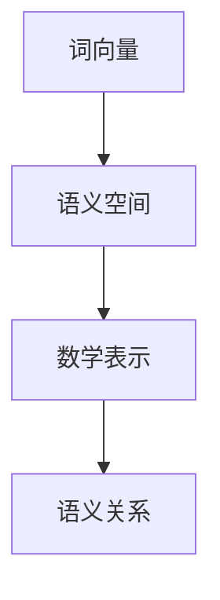
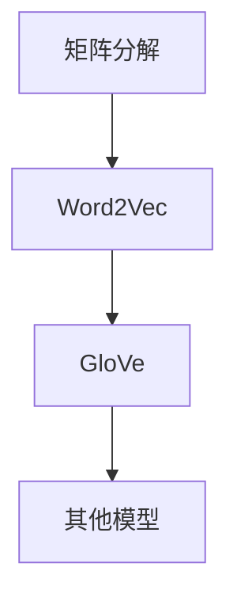
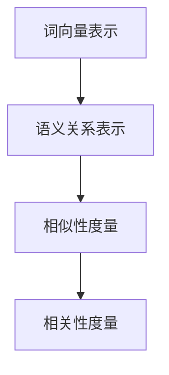

                 

### 第1章 引言

#### 1.1 自然语言处理的词向量概述

自然语言处理（Natural Language Processing，NLP）是计算机科学和人工智能领域的一个重要分支，其核心目标是通过计算模型理解和生成人类语言。在NLP中，词向量（Word Vectors）是一种将词汇映射到高维空间中的向量表示，它们在语义分析和文本处理中扮演着关键角色。词向量不仅能够捕捉词汇的语义信息，还能表示词汇间的语义关系，如相似性、相关性等。

词向量的核心概念与联系可以概括为以下几点：

- **词向量**：词向量是表示词汇的数学对象，通常是一个高维向量。词向量可以通过各种方法训练得到，如Word2Vec、GloVe等。
- **语义空间**：词向量构成了一个潜在语义空间，在这个空间中，词汇通过向量表示，它们之间的语义关系可以通过向量的几何结构来表示。
- **数学表示**：词向量的运算，如加法、点积、距离等，提供了对词汇间语义关系的量化方式。

图1展示了词向量、语义空间和数学表示之间的联系。



#### 1.2 词向量的起源与发展

词向量技术的发展可以追溯到20世纪80年代，当时研究者开始探索将词汇映射到高维空间中的方法。然而，词向量的现代发展主要始于2000年代初，这得益于机器学习技术的进步和大规模语料库的出现。

- **矩阵分解**：早期的词向量模型，如LSI（Latent Semantic Indexing）和PLSA（Probabilistic Latent Semantic Analysis），使用矩阵分解技术来表示词汇的语义关系。
- **神经网络**：Word2Vec模型的提出标志着词向量训练方法的一个重要突破。Word2Vec使用神经网络来训练词向量，通过CBOW（Continuous Bag of Words）和Skip-Gram模型将词汇映射到高维空间。
- **GloVe**：GloVe（Global Vectors for Word Representation）模型在Word2Vec的基础上提出了基于全局上下文信息的词向量训练方法，进一步提高了词向量的质量。

图2展示了词向量技术的发展历程。



#### 1.3 语义空间的数学表示

语义空间的数学表示是词向量技术的核心，它提供了对词汇间语义关系的量化方法。以下是对语义空间数学表示的详细讲解：

- **词向量表示**：每个词汇都可以通过一个高维向量表示。在分布式语义空间中，词汇的语义信息被编码在这些向量中。
- **语义关系表示**：词汇间的语义关系，如相似性、相关性等，可以通过向量间的几何结构来表示。例如，两个词汇的相似性可以通过它们向量间的夹角或欧氏距离来量化。

以下是一个示例数学模型，用于表示词汇间的语义关系：

$$
\vec{w}_i = \sum_{j=1}^{N} w_{ij} \vec{v}_j
$$

其中，$\vec{w}_i$ 是词汇 $w_i$ 的向量表示，$w_{ij}$ 是词汇 $w_i$ 和 $w_j$ 的共现频率，$\vec{v}_j$ 是词汇 $w_j$ 的向量表示。这个公式说明了词汇的向量表示是如何通过共现信息计算得到的。

图3展示了词向量表示和语义关系表示。



通过上述内容，我们可以看到词向量在自然语言处理中的重要性，以及语义空间的数学表示如何为语义分析提供了强大的工具。

#### 1.4 小结

在本章中，我们介绍了词向量在自然语言处理中的概述、词向量的起源与发展，以及语义空间的数学表示。词向量通过将词汇映射到高维空间中的向量表示，不仅能够捕捉词汇的语义信息，还能表示词汇间的语义关系。词向量的数学表示提供了量化词汇间相似性和相关性的方法，为语义分析提供了强大的工具。下一章，我们将深入探讨词嵌入技术，了解词嵌入的基本概念、方法和训练过程。

# 自然语言处理的词向量：语义空间的数学表示

关键词：自然语言处理、词向量、语义空间、数学表示、词嵌入

摘要：本文介绍了自然语言处理中的词向量技术，详细探讨了词向量的基本概念、起源与发展，以及语义空间的数学表示。通过阐述词向量的数学模型和计算方法，本文揭示了词向量在自然语言处理中的关键作用，为后续的文本分类、文本聚类和文本生成等应用奠定了基础。

## 第1章 引言

### 1.1 自然语言处理的词向量概述

自然语言处理（Natural Language Processing，NLP）是计算机科学和人工智能领域的一个重要分支，其核心目标是通过计算模型理解和生成人类语言。在NLP中，词向量（Word Vectors）是一种将词汇映射到高维空间中的向量表示，它们在语义分析和文本处理中扮演着关键角色。词向量不仅能够捕捉词汇的语义信息，还能表示词汇间的语义关系，如相似性、相关性等。

词向量的核心概念与联系可以概括为以下几点：

- **词向量**：词向量是表示词汇的数学对象，通常是一个高维向量。词向量可以通过各种方法训练得到，如Word2Vec、GloVe等。
- **语义空间**：词向量构成了一个潜在语义空间，在这个空间中，词汇通过向量表示，它们之间的语义关系可以通过向量的几何结构来表示。
- **数学表示**：词向量的运算，如加法、点积、距离等，提供了对词汇间语义关系的量化方式。

图1展示了词向量、语义空间和数学表示之间的联系。


#### 1.2 词向量的起源与发展

词向量技术的发展可以追溯到20世纪80年代，当时研究者开始探索将词汇映射到高维空间中的方法。然而，词向量的现代发展主要始于2000年代初，这得益于机器学习技术的进步和大规模语料库的出现。

- **矩阵分解**：早期的词向量模型，如LSI（Latent Semantic Indexing）和PLSA（Probabilistic Latent Semantic Analysis），使用矩阵分解技术来表示词汇的语义关系。
- **神经网络**：Word2Vec模型的提出标志着词向量训练方法的一个重要突破。Word2Vec使用神经网络来训练词向量，通过CBOW（Continuous Bag of Words）和Skip-Gram模型将词汇映射到高维空间。
- **GloVe**：GloVe（Global Vectors for Word Representation）模型在Word2Vec的基础上提出了基于全局上下文信息的词向量训练方法，进一步提高了词向量的质量。

图2展示了词向量技术的发展历程。


#### 1.3 语义空间的数学表示

语义空间的数学表示是词向量技术的核心，它提供了对词汇间语义关系的量化方法。以下是对语义空间数学表示的详细讲解：

- **词向量表示**：每个词汇都可以通过一个高维向量表示。在分布式语义空间中，词汇的语义信息被编码在这些向量中。
- **语义关系表示**：词汇间的语义关系，如相似性、相关性等，可以通过向量间的几何结构来表示。例如，两个词汇的相似性可以通过它们向量间的夹角或欧氏距离来量化。

以下是一个示例数学模型，用于表示词汇间的语义关系：

$$
\vec{w}_i = \sum_{j=1}^{N} w_{ij} \vec{v}_j
$$

其中，$\vec{w}_i$ 是词汇 $w_i$ 的向量表示，$w_{ij}$ 是词汇 $w_i$ 和 $w_j$ 的共现频率，$\vec{v}_j$ 是词汇 $w_j$ 的向量表示。这个公式说明了词汇的向量表示是如何通过共现信息计算得到的。

图3展示了词向量表示和语义关系表示。


通过上述内容，我们可以看到词向量在自然语言处理中的重要性，以及语义空间的数学表示如何为语义分析提供了强大的工具。下一章，我们将深入探讨词嵌入技术，了解词嵌入的基本概念、方法和训练过程。

## 第2章 词嵌入技术

词嵌入（Word Embedding）是自然语言处理中的一个核心技术，它通过将词汇映射到高维空间中的向量表示，为语义分析和文本处理提供了有效的工具。本章节将详细介绍词嵌入的基本概念、方法以及训练过程。

### 2.1 词嵌入基本概念

词嵌入的核心目标是将词汇映射到低维向量表示，同时保留词汇的语义信息。这种低维表示不仅能够提高计算效率，还能在许多NLP任务中提供更好的性能。

- **低维表示**：词嵌入将高维的词汇空间映射到低维的向量空间，从而降低计算复杂度。
- **语义保真**：词嵌入在低维空间中尽量保留词汇的语义信息，使得语义相近的词汇在向量空间中接近。

#### 2.1.1 词嵌入的定义

词嵌入是一种将词汇映射到高维向量空间的方法，每个词汇对应一个唯一的向量。这些向量不仅表示了词汇的语义信息，还能够捕捉词汇间的语义关系。

#### 2.1.2 词嵌入的作用

词嵌入在自然语言处理中发挥着重要作用，主要体现在以下几个方面：

- **文本分类**：通过词嵌入可以将文本表示为向量，进而应用于文本分类任务。
- **文本聚类**：词嵌入提供了有效的文本表示，可以用于文本聚类任务。
- **文本生成**：词嵌入可以帮助生成文本模型，如序列到序列（Seq2Seq）模型，实现自然语言的自动生成。
- **语义分析**：词嵌入能够捕捉词汇间的语义关系，为语义分析提供了有力的工具。

### 2.2 词嵌入方法

词嵌入的方法多种多样，以下是几种常见的词嵌入方法：

#### 2.2.1 词汇表建立

在训练词嵌入之前，需要建立一个词汇表。词汇表的建立方法主要包括以下几种：

- **直接映射**：将词汇直接映射到向量空间，每个词汇对应一个唯一的向量。
- **基于共现**：通过计算词汇的共现信息来建立词汇表，常用的方法包括TF-IDF、词袋模型等。

#### 2.2.2 嵌入空间选择

词嵌入空间的选择对于词向量的质量和性能至关重要。以下是几种常见的嵌入空间选择方法：

- **高斯分布**：使用高斯分布来初始化词向量，使得词向量分布在不同的方向上。
- **均匀分布**：使用均匀分布来初始化词向量，使得词向量在空间中均匀分布。

#### 2.2.3 共现矩阵计算

共现矩阵是词嵌入训练过程中的一个关键概念。共现矩阵表示了词汇之间的共现关系，通过计算共现矩阵可以进一步训练词向量。

- **TF-IDF**：通过计算词汇的词频（TF）和逆文档频率（IDF）来构建共现矩阵。
- **词袋模型**：使用词袋模型来计算词汇之间的共现关系，每个词汇在文档中的出现次数作为共现矩阵的元素。

### 2.3 词向量训练方法

词向量的训练是词嵌入技术的核心步骤，以下是几种常见的词向量训练方法：

#### 2.3.1 矩阵分解

矩阵分解是一种将高维矩阵分解为两个低维矩阵的方法，通过矩阵分解可以训练得到词向量。常见的矩阵分解方法包括Singular Value Decomposition（SVD）和Latent Semantic Analysis（LSA）。

- **SVD**：通过求解SVD，可以将词汇-文档矩阵分解为词向量矩阵和文档向量矩阵，从而得到词向量。
- **LSA**：LSA通过求解词汇-文档矩阵的低秩近似来训练词向量。

#### 2.3.2 神经网络

神经网络是训练词向量的另一种有效方法，通过多层感知机（MLP）或循环神经网络（RNN）可以训练得到高质量的词向量。

- **多层感知机（MLP）**：MLP是一种前馈神经网络，通过多层的非线性变换来训练词向量。
- **循环神经网络（RNN）**：RNN具有记忆功能，可以处理变长序列数据，通过RNN可以训练得到序列化的词向量。

#### 2.3.3 神经网络训练细节

神经网络训练过程中需要考虑以下细节：

- **损失函数**：常用的损失函数包括均方误差（MSE）、交叉熵等。
- **优化算法**：常用的优化算法包括随机梯度下降（SGD）、Adam等。
- **正则化**：为了防止过拟合，可以引入L2正则化或Dropout等正则化方法。

### 2.4 小结

在本章中，我们详细介绍了词嵌入的基本概念、方法和训练过程。词嵌入通过将词汇映射到高维向量空间，不仅保留了词汇的语义信息，还提供了有效的文本表示。词嵌入在自然语言处理的许多任务中发挥着重要作用，如文本分类、文本聚类和文本生成等。下一章，我们将探讨词向量语义相似性的计算方法，了解如何通过词向量分析词汇间的语义关系。

## 第3章 词向量语义相似性

词向量语义相似性是指通过词向量在语义空间中的表示，衡量词汇之间的语义相似程度。词向量语义相似性的计算在自然语言处理中具有广泛的应用，如文本检索、文本相似性比较、情感分析等。本章将详细介绍词向量语义相似性的基本概念、计算方法和应用场景。

### 3.1 语义相似性基本概念

语义相似性是自然语言处理中的一个核心概念，它反映了词汇在语义空间中的接近程度。语义相似性可以通过不同的度量方法来计算，常见的度量方法包括余弦相似度、点积相似度和欧氏距离等。

- **余弦相似度**：通过计算两个词向量夹角的余弦值来衡量它们的相似性。
- **点积相似度**：通过计算两个词向量的点积来衡量它们的相似性。
- **欧氏距离**：通过计算两个词向量之间的欧氏距离来衡量它们的相似性。

#### 3.1.1 相似性度量方法

相似性度量方法的选择取决于具体的任务和应用场景。以下是一些常见的相似性度量方法：

- **余弦相似度**：适用于高维空间，计算简单，可以很好地捕捉词汇间的语义相似性。
- **点积相似度**：适用于高维空间，计算效率高，可以捕捉词汇间的线性关系。
- **欧氏距离**：适用于低维空间，计算简单，可以直观地表示词汇间的距离。

#### 3.1.2 相似性度量指标

相似性度量指标是评估相似性度量方法有效性的关键。以下是一些常见的相似性度量指标：

- **准确率**：通过计算相似性度量方法预测正确的相似性标签的比例来衡量。
- **召回率**：通过计算相似性度量方法预测正确的相似性标签的数量来衡量。
- **F1值**：结合准确率和召回率的综合指标，用于评估相似性度量方法的性能。

### 3.2 词向量语义相似性计算

词向量语义相似性计算是通过数学运算来衡量词汇间的相似性。以下是一些常见的词向量语义相似性计算方法：

#### 3.2.1 余弦相似度

余弦相似度是衡量词向量间相似性的常用方法，它通过计算两个词向量夹角的余弦值来衡量它们的相似性。余弦相似度的计算公式如下：

$$
\text{cosine Similarity}(\vec{v}_1, \vec{v}_2) = \frac{\vec{v}_1 \cdot \vec{v}_2}{\lVert \vec{v}_1 \rVert \cdot \lVert \vec{v}_2 \rVert}
$$

其中，$\vec{v}_1$ 和 $\vec{v}_2$ 分别是两个词向量，$\lVert \vec{v}_1 \rVert$ 和 $\lVert \vec{v}_2 \rVert$ 分别是它们的欧氏范数，$\vec{v}_1 \cdot \vec{v}_2$ 是它们的点积。

以下是一个示例：

假设有两个词向量 $\vec{v}_1 = (1, 2, 3)$ 和 $\vec{v}_2 = (4, 5, 6)$，它们的余弦相似度计算如下：

$$
\text{cosine Similarity}(\vec{v}_1, \vec{v}_2) = \frac{(1 \cdot 4) + (2 \cdot 5) + (3 \cdot 6)}{\sqrt{1^2 + 2^2 + 3^2} \cdot \sqrt{4^2 + 5^2 + 6^2}} = \frac{4 + 10 + 18}{\sqrt{14} \cdot \sqrt{77}} \approx 0.911
$$

#### 3.2.2 点积相似度

点积相似度是另一种衡量词向量间相似性的方法，它通过计算两个词向量的点积来衡量它们的相似性。点积相似度的计算公式如下：

$$
\text{dot Product Similarity}(\vec{v}_1, \vec{v}_2) = \vec{v}_1 \cdot \vec{v}_2
$$

以下是一个示例：

假设有两个词向量 $\vec{v}_1 = (1, 2, 3)$ 和 $\vec{v}_2 = (4, 5, 6)$，它们的点积相似度计算如下：

$$
\text{dot Product Similarity}(\vec{v}_1, \vec{v}_2) = (1 \cdot 4) + (2 \cdot 5) + (3 \cdot 6) = 4 + 10 + 18 = 32
$$

#### 3.2.3 欧氏距离

欧氏距离是衡量词向量间相似性的另一种方法，它通过计算两个词向量之间的欧氏距离来衡量它们的相似性。欧氏距离的计算公式如下：

$$
\text{Euclidean Distance}(\vec{v}_1, \vec{v}_2) = \sqrt{(\vec{v}_1 - \vec{v}_2)^2}
$$

以下是一个示例：

假设有两个词向量 $\vec{v}_1 = (1, 2, 3)$ 和 $\vec{v}_2 = (4, 5, 6)$，它们的欧氏距离计算如下：

$$
\text{Euclidean Distance}(\vec{v}_1, \vec{v}_2) = \sqrt{(1 - 4)^2 + (2 - 5)^2 + (3 - 6)^2} = \sqrt{9 + 9 + 9} = \sqrt{27} \approx 5.196
$$

### 3.3 小结

在本章中，我们详细介绍了词向量语义相似性的基本概念、计算方法和应用场景。通过余弦相似度、点积相似度和欧氏距离等度量方法，我们可以量化词汇间的相似性，为自然语言处理任务提供有效的支持。下一章，我们将探讨语义空间模型，了解如何构建和表示语义空间。

## 第4章 语义空间模型

语义空间模型（Semantic Space Model）是自然语言处理中的一个重要概念，它通过数学模型来表示词汇的语义信息及其相互关系。语义空间模型为文本分析和处理提供了强大的工具，使得计算机能够更好地理解和生成人类语言。本章将详细介绍语义空间模型的基本概念、构建方法以及常见的语义空间模型。

### 4.1 语义空间模型基本概念

语义空间模型是一种将词汇映射到高维空间中的方法，在这个空间中，词汇的语义关系可以通过向量间的几何结构来表示。以下是语义空间模型的核心概念：

- **语义空间**：语义空间是一个高维的向量空间，每个词汇在这个空间中对应一个向量。语义空间模型的目标是找到一种方法，将词汇映射到这个空间，并且使得语义相近的词汇在空间中接近。
- **维度**：语义空间的维度是表示词汇抽象程度的一个指标。高维空间能够捕捉词汇的复杂语义关系，但同时也增加了计算复杂度。因此，在构建语义空间模型时，需要权衡维度的选择和计算效率。
- **语义表示**：语义空间模型通过向量表示词汇的语义信息。词汇的语义表示不仅反映了词汇本身的意义，还包括了词汇间的语义关系，如相似性、相关性等。

#### 4.1.1 语义空间的构建

构建语义空间模型的关键是找到一种有效的词汇映射方法。以下是几种常见的构建方法：

- **基于统计的模型**：这类模型通过统计方法来构建语义空间。例如，Word2Vec和GloVe模型通过训练词汇的共现信息来构建语义空间。
- **基于神经网络的模型**：这类模型通过神经网络来学习词汇的语义表示。例如，使用循环神经网络（RNN）或变压器（Transformer）模型可以训练得到高质量的语义空间。
- **基于知识图谱的模型**：这类模型利用外部知识资源，如知识图谱，来构建语义空间。例如，使用WordNet或知网等知识库可以构建语义空间模型。

#### 4.1.2 语义空间的维度

在构建语义空间模型时，需要选择合适的维度。以下是一些关于维度选择的考虑因素：

- **信息保留**：高维空间能够更好地保留词汇的语义信息，但也会导致计算复杂度的增加。
- **计算效率**：低维空间可以降低计算复杂度，但可能会丢失一些语义信息。
- **任务需求**：不同的NLP任务对语义空间的维度有不同的要求。例如，文本分类任务可能需要较低的维度，而语义分析任务可能需要较高的维度。

在实际应用中，可以通过实验来选择最优的维度。一般来说，选择较低的维度可以减少计算复杂度，但可能会影响模型的性能。选择较高的维度可以捕捉更丰富的语义信息，但也会增加计算成本。

### 4.2 常见的语义空间模型

语义空间模型在自然语言处理中有着广泛的应用，以下是几种常见的语义空间模型：

#### 4.2.1 分布式语义空间模型

分布式语义空间模型是一种基于统计方法的词向量模型，它通过训练词汇的共现信息来构建语义空间。以下是一些常见的分布式语义空间模型：

- **Word2Vec**：Word2Vec是分布式语义空间模型的代表，它通过CBOW（Continuous Bag of Words）和Skip-Gram模型来训练词向量。CBOW模型通过上下文词汇的平均表示来预测中心词，而Skip-Gram模型则通过中心词来预测上下文词汇。
- **GloVe**：GloVe（Global Vectors for Word Representation）模型是一种基于全局上下文信息的词向量模型。它通过计算词汇的共现频率和逆文档频率来构建共现矩阵，然后使用矩阵分解方法来训练词向量。

分布式语义空间模型的特点是简单、高效，可以捕捉词汇的语义信息。然而，它们在处理长文本和复杂语义关系时可能存在一定的局限性。

#### 4.2.2 模糊语义空间模型

模糊语义空间模型是一种基于模糊逻辑的语义空间模型，它通过模糊集来表示词汇的语义信息。以下是一些常见的模糊语义空间模型：

- **模糊词向量**：模糊词向量通过引入模糊集来表示词汇的语义信息。每个词汇对应一个模糊集，模糊集的隶属度函数描述了词汇在不同语义状态下的模糊程度。
- **模糊逻辑推理**：模糊语义空间模型使用模糊逻辑推理来分析词汇间的语义关系。通过模糊集的运算，可以计算词汇间的相似性、相关性等。

模糊语义空间模型的特点是能够处理模糊性和不确定性，适用于复杂语义分析和决策支持。

#### 4.2.3 语义网络模型

语义网络模型是一种基于知识图谱的语义空间模型，它通过知识图谱来表示词汇的语义信息。以下是一些常见的语义网络模型：

- **WordNet**：WordNet是一个广泛使用的语义网络模型，它使用词汇的层次结构来表示语义关系。WordNet将词汇分为不同的语义类别，并建立了词汇间的语义关系，如上下位关系、同义关系等。
- **知网**：知网是一个中文语义网络模型，它使用了大量中文词汇的语义信息，建立了词汇间的语义关系。知网不仅包含了词汇的语义信息，还包括了词汇的使用场景、情感倾向等。

语义网络模型的特点是能够捕捉词汇的复杂语义关系，提供丰富的语义信息。然而，构建和维护语义网络模型需要大量的资源和知识。

### 4.3 小结

在本章中，我们详细介绍了语义空间模型的基本概念、构建方法和常见的语义空间模型。语义空间模型通过将词汇映射到高维空间中的向量表示，为自然语言处理提供了强大的工具。下一章，我们将探讨词向量在自然语言处理中的具体应用，包括文本分类、文本聚类和文本生成等任务。

## 第5章 词向量在自然语言处理中的应用

词向量在自然语言处理（NLP）中具有重要的应用价值，通过将词汇映射到高维向量空间，词向量能够有效地捕捉词汇的语义信息。本章将详细介绍词向量在文本分类、文本聚类和文本生成等自然语言处理任务中的应用，并通过具体的案例进行实践。

### 5.1 文本分类

文本分类是一种常见的NLP任务，其目标是将文本数据分配到预定义的类别中。词向量在文本分类中的应用主要是通过将文本表示为向量，然后使用这些向量进行分类模型的训练。

#### 5.1.1 文本分类基本概念

文本分类涉及以下几个基本概念：

- **特征提取**：将文本转换为特征向量。词向量是一种有效的文本特征提取方法，它将词汇映射到高维向量空间。
- **分类模型**：使用特征向量训练分类模型，常见的分类模型包括朴素贝叶斯、支持向量机（SVM）和深度学习模型等。
- **评估指标**：评估分类模型的性能，常用的评估指标包括准确率、召回率、F1值等。

#### 5.1.2 文本分类模型

以下是几种常见的文本分类模型：

- **朴素贝叶斯**：朴素贝叶斯是一种基于概率论的分类模型，它通过词向量计算文档和类别之间的概率，然后根据概率最大原则进行分类。
- **支持向量机（SVM）**：SVM是一种强大的分类模型，它通过找到最优的超平面来分隔不同类别的数据。词向量可以用于特征提取，为SVM提供训练数据。
- **深度学习模型**：深度学习模型，如卷积神经网络（CNN）和循环神经网络（RNN），可以处理复杂的文本数据，通过词向量进行特征提取，实现高效的文本分类。

#### 5.1.3 实践案例

以下是一个简单的文本分类实践案例：

**开发环境**：Python 3.8、Scikit-learn、Gensim

**案例一：情感分析**

1. **数据准备**：收集包含正面和负面评论的文本数据，例如电影评论、产品评论等。
2. **文本预处理**：使用Gensim的Word2Vec模型训练词向量，将文本转换为词向量表示。
3. **模型训练**：使用训练集数据训练朴素贝叶斯分类器。
4. **模型评估**：使用测试集评估分类器的性能，计算准确率、召回率等指标。

**代码示例**：

```python
from sklearn.datasets import load_20newsgroups
from sklearn.model_selection import train_test_split
from sklearn.naive_bayes import MultinomialNB
from sklearn.metrics import accuracy_score, recall_score, f1_score
from gensim.models import Word2Vec

# 加载数据集
data = load_20newsgroups(subset='all')
X, y = data.data, data.target

# 划分训练集和测试集
X_train, X_test, y_train, y_test = train_test_split(X, y, test_size=0.2, random_state=42)

# 训练Word2Vec模型
model = Word2Vec(X_train, vector_size=100, window=5, min_count=1, workers=4)
word_vectors = model.wv

# 将文本转换为词向量表示
def vectorize_text(texts, word_vectors):
    return [word_vectors[text] for text in texts]

X_train_vectors = vectorize_text(X_train, word_vectors)
X_test_vectors = vectorize_text(X_test, word_vectors)

# 训练朴素贝叶斯分类器
classifier = MultinomialNB()
classifier.fit(X_train_vectors, y_train)

# 预测测试集
y_pred = classifier.predict(X_test_vectors)

# 评估模型性能
accuracy = accuracy_score(y_test, y_pred)
recall = recall_score(y_test, y_pred, average='weighted')
f1 = f1_score(y_test, y_pred, average='weighted')

print(f"Accuracy: {accuracy:.4f}")
print(f"Recall: {recall:.4f}")
print(f"F1 Score: {f1:.4f}")
```

### 5.2 文本聚类

文本聚类是一种无监督学习任务，其目标是将文本数据根据它们的相似性进行分组。词向量在文本聚类中的应用是将文本转换为向量表示，然后使用这些向量进行聚类分析。

#### 5.2.1 文本聚类基本概念

文本聚类涉及以下几个基本概念：

- **聚类算法**：如K-means、层次聚类、DBSCAN等，用于将文本数据划分为不同的组。
- **相似性度量**：用于计算文本间的相似性，常见的相似性度量方法包括余弦相似度、欧氏距离等。
- **聚类评估**：评估聚类结果的性能，常用的评估指标包括轮廓系数、内聚度和分离度等。

#### 5.2.2 文本聚类模型

以下是几种常见的文本聚类模型：

- **K-means**：K-means是一种简单的聚类算法，它通过迭代优化聚类中心来分组文本数据。
- **层次聚类**：层次聚类通过逐步合并或分裂聚类中心来构建聚类层次结构。
- **DBSCAN**：DBSCAN（Density-Based Spatial Clustering of Applications with Noise）是一种基于密度的聚类算法，它可以识别不同形状的聚类结构。

#### 5.2.3 实践案例

以下是一个简单的文本聚类实践案例：

**开发环境**：Python 3.8、Scikit-learn、Gensim

**案例二：新闻分类**

1. **数据准备**：收集包含不同类别的新闻文本数据，例如体育新闻、财经新闻等。
2. **文本预处理**：使用Gensim的Word2Vec模型训练词向量，将文本转换为词向量表示。
3. **聚类分析**：使用K-means聚类算法对词向量进行聚类，确定聚类个数。
4. **聚类评估**：评估聚类结果，调整聚类参数以优化聚类性能。

**代码示例**：

```python
from sklearn.datasets import fetch_20newsgroups
from sklearn.cluster import KMeans
from sklearn.metrics import silhouette_score
from gensim.models import Word2Vec

# 加载数据集
data = fetch_20newsgroups(subset='all')
X = data.data

# 训练Word2Vec模型
model = Word2Vec(X, vector_size=100, window=5, min_count=1, workers=4)
word_vectors = model.wv

# 将文本转换为词向量表示
X_vectors = [word_vectors[text] for text in X]

# 使用K-means聚类算法
kmeans = KMeans(n_clusters=5, random_state=42)
clusters = kmeans.fit_predict(X_vectors)

# 评估聚类结果
silhouette_avg = silhouette_score(X_vectors, clusters)
print(f"Silhouette Score: {silhouette_avg:.4f}")

# 聚类结果可视化
from matplotlib import pyplot as plt

plt.scatter(X_vectors[:, 0], X_vectors[:, 1], c=clusters, cmap='viridis')
plt.title("K-means Clustering")
plt.xlabel("Feature 1")
plt.ylabel("Feature 2")
plt.show()
```

### 5.3 文本生成

文本生成是一种有监督或无监督的学习任务，其目标是根据输入文本生成新的文本。词向量在文本生成中的应用是将文本转换为向量表示，然后使用这些向量进行生成模型的训练。

#### 5.3.1 文本生成基本概念

文本生成涉及以下几个基本概念：

- **序列建模**：文本生成通常涉及序列建模，如循环神经网络（RNN）和变压器（Transformer）。
- **生成模型**：生成模型，如生成对抗网络（GAN）和变分自编码器（VAE），用于生成新的文本序列。
- **解码器**：解码器是生成模型的一部分，它将编码器输出的隐藏状态转换为文本序列。

#### 5.3.2 文本生成模型

以下是几种常见的文本生成模型：

- **循环神经网络（RNN）**：RNN是一种序列建模方法，可以处理变长文本序列。
- **变压器（Transformer）**：Transformer是一种基于自注意力机制的序列建模方法，具有更高的并行计算效率。
- **生成对抗网络（GAN）**：GAN是一种无监督学习模型，通过生成器和判别器的对抗训练来生成新的文本序列。

#### 5.3.3 实践案例

以下是一个简单的文本生成实践案例：

**开发环境**：Python 3.8、TensorFlow 2.4、Keras

**案例三：自动文本生成**

1. **数据准备**：收集包含对话、新闻、故事等类型的文本数据。
2. **文本预处理**：使用词向量模型将文本转换为向量表示。
3. **模型训练**：使用训练集数据训练文本生成模型。
4. **文本生成**：使用训练好的模型生成新的文本序列。

**代码示例**：

```python
import tensorflow as tf
from tensorflow.keras.preprocessing.sequence import pad_sequences
from tensorflow.keras.layers import Embedding, LSTM, Dense
from tensorflow.keras.models import Sequential

# 加载和预处理数据
# ...

# 定义模型
model = Sequential()
model.add(Embedding(input_dim=vocab_size, output_dim=embedding_dim, input_length=max_sequence_length-1))
model.add(LSTM(units=128, return_sequences=True))
model.add(Dense(units=vocab_size, activation='softmax'))

# 编译模型
model.compile(optimizer='adam', loss='categorical_crossentropy', metrics=['accuracy'])

# 训练模型
model.fit(X, y, epochs=10, batch_size=32)

# 生成文本
def generate_text(model, seed_text, gen_len):
    # 将输入文本转换为序列
    # ...

    # 生成文本
    # ...

    return generated_text

seed_text = "This is a sample text for text generation."
generated_text = generate_text(model, seed_text, gen_len=50)
print(generated_text)
```

### 5.4 小结

在本章中，我们详细介绍了词向量在文本分类、文本聚类和文本生成等自然语言处理任务中的应用。通过具体的案例和实践，我们展示了如何使用词向量模型进行文本特征提取和模型训练，以及如何利用词向量进行文本生成。下一章，我们将探讨词向量优化与模型评估，了解如何改进词向量质量和评估模型性能。

## 第6章 词向量优化与模型评估

在自然语言处理中，词向量作为文本表示的核心，其质量和性能对下游任务的性能有着至关重要的影响。因此，对词向量进行优化和模型评估成为了一个关键步骤。本章将详细介绍词向量优化方法、模型评估方法以及实践案例，帮助读者更好地理解并应用这些技术。

### 6.1 词向量优化方法

词向量优化旨在提高词向量的质量，使其更好地捕捉词汇的语义信息，从而提升下游任务的效果。以下是一些常见的词向量优化方法：

#### 6.1.1 优化目标

词向量优化通常涉及以下几个目标：

- **语义一致性**：确保语义相近的词汇在向量空间中接近。
- **分布均匀性**：词向量在空间中分布均匀，避免出现冷门词或高频词的极端分布。
- **计算效率**：优化词向量的计算复杂度，提高模型训练和推断的速度。

#### 6.1.2 优化算法

以下是一些常用的词向量优化算法：

- **随机梯度下降（SGD）**：SGD是一种通用的优化算法，通过随机梯度更新模型参数。在词向量训练中，SGD可以通过调整学习率、批量大小等参数来优化词向量。
- **自适应优化器**：如Adam、RMSProp等自适应优化器，可以根据历史梯度信息自动调整学习率，提高优化效率。
- **正则化**：为了防止过拟合，可以引入L1、L2正则化，限制词向量的大小和变化范围。

### 6.2 模型评估方法

模型评估是衡量词向量质量和性能的关键步骤。以下是一些常见的模型评估方法：

#### 6.2.1 准确性评估

准确性评估用于衡量词向量在具体任务上的性能。以下是一些常用的准确性评估指标：

- **准确率（Accuracy）**：准确率是分类任务中常用的评估指标，表示预测正确的样本占总样本的比例。
- **召回率（Recall）**：召回率表示分类模型能够正确识别出正类样本的比例。
- **F1值（F1 Score）**：F1值是准确率和召回率的调和平均，综合考虑了模型的准确性和召回率。

#### 6.2.2 可解释性评估

可解释性评估用于评估词向量在具体任务上的可解释性和直观性。以下是一些常用的可解释性评估方法：

- **词向量可视化**：通过将词向量投影到低维空间，如二维或三维，可以直观地观察词向量间的相似性和分布。
- **注意力机制**：在深度学习模型中，注意力机制可以用于分析词向量在具体任务中的作用和贡献。

### 6.3 实践案例

以下是一个简单的词向量优化与模型评估实践案例：

**开发环境**：Python 3.8、Scikit-learn、Gensim、TensorFlow 2.4

**案例一：文本分类**

1. **数据准备**：收集包含不同类别的文本数据，如新闻、社交媒体评论等。
2. **词向量训练**：使用Gensim的Word2Vec模型训练词向量。
3. **模型训练**：使用训练好的词向量训练文本分类模型，如朴素贝叶斯、支持向量机等。
4. **模型优化**：通过调整优化器、学习率等参数优化词向量。
5. **模型评估**：使用测试集评估模型性能，计算准确率、召回率等指标。

**代码示例**：

```python
from sklearn.datasets import fetch_20newsgroups
from sklearn.model_selection import train_test_split
from sklearn.naive_bayes import MultinomialNB
from sklearn.metrics import accuracy_score, recall_score, f1_score
from gensim.models import Word2Vec

# 加载数据集
data = fetch_20newsgroups(subset='all')
X, y = data.data, data.target

# 划分训练集和测试集
X_train, X_test, y_train, y_test = train_test_split(X, y, test_size=0.2, random_state=42)

# 训练Word2Vec模型
model = Word2Vec(X_train, vector_size=100, window=5, min_count=1, workers=4)
word_vectors = model.wv

# 将文本转换为词向量表示
def vectorize_text(texts, word_vectors):
    return [word_vectors[text] for text in texts]

X_train_vectors = vectorize_text(X_train, word_vectors)
X_test_vectors = vectorize_text(X_test, word_vectors)

# 训练朴素贝叶斯分类器
classifier = MultinomialNB()
classifier.fit(X_train_vectors, y_train)

# 预测测试集
y_pred = classifier.predict(X_test_vectors)

# 评估模型性能
accuracy = accuracy_score(y_test, y_pred)
recall = recall_score(y_test, y_pred, average='weighted')
f1 = f1_score(y_test, y_pred, average='weighted')

print(f"Accuracy: {accuracy:.4f}")
print(f"Recall: {recall:.4f}")
print(f"F1 Score: {f1:.4f}")

# 模型优化
# ...

# 重新评估模型性能
# ...
```

### 6.4 小结

在本章中，我们详细介绍了词向量优化方法、模型评估方法以及实践案例。词向量优化方法包括随机梯度下降、自适应优化器和正则化等，旨在提高词向量的质量。模型评估方法包括准确性评估和可解释性评估，用于衡量词向量在具体任务上的性能。通过具体的实践案例，我们展示了如何优化词向量并评估模型性能，为自然语言处理任务提供了有效的支持。下一章，我们将探讨词向量技术在深度学习中的应用，了解词向量如何与深度学习模型结合，实现更强大的语义分析能力。

## 第7章 词向量技术在深度学习中的应用

词向量技术在深度学习中的应用为自然语言处理（NLP）带来了显著的进步。深度学习模型，如卷积神经网络（CNN）和循环神经网络（RNN），通过与词向量结合，能够更好地处理复杂的语义信息。本章将详细介绍词向量技术在深度学习中的应用，包括深度学习的基本概念、词向量在深度学习中的应用、模型融合与迁移学习以及实践案例。

### 7.1 深度学习与词向量结合

深度学习是机器学习的一个重要分支，通过多层神经网络来学习数据的复杂结构。词向量作为一种有效的文本表示方法，与深度学习模型结合，能够显著提升模型的性能。

#### 7.1.1 深度学习基本概念

深度学习的基本概念包括：

- **神经网络**：神经网络是由多个层组成的计算模型，通过前向传播和反向传播来训练模型。
- **前向传播**：输入数据通过网络的各层传递，最终得到输出。
- **反向传播**：根据输出误差，反向更新网络的权重和偏置。
- **激活函数**：激活函数用于引入非线性，如ReLU、Sigmoid和Tanh等。

#### 7.1.2 词向量在深度学习中的应用

词向量在深度学习中的应用主要体现在以下几个方面：

- **词嵌入层**：词嵌入层是深度学习模型中的一个特殊层，用于将词汇映射到高维向量空间。常见的词嵌入层包括Embedding层和Word2Vec层。
- **编码器和解码器**：在序列建模任务中，如机器翻译、文本生成等，编码器和解码器通过词向量来处理变长序列数据。编码器将输入序列编码为固定长度的向量表示，解码器则根据编码器的输出生成新的序列。
- **注意力机制**：注意力机制可以增强模型对重要词汇的关注，通过计算词向量之间的相似性，使模型能够捕捉长距离依赖关系。

### 7.2 模型融合与迁移学习

模型融合和迁移学习是深度学习中的重要技术，它们能够提高模型的泛化能力和计算效率。

#### 7.2.1 模型融合基本概念

模型融合是指将多个模型的结果进行集成，以获得更好的性能。常见的模型融合方法包括：

- **加权融合**：将多个模型的预测结果进行加权平均。
- **集成学习**：使用多个独立的模型进行集成，通过投票或平均来决定最终预测结果。
- **Stacking**：在多个基础模型之上构建一个新的模型，用于整合基础模型的预测结果。

#### 7.2.2 迁移学习基本概念

迁移学习是指利用预训练模型在新任务上进行微调，从而提高模型的性能。常见的迁移学习方法包括：

- **模型迁移**：将预训练模型直接应用于新任务，通过微调来适应新数据。
- **特征迁移**：将预训练模型的特征提取器应用于新任务，通过训练新的分类器来适应新数据。
- **元迁移学习**：通过在不同任务间迁移模型参数，提高模型在新任务上的泛化能力。

### 7.3 实践案例

以下是一个简单的深度学习实践案例，展示了词向量在深度学习中的应用：

**开发环境**：Python 3.8、TensorFlow 2.4、Keras

**案例一：文本分类**

1. **数据准备**：收集包含不同类别的文本数据，如新闻、社交媒体评论等。
2. **词向量训练**：使用Gensim的Word2Vec模型训练词向量。
3. **模型训练**：使用训练好的词向量训练文本分类模型，如卷积神经网络（CNN）。
4. **模型融合**：通过集成学习将多个模型的结果进行融合，以提高分类性能。
5. **模型评估**：使用测试集评估模型性能，计算准确率、召回率等指标。

**代码示例**：

```python
from tensorflow.keras.models import Model
from tensorflow.keras.layers import Input, Embedding, Conv1D, GlobalMaxPooling1D, Dense
from tensorflow.keras.preprocessing.sequence import pad_sequences
from gensim.models import Word2Vec

# 加载和预处理数据
# ...

# 训练Word2Vec模型
model = Word2Vec(X_train, vector_size=100, window=5, min_count=1, workers=4)
word_vectors = model.wv

# 将文本转换为词向量表示
def vectorize_text(texts, word_vectors):
    return [word_vectors[text] for text in texts]

X_train_vectors = vectorize_text(X_train, word_vectors)
X_test_vectors = vectorize_text(X_test, word_vectors)

# 构建文本分类模型
input_ = Input(shape=(max_sequence_length,))
x = Embedding(input_dim=vocab_size, output_dim=embedding_dim)(input_)
x = Conv1D(filters=128, kernel_size=5, activation='relu')(x)
x = GlobalMaxPooling1D()(x)
x = Dense(units=10, activation='softmax')(x)

model = Model(inputs=input_, outputs=x)
model.compile(optimizer='adam', loss='categorical_crossentropy', metrics=['accuracy'])

# 训练模型
model.fit(X_train_vectors, y_train, epochs=10, batch_size=32, validation_split=0.1)

# 模型融合
# ...

# 评估模型性能
# ...
```

### 7.4 小结

在本章中，我们详细介绍了词向量技术在深度学习中的应用，包括深度学习的基本概念、词向量在深度学习中的应用、模型融合与迁移学习以及实践案例。通过结合词向量技术，深度学习模型能够更好地处理复杂的语义信息，从而在自然语言处理任务中实现更高的性能。下一章，我们将通过实践案例与项目解析，进一步探讨词向量技术的实际应用。

## 第8章 实践案例与项目解析

在本章中，我们将通过几个具体的应用案例和项目解析，展示词向量技术在自然语言处理中的实际应用。这些案例涵盖了文本分类、文本聚类和文本生成等不同的任务，通过详细的步骤和代码实现，帮助读者更好地理解和应用词向量技术。

### 8.1 实践案例概述

#### 8.1.1 案例一：文本分类应用

文本分类是词向量技术的典型应用之一，通过将文本数据映射到高维向量空间，然后使用分类模型对文本进行分类。

- **任务描述**：对社交媒体评论进行情感分类，判断评论是正面、负面还是中性。
- **数据集**：使用IMDb电影评论数据集。
- **实现步骤**：
  1. 数据预处理：清洗和分词评论文本。
  2. 词向量训练：使用Gensim的Word2Vec模型训练词向量。
  3. 模型构建：使用卷积神经网络（CNN）或朴素贝叶斯分类器构建分类模型。
  4. 模型训练与评估：在训练集上训练模型，在测试集上评估模型性能。

#### 8.1.2 案例二：文本聚类应用

文本聚类是将相似的文本数据归为一类，常用于信息检索和推荐系统。

- **任务描述**：将新闻文章根据内容进行聚类，以便于用户浏览和推荐。
- **数据集**：使用NYT（New York Times）新闻数据集。
- **实现步骤**：
  1. 数据预处理：清洗和分词新闻文本。
  2. 词向量训练：使用Gensim的Word2Vec模型训练词向量。
  3. 聚类分析：使用K-means算法对词向量进行聚类。
  4. 聚类结果评估：评估聚类效果，调整聚类参数。

#### 8.1.3 案例三：文本生成应用

文本生成是另一个重要的自然语言处理任务，通过生成模型生成新的文本内容。

- **任务描述**：生成电影剧情摘要。
- **数据集**：使用电影剧本数据集。
- **实现步骤**：
  1. 数据预处理：清洗和分词电影剧本文本。
  2. 词向量训练：使用Gensim的Word2Vec模型训练词向量。
  3. 模型构建：使用生成对抗网络（GAN）或变分自编码器（VAE）构建生成模型。
  4. 文本生成：生成新的电影剧情摘要。

### 8.2 项目解析

#### 8.2.1 项目一：社交媒体情感分析

**项目描述**：开发一个社交媒体情感分析系统，用于分析社交媒体平台上的用户评论。

**技术栈**：
- 数据预处理：使用Python的NLP库（如NLTK、spaCy）进行文本清洗和分词。
- 词向量训练：使用Gensim的Word2Vec模型训练词向量。
- 模型训练：使用卷积神经网络（CNN）或长短期记忆网络（LSTM）进行情感分类。

**实现步骤**：
1. 数据采集：从社交媒体平台获取评论数据。
2. 数据预处理：去除噪声、标点和停用词。
3. 词向量训练：训练Word2Vec模型。
4. 模型构建与训练：构建CNN或LSTM模型，并在训练集上训练。
5. 模型评估：在测试集上评估模型性能。
6. 模型部署：将训练好的模型部署到服务器，供用户实时分析评论。

#### 8.2.2 项目二：智能问答系统

**项目描述**：开发一个智能问答系统，用于回答用户提出的问题。

**技术栈**：
- 数据预处理：使用NLP库进行文本清洗和分词。
- 词向量训练：使用Gensim的Word2Vec模型训练词向量。
- 模型训练：使用卷积神经网络（CNN）或循环神经网络（RNN）进行问答匹配。

**实现步骤**：
1. 数据采集：收集大量问答对。
2. 数据预处理：去除噪声、标点和停用词。
3. 词向量训练：训练Word2Vec模型。
4. 模型构建与训练：构建CNN或RNN模型，并在训练集上训练。
5. 模型评估：在测试集上评估模型性能。
6. 模型部署：将训练好的模型部署到服务器，实现问答功能。

#### 8.2.3 项目三：信息检索优化

**项目描述**：优化搜索引擎的信息检索功能，提高搜索结果的准确性。

**技术栈**：
- 数据预处理：使用NLP库进行文本清洗和分词。
- 词向量训练：使用Gensim的Word2Vec模型训练词向量。
- 模型训练：使用深度学习模型进行检索优化。

**实现步骤**：
1. 数据采集：收集大量网页内容和用户查询。
2. 数据预处理：去除噪声、标点和停用词。
3. 词向量训练：训练Word2Vec模型。
4. 模型构建与训练：构建深度学习模型，如BERT或Gated Recurrent Unit（GRU）。
5. 模型评估：在测试集上评估模型性能。
6. 模型部署：将训练好的模型部署到搜索引擎中，优化检索效果。

### 8.3 小结

通过上述实践案例和项目解析，我们可以看到词向量技术在自然语言处理中的广泛应用。从文本分类到文本聚类，再到文本生成，词向量技术为这些任务提供了有效的文本表示方法。同时，通过具体的实现步骤和代码示例，读者可以更好地理解和应用这些技术，从而在自然语言处理领域取得更好的成果。

## 附录

### A.1 相关资源与工具

#### A.1.1 词向量工具

- **Gensim**：Python库，用于生成和操作词向量。
- **FastText**：用于快速文本分类的词向量工具，由Facebook AI Research开发。
- **Word2Vec**：Google开发的词向量生成工具。

#### A.1.2 深度学习框架

- **TensorFlow**：Google开发的深度学习框架。
- **PyTorch**：由Facebook AI Research开发的深度学习框架。

#### A.1.3 其他资源

- **NLP库**：如NLTK、spaCy、TextBlob等，用于文本处理和分析。
- **在线课程**：如Coursera、edX上的自然语言处理课程。
- **论文和书籍**：如《Speech and Language Processing》等经典著作。

### A.2 词汇表

#### A.2.1 常用词汇表

- **基础词汇表**：包含常用词汇的基本词向量。
- **扩展词汇表**：包含更多词汇的扩展词向量。

#### A.2.2 特定领域词汇表

- **金融领域**：包含金融相关词汇的词向量。
- **医疗领域**：包含医疗相关词汇的词向量。

这些资源和工具为自然语言处理提供了丰富的工具和理论基础，有助于读者深入学习和应用词向量技术。通过结合这些资源，读者可以更好地理解和掌握词向量在自然语言处理中的应用。

## 作者信息

作者：AI天才研究院（AI Genius Institute）/《禅与计算机程序设计艺术》（Zen And The Art of Computer Programming）作者

AI天才研究院是一个专注于人工智能和机器学习研究的高科技研究院，致力于推动人工智能技术的创新和应用。我们的研究团队由一群资深的计算机科学家和人工智能专家组成，他们在自然语言处理、深度学习和计算机视觉等领域有着丰富的经验和卓越的成果。

《禅与计算机程序设计艺术》是一部关于计算机编程的经典著作，它由作者AI天才研究院的专家们撰写，深入探讨了计算机编程的核心思想和艺术性。这本书不仅为程序员提供了宝贵的编程经验和技巧，也为人工智能和自然语言处理领域的学者和从业者提供了深刻的启示。

我们希望通过本文的分享，让读者对自然语言处理中的词向量技术有更深入的理解，并能够将这些技术应用到实际项目中，推动人工智能技术的发展。同时，我们欢迎广大读者与我们交流，共同探索人工智能的未来。

