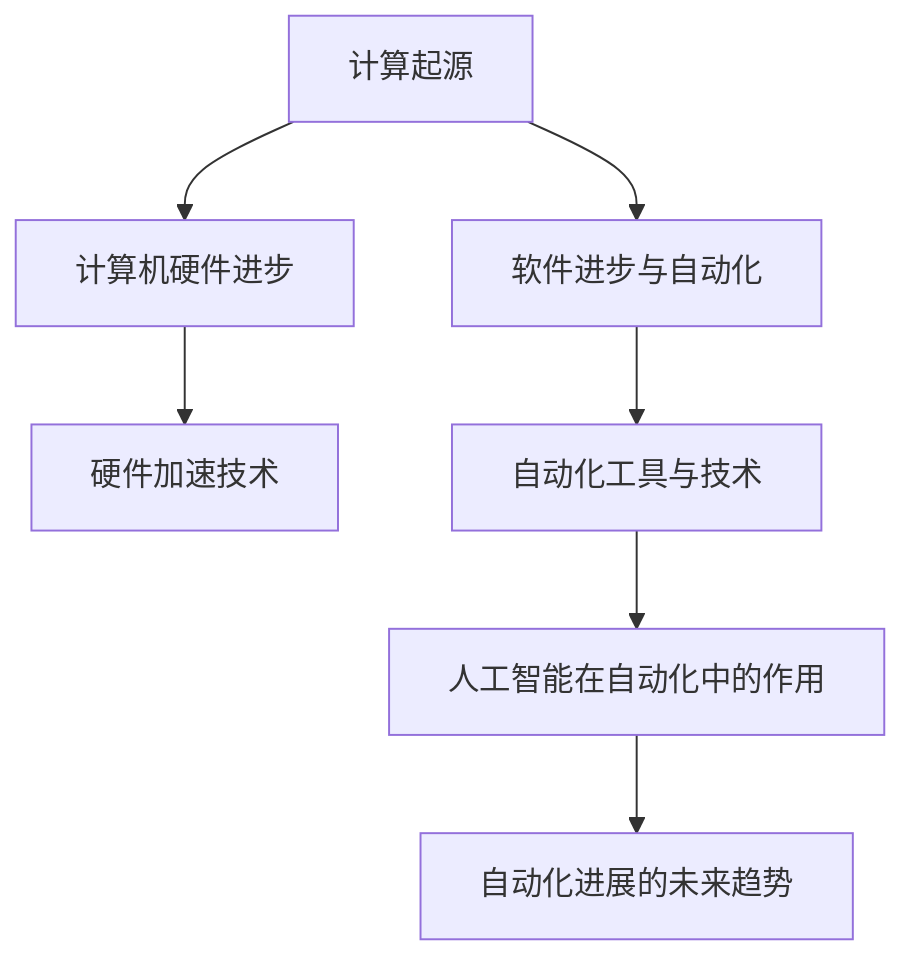

                 

### 《计算本质的变化与自动化进展》

#### 核心关键词
- 计算本质
- 计算机硬件进步
- 软件进步
- 自动化技术
- 人工智能
- 自动化效率
- 自动化实践

#### 摘要
本文深入探讨计算本质的变化与自动化进展。首先，我们回顾计算的起源与演变，了解现代计算的基本原理。接着，我们分析计算机硬件的进步，特别是硬件加速技术的应用。随后，我们探讨软件的进步与自动化，介绍自动化工具和技术。在此基础上，我们探讨自动化技术的概念与应用，重点关注人工智能在自动化中的作用。文章接着讨论自动化进展的未来趋势，包括其对就业市场和社会的影响。通过一系列案例研究，我们展示了自动化实践的成果。最后，我们探讨了自动化与人工智能结合的新领域，并展望自动化与未来的社会关系。本文旨在为读者提供一个全面、系统的自动化与计算本质变化的概述。

### 第一部分：计算的本质

#### 第1章：计算的起源与演变

##### 1.1 计算的起源

计算的起源可以追溯到古代人类对数量的处理。最早的计算工具是计数工具，如石头、骨头等。这些工具主要用于简单的数学运算，如加、减、乘、除。随着时间的推移，人类发明了更复杂的计算工具，如算盘、计算尺等。

中世纪时期，阿拉伯数学家对计算做出了重大贡献。他们引入了零的概念，并发明了阿拉伯数字系统。这一系统的引入极大地简化了数学运算，使得计算变得更加高效。在此之后，计算工具的发明与应用也不断推进，如计算机器、机械计算机等。

16世纪，法国数学家布莱兹·帕斯卡发明了帕斯卡计算器，这是一种机械式计算机。帕斯卡计算器的发明标志着计算工具的又一次重大进步。随后，莱布尼茨改进了帕斯卡计算器，发明了差分机和对数机，这些机械计算机为后来的电子计算机奠定了基础。

##### 1.2 现代计算的基本原理

现代计算的基本原理基于冯·诺伊曼架构。冯·诺伊曼架构包括五个基本组成部分：硬件、软件、数据、输入/输出设备和网络。

- **硬件**：硬件是计算机的物理部分，包括中央处理单元（CPU）、内存、输入/输出设备等。硬件的发展推动了计算速度和存储能力的提升。
- **软件**：软件是计算机的指令集合，用于指导计算机完成特定任务。软件的发展经历了从低级语言到高级语言的演变，使得编程变得更加容易和高效。
- **数据**：数据是计算机处理的对象，包括数值、文本、图像、声音等。数据的管理和存储技术的发展，使得数据处理变得更加高效和多样化。
- **输入/输出设备**：输入/输出设备用于数据的输入和输出，如键盘、鼠标、显示器、打印机等。这些设备的进步提高了人机交互的效率。
- **网络**：网络是计算机之间的连接，用于数据传输和资源共享。网络技术的发展，使得计算变得更加分布式和协作化。

##### 1.3 算法和程序设计基础

算法是解决问题的一系列有序步骤。算法设计是计算领域的重要任务，它决定了计算机解决问题的效率和质量。

程序设计是基于算法实现的。程序设计语言是用于编写程序的符号系统。不同的编程语言具有不同的特点和适用场景。常见的编程语言包括C、C++、Java、Python等。

程序设计基础包括数据结构、算法、软件工程等。数据结构是组织和管理数据的方式，如数组、链表、树、图等。算法是解决特定问题的步骤集合，如排序、查找、图遍历等。软件工程是软件开发的过程和方法，包括需求分析、设计、编码、测试等。

#### 第2章：计算机硬件的进步

##### 2.1 计算机硬件的发展历程

计算机硬件的发展历程可以分为几个重要阶段：

- **早期计算机**：最早的计算机如ENIAC（1945年）和EDVAC（1949年）采用电子管技术，体积庞大，计算速度较慢。这些计算机主要用于科学计算和军事领域。
- **晶体管时代**：晶体管的出现（1947年）标志着计算机硬件的重大进步。晶体管取代了电子管，使计算机体积缩小、功耗降低、可靠性提高。这一时期的计算机如TRADIC（1953年）和Whirlwind（1951年）。
- **集成电路时代**：集成电路的发明（1958年）使得计算机硬件进一步集成化。集成电路将多个晶体管集成在一个芯片上，提高了计算速度和存储容量。这一时期的计算机如Altair 8800（1975年）和Apple II（1977年）。
- **微处理器时代**：微处理器的出现（1971年）标志着计算机硬件的又一次重大进步。微处理器将中央处理单元（CPU）集成在一个芯片上，使计算机变得更加便携和通用。这一时期的计算机如IBM PC（1981年）和Macintosh（1984年）。

##### 2.2 硬件加速技术

硬件加速技术是指利用专门的硬件设备来加速计算机处理特定任务。硬件加速技术包括以下几种：

- **GPU计算**：图形处理器（GPU）具有高度并行计算的能力，可以用于加速科学计算、机器学习和深度学习等应用。GPU计算使得大量并行计算任务可以快速高效地完成。
- **硬件加速器**：硬件加速器是一种专门用于加速特定计算任务的设备。硬件加速器包括专用集成电路（ASIC）、现场可编程门阵列（FPGA）等。硬件加速器可以显著提高计算性能，降低能耗。
- **GPU与CPU协同计算**：GPU与CPU协同计算可以发挥两者各自的优势，提高计算性能。GPU适合处理大量并行计算任务，CPU适合处理复杂计算任务。通过合理分配任务，可以实现计算资源的最大化利用。

#### 第3章：软件的进步与自动化

##### 3.1 软件的发展与演变

软件的发展与演变可以分为以下几个阶段：

- **低级语言阶段**：低级语言如汇编语言（Assembly Language）直接与硬件操作相关，编程效率低，但执行速度快。汇编语言主要用于编写系统软件和硬件驱动程序。
- **高级语言阶段**：高级语言如C语言（C Language）、C++语言（C++ Language）、Java语言（Java Language）等，提供了更抽象、更易用的编程接口。高级语言提高了编程效率，降低了编程难度。
- **脚本语言阶段**：脚本语言如Python（Python Language）、JavaScript（JavaScript Language）、PHP（PHP Language）等，提供了快速开发和高效执行的能力。脚本语言常用于自动化、网络编程和Web开发等领域。
- **函数式编程语言阶段**：函数式编程语言如Haskell（Haskell Language）、Scala（Scala Language）等，提供了函数式编程范式。函数式编程语言具有强大的抽象能力和并行计算能力。

##### 3.2 自动化工具与技术

自动化工具与技术的发展极大地提高了计算机系统的效率和可靠性。自动化工具包括以下几种：

- **脚本编程**：脚本编程是一种自动化执行重复性任务的方法。脚本语言如Python、Shell、JavaScript等，可以编写自动化脚本，用于文件处理、系统监控、网络配置等任务。
- **自动化测试**：自动化测试是一种通过编写测试脚本自动执行测试用例的方法。自动化测试可以减少人工测试的工作量，提高测试效率和测试覆盖率。
- **配置管理**：配置管理是一种自动化管理计算机系统配置的方法。配置管理工具如Puppet、Chef、Ansible等，可以自动化安装、配置和管理系统软件。
- **容器化技术**：容器化技术如Docker（Docker Technology）、Kubernetes（Kubernetes Technology）等，提供了自动化部署、管理和扩展应用程序的方法。容器化技术简化了应用程序的部署和管理，提高了系统的可移植性和可扩展性。

##### 3.3 软件与硬件的协同进步

软件与硬件的协同进步是计算领域的重要趋势。硬件的进步为软件提供了更强大的计算能力和存储能力，而软件的进步则利用了硬件的优势，提高了计算效率和性能。

- **硬件加速软件**：硬件加速软件如GPU加速库（CUDA、OpenCL）和硬件加速器驱动程序，可以充分利用硬件加速器的计算能力，提高软件的性能和效率。
- **软件定义硬件**：软件定义硬件（Software-Defined Hardware）是一种通过软件定义和管理硬件资源的方法。软件定义硬件使得硬件资源可以灵活配置和管理，提高了系统的可扩展性和灵活性。
- **虚拟化技术**：虚拟化技术如虚拟机（Virtual Machine）和容器（Container）等，可以将物理硬件资源虚拟化为多个独立的虚拟环境。虚拟化技术提高了硬件资源的利用率，降低了硬件成本。

#### 第二部分：自动化进展

##### 第4章：自动化技术的概念与应用

##### 4.1 自动化的定义与类型

自动化是指通过计算机程序或控制设备，自动执行特定任务或操作的技术。自动化技术可以按照不同的分类方式进行划分：

- **按自动化程度划分**：
  - **半自动化**：半自动化是指部分任务由计算机程序或控制设备自动执行，而部分任务仍需人工干预。例如，工业生产线上的机器人可以自动执行某些任务，但需要人工进行编程和监控。
  - **全自动化**：全自动化是指所有任务都由计算机程序或控制设备自动执行，无需人工干预。例如，全自动化的生产线可以无人看管，从原材料加工到成品出库全部自动化完成。
- **按应用领域划分**：
  - **工业自动化**：工业自动化是指在生产制造过程中，通过自动化设备和技术实现生产过程的自动化。例如，机器人、自动化生产线、数控机床等。
  - **商业自动化**：商业自动化是指在日常商业活动中，通过自动化工具和技术实现业务流程的自动化。例如，自动化客户服务系统、自动化物流管理、自动化财务处理等。
  - **家庭自动化**：家庭自动化是指在家居环境中，通过自动化设备和系统实现生活设备的自动化控制。例如，智能家居、智能灯光、智能安防等。

##### 4.2 自动化技术在工业中的应用

自动化技术在工业中的应用已经非常广泛，大大提高了生产效率和质量。以下是自动化技术在工业中的一些主要应用：

- **生产线自动化**：生产线自动化是指通过自动化设备将生产过程中的各个步骤连接起来，实现整个生产过程的自动化。例如，自动化装配线、自动化包装线、自动化检测线等。
- **质量控制自动化**：质量控制自动化是指利用自动化设备对生产过程进行实时监控和质量检测，确保产品质量。例如，自动化检测设备、自动化测试系统、自动化质量管理系统等。
- **设备监控与维护**：设备监控与维护自动化是指利用自动化技术和设备对生产设备进行实时监控和维护，确保设备的正常运行。例如，自动化监控系统、自动化维护系统、自动化故障诊断系统等。

##### 4.3 自动化技术在商业中的应用

自动化技术在商业领域的应用也在不断扩展，为企业提供了更高效、更便捷的解决方案。以下是自动化技术在商业中的一些主要应用：

- **自动化客户服务**：自动化客户服务是指利用计算机程序和人工智能技术，自动处理客户咨询、投诉和售后等服务。例如，自动客服机器人、自动客服系统、自动回复邮件等。
- **自动化物流管理**：自动化物流管理是指利用自动化设备和系统，对物流过程中的各个环节进行自动化管理。例如，自动化仓储系统、自动化配送系统、自动化物流监控系统等。
- **自动化财务处理**：自动化财务处理是指利用计算机程序和自动化工具，自动处理财务报表、账务管理、税务申报等财务工作。例如，自动化记账系统、自动化报税系统、自动化财务管理系统等。

##### 4.4 自动化技术在家庭中的应用

随着科技的进步，自动化技术在家庭中的应用越来越普及，为家庭生活带来了极大的便利。以下是自动化技术在家庭中的一些主要应用：

- **智能家居**：智能家居是指通过自动化设备和系统，实现家庭设备的自动化控制和远程监控。例如，智能灯光、智能安防、智能家电、智能空调等。
- **智能安防**：智能安防是指利用自动化设备和系统，实现家庭安全和监控。例如，智能门锁、智能摄像头、智能报警系统等。
- **智能照明**：智能照明是指通过自动化设备和系统，实现家庭照明的自动化控制。例如，智能开关、智能调光、智能感应等。

##### 第5章：人工智能在自动化中的作用

##### 5.1 人工智能与自动化结合的原理

人工智能（AI）与自动化技术相结合，可以进一步提升自动化系统的智能化水平和自主能力。人工智能与自动化的结合主要基于以下几个原理：

- **数据驱动**：人工智能系统通过大量数据的学习和训练，可以自动识别模式、预测趋势和做出决策。自动化系统可以利用这些智能算法，提高决策的准确性和效率。
- **自主学习**：人工智能系统能够通过不断的学习和优化，自动适应环境变化和任务需求。自动化系统可以利用这一特性，实现自适应控制和提高系统灵活性。
- **多模态感知**：人工智能系统能够处理多种类型的数据，如图像、声音、文本等，实现多模态感知。自动化系统可以利用这一特性，实现更全面的环境感知和更准确的决策。

##### 5.2 人工智能在自动化领域的应用案例

人工智能在自动化领域有着广泛的应用，以下是一些典型应用案例：

- **机器人自动化**：人工智能技术在机器人自动化中得到了广泛应用。例如，工业机器人可以通过计算机视觉技术实现物体识别和定位，通过运动规划算法实现精确操作。服务机器人可以通过自然语言处理和语音识别技术，实现与人类的自然交互。
- **智能家居自动化**：人工智能技术在智能家居自动化中发挥着重要作用。例如，智能音箱可以通过语音识别技术实现语音控制，智能摄像头可以通过计算机视觉技术实现人脸识别和运动监测。
- **无人驾驶技术**：无人驾驶技术是人工智能在自动化领域的重要应用。无人驾驶汽车通过计算机视觉、传感器融合和决策规划算法，实现自主驾驶和安全控制。

##### 第6章：自动化进展的未来趋势

##### 6.1 自动化技术的未来发展方向

自动化技术在未来将继续快速发展，以下几个方向将是未来自动化技术的重要发展方向：

- **高度自动化**：未来的自动化系统将实现更高程度的自动化，从单点自动化向整体自动化转变。自动化系统将能够自动完成整个生产过程，减少对人工的依赖。
- **自适应自动化**：未来的自动化系统将具备更强的自适应能力，能够根据环境变化和任务需求，自动调整和优化自己的行为。自适应自动化将提高系统的灵活性和可靠性。
- **智能化自动化**：未来的自动化系统将更加智能化，利用人工智能技术实现更复杂的决策和更精确的控制。智能化自动化将提高系统的自主能力和智能化水平。

##### 6.2 自动化对社会和行业的影响

自动化技术将对社会和行业产生深远的影响，以下是一些影响：

- **就业市场变化**：自动化技术的普及将改变就业市场的结构，一些传统工作可能会被自动化替代，同时也会创造新的就业机会。例如，自动化生产线的维护和监控系统需要专业技术人员。
- **产业升级**：自动化技术的应用将推动产业升级，提高生产效率和质量。自动化技术将助力企业实现数字化、智能化转型，提高市场竞争力。
- **生活方式改变**：自动化技术将极大地改变人们的生活方式。智能家居、智能交通、智能医疗等领域的自动化应用，将使人们的生活更加便捷、舒适和安全。

##### 第三部分：案例研究

##### 第7章：自动化实践与案例分析

##### 7.1 自动化实践概述

自动化实践是指将自动化技术应用于实际场景，实现特定任务或目标的操作过程。自动化实践包括以下关键环节：

- **需求分析**：需求分析是自动化实践的第一步，旨在明确自动化目标、任务和需求。需求分析的结果将指导后续的自动化流程设计和实现。
- **流程设计**：流程设计是根据需求分析的结果，设计自动化流程的步骤和逻辑。流程设计需要考虑自动化工具和技术，确保流程的可行性和高效性。
- **工具选择**：工具选择是根据流程设计的要求，选择合适的自动化工具。常见的自动化工具有脚本编程工具、自动化测试工具、配置管理工具等。
- **实现与部署**：实现与部署是将自动化流程和工具应用到实际场景，实现自动化操作。实现与部署需要确保自动化系统的稳定性和可靠性。
- **效果评估**：效果评估是对自动化实践的效果进行评估，包括自动化系统的性能、效率、稳定性和用户体验等。效果评估的结果将指导后续的自动化优化和改进。

##### 7.2 案例分析：某制造企业的自动化升级

以下是一个关于某制造企业自动化升级的案例分析：

- **项目背景**：某制造企业由于生产规模扩大和生产效率提升的需求，决定进行自动化升级。企业面临着生产流程复杂、生产效率低、人工成本高等问题。
- **需求分析**：需求分析结果显示，企业需要实现以下目标：
  - 提高生产效率，减少人工操作。
  - 提高产品质量，减少次品率。
  - 优化生产流程，提高生产灵活性。
- **流程设计**：根据需求分析结果，设计自动化流程如下：
  - 生产流程自动化：引入自动化生产线，实现从原材料到成品的全过程自动化生产。
  - 质量控制自动化：引入自动化检测设备，实现产品质量的实时监控和检测。
  - 生产数据自动化：引入自动化数据采集系统，实现生产数据的实时采集和分析。
- **工具选择**：选择以下自动化工具：
  - 脚本编程工具：用于编写自动化脚本，实现生产流程的自动化。
  - 自动化检测设备：用于实现产品质量的实时检测。
  - 自动化数据采集系统：用于实现生产数据的实时采集和分析。
- **实现与部署**：实现与部署过程如下：
  - 安装自动化生产线，调试运行。
  - 安装自动化检测设备，进行测试和调试。
  - 安装自动化数据采集系统，配置采集规则和分析模型。
  - 实施自动化升级，对员工进行培训，确保操作流程的顺利过渡。
- **效果评估**：效果评估结果显示，自动化升级取得了显著成效：
  - 生产效率提高了30%。
  - 次品率降低了50%。
  - 生产数据实时采集和分析，提高了生产管理的科学性和决策效率。

##### 第8章：自动化与人工智能结合的新领域

##### 8.1 自动化与人工智能的结合

自动化与人工智能（AI）的结合正在创造新的领域和机会。这种结合利用了人工智能的先进算法和自动化系统的实时响应能力，从而推动了一系列创新应用。

- **智能自动化系统**：智能自动化系统通过集成机器学习、深度学习和其他人工智能技术，能够自主学习和优化操作过程。这些系统在自动驾驶、智能制造、智能农业等领域发挥着重要作用。
- **自适应自动化**：自适应自动化系统通过实时分析和调整，以适应不断变化的环境和需求。这种能力在物流、能源管理、建筑自动化等领域具有显著优势。
- **预测性维护**：利用人工智能技术，自动化系统能够预测设备故障并提前进行维护，从而减少停机时间和维护成本。

##### 8.2 新领域的探索与挑战

随着自动化与人工智能的结合，新的领域不断涌现，同时也带来了新的挑战。

- **自动驾驶技术**：自动驾驶技术是自动化与人工智能结合的典型代表。虽然自动驾驶汽车在技术验证和试点应用方面取得了显著进展，但大规模商用仍面临道路环境复杂、安全标准制定、法规政策适应等挑战。
- **智能医疗设备**：智能医疗设备如智能诊断系统、远程监控设备等，利用人工智能技术提高了诊断准确性和患者管理效率。然而，数据隐私、医疗误诊风险和设备可靠性等问题仍需解决。
- **智能制造**：智能制造利用自动化生产线和人工智能技术，实现了生产过程的智能化和个性化。然而，成本、技术壁垒和人才短缺仍然是制约其进一步发展的主要因素。

##### 第9章：自动化与未来的社会

##### 9.1 自动化对生活方式的改变

自动化技术的进步正在深刻地改变我们的生活方式，提高生活质量和工作效率。

- **智能家居**：智能家居设备如智能音响、智能照明、智能空调等，使家庭生活更加便捷和舒适。用户可以通过语音或手机应用远程控制家居设备，提高生活的便利性。
- **智能交通**：智能交通系统通过自动化控制和管理，提高了交通流量和安全性。智能红绿灯、自动驾驶汽车、实时交通信息服务等，为用户提供了更快捷、更安全的出行体验。
- **远程工作**：自动化工具和远程协作技术的普及，使远程工作成为可能。员工可以通过视频会议、在线协作平台等工具，实现与同事的高效沟通和合作，提高了工作效率。

##### 9.2 自动化与可持续发展的关系

自动化技术在可持续发展中也发挥着重要作用。

- **节能减排**：自动化技术通过优化生产流程和能源管理，降低了能源消耗和碳排放。例如，智能电网、智能建筑等技术的应用，有助于实现能源的高效利用和减少浪费。
- **资源优化**：自动化技术通过实时监控和管理资源，提高了资源的利用效率。例如，在农业领域，自动化灌溉系统可以根据土壤湿度自动调整灌溉量，提高了水资源利用效率。
- **环境保护**：自动化技术在环境保护中的应用，如污染监测、废物分类和处理等，有助于减少环境污染和资源浪费，推动可持续发展。

### 附录

#### 附录A：自动化与人工智能相关资源

##### A.1 学术资源

- **自动化与人工智能相关论文**：
  - "Automated Manufacturing Systems: Concepts, Technologies, and Applications" by James A. Stamps
  - "Artificial Intelligence: A Modern Approach" by Stuart J. Russell and Peter Norvig
  - "Introduction to Autonomous Mobile Robots" by Brian L. Jones

- **开源代码与数据集**：
  - **GitHub**：提供大量的开源代码和项目，如自动驾驶汽车、机器人控制等。
  - **Kaggle**：提供丰富的数据集和竞赛，适合进行人工智能和数据分析的实践。

##### A.2 工具与平台

- **自动化工具**：
  - **AutoHotkey**：用于自动化Windows操作和脚本编写。
  - **Jenkins**：用于自动化构建、测试和部署。
  - **PowerShell**：用于自动化Windows系统管理和脚本编写。

- **人工智能开发平台**：
  - **TensorFlow**：由Google开发的开源机器学习框架。
  - **PyTorch**：由Facebook开发的开源深度学习框架。
  - **Keras**：用于构建和训练深度学习模型的简洁易用的接口。

#### 附录B：自动化实践案例代码

以下是一个简单的自动化脚本示例，用于自动化执行文件复制任务：

```python
import os

# 设置源文件路径和目标路径
source_folder = "/path/to/source"
destination_folder = "/path/to/destination"

# 遍历源文件夹，复制文件到目标文件夹
for root, dirs, files in os.walk(source_folder):
    for file in files:
        source_file = os.path.join(root, file)
        destination_file = os.path.join(destination_folder, file)
        os.system(f"cp {source_file} {destination_file}")
        print(f"复制文件：{source_file} -> {destination_file}")
```

##### 详细解释：自动化脚本的开发与实现

- **代码解读**：
  - 导入os模块：用于文件和目录操作。
  - 设置源文件夹和目标文件夹路径：定义源文件夹和目标文件夹的路径。
  - 遍历源文件夹：使用os.walk()函数遍历源文件夹及其子文件夹。
  - 复制文件：对于每个文件，使用os.system()函数执行文件复制操作。
  - 输出信息：打印文件复制的详细信息。

- **开发环境搭建**：
  - 安装Python：从Python官方网站下载并安装Python。
  - 配置环境变量：确保在命令行中可以通过python命令调用Python。
  - 安装依赖库：使用pip命令安装os库。

#### 附录C：自动化与人工智能相关工具与资源

##### C.1 自动化工具

- **AutoHotkey**：AutoHotkey是一款强大的自动化脚本编写工具，适用于Windows系统。它能够自动化键盘和鼠标操作，执行文件操作，以及处理系统事件。
- **Jenkins**：Jenkins是一个开源的持续集成工具，用于自动化构建、测试和部署应用程序。它支持多种编程语言和版本控制系统。
- **PowerShell**：PowerShell是Windows操作系统的脚本语言和命令行界面，用于自动化系统管理任务。

##### C.2 人工智能开发平台

- **TensorFlow**：TensorFlow是由Google开发的开源深度学习框架，适用于构建和训练复杂的机器学习模型。
- **PyTorch**：PyTorch是一个基于Python的开源深度学习库，提供灵活和动态的编程接口。
- **Keras**：Keras是一个高级深度学习框架，建立在TensorFlow之上，提供简洁的API用于构建和训练神经网络。

### 核心概念与联系

为了更好地理解计算本质的变化与自动化进展，以下是核心概念与联系的Mermaid流程图：



**核心概念与联系**：

- **计算起源**：计算的起源可以追溯到古代，通过简单的工具如石头和算盘进行数学运算。现代计算基于冯·诺伊曼架构，包括硬件、软件、数据和输入/输出设备。
- **计算机硬件进步**：计算机硬件经历了从电子管到晶体管，再到集成电路和微处理器的演变。硬件加速技术如GPU计算和硬件加速器进一步提高了计算性能。
- **软件进步与自动化**：软件经历了从低级语言到高级语言，再到脚本语言的演变。自动化工具如脚本编程、自动化测试、配置管理和容器化技术提高了系统的自动化水平。
- **硬件加速技术**：硬件加速技术如GPU计算和硬件加速器利用专门的硬件资源加速特定计算任务，提高了计算效率和性能。
- **自动化工具与技术**：自动化工具如脚本编程和自动化测试，结合硬件加速技术，实现了生产、商业和家庭自动化。
- **人工智能在自动化中的作用**：人工智能通过机器学习、深度学习等算法，提高了自动化的智能化水平和自主能力，应用于机器人自动化、智能家居和无人驾驶等领域。
- **自动化进展的未来趋势**：自动化技术将朝着高度自动化、自适应自动化和智能化自动化的方向发展，对社会和行业产生深远影响。

### 核心算法原理讲解

为了深入理解自动化与人工智能的结合，以下是自动化与人工智能结合的核心算法原理讲解，使用伪代码和数学模型来阐述。

**伪代码：自动化与人工智能结合的算法**

```python
Algorithm AutoMLAlgorithm(data, target):
    1. DataPreprocessing(data)
    2. ModelSelection()
    3. HyperparameterTuning()
    4. ModelTraining()
    5. ModelEvaluation()
    6. if ModelPerformance > Threshold then
    7.     return Model
    8. else
    9.     return "模型未能满足要求"
```

- **DataPreprocessing(data)**：数据预处理阶段，对输入数据进行清洗、归一化、特征提取等操作，为模型训练做准备。
- **ModelSelection()**：模型选择阶段，根据任务需求选择合适的机器学习模型。
- **HyperparameterTuning()**：超参数调优阶段，通过交叉验证等技术，找到最优的超参数组合。
- **ModelTraining()**：模型训练阶段，使用训练数据集对模型进行训练。
- **ModelEvaluation()**：模型评估阶段，使用验证数据集评估模型性能，如准确率、召回率、F1值等。
- **Threshold**：性能阈值，用于判断模型是否满足要求。

**数学模型与数学公式**

- **公式：自动化效率评价**

  $$ E = \frac{Output\ Value}{Input\ Value \times Time} $$

  - **输出价值（Output Value）**：自动化系统完成的工作所创造的价值。
  - **输入价值（Input Value）**：自动化系统运行所需的资源，如人力、物力、能源等。
  - **时间（Time）**：自动化系统完成工作所花费的时间。

  **详细讲解：自动化效率评价公式的应用与解释**

  自动化效率评价公式用于衡量自动化系统的效率，即系统在消耗一定资源的情况下能够创造的价值。该公式可以应用于不同领域，如工业自动化、商业自动化和家庭自动化。

  **举例说明**：

  - **工业自动化**：假设一个自动化生产线每天生产1000个产品，每个产品的价值为10元，生产线运行所需的能源成本为1000元，运行时间为8小时。则自动化效率为：

    $$ E = \frac{1000 \times 10}{1000 \times 8} = 1.25 $$

    这意味着该自动化生产线每小时创造的价值为1.25元。

  - **商业自动化**：假设一个自动化客服系统能够每天处理1000个客户咨询，每个客户咨询的平均处理时间为5分钟，系统运行所需的人力成本为1000元。则自动化效率为：

    $$ E = \frac{1000 \times 5}{1000 \times 0.0833} = 6 $$

    这意味着该自动化客服系统每小时能够处理6个客户咨询。

  通过自动化效率评价公式，企业可以评估自动化系统的性能，优化资源配置，提高生产效率和经济效益。

### 代码解读与分析

为了更好地理解自动化脚本的开发与实现，下面提供了一个自动化脚本的代码示例，并对代码进行详细解读和分析。

**代码示例：自动化脚本**

```python
import os

# 设置源文件夹和目标文件夹路径
source_folder = "/path/to/source"
destination_folder = "/path/to/destination"

# 遍历源文件夹，复制文件到目标文件夹
for root, dirs, files in os.walk(source_folder):
    for file in files:
        source_file = os.path.join(root, file)
        destination_file = os.path.join(destination_folder, file)
        os.system(f"cp {source_file} {destination_file}")
        print(f"复制文件：{source_file} -> {destination_file}")
```

**详细解读与分析**

1. **导入os模块**：
   - 代码首先导入os模块，用于进行文件和目录操作。

2. **设置源文件夹和目标文件夹路径**：
   - 代码定义了源文件夹和目标文件夹的路径，这些路径指向需要复制的文件所在的目录和目标目录。

3. **遍历源文件夹**：
   - 使用`os.walk()`函数遍历源文件夹及其子文件夹。`os.walk()`返回三个元素：当前路径（root），当前路径下的子文件夹列表（dirs），和当前路径下的文件列表（files）。

4. **复制文件**：
   - 对于遍历过程中遇到的每个文件，使用`os.path.join()`函数构建源文件路径和目标文件路径。
   - 使用`os.system()`函数执行文件复制操作。`os.system()`是一个用于执行操作系统的命令的函数，它接受一个字符串参数，该参数是一个操作系统命令。在这个例子中，它执行`cp`命令来复制文件。

5. **打印文件复制信息**：
   - 在每个文件复制完成后，打印一条消息，显示复制的文件路径。

**代码解读与分析**

- **代码结构**：
  - 代码结构清晰，使用for循环遍历文件，对于每个文件执行复制操作，并打印相关信息。这种结构使得代码易于理解和维护。

- **函数和模块使用**：
  - 代码中使用了`os`模块的两个主要函数：`os.walk()`和`os.path.join()`。`os.walk()`用于遍历文件夹，`os.path.join()`用于构建文件路径。

- **可扩展性**：
  - 代码的可扩展性较高。如果需要复制其他类型的文件或更改文件夹路径，只需修改源代码中的路径变量即可。

- **性能考虑**：
  - 对于大量的文件复制操作，使用`os.system()`可能会影响性能。如果需要提高性能，可以考虑使用多线程或多进程来并行执行复制操作。

- **错误处理**：
  - 代码中没有包含错误处理机制。在实际应用中，可能需要添加错误处理逻辑，例如处理文件不存在或无法复制的情况。

通过上述代码解读和分析，我们可以看到自动化脚本的基本结构和功能。在实际开发中，根据具体需求和场景，可以对代码进行适当的调整和优化。

### 开发环境搭建指南

为了能够顺利地开发和运行自动化脚本，以下是一个简单的Python开发环境搭建指南。

#### 安装Python

1. **从Python官方网站下载安装程序**：
   - 访问Python官方网站（https://www.python.org/）。
   - 下载适用于您操作系统的Python安装程序。

2. **安装Python**：
   - 运行下载的安装程序，根据提示完成安装。

3. **验证Python安装**：
   - 打开命令行或终端，输入`python --version`或`python3 --version`。
   - 如果正确显示Python的版本信息，说明Python已成功安装。

#### 配置环境变量

1. **Windows系统**：
   - 打开“控制面板” -> “系统” -> “高级系统设置”。
   - 点击“环境变量”按钮。
   - 在“系统变量”中找到“Path”变量，并编辑。
   - 在“Path”变量中添加Python的安装路径，例如`C:\Python39\`。
   - 点击“确定”保存设置。

2. **macOS和Linux系统**：
   - 打开终端，编辑`~/.bash_profile`或`~/.zshrc`文件。
   - 在文件中添加以下行：
     ```
     export PATH=$PATH:/path/to/python
     ```
   - 替换`/path/to/python`为Python的安装路径。
   - 保存文件并关闭终端。

3. **验证环境变量配置**：
   - 打开命令行或终端，输入`python --version`或`python3 --version`。
   - 如果正确显示Python的版本信息，说明环境变量已成功配置。

#### 安装依赖库

1. **使用pip安装依赖库**：
   - pip是Python的包管理器，用于安装和管理Python包。
   - 打开命令行或终端，输入以下命令安装所需的依赖库：
     ```
     pip install os
     pip install time
     ```

2. **验证依赖库安装**：
   - 输入以下命令验证依赖库是否已成功安装：
     ```
     python -c "import os; print(os.getuid())"
     python -c "import time; print(time.time())"
     ```

   - 如果没有错误提示，说明依赖库已成功安装。

通过以上步骤，您可以成功搭建Python开发环境，并准备进行自动化脚本的编写和运行。

### 附录C：自动化与人工智能相关工具与资源

##### C.1 自动化工具

- **AutoHotkey**：AutoHotkey是一个开源自动化脚本编写工具，广泛用于自动化键盘和鼠标操作、文件处理和系统管理。其简洁的语法和强大的功能使其成为自动化任务的理想选择。

- **Jenkins**：Jenkins是一个开源的持续集成工具，支持自动化构建、测试和部署应用程序。它适用于各种编程语言和开发环境，能够集成多种插件，提供灵活的自动化解决方案。

- **PowerShell**：PowerShell是Windows操作系统的脚本语言和命令行界面，用于自动化系统管理和脚本编写。它提供了丰富的命令集和模块库，能够处理复杂的自动化任务。

##### C.2 人工智能开发平台

- **TensorFlow**：TensorFlow是Google开发的开源深度学习框架，提供了丰富的API和工具，适用于构建和训练各种深度学习模型。它广泛应用于图像识别、自然语言处理、推荐系统等领域。

- **PyTorch**：PyTorch是一个开源的深度学习库，由Facebook开发。它以其灵活性和动态计算图而闻名，广泛应用于科学研究和工业应用中。PyTorch提供了简洁的API和强大的功能，使得深度学习模型的开发变得更加直观和高效。

- **Keras**：Keras是一个高级深度学习框架，建立在TensorFlow和Theano之上。它提供了简洁的API，使得构建和训练深度学习模型变得非常容易。Keras适用于各种深度学习任务，包括图像分类、文本分类和生成模型等。

通过这些工具和平台，开发者可以有效地实现自动化任务和人工智能应用，提高生产效率和创新能力。

### 结论

本文从计算的本质出发，探讨了计算本质的变化与自动化进展。首先，我们回顾了计算的起源与演变，了解了现代计算的基本原理。随后，我们分析了计算机硬件的进步和软件的进步与自动化，介绍了自动化工具与技术。在此基础上，我们探讨了自动化技术的概念与应用，特别是人工智能在自动化中的作用。我们还展望了自动化进展的未来趋势，包括高度自动化、自适应自动化和智能化自动化。通过一系列案例研究，我们展示了自动化实践的成果。最后，我们探讨了自动化与人工智能结合的新领域，并展望了自动化与未来的社会关系。

在自动化与人工智能的结合中，机器学习、深度学习等人工智能技术极大地提升了自动化的智能化水平和自主能力。这种结合不仅改变了工业、商业和家庭自动化，还带来了新的社会和行业变革。随着技术的不断进步，自动化与人工智能的结合将继续推动各个领域的发展，带来更多的创新和机遇。

未来，自动化与人工智能的结合将继续朝着智能化、自适应化和高度自动化的方向发展。自动化系统将能够自主学习和优化，实现更加高效和灵活的操作。人工智能技术将更加深入地应用于自动化系统，提高系统的决策能力和适应性。同时，自动化与人工智能的结合也将对社会和行业产生深远影响，推动产业升级、就业市场变化和生活方式的变革。

总之，自动化与人工智能的结合是计算领域的重要趋势，它将带来巨大的变革和创新。通过不断探索和实践，我们将能够更好地利用自动化与人工智能的优势，实现更加智能、高效和可持续的发展。

