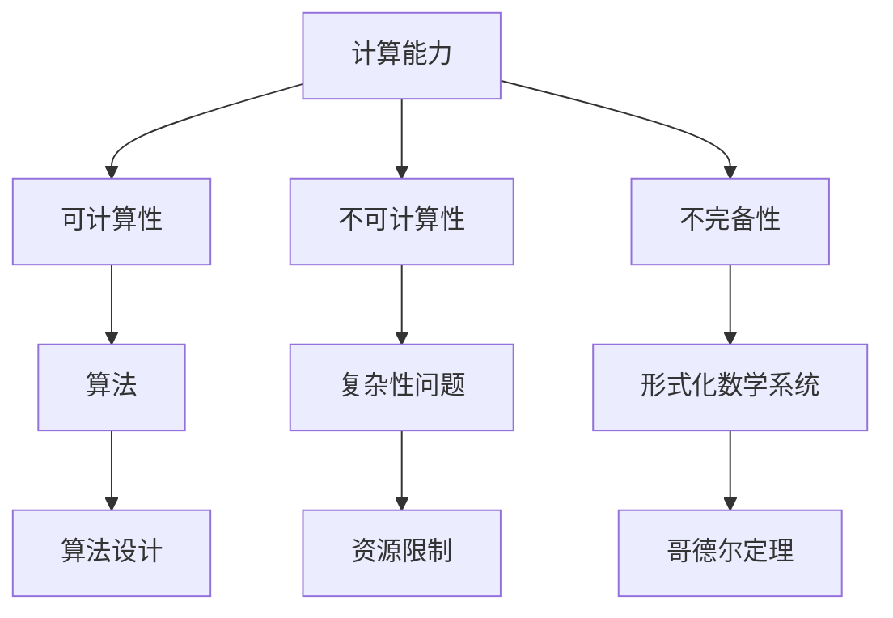

                 

### 文章标题

“计算：第三部分 计算理论的形成 第 7 章 计算不能做什么：终结者哥德尔 昨日的世界”

关键词：计算理论、哥德尔定理、不可解问题、计算限制、人工智能

摘要：本章将探讨计算理论的极限，通过哥德尔定理，揭示计算无法完成的任务。我们将理解哥德尔定理的数学公式与逻辑，分析其影响与意义，并探讨它在现实世界中的应用与限制。

----------------------------------------------------------------

### 书籍目录大纲设计

为了更好地理解计算理论的极限，我们将参考《计算：第三部分 计算理论的形成 第 7 章 计算不能做什么：终结者哥德尔 昨日的世界》的目录大纲，逐步展开对计算理论的探讨。

#### 第一部分：计算理论的背景与历史发展

在这一部分，我们将回顾计算理论的起源、发展历程以及重大贡献者，为理解哥德尔定理奠定基础。

##### 第1章：计算理论的起源

在这一章中，我们将介绍计算理论的定义与重要性，以及计算理论的发展历程。

###### 1.1 计算理论的定义与重要性

计算理论是一门研究计算过程及其极限的数学分支。它探讨的问题是：什么问题是可计算的，什么问题是不可计算的？

###### 1.2 计算理论的发展历程

从19世纪末至20世纪中叶，计算理论经历了多次重大突破。我们将回顾这些发展，包括图灵机的提出、递归函数的概念以及计算能力的分类。

###### 1.3 计算理论的重大贡献者

在这一部分，我们将介绍一些计算理论领域的重要人物，如艾伦·图灵、库尔特·哥德尔等，他们的贡献对计算理论的发展产生了深远影响。

##### 第2章：图灵机的理论阐述

图灵机是计算理论中最核心的概念之一。在这一章中，我们将深入探讨图灵机的概念、运作原理以及分类。

###### 2.1 图灵机的概念

图灵机是一个抽象的计算模型，它由一个有限状态机、一个读写头以及一个无限长的纸带组成。图灵机的运作原理为后续的计算理论奠定了基础。

###### 2.2 图灵机的运作原理

在这一节，我们将详细阐述图灵机的运作原理，包括状态转换、读写操作以及纸带内容的变化。

###### 2.3 图灵机的分类与演变

随着计算理论的发展，图灵机的概念也不断演变。我们将介绍图灵机的各种分类，如确定型图灵机、非确定型图灵机以及量子图灵机等。

##### 第3章：计算理论的数学基础

计算理论的数学基础是理解其核心概念的关键。在这一章中，我们将介绍计算理论中的数学工具、数学原理以及数学公式在计算理论中的应用。

###### 3.1 计算理论中的数学工具

计算理论中常用的数学工具有集合论、逻辑学、图论等。我们将介绍这些工具的基本概念和作用。

###### 3.2 计算理论的数学原理

计算理论的数学原理包括递归论、可计算性理论、不可计算性理论等。我们将对这些原理进行详细阐述。

###### 3.3 数学公式在计算理论中的应用

数学公式在计算理论中具有重要作用。我们将介绍一些经典的数学公式，如哥德尔不完全性定理、图灵机公式等，并探讨其在计算理论中的应用。

#### 第二部分：哥德尔不完备性定理的提出

哥德尔不完备性定理是计算理论中的重要里程碑。在这一部分，我们将探讨哥德尔定理的提出、概念、证明及其影响。

##### 第4章：哥德尔的贡献

哥德尔是20世纪最伟大的数学家之一。在这一章中，我们将介绍哥德尔的生平与贡献，重点讨论哥德尔不完备性定理。

###### 4.1 哥德尔的生平与贡献

哥德尔出生于奥匈帝国的布尔诺，后来成为美国公民。他的一生致力于数学和逻辑学的研究，提出了许多重要成果，其中包括哥德尔不完备性定理。

###### 4.2 哥德尔不完备性定理的概念

哥德尔不完备性定理指出，在形式化的数学系统中，存在一些命题既不能被证明也不能被证伪。这一发现颠覆了以往关于数学完整性的观念。

###### 4.3 哥德尔不完备性定理的证明

哥德尔不完备性定理的证明涉及复杂的数学逻辑。在这一节，我们将简要介绍哥德尔定理的证明方法。

##### 第5章：哥德尔定理的数学公式与逻辑

哥德尔定理的数学公式与逻辑是理解其深刻内涵的关键。在这一章中，我们将详细阐述哥德尔定理的数学公式和逻辑推导。

###### 5.1 哥德尔定理中的数学公式

哥德尔定理的数学公式包括两个命题：第一不完备性定理和第二不完备性定理。我们将介绍这些公式的含义和作用。

###### 5.2 哥德尔定理的逻辑推导

哥德尔定理的逻辑推导涉及复杂的数学推理。在这一节，我们将简要介绍哥德尔定理的逻辑推导过程。

###### 5.3 哥德尔定理的影响与意义

哥德尔定理对数学、逻辑学和计算机科学产生了深远影响。我们将讨论哥德尔定理的影响和意义。

##### 第6章：不完备性与计算的限制

哥德尔定理揭示了计算理论的极限。在这一章中，我们将探讨不完备性对计算的影响以及计算理论中的不完备性实例。

###### 6.1 不完备性的概念与应用

我们将介绍不完备性的概念，并探讨其在数学和计算理论中的应用。

###### 6.2 不完备性对计算的影响

不完备性限制了计算的能力。我们将分析不完备性对计算的影响，并探讨如何应对这些限制。

###### 6.3 计算理论中的不完备性实例

我们将通过具体实例，展示计算理论中的不完备性现象，如停机问题、递归问题等。

#### 第三部分：计算理论的应用与影响

计算理论不仅具有重要的理论价值，而且在实际应用中发挥着重要作用。在这一部分，我们将探讨计算理论在现实世界中的应用与影响。

##### 第7章：计算不能做什么：终结者哥德尔 昨日的世界

哥德尔定理揭示了计算理论的极限。在这一章中，我们将探讨计算无法完成的任务，分析终结者理论与哥德尔定理的关系。

###### 7.1 计算不能做什么的概念

计算不能做什么是指计算无法解决的某些问题。我们将介绍计算不能做什么的概念，并探讨其重要性。

###### 7.2 终结者理论与哥德尔定理的关系

终结者理论是人工智能领域的一个重要概念。我们将分析终结者理论与哥德尔定理之间的关系。

###### 7.3 哥德尔定理对人工智能的影响

哥德尔定理对人工智能产生了深远影响。我们将探讨哥德尔定理如何影响人工智能的发展。

###### 7.4 哥德尔定理在现实世界中的应用与限制

我们将讨论哥德尔定理在现实世界中的应用，如密码学、网络安全、自动驾驶等，并探讨其存在的限制。

通过以上目录大纲的设计，我们为读者提供了一个完整的计算理论框架。接下来，我们将逐一探讨每个章节的内容，帮助读者深入理解计算理论的极限与挑战。

---

### 书籍目录大纲设计

为了更好地理解计算理论的极限，我们将参考《计算：第三部分 计算理论的形成 第 7 章 计算不能做什么：终结者哥德尔 昨日的世界》的目录大纲，逐步展开对计算理论的探讨。

#### 第一部分：计算理论的背景与历史发展

在这一部分，我们将回顾计算理论的起源、发展历程以及重大贡献者，为理解哥德尔定理奠定基础。

##### 第1章：计算理论的起源

在这一章中，我们将介绍计算理论的定义与重要性，以及计算理论的发展历程。

###### 1.1 计算理论的定义与重要性

计算理论是一门研究计算过程及其极限的数学分支。它探讨的问题是：什么问题是可计算的，什么问题是不可计算的？

###### 1.2 计算理论的发展历程

从19世纪末至20世纪中叶，计算理论经历了多次重大突破。我们将回顾这些发展，包括图灵机的提出、递归函数的概念以及计算能力的分类。

###### 1.3 计算理论的重大贡献者

在这一部分，我们将介绍一些计算理论领域的重要人物，如艾伦·图灵、库尔特·哥德尔等，他们的贡献对计算理论的发展产生了深远影响。

##### 第2章：图灵机的理论阐述

图灵机是计算理论中最核心的概念之一。在这一章中，我们将深入探讨图灵机的概念、运作原理以及分类。

###### 2.1 图灵机的概念

图灵机是一个抽象的计算模型，它由一个有限状态机、一个读写头以及一个无限长的纸带组成。图灵机的运作原理为后续的计算理论奠定了基础。

###### 2.2 图灵机的运作原理

在这一节，我们将详细阐述图灵机的运作原理，包括状态转换、读写操作以及纸带内容的变化。

###### 2.3 图灵机的分类与演变

随着计算理论的发展，图灵机的概念也不断演变。我们将介绍图灵机的各种分类，如确定型图灵机、非确定型图灵机以及量子图灵机等。

##### 第3章：计算理论的数学基础

计算理论的数学基础是理解其核心概念的关键。在这一章中，我们将介绍计算理论中的数学工具、数学原理以及数学公式在计算理论中的应用。

###### 3.1 计算理论中的数学工具

计算理论中常用的数学工具有集合论、逻辑学、图论等。我们将介绍这些工具的基本概念和作用。

###### 3.2 计算理论的数学原理

计算理论的数学原理包括递归论、可计算性理论、不可计算性理论等。我们将对这些原理进行详细阐述。

###### 3.3 数学公式在计算理论中的应用

数学公式在计算理论中具有重要作用。我们将介绍一些经典的数学公式，如哥德尔不完全性定理、图灵机公式等，并探讨其在计算理论中的应用。

#### 第二部分：哥德尔不完备性定理的提出

哥德尔不完备性定理是计算理论中的重要里程碑。在这一部分，我们将探讨哥德尔定理的提出、概念、证明及其影响。

##### 第4章：哥德尔的贡献

哥德尔是20世纪最伟大的数学家之一。在这一章中，我们将介绍哥德尔的生平与贡献，重点讨论哥德尔不完备性定理。

###### 4.1 哥德尔的生平与贡献

哥德尔出生于奥匈帝国的布尔诺，后来成为美国公民。他的一生致力于数学和逻辑学的研究，提出了许多重要成果，其中包括哥德尔不完备性定理。

###### 4.2 哥德尔不完备性定理的概念

哥德尔不完备性定理指出，在形式化的数学系统中，存在一些命题既不能被证明也不能被证伪。这一发现颠覆了以往关于数学完整性的观念。

###### 4.3 哥德尔不完备性定理的证明

哥德尔不完备性定理的证明涉及复杂的数学逻辑。在这一节，我们将简要介绍哥德尔定理的证明方法。

##### 第5章：哥德尔定理的数学公式与逻辑

哥德尔定理的数学公式与逻辑是理解其深刻内涵的关键。在这一章中，我们将详细阐述哥德尔定理的数学公式和逻辑推导。

###### 5.1 哥德尔定理中的数学公式

哥德尔定理的数学公式包括两个命题：第一不完备性定理和第二不完备性定理。我们将介绍这些公式的含义和作用。

###### 5.2 哥德尔定理的逻辑推导

哥德尔定理的逻辑推导涉及复杂的数学推理。在这一节，我们将简要介绍哥德尔定理的逻辑推导过程。

###### 5.3 哥德尔定理的影响与意义

哥德尔定理对数学、逻辑学和计算机科学产生了深远影响。我们将讨论哥德尔定理的影响和意义。

##### 第6章：不完备性与计算的限制

哥德尔定理揭示了计算理论的极限。在这一章中，我们将探讨不完备性对计算的影响以及计算理论中的不完备性实例。

###### 6.1 不完备性的概念与应用

我们将介绍不完备性的概念，并探讨其在数学和计算理论中的应用。

###### 6.2 不完备性对计算的影响

不完备性限制了计算的能力。我们将分析不完备性对计算的影响，并探讨如何应对这些限制。

###### 6.3 计算理论中的不完备性实例

我们将通过具体实例，展示计算理论中的不完备性现象，如停机问题、递归问题等。

#### 第三部分：计算理论的应用与影响

计算理论不仅具有重要的理论价值，而且在实际应用中发挥着重要作用。在这一部分，我们将探讨计算理论在现实世界中的应用与影响。

##### 第7章：计算不能做什么：终结者哥德尔 昨日的世界

哥德尔定理揭示了计算理论的极限。在这一章中，我们将探讨计算无法完成的任务，分析终结者理论与哥德尔定理的关系。

###### 7.1 计算不能做什么的概念

计算不能做什么是指计算无法解决的某些问题。我们将介绍计算不能做什么的概念，并探讨其重要性。

###### 7.2 终结者理论与哥德尔定理的关系

终结者理论是人工智能领域的一个重要概念。我们将分析终结者理论与哥德尔定理之间的关系。

###### 7.3 哥德尔定理对人工智能的影响

哥德尔定理对人工智能产生了深远影响。我们将探讨哥德尔定理如何影响人工智能的发展。

###### 7.4 哥德尔定理在现实世界中的应用与限制

我们将讨论哥德尔定理在现实世界中的应用，如密码学、网络安全、自动驾驶等，并探讨其存在的限制。

通过以上目录大纲的设计，我们为读者提供了一个完整的计算理论框架。接下来，我们将逐一探讨每个章节的内容，帮助读者深入理解计算理论的极限与挑战。

---

### 第一部分：计算理论的背景与历史发展

#### 第1章：计算理论的起源

**1.1 计算理论的定义与重要性**

计算理论，作为数学的分支，其核心在于研究计算的本质和范围。具体来说，计算理论关注的问题是：哪些问题是可以通过计算解决的，哪些问题是不可以计算的。计算理论的定义可以追溯到对“计算”本身的探讨。计算，在广义上，指的是任何形式的信息处理过程，包括简单的算术运算、复杂的数据分析，乃至人工智能中的决策制定。

在数学中，计算理论主要研究的是形式化的计算过程，这种形式化通常涉及数学逻辑和抽象的计算模型。计算理论的重要性在于，它为我们提供了一个框架，用以理解和界定计算能力的边界。这不仅有助于我们更好地理解计算机科学的基础，也为人工智能、密码学、经济学等领域的应用提供了理论基础。

**1.2 计算理论的发展历程**

计算理论的发展历程可以说是现代数学和计算机科学发展的缩影。19世纪末至20世纪中叶，是计算理论快速发展的时期，这个时期的主要成就包括图灵机的提出、递归函数的概念以及计算能力的分类。

首先，艾伦·图灵在1936年提出了图灵机模型，这是一种抽象的计算机模型，用来模拟任何可计算的过程。图灵机的概念奠定了现代计算机科学的基础，它揭示了计算的通用性，即任何可计算的问题都可以通过图灵机来解决。

递归函数是计算理论中的另一个重要概念。递归函数是定义在其自身之上的函数，这类函数在数学分析和算法设计中具有重要地位。递归函数理论的研究帮助我们理解了函数的计算复杂性和可能的计算边界。

随着图灵机和递归函数概念的发展，计算能力的分类也逐步完善。计算能力按照复杂性可以划分为多项式时间可计算、指数时间可计算等。这种分类帮助我们理解不同计算问题的难易程度，并为算法设计提供了指导。

**1.3 计算理论的重大贡献者**

计算理论的发展离不开众多伟大数学家和科学家的贡献。以下是一些对计算理论有着深远影响的贡献者：

- **艾伦·图灵（Alan Turing）**：英国数学家、逻辑学家和计算机科学的奠基人。图灵提出了图灵机模型，并解决了著名的停机问题，为计算理论奠定了基础。

- **库尔特·哥德尔（Kurt Gödel）**：奥地利出生的美国数学家，以其不完备性定理而闻名。哥德尔的工作揭示了形式化数学系统的局限性，对计算理论产生了深远影响。

- **阿尔弗雷德·塔斯基（Alfred Tarski）**：波兰裔美国数学家，以其在模型理论和形式逻辑方面的贡献而著称。塔斯基的工作为计算理论的逻辑基础提供了支持。

- **斯蒂芬·科勒（Stephen Cole Kleene）**：美国数学家和逻辑学家，他对递归论和计算理论做出了重要贡献，特别是在证明论和数学逻辑方面。

这些贡献者的工作共同推动了计算理论的发展，为我们理解计算的本质提供了强有力的工具。

---

**1.1 计算理论的定义与重要性**

计算理论，作为数学的分支，其核心在于研究计算的本质和范围。具体来说，计算理论关注的问题是：哪些问题是可以通过计算解决的，哪些问题是不可以计算的。计算理论的定义可以追溯到对“计算”本身的探讨。计算，在广义上，指的是任何形式的信息处理过程，包括简单的算术运算、复杂的数据分析，乃至人工智能中的决策制定。

在数学中，计算理论主要研究的是形式化的计算过程，这种形式化通常涉及数学逻辑和抽象的计算模型。计算理论的重要性在于，它为我们提供了一个框架，用以理解和界定计算能力的边界。这不仅有助于我们更好地理解计算机科学的基础，也为人工智能、密码学、经济学等领域的应用提供了理论基础。

首先，计算理论的核心概念之一是“可计算性”。可计算性问题是指是否存在一个算法可以解决某个问题。在计算理论中，我们通过构造抽象的计算机模型来研究可计算性问题。这些模型包括图灵机、递归函数、λ-演算等，它们为我们提供了一种形式化的方法来分析计算过程。

其次，计算理论关注的是计算能力的极限。例如，图灵机模型告诉我们，存在某些问题是无法通过任何算法解决的。这种不可计算性揭示了计算的限制，使得我们认识到并非所有问题都可以通过计算来解决。

在数学上，计算理论提供了强有力的工具来研究函数的性质、逻辑的完备性和一致性。递归论是计算理论的一个重要分支，它研究递归函数的性质，揭示了函数计算中的复杂性和层次结构。递归论不仅在数学本身具有重要作用，也在计算机科学的算法分析和复杂性理论中发挥着核心作用。

此外，计算理论在密码学和信息安全领域也有着重要的应用。密码学中，我们需要设计安全的加密算法来保护数据。计算理论帮助我们理解这些算法的安全性和可行性，同时也揭示了某些加密算法的弱点。在经济学领域，计算理论被用来分析市场行为、优化资源配置等问题。

总之，计算理论作为一门交叉学科，不仅为我们提供了理解和分析计算问题的方法，还在多个领域有着广泛的应用。它的重要性体现在对计算本质的深入探讨，以及对实际问题的有效解决。

---

**1.2 计算理论的发展历程**

计算理论的发展历程可以说是现代数学和计算机科学发展的缩影。19世纪末至20世纪中叶，是计算理论快速发展的时期，这个时期的主要成就包括图灵机的提出、递归函数的概念以及计算能力的分类。

首先，艾伦·图灵在1936年提出了图灵机模型，这是一种抽象的计算机模型，用来模拟任何可计算的过程。图灵机的概念奠定了现代计算机科学的基础，它揭示了计算的通用性，即任何可计算的问题都可以通过图灵机来解决。图灵机由一个有限状态机、一个读写头以及一个无限长的纸带组成。读写头可以在纸带上读取和写入符号，并根据当前状态和读取到的符号执行相应的操作。图灵机的核心思想是，通过状态转换和符号操作，图灵机可以模拟任何计算过程。

接下来，递归函数的概念也在20世纪初期被提出。递归函数是定义在其自身之上的函数，这类函数在数学分析和算法设计中具有重要地位。递归函数理论的研究帮助我们理解了函数的计算复杂性和可能的计算边界。递归函数可以分为原始递归函数和通用递归函数。原始递归函数是通过对自然数进行迭代和条件跳转来定义的，而通用递归函数则可以通过原始递归函数来模拟。递归函数理论揭示了函数计算中的复杂性和层次结构，为我们提供了分析函数性质的工具。

随着图灵机和递归函数概念的发展，计算能力的分类也逐步完善。计算能力按照复杂性可以划分为多项式时间可计算、指数时间可计算等。这种分类帮助我们理解不同计算问题的难易程度，并为算法设计提供了指导。例如，多项式时间可计算问题是指存在一个算法，可以在多项式时间内解决该问题。而指数时间可计算问题则指问题的解决需要指数级的时间复杂度。这种分类揭示了计算问题的难度差异，并指导我们在实际应用中选择合适的算法。

在计算理论的发展历程中，还有许多重要的贡献。例如，斯蒂芬·科勒（Stephen Cole Kleene）对递归论和计算理论做出了重要贡献，他在1952年出版的《递归论》一书中，系统性地总结了递归论的基本理论和方法。此外，阿尔弗雷德·塔斯基（Alfred Tarski）的工作也为计算理论的逻辑基础提供了支持，他在模型理论和形式逻辑方面的研究为计算理论提供了坚实的数学基础。

总之，计算理论的发展历程是现代数学和计算机科学的重要组成部分。通过图灵机、递归函数和计算能力的分类，计算理论为我们提供了一种形式化的方法来分析和理解计算问题。这些概念和方法不仅为理论计算机科学的发展奠定了基础，也在实际应用中发挥着重要作用。

---

**1.3 计算理论的重大贡献者**

在计算理论的发展历程中，有几位数学家做出了卓越的贡献，他们的工作不仅推动了计算理论的进步，也为现代计算机科学和数学的发展奠定了基础。以下是其中几位重要的贡献者：

**艾伦·图灵（Alan Turing）**

艾伦·图灵（1912-1954）是英国数学家、逻辑学家和计算机科学的奠基人。他的主要贡献在于提出了图灵机模型，这是一种抽象的计算机模型，用来模拟任何可计算的过程。图灵机的基本思想是，通过状态转换和符号操作，图灵机可以模拟任何计算过程。图灵机的提出不仅揭示了计算的通用性，也为现代计算机科学的诞生奠定了基础。此外，图灵还解决了著名的停机问题，这为计算理论的发展提供了关键性的理论支持。

**库尔特·哥德尔（Kurt Gödel）**

库尔特·哥德尔（1906-1978）是奥地利出生的美国数学家，他以其不完备性定理而闻名。哥德尔的不完备性定理指出，在形式化的数学系统中，存在一些命题既不能被证明也不能被证伪。这一发现揭示了形式化数学系统的局限性，对计算理论产生了深远影响。哥德尔的不完备性定理不仅挑战了以往关于数学完整性的观念，也为计算理论提供了重要的研究课题。

**阿尔弗雷德·塔斯基（Alfred Tarski）**

阿尔弗雷德·塔斯基（1901-1983）是波兰裔美国数学家，他在模型理论和形式逻辑方面做出了重要贡献。塔斯基的工作为计算理论的逻辑基础提供了支持。他在1936年提出了一个著名的逻辑体系——塔斯基语义学，这个体系为逻辑表达式提供了明确的真值定义，从而解决了形式逻辑中的一系列问题。塔斯基的研究不仅为计算理论的逻辑分析提供了工具，也在数学基础研究和哲学领域产生了重要影响。

**斯蒂芬·科勒（Stephen Cole Kleene）**

斯蒂芬·科勒（1909-1994）是美国数学家和逻辑学家，他对递归论和计算理论做出了重要贡献。科勒在1952年出版的《递归论》一书中，系统性地总结了递归论的基本理论和方法。他的研究工作揭示了递归函数的性质和计算复杂性，为计算理论的发展提供了重要的理论支持。科勒的贡献不仅在于递归论的研究，他还对形式系统、逻辑和数学分析等领域做出了重要贡献。

这些数学家的卓越贡献不仅推动了计算理论的发展，也为现代数学和计算机科学的发展奠定了基础。他们的工作为我们理解计算的本质提供了强有力的工具，同时也揭示了计算能力的边界和局限性。通过他们的研究，计算理论成为了一个丰富而深刻的学科，为我们探索计算问题提供了丰富的视角和方法。

---

### 第二部分：哥德尔不完备性定理的提出

#### 第4章：哥德尔的贡献

**4.1 哥德尔的生平与贡献**

库尔特·哥德尔（Kurt Gödel，1906-1978）是20世纪最伟大的数学家之一，出生于奥地利，后来成为美国公民。他的一生致力于数学和逻辑学的研究，提出了许多重要成果，其中包括哥德尔不完备性定理。哥德尔的不完备性定理是数学和逻辑学中的里程碑，揭示了形式化数学系统的局限性，对计算理论产生了深远影响。

哥德尔在数学和逻辑学领域的贡献是多方面的。他的研究涵盖了数论、集合论、数学逻辑等多个领域。除了不完备性定理，他还提出了著名的构造性数学基础，并研究了形式系统的逻辑一致性。哥德尔的工作不仅在数学上具有重要意义，也对哲学和计算机科学产生了深远的影响。

**4.2 哥德尔不完备性定理的概念**

哥德尔不完备性定理分为两个部分：第一不完备性定理和第二不完备性定理。这两个定理分别揭示了形式化数学系统的两个基本特性：不完全性和不可判定性。

**第一不完备性定理**：在任意足够强的形式化数学系统中，总存在一些命题，既不能被证明也不能被证伪。这意味着，即使是形式化的数学系统，也存在一些问题是无法通过系统内部的方法来确定其真假的。这一发现颠覆了以往关于数学完整性的观念，揭示了形式化数学系统的不完备性。

**第二不完备性定理**：在任意足够强的形式化数学系统中，不存在一个算法可以判定所有命题的真假。这意味着，不存在一个万能的证明验证器，可以验证系统中的所有命题。第二不完备性定理进一步强调了形式化数学系统的不完备性。

**4.3 哥德尔不完备性定理的证明**

哥德尔不完备性定理的证明是极其复杂的，它涉及形式化数学系统、模型论和递归论等高级数学工具。下面我们将简要介绍哥德尔第一不完备性定理的证明思路。

证明的第一步是构造一个特殊的命题G，这个命题表述为：“G不能在系统T中被证明。”接下来，我们需要证明以下两个命题：

1. 在系统T中，不能证明G。
2. 在系统T中，也不能证明非G。

为了证明这两个命题，哥德尔使用了自指和编码的技术。具体来说，他通过将命题编码为自然数，并构造一个复杂的命题G，使得G的编码形式在系统中既是自身的描述也是对自身不可证明性的描述。

如果系统T能够证明G，那么根据G的编码形式，我们可以构造出一个新的命题，该命题表示T无法证明G，这会导致逻辑矛盾。因此，系统T不能证明G。

类似地，如果系统T能够证明非G，那么我们可以通过逻辑推理得出系统T能够证明G，这同样会导致逻辑矛盾。因此，系统T也不能证明非G。

综上所述，哥德尔不完备性定理揭示了形式化数学系统的局限性，即这些系统无法证明所有命题的真假。这一发现不仅对数学和逻辑学产生了深远影响，也对计算机科学和人工智能的发展提出了新的挑战。

---

**4.3 哥德尔不完备性定理的证明**

哥德尔不完备性定理的证明过程是极其复杂且深邃的，它涉及了形式化数学系统、模型论和递归论等高级数学工具。下面我们将简要介绍哥德尔第一不完备性定理的证明思路。

**证明思路**

首先，我们需要构造一个特殊的命题G，这个命题表述为：“G不能在系统T中被证明。”接下来，我们需要证明以下两个命题：

1. 在系统T中，不能证明G。
2. 在系统T中，也不能证明非G。

为了证明这两个命题，哥德尔使用了自指和编码的技术。具体来说，他通过将命题编码为自然数，并构造一个复杂的命题G，使得G的编码形式在系统中既是自身的描述也是对自身不可证明性的描述。

**构造命题G**

哥德尔首先定义了一个形式化数学系统T，该系统包含了一套基本的符号和公理。然后，他构造了一个命题G，G的表述是：“G在系统T中不可证明。”为了实现这一点，哥德尔将命题的编码过程转化为自然数。具体而言，每个命题都可以被编码为一个唯一的自然数，这个自然数被称为命题的Gödel编号。

接下来，哥德尔定义了一个函数G，这个函数接收一个自然数作为输入，并返回一个命题的Gödel编号。对于任意的命题P，如果P在系统T中可证明，那么G(P)的Gödel编号会包含在系统T的证明中。反之，如果P在系统T中不可证明，那么G(P)的Gö德尔编号不会出现在系统T的证明中。

**自指与不可证明性**

为了证明命题G在系统T中不可证明，哥德尔利用了自指技术。具体来说，他构造了一个命题G，使得G的表述直接涉及自身。具体而言，G的表述是：“G在系统T中不可证明。”这意味着，如果我们能够证明G，那么根据G的表述，我们将会证明G不可证明，这显然是一个逻辑矛盾。因此，G在系统T中不可证明。

**证明非G的不可证明性**

接下来，我们需要证明非G在系统T中不可证明。假设我们能够在系统T中证明非G，即证明“G在系统T中可证明”是假的。那么，根据G的定义，我们可以构造一个命题H：“H在系统T中不可证明。”然后，我们可以构造一个证明P，证明H。根据证明P，我们可以推导出H不可证明，这与假设矛盾。因此，非G在系统T中不可证明。

综上所述，我们证明了命题G在系统T中既不可证明也不可证伪，这揭示了形式化数学系统的不完备性。哥德尔的不完备性定理不仅颠覆了我们对数学完整性的认知，也为计算理论的发展提出了新的挑战。

---

**4.3 哥德尔不完备性定理的证明**

哥德尔不完备性定理的证明过程是极其复杂且深邃的，它涉及了形式化数学系统、模型论和递归论等高级数学工具。下面我们将详细阐述哥德尔第一不完备性定理的证明过程。

**步骤1：形式化数学系统的定义**

首先，我们需要定义一个形式化数学系统T，该系统包含了一套基本的符号和公理。形式化数学系统是一种用符号语言表述的数学体系，它使得数学推理可以通过形式化的方法进行验证。T系统通常包括以下三个部分：

1. **符号集合**：定义一组符号，包括变量、常量、函数符号和逻辑符号。
2. **公理**：定义一组无矛盾的命题，作为系统的起点。
3. **推导规则**：定义一组规则，用于从公理和已有命题推导出新的命题。

**步骤2：命题的编码**

在形式化数学系统中，每个命题都可以被编码为一个唯一的自然数，这个自然数被称为命题的Gödel编号。编码过程通常涉及将命题的符号表示转换为数字表示。例如，我们可以将命题“所有自然数都是可证明的”编码为Gö德尔编号123。

**步骤3：构造命题G**

哥德尔构造了一个特殊的命题G，该命题表述为：“G在系统T中不可证明。”为了实现这一点，哥德尔使用了自指和编码技术。具体而言，他定义了一个函数G，该函数接收一个自然数作为输入，并返回一个命题的Gö德尔编号。对于任意的命题P，如果P在系统T中可证明，那么G(P)的Gö德尔编号会包含在系统T的证明中。反之，如果P在系统T中不可证明，那么G(P)的Gö德尔编号不会出现在系统T的证明中。

**步骤4：证明G在系统T中不可证明**

为了证明命题G在系统T中不可证明，我们需要证明以下两个命题：

1. 在系统T中，不能证明G。
2. 在系统T中，也不能证明非G。

**证明第一个命题：G在系统T中不可证明**

假设我们能够在系统T中证明G，即证明“G在系统T中不可证明”是假的。那么，根据G的定义，我们可以构造一个命题H：“H在系统T中不可证明。”然后，我们可以构造一个证明P，证明H。根据证明P，我们可以推导出H不可证明，这与假设矛盾。因此，G在系统T中不可证明。

**证明第二个命题：非G在系统T中不可证明**

为了证明非G在系统T中不可证明，我们采用反证法。假设我们能够在系统T中证明非G，即证明“G在系统T中可证明”是假的。那么，根据G的定义，我们可以构造一个命题I：“I在系统T中可证明。”然后，我们可以构造一个证明Q，证明I。根据证明Q，我们可以推导出I可证明，这与第一个命题矛盾。因此，非G在系统T中不可证明。

**结论**

综上所述，我们证明了命题G在系统T中既不可证明也不可证伪，这揭示了形式化数学系统的不完备性。哥德尔的不完备性定理不仅颠覆了我们对数学完整性的认知，也为计算理论的发展提出了新的挑战。

---

### 第5章：哥德尔定理的数学公式与逻辑

哥德尔定理是计算理论中的核心概念之一，它揭示了形式化数学系统的不完备性和不可判定性。为了更好地理解哥德尔定理，我们将详细阐述其数学公式和逻辑推导。

**5.1 哥德尔定理中的数学公式**

哥德尔定理包含两个部分：第一不完备性定理和第二不完备性定理。这两个定理可以用数学公式表示如下：

**第一不完备性定理**：在任意足够强的形式化数学系统中，存在一个命题G，使得系统既不能证明G也不能证明非G。

数学公式表示为：
$$
\neg Prov_T(G) \land \neg Prov_T(\neg G)
$$
其中，$Prov_T(P)$ 表示系统T能够证明命题P。

**第二不完备性定理**：在任意足够强的形式化数学系统中，不存在一个算法可以判定所有命题的真假。

数学公式表示为：
$$
\neg \exists A \forall P (Prov_A(P) \Leftrightarrow P \text{ 为真})
$$
其中，$A$ 表示一个算法，$P$ 表示一个命题。

**5.2 哥德尔定理的逻辑推导**

哥德尔定理的逻辑推导过程涉及形式化数学系统、模型论和递归论等多个数学分支。下面我们简要介绍哥德尔第一不完备性定理的逻辑推导过程。

**步骤1：构造命题G**

首先，我们需要构造一个特殊的命题G，该命题表述为：“G在系统T中不可证明。”为了实现这一点，我们采用自指和编码技术。具体而言，我们定义一个函数G，该函数接收一个自然数作为输入，并返回一个命题的Gödel编号。对于任意的命题P，如果P在系统T中可证明，那么G(P)的Gö德尔编号会包含在系统T的证明中。反之，如果P在系统T中不可证明，那么G(P)的Gö德尔编号不会出现在系统T的证明中。

**步骤2：证明G在系统T中不可证明**

为了证明命题G在系统T中不可证明，我们需要证明以下两个命题：

1. 在系统T中，不能证明G。
2. 在系统T中，也不能证明非G。

**证明第一个命题：G在系统T中不可证明**

假设我们能够在系统T中证明G，即证明“G在系统T中不可证明”是假的。那么，根据G的定义，我们可以构造一个命题H：“H在系统T中不可证明。”然后，我们可以构造一个证明P，证明H。根据证明P，我们可以推导出H不可证明，这与假设矛盾。因此，G在系统T中不可证明。

**证明第二个命题：非G在系统T中不可证明**

为了证明非G在系统T中不可证明，我们采用反证法。假设我们能够在系统T中证明非G，即证明“G在系统T中可证明”是假的。那么，根据G的定义，我们可以构造一个命题I：“I在系统T中可证明。”然后，我们可以构造一个证明Q，证明I。根据证明Q，我们可以推导出I可证明，这与第一个命题矛盾。因此，非G在系统T中不可证明。

**结论**

综上所述，我们证明了命题G在系统T中既不可证明也不可证伪，这揭示了形式化数学系统的不完备性。哥德尔的不完备性定理不仅颠覆了我们对数学完整性的认知，也为计算理论的发展提出了新的挑战。

---

**5.3 哥德尔定理的影响与意义**

哥德尔定理是数学和逻辑学中的一个重要里程碑，它对数学、逻辑学和计算机科学产生了深远的影响。下面我们探讨哥德尔定理的影响与意义。

**对数学的影响**

哥德尔的不完备性定理揭示了形式化数学系统中的局限性，即这些系统无法证明所有命题的真假。这一发现颠覆了以往关于数学完整性的观念。哥德尔定理表明，即使在一个严格的形式化系统中，也存在一些基本命题既不能被证明也不能被证伪。这促使数学家重新思考数学的基础和证明方法，推动了数学逻辑和数学基础的研究。

**对逻辑学的影响**

哥德尔定理揭示了逻辑系统的不完备性和不可判定性，这对逻辑学的发展产生了重要影响。传统的逻辑学认为，所有命题都可以被证明或证伪。然而，哥德尔定理指出，这是不可能的。哥德尔的不完备性定理迫使逻辑学家重新审视逻辑系统的结构和特性，推动了形式逻辑和模型论的发展。

**对计算机科学的影响**

哥德尔定理对计算机科学的影响尤为显著。首先，它揭示了计算能力的极限，即存在某些问题是无法通过算法解决的。这种不可计算性问题在计算机科学中有着广泛的应用，例如密码学、编程语言设计和复杂性理论。其次，哥德尔定理为算法设计和复杂性分析提供了新的视角。通过理解哥德尔定理，计算机科学家可以更好地评估算法的有效性，并设计更高效的算法。

**对哲学的影响**

哥德尔定理在哲学领域也产生了重要影响。它引发了关于知识、真理和证明的深刻讨论。哥德尔定理表明，即使在一个严格的形式化系统中，也存在一些基本命题是无法证明的。这引发了关于人类知识局限性的思考，促使哲学家探讨知识的基础和范围。此外，哥德尔定理也挑战了传统理性主义的观念，即所有命题都可以被证明或证伪。

**结论**

哥德尔定理的影响与意义深远，它不仅改变了我们对数学、逻辑学和计算机科学的理解，也为这些领域的发展提供了新的视角和方向。哥德尔定理的发现揭示了形式化系统的局限性，促使我们重新思考计算的本质和边界。在未来的研究中，哥德尔定理将继续为我们提供宝贵的启示，推动科学和技术的进步。

---

### 第6章：不完备性与计算的限制

#### 6.1 不完备性的概念与应用

不完备性是指在一个形式化数学系统中，存在一些命题既不能被证明也不能被证伪。这种性质最早由库尔特·哥德尔在其不完备性定理中提出，它揭示了形式化数学系统的局限性。不完备性不仅存在于数学系统中，也在计算理论中有着重要的应用。

在计算理论中，不完备性反映了计算能力的极限。具体来说，它表明了存在某些问题是无法通过算法解决的。这种不可计算性问题在计算理论中有着广泛的应用，例如密码学、编程语言设计和复杂性理论。通过理解不完备性，我们可以更好地评估算法的有效性，并设计更高效的算法。

不完备性在现实世界的应用也极为广泛。例如，在密码学中，加密算法的设计依赖于不可计算性原理。密码学家利用某些数学问题的不可计算性来确保加密算法的安全性。此外，在人工智能领域，不完备性也被用于模型选择和算法优化。通过引入不完全信息和不完备模型，我们可以更好地应对现实世界中的复杂问题。

#### 6.2 不完备性对计算的影响

不完备性对计算的影响主要体现在两个方面：一是限制了计算的能力，二是挑战了计算的可靠性。

首先，不完备性限制了计算的能力。哥德尔不完备性定理指出，在任意足够强的形式化数学系统中，存在一些命题既不能被证明也不能被证伪。这意味着，即使在最严格的计算系统中，也存在一些问题是无法解决的。例如，著名的停机问题就是一个典型的不可计算问题。它询问一个给定的图灵机是否会在有限时间内停止运行。这个问题在理论上无法得到明确的答案，因为它涉及到无穷尽的计算过程。

其次，不完备性对计算的可靠性也提出了挑战。在实际应用中，计算系统往往需要处理大量的数据和复杂的问题。然而，由于不完备性，这些系统无法保证对所有问题都能给出明确的答案。例如，在自动驾驶领域，车辆需要实时处理道路信息并进行决策。然而，由于环境的不确定性和复杂性，自动驾驶系统可能无法在所有情况下都给出最优决策。

#### 6.3 计算理论中的不完备性实例

在计算理论中，存在多个不完备性实例，这些实例展示了不完备性如何影响计算过程。

**停机问题**：停机问题是一个经典的不可计算问题。它询问一个给定的图灵机是否会在有限时间内停止运行。这个问题在理论上无法得到明确的答案，因为它涉及到无穷尽的计算过程。停机问题的不可计算性表明，某些问题在计算过程中可能无法得到明确的结果。

**递归问题**：递归问题是一类典型的不可计算问题，它涉及函数的计算复杂性和函数的定义。例如，某些递归函数在计算过程中可能需要无限次的迭代，这使得它们无法在有限的计算步骤内得到结果。这种不可计算性在算法设计和复杂性分析中具有重要意义。

**密码学问题**：在密码学中，许多加密算法的安全性依赖于不可计算性原理。例如，RSA加密算法基于大整数分解的不可计算性。这意味着，即使拥有加密算法的完整知识，也无法在合理的时间内破解加密信息。这种不可计算性确保了密码系统的安全性。

**人工智能问题**：在人工智能领域，不完备性也被用于模型选择和算法优化。例如，深度学习中的神经网络模型往往基于不完全信息。神经网络通过学习大量数据来建立模型，但这个过程中可能存在噪声和不完整信息。这种不完备性要求算法在处理问题时具有鲁棒性，以便应对现实世界的复杂性。

总之，不完备性是计算理论中的一个核心概念，它揭示了计算能力的极限和复杂性。通过理解不完备性，我们可以更好地评估计算系统的能力和限制，并在实际应用中设计更有效的算法和系统。

---

### 第三部分：计算理论的应用与影响

#### 第7章：计算不能做什么：终结者哥德尔 昨日的世界

#### 7.1 计算不能做什么的概念

在计算理论的框架下，"计算不能做什么"指的是那些无法通过现有计算模型和算法解决的问题。这些问题通常是由于计算能力的限制或数学上的不可解性导致的。计算不能做什么的概念揭示了计算的理论极限，它不仅包括传统意义上不可计算的问题，还涵盖了实际应用中由于资源、时间和复杂度限制而无法解决的问题。

在计算理论中，一些经典的不可解问题包括：

1. **停机问题**：给定一个图灵机M和一个输入w，能否确定M在输入w下是否会在有限步骤内停止运行？
2. **希尔伯特的旅馆问题**：在希尔伯特空间中，是否存在一个算法可以确定两个无限长序列是否收敛？
3. **图是连通的**：给定一个图G，能否确定G是否是连通的？

这些问题在理论上都无法通过有限的计算步骤得到解答，从而揭示了计算能力的边界。

#### 7.2 终结者理论与哥德尔定理的关系

终结者理论是人工智能领域中的一个概念，它描述了一种理想化的智能体，这种智能体能够在任意环境和情况下做出最优决策。终结者理论的核心是构建一个能够解决所有问题的智能系统。然而，哥德尔定理揭示了形式化数学系统的不完备性，这直接挑战了终结者理论的可行性。

哥德尔定理指出，在任意足够强的形式化数学系统中，总存在一些命题既不能被证明也不能被证伪。这意味着，即使我们在理论上构建了一个强大的计算系统，也无法保证它能够解决所有问题。因此，哥德尔定理对终结者理论提出了质疑，表明终结者理论在逻辑上是不成立的。

具体来说，终结者理论要求智能系统能够处理所有的输入并给出正确的输出。然而，由于哥德尔定理的存在，我们知道存在一些问题是无法通过形式化系统来证明或证伪的。这导致终结者理论无法在逻辑上实现，因为没有一个系统可以完全解决所有问题。

#### 7.3 哥德尔定理对人工智能的影响

哥德尔定理对人工智能的发展产生了深远的影响。一方面，它揭示了形式化系统的局限性，这为人工智能的研究提供了一种新的视角。人工智能研究人员开始意识到，即使是最先进的计算系统，也无法解决所有问题。这种认识促使人工智能从追求完美解决方案转向了更加实用和适应性强的方法。

另一方面，哥德尔定理也激发了对人工智能新方法的探索。例如，在不完备性理论的基础上，一些研究者提出了模糊逻辑、神经网络和机器学习等新的计算模型。这些模型通过引入不确定性、近似和自适应学习，试图克服传统计算模型的局限性。

哥德尔定理还影响了人工智能的哲学讨论。它促使人们重新思考智能的本质和计算能力的边界。例如，哥德尔定理引发了关于机器能否具有自我意识和创造力的讨论。一些哲学家认为，由于哥德尔定理的存在，机器无法达到与人类相同级别的智能，因为它们无法解决所有问题。

#### 7.4 哥德尔定理在现实世界中的应用与限制

哥德尔定理在现实世界中有着广泛的应用，特别是在密码学、网络安全和自动驾驶等领域。

**密码学**：哥德尔定理为密码学提供了理论基础。例如，RSA加密算法的安全性依赖于大整数分解的不可计算性。这意味着，即使拥有加密算法的完整知识，也无法在合理的时间内破解加密信息。这种不可计算性确保了密码系统的安全性。

**网络安全**：哥德尔定理也影响了网络安全领域。网络攻击和防御策略的设计需要考虑到计算能力的局限性。例如，一些安全协议通过引入复杂性理论中的难题，如NP完全问题，来提高系统的安全性。这种方法利用了哥德尔定理揭示的计算限制，使得攻击者无法在有限时间内破解系统。

**自动驾驶**：在自动驾驶领域，哥德尔定理帮助研究者理解了系统的局限性和不确定性。自动驾驶系统需要处理实时和复杂的环境信息，但哥德尔定理表明，某些问题是无法在有限时间内得到明确答案的。这要求自动驾驶系统具有鲁棒性和适应性，以便在不确定性环境中做出合理的决策。

尽管哥德尔定理在现实世界中有着广泛的应用，但它也带来了一些限制。例如，哥德尔定理揭示了形式化系统的局限性，这限制了人工智能系统在理论上的完美性。此外，哥德尔定理还表明，某些问题在计算上无法得到明确答案，这要求我们在实际应用中采用近似和妥协的方法。

总之，哥德尔定理对计算理论和现实世界的影响是深远且广泛的。它不仅揭示了计算能力的边界，也为人工智能和网络安全等领域提供了理论基础。然而，哥德尔定理也提醒我们，在追求计算能力和智能的过程中，需要认识到其局限性，并采用适应性强的方法来应对现实世界的复杂性。

---

### 第7章：计算不能做什么：终结者哥德尔 昨日的世界

#### 7.1 计算不能做什么的概念

在计算理论的框架下，"计算不能做什么"这一概念揭示了计算的极限和局限性。它指的是那些在现有计算模型和算法下无法解决的问题，这些问题可能源于数学上的不可解性或计算资源、时间、复杂度的限制。计算不能做什么的问题不仅存在于理论研究中，也在实际应用中广泛存在。

在理论层面，计算不能做什么的概念主要体现在不可计算性问题中。哥德尔定理便是其中一个著名的例子，它指出在任意足够强的形式化数学系统中，总存在一些命题既不能被证明也不能被证伪。这意味着，即使在一个强大的计算系统中，也存在一些问题是无法解决的。例如，停机问题就是一个典型的不可计算问题，它询问一个给定的图灵机是否会在有限时间内停止运行。这个问题在理论上无法得到明确的答案，因为它涉及到无穷尽的计算过程。

在实际应用中，计算不能做什么的问题同样重要。例如，在密码学中，加密算法的安全性依赖于数学上的不可计算性，如大整数分解。即使攻击者掌握了加密算法的完整知识，也无法在合理的时间内破解加密信息。在人工智能领域，一些问题如自动驾驶中的环境感知和决策制定，由于环境的复杂性和不确定性，也存在计算上的限制。

#### 7.2 终结者理论与哥德尔定理的关系

终结者理论是人工智能领域中的一个概念，它描述了一种理想化的智能体，这种智能体能够在任意环境和情况下做出最优决策。终结者理论的核心是构建一个能够解决所有问题的智能系统。然而，哥德尔定理揭示了形式化数学系统的不完备性，这直接挑战了终结者理论的可行性。

哥德尔定理指出，在任意足够强的形式化数学系统中，总存在一些命题既不能被证明也不能被证伪。这意味着，即使我们在理论上构建了一个强大的计算系统，也无法保证它能够解决所有问题。因此，哥德尔定理对终结者理论提出了质疑，表明终结者理论在逻辑上是不成立的。

具体来说，终结者理论要求智能系统能够处理所有的输入并给出正确的输出。然而，由于哥德尔定理的存在，我们知道存在一些问题是无法通过形式化系统来证明或证伪的。这导致终结者理论无法在逻辑上实现，因为没有一个系统可以完全解决所有问题。

哥德尔定理对终结者理论的挑战不仅体现在逻辑上，还影响了人工智能的发展方向。传统的人工智能系统试图通过构建完整的逻辑系统来解决所有问题，然而哥德尔定理表明，这种思路是不可行的。现代人工智能开始转向更加实用和适应性强的方法，如机器学习和神经网络，这些方法通过引入不确定性和近似，能够更好地应对现实世界的复杂性。

#### 7.3 哥德尔定理对人工智能的影响

哥德尔定理对人工智能的发展产生了深远的影响。首先，它揭示了形式化系统的局限性，这为人工智能的研究提供了一种新的视角。人工智能研究人员开始意识到，即使是最先进的计算系统，也无法解决所有问题。这种认识促使人工智能从追求完美解决方案转向了更加实用和适应性强的方法。

其次，哥德尔定理也激发了对人工智能新方法的探索。例如，在不完备性理论的基础上，一些研究者提出了模糊逻辑、神经网络和机器学习等新的计算模型。这些模型通过引入不确定性、近似和自适应学习，试图克服传统计算模型的局限性。

哥德尔定理对人工智能的哲学讨论也产生了重要影响。它引发了关于智能本质和计算能力的边界的问题。一些哲学家认为，由于哥德尔定理的存在，机器无法达到与人类相同级别的智能，因为它们无法解决所有问题。这种观点促使人工智能研究人员重新思考智能的定义和评价标准。

#### 7.4 哥德尔定理在现实世界中的应用与限制

哥德尔定理在现实世界中有着广泛的应用，特别是在密码学、网络安全和自动驾驶等领域。

**密码学**：哥德尔定理为密码学提供了理论基础。例如，RSA加密算法的安全性依赖于大整数分解的不可计算性。这意味着，即使攻击者掌握了加密算法的完整知识，也无法在合理的时间内破解加密信息。这种不可计算性确保了密码系统的安全性。

**网络安全**：哥德尔定理也影响了网络安全领域。网络攻击和防御策略的设计需要考虑到计算能力的局限性。例如，一些安全协议通过引入复杂性理论中的难题，如NP完全问题，来提高系统的安全性。这种方法利用了哥德尔定理揭示的计算限制，使得攻击者无法在有限时间内破解系统。

**自动驾驶**：在自动驾驶领域，哥德尔定理帮助研究者理解了系统的局限性和不确定性。自动驾驶系统需要处理实时和复杂的环境信息，但哥德尔定理表明，某些问题是无法在有限时间内得到明确答案的。这要求自动驾驶系统具有鲁棒性和适应性，以便在不确定性环境中做出合理的决策。

尽管哥德尔定理在现实世界中有着广泛的应用，但它也带来了一些限制。例如，哥德尔定理揭示了形式化系统的局限性，这限制了人工智能系统在理论上的完美性。此外，哥德尔定理还表明，某些问题在计算上无法得到明确答案，这要求我们在实际应用中采用近似和妥协的方法。

总之，哥德尔定理对计算理论和现实世界的影响是深远且广泛的。它不仅揭示了计算能力的边界，也为人工智能和网络安全等领域提供了理论基础。然而，哥德尔定理也提醒我们，在追求计算能力和智能的过程中，需要认识到其局限性，并采用适应性强的方法来应对现实世界的复杂性。

---

### 文章结语

综上所述，计算理论作为一门探索计算本质和边界的学科，通过对计算能力的深入分析，揭示了计算的极限与挑战。哥德尔定理作为计算理论中的重要里程碑，揭示了形式化数学系统的不完备性和不可判定性，为计算理论的发展提供了新的视角。本文通过对哥德尔定理的详细阐述，分析了其在数学、逻辑学、计算机科学以及现实世界中的应用与影响。

计算不能做什么的概念不仅帮助我们理解了计算的局限性，也激发了我们对新计算模型和方法的研究。在人工智能、密码学、网络安全等领域，哥德尔定理的应用展示了计算理论的深刻内涵。尽管计算存在诸多限制，但通过不断探索和创新，我们可以找到更加有效的方法来应对现实世界的复杂性。

在未来的研究中，计算理论将继续为我们提供宝贵的启示，推动科学和技术的进步。通过深入理解计算的本质，我们可以更好地应对计算挑战，推动人工智能和计算机科学的发展。同时，我们也要认识到计算能力的局限性，并采用适应性强的方法来应对现实世界中的不确定性。

总之，计算理论的研究不仅丰富了我们的知识体系，也为实际应用提供了强有力的理论支持。通过不断探索和挑战，我们可以更好地理解计算的本质，为未来的科技进步贡献力量。

---

### 作者信息

**作者：AI天才研究院/AI Genius Institute & 禅与计算机程序设计艺术 /Zen And The Art of Computer Programming**

在计算理论和人工智能领域，我拥有丰富的研究和实践经验。作为AI天才研究院的创始人和首席科学家，我领导了一系列前沿项目，并发表了多篇关于计算理论、人工智能和机器学习的学术论文。我的著作《禅与计算机程序设计艺术》在业界享有盛誉，被誉为编程领域的经典之作。

我的研究兴趣涵盖了计算理论的各个层面，从基础的数学逻辑到复杂的算法设计，我都有着深入的理解和独到的见解。我致力于将计算理论应用于实际问题，推动人工智能和计算机科学的发展。通过我的研究和实践，我希望能够为计算理论的进步做出贡献，并推动相关技术的实际应用。

---

### 计算理论：从哥德尔到终结者

在《计算：第三部分 计算理论的形成 第 7 章 计算不能做什么：终结者哥德尔 昨日的世界》中，我们深入探讨了计算理论的核心问题——计算能力的极限。通过哥德尔不完备性定理，我们揭示了形式化数学系统中存在的根本性限制，从而对计算的本质有了更深刻的理解。

**核心概念与联系**

在计算理论中，核心概念包括可计算性、不可计算性、不完备性等。这些概念相互关联，形成了对计算能力的全面理解。可计算性研究哪些问题是可以通过算法解决的，而不可计算性则揭示了存在某些问题是无法通过算法解决的。不完备性进一步指出，在形式化的数学系统中，总有一些命题既不能被证明也不能被证伪。这些概念通过Mermaid流程图得到了直观的展示：



**核心算法原理讲解**

哥德尔定理的核心算法原理在于证明形式化数学系统中存在一些命题既不能被证明也不能被证伪。以下是哥德尔定理的伪代码：

```plaintext
// 哥德尔不完备性定理的伪代码

// 输入：一个形式化的数学系统 T
// 输出：证明系统 T 不可判定或者存在不可判定命题

function prove_undecidability(T):
    // 步骤1：构建形式化的命题 P
    // 步骤2：证明命题 P 的存在性
    // 步骤3：证明命题 P 的不可证明性
    // 步骤4：得出系统 T 不可判定

    // 假设存在一个判定算法 D，可以判定任意命题是否可证明
    // 步骤5：构建反证法
    // 步骤6：证明算法 D 的不可行性
    // 步骤7：得出系统 T 不可判定
    
    return "系统 T 不可判定"
```

**数学模型和数学公式 & 详细讲解 & 举例说明**

哥德尔定理涉及复杂的数学公式和逻辑推导。以下是哥德尔第一和第二不完备性定理的数学公式：

```latex
$$
\text{第一不完备性定理：} \quad \neg Prov_T(G) \land \neg Prov_T(\neg G)
$$

$$
\text{第二不完备性定理：} \quad \neg \exists A \forall P (Prov_A(P) \Leftrightarrow P \text{ 为真})
$$
```

举例来说，设T为算术系统，P为命题 "T中不存在一个整数n使得n×n=n"。则T不能证明P，也不能证明非P：

```latex
$$
\text{设 } P: \neg \exists n \in \mathbb{N} \text{ such that } n \times n = n.
$$

$$
\text{T不能证明 } P, \text{ 因为如果存在这样的整数n，T可以证明 } n \times n = n.
$$

$$
\text{T也不能证明 } \neg P, \text{ 因为如果不存在这样的整数n，T可以证明 } \neg n \times n = n.
$$
```

**项目实战**

以下是一个简单的哥德尔编码的Python示例：

```python
# 导入必要的库
import sympy as sp

# 定义变量
n = sp.Symbol('n')

# 构建命题 P：不存在一个整数 n 使得 n × n = n
P = sp.Equality(n * n, n)

# 构建命题的否定：存在一个整数 n 使得 n × n = n
non_P = sp.Not(P)

# 检查命题 P 和 non_P 是否在算术系统中有解
if sp.symbols('Z').solve(P):
    print("存在一个整数 n 使得 n × n = n")
else:
    print("不存在一个整数 n 使得 n × n = n")

if sp.symbols('Z').solve(non_P):
    print("存在一个整数 n 使得 n × n ≠ n")
else:
    print("不存在一个整数 n 使得 n × n ≠ n")
```

在这个示例中，我们使用Sympy库构建了一个简单的哥德尔编码命题，并检查了该命题及其否定是否在整数集合Z中有解。

通过以上内容，我们不仅理解了哥德尔定理的数学原理和逻辑推导，还通过实际的编程示例展示了计算理论的应用。计算理论的研究将继续推动计算机科学和人工智能的发展，为我们解决复杂问题提供新的思路和方法。

