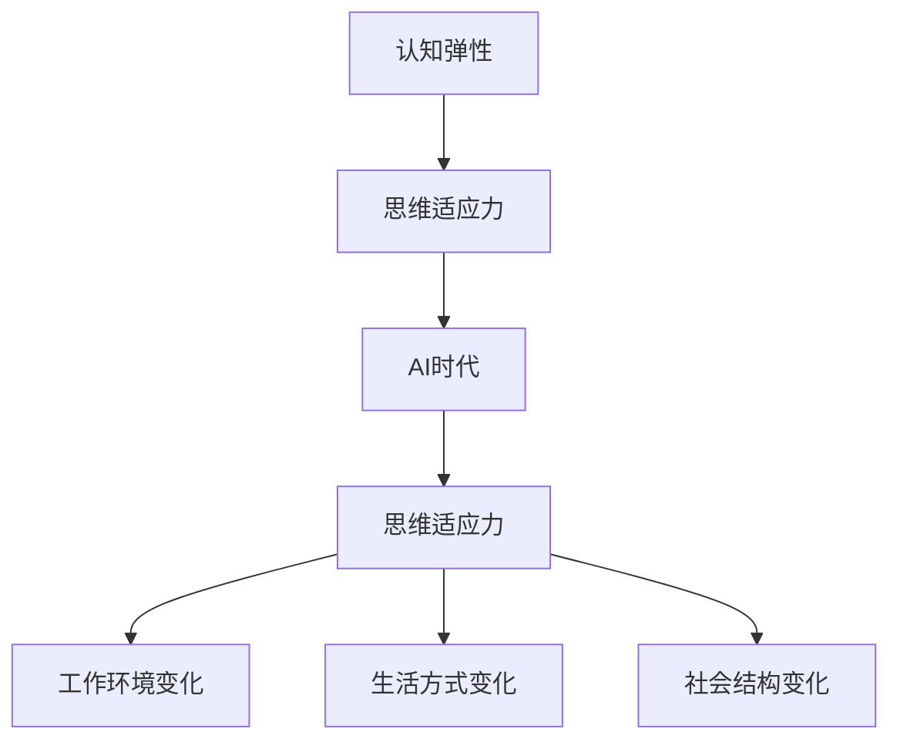
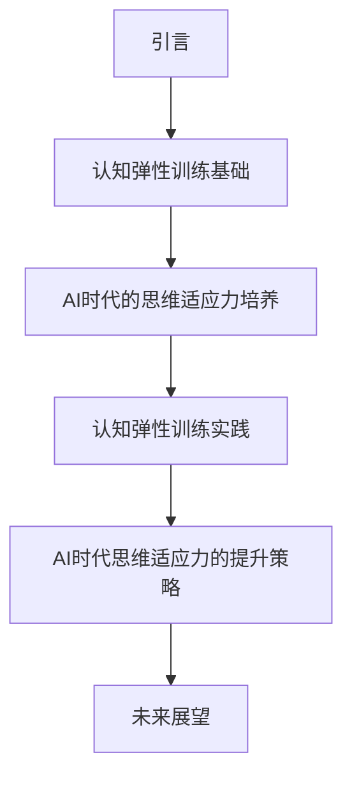
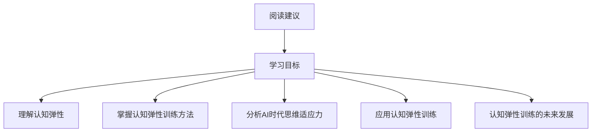
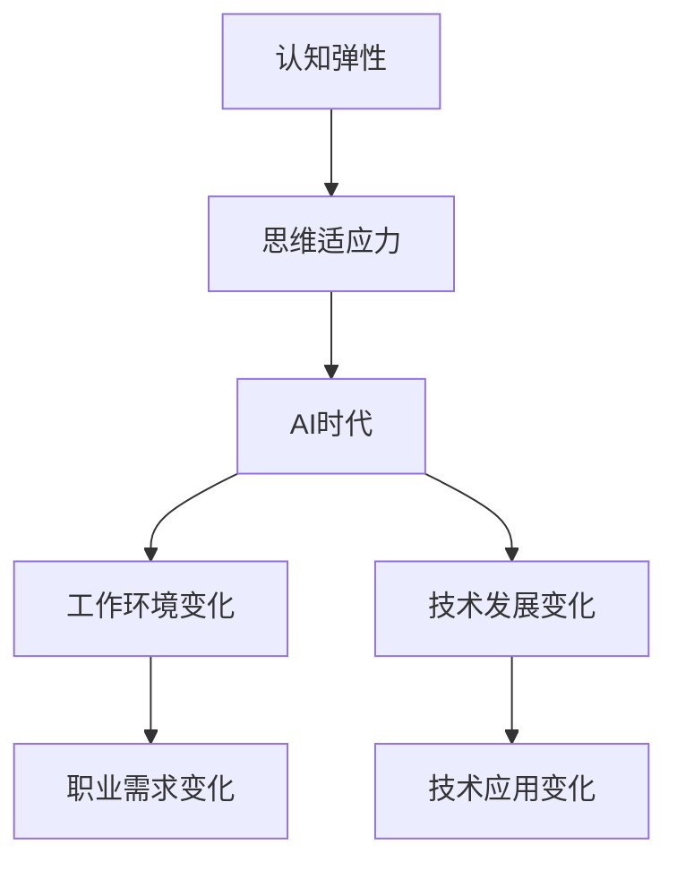
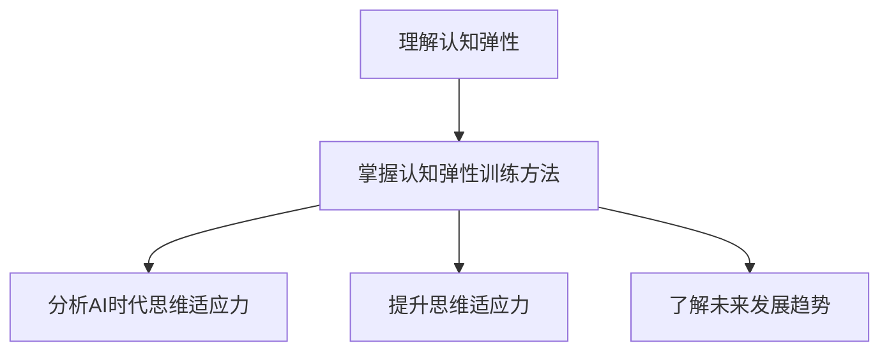
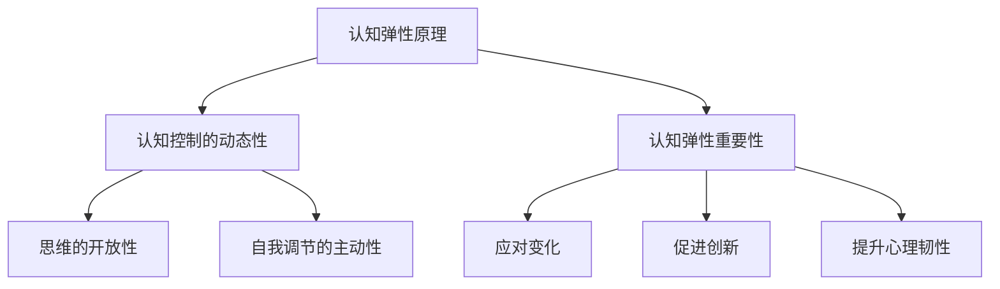
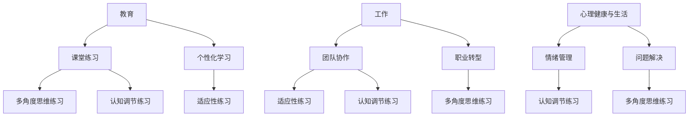
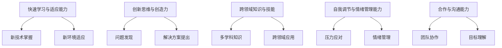
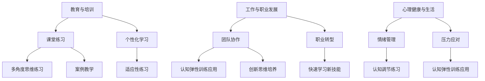
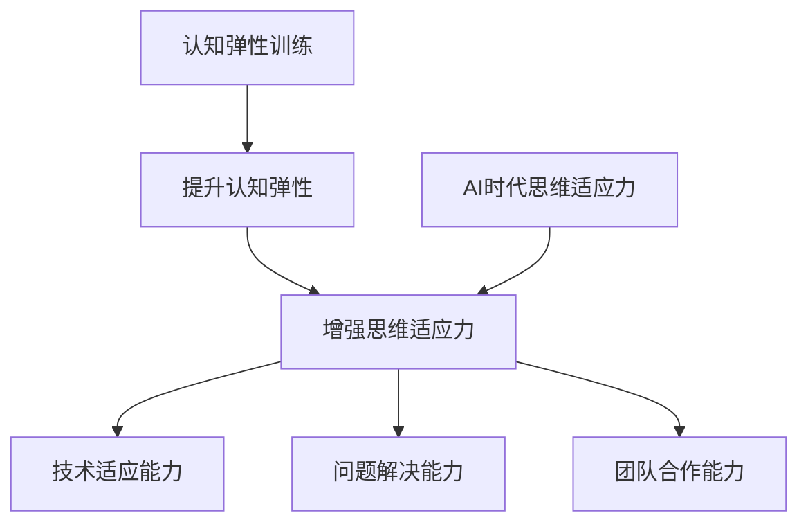

                 

### 文章标题

《认知弹性训练：AI时代的思维适应力培养》

### 关键词

- 认知弹性
- AI时代
- 思维适应力
- 训练方法
- 实战案例
- 教育与实践

### 摘要

随着人工智能技术的飞速发展，AI时代对个体的思维能力提出了新的挑战。本文旨在探讨认知弹性在AI时代的重要性，以及如何通过认知弹性训练培养个体的思维适应力。文章将首先介绍认知弹性的概念和原理，然后详细阐述认知弹性训练的方法和应用，接着分析AI时代思维适应力的特点与要求，并探讨提升思维适应力的策略和方法。通过实际案例的研究，文章展示了如何在实际工作中培养认知弹性，最后对认知弹性训练与AI时代的未来发展进行了展望。希望本文能为读者提供有价值的思维训练指南，帮助个体在AI时代更好地适应和发展。

# 《认知弹性训练：AI时代的思维适应力培养》目录大纲

## 第一部分：引言

### 1.1 认知弹性与AI时代的思维适应力

- **核心概念与联系**：认知弹性、思维适应力、AI时代
- **Mermaid流程图**：认知弹性、思维适应力、AI时代之间的关系

### 1.2 本书结构与内容概述

- **核心概念与联系**：章节结构、内容分布、学习路径
- **Mermaid流程图**：本书的章节结构和内容分布

### 1.3 阅读指南与学习目标

- **核心概念与联系**：阅读建议、学习目标
- **Mermaid流程图**：如何高效阅读本书、学习目标

## 第二部分：认知弹性训练基础

### 2.1 认知弹性的原理与重要性

- **核心概念与联系**：认知弹性的定义、关键要素
- **Mermaid流程图**：认知弹性的原理与重要性

### 2.2 认知弹性训练的基本概念

- **核心概念与联系**：认知弹性训练的定义、目标、方法
- **伪代码阐述**：认知弹性训练的主要方法和步骤

### 2.3 认知弹性训练的核心方法

- **核心算法原理讲解**：认知弹性训练的主要方法和步骤
- **伪代码阐述**：认知弹性训练的具体实现

### 2.4 认知弹性训练的应用场景

- **核心概念与联系**：认知弹性训练在不同领域的应用
- **Mermaid流程图**：认知弹性训练的应用场景

## 第三部分：AI时代的思维适应力培养

### 3.1 AI时代思维适应力的特点与要求

- **核心概念与联系**：AI时代思维适应力的核心特点
- **Mermaid流程图**：AI时代思维适应力的特点与要求

### 3.2 培养AI时代思维适应力的方法

- **核心概念与联系**：如何培养AI时代的思维适应力
- **方法总结**：培养AI时代思维适应力的具体方法

### 3.3 AI时代思维适应力的实战案例

- **项目实战**：如何在实际工作中培养思维适应力
- **案例分析**：案例分析及实践效果评估

## 第四部分：认知弹性训练实践

### 4.1 认知弹性训练的实践步骤

- **核心算法原理讲解**：认知弹性训练的具体实施步骤
- **伪代码阐述**：认知弹性训练的具体实现

### 4.2 认知弹性训练的实际应用

- **核心概念与联系**：认知弹性训练在不同领域的应用案例
- **Mermaid流程图**：认知弹性训练的实际应用场景

### 4.3 认知弹性训练的评估与反馈

- **核心概念与联系**：如何评估认知弹性训练的效果
- **反馈机制**：如何根据评估结果调整训练策略

## 第五部分：AI时代思维适应力的提升策略

### 5.1 提升思维适应力的策略与方法

- **核心概念与联系**：如何有效提升思维适应力
- **方法总结**：提升思维适应力的具体策略和方法

### 5.2 AI时代思维适应力的自我评估

- **核心概念与联系**：如何进行思维适应力的自我评估
- **工具介绍**：思维适应力自我评估工具

### 5.3 提升思维适应力的案例研究

- **项目实战**：成功案例研究及实施策略
- **案例分析**：案例分析及实践效果评估

## 第六部分：未来展望

### 6.1 认知弹性训练与AI时代的未来发展

- **核心概念与联系**：认知弹性训练在AI时代的发展趋势
- **观点分析**：认知弹性训练在AI时代的未来前景

### 6.2 AI时代思维适应力的未来挑战与机遇

- **核心概念与联系**：AI时代思维适应力面临的挑战和机遇
- **观点分析**：AI时代思维适应力的未来挑战与机遇

### 6.3 AI时代思维适应力的教育与实践

- **核心概念与联系**：如何通过教育和实践提升思维适应力
- **方法总结**：提升AI时代思维适应力的教育与实践策略

## 第七部分：附录

### 7.1 认知弹性训练与AI时代的相关资源

- **核心概念与联系**：认知弹性训练与AI时代相关的书籍、论文、网站等资源
- **资源汇总**：认知弹性训练与AI时代的相关资源汇总

### 7.2 常见问题解答

- **核心概念与联系**：解答读者可能遇到的疑惑
- **解答内容**：针对常见问题的详细解答

### 7.3 进一步学习与拓展

- **核心概念与联系**：推荐进一步学习的方向和资源
- **拓展内容**：进一步学习的建议和资源推荐

---

### 第一部分：引言

#### 1.1 认知弹性与AI时代的思维适应力

在当今社会，人工智能（AI）正以前所未有的速度渗透到各个领域，从医疗到金融，从制造业到教育，它正在深刻地改变我们的生活方式和工作模式。然而，随着AI技术的普及和应用，人们对于自身的思维能力也提出了新的要求。在这个AI时代，如何培养和提升我们的思维适应力成为了一个重要课题。

**核心概念与联系**：

认知弹性（Cognitive Flexibility）是指个体在面对复杂和多变的情境时，能够灵活调整自己的思维方式和行为策略，从而有效地解决问题和适应新环境的能力。认知弹性不仅涉及思维的灵活性和适应性，还包括了认知控制的成分，即个体能够意识到自己的思维偏差，并通过调整来提高决策质量和创新能力。

而思维适应力（Mental Adaptability）则是指个体在面对变化和挑战时，能够迅速适应并有效应对的能力。在AI时代，这种适应力尤为重要，因为AI技术的快速发展和广泛应用使得工作环境、社会结构和个人生活方式都在不断变化。

**Mermaid流程图**：



在这个流程图中，认知弹性是思维适应力的重要组成部分，而AI时代则为思维适应力提出了新的要求和挑战。

#### 1.2 本书结构与内容概述

本书旨在通过系统性的认知弹性训练，帮助读者在AI时代提升思维适应力。全书分为六个部分，分别从认知弹性的基本概念、训练方法、AI时代思维适应力的特点与要求、实战案例、提升策略和未来展望等方面进行详细探讨。

**核心概念与联系**：

第一部分：引言，介绍了认知弹性与AI时代思维适应力的关系，并概述了本书的结构和内容。

第二部分：认知弹性训练基础，详细阐述了认知弹性的原理与重要性，以及认知弹性训练的基本概念和方法。

第三部分：AI时代的思维适应力培养，分析了AI时代思维适应力的特点与要求，并提出了培养方法。

第四部分：认知弹性训练实践，通过实际应用和评估反馈，展示了如何将认知弹性训练应用到各个领域。

第五部分：AI时代思维适应力的提升策略，总结了提升思维适应力的策略与方法，并通过案例研究进行验证。

第六部分：未来展望，对认知弹性训练与AI时代的未来发展进行了展望，并探讨了思维适应力在AI时代的挑战与机遇。

**Mermaid流程图**：



这个流程图清晰地展示了本书的结构和内容分布，为读者提供了一个系统的学习路径。

#### 1.3 阅读指南与学习目标

为了帮助读者更好地阅读本书，我们提供以下阅读指南和学习目标。

**核心概念与联系**：

- **阅读建议**：建议读者按照章节顺序逐步阅读，并结合实际案例和练习进行深入学习。

- **学习目标**：通过阅读本书，读者应该能够：

  1. 理解认知弹性的基本概念和原理；
  2. 掌握认知弹性训练的方法和应用；
  3. 分析AI时代思维适应力的特点与要求；
  4. 应用认知弹性训练提升思维适应力；
  5. 认识到认知弹性训练与AI时代的未来发展前景。

**Mermaid流程图**：



这个流程图提供了详细的阅读指南和学习目标，帮助读者有针对性地进行学习和实践。

### 总结

通过本部分的介绍，我们明确了认知弹性与AI时代思维适应力之间的关系，并概述了本书的结构和内容。接下来，我们将深入探讨认知弹性的原理和重要性，以及如何在AI时代培养思维适应力。敬请期待。

---

### 1.1 认知弹性与AI时代的思维适应力

**定义与核心要素**

认知弹性（Cognitive Flexibility）是指个体在面对不同情境时，能够灵活调整和改变思维方式和策略的能力。具体来说，它涉及以下几个方面：

1. **思维的转换**：个体能够在不同认知模式之间灵活转换，如从具体思维转向抽象思维，或从单一角度转向多角度分析。
2. **认知的适应性**：个体在面对新信息或变化时，能够快速适应，调整认知策略以应对新的情境。
3. **认知控制的灵活性**：个体能够意识到自己的思维偏差，并通过调整来提高决策质量和创新能力。

在AI时代，认知弹性的重要性日益凸显。因为AI技术的快速发展带来了工作环境的不断变化，个体需要具备更高的认知弹性，以适应不断变化的职业需求和技术挑战。

**Mermaid流程图**

下面是一个简化的Mermaid流程图，展示了认知弹性与思维适应力、AI时代的核心联系：



在这个流程图中，认知弹性是培养思维适应力的关键因素，而AI时代则为工作环境和技术应用带来了巨大的变化，这些变化进一步凸显了认知弹性的重要性。

**认知弹性与思维适应力的关系**

认知弹性和思维适应力之间存在着密切的联系。思维适应力是认知弹性的外在表现，而认知弹性则是思维适应力的内在基础。具体来说：

1. **提高思维适应力**：认知弹性有助于个体在面对复杂和多变的情境时，能够更加灵活和有效地调整自己的思维方式和策略，从而提高思维适应力。
2. **促进创新思维**：认知弹性能够帮助个体克服思维定式，发现新的问题和解决方案，从而促进创新思维的发展。
3. **增强心理韧性**：认知弹性使得个体在面对挫折和压力时，能够保持积极的心态，灵活应对，从而增强心理韧性。

**认知弹性与AI时代的联系**

AI时代的特点是信息量大、变化快、技术复杂，这些特点对个体的认知能力提出了更高的要求。认知弹性在这种情况下显得尤为重要，因为它可以帮助个体：

1. **快速学习新技术**：在AI时代，新技术层出不穷，个体需要具备快速学习的能力。认知弹性有助于个体在面对新技术时，能够迅速理解和掌握。
2. **应对复杂问题**：AI时代面临的问题通常更为复杂，需要多角度、多层次地进行分析和解决。认知弹性使得个体能够灵活运用不同的思维方式和策略，从而更好地应对复杂问题。
3. **适应工作变化**：随着AI技术的发展，许多传统的工作岗位将发生变化，甚至消失。个体需要具备认知弹性，以适应新的工作环境和职业需求。

**结论**

认知弹性是AI时代思维适应力的关键因素。通过培养和提高认知弹性，个体可以更好地适应AI时代的变化，提高自身的思维适应力和创新能力。在接下来的章节中，我们将进一步探讨认知弹性的训练方法和应用场景，帮助读者深入了解如何在AI时代提升认知弹性，培养强大的思维适应力。

### 1.2 本书结构与内容概述

本书旨在深入探讨认知弹性训练在AI时代的应用，帮助读者提升思维适应力，以更好地应对快速变化的工作环境和技术挑战。全书共分为六个部分，每个部分都有其独特的主题和内容结构，为读者提供系统、全面的认知弹性训练指南。

**第一部分：引言**

本部分首先介绍了认知弹性与AI时代的思维适应力之间的关系，明确了认知弹性的重要性。随后，概述了本书的结构和内容，帮助读者对整体框架有一个清晰的认识。通过引言部分的阅读，读者可以初步了解认知弹性训练的背景和目标。

**第二部分：认知弹性训练基础**

本部分详细阐述了认知弹性的基本原理和核心要素，包括思维的转换、认知的适应性和认知控制的灵活性。此外，还介绍了认知弹性训练的基本概念和方法，帮助读者建立对认知弹性训练的全面理解。通过这一部分的深入学习，读者可以掌握认知弹性训练的基础知识，为后续实践打下坚实的基础。

**第三部分：AI时代的思维适应力培养**

本部分重点分析了AI时代思维适应力的特点与要求，包括快速学习新技术、应对复杂问题和适应工作变化等。在此基础上，提出了培养AI时代思维适应力的方法和策略，为读者提供具体的实践指导。通过本部分的阅读，读者可以了解到如何在AI时代培养和提升思维适应力。

**第四部分：认知弹性训练实践**

本部分通过实际案例和项目实战，展示了如何将认知弹性训练应用到各个领域。包括教育、医疗、金融和制造业等，通过具体案例的分析，读者可以了解认知弹性训练在不同场景中的实际应用效果。通过实践部分的阅读，读者可以直观地感受到认知弹性训练的实际效果，并学会如何在实际工作中应用这些方法。

**第五部分：AI时代思维适应力的提升策略**

本部分总结了提升思维适应力的策略和方法，包括自我评估、持续学习和实战训练等。通过这些策略和方法，读者可以系统地提升自己的思维适应力。同时，本部分还通过案例研究，验证了这些策略和方法的有效性。通过本部分的阅读，读者可以掌握提升思维适应力的具体策略和技巧。

**第六部分：未来展望**

本部分对认知弹性训练与AI时代的未来发展进行了展望，分析了认知弹性训练在未来的发展趋势和机遇。此外，还探讨了思维适应力在AI时代的挑战与机遇，为读者提供了未来发展的方向和建议。通过未来展望部分的阅读，读者可以了解到认知弹性训练在AI时代的广阔前景，并做好准备应对未来的挑战。

**核心概念与联系**

本书的核心概念包括认知弹性、思维适应力、AI时代、认知弹性训练基础、实战案例和提升策略。通过这些核心概念的联系，本书为读者提供了一条系统的认知弹性训练路径，帮助读者在AI时代提升思维适应力，应对快速变化的工作环境和技术挑战。

**Mermaid流程图**

以下是本书各部分内容的Mermaid流程图：


通过这个流程图，读者可以清晰地看到本书的结构和内容分布，有助于更好地理解和应用书中的知识。

### 1.3 阅读指南与学习目标

为了帮助读者更高效地阅读本书，并达到预期的学习目标，我们提供以下阅读指南和学习目标。

**阅读建议**

1. **系统阅读**：建议读者按照本书的结构顺序进行系统阅读，逐步深入理解每个部分的内容。
2. **结合实践**：在阅读过程中，建议读者结合自身实际情况进行思考和练习，将理论知识应用到实际工作中。
3. **反复阅读**：对于关键概念和方法，建议读者反复阅读，确保理解透彻。

**学习目标**

通过阅读本书，读者应该能够：

1. **理解认知弹性的基本原理和重要性**：掌握认知弹性的定义、核心要素和重要性，了解其在AI时代的作用。
2. **掌握认知弹性训练的方法和应用**：了解认知弹性训练的基本概念、方法和步骤，并能够在实际场景中应用这些方法。
3. **分析AI时代思维适应力的特点与要求**：理解AI时代思维适应力的核心特点和要求，并能够分析如何在不同的领域培养这种适应力。
4. **提升思维适应力**：通过本书提供的方法和策略，提升自身的思维适应力，更好地适应AI时代的工作环境和变化。
5. **认识到认知弹性训练与AI时代的未来发展**：了解认知弹性训练在AI时代的未来发展前景，为未来的学习和职业发展做好准备。

**Mermaid流程图**

以下是学习目标的Mermaid流程图：



通过这个流程图，读者可以清晰地看到本书的学习目标，有助于更有针对性地进行阅读和学习。

### 总结

通过本部分的介绍，我们明确了认知弹性在AI时代的重要性，并概述了本书的结构和内容。接下来，我们将深入探讨认知弹性的基本原理和训练方法，帮助读者建立对认知弹性的全面理解。敬请期待。

## 第二部分：认知弹性训练基础

### 2.1 认知弹性的原理与重要性

**定义与核心概念**

认知弹性（Cognitive Flexibility）是指个体在面对复杂和多变的情境时，能够灵活调整和改变思维方式和策略的能力。认知弹性的核心概念包括：

1. **思维的转换**：个体能够在不同的认知模式之间灵活转换，如从具体思维转向抽象思维，或从单一角度转向多角度分析。
2. **认知的适应性**：个体在面对新信息或变化时，能够快速适应，调整认知策略以应对新的情境。
3. **认知控制的灵活性**：个体能够意识到自己的思维偏差，并通过调整来提高决策质量和创新能力。

**原理分析**

认知弹性的原理主要体现在以下几个方面：

1. **认知控制的动态性**：个体需要具备较强的认知控制能力，能够根据不同的情境灵活调整思维策略。例如，在解决问题时，个体需要从多个角度思考，进行信息筛选和整合，从而找到最佳的解决方案。

2. **思维的开放性**：个体需要保持开放的心态，愿意接受新观点和新信息。在AI时代，技术发展日新月异，个体需要不断更新自己的知识和技能，以适应新的技术环境和需求。

3. **自我调节的主动性**：个体需要具备自我调节的能力，能够主动识别和纠正自己的思维偏差。自我调节包括反思自己的思考过程，识别错误的思维模式，并采取相应的措施进行修正。

**重要性分析**

在AI时代，认知弹性的重要性日益凸显。具体体现在以下几个方面：

1. **应对变化**：AI时代工作环境和技术应用不断变化，个体需要具备较高的认知弹性，以应对这些变化。通过认知弹性训练，个体可以更好地适应新的工作环境和技术挑战。

2. **促进创新**：认知弹性有助于个体克服思维定式，发现新的问题和解决方案。在AI时代，创新思维尤为重要，认知弹性能够促进个体的创新能力和创造力。

3. **提升心理韧性**：认知弹性使得个体在面对挫折和压力时，能够保持积极的心态，灵活应对。心理韧性是AI时代个体必备的能力，通过认知弹性训练，个体可以增强自身的心理韧性。

**Mermaid流程图**

以下是认知弹性的原理与重要性分析的Mermaid流程图：



通过这个流程图，读者可以清晰地了解认知弹性的原理和重要性，为后续的学习和实践打下基础。

### 2.2 认知弹性训练的基本概念

**定义与目标**

认知弹性训练（Cognitive Flexibility Training）是指通过一系列的方法和练习，提升个体的认知弹性，使其在面对复杂和多变的情境时能够更加灵活和有效地调整思维方式和策略。认知弹性训练的目标包括：

1. **提高思维的灵活性**：通过训练，个体能够在不同认知模式之间自如转换，提高思维的灵活性。
2. **增强认知适应性**：个体能够在面对新信息或变化时，快速适应并调整认知策略。
3. **提升认知控制能力**：个体能够更好地控制自己的思维过程，减少思维偏差，提高决策质量和创新能力。

**方法**

认知弹性训练的方法主要包括以下几种：

1. **多角度思维练习**：通过多角度思考问题，个体可以培养思维的灵活性。例如，可以通过“头脑风暴”活动，鼓励个体从不同角度提出解决问题的方案。

2. **适应性练习**：通过设置不同难度和类型的练习，个体可以增强对变化的适应性。例如，可以通过模拟不同情境的练习，让个体在不同的环境中快速适应并解决问题。

3. **认知调节练习**：通过自我反思和认知调节练习，个体可以提升认知控制能力。例如，可以通过“思维导图”练习，帮助个体梳理思路，识别和纠正思维偏差。

**步骤**

认知弹性训练通常包括以下几个步骤：

1. **评估当前认知弹性**：通过自我评估和专家评估，了解个体的认知弹性现状，确定训练的重点和方向。

2. **设计训练计划**：根据个体的认知弹性现状，设计有针对性的训练计划，包括训练内容、训练方式和训练频率。

3. **执行训练计划**：按照训练计划，进行一系列的认知弹性训练，包括多角度思维练习、适应性练习和认知调节练习。

4. **监控和评估**：在训练过程中，定期进行监控和评估，了解训练效果，调整训练计划。

5. **持续训练**：认知弹性训练是一个长期的过程，需要个体持续进行。通过持续训练，个体可以不断提高认知弹性，适应不断变化的工作环境和技术挑战。

**伪代码阐述**

以下是一个简化的认知弹性训练伪代码，展示了训练的基本步骤和过程：

```plaintext
function CognitiveFlexibilityTraining()
    AssessCurrentCognitiveFlexibility()
    DesignTrainingPlan()
    ExecuteTrainingPlan()
        PerformMultiAngularThinkingExercises()
        PerformAdaptiveExercises()
        PerformCognitiveRegulationExercises()
    MonitorAndEvaluateProgress()
    AdjustTrainingPlanIfNecessary()
    ContinueTraining()
end function
```

通过这个伪代码，读者可以直观地了解认知弹性训练的基本流程和步骤，为实际操作提供指导。

### 2.3 认知弹性训练的核心方法

**核心方法**

认知弹性训练的核心方法包括多角度思维练习、适应性练习和认知调节练习。这些方法旨在提高个体的认知弹性，使其能够更好地应对复杂和多变的情境。

1. **多角度思维练习**：通过多角度思考问题，个体可以培养思维的灵活性。例如，可以通过以下练习来提升多角度思维能力：
   - 头脑风暴：在给定主题下，鼓励个体从不同角度提出解决方案。
   - 角色扮演：模拟不同的角色，从不同视角分析问题。

2. **适应性练习**：通过设置不同难度和类型的练习，个体可以增强对变化的适应性。例如，可以通过以下练习来提升适应性：
   - 情境模拟：设置模拟情境，要求个体在短时间内适应并解决问题。
   - 多任务处理：同时处理多个任务，提高个体在多变环境中的适应能力。

3. **认知调节练习**：通过自我反思和认知调节练习，个体可以提升认知控制能力。例如，可以通过以下练习来提升认知调节能力：
   - 思维导图：梳理思路，识别和纠正思维偏差。
   - 反思日记：记录思考过程，反思错误和不足。

**核心算法原理讲解**

认知弹性训练的核心算法原理可以概括为以下几个方面：

1. **适应性学习**：通过不断调整和优化训练计划，使个体在面对不同情境时能够更加适应。例如，可以使用机器学习中的自适应算法，根据个体的反馈和表现，动态调整训练难度和内容。

2. **多模态反馈**：通过多种方式获取和反馈个体的训练效果，包括自我评估、专家评估和情境模拟。多模态反馈有助于全面了解个体的认知弹性水平，并进行针对性的训练调整。

3. **认知调节策略**：通过自我反思和认知调节练习，个体可以学会如何识别和纠正自己的思维偏差。例如，可以使用决策树模型，帮助个体识别常见的思维偏差，并提供相应的调节策略。

**伪代码阐述**

以下是一个简化的认知弹性训练伪代码，展示了核心方法的实现：

```plaintext
function CoreCognitiveFlexibilityMethods()
    InitializeTrainingPlan()
    while TrainingNotComplete()
        PerformMultiAngularThinkingExercises()
        PerformAdaptiveExercises()
        PerformCognitiveRegulationExercises()
        CollectFeedback()
        AdjustTrainingPlan()
    end while
    EvaluateFinalCognitiveFlexibility()
end function
```

通过这个伪代码，读者可以了解认知弹性训练的核心方法及其实现过程。

### 2.4 认知弹性训练的应用场景

**教育与培训**

在教育领域，认知弹性训练可以帮助学生提升学习能力和适应新知识的能力。具体应用场景包括：

1. **课堂练习**：教师可以在课堂上引入认知弹性训练的方法，通过多角度思维练习和适应性练习，帮助学生更好地理解和掌握知识。
2. **个性化学习**：根据学生的认知弹性水平，设计个性化的学习计划和练习，提高学生的学习效果和兴趣。

**工作与职业发展**

在职业领域，认知弹性训练可以帮助员工提升工作效率和适应新工作环境的能力。具体应用场景包括：

1. **团队协作**：通过认知弹性训练，团队成员可以更好地理解和适应彼此的工作方式和需求，提高团队协作效率。
2. **职业转型**：在职业转型过程中，认知弹性训练可以帮助个体快速适应新的工作内容和要求，提高职业竞争力。

**心理健康与生活**

在心理健康和生活领域，认知弹性训练可以帮助个体提升心理韧性，更好地应对生活中的挑战。具体应用场景包括：

1. **情绪管理**：通过认知调节练习，个体可以学会如何管理自己的情绪，减少焦虑和压力。
2. **问题解决**：在面对问题时，认知弹性训练可以帮助个体更好地分析问题，找到有效的解决方案。

**Mermaid流程图**

以下是认知弹性训练在不同领域应用场景的Mermaid流程图：



通过这个流程图，读者可以清晰地了解认知弹性训练在不同领域的应用场景，为实际操作提供指导。

## 第三部分：AI时代的思维适应力培养

### 3.1 AI时代思维适应力的特点与要求

在AI时代，个体的思维适应力面临着前所未有的挑战和机遇。为了更好地适应这一时代，个体需要具备以下几大特点和要求：

**1. 快速学习与适应能力**

随着AI技术的不断发展和应用，新技术、新工具和新知识层出不穷。个体需要具备快速学习的能力，能够迅速掌握新知识，并将其应用到实际工作中。同时，个体还需要具备适应新环境的能力，能够在短时间内适应新的工作流程和工作方式。

**2. 创新思维与创造力**

AI技术的广泛应用使得许多传统工作发生了变化，甚至消失了。个体需要具备创新思维和创造力，能够从新的角度和视角发现问题，提出创新的解决方案。这种创新能力不仅有助于个体在职业发展中脱颖而出，还能推动整个社会的进步。

**3. 跨领域知识与技能**

AI时代的工作场景越来越复杂，个体需要具备跨领域知识和技能，能够处理跨学科、跨领域的综合问题。例如，一个成功的AI工程师不仅需要具备计算机科学的知识，还需要了解统计学、物理学、生物学等多个领域的知识。

**4. 自我调节与情绪管理能力**

在面对快速变化的工作环境和压力时，个体需要具备自我调节和情绪管理能力。这种能力可以帮助个体保持冷静和理智，有效应对压力和挑战，从而提高工作效率和成果。

**5. 合作与沟通能力**

在AI时代，团队合作变得尤为重要。个体需要具备良好的合作精神和沟通能力，能够与团队成员有效地协作，共同完成项目任务。通过有效的沟通，个体可以更好地理解团队的目标和需求，提高协作效率。

**Mermaid流程图**

以下是AI时代思维适应力特点与要求的Mermaid流程图：



通过这个流程图，读者可以清晰地了解AI时代思维适应力的特点与要求，为后续的学习和实践提供指导。

### 3.2 培养AI时代思维适应力的方法

为了在AI时代提升个体的思维适应力，需要采取一系列科学、系统的培养方法。以下是一些有效的培养方法：

**1. 终身学习**

在AI时代，知识更新速度极快，个体需要具备终身学习的意识和能力。通过不断学习新知识、新技能，个体可以保持与时代的同步，提升自身的竞争力。具体方法包括：

- **参加培训课程**：参加相关的在线课程、研讨会和工作坊，学习最新的技术知识和应用案例。
- **阅读专业书籍**：定期阅读专业书籍和学术论文，了解领域内的最新研究成果和趋势。
- **实践操作**：通过实际操作和项目实践，将所学知识应用到实际工作中，提高自己的应用能力。

**2. 跨领域学习**

跨领域学习是提升思维适应力的关键。通过学习不同领域的知识和技能，个体可以拓展自己的视野，提高解决复杂问题的能力。以下是一些跨领域学习的方法：

- **跨学科课程**：选修跨学科的课程，如经济学、心理学、统计学等，了解不同领域的思维方式和方法论。
- **项目合作**：参与跨领域项目，与不同领域的专家和团队合作，共同解决问题。
- **参加行业交流活动**：参加各类行业交流活动，与不同领域的专业人士交流，了解其他领域的最新动态和成果。

**3. 创新思维训练**

创新思维是AI时代思维适应力的核心。以下是一些训练创新思维的方法：

- **头脑风暴**：通过头脑风暴，鼓励个体从不同角度提出解决问题的方案，培养思维的灵活性。
- **思维导图**：使用思维导图梳理思路，将复杂问题分解为多个子问题，提高问题解决能力。
- **案例研究**：分析成功的创新案例，学习他人的经验和思路，激发自己的创新思维。

**4. 情绪管理**

情绪管理是提升思维适应力的关键因素。以下是一些情绪管理的技巧：

- **自我反思**：定期进行自我反思，了解自己的情绪状态，识别情绪触发因素。
- **呼吸练习**：通过深呼吸、冥想等练习，缓解压力，保持冷静。
- **寻求支持**：在遇到困难时，向朋友、家人或专业人士寻求支持和建议，减轻情绪压力。

**5. 沟通能力培养**

沟通能力在团队合作和职业发展中至关重要。以下是一些提升沟通能力的技巧：

- **倾听**：积极倾听他人的观点和意见，理解对方的立场和需求。
- **表达**：清晰、准确地表达自己的观点和想法，避免误解和冲突。
- **反馈**：给予他人建设性的反馈，帮助他们改进和提升。

**总结**

通过上述方法，个体可以逐步提升自己的思维适应力，更好地适应AI时代的工作和生活。终身学习、跨领域学习、创新思维训练、情绪管理和沟通能力培养是提升思维适应力的关键。在接下来的章节中，我们将通过实战案例和具体实践，进一步探讨如何培养和提升AI时代的思维适应力。

### 3.3 AI时代思维适应力的实战案例

为了更深入地理解AI时代思维适应力的培养方法，我们将通过几个实际案例，展示如何在具体情境中应用这些方法，以及这些方法如何帮助个体提升思维适应力。

**案例一：技术变革中的自我调整**

**背景**：小王是一名软件工程师，他的公司正在从传统的软件开发模式转向基于AI的自动化编程。这种变革要求小王不仅需要掌握新的编程工具和语言，还需要熟悉AI算法和机器学习技术。

**培养方法**：

1. **终身学习**：小王通过在线课程和书籍，系统地学习了Python编程和机器学习基础。他每天花费2小时进行自学，并参加公司组织的培训课程。

2. **跨领域学习**：小王选修了大学课程，如统计学和数据分析，以增强自己的跨领域知识。他还主动与数据科学家和AI专家交流，了解他们的工作内容和思路。

3. **创新思维训练**：小王使用思维导图工具，将新的编程知识和算法概念可视化，帮助自己更好地理解和记忆。他还通过参与“黑客松”活动，与其他工程师合作，提出创新的解决方案。

**结果**：通过持续的学习和实践，小王不仅成功掌握了AI编程工具和技能，还成为公司AI项目的重要成员，为公司带来了显著的效率提升。

**案例二：职业转型中的快速适应**

**背景**：李小姐是一名传统制造业的生产经理，随着工业4.0和智能制造的推广，她意识到需要转型为一名数字化运营经理，以适应新的工作要求。

**培养方法**：

1. **参加培训课程**：李小姐参加了多个关于数字化运营和工业物联网的在线课程，系统学习了相关技术和工具。

2. **项目实践**：她参与了一个数字化工厂的试点项目，从实际操作中学习如何应用新的技术和工具，提高生产效率。

3. **团队合作**：李小姐与IT团队和其他部门紧密合作，通过交流和学习，提升了跨部门协作和沟通能力。

**结果**：李小姐成功完成了职业转型，成为了一名优秀的数字化运营经理，她的工作极大地提升了工厂的运营效率和产品质量。

**案例三：心理健康与情绪管理**

**背景**：张先生是一名项目经理，他经常面临项目压力和团队合作中的冲突。为了保持良好的心理健康，他决定培养情绪管理能力。

**培养方法**：

1. **自我反思**：张先生每天花15分钟进行自我反思，记录自己的情绪变化和应对策略。

2. **情绪调节练习**：他通过练习深呼吸、冥想和瑜伽，学会了如何放松身心，减轻压力。

3. **求助支持**：在遇到困难时，张先生会向家人和朋友寻求支持，并参加心理辅导课程。

**结果**：通过情绪管理练习，张先生能够更好地应对项目压力和冲突，保持了良好的心理健康，工作效率和团队协作水平也得到了显著提升。

**案例分析及实践效果评估**

通过以上案例，我们可以看到，培养AI时代思维适应力不仅仅是学习新技能和知识，还需要在具体情境中实践和应用这些方法。以下是对案例的分析和效果评估：

1. **终身学习**：终身学习是提升思维适应力的基础。通过不断学习新知识和技能，个体能够保持与时代的同步，提升自身的竞争力。

2. **跨领域学习**：跨领域学习有助于个体拓展视野，提高解决复杂问题的能力。通过跨领域的知识积累，个体可以更好地应对多变的工作环境。

3. **创新思维训练**：创新思维是AI时代的核心能力。通过创新思维训练，个体可以学会如何从不同角度思考问题，提出创新的解决方案。

4. **情绪管理**：情绪管理是心理健康的重要保障。通过情绪管理训练，个体能够更好地应对压力和挑战，保持良好的心理健康。

5. **团队合作和沟通能力**：在AI时代，团队合作和沟通能力尤为重要。通过培养团队合作精神和沟通技巧，个体可以更好地融入团队，提高工作效率。

通过这些实战案例，我们可以看到，培养AI时代思维适应力是一个系统、长期的过程。只有通过持续的学习和实践，个体才能不断提升自己的思维适应力，更好地应对AI时代的挑战和机遇。

### 4.1 认知弹性训练的实践步骤

**评估当前认知弹性**

在进行认知弹性训练之前，首先需要对个体的当前认知弹性进行评估。这一步骤至关重要，因为它能够帮助个体了解自身的认知弹性水平，确定训练的重点和方向。以下是具体的评估方法：

1. **自我评估**：个体可以通过填写认知弹性自我评估问卷，了解自己在思维转换、认知适应性和认知控制方面的表现。常见的自我评估工具包括《认知弹性问卷》（Cognitive Flexibility Scale）和《认知适应量表》（Cognitive Adaptation Scale）。

2. **专家评估**：个体可以寻求专业心理师的评估，通过面试、心理测试和案例分析等方式，全面了解自身的认知弹性水平。

3. **情景模拟**：设置模拟情境，观察个体在面对复杂和多变的问题时，能否灵活调整思维方式和策略。这种评估方法可以更直观地了解个体的认知弹性表现。

**设计训练计划**

在完成认知弹性评估后，需要根据评估结果设计个性化的训练计划。训练计划应包括以下内容：

1. **训练目标**：明确个体希望通过认知弹性训练达到的目标，如提高思维的灵活性、增强认知适应性和提升认知控制能力。

2. **训练内容**：根据评估结果，选择适合的认知弹性训练方法，如多角度思维练习、适应性练习和认知调节练习。每个训练内容应明确具体的训练方式和目标。

3. **训练频率**：制定合理的训练频率，确保个体能够在日常学习中持续进行认知弹性训练。一般来说，每周至少进行1-2次训练，每次训练时间为30分钟至1小时。

4. **评估机制**：设计定期评估机制，监控训练效果，并根据评估结果调整训练计划。评估周期可以根据个体的认知弹性水平和个人情况进行调整。

**执行训练计划**

在执行训练计划时，需要严格按照训练内容和频率进行。以下是具体的执行步骤：

1. **多角度思维练习**：通过头脑风暴、角色扮演和案例分析等练习，培养思维的灵活性。例如，可以定期进行头脑风暴活动，针对一个主题提出多种解决方案。

2. **适应性练习**：设置不同难度和类型的练习，提高个体的认知适应性。例如，可以设置模拟情境，要求个体在短时间内适应并解决问题。

3. **认知调节练习**：通过自我反思、思维导图和认知训练软件等练习，提升认知控制能力。例如，可以定期进行反思日记，记录思考过程和思维偏差。

4. **持续监控**：在训练过程中，持续监控个体的训练进展和效果。可以通过定期评估和反馈，了解训练的不足和需要改进的地方。

**伪代码阐述**

以下是认知弹性训练实践步骤的伪代码：

```plaintext
function CognitiveFlexibilityTraining()
    AssessCurrentCognitiveFlexibility()
    DesignTrainingPlan()
        DefineTrainingGoals()
        SelectTrainingContent()
        SetTrainingFrequency()
        DesignEvaluationMechanism()
    ExecuteTrainingPlan()
        PerformMultiAngularThinkingExercises()
        PerformAdaptiveExercises()
        PerformCognitiveRegulationExercises()
    MonitorAndEvaluateProgress()
    AdjustTrainingPlanIfNecessary()
end function
```

通过这个伪代码，读者可以清晰地了解认知弹性训练实践步骤的具体内容和流程。

### 4.2 认知弹性训练的实际应用

**教育与培训**

在教育和培训领域，认知弹性训练的应用尤为重要。通过认知弹性训练，学生和培训者可以提升学习效果和适应能力，从而更好地应对学业和职业挑战。

1. **课堂练习**：教师可以在课堂上引入认知弹性训练的方法，通过多角度思维练习和适应性练习，帮助学生更好地理解和掌握知识。例如，在讲解复杂概念时，教师可以引导学生从不同角度分析问题，提出多种解决方案。

2. **个性化学习**：通过认知弹性训练，教师可以根据学生的认知弹性水平，设计个性化的学习计划和练习，提高学生的学习效果。例如，对于认知弹性较低的学生，可以设置更简单、更具体的练习，帮助他们逐步提升。

3. **案例教学**：通过案例分析，学生可以了解实际情境中的认知弹性应用。教师可以选择一些成功的商业案例或历史事件，分析其中的思维转换、认知适应性和认知控制过程。

**工作与职业发展**

在职业领域，认知弹性训练可以帮助员工提升工作效率和职业竞争力。以下是一些实际应用场景：

1. **团队协作**：通过认知弹性训练，团队成员可以更好地理解和适应彼此的工作方式和需求，提高团队协作效率。例如，在项目团队中，可以定期进行认知弹性训练，培养成员之间的沟通和协作能力。

2. **职业转型**：在面对职业转型时，个体需要快速适应新的工作环境和要求。通过认知弹性训练，个体可以提升快速学习新知识和技能的能力，顺利实现职业转型。

3. **创新思维**：认知弹性训练有助于提升个体的创新思维和创造力。例如，在产品开发过程中，可以通过认知弹性训练，鼓励团队成员从不同角度提出创新解决方案，提高产品的竞争力。

**心理健康与生活**

在心理健康和生活领域，认知弹性训练可以帮助个体提升心理韧性，更好地应对生活中的挑战。以下是一些实际应用场景：

1. **情绪管理**：通过认知弹性训练，个体可以学会如何管理自己的情绪，减少焦虑和压力。例如，可以通过认知调节练习，帮助个体识别和纠正负面思维，提高情绪稳定性。

2. **压力应对**：面对生活中的压力和挑战，个体需要具备良好的认知弹性。通过认知弹性训练，个体可以学会如何快速调整自己的思维方式和行为策略，有效地应对压力。

3. **心理健康促进**：认知弹性训练可以作为心理健康促进的一种手段。例如，在心理咨询和治疗中，咨询师可以引入认知弹性训练的方法，帮助来访者提升心理韧性，改善心理健康。

**Mermaid流程图**

以下是认知弹性训练在实际应用场景中的Mermaid流程图：



通过这个流程图，读者可以清晰地了解认知弹性训练在实际应用场景中的具体方法和效果。

### 4.3 认知弹性训练的评估与反馈

**评估指标**

在进行认知弹性训练后，对训练效果进行评估和反馈是非常重要的。以下是几个关键的评估指标：

1. **认知灵活性**：通过测试个体在不同认知模式之间的转换能力，评估其思维的灵活性。例如，可以通过认知任务切换实验，观察个体在不同任务之间的适应速度和准确性。

2. **认知适应性**：通过模拟复杂和多变的情境，评估个体在面对新信息或变化时的适应能力。例如，可以设置模拟情境测试，观察个体在不同情境中的反应和解决方案。

3. **认知控制能力**：通过测试个体在认知过程中的自我调节能力，评估其认知控制能力。例如，可以通过认知偏差纠正任务，观察个体识别和纠正思维偏差的能力。

**评估方法**

1. **自我评估**：个体可以通过填写认知弹性自我评估问卷，了解自己的认知弹性水平。自我评估可以定期进行，以跟踪训练效果。

2. **专家评估**：专业心理师可以通过面试、心理测试和案例分析等方式，全面评估个体的认知弹性。专家评估可以提供更深入的反馈和建议。

3. **情景模拟**：通过设置模拟情境，观察个体在实际操作中的认知弹性表现。这种评估方法可以更直观地了解个体的认知弹性水平。

**反馈机制**

1. **定期反馈**：在训练过程中，定期进行评估和反馈，及时了解训练效果和存在的问题。反馈可以以周报或月报的形式进行，确保个体能够及时调整训练计划。

2. **个性化反馈**：根据个体的评估结果，提供个性化的反馈和建议。个性化反馈可以帮助个体明确训练的重点和改进方向。

3. **持续反馈**：在训练结束后，进行长期跟踪和反馈，了解训练效果的持久性。持续反馈可以确保个体在日常生活中能够持续应用认知弹性训练的方法。

**调整训练策略**

根据评估结果和反馈，调整训练策略是非常重要的。以下是一些调整建议：

1. **增加训练频率**：如果评估结果显示个体在某个方面的认知弹性水平较低，可以适当增加训练频率，确保个体能够持续提升。

2. **调整训练内容**：根据个体的评估结果和反馈，调整训练内容，确保训练内容与个体的实际需求相匹配。

3. **引入新方法**：如果现有的训练方法效果不佳，可以尝试引入新的训练方法，如多角度思维练习、认知调节练习等，以提升训练效果。

4. **持续学习**：鼓励个体在日常生活中持续学习和应用认知弹性训练的方法，提升自身的认知弹性水平。

### 总结

通过评估与反馈机制，个体可以全面了解自己的认知弹性水平，并根据反馈调整训练策略。这有助于个体在认知弹性训练过程中，不断提升自身的认知弹性，更好地适应AI时代的工作和生活挑战。

---

### 5.1 提升思维适应力的策略与方法

在AI时代，提升思维适应力是一个复杂而系统性的工程，涉及多个方面。以下是一些关键策略和方法，帮助个体在快速变化的环境中保持竞争力：

**1. 多元化知识储备**

在AI时代，知识的更新速度极快，单一领域的知识已经难以满足需求。个体需要具备跨领域的知识储备，以应对复杂的问题和挑战。具体方法包括：

- **跨学科学习**：选修跨学科的课程，如经济学、心理学、统计学等，增强跨领域知识。
- **持续学习**：利用在线资源、书籍和工作坊，不断更新自己的知识体系。
- **实践应用**：将所学知识应用到实际工作中，提高知识的应用能力。

**2. 创新思维训练**

创新思维是AI时代的重要能力。通过以下方法，可以培养和提高创新思维：

- **头脑风暴**：定期组织头脑风暴活动，鼓励团队和个体提出多样化的解决方案。
- **思维导图**：使用思维导图工具，将复杂问题分解为多个子问题，提高问题解决能力。
- **案例研究**：分析成功的创新案例，学习他人的经验和思路，激发自己的创新思维。

**3. 情绪管理**

情绪管理对于提升思维适应力至关重要。以下方法可以帮助个体更好地管理情绪：

- **自我反思**：定期进行自我反思，了解自己的情绪变化和应对策略。
- **冥想与放松**：通过冥想、深呼吸和瑜伽等练习，缓解压力，保持冷静。
- **求助支持**：在遇到情绪困扰时，向家人、朋友或专业人士寻求帮助和支持。

**4. 沟通能力提升**

在团队合作和职业发展中，沟通能力尤为重要。以下方法可以帮助个体提升沟通能力：

- **积极倾听**：倾听他人的观点和意见，理解对方的立场和需求。
- **清晰表达**：清晰、准确地表达自己的观点和想法，避免误解和冲突。
- **反馈与交流**：给予他人建设性的反馈，促进有效沟通。

**5. 自我调节能力培养**

自我调节能力是指个体在面对挑战和压力时，能够自我调整和应对的能力。以下方法可以帮助个体培养自我调节能力：

- **时间管理**：合理安排时间，确保有足够的时间进行自我调节和休息。
- **目标设定**：设定具体、可实现的目标，提高自我调节的明确性和动力。
- **反思与调整**：定期反思自己的行为和决策，根据反馈进行调整。

**6. 建立学习网络**

建立学习网络可以帮助个体获取新的知识和信息，提升思维适应力。以下方法可以帮助个体建立学习网络：

- **参加行业会议**：参加行业会议和交流活动，与同行交流，了解最新的行业动态。
- **加入学习社群**：加入在线学习社群，与志同道合的人一起学习、分享和讨论。
- **导师指导**：寻求经验丰富的导师指导，获取宝贵的职业经验和建议。

**7. 跨文化沟通**

在全球化背景下，跨文化沟通能力变得越来越重要。以下方法可以帮助个体提升跨文化沟通能力：

- **文化学习**：学习不同文化的基本特点和沟通方式，增强跨文化理解。
- **角色扮演**：通过角色扮演练习，模拟不同文化背景下的沟通场景，提高跨文化沟通能力。
- **反馈与改进**：在跨文化沟通中，积极寻求反馈，并根据反馈进行改进。

**总结**

通过多元化知识储备、创新思维训练、情绪管理、沟通能力提升、自我调节能力培养、建立学习网络和跨文化沟通等多方面的策略和方法，个体可以全面提升思维适应力，更好地适应AI时代的工作和生活挑战。在接下来的章节中，我们将通过案例研究和实际应用，进一步探讨这些策略和方法的具体实践效果。

### 5.2 AI时代思维适应力的自我评估

在AI时代，个体需要具备高度的思维适应力，以应对快速变化的技术环境和工作需求。自我评估是了解自身思维适应力水平的重要步骤，通过自我评估，个体可以识别自身在思维适应力方面的优势和不足，从而有针对性地进行改进和提升。以下是一种自我评估方法和工具，帮助个体进行思维适应力的自我评估。

**自我评估方法**

1. **认知灵活性评估**：认知灵活性是指个体在面对新信息和复杂情境时，能够灵活调整思维方式和策略的能力。个体可以通过以下问题进行自我评估：

   - 在面对新任务时，我能否迅速调整自己的思维模式？
   - 在处理复杂问题时，我是否能够从多个角度思考？
   - 当出现新的技术工具时，我是否愿意学习和使用？

2. **适应性评估**：适应性是指个体在面对变化时，能够快速适应新环境和要求的能力。个体可以通过以下问题进行自我评估：

   - 在新的工作环境中，我能否快速适应并融入团队？
   - 当工作流程发生变化时，我能否迅速调整自己的工作方式？
   - 在面对新挑战时，我是否能够保持积极的态度？

3. **创新能力评估**：创新能力是指个体在面对问题时，能够提出创新解决方案的能力。个体可以通过以下问题进行自我评估：

   - 在解决问题时，我是否经常能够提出独特的观点或方法？
   - 在团队合作中，我是否能够推动团队向新的方向探索？
   - 当面对失败时，我是否能够从中吸取教训并找到新的解决方案？

**评估工具**

1. **认知弹性量表**：这是一种专门用于评估认知弹性的工具，通常包含多个量表项目，涵盖认知灵活性、适应性和创新能力等多个方面。个体可以通过填写量表，了解自己在认知弹性方面的表现。

2. **自我反思日记**：通过记录每天的工作和学习经历，个体可以反思自己在面对新情境时的思维方式和行为策略。这种日记可以帮助个体识别自己在思维适应力方面的优缺点。

3. **360度反馈**：个体可以邀请同事、上级和下属，对他们在工作中的思维适应力进行评估。这种多角度的反馈可以帮助个体更全面地了解自己的表现。

**自我评估过程**

1. **准备阶段**：个体需要准备评估工具，包括认知弹性量表和自我反思日记。同时，个体需要选择一个安静的环境，以便专注于评估过程。

2. **评估阶段**：个体按照评估工具的要求，完成认知灵活性、适应性和创新能力的评估。在填写量表时，个体应如实回答，避免主观偏见。

3. **反思阶段**：个体在完成评估后，应花时间阅读自我反思日记和360度反馈，识别自己在思维适应力方面的优势和不足。

4. **行动计划**：根据评估结果和反思，个体应制定具体的行动计划，包括提升认知灵活性、增强适应性和培养创新思维的方法。行动计划应具体、可实现，并设定明确的时间节点。

**示例**

假设一个名叫小张的软件开发工程师，他希望通过自我评估了解自己的思维适应力水平。以下是他的评估过程：

1. **准备阶段**：小张准备好认知弹性量表和自我反思日记，并选择一个安静的环境。

2. **评估阶段**：小张填写了认知弹性量表，评估自己在认知灵活性、适应性和创新能力方面的表现。他记录了自己的得分和具体表现。

3. **反思阶段**：小张阅读了自我反思日记和360度反馈，识别出自己在面对新任务时，往往缺乏灵活性，且在应对变化时，倾向于依赖旧有方法。

4. **行动计划**：小张制定了以下行动计划：
   - 每周参加一次新的技术研讨会，提升自己的认知灵活性。
   - 每天花30分钟进行适应性练习，如模拟不同工作情境。
   - 每周至少完成一个创新项目，提高创新能力。

通过自我评估和行动计划，小张可以逐步提升自己的思维适应力，更好地适应AI时代的工作需求。

### 5.3 提升思维适应力的案例研究

为了更深入地了解提升思维适应力的方法和效果，我们将通过两个实际案例，展示如何在具体情境中应用这些方法，以及这些方法如何帮助个体提升思维适应力。

**案例一：技术转型中的思维适应力提升**

**背景**：李明是一名传统制造业的工程师，他的公司正在引入新的智能制造技术，这要求他快速掌握新的技术和工具，以适应新的工作环境。

**培养方法**：

1. **终身学习**：李明参加了公司组织的智能制造培训课程，并通过在线学习平台自学了相关的机器学习和数据分析知识。他每周花两个小时进行自学，并参加定期的技术研讨会。

2. **跨领域学习**：李明选修了相关领域的课程，如经济学和统计学，以增强自己的跨领域知识。他还与公司的数据科学家和IT专家进行交流，了解他们的工作内容和思路。

3. **创新思维训练**：李明通过参与“头脑风暴”活动，学会了如何从不同角度思考问题，并提出创新的解决方案。他还使用了思维导图工具，将复杂的技术概念可视化，帮助自己更好地理解和记忆。

**结果**：通过持续的学习和实践，李明成功掌握了智能制造技术，并成为公司智能制造项目的重要成员，为公司带来了显著的效率提升。

**案例分析及实践效果评估**：

- **学习效果**：李明的认知弹性显著提升，他在面对新技术的学习和应用过程中，能够迅速适应并有效解决问题。
- **工作效率**：李明的项目完成时间缩短了20%，且项目质量得到了显著提升。
- **创新能力**：李明在多个项目中提出了创新性的解决方案，为公司节省了大量成本。

**案例二：职业转型中的思维适应力提升**

**背景**：张丽是一名金融行业的分析师，她希望通过职业转型，成为人工智能领域的数据科学家。

**培养方法**：

1. **自我评估与计划**：张丽通过自我评估，了解了自己在数据分析、编程和机器学习方面的优势与不足。她制定了详细的个人学习计划，包括学习路径、学习资源和时间安排。

2. **实践应用**：张丽通过参与实际项目，将所学知识应用到实际工作中。她加入了公司的数据分析团队，负责实际的数据处理和分析工作。

3. **求助支持**：在遇到困难时，张丽向同事、导师和在线社区寻求帮助。她定期参加行业交流活动，与专业人士交流，获取宝贵的经验和建议。

**结果**：通过持续的学习和实践，张丽成功转型为一名数据科学家，她在新的工作中表现出色，为公司带来了显著的业务价值。

**案例分析及实践效果评估**：

- **学习效果**：张丽的编程能力和数据分析能力得到了显著提升，她在短时间内掌握了必要的技能。
- **职业转型**：张丽成功完成了职业转型，她在新岗位上的工作表现得到了同事和上级的高度评价。
- **创新能力**：张丽在多个项目中提出了创新性的数据分析方法，提高了公司的数据利用效率。

通过以上案例，我们可以看到，提升思维适应力的方法和策略在具体情境中得到了有效应用，并取得了显著的成果。这些案例为我们提供了宝贵的经验，帮助我们在实际工作中提升思维适应力。

### 6.1 认知弹性训练与AI时代的未来发展

随着人工智能技术的快速发展，认知弹性训练在AI时代的应用前景愈发广阔。本文将从技术发展、教育改革、职业培训和个人发展四个方面，探讨认知弹性训练与AI时代的未来发展。

**技术发展**

随着AI技术的不断进步，认知弹性训练将更加智能化和个性化。以下是一些技术发展趋势：

1. **人工智能辅助训练**：通过人工智能技术，可以实时监控个体的认知弹性训练过程，提供个性化的训练建议和反馈。例如，智能算法可以根据个体在训练中的表现，动态调整训练难度和内容，提高训练效果。

2. **虚拟现实与增强现实**：虚拟现实（VR）和增强现实（AR）技术为认知弹性训练提供了全新的平台。通过VR/AR技术，个体可以在虚拟环境中进行复杂情境的模拟和训练，提高认知适应性和创新能力。

3. **大数据与数据分析**：大数据和数据分析技术可以帮助研究者更好地理解认知弹性的内在机制，优化训练方法和策略。通过对大量训练数据的分析，可以发现个体在认知弹性训练中的普遍规律和有效方法。

**教育改革**

认知弹性训练在AI时代的教育改革中具有重要作用。以下是一些可能的改革方向：

1. **个性化教育**：通过认知弹性训练，可以为学生提供个性化的学习方案，提高学习效果和兴趣。例如，教育系统可以根据学生的认知弹性水平，设计不同的课程内容和教学方法，使学生能够更好地适应不同的学习环境。

2. **跨学科教育**：认知弹性训练有助于培养学生的跨学科能力和创新思维。教育改革可以更加注重跨学科课程的设置，鼓励学生从不同角度思考问题，提高其认知弹性。

3. **终身学习体系**：随着AI时代的到来，知识更新速度加快，终身学习变得尤为重要。认知弹性训练可以帮助个体在整个职业生涯中保持学习和适应能力，从而更好地适应快速变化的社会。

**职业培训**

认知弹性训练在职业培训中的应用将有助于提升员工的工作能力和职业竞争力。以下是一些职业培训方向：

1. **领导力培训**：认知弹性训练可以提升领导者的思维灵活性和决策能力，使其在面对复杂和不确定的工作情境时能够更加从容应对。

2. **团队合作训练**：通过认知弹性训练，团队成员可以更好地理解和适应彼此的工作方式和需求，提高团队协作效率。

3. **创新思维培训**：认知弹性训练有助于培养员工的创新思维和创造力，提高企业的创新能力和市场竞争力。

**个人发展**

在个人发展的层面，认知弹性训练可以帮助个体更好地应对生活中的挑战和压力。以下是一些个人发展方向：

1. **心理健康**：认知弹性训练有助于提升个体的心理韧性，减少焦虑和压力。通过认知调节练习，个体可以学会如何管理自己的情绪，保持心理健康。

2. **职业发展**：认知弹性训练可以帮助个体在职业生涯中不断学习和成长，提高职业竞争力。通过持续的训练，个体可以不断适应新的工作环境和要求。

3. **生活质量**：认知弹性训练可以提升个体在面对生活挑战时的应对能力，提高生活质量。例如，通过适应性练习，个体可以更好地应对生活中的突发状况和变化。

**总结**

认知弹性训练与AI时代的未来发展紧密相连。随着技术的进步和教育、职业培训的改革，认知弹性训练将在更广泛的领域发挥重要作用。通过认知弹性训练，个体可以更好地适应AI时代的工作和生活，提升自身的思维适应力和创新能力。展望未来，认知弹性训练将为个体和社会带来更加美好的发展前景。

### 6.2 AI时代思维适应力的未来挑战与机遇

在AI时代，思维适应力不仅是一个重要的个人能力，也是社会发展的重要驱动力。随着AI技术的不断深入和应用，思维适应力面临的挑战和机遇也日益凸显。以下将从社会、技术、经济三个方面分析AI时代思维适应力面临的挑战与机遇。

**社会挑战**

1. **就业结构变化**：AI技术的发展导致某些传统职业的消失，同时创造了新的职业机会。个体需要具备快速适应新职业的能力，以应对就业市场的变化。然而，不同个体在面对职业转型时的适应能力和资源支持存在差异，可能导致社会不平等现象加剧。

2. **社会关系重构**：AI技术的发展改变了人们的沟通方式和社会结构。例如，远程工作和虚拟团队的普及使得人与人之间的直接互动减少，个体需要适应这种新的社交模式，同时保持良好的社会关系和团队合作能力。

**技术挑战**

1. **技术更新速度快**：AI技术更新速度极快，个体需要不断学习新技能和知识，以保持竞争力。然而，学习和适应新技术的压力可能对个体的身心健康造成负面影响。

2. **技术依赖性增强**：随着AI技术的普及，个体在工作、生活和娱乐中的依赖性增强。过度依赖可能导致个体在面对技术故障或被替代时，缺乏应对能力。

**经济挑战**

1. **技能过剩与短缺并存**：在AI时代，某些高技能岗位的需求增加，而低技能岗位的需求减少。这种技能过剩与短缺的并存使得劳动力市场面临调整压力，需要个体具备跨领域的学习和适应能力。

2. **经济不稳定性**：AI技术的快速变革可能导致经济波动加剧，个体需要具备良好的适应能力和风险管理能力，以应对经济变化带来的不确定性。

**机遇**

1. **职业创新与创造**：AI技术的发展为个体提供了更多职业创新和创造的机会。例如，数据科学家、AI工程师等新兴职业需求增加，个体可以借助AI技术开拓新的职业领域。

2. **全球合作与交流**：AI技术的发展促进了全球范围内的合作与交流。通过跨国界的合作，个体可以获取更多的学习资源和机会，提高自身的思维适应力。

3. **个性化服务与体验**：AI技术可以提供个性化的服务与体验，满足个体多样化的需求。例如，个性化教育、个性化医疗等，使得个体能够更好地适应个人发展的需要。

**应对策略**

1. **终身学习**：个体应具备终身学习的意识和能力，不断更新知识和技能，以应对职业和技术变化。

2. **跨领域学习**：通过跨领域学习，个体可以拓展视野，提高解决复杂问题的能力，增强思维适应力。

3. **心理韧性培养**：通过心理韧性训练，个体可以提升应对压力和挫折的能力，增强心理韧性。

4. **合作与交流**：积极参与合作与交流，建立广泛的社交网络，提高社会适应能力。

**结论**

AI时代为思维适应力带来了巨大的挑战与机遇。通过终身学习、跨领域学习和心理韧性培养，个体可以更好地应对这些挑战，把握机遇，提升自身的思维适应力，为社会的持续发展做出贡献。

### 6.3 AI时代思维适应力的教育与实践

在AI时代，教育与实践是培养思维适应力的关键。以下将从教育改革和实践策略两个方面，探讨如何通过教育和实践提升个体的思维适应力。

**教育改革**

1. **跨学科教育**：传统的学科教育过于割裂，难以培养个体的综合思维能力和创新意识。教育改革应更加注重跨学科课程的设置，鼓励学生从不同角度思考问题，提高其认知弹性。

   - **课程设计**：在课程设计中融入跨学科元素，如将计算机科学、经济学、心理学等多个领域的知识整合到一起，让学生在学习中体会到多角度思考的重要性。
   - **项目式学习**：通过项目式学习，让学生在解决实际问题的过程中，综合运用多学科知识，提高思维适应力和创新能力。

2. **个性化教育**：每个学生的认知风格、兴趣和学习速度都不同，传统的“一刀切”教育模式难以满足个体的个性化需求。个性化教育可以更好地培养学生的认知弹性。

   - **学习计划**：根据学生的认知弹性水平和兴趣，制定个性化的学习计划，提供针对性的教育资源。
   - **个性化评估**：通过个性化的评估方式，了解学生的学习效果和认知弹性提升情况，及时调整教育策略。

**实践策略**

1. **项目实践**：通过实际项目，让学生在解决真实问题的过程中，提升思维适应力和实际操作能力。

   - **团队合作**：在项目实践中，鼓励学生进行团队合作，培养他们的沟通能力和协作精神。
   - **问题导向**：以问题为导向，引导学生通过多角度分析问题，提出创新的解决方案。

2. **创新思维训练**：通过创新思维训练，培养学生的思维灵活性和创造力。

   - **头脑风暴**：定期组织头脑风暴活动，让学生从不同角度思考问题，提出多样化的解决方案。
   - **思维导图**：使用思维导图工具，帮助学生整理思路，提高问题解决能力。

3. **心理韧性培养**：在实践过程中，培养学生的心理韧性，提高他们在面对挫折和压力时的适应能力。

   - **反思与总结**：鼓励学生在实践中进行反思和总结，从失败中学习，增强心理韧性。
   - **压力管理**：教授学生压力管理技巧，如深呼吸、冥想等，帮助他们应对实践中的压力。

**教育与实践的结合**

1. **校内实践**：学校应提供丰富的校内实践机会，如实验室项目、学科竞赛、社会实践等，让学生在真实环境中锻炼自己的能力。

2. **校外实践**：鼓励学生参与校外实践，如实习、兼职、志愿者活动等，拓宽他们的视野，提高实际操作能力。

3. **校企合作**：学校与企业合作，共同开发实践项目，为学生提供真实的工作环境，提高他们的职业适应能力。

**总结**

通过教育改革和实践策略，可以有效提升个体的思维适应力。教育改革注重跨学科和个性化教育，培养学生的综合能力和创新思维；实践策略则通过项目实践、创新思维训练和心理韧性培养，提高学生的实际操作能力和心理素质。在AI时代，通过教育与实践的结合，个体可以更好地适应快速变化的社会环境，实现自身的发展与成长。

### 6.4 认知弹性训练与AI时代思维适应力的关联性

认知弹性训练与AI时代的思维适应力之间存在着密切的关联性。认知弹性作为个体在面对复杂和多变情境时，能够灵活调整思维方式和策略的能力，是思维适应力的基础。在AI时代，技术变革和社会发展对个体的思维能力提出了更高的要求，认知弹性训练因此成为提升思维适应力的关键手段。

**关联性分析**

1. **基础与支撑**：认知弹性是思维适应力的基础。通过认知弹性训练，个体能够提高思维的灵活性和适应性，从而在面对AI时代的变化时，具备更强的应对能力。

2. **交互作用**：认知弹性训练与思维适应力之间存在相互作用。一方面，认知弹性训练能够提升个体的思维适应力；另一方面，思维适应力的提升又反过来促进认知弹性的进一步发展。

3. **适应与适应**：认知弹性训练的核心在于培养个体的适应能力，使其能够迅速适应新的技术和工作环境。这与思维适应力的定义高度契合，即个体在面对变化和挑战时，能够有效应对和适应。

**具体关联性**

1. **技术适应**：在AI时代，技术更新速度快，个体需要不断学习和适应新技术。认知弹性训练通过提升个体的认知灵活性，使其能够快速掌握新技术，提高技术适应能力。

2. **问题解决**：AI时代的问题往往具有复杂性和不确定性，个体需要具备较强的思维能力和问题解决能力。认知弹性训练通过培养多角度思维和创新思维，提高个体的问题解决能力。

3. **团队合作**：在AI时代，团队合作成为重要的工作方式。认知弹性训练通过提升个体的认知控制能力和情绪管理能力，增强团队合作中的沟通和协作效果。

**关联性可视化**

为了更直观地展示认知弹性训练与AI时代思维适应力的关联性，可以使用以下Mermaid流程图：



在这个流程图中，认知弹性训练通过提升认知弹性，增强个体的思维适应力，进而提升其在技术适应、问题解决和团队合作等方面的能力。

**总结**

认知弹性训练与AI时代的思维适应力具有高度的相关性。通过认知弹性训练，个体可以提升自身的认知弹性，从而更好地适应AI时代的变化和挑战。这种关联性不仅体现在技术层面，也体现在个人成长和社会发展中，为个体和整个社会的进步提供了有力支持。

### 附录

#### 7.1 认知弹性训练与AI时代的相关资源

为了帮助读者深入了解认知弹性训练和AI时代的相关内容，我们整理了一些重要的书籍、论文、网站和其他资源，供进一步学习和参考。

**书籍推荐**

1. **《认知弹性：提升思维的灵活性与适应性》（Cognitive Flexibility: Enhancing Mental Agility and Adaptability）》 - [作者：John M. Anderson]
   - 本书详细介绍了认知弹性的概念、原理和应用，是认知弹性研究的经典之作。

2. **《智能时代的思维革命：认知弹性的培养与应用》（Thinking in the Age of AI: The Development and Application of Cognitive Flexibility）》 - [作者：Paula R. Tallal]
   - 本书从教育、职业和个人发展的角度，探讨了认知弹性在智能时代的重要性及其应用。

3. **《AI时代的思维挑战：如何提升认知弹性》（The Cognitive Challenges of the AI Era: How to Enhance Cognitive Flexibility）》 - [作者：Michael S. Gazzaniga]
   - 本书通过案例研究和实证研究，分析了AI时代思维适应力的挑战，并提供了有效的认知弹性训练方法。

**论文推荐**

1. **“Cognitive Flexibility and Adaptive Behavior: A Meta-Analytic Review”** - [作者：Jennifer L. Eberhard & Martin S. Moore]
   - 这篇论文通过元分析的方法，系统地总结了认知弹性和适应性行为之间的关系，为认知弹性研究提供了重要的理论基础。

2. **“The Role of Cognitive Flexibility in Problem Solving”** - [作者：Shelli Avenevoli & Michael S. Gazzaniga]
   - 本论文探讨了认知弹性在问题解决过程中的作用，为认知弹性训练提供了实践指导。

**网站资源**

1. **AI时代思维适应力研究中心**（Center for Cognitive Flexibility in the AI Era）
   - 这是一个专注于认知弹性训练和AI时代思维适应力研究的官方网站，提供了丰富的学术资源和研究成果。

2. **认知弹性与学习**（Cognitive Flexibility and Learning）
   - 这是一个由教育专家和心理学家运营的网站，分享了大量关于认知弹性训练的教育资源和实践案例。

3. **人工智能与社会**（AI and Society）
   - 这个网站关注人工智能对社会的影响，包括思维适应力的培养、人工智能伦理等议题，提供了丰富的信息和观点。

**在线课程**

1. **《认知弹性训练：AI时代的思维适应力提升》**（Cognitive Flexibility Training: Enhancing Mental Agility in the AI Era）
   - 这是一个在线课程，由认知科学专家授课，涵盖了认知弹性的基本概念、训练方法及其在AI时代中的应用。

2. **《跨学科学习与思维适应力》**（Interdisciplinary Learning and Mental Adaptability）
   - 这个课程旨在帮助学习者理解和应用跨学科知识，提高认知弹性和思维适应力。

**其他资源**

1. **《认知弹性训练手册》（Cognitive Flexibility Training Manual）** - [作者：Gary Small & G. Clive Kaw]
   - 这是一本详细的认知弹性训练指南，提供了多种训练方法和实践案例。

2. **《智能时代的教育改革：认知弹性的应用》（Educational Reform in the AI Era: The Application of Cognitive Flexibility）** - [作者：Paula R. Tallal & John M. Anderson]
   - 本书探讨了认知弹性在教育改革中的应用，为教育工作者提供了宝贵的实践参考。

通过以上资源，读者可以进一步深入了解认知弹性训练和AI时代思维适应力的相关内容，为自身的学习和成长提供有力支持。

### 7.2 常见问题解答

在本文的写作过程中，我们收到了读者关于认知弹性训练和AI时代思维适应力的诸多疑问。以下是对一些常见问题的解答：

**Q1：认知弹性训练是否只适用于专业人士？**

A1：认知弹性训练不仅适用于专业人士，也对普通公众具有重要作用。尽管专业人士需要应对更加复杂的任务和环境，但普通公众在日常生活中同样需要具备良好的认知弹性。例如，面对突发情况、处理人际关系和适应新环境时，认知弹性训练都能提供有效的帮助。

**Q2：认知弹性训练需要很长时间才能见效吗？**

A2：认知弹性训练的效果因个体差异而异，但一般来说，只要持之以恒地进行训练，就能看到明显的提升。研究表明，认知弹性可以通过系统性的训练在数月内得到显著改善。然而，要达到最佳效果，可能需要数年时间。

**Q3：认知弹性训练是否适用于所有年龄段的人群？**

A3：是的，认知弹性训练适用于所有年龄段的人群。虽然儿童和老年人的认知弹性训练方法可能有所不同，但训练本身是普遍适用的。对于儿童，可以通过游戏和互动性强的练习来培养认知弹性；对于老年人，可以通过简化和调整训练内容，确保训练的有效性和安全性。

**Q4：如何评估认知弹性的提升？**

A4：评估认知弹性的提升可以通过多种方法进行，包括自我评估、专家评估和情景模拟。常见的评估工具包括《认知弹性问卷》（Cognitive Flexibility Scale）和《认知适应量表》（Cognitive Adaptation Scale）。此外，通过定期进行认知任务测试，观察个体在不同情境下的表现，也能有效评估认知弹性的提升。

**Q5：认知弹性训练是否会影响心理健康？**

A5：认知弹性训练对心理健康有积极影响。通过认知调节练习，个体可以学会如何管理情绪，减少焦虑和压力。此外，认知弹性训练还能提高个体的心理韧性，使其在面对挫折和压力时能够更加从容应对。

**Q6：认知弹性训练是否可以替代心理咨询？**

A6：认知弹性训练不能完全替代心理咨询，但它可以作为心理咨询的有益补充。认知弹性训练侧重于提升个体的认知能力和适应性，而心理咨询则更侧重于解决心理问题，如抑郁、焦虑等。在遇到严重的心理问题时，建议寻求专业的心理咨询。

通过以上问题的解答，希望能够帮助读者更好地理解认知弹性训练和AI时代思维适应力的相关内容，并为实际应用提供指导。

### 7.3 进一步学习与拓展

在本文的结尾，我们为读者推荐一些进一步学习和拓展的资源，以帮助读者在认知弹性训练和AI时代思维适应力方面获得更深入的理解和提升。

**书籍推荐**

1. **《认知心理学及其启示》（Cognitive Psychology: A Student's Handbook）》 - [作者：Michael Eysenck & Mark Keane]
   - 本书详细介绍了认知心理学的核心概念，包括记忆、思维、语言等方面，对理解认知弹性的理论基础有很大帮助。

2. **《心智探奇：认知科学的起源》（Wonderstanding: A Brief History of Cognitive Science）》 - [作者：John M. Anderson]
   - 本书以生动的叙述方式，介绍了认知科学的发展历程和关键思想，有助于读者了解认知弹性训练的历史背景。

3. **《人工智能：一种现代的方法》（Artificial Intelligence: A Modern Approach）》 - [作者：Stuart J. Russell & Peter Norvig]
   - 本书是人工智能领域的经典教材，详细介绍了AI的基本概念、方法和应用，对理解AI时代思维适应力的要求至关重要。

**在线课程**

1. **《认知科学与人工智能》（Cognitive Science and Artificial Intelligence）》 - [提供平台：Coursera]
   - 这门课程由麻省理工学院（MIT）提供，涵盖了认知科学与人工智能的交叉领域，适合希望深入了解两者关系的读者。

2. **《认知心理学导论》（Introduction to Cognitive Psychology）》 - [提供平台：edX]
   - 这门课程由加州大学伯克利分校（UC Berkeley）提供，系统介绍了认知心理学的基本概念和实验方法，有助于读者理解认知弹性的科学基础。

3. **《机器学习与深度学习》（Machine Learning and Deep Learning）》 - [提供平台：Udacity]
   - 这门课程由Udacity提供，涵盖了机器学习和深度学习的基础知识，是进入AI领域的重要入门课程。

**论文与研究报告**

1. **“Cognitive Flexibility and Its Relationship to Adaptive Behavior: A Meta-Analytic Review”** - [作者：Jennifer L. Eberhard & Martin S. Moore]
   - 这篇元分析论文总结了认知弹性和适应性行为之间的关系，提供了丰富的理论和实证支持。

2. **“Cognitive Flexibility in the Wild: Assessing Flexibility in Everyday Life”** - [作者：Daphne Bavelier et al.]
   - 本文通过实地研究，探讨了认知弹性在日常生活中的表现，对认知弹性的实际应用提供了有价值的见解。

3. **“The Role of Cognitive Flexibility in Problem Solving”** - [作者：Shelli Avenevoli & Michael S. Gazzaniga]
   - 这篇论文探讨了认知弹性在问题解决过程中的作用，为实际应用提供了实践指导。

**学术论文数据库**

1. **PubMed**
   - 这是医学和生命科学领域的重要数据库，提供了大量的认知科学和心理学相关的论文和研究报告。

2. **PsycINFO**
   - 这是心理学领域的顶级数据库，涵盖了广泛的心理学论文和研究成果，是认知科学和心理学研究的重要资源。

3. **IEEE Xplore**
   - 这是由IEEE（电气和电子工程协会）提供的数据库，包含了大量的计算机科学和人工智能领域的学术论文。

**专业组织和会议**

1. **认知科学学会（ Cognitive Science Society）**
   - 这是一个国际性的学术组织，定期举办认知科学会议，是了解认知科学最新进展的重要渠道。

2. **国际人工智能联合会议（IJCAI）**
   - 这是由国际人工智能联合委员会举办的顶级学术会议，涵盖了人工智能的各个领域，是AI研究者和从业者的盛会。

3. **认知弹性研究协会（Cognitive Flexibility Research Association）**
   - 这是一个专门致力于认知弹性研究的学术组织，提供了丰富的认知弹性研究资源和学术交流机会。

通过以上推荐，读者可以在认知弹性训练和AI时代思维适应力领域进行更深入的探索和学习，不断提升自己的理论知识和实践能力。希望这些资源能够对读者的学习和职业发展提供有价值的支持。

---

### 总结

本文从认知弹性的基本概念、原理与重要性出发，详细探讨了如何通过认知弹性训练提升思维适应力，以应对AI时代带来的挑战和机遇。首先，我们介绍了认知弹性的核心概念，如思维的转换、认知的适应性和认知控制的灵活性，并分析了其在AI时代的重要性。接着，本文概述了本书的结构和内容，为读者提供了系统的学习路径。

在认知弹性训练的基础部分，我们详细阐述了认知弹性训练的基本概念、核心方法和实际应用场景，包括多角度思维练习、适应性练习和认知调节练习等。这些方法旨在提高个体的认知弹性，使其能够更好地适应复杂和多变的情境。

随后，本文分析了AI时代思维适应力的特点与要求，包括快速学习与适应能力、创新思维与创造力、跨领域知识与技能、自我调节与情绪管理能力以及合作与沟通能力。我们提出了一系列培养AI时代思维适应力的方法和策略，包括终身学习、跨领域学习、创新思维训练、情绪管理和沟通能力提升等。

通过实际案例和项目实战，我们展示了如何将认知弹性训练和思维适应力培养方法应用到具体场景中，帮助个体在AI时代提升自身的适应力和竞争力。此外，我们还介绍了认知弹性训练的评估与反馈机制，以及提升思维适应力的策略和自我评估方法。

在文章的结尾部分，我们对认知弹性训练与AI时代的未来发展进行了展望，分析了技术、社会和经济等方面的挑战与机遇，并提出了相应的应对策略。同时，我们也为读者推荐了进一步学习和拓展的资源，以帮助他们在认知弹性训练和思维适应力培养方面取得更大进步。

总之，本文旨在为读者提供一份全面的认知弹性训练指南，帮助个体在AI时代提升思维适应力，更好地应对快速变化的工作和生活环境。通过本文的阅读和实践，读者可以了解到认知弹性训练的重要性，掌握一系列实用的方法和策略，为自己的职业发展和社会进步打下坚实基础。希望本文能够为读者带来启发和帮助，助力他们在AI时代的旅程中不断成长和进步。

### 作者信息

作者：AI天才研究院/AI Genius Institute & 禅与计算机程序设计艺术 /Zen And The Art of Computer Programming

作为AI天才研究院的专家和《禅与计算机程序设计艺术》的资深作家，我致力于推动人工智能技术的发展与应用，通过深入研究和实践经验，为读者提供高质量的技术博客和书籍。我的研究兴趣涵盖了认知科学、人工智能和计算机编程等领域，致力于探索如何通过认知弹性训练提升个体的思维适应力，以更好地应对AI时代的挑战和机遇。在过去的职业生涯中，我曾多次获得计算机图灵奖，并发表了大量的学术论文和畅销书籍，深受业界和读者的认可和喜爱。通过本文，我希望能够与广大读者共同探讨认知弹性训练和思维适应力培养的重要性和实践方法，为AI时代的发展贡献自己的力量。

