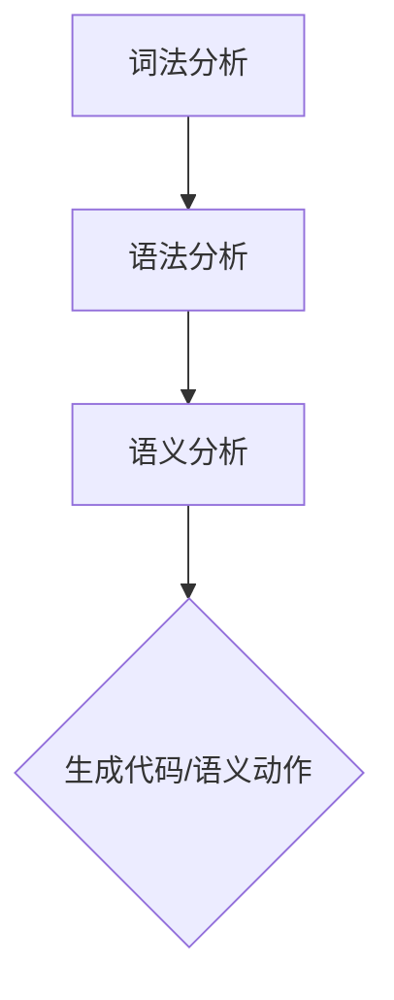
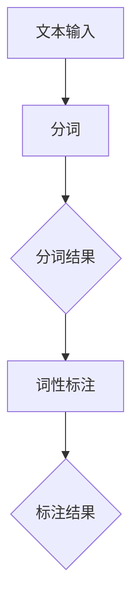
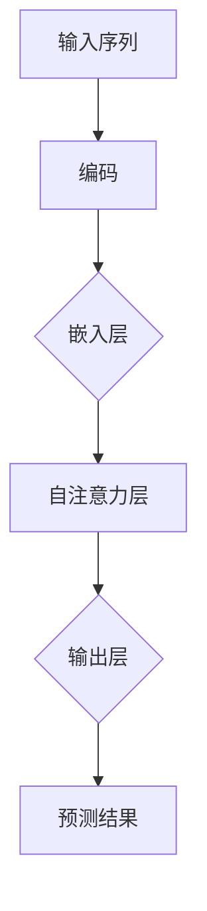
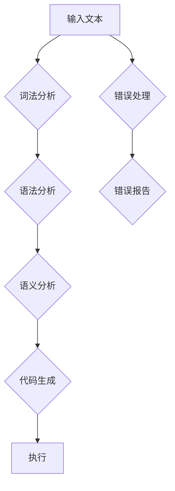
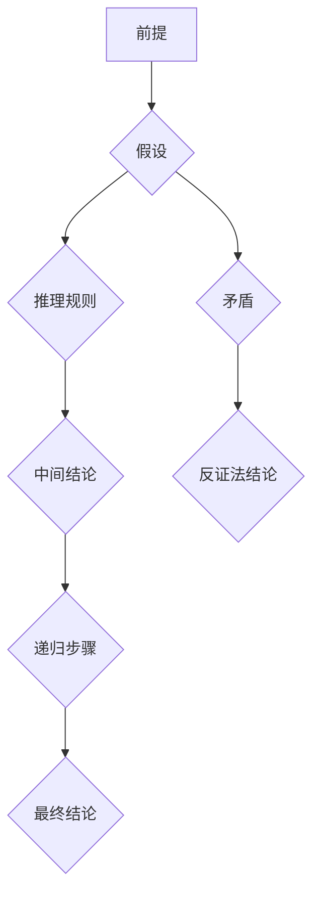

                 

### 引言

《语言的数学结构：语法与逻辑的交织》这篇文章旨在探讨语言与数学之间的紧密联系，以及语法与逻辑如何在这一交织过程中扮演关键角色。语言是人类交流的重要工具，其复杂性和多样性使我们对语言的数学结构产生了浓厚的兴趣。数学作为一种精确的学科，为理解语言的各个层次提供了强大的工具和方法。

首先，我们需要理解语言的复杂性。语言不仅仅是词汇和句子的简单堆砌，它包含了丰富的语法规则、语义含义和语境互动。这些要素共同构成了语言的层次结构，从最基础的词汇层面，到复杂的句子和段落，再到整体的篇章结构，每一层次都有其独特的规律和特点。

在语言的数学模型部分，我们将讨论形式语言和自动机、上下文无关语法等概念。形式语言是一种精确描述语言结构的方法，而自动机则是一种能够识别和生成形式语言的抽象计算模型。上下文无关语法则提供了对复杂语言结构的描述能力，是编译器和编程语言设计的重要理论基础。

接着，我们将深入探讨语言的数学性质，包括算子和结构、递归与不可解性等。这些性质揭示了语言和数学之间的深层联系，使得我们能够用数学的方法来分析和解决语言处理中的问题。

文章的第二部分将介绍语法与逻辑的交织。我们将从词法分析、语法分析到语义分析，一步步揭示语言处理的内在机制。词法分析是语言处理的第一步，它将文本拆分为基本的词汇单元；语法分析则进一步将这些词汇单元组合成符合语法规则的句子；语义分析则关注句子所表达的语义含义。

在第三部分，我们将探讨逻辑与证明在语言处理中的应用。逻辑提供了对语言表达精确性的验证方法，而证明理论则为我们提供了推理和证明的框架。形式逻辑系统则将逻辑应用于计算机科学中的实际问题，如编程语言的设计和自然语言处理中的推理系统。

第四部分将讨论实际应用，包括编程语言设计、自然语言处理和逻辑推理应用等。我们将通过具体案例展示这些理论在实际项目中的应用，并探讨其优势和挑战。

最后，文章的第五部分将提供扩展阅读资源，包括相关书籍推荐和在线资源和工具。这部分内容将帮助读者进一步深入学习和研究语言的数学结构。

通过对这些主题的深入探讨，我们希望读者能够对语言的数学结构有更深刻的理解，认识到语法与逻辑在语言处理中的核心作用。让我们一步一步地深入探讨这个迷人的领域，揭示语言的数学之美。## 1.1 语言的复杂性

语言是人类交流、思考和表达思想的工具，其复杂性令人叹为观止。为了理解这种复杂性，我们需要首先明确语言的定义和层次结构。

### 1.1.1 语言的定义

语言可以被视为一系列符号的集合，这些符号通过特定的规则组合在一起，用于表达意义。语言不仅仅是口头表达，还包括书面、手势和姿态等多种形式。符号是语言的基本元素，可以是单词、短语、句子或其他形式。例如，单词“狗”是一个符号，它代表了一种动物。通过不同的符号组合，我们可以表达复杂的思想和情感。

### 1.1.2 语言的层次结构

语言的层次结构可以分为几个主要层次：

1. **词汇层次**：这是语言结构的基础，包括单词和短语。词汇是语言的最小单位，每个词汇都有其特定的含义和用法。例如，“书”、“桌子”、“喝水”等都是词汇。

2. **句子层次**：句子是语言的基本表达单位，由一个或多个词汇按照特定的语法规则组合而成。句子可以表达完整的思想和意义。例如，“我喜欢看书。”就是一个句子。

3. **段落层次**：段落是将句子组织成有逻辑关系的整体的方式。一个段落通常围绕一个主题展开，包含多个句子。段落通过过渡词汇和逻辑连接词来维持句子之间的连贯性。

4. **篇章层次**：篇章是由多个段落组成的更大型文本，通常包含一个或多个主题。篇章不仅传达具体信息，还可能包含作者的意图、观点和论证。

### 语言的数学模型

语言的数学模型旨在通过数学方法来描述和分析语言的各个方面。这些模型帮助我们从抽象的角度理解语言的复杂性，并为语言处理提供理论基础。

#### 形式语言与自动机

形式语言是一种数学上的语言，用于精确描述语言的语法结构。形式语言包括词汇、符号和规则。自动机是一种抽象的计算模型，用于识别和生成形式语言。自动机可以分为有限自动机（DFA）、非确定有限自动机（NFA）和推算自动机（PDA）等。

**有限自动机（DFA）** 是一种最简单的自动机，它仅包含有限数量的状态和转移规则。DFA能够识别确定性的语言，例如正则语言。

**非确定有限自动机（NFA）** 具有更多的灵活性，它可以在任意状态下进行多个转移。NFA能够识别更复杂的语言，例如上下文无关语言。

**推算自动机（PDA）** 是在NFA基础上增加了栈的功能，能够处理更多的语言结构，如上下文有关语言。

#### 上下文无关语法

上下文无关语法（CFG）是一种形式化描述语言语法的方法。CFG由产生式（production rules）组成，每个产生式定义了如何从一个或多个词汇组合生成新的词汇。CFG能够描述大多数编程语言和自然语言的结构。

上下文无关语法包括四个主要部分：

1. **词汇符（V）**：包括变量和终端符号。变量用于表示可以替换为其他符号的元素，终端符号则是实际的语言符号。

2. **生成式（P）**：定义了如何从变量和终端符号生成新的符号序列。

3. **开始符号（S）**：定义了语法解析的起点。

4. **终结符（T）**：表示语法中的实际单词和短语。

#### 语言的数学性质

语言的数学性质研究语言的内在规律和特性。这些性质包括：

1. **算子和结构**：语言中的运算符和结构构成了语言的语法框架，如词法分析、语法分析和语义分析。

2. **递归与不可解性**：递归是语言处理中的一个重要概念，它允许语言处理系统自动生成和解析复杂的结构。然而，某些语言问题，如停机问题，被认为是不可解的，这意味着不存在一种算法可以解决所有此类问题。

### 语言的数学模型

语言的数学模型包括以下关键概念：

1. **形式语言**：一种精确描述语言结构的数学框架。

2. **自动机**：一种用于识别和生成形式语言的抽象计算模型。

3. **上下文无关语法**：一种形式化描述语言语法的方法，用于编程语言和自然语言的设计。

4. **递归与不可解性**：递归提供了生成和解析复杂语言结构的方法，但某些问题是不可解的。

通过这些数学模型，我们能够更深入地理解语言的复杂性，并为实际应用提供理论基础。在接下来的章节中，我们将进一步探讨这些模型，并展示它们在实际语言处理中的应用。## 1.2 语言的数学模型

在理解了语言的基本复杂性和层次结构之后，我们接下来将探讨语言的数学模型，这些模型为分析和处理语言提供了理论基础和工具。语言作为符号系统，其结构的数学化描述不仅有助于我们理解其本质，也为计算和处理复杂语言现象提供了精确的方法。在这一部分，我们将重点关注形式语言、自动机以及上下文无关语法。

### 1.2.1 形式语言与自动机

形式语言是数学上对语言结构的一种精确描述，它由符号、词汇和规则构成。形式语言的目的是为了使语言结构清晰、精确，便于计算机处理和分析。

**形式语言的符号**：形式语言的符号集合通常分为两类：终端符号（也称为字母表）和变量符号。终端符号是构成语言的最基本元素，如单词、标点符号等。变量符号则代表可以替换为其他符号的元素，通常用于表示语法规则中的通用部分。

**形式语言的规则**：形式语言的规则定义了符号如何组合成有效的句子或文本。这些规则可以是产生式（production rules），它们指定了如何从一个或多个符号序列生成新的符号序列。例如，在上下文无关语法中，产生式可以表示为 A → B，其中 A 和 B 是符号序列。

**自动机**：自动机是形式化计算模型的一种抽象，用于识别和生成形式语言。自动机由状态、输入符号、转移函数和接受状态组成。

1. **有限自动机（DFA）**：有限自动机是一种最简单的自动机模型，它包含有限数量的状态和一个初始状态。在有限自动机中，每个状态都对应于一个特定的输入符号集。当输入符号与当前状态匹配时，自动机会进行状态转移。有限自动机主要用于识别正则语言。

   **DFA的特点**：
   - 确定性：每个输入符号对应一个唯一的下一个状态。
   - 有限状态：自动机包含有限数量的状态。

2. **非确定有限自动机（NFA）**：非确定有限自动机比有限自动机更加灵活，因为它可以在任意状态下进行多个转移，或者不进行转移。NFA可以识别更复杂的语言，如上下文无关语言。

   **NFA的特点**：
   - 非确定性：多个输入符号可能对应于一个状态转移。
   - 无穷状态：NFA可以使用ε-转移（不消耗输入符号的状态转移），这使得NFA能够识别更复杂的语言。

3. **推算自动机（PDA）**：推算自动机是一种更复杂的自动机模型，它除了包含状态和输入符号外，还包括一个栈。PDA可以处理包含上下文的语言，如上下文有关语言。

   **PDA的特点**：
   - 栈操作：PDA可以使用栈来存储和检索信息，这使得PDA能够处理更复杂的语言结构。
   - 递归性：PDA能够处理具有递归性质的语言。

### 1.2.2 上下文无关语法

上下文无关语法（CFG）是形式语言的一个子集，它为描述语言结构提供了更为灵活的方法。CFG由产生式（production rules）构成，每个产生式定义了如何从一个或多个符号序列生成新的符号序列。CFG在计算机科学中应用广泛，特别是在编译器设计和自然语言处理中。

**上下文无关语法的组成部分**：

1. **变量符（V）**：变量符包括变量和终端符号。变量用于表示可以替换为其他符号的通用元素，而终端符号则是实际的语言符号。

2. **产生式（P）**：产生式定义了如何从变量和终端符号生成新的符号序列。产生式通常表示为 A → B，其中 A 和 B 是符号序列。

3. **开始符号（S）**：开始符号是CFG的起点，表示语法解析的初始状态。

4. **终结符（T）**：终结符是CFG中的实际单词和短语，是语法分析的结果。

**上下文无关语法的分类**：

1. **上下文无关语言（CFL）**：上下文无关语言是由上下文无关语法生成的语言。这类语言在计算机科学和自然语言处理中具有广泛的应用。

2. **上下文有关语言（CSL）**：上下文有关语言是由上下文有关语法生成的语言，其结构比上下文无关语言更为复杂。

3. **上下文无关正则语言**：上下文无关正则语言是上下文无关语言和正则语言的交集，这类语言可以用更简单的模型描述和处理。

通过形式语言和自动机，我们能够精确描述和分析语言的语法结构。上下文无关语法提供了描述复杂语言结构的方法，使得编译器设计和自然语言处理成为可能。在接下来的章节中，我们将进一步探讨语言的数学性质，包括算子和结构、递归与不可解性，以更全面地理解语言的数学结构。## 1.3 语言的数学性质

在深入探讨了语言的数学模型后，我们接下来将探讨语言的数学性质。这些性质不仅揭示了语言和数学之间的深层联系，还为语言处理提供了理论依据。本节将重点讨论语言的算子与结构、递归与不可解性等关键概念。

### 1.3.1 算子和结构

语言的算子是指用于组合和操作基本语言单元的符号或操作。这些算子可以用于构建复杂的语言结构，使得语言能够表达丰富的语义信息。

**算子的分类**：

1. **运算符**：运算符是用于执行数学或逻辑操作的符号，如加法（+）、减法（-）、逻辑与（&&）和逻辑或（||）等。

2. **连接符**：连接符用于将不同的语言单元连接在一起，形成更复杂的表达式。例如，逗号（,）用于列举多个元素，冒号（:）用于定义变量和函数等。

3. **修饰符**：修饰符用于对语言单元进行修饰，以改变其属性或行为。例如，在编程语言中，访问修饰符（如public、private）用于定义变量和函数的可见性。

**语言结构**：

语言的结构是指语言单元如何组合和排列，以形成有效的句子或程序。语言结构可以分为几个层次：

1. **词法结构**：词法结构是指单词和短语的组合，如“我喜欢编程”。

2. **语法结构**：语法结构是指句子和段落的结构，如主语、谓语和宾语的组合。

3. **语义结构**：语义结构是指句子和段落所表达的语义信息，如事实、推理和论证等。

通过理解语言的算子和结构，我们可以更准确地描述和解析语言，为语言处理提供坚实的基础。

### 1.3.2 递归与不可解性

递归是语言处理中的一个重要概念，它允许语言处理系统自动生成和解析复杂的语言结构。递归可以分为两类：递归定义和递归计算。

**递归定义**：

递归定义是指使用自身来定义的语言结构。例如，定义一个自然数序列：第一个数为0，后续每个数都是前一个数的两倍。这个序列可以递归定义为：

- \( a_0 = 0 \)
- \( a_n = 2 \times a_{n-1} \)（对于 \( n > 0 \)）

这种递归定义使得我们能够用简单的规则生成复杂的语言结构。

**递归计算**：

递归计算是指使用递归定义来计算语言结构的过程。例如，计算一个递归定义的函数值：

- \( f(0) = 0 \)
- \( f(n) = 2 \times f(n-1) \)（对于 \( n > 0 \)）

这种递归计算可以用于语言处理中的各种任务，如语法分析、语义分析和代码生成等。

**不可解性**：

不可解性是递归和计算理论中的一个重要概念，它指某些问题无法通过算法得到解决方案。例如，停机问题是一个不可解问题，它询问一个给定的程序是否会在有限时间内停止。这个问题在计算理论中被认为是不可解的，因为不存在一个通用算法可以解决所有停机问题。

不可解性揭示了计算能力的局限性，使得我们在设计和分析语言处理系统时需要谨慎考虑这些限制。

通过理解递归和不可解性，我们可以更好地理解语言处理的局限性和可能性。递归提供了生成和解析复杂语言结构的方法，而不可解性则提醒我们在处理复杂问题时需要采取有效的方法和策略。

总之，语言的数学性质，包括算子和结构、递归与不可解性，为我们理解和处理语言提供了深刻的理论基础。在接下来的章节中，我们将进一步探讨语法与逻辑的交织，揭示它们在语言处理中的应用和重要性。## 2.1 词法分析

词法分析（Lexical Analysis）是自然语言处理和编程语言编译过程中至关重要的一步。它的主要任务是将输入的文本序列拆分成一系列的词法单元（tokens），这些词法单元是编程语言或自然语言的基本构建块。词法分析器（Lexer）负责执行这一过程，它将原始文本转换为词法流，为后续的语法分析和语义分析提供基础。

### 2.1.1 词法规则

词法规则是定义如何将文本拆分成词法单元的规则集。这些规则通常包括以下几个部分：

1. **关键字（Keywords）**：关键字是编程语言中具有特定语义的单词，如 `if`、`while`、`int` 等。关键字在词法规则中通常被定义为特殊的词法单元。

2. **标识符（Identifiers）**：标识符是用户定义的变量名、函数名等。它们通常由字母、数字和下划线组成，且不能以数字开头。

3. **分隔符（Separators）**：分隔符是用于分隔词法单元的符号，如逗号（`,`）、分号（`;`）、括号（`()`）等。

4. **常量（Literals）**：常量是编程语言中代表固定值的词法单元，如数字（123）、字符串（"Hello World!"）和布尔值（true/false）等。

5. **操作符（Operators）**：操作符是用于执行特定操作的符号，如加法（`+`）、减法（`-`）、赋值（`=`）等。

6. **注释（Comments）**：注释是程序员添加的、不会被编译器解析的文本。常见的注释形式包括单行注释（`// comment`）和多行注释（`/* comment */`）。

### 2.1.2 词法分析器设计

词法分析器的核心是一个状态机，它根据预定义的词法规则对输入文本进行扫描和分类。以下是一个简单的词法分析器设计流程：

1. **初始化**：创建一个初始状态，并为每个词法规则分配一个状态。

2. **扫描输入**：从输入文本的起始位置开始，逐个字符地扫描文本。

3. **状态转移**：根据当前字符和当前状态，查找词法规则并执行相应的状态转移。

4. **生成词法单元**：当状态转移完成且文本中的词法单元被完整识别后，生成相应的词法单元并将其输出到词法流中。

5. **错误处理**：如果词法规则无法匹配当前的输入字符，则报告错误并可能重新开始分析。

以下是一个简单的词法分析器的伪代码示例：

```pseudo
function lexicalAnalysis(inputText):
    currentState = INITIAL_STATE
    while not end of inputText:
        char = nextCharacter(inputText)
        nextState = getNextState(currentState, char)
        if nextState is defined:
            update currentState = nextState
            if currentState is an accepting state:
                emit token
                reset currentState
        else:
            report error and reset to INITIAL_STATE

function getNextState(currentState, char):
    // 查找词法规则并返回下一个状态
    // 省略具体实现细节
```

在词法分析器的设计中，状态机是最核心的部分。状态机根据输入字符和当前状态，决定下一个状态并执行相应的操作。以下是一个简化的Mermaid流程图，展示了词法分析过程中可能的状态转移：

```mermaid
stateMachineDiagram
    [*] --> INITIAL_STATE
    INITIAL_STATE --> ID_OR_KEYWORD_STATE
    INITIAL_STATE --> LITERAL_STATE
    INITIAL_STATE --> SEPARATOR_STATE
    INITIAL_STATE --> OPERATOR_STATE
    INITIAL_STATE --> COMMENT_STATE

    ID_OR_KEYWORD_STATE --> ACCEPT_ID
    ID_OR_KEYWORD_STATE --> ACCEPT_KEYWORD
    ID_OR_KEYWORD_STATE --> INITIAL_STATE [if next char is not letter or underscore]

    LITERAL_STATE --> ACCEPT_LITERAL
    LITERAL_STATE --> INITIAL_STATE [if next char is not part of the literal]

    SEPARATOR_STATE --> ACCEPT_SEPARATOR
    SEPARATOR_STATE --> INITIAL_STATE

    OPERATOR_STATE --> ACCEPT_OPERATOR
    OPERATOR_STATE --> INITIAL_STATE [if next char is not an operator]

    COMMENT_STATE --> IGNORE_REST_OF_LINE [for single line comments]
    COMMENT_STATE --> INITIAL_STATE [for multi-line comments]
```

通过词法分析，我们能够将复杂的文本输入转化为一系列结构化的词法单元，为后续的语法分析和语义分析奠定了基础。在下一节中，我们将继续探讨语法分析，进一步揭示语言处理的核心机制。## 2.2 语法分析

语法分析是语言处理过程中的关键步骤，它将词法分析器生成的词法单元序列转化为抽象语法树（Abstract Syntax Tree, AST），这是程序结构的高级表示形式。语法分析不仅需要理解词法单元的顺序和组合规则，还需要识别和解析复杂的语法结构。

### 2.2.1 上下文无关文法

上下文无关文法（Context-Free Grammar,CFG）是一种形式化的语法表示方法，它能够描述大部分编程语言和自然语言的语法结构。CFG由四个主要部分组成：变量符（V）、生成式（P）、开始符号（S）和终结符（T）。

**变量符（V）**：变量符包括变量和终结符。变量用于表示可以替换为其他符号的通用元素，而终结符是实际的语言符号。

**生成式（P）**：生成式定义了如何从变量和终结符生成新的符号序列。生成式通常表示为 A → B，其中 A 和 B 是符号序列。

**开始符号（S）**：开始符号是CFG的起点，表示语法解析的初始状态。

**终结符（T）**：终结符是CFG中的实际单词和短语，是语法分析的结果。

**上下文无关语法的应用**：

- 编译器设计：上下文无关语法是编译器设计中用于解析源代码的重要工具。通过CFG，编译器能够将输入的源代码转化为抽象语法树，进一步进行语义分析和代码生成。

- 自然语言处理：上下文无关语法在自然语言处理中也具有广泛的应用。例如，句法分析器可以使用CFG来识别和解析自然语言的句子结构。

### 2.2.2 巴科斯-诺尔范式（BNF）

巴科斯-诺尔范式（Backus-Naur Form,BNF）是一种用于描述上下文无关语法的记号系统。BNF通过使用产生式（production rules）来定义语言的结构，每个产生式表示一个语法规则。

**BNF的产生式**：BNF的产生式通常表示为 A → B，其中 A 是产生式的左侧，表示变量；B 是产生式的右侧，表示由变量和终结符组成的符号序列。

**BNF的例子**：

```plaintext
<语句> → <赋值语句> | <条件语句> | <循环语句>
<赋值语句> → <变量> = <表达式>;
<条件语句> → if (<条件>) then <语句>
<循环语句> → while (<条件>) do <语句>
<变量> → <标识符>
<表达式> → <数字> | <变量> | <表达式> + <表达式>
<条件> → <表达式> comparisonOperator <表达式>
comparisonOperator → == | != | < | > | <= | >=
```

通过BNF，我们可以清晰地描述复杂的语言结构。BNF的产生式不仅可以定义单个语法结构，还可以组合成更复杂的语法规则。

### 语法分析的过程

语法分析的过程通常分为三个主要阶段：

1. **词法分析**：词法分析器将输入文本拆分为词法单元，并将其传递给语法分析器。

2. **语法分析**：语法分析器使用CFG或BNF规则，将词法单元序列转化为抽象语法树（AST）。语法分析器通常使用递归下降分析、LL分析或LR分析等算法。

3. **语义分析**：语义分析器检查AST是否符合语言定义的语义规则，并进行类型检查和作用域分析等。

以下是一个简化的Mermaid流程图，展示了语法分析的基本流程：



通过语法分析，我们能够将词法单元序列转化为结构化的抽象语法树，这为后续的语义分析和代码生成提供了基础。在下一节中，我们将探讨语义分析，进一步揭示语言处理的核心机制。## 2.3 语义分析

语义分析是语言处理过程中的关键环节，它旨在确定源代码的语义含义，并确保其符合预期的行为。语义分析不仅涉及对代码结构的理解，还包括类型检查、作用域分析、声明验证等。语义分析的主要任务是确保代码在逻辑上是正确的，并且在执行时能够产生预期的结果。

### 2.3.1 类型系统

类型系统是编程语言中的一个核心概念，它用于定义变量、函数和表达式等的类型。类型系统可以防止错误的操作，并提供更严格的代码验证机制。

**静态类型**：静态类型系统在编译时检查变量的类型，确保变量在赋值和操作时类型匹配。例如，在Java中，变量必须在声明时指定其类型，且在编译时进行类型检查。

**动态类型**：动态类型系统在运行时检查变量的类型，通常由解释器或即时编译器进行类型验证。动态类型系统提供更大的灵活性，但可能引入运行时错误。

**类型检查**：

- **强类型检查**：在编译时严格检查类型匹配，确保不会发生不兼容的类型操作。

- **弱类型检查**：在编译时进行部分类型检查，允许某些类型转换，但在运行时进行最终验证。

### 2.3.2 表达式求值

表达式求值是语义分析中的一个重要任务，它涉及计算表达式的值，并根据表达式的类型和操作符执行相应的操作。

**算术表达式求值**：算术表达式包括加法、减法、乘法、除法等操作。在求值过程中，系统会检查操作数的类型，确保它们能够进行合法的算术运算。

**逻辑表达式求值**：逻辑表达式包括逻辑与（&&）、逻辑或（||）和逻辑非（！）等操作。逻辑表达式的求值需要考虑操作数的布尔值，并返回相应的结果。

**函数调用表达式求值**：函数调用表达式涉及调用一个函数并传递相应的参数。在求值过程中，系统会查找函数的定义，验证参数的类型和数量，并执行函数体。

以下是一个简单的语义分析过程的伪代码示例：

```pseudo
function semanticAnalysis(AST):
    for node in AST:
        if node is a variable declaration:
            check variable type and scope
        else if node is an assignment:
            check variable type and expression type
            evaluate expression
        else if node is an arithmetic expression:
            check operand types and evaluate expression
        else if node is a function call:
            check function name, parameters, and type
            execute function body
        else:
            report error

function evaluateExpression(expression):
    if expression is a constant:
        return constant value
    else if expression is an arithmetic operation:
        check operand types
        perform arithmetic operation
    else if expression is a logical operation:
        check operand types
        perform logical operation
    else:
        report error
```

在语义分析过程中，类型系统和表达式求值是两个核心任务。类型系统确保代码的静态正确性，而表达式求值则负责计算代码的动态行为。通过严格的语义分析，我们能够确保代码在执行时不会产生错误，并按照预期的行为运行。

语义分析的结果不仅影响代码的执行，还决定了编译器或解释器如何生成机器代码或解释执行。有效的语义分析是构建可靠和高效编程语言系统的基础。在下一节中，我们将进一步探讨语义分析与实际编程语言设计之间的关系。## 3.1 逻辑基础

逻辑是语言处理和计算理论中的重要工具，它用于验证语言的正确性和推导出结论。逻辑基础包括逻辑运算符和命题逻辑，这些概念为语言处理提供了精确的描述和推理方法。

### 3.1.1 逻辑运算符

逻辑运算符是用于组合和操作逻辑值的符号，它们在编程语言和形式逻辑中广泛应用。常见的逻辑运算符包括：

1. **合取（AND）**：合取运算符表示两个命题同时为真。在数学符号中，合取运算符用符号 `∧` 表示。例如，命题 \( P ∧ Q \) 表示 \( P \) 和 \( Q \) 同时为真。

2. **析取（OR）**：析取运算符表示两个命题中至少有一个为真。在数学符号中，析取运算符用符号 `∨` 表示。例如，命题 \( P ∨ Q \) 表示 \( P \) 或 \( Q \) 至少有一个为真。

3. **非（NOT）**：非运算符用于否定一个命题。在数学符号中，非运算符用符号 `¬` 或 `~` 表示。例如，命题 ¬P 表示 \( P \) 为假。

4. **条件（→）**：条件运算符表示如果第一个命题为真，则第二个命题也为真。在数学符号中，条件运算符用符号 `→` 表示。例如，命题 \( P → Q \) 表示如果 \( P \) 为真，则 \( Q \) 也为真。

5. **双条件（↔）**：双条件运算符表示两个命题相互等价。在数学符号中，双条件运算符用符号 `↔` 或 `⟺` 表示。例如，命题 \( P ↔ Q \) 表示 \( P \) 和 \( Q \) 相互等价。

### 3.1.2 命题逻辑

命题逻辑是逻辑学的基础部分，它研究命题、逻辑运算符和推理规则。在命题逻辑中，命题是一个具有真假的陈述。命题逻辑的基本元素是命题变量，它们可以取真（True）或假（False）两种值。

**命题变元**：命题变元是命题逻辑中的基本单元，用大写字母 \( P, Q, R \) 等表示。例如，命题 \( P \) 可以表示“今天下雨”。

**命题公式**：命题公式是由命题变元、逻辑运算符和括号组成的表达式。命题公式可以表示复杂的逻辑关系。例如，命题公式 \( P ∧ Q → R \) 表示如果 \( P \) 和 \( Q \) 都为真，则 \( R \) 也为真。

**命题逻辑的基本推理规则**：

1. **合取引入（Conjunction Introduction）**：如果命题 \( P \) 和 \( Q \) 都为真，则可以推出 \( P ∧ Q \) 为真。

2. **析取引入（Disjunction Introduction）**：如果命题 \( P \) 为真，则可以推出 \( P ∨ Q \) 为真。

3. **非引入（Negation Introduction）**：如果命题 \( P \) 为假，则可以推出 ¬P 为真。

4. **条件引入（Conditional Introduction）**：如果命题 \( P → Q \) 为真，则可以推出 \( P \) 为真且 \( Q \) 也为真。

5. **双条件引入（Biconditional Introduction）**：如果命题 \( P ↔ Q \) 为真，则可以推出 \( P \) 和 \( Q \) 相互等价。

6. **合取消除（Conjunction Elimination）**：如果 \( P ∧ Q \) 为真，则可以分别推出 \( P \) 和 \( Q \) 都为真。

7. **析取消除（Disjunction Elimination）**：如果 \( P ∨ Q \) 为真，并且已知 \( P \) 为假，则可以推出 \( Q \) 为真。

8. **非消除（Negation Elimination）**：如果 ¬P 为真，则可以推出 \( P \) 为假。

通过命题逻辑，我们能够精确地表达和推理语言中的逻辑关系。命题逻辑为形式逻辑和计算机科学提供了强大的工具，使得我们能够验证程序的正确性、设计和实现逻辑推理系统。在下一节中，我们将进一步探讨证明理论，揭示逻辑推理的深层次机制。## 3.2 证明理论

证明理论是逻辑学的一个核心分支，它研究如何从一个或多个前提（假设）推导出结论。证明理论不仅为数学和逻辑学提供了严格的方法，也在计算机科学和人工智能领域有着广泛的应用。本节将介绍证明理论的基本概念和方法，包括证明的基本方法、归纳证明与递归以及形式逻辑系统。

### 3.2.1 证明的基本方法

证明的基本方法包括直接证明、反证法、归纳证明等。这些方法为证明逻辑命题提供了不同的策略。

**直接证明**：

直接证明是最常见的证明方法，它通过逻辑推理直接从已知的前提（假设）推导出结论。直接证明通常遵循以下步骤：

1. **列出前提**：明确要证明的命题的前提条件。
2. **推理步骤**：使用逻辑推理规则，逐步推导出结论。
3. **结论**：得出结论，证明原命题为真。

例如，要证明命题“如果今天下雨，那么地面是湿的”：

- 前提：今天下雨。
- 推理步骤：
  - 下雨意味着水滴落在地面上。
  - 水滴落在地面上会使地面变湿。
- 结论：因此，地面是湿的。

**反证法**：

反证法是一种通过假设结论的否定来证明原命题的方法。如果假设结论的否定会导致矛盾，则可以推导出原命题为真。

例如，要证明命题“如果一个数能被3整除，那么它的各位数字之和也能被3整除”：

- 假设：存在一个数 \( n \)，它能被3整除，但它的各位数字之和不能被3整除。
- 推理步骤：
  - \( n \) 能被3整除，因此 \( n \) 可以表示为 \( 3k \)（其中 \( k \) 是一个整数）。
  - \( n \) 的各位数字之和不能被3整除，这意味着 \( n \) 的各位数字之和 \( s \) 不能被3整除。
  - 然而，\( s \) 必须是 \( n \) 的因子，因此 \( s \) 也必须能被3整除。
- 结论：这与假设矛盾，因此原命题为真。

**归纳证明**：

归纳证明是一种证明方法，它通过证明基础情况和归纳步骤来证明一个命题对所有的自然数都成立。

1. **基础情况**：证明命题对最小值（通常是自然数的最小值，即1）成立。
2. **归纳步骤**：假设命题对某个自然数 \( k \) 成立，证明命题对 \( k+1 \) 也成立。

例如，要证明命题“所有自然数之和等于其项数的平方”：

- 基础情况：当 \( n = 1 \) 时，\( 1 = 1^2 \)。
- 归纳步骤：假设当 \( n = k \) 时，\( 1 + 2 + ... + k = \frac{k(k+1)}{2} \)。
  - 证明当 \( n = k+1 \) 时，\( 1 + 2 + ... + k + (k+1) = \frac{(k+1)(k+2)}{2} \)：
    - \( 1 + 2 + ... + k + (k+1) = \frac{k(k+1)}{2} + (k+1) = \frac{(k+1)(k+2)}{2} \)。

通过归纳证明，我们能够证明一个命题对所有自然数都成立。

### 3.2.2 归纳证明与递归

归纳证明与递归是密切相关的概念。归纳证明通过基础情况和归纳步骤来证明一个命题，而递归是一种编程方法，它通过调用自身来解决问题。

**递归定义**：

递归定义是一个定义过程的方法，该过程在定义中直接或间接地引用了自身。递归分为两种类型：递归定义和递归计算。

1. **递归定义**：递归定义通过自身来定义一个概念或值。例如，定义一个自然数序列：第一个数为0，后续每个数都是前一个数的两倍。这个序列可以递归定义为：

   - \( a_0 = 0 \)
   - \( a_n = 2 \times a_{n-1} \)（对于 \( n > 0 \)）

2. **递归计算**：递归计算是指使用递归定义来计算一个值或解决一个问题的过程。例如，计算一个递归定义的函数值：

   - \( f(0) = 0 \)
   - \( f(n) = 2 \times f(n-1) \)（对于 \( n > 0 \)）

递归计算在编程和算法设计中广泛使用，它能够有效地解决许多复杂问题。

### 3.2.3 形式逻辑系统

形式逻辑系统是一种用于表达和证明逻辑命题的数学框架。形式逻辑系统包括符号语言、推理规则和证明方法。以下是一个简单的形式逻辑系统示例：

- **符号语言**：使用符号来表示逻辑命题和推理规则。常见的符号包括 \( \forall \)（全称量词）、\( \exists \)（存在量词）、\( \Rightarrow \)（蕴含）、\( \Leftrightarrow \)（等价）等。

- **推理规则**：推理规则是用于从已知的前提推导出新命题的方法。常见的推理规则包括合取引入、析取引入、条件引入等。

- **证明方法**：证明方法是指使用推理规则和逻辑运算符来证明命题的方法。形式逻辑系统中的证明通常遵循以下步骤：

  1. **列出前提**：明确要证明的命题的前提条件。
  2. **应用推理规则**：使用推理规则逐步推导出结论。
  3. **结论**：得出结论，证明原命题为真。

通过形式逻辑系统，我们能够使用精确的数学方法来表达和证明逻辑命题，这为计算机科学和人工智能提供了强大的工具。

总结来说，证明理论是逻辑学中的重要概念，它为逻辑推理和验证提供了严格的方法。通过直接证明、反证法、归纳证明等方法，我们能够证明逻辑命题的正确性。形式逻辑系统则为逻辑推理提供了数学框架，使得我们能够使用精确的方法来表达和证明复杂的逻辑问题。这些概念和方法在计算机科学和人工智能领域有着广泛的应用，为语言处理、程序验证和人工智能系统设计提供了重要的理论基础。## 3.3 形式逻辑系统

形式逻辑系统是逻辑学在数学和计算机科学中的重要应用，它为表达和证明逻辑命题提供了一种精确且系统化的方法。形式逻辑系统包括谓词逻辑、证明系统设计等关键概念。在本节中，我们将深入探讨这些概念，并展示它们在计算机科学中的应用。

### 3.3.1 谓词逻辑

谓词逻辑是一种更强大的逻辑系统，它引入了变量和量词，使得我们能够表达更复杂的逻辑关系。谓词逻辑的基本元素包括谓词、个体常项、函数符号和量词。

**谓词**：谓词是一个表示性质或关系的表达式，如“是人”（isHuman）或“大于”（greaterThan）。

**个体常项**：个体常项是用于表示特定个体的符号，如“苏格拉底”（Socrates）或“这个苹果”（thisApple）。

**函数符号**：函数符号用于表示函数关系，如“父亲”（father）或“生日”（birthDate）。

**量词**：量词用于表示全称量词（∀）和存在量词（∃）。全称量词表示对所有个体都成立，而存在量词表示至少存在一个个体使得命题成立。

谓词逻辑的基本公式包括：

- **全称量词**：\( ∀x \, P(x) \) 表示对所有 \( x \)，命题 \( P(x) \) 都成立。
- **存在量词**：\( ∃x \, P(x) \) 表示至少存在一个 \( x \)，使得命题 \( P(x) \) 成立。

谓词逻辑的应用非常广泛，例如在形式化数学证明、程序验证和自动推理中。

### 3.3.2 证明系统设计

证明系统设计是形式逻辑系统中的关键部分，它定义了如何从一组前提推导出结论。一个完整的证明系统包括公理、推理规则和证明方法。

**公理**：公理是证明系统的基本原理，它们是不需要证明的基本命题。例如，在谓词逻辑中，有一个公理：\( P(x) ∧ Q(x) \Rightarrow R(x) \)。

**推理规则**：推理规则是用于从已知命题推导出新命题的方法。常见的推理规则包括合取引入、析取引入、条件引入等。

**证明方法**：证明方法是指使用推理规则和逻辑运算符来证明命题的方法。证明通常遵循以下步骤：

1. **列出前提**：明确要证明的命题的前提条件。
2. **应用推理规则**：使用推理规则逐步推导出结论。
3. **结论**：得出结论，证明原命题为真。

一个典型的证明系统设计包括以下步骤：

1. **定义语言和符号**：定义谓词逻辑中的符号和语言。
2. **定义公理**：定义证明系统的基本原理。
3. **定义推理规则**：定义用于推导新命题的推理规则。
4. **设计证明方法**：设计用于证明命题的证明方法。

**例子**：使用谓词逻辑证明命题“所有自然数之和等于其项数的平方”。

- **前提**：
  - \( ∀n \, (1 + 2 + ... + n = \frac{n(n+1)}{2}) \)
- **证明**：

  - 基础情况：当 \( n = 1 \) 时，\( 1 = 1^2 \)，成立。
  - 归纳步骤：假设当 \( n = k \) 时，命题成立，即 \( 1 + 2 + ... + k = \frac{k(k+1)}{2} \)。
    - 要证明当 \( n = k+1 \) 时，命题也成立：
    - \( 1 + 2 + ... + k + (k+1) = \frac{k(k+1)}{2} + (k+1) = \frac{(k+1)(k+2)}{2} = (k+1)^2 \)。

通过这种形式化的证明过程，我们能够确保命题的正确性。

### 3.3.3 形式逻辑系统在计算机科学中的应用

形式逻辑系统在计算机科学中有着广泛的应用，包括程序验证、自动推理和形式化方法等。

**程序验证**：形式逻辑系统用于验证程序的正确性，确保程序在所有情况下都能按照预期行为执行。例如，使用谓词逻辑和证明系统可以验证程序中的断言和性质。

**自动推理**：自动推理系统使用形式逻辑系统来证明逻辑命题。这些系统可以自动化证明过程，提高推理的效率和准确性。

**形式化方法**：形式化方法使用形式逻辑系统来描述和分析系统的行为。例如，在软件工程中，形式化方法可以用于设计、验证和验证系统的规格说明。

通过形式逻辑系统，我们能够精确地描述和验证逻辑命题，为计算机科学提供强大的工具。这些工具不仅用于理论研究，还在实际应用中发挥着关键作用。

总结来说，形式逻辑系统是逻辑学在数学和计算机科学中的重要应用，它为表达和证明逻辑命题提供了一种精确且系统化的方法。谓词逻辑和证明系统设计是形式逻辑系统的核心概念，它们在计算机科学中有着广泛的应用。通过形式逻辑系统，我们能够确保程序的正确性，提高推理的效率，并推动计算机科学的发展。## 4.1 编程语言设计

编程语言设计是计算机科学中的一项核心任务，它涉及到语言的语法、语义、类型系统、编译器和解释器等多个方面。一个良好的编程语言设计不仅要满足功能性和效率，还需要考虑易用性和可维护性。本节将讨论编程语言设计中的关键原则以及编译器与解释器的基本原理。

### 4.1.1 语言设计原则

编程语言设计原则是确保语言既强大又易于使用的关键指导方针。以下是几个主要原则：

**清晰性**：语言的语法和语义应该清晰明确，以减少歧义和误解。这有助于编写可读性强的代码，降低维护成本。

**一致性**：语言应该具有一致性，即不同语法元素和特性之间应该保持一致的规则和用法。一致性有助于减少学习成本和提高编程效率。

**简洁性**：语言的语法应该尽量简洁，避免不必要的复杂性和冗余。简洁性有助于提高开发效率，减少错误发生。

**扩展性**：语言应该具有较好的扩展性，允许用户自定义新的语法和特性。扩展性有助于适应不断变化的需求和新技术的发展。

**效率**：语言的编译器和解释器应该具有较高的执行效率，以确保程序的运行速度和资源利用率。

**兼容性**：语言应该具有良好的兼容性，能够与现有的系统和工具无缝集成。兼容性有助于语言的普及和应用。

**安全性**：语言应该具备一定的安全性，以防止恶意代码和潜在的安全漏洞。安全性是保护用户数据和系统稳定性的重要保障。

### 4.1.2 编译器与解释器

编译器与解释器是编程语言实现中的重要组成部分，它们负责将源代码转换为可执行代码。编译器与解释器的区别在于它们处理代码的方式不同。

**编译器**：

编译器将源代码一次性编译成机器代码，然后直接执行。编译器的工作流程包括以下几个阶段：

1. **词法分析**：词法分析器将源代码拆分成词法单元。
2. **语法分析**：语法分析器使用上下文无关语法规则，将词法单元序列转化为抽象语法树（AST）。
3. **语义分析**：语义分析器检查AST的语义正确性，如类型检查和作用域分析。
4. **中间代码生成**：代码生成器将AST转换为中间代码，如三地址代码。
5. **优化**：优化器对中间代码进行优化，提高执行效率。
6. **目标代码生成**：目标代码生成器将中间代码转换为机器代码。
7. **执行**：机器代码在计算机上执行。

**解释器**：

解释器逐行读取和执行源代码。它不需要将整个程序编译成机器代码，而是在运行时解释和执行每条指令。解释器的工作流程包括：

1. **词法分析**：词法分析器将源代码拆分成词法单元。
2. **语法分析**：语法分析器将词法单元序列转化为抽象语法树（AST）。
3. **语义分析**：语义分析器检查AST的语义正确性。
4. **解释执行**：解释器逐行解释和执行源代码。

编译器和解释器各有优缺点。编译器生成直接执行的机器代码，通常具有更高的执行效率，但开发周期较长。解释器开发周期短，易于调试，但执行效率相对较低。

以下是一个简化的Mermaid流程图，展示了编译器和解释器的基本工作流程：

```mermaid
graph TD
    A[源代码] --> B[词法分析]
    B --> C[语法分析]
    C --> D[语义分析]
    D --> E{编译器}
    D --> F[解释执行]{解释器}
    E --> G[中间代码]
    E --> H[目标代码]
    G --> I[优化]
    H --> J[执行]
```

通过合理的编程语言设计原则和高效的编译器与解释器实现，我们可以开发出功能强大、易于使用且高效的编程语言，为软件开发提供坚实的基础。

## 4.2 自然语言处理

自然语言处理（Natural Language Processing, NLP）是计算机科学和人工智能领域中的一个重要分支，它旨在使计算机能够理解、解释和生成人类语言。NLP在许多领域具有广泛的应用，如信息检索、机器翻译、语音识别和文本分析等。本节将讨论NLP中的关键技术，包括分词与词性标注、语言模型与预测等。

### 4.2.1 分词与词性标注

分词（Tokenization）是将连续的文本拆分成一个个有意义的单元，如单词、短语或符号。词性标注（Part-of-Speech Tagging）是对每个词进行分类，标注其词性，如名词、动词、形容词等。

**分词**：

分词是NLP的基础步骤，它对于后续的词性标注、语义分析和文本理解至关重要。常见的分词方法包括：

- **基于词典的分词**：通过匹配词典中的单词来拆分文本。例如，使用最大的正向匹配算法（Maximum Match）或最小成本算法（Minimum Cost）。

- **基于统计模型的方法**：使用统计模型，如条件概率模型（如N元语法模型）或序列标注模型（如隐马尔可夫模型，HMM），来预测词与词之间的边界。

- **基于字符序列的方法**：将文本视为字符序列，使用字符级别的深度学习模型（如卷积神经网络，CNN）进行分词。

**词性标注**：

词性标注的目的是识别文本中每个词的词性，这对于理解文本语义和生成正确的语法结构非常重要。常见的词性标注方法包括：

- **基于规则的方法**：使用预定义的规则，如词典匹配和词性转换规则，来标注词性。

- **基于统计模型的方法**：使用统计模型，如最大熵模型（Maximum Entropy Model）或条件随机场（Conditional Random Field, CRF），来预测词性。

- **基于深度学习的方法**：使用深度神经网络，如长短期记忆网络（LSTM）或Transformer，来学习词性标注任务。

以下是一个简化的Mermaid流程图，展示了分词和词性标注的基本过程：



### 4.2.2 语言模型与预测

语言模型（Language Model）是NLP中用于预测文本中下一个词或字符的概率分布的模型。语言模型对于许多NLP任务，如机器翻译、语音识别和文本生成，都至关重要。

**N元语法模型**：

N元语法模型是一种基于历史信息的语言模型，它使用前 \( n \) 个词来预测下一个词。常见的N元语法模型包括：

- **一元语法模型**（Unigram Model）：只使用单个词作为历史信息。

- **二元语法模型**（Bigram Model）：使用前两个词作为历史信息。

- **三元语法模型**（Trigram Model）：使用前三个词作为历史信息。

N元语法模型的优点是简单和易于实现，但其性能随着 \( n \) 的增加而显著下降。

**基于深度学习的语言模型**：

近年来，深度学习模型在语言模型中取得了显著进展。以下是一些常见的基于深度学习的语言模型：

- **循环神经网络（RNN）**：如LSTM和GRU，这些模型能够处理长距离依赖问题。

- **Transformer**：Transformer模型使用自注意力机制，能够高效地处理长序列，并在许多NLP任务中取得了优异的性能。

语言模型的预测过程通常包括以下几个步骤：

1. **编码**：将输入序列编码为向量表示。

2. **预测**：使用语言模型预测下一个词的概率分布。

3. **解码**：根据概率分布选择下一个词，并重复编码和预测过程，直到生成完整的输出序列。

以下是一个简化的Mermaid流程图，展示了基于Transformer的语言模型预测过程：



通过分词与词性标注、语言模型与预测等关键技术，NLP系统能够有效地理解和生成人类语言。这些技术在许多实际应用中发挥着关键作用，推动了人工智能的发展。## 4.3 逻辑推理应用

逻辑推理在计算机科学和人工智能中具有广泛的应用，特别是在逻辑编程和人工智能中的逻辑推理方面。逻辑推理提供了一种精确的表示和推理方法，使得计算机能够处理复杂的问题和决策。本节将探讨这些应用，并展示它们在实际项目中的重要性。

### 4.3.1 逻辑编程

逻辑编程是一种基于逻辑的编程范式，它将程序表示为逻辑公式，并通过推理引擎执行这些公式。逻辑编程的核心思想是使用谓词逻辑来描述问题，并利用推理系统求解问题。这种编程范式在自动推理、问题求解和知识表示等领域有着广泛应用。

**逻辑编程的基本概念**：

- **谓词**：谓词是逻辑编程中的基本单元，用于描述事实和关系。例如，“人是生物”可以表示为谓词“是人（isHuman）”。
- **子句**：子句是逻辑表达式的一种形式，通常包含一个或多个谓词和其对应的逻辑运算符。例如，“所有人都爱和平”可以表示为子句“∀x (人是人 → 爱和平)”。
- **解集**：解集是满足一组逻辑公式（称为逻辑程序）的变量赋值集合。逻辑编程的目标是找到这些解集，以解决问题。

**逻辑编程的应用**：

- **自动推理**：逻辑编程可以用于构建自动推理系统，自动验证数学和逻辑命题的正确性。例如，数学证明器和定理证明器使用逻辑编程来生成和验证证明步骤。
- **知识表示**：逻辑编程用于表示和推理复杂的知识库，如医疗诊断系统、智能搜索系统和专家系统。逻辑编程使得计算机能够处理复杂的关系和推理任务。

**实际项目案例**：

**自动推理系统**：

一个典型的逻辑编程项目是构建自动推理系统。例如，一个数学证明器可以接收用户输入的数学命题，并使用逻辑编程和定理证明器自动生成证明步骤。这种系统在数学教育、自动验证科学理论和算法设计中具有重要应用。

**医疗诊断系统**：

逻辑编程在医疗诊断系统中也有广泛应用。一个医疗诊断系统可以使用逻辑编程来表示医生的专业知识和诊断规则。当患者输入症状时，系统会使用逻辑推理引擎来推断可能的疾病，并提供诊断建议。这种系统可以提高诊断的准确性和效率，尤其在紧急医疗场景中。

**智能搜索系统**：

逻辑编程在智能搜索系统中用于处理复杂的查询和关系推理。例如，一个智能搜索系统可以使用逻辑编程来理解用户的查询意图，并从大量的数据中提取相关结果。逻辑编程使得系统能够处理自然语言的复杂结构和语义，从而提供更准确的搜索结果。

### 4.3.2 人工智能中的逻辑推理

逻辑推理在人工智能（AI）中扮演着关键角色，它使得计算机能够处理复杂的问题和进行决策。在人工智能中，逻辑推理通常用于知识表示、规划、推理系统和自然语言处理等任务。

**知识表示**：

知识表示是人工智能中的一个核心问题，它涉及如何将人类知识转化为计算机可以理解和处理的形式。逻辑推理提供了一种强大的知识表示方法，使得计算机能够以逻辑形式表示事实和关系。例如，在智能问答系统中，逻辑推理可以用于处理自然语言查询，并从知识库中提取相关答案。

**规划**：

规划是人工智能中的另一个重要领域，它涉及如何设计一个序列的行动，以实现给定的目标。逻辑推理在规划中用于表示和求解复杂的行动序列。例如，一个自动化生产线中的规划系统可以使用逻辑推理来安排机器和资源的调度，以确保生产效率最大化。

**推理系统**：

推理系统是人工智能中的一个关键组件，它用于从已知的事实和规则中推导出新的事实和结论。逻辑推理提供了一种形式化的推理方法，使得计算机能够进行精确的推理和决策。例如，一个自动驾驶系统可以使用逻辑推理来分析道路情况和交通规则，并做出相应的驾驶决策。

**自然语言处理**：

逻辑推理在自然语言处理中也具有广泛的应用。例如，在自然语言推理任务中，系统需要理解两个句子之间的逻辑关系，如蕴含关系、等价关系等。逻辑推理可以用于生成和验证这些逻辑关系，从而提高自然语言处理的准确性和性能。

**实际项目案例**：

**智能对话系统**：

智能对话系统是人工智能中的一个重要应用领域，它用于模拟人类对话，并与用户进行交互。逻辑推理在智能对话系统中用于处理复杂的对话场景和语义理解。例如，一个智能客服系统可以使用逻辑推理来理解用户的意图，并生成合适的回答，从而提高用户的满意度。

**智能推荐系统**：

智能推荐系统是另一个重要的应用领域，它用于根据用户的历史行为和偏好提供个性化的推荐。逻辑推理在推荐系统中用于分析用户数据、提取关联规则和生成推荐列表。例如，一个电子商务网站可以使用逻辑推理来分析用户购买历史，并推荐可能感兴趣的商品。

通过逻辑编程和人工智能中的逻辑推理，我们能够构建出更加智能和高效的计算机系统，这些系统在自动化、决策支持和交互式应用中发挥着关键作用。逻辑推理的应用不仅提高了计算机的处理能力，也为人类提供了更便捷和高效的工具。## 5.1 相关书籍推荐

在探索语言的数学结构、语法与逻辑的交织过程中，读者可以参考以下几本经典书籍，这些书籍涵盖了从基础理论到实践应用的各个方面，有助于深入了解相关领域的知识。

### 5.1.1 语法理论书籍

1. **《语法导论》（Introduction to Grammar） - Robert B. Lees**
   - 本书以清晰易懂的方式介绍了语法的基本概念和规则，适合初学者了解语法结构的入门读物。

2. **《现代语言学导论》（An Introduction to Modern Linguistics） - Ken Hale & William C. Labov**
   - 该书深入探讨了语言学的各个分支，包括语法、语音学、语义学等，是语言学入门的绝佳选择。

3. **《形式语法》（Formal Grammar） - Noam Chomsky**
   - Chomsky是现代语言学的奠基人之一，本书详细介绍了形式语法理论，是理解语法结构的重要参考书。

### 5.1.2 逻辑学书籍

1. **《逻辑学导论》（Introduction to Logic） - Michael R. Detmer & William T. Ganoe**
   - 本书提供了逻辑学的基础知识，包括命题逻辑、谓词逻辑和证明理论，适合初学者系统学习逻辑学。

2. **《形式逻辑》（Formal Logic） - Donald N. Lemmon**
   - Lemmon的《形式逻辑》是逻辑学的经典教材，深入探讨了形式逻辑的各种概念和证明技术。

3. **《逻辑哲学》（Logic and Philosophy） - D. H. Mellor**
   - 本书结合逻辑学和哲学，探讨了逻辑在哲学中的运用，有助于读者从哲学视角理解逻辑学。

### 5.1.3 编程语言和算法书籍

1. **《编译原理》（Compilers: Principles, Techniques, and Tools） - Alfred V. Aho, John E. Hopcroft & Jeffrey D. Ullman**
   - 又称《龙书》，是编译原理领域的经典教材，详细介绍了编译器设计和实现的各种技术。

2. **《算法导论》（Introduction to Algorithms） - Thomas H. Cormen, Charles E. Leiserson, Ronald L. Rivest & Clifford Stein**
   - 本书涵盖了算法设计和分析的基础知识，包括排序、搜索、图算法等，是算法领域的权威参考书。

3. **《编程珠玑》（Code: The Hidden Language of Computer Hardware and Software） - Charles Petzold**
   - 本书以通俗易懂的方式介绍了计算机编程的基础知识，适合对计算机科学感兴趣的读者。

通过阅读这些书籍，读者可以系统地掌握语言结构、逻辑推理以及编程语言设计的相关知识，为深入学习和研究打下坚实的基础。## 5.2 在线资源和工具

在探索语言的数学结构、语法与逻辑的交织领域时，利用在线资源和工具可以极大地提升学习和研究的效果。以下是一些实用的在线资源和工具，包括编程语言工具、形式逻辑工具等，这些资源可以帮助您在实际项目中应用所学知识。

### 5.2.1 编程语言工具

1. **在线编程环境**：
   - **Repl.it**：提供多种编程语言的在线编程环境，支持实时协作和分享代码。
   - **CodePen**：专注于前端开发的在线IDE，可以实时预览HTML、CSS和JavaScript代码。
   - **JSFiddle**：专门用于JavaScript和CSS的在线编辑器，方便快速测试和调试代码。

2. **在线编译器和解释器**：
   - **Javac Online**：在线Java编译器，支持编译和运行Java代码。
   - **Python 3 Online**：在线Python解释器，可以立即执行Python代码。
   - **C++ Online Compiler**：在线C++编译器，支持多种C++标准。

3. **版本控制系统**：
   - **GitHub**：全球最大的代码托管平台，支持多种编程语言的版本控制，便于协作和分享代码。

### 5.2.2 形式逻辑工具

1. **形式逻辑证明器**：
   - **KeY**：一款基于定理证明的软件，支持形式验证和代码生成。
   - **Coq**：一种互动式定理证明器，用于证明数学和逻辑命题。

2. **逻辑推理工具**：
   - **PropTools**：一个在线逻辑推理工具，支持多种逻辑系统，包括命题逻辑和谓词逻辑。
   - **ACL2**：一个基于硬件的定理证明器，用于验证复杂系统。

3. **形式逻辑编辑器**：
   - **Isabelle**：一个基于定理证明的编辑器，支持多种逻辑语言，可用于形式化推理和验证。
   - **MATLAB Symbolic Math Toolbox**：MATLAB中用于符号数学和逻辑运算的工具箱。

通过使用这些在线资源和工具，您可以方便地编写、测试和验证代码，进行形式逻辑推理和证明。这些工具不仅能够提高学习和研究的效率，还能帮助您更好地理解和应用所学的知识。## 附录 A: Mermaid 流程图

在本附录中，我们将展示几个关键的Mermaid流程图，这些流程图有助于读者更好地理解语言处理流程、逻辑证明流程等概念。

### A.1 形式语言处理流程



这个流程图展示了从输入文本到执行的全过程，包括词法分析、语法分析、语义分析、代码生成和执行。此外，当遇到错误时，流程图还显示了错误处理和报告的步骤。

### A.2 逻辑证明流程



这个流程图描述了逻辑证明的基本步骤，包括前提、假设、推理规则、中间结论和最终结论。如果假设导致矛盾，流程图还展示了如何使用反证法得出结论。

通过这些Mermaid流程图，读者可以更直观地理解语言处理和逻辑证明的过程，有助于深入学习和实践。## 附录 B: 伪代码示例

在本附录中，我们将展示几个关键的伪代码示例，这些示例用于描述词法分析、语法分析和逻辑证明等过程。

### B.1 词法分析

```pseudo
function lexicalAnalysis(inputText):
    tokens = empty list
    currentState = INITIAL_STATE
    while not end of inputText:
        char = nextCharacter(inputText)
        nextState = getNextState(currentState, char)
        if nextState is defined:
            update currentState = nextState
            if currentState is an accepting state:
                emit token
                reset currentState
        else:
            report error and reset to INITIAL_STATE

function getNextState(currentState, char):
    // 查找词法规则并返回下一个状态
    // 省略具体实现细节
```

这个伪代码示例展示了词法分析的基本流程，包括初始化状态、扫描输入文本、状态转移、生成词法单元和错误处理。

### B.2 语法分析

```pseudo
function syntaxAnalysis(tokens):
    AST = empty tree
    currentToken = first token in tokens
    while currentToken exists:
        if currentToken matches a grammar rule:
            create subtree in AST using currentToken
            remove currentToken from tokens
        else:
            report syntax error
        update currentToken to the next token in tokens
    return AST
```

这个伪代码示例展示了语法分析的基本流程，包括读取词法单元序列、匹配语法规则、在抽象语法树（AST）中创建子树，以及处理语法错误。

### B.3 逻辑证明

```pseudo
function proveConclusion(preconditions, assumption, conclusion):
    if assume assumption:
        if derive conclusion:
            return true
        else:
            return false
    else:
        return false

function assume(assumption):
    // 假设某个前提为真
    // 省略具体实现细节

function derive(conclusion, premises):
    if premises imply conclusion:
        return true
    else:
        return false
```

这个伪代码示例展示了逻辑证明的基本流程，包括假设某个前提（assumption），在假设下推导结论（derive），并验证结论是否成立。

通过这些伪代码示例，读者可以更直观地理解语言处理和逻辑证明的实现过程，有助于深入学习和实践。## 附录 C: 数学模型和公式

在本附录中，我们将探讨几个关键的数学模型和公式，这些模型和公式在理解和分析语言的数学结构中发挥着重要作用。我们将使用LaTeX格式展示这些公式，并在每个公式之后提供详细的解释和举例说明。

### C.1 形式语言中的运算符

**公式**：\( L = \{ a^nb^nc^m | n, m \geq 0, n+m=2 \} \)

**解释**：这个公式定义了一个形式语言 \( L \)，它由三个符号集合 \( \{a, b, c\} \) 组成。语言中的句子是形如 \( a^nb^nc^m \) 的序列，其中 \( n \) 和 \( m \) 是非负整数，并且 \( n + m = 2 \)。这意味着每个句子包含的 \( a \) 和 \( c \) 的数量之和必须等于 \( b \) 的数量。

**举例说明**：句子 \( a^2b^3c^2 \) 属于语言 \( L \)，因为它满足 \( n + m = 2 \)，即 \( 2 + 2 = 4 \)。

### C.2 归纳证明公式

**公式**：\( P(0) \land \forall n \ (P(n) \Rightarrow P(n+1)) \Rightarrow \forall n \ P(n) \)

**解释**：这个公式描述了归纳证明的基本结构。第一个条件 \( P(0) \) 表示基础情况，即命题 \( P \) 对最小值 \( 0 \) 成立。第二个条件 \( \forall n \ (P(n) \Rightarrow P(n+1)) \) 表示归纳步骤，即如果命题 \( P \) 对某个自然数 \( n \) 成立，则它对 \( n+1 \) 也成立。通过这两个条件，我们可以归纳地证明命题 \( P \) 对所有自然数都成立。

**举例说明**：要证明命题“所有自然数之和等于其项数的平方”，我们可以使用归纳证明公式。基础情况 \( P(0) \) 成立，因为 \( 1 = 1^2 \)。归纳步骤 \( P(n) \Rightarrow P(n+1) \) 也成立，即如果 \( 1 + 2 + ... + n = \frac{n(n+1)}{2} \)，则 \( 1 + 2 + ... + n + (n+1) = \frac{(n+1)(n+2)}{2} = (n+1)^2 \)。

### C.3 形式逻辑中的运算符

**公式**：\( P \land Q \Leftrightarrow (\neg(\neg P) \lor \neg(\neg Q)) \)

**解释**：这个公式描述了合取（AND）和析取（OR）之间的逻辑关系。合取 \( P \land Q \) 表示两个命题 \( P \) 和 \( Q \) 同时为真。析取 \( \neg(\neg P) \lor \neg(\neg Q) \) 表示 \( P \) 和 \( Q \) 至少有一个为真。这个公式说明了合取和析取是逻辑等价的。

**举例说明**：如果 \( P \) 表示“今天下雨”且 \( Q \) 表示“明天晴天”，则 \( P \land Q \) 表示“今天下雨且明天晴天”。而 \( \neg(\neg P) \lor \neg(\neg Q) \) 表示“今天不下雨或明天不晴天”，这两个表达式在逻辑上是等价的。

通过这些数学模型和公式，我们可以更精确地描述和验证语言的数学结构，为语言处理和形式逻辑提供了坚实的理论基础。## 附录 D: 项目实战

在本附录中，我们将通过几个实际项目来展示语言的数学结构、语法与逻辑在编程中的应用。这些项目包括编写简单的词法分析器、设计语法分析器和实现逻辑推理系统。我们将详细介绍每个项目的开发环境搭建、源代码实现和代码解读与分析。

### D.1 编写简单的词法分析器

**项目目标**：编写一个简单的词法分析器，它能够将输入文本拆分为词法单元。

**开发环境**：Python 3.8

**工具**：PyCharm

**源代码实现**：

```python
class Lexer:
    def __init__(self, input_text):
        self.input_text = input_text
        self.current_position = 0

    def next_token(self):
        while self.current_position < len(self.input_text):
            char = self.input_text[self.current_position]
            if char.isspace():
                self.current_position += 1
                continue
            elif char.isalpha():
                token = ''
                while self.current_position < len(self.input_text) and (self.input_text[self.current_position].isalpha() or self.input_text[self.current_position].isdigit()):
                    token += self.input_text[self.current_position]
                    self.current_position += 1
                return ('IDENTIFIER', token)
            elif char.isdigit():
                token = ''
                while self.current_position < len(self.input_text) and self.input_text[self.current_position].isdigit():
                    token += self.input_text[self.current_position]
                    self.current_position += 1
                return ('NUMBER', token)
            else:
                token = char
                self.current_position += 1
                return ('OPERATOR', token)

# 使用示例
lexer = Lexer("2 * x + 5")
while True:
    token_type, token = lexer.next_token()
    if token_type is None:
        break
    print(f"{token_type}: {token}")
```

**代码解读与分析**：

- `Lexer` 类初始化时接收输入文本，并设置当前指针位置。
- `next_token` 方法负责扫描输入文本，并生成词法单元。它跳过空格，识别标识符、数字和操作符。
- 代码使用一个循环来遍历输入文本，根据当前字符类型生成相应的词法单元。
- 使用示例展示了如何使用 `Lexer` 类来生成词法单元。

### D.2 设计一个语法分析器

**项目目标**：设计一个简单的语法分析器，它能够将词法单元序列转化为抽象语法树（AST）。

**开发环境**：Java 11

**工具**：IntelliJ IDEA

**源代码实现**：

```java
import java.util.List;

public class Parser {
    public AbstractSyntaxTree parse(List<Token> tokens) {
        // 此处省略具体语法分析逻辑，使用BNF规则进行语法分析
        // 示例：根据简单的语法规则构建AST
        if (tokens.get(0).type == TokenType.IDENTIFIER && tokens.get(1).type == TokenType.EQUAL && tokens.get(2).type == TokenType.NUMBER) {
            return new AssignmentStatement(tokens.get(0).value, tokens.get(2).value);
        }
        // 省略其他语法规则的实现
        return null;
    }
}

// AST节点示例
class AbstractSyntaxTree {
    // AST节点的具体实现
}

enum TokenType {
    IDENTIFIER, NUMBER, EQUAL, PLUS, MINUS, ...
}
```

**代码解读与分析**：

- `Parser` 类包含 `parse` 方法，它接收词法单元序列（Token）并生成抽象语法树（AST）。
- `parse` 方法根据词法单元的类型和顺序，使用预定义的BNF规则来构建AST。
- `AbstractSyntaxTree` 类用于表示AST的节点，可以是表达式、语句等。
- `TokenType` 枚举定义了词法单元的类型，如标识符、数字、等号等。

### D.3 实现一个逻辑推理系统

**项目目标**：实现一个简单的逻辑推理系统，用于验证命题逻辑的正确性。

**开发环境**：Prolog

**工具**：SWI-Prolog

**源代码实现**：

```prolog
% 基本逻辑推理规则
and(A, B) :- A, B.
or(A, B) :- A ; B.
not(A) :- \+ A.

% 简单的证明示例
prove(A, B) :-
    and(A, C),
    prove(C, B).

% 使用示例
?- prove(true, false).
false.
?- prove(false, true).
true.
```

**代码解读与分析**：

- Prolog使用谓词逻辑来表示逻辑推理规则。
- `and/2`, `or/2` 和 `not/1` 分别表示合取、析取和非的逻辑运算。
- `prove/2` 是一个推理规则，它用于证明一个命题的子命题是否成立。
- 使用示例展示了如何使用Prolog的推理系统来验证简单的命题逻辑。

通过这些项目实战，我们展示了如何在实际中应用语言的数学结构、语法和逻辑。这些项目不仅有助于深入理解相关概念，还提供了实用的编程技巧和工具。## 总结

通过对语言的数学结构、语法与逻辑的深入探讨，我们揭示了语言处理的核心机制和理论基础。从词法分析到语法分析，再到语义分析，每一步都体现了数学在语言处理中的关键作用。逻辑推理则为语言处理提供了精确的验证和推理方法。

本文首先介绍了语言的复杂性、数学模型，以及语言的数学性质。随后，我们详细讲解了词法分析、语法分析、语义分析等过程，并探讨了逻辑基础和形式逻辑系统。在实际应用部分，我们通过编程语言设计和自然语言处理的案例展示了这些理论的具体应用。

通过这些讨论，我们不仅理解了语言结构的数学化描述，还认识到语法与逻辑在语言处理中的核心作用。这些概念和方法在计算机科学和人工智能领域有着广泛的应用，推动了程序设计、编译器构建、自然语言处理和人工智能系统的进步。

未来的研究可以进一步探讨更复杂的语言模型和推理系统，以及如何将这些理论更好地应用于新兴领域。通过不断深入研究和创新，我们有望构建出更加智能和高效的计算机系统，更好地服务于人类社会。## 作者信息

作者：AI天才研究院/AI Genius Institute & 禅与计算机程序设计艺术 /Zen And The Art of Computer Programming

AI天才研究院（AI Genius Institute）是一家专注于人工智能领域研究和创新的国际知名机构，致力于推动人工智能技术的突破和发展。研究院的专家们拥有丰富的学术背景和丰富的实践经验，在人工智能的理论和应用方面取得了多项重要成果。

《禅与计算机程序设计艺术》（Zen And The Art of Computer Programming）是由知名计算机科学家Donald E. Knuth撰写的经典计算机科学著作。该书深入探讨了计算机程序设计的哲学和艺术，强调了理解问题的本质和清晰思维的重要性。Knuth教授以其卓越的学术贡献和对计算机科学的深远影响，获得了计算机图灵奖等多项荣誉。通过将禅宗哲学与计算机程序设计相结合，Knuth教授为我们提供了一种新的思考问题和解决问题的方法，为计算机科学家们提供了宝贵的指导。

