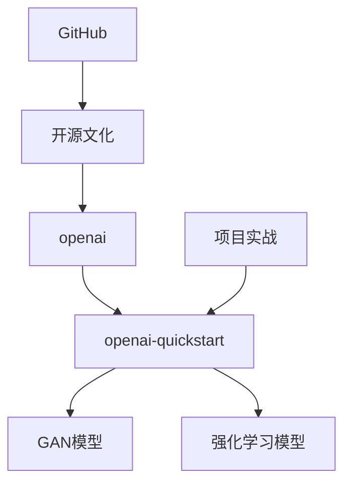
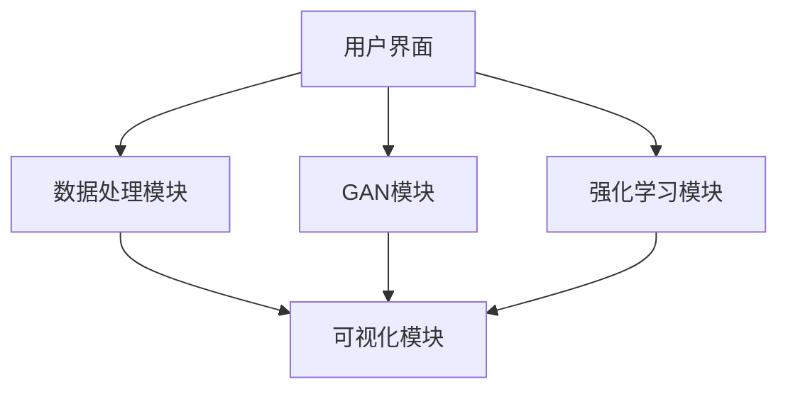
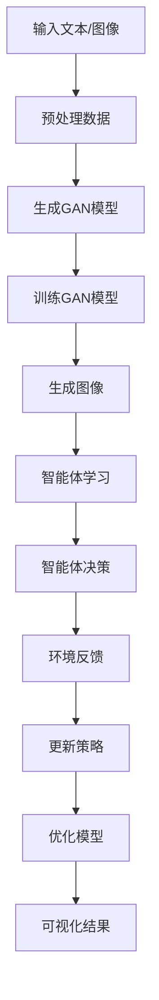

                 

### 《课程项目：GitHub openai-quickstart》

#### 关键词：GitHub，开源项目，openai，GAN，强化学习，项目实战

> **摘要：**本文旨在通过详细的步骤分析，探讨GitHub上的openai-quickstart项目。我们将深入探讨GitHub的开源文化及其在学术与工业中的应用，解析openai-quickstart项目的结构和核心算法，逐步搭建开发环境，实现项目代码，并进行分析与优化。最后，我们将探讨项目的应用扩展和未来研究方向。读者将了解到如何从零开始，逐步实现一个基于GAN和强化学习的开源项目。

---

### 《课程项目：GitHub openai-quickstart》目录大纲

#### 第一部分：GitHub与开源项目概述

- **第1章: GitHub与开源文化**
  - **1.1 GitHub平台介绍**
    - **1.1.1 GitHub的历史与发展**
    - **1.1.2 GitHub的功能与特点**
    - **1.1.3 开源文化的核心价值**
  - **1.2 GitHub在学术与工业中的应用**
    - **1.2.1 学术界在GitHub上的应用**
    - **1.2.2 工业界在GitHub上的应用**
    - **1.2.3 开源协作的优势与挑战**
  - **1.3 GitHub上的优秀开源项目案例分析**

#### 第二部分：openai-quickstart项目解析

- **第2章: openai-quickstart项目概览**
  - **2.1 openai简介**
    - **2.1.1 openai的成立与发展**
    - **2.1.2 openai的主要研究方向与成果**
  - **2.2 openai-quickstart项目结构**
    - **2.2.1 项目模块划分与功能**
    - **2.2.2 项目架构图与流程图**
  - **2.3 openai-quickstart项目核心算法与模型**
    - **2.3.1 生成对抗网络(GAN)**
      - **2.3.1.1 GAN的定义与基本结构**
      - **2.3.1.2 GAN的损失函数与优化策略**
    - **2.3.2 强化学习(Reinforcement Learning)**
      - **2.3.2.1 强化学习的基本概念**
      - **2.3.2.2 Q-learning算法详解**

#### 第三部分：openai-quickstart项目实战

- **第3章: 开发环境搭建**
  - **3.1 操作系统选择**
    - **3.1.1 Windows环境配置**
    - **3.1.2 macOS环境配置**
    - **3.1.3 Linux环境配置**
  - **3.2 开发工具安装**
    - **3.2.1 Python环境搭建**
    - **3.2.2 Jupyter Notebook配置**
    - **3.2.3 Git版本控制工具**
- **第4章: 项目代码实现**
  - **4.1 GAN模型代码实现**
    - **4.1.1 GAN模型的伪代码实现**
    - **4.1.2 GAN模型的关键代码解读**
    - **4.1.3 GAN模型的训练与测试**
  - **4.2 强化学习代码实现**
    - **4.2.1 Q-learning算法的伪代码实现**
    - **4.2.2 Q-learning算法的关键代码解读**
    - **4.2.3 强化学习的训练与测试**

#### 第四部分：扩展与深化

- **第5章: 项目调试与优化**
  - **5.1 常见问题的调试**
    - **5.1.1 编译错误与运行错误**
    - **5.1.2 模型训练中的常见问题**
  - **5.2 模型优化策略**
    - **5.2.1 超参数调优方法**
    - **5.2.2 模型结构优化方法**
    - **5.2.3 模型压缩与加速**

#### 第五部分：项目应用与总结

- **第6章: openai-quickstart项目应用扩展**
  - **6.1 图像生成应用**
    - **6.1.1 GAN在图像生成中的应用**
    - **6.1.2 图像生成案例解析**
  - **6.2 自然语言处理应用**
    - **6.2.1 GPT模型在自然语言处理中的应用**
    - **6.2.2 自然语言处理案例解析**

- **第7章: 项目分析与总结**
  - **7.1 项目成果总结**
    - **7.1.1 项目主要贡献**
    - **7.1.2 项目中的创新点**
  - **7.2 未来研究方向**
    - **7.2.1 GAN模型的改进方向**
    - **7.2.2 强化学习在项目中的应用前景**
    - **7.2.3 开源社区的合作与发展**

#### 附录

- **附录 A: openai-quickstart项目资源汇总**
  - **A.1 相关开源库与工具**
  - **A.2 openai官方文档与教程**
  - **A.3 推荐阅读材料与拓展资源**

### 第8章: openai-quickstart项目示例代码与数据集
- **8.1 GAN模型示例代码**
- **8.2 强化学习示例代码**
- **8.3 数据集介绍与获取**

---

#### 核心概念与联系

**Mermaid 流程图：**

---

### 第一部分：GitHub与开源项目概述

#### 第1章: GitHub与开源文化

在当今数字化时代，GitHub已成为全球范围内最受欢迎的代码托管平台之一，其背后的开源文化更是推动了软件工程的发展。本章将介绍GitHub平台的基本概念、功能与特点，探讨开源文化的核心价值，并分析GitHub在学术与工业中的应用。

##### 1.1 GitHub平台介绍

**1.1.1 GitHub的历史与发展**

GitHub成立于2008年，由汤姆·普雷特（Tom Preston-Werner）、克里斯·万尼斯特拉（Chris Wanstrath）和彼得·梅西（Peter Merholz）共同创立。最初，GitHub是一个基于Web的Git版本控制系统，旨在简化软件开发的协作流程。随着时间的发展，GitHub逐渐成为了全球最大的代码托管平台，吸引了无数的开发者、企业和学术机构。

2009年，GitHub引入了拉取请求（Pull Request）功能，极大地改善了代码协作的效率。2010年，GitHub进行了A轮和A+轮融资，进一步扩大了其市场份额。2011年，GitHub被微软收购，成为微软旗下的一个独立品牌，这一举动也标志着开源技术在全球范围内得到了更广泛的认可。

**1.1.2 GitHub的功能与特点**

GitHub拥有以下主要功能与特点：

- **版本控制**：GitHub基于Git，提供高效的版本控制功能，支持分支管理、合并请求和代码审查。
- **项目托管**：用户可以创建项目仓库，存储和管理源代码、文档和资源。
- **协作开发**：GitHub支持多人协作开发，通过拉取请求、评论和代码审查等机制，提高代码质量和协作效率。
- **社区互动**：GitHub拥有庞大的开发者社区，用户可以关注其他开发者、参与讨论和分享知识。
- **代码搜索与分享**：用户可以在GitHub上搜索并获取开源项目代码，也可以分享自己的代码成果。

**1.1.3 开源文化的核心价值**

开源文化是一种以开放性、透明性和共享性为特点的软件开发理念。其核心价值包括：

- **知识共享**：开源项目鼓励开发者共享代码和技术知识，促进了知识的传播和技术的进步。
- **社区协作**：开源项目通过社区协作，汇集了全球开发者的智慧和力量，提高了项目的质量和影响力。
- **透明性**：开源项目的源代码和开发过程公开透明，有助于提高代码质量和项目管理效率。
- **创新驱动**：开源文化鼓励创新，通过竞争和合作，推动了技术的快速发展。

##### 1.2 GitHub在学术与工业中的应用

**1.2.1 学术界在GitHub上的应用**

GitHub在学术界中的应用日益广泛，成为学术研究的重要基础设施。以下是一些典型的应用场景：

- **论文发布与分享**：许多学者将研究成果以代码和文档的形式发布在GitHub上，便于其他研究者获取和验证。
- **数据共享**：GitHub可以用于存储和管理研究数据，提高数据共享和复用效率。
- **工具与库开发**：学者们通过GitHub合作开发实验工具和代码库，为研究提供便利。
- **教学与培训**：GitHub在计算机科学和教育领域中的应用，为教学和实践提供了丰富的资源。

**1.2.2 工业界在GitHub上的应用**

GitHub在工业界的应用同样具有重要意义，许多企业将其作为开发和管理项目的主要平台。以下是一些典型的应用场景：

- **敏捷开发**：GitHub支持敏捷开发模式，通过分支管理、拉取请求和代码审查等机制，提高开发效率和质量。
- **持续集成与部署**：GitHub集成Jenkins、Travis CI等持续集成工具，实现代码自动化测试、构建和部署。
- **开源项目合作**：企业通过GitHub参与开源项目，利用社区资源，降低开发成本，提升产品竞争力。
- **知识管理**：GitHub可以用于企业内部的知识管理和代码共享，提高团队协作效率。

**1.2.3 开源协作的优势与挑战**

开源协作具有显著的优点，但也面临一定的挑战。以下是对其优势和挑战的简要分析：

**优势：**

- **知识共享**：开源协作促进了知识的传播和技术的进步。
- **社区协作**：开源社区汇聚了全球开发者的智慧和力量，提高了项目的质量和影响力。
- **透明性**：开源项目的开发过程公开透明，有助于提高代码质量和项目管理效率。
- **创新驱动**：开源文化鼓励创新，通过竞争和合作，推动了技术的快速发展。

**挑战：**

- **协作效率**：开源项目涉及多个开发者，协调和沟通成本较高。
- **质量保证**：开源项目可能存在代码质量参差不齐、漏洞和安全问题。
- **知识产权**：开源项目涉及知识产权保护问题，需要妥善处理。
- **项目管理**：开源项目可能存在项目方向不确定、进度缓慢等问题。

##### 1.3 GitHub上的优秀开源项目案例分析

**1.3.1 TensorFlow**

TensorFlow是谷歌开发的开源机器学习框架，广泛应用于人工智能领域。GitHub上的TensorFlow项目吸引了大量贡献者，不断更新和改进，为开发者提供了丰富的工具和资源。

**1.3.2 Docker**

Docker是一种开源的应用容器引擎，用于简化应用程序的部署和迁移。GitHub上的Docker项目拥有庞大的用户群体，不断推动容器技术的发展。

**1.3.3 Kubernetes**

Kubernetes是一个开源的容器编排平台，用于自动化部署、扩展和管理容器化应用程序。GitHub上的Kubernetes项目汇聚了全球开发者的智慧和力量，推动了容器技术的发展。

通过上述案例分析，我们可以看到GitHub在开源项目中的重要作用，以及开源协作带来的巨大价值。在接下来的章节中，我们将进一步探讨openai-quickstart项目，分析其结构和核心算法，为读者提供一次深入的技术之旅。

---

### 第二部分：openai-quickstart项目解析

#### 第2章: openai-quickstart项目概览

在深入理解GitHub和开源文化的基础上，本章将详细介绍openai-quickstart项目。我们将首先介绍openai及其发展历程，然后分析openai-quickstart项目的结构、模块划分和功能，并展示项目的架构图与流程图。通过这些分析，读者将能够全面了解openai-quickstart项目的基本情况。

##### 2.1 openai简介

**2.1.1 openai的成立与发展**

openai是一家成立于2015年的美国人工智能研究公司，其宗旨是通过研究人工智能，推动人类社会的发展。openai由山姆·阿尔特曼（Sam Altman）和伊隆·马斯克（Elon Musk）等人共同创立，初始资金达1亿美元。公司旨在通过开源技术和协作研究，推动人工智能的进步，并使其造福全人类。

自成立以来，openai在人工智能领域取得了显著成就，其研究领域涵盖了自然语言处理、计算机视觉、强化学习等多个方面。以下是一些openai的主要研究方向和成果：

- **自然语言处理**：openai开发了GPT-3等强大的自然语言处理模型，这些模型在语言生成、文本分类、机器翻译等方面表现卓越。
- **计算机视觉**：openai研究了图像识别、物体检测和图像生成等技术，开发出如DALL-E等具有高度创造力的模型。
- **强化学习**：openai在强化学习领域取得了多项突破，如开发出AlphaGo等具有高水平的智能体。

**2.1.2 openai的主要研究方向与成果**

openai在人工智能领域的多项研究具有深远的影响。以下是一些值得关注的成果：

- **GPT系列模型**：GPT（Generative Pre-trained Transformer）系列模型是openai在自然语言处理领域的重要成果。GPT-3是当前最大的自然语言处理模型，具有超过1750亿个参数，能够进行文本生成、对话系统等多种任务。
- **DALL-E**：DALL-E是一种基于生成对抗网络（GAN）的模型，能够根据文本描述生成逼真的图像，展示了图像生成技术的巨大潜力。
- **人类反馈强化学习**：openai开发了人类反馈强化学习（Human Feedback Reinforcement Learning）技术，通过人类提供的反馈不断优化智能体的行为，提高了智能体在复杂环境中的学习能力。

##### 2.2 openai-quickstart项目结构

**2.2.1 项目模块划分与功能**

openai-quickstart项目是一个基于生成对抗网络（GAN）和强化学习的开源项目，旨在提供一套易于上手和扩展的工具和资源，帮助开发者实现和应用人工智能技术。项目的主要模块包括：

- **GAN模块**：负责实现生成对抗网络，用于图像生成、数据增强等任务。
- **强化学习模块**：实现Q-learning算法，用于智能体在环境中的学习与决策。
- **数据处理模块**：提供数据预处理和加载功能，包括图像和序列数据的处理。
- **可视化模块**：展示模型训练过程和结果，便于开发者分析和优化模型。

**2.2.2 项目架构图与流程图**

为了更好地理解openai-quickstart项目的结构和功能，我们可以通过以下架构图和流程图来展示：

**架构图：**

**流程图：**

**2.2.3 openai-quickstart项目的核心算法与模型**

openai-quickstart项目主要依赖于两种核心算法：生成对抗网络（GAN）和强化学习（Reinforcement Learning）。以下是这两个算法的基本概念和原理：

**生成对抗网络（GAN）：**

生成对抗网络（GAN）是一种由生成器和判别器组成的深度学习模型。生成器的目标是生成与真实数据相似的数据，而判别器的目标是区分真实数据和生成数据。通过对抗训练，生成器和判别器相互提升，最终生成器能够生成高度逼真的数据。

**强化学习（Reinforcement Learning）：**

强化学习是一种通过与环境交互学习最优策略的机器学习范式。智能体在环境中执行动作，根据环境的反馈调整其行为，以实现最大化累积奖励的目标。Q-learning是强化学习的一种常见算法，通过迭代更新Q值表，智能体能够在不同状态下选择最佳动作。

通过以上对openai-quickstart项目的介绍，读者应该对项目的整体结构和核心算法有了基本了解。在接下来的章节中，我们将逐步搭建开发环境，实现项目代码，并深入分析GAN和强化学习算法，为读者提供一次全面的技术实践。

---

### 第三部分：openai-quickstart项目实战

#### 第3章: 开发环境搭建

在深入了解了openai-quickstart项目的结构和核心算法之后，接下来我们需要搭建开发环境。开发环境的选择和配置对于项目的顺利实施至关重要。本节将详细讨论不同操作系统的环境配置过程，介绍所需的开发工具和深度学习框架的安装，为后续的代码实现和调试奠定基础。

##### 3.1 操作系统选择

在进行开发环境搭建时，选择一个适合的操作系

