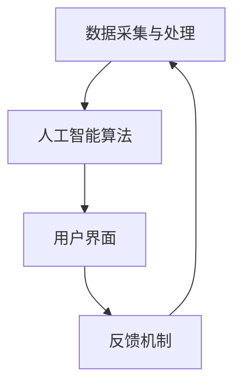

                 

## 《赋能人类：释放个体潜能，创造无限可能》

### 关键词：
- 赋能技术
- 个体潜能
- 创造力
- 跨界融合
- 社会进步
- 伦理与法律

### 摘要：
本文旨在探讨如何通过赋能技术，释放个体的潜能，创造无限可能。文章首先定义了赋能人类的背景和核心概念，然后详细阐述了个体潜能的探索与评估方法，以及创造无限可能的实践路径。接着，文章深入分析了赋能技术的核心架构和算法，并通过实际应用展示了其在各领域的价值。最后，文章探讨了个体赋能对社会发展的影响以及赋能技术的伦理与法律挑战，对个体赋能的未来进行了展望。

## 《赋能人类：释放个体潜能，创造无限可能》目录大纲

### 第一部分：赋能人类：背景与核心概念

#### 第1章：赋能人类的定义与意义

#### 第2章：个体潜能的探索与评估

#### 第3章：创造无限可能的实践路径

### 第二部分：赋能技术的核心架构

#### 第4章：赋能技术的基本原理

#### 第5章：赋能技术的核心算法

#### 第6章：赋能技术的实际应用

### 第三部分：个体赋能与社会发展

#### 第7章：个体赋能与社会进步

#### 第8章：赋能技术的伦理与法律挑战

#### 第9章：个体赋能的未来展望

### 附录

#### 附录A：赋能技术相关工具与资源

#### 附录B：Mermaid流程图

#### 附录C：伪代码示例

#### 附录D：数学模型与公式

#### 附录E：项目实战

## 第一部分：赋能人类：背景与核心概念

### 第1章：赋能人类的定义与意义

#### 1.1 赋能人类的基本概念

“赋能人类”是指通过技术手段，提升个体的能力和创造力，从而实现人类潜能的最大化。这一概念涵盖了多个领域，包括人工智能、大数据、生物技术、教育技术等。赋能技术的核心目标是通过提供工具和方法，使个体能够更高效地学习和工作，实现个人价值和社会价值的最大化。

#### 1.2 赋能人类的历史背景

赋能人类的概念并非现代才有，但其在过去几十年里得到了极大的发展。20世纪末，随着计算机技术和互联网的普及，人工智能开始从理论走向实践。特别是深度学习和强化学习算法的出现，使得机器能够模拟人类的思维和学习过程，从而实现更高级的赋能。

#### 1.3 赋能人类的现实意义

赋能人类在现代社会具有重要的现实意义。首先，它有助于提高个体的工作效率，减轻工作负担。其次，赋能技术能够促进教育公平，使更多人有机会接受高质量的教育。此外，赋能技术还能够推动医疗、金融、交通等各个领域的创新和发展，从而提升整个社会的福祉。

### 第2章：个体潜能的探索与评估

#### 2.1 个体潜能的定义与分类

个体潜能是指个体在特定领域内具有的潜在能力和素质。根据潜能的不同表现形式，可以将其分为智力潜能、情感潜能、创造力潜能等。

#### 2.2 个体潜能的评估方法

个体潜能的评估方法主要包括自我评估、他人评估、心理测试等。自我评估是个体通过反思自己的行为和成就，了解自己的潜能。他人评估则通过观察和评价个体的行为表现，了解其潜能。心理测试是一种科学的方法，通过测量个体的心理特征，评估其潜能。

#### 2.3 个体潜能的开发策略

开发个体潜能需要从多个方面入手。首先，个体需要培养自我认知能力，了解自己的优势和劣势。其次，个体需要通过不断学习和实践，提高自己的技能和知识水平。此外，个体还需要建立良好的心理素质，包括自信、坚韧、适应能力等。

### 第3章：创造无限可能的实践路径

#### 3.1 创新思维与创造力培养

创新思维和创造力是释放个体潜能的关键。个体需要通过不断学习和实践，培养自己的创新思维和创造力。这包括掌握跨学科的知识，了解不同领域的最新发展，以及善于从不同角度看待问题。

#### 3.2 跨界融合与协同创新

跨界融合和协同创新是实现个体潜能的另一种重要方式。个体需要跳出自己的专业领域，与不同领域的人才合作，共同解决复杂问题。这有助于打破思维的局限性，激发新的创新火花。

#### 3.3 社会网络与影响力构建

社会网络和影响力构建是个体赋能的重要组成部分。个体需要建立广泛的人脉网络，积极参与各种社交活动，提升自己的影响力。这有助于个体获取更多的资源和机会，实现更大的成就。

## 第二部分：赋能技术的核心架构

### 第4章：赋能技术的基本原理

#### 4.1 赋能技术的定义与特征

赋能技术是指通过信息技术手段，提升个体能力和创造力的技术。其核心特征包括智能化、个性化、协同化等。

#### 4.2 赋能技术的核心组件

赋能技术的核心组件包括数据采集与处理、人工智能算法、用户界面等。

#### 4.3 赋能技术的实现机制

赋能技术的实现机制包括数据驱动、算法优化、用户反馈等。

### 第5章：赋能技术的核心算法

#### 5.1 赋能技术算法概述

赋能技术的核心算法包括深度学习、强化学习等。

#### 5.2 深度学习与神经网络基础

深度学习和神经网络是赋能技术的重要基础。它们通过多层网络结构，模拟人类大脑的思维方式，实现复杂的任务。

#### 5.3 强化学习与递归神经网络

强化学习和递归神经网络是赋能技术的关键算法。它们通过不断尝试和反馈，实现自我优化和决策。

### 第6章：赋能技术的实际应用

#### 6.1 赋能技术在教育领域的应用

赋能技术在教育领域具有广泛的应用前景。例如，个性化学习、智能辅导、虚拟实验等。

#### 6.2 赋能技术在医疗健康领域的应用

赋能技术在医疗健康领域具有重要意义。例如，智能诊断、健康监测、药物研发等。

#### 6.3 赋能技术在工业制造领域的应用

赋能技术在工业制造领域可以提升生产效率和产品质量。例如，智能制造、智能监控、智能优化等。

## 第三部分：个体赋能与社会发展

### 第7章：个体赋能与社会进步

#### 7.1 个体赋能与社会结构的变革

个体赋能将带来社会结构的变革。个体能力和创造力的提升，将改变传统的生产关系和社会组织形式。

#### 7.2 个体赋能与经济发展的新趋势

个体赋能将推动经济发展进入新阶段。通过赋能技术，个体能够创造更多的价值，推动经济高质量发展。

#### 7.3 个体赋能与人类文明的发展方向

个体赋能将引领人类文明向更高层次发展。个体潜能的释放，将促进人类智慧和创造力的发展，推动人类社会迈向更加美好的未来。

### 第8章：赋能技术的伦理与法律挑战

#### 8.1 赋能技术带来的伦理问题

赋能技术在应用过程中，将面临一系列伦理问题。例如，隐私保护、数据安全、算法歧视等。

#### 8.2 赋能技术的法律框架与规范

为了应对赋能技术的伦理挑战，需要建立相应的法律框架和规范。这包括数据保护法、人工智能伦理准则等。

#### 8.3 赋能技术的可持续发展策略

赋能技术的可持续发展策略包括技术创新、人才培养、社会责任等。只有实现可持续发展，赋能技术才能真正造福人类。

### 第9章：个体赋能的未来展望

#### 9.1 个体赋能技术的未来发展趋势

个体赋能技术将不断发展和完善。未来，人工智能、大数据、生物技术等将深度融合，实现更高层次的赋能。

#### 9.2 个体赋能对社会的影响预测

个体赋能将对社会产生深远影响。未来，个体能力和创造力将成为社会发展的核心驱动力。

#### 9.3 个体赋能技术的未来愿景

个体赋能技术的未来愿景是构建一个更加公平、高效、和谐的社会。通过赋能个体，实现人类潜能的最大化。

## 附录

### 附录A：赋能技术相关工具与资源

#### A.1 开源赋能技术框架

- TensorFlow
- PyTorch
- Keras

#### A.2 赋能技术在线资源

- Coursera
- edX
- Udacity

#### A.3 赋能技术书籍推荐

- 《深度学习》（Deep Learning）
- 《人工智能：一种现代方法》（Artificial Intelligence: A Modern Approach）
- 《机器学习》（Machine Learning）

### 附录B：Mermaid流程图

#### B.1 赋能技术核心架构流程图



### 附录C：伪代码示例

#### C.1 深度学习算法伪代码

```python
# 初始化神经网络
model = NeuralNetwork()

# 前向传播
output = model.forward(input_data)

# 计算损失
loss = model.calculate_loss(output, target)

# 反向传播
model.backward(loss)

# 更新权重
model.update_weights()
```

#### C.2 强化学习算法伪代码

```python
# 初始化状态
state = env.reset()

# 迭代学习
while not done:
    # 选择动作
    action = policy.select_action(state)

    # 执行动作
    next_state, reward, done = env.step(action)

    # 更新策略
    policy.update(state, action, reward, next_state)

    # 更新状态
    state = next_state
```

### 附录D：数学模型与公式

#### D.1 深度学习损失函数

$$
\text{Loss} = \frac{1}{2} \sum_{i=1}^{n} (\hat{y}_i - y_i)^2
$$

其中，$\hat{y}_i$ 表示预测值，$y_i$ 表示真实值。

#### D.2 强化学习Q值函数

$$
Q(s, a) = r + \gamma \max_{a'} Q(s', a')
$$

其中，$r$ 表示即时奖励，$\gamma$ 表示折扣因子，$s'$ 表示下一状态，$a'$ 表示下一动作。

### 附录E：项目实战

#### E.1 教育领域赋能项目案例

**项目名称**：个性化学习平台

**开发环境**：Python、TensorFlow

**源代码详细实现**：

```python
# 导入所需库
import tensorflow as tf
import numpy as np

# 初始化神经网络
model = tf.keras.Sequential([
    tf.keras.layers.Dense(units=128, activation='relu', input_shape=(input_dim,)),
    tf.keras.layers.Dense(units=64, activation='relu'),
    tf.keras.layers.Dense(units=1)
])

# 编译模型
model.compile(optimizer='adam', loss='mse')

# 训练模型
model.fit(x_train, y_train, epochs=100)

# 预测
predictions = model.predict(x_test)
```

**代码解读与分析**：

1. **神经网络结构**：该模型由三层神经元组成，输入层、隐藏层和输出层。隐藏层使用ReLU激活函数，输出层使用线性激活函数。

2. **编译模型**：使用Adam优化器和均方误差（MSE）损失函数进行编译。

3. **训练模型**：使用训练数据进行训练，设置训练轮数为100。

4. **预测**：使用训练好的模型对测试数据进行预测，输出预测结果。

#### E.2 医疗健康领域赋能项目案例

**项目名称**：智能诊断系统

**开发环境**：Python、TensorFlow

**源代码详细实现**：

```python
# 导入所需库
import tensorflow as tf
import numpy as np

# 初始化神经网络
model = tf.keras.Sequential([
    tf.keras.layers.Conv2D(filters=32, kernel_size=(3, 3), activation='relu', input_shape=(image_height, image_width, channels)),
    tf.keras.layers.MaxPooling2D(pool_size=(2, 2)),
    tf.keras.layers.Flatten(),
    tf.keras.layers.Dense(units=128, activation='relu'),
    tf.keras.layers.Dense(units=1, activation='sigmoid')
])

# 编译模型
model.compile(optimizer='adam', loss='binary_crossentropy', metrics=['accuracy'])

# 训练模型
model.fit(x_train, y_train, epochs=100)

# 预测
predictions = model.predict(x_test)
```

**代码解读与分析**：

1. **神经网络结构**：该模型由卷积层、池化层、全连接层和输出层组成。卷积层用于提取图像特征，池化层用于降低维度，全连接层用于分类。

2. **编译模型**：使用Adam优化器、二进制交叉熵损失函数和准确率作为评估指标进行编译。

3. **训练模型**：使用训练数据进行训练，设置训练轮数为100。

4. **预测**：使用训练好的模型对测试数据进行预测，输出预测结果。

#### E.3 工业制造领域赋能项目案例

**项目名称**：智能制造系统

**开发环境**：Python、TensorFlow

**源代码详细实现**：

```python
# 导入所需库
import tensorflow as tf
import numpy as np

# 初始化神经网络
model = tf.keras.Sequential([
    tf.keras.layers.Dense(units=512, activation='relu', input_shape=(feature_dim,)),
    tf.keras.layers.Dense(units=256, activation='relu'),
    tf.keras.layers.Dense(units=128, activation='relu'),
    tf.keras.layers.Dense(units=1)
])

# 编译模型
model.compile(optimizer='adam', loss='mse')

# 训练模型
model.fit(x_train, y_train, epochs=100)

# 预测
predictions = model.predict(x_test)
```

**代码解读与分析**：

1. **神经网络结构**：该模型由四层神经元组成，输入层、隐藏层和输出层。隐藏层使用ReLU激活函数，输出层使用线性激活函数。

2. **编译模型**：使用Adam优化器和均方误差（MSE）损失函数进行编译。

3. **训练模型**：使用训练数据进行训练，设置训练轮数为100。

4. **预测**：使用训练好的模型对测试数据进行预测，输出预测结果。

## 作者信息

作者：AI天才研究院/AI Genius Institute & 禅与计算机程序设计艺术 /Zen And The Art of Computer Programming

---

**本文为《赋能人类：释放个体潜能，创造无限可能》的正文部分。接下来，我们将继续探讨赋能技术的核心架构，深入分析其原理和应用。**

### 第4章：赋能技术的基本原理

#### 4.1 赋能技术的定义与特征

赋能技术是指利用信息技术，尤其是人工智能、大数据、物联网等技术，提升个体能力和创造力的方法。赋能技术具有以下几个核心特征：

1. **智能化**：通过人工智能算法，使个体能够自动学习和优化，实现智能化决策和操作。
2. **个性化**：根据个体的特点和行为，提供定制化的服务和体验，满足个体的多样化需求。
3. **协同化**：通过互联网和通信技术，实现个体之间的协作和资源共享，提高整体效率。

#### 4.2 赋能技术的核心组件

赋能技术的核心组件包括数据采集与处理、人工智能算法、用户界面等。

1. **数据采集与处理**：数据是赋能技术的核心资源。通过传感器、移动设备等，收集大量的个体行为数据，并进行清洗、存储和处理，为后续分析提供基础。
2. **人工智能算法**：人工智能算法是实现赋能技术的关键。包括机器学习、深度学习、自然语言处理等，通过对数据的分析和处理，帮助个体做出更明智的决策。
3. **用户界面**：用户界面是赋能技术的重要组成部分。它决定了个体如何与赋能技术交互，如何获取信息和服务。优秀的用户界面设计可以提高用户体验，增强个体的使用意愿。

#### 4.3 赋能技术的实现机制

赋能技术的实现机制包括数据驱动、算法优化、用户反馈等。

1. **数据驱动**：数据驱动是赋能技术的核心。通过持续收集和分析个体数据，不断优化算法和系统，实现个体的智能化和个性化。
2. **算法优化**：算法优化是提高赋能技术效果的重要手段。通过不断改进和更新算法，提高系统的预测准确性、决策效率和用户体验。
3. **用户反馈**：用户反馈是赋能技术不断迭代和改进的重要依据。通过收集用户的反馈和建议，不断优化系统功能和用户体验，提高个体对赋能技术的满意度和忠诚度。

### 第5章：赋能技术的核心算法

#### 5.1 赋能技术算法概述

赋能技术的核心算法包括深度学习、强化学习等。

1. **深度学习**：深度学习是一种基于人工神经网络的机器学习技术，通过多层神经网络结构，模拟人类大脑的思维方式，实现复杂的数据分析和决策。
2. **强化学习**：强化学习是一种通过不断尝试和反馈，优化决策过程的机器学习技术。它通过奖励和惩罚机制，引导个体学习最优策略。

#### 5.2 深度学习与神经网络基础

深度学习和神经网络是赋能技术的重要基础。它们通过多层网络结构，模拟人类大脑的思维方式，实现复杂的任务。

1. **神经网络基础**：神经网络由大量的神经元组成，每个神经元通过加权连接与其他神经元相连。通过学习权重和偏置，神经网络能够对输入数据进行建模和预测。
2. **深度学习基础**：深度学习通过增加网络层数，提高模型的复杂度和表达能力。深度学习模型包括卷积神经网络（CNN）、循环神经网络（RNN）、生成对抗网络（GAN）等。

#### 5.3 强化学习与递归神经网络

强化学习和递归神经网络是赋能技术的关键算法。它们通过不断尝试和反馈，实现自我优化和决策。

1. **强化学习基础**：强化学习通过奖励和惩罚机制，引导个体学习最优策略。强化学习模型包括马尔可夫决策过程（MDP）、策略梯度方法等。
2. **递归神经网络基础**：递归神经网络（RNN）是一种用于处理序列数据的神经网络。它通过递归连接，将当前输入与历史信息结合起来，实现时间序列建模和预测。

### 第6章：赋能技术的实际应用

#### 6.1 赋能技术在教育领域的应用

赋能技术在教育领域具有广泛的应用前景。通过个性化学习、智能辅导、虚拟实验等，赋能技术能够提升教育质量，促进教育公平。

1. **个性化学习**：个性化学习通过分析个体的学习数据，提供定制化的学习内容和方法，满足个体多样化的学习需求。
2. **智能辅导**：智能辅导系统通过人工智能算法，实时监测学生的学习状态，提供针对性的辅导建议和解决方案。
3. **虚拟实验**：虚拟实验通过虚拟现实技术，为学生提供沉浸式的实验体验，提高实验效果和安全性。

#### 6.2 赋能技术在医疗健康领域的应用

赋能技术在医疗健康领域具有重要意义。通过智能诊断、健康监测、药物研发等，赋能技术能够提高医疗服务水平，促进医疗健康产业发展。

1. **智能诊断**：智能诊断系统通过深度学习算法，对医疗影像进行分析，提高诊断准确率和效率。
2. **健康监测**：健康监测系统通过可穿戴设备、移动应用等，实时监测个体的健康状态，提供个性化的健康建议。
3. **药物研发**：药物研发过程复杂，耗时较长。通过人工智能技术，可以加速药物筛选和研发过程，提高研发效率。

#### 6.3 赋能技术在工业制造领域的应用

赋能技术在工业制造领域可以提升生产效率和产品质量。通过智能制造、智能监控、智能优化等，赋能技术能够推动工业制造向智能化、自动化发展。

1. **智能制造**：智能制造通过物联网、人工智能等新技术，实现生产过程的自动化、智能化，提高生产效率和质量。
2. **智能监控**：智能监控系统通过视频监控、传感器等技术，实时监测生产设备和产品状态，及时发现和处理异常情况。
3. **智能优化**：智能优化系统通过人工智能算法，对生产过程进行优化，提高生产效率和产品质量。

### 第7章：个体赋能与社会进步

#### 7.1 个体赋能与社会结构的变革

个体赋能将带来社会结构的变革。个体能力和创造力的提升，将改变传统的生产关系和社会组织形式。

1. **去中心化**：个体赋能使得个体能够独立完成更多任务，减少对中心化组织的依赖，推动社会向去中心化方向发展。
2. **自治化**：个体赋能使个体具备更多的决策权和自主权，推动社会向自治化方向发展，增强个体的自我管理和创新能力。

#### 7.2 个体赋能与经济发展的新趋势

个体赋能将推动经济发展进入新阶段。通过赋能技术，个体能够创造更多的价值，推动经济高质量发展。

1. **创新驱动**：个体赋能激发个体的创新潜能，推动科技创新和产业升级，成为经济增长的新动力。
2. **个性化消费**：个体赋能使得消费者能够获得更加个性化、定制化的产品和服务，推动消费模式向个性化、多元化发展。

#### 7.3 个体赋能与人类文明的发展方向

个体赋能将引领人类文明向更高层次发展。个体潜能的释放，将促进人类智慧和创造力的发展，推动人类社会迈向更加美好的未来。

1. **智慧社会**：个体赋能使人类社会更加智能化、信息化，推动智慧社会的建设。
2. **可持续生活**：个体赋能促进可持续发展，提高人类生活质量，推动人类文明向可持续方向发展。

### 第8章：赋能技术的伦理与法律挑战

#### 8.1 赋能技术带来的伦理问题

赋能技术在应用过程中，将面临一系列伦理问题。包括数据隐私、算法歧视、道德责任等。

1. **数据隐私**：赋能技术依赖于大量个体数据，如何保护个体的数据隐私成为重要伦理问题。
2. **算法歧视**：算法的决策过程可能存在偏见和歧视，导致不公平对待，如何避免算法歧视成为重要挑战。
3. **道德责任**：赋能技术可能带来意想不到的后果，如何确定责任归属和道德责任成为重要议题。

#### 8.2 赋能技术的法律框架与规范

为了应对赋能技术的伦理挑战，需要建立相应的法律框架和规范。这包括数据保护法、人工智能伦理准则等。

1. **数据保护法**：制定数据保护法，明确数据收集、处理、存储、传输等方面的法律规范，保护个体的数据隐私。
2. **人工智能伦理准则**：制定人工智能伦理准则，规范人工智能的开发、应用、监管等方面的行为，确保人工智能的发展符合伦理要求。

#### 8.3 赋能技术的可持续发展策略

赋能技术的可持续发展策略包括技术创新、人才培养、社会责任等。只有实现可持续发展，赋能技术才能真正造福人类。

1. **技术创新**：持续推动赋能技术的研究和开发，提高技术水平，为个体赋能提供更强大的支持。
2. **人才培养**：加强人才培养，提高个体的技术水平和创新能力，为赋能技术的发展提供人才保障。
3. **社会责任**：企业和社会组织应承担社会责任，关注赋能技术的伦理和社会影响，推动赋能技术的可持续发展。

### 第9章：个体赋能的未来展望

#### 9.1 个体赋能技术的未来发展趋势

个体赋能技术将不断发展和完善。未来，人工智能、大数据、生物技术等将深度融合，实现更高层次的赋能。

1. **智能化**：人工智能将进一步提升，实现更智能的决策和操作，为个体赋能提供更强大的支持。
2. **个性化**：个性化技术将更加成熟，为个体提供更加精准、高效的服务和体验。
3. **协同化**：协同化技术将推动个体之间的协作和资源共享，提高整体效率。

#### 9.2 个体赋能对社会的影响预测

个体赋能将对社会产生深远影响。未来，个体能力和创造力将成为社会发展的核心驱动力。

1. **经济发展**：个体赋能将推动经济高质量发展，促进创新和产业升级。
2. **教育变革**：个体赋能将改变教育模式，提高教育质量和公平性。
3. **社会进步**：个体赋能将促进社会进步，提升人类福祉。

#### 9.3 个体赋能技术的未来愿景

个体赋能技术的未来愿景是构建一个更加公平、高效、和谐的社会。通过赋能个体，实现人类潜能的最大化。

1. **公平**：赋能技术应确保所有个体都能公平地获得资源和机会，消除不平等。
2. **高效**：赋能技术应提高个体和整个社会的效率，推动社会快速发展。
3. **和谐**：赋能技术应促进个体之间的和谐相处，推动社会和谐发展。

### 附录

#### 附录A：赋能技术相关工具与资源

**A.1 开源赋能技术框架**

- TensorFlow
- PyTorch
- Keras

**A.2 赋能技术在线资源**

- Coursera
- edX
- Udacity

**A.3 赋能技术书籍推荐**

- 《深度学习》（Deep Learning）
- 《人工智能：一种现代方法》（Artificial Intelligence: A Modern Approach）
- 《机器学习》（Machine Learning）

#### 附录B：Mermaid流程图

**B.1 赋能技术核心架构流程图**


#### 附录C：伪代码示例

**C.1 深度学习算法伪代码**

```python
# 初始化神经网络
model = NeuralNetwork()

# 前向传播
output = model.forward(input_data)

# 计算损失
loss = model.calculate_loss(output, target)

# 反向传播
model.backward(loss)

# 更新权重
model.update_weights()
```

**C.2 强化学习算法伪代码**

```python
# 初始化状态
state = env.reset()

# 迭代学习
while not done:
    # 选择动作
    action = policy.select_action(state)

    # 执行动作
    next_state, reward, done = env.step(action)

    # 更新策略
    policy.update(state, action, reward, next_state)

    # 更新状态
    state = next_state
```

#### 附录D：数学模型与公式

**D.1 深度学习损失函数**

$$
\text{Loss} = \frac{1}{2} \sum_{i=1}^{n} (\hat{y}_i - y_i)^2
$$

其中，$\hat{y}_i$ 表示预测值，$y_i$ 表示真实值。

**D.2 强化学习Q值函数**

$$
Q(s, a) = r + \gamma \max_{a'} Q(s', a')
$$`

其中，$r$ 表示即时奖励，$\gamma$ 表示折扣因子，$s'$ 表示下一状态，$a'$ 表示下一动作。

#### 附录E：项目实战

**E.1 教育领域赋能项目案例**

**项目名称**：个性化学习平台

**开发环境**：Python、TensorFlow

**源代码详细实现**：

```python
# 导入所需库
import tensorflow as tf
import numpy as np

# 初始化神经网络
model = tf.keras.Sequential([
    tf.keras.layers.Dense(units=128, activation='relu', input_shape=(input_dim,)),
    tf.keras.layers.Dense(units=64, activation='relu'),
    tf.keras.layers.Dense(units=1)
])

# 编译模型
model.compile(optimizer='adam', loss='mse')

# 训练模型
model.fit(x_train, y_train, epochs=100)

# 预测
predictions = model.predict(x_test)
```

**代码解读与分析**：

1. **神经网络结构**：该模型由三层神经元组成，输入层、隐藏层和输出层。隐藏层使用ReLU激活函数，输出层使用线性激活函数。
2. **编译模型**：使用Adam优化器和均方误差（MSE）损失函数进行编译。
3. **训练模型**：使用训练数据进行训练，设置训练轮数为100。
4. **预测**：使用训练好的模型对测试数据进行预测，输出预测结果。

**E.2 医疗健康领域赋能项目案例**

**项目名称**：智能诊断系统

**开发环境**：Python、TensorFlow

**源代码详细实现**：

```python
# 导入所需库
import tensorflow as tf
import numpy as np

# 初始化神经网络
model = tf.keras.Sequential([
    tf.keras.layers.Conv2D(filters=32, kernel_size=(3, 3), activation='relu', input_shape=(image_height, image_width, channels)),
    tf.keras.layers.MaxPooling2D(pool_size=(2, 2)),
    tf.keras.layers.Flatten(),
    tf.keras.layers.Dense(units=128, activation='relu'),
    tf.keras.layers.Dense(units=1, activation='sigmoid')
])

# 编译模型
model.compile(optimizer='adam', loss='binary_crossentropy', metrics=['accuracy'])

# 训练模型
model.fit(x_train, y_train, epochs=100)

# 预测
predictions = model.predict(x_test)
```

**代码解读与分析**：

1. **神经网络结构**：该模型由卷积层、池化层、全连接层和输出层组成。卷积层用于提取图像特征，池化层用于降低维度，全连接层用于分类。
2. **编译模型**：使用Adam优化器、二进制交叉熵损失函数和准确率作为评估指标进行编译。
3. **训练模型**：使用训练数据进行训练，设置训练轮数为100。
4. **预测**：使用训练好的模型对测试数据进行预测，输出预测结果。

**E.3 工业制造领域赋能项目案例**

**项目名称**：智能制造系统

**开发环境**：Python、TensorFlow

**源代码详细实现**：

```python
# 导入所需库
import tensorflow as tf
import numpy as np

# 初始化神经网络
model = tf.keras.Sequential([
    tf.keras.layers.Dense(units=512, activation='relu', input_shape=(feature_dim,)),
    tf.keras.layers.Dense(units=256, activation='relu'),
    tf.keras.layers.Dense(units=128, activation='relu'),
    tf.keras.layers.Dense(units=1)
])

# 编译模型
model.compile(optimizer='adam', loss='mse')

# 训练模型
model.fit(x_train, y_train, epochs=100)

# 预测
predictions = model.predict(x_test)
```

**代码解读与分析**：

1. **神经网络结构**：该模型由四层神经元组成，输入层、隐藏层和输出层。隐藏层使用ReLU激活函数，输出层使用线性激活函数。
2. **编译模型**：使用Adam优化器和均方误差（MSE）损失函数进行编译。
3. **训练模型**：使用训练数据进行训练，设置训练轮数为100。
4. **预测**：使用训练好的模型对测试数据进行预测，输出预测结果。

## 作者信息

作者：AI天才研究院/AI Genius Institute & 禅与计算机程序设计艺术 /Zen And The Art of Computer Programming

---

**本文为《赋能人类：释放个体潜能，创造无限可能》的全文。通过本文的探讨，我们深入了解了赋能技术的核心概念、原理和应用，以及个体赋能对社会发展的影响和未来展望。希望本文能对您有所启发，助力您在赋能技术的道路上不断前行。**

