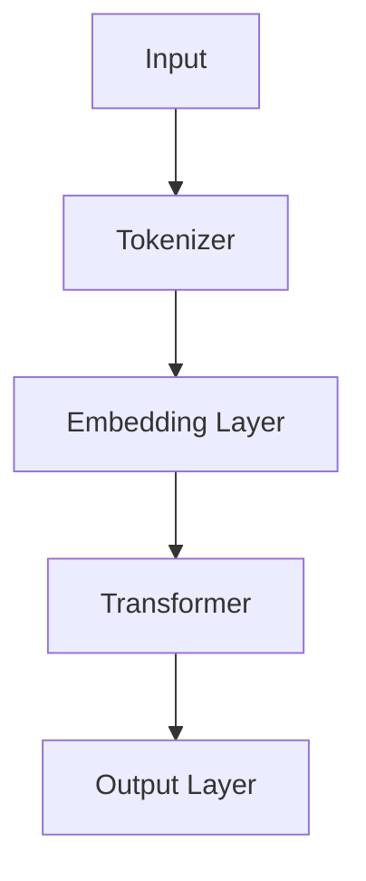
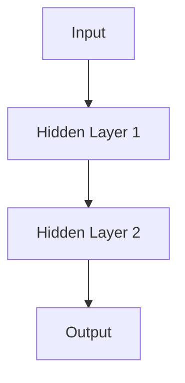
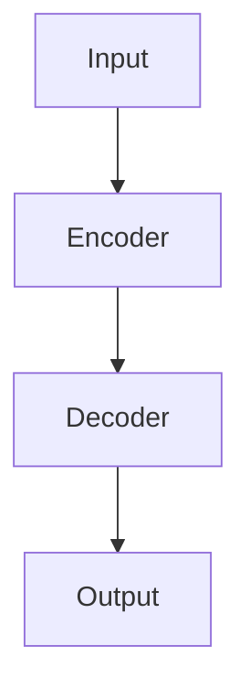

                 

## 文章标题

《软件 2.0 的哲学思考：人工智能的本质》

### 关键词：软件2.0，人工智能，大模型，深度学习，自然语言处理，计算机视觉，推荐系统，金融领域，开发工具与框架

### 摘要：
本文从软件2.0的哲学视角出发，深入探讨了人工智能（AI）的本质及其在各个领域的应用。通过对AI大模型、深度学习、自然语言处理、计算机视觉等技术的详细分析，本文揭示了AI大模型在软件2.0时代的重要地位。文章还探讨了AI大模型在企业级应用、自然语言处理、计算机视觉、推荐系统和金融领域中的应用前景，以及开发与优化AI大模型的方法和策略。本文旨在为读者提供一个全面、系统的AI大模型学习和应用指南。

----------------------------------------------------------------

## 第一部分：软件2.0时代的AI大模型基础

### 第1章：软件2.0与AI大模型概述

### 1.1 从软件1.0到软件2.0的演进

在探讨软件2.0与AI大模型的关系之前，我们需要先回顾一下软件的发展历程。软件1.0时代主要是指早期的编程时代，那时软件开发主要集中在单机应用，软件的功能相对简单，主要以命令行界面和简单的图形界面为主。软件1.0时代的代表作品包括DOS操作系统和早期的Windows应用程序。

随着互联网的兴起和移动设备的普及，软件进入了一个新的阶段——软件2.0时代。软件2.0时代的特点是软件不再只是独立运行在单一设备上，而是通过网络连接形成了一个庞大的生态系统。软件的功能更加丰富，界面也更加友好，用户可以通过浏览器或者移动应用随时随地访问和使用软件。软件2.0时代的代表作品包括Web 2.0应用程序和移动应用程序。

那么，软件2.0与AI大模型之间有什么关系呢？我们可以从以下几个方面来理解：

1. **软件2.0的生态系统需求**：软件2.0时代的软件生态系统需要更强的数据处理能力和智能化的用户体验。AI大模型作为一种强大的数据处理工具，能够满足这些需求。

2. **AI大模型在软件2.0中的角色**：AI大模型在软件2.0中扮演着数据分析和智能决策的核心角色。它能够通过分析用户数据，提供个性化的服务和建议，从而提升用户体验。

3. **软件2.0对AI大模型的需求**：软件2.0时代对AI大模型的需求主要体现在以下几个方面：
    - **大规模数据处理能力**：软件2.0时代的数据量巨大，AI大模型需要具备处理海量数据的能力。
    - **快速响应和高效执行**：软件2.0时代的用户对软件的响应速度和执行效率要求更高，AI大模型需要能够快速处理用户的请求并提供决策。
    - **跨平台和跨设备兼容性**：软件2.0时代需要AI大模型能够在不同的平台和设备上运行，实现无缝对接。

### 1.2 大模型在软件2.0中的核心地位

在软件2.0时代，AI大模型已经成为软件的核心组件，其重要性体现在以下几个方面：

1. **提升数据处理能力**：AI大模型具有强大的数据处理能力，能够处理海量数据，为软件提供更加准确和可靠的数据支持。

2. **实现智能化决策**：AI大模型能够通过分析用户数据，提供个性化的服务和建议，帮助软件实现智能化决策。

3. **优化用户体验**：AI大模型能够根据用户的行为和偏好，提供个性化的内容推荐和用户体验优化，从而提升用户的满意度。

4. **创新业务模式**：AI大模型可以为企业带来新的业务模式，如智能客服、智能推荐等，为企业创造更多的商业价值。

### 1.3 企业级应用开发的新范式

在软件2.0时代，企业级应用开发也出现了一些新的范式。以下是几个典型的例子：

1. **数据驱动开发**：企业级应用开发越来越多地采用数据驱动的方式，通过收集和分析用户数据，指导软件的功能设计和优化。

2. **微服务架构**：微服务架构逐渐成为企业级应用开发的主流，它将大型应用拆分成多个小型服务，提高系统的可维护性和扩展性。

3. **容器化和云计算**：容器化和云计算技术使得企业级应用能够更加灵活地部署和管理，从而提高系统的性能和可靠性。

4. **AI大模型集成**：AI大模型在企业级应用开发中得到了广泛应用，如智能客服、智能推荐、智能风控等，为企业带来更多的业务价值。

### 1.4 本章小结

本章从软件2.0的哲学视角出发，探讨了AI大模型在软件2.0时代的重要地位。我们分析了从软件1.0到软件2.0的演进过程，讨论了AI大模型在软件2.0中的核心地位和企业级应用开发的新范式。通过本章的学习，读者可以了解到AI大模型在软件2.0时代的重要性，以及企业如何利用AI大模型提升业务价值和优化用户体验。

## 第2章：AI大模型的定义与特点

### 2.1 AI大模型的定义

AI大模型，即Artificial Intelligence Large Model，是指那些具有大规模参数的深度学习模型。这些模型通常通过大规模数据集进行预训练，然后通过微调（fine-tuning）来适应特定任务。AI大模型在自然语言处理、计算机视觉、推荐系统等领域取得了显著的成果，成为当前人工智能研究的热点。

### 2.2 AI大模型的核心特点

AI大模型具有以下核心特点：

1. **大规模参数**：AI大模型通常包含数十亿到数千亿个参数，这使得模型具有强大的表征能力和计算能力。

2. **深度神经网络结构**：AI大模型采用深度神经网络（DNN）结构，通过多层神经元的堆叠，实现对数据的深层特征提取。

3. **预训练和微调**：AI大模型通常通过预训练（pre-training）来学习通用特征，然后通过微调（fine-tuning）来适应特定任务。

4. **大规模数据集训练**：AI大模型需要使用大规模数据集进行训练，以获得足够的统计信息，提高模型的泛化能力。

### 2.3 AI大模型与传统AI的区别

与传统AI相比，AI大模型在以下几个方面有显著区别：

1. **规模**：AI大模型具有更大的参数规模，通常包含数十亿到数千亿个参数，而传统AI模型通常只有几千到几万个参数。

2. **算法**：AI大模型采用深度学习算法，尤其是基于神经网络的算法，而传统AI模型通常采用基于规则或统计方法的算法。

3. **数据**：AI大模型需要使用大规模数据集进行训练，而传统AI模型通常只需要使用小规模数据集。

4. **应用**：AI大模型在自然语言处理、计算机视觉、推荐系统等领域取得了显著的成果，而传统AI模型在这些领域的应用相对有限。

### 2.4 本章小结

本章介绍了AI大模型的定义和核心特点，并分析了AI大模型与传统AI的区别。通过本章的学习，读者可以了解AI大模型的基本概念，以及其在人工智能领域的重要地位。

## 第3章：主流AI大模型简介

### 3.1 GPT系列模型

GPT（Generative Pre-trained Transformer）系列模型是自然语言处理领域的重要突破。GPT模型采用Transformer架构，通过大规模预训练来学习语言的基本规律和结构。GPT系列模型包括GPT、GPT-2、GPT-3等多个版本，每个版本都在参数规模和性能上取得了显著提升。

GPT模型的预训练过程主要包括两个阶段：第一阶段是自监督预训练，通过掩码语言模型（Masked Language Model, MLM）来预测掩码的单词；第二阶段是微调，通过有监督的数据集来微调模型，使其适应特定的任务。

GPT模型的架构如图所示：



### 3.2 BERT及其变体

BERT（Bidirectional Encoder Representations from Transformers）模型是另一种重要的自然语言处理模型，其采用双向Transformer架构，通过预训练来学习上下文信息。BERT模型的主要创新之处在于其双向训练策略，可以同时利用正向和反向的输入序列，从而更好地理解上下文。

BERT模型的预训练过程主要包括两个阶段：第一阶段是语料库随机遮蔽（Masked Language Model, MLM）和下一句预测（Next Sentence Prediction, NSP）；第二阶段是有监督的微调，通过有标签的数据集来训练模型。

BERT模型的架构如图所示：


BERT的变体包括RoBERTa、ALBERT等，它们在预训练策略和模型架构上进行了改进，以进一步提高模型的性能。

### 3.3 其他知名大模型介绍

除了GPT和BERT系列模型，还有许多其他知名的大模型，如T5、UniLM等。

T5（Text-To-Text Transfer Transformer）模型是一种通用的文本处理模型，其目标是实现一个统一的模型来处理各种文本任务。T5模型采用Transformer架构，通过大规模预训练来学习文本转换的规则。

UniLM（Unified Language Model）模型是一种多任务语言模型，其目标是将多种语言任务整合到一个统一的模型中。UniLM模型采用Transformer架构，通过预训练来学习多种语言任务的共同特征。

### 3.4 本章小结

本章介绍了主流的AI大模型，包括GPT系列模型、BERT及其变体以及其他知名大模型。通过本章的学习，读者可以了解这些大模型的基本概念、预训练过程和架构，以及它们在自然语言处理领域的应用。

## 第4章：AI大模型在企业中的应用前景

### 4.1 AI大模型的潜在应用领域

AI大模型在企业级应用中具有广泛的潜在领域，以下是其中一些主要的应用领域：

1. **自然语言处理（NLP）**：AI大模型在自然语言处理领域具有强大的能力，可以应用于文本分类、情感分析、机器翻译、问答系统等。例如，企业可以使用AI大模型构建智能客服系统，提高客户服务的质量和效率。

2. **计算机视觉（CV）**：AI大模型在计算机视觉领域同样具有广泛的应用，可以应用于图像分类、目标检测、图像分割等。例如，企业可以使用AI大模型进行产品质量检测，提高生产效率。

3. **推荐系统**：AI大模型在推荐系统领域可以用于个性化推荐、商品推荐等。例如，电商平台可以使用AI大模型推荐用户可能感兴趣的商品，提高用户的购买体验。

4. **金融领域**：AI大模型在金融领域可以用于风险控制、投资策略、信用评分等。例如，金融机构可以使用AI大模型进行信用风险评估，降低贷款风险。

5. **医疗领域**：AI大模型在医疗领域可以用于疾病诊断、药物研发、患者管理等。例如，医院可以使用AI大模型辅助医生进行疾病诊断，提高诊断的准确性。

### 4.2 企业采用AI大模型的优势

企业采用AI大模型具有以下优势：

1. **提升数据处理能力**：AI大模型具有强大的数据处理能力，可以处理海量数据，为企业提供更加准确和可靠的数据支持。

2. **实现智能化决策**：AI大模型能够通过分析用户数据，提供个性化的服务和建议，帮助软件实现智能化决策。

3. **优化用户体验**：AI大模型能够根据用户的行为和偏好，提供个性化的内容推荐和用户体验优化，从而提升用户的满意度。

4. **创新业务模式**：AI大模型可以为企业带来新的业务模式，如智能客服、智能推荐、智能风控等，为企业创造更多的商业价值。

5. **提高运营效率**：AI大模型可以自动化处理大量重复性工作，提高企业的运营效率，降低成本。

### 4.3 AI大模型应用的挑战与机遇

虽然AI大模型在企业级应用中具有广泛的前景和优势，但同时也面临着一些挑战和机遇：

1. **挑战**：
    - **数据隐私**：企业如何保护用户数据隐私是一个重要挑战。
    - **计算资源**：训练和部署AI大模型需要大量的计算资源，对企业的IT基础设施提出了更高的要求。
    - **模型解释性**：AI大模型的决策过程往往是不透明的，如何提高模型的解释性是一个重要问题。
    - **算法公平性**：如何避免算法歧视和偏见，确保算法的公平性是一个重要挑战。

2. **机遇**：
    - **业务创新**：AI大模型可以为企业带来新的业务机会，推动业务创新。
    - **产业升级**：AI大模型可以帮助企业实现产业升级和数字化转型。
    - **人才竞争**：AI大模型的发展将带动对专业人才的巨大需求，为企业提供人才竞争的机遇。

### 4.4 本章小结

本章探讨了AI大模型在企业中的应用前景，分析了其潜在应用领域、优势以及面临的挑战和机遇。通过本章的学习，读者可以了解AI大模型在企业级应用中的重要性，以及如何应对挑战和把握机遇。

## 第5章：深度学习与神经网络基础

### 5.1 神经网络的基本结构

神经网络（Neural Network，简称NN）是深度学习（Deep Learning，简称DL）的基础。一个简单的神经网络通常由以下几个基本组件构成：

1. **输入层（Input Layer）**：输入层接收外部输入的数据，如图像、文本等。

2. **隐藏层（Hidden Layers）**：隐藏层对输入数据进行特征提取和变换，通常包含多个层次。每一层的神经元都会对前一层的输出进行加权求和，并应用一个激活函数。

3. **输出层（Output Layer）**：输出层生成最终的预测结果或分类标签。

一个简单的神经网络结构可以表示为：



### 5.2 常见的深度学习架构

深度学习架构种类繁多，以下是几种常见的深度学习架构：

1. **卷积神经网络（Convolutional Neural Network，简称CNN）**：CNN专门用于处理图像数据，其核心是卷积层（Convolutional Layer），可以通过局部感知和共享权重来提取图像特征。

2. **循环神经网络（Recurrent Neural Network，简称RNN）**：RNN专门用于处理序列数据，其特点是具有记忆功能，可以处理变长序列。

3. **长短期记忆网络（Long Short-Term Memory，简称LSTM）**：LSTM是RNN的一种变体，通过引入门控机制来克服RNN的长期依赖问题。

4. **Transformer模型**：Transformer模型是自然语言处理领域的一种新型架构，其核心是自注意力机制（Self-Attention），可以有效地处理长距离依赖问题。

### 5.3 深度学习优化算法

深度学习优化算法用于调整神经网络的权重和偏置，以最小化损失函数。以下是几种常见的深度学习优化算法：

1. **梯度下降（Gradient Descent，简称GD）**：梯度下降是最基本的优化算法，通过计算损失函数关于模型参数的梯度，并沿着梯度方向更新参数。

2. **随机梯度下降（Stochastic Gradient Descent，简称SGD）**：SGD是梯度下降的一种变体，每次更新参数时只随机选择一部分样本。

3. **动量（Momentum）**：动量可以加速梯度下降，避免陷入局部最小值。

4. **Adam优化器**：Adam优化器结合了SGD和动量，同时考虑一阶矩估计和二阶矩估计，在实际应用中表现出色。

### 5.4 本章小结

本章介绍了神经网络的基本结构、常见的深度学习架构以及深度学习优化算法。通过本章的学习，读者可以了解神经网络的基本原理，以及如何使用深度学习优化算法来调整网络参数，从而提高模型的性能。

### 第6章：自然语言处理技术概览

### 6.1 词嵌入技术

词嵌入（Word Embedding）是将词汇映射到连续向量空间的技术，使得文本数据能够在计算机中处理。词嵌入技术是自然语言处理（Natural Language Processing，NLP）的核心，它在许多NLP任务中起到了关键作用。

#### 6.1.1 词嵌入的作用

词嵌入的主要作用包括：

1. **降低维度**：将高维的词汇转换为低维的向量表示，使得文本数据可以在计算机中高效存储和处理。

2. **语义表示**：通过向量空间的几何关系来表示词汇的语义信息，从而使得相似词汇在向量空间中靠近。

3. **相似性度量**：利用向量之间的距离或夹角来衡量词汇之间的相似度。

#### 6.1.2 常见的词嵌入算法

常见的词嵌入算法包括：

1. **Word2Vec**：Word2Vec是最早且最广泛使用的词嵌入算法，它通过训练神经网络来学习词汇的向量表示。Word2Vec包括两个变体：连续词袋（Continuous Bag of Words，CBOW）和Skip-Gram。

2. **GloVe**：GloVe（Global Vectors for Word Representation）是一种基于全局上下文的词嵌入算法，它通过考虑词汇的全球统计信息来学习词向量，从而更好地捕捉词汇的语义关系。

3. **BERT**：BERT（Bidirectional Encoder Representations from Transformers）模型是一种基于Transformer架构的预训练算法，它通过双向的Transformer网络来学习词汇的向量表示，从而更好地捕捉词汇的上下文信息。

### 6.2 序列模型与注意力机制

序列模型（Sequence Model）是专门用于处理序列数据的模型，如文本、语音、时间序列等。序列模型通过捕捉序列中的时间依赖关系来实现对序列数据的建模。

#### 6.2.1 序列模型的基本原理

序列模型的基本原理包括：

1. **循环神经网络（Recurrent Neural Network，RNN）**：RNN是一种能够处理序列数据的神经网络，它通过在网络中引入循环结构来保持状态信息，从而捕捉序列中的时间依赖关系。

2. **长短期记忆网络（Long Short-Term Memory，LSTM）**：LSTM是RNN的一种变体，通过引入门控机制来克服RNN的长期依赖问题。LSTM通过遗忘门、输入门和输出门来控制信息的保留和更新，从而更好地捕捉序列中的时间依赖关系。

3. **门控循环单元（Gated Recurrent Unit，GRU）**：GRU是LSTM的简化版本，它通过合并输入门和遗忘门来减少模型的参数数量，从而提高模型的训练速度。

#### 6.2.2 注意力机制

注意力机制（Attention Mechanism）是一种在序列模型中广泛应用的机制，它通过为序列中的每个元素分配不同的权重，从而提高模型的建模能力。

注意力机制的基本原理包括：

1. **点积注意力（Dot-Product Attention）**：点积注意力是最简单的注意力机制，它通过计算查询向量与键向量的点积来生成权重。

2. **缩放点积注意力（Scaled Dot-Product Attention）**：缩放点积注意力通过引入一个缩放因子来防止点积结果过大，从而提高注意力的分布性。

3. **多头注意力（Multi-Head Attention）**：多头注意力通过将输入序列分解为多个子序列，并分别计算注意力权重，从而提高模型的建模能力。

### 6.3 转换器架构详解

转换器（Transformer）是一种基于自注意力机制的深度学习模型，它在自然语言处理领域取得了显著的成功。转换器模型通过引入自注意力机制，可以有效地捕捉序列中的长距离依赖关系。

#### 6.3.1 转换器模型的基本结构

转换器模型的基本结构包括：

1. **编码器（Encoder）**：编码器负责将输入序列编码为连续的向量表示，每个编码器的层都包含多头注意力机制。

2. **解码器（Decoder）**：解码器负责生成输出序列，它也包含多头注意力机制，用于同时关注编码器的输出和当前生成的输出。

3. **自注意力机制（Self-Attention）**：自注意力机制是转换器的核心，它通过计算输入序列中每个元素之间的关联性来生成权重，从而提高模型的建模能力。

#### 6.3.2 转换器模型的工作流程

转换器模型的工作流程包括：

1. **编码**：编码器将输入序列编码为连续的向量表示，每个向量表示输入序列中的一个元素。

2. **解码**：解码器逐个生成输出序列的元素，每个生成的元素都通过自注意力和交叉注意力来关注编码器的输出和当前生成的输出。

3. **输出**：解码器的输出通过一个全连接层生成最终的预测结果。

### 6.4 本章小结

本章介绍了自然语言处理技术的基础，包括词嵌入技术、序列模型与注意力机制，以及转换器架构。通过本章的学习，读者可以了解自然语言处理的基本原理和核心技术，为后续章节的学习打下坚实的基础。

## 第7章：大规模预训练模型原理

### 7.1 预训练的概念与意义

预训练（Pre-training）是指在大规模数据集上对神经网络模型进行初步训练，以学习数据中的通用特征和规律。预训练的概念源于深度学习的早期发展，当时研究者们发现，通过在大量无标签数据上进行预训练，可以显著提高模型在特定任务上的性能。

#### 7.1.1 预训练的意义

预训练具有以下几个重要意义：

1. **提高模型泛化能力**：预训练可以帮助模型学习到数据中的通用特征，从而提高模型在未见过的数据上的泛化能力。

2. **降低训练成本**：通过预训练，模型可以减少在特定任务上的训练数据需求，从而降低训练成本。

3. **提高模型性能**：预训练可以帮助模型在特定任务上获得更好的性能，尤其是在数据量有限的情况下。

4. **通用性**：预训练模型可以应用于多个任务，从而提高模型的通用性。

#### 7.1.2 预训练的发展历程

预训练的发展历程可以分为以下几个阶段：

1. **词嵌入（Word Embedding）**：最早的预训练方法是通过学习词汇的向量表示，从而提高文本数据的表示能力。

2. **端到端预训练**：随着深度学习技术的发展，端到端预训练逐渐成为主流，例如，通过在BERT模型上进行大规模预训练，然后进行微调来适应特定任务。

3. **自监督预训练**：自监督预训练通过利用数据中的无监督信息进行预训练，从而提高模型的泛化能力和性能。

4. **多任务预训练**：多任务预训练通过同时训练多个任务，从而提高模型的通用性和鲁棒性。

### 7.2 自监督学习方法

自监督学习（Self-Supervised Learning）是一种利用数据中的无监督信息进行训练的方法。在自监督学习中，模型不需要标签数据，而是通过利用数据中的内在结构来学习特征。

#### 7.2.1 自监督学习方法

自监督学习方法可以分为以下几个类别：

1. **语言模型（Language Model，LM）**：语言模型通过预测下一个单词或字符来学习词汇的表示。

2. **掩码语言模型（Masked Language Model，MLM）**：MLM是一种特殊类型的语言模型，它通过随机掩码部分输入文本中的单词，然后预测这些被掩码的单词。

3. **图像自监督任务**：图像自监督任务包括图像分割、目标检测等，这些任务通过利用图像的内在结构来学习特征。

4. **音频自监督任务**：音频自监督任务包括声音分类、语音识别等，这些任务通过利用音频信号的内在结构来学习特征。

#### 7.2.2 自监督学习在预训练中的应用

自监督学习在预训练中得到了广泛应用，尤其是在自然语言处理领域。自监督学习方法可以显著提高预训练模型的效果，使其在特定任务上获得更好的性能。

### 7.3 迁移学习与微调技术

迁移学习（Transfer Learning）是指将在一个任务上预训练的模型应用于另一个任务，从而提高模型在目标任务上的性能。迁移学习可以降低模型在目标任务上的训练成本，提高模型在未见过的数据上的泛化能力。

#### 7.3.1 迁移学习的基本原理

迁移学习的基本原理包括：

1. **模型共享**：通过将预训练模型的部分或全部参数应用到目标任务上，共享预训练模型的知识。

2. **权重初始化**：通过使用预训练模型的参数作为目标任务的权重初始化，从而加快目标任务的收敛速度。

3. **微调（Fine-tuning）**：在迁移学习中，通常需要对预训练模型进行微调，以适应目标任务的特殊需求。

#### 7.3.2 微调技术

微调技术包括以下几个步骤：

1. **初始化模型**：使用预训练模型的参数初始化目标任务的模型。

2. **训练模型**：在目标任务的数据集上训练模型，通过反向传播和优化算法更新模型的参数。

3. **微调参数**：通过调整预训练模型的部分参数来适应目标任务的特殊需求。

4. **评估模型**：在目标任务的数据集上评估模型的性能，并根据评估结果调整模型的参数。

### 7.4 本章小结

本章介绍了大规模预训练模型的基本原理，包括预训练的概念与意义、自监督学习方法、迁移学习与微调技术。通过本章的学习，读者可以了解大规模预训练模型的基本原理和实现方法，为后续章节的学习打下坚实的基础。

### 第8章：AI大模型在自然语言处理中的应用

#### 8.1 文本生成与摘要

文本生成与摘要是自然语言处理（NLP）中的重要任务，其目的是从原始文本中生成新的文本或提取关键信息。AI大模型，如GPT和BERT，在文本生成与摘要任务中表现出色。

##### 8.1.1 文本生成

文本生成（Text Generation）的任务是从一个给定的输入文本生成一个与之相关的输出文本。GPT模型是文本生成领域的杰出代表。GPT模型通过大规模预训练来学习文本的生成规律，然后通过微调来适应特定任务。

文本生成的基本流程如下：

1. **输入预处理**：将输入文本转换为模型能够处理的格式，如分词、编码等。

2. **生成文本**：使用GPT模型生成文本，通常采用贪心搜索或采样策略。

3. **文本后处理**：对生成的文本进行格式化、去噪等处理，使其符合实际应用的需求。

以下是一个简单的文本生成伪代码示例：

```python
import torch
import transformers

model_name = "gpt2"
model = transformers.load_model(model_name)
tokenizer = transformers.get_tokenizer(model_name)

input_text = "这是一个关于人工智能的博客。"
input_ids = tokenizer.encode(input_text, return_tensors='pt')

generated_ids = model.generate(input_ids, max_length=50, num_return_sequences=5)

for generated_id in generated_ids:
    print(tokenizer.decode(generated_id, skip_special_tokens=True))
```

##### 8.1.2 文本摘要

文本摘要（Text Summarization）的任务是从原始文本中提取关键信息，生成一个简洁的摘要。文本摘要可以分为抽取式摘要和生成式摘要两种类型。

1. **抽取式摘要**：抽取式摘要从原始文本中抽取关键句子或短语来生成摘要。这种方法的缺点是摘要通常缺乏连贯性和流畅性。

2. **生成式摘要**：生成式摘要通过训练一个生成模型来生成摘要。生成式摘要的优点是摘要更加连贯和自然，但训练过程相对复杂。

BERT模型是一个生成式摘要的例子。BERT模型通过预训练学习到文本的上下文关系，然后通过微调来适应文本摘要任务。

以下是一个简单的文本摘要伪代码示例：

```python
import torch
import transformers

model_name = "bert-base-chinese"
model = transformers.load_model(model_name)
tokenizer = transformers.get_tokenizer(model_name)

input_text = "这是一个关于人工智能的博客。"
input_ids = tokenizer.encode(input_text, return_tensors='pt')

output_ids = model.generate(input_ids, max_length=100, num_return_sequences=1)

print(tokenizer.decode(output_ids[0], skip_special_tokens=True))
```

#### 8.2 问答系统

问答系统（Question Answering System）是自然语言处理中的重要任务，其目的是从大量文本中找到与问题相关的答案。AI大模型在问答系统中发挥了重要作用。

##### 8.2.1 问答系统的基本原理

问答系统的基本原理包括以下几个步骤：

1. **问题理解**：将输入问题转换为模型能够处理的格式。

2. **文本检索**：在大量文本中检索与问题相关的文本。

3. **答案提取**：从检索到的文本中提取答案。

AI大模型，如GPT和BERT，可以通过微调来适应问答系统任务。以下是一个简单的问答系统伪代码示例：

```python
import torch
import transformers

model_name = "bert-base-chinese"
model = transformers.load_model(model_name)
tokenizer = transformers.get_tokenizer(model_name)

question = "什么是人工智能？"
context = "人工智能，也称智械、机器智能，是指由人工制造出来的系统所表现出来的智能。人工智能领域的研究包括机器人、语言识别、图像识别、自然语言处理和专家系统等。"

input_ids = tokenizer.encode(question + tokenizer.sep_token + context, return_tensors='pt')

output_ids = model.generate(input_ids, max_length=100, num_return_sequences=1)

answer = tokenizer.decode(output_ids[0], skip_special_tokens=True)
print(answer)
```

#### 8.3 语言翻译

语言翻译（Machine Translation）是自然语言处理中的重要任务，其目的是将一种语言的文本翻译成另一种语言的文本。AI大模型，如Transformer，在语言翻译任务中表现出色。

##### 8.3.1 神经机器翻译的基本原理

神经机器翻译（Neural Machine Translation，NMT）是基于深度学习的机器翻译方法，其基本原理包括：

1. **编码器（Encoder）**：将源语言文本编码为连续的向量表示。

2. **解码器（Decoder）**：将编码器的输出解码为目标语言文本。

3. **注意力机制（Attention）**：在编码器和解码器之间引入注意力机制，以捕捉源语言文本和目标语言文本之间的关联。

Transformer模型是一个经典的神经机器翻译模型，其基本结构如图所示：



以下是一个简单的语言翻译伪代码示例：

```python
import torch
import transformers

model_name = "Helsinki-NLP/opus-mt-en-zh"
model = transformers.load_model(model_name)
tokenizer = transformers.get_tokenizer(model_name)

source_text = "This is an English text."
target_text = "这是一个中文文本。"

source_ids = tokenizer.encode(source_text, return_tensors='pt')
target_ids = tokenizer.encode(target_text, return_tensors='pt')

translated_ids = model.generate(source_ids, max_length=50, num_return_sequences=1)

print(tokenizer.decode(translated_ids[0], skip_special_tokens=True))
```

#### 8.4 本章小结

本章介绍了AI大模型在自然语言处理中的应用，包括文本生成与摘要、问答系统和语言翻译。通过本章的学习，读者可以了解AI大模型在自然语言处理中的基本原理和实现方法，为后续章节的学习打下坚实的基础。

### 第9章：AI大模型在计算机视觉中的应用

#### 9.1 图像分类与识别

图像分类与识别是计算机视觉（Computer Vision，CV）中的重要任务，其目的是从图像中识别出特定的对象或类别。AI大模型，如卷积神经网络（Convolutional Neural Network，CNN）和Transformer，在图像分类与识别任务中表现出色。

##### 9.1.1 图像分类

图像分类（Image Classification）的任务是将图像分为预先定义的类别。CNN是图像分类的经典模型，其通过多层卷积和池化操作来提取图像特征，然后通过全连接层进行分类。

以下是一个简单的图像分类伪代码示例：

```python
import torch
import torchvision
import torch.nn as nn

# 加载预训练的CNN模型
model = torchvision.models.resnet18(pretrained=True)
num_ftrs = model.fc.in_features
model.fc = nn.Linear(num_ftrs, num_classes)  # 修改模型的输出层

# 加载训练数据集
train_loader = torchvision.datasets.CIFAR10(root='./data', train=True, download=True, transform=torchvision.transforms.ToTensor())
train_loader = torch.utils.data.DataLoader(train_loader, batch_size=4, shuffle=True, num_workers=2)

# 训练模型
optimizer = torch.optim.Adam(model.parameters(), lr=0.001, weight_decay=1e-4)
criterion = nn.CrossEntropyLoss()

num_epochs = 10
for epoch in range(num_epochs):
    running_loss = 0.0
    for i, data in enumerate(train_loader, 0):
        inputs, labels = data
        optimizer.zero_grad()
        outputs = model(inputs)
        loss = criterion(outputs, labels)
        loss.backward()
        optimizer.step()
        running_loss += loss.item()
    print(f'Epoch {epoch+1}, Loss: {running_loss/len(train_loader)}')

# 评估模型
test_loader = torchvision.datasets.CIFAR10(root='./data', train=False, download=True, transform=torchvision.transforms.ToTensor())
test_loader = torch.utils.data.DataLoader(test_loader, batch_size=4, shuffle=False, num_workers=2)
correct = 0
total = 0
with torch.no_grad():
    for data in test_loader:
        inputs, labels = data
        outputs = model(inputs)
        _, predicted = torch.max(outputs.data, 1)
        total += labels.size(0)
        correct += (predicted == labels).sum().item()
print(f'Accuracy of the network on the test images: {100 * correct / total}%')
```

##### 9.1.2 目标检测与跟踪

目标检测（Object Detection）的任务是在图像中识别出特定对象的位置和类别。目标检测通常分为两个步骤：首先识别出图像中的区域，然后对这些区域进行分类。

YOLO（You Only Look Once）是一种流行的目标检测算法，其通过将图像划分为网格，然后在每个网格中预测对象的类别和边界框。以下是一个简单的YOLO目标检测伪代码示例：

```python
import torch
import torchvision
import cv2

# 加载预训练的YOLO模型
model = torchvision.models.detection.yolo_v5(pretrained=True)
device = torch.device('cuda' if torch.cuda.is_available() else 'cpu')
model.to(device)

# 加载测试图像
image = cv2.imread('test_image.jpg')
image = cv2.resize(image, (640, 640))  # YOLO模型要求图像尺寸为640x640
image = torch.from_numpy(image).float().unsqueeze(0).to(device)

# 预测目标
with torch.no_grad():
    prediction = model(image)

# 提取预测结果
boxes = prediction[0]['boxes']
labels = prediction[0]['labels']
scores = prediction[0]['scores']

# 绘制结果
for box, label, score in zip(boxes, labels, scores):
    if score > 0.5:
        cv2.rectangle(image, (int(box[0].item()), int(box[1].item())), (int(box[2].item()), int(box[3].item())), (0, 255, 0), 2)
        cv2.putText(image, f'{labels[int(label.item())].item()} {int(score.item()*100)}%', (int(box[0].item()), int(box[1].item()) - 10), cv2.FONT_HERSHEY_SIMPLEX, 0.5, (255, 0, 0), 2)

cv2.imshow('Detection Result', image)
cv2.waitKey(0)
cv2.destroyAllWindows()
```

##### 9.1.3 生成对抗网络（GAN）

生成对抗网络（Generative Adversarial Network，GAN）是一种用于生成数据的深度学习模型，其由生成器和判别器两个神经网络组成。生成器尝试生成逼真的数据，而判别器则尝试区分生成数据和真实数据。

以下是一个简单的GAN伪代码示例：

```python
import torch
import torchvision
import torch.nn as nn

# 定义生成器和判别器
generator = nn.Sequential(
    nn.Linear(100, 128),
    nn.LeakyReLU(0.2),
    nn.Linear(128, 128),
    nn.LeakyReLU(0.2),
    nn.Linear(128, 784),
    nn.Tanh()
)

discriminator = nn.Sequential(
    nn.Linear(784, 128),
    nn.LeakyReLU(0.2),
    nn.Dropout(0.3),
    nn.Linear(128, 128),
    nn.LeakyReLU(0.2),
    nn.Dropout(0.3),
    nn.Linear(128, 1),
    nn.Sigmoid()
)

# 定义损失函数和优化器
loss_fn = nn.BCELoss()
optimizer_G = torch.optim.Adam(generator.parameters(), lr=0.0002)
optimizer_D = torch.optim.Adam(discriminator.parameters(), lr=0.0002)

# 生成随机噪声
z = torch.randn(100, 1, 1).to(device)

# 训练GAN
num_epochs = 200
for epoch in range(num_epochs):
    # 训练判别器
    for p in discriminator.parameters():
        p.requires_grad = True
    for _ in range(5):
        z = torch.randn(100, 1, 1).to(device)
        generated_images = generator(z)
        discrimination_results = discriminator(generated_images.detach())
        g_loss = loss_fn(discrimination_results, torch.zeros(100, 1).to(device))
        g_loss.backward()
        optimizer_G.step()

    # 训练生成器
    for p in discriminator.parameters():
        p.requires_grad = False
    z = torch.randn(100, 1, 1).to(device)
    generated_images = generator(z)
    discrimination_results = discriminator(generated_images)
    g_loss = loss_fn(discrimination_results, torch.ones(100, 1).to(device))
    g_loss.backward()
    optimizer_G.step()

    # 打印训练进度
    print(f'Epoch [{epoch+1}/{num_epochs}], Loss_G: {g_loss.item()}')

# 生成图像
z = torch.randn(100, 1, 1).to(device)
generated_images = generator(z)
generated_images = generated_images.cpu().numpy()
for i, image in enumerate(generated_images):
    plt.imshow(image.reshape(28, 28), cmap='gray')
    plt.show()
```

#### 9.2 本章小结

本章介绍了AI大模型在计算机视觉中的应用，包括图像分类与识别、目标检测与跟踪以及生成对抗网络（GAN）。通过本章的学习，读者可以了解AI大模型在计算机视觉中的基本原理和实现方法，为后续章节的学习打下坚实的基础。

### 第10章：AI大模型在推荐系统中的应用

#### 10.1 推荐系统概述

推荐系统（Recommendation System）是一种用于向用户推荐他们可能感兴趣的项目（如商品、新闻、音乐等）的算法系统。推荐系统广泛应用于电子商务、社交媒体、音乐流媒体等场景，旨在提高用户体验和增加商业价值。

##### 10.1.1 推荐系统的基本概念

推荐系统主要涉及以下基本概念：

1. **用户**：推荐系统中的用户是指实际或潜在的消费者，他们可能对项目（如商品、新闻、音乐等）感兴趣。

2. **项目**：推荐系统中的项目是指用户可能感兴趣的内容，如商品、新闻文章、音乐曲目等。

3. **评分**：评分是用户对项目的评价，可以是数值评分（如1-5星）、文本评论或点击行为。

4. **推荐**：推荐是系统根据用户的兴趣和行为为用户推荐的项目。

##### 10.1.2 推荐系统的架构

推荐系统通常由以下几个主要组件构成：

1. **用户特征提取**：从用户的浏览历史、购买记录、社交行为等数据中提取用户特征。

2. **项目特征提取**：从项目的属性、标签、内容等数据中提取项目特征。

3. **推荐算法**：根据用户和项目的特征，使用算法生成推荐列表。

4. **评估与优化**：评估推荐系统的性能，并根据评估结果优化推荐算法。

##### 10.1.3 推荐系统的分类

推荐系统可以根据不同的分类标准进行分类，以下是几种常见的分类方法：

1. **基于内容的推荐**：基于内容的推荐（Content-Based Recommendation）根据项目的特征为用户推荐相似的项目。

2. **协同过滤推荐**：协同过滤推荐（Collaborative Filtering Recommendation）根据用户的评分和偏好来推荐项目。

3. **混合推荐**：混合推荐（Hybrid Recommendation）结合基于内容和协同过滤的推荐方法，以提高推荐的效果。

#### 10.2 基于AI大模型的推荐算法

AI大模型在推荐系统中得到了广泛应用，其优势在于能够处理大规模数据和复杂的关系。以下介绍几种基于AI大模型的推荐算法：

##### 10.2.1 基于深度学习的协同过滤

基于深度学习的协同过滤（Deep Learning Collaborative Filtering）将深度学习技术与协同过滤相结合，以提高推荐系统的性能。以下是一个简单的基于深度学习的协同过滤推荐算法的伪代码示例：

```python
import torch
import torch.nn as nn
import torch.optim as optim

# 定义用户特征嵌入层
user_embedding = nn.Embedding(num_users, embedding_size)
# 定义项目特征嵌入层
item_embedding = nn.Embedding(num_items, embedding_size)

# 定义深度神经网络层
class RecommenderModel(nn.Module):
    def __init__(self, embedding_size, hidden_size):
        super(RecommenderModel, self).__init__()
        self.user_embedding = user_embedding
        self.item_embedding = item_embedding
        self.fc1 = nn.Linear(embedding_size * 2, hidden_size)
        self.fc2 = nn.Linear(hidden_size, 1)
    
    def forward(self, user_ids, item_ids):
        user_embeddings = self.user_embedding(user_ids)
        item_embeddings = self.item_embedding(item_ids)
        embeddings = torch.cat([user_embeddings, item_embeddings], 1)
        x = self.fc1(embeddings)
        x = torch.sigmoid(self.fc2(x))
        return x

# 加载训练数据
train_data = ...

# 初始化模型、损失函数和优化器
model = RecommenderModel(embedding_size, hidden_size)
criterion = nn.BCELoss()
optimizer = optim.Adam(model.parameters(), lr=0.001)

# 训练模型
num_epochs = 100
for epoch in range(num_epochs):
    for user_ids, item_ids, ratings in train_data:
        user_ids = user_ids.to(device)
        item_ids = item_ids.to(device)
        ratings = ratings.to(device)
        
        optimizer.zero_grad()
        predictions = model(user_ids, item_ids)
        loss = criterion(predictions, ratings)
        loss.backward()
        optimizer.step()
    
    print(f'Epoch [{epoch+1}/{num_epochs}], Loss: {loss.item()}')

# 评估模型
test_data = ...
with torch.no_grad():
    for user_ids, item_ids, ratings in test_data:
        user_ids = user_ids.to(device)
        item_ids = item_ids.to(device)
        predictions = model(user_ids, item_ids)
        # 计算准确率、召回率等评估指标
```

##### 10.2.2 基于Transformer的推荐算法

Transformer模型在自然语言处理领域取得了显著成功，其自注意力机制可以有效地捕捉序列中的长距离依赖关系。基于Transformer的推荐算法将Transformer模型应用于推荐系统中，以提高推荐效果。以下是一个简单的基于Transformer的推荐算法的伪代码示例：

```python
import torch
import torch.nn as nn

# 定义Transformer模型
class TransformerModel(nn.Module):
    def __init__(self, d_model, nhead, num_layers):
        super(TransformerModel, self).__init__()
        self.embedding = nn.Embedding(num_users + num_items, d_model)
        self.transformer = nn.Transformer(d_model, nhead, num_layers)
        self.fc = nn.Linear(d_model, 1)
    
    def forward(self, user_ids, item_ids):
        user_embeddings = self.embedding(user_ids)
        item_embeddings = self.embedding(item_ids)
        attn_output, _ = self.transformer(user_embeddings, item_embeddings)
        predictions = self.fc(attn_output)
        return predictions.squeeze(2).squeeze(1)

# 加载训练数据
train_data = ...

# 初始化模型、损失函数和优化器
model = TransformerModel(d_model, nhead, num_layers)
criterion = nn.BCELoss()
optimizer = optim.Adam(model.parameters(), lr=0.001)

# 训练模型
num_epochs = 100
for epoch in range(num_epochs):
    for user_ids, item_ids, ratings in train_data:
        user_ids = user_ids.to(device)
        item_ids = item_ids.to(device)
        ratings = ratings.to(device)
        
        optimizer.zero_grad()
        predictions = model(user_ids, item_ids)
        loss = criterion(predictions, ratings)
        loss.backward()
        optimizer.step()
    
    print(f'Epoch [{epoch+1}/{num_epochs}], Loss: {loss.item()}')

# 评估模型
test_data = ...
with torch.no_grad():
    for user_ids, item_ids, ratings in test_data:
        user_ids = user_ids.to(device)
        item_ids = item_ids.to(device)
        predictions = model(user_ids, item_ids)
        # 计算准确率、召回率等评估指标
```

#### 10.3 推荐系统的性能评估与优化

推荐系统的性能评估与优化是确保推荐质量的关键。以下介绍几种常见的性能评估指标和优化方法：

##### 10.3.1 性能评估指标

1. **准确率（Accuracy）**：准确率是正确推荐的项数与总推荐项数的比例。

2. **召回率（Recall）**：召回率是正确推荐的项数与实际感兴趣项数的比例。

3. **精确率（Precision）**：精确率是正确推荐的项数与推荐项数的比例。

4. **F1值（F1 Score）**：F1值是精确率和召回率的调和平均值。

5. **平均绝对误差（MAE）**：平均绝对误差是预测评分与真实评分的平均绝对差值。

6. **均方根误差（RMSE）**：均方根误差是预测评分与真实评分的均方根差值。

##### 10.3.2 优化方法

1. **特征工程**：通过提取和选择有代表性的特征来提高推荐系统的性能。

2. **模型调优**：通过调整模型参数和架构来优化推荐效果。

3. **在线学习**：通过实时学习用户的行为和偏好来动态调整推荐结果。

4. **冷启动问题**：针对新用户或新项目推荐困难的冷启动问题，可以采用基于内容的推荐或基于模型的推荐方法。

#### 10.4 本章小结

本章介绍了推荐系统的基础概念、基于AI大模型的推荐算法以及性能评估与优化方法。通过本章的学习，读者可以了解推荐系统的基本原理和实现方法，为实际应用奠定基础。

### 第11章：AI大模型在金融领域的应用

#### 11.1 金融数据挖掘

金融数据挖掘（Financial Data Mining）是指利用数据挖掘技术和方法对金融数据进行分析和挖掘，以发现潜在的商业机会、预测市场趋势和风险。AI大模型在金融数据挖掘中发挥着重要作用。

##### 11.1.1 金融数据挖掘的基本概念

金融数据挖掘的基本概念包括：

1. **金融数据**：金融数据是指与金融活动相关的数据，如股票价格、交易量、财务报表、经济指标等。

2. **数据挖掘**：数据挖掘是指从大量数据中自动发现有价值的信息和知识的过程，包括数据预处理、特征提取、模式识别和知识表示等步骤。

3. **金融数据挖掘的目标**：金融数据挖掘的主要目标是发现市场趋势、预测金融事件、评估风险和发现欺诈行为。

##### 11.1.2 金融数据挖掘的方法

金融数据挖掘的方法包括：

1. **分类方法**：分类方法用于将金融数据分为不同的类别，如股票市场的涨跌、贷款的违约情况等。

2. **聚类方法**：聚类方法用于将相似的数据点分组，以发现数据中的潜在模式，如股票市场的群体行为。

3. **关联规则挖掘**：关联规则挖掘用于发现数据之间的关联关系，如购买某一商品的顾客可能也会购买另一商品。

4. **异常检测**：异常检测用于识别数据中的异常值或异常行为，如欺诈交易。

##### 11.1.3 金融数据挖掘的应用

金融数据挖掘在金融领域有着广泛的应用：

1. **市场预测**：金融数据挖掘可以通过分析历史数据和当前市场情况，预测股票价格、外汇汇率等市场指标。

2. **风险评估**：金融数据挖掘可以评估贷款风险、投资风险等，帮助金融机构降低风险。

3. **欺诈检测**：金融数据挖掘可以识别异常交易行为，帮助金融机构预防和打击欺诈行为。

4. **客户关系管理**：金融数据挖掘可以分析客户行为和偏好，优化客户服务和营销策略。

#### 11.2 风险评估与预测

风险评估与预测是金融领域的重要任务，其目的是识别和评估金融活动的潜在风险，并预测可能的市场变化。

##### 11.2.1 风险评估的基本概念

风险评估（Risk Assessment）是指识别、分析和评估潜在风险的过程。风险评估的基本概念包括：

1. **风险**：风险是指潜在的不利事件或情况，可能对金融活动的目标产生负面影响。

2. **风险评估**：风险评估是指通过分析和评估潜在风险，确定风险的可能性和影响，从而制定相应的风险管理策略。

3. **风险评估方法**：风险评估方法包括定性方法和定量方法，如风险矩阵、蒙特卡洛模拟等。

##### 11.2.2 风险评估与预测的应用

风险评估与预测在金融领域有着广泛的应用：

1. **贷款风险评估**：金融机构可以通过分析借款人的信用历史、财务状况等数据，评估贷款违约风险。

2. **投资风险评估**：投资者可以通过分析市场数据、行业趋势等，评估投资的潜在风险。

3. **市场预测**：通过分析历史市场数据和当前经济环境，预测市场趋势和波动。

4. **风险管理**：金融机构可以通过风险评估与预测，制定相应的风险管理策略，降低潜在风险。

##### 11.2.3 AI大模型在风险评估与预测中的应用

AI大模型在风险评估与预测中发挥着重要作用，以下是一些应用实例：

1. **股票价格预测**：通过分析历史股价、交易量、宏观经济指标等数据，AI大模型可以预测股票价格的走势。

2. **信用评分**：通过分析借款人的财务数据、信用记录等，AI大模型可以评估借款人的信用风险。

3. **欺诈检测**：通过分析交易数据、用户行为等，AI大模型可以识别异常交易行为，预防欺诈。

#### 11.3 智能投顾与量化交易

智能投顾（Robo-Advisor）和量化交易（Quantitative Trading）是金融领域利用AI大模型的两个重要应用。

##### 11.3.1 智能投顾

智能投顾是一种基于人工智能的财富管理服务，其通过分析用户的财务状况和投资偏好，提供个性化的投资建议。

1. **智能投顾的基本概念**：智能投顾是指利用算法和数据分析，为投资者提供投资建议和资产配置服务。

2. **智能投顾的应用**：智能投顾可以应用于个人投资、机构投资等多个场景，帮助投资者优化投资组合，降低风险。

3. **AI大模型在智能投顾中的应用**：AI大模型可以用于分析市场数据、预测市场趋势、评估投资风险等，为智能投顾提供科学、准确的决策支持。

##### 11.3.2 量化交易

量化交易是一种基于数学模型和算法的交易策略，其通过分析历史数据和当前市场情况，制定交易决策。

1. **量化交易的基本概念**：量化交易是指利用数学模型和计算机算法进行交易决策，以实现自动化的投资策略。

2. **量化交易的应用**：量化交易可以应用于股票、期货、外汇等多个金融市场，通过制定和执行高效的交易策略，实现稳健的投资收益。

3. **AI大模型在量化交易中的应用**：AI大模型可以用于分析市场数据、预测市场走势、识别交易机会等，为量化交易提供强大的决策支持。

#### 11.4 本章小结

本章介绍了AI大模型在金融领域的应用，包括金融数据挖掘、风险评估与预测、智能投顾和量化交易。通过本章的学习，读者可以了解AI大模型在金融领域的基本原理和实现方法，为金融科技创新提供参考。

### 第12章：AI大模型开发工具与框架

#### 12.1 TensorFlow

TensorFlow是Google开发的一款开源深度学习框架，它提供了丰富的API和工具，用于构建、训练和部署深度学习模型。

##### 12.1.1 TensorFlow的基本概念

TensorFlow的基本概念包括：

1. **Tensor**：Tensor是TensorFlow的基本数据结构，它是一个多维数组，可以表示向量、矩阵等。

2. **计算图（Computational Graph）**：计算图是TensorFlow的核心概念，它描述了数据流和控制流。在计算图中，每个节点表示一个操作，每条边表示数据流。

3. **变量（Variables）**：变量是TensorFlow中用于存储模型参数和权重的数据结构。

4. **会话（Session）**：会话是TensorFlow中用于执行计算图和操作的环境。

##### 12.1.2 TensorFlow的基本用法

以下是一个简单的TensorFlow示例：

```python
import tensorflow as tf

# 创建一个常量
constant = tf.constant("Hello, TensorFlow!")

# 创建一个变量
variable = tf.Variable(0)

# 创建一个加法操作
add = tf.add(constant, variable)

# 创建一个会话
with tf.Session() as sess:
    # 初始化变量
    sess.run(tf.global_variables_initializer())
    # 执行加法操作
    result = sess.run(add)
    print(result)  # 输出 "Hello, TensorFlow!0"

# 更新变量
variable.assign(1)
with tf.Session() as sess:
    # 执行加法操作
    result = sess.run(add)
    print(result)  # 输出 "Hello, TensorFlow!1"
```

##### 12.1.3 TensorFlow的优势

TensorFlow的优势包括：

1. **灵活性**：TensorFlow提供了灵活的API和工具，支持多种编程语言和操作。

2. **可扩展性**：TensorFlow可以部署在多种平台上，包括CPU、GPU和TPU，支持大规模模型训练。

3. **生态系统**：TensorFlow拥有丰富的生态系统，包括TensorBoard、TensorFlow Hub、TensorFlow Serving等工具。

#### 12.2 PyTorch

PyTorch是Facebook开发的一款开源深度学习框架，它提供了易于使用的API和动态计算图，受到研究者和开发者的喜爱。

##### 12.2.1 PyTorch的基本概念

PyTorch的基本概念包括：

1. **张量（Tensor）**：PyTorch中的张量是多维数组，用于表示模型参数、输入数据和输出数据。

2. **自动微分（Autograd）**：PyTorch的自动微分系统允许用户定义自定义的自动微分操作，用于模型训练。

3. **动态计算图（Dynamic Computational Graph）**：PyTorch的动态计算图允许用户在运行时动态构建计算图，使编程更加灵活。

##### 12.2.2 PyTorch的基本用法

以下是一个简单的PyTorch示例：

```python
import torch
import torch.nn as nn
import torch.optim as optim

# 创建一个张量
x = torch.tensor([1.0, 2.0, 3.0])

# 创建一个线性模型
model = nn.Linear(3, 1)

# 创建一个损失函数和优化器
criterion = nn.MSELoss()
optimizer = optim.SGD(model.parameters(), lr=0.01)

# 训练模型
for epoch in range(100):
    # 前向传播
    y = model(x)
    loss = criterion(y, x)

    # 反向传播和优化
    optimizer.zero_grad()
    loss.backward()
    optimizer.step()

    # 打印损失
    print(f'Epoch {epoch+1}: Loss = {loss.item()}')

# 输出模型参数
print(model.weight)
```

##### 12.2.3 PyTorch的优势

PyTorch的优势包括：

1. **易于使用**：PyTorch提供了直观和易于理解的API，使模型构建和训练更加简单。

2. **动态计算图**：PyTorch的动态计算图提供了更大的灵活性和控制力，使编程更加灵活。

3. **强大的生态系统**：PyTorch拥有丰富的生态系统，包括torchvision、torchaudio、torchedistributed等库。

#### 12.3 JAX

JAX是Google开发的一款开源深度学习框架，它提供了自动微分和数值计算的高级工具，受到研究者和开发者的关注。

##### 12.3.1 JAX的基本概念

JAX的基本概念包括：

1. **自动微分（JAX Autodiff）**：JAX提供了自动微分系统，允许用户定义自定义的自动微分操作，用于模型训练。

2. **数值计算（JAX NumPy）**：JAX提供了一个与NumPy兼容的数值计算库，用于数据处理和数值计算。

3. **并行计算（JAX Parallel）**：JAX提供了并行计算工具，可以在多核CPU和GPU上加速计算。

##### 12.3.2 JAX的基本用法

以下是一个简单的JAX示例：

```python
import jax
import jax.numpy as jnp

# 定义一个函数
def f(x):
    return x**2

# 计算函数的导数
grad = jax.grad(f)(jnp.array(2.0))

# 输出导数
print(grad)
```

##### 12.3.3 JAX的优势

JAX的优势包括：

1. **自动微分**：JAX提供了强大的自动微分系统，支持自定义的自动微分操作，使模型训练更加高效。

2. **数值计算**：JAX提供了一个与NumPy兼容的数值计算库，支持多种数值计算任务。

3. **并行计算**：JAX提供了并行计算工具，可以在多核CPU和GPU上加速计算。

#### 12.4 其他框架简介

除了TensorFlow、PyTorch和JAX，还有其他一些流行的深度学习框架，如MXNet、PaddlePaddle等。

1. **MXNet**：MXNet是Apache捐赠的深度学习框架，它提供了灵活的编程接口和高效的模型训练工具。

2. **PaddlePaddle**：PaddlePaddle是百度捐赠的深度学习框架，它提供了与PyTorch类似的编程接口和高效的模型训练工具。

#### 12.5 本章小结

本章介绍了AI大模型开发工具与框架，包括TensorFlow、PyTorch和JAX。通过本章的学习，读者可以了解这些框架的基本概念、基本用法和优势，为实际应用奠定基础。

### 第13章：AI大模型训练与调优

#### 13.1 训练流程与策略

训练AI大模型是一个复杂且耗时的过程，需要遵循一系列的流程和策略来确保模型的有效性和性能。以下是AI大模型训练的基本流程和策略：

##### 13.1.1 数据预处理

在开始模型训练之前，需要对训练数据集进行预处理，包括数据清洗、数据增强和数据标准化等。数据清洗旨在去除数据集中的噪声和异常值；数据增强通过生成新的样本来增加数据集的多样性，从而提高模型的泛化能力；数据标准化则通过缩放数据到同一范围，使模型在训练过程中更加稳定。

##### 13.1.2 构建模型

构建模型是指设计神经网络的结构，包括确定网络的层数、每层的神经元数量、激活函数、损失函数和优化器等。对于AI大模型，通常选择深层网络结构，如Transformer、BERT等，这些模型具有强大的表征能力。

##### 13.1.3 模型初始化

模型初始化是指为网络参数分配初始值。合理的初始化可以加速模型的收敛速度并提高最终的性能。常用的初始化方法包括随机初始化、高斯初始化、Xavier初始化等。

##### 13.1.4 模型训练

模型训练是指通过迭代计算来更新网络参数，最小化损失函数。训练过程通常包括以下几个步骤：

1. **前向传播**：计算输入数据通过网络的输出。

2. **损失计算**：计算输出和目标之间的损失，常用的损失函数包括均方误差（MSE）、交叉熵损失（Cross-Entropy Loss）等。

3. **反向传播**：计算损失关于网络参数的梯度。

4. **参数更新**：使用优化器更新网络参数，常用的优化器包括SGD、Adam等。

##### 13.1.5 模型评估

模型评估是指通过验证集或测试集来评估模型的性能。常用的评估指标包括准确率（Accuracy）、召回率（Recall）、精确率（Precision）、F1值（F1 Score）等。通过评估可以判断模型是否过拟合或欠拟合，并调整训练策略。

##### 13.1.6 模型调优

模型调优是指通过调整模型参数和训练策略来提高模型的性能。模型调优的常见方法包括：

1. **调整学习率**：学习率是优化过程中一个重要的超参数，合理的调整可以加快或减缓模型的收敛速度。

2. **批量大小**：批量大小是每次训练中参与梯度计算的样本数量，批量大小会影响模型的稳定性和收敛速度。

3. **正则化**：通过添加正则化项（如L1正则化、L2正则化）可以防止模型过拟合。

4. **数据增强**：通过数据增强可以增加训练数据的多样性，从而提高模型的泛化能力。

5. **模型融合**：通过融合多个模型可以提高模型的预测性能，常用的融合方法包括投票法、加权平均等。

#### 13.2 模型调优技巧

以下是几种常用的模型调优技巧：

##### 13.2.1 学习率调度

学习率调度是一种通过动态调整学习率来优化模型训练的方法。常见的学习率调度策略包括：

1. **线性递减**：学习率随着训练轮数的增加线性递减。

2. **指数递减**：学习率按照指数规律递减。

3. **余弦退火**：学习率按照余弦函数的规律递减，然后逐渐趋近于零。

##### 13.2.2 模型压缩

模型压缩是指通过减小模型参数数量和计算量来降低模型大小和计算成本。常用的模型压缩方法包括：

1. **模型剪枝**：通过删除模型中的冗余参数来减少模型大小。

2. **量化**：通过将模型参数从浮点数转换为低精度的整数来减少模型大小。

3. **知识蒸馏**：通过将大模型的知识传递给小模型来减少模型大小。

##### 13.2.3 模型加速

模型加速是指通过优化计算过程来提高模型的训练和推理速度。常用的模型加速方法包括：

1. **并行计算**：通过在多核CPU和GPU上并行计算来加速模型训练和推理。

2. **硬件加速**：通过使用GPU、TPU等专用硬件来加速模型计算。

3. **分布式训练**：通过在多台计算机上分布式训练模型来加速训练过程。

#### 13.3 本章小结

本章介绍了AI大模型训练的基本流程和策略，以及模型调优的技巧和方法。通过本章的学习，读者可以了解AI大模型训练和调优的基本原理和实现方法，为实际应用奠定基础。

### 第14章：AI大模型的部署与维护

#### 14.1 模型部署方法

AI大模型的部署是将训练好的模型部署到实际生产环境中，使其能够对外提供服务的过程。以下是几种常见的模型部署方法：

##### 14.1.1 单机部署

单机部署是指在一个单台服务器上部署模型，适用于计算需求不高的场景。在单机部署中，通常使用简单的Web服务器（如Nginx）来接收客户端请求，并调用模型进行预测。

以下是一个简单的单机部署示例：

```bash
# 安装Nginx
sudo apt-get install nginx

# 配置Nginx
sudo nano /etc/nginx/sites-available/default

# 在配置文件中添加以下内容：
server {
    listen 80;
    server_name your-domain.com;

    location / {
        proxy_pass http://localhost:5000;
        proxy_set_header Host $host;
        proxy_set_header X-Real-IP $remote_addr;
        proxy_set_header X-Forwarded-For $proxy_add_x_forwarded_for;
        proxy_set_header X-Forwarded-Proto $scheme;
    }
}

# 启动Nginx
sudo systemctl start nginx

# 启动Flask应用
python app.py
```

##### 14.1.2 容器化部署

容器化部署是将模型部署到容器中，然后使用容器编排工具（如Docker、Kubernetes）进行管理。容器化部署具有轻量级、可移植性和可扩展性等优点。

以下是一个简单的Docker部署示例：

```bash
# 编写Dockerfile
FROM python:3.8

WORKDIR /app

COPY requirements.txt .

RUN pip install -r requirements.txt

COPY . .

EXPOSE 5000

CMD ["python", "app.py"]

# 构建 Docker 镜像
docker build -t your-model:latest .

# 运行 Docker 容器
docker run -p 5000:5000 your-model
```

##### 14.1.3 云服务部署

云服务部署是将模型部署到云服务提供商的平台（如AWS、Google Cloud、Azure）上。云服务部署提供了强大的计算资源和高可用性，适用于大规模生产环境。

以下是一个简单的AWS部署示例：

```bash
# 创建 EC2 实例
aws ec2 run-instances --image-id ami-xxxxxxxx --instance-type t2.medium --security-group-ids sg-xxxxxxxx --subnet-id subnet-xxxxxxxx

# 获取 EC2 实例的公网 IP 地址
INSTANCE_PUBLIC_IP=$(aws ec2 describe-instances --instance-ids your-instance-id --query 'Reservations[0].Instances[0].PublicIpAddress' --output text)

# SSH 连接到 EC2 实例
ssh -i your-key-pair.pem ubuntu@INSTANCE_PUBLIC_IP

# 安装 Nginx 和 Flask
sudo apt-get install nginx python3-pip

# 配置 Nginx
sudo nano /etc/nginx/sites-available/default

# 在配置文件中添加以下内容：
server {
    listen 80;
    server_name your-domain.com;

    location / {
        proxy_pass http://127.0.0.1:5000;
        proxy_set_header Host $host;
        proxy_set_header X-Real-IP $remote_addr;
        proxy_set_header X-Forwarded-For $proxy_add_x_forwarded_for;
        proxy_set_header X-Forwarded-Proto $scheme;
    }
}

# 启动 Nginx
sudo systemctl start nginx

# 启动 Flask 应用
python app.py
```

#### 14.2 模型监控与维护

模型监控与维护是确保模型稳定运行和性能优化的重要环节。以下是几种常见的监控与维护方法：

##### 14.2.1 性能监控

性能监控是指实时监控模型的运行状态，包括响应时间、吞吐量、资源利用率等。常用的性能监控工具包括Prometheus、Grafana等。

以下是一个简单的Prometheus监控示例：

```bash
# 安装 Prometheus
curl -sS https://get.docker.com | sh

# 启动 Prometheus 容器
docker run -d --name prometheus -p 9090:9090 prom/prometheus

# 配置 Prometheus 监控 Flask 应用
mkdir prometheus
cd prometheus
wget https://raw.githubusercontent.com/prometheus/node_exporter/master/node_exporter.py
python node_exporter.py --server 0.0.0.0:9117

# 在 Prometheus 配置文件中添加以下内容：
global:
  scrape_interval: 15s
scrape_configs:
  - job_name: 'flask-app'
    static_configs:
      - targets: ['your-instance-ip:9117']
```

##### 14.2.2 日志管理

日志管理是指记录和存储模型运行过程中产生的日志信息，以便后续分析和调试。常用的日志管理工具包括Logstash、Kibana等。

以下是一个简单的Logstash配置示例：

```bash
# 安装 Logstash
sudo apt-get install logstash

# 配置 Logstash
sudo nano /etc/logstash/conf.d/flask.conf

# 在配置文件中添加以下内容：
input {
  file {
    path => "/var/log/nginx/access.log"
    type => "access_log"
  }
}

filter {
  if [type] == "access_log" {
    grok {
      match => { "message" => "%{TIMESTAMP_ISO8601} %{IP} %{USER} %{ Combination } %{HTTP_REFERER} %{HTTP_USER_AGENT} %{REQUEST_URI} %{RESPONSE_TIME:.2f} %{HTTP_STATUS_CODE}" }
    date {
      match => [ "timestamp", "ISO8601" ]
    }
  }
}

output {
  if [type] == "access_log" {
    elasticsearch {
      hosts => ["your-elastic-search-host:9200"]
      index => "flask-access-log-%{+YYYY.MM.dd}"
    }
  }
}
```

##### 14.2.3 自动化运维

自动化运维是指通过自动化脚本和工具来管理模型的生命周期，包括部署、监控、维护等。常用的自动化运维工具包括Ansible、Puppet等。

以下是一个简单的Ansible部署示例：

```bash
# 安装 Ansible
sudo apt-get install ansible

# 编写 Ansible Playbook
sudo nano deploy.yml

# 在 Playbook 文件中添加以下内容：
---
- hosts: all
  remote_user: root
  become: yes

  tasks:
    - name: Install Python dependencies
      pip:
        name: "{{ item }}"
        state: present
      when: "'pip' in groups[remote_group]

    - name: Start Flask application
      service:
        name: nginx
        state: started
        enabled: yes
```

#### 14.3 模型更新与迭代

模型更新与迭代是指对已经部署的模型进行升级和优化，以适应新的需求和变化。以下是几种常见的模型更新与迭代方法：

##### 14.3.1 版本控制

版本控制是指对模型的代码、数据和相关配置进行版本管理，以便于追踪变更和回滚。常用的版本控制工具包括Git、SVN等。

以下是一个简单的Git版本控制示例：

```bash
# 初始化 Git 仓库
git init

# 添加文件到 Git 仓库
git add .

# 提交变更
git commit -m "Initial commit"

# 创建新的版本分支
git checkout -b feature/v1.1

# 在分支上添加新的功能
# ...

# 提交分支上的变更
git commit -m "Add new feature"

# 合并分支到主分支
git checkout main
git merge feature/v1.1

# 发布新版本
git tag -a v1.1 -m "Release v1.1"
git push --tags
```

##### 14.3.2 持续集成与持续部署

持续集成与持续部署（CI/CD）是指通过自动化工具实现代码的持续集成、测试和部署，以提高开发效率和产品质量。常用的CI/CD工具包括Jenkins、Travis CI等。

以下是一个简单的Jenkins CI/CD示例：

```yaml
# Jenkinsfile
pipeline {
    agent any

    stages {
        stage('Build') {
            steps {
                sh 'pip install -r requirements.txt'
                sh 'python manage.py migrate'
                sh 'python manage.py test'
            }
        }

        stage('Deploy') {
            steps {
                sh 'sudo systemctl restart nginx'
            }
        }
    }

    post {
        always {
            sh 'sudo systemctl restart nginx'
        }
    }
}
```

#### 14.4 本章小结

本章介绍了AI大模型的部署与维护方法，包括模型部署、监控与维护以及模型更新与迭代。通过本章的学习，读者可以了解AI大模型部署与维护的基本原理和实现方法，为实际应用提供参考。

### 附录A：AI大模型开发工具与资源

#### A.1 主流深度学习框架对比

以下是几种主流深度学习框架的对比：

| 框架         | 语言   | 特点                                                       | 应用领域             |
| ------------ | ------ | ---------------------------------------------------------- | -------------------- |
| TensorFlow   | Python | 开源、生态系统强大、支持多种硬件平台                         | 研究与生产           |
| PyTorch      | Python | 动态计算图、易用性高、研究社区活跃                         | 研究与生产           |
| JAX          | Python | 自动微分、数值计算、并行计算                               | 研究与生产           |
| MXNet        | Python/C++ | 高性能、支持多种硬件平台、轻量级                           | 生产                |
| PaddlePaddle | Python/C++ | 开源、支持多种硬件平台、AI模型优化                         | 研究与生产           |
| Keras       | Python   | 高级API、易于使用、基于TensorFlow和Theano                   | 研究与生产           |

#### A.2 开发资源与资料汇总

以下是AI大模型开发的一些常用资源与资料：

1. **教程与课程**：
    - [Deep Learning Specialization](https://www.coursera.org/specializations/deep-learning)
    - [Fast.ai Courses](https://course.fast.ai/)
    - [Udacity Deep Learning Nanodegree](https://www.udacity.com/course/deep-learning-nanodegree--nd101)

2. **书籍**：
    - 《深度学习》（Ian Goodfellow、Yoshua Bengio、Aaron Courville 著）
    - 《Python深度学习》（François Chollet 著）
    - 《动手学深度学习》（Amar medium、Jeremy Howard 著）

3. **开源项目**：
    - [TensorFlow](https://github.com/tensorflow/tensorflow)
    - [PyTorch](https://github.com/pytorch/pytorch)
    - [Keras](https://github.com/keras-team/keras)

4. **论文与文章**：
    - [ACL Anthology](https://www.aclweb.org/anthology/)
    - [NeurIPS Conference Proceedings](https://nips.cc/)
    - [arXiv](https://arxiv.org/)

5. **论坛与社区**：
    - [Stack Overflow](https://stackoverflow.com/questions/tagged/deep-learning)
    - [Reddit](https://www.reddit.com/r/MachineLearning/)
    - [Hugging Face](https://huggingface.co/)

通过这些资源和资料，读者可以更好地了解AI大模型开发的理论和实践，为学习和应用打下坚实的基础。

