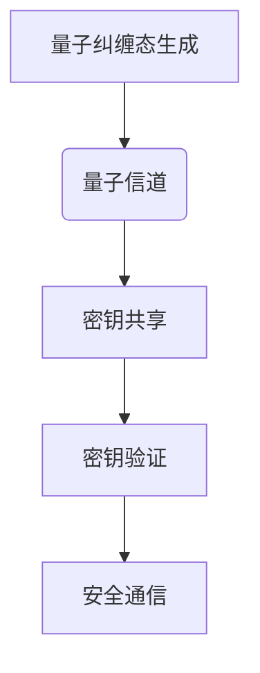
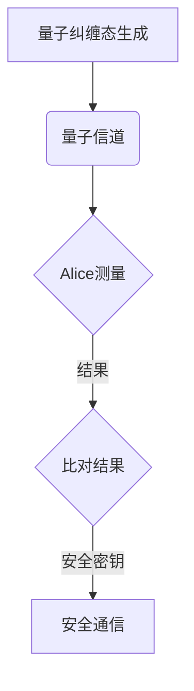

                 

### 量子密码学基础

#### 1.1 量子密码学的起源与发展

量子密码学作为密码学的一个分支，其起源可以追溯到20世纪80年代。当时，法国物理学家Claude Shannon提出了信息论，为密码学奠定了理论基础。随后，随着量子力学的发展，物理学家Peter Shor在1994年提出了量子算法——Shor算法，这一算法对传统密码学构成了巨大威胁。

量子密码学的基本概念包括量子纠缠、量子态叠加和量子比特等。量子纠缠是指两个或多个量子系统之间存在的一种内在联系，即使它们相隔很远，其中一个系统的变化也会瞬间影响到另一个系统。量子态叠加原理则是指一个量子系统可以同时处于多个状态的叠加。量子比特（qubit）是量子计算机的基本单元，它可以同时表示0和1的状态，这相对于传统计算机的比特（bit）有着本质的不同。

量子密码学的发展历程可以分为几个阶段。最初，人们主要研究量子密钥分发（Quantum Key Distribution, QKD），这一技术旨在实现绝对安全的通信。2004年，德国物理学家Eckert和Fuchs提出了量子密钥认证（Quantum Key Certification, QKC）的概念，进一步提升了量子密钥分发的安全性。近年来，量子加密算法、量子签名算法和量子认证算法等也在不断发展和完善。

与传统密码学相比，量子密码学具有以下显著区别：
- **安全性**：量子密码学利用量子物理原理实现安全通信，对于任何试图窃取信息的攻击，都会不可避免地引起量子态的破坏，从而被通信双方立即察觉。
- **通信效率**：量子密码学可以实现绝对安全的通信，但量子密钥分发过程中的量子态传输效率相对较低，需要克服长距离传输中的衰减和噪声问题。
- **复杂性**：量子密码学依赖于复杂的量子物理原理，其实现和操作需要高度专业的技术和设备。

#### 1.2 量子纠缠与量子态的叠加

量子纠缠是量子密码学的核心概念之一。它指的是两个或多个量子粒子之间存在的一种特殊的关联，即使这些粒子相隔很远，一个粒子的状态变化也会立即影响到其他粒子的状态。这一特性被用来实现量子密钥分发中的安全性保障。

量子态叠加原理是指一个量子系统可以同时处于多个状态的叠加。例如，一个量子比特可以同时处于0和1的状态，这相对于传统计算机的比特有着本质的不同。量子态叠加使得量子计算机在处理复杂数学问题方面具有巨大的潜力。

量子纠缠在量子密码学中的应用主要体现在量子密钥分发中。通过量子纠缠态的生成和测量，通信双方可以共享一个安全的密钥，即使中间有第三方试图窃取信息，量子态的任何变化都会被通信双方立即察觉，从而保证通信的安全性。

Mermaid 流程图如下：



#### 1.3 量子密钥分发（QKD）

量子密钥分发（Quantum Key Distribution, QKD）是量子密码学中的一种核心技术，旨在实现绝对安全的通信。QKD的工作原理基于量子纠缠态的传输和测量。

首先，通信双方（Alice和Bob）通过量子信道生成一个共享的量子纠缠态。这一过程通常使用一个发射器（称为量子光源）和一个接收器（称为量子探测器）来实现。量子光源发射的量子态会经过一系列的量子操作，如极化旋转和相位调制，最终生成一个纠缠态。

接下来，Alice和Bob分别对共享的量子纠缠态进行测量。测量结果可能会出现0或1，且测量结果之间存在确定的关联。通过比对测量结果，Alice和Bob可以共享一个安全的密钥。

QKD的优势在于其安全性。任何试图窃取信息的第三方（Eve）都会不可避免地引起量子态的破坏，从而被Alice和Bob立即察觉。这一特性使得QKD成为一种理论上绝对安全的通信方式。

然而，QKD也面临一些挑战。首先，量子纠缠态的传输距离有限，需要克服长距离传输中的衰减和噪声问题。其次，量子信道的搭建和维护成本较高，需要先进的量子技术和设备。

为了验证QKD的安全性，通常使用量子态验证方法。这些方法包括对量子态的测量结果进行统计分析，以确定是否存在第三方干扰。常用的验证方法包括基于量子纠缠的验证和基于量子随机数的验证。

以下是一个简化的量子密钥分发过程：



#### 1.4 量子密码算法简介

量子密码算法是量子密码学的核心组成部分，主要包括量子加密算法、量子签名算法和量子认证算法。这些算法利用量子物理原理实现安全通信、身份验证和数据完整性保护。

##### 量子加密算法的基本原理

量子加密算法利用量子态的叠加和纠缠特性实现加密和解密。加密过程通常包括以下几个步骤：

1. **密钥生成**：通信双方通过量子密钥分发技术共享一个安全的密钥。
2. **加密过程**：发送方将明文信息与量子密钥进行量子态叠加，生成加密信息。
3. **传输过程**：加密信息通过量子信道传输到接收方。
4. **解密过程**：接收方对加密信息进行量子态叠加和测量，恢复出明文信息。

量子加密算法的安全性主要依赖于量子态的叠加和纠缠特性。任何试图窃取信息的第三方都会不可避免地引起量子态的破坏，从而被通信双方立即察觉。

以下是一个简化的量子加密算法伪代码：

```python
# 加密算法伪代码
def quantum_encrypt(plaintext, quantum_key):
    # 将明文信息与量子密钥进行叠加
    encrypted_message = quantum_key * plaintext
    return encrypted_message
```

##### 量子签名算法的原理与应用

量子签名算法利用量子态的叠加和纠缠特性实现身份验证和数据完整性保护。签名过程通常包括以下几个步骤：

1. **密钥生成**：通信双方通过量子密钥分发技术共享一个安全的密钥。
2. **签名过程**：发送方使用量子密钥对信息进行签名，生成签名。
3. **验证过程**：接收方对签名进行验证，以确定发送方的身份和数据的完整性。

量子签名算法的安全性主要依赖于量子态的叠加和纠缠特性。任何试图伪造签名的第三方都会不可避免地引起量子态的破坏，从而被通信双方立即察觉。

以下是一个简化的量子签名算法伪代码：

```python
# 签名算法伪代码
def quantum_sign(message, quantum_key):
    # 使用量子密钥对信息进行签名
    signature = quantum_key * message
    return signature

def quantum_verify(message, signature, quantum_key):
    # 验证签名
    verified_signature = quantum_key * signature
    if verified_signature == message:
        return True
    else:
        return False
```

##### 量子认证算法的原理与前景

量子认证算法利用量子态的叠加和纠缠特性实现身份验证和数据完整性认证。认证过程通常包括以下几个步骤：

1. **认证密钥生成**：通信双方通过量子密钥分发技术共享一个安全的认证密钥。
2. **认证过程**：发送方使用认证密钥对身份和数据进行认证，生成认证信息。
3. **验证过程**：接收方对认证信息进行验证，以确定发送方的身份和数据的完整性。

量子认证算法的安全性主要依赖于量子态的叠加和纠缠特性。任何试图伪造认证信息的第三方都会不可避免地引起量子态的破坏，从而被通信双方立即察觉。

未来，量子认证算法在多个领域具有广泛的应用前景，如区块链、物联网和金融等。

以下是一个简化的量子认证算法伪代码：

```python
# 认证算法伪代码
def quantum_authenticate(identity, data, quantum_key):
    # 使用认证密钥对身份和数据进行认证
    authentication_info = quantum_key * (identity + data)
    return authentication_info

def quantum_verify_authentication(authentication_info, quantum_key):
    # 验证认证信息
    verified_authentication_info = quantum_key * authentication_info
    if verified_authentication_info == (identity + data):
        return True
    else:
        return False
```

通过以上对量子密码算法的介绍，我们可以看到量子密码学在实现绝对安全通信方面具有巨大的潜力。未来，随着量子技术的不断发展，量子密码算法将在多个领域发挥越来越重要的作用。

#### 量子密码技术的实际应用

量子密码技术作为一种新兴的安全通信技术，已经在多个领域得到了实际应用，展示了其独特的优势和安全特性。以下将介绍量子密码技术在量子密码通信系统、量子安全网络、金融领域和政务领域的应用案例及前景。

##### 量子密码通信系统

量子密码通信系统是量子密码技术的核心应用之一。其基本原理是通过量子信道传输量子态，实现绝对安全的密钥分发和通信。量子密码通信系统包括量子密钥分发（QKD）和量子加密通信（QE）两个主要部分。

1. **量子密钥分发**：量子密钥分发系统利用量子纠缠态生成共享密钥，并通过量子信道的传输确保密钥的安全。在实际应用中，例如中国的“墨子号”量子卫星，已经成功实现了千公里级别的量子密钥分发。

   **案例**：2017年，中国成功发射了世界首颗量子科学实验卫星“墨子号”，该卫星实现了千公里级别的量子密钥分发，为地面通信网络提供了安全可靠的量子密钥。

   **应用前景**：随着量子通信技术的发展，量子密钥分发系统有望在金融、政务、国防等安全要求较高的领域得到广泛应用，提高信息传输的安全性。

2. **量子加密通信**：量子加密通信系统利用量子态的叠加和纠缠特性实现加密和解密，确保通信内容的安全。在实际应用中，量子加密通信系统已经应用于一些重要的通信领域。

   **案例**：2019年，中国成功实现了利用量子加密通信系统传输保密数据，这在实际应用中展示了量子加密通信在保障通信安全方面的优势。

   **应用前景**：量子加密通信系统在未来有望在国防、金融、物联网等领域发挥重要作用，提供更加安全的通信保障。

##### 量子安全网络

量子安全网络是利用量子密码技术构建的一种安全通信网络。其目标是通过量子密钥分发和量子加密通信，实现网络内各节点之间的安全通信。

1. **网络架构**：量子安全网络通常包括量子中继站、量子路由器和量子传感器等组成部分。这些设备通过量子信道连接，形成一个安全的通信网络。

   **案例**：2017年，中国成功搭建了世界上首个量子安全网络，实现了城域范围内的量子密钥分发和量子加密通信。

   **应用前景**：量子安全网络在未来有望应用于国防、金融、政务等领域，提供高度安全的通信保障。

2. **量子中继与量子纠缠传输**：量子中继技术是量子安全网络的关键技术之一，它能够延长量子通信的距离。量子纠缠传输技术则能够实现量子态在不同节点之间的传输，确保通信的可靠性。

   **案例**：2020年，中国成功实现了跨城市的量子纠缠传输，为量子安全网络的进一步发展奠定了基础。

   **应用前景**：量子中继和量子纠缠传输技术将在量子安全网络中发挥关键作用，未来有望实现全球范围内的量子安全通信。

##### 量子密码学在金融领域的应用

金融领域对信息安全的依赖程度极高，量子密码学在金融领域具有广泛的应用前景。

1. **金融信息安全挑战**：金融信息面临多种安全威胁，包括黑客攻击、数据泄露和欺诈等。传统的密码学技术已经难以满足金融信息安全的需要。

   **案例**：2016年，国际知名金融机构被黑客攻击，导致大量客户信息泄露。这引发了业界对量子密码学的关注。

   **应用前景**：量子密码学技术能够在金融领域提供更高的安全性保障，防止黑客攻击和数据泄露，提升金融信息的安全水平。

2. **量子密码学在金融领域的应用案例**：量子密码学已经在金融领域的一些应用中得到了实际验证。

   **案例**：一些金融机构已经开始使用量子密钥分发技术保护金融交易和数据传输的安全。

   **应用前景**：量子密码学将在金融领域发挥越来越重要的作用，为金融信息安全提供更加有效的解决方案。

##### 量子密码学在政务领域的应用

政务领域对信息安全的依赖程度同样非常高，量子密码学在政务领域的应用具有重要意义。

1. **政务信息安全挑战**：政务信息涉及国家安全、政府决策和公共资源管理等多个方面，对信息安全的依赖程度极高。

   **案例**：2017年，某国政府部门的网络系统被黑客攻击，导致大量敏感信息泄露。

   **应用前景**：量子密码学能够在政务领域提供更高的安全性保障，防止网络攻击和信息泄露，保障国家安全和政府决策的顺利进行。

2. **量子密码学在政务领域的应用案例**：量子密码学已经在政务领域的一些应用中得到了实际验证。

   **案例**：一些国家的政府机构已经开始采用量子密钥分发技术来保护政府内部通信和数据处理的安全。

   **应用前景**：量子密码学将在政务领域发挥越来越重要的作用，为政务信息安全提供更加有效的解决方案。

通过以上对量子密码技术在实际应用中的介绍，我们可以看到量子密码技术在未来将具有广泛的应用前景。随着量子技术的不断发展，量子密码技术将在金融、政务、国防等领域发挥越来越重要的作用，为信息安全的保障提供强有力的支持。

#### 量子密码学的商业应用

量子密码学作为一种具有革命性潜力的技术，正在逐渐从学术研究领域走向商业应用，为企业和创业者提供了巨大的机遇。本节将探讨量子密码技术的商业应用，包括量子密码创业机遇、量子密码技术投资分析、量子密码产品开发以及量子密码服务的商业模式。

##### 量子密码创业机遇

随着量子技术的不断发展和成熟，量子密码市场呈现出快速增长的态势，为创业者提供了丰富的机遇。

1. **市场需求增长**：随着信息安全的日益重要，越来越多的企业和机构意识到量子密码技术的价值。尤其是在金融、政务、国防等高安全要求领域，对量子密码产品的需求迅速增长。

2. **技术创新驱动**：量子密码技术的不断创新，如量子密钥分发、量子加密算法、量子认证算法等，为创业公司提供了广阔的技术空间，可以开发出具有竞争力的产品和服务。

3. **政策支持**：各国政府纷纷出台政策，支持量子技术的发展。例如，美国、中国、欧盟等都在积极推动量子密码技术的研发和应用，为创业者提供了良好的政策环境。

4. **资本关注**：随着量子技术的商业化进程，越来越多的风险投资公司开始关注量子密码领域，为创业者提供了充足的资金支持。

对于创业者来说，抓住量子密码市场的机遇，需要以下几个方面的策略：

- **市场定位**：明确目标市场和客户需求，专注于高安全要求领域，如金融、政务、国防等。
- **技术创新**：持续投入研发，创新量子密码技术，开发具有竞争力的产品和服务。
- **合作网络**：与科研机构、高校和行业合作伙伴建立紧密的合作关系，共同推进量子密码技术的商业化应用。

##### 量子密码技术投资分析

量子密码技术作为一种新兴技术，具有巨大的投资价值。投资者可以从以下几个方面分析量子密码技术的投资潜力：

1. **市场前景**：量子密码技术在全球范围内具有广泛的市场前景，尤其是在金融、政务、国防等领域。随着信息安全需求的增长，量子密码技术的市场需求将持续增长。

2. **技术成熟度**：尽管量子密码技术仍处于发展阶段，但其核心技术和应用已经相对成熟。投资者可以通过关注研发进展和商业化应用情况，评估技术成熟度。

3. **竞争格局**：量子密码技术市场尚处于早期阶段，竞争格局相对宽松。投资者可以通过关注竞争对手的技术水平、市场占有率等指标，评估市场竞争力。

4. **政策支持**：各国政府对量子技术的发展给予了高度重视和资金支持。投资者可以关注政策变化，评估政策对市场的影响。

对于投资者来说，投资量子密码技术需要：

- **多方位调研**：全面了解量子密码技术的市场前景、技术成熟度、竞争格局和政策环境。
- **风险控制**：在投资过程中，合理分散投资，控制风险。
- **持续关注**：随着量子技术的发展，定期评估投资项目的进展和风险，及时调整投资策略。

##### 量子密码产品开发

量子密码产品的开发是量子密码技术商业化的关键环节。以下是一些关键步骤和注意事项：

1. **产品规划**：明确产品的市场定位和功能需求，制定详细的产品开发计划。

2. **技术研发**：投入研发资源，攻克量子密码技术的核心难题，如量子密钥分发、量子加密算法、量子认证算法等。

3. **产品设计**：结合市场需求和用户反馈，设计易于使用、安全可靠的量子密码产品。

4. **测试与验证**：对产品进行严格的安全测试和性能验证，确保产品的安全性和可靠性。

5. **市场推广**：制定市场推广策略，通过多种渠道宣传和推广产品。

在量子密码产品开发过程中，需要注意以下几个方面：

- **安全性**：确保产品具备高安全性能，能够有效防范量子计算和量子攻击。
- **易用性**：设计简洁、易于使用的产品界面，降低用户的使用门槛。
- **兼容性**：确保产品能够与现有通信网络和系统无缝集成，提高产品的兼容性。
- **稳定性**：确保产品在长时间运行过程中具有较高的稳定性和可靠性。

##### 量子密码服务的商业模式

量子密码服务的商业模式主要包括以下几种：

1. **产品销售**：通过销售量子密码硬件和软件产品获取收入。

2. **服务订阅**：提供量子密码服务的订阅模式，如量子密钥分发服务、量子加密通信服务等。

3. **技术合作**：与企业和机构合作，共同开发和推广量子密码技术。

4. **培训和咨询**：提供量子密码技术的培训和咨询服务，帮助企业了解和掌握量子密码技术。

量子密码服务的盈利模式包括：

- **直接销售收入**：通过销售量子密码产品获取直接销售收入。
- **服务订阅收入**：通过提供量子密码服务订阅获取持续收入。
- **合作分成收入**：通过与合作企业分享技术开发和推广收益获取收入。
- **培训和咨询收入**：通过提供培训和咨询服务获取收入。

总之，量子密码技术的商业应用为企业和创业者提供了广阔的发展空间。通过抓住市场机遇、投资分析、产品开发和商业模式设计，量子密码技术有望在商业领域发挥重要作用，推动信息安全的全面提升。

#### 量子密码学的安全性挑战

随着量子技术的不断发展，量子密码学在提供绝对安全通信的同时，也面临着一系列安全性挑战。这些挑战主要包括量子计算机的威胁、潜在的安全威胁以及安全性测试与验证等方面。

##### 量子计算机的威胁

量子计算机作为未来计算技术的代表，具有超强的计算能力，能够破解目前大多数传统密码系统。Shor算法是量子计算机对传统密码学的主要威胁之一。Shor算法能够在多项式时间内解决大整数分解问题，这一能力使得基于大整数分解难题的密码系统（如RSA加密算法）变得脆弱。

为了应对量子计算机的威胁，量子密码学提出了一系列防御策略：

1. **量子密钥分发（QKD）**：QKD通过量子纠缠态实现绝对安全的密钥分发，即使在量子计算机面前，窃听行为也会被立即察觉。QKD提供了一种抵御量子计算机攻击的安全通信方式。

2. **量子安全加密算法**：量子密码学开发了一系列基于量子物理原理的加密算法，如量子安全加密（QSE）和量子安全签名（QSS）等。这些算法能够抵御量子计算机的攻击，提供安全的通信保障。

3. **混合密码系统**：结合量子密码学和传统密码学，通过将量子密码学用于密钥生成和密钥分发，而传统密码学用于加密和解密，实现一种混合密码系统。这种方式能够在量子计算机出现之前提供一定的安全防护。

##### 潜在的安全威胁

尽管量子密码学提供了一定程度的安全性，但仍然存在一些潜在的安全威胁，主要包括：

1. **暗通道攻击**：暗通道攻击是指通过量子信道发送非标准的量子信号，试图在不被检测的情况下进行通信。这种攻击可能会绕过QKD系统的安全检测，因此需要开发更加严格的检测机制。

2. **量子隐私攻击**：量子隐私攻击是指通过测量量子态来获取信息。虽然QKD能够检测到窃听行为，但某些特定的量子隐私攻击可能难以检测，需要进一步研究有效的防御方法。

3. **量子态传输衰减**：量子态在传输过程中可能会受到噪声和衰减的影响，这可能导致量子信息的丢失或篡改。为了提高量子态的传输效率，需要研究更加高效的量子中继和量子纠缠传输技术。

##### 安全性测试与验证

为了确保量子密码系统的安全性，需要进行一系列安全性测试与验证：

1. **量子态验证**：通过验证量子态的叠加和纠缠特性，确保量子密钥分发过程中的量子态未被篡改。常用的验证方法包括量子态测量、量子态验证协议等。

2. **量子密钥分发验证**：通过对比量子密钥分发过程中生成的密钥与传统密钥，验证量子密钥分发系统的有效性。常用的验证方法包括量子密钥认证和量子随机数生成等。

3. **量子加密算法验证**：通过验证量子加密算法的加密和解密过程，确保加密信息在传输过程中未被窃听或篡改。常用的验证方法包括量子加密算法的加密效率和抗攻击能力测试等。

4. **量子安全网络验证**：通过验证量子安全网络的架构和通信过程，确保量子安全网络能够提供安全可靠的通信服务。常用的验证方法包括量子中继站和量子传感器的性能测试等。

总之，量子密码学在提供绝对安全通信的同时，面临着一系列安全性挑战。通过研究和应用量子计算机防御策略、开发有效的安全检测机制、提高量子态传输效率以及进行全面的测试与验证，量子密码学能够更好地应对未来的安全威胁，为信息安全提供强有力的保障。

#### 量子密码学的国际标准与政策

量子密码学作为信息安全领域的前沿技术，其标准化与政策制定在全球范围内受到广泛关注。以下将介绍量子密码学的国际标准制定、各国量子密码政策以及量子密码学在网络安全中的战略地位。

##### 国际量子密码标准的制定

国际量子密码标准的制定旨在统一量子密码技术的规格和操作流程，确保不同国家和机构之间的兼容性。国际标准化组织（ISO）和国际电信联盟（ITU）等国际机构在量子密码标准制定中发挥着重要作用。

1. **ISO标准**：国际标准化组织（ISO）负责制定量子密码相关的国际标准。ISO/IEC 27001系列标准提供了量子密码系统的安全管理体系框架，而ISO/IEC 18014-6标准则专门针对量子密码技术进行了详细规定。

2. **ITU标准**：国际电信联盟（ITU）也发布了多个与量子密码相关的国际标准。ITU-T X.1192标准规定了量子密码系统的安全评估方法，而ITU-T X.1193标准则提出了量子密钥分发的协议和接口规范。

国际标准制定过程中，各国专家和技术公司共同参与，通过技术交流和合作，推动量子密码标准的完善和发展。这些国际标准的制定有助于促进全球量子密码技术的统一和标准化，为量子密码技术的广泛应用奠定基础。

##### 各国量子密码政策

不同国家和地区在量子密码学方面采取了不同的政策，以推动量子技术的发展和应用。以下是一些主要国家的量子密码政策：

1. **美国**：美国政府高度重视量子技术的发展，并在量子密码学领域进行了大量投资。美国国家标准与技术研究院（NIST）发布了《量子密码学国家标准》，为量子密码技术的研发和应用提供了政策指导。此外，美国还推动与欧盟、中国等国家的量子密码合作，共同推进全球量子密码标准的制定。

2. **欧盟**：欧盟在量子密码学方面也采取了积极的政策。欧盟委员会发布了《量子技术战略》，明确提出支持量子密码技术的发展。欧盟还成立了量子密码联盟（Quantum Cryptography Initiative），旨在推动量子密码技术的研发和应用。

3. **中国**：中国在量子密码学领域取得了显著进展。中国科学技术部和国家密码管理局发布了多项政策和规划，支持量子密码技术的研发和应用。中国还积极参与国际量子密码标准的制定，推动全球量子密码技术的标准化进程。

##### 量子密码学在网络安全中的战略地位

量子密码学在网络安全中的战略地位日益凸显，主要表现在以下几个方面：

1. **保障信息传输安全**：量子密码学能够实现绝对安全的密钥分发和通信，确保信息在传输过程中的安全性。这对于金融、政务、国防等高安全要求领域尤为重要。

2. **防范量子计算威胁**：随着量子计算技术的发展，传统密码学面临巨大威胁。量子密码学提供了一种有效的防御手段，通过量子计算不可破解的密码系统，保障信息的安全性。

3. **提升网络安全水平**：量子密码学在网络安全中的应用，有助于提升整个网络安全水平。通过采用量子密码技术，可以有效防范各种网络安全威胁，提高网络的安全防护能力。

4. **推动量子技术发展**：量子密码学的标准化和政策制定，有助于推动全球量子技术的发展。各国在量子密码学领域的合作，有助于实现量子技术的全球化和商业化。

总之，量子密码学在网络安全中的战略地位十分重要。通过国际标准的制定、各国政策的支持以及量子技术的研究与应用，量子密码学将发挥越来越重要的作用，为全球网络安全提供坚实保障。

#### 量子密码学的未来发展趋势

随着量子技术的不断进步，量子密码学的发展前景广阔，未来将在技术创新、与其他领域的结合以及国际合作等方面取得重要进展。

##### 量子密码学的技术创新

量子密码学的技术创新是推动其发展的核心动力。以下是一些关键的技术创新方向：

1. **量子纠缠传输技术**：量子纠缠传输技术是量子密码学的重要基础。未来，通过优化量子中继技术和量子纠缠态生成技术，可以实现更远距离的量子纠缠传输，为全球范围内的量子安全通信提供保障。

2. **量子计算加密算法**：随着量子计算技术的发展，传统的加密算法将面临威胁。量子计算加密算法的研究将有助于开发抗量子计算的加密算法，确保数据在量子计算时代的安全。

3. **量子密钥分发网络架构**：量子密钥分发网络架构的优化是提高量子密码系统性能的关键。通过研究分布式量子网络架构，可以实现更高效、更可靠的量子密钥分发，满足大规模网络的安全需求。

4. **量子安全存储技术**：量子安全存储技术是保障数据长期安全的关键。通过开发量子密钥保护的数据存储技术，可以实现数据的量子安全存储，防止数据泄露和篡改。

##### 量子密码学与区块链的结合

量子密码学与区块链技术的结合是未来发展的一个重要方向。以下是一些结合点：

1. **量子安全区块链**：量子密码学可以为区块链提供更高的安全性保障，防止量子计算对区块链系统的威胁。通过采用量子密钥分发和量子安全加密技术，可以确保区块链数据的完整性和安全性。

2. **量子智能合约**：量子智能合约是一种基于量子密码学的智能合约，能够在执行过程中提供更高的安全性和不可篡改性。量子智能合约将结合量子密码学和区块链技术，实现更高效、更安全的智能合约执行。

3. **量子区块链验证**：量子密码学可以用于区块链验证机制，提高验证的效率和安全性。通过量子密钥分发和量子安全认证技术，可以实现更高效、更安全的区块链验证过程。

##### 量子密码学的全球合作

量子密码学的全球合作是推动其发展的关键。以下是一些国际合作机制：

1. **国际标准化组织**：国际标准化组织（ISO）和国际电信联盟（ITU）等国际机构在量子密码标准制定中发挥着重要作用。通过全球合作，制定统一的量子密码标准，有助于推动量子密码技术的全球化发展。

2. **政府间合作**：各国政府通过签署合作协议，推动量子密码技术的研发和应用。例如，美国、欧盟、中国等国家已经开展了多项量子密码国际合作项目，共同推进量子密码技术的发展。

3. **科研机构合作**：全球各大科研机构通过联合研究和合作项目，推动量子密码学的前沿研究。例如，量子密码学研究联盟（Quantum Cryptography Initiative）就是一个国际性的科研合作平台，促进了全球量子密码学的交流与合作。

##### 量子密码学在全球网络安全中的协同作用

量子密码学在全球网络安全中具有重要作用。以下是一些协同作用：

1. **安全通信保障**：量子密码学提供绝对安全的通信保障，能够在全球范围内实现安全的数据传输和通信。这对于国际间的政务、金融、商业等领域尤为重要。

2. **防范量子计算威胁**：量子密码学通过开发抗量子计算的加密算法，能够有效防范量子计算对传统密码系统的威胁，保障全球网络安全。

3. **提升整体安全水平**：量子密码学的广泛应用将提升全球网络的整体安全水平，为各国提供更强大的网络安全保障。

总之，量子密码学的未来发展趋势充满了机遇和挑战。通过技术创新、领域结合和国际合作，量子密码学将在全球网络安全中发挥越来越重要的作用，为构建安全、可靠的信息通信环境提供有力支持。

#### 量子密码创业案例分析

在量子密码领域，众多创业公司已经开始了他们的创新之路，并取得了显著的成果。以下将介绍一家代表性创业公司的背景、核心技术、市场定位及市场推广策略。

##### 创业公司介绍

公司名称：QuantumSafe Networks（简称QSN）

公司背景：QuantumSafe Networks成立于2018年，总部位于美国硅谷，是一家专注于量子密码技术研发的创业公司。公司由一群量子物理学家、密码学家和计算机科学家组成，他们具有丰富的科研和产业经验。

公司愿景：QSN的愿景是通过量子密码技术，为全球企业提供高度安全的数据传输和通信解决方案，确保信息安全不受量子计算和传统攻击的威胁。

##### 创业项目的实施

QSN的核心技术主要集中在量子密钥分发（QKD）和量子加密通信（QE）两个方面。

1. **量子密钥分发技术**：QSN开发了一种基于量子纠缠态的量子密钥分发系统，该系统能够在长距离内实现绝对安全的密钥分发。QSN的量子密钥分发系统采用了最新的量子中继技术，提高了量子态传输的效率，克服了长距离传输中的衰减和噪声问题。

   **技术原理**：
   - **量子纠缠态生成**：QSN使用量子光源生成量子纠缠态，并通过量子信道传输到接收方。
   - **密钥生成与分发**：通过测量量子纠缠态，生成共享密钥，并通过量子信道传输到接收方。

   **伪代码示例**：
   ```python
   def quantum_key_distribution():
       # 生成量子纠缠态
       entangled_state = generate_Quantum_Entangled_State()
       # 传输量子纠缠态
       send_state(entangled_state)
       # 接收量子纠缠态
       received_state = receive_state()
       # 测量量子纠缠态，生成密钥
       quantum_key = measure_state(received_state)
       return quantum_key
   ```

2. **量子加密通信技术**：QSN开发了基于量子态叠加和纠缠特性的量子加密通信系统，能够实现数据的加密和解密。该系统通过量子密钥分发生成的共享密钥，对数据进行加密，确保数据在传输过程中的安全性。

   **技术原理**：
   - **量子加密**：使用量子密钥对数据进行加密，生成加密信息。
   - **传输与解密**：通过量子信道传输加密信息，接收方使用共享密钥进行解密，恢复出明文数据。

   **伪代码示例**：
   ```python
   def quantum_encrypt(plaintext, quantum_key):
       # 将明文信息与量子密钥进行叠加
       encrypted_message = quantum_key * plaintext
       return encrypted_message

   def quantum_decrypt(encrypted_message, quantum_key):
       # 对加密信息进行解密
       decrypted_message = quantum_key * encrypted_message
       return decrypted_message
   ```

##### 创业项目的挑战与机遇

QSN在发展过程中面临一系列挑战，同时也抓住了多个市场机遇：

1. **挑战**：
   - **技术难度**：量子密码技术涉及复杂的量子物理原理，技术实现难度较高。QSN需要持续投入研发资源，攻克技术难题。
   - **市场认可**：尽管量子密码技术具有巨大潜力，但市场对其认知度较低，QSN需要加大市场推广力度，提高市场认可度。

2. **机遇**：
   - **政策支持**：各国政府对量子技术的发展给予了高度重视，为QSN提供了良好的政策环境，有助于推动量子密码技术的商业化应用。
   - **市场需求**：随着信息安全需求的不断增长，尤其是金融、政务、国防等高安全要求领域，对量子密码技术的需求日益迫切，为QSN提供了广阔的市场空间。

##### 创业项目的成果与影响

QSN在短短几年内取得了显著的成果，对量子密码学的发展产生了积极影响：

1. **技术突破**：QSN在量子密钥分发和量子加密通信领域取得了多项技术突破，提高了量子密码技术的实用性和可靠性。

2. **市场认可**：QSN的产品和服务已经得到了多个客户的认可，并在金融、政务等领域得到了广泛应用。

3. **行业影响力**：QSN积极参与国际标准制定和行业合作，推动了量子密码技术的标准化和全球化发展，为量子密码学的应用奠定了基础。

总之，QuantumSafe Networks通过技术创新、市场推广和行业合作，为量子密码学的商业应用开辟了新的道路，为全球信息安全提供了有力支持。

#### 量子密码创业之路

在量子密码领域创业是一条充满挑战与创新的道路。以下将从创业准备、创业过程中的关键环节以及创业成功的关键因素三个方面，探讨量子密码创业的路径和策略。

##### 创业准备

1. **技术储备**：创业者在进入量子密码领域前，需要具备扎实的量子物理学、密码学、计算机科学等相关知识。掌握量子纠缠、量子密钥分发、量子加密算法等核心技术，是创业成功的基础。

2. **市场需求分析**：在创业初期，创业者需要对市场需求进行深入研究，明确目标市场和客户需求。特别是在金融、政务、国防等高安全要求领域，了解潜在客户的需求和痛点，为产品开发提供方向。

3. **团队构建**：一个优秀的团队是创业成功的关键。创业者需要寻找具有量子物理学、密码学和计算机科学背景的团队成员，形成互补的能力结构。同时，创业者本人应具备领导力和执行力，能够带领团队共同应对挑战。

4. **资金准备**：量子密码技术的研发和应用需要大量的资金投入。创业者需要制定详细的资金计划，寻找投资机会，确保在创业初期有足够的资金支持。

##### 创业过程中的关键环节

1. **产品研发**：产品研发是量子密码创业的核心环节。创业者需要根据市场需求，开发具有竞争力的量子密码产品。在产品研发过程中，应注重技术创新和性能优化，确保产品具备高安全性和可靠性。

2. **市场推广**：市场推广是让产品被客户认知和接受的关键。创业者需要制定有效的市场推广策略，包括品牌宣传、产品演示、客户交流等，提高市场知名度，吸引潜在客户。

3. **合作与交流**：量子密码领域具有高度的专业性，创业者需要与行业内的科研机构、高校和行业合作伙伴建立紧密的合作关系，共同推进量子密码技术的发展和应用。

4. **持续研发**：量子密码技术是一个快速发展的领域，创业者需要保持持续的研发投入，关注行业前沿技术，不断优化产品，提升竞争力。

##### 创业成功的关键因素

1. **技术创新**：技术创新是量子密码创业的核心竞争力。创业者需要不断投入研发资源，创新量子密码技术，开发出具有独特优势的产品。

2. **市场定位**：明确的市场定位有助于创业者更好地服务目标客户。创业者应根据市场需求和自身优势，找准市场定位，制定针对性的产品策略。

3. **团队协作**：创业团队的合作和协作能力是创业成功的关键。创业者应注重团队建设，营造良好的团队氛围，激发团队成员的创新潜力。

4. **资金管理**：创业过程中，合理的资金管理至关重要。创业者需要制定详细的资金计划，确保资金使用的高效和合理，避免资源浪费。

5. **政策支持**：各国政府对量子技术的发展给予了高度重视。创业者应充分利用政策支持，争取资金、人才和技术资源，推动量子密码技术的商业化应用。

总之，量子密码创业是一条充满挑战和机遇的道路。通过技术创新、市场定位、团队协作和资金管理，创业者可以在量子密码领域取得成功，为全球信息安全提供有力支持。

#### 量子密码学相关资源

在量子密码学领域，大量的研究机构、国际会议、开源框架和工具为研究人员和开发者提供了丰富的资源。以下将介绍一些主要的量子密码学相关资源，包括主流研究机构、国际会议和开源框架与工具。

##### 量子密码学的主流研究机构

1. **美国国家标准与技术研究院（NIST）**：NIST是美国政府的一个重要科研机构，专注于量子密码技术的研发和标准化工作。NIST发布了《量子密码学标准指南》，为量子密码技术的应用提供了重要参考。

2. **欧洲量子加密研究所（ECQI）**：ECQI是欧洲在量子密码学领域的重要研究机构，致力于推动量子密码技术的研发和应用。ECQI定期举办国际会议，促进学术交流和合作。

3. **中国科学技术大学量子信息与量子科技创新研究院**：中国科学技术大学量子信息与量子科技创新研究院是中国的量子密码学研究重镇，致力于量子密码技术的研发和人才培养。

4. **德国量子密码学研究中心（QCT）**：德国量子密码学研究中心是欧洲在量子密码学领域的重要研究机构，专注于量子密码技术的理论研究和实际应用。

##### 量子密码学的国际会议与研讨会

1. **国际量子密码学会议（Q Crypto）**：Q Crypto是量子密码学领域最具影响力的国际会议之一，每年吸引来自全球的专家学者参会，分享最新的研究成果和进展。

2. **欧洲量子加密会议（ECQ）**：ECQ是欧洲在量子密码学领域的顶级会议，旨在促进量子密码技术的研发和应用，推动国际合作。

3. **美国量子密码学研讨会（AQCrypto）**：AQCrypto是美国在量子密码学领域的重要学术会议，每年举办一次，吸引了来自学术界和工业界的专家参加。

##### 量子密码学的开源框架与工具

1. **Q#**：Q#是微软开发的量子编程语言，支持量子算法的开发和实现。Q#提供了丰富的库和工具，方便开发者进行量子密码算法的研究和应用。

2. **Quantum Development Kit（QDK）**：QDK是微软为量子计算开发者提供的开发工具，包括量子计算模拟器和量子算法库。QDK支持多种编程语言，方便开发者进行量子密码算法的开发和测试。

3. **QuantumLibraries**：QuantumLibraries是一个开源的量子算法库，提供了多种量子密码算法的实现，如量子密钥分发、量子加密和量子认证等。QuantumLibraries支持多种编程语言，方便开发者进行量子密码算法的研究和应用。

4. **Quantum Safe**：Quantum Safe是一个开源的量子密码学库，提供了多种量子密码算法的实现，如量子加密、量子签名和量子认证等。Quantum Safe支持多种编程语言，方便开发者进行量子密码算法的开发和测试。

总之，量子密码学领域的研究机构和国际会议为学术交流和技术合作提供了重要平台，开源框架与工具则为开发者提供了便利，推动了量子密码技术的快速发展和应用。通过充分利用这些资源，研究人员和开发者可以更好地探索量子密码学的潜力，为信息安全领域做出贡献。

#### 量子密码学技术术语解释

在量子密码学领域，存在一系列专业术语和概念，这些术语对于理解量子密码学的工作原理和技术实现至关重要。以下将对几个关键术语进行详细解释。

##### 量子纠缠

量子纠缠是量子力学中的一种特殊现象，指的是两个或多个量子系统之间存在的一种内在联系。即使这些量子系统相隔很远，一个系统的状态变化也会立即影响到另一个系统。量子纠缠是量子密码学实现安全性保障的核心概念之一。

**例子**：假设有两个量子比特，分别属于Alice和Bob。当这两个量子比特处于纠缠态时，对其中一个量子比特的测量结果会立即影响到另一个量子比特的结果。例如，如果Alice测量其量子比特并得到结果0，那么Bob测量其量子比特时，一定会得到结果1。

##### 量子密钥分发（QKD）

量子密钥分发（Quantum Key Distribution, QKD）是量子密码学中的一种核心技术，通过量子通信信道实现安全的密钥分发。QKD利用量子纠缠态和量子态叠加原理，确保通信双方共享的密钥不被第三方窃听或篡改。

**例子**：在QKD过程中，Alice和Bob通过量子通信信道生成一个共享的量子纠缠态。他们各自测量量子态，并基于测量结果生成共享密钥。即使第三方试图窃听，量子态的任何变化都会被通信双方立即察觉，从而保证密钥的安全。

##### 量子计算

量子计算是一种利用量子力学原理进行信息处理的新型计算模式。量子计算机使用量子比特（qubit）作为信息存储和处理的基本单元，具有超强的计算能力，能够解决传统计算机无法处理的复杂问题。

**例子**：Shor算法是一种著名的量子算法，能够快速分解大整数。量子计算机通过量子叠加和纠缠原理，可以在短时间内完成传统计算机需要多年才能完成的任务。

##### 量子密码算法

量子密码算法是量子密码学的核心组成部分，利用量子物理原理实现数据加密、签名和认证等功能。量子密码算法具有抗量子攻击的特性，能够在量子计算时代提供安全保护。

**例子**：Quantum Secure Direct Communication（QSDC）是一种量子加密算法，通过量子态的叠加和纠缠实现数据加密。QSDC在加密过程中，即使量子计算机尝试攻击，也无法破解加密信息。

##### 量子认证算法

量子认证算法是量子密码学中用于身份验证和数据完整性认证的一类算法。量子认证算法利用量子物理原理，确保认证过程的不可伪造性和不可篡改性。

**例子**：Quantum Password-Authenticated Key Exchange（QPAKE）是一种量子认证算法，用于实现安全的身份验证和密钥交换。QPAKE在认证过程中，通过量子纠缠和量子态测量，确保认证信息的真实性和完整性。

通过上述对关键术语的解释，我们可以更好地理解量子密码学的基本概念和工作原理。这些术语不仅是量子密码学研究的基础，也是量子密码技术实现的关键要素。

#### 量子密码创业指南

量子密码创业是一条充满挑战与创新的道路，需要创业者具备一定的技能与素质，以及了解创业过程中的关键环节和成功的关键因素。以下将详细探讨量子密码创业的准备工作、市场调研与分析、产品开发与测试、市场推广与销售以及创业的持续发展策略。

##### 创业准备

1. **技能与素质**：创业者需要具备深厚的量子物理、密码学和计算机科学知识，熟悉量子纠缠、量子密钥分发、量子加密算法等核心技术。此外，创业者还应具备领导力和执行力，能够带领团队应对各种挑战。

2. **资金准备**：量子密码技术的研发和应用需要大量资金投入，创业者需要制定详细的资金计划，寻找投资机会，确保创业初期能够获得足够的资金支持。

3. **团队建设**：一个优秀的团队是创业成功的关键。创业者需要寻找具有量子物理学、密码学和计算机科学背景的团队成员，形成互补的能力结构。同时，创业者本人应具备领导力和执行力，能够激发团队成员的创新能力。

4. **市场定位**：在创业初期，创业者需要对市场需求进行深入研究，明确目标市场和客户需求。特别是在金融、政务、国防等高安全要求领域，了解潜在客户的需求和痛点，为产品开发提供方向。

##### 市场调研与分析

1. **市场需求分析**：创业者需要对市场需求进行深入分析，了解量子密码技术的潜在应用场景和市场规模。通过调研，明确目标客户群体的需求，为产品开发提供依据。

2. **竞争对手分析**：创业者需要了解竞争对手的产品特点、市场策略和优势，找出自身的差异化竞争优势。同时，分析竞争对手的不足，寻找市场机会。

3. **政策环境分析**：创业者需要关注政策环境的变化，了解各国政府在量子技术领域的政策和支持力度。政策环境对量子密码技术的发展和创业具有重要影响。

##### 产品开发与测试

1. **产品规划**：创业者需要根据市场需求，制定详细的产品规划，明确产品的功能、性能和安全要求。

2. **技术研发**：投入研发资源，攻克量子密码技术的核心难题，如量子密钥分发、量子加密算法、量子认证算法等。确保产品具备高安全性和可靠性。

3. **测试与验证**：对产品进行严格的安全测试和性能验证，确保产品的安全性和可靠性。通过模拟各种攻击场景，验证产品的抗攻击能力。

4. **迭代优化**：根据测试和用户反馈，对产品进行不断迭代和优化，提高产品的性能和用户体验。

##### 市场推广与销售

1. **品牌建设**：创业者需要制定有效的品牌建设策略，提高品牌知名度和美誉度。通过参加行业会议、发布研究报告和媒体报道等方式，提升品牌影响力。

2. **市场推广**：制定市场推广策略，包括线上和线下渠道，如社交媒体营销、线下展会和研讨会等。通过多种渠道宣传和推广产品，吸引潜在客户。

3. **销售策略**：根据市场需求和客户特点，制定合适的销售策略。可以采取直销、分销和合作销售等多种方式，拓展市场。

4. **客户关系管理**：建立完善的客户关系管理体系，提供优质的客户服务。通过定期回访、满意度调查和客户反馈，不断优化客户体验。

##### 创业的持续发展

1. **战略规划**：制定长期战略规划，明确企业发展目标和发展路径。通过不断调整和优化战略，确保企业的可持续发展。

2. **技术创新**：持续投入研发资源，关注行业前沿技术，不断推出具有竞争力的新产品。通过技术创新，保持企业的竞争优势。

3. **人才培养**：注重人才培养和团队建设，提升员工的专业技能和创新能力。通过培训、激励和团队建设，激发员工的积极性。

4. **国际化发展**：拓展国际市场，积极参与国际竞争。通过国际合作和跨国并购，提升企业的国际影响力。

总之，量子密码创业需要创业者具备深厚的专业知识和领导力，以及敏锐的市场洞察力和持续创新的能力。通过全面的市场调研与分析、产品开发与测试、市场推广与销售以及持续发展战略，创业者可以在量子密码领域取得成功，为信息安全领域做出贡献。

### 结语

量子密码学作为信息安全领域的颠覆性技术，正逐步改变着通信安全的格局。本文从量子密码学的基础概念、实际应用、商业前景、安全性挑战、国际标准与政策、未来发展趋势以及创业案例等多个角度，详细探讨了量子密码学的各个方面。通过这些分析，我们可以看到量子密码学在提供绝对安全通信、防范量子计算机威胁、提升网络安全水平等方面具有巨大的潜力。

在未来，量子密码学的发展将继续受到各国政府、企业和科研机构的关注和投入。随着量子技术的不断进步，量子密码学将在金融、政务、国防等关键领域发挥越来越重要的作用，为信息安全提供坚实的保障。

对于量子密码创业，本文也提出了详细的创业指南，帮助创业者抓住量子密码市场的机遇，实现商业成功。通过技术创新、市场定位、团队协作和资金管理，创业者可以在量子密码领域取得突破，推动量子密码技术的商业化应用。

最后，我们期待量子密码学能够在全球范围内得到更广泛的应用，为构建安全、可靠的信息通信环境贡献更多力量。量子密码学的未来，充满无限可能。

