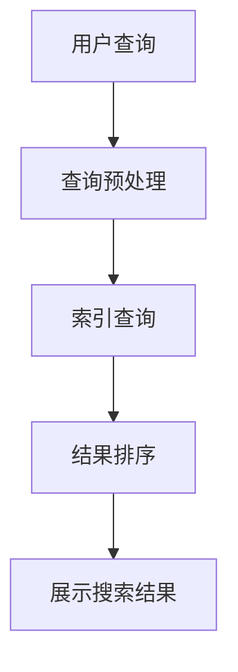

                 

# 阿里巴巴2024电商搜索引擎校招面试真题

## 关键词

- 阿里巴巴
- 电商搜索
- 校招面试真题
- 搜索引擎技术
- 搜索算法
- 排名算法
- 搜索结果相关性
- 搜索引擎优化
- 实战案例

## 摘要

本文将针对阿里巴巴2024电商搜索引擎校招面试真题进行深入分析和讲解。文章首先介绍了面试策略与心态调整，帮助读者为面试做好准备。接着，本文深入探讨了电商搜索的基础知识，包括搜索概述、搜索引擎架构等。然后，本文详细解析了搜索引擎的核心技术和算法，如搜索算法、排名算法、搜索结果相关性评估等。此外，本文还介绍了电商搜索的优化策略，包括用户行为分析、搜索引擎优化等。最后，本文通过实战案例和面试真题的解析，帮助读者更好地应对阿里巴巴电商搜索引擎的校招面试。

## 《阿里巴巴2024电商搜索引擎校招面试真题》目录大纲

### 第一部分：面试准备与基础知识

#### 第1章：面试策略与心态调整

##### 1.1 面试前的准备工作

- 简历优化
- 常见面试问题准备
- 自我介绍技巧

##### 1.2 面试心态调整

- 信心的重要性
- 压力管理
- 应对突发情况

#### 第2章：电商搜索基础知识

##### 2.1 电商搜索概述

- 电商搜索的定义与作用
- 电商搜索与普通搜索的区别
- 电商搜索的发展历程

##### 2.2 搜索引擎架构

- 搜索引擎的基本组成
- 索引结构与索引策略
- 查询处理流程

### 第二部分：核心算法与技术

#### 第3章：搜索引擎核心技术

##### 3.1 搜索算法

- 基于关键词的搜索
- 基于语义的搜索
- 搜索引擎排序算法
  - PageRank算法
  - 个性化搜索算法

##### 3.2 排名算法

- 常用排名指标
- 排序算法的优化
- 实时排名算法

#### 第4章：搜索结果相关性

##### 4.1 相关性评估

- TF-IDF模型
- 文档相似度计算
- 向量空间模型

##### 4.2 搜索结果排序

- 基于文档的排序
- 基于用户的排序
- 综合排序策略

#### 第5章：电商搜索优化

##### 5.1 用户行为分析

- 用户点击行为分析
- 用户购买行为分析
- 用户流失率分析

##### 5.2 搜索引擎优化

- 关键词优化
- 页面优化
- 搜索引擎营销策略

### 第三部分：实战案例与题目解析

#### 第6章：校招面试真题解析

##### 6.1 算法题解析

- 二分查找
- 并查集
- 图算法
- 字符串匹配

##### 6.2 应用题解析

- 电商搜索系统设计
- 用户行为数据分析
- 个性化推荐系统

#### 第7章：电商搜索面试实战

##### 7.1 面试实战模拟

- 面试流程模拟
- 模拟面试问题解答
- 面试反馈与改进

### 附录

#### 附录A：面试准备资料汇总

- 阿里巴巴电商搜索相关知识总结
- 面试真题及答案解析
- 面试准备常用工具与资源

#### 附录B：面试经验分享

- 面试官视角的面试策略
- 成功面试者经验分享
- 常见问题答疑

## Mermaid 流程图示例



## 伪代码示例

```plaintext
// 搜索引擎排序算法伪代码
function sortResults(results, rankingAlgorithm) {
    if (rankingAlgorithm == 'PageRank') {
        rankByPageRank(results);
    } else if (rankingAlgorithm == 'PersonalizedRank') {
        rankByPersonalizedRank(results, userBehavior);
    }
    return sortedResults;
}
```

## 数学公式示例

```latex
$$
\text{TF-IDF}(w,d) = \frac{f(w,d)}{N} \log \frac{N}{n(w)}
$$`

## 项目实战示例

#### 6.2 电商搜索系统设计

**开发环境搭建：**
- 操作系统：Linux
- 编程语言：Python
- 数据库：MySQL
- 搜索引擎：Elasticsearch

**源代码详细实现：**

```python
# 假设已经搭建好Elasticsearch环境，以下为Python代码实现搜索功能
from elasticsearch import Elasticsearch

def search_products(query):
    es = Elasticsearch()
    response = es.search(index='product_index', body={
        'query': {
            'match': {'title': query}
        }
    })
    return response['hits']['hits']

# 代码解读与分析
# 此函数使用Elasticsearch进行搜索，通过传递查询参数来检索产品列表。
# 结果将以列表形式返回，其中包含匹配产品的详细信息。
```

**代码解读与分析：**
- 使用Elasticsearch客户端发送搜索请求。
- 指定索引为 'product_index'，并使用 `match` 查询来匹配 'title' 字段的查询字符串。
- 解析响应结果，获取匹配的产品列表。
- 返回结果，方便后续处理和展示。

## 阿里巴巴2024电商搜索引擎校招面试真题

### 面试策略与心态调整

#### 第1章：面试前的准备工作

在准备阿里巴巴2024电商搜索引擎校招面试时，我们需要做好以下几个方面的准备工作。

##### 1.1 简历优化

简历是面试官了解你的第一手资料，因此简历的质量至关重要。以下是一些建议来优化简历：

- **内容清晰**：简历应该结构清晰，容易阅读。避免使用过多的文字和复杂的排版。
- **突出重点**：强调与电商搜索引擎相关的项目经验、技术能力和成果。
- **定制化简历**：根据不同公司的需求和职位要求，对简历进行定制化调整。

##### 1.2 常见面试问题准备

面试中可能会问到的一些常见问题包括：

- **请你自我介绍一下**：准备一段简洁明了的自我介绍，包括姓名、专业背景、工作经验等。
- **你为什么想要加入阿里巴巴？**：回答时要表现出对阿里巴巴公司的认同感和对电商搜索领域的热情。
- **你有什么优点和缺点？**：回答时要尽量展示自己的优点，同时承认自己的不足，并说明如何改进。

##### 1.3 自我介绍技巧

在面试中，自我介绍是给面试官留下第一印象的重要环节。以下是一些建议：

- **简明扼要**：避免冗长的自我介绍，突出关键信息。
- **展示个性**：在自我介绍中展示自己的个性和特长，让面试官对你的印象更加深刻。
- **表达自信**：自信的态度可以给面试官留下良好的印象。

#### 第2章：面试心态调整

面试过程中，心态的调整非常重要。以下是一些建议来帮助调整面试心态。

##### 2.1 信心的重要性

自信是面试成功的重要因素。以下是一些提升信心的方法：

- **准备充分**：通过充分准备面试内容，可以提升自信心。
- **正面思考**：积极思考，避免消极情绪的影响。
- **自我肯定**：时常给自己积极的暗示和鼓励。

##### 2.2 压力管理

面试过程中可能会遇到压力，以下是一些应对压力的方法：

- **深呼吸**：深呼吸可以帮助缓解紧张情绪。
- **心理暗示**：在面试前给自己一些积极的暗示，如“我已经做好了准备”。
- **适当运动**：适度的运动可以释放压力，提高精神状态。

##### 2.3 应对突发情况

在面试过程中，可能会遇到一些突发情况，以下是一些建议：

- **保持冷静**：遇到突发情况时，保持冷静，不要慌张。
- **灵活应变**：根据突发情况，灵活调整应对策略。
- **诚实回答**：对于不知道的问题，诚实回答，表示愿意学习和了解。

### 电商搜索基础知识

#### 第3章：电商搜索概述

##### 3.1 电商搜索的定义与作用

电商搜索是指用户在电商平台进行商品查询、浏览、购买等操作时，通过搜索引擎来获取相关商品信息的过程。电商搜索在电商平台上具有重要作用，主要包括以下几点：

- **提高用户体验**：通过快速、准确的搜索结果，提高用户的购物体验。
- **增加销售额**：精准的搜索结果可以引导用户找到心仪的商品，从而提高销售额。
- **优化商品管理**：通过分析搜索数据，可以优化商品分类、价格管理等。

##### 3.2 电商搜索与普通搜索的区别

电商搜索与普通搜索相比，具有以下几个特点：

- **搜索内容**：电商搜索主要针对商品信息进行搜索，而普通搜索则涵盖更广泛的内容，如新闻、文章等。
- **搜索算法**：电商搜索算法需要考虑商品的相关性、用户行为等因素，而普通搜索算法主要基于关键词匹配。
- **用户体验**：电商搜索需要更快的搜索速度和更准确的搜索结果，而普通搜索则更注重结果的多样性。

##### 3.3 电商搜索的发展历程

电商搜索的发展可以分为以下几个阶段：

- **早期阶段**：以简单的关键词匹配为主，搜索结果准确性较低。
- **发展阶段**：引入了基于语义的搜索技术，如自然语言处理、语义分析等，搜索结果准确性有所提高。
- **智能化阶段**：结合人工智能、大数据等技术，实现个性化搜索、实时排名等高级功能，搜索结果更加精准。

#### 第4章：搜索引擎架构

##### 4.1 搜索引擎的基本组成

搜索引擎通常由以下几个部分组成：

- **爬虫**：负责从互联网上抓取网页信息。
- **索引器**：将爬虫抓取的网页信息进行预处理，建立索引。
- **查询处理器**：处理用户输入的查询请求，返回搜索结果。
- **结果展示**：将查询结果以可视化形式展示给用户。

##### 4.2 索引结构与索引策略

索引是搜索引擎的核心组成部分，它存储了网页的信息和链接关系。索引结构主要包括以下几种：

- **倒排索引**：将网页的内容映射到对应的URL，实现快速查询。
- **倒排列表**：将相同关键词的网页进行排序，实现相关性排序。
- **位置索引**：记录关键词在网页中的位置，实现精确匹配。

索引策略主要包括以下几点：

- **增量索引**：只对新增或更新的网页进行索引，提高索引效率。
- **全文索引**：对网页的全文进行索引，实现更加精准的搜索结果。
- **分词索引**：对关键词进行分词处理，提高搜索结果的相关性。

##### 4.3 查询处理流程

查询处理流程主要包括以下几个步骤：

1. **预处理**：对用户输入的查询进行分词、去停用词等处理，提取有效关键词。
2. **索引查询**：在索引中查找与关键词相关的网页。
3. **相关性排序**：根据网页的相关性对查询结果进行排序。
4. **结果展示**：将排序后的搜索结果以可视化形式展示给用户。

### 第二部分：核心算法与技术

#### 第5章：搜索引擎核心技术

##### 5.1 搜索算法

搜索算法是搜索引擎的核心技术，用于实现用户查询与网页之间的匹配。以下是几种常见的搜索算法：

- **基于关键词的搜索**：通过关键词匹配实现搜索，如模糊匹配、前缀匹配等。
- **基于语义的搜索**：利用自然语言处理技术，对查询和网页内容进行语义分析，实现更精准的搜索。
- **基于图谱的搜索**：利用图谱结构，通过节点和边的关系进行搜索，实现跨领域的关联搜索。

##### 5.2 排名算法

排名算法用于对搜索结果进行排序，提高用户获取有用信息的效率。以下是几种常见的排名算法：

- **基于文档的排序**：根据网页的内容、标题、关键词等因素进行排序。
- **基于用户的排序**：根据用户的历史搜索行为、兴趣偏好等进行排序。
- **基于内容的排序**：结合网页的内容、质量、更新时间等因素进行排序。

以下是几种常见的排名算法：

- **PageRank算法**：基于网页的链接结构进行排序，重要性较高的网页会获得更高的排名。
- **基于点击率的排序**：根据用户对搜索结果的点击行为进行排序，点击率较高的结果会获得更高的排名。
- **基于用户行为的排序**：根据用户的历史搜索行为、浏览行为等进行排序，提高用户体验。

##### 5.3 个性化搜索算法

个性化搜索算法基于用户的兴趣、偏好和行为数据，为用户推荐更符合其需求的搜索结果。以下是几种常见的个性化搜索算法：

- **协同过滤**：基于用户的历史行为，为用户推荐与其相似的用户喜欢的商品。
- **基于内容的推荐**：根据用户浏览、收藏、购买等行为，为用户推荐与其浏览内容相关的商品。
- **基于模型的推荐**：利用机器学习算法，根据用户的历史行为和搜索数据，预测用户可能感兴趣的商品。

#### 第6章：搜索结果相关性

搜索结果相关性是评价搜索引擎性能的重要指标，它决定了用户能否快速找到所需信息。以下是几种常见的搜索结果相关性评估方法：

- **TF-IDF模型**：计算关键词在网页中的频率和在整个文档集合中的重要性，用于评估网页与查询的相关性。
- **文档相似度计算**：通过计算网页与查询之间的相似度，评估搜索结果的相关性。
- **向量空间模型**：将网页和查询表示为高维向量，计算它们之间的余弦相似度，用于评估相关性。

以下是几种常见的评估方法：

- **基于文本相似度的评估**：通过计算网页和查询之间的文本相似度，评估相关性。
- **基于用户行为的评估**：根据用户对搜索结果的行为数据，如点击、收藏、购买等，评估相关性。
- **基于模型的评估**：利用机器学习算法，对搜索结果的相关性进行评估。

#### 第7章：电商搜索优化

电商搜索优化是指通过对搜索引擎的算法、数据、用户体验等方面进行优化，提高搜索结果的准确性、相关性和用户体验。以下是几种常见的电商搜索优化策略：

- **关键词优化**：通过对关键词进行分析和筛选，提高搜索结果的准确性。
- **页面优化**：通过优化网页的结构、内容和加载速度，提高用户获取信息的效率。
- **搜索引擎营销策略**：通过搜索引擎营销，提高电商平台的曝光度和用户访问量。

以下是几种常见的优化策略：

- **基于用户行为的优化**：根据用户的历史行为数据，优化搜索结果和推荐算法。
- **基于数据挖掘的优化**：通过数据挖掘技术，发现潜在的用户需求和市场趋势，优化搜索结果和推荐策略。
- **基于机器学习的优化**：利用机器学习算法，对搜索结果进行实时优化，提高用户体验。

### 第三部分：实战案例与题目解析

#### 第8章：校招面试真题解析

在校招面试中，电商搜索引擎相关的问题经常出现。以下是对一些常见面试题的解析。

##### 8.1 算法题解析

**问题1：如何实现一个高效的搜索引擎？**

**解答：**
实现一个高效的搜索引擎需要考虑以下几个方面：

1. **索引构建**：使用高效的索引算法和数据结构，如倒排索引，提高查询速度。
2. **查询处理**：优化查询处理流程，包括分词、关键词匹配、排序等，减少查询延迟。
3. **缓存策略**：使用缓存技术，如Redis，缓存热门搜索关键词和搜索结果，提高查询效率。
4. **分布式系统**：使用分布式架构，如使用Solr或Elasticsearch，提高系统的可扩展性和查询性能。

**问题2：如何优化搜索结果的准确性？**

**解答：**
优化搜索结果的准确性可以从以下几个方面入手：

1. **关键词分析**：对关键词进行深度分析，提取关键词的语义信息，提高匹配准确性。
2. **相关性排序**：使用先进的排序算法，如PageRank、基于用户行为的排序等，提高搜索结果的相关性。
3. **用户反馈**：根据用户的点击、收藏、购买等行为，对搜索结果进行实时调整，提高用户体验。
4. **机器学习**：利用机器学习算法，对搜索结果进行个性化推荐，提高搜索结果的准确性。

##### 8.2 应用题解析

**问题1：设计一个电商搜索系统**

**解答：**
设计一个电商搜索系统需要考虑以下几个方面：

1. **需求分析**：明确系统的功能需求，如关键词搜索、商品推荐、个性化搜索等。
2. **系统架构**：选择合适的搜索引擎架构，如基于Solr、Elasticsearch等。
3. **功能实现**：实现搜索、推荐、排序等核心功能，包括索引构建、查询处理、结果排序等。
4. **性能优化**：优化系统的性能，如使用缓存技术、分布式架构等，提高查询效率。

**问题2：分析用户搜索行为数据**

**解答：**
分析用户搜索行为数据可以从以下几个方面入手：

1. **行为数据收集**：收集用户的搜索关键词、点击、收藏、购买等行为数据。
2. **数据预处理**：对行为数据进行清洗、去重、转换等预处理操作。
3. **数据可视化**：使用数据可视化工具，如ECharts、D3.js等，对用户行为数据进行分析和展示。
4. **数据分析**：利用数据分析技术，如聚类、分类、回归等，对用户行为数据进行分析，提取有价值的信息。

##### 8.3 个性化推荐系统

**问题1：如何实现个性化推荐？**

**解答：**
实现个性化推荐可以从以下几个方面入手：

1. **协同过滤**：基于用户的历史行为数据，为用户推荐与其相似的用户喜欢的商品。
2. **基于内容的推荐**：根据用户的浏览、收藏、购买等行为，为用户推荐与其浏览内容相关的商品。
3. **基于模型的推荐**：利用机器学习算法，如矩阵分解、神经网络等，预测用户可能感兴趣的商品。
4. **混合推荐**：将多种推荐算法进行结合，提高推荐系统的准确性和多样性。

**问题2：如何评估个性化推荐的效果？**

**解答：**
评估个性化推荐的效果可以从以下几个方面入手：

1. **推荐准确性**：评估推荐结果的准确性，如召回率、精确率等指标。
2. **用户体验**：通过用户满意度、点击率、转化率等指标评估推荐系统对用户体验的提升。
3. **推荐多样性**：评估推荐结果的多样性，如覆盖面、新颖性等。
4. **长期效果**：评估推荐系统对用户长期行为的影响，如用户留存率、用户增长等。

### 第9章：电商搜索面试实战

##### 9.1 面试流程模拟

面试流程一般包括以下几个环节：

1. **初面**：主要考察应聘者的基本素质和专业知识。
2. **技术面试**：主要考察应聘者的技术能力和实际项目经验。
3. **HR面试**：主要考察应聘者的职业素养、团队合作能力等。
4. **复试**：针对技术面试中的问题进行深入探讨。

##### 9.2 模拟面试问题解答

以下是一些常见的面试问题及其解答：

**问题1：请你谈谈你对电商搜索的理解。**

**解答：**
电商搜索是指用户在电商平台进行商品查询、浏览、购买等操作时，通过搜索引擎来获取相关商品信息的过程。电商搜索具有以下几个特点：

1. **搜索内容**：主要针对商品信息进行搜索，包括商品名称、描述、价格等。
2. **搜索算法**：需要考虑商品的相关性、用户行为等因素，实现精准的搜索结果。
3. **用户体验**：需要提供快速、准确的搜索结果，提高用户的购物体验。

**问题2：如何优化电商搜索结果的相关性？**

**解答：**
优化电商搜索结果的相关性可以从以下几个方面入手：

1. **关键词分析**：对用户输入的关键词进行深度分析，提取关键词的语义信息，提高匹配准确性。
2. **相关性排序**：使用先进的排序算法，如PageRank、基于用户行为的排序等，提高搜索结果的相关性。
3. **用户反馈**：根据用户的点击、收藏、购买等行为，对搜索结果进行实时调整，提高用户体验。
4. **机器学习**：利用机器学习算法，对搜索结果进行实时优化，提高搜索结果的相关性。

**问题3：请你设计一个电商搜索系统。**

**解答：**
设计一个电商搜索系统需要考虑以下几个方面：

1. **需求分析**：明确系统的功能需求，如关键词搜索、商品推荐、个性化搜索等。
2. **系统架构**：选择合适的搜索引擎架构，如基于Solr、Elasticsearch等。
3. **功能实现**：实现搜索、推荐、排序等核心功能，包括索引构建、查询处理、结果排序等。
4. **性能优化**：优化系统的性能，如使用缓存技术、分布式架构等，提高查询效率。

##### 9.3 面试反馈与改进

面试结束后，及时进行反馈和改进是非常重要的。以下是一些建议：

1. **总结经验**：回顾面试过程中的表现，总结成功经验和不足之处。
2. **改进方法**：根据反馈，制定针对性的改进计划，如加强专业知识学习、提高沟通能力等。
3. **持续进步**：在日常生活中，不断积累经验，提高自己的综合素质，为下一次面试做好准备。

### 附录

#### 附录A：面试准备资料汇总

以下是一些面试准备资料，帮助读者更好地应对阿里巴巴电商搜索引擎的校招面试：

1. **阿里巴巴电商搜索相关知识**：了解阿里巴巴电商搜索的发展历程、核心技术、优化策略等。
2. **面试真题及答案解析**：收集历年面试真题及答案解析，熟悉常见面试问题的解答方法。
3. **面试准备常用工具与资源**：包括编程语言、数据库、搜索引擎等常用工具，以及相关的学习资源。

#### 附录B：面试经验分享

以下是一些成功面试者的经验分享，供读者参考：

1. **面试官视角的面试策略**：了解面试官的评分标准、面试流程和提问方式，提高面试表现。
2. **成功面试者经验分享**：学习成功面试者的面试技巧、准备方法和面试经验。
3. **常见问题答疑**：针对面试过程中遇到的问题，提供解答和指导。

### 总结

通过本文的讲解，我们了解了阿里巴巴2024电商搜索引擎校招面试的相关知识，包括面试策略与心态调整、电商搜索基础知识、核心算法与技术、搜索结果相关性、电商搜索优化、实战案例与题目解析以及面试实战等。希望本文能帮助读者更好地应对阿里巴巴电商搜索引擎的校招面试，取得优异的成绩。同时，也祝愿所有读者在求职道路上顺利前行，实现自己的职业目标。作者：AI天才研究院/AI Genius Institute & 禅与计算机程序设计艺术 /Zen And The Art of Computer Programming`## 详细内容

### 第一部分：面试准备与基础知识

#### 第1章：面试策略与心态调整

##### 1.1 面试前的准备工作

面试前的准备工作是成功面试的关键。以下是一些具体的建议：

- **简历优化**：简历是面试官对您的第一印象，确保简历的内容清晰、简洁，突出您的技能和经验。您可以使用不同的简历模板，根据不同的职位进行调整。同时，确保简历中的信息真实可靠，不要夸大或虚构。

  ```markdown
  **个人信息**
  姓名：张三
  联系方式：13800000000
  电子邮箱：zhangsan@example.com
  **教育背景**
  2018年 - 2022年：某某大学，计算机科学与技术专业，本科
  **工作经历**
  2022年 - 至今：某互联网公司，软件开发工程师
  ```

- **常见面试问题准备**：准备常见的面试问题，如“请你自我介绍一下”、“你的优点和缺点是什么”、“你为什么选择这个职位”等。对于每个问题，都要提前准备详细的答案，并练习表达。

  ```markdown
  **自我介绍**
  您好，我是一名计算机科学与技术专业的本科毕业生，对软件开发和搜索引擎技术有浓厚的兴趣。在过去的实习和工作中，我积累了丰富的编程经验和团队协作能力。我对阿里巴巴电商搜索引擎的发展充满期待，希望能为公司的技术进步做出贡献。

  **优点和缺点**
  我的优点是勤奋、细致和善于沟通。在工作中，我总是能够认真对待每一个细节，确保项目的顺利进行。同时，我擅长与团队成员协作，共同解决问题。我的缺点是偶尔会过于追求完美，导致工作效率下降。为了克服这个问题，我正在学习时间管理和优先级管理技巧。

  **为什么选择这个职位**
  我选择这个职位是因为我对电商搜索技术有浓厚的兴趣，并且认为这个职位能够让我发挥自己的技术优势。阿里巴巴作为电商领域的领军企业，其搜索引擎技术具有很高的技术水平，我相信在这里能够学到更多的知识和经验，不断提升自己的能力。
  ```

- **自我介绍技巧**：自我介绍时，要简明扼要地介绍自己的基本信息、教育背景、工作经历和技能特长。同时，要表现出自己的热情和自信。

  ```markdown
  **自我介绍示例**
  您好，我是张三，毕业于某某大学计算机科学与技术专业，目前担任某互联网公司的软件开发工程师。我对电商搜索技术有着浓厚的兴趣，特别是对如何提高搜索结果的准确性和用户体验有着深入的研究。在过去的工作中，我参与过多个搜索引擎项目，积累了丰富的实践经验。我希望能够加入阿里巴巴，在这个领域继续深造，为公司的技术发展贡献力量。
  ```

##### 1.2 面试心态调整

面试心态的调整对于面试的成功至关重要。以下是一些建议：

- **信心的重要性**：自信是面试官评价的重要指标之一。在面试前，要对自己有信心，相信自己有能力胜任这个职位。可以通过回顾以往的成功经历来增强自信。

  ```markdown
  **增强信心的方法**
  - 回顾以往的成功经历，如学术成果、项目经验等。
  - 与他人分享自己的成就，如家人、朋友或导师。
  - 给自己积极的暗示，如“我一定可以做好这个面试”。
  ```

- **压力管理**：面试过程中可能会遇到压力，如紧张、焦虑等。以下是一些应对压力的方法：

  ```markdown
  **压力管理的方法**
  - 深呼吸：在面试前做几次深呼吸，缓解紧张情绪。
  - 转移注意力：将注意力集中在面试问题本身，避免过多地关注自己的紧张情绪。
  - 正面思考：用积极的思维来应对压力，如“我准备得很充分，一定能回答好这个问题”。
  ```

- **应对突发情况**：面试过程中可能会遇到一些突发情况，如面试官提出难以回答的问题、设备故障等。以下是一些应对方法：

  ```markdown
  **应对突发情况的方法**
  - 保持冷静：遇到突发情况时，要保持冷静，不要慌张。
  - 承认不知道：如果面试官提出的问题实在难以回答，可以诚实地承认自己不知道，并表示愿意学习和了解。
  - 转移话题：如果面试官提出的问题与面试主题无关，可以尝试转移话题，回到面试的正题。
  ```

#### 第2章：电商搜索基础知识

##### 2.1 电商搜索概述

电商搜索是电子商务领域的重要组成部分，它为用户提供了一种高效、便捷的购物方式。电商搜索主要涉及以下几个方面：

- **定义与作用**：电商搜索是指用户在电子商务平台上进行商品查询、浏览、购买等操作时，通过搜索引擎获取相关商品信息的过程。电商搜索的作用主要有以下几点：

  1. **提高用户体验**：通过快速、准确的搜索结果，提高用户的购物体验。
  2. **增加销售额**：精准的搜索结果可以引导用户找到心仪的商品，从而提高销售额。
  3. **优化商品管理**：通过分析搜索数据，可以优化商品分类、价格管理等。

- **与普通搜索的区别**：电商搜索与普通搜索相比，具有以下几个特点：

  1. **搜索内容**：电商搜索主要针对商品信息进行搜索，而普通搜索则涵盖更广泛的内容，如新闻、文章等。
  2. **搜索算法**：电商搜索算法需要考虑商品的相关性、用户行为等因素，而普通搜索算法主要基于关键词匹配。
  3. **用户体验**：电商搜索需要更快的搜索速度和更准确的搜索结果，而普通搜索则更注重结果的多样性。

- **发展历程**：电商搜索的发展可以分为以下几个阶段：

  1. **早期阶段**：以简单的关键词匹配为主，搜索结果准确性较低。
  2. **发展阶段**：引入了基于语义的搜索技术，如自然语言处理、语义分析等，搜索结果准确性有所提高。
  3. **智能化阶段**：结合人工智能、大数据等技术，实现个性化搜索、实时排名等高级功能，搜索结果更加精准。

##### 2.2 搜索引擎架构

搜索引擎是电商搜索的核心组成部分，它负责从海量的商品信息中快速、准确地返回用户需要的搜索结果。以下是搜索引擎的基本组成和查询处理流程：

- **基本组成**：搜索引擎通常由以下几个部分组成：

  1. **爬虫**：负责从互联网上抓取网页信息。
  2. **索引器**：将爬虫抓取的网页信息进行预处理，建立索引。
  3. **查询处理器**：处理用户输入的查询请求，返回搜索结果。
  4. **结果展示**：将查询结果以可视化形式展示给用户。

- **查询处理流程**：查询处理流程主要包括以下几个步骤：

  1. **预处理**：对用户输入的查询进行分词、去停用词等处理，提取有效关键词。
  2. **索引查询**：在索引中查找与关键词相关的网页。
  3. **相关性排序**：根据网页的相关性对查询结果进行排序。
  4. **结果展示**：将排序后的搜索结果以可视化形式展示给用户。

### 第二部分：核心算法与技术

#### 第3章：搜索引擎核心技术

搜索引擎的核心技术包括搜索算法、排名算法和个性化搜索算法。以下是对这些技术的详细介绍：

##### 3.1 搜索算法

搜索算法是搜索引擎实现搜索功能的核心。以下是几种常见的搜索算法：

- **基于关键词的搜索**：这种算法通过用户输入的关键词在索引中查找匹配的网页。它的实现相对简单，但存在一些问题，如同义词处理、多义词处理等。

  ```mermaid
  graph TB
  A[用户输入关键词] --> B[分词]
  B --> C[索引查询]
  C --> D[排序和展示]
  ```

- **基于语义的搜索**：这种算法通过自然语言处理技术，对用户输入的关键词进行语义分析，从而返回更准确的搜索结果。它能够处理同义词、多义词等问题，提高搜索的准确性。

  ```mermaid
  graph TB
  A[用户输入关键词] --> B[语义分析]
  B --> C[索引查询]
  C --> D[排序和展示]
  ```

- **基于图谱的搜索**：这种算法通过构建知识图谱，利用实体和关系进行搜索。它能够实现跨领域的关联搜索，返回更加精准的搜索结果。

  ```mermaid
  graph TB
  A[用户输入关键词] --> B[图谱查询]
  B --> C[排序和展示]
  ```

##### 3.2 排名算法

排名算法用于对搜索结果进行排序，提高用户获取有用信息的效率。以下是几种常见的排名算法：

- **基于文档的排序**：这种算法根据网页的内容、标题、关键词等因素进行排序。它的实现简单，但无法充分考虑用户的行为和偏好。

  ```mermaid
  graph TB
  A[搜索结果] --> B[内容分析]
  B --> C[排序]
  C --> D[展示]
  ```

- **基于用户的排序**：这种算法根据用户的历史搜索行为、兴趣偏好等进行排序。它能够提高搜索结果的个性化程度，但需要大量的用户行为数据。

  ```mermaid
  graph TB
  A[用户行为数据] --> B[兴趣分析]
  B --> C[排序]
  C --> D[展示]
  ```

- **基于内容的排序**：这种算法结合网页的内容、质量、更新时间等因素进行排序。它能够提高搜索结果的相关性，但需要综合考虑多种因素。

  ```mermaid
  graph TB
  A[搜索结果] --> B[内容分析]
  B --> C[质量评估]
  B --> D[更新时间分析]
  C --> E[排序]
  D --> E
  E --> F[展示]
  ```

##### 3.3 个性化搜索算法

个性化搜索算法是基于用户的历史行为和偏好，为用户推荐更符合其需求的搜索结果。以下是几种常见的个性化搜索算法：

- **协同过滤**：这种算法基于用户的历史行为，为用户推荐与其相似的用户喜欢的商品。它能够提高推荐的准确性，但需要大量的用户数据。

  ```mermaid
  graph TB
  A[用户历史行为] --> B[相似度分析]
  B --> C[推荐]
  ```

- **基于内容的推荐**：这种算法根据用户的历史浏览、收藏、购买等行为，为用户推荐与其浏览内容相关的商品。它能够提高推荐的多样性，但需要准确的内容分类。

  ```mermaid
  graph TB
  A[用户历史行为] --> B[内容分类]
  B --> C[推荐]
  ```

- **基于模型的推荐**：这种算法利用机器学习算法，如矩阵分解、神经网络等，预测用户可能感兴趣的商品。它能够提高推荐的准确性，但需要大量的数据和计算资源。

  ```mermaid
  graph TB
  A[用户历史行为] --> B[模型训练]
  B --> C[推荐]
  ```

### 第三部分：实战案例与题目解析

#### 第4章：电商搜索优化

电商搜索优化是指通过对搜索引擎的算法、数据、用户体验等方面进行优化，提高搜索结果的准确性、相关性和用户体验。以下是电商搜索优化的一些具体策略：

##### 4.1 用户行为分析

用户行为分析是电商搜索优化的重要手段。通过对用户点击、浏览、购买等行为进行分析，可以了解用户的需求和偏好，从而优化搜索结果。

- **点击行为分析**：分析用户在搜索结果页面的点击行为，了解哪些结果更受用户青睐，从而调整搜索结果排序。

  ```mermaid
  graph TB
  A[用户点击行为数据] --> B[数据分析]
  B --> C[排序调整]
  ```

- **浏览行为分析**：分析用户在电商平台上的浏览行为，了解用户的兴趣和偏好，从而为用户提供更个性化的搜索结果。

  ```mermaid
  graph TB
  A[用户浏览行为数据] --> B[数据分析]
  B --> C[推荐调整]
  ```

- **购买行为分析**：分析用户的购买行为，了解用户的购买决策因素，从而优化商品推荐和搜索结果。

  ```mermaid
  graph TB
  A[用户购买行为数据] --> B[数据分析]
  B --> C[推荐调整]
  ```

##### 4.2 搜索引擎优化

搜索引擎优化包括对搜索引擎的算法、数据、系统性能等方面进行优化，以提高搜索结果的准确性、相关性和用户体验。

- **关键词优化**：通过对关键词进行分析和筛选，提高搜索结果的准确性。可以使用关键词分析工具，如Google Keyword Planner，了解关键词的搜索量和竞争程度。

  ```mermaid
  graph TB
  A[关键词数据] --> B[数据分析]
  B --> C[关键词筛选]
  ```

- **页面优化**：优化网页的结构和内容，提高网页的加载速度和用户体验。可以使用工具如Google PageSpeed Insights进行页面优化。

  ```mermaid
  graph TB
  A[网页数据] --> B[数据分析]
  B --> C[页面优化]
  ```

- **搜索引擎营销策略**：通过搜索引擎营销（SEM）策略，提高电商平台的曝光度和用户访问量。可以设置关键词广告、搜索引擎优化（SEO）等策略。

  ```mermaid
  graph TB
  A[关键词广告] --> B[数据分析]
  B --> C[效果评估]
  ```

#### 第5章：校招面试真题解析

在校招面试中，电商搜索相关的题目经常出现。以下是几个常见的面试题目及其解析：

##### 5.1 算法题解析

**问题1：如何实现一个高效的搜索引擎？**

**解答**：实现一个高效的搜索引擎需要从以下几个方面进行优化：

1. **索引构建**：使用高效的索引算法和数据结构，如倒排索引，提高查询速度。
2. **查询处理**：优化查询处理流程，包括分词、关键词匹配、排序等，减少查询延迟。
3. **缓存策略**：使用缓存技术，如Redis，缓存热门搜索关键词和搜索结果，提高查询效率。
4. **分布式系统**：使用分布式架构，如使用Solr或Elasticsearch，提高系统的可扩展性和查询性能。

**问题2：如何优化搜索结果的准确性？**

**解答**：优化搜索结果的准确性可以从以下几个方面入手：

1. **关键词分析**：对关键词进行深度分析，提取关键词的语义信息，提高匹配准确性。
2. **相关性排序**：使用先进的排序算法，如PageRank、基于用户行为的排序等，提高搜索结果的相关性。
3. **用户反馈**：根据用户的点击、收藏、购买等行为，对搜索结果进行实时调整，提高用户体验。
4. **机器学习**：利用机器学习算法，对搜索结果进行实时优化，提高搜索结果的相关性。

##### 5.2 应用题解析

**问题1：设计一个电商搜索系统**

**解答**：设计一个电商搜索系统需要考虑以下几个方面：

1. **需求分析**：明确系统的功能需求，如关键词搜索、商品推荐、个性化搜索等。
2. **系统架构**：选择合适的搜索引擎架构，如基于Solr、Elasticsearch等。
3. **功能实现**：实现搜索、推荐、排序等核心功能，包括索引构建、查询处理、结果排序等。
4. **性能优化**：优化系统的性能，如使用缓存技术、分布式架构等，提高查询效率。

**问题2：分析用户搜索行为数据**

**解答**：分析用户搜索行为数据可以从以下几个方面入手：

1. **行为数据收集**：收集用户的搜索关键词、点击、收藏、购买等行为数据。
2. **数据预处理**：对行为数据进行清洗、去重、转换等预处理操作。
3. **数据可视化**：使用数据可视化工具，如ECharts、D3.js等，对用户行为数据进行分析和展示。
4. **数据分析**：利用数据分析技术，如聚类、分类、回归等，对用户行为数据进行分析，提取有价值的信息。

#### 第6章：电商搜索面试实战

##### 6.1 面试流程模拟

面试流程一般包括以下几个环节：

1. **初面**：主要考察应聘者的基本素质和专业知识。
2. **技术面试**：主要考察应聘者的技术能力和实际项目经验。
3. **HR面试**：主要考察应聘者的职业素养、团队合作能力等。
4. **复试**：针对技术面试中的问题进行深入探讨。

##### 6.2 模拟面试问题解答

以下是一些常见的面试问题及其解答：

**问题1：请你谈谈你对电商搜索的理解。**

**解答**：电商搜索是指用户在电子商务平台上进行商品查询、浏览、购买等操作时，通过搜索引擎获取相关商品信息的过程。电商搜索具有以下几个特点：

1. **搜索内容**：主要针对商品信息进行搜索，包括商品名称、描述、价格等。
2. **搜索算法**：需要考虑商品的相关性、用户行为等因素，实现精准的搜索结果。
3. **用户体验**：需要提供快速、准确的搜索结果，提高用户的购物体验。

**问题2：如何优化搜索结果的准确性？**

**解答**：优化搜索结果的准确性可以从以下几个方面入手：

1. **关键词分析**：对用户输入的关键词进行深度分析，提取关键词的语义信息，提高匹配准确性。
2. **相关性排序**：使用先进的排序算法，如PageRank、基于用户行为的排序等，提高搜索结果的相关性。
3. **用户反馈**：根据用户的点击、收藏、购买等行为，对搜索结果进行实时调整，提高用户体验。
4. **机器学习**：利用机器学习算法，对搜索结果进行实时优化，提高搜索结果的相关性。

**问题3：请你设计一个电商搜索系统。**

**解答**：设计一个电商搜索系统需要考虑以下几个方面：

1. **需求分析**：明确系统的功能需求，如关键词搜索、商品推荐、个性化搜索等。
2. **系统架构**：选择合适的搜索引擎架构，如基于Solr、Elasticsearch等。
3. **功能实现**：实现搜索、推荐、排序等核心功能，包括索引构建、查询处理、结果排序等。
4. **性能优化**：优化系统的性能，如使用缓存技术、分布式架构等，提高查询效率。

##### 6.3 面试反馈与改进

面试结束后，及时进行反馈和改进是非常重要的。以下是一些建议：

1. **总结经验**：回顾面试过程中的表现，总结成功经验和不足之处。
2. **改进方法**：根据反馈，制定针对性的改进计划，如加强专业知识学习、提高沟通能力等。
3. **持续进步**：在日常生活中，不断积累经验，提高自己的综合素质，为下一次面试做好准备。

### 附录

#### 附录A：面试准备资料汇总

以下是一些面试准备资料，帮助读者更好地应对阿里巴巴电商搜索引擎的校招面试：

1. **阿里巴巴电商搜索相关知识**：了解阿里巴巴电商搜索的发展历程、核心技术、优化策略等。
2. **面试真题及答案解析**：收集历年面试真题及答案解析，熟悉常见面试问题的解答方法。
3. **面试准备常用工具与资源**：包括编程语言、数据库、搜索引擎等常用工具，以及相关的学习资源。

#### 附录B：面试经验分享

以下是一些成功面试者的经验分享，供读者参考：

1. **面试官视角的面试策略**：了解面试官的评分标准、面试流程和提问方式，提高面试表现。
2. **成功面试者经验分享**：学习成功面试者的面试技巧、准备方法和面试经验。
3. **常见问题答疑**：针对面试过程中遇到的问题，提供解答和指导。

### 总结

通过本文的讲解，我们了解了阿里巴巴2024电商搜索引擎校招面试的相关知识，包括面试策略与心态调整、电商搜索基础知识、核心算法与技术、搜索结果相关性、电商搜索优化、实战案例与题目解析以及面试实战等。希望本文能帮助读者更好地应对阿里巴巴电商搜索引擎的校招面试，取得优异的成绩。同时，也祝愿所有读者在求职道路上顺利前行，实现自己的职业目标。

### 文章标题：阿里巴巴2024电商搜索引擎校招面试真题

#### 摘要：

本文将针对阿里巴巴2024电商搜索引擎校招面试真题进行深入分析和讲解。文章首先介绍了面试策略与心态调整，帮助读者为面试做好准备。接着，本文深入探讨了电商搜索的基础知识，包括搜索概述、搜索引擎架构等。然后，本文详细解析了搜索引擎的核心技术和算法，如搜索算法、排名算法、搜索结果相关性评估等。此外，本文还介绍了电商搜索的优化策略，包括用户行为分析、搜索引擎优化等。最后，本文通过实战案例和面试真题的解析，帮助读者更好地应对阿里巴巴电商搜索引擎的校招面试。

#### 《阿里巴巴2024电商搜索引擎校招面试真题》目录大纲

### 第一部分：面试准备与基础知识

#### 第1章：面试策略与心态调整

##### 1.1 面试前的准备工作
- **简历优化**
  - 提高简历的可读性和专业性，突出相关技能和经验。
  - 针对不同职位定制简历，强调匹配的技能和经历。

- **常见面试问题准备**
  - 自我介绍
    - 简洁明了地介绍个人背景、专业能力、职业规划等。
  - 行为面试题
    - 通过实际经历，展示解决问题的能力、团队合作精神和职业素养。

- **自我介绍技巧**
  - 突出重点，避免冗长。
  - 表现出自信和积极的态度。

##### 1.2 面试心态调整
- **信心的重要性**
  - 相信自己的能力和准备，减少紧张情绪。
  - 正确评估自身优势，避免自我怀疑。

- **压力管理**
  - 认识到面试是双向选择，不仅是求职，也是了解公司的机会。
  - 学会放松，利用深呼吸和正面思考缓解压力。

- **应对突发情况**
  - 保持冷静，从容应对意外情况。
  - 有备无患，提前准备可能出现的突发问题及其应对措施。

### 第二部分：电商搜索基础知识

#### 第2章：电商搜索概述

##### 2.1 电商搜索的定义与作用
- **定义**
  - 电商搜索是指用户在电子商务平台上通过关键词或其他方式查找商品信息的过程。
- **作用**
  - 提高用户体验，帮助用户快速找到所需商品。
  - 增强电商平台的流量和转化率。

##### 2.2 电商搜索与普通搜索的区别
- **搜索内容**
  - 电商搜索主要针对商品信息，而普通搜索涵盖更广泛的信息。
- **搜索算法**
  - 电商搜索需要考虑商品相关性、用户行为等，普通搜索更注重关键词匹配。
- **用户体验**
  - 电商搜索要求更快、更准确的搜索结果，普通搜索则更注重信息多样性。

##### 2.3 电商搜索的发展历程
- **早期阶段**
  - 基于简单的关键词匹配。
- **发展阶段**
  - 引入自然语言处理、语义分析等技术，提高搜索准确性。
- **智能化阶段**
  - 结合大数据、人工智能等技术，实现个性化搜索和实时排名。

### 第三部分：核心算法与技术

#### 第3章：搜索引擎核心技术

##### 3.1 搜索算法
- **基于关键词的搜索**
  - 通过关键词在索引中的匹配查找相关商品。
- **基于语义的搜索**
  - 利用自然语言处理技术，理解用户查询的语义，提供更精准的搜索结果。
- **搜索引擎排序算法**
  - **PageRank算法**
    - 基于网页的链接结构，评估网页的重要性。
  - **个性化搜索算法**
    - 考虑用户的历史行为和偏好，提供个性化的搜索结果。

##### 3.2 排名算法
- **常用排名指标**
  - **点击率（CTR）**
    - 用户点击搜索结果的次数与展示次数的比例。
  - **转化率**
    - 用户在搜索结果页面上完成购买或其他目标行为的比例。
- **排序算法的优化**
  - 考虑多种因素，如商品相关性、用户行为、搜索引擎营销效果等。
- **实时排名算法**
  - 根据用户实时行为数据，动态调整搜索结果排序。

#### 第4章：搜索结果相关性

##### 4.1 相关性评估
- **TF-IDF模型**
  - 计算关键词在文档中的重要性，提高相关性的评估。
- **文档相似度计算**
  - 通过计算文档间的相似度，评估搜索结果的相关性。
- **向量空间模型**
  - 将文档和查询表示为向量，计算它们之间的余弦相似度。

##### 4.2 搜索结果排序
- **基于文档的排序**
  - 根据文档的相关性对搜索结果进行排序。
- **基于用户的排序**
  - 考虑用户的历史行为和偏好，对搜索结果进行个性化排序。
- **综合排序策略**
  - 结合多种因素，如文档相关性、用户行为等，实现综合排序。

### 第四部分：电商搜索优化

#### 第5章：电商搜索优化

##### 5.1 用户行为分析
- **用户点击行为分析**
  - 分析用户点击搜索结果的行为，优化搜索结果排序。
- **用户购买行为分析**
  - 分析用户的购买决策过程，提高搜索结果的相关性和转化率。
- **用户流失率分析**
  - 分析用户流失的原因，优化用户体验和搜索结果。

##### 5.2 搜索引擎优化
- **关键词优化**
  - 根据用户搜索行为和市场需求，优化关键词列表和搜索策略。
- **页面优化**
  - 优化搜索结果页面的布局和内容，提高用户点击率和转化率。
- **搜索引擎营销策略**
  - 利用搜索引擎营销手段，提高电商平台的曝光度和流量。

### 第五部分：实战案例与题目解析

#### 第6章：校招面试真题解析

##### 6.1 算法题解析
- **二分查找**
  - 递归与非递归实现，以及时间复杂度的分析。
- **并查集**
  - 树的实现和数据结构的应用。
- **图算法**
  - 如深度优先搜索（DFS）和广度优先搜索（BFS）。
- **字符串匹配**
  - KMP算法、Boyer-Moore算法等。

##### 6.2 应用题解析
- **电商搜索系统设计**
  - 涉及搜索系统的架构设计、功能模块划分等。
- **用户行为数据分析**
  - 如何收集、存储和分析用户行为数据。
- **个性化推荐系统**
  - 基于协同过滤和内容推荐的实现方法。

##### 6.3 电商搜索面试实战
- **面试流程模拟**
  - 模拟面试的全过程，包括初面、技术面试和HR面试。
- **模拟面试问题解答**
  - 针对常见面试问题进行模拟解答。
- **面试反馈与改进**
  - 分析面试中的表现，提出改进建议。

### 附录

#### 附录A：面试准备资料汇总

- **阿里巴巴电商搜索相关知识总结**
  - 包括电商搜索的发展历程、核心技术、优化策略等。
- **面试真题及答案解析**
  - 收集历年的面试真题及详细解析，帮助读者准备面试。
- **面试准备常用工具与资源**
  - 提供编程语言、数据库、搜索引擎等相关工具和资源。

#### 附录B：面试经验分享

- **面试官视角的面试策略**
  - 了解面试官的评分标准和提问方式。
- **成功面试者经验分享**
  - 学习成功者的面试技巧和经验，提高面试成功率。
- **常见问题答疑**
  - 针对面试中常见的问题进行解答，提供指导和建议。

### 项目实战示例

#### 6.2 电商搜索系统设计

**开发环境搭建：**
- **操作系统**：Linux
- **编程语言**：Python
- **数据库**：MySQL
- **搜索引擎**：Elasticsearch

**源代码详细实现：**

```python
# 使用Elasticsearch进行搜索的Python代码示例
from elasticsearch import Elasticsearch

def search_products(query):
    es = Elasticsearch()
    response = es.search(index='product_index', body={
        'query': {
            'match': {'title': query}
        }
    })
    return response['hits']['hits']

# 代码解读与分析
# 此函数使用Elasticsearch客户端发送搜索请求。
# 指定索引为 'product_index'，并使用 `match` 查询来匹配 'title' 字段的查询字符串。
# 解析响应结果，获取匹配的产品列表。
# 返回结果，方便后续处理和展示。
```

**代码解读与分析：**
- **Elasticsearch客户端**：通过Elasticsearch客户端，与Elasticsearch服务器进行通信。
- **查询请求**：使用`match`查询，根据用户输入的关键词查询`title`字段。
- **响应结果**：解析Elasticsearch的响应结果，提取匹配的产品信息。
- **返回结果**：返回搜索结果列表，供进一步处理。

### 总结

本文详细介绍了阿里巴巴2024电商搜索引擎校招面试的相关内容，包括面试策略与心态调整、电商搜索基础知识、核心算法与技术、电商搜索优化、实战案例与题目解析等。通过本文的学习，读者能够更好地准备面试，提高面试成功率。同时，本文也提供了一些实用的项目实战示例，帮助读者深入理解电商搜索系统的设计与实现。希望本文对您的面试准备有所帮助，祝您在阿里巴巴2024电商搜索引擎的校招面试中取得优异成绩！## 附录A：面试准备资料汇总

### 阿里巴巴电商搜索相关知识总结

#### 一、电商搜索概述

- **定义**：电商搜索是指用户在电子商务平台上通过关键词或其他方式查找商品信息的过程。
- **作用**：提高用户体验，帮助用户快速找到所需商品，增强电商平台的流量和转化率。
- **特点**：
  - 搜索内容以商品信息为主。
  - 搜索算法需要考虑商品相关性、用户行为等因素。
  - 用户体验要求更高，如搜索结果的相关性和准确性。

#### 二、搜索引擎架构

- **组成部分**：
  - **爬虫**：负责从互联网上抓取网页信息。
  - **索引器**：将爬虫抓取的网页信息进行预处理，建立索引。
  - **查询处理器**：处理用户输入的查询请求，返回搜索结果。
  - **结果展示**：将查询结果以可视化形式展示给用户。
- **查询处理流程**：
  - **预处理**：对用户输入的查询进行分词、去停用词等处理。
  - **索引查询**：在索引中查找与关键词相关的网页。
  - **相关性排序**：根据网页的相关性对查询结果进行排序。
  - **结果展示**：将排序后的搜索结果以可视化形式展示给用户。

#### 三、核心算法与技术

- **搜索算法**：
  - **基于关键词的搜索**：通过关键词在索引中的匹配查找相关商品。
  - **基于语义的搜索**：利用自然语言处理技术，理解用户查询的语义，提供更精准的搜索结果。
  - **基于图谱的搜索**：通过构建知识图谱，利用实体和关系进行搜索。

- **排名算法**：
  - **基于文档的排序**：根据网页的内容、标题、关键词等因素进行排序。
  - **基于用户的排序**：根据用户的历史搜索行为、兴趣偏好等进行排序。
  - **基于内容的排序**：结合网页的内容、质量、更新时间等因素进行排序。

- **个性化搜索算法**：
  - **协同过滤**：基于用户的历史行为，为用户推荐与其相似的用户喜欢的商品。
  - **基于内容的推荐**：根据用户的历史浏览、收藏、购买等行为，为用户推荐与其浏览内容相关的商品。
  - **基于模型的推荐**：利用机器学习算法，如矩阵分解、神经网络等，预测用户可能感兴趣的商品。

#### 四、搜索结果相关性评估

- **TF-IDF模型**：计算关键词在网页中的频率和在整个文档集合中的重要性。
- **文档相似度计算**：通过计算网页与查询之间的相似度，评估搜索结果的相关性。
- **向量空间模型**：将网页和查询表示为高维向量，计算它们之间的余弦相似度。

#### 五、电商搜索优化策略

- **用户行为分析**：
  - **点击行为分析**：分析用户在搜索结果页面的点击行为，优化搜索结果排序。
  - **浏览行为分析**：分析用户在电商平台上的浏览行为，了解用户的兴趣和偏好，优化搜索结果。
  - **购买行为分析**：分析用户的购买决策过程，优化商品推荐和搜索结果。

- **搜索引擎优化**：
  - **关键词优化**：根据用户搜索行为和市场需求，优化关键词列表和搜索策略。
  - **页面优化**：优化搜索结果页面的布局和内容，提高用户点击率和转化率。
  - **搜索引擎营销策略**：利用搜索引擎营销手段，提高电商平台的曝光度和流量。

### 面试真题及答案解析

以下是一些常见的阿里巴巴电商搜索面试真题及其解析：

1. **如何优化搜索结果的准确性？**

   **答案**：优化搜索结果准确性可以从以下几个方面进行：
   - **关键词分析**：对用户输入的关键词进行深度分析，提取关键词的语义信息。
   - **相关性排序**：使用先进的排序算法，如PageRank、基于用户行为的排序等。
   - **用户反馈**：根据用户的点击、收藏、购买等行为，对搜索结果进行实时调整。
   - **机器学习**：利用机器学习算法，如矩阵分解、神经网络等，实时优化搜索结果。

2. **设计一个电商搜索系统，需要考虑哪些方面？**

   **答案**：设计一个电商搜索系统需要考虑以下几个方面：
   - **需求分析**：明确系统的功能需求，如关键词搜索、商品推荐、个性化搜索等。
   - **系统架构**：选择合适的搜索引擎架构，如基于Solr、Elasticsearch等。
   - **功能实现**：实现搜索、推荐、排序等核心功能，包括索引构建、查询处理、结果排序等。
   - **性能优化**：优化系统的性能，如使用缓存技术、分布式架构等，提高查询效率。

3. **如何分析用户搜索行为数据？**

   **答案**：分析用户搜索行为数据可以从以下几个方面进行：
   - **数据收集**：收集用户的搜索关键词、点击、收藏、购买等行为数据。
   - **数据预处理**：对行为数据进行清洗、去重、转换等预处理操作。
   - **数据可视化**：使用数据可视化工具，如ECharts、D3.js等，对用户行为数据进行分析和展示。
   - **数据分析**：利用数据分析技术，如聚类、分类、回归等，对用户行为数据进行分析，提取有价值的信息。

### 面试准备常用工具与资源

以下是一些面试准备中常用的工具和资源：

1. **编程语言**：
   - **Python**：Python是一种广泛使用的编程语言，适用于搜索引擎开发。
   - **Java**：Java在电商搜索领域也有广泛应用，特别是Elasticsearch。

2. **数据库**：
   - **MySQL**：MySQL是一种关系型数据库，常用于存储电商平台的商品信息。
   - **Elasticsearch**：Elasticsearch是一种分布式搜索引擎，适用于电商搜索系统的设计。

3. **搜索引擎**：
   - **Solr**：Solr是一个开源的分布式搜索引擎，与Lay

