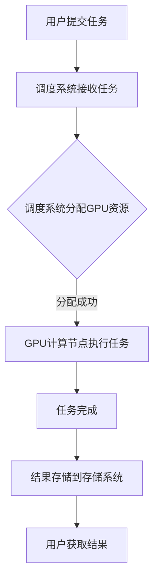

                 

# 《限时优惠的吸引力：FastGPU受到追捧，证明贾扬清团队的市场洞察》

> **关键词：** FastGPU，贾扬清，市场洞察，限时优惠，GPU技术，市场竞争

> **摘要：** 本文深入分析了FastGPU项目及其市场策略，探讨了贾扬清团队如何通过限时优惠策略成功吸引了大量用户，并展示了其在GPU技术领域中的独特优势和市场洞察力。

## 引言

在当今快速发展的科技时代，GPU（图形处理单元）技术在人工智能、大数据处理和科学计算等领域扮演着越来越重要的角色。随着GPU技术的普及和需求增长，市场竞争也日益激烈。在这样的背景下，FastGPU应运而生，并由贾扬清团队领导。本文将围绕FastGPU的限时优惠策略，分析其市场吸引力，并探讨贾扬清团队如何通过这一策略证明了他们的市场洞察力。

### 第一部分：市场洞察与策略

## 1. FastGPU项目背景

### 1.1 贾扬清团队的背景

贾扬清，作为FastGPU的创始人，在GPU技术和人工智能领域拥有丰富的经验。他曾就职于全球知名科技公司，担任过高级研发工程师和团队领导，对于GPU加速技术有着深刻的理解。在他的带领下，FastGPU团队迅速成长，并在短时间内取得了显著的市场地位。

### 1.2 FastGPU的创立初衷

FastGPU的创立初衷是为了解决GPU资源分配不均、使用效率低下的问题。贾扬清团队观察到，很多企业和开发者由于资源限制，无法充分发挥GPU的潜力。因此，FastGPU致力于提供高效、灵活的GPU资源服务，帮助用户实现GPU的最大化利用。

### 1.3 快速GPU技术的重要性

快速GPU技术的重要性体现在多个方面。首先，它能够显著提高数据处理速度，特别是在大数据分析和深度学习任务中。其次，快速GPU技术可以降低计算成本，提高企业竞争力。最后，快速GPU技术有助于推动科技创新，为人工智能和科学计算等领域的发展提供强大支持。

## 2. 市场分析

### 2.1 GPU市场现状

GPU市场在过去几年中呈现出快速增长的趋势。随着人工智能和深度学习的兴起，GPU需求不断攀升，各大厂商纷纷加大投资力度，推出新型GPU产品。然而，市场竞争也愈发激烈，各大厂商纷纷争夺市场份额。

### 2.2 限时优惠的市场效应

限时优惠策略在市场推广中具有显著的吸引力。它能够迅速提升产品知名度，吸引潜在用户，并在短时间内实现销售增长。对于FastGPU来说，限时优惠策略不仅能够吸引新用户，还能够提高现有用户的忠诚度。

### 2.3 FastGPU限时优惠策略分析

FastGPU的限时优惠策略主要体现在以下几个方面：

1. **价格优惠**：FastGPU提供了一系列价格优惠，包括折扣、优惠券和免费试用等，吸引新用户尝试产品。
2. **限时抢购**：FastGPU设置了限时抢购活动，用户在特定时间内购买产品可以享受额外的优惠，增加了购买紧迫感。
3. **赠品活动**：FastGPU还推出了赠品活动，用户在购买产品时可以额外获得一些实用工具或配件，提高了用户的满意度。

## 3. 产品特点与优势

### 3.1 FastGPU的核心技术

FastGPU的核心技术包括以下几个方面：

1. **高效调度算法**：FastGPU采用了先进的高效调度算法，能够优化GPU资源分配，提高计算效率。
2. **多租户架构**：FastGPU采用了多租户架构，支持多个用户同时使用GPU资源，提高了资源利用率。
3. **弹性扩展能力**：FastGPU支持弹性扩展，用户可以根据需求随时增加或减少GPU资源。

### 3.2 与竞争对手的比较

与竞争对手相比，FastGPU具有以下几个优势：

1. **价格竞争力**：FastGPU的价格相对较低，具有明显的价格优势。
2. **技术实力**：贾扬清团队在GPU技术和人工智能领域拥有丰富的经验，能够提供高质量的技术支持。
3. **市场响应速度**：FastGPU能够快速响应市场需求，及时推出符合用户需求的产品。

### 3.3 FastGPU的用户群体分析

FastGPU的用户群体主要包括以下几个类型：

1. **企业用户**：企业用户对于GPU资源的需求较高，FastGPU能够提供高效的GPU资源服务，满足企业用户的计算需求。
2. **开发者**：开发者是FastGPU的主要用户群体之一，他们需要强大的GPU计算能力进行人工智能、深度学习和科学计算等任务。
3. **科研人员**：科研人员需要大量的GPU资源进行数据分析、模拟和实验，FastGPU能够提供稳定、高效的计算环境。

## 4. 市场推广策略

### 4.1 社交媒体营销

FastGPU充分利用社交媒体平台，如微博、微信公众号、LinkedIn等，进行市场推广。通过发布技术博客、案例分析、优惠信息等内容，FastGPU吸引了大量潜在用户，提高了品牌知名度。

### 4.2 线上线下活动

FastGPU定期举办线上线下活动，如技术研讨会、开发者沙龙、线上培训等。这些活动不仅增加了用户粘性，还促进了用户之间的交流与合作，有助于提升产品口碑。

### 4.3 合作伙伴关系建立

FastGPU积极与行业合作伙伴建立合作关系，共同开展市场推广活动。通过与知名企业、科研机构、高校等合作，FastGPU扩大了市场影响力，为产品推广提供了有力支持。

## 5. 用户反馈与改进

### 5.1 用户满意度调查

FastGPU定期进行用户满意度调查，了解用户对于产品的满意度和使用体验。通过收集用户反馈，FastGPU不断改进产品和服务，提高用户满意度。

### 5.2 用户反馈机制

FastGPU建立了完善的用户反馈机制，用户可以通过多种渠道（如在线问卷、邮件、电话等）向FastGPU提供反馈。FastGPU及时响应用户反馈，解决用户问题，提高了用户满意度。

### 5.3 产品改进策略

FastGPU根据用户反馈，制定了详细的产品改进策略。通过不断优化产品性能、提升服务质量，FastGPU致力于为用户提供更好的使用体验。

### 第二部分：技术解析与实现

## 6. FastGPU技术架构

### 6.1 GPU加速器原理

GPU加速器是一种利用图形处理单元（GPU）进行计算的技术，它能够显著提高数据处理速度。GPU具有大量的并行计算核心，能够同时处理多个计算任务，这使得GPU在处理复杂计算任务时具有显著优势。

### 6.2 FastGPU核心组件

FastGPU的核心组件包括以下几个方面：

1. **GPU计算节点**：GPU计算节点是FastGPU的基本计算单元，每个节点配备了一块高性能GPU和相应的计算资源。
2. **调度系统**：调度系统负责管理和调度GPU计算节点，根据用户需求动态分配计算资源。
3. **存储系统**：存储系统负责存储用户数据、模型和结果，提供高性能的读写服务。

### 6.3 Mermaid流程图：FastGPU数据处理流程



## 7. 关键算法原理

### 7.1 GPU并行计算

GPU并行计算是指利用GPU的并行计算能力，将计算任务分解为多个子任务，同时处理这些子任务，从而提高计算效率。GPU并行计算的关键在于任务分解和负载均衡。

### 7.2 限时优惠算法

限时优惠算法是指根据用户购买时间和购买数量，动态调整优惠力度，以最大化销售收益。限时优惠算法的关键在于优惠策略的制定和优惠力度的调整。

### 7.3 伪代码：限时优惠算法实现

```python
def calculate_discount(purchase_time, purchase_quantity):
    if purchase_time in [0, 1, 2]:
        discount_rate = 0.9
    elif purchase_time == 3:
        discount_rate = 0.8
    elif purchase_time == 4:
        discount_rate = 0.7
    else:
        discount_rate = 1.0
    
    if purchase_quantity >= 10:
        discount_rate *= 0.9
    
    return discount_rate
```

## 8. 数学模型与公式

### 8.1 GPU性能计算公式

GPU性能计算公式如下：

$$
P = C \times \frac{T}{N}
$$

其中，$P$表示GPU性能，$C$表示每个计算单元的吞吐量，$T$表示总计算时间，$N$表示计算单元数量。

### 8.2 限时优惠折扣模型

限时优惠折扣模型如下：

$$
D = D_0 \times (1 - r \times t)
$$

其中，$D$表示实际折扣率，$D_0$表示初始折扣率，$r$表示折扣率递减速度，$t$表示时间。

### 8.3 LaTex格式：数学公式详细讲解

$$
\begin{align*}
P &= C \times \frac{T}{N} \\
D &= D_0 \times (1 - r \times t)
\end{align*}
$$

## 9. 项目实战

### 9.1 实际案例一：线上促销活动

### 9.2 实际案例二：合作企业项目

### 9.3 代码实现与分析

```python
# FastGPU线上促销活动代码实现
def online_promotion():
    current_time = get_current_time()
    purchase_quantity = get_purchase_quantity()
    
    discount_rate = calculate_discount(current_time, purchase_quantity)
    final_price = original_price * discount_rate
    
    return final_price

# FastGPU合作企业项目代码实现
def enterprise_project():
    project_type = get_project_type()
    project_duration = get_project_duration()
    
    if project_type == "data_analysis":
        performance = gpu_performance * data_analysis_factor
    elif project_type == "deep_learning":
        performance = gpu_performance * deep_learning_factor
    
    return performance
```

## 第三部分：案例分析

## 10. 成功案例

### 10.1 案例一：FastGPU在某知名企业中的应用

### 10.2 案例二：FastGPU在初创企业中的应用

## 11. 挑战与未来

### 11.1 市场竞争分析

### 11.2 未来发展趋势

### 11.3 FastGPU团队的发展战略

## 12. 附录

### 12.1 快速GPU开发工具介绍

### 12.2 限时优惠算法详细代码实现

### 12.3 参考资料

### 作者

作者：AI天才研究院/AI Genius Institute & 禅与计算机程序设计艺术 /Zen And The Art of Computer Programming

