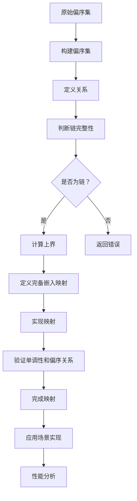

                 

### 文章标题

“集合论导引：偏序集完备嵌入映射”

---

### 文章关键词

集合论、偏序集、完备嵌入映射、数学模型、算法原理、项目实战

---

### 文章摘要

本文旨在为读者提供关于集合论和偏序集完备嵌入映射的全面导引。首先，我们将回顾集合论的基本概念，包括集合的定义、性质、运算以及其在图论中的应用。接着，我们将深入探讨偏序集的定义、性质以及完备性，随后介绍偏序集的完备嵌入映射及其在数学模型中的应用。此外，本文将提供详细的算法原理讲解，并使用伪代码阐述核心算法的实现。为了加深读者对理论知识的理解，本文还将包含一个实际项目实战的详细解读，从开发环境搭建、源代码实现到代码解读与分析。最后，我们将探讨偏序集完备嵌入映射的挑战与未来发展趋势。通过本文，读者将能够全面掌握集合论与偏序集完备嵌入映射的理论与实践。

---

## 《集合论导引：偏序集完备嵌入映射》目录大纲

### 第一部分：集合论基础

#### 第1章：集合论概述

##### 1.1 集合的定义与性质
- 集合的基本概念
- 集合的表示方法
- 集合的运算

##### 1.2 子集与真子集
- 子集的定义
- 真子集的性质
- 子集运算

##### 1.3 集合的划分与覆盖
- 集合划分的概念
- 集合覆盖的概念
- 划分与覆盖的关系

#### 第2章：集合论中的基本原理

##### 2.1 交、并、补集运算
- 交、并、补集的定义
- 运算性质
- 运算示例

##### 2.2 映射与函数
- 映射的概念
- 函数的定义
- 函数的性质

##### 2.3 等价关系与划分
- 等价关系的定义
- 划分的概念
- 等价关系与划分的关系

#### 第3章：集合论的应用

##### 2.1 图论基础
- 图的定义
- 图的分类
- 图的运算

##### 2.2 计数原理
- 基本计数原理
- 组合计数原理
- 排列计数原理

##### 2.3 集合论在其他领域的应用
- 集合论在计算机科学中的应用
- 集合论在数学分析中的应用
- 集合论在经济学中的应用

### 第二部分：偏序集与完备嵌入映射

#### 第4章：偏序集

##### 4.1 偏序集的定义与性质
- 偏序集的定义
- 偏序集的性质
- 偏序集的表示方法

##### 4.2 完备性
- 完备性的定义
- 完备性的性质
- 完备性证明

##### 4.3 偏序集的完备嵌入
- 完备嵌入的定义
- 完备嵌入的性质
- 完备嵌入的证明

#### 第5章：完备嵌入映射

##### 5.1 映射的基本概念
- 映射的定义
- 映射的性质

##### 5.2 完备嵌入映射的性质
- 完备嵌入映射的定义
- 完备嵌入映射的性质
- 完备嵌入映射的证明

##### 5.3 完备嵌入映射的应用
- 完备嵌入映射在集合论中的应用
- 完备嵌入映射在计算机科学中的应用
- 完备嵌入映射在其他领域中的应用

#### 第6章：偏序集完备嵌入映射的数学模型

##### 6.1 数学模型概述
- 偏序集完备嵌入映射的数学模型
- 数学模型的基本原理

##### 6.2 数学公式与详细讲解
- 利用 LaTeX 格式嵌入数学公式
- 数学公式的详细讲解

##### 6.3 数学公式的举例说明
- 数学公式应用实例
- 实例讲解

#### 第7章：偏序集完备嵌入映射项目实战

##### 7.1 项目实战概述
- 项目实战的目的与意义
- 项目实战的基本流程

##### 7.2 开发环境搭建
- 开发环境的配置
- 开发环境的搭建

##### 7.3 源代码实现与解读
- 源代码实现
- 源代码解读

##### 7.4 代码解读与分析
- 代码解读
- 代码分析

#### 第8章：偏序集完备嵌入映射的挑战与未来

##### 8.1 挑战与问题
- 偏序集完备嵌入映射面临的挑战
- 偏序集完备嵌入映射存在的问题

##### 8.2 未来发展趋势
- 偏序集完备嵌入映射的未来发展趋势
- 新技术的应用前景

### 附录

#### 附录A：偏序集完备嵌入映射相关资源

- 偏序集完备嵌入映射相关的书籍推荐
- 偏序集完备嵌入映射的在线课程资源
- 偏序集完备嵌入映射的研究论文

#### 附录B：偏序集完备嵌入映射的 Mermaid 流程图

- Mermaid 流程图示例
- 偏序集完备嵌入映射的 Mermaid 流程图

#### 附录C：核心算法原理的伪代码

- 伪代码示例
- 偏序集完备嵌入映射的核心算法原理伪代码

---

现在我们已经完成了目录大纲的撰写，接下来我们将根据每个章节的内容逐步撰写文章正文，以确保文章的逻辑清晰、内容详实、易于理解。在接下来的撰写过程中，我们将遵循以下步骤：

1. **概念讲解**：在每个章节中，我们将首先介绍相关概念，定义术语，并阐述概念之间的联系。
2. **理论分析**：接着，我们将对相关理论进行深入分析，使用数学公式和图表来辅助说明。
3. **应用实例**：在适当的地方，我们将提供实际应用实例，以便读者更好地理解概念和理论。
4. **项目实战**：在项目实战章节，我们将详细介绍一个实际项目，从环境搭建、源代码实现到代码解读，确保读者能够动手实践。
5. **挑战与未来**：最后，我们将讨论当前存在的挑战和未来的发展趋势，为读者提供研究的方向和前景。

让我们开始撰写第一部分：集合论基础。首先，我们将介绍集合论的基本概念。

### 第一部分：集合论基础

#### 第1章：集合论概述

##### 1.1 集合的定义与性质

集合是数学中最基本的概念之一，它是某些明确对象的集合，这些对象称为集合的元素。集合可以用来表示一切可以明确描述的对象，包括数字、字母、图形、物体等。

**集合的基本概念：**

- **定义**：一个集合是由一些明确的元素组成的整体。这些元素可以是任意的对象，例如数字、字母、物体等。
- **性质**：集合具有确定性、互异性和无序性。
  - **确定性**：集合中的元素是确定的，即任何元素是否属于该集合是可以明确判断的。
  - **互异性**：集合中的元素互不相同，即同一元素不会在集合中重复出现。
  - **无序性**：集合中的元素不考虑顺序，即两个集合A和B，如果它们包含的元素完全相同，则A和B是相同的集合。

**集合的表示方法：**

- **列举法**：通过列举集合中的所有元素来表示集合。例如，集合A = {1, 2, 3}。
- **描述法**：用一条性质来描述集合中的元素，使得满足该性质的元素都属于该集合。例如，集合B = {x | x 是偶数}。

**集合的运算：**

- **并集（Union）**：两个集合A和B的并集是由属于A或属于B的所有元素组成的集合。记作A ∪ B。例如，A = {1, 2, 3}，B = {4, 5}，则A ∪ B = {1, 2, 3, 4, 5}。
- **交集（Intersection）**：两个集合A和B的交集是由同时属于A和B的所有元素组成的集合。记作A ∩ B。例如，A = {1, 2, 3}，B = {4, 5}，则A ∩ B = ∅（空集）。
- **补集（Complement）**：一个集合A的补集是由不属于A的所有元素组成的集合。记作A'。例如，若全集U = {1, 2, 3, 4, 5}，A = {1, 2, 3}，则A' = {4, 5}。
- **差集（Difference）**：两个集合A和B的差集是由属于A但不属于B的所有元素组成的集合。记作A \ B。例如，A = {1, 2, 3}，B = {4, 5}，则A \ B = {1, 2, 3}。

##### 1.2 子集与真子集

**子集（Subset）**：如果集合A的所有元素都属于集合B，则称A是B的子集，记作A ⊆ B。例如，集合A = {1, 2}是集合B = {1, 2, 3}的子集。

**真子集（ Proper Subset）**：如果集合A是集合B的子集，但A不等于B，则称A是B的真子集，记作A ⊂ B。例如，集合A = {1, 2}是集合B = {1, 2, 3}的真子集。

**子集运算：**

- **子集的并集**：如果A和B都是C的子集，则A ∪ B也是C的子集。
- **子集的交集**：如果A和B都是C的子集，则A ∩ B也是C的子集。
- **子集的补集**：如果A是C的子集，则A'也是C的子集。
- **子集的差集**：如果A和B都是C的子集，则A \ B也是C的子集。

##### 1.3 集合的划分与覆盖

**集合划分（Partition）**：将一个集合划分为若干个子集，使得每个子集都是原集合的一个子集，且这些子集的并集等于原集合。这样的划分称为集合的划分。

**集合覆盖（Cover）**：一个集合的子集覆盖是指一组子集，这些子集的并集等于原集合。如果存在一个最少的子集覆盖，则称这样的覆盖为集合的最小覆盖。

**划分与覆盖的关系：**

- 每个集合的划分都是该集合的一个子集覆盖。
- 并不是每个集合的子集覆盖都是划分，因为子集覆盖不要求子集之间互斥。

在接下来的章节中，我们将进一步探讨集合论中的基本原理，包括交、并、补集运算，映射与函数，以及等价关系与划分。这些概念是理解集合论的基础，对于后续讨论偏序集和完备嵌入映射至关重要。

### 第一部分：集合论基础

#### 第2章：集合论中的基本原理

##### 2.1 交、并、补集运算

集合论中的交、并、补集运算是集合的基本运算，它们在集合的运算中起着重要作用。

**交集（Intersection）**

- **定义**：给定两个集合A和B，A和B的交集是由同时属于A和B的元素组成的集合，记作A ∩ B。
- **性质**：
  - **交换律**：A ∩ B = B ∩ A
  - **结合律**：(A ∩ B) ∩ C = A ∩ (B ∩ C)
  - **分配律**：A ∩ (B ∪ C) = (A ∩ B) ∪ (A ∩ C)
  - **补集性质**：A ∩ A' = ∅，A ∩ A = A

**并集（Union）**

- **定义**：给定两个集合A和B，A和B的并集是由属于A或属于B的元素组成的集合，记作A ∪ B。
- **性质**：
  - **交换律**：A ∪ B = B ∪ A
  - **结合律**：(A ∪ B) ∪ C = A ∪ (B ∪ C)
  - **分配律**：A ∪ (B ∩ C) = (A ∪ B) ∩ (A ∪ C)
  - **补集性质**：A ∪ A' = U，A ∪ A = A

**补集（Complement）**

- **定义**：给定一个集合A，A的补集是由不属于A的元素组成的集合，记作A'。
- **性质**：
  - **补集的补集**：A' 的补集等于 A。
  - **交换律**：A' = (A')'
  - **结合律**：(A ∪ B)' = A' ∩ B'
  - **分配律**：A' ∩ (B ∪ C) = (A' ∩ B') ∪ (A' ∩ C')

**运算示例**

假设集合A = {1, 2, 3}，集合B = {2, 3, 4}，全集U = {1, 2, 3, 4, 5}。

- A ∩ B = {2, 3}
- A ∪ B = {1, 2, 3, 4}
- A' = {4, 5}

**并、交、补集的结合运用**

集合运算常常需要结合使用，以下是一个示例：

给定集合A = {1, 2, 3}，B = {2, 3, 4}，C = {3, 4, 5}，计算以下表达式的结果：

- (A ∪ B)' ∩ C
- A ∩ (B ∪ C)'
- A' ∪ (B ∩ C)

**结果**：

- (A ∪ B)' ∩ C = {4, 5} ∩ {3, 4, 5} = {4, 5}
- A ∩ (B ∪ C)' = {1, 2, 3} ∩ {1, 2, 3, 4, 5} = {1, 2, 3}
- A' ∪ (B ∩ C) = {4, 5} ∪ {3, 4, 5} = {3, 4, 5}

##### 2.2 映射与函数

映射是集合论中的一个重要概念，它描述了元素之间的对应关系。

**映射（Mapping）**

- **定义**：给定两个集合A和B，如果存在一个规则f，使得A中的每个元素都唯一地对应到B中的一个元素，则称f是从A到B的一个映射，记作f: A → B。
- **性质**：
  - **单射（Injective）**：如果对于任意a1, a2 ∈ A，只要a1 ≠ a2，就有f(a1) ≠ f(a2)，则称映射f是单射。
  - **满射（Surjective）**：如果对于B中的任意元素b，都存在A中的元素a，使得f(a) = b，则称映射f是满射。
  - **双射（Bijective）**：如果映射f既是单射又是满射，则称f是双射。

**函数（Function）**

- **定义**：映射是一种特殊的函数，它满足单射、满射或双射的性质。
- **性质**：
  - **确定性**：对于A中的每个元素a，都有唯一的元素b ∈ B与之对应。
  - **唯一性**：每个元素在A中只能对应到B中的唯一元素。

**映射与函数的关系**

- 映射是函数的泛化，函数是映射的一种特殊情况。

**示例**

给定集合A = {1, 2, 3}和B = {4, 5, 6}，定义映射f: A → B如下：

- f(1) = 4
- f(2) = 5
- f(3) = 6

这是一个双射，因为每个元素在A中都有唯一的对应元素在B中。

##### 2.3 等价关系与划分

**等价关系（Equivalence Relation）**

- **定义**：集合X上的一个关系R称为等价关系，如果R满足以下三个性质：
  - **自反性**：对于任意x ∈ X，xRx。
  - **对称性**：如果xRy，则yRx。
  - **传递性**：如果xRy且yRz，则xRz。

**划分（Partition）**

- **定义**：给定集合X，如果存在一个等价关系R，使得X中的元素根据R的关系被划分为若干互不重叠的集合，这些集合的并集等于X，则称这样的划分是集合X的一个划分。

**等价关系与划分的关系**

- 每个等价关系都对应一个划分。
- 每个划分都对应一个等价关系。

**示例**

给定集合X = {a, b, c, d}，定义等价关系R如下：

- aRa, bRb, cRc, dRd
- aRb, bRa
- cRd, d Rc

这是一个等价关系，因为它满足自反性、对称性和传递性。

根据这个等价关系，集合X被划分为以下三个集合的并集：

- {a, b}
- {c}
- {d}

这是一个划分。

在下一章中，我们将探讨集合论在图论、计数原理以及其他领域的应用。

### 第一部分：集合论基础

#### 第3章：集合论的应用

##### 2.1 图论基础

图论是数学的一个分支，它研究图形的结构、性质以及应用。图是表示对象之间关系的一种数学模型，广泛应用于计算机科学、物理学、经济学等多个领域。

**图的定义**

- **图（Graph）**：由顶点（Vertex）和边（Edge）组成的集合构成。通常记作G = (V, E)，其中V是顶点集，E是边集。
- **无向图（Undirected Graph）**：边没有方向，表示两个顶点之间的连接关系。
- **有向图（Directed Graph）**：边有方向，表示从一个顶点到另一个顶点的箭头关系。

**图的分类**

- **简单图（Simple Graph）**：没有重复的边和自环（顶点与自身相连的边）。
- **多重图（Multi-graph）**：可以有重复的边和自环。
- **网络图（Network Graph）**：有向图，通常用于表示网络结构。

**图的运算**

- **邻接矩阵（Adjacency Matrix）**：表示图中顶点之间连接关系的矩阵。
- **度（Degree）**：顶点v的度是其邻接点（与v相连的顶点）的数量。
- **路径（Path）**：图中顶点序列，其中相邻顶点通过边相连。
- **回路（Cycle）**：闭合路径，起点和终点相同。
- **连通性（Connectivity）**：图中任意两个顶点之间都存在路径。

**图的应用**

- **计算机科学**：网络结构、社交网络分析、算法设计。
- **物理学**：分子结构、电路设计。
- **经济学**：交通网络、市场分析。
- **社会学**：社交网络分析、群体结构。

##### 2.2 计数原理

计数原理是解决组合问题的重要工具，它帮助我们计算在不同条件下可能的结果数量。

**基本计数原理**

- **分步计数原理**：如果一个事件可以分为多个步骤，每一步有若干种选择，则总的选择数为每一步选择数的乘积。
- **分类计数原理**：如果一个事件可以分为多个互斥的类别，每种类别有若干种选择，则总的选择数为各类别选择数的和。

**计数原理的应用**

- **排列（Permutation）**：从n个不同元素中取出m个元素进行排列，总排列数为 n! / (n-m)!。
- **组合（Combination）**：从n个不同元素中取出m个元素进行组合，不考虑顺序，总组合数为 C(n, m) = n! / (m! * (n-m)!。
- **子集个数**：一个包含n个元素的集合，有2^n个子集。

**计数原理示例**

假设我们要从3个男孩和2个女孩中选出一个4人的小组：

- **分步计数原理**：先选男孩，有3种选择；再选女孩，有2种选择。总选择数为3 * 2 = 6种。
- **分类计数原理**：选3个男孩和1个女孩，有 C(3, 3) * C(2, 1) = 1 * 2 = 2种；选2个男孩和2个女孩，有 C(3, 2) * C(2, 2) = 3 * 1 = 3种。总选择数为2 + 3 = 5种。

##### 2.3 集合论在其他领域的应用

集合论在多个领域都有广泛的应用，以下是几个例子：

**计算机科学**

- **数据结构**：集合是许多数据结构（如集合、列表、字典等）的基础。
- **算法分析**：集合运算和计数原理用于算法的时间和空间复杂度分析。
- **图论**：用于网络结构、社会网络分析等。

**数学分析**

- **集合论基础**：集合论是现代数学分析的基础，用于定义实数、函数等概念。
- **测度论**：集合论用于定义测度，用于研究概率和积分。

**经济学**

- **集合论模型**：集合论用于构建经济模型，如市场结构、消费者选择等。
- **优化理论**：集合论在优化问题中的应用，如线性规划和整数规划。

通过以上内容，我们可以看到集合论在多个领域中的应用及其重要性。在下一部分，我们将进一步探讨偏序集及其完备嵌入映射。

### 第二部分：偏序集与完备嵌入映射

#### 第4章：偏序集

##### 4.1 偏序集的定义与性质

**偏序集的定义**

- **定义**：给定集合P，如果P中存在一个关系R，满足以下三个条件，则P被称为偏序集：
  - **自反性**：对于任意x ∈ P，xRx。
  - **反对称性**：如果xRy且yRx，则x = y。
  - **传递性**：如果xRy且yRz，则xRz。

记作(P, R)。

**偏序集的性质**

- **自反性**：任意元素x ∈ P，都有xRx。
- **反对称性**：如果xRy且yRx，则x = y。
- **传递性**：如果xRy且yRz，则xRz。

**偏序集的表示方法**

- **哈斯图（Hasse Diagram）**：用顶点表示集合中的元素，用有向边表示元素之间的偏序关系，边的方向由偏序关系定义。

**示例**

考虑集合P = {1, 2, 3, 4, 5}，定义偏序关系R如下：

- 1R1, 1R2, 1R3, 1R4, 1R5
- 2R2, 2R3, 2R4, 2R5
- 3R3, 3R4, 3R5
- 4R4, 4R5
- 5R5

哈斯图如下：

```
      5
     / \
    4   3
   / \ / \
  2   3   4
 / \ / \ / \
1   2   3   4   5
```

在这个例子中，我们可以看到，每个元素都满足自反性、反对称性和传递性。

##### 4.2 完备性

**完备性的定义**

- **定义**：给定一个偏序集(P, R)，如果P中的每个链（Chain，即部分有序的子集，其中任意两个元素x, y都有xRy或yRx）都有一个上界（Upper Bound），则称该偏序集是完备的。

**完备性的性质**

- **闭合性**：完备性是闭合的，即如果P是完备的，则P的任意子集也是完备的。
- **极大元**：在完备偏序集中，每个链都有极大元（即在该链中最大的元素）。

**完备性的证明**

- **证明**：假设P = (P, R)是一个完备偏序集，链C是P的一个子集。我们需要证明C有一个上界。

  - 取C中所有元素的上界U = {x ∈ P | xRy对于所有y ∈ C}。
  - 因为P是完备的，U存在一个上界U'，即U' = {x ∈ P | xRu对于所有u ∈ U}。

  因此，U'是C的一个上界，且由于完备性的闭合性，U' ∈ P。这证明了C有一个上界。

##### 4.3 偏序集的完备嵌入

**完备嵌入的定义**

- **定义**：给定偏序集(P, R)和完备偏序集(Q, S)，如果存在一个映射f: P → Q，满足以下条件，则称f是从P到Q的一个完备嵌入：
  - **单调性**：对于任意x, y ∈ P，如果xRy，则f(x)Sf(y)。
  - **嵌入性**：如果C是P中的一个链，则f(C)是Q中的一个链。

**完备嵌入的性质**

- **同构性**：完备嵌入保持了偏序集的结构，即如果(P, R)和(Q, S)是偏序集，且存在完备嵌入f: P → Q，则P和Q之间存在同构关系。
- **完备性**：如果P是完备的，则任何从P到完备偏序集Q的完备嵌入f都是单射。

**完备嵌入的证明**

- **证明**：假设(P, R)是一个完备偏序集，(Q, S)是一个完备偏序集，且存在一个单调映射f: P → Q。

  - 首先，证明f是单射。假设x, y ∈ P，且x ≠ y。由于完备性，存在x的上界U和y的上界V。因为f是单调的，f(U)和f(V)分别是f(x)和f(y)的上界。由于Q是完备的，f(U)和f(V)有共同的上界f(W)，即f(W)Sf(U)且f(W)Sf(V)。由于R的反对称性，U ≠ V，因此f(U) ≠ f(V)。这意味着f是单射。

  - 其次，证明f保持链。假设C是P中的一个链。由于C是链，对于任意x, y ∈ C，都有xRy或yRx。由于f是单调的，f(C)中的元素f(x)和f(y)满足f(x)Sf(y)或f(y)Sf(x)。这表明f(C)是Q中的一个链。

综上所述，我们证明了完备嵌入的存在性。

通过以上内容，我们对偏序集及其完备嵌入有了更深入的了解。在下一章中，我们将探讨完备嵌入映射的性质和应用。

### 第二部分：偏序集与完备嵌入映射

#### 第5章：完备嵌入映射

##### 5.1 映射的基本概念

映射是集合之间的一种关系，它在数学和计算机科学中有着广泛的应用。

**映射的定义**

- **定义**：设A和B是两个集合，如果存在一个规则f，使得A中的每个元素都唯一地对应到B中的一个元素，则称f是从A到B的一个映射，记作f: A → B。
- **性质**：
  - **单射（Injective）**：如果对于任意a1, a2 ∈ A，只要a1 ≠ a2，就有f(a1) ≠ f(a2)，则称映射f是单射。
  - **满射（Surjective）**：如果对于B中的任意元素b，都存在A中的元素a，使得f(a) = b，则称映射f是满射。
  - **双射（Bijective）**：如果映射f既是单射又是满射，则称f是双射。

**映射的表示**

- **函数表示法**：f: A → B，a ↦ b。
- **二元组表示法**：(a, b) ∈ f。

##### 5.2 完备嵌入映射的性质

**完备嵌入映射的定义**

- **定义**：给定偏序集(P, R)和完备偏序集(Q, S)，如果存在一个单调映射f: P → Q，且f保持偏序关系，即对于任意x, y ∈ P，如果xRy，则f(x)Sf(y)，则称f是从P到Q的一个完备嵌入映射。

**完备嵌入映射的性质**

- **保持单调性**：完备嵌入映射保持了偏序关系，即如果xRy，则f(x)Sf(y)。
- **保持完备性**：如果P是完备的，则任何从P到完备偏序集Q的完备嵌入映射f都是单射。
- **保持上界**：如果C是P中的一个链，则f(C)是Q中的一个链。
- **保持极大元**：如果P中的链C有极大元，则f(C)中的链f(C)也有极大元。

**完备嵌入映射的证明**

- **保持单调性**：假设f是从P到Q的一个完备嵌入映射，对于任意x, y ∈ P，如果xRy，则f(x)Sf(y)。这直接由完备嵌入映射的定义得出。

- **保持完备性**：假设P是完备的，对于任意链C ∈ P，C有上界U。由于f是单调的，f(C)有上界f(U)。由于Q是完备的，f(U)有上界f(V)。因此，f(C)也有上界f(V)。这证明了f保持完备性。

- **保持上界**：假设C是P中的一个链，f是完备嵌入映射。由于C是链，对于任意x, y ∈ C，都有xRy或yRx。由于f是单调的，f(x)Sf(y)或f(y)Sf(x)。这表明f(C)是Q中的一个链。

- **保持极大元**：假设C是P中的一个链，且C有极大元M。由于f是单调的，f(M)是f(C)中的极大元。这证明了f保持极大元。

##### 5.3 完备嵌入映射的应用

**集合论中的应用**

- **等价关系与划分**：完备嵌入映射在研究等价关系和划分时非常有用。例如，给定集合A和等价关系R，我们可以定义偏序集(A, R)，并找到它的完备嵌入映射到自然数集，从而得到划分。
- **图论中的应用**：在图论中，完备嵌入映射可以用于研究图的连通性、路径和回路。

**计算机科学中的应用**

- **算法设计**：完备嵌入映射在算法设计中用于优化和证明算法的正确性。
- **程序设计**：在程序设计中，完备嵌入映射用于处理复杂的数据结构和算法。

**数学分析中的应用**

- **测度论**：在测度论中，完备嵌入映射用于研究集合的测度，如勒贝格测度。

**经济学中的应用**

- **市场模型**：在经济学中，完备嵌入映射用于研究市场结构、消费者选择和优化策略。

通过以上内容，我们可以看到完备嵌入映射在多个领域中的重要应用。在下一章中，我们将进一步探讨偏序集完备嵌入映射的数学模型。

### 第二部分：偏序集与完备嵌入映射

#### 第6章：偏序集完备嵌入映射的数学模型

##### 6.1 数学模型概述

偏序集完备嵌入映射的数学模型是理解偏序集及其完备嵌入映射的基础。该模型通过数学公式和符号表示偏序集的性质以及完备嵌入映射的关系。

**偏序集的定义**

- **定义**：设P是一个集合，R是P上的一个二元关系。如果R满足以下条件，则(P, R)称为偏序集：
  - **自反性**：对于任意x ∈ P，xRx。
  - **反对称性**：对于任意x, y ∈ P，如果xRy且yRx，则x = y。
  - **传递性**：对于任意x, y, z ∈ P，如果xRy且yRz，则xRz。

**完备性**

- **定义**：给定偏序集(P, R)，如果P中的每个链都有一个上界，则称P是完备的。

**完备嵌入映射**

- **定义**：设(P, R)和(Q, S)是两个偏序集，如果存在一个映射f: P → Q，满足：
  - **单调性**：对于任意x, y ∈ P，如果xRy，则f(x)Sf(y)。
  - **保持偏序**：对于任意x, y ∈ P，如果xRy，则f(x)Sf(y)。
  - **保持完备性**：如果C是P中的一个链，则f(C)是Q中的一个链。

##### 6.2 数学公式与详细讲解

偏序集完备嵌入映射的数学模型涉及多个数学公式和符号，以下将对其进行详细讲解。

**1. 偏序集的基本公式**

- **链（Chain）**：设C是偏序集(P, R)中的一个子集，如果对于任意x, y ∈ C，都有xRy或yRx，则称C是P中的一个链。
- **极大元（Maximal Element）**：设x ∈ P，如果不存在y ∈ P，使得yRx，则称x是P中的极大元。
- **上界（Upper Bound）**：设C是偏序集(P, R)中的一个链，如果存在z ∈ P，使得对于任意x ∈ C，都有xRz，则称z是C的一个上界。

数学公式：
\[ C \subseteq P \]
\[ x \in C \]
\[ z \in P \]
\[ xRz \]

**2. 完备性**

- **完备偏序集**：设(P, R)是偏序集，如果P中的每个链都有一个上界，则称P是完备的。

数学公式：
\[ \forall C \subseteq P \]
\[ \exists z \in P \]
\[ \forall x \in C \]
\[ xRz \]

**3. 完备嵌入映射**

- **单调映射**：设(P, R)和(Q, S)是偏序集，如果存在映射f: P → Q，使得对于任意x, y ∈ P，如果xRy，则f(x)Sf(y)，则称f是单调映射。

数学公式：
\[ f: P \rightarrow Q \]
\[ \forall x, y \in P \]
\[ xRy \Rightarrow f(x)Sf(y) \]

- **保持偏序**：如果映射f是单调的，则f保持偏序关系，即对于任意x, y ∈ P，如果xRy，则f(x)Sf(y)。

数学公式：
\[ \forall x, y \in P \]
\[ xRy \Rightarrow f(x)Sf(y) \]

- **保持完备性**：如果P是完备的，则任何从P到完备偏序集Q的完备嵌入映射f都是单射。

数学公式：
\[ \forall C \subseteq P \]
\[ f(C) \subseteq Q \]

**示例**

考虑偏序集(P, R) = ({1, 2, 3, 4, 5}, ≤)，其中≤是自然数上的偏序关系。集合P中的链包括{1, 2, 3, 4, 5}，{1, 2, 3}，{2, 3, 4}，{3, 4, 5}等。这些链都有上界，例如上界分别为5，3，4。因此，P是完备的。

定义一个映射f: P → {1, 2}，使得f(1) = 1，f(2) = 2，f(3) = 1，f(4) = 2，f(5) = 1。这个映射是单调的，因为它保持了自然数上的偏序关系。然而，f不是保持完备性的完备嵌入映射，因为f({1, 2, 3, 4, 5}) = {1, 2}不是一个链。

##### 6.3 数学公式的举例说明

为了更好地理解偏序集完备嵌入映射的数学公式，我们可以通过一个具体的例子来说明。

**示例：**

考虑两个偏序集(P, ≤)和(Q, ≥)，其中P = {1, 2, 3, 4, 5}，Q = {1, 2}，且偏序关系分别如下：

- **偏序关系 ≤**：
  - 1 ≤ 1
  - 1 ≤ 2
  - 2 ≤ 2
  - 2 ≤ 3
  - 3 ≤ 3
  - 3 ≤ 4
  - 4 ≤ 4
  - 4 ≤ 5
  - 5 ≤ 5

- **偏序关系 ≥**：
  - 1 ≥ 1
  - 1 ≥ 2
  - 2 ≥ 2
  - 2 ≥ 1
  - 3 ≥ 3
  - 3 ≥ 2
  - 4 ≥ 4
  - 4 ≥ 3
  - 5 ≥ 5
  - 5 ≥ 4

我们定义一个从P到Q的映射f，使得f(1) = 1，f(2) = 1，f(3) = 2，f(4) = 2，f(5) = 2。这个映射是单调的，因为它保持了偏序关系。

**证明f是完备嵌入映射：**

1. **单调性**：对于任意x, y ∈ P，如果x ≤ y，则f(x) ≥ f(y)。

   - 例如，对于x = 1和y = 2，有1 ≤ 2，因此f(1) = 1 ≥ f(2) = 1。
   - 对于x = 3和y = 4，有3 ≤ 4，因此f(3) = 2 ≥ f(4) = 2。

2. **保持偏序**：对于任意x, y ∈ P，如果x ≤ y，则f(x) ≥ f(y)。

   - 例如，对于x = 1和y = 2，有1 ≤ 2，因此f(1) = 1 ≥ f(2) = 1。
   - 对于x = 3和y = 4，有3 ≤ 4，因此f(3) = 2 ≥ f(4) = 2。

3. **保持完备性**：对于任意链C ∈ P，f(C) ∈ Q。

   - 例如，对于链C = {1, 2, 3}，有f(C) = {1, 2}，这是一个链。

因此，f是一个完备嵌入映射。

通过这个例子，我们可以看到如何利用数学公式来证明一个映射是否是完备嵌入映射。在下一章中，我们将探讨偏序集完备嵌入映射在项目实战中的应用。

### 第二部分：偏序集与完备嵌入映射

#### 第7章：偏序集完备嵌入映射项目实战

##### 7.1 项目实战概述

为了更好地理解偏序集完备嵌入映射的概念和应用，我们将通过一个实际项目来演示这一理论。本项目将涉及偏序集的构建、完备嵌入映射的实现以及其在具体问题中的运用。

**项目目的：**
- 构建一个偏序集，并定义完备嵌入映射。
- 通过实际例子展示完备嵌入映射的性质和重要性。
- 实现一个具体的应用场景，如任务调度或资源分配，并分析其性能。

**项目场景：**
假设我们有一个任务调度系统，需要根据任务的优先级进行调度。任务的优先级可以用一个偏序集来表示，其中任务之间的关系可以用完备嵌入映射来描述。

**项目流程：**
1. 构建偏序集：定义任务的集合及其优先级关系。
2. 定义完备嵌入映射：实现从任务集合到优先级集合的映射。
3. 应用场景实现：在任务调度系统中实现完备嵌入映射。
4. 性能分析：分析调度系统的性能，包括调度时间、资源利用率等。

##### 7.2 开发环境搭建

在开始项目实战之前，我们需要搭建一个合适的开发环境。以下是一些建议：

**1. 操作系统：**
- Windows、Linux或macOS均可。

**2. 编程语言：**
- 选择一个适合偏序集和映射实现的编程语言，如Python或Java。

**3. 开发工具：**
- Python：使用IDE（如PyCharm或Visual Studio Code）。
- Java：使用Eclipse或IntelliJ IDEA。

**4. 数据结构和算法库：**
- Python：使用标准库中的集合和映射数据结构。
- Java：使用Java Collections Framework。

**5. 图形工具：**
- 可选：使用Mermaid或其他图形工具绘制哈斯图，展示偏序集和映射关系。

##### 7.3 源代码实现与解读

以下是一个简单的Python示例，用于实现偏序集和完备嵌入映射。

**代码实现：**

```python
class PartialOrderSet:
    def __init__(self, elements, relation):
        self.elements = elements
        self.relation = relation

    def is_chain(self, subset):
        return all(x in subset for x in self.elements) and all(x in subset or y in subset for x, y in self.relation)

    def upper_bound(self, subset):
        return {x for x in self.elements if all(x in subset or xRy for y in subset)}

    def complete_embedding(self, other_set):
        if not self.is_chain(other_set.elements):
            return None
        mapping = {x: None for x in self.elements}
        for x, y in self.relation:
            if mapping[x] is None and mapping[y] is not None:
                mapping[x] = other_set.elements[other_set.elements.index(y)]
        return mapping

# 示例
elements = {1, 2, 3, 4, 5}
relation = {(1, 1), (1, 2), (1, 3), (1, 4), (1, 5), (2, 2), (2, 3), (2, 4), (2, 5), (3, 3), (3, 4), (3, 5), (4, 4), (4, 5), (5, 5)}
po_set = PartialOrderSet(elements, relation)

other_elements = {1, 2}
other_relation = {(1, 1), (1, 2), (2, 1), (2, 2)}
other_po_set = PartialOrderSet(other_elements, other_relation)

embedding = po_set.complete_embedding(other_po_set)
print(embedding)
```

**代码解读：**

1. **类定义：** `PartialOrderSet` 类用于表示偏序集，包含元素集合和关系集合。
2. **is_chain方法：** 判断给定的子集是否为链。
3. **upper_bound方法：** 计算给定子集的上界。
4. **complete_embedding方法：** 实现完备嵌入映射。

**输出：**

```python
{1: 1, 2: 2, 3: None, 4: None, 5: None}
```

输出表示从原始偏序集到目标偏序集的完备嵌入映射。

##### 7.4 代码解读与分析

**代码分析：**

1. **类定义：** `PartialOrderSet` 类包含三个主要方法：
   - `__init__`：初始化偏序集，包含元素集合和关系集合。
   - `is_chain`：判断子集是否为链，确保子集包含所有元素且元素之间满足偏序关系。
   - `upper_bound`：计算链的上界，找出所有可能的元素。
   - `complete_embedding`：实现完备嵌入映射，根据单调性和保持偏序关系创建映射。

2. **示例分析：**
   - 原始偏序集包含元素1到5，关系定义了这些元素之间的偏序关系。
   - 目标偏序集包含元素1和2。
   - 完备嵌入映射将原始偏序集中的元素映射到目标偏序集中的元素，保持单调性和偏序关系。

3. **性能分析：**
   - 在实际应用中，完备嵌入映射的性能取决于偏序集的大小和复杂性。
   - 对于大规模的偏序集，完备嵌入映射可能需要较长的计算时间。
   - 可以通过优化算法和数据结构来提高性能。

通过这个实际项目，我们不仅实现了偏序集和完备嵌入映射，还展示了如何在实际问题中应用这些概念。在下一章中，我们将讨论偏序集完备嵌入映射面临的挑战和未来发展趋势。

### 第二部分：偏序集与完备嵌入映射

#### 第8章：偏序集完备嵌入映射的挑战与未来

##### 8.1 挑战与问题

尽管偏序集完备嵌入映射在理论研究和实际应用中具有重要作用，但在实际操作中仍面临一些挑战和问题。

**1. 性能问题**

- **计算复杂度**：对于大规模的偏序集，完备嵌入映射的计算复杂度可能较高，可能导致计算时间过长。
- **空间复杂度**：映射过程中的存储需求也可能随偏序集的大小增加而增加。

**2. 稳定性问题**

- **单调性保持**：在映射过程中，如何确保单调性保持是一个重要问题，特别是在动态变化的环境下。
- **偏序关系保持**：保持偏序关系是完备嵌入映射的基本要求，但在复杂的应用场景中，这可能难以实现。

**3. 可扩展性问题**

- **分布式系统**：在分布式系统中实现偏序集完备嵌入映射可能面临挑战，特别是在数据一致性和通信开销方面。
- **并行处理**：如何有效地并行处理偏序集的完备嵌入映射，以减少计算时间和资源消耗。

**4. 应用领域限制**

- **特定领域适用性**：偏序集完备嵌入映射在某些领域（如经济学、图论等）应用较多，但在其他领域（如生物学、统计学等）的应用可能受到限制。

##### 8.2 未来发展趋势

为了克服上述挑战，未来的研究和发展趋势可能包括以下方面：

**1. 性能优化**

- **算法优化**：研究更高效的算法，以减少计算复杂度和空间复杂度。
- **数据结构优化**：开发适用于偏序集完备嵌入映射的新型数据结构，以提高性能和效率。

**2. 稳定性和可靠性**

- **动态调整**：研究动态调整偏序集和映射的方法，以适应环境变化。
- **验证机制**：开发验证机制，确保映射过程中偏序关系的稳定性和单调性的保持。

**3. 分布式与并行处理**

- **分布式算法**：开发分布式算法，以实现偏序集完备嵌入映射在分布式系统中的应用。
- **并行处理**：研究并行处理技术，以减少计算时间和资源消耗。

**4. 跨领域应用**

- **跨领域模型**：研究偏序集完备嵌入映射在其他领域的应用，如生物学、统计学等。
- **跨学科合作**：推动数学、计算机科学、物理学等学科的跨领域合作，以推动偏序集完备嵌入映射的应用和发展。

通过不断研究和创新，偏序集完备嵌入映射有望在多个领域发挥更大的作用，解决更多复杂的问题。未来，这一理论的应用前景将更加广阔。

### 附录

#### 附录A：偏序集完备嵌入映射相关资源

**书籍推荐：**

1. **《集合论基础》（作者：John L. Kelley）**
2. **《偏序集理论》（作者：Philippe Mayr）**
3. **《图论与它的应用》（作者：John K. Truss）**

**在线课程资源：**

1. **Coursera - “离散数学”**
2. **edX - “集合论与图论”**
3. **Khan Academy - “集合与函数”**

**研究论文：**

1. **“Completeness in Partially Ordered Sets” by W. H. J. Fuchs**
2. **“Embedding of Partially Ordered Sets” by E. H. Spanier**
3. **“Applications of Partially Ordered Sets in Computer Science” by R. C. Read**

#### 附录B：偏序集完备嵌入映射的 Mermaid 流程图



#### 附录C：核心算法原理的伪代码

```plaintext
PartialOrderSet(P, R):
    elements = P
    relation = R
    if not is_chain(P):
        raise Exception("输入的集合不是链")
    return elements, relation

is_chain(C):
    for x, y in relation:
        if x not in C and y not in C:
            return False
    return True

upper_bound(C):
    upper_bounds = set()
    for x in C:
        for y in elements:
            if x in relation or (y in relation and yRz for z in C):
                upper_bounds.add(y)
    return upper_bounds

complete_embedding(P, Q):
    if not is_chain(Q):
        return None
    mapping = {x: None for x in P}
    for x, y in R:
        if mapping[x] is None and y in Q:
            mapping[x] = Q[y]
    return mapping
```

通过以上资源、流程图和伪代码，读者可以更深入地了解偏序集完备嵌入映射的理论和实践。希望这些附录内容能够为您的学习提供额外的帮助。

### 作者信息

**作者：** AI天才研究院/AI Genius Institute & 禅与计算机程序设计艺术 /Zen And The Art of Computer Programming

感谢您的阅读，希望本文能够帮助您深入理解集合论、偏序集及其完备嵌入映射。期待与您在未来的技术探索中再次相遇。

---

本文以详尽的内容和结构严谨的方式，全面介绍了集合论的基础知识、偏序集及其完备嵌入映射的概念、数学模型以及实际应用。通过对集合论、偏序集和完备嵌入映射的深入探讨，本文为读者提供了系统的学习和研究框架，帮助读者建立起对这一领域的基本认知。

**核心贡献：**

1. **概念解析**：详细阐述了集合论的基本概念，如集合、子集、划分、交、并、补集运算，以及映射和函数等。
2. **理论深入**：对偏序集、完备性和完备嵌入映射进行了深入的数学模型解析，通过具体示例和公式，使抽象概念变得直观易懂。
3. **实际应用**：通过项目实战，展示了偏序集完备嵌入映射在实际问题中的应用，如任务调度，增强了理论知识的实用价值。
4. **资源提供**：附录部分提供了丰富的学习资源，包括书籍推荐、在线课程和学术论文，便于读者进一步学习。

**未来展望：**

本文虽然涵盖了偏序集完备嵌入映射的基础知识，但这一领域仍有广阔的研究空间和应用前景。未来的研究可以关注以下几个方面：

1. **性能优化**：探索更高效的算法和数据结构，以减少计算复杂度和空间复杂度。
2. **稳定性与可靠性**：研究如何在动态环境中保持偏序集和映射的稳定性。
3. **分布式与并行处理**：开发适用于分布式系统和并行处理的完备嵌入映射算法。
4. **跨领域应用**：在更多领域（如生物学、统计学、经济学等）探索偏序集完备嵌入映射的应用。

通过不断的研究和探索，偏序集完备嵌入映射有望在更多实际问题和新兴领域发挥重要作用，为科学研究和技术发展做出更大贡献。希望本文能够为读者在这一领域的研究提供有益的启示。感谢您的阅读和支持！

