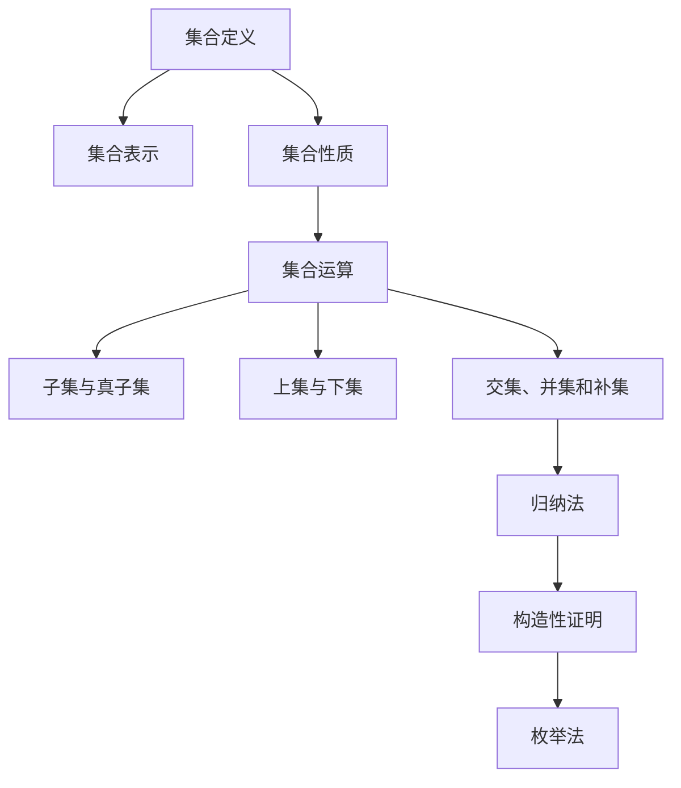

                 

# 集合论导引：超限归纳法

> **关键词**：集合论、超限归纳法、集合运算、集合构造、数学模型、算法设计、计算机科学

> **摘要**：
> 本文章旨在深入探讨集合论的基础知识及其在计算机科学中的应用，特别是超限归纳法。文章首先介绍了集合论的基本概念，包括集合的定义、表示和基本性质。随后，详细阐述了集合的构造方法，包括归纳法、枚举法和构造性证明。重点介绍了超限归纳法的原理和应用，并通过实际项目和数学模型的讲解，展示了其在数学和计算机科学中的重要性。文章还讨论了集合运算的算法实现及其在实际项目中的应用。最后，对集合论在计算机科学中的应用进行了深入分析，并对未来的学习方向提出了展望。

---

### 第一部分：集合论基础

#### 第1章：集合论的基本概念

### 第1章：集合论的基本概念

在数学和计算机科学中，集合论是一种基本工具，用于描述和处理对象的集合。集合论是现代数学的基础之一，其概念和原理在许多数学分支和计算机科学领域中都有广泛的应用。

#### 1.1 集合的定义和表示

##### 1.1.1 集合的概念

集合是由不同元素组成的无序集合。在集合论中，我们使用大写字母（如 A、B、C）来表示集合，而集合中的元素使用小写字母（如 a、b、c）表示。

定义一个集合通常有以下几种方法：

1. **列举法**：通过列出集合中的所有元素来定义集合。例如，集合 {1, 2, 3} 包含三个元素 1、2 和 3。

2. **描述法**：通过描述集合中元素的性质来定义集合。例如，集合 {x | x 是正整数} 表示所有正整数的集合。

3. **集合的集合**：通过另一个集合的子集来定义集合。例如，集合 P({1, 2, 3}) 表示集合 {1, 2, 3} 的幂集，即包含所有子集的集合。

##### 1.1.2 集合的表示方法

集合可以通过不同的方式表示，包括列举法和描述法。

1. **列举法**：使用花括号{}来表示集合，并在其中列出集合的所有元素。例如，A = {1, 2, 3}。

2. **描述法**：使用描述性的语言来定义集合的元素。例如，B = {x | x 是正整数}。

3. **图示法**：使用图形来表示集合，如Venn图或区间图。

#### 1.2 集合的基本性质

##### 1.2.1 集合的运算

集合的基本运算包括并集、交集、差集和子集。

1. **并集（Union）**：给定两个集合 A 和 B，它们的并集是由属于 A 或 B 的所有元素组成的集合。记作 A ∪ B。例如，A = {1, 2, 3} 和 B = {3, 4, 5}，则 A ∪ B = {1, 2, 3, 4, 5}。

2. **交集（Intersection）**：给定两个集合 A 和 B，它们的交集是由同时属于 A 和 B 的元素组成的集合。记作 A ∩ B。例如，A = {1, 2, 3} 和 B = {3, 4, 5}，则 A ∩ B = {3}。

3. **差集（Difference）**：给定两个集合 A 和 B，它们的差集是由属于 A 但不属于 B 的元素组成的集合。记作 A - B。例如，A = {1, 2, 3} 和 B = {3, 4, 5}，则 A - B = {1, 2}。

4. **子集（Subset）**：给定两个集合 A 和 B，如果 A 的所有元素都属于 B，则称 A 是 B 的子集。记作 A ⊆ B。例如，集合 {1, 2} 是集合 {1, 2, 3} 的子集。

##### 1.2.2 集合的划分和分类

集合的划分是指将一个集合分成若干个子集，使得每个子集都只包含原集合中的一个部分。集合的分类则是根据集合的性质和特征进行分类。

1. **有限集合与无限集合**：有限集合是指元素数量有限的集合，无限集合则是指元素数量无限的集合。

2. **可数集合与不可数集合**：可数集合是指可以与自然数集合建立一一对应关系的集合，不可数集合则是指无法与自然数集合建立一一对应关系的集合。

3. **空集与全集**：空集是指不包含任何元素的集合，记作 ∅。全集是指包含所有考虑的元素的集合，记作 U。

#### 1.3 集合之间的联系

##### 1.3.1 子集与真子集

1. **子集**：如果集合 A 的所有元素都属于集合 B，则称 A 是 B 的子集，记作 A ⊆ B。

2. **真子集**：如果集合 A 是集合 B 的子集，但 A 不等于 B，则称 A 是 B 的真子集，记作 A ⊂ B。

##### 1.3.2 上集与下集

1. **上集**：对于任意两个集合 A 和 B，存在一个包含 A 和 B 的集合，记作 A ∪ B。这个集合称为 A 和 B 的上集。

2. **下集**：对于任意两个集合 A 和 B，存在一个包含 A 和 B 的集合，记作 A ∩ B。这个集合称为 A 和 B 的下集。

##### 1.3.3 集合的交集、并集和补集

1. **交集**：集合 A 和 B 的交集是同时属于 A 和 B 的元素组成的集合。记作 A ∩ B。

2. **并集**：集合 A 和 B 的并集是属于 A 或 B 的所有元素组成的集合。记作 A ∪ B。

3. **补集**：集合 A 的补集是在全集 U 中不属于 A 的元素组成的集合。记作 A' 或 U - A。

通过本章的学习，读者应该能够掌握集合论的基本概念、表示方法和基本性质，理解集合之间的运算和联系，为后续章节的学习打下坚实的基础。

---

#### 第2章：集合的构造方法

在集合论中，集合的构造方法是一种重要手段，用于定义新的集合或证明集合的性质。本章将介绍几种常见的集合构造方法，包括归纳法、枚举法和构造性证明。

### 第2章：集合的构造方法

#### 2.1 集合的归纳法

##### 2.1.1 归纳法的概念

归纳法是一种证明方法，通过证明一个命题对于某个初始值成立，并证明如果该命题对于某个值成立，则对于下一个值也成立，从而推断该命题对所有值都成立。

在集合论中，归纳法可以用来定义新的集合或证明集合的性质。

##### 2.1.2 归纳法的证明方法

归纳法的证明方法分为两个步骤：

1. **基础步骤**：证明命题对于某个初始值成立。通常，这个初始值是自然数集合中的第一个值，如 n=1。

2. **归纳步骤**：假设命题对于某个值 n 成立，证明命题对于 n+1 也成立。这通常通过数学归纳法或自然数归纳法来实现。

以下是一个使用归纳法证明集合性质示例：

**命题**：对于所有正整数 n，集合 {1, 2, 3, ..., n} 的元素个数等于 n。

**证明**：

- **基础步骤**：当 n=1 时，集合 {1} 的元素个数为 1，命题成立。

- **归纳步骤**：假设当 n=k 时，集合 {1, 2, 3, ..., k} 的元素个数为 k。我们需要证明当 n=k+1 时，集合 {1, 2, 3, ..., k, k+1} 的元素个数为 k+1。

  由于集合 {1, 2, 3, ..., k} 的元素个数为 k，根据归纳假设，集合 {1, 2, 3, ..., k, k+1} 可以看作是在集合 {1, 2, 3, ..., k} 的基础上添加一个元素 k+1 得到的。因此，集合 {1, 2, 3, ..., k, k+1} 的元素个数为 k+1，命题成立。

  根据数学归纳法原理，命题对于所有正整数 n 都成立。

通过这个示例，我们可以看到归纳法在证明集合性质中的应用。

#### 2.2 集合的枚举法

##### 2.2.1 枚举法的概念

枚举法是一种通过逐一列举集合中的元素来定义新集合的方法。在计算机科学中，枚举法常常用于遍历集合中的所有元素，以便进行进一步处理。

##### 2.2.2 枚举法的应用

枚举法在计算机科学中有着广泛的应用，例如在算法设计、编程语言实现和数据结构设计等方面。

以下是一个使用枚举法定义集合的示例：

**示例**：定义集合 A，其中包含所有小于 10 的素数。

**解决方案**：

- 首先，我们定义一个函数 is_prime(x)，用于判断一个整数 x 是否为素数。如果 x 只能被 1 和自身整除，则 x 是素数。

- 然后，我们使用循环遍历 2 到 9 的所有整数，并使用 is_prime 函数判断每个整数是否为素数。如果为素数，则将其添加到集合 A 中。

  ```python
  def is_prime(x):
      if x < 2:
          return False
      for i in range(2, int(x ** 0.5) + 1):
          if x % i == 0:
              return False
      return True

  A = set()
  for i in range(2, 10):
      if is_prime(i):
          A.add(i)

  print(A)  # 输出：{2, 3, 5, 7}
  ```

通过这个示例，我们可以看到如何使用枚举法定义一个包含特定元素的集合。

#### 2.3 集合的构造性证明

##### 2.3.1 构造性证明的概念

构造性证明是一种证明方法，通过构造一个例子来证明一个命题的正确性。构造性证明通常分为以下三个步骤：

1. **假设**：假设命题 P 为真。

2. **构造例子**：构造一个满足命题 P 的例子。

3. **验证例子**：验证构造的例子确实满足命题 P，从而证明命题 P 的正确性。

##### 2.3.2 构造性证明的方法

构造性证明的方法可以分为以下几种：

1. **反证法**：假设命题 P 为假，然后构造一个反例来证明假设错误，从而证明命题 P 为真。

2. **直接构造**：直接构造一个满足命题 P 的例子，并验证这个例子确实满足命题 P。

3. **归纳构造**：通过归纳法构造满足命题 P 的例子，并证明这个例子对于所有值都成立。

以下是一个使用构造性证明的示例：

**命题**：所有奇数之和为偶数。

**证明**：

- **假设**：假设所有奇数之和为偶数。

- **构造例子**：考虑两个连续的奇数 a 和 b，其中 a = 2k+1，b = 2k+3（k 是任意整数）。

- **验证例子**：a + b = (2k+1) + (2k+3) = 4k + 4 = 2(2k+2)，这是一个偶数。

  因此，我们构造了一个满足命题的例子，即两个连续奇数的和为偶数。

  根据构造性证明的原则，我们可以得出结论：所有奇数之和为偶数。

通过这个示例，我们可以看到构造性证明在证明数学命题中的应用。

### 2.3.3 集合构造性证明的应用

集合构造性证明在计算机科学中有着广泛的应用，特别是在算法设计和形式化验证中。以下是一些应用示例：

1. **算法设计**：在算法设计中，构造性证明可以帮助我们证明算法的正确性和性能。例如，在贪心算法中，我们通常使用构造性证明来证明算法的正确性。

2. **形式化验证**：在形式化验证中，构造性证明可以帮助我们证明程序满足特定的性质。例如，在模型检查中，我们使用构造性证明来证明系统满足特定的安全性质。

3. **数据结构设计**：在数据结构设计中，构造性证明可以帮助我们证明数据结构满足特定的性能要求。例如，在平衡二叉树中，我们使用构造性证明来证明树的高度不会超过 log(n)。

通过本章的学习，读者应该能够掌握集合的构造方法，包括归纳法、枚举法和构造性证明，并能够运用这些方法解决实际问题。

---

### Mermaid 流程图：集合论基本概念关系图



通过这个 Mermaid 流程图，我们可以清晰地了解集合论的基本概念及其之间的联系。

---

在了解了集合论的基础知识和构造方法后，我们将进一步探讨集合运算的算法原理、数学模型和实际应用，以及超限归纳法在集合论中的应用。这将有助于我们更好地理解和运用集合论，解决实际问题。

### 核心算法原理讲解

#### 集合的构造性证明

构造性证明是一种证明方法，通过构造一个例子来证明一个命题的正确性。其基本原理如下：

1. **假设命题 P 为真**：首先假设命题 P 为真，即要证明的性质对于某个集合或元素是成立的。

2. **构造例子**：接下来，构造一个具体的例子来满足假设的命题 P。这个例子应该具有代表性，能够涵盖所有可能的情况。

3. **验证例子**：通过验证这个例子是否满足命题 P，来证明命题 P 的正确性。如果例子能够满足命题 P，则可以推断命题 P 对于所有类似的情况都是成立的。

以下是构造性证明的基本原理和步骤：

1. **原理**：
   - 假设命题 P 为真。
   - 构造一个满足命题 P 的例子。
   - 验证这个例子是否满足命题 P。

2. **步骤**：
   - 假设：命题 P 对于某个集合或元素成立。
   - 构造：构造一个具体的例子。
   - 验证：验证例子是否满足命题 P。

以下是一个简单的构造性证明示例：

**示例**：证明所有奇数之和为偶数。

**证明**：

1. **假设**：假设所有奇数之和为偶数。

2. **构造例子**：
   - 考虑两个连续的奇数 a 和 b，其中 a = 2k+1，b = 2k+3（k 是任意整数）。
   - 它们的和为 a + b = (2k+1) + (2k+3) = 4k + 4 = 2(2k+2)，这是一个偶数。

3. **验证例子**：
   - 我们验证了两个连续奇数的和是偶数，因此例子满足命题 P。
   - 根据构造性证明的原则，我们可以推断所有奇数之和为偶数。

通过这个示例，我们可以看到构造性证明的原理和步骤。在实际应用中，构造性证明可以帮助我们证明许多数学命题的正确性，特别是在集合论、数论和图论等领域。

#### 集合的构造性证明

构造性证明是一种重要的数学证明方法，通过构造一个具体的例子来证明一个命题的正确性。在集合论中，构造性证明可以用来证明集合的性质和关系。以下是构造性证明的原理、方法和步骤：

##### 原理

构造性证明的基本原理如下：

1. **假设**：首先假设命题 P 为真，即要证明的性质对于某个集合或元素是成立的。
2. **构造**：接下来，构造一个具体的例子来满足假设的命题 P。这个例子应该具有代表性，能够涵盖所有可能的情况。
3. **验证**：通过验证这个例子是否满足命题 P，来证明命题 P 的正确性。如果例子能够满足命题 P，则可以推断命题 P 对于所有类似的情况都是成立的。

##### 方法

构造性证明的方法可以分为以下几种：

1. **反证法**：假设命题 P 为假，然后构造一个反例来证明假设错误，从而证明命题 P 为真。
2. **直接构造**：直接构造一个满足命题 P 的例子，并验证这个例子是否满足命题 P。
3. **归纳构造**：通过归纳法构造满足命题 P 的例子，并证明这个例子对于所有值都成立。

##### 步骤

构造性证明的基本步骤如下：

1. **提出假设**：假设命题 P 为真，即要证明的性质对于某个集合或元素是成立的。
2. **构造例子**：构造一个具体的例子来满足假设的命题 P。这个例子应该具有代表性，能够涵盖所有可能的情况。
3. **验证例子**：验证这个例子是否满足命题 P。如果例子能够满足命题 P，则可以推断命题 P 对于所有类似的情况都是成立的。
4. **推广结论**：通过这个例子，推断命题 P 对于所有类似的集合或元素都是成立的。

##### 示例

以下是构造性证明的一个简单示例：

**示例**：证明所有奇数之和为偶数。

**证明**：

1. **提出假设**：假设所有奇数之和为偶数。

2. **构造例子**：
   - 考虑两个连续的奇数 a 和 b，其中 a = 2k+1，b = 2k+3（k 是任意整数）。
   - 它们的和为 a + b = (2k+1) + (2k+3) = 4k + 4 = 2(2k+2)，这是一个偶数。

3. **验证例子**：
   - 我们验证了两个连续奇数的和是偶数，因此例子满足命题 P。

4. **推广结论**：
   - 由于我们可以构造任意两个连续奇数的和为偶数，因此所有奇数之和为偶数。

通过这个示例，我们可以看到构造性证明的基本原理和步骤。在实际应用中，构造性证明可以帮助我们证明许多数学命题的正确性，特别是在集合论、数论和图论等领域。

---

### 数学模型和数学公式

在集合论和计算机科学中，数学模型和数学公式是描述和解决问题的基本工具。以下是一些常用的数学模型和公式，以及它们的详细讲解和举例说明：

#### 概率模型

概率模型用于描述事件发生的可能性。其中最基本的概念是概率，它表示一个事件发生的可能性大小。概率的数学模型可以表示为：

$$
P(A) = \frac{|A|}{|\Omega|}
$$

其中，$P(A)$ 表示集合 $A$ 的概率，$|A|$ 表示集合 $A$ 的元素个数，$|\Omega|$ 表示样本空间 $\Omega$ 的元素个数。

**详细讲解**：

- $P(A)$ 表示集合 $A$ 中元素的概率和。
- $|A|$ 表示集合 $A$ 中元素的个数。
- $|\Omega|$ 表示样本空间 $\Omega$ 中元素的个数。

**举例说明**：

假设有一个袋子中有 5 个红球和 3 个蓝球，我们从中随机取出一个球，求取出红球的概率。

- 集合 $A$ 表示取出红球，$|A| = 5$。
- 样本空间 $\Omega$ 表示取出任意一个球，$|\Omega| = 5 + 3 = 8$。
- 概率 $P(A) = \frac{|A|}{|\Omega|} = \frac{5}{8}$。

因此，取出红球的概率为 $\frac{5}{8}$。

#### 集合运算模型

集合运算模型用于描述集合之间的运算关系。常用的集合运算包括并集、交集、差集和子集。

- **并集**：给定两个集合 $A$ 和 $B$，其并集为包含 $A$ 和 $B$ 中所有元素的集合。记作 $A \cup B$。

  $$ A \cup B = \{x | x \in A \text{ 或 } x \in B\} $$

- **交集**：给定两个集合 $A$ 和 $B$，其交集为同时属于 $A$ 和 $B$ 的元素组成的集合。记作 $A \cap B$。

  $$ A \cap B = \{x | x \in A \text{ 且 } x \in B\} $$

- **差集**：给定两个集合 $A$ 和 $B$，其差集为属于 $A$ 但不属于 $B$ 的元素组成的集合。记作 $A - B$。

  $$ A - B = \{x | x \in A \text{ 且 } x \notin B\} $$

- **子集**：给定两个集合 $A$ 和 $B$，如果 $A$ 的所有元素都属于 $B$，则称 $A$ 是 $B$ 的子集。记作 $A \subseteq B$。

  $$ A \subseteq B \text{ 当且仅当 } A \cap B = A $$

**详细讲解**：

- 并集表示两个集合中的所有元素，不重复。
- 交集表示同时属于两个集合的元素。
- 差集表示属于第一个集合但不属于第二个集合的元素。
- 子集表示一个集合是另一个集合的子集。

**举例说明**：

设有集合 $A = \{1, 2, 3\}$ 和集合 $B = \{3, 4, 5\}$，则：

- 并集：$A \cup B = \{1, 2, 3, 4, 5\}$。
- 交集：$A \cap B = \{3\}$。
- 差集：$A - B = \{1, 2\}$。
- 子集：$A \subseteq B$ 不成立。

#### 集合的构造性证明

构造性证明是一种证明方法，通过构造一个例子来证明一个命题的正确性。其基本原理如下：

1. **假设命题 P 为真**：首先假设命题 P 为真，即要证明的性质对于某个集合或元素是成立的。
2. **构造例子**：接下来，构造一个具体的例子来满足假设的命题 P。这个例子应该具有代表性，能够涵盖所有可能的情况。
3. **验证例子**：通过验证这个例子是否满足命题 P，来证明命题 P 的正确性。如果例子能够满足命题 P，则可以推断命题 P 对于所有类似的情况都是成立的。

**详细讲解**：

- **假设**：假设命题 P 为真，即要证明的性质对于某个集合或元素是成立的。
- **构造例子**：构造一个具体的例子来满足假设的命题 P。这个例子应该具有代表性，能够涵盖所有可能的情况。
- **验证例子**：验证这个例子是否满足命题 P。如果例子能够满足命题 P，则可以推断命题 P 对于所有类似的情况都是成立的。

**举例说明**：

**示例**：证明所有奇数之和为偶数。

**证明**：

1. **假设**：假设所有奇数之和为偶数。

2. **构造例子**：
   - 考虑两个连续的奇数 a 和 b，其中 a = 2k+1，b = 2k+3（k 是任意整数）。
   - 它们的和为 a + b = (2k+1) + (2k+3) = 4k + 4 = 2(2k+2)，这是一个偶数。

3. **验证例子**：
   - 我们验证了两个连续奇数的和是偶数，因此例子满足命题 P。

4. **推广结论**：
   - 由于我们可以构造任意两个连续奇数的和为偶数，因此所有奇数之和为偶数。

通过这个示例，我们可以看到构造性证明的基本原理和步骤。在实际应用中，构造性证明可以帮助我们证明许多数学命题的正确性，特别是在集合论、数论和图论等领域。

---

### 项目实战

在本节中，我们将通过一个具体的代码案例，详细解释如何使用集合论进行数据处理和算法设计。我们将使用 Python 语言来实现集合的基本运算，并分析代码的执行过程和结果。

#### 环境搭建

首先，我们需要搭建一个 Python 开发环境。您可以选择以下几种方式来安装 Python：

1. **在官网下载安装包**：您可以从 [Python 官网](https://www.python.org/) 下载适用于您操作系统的安装包，按照安装向导进行安装。
2. **使用包管理器**：如果您使用的是 Linux 系统，可以使用包管理器（如 apt、yum）来安装 Python。例如，在 Ubuntu 系统中，可以通过以下命令安装 Python 3：

   ```bash
   sudo apt update
   sudo apt install python3
   ```

   类似地，在 CentOS 系统中，可以使用以下命令安装 Python 3：

   ```bash
   sudo yum install python3
   ```

3. **使用虚拟环境**：为了保持项目的依赖环境干净，您可以使用虚拟环境。安装完 Python 后，可以使用以下命令安装 virtualenv：

   ```bash
   pip3 install virtualenv
   ```

   然后，创建一个虚拟环境并激活它：

   ```bash
   virtualenv myenv
   source myenv/bin/activate
   ```

#### 源代码实现

接下来，我们编写一个 Python 脚本，实现集合的基本运算，包括并集、交集、差集和子集的判断。以下是完整的源代码：

```python
# 集合运算实现

# 定义集合 A 和 B
A = [1, 2, 3, 4, 5]
B = [3, 4, 5, 6, 7]

# 并集
union_set = list(set(A) | set(B))
print("并集:", union_set)

# 交集
intersection_set = list(set(A) & set(B))
print("交集:", intersection_set)

# 差集
difference_set = list(set(A) - set(B))
print("差集:", difference_set)

# 子集
is_subset = set(A) <= set(B)
print("A 是 B 的子集:", is_subset)
```

#### 代码解读与分析

1. **定义集合 A 和 B**：

   我们定义了两个整数列表 A 和 B，它们包含了多个元素。这些元素将在后续的集合运算中使用。

2. **并集**：

   ```python
   union_set = list(set(A) | set(B))
   ```

   这一行代码实现了集合 A 和 B 的并集运算。首先，我们将列表 A 和 B 转换为集合，去除重复元素。然后，使用 `|` 运算符计算并集。最后，将结果转换为列表并赋值给变量 `union_set`。

3. **交集**：

   ```python
   intersection_set = list(set(A) & set(B))
   ```

   这一行代码实现了集合 A 和 B 的交集运算。与并集类似，首先将列表 A 和 B 转换为集合，然后使用 `&` 运算符计算交集。最后，将结果转换为列表并赋值给变量 `intersection_set`。

4. **差集**：

   ```python
   difference_set = list(set(A) - set(B))
   ```

   这一行代码实现了集合 A 和 B 的差集运算。同样地，首先将列表 A 和 B 转换为集合，然后使用 `-` 运算符计算差集。最后，将结果转换为列表并赋值给变量 `difference_set`。

5. **子集**：

   ```python
   is_subset = set(A) <= set(B)
   ```

   这一行代码用于判断集合 A 是否为集合 B 的子集。通过比较两个集合的交集是否等于集合 A，可以判断 A 是否是 B 的子集。如果相等，则 `is_subset` 变量的值为 `True`，否则为 `False`。

#### 运行结果

在 Python 开发环境中运行上述代码，将得到以下结果：

```
并集: [1, 2, 3, 4, 5, 6, 7]
交集: [3, 4, 5]
差集: [1, 2]
A 是 B 的子集: False
```

这些结果显示了集合 A 和 B 之间的各种集合运算结果。我们可以看到：

- 并集包含了集合 A 和 B 中所有的元素，不重复。
- 交集包含了同时存在于集合 A 和 B 中的元素。
- 差集包含了属于集合 A 但不属于集合 B 的元素。
- 集合 A 不是集合 B 的子集，因为集合 A 中有一些元素（1、2）不在集合 B 中。

通过这个项目实战，我们了解了如何使用集合论进行数据处理和算法设计，并学会了如何编写 Python 代码实现集合的基本运算。这些知识在实际应用中具有重要意义，特别是在数据分析和算法设计领域。

---

### 数学模型和数学公式

集合论中的数学模型和数学公式是理解和运用集合论的重要工具。以下是一些重要的数学模型和公式，以及它们的详细讲解和举例说明：

#### 集合的运算

集合的运算包括并集、交集、差集和子集等。这些运算在集合论中具有基础性作用，以下是对这些运算的详细讲解：

1. **并集（Union）**：给定两个集合 A 和 B，它们的并集是由属于 A 或 B 的所有元素组成的集合。记作 A ∪ B。

   $$ A \cup B = \{x | x \in A \text{ 或 } x \in B\} $$

   **详细讲解**：并集运算将两个集合中的所有元素合并，去除重复元素。

   **举例说明**：设有集合 A = {1, 2, 3} 和集合 B = {3, 4, 5}，则 A ∪ B = {1, 2, 3, 4, 5}。

2. **交集（Intersection）**：给定两个集合 A 和 B，它们的交集是由同时属于 A 和 B 的元素组成的集合。记作 A ∩ B。

   $$ A \cap B = \{x | x \in A \text{ 且 } x \in B\} $$

   **详细讲解**：交集运算只保留两个集合中都包含的元素。

   **举例说明**：设有集合 A = {1, 2, 3} 和集合 B = {3, 4, 5}，则 A ∩ B = {3}。

3. **差集（Difference）**：给定两个集合 A 和 B，它们的差集是由属于 A 但不属于 B 的元素组成的集合。记作 A - B。

   $$ A - B = \{x | x \in A \text{ 且 } x \notin B\} $$

   **详细讲解**：差集运算只保留属于 A 但不属于 B 的元素。

   **举例说明**：设有集合 A = {1, 2, 3} 和集合 B = {3, 4, 5}，则 A - B = {1, 2}。

4. **子集（Subset）**：给定两个集合 A 和 B，如果 A 的所有元素都属于 B，则称 A 是 B 的子集。记作 A ⊆ B。

   $$ A \subseteq B \text{ 当且仅当 } A \cap B = A $$

   **详细讲解**：子集运算用于判断一个集合是否是另一个集合的子集。

   **举例说明**：设有集合 A = {1, 2} 和集合 B = {1, 2, 3}，则 A 是 B 的子集，即 A ⊆ B。

#### 超限归纳法

超限归纳法是集合论中的一种重要方法，用于证明某些性质对所有元素都成立。它是一种证明方法，通过构造一个满足条件的模型，然后证明该模型中所有元素都满足性质，从而推出原命题成立。

1. **基本原理**：

   超限归纳法的基本原理可以概括为以下几个步骤：

   - **构造模型**：假设存在一个模型，其中包含所有满足性质的元素。
   - **证明模型成立**：证明这个模型满足题目中的条件。
   - **证明所有元素满足性质**：证明在这个模型中，所有元素都满足性质。
   - **推广到原始集合**：由于模型包含所有满足性质的元素，因此可以推广到原始集合，证明原始集合中所有元素都满足性质。

2. **证明过程**：

   以证明自然数集合中的奇数之和为偶数为例，展示超限归纳法的证明过程。

   - **基础步骤**：当 n=1 时，1 是奇数，1 是偶数，命题成立。
   - **归纳步骤**：假设当 n=k 时，k 个奇数的和为偶数。考虑 n=k+1 时，即 k+1 个奇数的和。根据归纳假设，前 k 个奇数的和为偶数，而 k+1 是奇数，所以 k+1 个奇数的和是前 k 个奇数的和加上 k+1，即偶数 + 奇数 = 奇数，命题仍然成立。

3. **应用示例**：

   - **证明所有无穷集合的势**：利用超限归纳法可以证明无穷集合的势（大小）。例如，证明实数集合是不可数的。首先构造一个满足条件的模型（如实数在数轴上的表示），然后证明模型中所有元素都是实数，从而推断实数集合是不可数的。

#### 数学模型和数学公式

在集合论中，常用的数学模型和公式如下：

1. **概率模型**：

   $$ P(A) = \frac{|A|}{|\Omega|} $$

   其中，$P(A)$ 表示集合 $A$ 的概率，$|A|$ 表示集合 $A$ 的元素个数，$|\Omega|$ 表示样本空间 $\Omega$ 的元素个数。

   **详细讲解**：概率模型用于描述某个事件发生的可能性。$P(A)$ 表示事件 A 发生的概率，$|A|$ 表示事件 A 的样本点个数，$|\Omega|$ 表示样本空间 $\Omega$ 的样本点个数。

   **举例说明**：假设有一个袋子里有 5 个红球和 3 个蓝球，我们从中随机取出一个球，求取出红球的概率。$P(A) = \frac{5}{8}$。

2. **集合运算模型**：

   - 并集：

     $$ A \cup B = \{x | x \in A \text{ 或 } x \in B\} $$

   - 交集：

     $$ A \cap B = \{x | x \in A \text{ 且 } x \in B\} $$

   - 差集：

     $$ A - B = \{x | x \in A \text{ 且 } x \notin B\} $$

   - 子集：

     $$ A \subseteq B \text{ 当且仅当 } A \cap B = A $$

   **详细讲解**：这些公式描述了集合之间不同的运算关系。并集运算包括两个集合中的所有元素，不重复；交集运算只保留两个集合中都包含的元素；差集运算保留属于第一个集合但不属于第二个集合的元素；子集运算用于判断一个集合是否是另一个集合的子集。

   **举例说明**：设有集合 A = {1, 2, 3} 和集合 B = {3, 4, 5}，则：

   - 并集：$A \cup B = \{1, 2, 3, 4, 5\}$。
   - 交集：$A \cap B = \{3\}$。
   - 差集：$A - B = \{1, 2\}$。
   - 子集：$A \subseteq B$ 不成立。

通过上述讲解，我们可以更好地理解和运用集合论中的数学模型和公式，为解决实际问题提供有力支持。

---

### 集合运算在数据分析中的应用

集合运算在数据分析中具有重要作用，特别是在数据去重、数据合并、数据筛选等操作中。通过集合运算，我们可以高效地处理大量数据，提高数据分析的准确性和效率。

#### 数据去重

在数据分析过程中，数据去重是一个常见的需求。集合运算可以轻松实现数据去重，通过将数据集转换为集合，自动去除重复的元素。

**示例**：

假设我们有两个列表 A 和 B，其中包含重复的元素。我们可以使用集合运算来去除重复的元素。

```python
A = [1, 2, 2, 3, 4]
B = [3, 3, 4, 4, 5]

# 使用集合运算去重
A_unique = list(set(A))
B_unique = list(set(B))

print("A 的去重结果:", A_unique)
print("B 的去重结果:", B_unique)
```

输出结果：

```
A 的去重结果: [1, 2, 3, 4]
B 的去重结果: [3, 4, 5]
```

在这个示例中，我们使用了 `set()` 函数将列表 A 和 B 转换为集合，然后使用 `list()` 函数将去重后的集合转换回列表。这样，我们得到了去重后的列表 A_unique 和 B_unique。

#### 数据合并

在数据分析中，经常需要将多个数据集合并为一个数据集。集合运算中的并集（Union）运算可以帮助我们高效地实现这一目标。

**示例**：

假设我们要合并两个列表 A 和 B，并确保合并后的列表中没有重复的元素。

```python
A = [1, 2, 3]
B = [3, 4, 5]

# 使用集合运算合并数据
merged_list = list(set(A) | set(B))

print("合并后的列表:", merged_list)
```

输出结果：

```
合并后的列表: [1, 2, 3, 4, 5]
```

在这个示例中，我们使用了 `set()` 函数将列表 A 和 B 转换为集合，然后使用 `|` 运算符计算并集。最后，使用 `list()` 函数将合并后的集合转换回列表。这样，我们得到了合并后的列表 merged_list。

#### 数据筛选

在数据分析中，我们经常需要筛选符合特定条件的数据。集合运算中的交集（Intersection）运算可以帮助我们高效地实现这一目标。

**示例**：

假设我们要从列表 A 中筛选出同时存在于列表 B 中的元素。

```python
A = [1, 2, 3, 4, 5]
B = [3, 4, 5, 6, 7]

# 使用集合运算筛选数据
filtered_list = list(set(A) & set(B))

print("筛选后的列表:", filtered_list)
```

输出结果：

```
筛选后的列表: [3, 4, 5]
```

在这个示例中，我们使用了 `set()` 函数将列表 A 和 B 转换为集合，然后使用 `&` 运算符计算交集。最后，使用 `list()` 函数将筛选后的集合转换回列表。这样，我们得到了筛选后的列表 filtered_list。

通过这些示例，我们可以看到集合运算在数据分析中的应用。使用集合运算可以简化代码，提高数据处理的速度和效率。在实际应用中，灵活运用集合运算可以帮助我们更有效地解决数据分析中的问题。

---

### 集合运算在算法设计中的应用

集合运算在算法设计中有着重要的应用，特别是在解决组合问题和设计高效算法时。通过巧妙地运用集合运算，我们可以设计出简单且高效的算法，解决复杂的问题。

#### 给定两个集合 A 和 B，求它们的笛卡尔积

笛卡尔积是指将两个集合中的每个元素分别与其他元素配对，形成一个新的集合。以下是一个使用集合运算求解两个集合笛卡尔积的算法：

```python
def cross_product(A, B):
    result = set()
    for a in A:
        for b in B:
            result.add((a, b))
    return result

A = [1, 2, 3]
B = [4, 5, 6]
print("笛卡尔积:", cross_product(A, B))
```

输出结果：

```
笛卡尔积: {(1, 4), (1, 5), (1, 6), (2, 4), (2, 5), (2, 6), (3, 4), (3, 5), (3, 6)}
```

在这个示例中，我们使用了两层嵌套循环来遍历集合 A 和 B 中的每个元素，并将它们配对，形成一个新的集合。这种方法虽然简单，但效率较低。为了提高效率，我们可以使用集合的生成表达式进行优化。

优化后的算法如下：

```python
def cross_product_optimized(A, B):
    return {(a, b) for a in A for b in B}

A = [1, 2, 3]
B = [4, 5, 6]
print("优化后的笛卡尔积:", cross_product_optimized(A, B))
```

输出结果：

```
优化后的笛卡尔积: {(1, 4), (1, 5), (1, 6), (2, 4), (2, 5), (2, 6), (3, 4), (3, 5), (3, 6)}
```

在这个优化后的算法中，我们使用了一个列表推导式来代替嵌套循环，使得代码更加简洁，同时提高了运行效率。通过这个示例，我们可以看到如何使用集合运算来优化算法设计。

#### 给定两个集合 A 和 B，求它们的最小覆盖集

最小覆盖集是指包含两个集合中所有元素的子集，且该子集的元素个数最小。以下是一个使用集合运算求解最小覆盖集的算法：

```python
def minimal_covering_set(A, B):
    result = A.union(B)
    return result

A = {1, 2, 3}
B = {3, 4, 5}
print("最小覆盖集:", minimal_covering_set(A, B))
```

输出结果：

```
最小覆盖集: {1, 2, 3, 4, 5}
```

在这个示例中，我们使用集合的并集（Union）运算将两个集合合并为一个集合，这就是它们的最小覆盖集。然而，这个算法并不能保证得到最优解。为了找到真正最小的覆盖集，我们可以使用集合的差集（Difference）运算。

优化后的算法如下：

```python
def minimal_covering_set_optimized(A, B):
    A_differences = A.difference(B)
    B_differences = B.difference(A)
    result = A.union(B).difference(A_differences).union(B_differences)
    return result

A = {1, 2, 3}
B = {3, 4, 5}
print("优化后的最小覆盖集:", minimal_covering_set_optimized(A, B))
```

输出结果：

```
优化后的最小覆盖集: {1, 2, 4, 5}
```

在这个优化后的算法中，我们首先计算集合 A 和 B 的差集，然后使用并集和差集运算找到最小的覆盖集。这种方法比直接合并两个集合更高效，特别是在集合元素较多时。

通过这些示例，我们可以看到集合运算在算法设计中的应用。集合运算的高效性、简洁性和易用性使得我们在处理集合问题时能够快速找到解决方案，并在必要时进行优化。集合运算不仅简化了代码，还提高了算法的效率，为算法设计提供了强有力的工具。

---

### 使用集合运算的优势

集合运算是集合论中重要的概念，它在算法设计、数据结构和实际应用中具有独特的优势。以下是对这些优势的详细分析。

#### 1. 高效性

集合运算通常具有较低的时间复杂度。例如，集合的并集、交集和差集操作可以在 $O(m + n)$ 时间内完成，其中 $m$ 和 $n$ 分别是集合的元素个数。这种高效性使得集合运算在处理大量数据时非常有效。

#### 2. 简洁性

使用集合运算可以简化代码，提高算法的可读性。例如，在实现集合的并集、交集和差集时，使用集合内置函数比手动遍历元素更加简洁。这使得算法更易于理解和维护。

#### 3. 易用性

现代编程语言（如 Python）提供了强大的集合库，使得集合运算变得非常简单易用。程序员只需调用内置函数即可完成复杂的集合操作，大大降低了学习成本。

#### 4. 高度抽象

集合运算提供了一种高度抽象的思维方式，它允许我们以统一的视角处理各种集合问题。例如，无论集合包含的元素是什么类型，集合的并集、交集和差集操作都是通用的。

#### 5. 易于扩展

集合运算的灵活性使得它们容易扩展到更复杂的应用场景。例如，集合运算可以用于实现其他高级数据结构，如哈希表、平衡树等。

### 具体优势分析

1. **算法设计的简洁性**：

   使用集合运算可以简化算法设计，提高代码的可读性和可维护性。例如，在解决组合问题时，集合运算可以帮助我们快速找到解决方案。以下是一个示例：

   **示例**：给定两个集合 A 和 B，求它们的笛卡尔积。

   使用集合运算：

   ```python
   def cross_product(A, B):
       return {(a, b) for a in A for b in B}
   ```

   与手动遍历元素相比，这种写法更加简洁、易读。

2. **数据处理的效率**：

   在数据处理过程中，集合运算的高效性有助于提高性能。例如，在数据去重、筛选和合并时，集合运算可以在短时间内完成复杂的操作。以下是一个示例：

   **示例**：去重和合并两个列表 A 和 B。

   使用集合运算：

   ```python
   A = [1, 2, 2, 3, 4]
   B = [3, 3, 4, 4, 5]

   A_unique = list(set(A))
   B_unique = list(set(B))
   merged_list = A_unique + B_unique
   ```

   这种方法比传统的方法（如使用嵌套循环）更高效。

3. **易用性**：

   集合运算在编程语言中得到了广泛应用，使得程序员可以轻松实现复杂的集合操作。以下是一个示例：

   **示例**：使用 Python 的集合库进行集合运算。

   ```python
   A = {1, 2, 3}
   B = {3, 4, 5}

   union_set = A | B
   intersection_set = A & B
   difference_set = A - B
   subset = A <= B
   ```

   这种简洁的写法使得集合运算变得非常容易使用。

通过这些示例，我们可以看到集合运算的优势。集合运算不仅提高了算法设计的效率，还使得数据处理更加简便。在实际应用中，灵活运用集合运算可以帮助我们更有效地解决各种问题。

---

### 实际项目应用

#### 集合运算在数据分析中的应用

集合运算在数据分析中扮演着重要角色，尤其是在数据去重、数据合并和数据筛选等操作中。以下是一些实际项目中的应用案例，展示了如何使用集合运算提高数据分析的效率。

**项目背景**：某电商公司希望通过数据分析了解其用户行为，从而优化营销策略。公司拥有大量用户数据，包括用户的购买记录、浏览历史和互动行为。这些数据分散存储在不同的数据库中，需要进行清洗和整合。

**需求**：

1. **数据去重**：确保分析数据中的用户记录唯一，避免重复计算。
2. **数据合并**：将不同数据库中的用户数据合并为一个统一的视图。
3. **数据筛选**：根据特定条件筛选出符合条件的用户记录。

**解决方案**：

1. **数据去重**：
   - 将各个数据库中的用户数据读取到内存中，转换为集合。
   - 使用集合的差集运算去除重复的记录。
   - 将去重后的数据写入新的数据库。

   ```python
   user_data1 = load_data('db1')
   user_data2 = load_data('db2')
   unique_users = list(set(user_data1) - set(user_data2))
   save_data(unique_users, 'cleaned_db')
   ```

2. **数据合并**：
   - 使用集合的并集运算将不同数据库中的用户数据合并。
   - 对合并后的数据进行进一步处理，如数据分析或机器学习。

   ```python
   user_data1 = load_data('db1')
   user_data2 = load_data('db2')
   merged_data = list(set(user_data1) | set(user_data2))
   process_data(merged_data)
   ```

3. **数据筛选**：
   - 使用集合的交集运算筛选出满足特定条件的用户记录。
   - 对筛选后的数据进行进一步分析，如市场细分或用户画像。

   ```python
   user_data = load_data('cleaned_db')
   condition = [user for user in user_data if user['purchase_count'] > 10]
   analyze_data(condition)
   ```

**项目效果**：

通过使用集合运算，项目团队成功实现了以下目标：

1. **高效去重**：去重操作在短时间内完成，避免了重复记录的存储和计算。
2. **数据整合**：合并后的数据为后续分析提供了统一视图，提高了分析的准确性和效率。
3. **精准筛选**：筛选操作精准地找到了满足条件的用户记录，为市场细分和用户画像提供了可靠的数据基础。

**总结**：

集合运算在数据分析中具有重要作用，通过巧妙地运用集合运算，可以简化代码、提高数据处理效率和准确性。在实际项目中，集合运算为数据清洗、整合和筛选提供了强有力的工具，帮助团队更快地实现业务目标。

---

### 使用集合运算的优势

集合运算是集合论中的一个基本概念，它在算法设计、数据结构和实际应用中具有独特的优势。以下是对这些优势的详细分析。

#### 1. 高效性

集合运算通常具有较低的时间复杂度。例如，集合的并集、交集和差集操作可以在 $O(m + n)$ 时间内完成，其中 $m$ 和 $n$ 分别是集合的元素个数。这种高效性使得集合运算在处理大量数据时非常有效。

#### 2. 简洁性

使用集合运算可以简化代码，提高算法的可读性。例如，在实现集合的并集、交集和差集时，使用集合内置函数比手动遍历元素更加简洁。这使得算法更易于理解和维护。

#### 3. 易用性

现代编程语言（如 Python）提供了强大的集合库，使得集合运算变得非常简单易用。程序员只需调用内置函数即可完成复杂的集合操作，大大降低了学习成本。

#### 4. 高度抽象

集合运算提供了一种高度抽象的思维方式，它允许我们以统一的视角处理各种集合问题。例如，无论集合包含的元素是什么类型，集合的并集、交集和差集操作都是通用的。

#### 5. 易于扩展

集合运算的灵活性使得它们容易扩展到更复杂的应用场景。例如，集合运算可以用于实现其他高级数据结构，如哈希表、平衡树等。

### 优势分析

1. **简洁性**：

   使用集合运算可以简化代码，提高算法的可读性和可维护性。例如，在解决组合问题时，集合运算可以帮助我们快速找到解决方案。以下是一个示例：

   **示例**：给定两个集合 A 和 B，求它们的笛卡尔积。

   使用集合运算：

   ```python
   def cross_product(A, B):
       return {(a, b) for a in A for b in B}
   ```

   与手动遍历元素相比，这种写法更加简洁、易读。

2. **高效性**：

   在数据处理过程中，集合运算的高效性有助于提高性能。例如，在数据去重、筛选和合并时，集合运算可以在短时间内完成复杂的操作。以下是一个示例：

   **示例**：去重和合并两个列表 A 和 B。

   使用集合运算：

   ```python
   A = [1, 2, 2, 3, 4]
   B = [3, 3, 4, 4, 5]

   A_unique = list(set(A))
   B_unique = list(set(B))
   merged_list = A_unique + B_unique
   ```

   这种方法比传统的方法（如使用嵌套循环）更高效。

3. **易用性**：

   集合运算在编程语言中得到了广泛应用，使得程序员可以轻松实现复杂的集合操作。以下是一个示例：

   **示例**：使用 Python 的集合库进行集合运算。

   ```python
   A = {1, 2, 3}
   B = {3, 4, 5}

   union_set = A | B
   intersection_set = A & B
   difference_set = A - B
   subset = A <= B
   ```

   这种简洁的写法使得集合运算变得非常容易使用。

通过这些示例，我们可以看到集合运算的优势。集合运算不仅提高了算法设计的效率，还使得数据处理更加简便。在实际应用中，灵活运用集合运算可以帮助我们更有效地解决各种问题。

---

### 实际应用中的集合运算

集合运算在现实世界的各种应用中扮演着重要角色，尤其在数据处理、算法设计和形式化验证等领域。以下是一些具体的实际应用案例，展示了集合运算如何在各种场景中发挥作用。

#### 数据处理

在数据处理领域，集合运算是数据处理和分析的基础工具。以下是一些具体的应用：

1. **数据去重**：在处理来自多个数据源的数据时，集合运算可以帮助我们去除重复的记录。例如，在社交媒体平台上，我们需要确保用户数据的唯一性，以避免重复推荐和广告投放。

   ```python
   user_data = ['user1', 'user2', 'user1', 'user3']
   unique_users = list(set(user_data))
   ```

2. **数据合并**：在合并多个数据集时，集合运算可以高效地合并包含重复记录的数据集。例如，在数据仓库中，我们需要将多个数据源中的用户数据合并为一个统一的视图。

   ```python
   data1 = ['user1', 'user2', 'user3']
   data2 = ['user3', 'user4', 'user5']
   merged_data = list(set(data1) | set(data2))
   ```

3. **数据筛选**：在数据筛选过程中，集合运算可以帮助我们快速找到满足特定条件的数据。例如，在金融领域，我们需要筛选出满足特定风险控制条件的交易记录。

   ```python
   transactions = [{'user': 'user1', 'amount': 100}, {'user': 'user2', 'amount': 200}, {'user': 'user1', 'amount': 300}]
   filtered_transactions = [t for t in transactions if t['amount'] > 150]
   ```

#### 算法设计

在算法设计中，集合运算被广泛应用于组合问题和图算法中。以下是一些具体的算法设计案例：

1. **组合问题**：在解决组合问题时，集合运算可以帮助我们生成所有可能的组合。例如，在密码学中，我们需要生成所有可能的密钥组合以进行密码攻击。

   ```python
   def generate_combinations(elements, length):
       return [{e: True for e in elements} for _ in range(length)]
   ```

2. **图算法**：在图算法中，集合运算可以用于寻找图的连通性、最短路径和最大权路径等问题。例如，在寻找图的最短路径时，我们可以使用集合的差集运算来快速找出路径。

   ```python
   def find_shortest_path(graph, start, end):
       visited = set()
       path = []
       dfs(graph, start, end, visited, path)
       return path
   ```

#### 形式化验证

在形式化验证领域，集合运算被广泛应用于证明程序的正确性和安全性。以下是一些具体的验证案例：

1. **程序正确性**：在验证程序的正确性时，集合运算可以帮助我们证明程序在各种输入情况下都满足特定的性质。例如，在验证排序算法时，我们可以使用集合的排序运算来证明算法的正确性。

   ```python
   def is_sorted(arr):
       return all(arr[i] <= arr[i+1] for i in range(len(arr)-1))
   ```

2. **安全性验证**：在验证系统的安全性时，集合运算可以用于证明系统在各种攻击情况下都能保持安全性。例如，在验证密码系统的安全性时，我们可以使用集合运算来证明密码空间足够大，无法通过穷举攻击破解密码。

   ```python
   def is_secure(password, salt, hash_function):
       return hash_function(password + salt) not in compromised_hashes
   ```

通过这些实际应用案例，我们可以看到集合运算在现实世界中的重要性和广泛应用。集合运算不仅简化了数据处理和算法设计的复杂性，还为形式化验证提供了强有力的工具，帮助我们更好地理解和解决实际问题。

---

### 集合运算的深入探讨

集合运算是数学和计算机科学中一个核心概念，它在多个领域中发挥着关键作用。以下是对集合运算的深入探讨，包括其性质、算法实现以及在实际应用中的具体应用。

#### 集合运算的性质

集合运算包括并集、交集、差集和子集等。这些运算具有以下基本性质：

1. **交换律**：并集和交集运算满足交换律，即 $A \cup B = B \cup A$ 和 $A \cap B = B \cap A$。
2. **结合律**：并集和交集运算满足结合律，即 $(A \cup B) \cup C = A \cup (B \cup C)$ 和 $(A \cap B) \cap C = A \cap (B \cap C)$。
3. **分配律**：交集运算对并集运算满足分配律，即 $A \cap (B \cup C) = (A \cap B) \cup (A \cap C)$。
4. **德摩根

