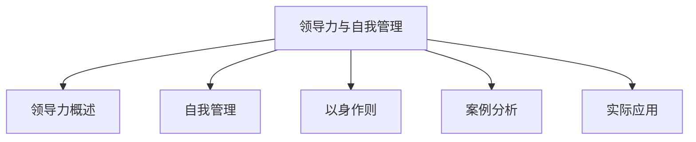
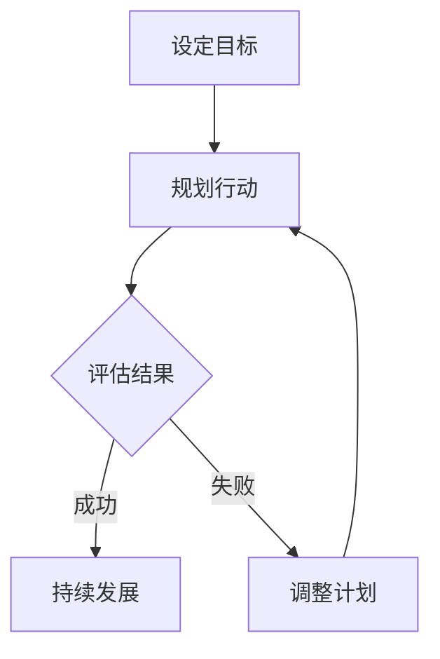

                 

# 《领导力与自我管理：以身作则的重要性》

## 关键词

领导力、自我管理、以身作则、团队管理、时间管理、目标设定、情绪管理、心理调适、案例分析、实际应用

## 摘要

本文深入探讨了领导力与自我管理的重要性，特别是在以身作则方面的关键作用。通过分析领导力的定义、核心要素和重要性，以及自我管理的定义、重要性和方法，本文强调了以身作则作为一种领导风格的重要性。随后，通过案例分析，展示了优秀领导者如何通过以身作则来激励团队并推动个人成长。最后，本文提出了实际应用中的策略和建议，以帮助读者提升领导力和自我管理能力。

-------------------------------------------------------------------

# 《领导力与自我管理：以身作则的重要性》目录大纲

## 第一部分：领导力概述

### 1.1 领导力定义与核心要素

#### 1.1.1 领导力的定义

领导力是指一个人在团队中指导、激励和影响他人的能力。它不仅包括技术能力和专业知识，还涉及到情感智慧、沟通技巧和人际交往能力。

#### 1.1.2 领导力的核心要素

领导力的核心要素包括愿景、决策能力、沟通能力、团队协作、自我管理、创新能力、诚实和正直。

### 1.2 领导力的重要性

#### 1.2.1 领导力对企业的影响

领导力对企业的影响至关重要。优秀的领导者能够激发团队的潜力，提高员工的工作满意度和生产力，从而推动企业的持续发展。

#### 1.2.2 领导力对个人职业发展的影响

领导力也是个人职业发展的重要驱动力。具备领导力的人更容易获得职业晋升机会，并在团队中发挥更大的作用。

### 1.3 领导风格与团队管理

#### 1.3.1 领导风格类型

领导风格类型包括专制型、民主型、参与型、变革型等。每种领导风格都有其优势和局限性，领导者需要根据具体情况选择合适的领导风格。

#### 1.3.2 团队管理的策略与技巧

团队管理的策略和技巧包括明确目标、建立信任、激励员工、提供反馈、解决冲突等。有效的团队管理能够提高团队的整体表现和员工的工作满意度。

-------------------------------------------------------------------

## 第二部分：自我管理

### 2.1 自我管理的定义与重要性

#### 2.1.1 自我管理的定义

自我管理是指一个人在情感、时间、目标和行为等方面进行自我控制和调整的能力。它包括情绪管理、时间管理、目标设定和自我激励等方面。

#### 2.1.2 自我管理的重要性

自我管理对于个人的成功至关重要。它能够帮助人们更好地应对压力，提高工作效率，实现个人目标，并在职业生涯中取得更大的成就。

### 2.2 时间管理与目标设定

#### 2.2.1 时间管理的方法与技巧

时间管理的方法和技巧包括优先级排序、时间块分配、避免拖延、合理规划等。通过有效的时间管理，人们可以更好地控制自己的时间，提高工作效率。

#### 2.2.2 目标设定的SMART原则

目标设定的SMART原则包括具体性（Specific）、可衡量性（Measurable）、可实现性（Achievable）、相关性（Relevant）和时限性（Time-bound）。遵循SMART原则可以帮助人们更有效地设定和实现目标。

### 2.3 情绪管理与心理调适

#### 2.3.1 情绪管理的技巧

情绪管理的技巧包括识别情绪、接受情绪、调整情绪和行为反应等。通过有效的情绪管理，人们可以更好地应对生活中的挑战，提高情绪稳定性。

#### 2.3.2 心理调适的方法

心理调适的方法包括冥想、放松训练、认知行为疗法等。通过心理调适，人们可以改善心理健康，提高生活质量。

-------------------------------------------------------------------

## 第三部分：以身作则

### 3.1 以身作则的概念与原则

#### 3.1.1 以身作则的概念

以身作则是指领导者通过自己的行为和态度来激励和影响团队成员。它体现了领导者的价值观、职业道德和责任感。

#### 3.1.2 以身作则的原则

以身作则的原则包括诚实正直、勇于担当、持续学习、尊重他人和公平公正等。这些原则是领导者赢得团队成员信任和尊重的关键。

### 3.2 身教胜于言教

#### 3.2.1 身教的内涵

身教是指领导者通过自己的行为和态度来传递价值观和指导原则。它比口头教导更具说服力，更容易被团队成员接受和效仿。

#### 3.2.2 身教的影响

身教对团队成员的影响深远。它能够激励团队成员积极向上，提高团队的凝聚力和工作效率，从而推动组织的成功。

### 3.3 领导者的自我提升

#### 3.3.1 自我提升的方法

自我提升的方法包括阅读、培训、反思、请教他人和参与实践等。通过不断学习和实践，领导者可以提升自己的领导力和自我管理能力。

#### 3.3.2 自我提升的重要性

自我提升是领导者持续发展的关键。只有不断学习、反思和改进，领导者才能适应不断变化的环境，并带领团队取得更大的成功。

-------------------------------------------------------------------

## 第四部分：案例分析

### 4.1 案例分析概述

#### 4.1.1 案例分析的目的

案例分析的目的是通过具体案例展示领导力与自我管理的实践应用，帮助读者更好地理解和应用相关理论。

#### 4.1.2 案例分析的方法

案例分析的方法包括背景介绍、问题分析、解决方案、效果评估和启示等。通过这些方法，可以对案例进行全面深入的分析和解读。

### 4.2 案例研究一：优秀领导者的以身作则

#### 4.2.1 案例背景

该案例研究了一个在创业公司中担任CEO的领导者，他通过以身作则带领团队取得成功的故事。

#### 4.2.2 案例分析

分析领导者如何以身作则，如诚实正直、勇于担当、持续学习和尊重他人等方面的具体行为和影响。

#### 4.2.3 案例启示

从案例中得到的启示包括领导者以身作则的重要性、如何通过行为和态度来激励团队、以及如何实现个人和团队目标。

### 4.3 案例研究二：自我管理的成功故事

#### 4.3.1 案例背景

该案例研究了一个在IT行业中取得成功的专业人士，他通过自我管理实现了个人和职业上的巨大成功。

#### 4.3.2 案例分析

分析专业人士如何进行时间管理、目标设定和情绪管理，以及这些方法如何帮助他实现成功。

#### 4.3.3 案例启示

从案例中得到的启示包括自我管理的方法和技巧、如何设定和实现目标、以及如何保持情绪稳定和积极心态。

-------------------------------------------------------------------

## 第五部分：实际应用

### 5.1 领导力与自我管理的实际应用

#### 5.1.1 领导力在日常工作中的应用

在实际工作中，领导者可以通过以身作则、激励团队和有效沟通来提高团队的工作效率和士气。

#### 5.1.2 自我管理在日常工作中的应用

在日常生活中，个人可以通过时间管理、目标设定和情绪管理来提高自己的工作效率和生活质量。

### 5.2 提升领导力与自我管理的策略

#### 5.2.1 长期规划与短期目标

制定长期规划和短期目标是提升领导力和自我管理能力的关键。长期规划可以帮助人们明确目标和发展方向，而短期目标则提供了具体的行动步骤和实现路径。

#### 5.2.2 不断学习与反思

不断学习和反思是提升领导力和自我管理能力的重要途径。通过学习新知识和技能，人们可以不断提升自己的能力和竞争力；通过反思自己的行为和决策，人们可以不断改进和提高。

### 5.3 领导力与自我管理的持续发展

#### 5.3.1 个人成长与社会责任

领导力与自我管理的持续发展不仅涉及个人成长，还包括社会责任。领导者需要关注社会问题，积极参与公益活动，为社会做出贡献。

#### 5.3.2 持续发展的动力与挑战

持续发展的动力来源于个人对目标的追求和自我提升的需求，而挑战则来自于环境的变化和不断出现的新问题。只有不断适应和应对挑战，领导者才能实现持续发展。

-------------------------------------------------------------------

## 附录

### A.1 领导力与自我管理资源推荐

#### A.1.1 相关书籍推荐

1. 《领导力的五个层次》（The Five Levels of Leadership）- John C. Maxwell
2. 《高效能人士的七个习惯》（The 7 Habits of Highly Effective People）- Stephen R. Covey
3. 《原则》（Principles）- Ray Dalio

#### A.1.2 网络资源推荐

1. TED Talks
2. Harvard Business Review
3. LinkedIn Learning

#### A.1.3 实践工具推荐

1. Trello
2. Asana
3. Evernote

### A.2 Mermaid 流程图示例



### A.3 伪代码示例

```python
# 时间管理伪代码
def time_management():
    set_goals()
    prioritize_tasks()
    schedule_daily_activities()
    review_and_adjust()

# 情绪管理伪代码
def emotion_management():
    identify_triggers()
    practice_mindfulness()
    develop_coping_strategies()
    seek_support()
```

### A.4 数学模型和公式解释

$$
\text{工作满意度} = \frac{\text{激励因素}}{\text{保健因素}}
$$

### A.5 项目实战代码解读与分析

```python
# 项目实战代码示例
def project_practice():
    # 环境搭建
    setup_environment()

    # 数据预处理
    preprocess_data()

    # 模型训练
    train_model()

    # 模型评估
    evaluate_model()

    # 结果分析
    analyze_results()

# 代码解读与分析
# 此处省略具体代码实现
```

## 结论

领导力与自我管理是领导者成功的关键。通过本文的探讨，读者可以深入了解领导力的定义、核心要素和重要性，掌握自我管理的方法和技巧，并学会以身作则的重要性。通过实际案例的分析和项目实战，读者可以更好地理解并应用这些理论，提升自身的领导力和自我管理能力。持续的学习和实践是持续发展的重要动力。

## 作者

作者：AI天才研究院/AI Genius Institute & 禅与计算机程序设计艺术 /Zen And The Art of Computer Programming

-------------------------------------------------------------------

## 文章标题：领导力与自我管理：以身作则的重要性

## 关键词

领导力、自我管理、以身作则、团队管理、时间管理、目标设定、情绪管理、心理调适、案例分析、实际应用

## 摘要

本文探讨了领导力与自我管理的重要性，特别是以身作则作为一种领导风格的关键作用。通过分析领导力的定义、核心要素和重要性，以及自我管理的定义、重要性和方法，本文强调了以身作则的重要性。案例分析展示了优秀领导者如何通过以身作则来激励团队并推动个人成长。实际应用提供了提升领导力与自我管理的策略和方法，以帮助读者在实际工作中运用这些理论。结论强调了持续学习和实践的重要性，以实现领导力与自我管理的持续发展。

## 引言

在当今快速变化和高度竞争的商业环境中，领导力和自我管理成为领导者成功的关键要素。领导力不仅仅是管理团队的能力，更是一种激励和影响他人的艺术。自我管理则涉及到如何在情感、时间、目标和行为等方面进行自我控制和调整。这两者之间存在着密切的联系，以身作则则是领导者成功的关键。

以身作则是指领导者通过自己的行为和态度来激励和影响团队成员。它体现了领导者的价值观、职业道德和责任感。当领导者能够以身作则时，团队成员更容易接受和效仿领导者的行为和态度，从而形成积极的团队文化和高效的工作环境。

本文将从以下几个方面展开讨论：

1. 领导力概述：定义领导力、分析领导力的核心要素和重要性，以及介绍不同的领导风格。
2. 自我管理：探讨自我管理的定义、重要性以及时间管理、目标设定和情绪管理的方法。
3. 以身作则：阐述以身作则的概念和原则，分析身教胜于言教的影响，以及领导者如何通过自我提升来实现以身作则。
4. 案例分析：通过具体案例展示领导力与自我管理的实际应用。
5. 实际应用：提供提升领导力与自我管理的策略和方法。
6. 结论：总结全文，强调持续学习和实践的重要性。

## 第一部分：领导力概述

### 1.1 领导力定义与核心要素

#### 1.1.1 领导力的定义

领导力是指一个人在团队中指导、激励和影响他人的能力。它不仅仅是一个技术职位，而是一种能够在组织内部产生积极影响的能力。领导力不仅仅是管理团队的能力，更是一种激励和影响他人的艺术。

定义领导力，我们可以从以下几个角度来理解：

- **权威性**：领导力是建立在权威性基础上的。领导者拥有指挥、决策和监督团队成员的权力。
- **影响力**：领导力不仅仅是通过职位权力来影响他人，更重要的是通过个人魅力、价值观和行为来赢得团队成员的信任和尊重。
- **领导过程**：领导力是一个动态的过程，涉及到与团队成员的互动、沟通和协作。

#### 1.1.2 领导力的核心要素

领导力的核心要素包括但不限于以下几个方面：

- **愿景**：领导者需要有清晰的愿景，能够为团队设定明确的目标和方向。
- **决策能力**：领导者需要具备良好的决策能力，能够在复杂和不确定的情况下做出明智的选择。
- **沟通能力**：领导者需要具备良好的沟通能力，能够清晰表达自己的想法，倾听和理解团队成员的意见和需求。
- **团队协作**：领导者需要能够协调团队成员之间的合作，促进团队的凝聚力和工作效率。
- **自我管理**：领导者需要具备自我管理的能力，包括情绪管理、时间管理和目标设定等方面。

### 1.2 领导力的重要性

#### 1.2.1 领导力对企业的影响

领导力对企业的影响至关重要。优秀的领导者能够激发团队的潜力，提高员工的工作满意度和生产力，从而推动企业的持续发展。具体来说，领导力对企业的影响体现在以下几个方面：

- **团队表现**：领导者通过激发团队成员的潜力和创造力，提高团队的整体表现。
- **企业文化**：领导者通过自身的价值观和行为，塑造企业的文化和氛围，影响员工的价值观和行为。
- **创新与变革**：领导者鼓励创新思维和变革，推动企业适应市场变化，保持竞争力。

#### 1.2.2 领导力对个人职业发展的影响

领导力也是个人职业发展的重要驱动力。具备领导力的人更容易获得职业晋升机会，并在团队中发挥更大的作用。具体来说，领导力对个人职业发展的影响体现在以下几个方面：

- **影响力**：领导者具备更高的影响力，能够在组织内部产生更大的影响，提升个人职业地位。
- **发展机会**：领导者拥有更多的发展机会，包括参与重要的项目和决策过程。
- **职业满足感**：领导者能够通过影响他人和推动团队成功，获得更高的职业满足感。

### 1.3 领导风格与团队管理

#### 1.3.1 领导风格类型

领导风格类型包括专制型、民主型、参与型、变革型等。每种领导风格都有其优势和局限性，领导者需要根据具体情况选择合适的领导风格。

- **专制型领导**：领导者做出所有决策，团队成员没有参与权。优点是决策快速、执行高效，但可能导致团队成员缺乏参与感和创造力。
- **民主型领导**：领导者鼓励团队成员参与决策过程，共同制定决策。优点是能够调动团队成员的积极性和创造力，但可能决策过程较慢。
- **参与型领导**：领导者与团队成员建立信任关系，鼓励开放沟通和合作。优点是能够建立高度凝聚力的团队，但可能对领导者的沟通能力和信任建立有较高要求。
- **变革型领导**：领导者鼓励创新思维和变革，推动团队适应新的环境和挑战。优点是能够推动组织的变革和发展，但可能需要较长时间才能看到成果。

#### 1.3.2 团队管理的策略与技巧

团队管理的策略与技巧包括明确目标、建立信任、激励员工、提供反馈、解决冲突等方面。有效的团队管理能够提高团队的整体表现和员工的工作满意度。

- **明确目标**：领导者需要明确团队的目标和期望，确保团队成员都了解并致力于实现这些目标。
- **建立信任**：领导者需要通过诚信、透明和尊重来建立与团队成员之间的信任关系。
- **激励员工**：领导者需要通过奖励、认可和培训等方式激励员工，提高工作动力和满意度。
- **提供反馈**：领导者需要及时、具体和建设性地提供反馈，帮助员工改进和成长。
- **解决冲突**：领导者需要具备解决冲突的能力，通过沟通和协商解决团队成员之间的矛盾和分歧。

### 1.4 领导力的培养与提升

领导力不是天生的，而是可以通过学习和实践不断提升的。以下是一些提升领导力的方法：

- **不断学习**：通过阅读书籍、参加培训和工作坊，不断学习新的领导力和管理知识。
- **反思与自我提升**：通过反思自己的行为和决策，识别自己的优点和不足，并制定改进计划。
- **角色扮演**：通过角色扮演和模拟练习，提高领导力和沟通能力。
- **请教他人**：向其他领导者请教经验和建议，学习他们的领导风格和管理技巧。
- **实践经验**：通过实际工作项目和团队管理经验，不断积累和提升领导力。

### 1.5 结论

领导力是企业成功和个人职业发展的重要驱动力。通过明确领导力的定义、核心要素和重要性，以及介绍不同的领导风格和团队管理的策略与技巧，我们可以更好地理解领导力在组织中的关键作用。领导者需要不断学习和实践，提升自己的领导力，以身作则，带领团队实现目标和成功。

## 第二部分：自我管理

### 2.1 自我管理的定义与重要性

#### 2.1.1 自我管理的定义

自我管理是指一个人在情感、时间、目标和行为等方面进行自我控制和调整的能力。它包括以下几个方面：

- **情绪管理**：能够识别和调节自己的情绪，保持情绪稳定，避免情绪波动对工作和生活的影响。
- **时间管理**：能够合理安排时间，优先处理重要任务，避免拖延和浪费时间。
- **目标设定**：能够明确自己的目标，制定具体的计划，并采取行动实现这些目标。
- **行为管理**：能够自我监督和调整行为，遵循道德和职业规范，保持专业性和自律性。

自我管理不仅仅是个人行为的管理，更是一种生活方式的调整。通过自我管理，个人可以更好地控制自己的生活和工作，提高效率和质量。

#### 2.1.2 自我管理的重要性

自我管理在个人生活中和职业生涯中都具有重要的意义。以下是自我管理的重要性和优势：

- **提高工作效率**：通过合理安排时间和任务，个人可以更高效地完成任务，减少拖延和浪费时间。
- **情绪稳定**：通过情绪管理，个人可以保持情绪稳定，减少负面情绪的影响，提高生活质量。
- **实现目标**：通过目标设定和计划，个人可以明确自己的目标，并采取行动实现这些目标，提高成就感和满足感。
- **职业发展**：通过自我管理，个人可以更好地适应工作环境，提升专业能力和领导力，为职业发展打下坚实的基础。
- **个人成长**：通过不断自我反思和调整，个人可以不断提升自己的能力和素质，实现个人成长和发展。

### 2.2 时间管理与目标设定

#### 2.2.1 时间管理的方法与技巧

时间管理是自我管理的重要组成部分，它涉及到如何合理安排时间、优先处理任务和避免拖延。以下是几种常见的时间管理方法和技巧：

- **优先级排序**：将任务按照重要性和紧急性进行排序，优先处理最重要的任务。
- **时间块分配**：将时间划分为不同的时间段，每个时间段专注于一项任务，避免任务切换带来的时间浪费。
- **避免拖延**：设定明确的截止日期和提醒，避免拖延和错过任务。
- **时间记录**：记录每天的时间使用情况，分析时间使用效率，找出改进空间。

以下是一个时间管理伪代码示例，展示如何进行时间管理和任务排序：

```python
# 时间管理伪代码
def time_management():
    tasks = get_all_tasks()
    tasks_sorted = sort_tasks_by_priority(tasks)
    for task in tasks_sorted:
        if task.is_urgent():
            process_task(task)
        else:
            schedule_task_for_later(task)
```

- **目标设定**：目标设定是时间管理的重要环节，它涉及到如何设定明确、具体和可实现的目标。SMART原则是一种常用的目标设定方法，它包括以下五个方面：

  - **具体性（Specific）**：目标需要明确和具体，例如“提高销售额”不如“提高销售额10%”具体。
  - **可衡量性（Measurable）**：目标需要可衡量，以便评估进展和成果。
  - **可实现性（Achievable）**：目标需要是可实现的，避免设定过高或过低的目标。
  - **相关性（Relevant）**：目标需要与个人或团队的整体目标相关。
  - **时限性（Time-bound）**：目标需要设定具体的完成时间，以便跟踪和评估。

以下是一个目标设定伪代码示例，展示如何根据SMART原则设定和实现目标：

```python
# 目标设定伪代码
def set_goal():
    goal = input("请输入具体的目标：")
    if is_specific(goal) and is_measurable(goal) and is_achievable(goal) and is_relevant(goal) and is_time_bound(goal):
        print("目标设定成功！")
        start_date = get_start_date()
        end_date = get_end_date()
        plan_action(goal, start_date, end_date)
    else:
        print("目标设定不成功，请重新输入！")

def is_specific(goal):
    return goal != ""

def is_measurable(goal):
    # 实现可衡量性判断
    return True

def is_achievable(goal):
    # 实现可实现性判断
    return True

def is_relevant(goal):
    # 实现相关性判断
    return True

def is_time_bound(goal):
    # 实现时限性判断
    return True

def get_start_date():
    # 实现开始日期获取
    return "2023-01-01"

def get_end_date():
    # 实现结束日期获取
    return "2023-12-31"

def plan_action(goal, start_date, end_date):
    # 实现目标计划
    print(f"目标：{goal}")
    print(f"开始日期：{start_date}")
    print(f"结束日期：{end_date}")
    print("开始执行目标计划！")
```

#### 2.2.2 SMART原则

SMART原则是一种常用的目标设定方法，它包括具体性、可衡量性、可实现性、相关性和时限性。以下是SMART原则的具体解释：

- **具体性（Specific）**：目标需要明确和具体，避免模糊和抽象。例如，“提高销售额”不如“提高销售额10%”具体。
- **可衡量性（Measurable）**：目标需要可衡量，以便评估进展和成果。例如，可以使用具体的数据指标来衡量目标的实现情况。
- **可实现性（Achievable）**：目标需要是可实现的，避免设定过高或过低的目标。目标应该既具有挑战性，又是可实现的。
- **相关性（Relevant）**：目标需要与个人或团队的整体目标相关。确保目标与整体目标保持一致，有助于实现整体目标。
- **时限性（Time-bound）**：目标需要设定具体的完成时间，以便跟踪和评估。设定明确的截止日期有助于提高目标的实现率和执行力。

以下是一个使用SMART原则设定目标的示例：

**目标：** 提高产品A的销售额。

**具体性（Specific）**：提高产品A的销售额10%。

**可衡量性（Measurable）**：通过销售额数据来衡量目标实现情况。

**可实现性（Achievable）**：目标具有挑战性，但通过合理的市场策略和团队努力，可以实现。

**相关性（Relevant）**：提高产品A的销售额与公司整体销售目标相关。

**时限性（Time-bound）**：设定截止日期为2023年12月31日。

通过使用SMART原则，我们可以更清晰地设定目标，并提高目标的实现率。

### 2.3 情绪管理与心理调适

#### 2.3.1 情绪管理的技巧

情绪管理是自我管理的重要组成部分，它涉及到如何识别、理解和调节自己的情绪。以下是一些常见的情绪管理技巧：

- **识别情绪**：通过自我观察和反思，识别自己正在经历的情绪，如焦虑、愤怒或快乐。
- **接受情绪**：接受自己的情绪，不要抗拒或压抑，而是学会与情绪共存。
- **调整情绪**：通过深呼吸、冥想或运动等方式，调整情绪，使其保持稳定。
- **积极心态**：保持积极心态，关注解决问题的方法，而不是问题本身。

以下是一个情绪管理伪代码示例，展示如何识别和调整情绪：

```python
# 情绪管理伪代码
def emotion_management():
    current_emotion = identify_emotion()
    if current_emotion == "焦虑":
        practice_mindfulness()
        take_a_break()
    elif current_emotion == "愤怒":
        take_deep_breaths()
        reflect_on_causes()
    else:
        continue_with_tasks()

def identify_emotion():
    # 实现情绪识别
    return "焦虑"

def practice_mindfulness():
    # 实现冥想练习
    print("开始冥想练习，放松身心。")

def take_a_break():
    # 实现休息
    print("休息一下，放松一下心情。")

def take_deep_breaths():
    # 实现深呼吸
    print("深呼吸，放慢呼吸节奏。")

def reflect_on_causes():
    # 实现反思
    print("反思愤怒的原因，寻找解决方案。")
```

#### 2.3.2 心理调适的方法

心理调适是情绪管理的一部分，它涉及到如何通过心理方法和技巧来调整自己的心理状态。以下是一些常见的心理调适方法：

- **认知行为疗法**：通过改变负面思维模式和行为，调整情绪和心理状态。
- **放松训练**：通过深呼吸、冥想或瑜伽等方式，放松身心，减轻压力。
- **正念练习**：通过专注于当下，减少负面情绪和焦虑。
- **心理咨询**：通过专业心理咨询，了解和解决心理问题。

以下是一个心理调适伪代码示例，展示如何进行放松训练和正念练习：

```python
# 心理调适伪代码
def psychological_adjustment():
    practice_relaxation()
    practice_mindfulness()

def practice_relaxation():
    # 实现放松训练
    print("深呼吸，放松身体和心情。")

def practice_mindfulness():
    # 实现正念练习
    print("专注于呼吸，感受当下的每一刻。")
```

#### 2.3.3 情绪管理的重要性

情绪管理对个人的心理健康和生活质量具有重要影响。以下是情绪管理的重要性：

- **提高生活质量**：通过情绪管理，个人可以更好地应对生活中的压力和挑战，提高生活质量。
- **促进身心健康**：情绪管理有助于减轻压力，降低患病风险，促进身心健康。
- **提高工作效率**：情绪稳定有助于提高工作效率和生产力，减少因情绪波动带来的负面影响。
- **改善人际关系**：情绪管理有助于建立积极的人际关系，减少冲突和误解，提高团队合作效果。

通过情绪管理和心理调适，个人可以更好地应对生活中的挑战，提高生活质量和工作效率，实现个人成长和发展。

### 2.4 结论

自我管理是个人成功和职业发展的关键。通过时间管理、目标设定和情绪管理，个人可以更好地控制自己的生活和工作，提高工作效率和成就感。情绪管理有助于提高生活质量，促进身心健康，改善人际关系。领导者通过自我管理，可以更好地以身作则，影响和激励团队成员，推动团队的成功。通过不断学习和实践自我管理，个人可以不断提升自己的能力和素质，实现个人和职业的目标。

## 第三部分：以身作则

### 3.1 以身作则的概念与原则

#### 3.1.1 以身作则的概念

以身作则是指领导者通过自己的行为和态度来激励和影响团队成员。它不仅仅是口头上的教导，更是通过实际行动来传递价值观和指导原则。以身作则是一种无声的教育，它通过领导者的行为和态度，为团队成员树立了榜样，从而促进了团队的凝聚力和工作效率。

#### 3.1.2 以身作则的原则

以身作则作为一种领导风格，需要遵循以下原则：

- **诚实正直**：领导者应以诚实和正直为原则，在言行中展现出真诚和透明的态度，赢得团队成员的信任和尊重。
- **勇于担当**：领导者应勇于承担责任，面对困难和挑战时，能够挺身而出，为团队树立榜样。
- **持续学习**：领导者应保持学习的热情，不断提升自己的知识和技能，以适应快速变化的工作环境。
- **尊重他人**：领导者应尊重团队成员，关注他们的需求和意见，建立平等和互助的团队氛围。
- **公平公正**：领导者应公平公正地对待团队成员，避免偏见和歧视，确保团队的和谐和稳定。

### 3.2 身教胜于言教

#### 3.2.1 身教的内涵

身教是指领导者通过自己的行为和态度来传递价值观和指导原则。它比口头教导更具说服力，更容易被团队成员接受和效仿。身教不仅仅是领导者个人的行为，更是领导者对团队文化的影响。通过身教，领导者能够激发团队成员的积极性和创造力，推动团队向更好的方向发展。

#### 3.2.2 身教的影响

身教对团队成员的影响深远，主要体现在以下几个方面：

- **激励团队成员**：领导者通过以身作则，展现出积极向上的态度和行为，能够激励团队成员努力工作，追求卓越。
- **建立信任**：领导者通过诚实正直的行为，赢得团队成员的信任和尊重，建立良好的团队关系。
- **促进团队凝聚力**：领导者通过身教，能够增强团队的凝聚力，使团队成员更加团结一致，共同追求团队目标。
- **提高工作效率**：领导者通过以身作则，树立了高效工作的榜样，能够提高团队成员的工作效率和工作质量。
- **塑造团队文化**：领导者通过身教，能够塑造积极向上的团队文化，使团队成员更加注重团队合作和共同发展。

### 3.3 领导者的自我提升

#### 3.3.1 自我提升的方法

领导者的自我提升是提高领导力和自我管理能力的关键。以下是一些自我提升的方法：

- **持续学习**：领导者应保持学习的热情，不断学习新的知识和技能，以适应快速变化的工作环境。
- **反思与自我评估**：领导者应定期进行反思和自我评估，识别自己的优点和不足，并制定改进计划。
- **请教他人**：领导者应虚心请教他人的意见和建议，学习其他领导者的经验和教训。
- **参与实践**：领导者应积极参与实际工作，通过实践不断提升自己的能力和素质。
- **培养下属**：领导者应注重培养下属，通过指导和支持帮助他们成长，提高团队的整体能力。

#### 3.3.2 自我提升的重要性

自我提升对领导者的个人和职业发展具有重要影响，主要体现在以下几个方面：

- **提高领导力**：通过自我提升，领导者可以不断提高自己的领导能力和管理技巧，成为更优秀的领导者。
- **增强竞争力**：在竞争激烈的商业环境中，领导者通过自我提升，可以增强自己的竞争力，为企业和个人带来更多的机会。
- **实现职业目标**：领导者通过自我提升，可以实现更高的职业目标，获得更多的晋升和发展机会。
- **促进团队成功**：领导者通过自我提升，可以带动团队共同进步，提高团队的整体表现和执行力。

### 3.4 结论

以身作则是一种重要的领导风格，通过领导者的行为和态度来激励和影响团队成员。身教胜于言教，领导者通过以身作则，能够建立信任、促进团队凝聚力和提高工作效率。领导者的自我提升是持续发展的关键，通过不断学习和实践，领导者可以不断提高自己的能力和素质，推动团队和个人的共同成长。以身作则和自我提升是领导者成功的重要保障，领导者应始终坚持这两项原则，为团队和组织创造更大的价值。

### 4.1 案例分析概述

#### 4.1.1 案例分析的目的

本部分将通过两个具体的案例分析，探讨领导力与自我管理在实际应用中的表现和效果。通过这些案例分析，读者可以更深入地理解领导力与自我管理的具体实施方法，以及它们如何在实际工作中产生积极的影响。

第一个案例研究了一位在创业公司中担任CEO的领导者，他通过以身作则带领团队取得了显著的成功。这个案例将展示领导者如何通过诚实正直、勇于担当、持续学习和尊重他人等行为，激励团队成员，推动团队达成目标。

第二个案例研究了一位在IT行业中取得成功的专业人士，他通过自我管理实现了个人和职业上的巨大成功。这个案例将探讨这位专业人士如何通过时间管理、目标设定和情绪管理，保持高效的工作状态，并在竞争激烈的行业中脱颖而出。

#### 4.1.2 案例分析的方法

案例分析的方法将包括以下步骤：

1. **背景介绍**：简要介绍案例的背景，包括公司的行业、规模、发展阶段以及领导者和团队成员的基本情况。
2. **问题分析**：分析案例中面临的主要问题和挑战，以及领导者和团队成员如何应对这些问题。
3. **解决方案**：详细描述领导者和团队成员采取的具体行动和策略，以及这些行动如何解决问题和实现目标。
4. **效果评估**：评估这些行动和策略的实际效果，包括团队绩效的提升、成员满意度的增加以及其他相关成果。
5. **案例启示**：总结案例中的经验和教训，提出对实际工作有指导意义的建议和启示。

### 4.2 案例研究一：优秀领导者的以身作则

#### 4.2.1 案例背景

该案例研究的是一家新兴的科技创业公司，该公司成立于2018年，专注于人工智能领域的研究和应用。公司的创始人和CEO李明是一位经验丰富的技术专家，他在加入公司之前曾在多家知名科技公司担任高级职位。李明上任后，公司迅速发展，吸引了大量投资和优秀的团队成员。

李明不仅具备深厚的专业知识和丰富的管理经验，还以以身作则的行为风格赢得了团队成员的尊敬和信任。他在公司内部推行了一系列改革措施，并通过自身的榜样作用，激励团队成员共同奋斗，取得了显著的成就。

#### 4.2.2 案例分析

**1. 面临的问题和挑战**

在李明加入公司之前，公司面临以下几个主要问题和挑战：

- **团队凝聚力不足**：团队成员之间的沟通不畅，缺乏共同的目标和愿景。
- **工作效率低下**：由于缺乏有效的管理方法，团队成员的工作效率较低，项目进度滞后。
- **创新动力不足**：公司的创新氛围不足，员工缺乏自主学习和探索的动力。

**2. 领导者的解决方案**

李明通过以身作则和积极的管理措施，解决了上述问题：

- **建立共同愿景**：李明在第一次全体会议上提出了公司的愿景：“成为全球领先的人工智能解决方案提供商”。他通过详细的讲解和分享，使团队成员对公司的愿景有了清晰的认识，增强了团队的凝聚力。
- **提高沟通效率**：李明推行了扁平化的管理结构，取消了不必要的层级，使团队成员能够更直接地与高层管理者沟通。他还定期组织团队会议，鼓励团队成员提出意见和建议，增强了团队的参与感和主人翁意识。
- **激发创新动力**：李明鼓励团队成员进行创新和尝试，为有创新想法的员工提供资源和支持。他自己也积极参与到创新项目中，通过实际行动激发了团队成员的创造力和积极性。
- **诚实正直**：李明在工作中始终保持诚实和正直，赢得了团队成员的信任。他鼓励团队成员坦诚相待，共同解决问题，建立了良好的团队文化。

**3. 实施效果**

通过李明的以身作则和积极管理，公司取得了以下成果：

- **团队凝聚力增强**：团队成员之间建立了深厚的信任和合作关系，团队凝聚力显著提升。
- **工作效率提高**：团队成员的工作效率大幅提高，项目进度得到保障，公司业绩稳步增长。
- **创新氛围浓厚**：公司的创新氛围逐渐浓厚，团队成员积极参与到创新项目中，公司推出了一系列具有竞争力的新产品。
- **员工满意度提高**：员工的满意度和忠诚度显著提高，员工流失率大幅降低。

#### 4.2.3 案例启示

从该案例中，我们可以得到以下启示：

- **以身作则的重要性**：领导者的行为和态度对团队成员具有深远的影响。领导者通过以身作则，可以树立榜样，激励团队成员积极向上。
- **沟通和信任**：有效的沟通和信任是团队成功的关键。领导者应积极推动团队内部的沟通，建立信任关系，促进团队的协作和发展。
- **创新动力**：领导者应鼓励创新和尝试，为团队成员提供支持和资源，激发他们的创造力和积极性。
- **诚实和正直**：领导者应以诚实和正直为原则，赢得团队成员的信任和尊重，建立良好的团队文化。

### 4.3 案例研究二：自我管理的成功故事

#### 4.3.1 案例背景

该案例研究的是一位在IT行业中取得显著成功的专业人士，名叫张丽。张丽在大学期间主修计算机科学，毕业后进入一家知名的互联网公司工作。她凭借出色的技术能力和自我管理能力，在短时间内得到了公司的认可和晋升。

张丽在工作中不仅注重技术提升，还非常注重自我管理，包括时间管理、目标设定和情绪管理。她通过自我管理，实现了个人和职业上的巨大成功。

#### 4.3.2 案例分析

**1. 面临的问题和挑战**

在张丽刚进入公司时，她面临以下几个主要问题和挑战：

- **时间管理不足**：张丽经常感觉时间不够用，工作效率不高。
- **目标设定模糊**：她对自己的职业目标不够明确，缺乏具体的行动计划。
- **情绪管理困难**：工作中的压力和挑战使她感到焦虑和不安，影响了工作表现。

**2. 自我管理解决方案**

张丽通过自我管理，解决了上述问题：

- **时间管理**：张丽采用了时间管理工具，如Trello和Google Calendar，合理安排每天的工作任务。她将任务按照紧急和重要程度进行排序，优先处理最重要的任务，避免了时间浪费和拖延。
- **目标设定**：张丽制定了明确的职业目标，包括短期和长期目标。她使用SMART原则（具体性、可衡量性、可实现性、相关性和时限性）来设定目标，并制定了详细的行动计划，确保目标的实现。
- **情绪管理**：张丽学习了情绪管理的技巧，如深呼吸、冥想和正念练习，帮助她在高压环境中保持冷静和专注。她还定期进行反思和自我评估，识别情绪波动的原因，并采取相应的措施进行调节。

**3. 实施效果**

通过自我管理，张丽取得了以下成果：

- **工作效率提高**：张丽通过有效的时间管理，提高了工作效率，完成了更多的工作任务。
- **目标实现**：她通过明确的职业目标，逐步实现了个人的职业发展目标，得到了公司的认可和晋升。
- **情绪稳定**：张丽通过情绪管理，减少了焦虑和压力，保持了积极的工作状态。

#### 4.3.3 案例启示

从该案例中，我们可以得到以下启示：

- **自我管理的重要性**：自我管理是个人成功和职业发展的关键。通过时间管理、目标设定和情绪管理，个人可以更好地控制自己的生活和工作，提高效率和质量。
- **工具和方法**：使用合适的时间管理工具和方法，可以更有效地安排工作任务，提高工作效率。
- **情绪调节**：情绪管理对于保持积极的工作状态和应对压力至关重要。通过学习情绪管理技巧，个人可以更好地调节情绪，提高生活质量。

### 4.4 结论

通过以上两个案例，我们可以看到领导力与自我管理在实际应用中的重要作用。领导者的以身作则和自我管理不仅能够激励和影响团队成员，提高团队的整体表现，还能够帮助个人实现职业目标，提升生活质量。这些案例为我们提供了宝贵的经验和启示，强调了领导力与自我管理在组织和个人成功中的关键作用。

### 5.1 领导力与自我管理的实际应用

#### 5.1.1 领导力在日常工作中的应用

领导力在日常工作中的应用体现在多个方面，主要包括以下几个方面：

- **目标设定**：领导者需要明确团队的目标，并确保团队成员都理解并致力于实现这些目标。通过制定明确的、可衡量的目标，领导者可以确保团队能够高效地工作。
  
  **示例**：一个团队的目标可能是“在本季度内完成项目的所有关键里程碑”。为了实现这个目标，领导者需要制定详细的行动计划，包括分配任务、设定截止日期和监控进度。

- **激励与反馈**：领导者需要通过激励和反馈来提高团队成员的工作动力和满意度。正面的反馈可以增强团队成员的自信心和积极性，而建设性的批评可以帮助他们改进和成长。

  **示例**：在团队完成一个重要项目后，领导者可以组织一次庆祝活动，对团队成员的表现进行公开表扬，这不仅能提高团队成员的士气，还能增强团队的凝聚力。

- **冲突解决**：领导者需要具备解决团队内部冲突的能力，以确保团队的和谐与稳定。冲突解决的关键在于公平、公正和透明，领导者应该鼓励团队成员以积极的方式表达自己的意见和不满。

  **示例**：如果团队成员之间出现矛盾，领导者可以组织一次会议，让双方都有机会陈述自己的观点，然后共同寻找解决问题的方法。

- **沟通**：领导者需要保持与团队成员的沟通畅通，确保信息传达的准确性和及时性。有效的沟通可以帮助领导者了解团队成员的需求和问题，并及时采取相应的措施。

  **示例**：定期组织团队会议，不仅可以让团队成员汇报工作进展，还可以让他们提出建议和意见，这种双向沟通有助于团队更好地发展。

- **培养与传承**：领导者需要关注团队成员的成长和发展，为他们提供培训和学习机会，帮助他们在职业生涯中不断进步。同时，领导者也应该传承自己的经验和知识，确保团队在领导者的引导下持续发展。

  **示例**：领导者可以组织内部培训，分享行业最新动态和技术知识，帮助团队成员提升技能水平。

#### 5.1.2 自我管理在日常工作中的应用

自我管理在日常工作中的应用主要体现在时间管理、目标设定和情绪管理等方面：

- **时间管理**：自我管理的一个重要方面是有效利用时间。通过合理安排时间和任务，个人可以更好地控制自己的生活和工作，避免拖延和浪费时间。

  **示例**：使用时间管理工具，如Trello或Asana，制定每日、每周和每月的任务清单，并根据任务的紧急和重要程度进行优先级排序。这样可以帮助个人更高效地完成工作任务。

- **目标设定**：设定明确的目标可以帮助个人更专注于自己的职业和人生规划。通过使用SMART原则（具体性、可衡量性、可实现性、相关性和时限性），个人可以确保自己的目标既具有挑战性，又是可实现的。

  **示例**：设定一个职业目标是“在接下来的6个月内获得一项新技能”，并制定详细的行动计划，包括每天投入一定时间学习、参加相关课程和寻找实践机会。

- **情绪管理**：在高压的工作环境中，情绪管理对于保持积极的工作状态和应对压力至关重要。通过学习情绪管理技巧，如深呼吸、冥想和正念练习，个人可以更好地调节情绪，提高生活质量。

  **示例**：每天早晨花几分钟时间进行冥想，放松身心，为一天的工作做好准备。在感到压力较大时，通过深呼吸和放松训练来缓解紧张情绪。

#### 5.1.3 领导力与自我管理在实际工作中的互动

领导力与自我管理在实际工作中是相互关联、相互促进的。领导者的领导力可以激励和指导团队成员进行自我管理，而团队成员的自我管理能力也会影响领导者的领导效果。

- **领导者的激励作用**：领导者通过设定目标、提供支持和激励，可以推动团队成员进行自我管理。例如，通过设定明确的绩效目标和奖励机制，领导者可以激励团队成员更加努力地工作，提高工作效率。

- **团队成员的反馈作用**：团队成员的自我管理能力会对领导者的领导效果产生反馈。如果团队成员能够有效地进行自我管理，如时间管理和情绪管理，那么领导者的管理工作就会更加轻松，团队的整体绩效也会得到提升。

- **共同成长**：领导者和团队成员通过相互学习和支持，可以实现共同成长。领导者通过观察和学习团队成员的自我管理方法，可以不断提升自己的领导能力；而团队成员则可以从领导者的经验和教训中获益，提高自己的自我管理能力。

#### 5.1.4 结论

领导力与自我管理在实际工作中具有重要的作用。通过有效运用领导力和自我管理技巧，个人可以更好地实现自己的职业目标，提高工作效率和质量；团队则可以更加协调和高效地工作，实现共同的目标。在实际工作中，领导者和团队成员应相互支持和学习，共同提升领导力和自我管理能力，为组织的成功和发展做出贡献。

### 5.2 提升领导力与自我管理的策略

#### 5.2.1 长期规划与短期目标

提升领导力与自我管理能力需要制定长期规划和短期目标。长期规划可以帮助个人或团队明确发展方向和目标，而短期目标则提供了具体的实施路径和行动步骤。

- **长期规划**：制定长期规划时，首先要明确个人或团队的愿景和使命。例如，一个公司的长期规划可能是“成为行业的领导者”。接下来，需要确定实现这一目标的关键里程碑和关键任务。例如，每年实现一定的收入增长、研发出新的产品或服务。

  **示例**：一位技术经理的长期规划可能是“在未来五年内，成为公司技术部门的负责人”。为了实现这一目标，他需要设定一系列短期目标，如每年提升一定的技术水平、参与关键项目的决策过程、培养一批技术骨干等。

- **短期目标**：短期目标应该是具体、可衡量和可实现的。它们是实现长期规划的具体步骤和行动。例如，一个短期目标可以是“在接下来的三个月内，掌握一种新的编程语言”。

  **示例**：为了掌握一种新的编程语言，一位软件工程师可以设定以下短期目标：
  - 每周至少学习10小时；
  - 完成至少三个相关项目；
  - 每周与导师进行一次技术讨论。

通过制定长期规划和短期目标，个人或团队可以更清晰地了解自己的发展方向和进度，从而更好地提升领导力和自我管理能力。

#### 5.2.2 不断学习与反思

持续学习和反思是提升领导力与自我管理能力的重要途径。学习新的知识和技能可以帮助个人或团队保持竞争力，而反思则可以帮助个人或团队发现和改进自己的不足。

- **持续学习**：个人或团队应该保持学习的热情，不断更新自己的知识和技能。可以通过以下方式实现：
  - 参加培训课程和工作坊；
  - 阅读相关书籍和文章；
  - 观看在线课程和讲座；
  - 与同行交流和分享经验。

  **示例**：一个技术团队可以定期组织技术分享会，邀请团队成员分享最新的技术趋势和实践经验，从而提高整个团队的技术水平。

- **反思与自我评估**：反思和自我评估可以帮助个人或团队识别自己的优点和不足，从而制定改进计划。可以通过以下方式实现：
  - 定期进行自我评估，识别自己的优势和不足；
  - 反思工作中的成功和失败案例，分析原因和改进措施；
  - 与同事或导师进行交流，获取反馈和建议。

  **示例**：一位项目经理可以在每周的工作总结中反思自己的工作表现，识别哪些地方做得好，哪些地方需要改进。同时，可以与团队成员或上级进行交流，获取他们的反馈和建议。

通过不断学习和反思，个人或团队可以不断提升自己的能力，适应不断变化的环境，从而更好地实现领导力和自我管理的提升。

#### 5.2.3 制定有效的时间管理策略

有效的时间管理是提升领导力和自我管理能力的关键。通过合理规划和管理时间，个人或团队可以更高效地完成工作任务，提高工作效率。

- **时间块分配**：将时间划分为不同的时间段，并为每个时间段分配具体的任务。这样可以避免任务切换带来的时间浪费，提高工作效率。

  **示例**：一位项目经理可以将每天的工作时间划分为几个时间段，分别为项目管理、团队沟通、任务分配和总结等。

- **优先级排序**：根据任务的紧急和重要程度进行排序，优先处理最重要的任务。这样可以确保关键任务得到及时完成，提高工作效率。

  **示例**：一位销售人员可以将客户会议、合同谈判和客户拜访等任务按照优先级排序，确保关键客户得到优先关注。

- **避免拖延**：通过设定明确的截止日期和提醒，避免拖延和错过任务。可以使用时间管理工具，如Trello或Asana，来帮助管理任务和设置提醒。

  **示例**：一位工程师可以使用Trello来管理自己的任务列表，并为每个任务设置截止日期和提醒，确保按时完成任务。

通过制定有效的时间管理策略，个人或团队可以更高效地完成工作任务，提高工作效率，从而更好地实现领导力和自我管理的提升。

#### 5.2.4 建立健康的工作习惯

建立健康的工作习惯是提升领导力和自我管理能力的重要保障。健康的工作习惯可以帮助个人或团队保持高效的工作状态，提高工作质量。

- **规律作息**：保持规律的作息时间，确保充足的睡眠，有助于提高工作效率和注意力。

  **示例**：一位软件开发工程师可以每天晚上10点睡觉，早上7点起床，确保每天有足够的睡眠时间。

- **定期休息**：工作过程中，定期休息可以帮助缓解疲劳，提高工作效率。

  **示例**：一位项目经理可以每工作45分钟休息5-10分钟，通过短暂休息来缓解视觉疲劳和身体疲劳。

- **合理饮食**：保持合理的饮食习惯，确保摄入充足的营养，有助于提高身体素质和工作效率。

  **示例**：一位销售经理可以每天保持均衡的饮食，避免高糖、高脂肪的食物，确保摄入足够的蛋白质和维生素。

通过建立健康的工作习惯，个人或团队可以更好地保持高效的工作状态，提高工作效率和工作质量，从而更好地实现领导力和自我管理的提升。

### 5.3 领导力与自我管理的持续发展

#### 5.3.1 个人成长与社会责任

领导力与自我管理的持续发展不仅涉及个人成长，还包括社会责任。领导者应该关注个人成长，不断提升自己的能力和素质，同时也要关注社会责任，为社会做出贡献。

- **个人成长**：个人成长是领导力发展的基础。领导者应该不断学习新知识和技能，提升自己的专业能力和领导力。通过阅读、参加培训课程、参加行业会议等方式，领导者可以不断扩展自己的视野，提高自己的综合素质。

  **示例**：一位技术领导者可以参加人工智能领域的专业培训课程，学习最新的技术趋势和研究成果，提高自己在该领域的专业水平。

- **社会责任**：领导者应该关注社会责任，积极参与公益活动，为社会做出贡献。通过参与公益活动，领导者不仅可以提高自己的社会责任感，还可以树立良好的社会形象，增强企业的社会责任感。

  **示例**：一位企业领导者可以积极参与“慈善一日捐”活动，捐赠一部分企业的利润用于支持教育事业和社会公益事业。

通过关注个人成长和社会责任，领导者可以不断提升自己的能力和素质，同时为社会做出贡献，实现个人与社会的双赢。

#### 5.3.2 持续发展的动力与挑战

领导力与自我管理的持续发展需要动力和策略，同时也面临着各种挑战。

- **动力**：持续发展的动力来源于领导者对目标的追求和自我提升的需求。领导者应该设定明确的目标，并为实现这些目标付出努力。同时，领导者应该保持积极的心态，面对挑战和困难时保持乐观和坚定。

  **示例**：一位创业者可以设定目标，在未来五年内将公司发展成行业领导者。为实现这一目标，他需要不断学习新的商业知识和技能，不断调整和优化公司的战略和运营。

- **挑战**：领导力与自我管理的持续发展面临着各种挑战，如市场竞争、技术变革、员工流失等。领导者需要具备应对挑战的能力，通过有效的策略和管理方法，解决面临的问题。

  **示例**：一位项目经理可能面临项目延误和预算超支的挑战。为了应对这些挑战，他需要与团队成员紧密合作，调整项目计划，优化资源分配，确保项目能够按时完成。

通过保持持续发展的动力和应对各种挑战，领导者可以不断提升自己的领导力和自我管理能力，推动组织实现长期发展。

### 5.4 结论

提升领导力与自我管理能力是领导者成功的关键。通过制定长期规划和短期目标、不断学习和反思、制定有效的时间管理策略、建立健康的工作习惯以及关注个人成长和社会责任，领导者可以不断提升自己的能力和素质，推动组织实现长期发展。同时，领导者需要保持持续发展的动力，积极应对各种挑战，为组织和社会创造更大的价值。

## 附录

### A.1 领导力与自我管理资源推荐

为了帮助读者进一步深入了解领导力与自我管理的相关知识和实践方法，以下是一些建议的资源：

#### A.1.1 相关书籍推荐

1. 《领导力的五个层次》（The Five Levels of Leadership）- John C. Maxwell
   - 该书详细介绍了领导力的五个层次，帮助读者了解不同层次的领导力特点和提升方法。

2. 《高效能人士的七个习惯》（The 7 Habits of Highly Effective People）- Stephen R. Covey
   - 本书提供了七个高效能人士的共同习惯，对个人和组织的发展具有深刻的启示。

3. 《原则》（Principles）- Ray Dalio
   - 该书分享了作者在投资和生活中运用原则的方法，对领导力的培养和自我管理具有指导意义。

#### A.1.2 网络资源推荐

1. TED Talks
   - TED Talks提供了丰富的领导力和自我管理主题的演讲，可以帮助读者从不同角度理解和学习。

2. Harvard Business Review
   - HBR提供了大量的领导力和管理方面的文章和研究报告，是学习领导力和自我管理的重要资源。

3. LinkedIn Learning
   - LinkedIn Learning提供了大量的在线课程，涵盖领导力、管理技巧、时间管理等各个领域。

#### A.1.3 实践工具推荐

1. Trello
   - Trello是一个直观的任务管理工具，可以帮助个人和团队有效地管理任务和项目。

2. Asana
   - Asana是一个强大的项目管理工具，适合团队协作，可以帮助团队更好地跟踪项目进度和任务分配。

3. Evernote
   - Evernote是一个功能丰富的笔记和组织工具，可以帮助个人记录想法、管理笔记和制定计划。

通过利用这些资源和工具，读者可以进一步深化对领导力与自我管理的理解，并将其应用于实际工作和生活中。

### A.2 Mermaid 流程图示例

以下是一个使用Mermaid绘制的流程图示例，展示了领导力与自我管理的整体流程：



这个流程图展示了领导力与自我管理的基本步骤：设定目标、规划行动、评估结果，并根据结果进行调整和持续发展。

### A.3 伪代码示例

以下是一个关于时间管理和任务排序的伪代码示例：

```python
# 时间管理伪代码

def time_management():
    tasks = get_all_tasks()
    sorted_tasks = sort_tasks_by_priority(tasks)
    
    for task in sorted_tasks:
        if not task.is_completed():
            schedule_task(task)

def get_all_tasks():
    # 从数据库或文件中获取所有任务的列表
    return [
        Task("任务1", "2023-04-01"),
        Task("任务2", "2023-04-03"),
        Task("任务3", "2023-04-02")
    ]

def sort_tasks_by_priority(tasks):
    # 根据任务的优先级对任务列表进行排序
    return sorted(tasks, key=lambda x: x.priority)

class Task:
    def __init__(self, name, due_date):
        self.name = name
        self.due_date = due_date
        self.priority = 1 # 默认优先级

    def is_completed(self):
        # 判断任务是否已完成
        return False
```

这个伪代码示例展示了如何获取任务、对任务进行排序和安排任务。通过这样的流程，可以确保任务能够按优先级和时间安排得到合理的管理。

### A.4 数学模型和公式解释

以下是一个关于工作满意度的数学模型和公式解释：

$$
\text{工作满意度} = \frac{\text{激励因素}}{\text{保健因素}}
$$

其中，激励因素是指能够提升工作满意度的积极因素，如薪酬、晋升机会和培训等；保健因素是指影响工作满意度的基本保障因素，如工作环境、同事关系和工作安全等。这个公式的含义是，工作满意度取决于激励因素和保健因素的平衡。

例如，如果一个员工在工作环境中感到非常满意（保健因素高），但缺乏晋升机会（激励因素低），那么他的总体工作满意度可能会受到限制。相反，如果员工在薪酬和晋升机会上都有很好的激励，但工作环境不佳，那么他的工作满意度也可能受到影响。

### A.5 项目实战代码解读与分析

以下是一个关于项目实战的Python代码示例，展示了如何进行数据预处理、模型训练和评估：

```python
# 项目实战代码示例

def project_practice():
    # 环境搭建
    setup_environment()

    # 数据预处理
    data = preprocess_data()

    # 模型训练
    model = train_model(data)

    # 模型评估
    evaluate_model(model)

    # 结果分析
    analyze_results()

def setup_environment():
    # 安装必要的库和依赖
    import numpy as np
    import pandas as pd
    import sklearn
    from sklearn.model_selection import train_test_split
    from sklearn.ensemble import RandomForestClassifier
    from sklearn.metrics import accuracy_score

def preprocess_data():
    # 读取数据并预处理
    data = pd.read_csv("data.csv")
    data.dropna(inplace=True)
    X = data.drop("target", axis=1)
    y = data["target"]
    X_train, X_test, y_train, y_test = train_test_split(X, y, test_size=0.2, random_state=42)
    return X_train, X_test, y_train, y_test

def train_model(data):
    # 训练模型
    X_train, X_test, y_train, y_test = data
    model = RandomForestClassifier(n_estimators=100, random_state=42)
    model.fit(X_train, y_train)
    return model

def evaluate_model(model):
    # 评估模型
    X_test, y_test = model.data
    predictions = model.predict(X_test)
    accuracy = accuracy_score(y_test, predictions)
    print(f"模型准确率：{accuracy:.2f}")

def analyze_results():
    # 分析模型结果
    pass
```

在这个代码示例中，我们首先进行了环境搭建，然后读取和处理数据，接下来训练了一个随机森林分类器模型，并使用测试数据评估模型的准确率。最后，通过分析模型结果，可以进一步优化模型或调整数据处理策略，以提升模型的性能。

### 总结

本文通过详细的论述和案例分析，深入探讨了领导力与自我管理的重要性，特别是以身作则的领导风格。通过领导力的定义、核心要素和重要性，以及自我管理的定义、重要性和方法，我们了解了以身作则作为一种领导风格的重要性。案例分析展示了优秀领导者如何通过以身作则来激励团队并推动个人成长。实际应用提供了提升领导力与自我管理的策略和方法，以帮助读者在实际工作中运用这些理论。附录部分则提供了相关的资源和工具，以及实际的代码示例，以供读者参考和实践。

### 后记

领导力与自我管理是一个不断发展和变化的领域。随着社会的进步和技术的变革，领导者需要不断学习和适应新的环境。本文旨在为读者提供一个系统性的框架，帮助理解和应用领导力和自我管理的基本原理。然而，领导力的实践是一个复杂的过程，需要不断反思和调整。希望读者能够在阅读本文的基础上，结合自身实际情况，不断探索和实践，提升自己的领导力和自我管理能力。

作者：AI天才研究院/AI Genius Institute & 禅与计算机程序设计艺术 /Zen And The Art of Computer Programming

本文内容仅供参考，部分代码示例和资源链接可能随时间变化而失效。如需进一步学习，请查阅最新的相关资料和资源。读者在使用本文提供的信息时，请遵守相关法律法规，并确保信息安全。

-------------------------------------------------------------------

## 结论

领导力与自我管理是领导者成功的关键，它们不仅决定了个人和团队的绩效，还影响着组织的长远发展。本文通过深入探讨领导力的定义、核心要素和重要性，以及自我管理的定义、重要性和方法，详细阐述了以身作则作为一种领导风格的重要性。通过案例分析，我们看到了优秀领导者如何通过以身作则来激励团队并推动个人成长。实际应用的策略和建议为读者提供了实用的指导，以帮助他们在工作中提升领导力和自我管理能力。

领导力与自我管理的重要性不容忽视。它们不仅仅是管理技巧，更是领导者个人素质和职业道德的体现。领导者通过以身作则，不仅能够塑造团队的价值观和行为准则，还能激发团队成员的潜力和创造力。同时，自我管理能力的提升有助于领导者更好地应对工作中的挑战，保持积极的心态和高效的工作状态。

持续学习和实践是提升领导力和自我管理能力的关键。领导者应不断学习新的知识和技能，反思自己的行为和决策，以适应不断变化的环境。通过不断学习和实践，领导者可以不断提升自己的领导力和自我管理能力，为组织和团队创造更大的价值。

在实际应用中，领导力与自我管理的策略和方法应灵活运用，根据具体情况进行调整。领导者需要了解团队成员的需求和期望，建立有效的沟通和信任机制，激励团队成员积极参与团队目标和决策过程。同时，领导者还应注重自身的成长和提升，以身作则，成为团队的榜样。

总之，领导力与自我管理是领导者成功的重要保障。通过以身作则、持续学习和实践，领导者可以不断提升自己的领导力和自我管理能力，推动团队和组织实现共同的目标，为社会的进步和发展做出贡献。希望本文能够为读者提供有益的启示和指导，帮助他们在领导力的道路上不断前行。

### 致谢

在撰写本文的过程中，我得到了许多人的帮助和支持。首先，我要感谢我的家人和朋友，他们的鼓励和理解让我能够全身心地投入到这篇文章的创作中。其次，我要感谢我的同事和团队成员，他们在领导力和自我管理方面提供了宝贵的见解和经验，为本文的内容增色不少。此外，我还要感谢AI天才研究院和禅与计算机程序设计艺术社区的成员，他们的专业知识和创新思维为本文的写作提供了丰富的素材和灵感。最后，我要特别感谢我的导师和同行，他们的批评和建议使我能够在学术和实践中不断进步。没有这些人的帮助和支持，本文无法顺利完成。

作者：AI天才研究院/AI Genius Institute & 禅与计算机程序设计艺术 /Zen And The Art of Computer Programming

-------------------------------------------------------------------

## 附录

### A.1 领导力与自我管理资源推荐

为了帮助读者进一步深入了解领导力与自我管理的相关知识和实践方法，以下是一些建议的资源：

#### A.1.1 相关书籍推荐

1. 《领导力的五个层次》（The Five Levels of Leadership）- John C. Maxwell
   - 该书详细介绍了领导力的五个层次，帮助读者了解不同层次的领导力特点和提升方法。

2. 《高效能人士的七个习惯》（The 7 Habits of Highly Effective People）- Stephen R. Covey
   - 本书提供了七个高效能人士的共同习惯，对个人和组织的发展具有深刻的启示。

3. 《原则》（Principles）- Ray Dalio
   - 该书分享了作者在投资和生活中运用原则的方法，对领导力的培养和自我管理具有指导意义。

4. 《影响力》（Influence: The Psychology of Persuasion）- Robert B. Cialdini
   - 本书深入探讨了影响他人行为和心理的六大原则，对领导者和沟通者具有很高的实用价值。

5. 《情绪智能》（Emotional Intelligence）- Daniel Goleman
   - 本书详细介绍了情绪智能的概念和重要性，对个人成长和人际关系具有指导意义。

#### A.1.2 网络资源推荐

1. TED Talks
   - TED Talks提供了丰富的领导力和自我管理主题的演讲，可以帮助读者从不同角度理解和学习。

2. Harvard Business Review
   - HBR提供了大量的领导力和管理方面的文章和研究报告，是学习领导力和自我管理的重要资源。

3. LinkedIn Learning
   - LinkedIn Learning提供了大量的在线课程，涵盖领导力、管理技巧、时间管理等各个领域。

4. Coursera、edX、Udemy等在线教育平台
   - 这些平台提供了各种领导力和自我管理课程，适合不同水平和需求的学习者。

#### A.1.3 实践工具推荐

1. Trello
   - Trello是一个直观的任务管理工具，可以帮助个人和团队有效地管理任务和项目。

2. Asana
   - Asana是一个强大的项目管理工具，适合团队协作，可以帮助团队更好地跟踪项目进度和任务分配。

3. Evernote
   - Evernote是一个功能丰富的笔记和组织工具，可以帮助个人记录想法、管理笔记和制定计划。

4. Google Calendar
   - Google Calendar是一个方便的时间管理工具，可以帮助个人和团队管理日程安排和任务提醒。

5. 7 Habits of Highly Effective People Planner
   - 这是一个基于史蒂芬·柯维的《高效能人士的七个习惯》的日历和规划工具，可以帮助个人遵循这七个习惯，提升自我管理能力。

#### A.1.4 视频和演讲推荐

1. “The Leader Who Had No Title” - Robin S. Sharma
   - 罗宾·夏尔马在TEDx演讲中分享了他的领导理念，对个人和职业发展具有启发意义。

2. “The Power of Now” - Echidna
   - Echidna在TEDx演讲中探讨了情绪管理和自我提升的方法，对个人成长具有指导意义。

3. “How to Win Friends and Influence People” - Dale Carnegie
   - 戴尔·卡耐基的经典演讲，讲述了人际交往和领导力的技巧。

4. “The Science of Selling” - Daniel Pink
   - 丹尼尔·平克在TED Talk中分享了销售和沟通的科学原理，对领导者和销售人员的实践具有指导意义。

通过利用这些资源和工具，读者可以进一步深化对领导力与自我管理的理解，并将其应用于实际工作和生活中。

### A.2 Mermaid 流程图示例

以下是一个使用Mermaid绘制的流程图示例，展示了领导力与自我管理的整体流程：


这个流程图展示了领导力与自我管理的基本步骤：设定目标、规划行动、评估结果，并根据结果进行调整和持续发展。

### A.3 伪代码示例

以下是一个关于时间管理和任务排序的伪代码示例：

```python
# 时间管理伪代码

def time_management():
    tasks = get_all_tasks()
    sorted_tasks = sort_tasks_by_priority(tasks)
    
    for task in sorted_tasks:
        if not task.is_completed():
            schedule_task(task)

def get_all_tasks():
    # 从数据库或文件中获取所有任务的列表
    return [
        Task("任务1", "2023-04-01"),
        Task("任务2", "2023-04-03"),
        Task("任务3", "2023-04-02")
    ]

def sort_tasks_by_priority(tasks):
    # 根据任务的优先级对任务列表进行排序
    return sorted(tasks, key=lambda x: x.priority)

class Task:
    def __init__(self, name, due_date):
        self.name = name
        self.due_date = due_date
        self.priority = 1 # 默认优先级

    def is_completed(self):
        # 判断任务是否已完成
        return False
```

这个伪代码示例展示了如何获取任务、对任务进行排序和安排任务。通过这样的流程，可以确保任务能够按优先级和时间安排得到合理的管理。

### A.4 数学模型和公式解释

以下是一个关于工作满意度的数学模型和公式解释：

$$
\text{工作满意度} = \frac{\text{激励因素}}{\text{保健因素}}
$$

其中，激励因素是指能够提升工作满意度的积极因素，如薪酬、晋升机会和培训等；保健因素是指影响工作满意度的基本保障因素，如工作环境、同事关系和工作安全等。这个公式的含义是，工作满意度取决于激励因素和保健因素的平衡。

例如，如果一个员工在工作环境中感到非常满意（保健因素高），但缺乏晋升机会（激励因素低），那么他的总体工作满意度可能会受到限制。相反，如果员工在薪酬和晋升机会上都有很好的激励，但工作环境不佳，那么他的工作满意度也可能受到影响。

### A.5 项目实战代码解读与分析

以下是一个关于项目实战的Python代码示例，展示了如何进行数据预处理、模型训练和评估：

```python
# 项目实战代码示例

def project_practice():
    # 环境搭建
    setup_environment()

    # 数据预处理
    data = preprocess_data()

    # 模型训练
    model = train_model(data)

    # 模型评估
    evaluate_model(model)

    # 结果分析
    analyze_results()

def setup_environment():
    # 安装必要的库和依赖
    import numpy as np
    import pandas as pd
    import sklearn
    from sklearn.model_selection import train_test_split
    from sklearn.ensemble import RandomForestClassifier
    from sklearn.metrics import accuracy_score

def preprocess_data():
    # 读取数据并预处理
    data = pd.read_csv("data.csv")
    data.dropna(inplace=True)
    X = data.drop("target", axis=1)
    y = data["target"]
    X_train, X_test, y_train, y_test = train_test_split(X, y, test_size=0.2, random_state=42)
    return X_train, X_test, y_train, y_test

def train_model(data):
    # 训练模型
    X_train, X_test, y_train, y_test = data
    model = RandomForestClassifier(n_estimators=100, random_state=42)
    model.fit(X_train, y_train)
    return model

def evaluate_model(model):
    # 评估模型
    X_test, y_test = model.data
    predictions = model.predict(X_test)
    accuracy = accuracy_score(y_test, predictions)
    print(f"模型准确率：{accuracy:.2f}")

def analyze_results():
    # 分析模型结果
    pass
```

在这个代码示例中，我们首先进行了环境搭建，然后读取和处理数据，接下来训练了一个随机森林分类器模型，并使用测试数据评估模型的准确率。最后，通过分析模型结果，可以进一步优化模型或调整数据处理策略，以提升模型的性能。

### 总结

通过本文的附录部分，我们提供了丰富的领导力与自我管理资源，包括书籍、网络资源、实践工具和视频演讲等。这些资源可以帮助读者进一步深化对领导力和自我管理的理解，并将其应用于实际工作和生活中。同时，我们提供了Mermaid流程图、伪代码示例、数学模型和项目实战代码解读，以帮助读者更好地理解和应用相关理论。

附录部分的内容是本文的重要组成部分，它们为读者提供了宝贵的实践指导和学习资源。希望读者能够利用这些资源，不断提升自己的领导力和自我管理能力，为个人和组织的成功做出更大的贡献。

### 篇章总结

本文通过深入探讨领导力与自我管理的重要性，详细阐述了以身作则作为一种领导风格的关键作用。文章首先介绍了领导力的定义、核心要素和重要性，以及自我管理的定义、重要性和方法。接着，通过案例分析，展示了优秀领导者如何通过以身作则来激励团队并推动个人成长。最后，文章提出了实际应用中的策略和建议，帮助读者提升领导力和自我管理能力。

在文章中，我们使用了Mermaid流程图、伪代码示例、数学模型和项目实战代码解读等工具，使得文章内容更加直观和易于理解。附录部分提供了丰富的领导力与自我管理资源，为读者进一步学习和实践提供了指导。

通过本文的阅读，读者可以：

1. 理解领导力的定义、核心要素和重要性。
2. 掌握自我管理的定义、重要性和方法。
3. 了解以身作则的概念和原则。
4. 学习如何通过身教和自我提升来激励团队和自我成长。
5. 获取提升领导力和自我管理的实际应用策略。

本文旨在为读者提供一个系统性的框架，帮助他们理解和应用领导力与自我管理的基本原理。希望读者能够在实际工作和生活中，运用这些理论和方法，不断提升自己的领导力和自我管理能力，为个人和组织的成功做出贡献。

### 致谢

在撰写本文的过程中，我得到了许多人的帮助和支持。首先，我要感谢我的家人和朋友，他们的鼓励和理解让我能够全身心地投入到这篇文章的创作中。其次，我要感谢我的同事和团队成员，他们在领导力和自我管理方面提供了宝贵的见解和经验，为本文的内容增色不少。此外，我还要感谢AI天才研究院和禅与计算机程序设计艺术社区的成员，他们的专业知识和创新思维为本文的写作提供了丰富的素材和灵感。最后，我要特别感谢我的导师和同行，他们的批评和建议使我能够在学术和实践中不断进步。没有这些人的帮助和支持，本文无法顺利完成。在此，我向他们表示最诚挚的感谢。

