                 

# 《领导力修炼日记：一个市场经理的逆袭之路》

> **关键词：** 领导力、市场经理、逆袭、策略规划、执行、团队建设、影响力、数据驱动、决策

> **摘要：** 本文将探讨一个市场经理在职场中如何通过修炼领导力实现逆袭之路。文章分为两个部分，第一部分深入解析领导力基础，包括领导力定义、自我认知、团队建设、领导影响力、目标管理与执行等；第二部分则以市场经理的实际案例，展示如何在市场环境中运用领导力，实现业绩突破和职业发展。

---

## 《领导力修炼日记：一个市场经理的逆袭之路》目录大纲

---

### 第一部分：领导力基础

#### 第1章：领导力概述

#### 第2章：自我认知与成长

#### 第3章：团队建设

#### 第4章：领导影响力

#### 第5章：目标管理与执行

#### 第6章：领导力发展

### 第二部分：市场经理的逆袭之路

#### 第7章：市场经理的角色与职责

#### 第8章：市场策略规划与执行

#### 第9章：市场推广与营销

#### 第10章：数据驱动决策

#### 第11章：市场经理的领导力实践

#### 第12章：市场经理的逆袭之路

### 附录

#### 附录 A：领导力模型与工具

#### 附录 B：市场经理技能提升指南

---

### 第1章：领导力概述

#### 1.1 领导力的定义与重要性

领导力，是指一个人在组织或团队中通过影响和激励他人来实现共同目标的能力。在现代企业中，领导力被视为一种核心竞争力，能够推动组织的创新与发展。

领导力的重要性体现在以下几个方面：

1. **推动组织变革**：领导力可以帮助组织在面对市场变化和竞争压力时，迅速调整战略和决策，保持竞争力。
2. **激发团队潜能**：优秀的领导力能够激发团队成员的积极性和创造力，使团队绩效得到显著提升。
3. **构建企业文化**：领导者的行为和价值观会潜移默化地影响整个组织，塑造企业的文化和氛围。

#### 1.2 领导力的四大要素

领导力包含四大要素：自我认知、人际关系、决策能力和执行力。

1. **自我认知**：领导者需要深入了解自己的优点和缺点，明确自己的价值观和目标，以实现自我提升。
2. **人际关系**：领导者需要建立良好的人际关系，包括与团队成员、上级和合作伙伴的关系，以便更好地实现协作和沟通。
3. **决策能力**：领导者需要具备良好的决策能力，能够根据实际情况做出合理和有效的决策。
4. **执行力**：领导者需要确保决策得到有效执行，通过监督、反馈和调整来保证目标的实现。

#### 1.3 领导风格与团队绩效

领导风格对团队绩效有着重要影响。常见的领导风格包括：

1. **权威型**：领导者强调权威和控制，决策权集中在领导者手中。
2. **民主型**：领导者鼓励团队成员参与决策，尊重团队的意见。
3. **参与型**：领导者与团队成员共同参与决策，重视团队合作。
4. **变革型**：领导者通过激励和榜样作用，推动团队成员实现自我超越和组织变革。

不同的领导风格适用于不同的情境和团队。领导者需要根据实际情况灵活调整领导风格，以实现最佳团队绩效。

在下一章中，我们将探讨自我认知与成长的重要性，以及如何通过自我提升实现领导力的提升。

---

以上是《领导力修炼日记：一个市场经理的逆袭之路》的第一章内容。接下来的章节将深入探讨领导力的各个方面，并以此为基础，结合市场经理的实际工作场景，展示如何通过修炼领导力实现职业逆袭。

在撰写后续章节时，我们将继续使用逻辑清晰、结构紧凑、简单易懂的叙述方式，通过Mermaid流程图、伪代码、数学模型和项目实战案例等多种形式，帮助读者更好地理解领导力的核心概念和实际应用。

让我们继续这一段领导力修炼的旅程，一起探索市场经理的逆袭之路。在接下来的章节中，您将了解到如何通过自我认知、团队建设、领导影响力、目标管理与执行等途径，实现职业的突破和成长。<!-- 可展开内容请添加在 `<!-- 可展开内容请添加在` 和 `-->` 之间 -->--><|im_end|>## 第1章：领导力概述

### 1.1 领导力的定义与重要性

领导力，是指一个人在组织或团队中通过影响和激励他人来实现共同目标的能力。在现代企业中，领导力被视为一种核心竞争力，能够推动组织的创新与发展。

领导力的重要性体现在以下几个方面：

1. **推动组织变革**：领导力可以帮助组织在面对市场变化和竞争压力时，迅速调整战略和决策，保持竞争力。
2. **激发团队潜能**：优秀的领导力能够激发团队成员的积极性和创造力，使团队绩效得到显著提升。
3. **构建企业文化**：领导者的行为和价值观会潜移默化地影响整个组织，塑造企业的文化和氛围。

### 1.2 领导力的四大要素

领导力包含四大要素：自我认知、人际关系、决策能力和执行力。

1. **自我认知**：领导者需要深入了解自己的优点和缺点，明确自己的价值观和目标，以实现自我提升。
2. **人际关系**：领导者需要建立良好的人际关系，包括与团队成员、上级和合作伙伴的关系，以便更好地实现协作和沟通。
3. **决策能力**：领导者需要具备良好的决策能力，能够根据实际情况做出合理和有效的决策。
4. **执行力**：领导者需要确保决策得到有效执行，通过监督、反馈和调整来保证目标的实现。

### 1.3 领导风格与团队绩效

领导风格对团队绩效有着重要影响。常见的领导风格包括：

1. **权威型**：领导者强调权威和控制，决策权集中在领导者手中。
2. **民主型**：领导者鼓励团队成员参与决策，尊重团队的意见。
3. **参与型**：领导者与团队成员共同参与决策，重视团队合作。
4. **变革型**：领导者通过激励和榜样作用，推动团队成员实现自我超越和组织变革。

不同的领导风格适用于不同的情境和团队。领导者需要根据实际情况灵活调整领导风格，以实现最佳团队绩效。

### 1.4 领导力的核心概念与联系

领导力是一个复杂的系统，包括多个核心概念，这些概念之间相互联系，共同构成领导力的完整体系。以下是领导力核心概念与联系的分析：

1. **目标导向**：领导者需要明确目标，并将目标分解为具体的行动计划，确保团队成员对目标有清晰的认识和承诺。
2. **影响力**：领导者通过影响力来引导和激励团队成员，实现共同目标。影响力包括个人魅力、专业知识、人际关系等。
3. **沟通**：沟通是领导者与团队成员之间的重要桥梁，有效的沟通可以消除误解，增强团队的凝聚力。
4. **激励**：领导者需要了解团队成员的需求，通过激励措施来激发他们的工作热情和创造力。
5. **变革管理**：在变化快速的市场环境中，领导者需要具备变革管理的能力，推动团队适应变化，保持竞争优势。

### 1.5 领导力在市场经理中的应用

对于市场经理来说，领导力的重要性尤为突出。市场经理需要具备以下领导力技能：

1. **市场策略制定**：领导者需要根据市场环境和公司战略，制定有效市场策略。
2. **团队协作**：领导者需要建立高效的团队，通过良好的沟通和协作，实现市场目标的达成。
3. **危机管理**：市场经理在面对市场变化和竞争压力时，需要具备快速决策和危机管理的能力。
4. **客户关系管理**：领导者需要维护良好的客户关系，提高客户满意度，促进市场业绩的提升。

### 1.6 领导力的实践

领导力不仅是一种理论，更是一种实践。以下是一个领导力实践案例：

**案例：** 一位市场经理在公司面临市场饱和和竞争压力的情况下，通过以下措施实现了业绩的突破：

1. **自我提升**：市场经理通过学习新的市场知识和技能，提升自己的专业能力。
2. **团队建设**：市场经理组织团队进行团队建设活动，增强团队凝聚力和协作能力。
3. **策略调整**：市场经理根据市场变化，调整市场策略，开发新的市场渠道。
4. **激励措施**：市场经理通过奖励措施，激励团队成员提高工作效率和创新能力。

通过这些实践，市场经理成功地带领团队实现了业绩的突破，为公司创造了价值。

在下一章中，我们将探讨自我认知与成长的重要性，以及如何通过自我提升实现领导力的提升。<!-- 可展开内容请添加在 `<!-- 可展开内容请添加在` 和 `-->` 之间 -->--><|im_end|>### 1.1 领导力的定义与重要性

领导力是指一个人在组织或团队中通过影响和激励他人来实现共同目标的能力。它不仅仅是一种职位赋予的权力，更是一种个人魅力和专业素养的综合体现。在当今快速变化和高度竞争的商业环境中，领导力的重要性愈发凸显。

#### 领导力的定义

领导力并非一成不变，它可以根据不同情境和需求展现出多样性的表现形式。传统的领导力定义通常强调以下几个方面：

1. **影响力**：领导者通过个人魅力和专业知识，对他人产生积极影响，推动团队朝着共同目标前进。
2. **目标设定**：领导者需要明确团队的目标，并确保这些目标与组织的整体战略保持一致。
3. **决策能力**：在复杂多变的环境中，领导者需要具备快速决策和应对挑战的能力。
4. **沟通与协调**：有效的沟通和协调是确保团队内部和团队之间协作顺畅的关键。

#### 领导力的重要性

领导力的重要性体现在以下几个方面：

1. **推动组织变革**：面对市场环境的快速变化，领导者需要具备推动组织变革的能力，以适应新的挑战。
2. **激发团队潜能**：优秀的领导者能够激发团队成员的积极性和创造力，使团队绩效得到显著提升。
3. **构建企业文化**：领导者的行为和价值观会潜移默化地影响整个组织，塑造企业的文化和氛围。
4. **提高组织效率**：领导者通过有效的领导力，可以提高组织的运作效率，减少内耗，实现资源的最优配置。

#### 领导力在组织中的作用

在组织中，领导力具有以下几个关键作用：

1. **愿景传递**：领导者需要明确组织的愿景和目标，并将其有效传递给团队成员，确保团队成员对组织的发展方向有清晰的认识。
2. **战略制定**：领导者需要制定符合组织愿景的战略，并指导团队执行，实现组织的长期发展。
3. **团队建设**：领导者需要关注团队建设，通过培养团队凝聚力、协作精神和共同价值观，提高团队的整体绩效。
4. **变革推动**：在面临市场环境变化或组织内部问题的情况下，领导者需要具备推动变革的能力，带领组织渡过难关。

#### 领导力的类型

领导力可以分为多种类型，每种类型适用于不同的情境和需求：

1. **权威型领导**：领导者强调权威和控制，决策权集中在领导者手中。适用于需要快速决策和执行的任务。
2. **民主型领导**：领导者鼓励团队成员参与决策，尊重团队的意见。适用于需要创新和团队合作的任务。
3. **变革型领导**：领导者通过激励和榜样作用，推动团队成员实现自我超越和组织变革。适用于需要突破现状、实现组织变革的任务。
4. **参与型领导**：领导者与团队成员共同参与决策，重视团队合作。适用于需要高度协作和团队自主性的任务。

在下一节中，我们将详细探讨领导力的四大要素：自我认知、人际关系、决策能力和执行力，以及这些要素如何共同构建一个高效的领导力体系。<!-- 可展开内容请添加在 `<!-- 可展开内容请添加在` 和 `-->` 之间 -->--><|im_end|>### 1.2 领导力的四大要素

领导力的四大要素是自我认知、人际关系、决策能力和执行力。这些要素相互作用，共同构建了一个高效的领导力体系。

#### 1.2.1 自我认知

自我认知是领导力的基础，它帮助领导者了解自己的优点和缺点，明确自己的价值观和目标。通过自我认知，领导者可以：

- **识别个人优势**：了解自己在哪些方面具有独特的优势，这些优势可以用来推动团队和组织的成功。
- **识别个人弱点**：承认并努力改进自己的弱点，以减少对团队和组织的负面影响。
- **明确个人价值观**：价值观是领导者行为的指南，它们帮助领导者做出符合组织文化和目标的决定。
- **设定个人目标**：通过明确个人目标，领导者可以更好地规划自己的职业生涯，并为团队提供清晰的愿景。

**Mermaid流程图：自我认知的过程**

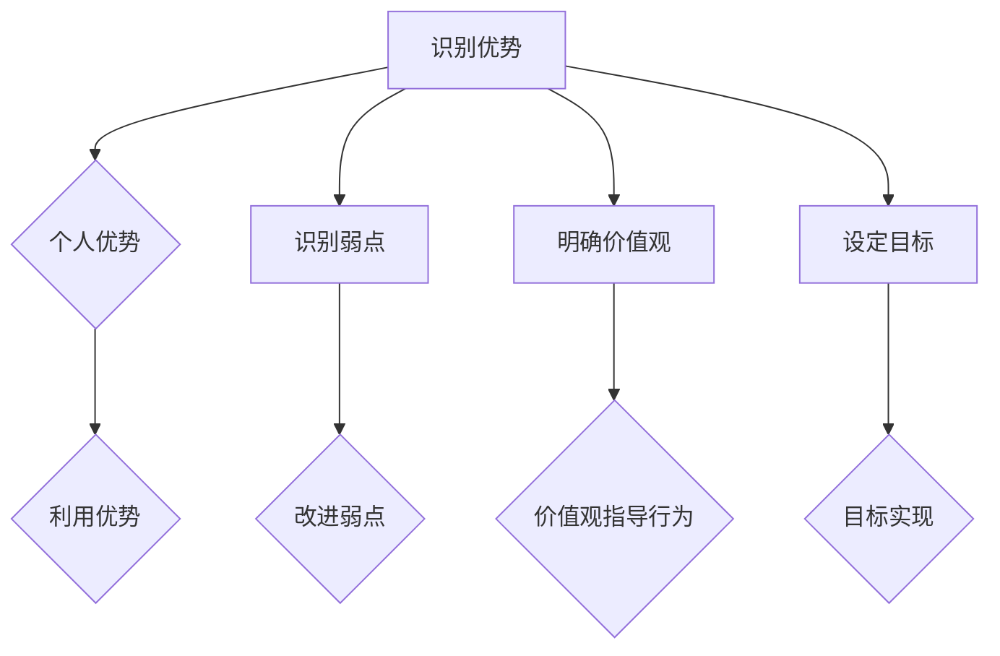

#### 1.2.2 人际关系

人际关系是领导力的关键要素，它影响领导者与团队成员、上级和合作伙伴之间的互动。良好的人际关系可以：

- **增强团队凝聚力**：通过建立信任和尊重，领导者可以增强团队的凝聚力，提高团队协作效率。
- **促进沟通**：良好的沟通有助于领导者更好地了解团队的需求和问题，从而做出更合适的决策。
- **解决冲突**：人际关系有助于领导者识别和解决团队内部的冲突，避免冲突升级，影响团队绩效。

**Mermaid流程图：人际关系管理的过程**

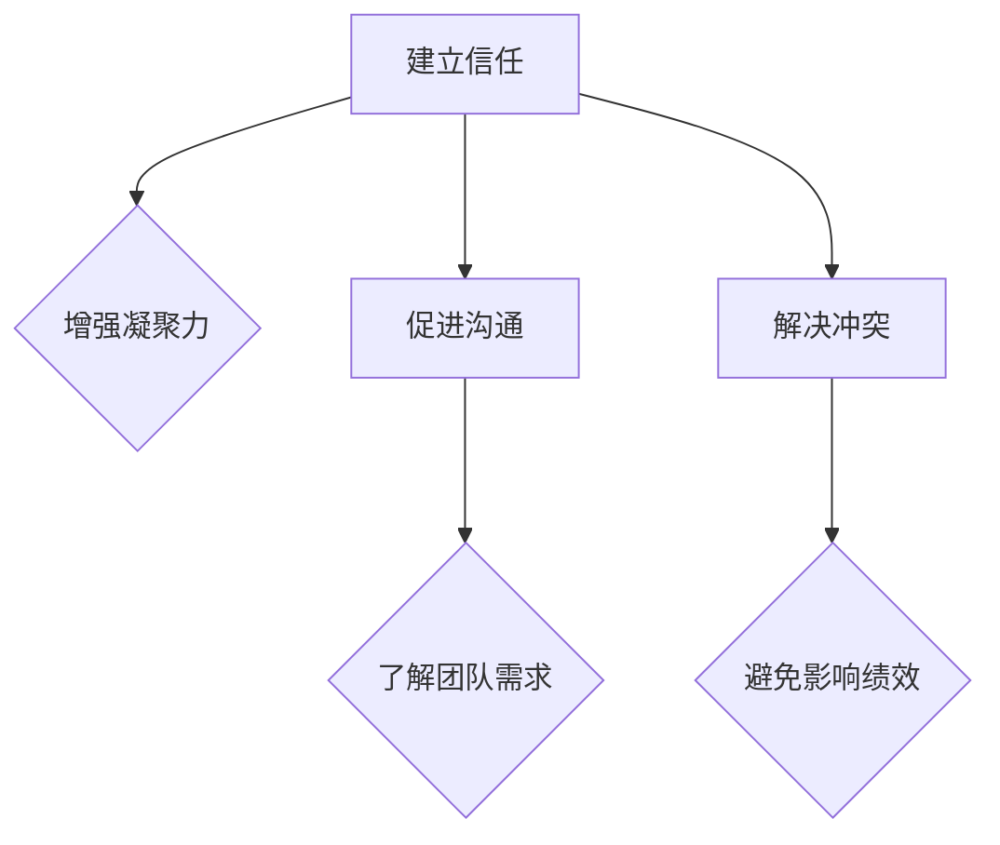

#### 1.2.3 决策能力

决策能力是领导力的核心要素之一，它影响领导者在面对挑战和机遇时的反应速度和质量。有效的决策能力包括：

- **分析能力**：领导者需要能够收集和分析相关信息，以便做出基于事实的决策。
- **判断力**：领导者需要具备良好的判断力，能够在不确定的情况下做出合理的决策。
- **快速反应**：领导者需要能够在紧急情况下迅速做出决策，并采取相应行动。

**伪代码：决策能力分析过程**

```plaintext
function makeDecision(problem):
    collectData(problem)
    analyzeData()
    if isHighRisk():
        findAlternativeSolutions()
    else:
        chooseBestSolution()
    implementSolution()
    return solution
```

#### 1.2.4 执行力

执行力是确保决策得到有效实施的能力。领导者需要确保：

- **资源分配**：合理分配资源，确保决策能够得到充分支持。
- **监督和反馈**：监督决策执行过程，及时反馈问题和调整策略。
- **跟进和评估**：持续跟进决策结果，评估决策效果，并调整后续行动。

**Mermaid流程图：执行力管理的过程**

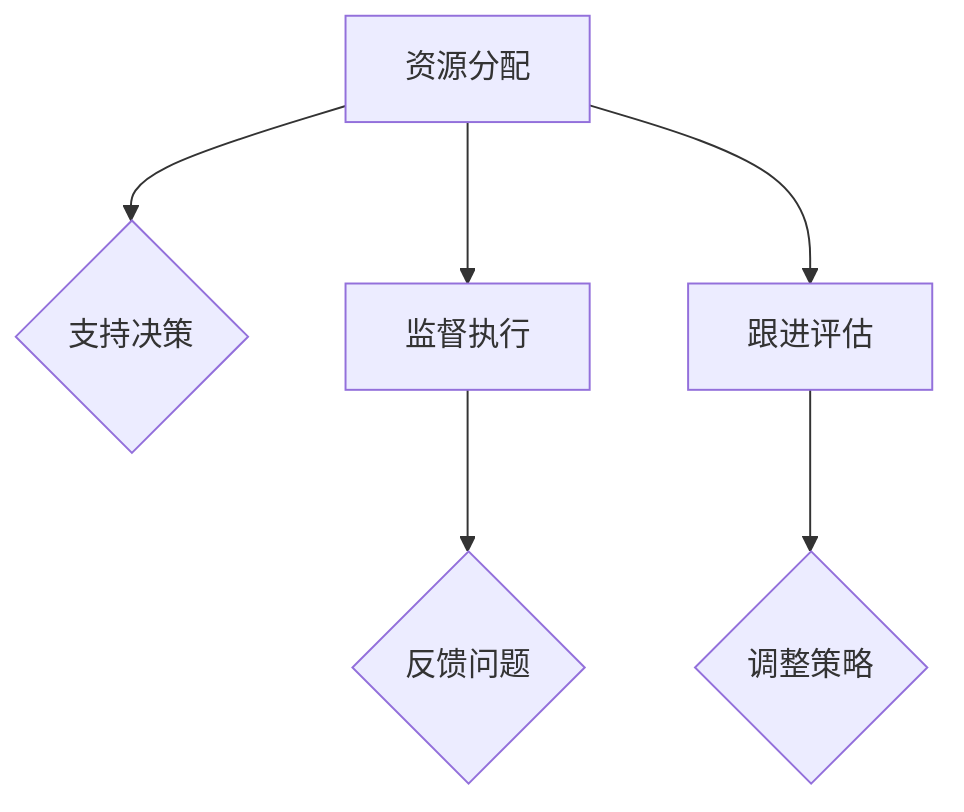

#### 1.2.5 四大要素的整合

领导力的四大要素相互依赖，共同构建一个完整的领导力体系。自我认知提供了领导力的基础，人际关系增强了领导者的沟通和影响力，决策能力确保了领导者能够做出正确的决策，而执行力则确保这些决策能够得到有效实施。

**Mermaid流程图：领导力四大要素的整合**

```mermaid
graph TD
A[自我认知] --> B{增强人际关系}
A --> C[提升决策能力}
A --> D[提高执行力}
B --> E{促进沟通协作}
B --> F{解决冲突}
C --> G{支持决策实施}
C --> H{调整策略}
D --> I{资源合理分配}
D --> J{反馈和改进}
```

在下一节中，我们将探讨领导风格与团队绩效之间的关系，以及不同类型的领导风格如何影响团队的表现。<!-- 可展开内容请添加在 `<!-- 可展开内容请添加在` 和 `-->` 之间 -->--><|im_end|>### 1.3 领导风格与团队绩效

领导风格是领导者行为模式和管理方法的总和，不同的领导风格会对团队绩效产生不同的影响。了解和选择合适的领导风格，对于提升团队绩效和实现组织目标至关重要。

#### 1.3.1 权威型领导

权威型领导（Autocratic Leadership）是一种集中决策权的领导风格。在这种风格下，领导者拥有绝对的决策权，团队成员通常不参与决策过程。权威型领导的特点包括：

- **决策集中**：领导者独自做出决策，团队成员通常不参与。
- **指令明确**：领导者通过明确的指令告诉团队成员该做什么。
- **效率高**：在紧急或需要迅速决策的情况下，权威型领导能够快速做出决策并执行。

**Mermaid流程图：权威型领导的工作流程**

```mermaid
graph TD
A[领导者做出决策] --> B{发布指令}
B --> C[团队成员执行}
```

权威型领导的优点在于决策迅速、执行效率高，但缺点是缺乏团队成员的参与和意见，可能导致团队缺乏凝聚力和创造力。

#### 1.3.2 民主型领导

民主型领导（Democratic Leadership）是一种强调团队成员参与决策的领导风格。在这种风格下，领导者鼓励团队成员提供意见和参与决策过程。民主型领导的特点包括：

- **参与决策**：团队成员有机会参与决策过程，提供意见和建议。
- **集体决策**：领导者通常与团队成员一起讨论，达成共识后做出决策。
- **鼓励创新**：团队成员的参与和意见有助于激发创新思维。

**Mermaid流程图：民主型领导的工作流程**

```mermaid
graph TD
A[收集团队成员意见] --> B{讨论决策}
B --> C[达成共识}
C --> D[领导者做出决策]
```

民主型领导的优点在于增强团队凝聚力、提高创新力，但缺点是决策过程可能较为缓慢，不适合在紧急情况下做出快速决策。

#### 1.3.3 参与型领导

参与型领导（Participative Leadership）是一种领导者与团队成员共同参与决策的领导风格。在这种风格下，领导者重视团队成员的参与和贡献，鼓励他们为团队的目标和决策贡献力量。参与型领导的特点包括：

- **共同决策**：领导者与团队成员共同讨论和制定决策。
- **平等参与**：团队成员在决策过程中拥有平等的话语权。
- **培养自主性**：团队成员通过参与决策，培养自主性和责任感。

**Mermaid流程图：参与型领导的工作流程**

```mermaid
graph TD
A[领导者发起讨论] --> B{团队成员参与}
B --> C[共同制定决策}
```

参与型领导的优点在于增强团队凝聚力和自主性，但缺点是决策过程可能较为复杂，需要更多时间和精力。

#### 1.3.4 变革型领导

变革型领导（Transformational Leadership）是一种通过激励和榜样作用，推动团队成员实现自我超越和变革的领导风格。在这种风格下，领导者通过激发团队成员的激情和愿景，带领团队实现重大的变革和进步。变革型领导的特点包括：

- **激励团队成员**：领导者通过激励和榜样作用，激发团队成员的激情和动力。
- **建立共同愿景**：领导者与团队成员共同建立清晰的愿景和目标。
- **推动变革**：领导者通过推动变革，帮助团队适应外部环境的变化。

**Mermaid流程图：变革型领导的工作流程**

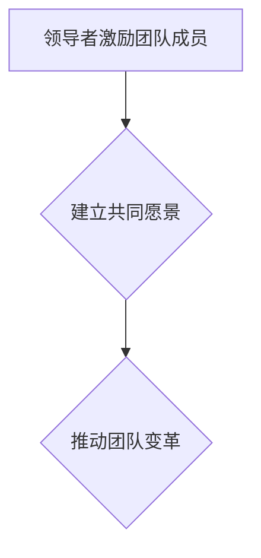

变革型领导的优点在于能够激发团队的创造力和变革能力，但缺点是需要领导者具备较高的领导力和影响力。

#### 1.3.5 领导风格与团队绩效

不同的领导风格对团队绩效有不同的影响。研究表明：

- **权威型领导**：在任务明确、环境稳定的情况下，权威型领导能够提高团队绩效。
- **民主型领导**：在任务复杂、需要创新的情况下，民主型领导能够提高团队绩效。
- **参与型领导**：在任务需要团队合作、团队成员有自主性需求的情况下，参与型领导能够提高团队绩效。
- **变革型领导**：在需要推动变革、适应环境变化的情况下，变革型领导能够提高团队绩效。

**Mermaid流程图：领导风格与团队绩效的关系**

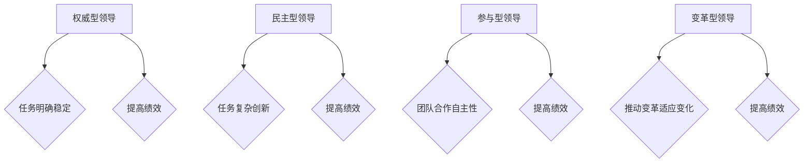

在下一节中，我们将探讨领导风格如何影响团队成员的行为和工作方式，以及如何选择适合的领导风格来提升团队绩效。<!-- 可展开内容请添加在 `<!-- 可展开内容请添加在` 和 `-->` 之间 -->--><|im_end|>### 1.4 领导力的核心概念与联系

领导力是一个复杂且多维的概念，其核心元素相互关联，共同构建了领导力的整体框架。以下是领导力的几个核心概念及其之间的联系：

#### 1.4.1 愿景

愿景是领导者为组织或团队设定的长远目标和理想状态。一个清晰的愿景能够为团队成员提供方向和动力，激发他们的热情和创造力。愿景是领导力的核心，它影响着以下方面：

- **目标设定**：愿景指导领导者设定具体的短期和长期目标。
- **决策**：在面临选择时，领导者会考虑这些决策是否符合组织的愿景。
- **激励**：领导者通过愿景激励团队成员，共同追求组织的长远目标。

**Mermaid流程图：愿景与目标、决策和激励的关系**

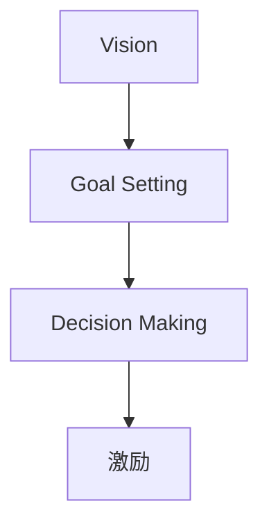

#### 1.4.2 影响力

影响力是领导者通过个人魅力、专业知识、人际关系和价值观对他人产生积极影响的能力。影响力不仅帮助领导者实现组织目标，还增强了团队的凝聚力和协作精神。影响力与以下方面密切相关：

- **愿景传递**：领导者需要利用影响力将愿景传递给团队成员，确保他们理解并支持组织的目标。
- **团队建设**：领导者通过影响力建立信任和尊重，促进团队合作。
- **变革管理**：在推动组织变革时，领导者需要利用影响力来动员团队成员支持和参与变革。

**Mermaid流程图：影响力与愿景传递、团队建设和变革管理的关系**

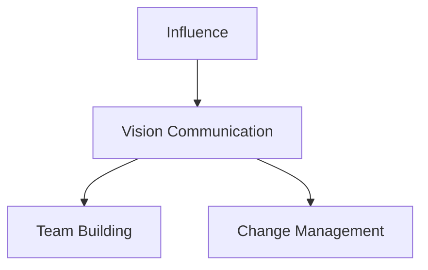

#### 1.4.3 沟通

沟通是领导力的关键要素，它确保领导者与团队成员、上级和合作伙伴之间的信息流通和意见交换。有效的沟通有助于：

- **愿景传递**：领导者需要通过沟通将愿景、目标和决策传达给团队成员。
- **冲突解决**：沟通有助于识别和解决团队内部的冲突，避免问题升级。
- **协作**：通过沟通，团队成员可以更好地理解彼此的角色和任务，提高协作效率。

**Mermaid流程图：沟通与愿景传递、冲突解决和协作的关系**

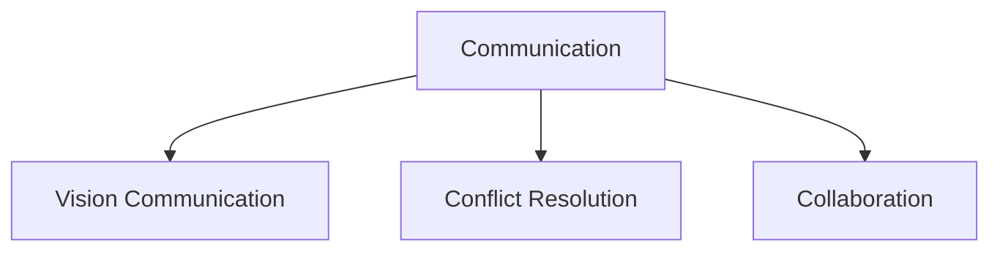

#### 1.4.4 激励

激励是领导者通过提供奖励、认可和机会来激发团队成员的工作热情和创造力。激励与以下方面密切相关：

- **愿景实现**：领导者通过激励确保团队成员为实现组织的愿景而努力。
- **绩效提升**：激励措施能够提高团队成员的工作效率和绩效。
- **团队士气**：激励有助于提升团队士气，增强团队的凝聚力。

**Mermaid流程图：激励与愿景实现、绩效提升和团队士气的关系**

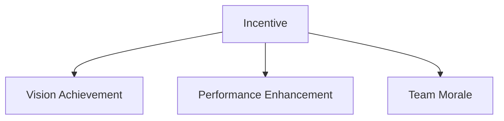

#### 1.4.5 变革管理

变革管理是领导者推动组织适应外部环境变化的过程。变革管理涉及以下方面：

- **适应能力**：领导者需要具备适应变化的能力，以应对市场和环境的变化。
- **变革领导**：领导者通过变革管理激发团队成员的变革意愿，推动组织实现变革。
- **风险管理**：在变革过程中，领导者需要识别和应对潜在的风险，确保变革的顺利进行。

**Mermaid流程图：变革管理与适应能力、变革领导和风险管理的关系**

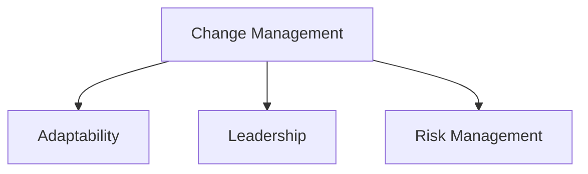

通过理解这些核心概念及其相互关系，领导者可以更有效地管理团队，实现组织目标。在下一节中，我们将探讨领导力在市场经理中的应用，展示市场经理如何通过领导力实现职业发展和业绩突破。<!-- 可展开内容请添加在 `<!-- 可展开内容请添加在` 和 `-->` 之间 -->--><|im_end|>### 1.5 领导力在市场经理中的应用

在市场环境中，领导力是市场经理成功的关键因素。市场经理需要运用领导力来制定策略、管理团队、应对挑战和抓住机遇。以下是领导力在市场经理中的应用：

#### 1.5.1 市场策略制定

市场策略是市场经理的核心职责之一。一个有效的市场策略需要基于对市场环境的深刻理解和准确的市场定位。市场经理需要通过领导力来实现以下目标：

- **愿景与目标**：市场经理需要明确组织的市场愿景和目标，并将其传达给团队。
- **数据驱动**：市场经理需要利用数据分析来支持策略制定，确保决策是基于事实和数据的。
- **创新思维**：市场经理需要鼓励团队成员提出创新的策略，以适应不断变化的市场环境。

**伪代码：市场策略制定过程**

```plaintext
function createMarketingStrategy():
    gatherMarketData()
    analyzeData()
    defineVisionAndGoals()
    brainstormStrategies()
    evaluateStrategies()
    selectBestStrategy()
    communicateStrategy()
    implementStrategy()
    monitorAndAdjust()
    return strategy
```

#### 1.5.2 团队协作

市场经理需要建立高效的团队，通过良好的沟通和协作来实现市场目标。领导力在团队协作中的应用包括：

- **沟通**：市场经理需要确保团队内部和团队之间的沟通畅通，减少误解和冲突。
- **激励**：市场经理需要激励团队成员，提高他们的工作热情和创造力。
- **团队建设**：市场经理需要通过团队建设活动增强团队凝聚力，提高团队协作效率。

**Mermaid流程图：团队协作管理过程**

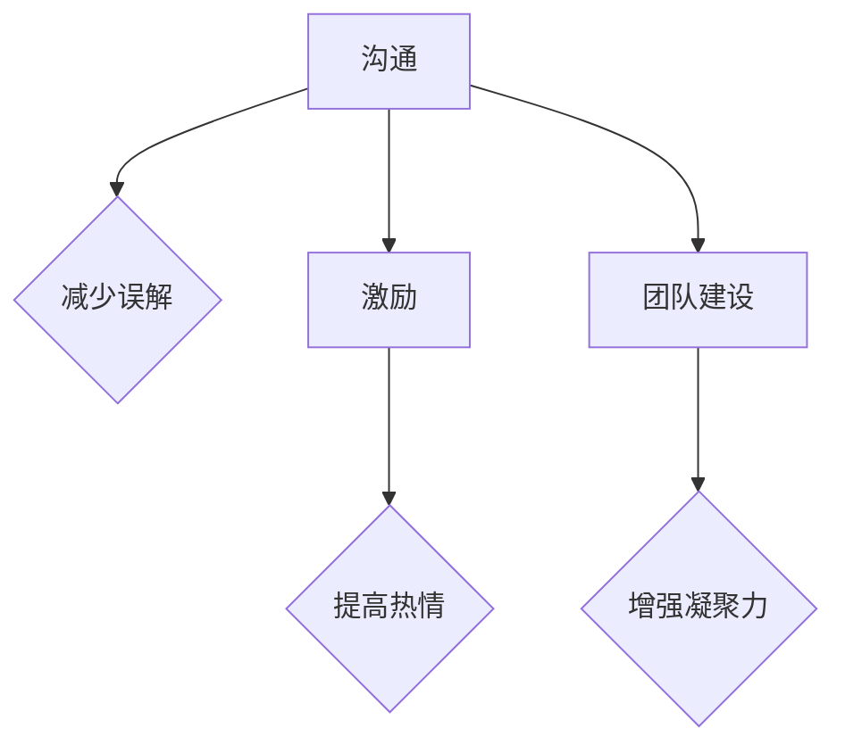

#### 1.5.3 危机管理

市场经理需要具备危机管理的能力，以应对市场变化和竞争压力。领导力在危机管理中的应用包括：

- **快速决策**：市场经理需要能够在紧急情况下迅速做出决策，并采取相应行动。
- **团队协作**：市场经理需要动员团队，共同应对危机。
- **风险管理**：市场经理需要识别和应对潜在的风险，确保组织的稳定运营。

**Mermaid流程图：危机管理过程**


#### 1.5.4 客户关系管理

市场经理需要维护良好的客户关系，提高客户满意度，促进市场业绩的提升。领导力在客户关系管理中的应用包括：

- **客户导向**：市场经理需要确保团队以客户为中心，了解客户需求和反馈。
- **沟通**：市场经理需要与客户保持良好沟通，确保客户问题得到及时解决。
- **服务创新**：市场经理需要鼓励团队提供创新的服务和解决方案，提升客户体验。

**Mermaid流程图：客户关系管理过程**

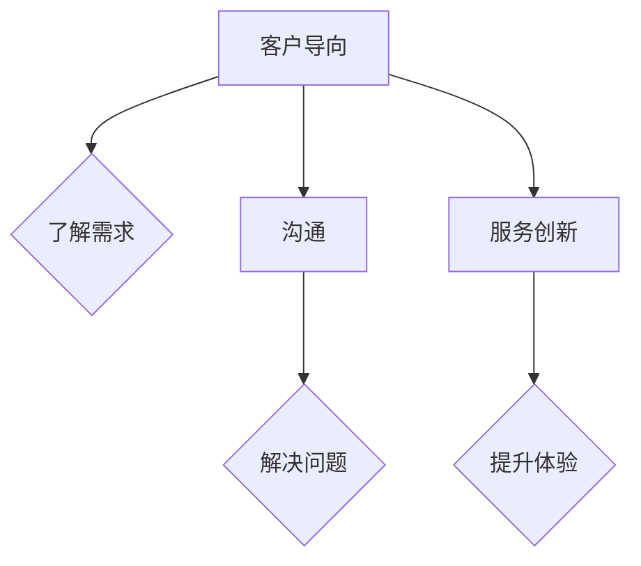

#### 1.5.5 成长与发展

市场经理需要不断学习和成长，以适应不断变化的市场环境。领导力在个人成长中的应用包括：

- **自我提升**：市场经理需要通过学习新的市场知识和技能，提升自己的专业能力。
- **团队培养**：市场经理需要培养团队成员，提升团队的整体能力。
- **反馈与改进**：市场经理需要通过反馈和改进，不断优化自己的领导方法和策略。

**Mermaid流程图：个人成长过程**

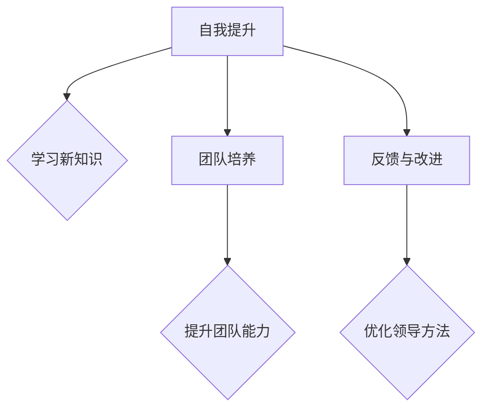

通过以上应用，市场经理可以更好地发挥领导力，实现市场业绩的提升和职业发展的突破。在下一章中，我们将探讨市场经理在实际工作中如何修炼领导力，实现个人和团队的成长。<!-- 可展开内容请添加在 `<!-- 可展开内容请添加在` 和 `-->` 之间 -->--><|im_end|>### 1.6 领导力的实践

领导力并非仅仅是理论上的知识，更是一种需要不断实践和磨练的能力。以下是几个领导力的实践案例，以及如何通过这些实践提升领导力。

#### 1.6.1 案例一：危机管理中的领导力

在一个全球性金融危机期间，某公司市场经理面临巨大压力。为了稳定团队和应对市场变化，他采取了以下措施：

- **迅速决策**：市场经理在危机初期就迅速做出决策，调整市场策略，减少开支，保障公司的现金流。
- **沟通**：他通过定期会议和内部通讯，与团队成员保持密切沟通，确保他们了解公司的现状和策略，减少恐慌和不确定性。
- **激励**：市场经理通过鼓励团队成员，提高他们的工作积极性和创新能力，确保公司在危机中依然能够保持竞争力。

**实践要点**：

- **快速决策**：在危机中，领导者需要迅速做出决策，以应对变化。
- **有效沟通**：领导者需要确保团队成员了解公司的现状和策略，减少恐慌。
- **激励团队**：通过激励，领导者可以提升团队的工作积极性和创造力。

#### 1.6.2 案例二：团队建设中的领导力

某市场经理在团队初期，通过以下措施建立了高效的团队：

- **共同目标**：市场经理确保团队成员对团队的目标有清晰的认识，并鼓励他们为实现这些目标而努力。
- **角色分配**：市场经理根据团队成员的技能和兴趣，合理分配任务，确保每个人都能在自己的角色中发挥最大价值。
- **团队活动**：市场经理定期组织团队建设活动，增强团队凝聚力，提高协作效率。

**实践要点**：

- **共同目标**：确保团队成员对团队的目标有清晰的认识。
- **合理分配**：根据团队成员的技能和兴趣，合理分配任务。
- **团队活动**：通过团队建设活动，增强团队凝聚力。

#### 1.6.3 案例三：创新思维中的领导力

在激烈的市场竞争中，某市场经理通过以下措施推动了团队的创新思维：

- **开放沟通**：市场经理鼓励团队成员提出新想法，并确保他们的声音被听到。
- **资源支持**：市场经理提供必要的资源和支持，确保创新想法能够得到实践。
- **激励创新**：市场经理通过奖励机制激励团队成员提出和创新。

**实践要点**：

- **开放沟通**：鼓励团队成员提出新想法。
- **资源支持**：为创新提供必要的资源和支持。
- **激励创新**：通过奖励机制激励团队成员。

#### 1.6.4 案例四：客户关系管理中的领导力

某市场经理通过以下措施提升了客户关系管理：

- **了解客户需求**：市场经理定期与客户沟通，了解他们的需求和反馈。
- **客户导向**：市场经理确保团队以客户为中心，提供定制化的服务和解决方案。
- **持续改进**：市场经理通过不断优化产品和服务，提升客户满意度。

**实践要点**：

- **了解客户需求**：通过沟通了解客户的需求。
- **客户导向**：以客户为中心，提供定制化的服务和解决方案。
- **持续改进**：通过持续改进，提升客户满意度。

#### 1.6.5 案例五：个人成长中的领导力

在职业生涯中，某市场经理通过以下措施实现了个人成长：

- **自我反思**：市场经理定期进行自我反思，识别自己的优势和不足，制定个人成长计划。
- **持续学习**：市场经理通过参加培训、阅读书籍、参加行业会议等方式，不断学习新的知识和技能。
- **角色扮演**：市场经理通过尝试不同的角色和职责，提升自己的领导力和管理能力。

**实践要点**：

- **自我反思**：定期进行自我反思，制定个人成长计划。
- **持续学习**：通过学习提升自己的知识和技能。
- **角色扮演**：通过尝试不同的角色和职责，提升领导力。

通过这些实践案例，我们可以看到领导力是通过不断实践和磨练而来的。领导者需要在实际工作中不断尝试、反思和改进，以提升自己的领导力。在下一章中，我们将深入探讨自我认知与成长，以及如何通过自我提升实现领导力的提升。<!-- 可展开内容请添加在 `<!-- 可展开内容请添加在` 和 `-->` 之间 -->--><|im_end|>### 第2章：自我认知与成长

#### 2.1 自我认知的重要性

自我认知是领导力的基石，它帮助领导者了解自己的优点和缺点，明确自己的价值观和目标，从而实现个人和职业的持续成长。自我认知的重要性体现在以下几个方面：

1. **了解个人优势**：自我认知使领导者能够识别自己在哪些领域具有优势，从而更好地利用这些优势推动团队和组织的发展。
2. **识别个人弱点**：通过自我认知，领导者可以发现自己的弱点，并采取相应的措施进行改进，减少对团队和组织发展的负面影响。
3. **明确价值观**：价值观是领导者行为的指南，自我认知有助于领导者明确自己的价值观，确保决策和行为与组织的价值观保持一致。
4. **设定目标**：自我认知帮助领导者设定符合自身实际情况和职业发展的目标，从而为实现这些目标制定合理的计划。

#### 2.2 成长型思维模式

成长型思维模式（Growth Mindset）是一种积极的思维模式，它相信通过努力和持续学习，个人的能力和智慧是可以不断成长的。成长型思维模式对领导力的发展具有重要意义：

- **鼓励挑战**：领导者具备成长型思维模式，会主动寻求挑战，通过不断克服困难和解决问题来提升自己的能力。
- **拥抱失败**：成长型思维模式使领导者能够正确看待失败，将其视为成长和学习的机会，而非挫折。
- **持续学习**：领导者具备成长型思维模式，会不断寻求新的知识和技能，以适应快速变化的环境。

**伪代码：成长型思维模式的实践**

```plaintext
function growMindset():
    embraceChallenge()
    viewFailureAsLearning()
    continueLearning()
    practiceNewSkills()
    seekFeedback()
    adaptToChanges()
```

#### 2.3 自我提升的策略与方法

为了实现自我认知和成长，领导者可以采取以下策略和方法：

1. **自我反思**：定期进行自我反思，回顾自己的行为和决策，识别成功和失败的教训。
2. **设定目标**：设定短期和长期的个人成长目标，并制定实现这些目标的计划。
3. **持续学习**：通过阅读书籍、参加培训课程、参加工作坊等方式，不断学习新的知识和技能。
4. **寻求反馈**：向同事、上级和下属寻求反馈，了解自己的优势和改进点。
5. **实践应用**：将学到的知识和技能应用到实际工作中，通过实践不断改进和提升。
6. **建立导师关系**：寻找经验丰富的导师，从他们那里获得指导和建议，加快个人成长的速度。

**Mermaid流程图：自我提升的过程**

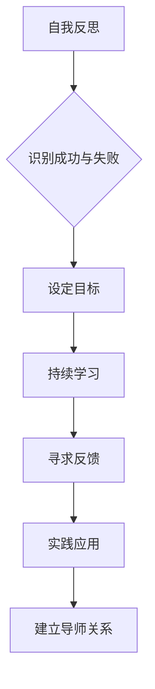

#### 2.4 自我认知与领导力的关系

自我认知不仅有助于个人成长，还直接影响领导力的发展。以下是自我认知与领导力之间的几个关键关系：

1. **自我认知提升领导能力**：通过自我认知，领导者能够更好地了解自己的优势和劣势，从而在领导过程中发挥自己的优势，弥补不足。
2. **自我认知增强决策能力**：领导者具备自我认知，能够在决策过程中更加客观和理性，避免因个人偏见和情感而做出错误的决策。
3. **自我认知促进团队建设**：领导者通过自我认知，可以更好地理解团队成员的需求和期望，从而建立更加和谐的团队关系。
4. **自我认知推动持续成长**：领导者通过自我认知，意识到自己在不断成长的过程中，会不断寻求新的挑战和机会，推动个人和团队的持续发展。

在下一章中，我们将探讨团队建设的重要性，以及如何通过团队建设提升领导力。<!-- 可展开内容请添加在 `<!-- 可展开内容请添加在` 和 `-->` 之间 -->--><|im_end|>### 第3章：团队建设

#### 3.1 团队建设的原则与目标

团队建设是领导力的重要组成部分，它关乎团队的整体绩效和成员的满意度。为了有效地进行团队建设，需要遵循以下原则和目标：

1. **明确目标**：团队建设首先需要明确团队的目标，确保每个成员都清楚团队的使命和愿景，从而增强团队凝聚力。
2. **建立信任**：信任是团队建设的基础，领导者需要通过建立透明和开放的沟通环境，增强团队成员之间的信任。
3. **促进沟通**：有效的沟通是团队协作的关键，领导者需要鼓励团队成员之间的交流，确保信息的畅通无阻。
4. **尊重差异**：团队成员来自不同的背景和领域，领导者需要尊重这些差异，发挥每个成员的独特优势。
5. **培养共同价值观**：共同的价值观有助于增强团队的归属感和一致性，领导者需要引导团队成员形成共同的价值观。
6. **激励与支持**：领导者需要通过激励和支持，激发团队成员的积极性和创造力，推动团队目标的实现。

**Mermaid流程图：团队建设的基本原则**

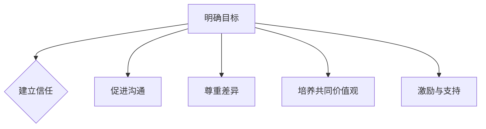

#### 3.2 团队沟通与协作

团队沟通和协作是团队建设的重要组成部分，有效的沟通和协作能够提高团队的效率和绩效。以下是团队沟通与协作的关键要素：

1. **开放沟通**：领导者需要鼓励团队成员开放地表达自己的想法和意见，避免信息孤岛和误解。
2. **倾听**：领导者需要倾听团队成员的意见和反馈，了解他们的需求和困惑，从而更好地支持他们的工作。
3. **明确职责**：每个团队成员都需要明确自己的职责和任务，确保工作的高效和协调。
4. **共享资源**：团队需要共享资源，如信息、工具和知识，以便更有效地协作。
5. **协同工作**：领导者需要促进团队成员之间的协同工作，确保每个成员都能在团队中发挥最大的作用。

**Mermaid流程图：团队沟通与协作的流程**

```mermaid
graph TD
A[开放沟通] --> B{鼓励表达}
A --> C[倾听反馈]
A --> D[明确职责]
A --> E[共享资源]
A --> F[协同工作]
```

#### 3.3 团队冲突管理与解决

团队冲突是团队建设过程中不可避免的一部分，有效的冲突管理能够增强团队的合作和凝聚力。以下是团队冲突管理的关键策略：

1. **识别冲突**：领导者需要及时发现和识别团队中的冲突，了解冲突的原因和影响。
2. **沟通解决**：领导者需要通过有效的沟通来解决问题，鼓励团队成员表达自己的观点和感受，寻找共同点。
3. **调解与仲裁**：在冲突无法通过沟通解决时，领导者需要采取调解和仲裁措施，确保冲突的公正解决。
4. **建立共识**：领导者需要引导团队建立共识，确保团队成员在冲突解决后能够继续合作。

**Mermaid流程图：团队冲突管理的流程**

```mermaid
graph TD
A[识别冲突] --> B{沟通解决}
A --> C{调解与仲裁}
A --> D{建立共识}
```

通过以上团队建设的方法和策略，领导者可以有效地提升团队的整体绩效和成员的满意度。在下一章中，我们将探讨领导影响力的概念及其在领导力实践中的应用。<!-- 可展开内容请添加在 `<!-- 可展开内容请添加在` 和 `-->` 之间 -->--><|im_end|>### 第4章：领导影响力

#### 4.1 影响力的重要性

领导影响力是领导者通过个人魅力、专业知识、价值观和行为对他人产生积极影响的能力。它不仅是领导力的重要组成部分，也是实现组织目标和团队协作的关键因素。领导影响力的重要性体现在以下几个方面：

1. **推动变革**：领导影响力能够激励团队成员接受变革，推动组织适应外部环境的变化。
2. **提升团队凝聚力**：领导影响力通过建立信任和尊重，增强团队成员之间的凝聚力，提高团队的整体绩效。
3. **促进创新**：领导影响力鼓励团队成员发挥创造力，提出新的想法和解决方案，推动组织的创新和发展。
4. **实现目标**：领导影响力帮助领导者影响团队成员，共同为实现组织目标而努力。

#### 4.2 建立个人品牌

个人品牌是领导者在组织和社会中的形象和声誉，它有助于提升领导影响力的效果。建立个人品牌需要以下步骤：

1. **明确个人价值观**：领导者需要明确自己的价值观，并将其体现在日常行为和决策中，形成独特的个人风格。
2. **持续学习与成长**：领导者需要不断学习新的知识和技能，提升自己的专业能力，以保持在行业中的领先地位。
3. **积极参与**：领导者需要积极参与组织和社会活动，扩大自己的影响力，提升个人知名度。
4. **传递愿景与使命**：领导者需要通过沟通和行动，将组织的愿景和使命传递给团队成员，增强团队的认同感和归属感。

**Mermaid流程图：建立个人品牌的步骤**

```mermaid
graph TD
A[明确价值观] --> B{体现个人风格}
A --> C[持续学习与成长]
A --> D[积极参与]
A --> E[传递愿景与使命]
```

#### 4.3 成功的领导影响力策略

要成功运用领导影响力，领导者可以采取以下策略：

1. **激励与鼓励**：领导者需要通过激励和鼓励，激发团队成员的积极性和创造力，推动团队目标的实现。
2. **榜样作用**：领导者需要以身作则，通过自己的行为和决策，树立良好的榜样，影响团队成员的行为和态度。
3. **建立信任**：领导者需要通过建立信任，增强团队成员之间的沟通和协作，提高团队的凝聚力和效率。
4. **有效沟通**：领导者需要通过有效沟通，确保团队成员了解组织的愿景和目标，提高团队的整体认知和执行力。
5. **解决冲突**：领导者需要具备解决冲突的能力，通过公正和理性的方式，解决团队内部的矛盾和问题。

**Mermaid流程图：领导影响力策略的应用**

```mermaid
graph TD
A[激励与鼓励] --> B{激发积极性}
A --> C[榜样作用] --> D{树立榜样}
A --> E[建立信任] --> F{增强沟通}
A --> G[有效沟通] --> H{提高执行力}
A --> I[解决冲突] --> J{解决矛盾}
```

通过以上领导影响力策略，领导者可以有效地影响团队成员，提升团队的绩效和组织的竞争力。在下一章中，我们将探讨目标管理与执行的重要性，以及如何通过有效的目标管理实现团队的目标。<!-- 可展开内容请添加在 `<!-- 可展开内容请添加在` 和 `-->` 之间 -->--><|im_end|>### 第5章：目标管理与执行

#### 5.1 目标设定的SMART原则

目标设定是目标管理的第一步，一个有效的目标应该遵循SMART原则，即具体（Specific）、可衡量（Measurable）、可实现（Achievable）、相关（Relevant）和有时限（Time-bound）。以下是SMART原则的详细解释：

- **具体（Specific）**：目标需要明确具体，避免模糊和宽泛。例如，“提高销售额”应改为“增加20%的季度销售额”。
- **可衡量（Measurable）**：目标需要具备可衡量的标准，以便评估进度和效果。例如，“提高客户满意度”可以量化为“客户满意度评分从80分提升至90分”。
- **可实现（Achievable）**：目标应具备可行性，确保团队成员有足够的资源和能力去实现。例如，“实现公司全球扩张”可能过于宏大，而“在下一季度开拓三个新市场”则更为实际。
- **相关（Relevant）**：目标应与组织的整体战略和团队职责相关联，确保对组织的发展有积极影响。例如，“提升产品市场份额”与公司整体目标紧密相关。
- **有时限（Time-bound）**：目标需要设定明确的截止时间，以促进团队的工作效率和紧迫感。例如，“在2024年底实现年度利润增长目标”。

**伪代码：SMART目标设定示例**

```plaintext
function setSMARTGoal(goal):
    if not goal.isSpecific():
        print("目标需具体明确")
    if not goal.isMeasurable():
        print("目标需可衡量")
    if not goal.isAchievable():
        print("目标需可实现")
    if not goal.isRelevant():
        print("目标需与组织目标相关")
    if not goal.isTimeBound():
        print("目标需有时限")
    return goal
```

#### 5.2 目标分解与优先级排序

在设定目标后，领导者需要将大目标分解为具体的小目标，并对其进行优先级排序，以确保团队能够有条不紊地推进工作。以下是目标分解与优先级排序的步骤：

1. **目标分解**：将总体目标分解为具体的、可操作的任务和里程碑，确保每个任务都有明确的责任人和截止时间。
2. **优先级排序**：根据任务的重要性和紧急性，对任务进行优先级排序，确保团队首先完成最重要的任务。
3. **资源分配**：根据任务的优先级和资源状况，合理分配人力资源和物资资源，确保每个任务都有足够的支持。
4. **监控与调整**：在执行过程中，持续监控任务的进展情况，并根据实际情况进行调整，确保目标能够按时完成。

**Mermaid流程图：目标分解与优先级排序**

```mermaid
graph TD
A[目标分解] --> B{具体任务和里程碑}
B --> C[优先级排序]
C --> D[资源分配]
D --> E[监控与调整]
```

#### 5.3 执行力的提升策略

执行力是目标管理的关键，它关系到目标的实现与否。以下是提升执行力的几个策略：

1. **明确责任**：确保每个团队成员都清楚自己的职责和任务，避免责任模糊和推诿。
2. **建立机制**：建立有效的沟通和反馈机制，确保团队成员之间信息畅通，问题能够及时得到解决。
3. **激励机制**：通过奖励和认可，激励团队成员提高工作积极性和执行力。
4. **过程优化**：持续优化工作流程，减少不必要的手动操作和重复劳动，提高工作效率。
5. **持续监控**：定期监控任务的执行情况，及时发现并解决问题，确保目标按时完成。

**Mermaid流程图：提升执行力的策略**

```mermaid
graph TD
A[明确责任] --> B{建立机制}
A --> C[激励机制]
A --> D[过程优化]
A --> E[持续监控]
```

通过以上目标管理与执行的策略，领导者可以确保团队目标的实现，推动组织的持续发展。在下一章中，我们将探讨领导力发展路径，以及如何通过持续学习和实践提升领导力。<!-- 可展开内容请添加在 `<!-- 可展开内容请添加在` 和 `-->` 之间 -->--><|im_end|>### 第6章：领导力发展

#### 6.1 领导力发展路径

领导力发展是一个持续的过程，涉及知识、技能和态度的不断学习和提升。以下是领导力发展的几个关键路径：

1. **自我反思**：领导者需要定期进行自我反思，了解自己的优点和不足，明确个人成长的方向。
2. **持续学习**：通过阅读书籍、参加培训、参加工作坊等方式，领导者可以不断学习新的知识和技能，保持专业前沿。
3. **实践应用**：将学到的知识和技能应用到实际工作中，通过实践不断改进和提升自己的领导能力。
4. **建立导师关系**：寻找经验丰富的导师，从他们那里获得指导和建议，加快个人成长的速度。
5. **参与领导力项目**：参与组织内部的领导力发展项目，与其他领导者交流经验，提升自己的领导力。

**Mermaid流程图：领导力发展路径**

```mermaid
graph TD
A[自我反思] --> B{学习新知识}
A --> C[实践应用]
A --> D[建立导师关系]
A --> E[参与领导力项目]
```

#### 6.2 领导力培养的方法

培养领导力需要系统的计划和持续的努力。以下是几种有效的领导力培养方法：

1. **培训与发展**：组织可以为领导者提供各种培训课程，如领导力工作坊、管理培训等，帮助领导者提升管理和领导技能。
2. **角色扮演**：通过角色扮演，领导者可以在模拟环境中练习领导技能，提高决策能力和沟通技巧。
3. **领导力教练**：领导力教练可以帮助领导者识别自身优势和不足，提供个性化的指导和支持，加速个人成长。
4. **实践项目**：组织可以安排领导者参与实际项目，让他们在真实的工作环境中锻炼领导能力。
5. **导师制度**：通过导师制度，新任领导者可以与经验丰富的导师进行一对一交流，获得宝贵的经验和建议。

**Mermaid流程图：领导力培养的方法**

```mermaid
graph TD
A[培训与发展] --> B{提升管理技能}
A --> C[角色扮演] --> D{练习决策和沟通}
A --> E[领导力教练] --> F{个性化指导}
A --> G[实践项目] --> H{锻炼领导能力}
A --> I[导师制度] --> J{获得经验建议}
```

#### 6.3 领导力评估与反馈

有效的领导力评估和反馈机制对于领导者的发展至关重要。以下是领导力评估和反馈的几个关键点：

1. **360度评估**：通过团队成员、上级、下属和其他利益相关者的反馈，全面了解领导者的表现。
2. **定期反馈**：领导者应定期进行自我评估，并与上级和下属进行沟通，了解他们的反馈和建议。
3. **目标设定**：根据评估结果和反馈，领导者可以设定个人发展目标，制定具体的改进计划。
4. **跟踪进展**：领导者需要持续跟踪自己的进展，确保目标得到有效实现。
5. **持续改进**：领导者应持续改进自己的领导方法，通过学习和实践不断提升自己的领导力。

**Mermaid流程图：领导力评估与反馈**

```mermaid
graph TD
A[360度评估] --> B{全面了解表现}
A --> C[定期反馈] --> D{了解建议}
A --> E[目标设定] --> F{制定改进计划}
A --> G[跟踪进展] --> H{确保目标实现}
A --> I[持续改进] --> J{提升领导力}
```

通过以上领导力发展的路径、方法和评估机制，领导者可以持续提升自己的领导力，为组织的发展和团队的成长做出更大的贡献。在下一章中，我们将探讨市场经理的角色与职责，以及如何在市场环境中运用领导力实现业绩突破。<!-- 可展开内容请添加在 `<!-- 可展开内容请添加在` 和 `-->` 之间 -->--><|im_end|>### 第7章：市场经理的角色与职责

#### 7.1 市场经理的工作范围

市场经理在企业中扮演着关键角色，其工作范围涵盖了市场调研、策略规划、推广执行和数据分析等多个方面。以下是市场经理的主要工作范围：

1. **市场调研**：市场经理需要通过市场调研了解目标市场的需求和趋势，收集和分析市场数据，为制定有效的市场策略提供依据。
2. **策略规划**：市场经理需要根据市场调研结果和公司战略，制定市场策略和营销计划，确保市场活动与公司目标一致。
3. **推广执行**：市场经理需要组织和协调市场推广活动，包括广告、促销、公关和数字营销等，确保推广活动的高效执行。
4. **数据分析**：市场经理需要利用数据分析工具对市场活动效果进行监控和评估，为优化市场策略提供数据支持。

#### 7.2 市场经理的核心能力

市场经理的成功取决于其核心能力，以下几项能力对市场经理至关重要：

1. **市场分析能力**：市场经理需要具备分析市场环境和消费者行为的能力，从而制定出切实可行的市场策略。
2. **策略制定能力**：市场经理需要能够根据市场调研结果和公司战略，制定出有效的市场策略和营销计划。
3. **执行能力**：市场经理需要具备出色的执行能力，确保市场策略得到有效实施。
4. **沟通与协调能力**：市场经理需要具备良好的沟通和协调能力，能够与团队成员、上级和其他部门有效协作。
5. **数据分析能力**：市场经理需要能够利用数据分析工具对市场活动效果进行监控和评估，为策略优化提供数据支持。

#### 7.3 市场经理的发展路径

市场经理的职业发展路径通常包括以下几个阶段：

1. **初级市场经理**：在这个阶段，市场经理主要承担市场调研、推广执行等具体工作，逐步积累市场经验和技能。
2. **中级市场经理**：随着经验的积累，市场经理开始参与策略制定和项目管理，承担更多的责任和挑战。
3. **高级市场经理**：在高级阶段，市场经理可能负责整个市场的战略规划和资源分配，成为企业市场部门的核心领导。
4. **市场总监**：市场总监是市场部门的最高领导，负责制定公司的市场战略，管理市场团队，实现市场目标。

**Mermaid流程图：市场经理的发展路径**

```mermaid
graph TD
A[初级市场经理] --> B{市场调研与推广执行}
A --> C[中级市场经理] --> D{策略制定与项目管理}
A --> E[高级市场经理] --> F{市场战略规划与资源分配}
A --> G[市场总监] --> H{制定公司市场战略}
```

在下一章中，我们将探讨市场策略规划与执行，展示市场经理如何通过有效的策略规划和执行实现市场目标的达成。<!-- 可展开内容请添加在 `<!-- 可展开内容请添加在` 和 `-->` 之间 -->--><|im_end|>### 第8章：市场策略规划与执行

#### 8.1 市场环境分析

市场策略规划的第一步是对市场环境进行全面分析。市场环境分析包括以下几个方面：

1. **宏观环境**：分析宏观环境因素，如政治、经济、社会、技术（PEST分析），了解外部环境对市场的影响。
2. **行业环境**：分析行业竞争格局、市场规模、增长趋势、关键成功因素等，了解行业特点和潜在机会。
3. **消费者分析**：分析目标消费者的需求、行为、偏好和心理，了解他们的购买决策过程和影响因素。
4. **竞争分析**：分析竞争对手的市场份额、产品定位、营销策略和优势劣势，找到自身定位和差异化的机会。

**Mermaid流程图：市场环境分析**

```mermaid
graph TD
A[宏观环境分析] --> B{PEST分析}
A --> C[行业环境分析] --> D{市场规模与增长趋势}
A --> E[消费者分析] --> F{需求与行为}
A --> G[竞争分析] --> H{市场份额与产品定位}
```

#### 8.2 市场定位与目标设定

在了解市场环境后，市场经理需要确定产品的市场定位和设定明确的目标。市场定位是指企业选择一个恰当的市场位置，以区别于竞争对手。以下是市场定位与目标设定的步骤：

1. **确定目标市场**：根据市场环境分析和消费者分析，确定最符合企业资源和能力的目标市场。
2. **市场定位**：明确产品在目标市场中的独特价值和竞争优势，形成差异化定位。
3. **设定目标**：根据市场定位和公司战略，设定具体、可衡量的市场目标，如市场份额、销售额、品牌知名度等。

**伪代码：市场定位与目标设定**

```plaintext
function defineMarketPositioning():
    analyzeMarket()
    analyzeConsumer()
    determineTargetMarket()
    createUniqueValueProposition()
    setMeasurableObjectives()
    return positioningAndObjectives
```

#### 8.3 市场策略制定

市场策略制定是市场经理的核心工作，包括产品策略、价格策略、推广策略和渠道策略。以下是市场策略制定的步骤：

1. **产品策略**：根据市场定位和消费者需求，制定产品开发、产品线和产品特征策略。
2. **价格策略**：根据成本、竞争状况和消费者价值，制定价格策略，如高价位、中价位或低价位策略。
3. **推广策略**：制定推广计划，包括广告、促销、公关和数字营销等，选择最有效的推广渠道和手段。
4. **渠道策略**：确定产品销售和推广的渠道，如线上销售、线下零售或分销渠道。

**Mermaid流程图：市场策略制定**

```mermaid
graph TD
A[产品策略] --> B{产品开发与特征}
A --> C[价格策略] --> D{成本与消费者价值}
A --> E[推广策略] --> F{广告与促销}
A --> G[渠道策略] --> H{销售与推广渠道}
```

#### 8.4 市场策略执行

市场策略执行是确保市场策略得以有效实施的过程，包括以下几个关键步骤：

1. **制定执行计划**：明确市场策略的具体执行步骤、时间表和责任人。
2. **资源分配**：根据执行计划，合理分配人力资源、财务资源和物资资源。
3. **监控与调整**：在执行过程中，持续监控市场活动的进展和效果，及时调整策略和执行计划。
4. **反馈与优化**：通过反馈机制，收集市场活动和策略的效果反馈，不断优化市场策略和执行方法。

**Mermaid流程图：市场策略执行**

```mermaid
graph TD
A[制定执行计划] --> B{明确执行步骤}
A --> C[资源分配] --> D{人力资源与财务资源}
A --> E[监控与调整] --> F{持续监控与及时调整}
A --> G[反馈与优化] --> H{收集反馈与优化策略}
```

通过以上市场策略规划与执行的方法，市场经理可以有效地制定和实施市场策略，实现市场目标的达成。在下一章中，我们将探讨市场推广与营销的方法，以及如何通过有效的市场推广提升品牌知名度。<!-- 可展开内容请添加在 `<!-- 可展开内容请添加在` 和 `-->` 之间 -->--><|im_end|>### 第9章：市场推广与营销

#### 9.1 市场推广的方法

市场推广是市场经理的重要职责之一，它涉及通过各种渠道和手段提升品牌知名度、吸引潜在客户和增加销售额。以下是几种常用的市场推广方法：

1. **广告**：广告是市场推广的传统手段，通过电视、广播、报纸、杂志等传统媒体或在线广告平台，向目标受众传递品牌信息和产品特点。
2. **促销**：促销活动通过提供折扣、赠品、积分等优惠措施，刺激消费者购买，增加销售量。
3. **公关**：公关活动通过新闻稿、媒体报道、公益活动等，提升品牌形象和知名度，建立良好的公众关系。
4. **数字营销**：数字营销利用互联网和社交媒体平台，通过搜索引擎优化（SEO）、内容营销、社交媒体推广、电子邮件营销等方式，实现精准营销和互动。
5. **活动营销**：活动营销通过举办展览、讲座、研讨会、体验活动等，与目标受众面对面互动，增强品牌影响力和用户参与度。

**Mermaid流程图：市场推广的方法**

```mermaid
graph TD
A[广告] --> B{传递品牌信息}
A --> C[促销] --> D{刺激购买}
A --> E[公关] --> F{提升品牌形象}
A --> G[数字营销] --> H{精准营销与互动}
A --> I[活动营销] --> J{面对面互动}
```

#### 9.2 数字营销策略

随着互联网的普及和社交媒体的发展，数字营销成为市场推广的重要手段。以下是几种常见的数字营销策略：

1. **搜索引擎优化（SEO）**：通过优化网站内容和结构，提高网站在搜索引擎结果页面的排名，吸引更多流量。
2. **内容营销**：通过创建有价值、相关的内容，如博客文章、视频、白皮书等，吸引目标受众，建立品牌权威性和信任度。
3. **社交媒体推广**：利用社交媒体平台，如Facebook、Instagram、Twitter等，发布内容、互动和广告，提升品牌知名度和用户参与度。
4. **电子邮件营销**：通过定期发送电子邮件，向潜在客户和现有客户传递优惠信息、新闻动态和产品推荐，促进客户关系和复购率。
5. **社交媒体广告**：在社交媒体平台上投放广告，精准定位目标受众，提升品牌曝光和转化率。

**Mermaid流程图：数字营销策略**

```mermaid
graph TD
A[SEO] --> B{提高搜索引擎排名}
A --> C[内容营销] --> D{建立品牌权威性}
A --> E[社交媒体推广] --> F{提升用户参与度}
A --> G[电子邮件营销] --> H{促进客户关系}
A --> I[社交媒体广告] --> J{提升品牌曝光}
```

#### 9.3 品牌建设与传播

品牌建设是市场经理的长期任务，它关系到企业的核心竞争力和市场地位。以下是品牌建设和传播的几个关键点：

1. **品牌定位**：明确品牌在市场中的定位和独特价值，确保品牌形象与目标受众的需求和期望相匹配。
2. **品牌传播**：通过广告、公关、社交媒体、活动等多种渠道，传播品牌理念和价值，建立品牌认知和忠诚度。
3. **品牌一致性**：确保品牌在所有接触点和传播渠道上保持一致性，提升品牌识别度和用户体验。
4. **品牌故事**：讲述品牌故事，传递品牌的愿景、使命和价值观，与目标受众建立情感联系。
5. **品牌延伸**：在适当的情况下，通过品牌延伸策略，将品牌应用于新的产品或服务，扩大品牌影响力和市场份额。

**Mermaid流程图：品牌建设与传播**

```mermaid
graph TD
A[品牌定位] --> B{匹配目标受众需求}
A --> C[品牌传播] --> D{建立品牌认知}
A --> E[品牌一致性] --> F{提升品牌识别度}
A --> G[品牌故事] --> H{建立情感联系}
A --> I[品牌延伸] --> J{扩大品牌影响}
```

通过有效的市场推广和品牌建设，市场经理可以提升品牌知名度，吸引潜在客户，实现销售增长。在下一章中，我们将探讨数据驱动决策的重要性，以及如何利用数据分析提升市场决策的科学性和有效性。<!-- 可展开内容请添加在 `<!-- 可展开内容请添加在` 和 `-->` 之间 -->--><|im_end|>### 第10章：数据驱动决策

#### 10.1 数据分析的重要性

数据分析在市场决策中扮演着至关重要的角色，它能够帮助企业更好地理解市场动态、消费者行为和竞争对手的动向。以下是数据分析在市场决策中的几个关键作用：

1. **市场趋势预测**：通过分析历史数据和市场趋势，企业可以预测未来的市场变化，制定相应的战略计划。
2. **消费者洞察**：数据分析可以帮助企业深入了解目标消费者的需求、偏好和行为，从而优化产品和营销策略。
3. **竞争对手分析**：通过分析竞争对手的市场表现和策略，企业可以找出自身的优势和劣势，制定有针对性的市场策略。
4. **营销效果评估**：数据分析能够实时监控市场活动的效果，评估营销策略的ROI，帮助企业优化营销资源投入。

**Mermaid流程图：数据分析在市场决策中的作用**

```mermaid
graph TD
A[市场趋势预测] --> B{制定战略计划}
A --> C[消费者洞察] --> D{优化产品和营销策略}
A --> E[竞争对手分析] --> F{找出优势和劣势}
A --> G[营销效果评估] --> H{优化营销资源投入}
```

#### 10.2 数据分析的方法与工具

数据分析需要使用一系列方法和工具，以高效地收集、处理和分析数据。以下是几种常用的数据分析方法和工具：

1. **描述性分析**：描述性分析用于了解数据的总体情况，包括数据的分布、频率和趋势等。常用的工具包括Excel、SQL等。
2. **推断性分析**：推断性分析用于评估数据的差异性和关联性，如假设检验、回归分析等。常用的工具包括R、Python等。
3. **预测性分析**：预测性分析用于预测未来的趋势和变化，如时间序列分析、机器学习等。常用的工具包括R、Python、SPSS等。
4. **可视化分析**：可视化分析通过图表、地图等形式，直观地展示数据，帮助用户更好地理解数据。常用的工具包括Tableau、PowerBI等。

**Mermaid流程图：数据分析的方法与工具**

```mermaid
graph TD
A[描述性分析] --> B{了解数据总体情况}
A --> C[推断性分析] --> D{评估数据差异性和关联性}
A --> E[预测性分析] --> F{预测未来趋势和变化}
A --> G[可视化分析] --> H{直观展示数据}
```

#### 10.3 数据驱动决策实践

以下是一个数据驱动决策的实践案例：

**案例背景**：某公司是一家专注于健康食品的生产企业，市场份额逐渐萎缩，公司决定通过数据分析找出原因并制定改进策略。

**数据分析过程**：

1. **市场趋势分析**：通过收集和分析过去几年的市场数据，发现健康食品市场整体呈上升趋势，但公司的市场份额却在下降。
2. **消费者行为分析**：通过调查问卷和数据分析，了解消费者对健康食品的需求和偏好，发现消费者更倾向于天然、无添加的健康食品。
3. **竞争对手分析**：分析竞争对手的产品特点和市场策略，发现竞争对手在产品品质和营销策略上具有明显优势。
4. **营销效果评估**：评估过去几年的营销活动效果，发现某些营销渠道效果不佳，需要优化资源投入。

**决策过程**：

1. **调整产品策略**：根据消费者需求和竞争对手分析，公司决定调整产品策略，增加天然、无添加的健康食品种类。
2. **优化营销策略**：根据营销效果评估，公司决定优化营销资源投入，重点投资于具有高转化率的营销渠道。
3. **提高品牌知名度**：通过品牌建设与传播，提高品牌知名度和消费者认可度。
4. **持续监控与反馈**：在执行新的策略后，持续监控市场反馈和销售数据，及时调整策略，确保目标的实现。

通过以上数据驱动决策的过程，公司成功地找出了市场份额下降的原因，并制定了针对性的改进策略，实现了市场份额的提升和销售增长。

在下一章中，我们将探讨市场经理的领导力实践，展示如何在实际工作中运用领导力提升市场管理效果。<!-- 可展开内容请添加在 `<!-- 可展开内容请添加在` 和 `-->` 之间 -->--><|im_end|>### 第11章：市场经理的领导力实践

#### 11.1 领导力在市场管理中的应用

市场经理在市场管理中运用领导力，可以有效地提升团队绩效、实现市场目标。以下是领导力在市场管理中应用的几个关键方面：

1. **战略规划**：市场经理需要通过领导力，引导团队制定清晰的市场战略，确保战略与公司整体目标一致。
2. **团队协作**：市场经理需要运用领导力，促进团队成员之间的协作，提高团队的整体效率和绩效。
3. **决策能力**：市场经理需要具备良好的决策能力，通过领导力，确保决策的科学性和有效性。
4. **执行力**：市场经理需要确保市场策略得到有效执行，通过领导力，提高团队的执行力和落实能力。
5. **创新能力**：市场经理需要鼓励团队创新，通过领导力，激发团队成员的创造力和创新能力。

**Mermaid流程图：领导力在市场管理中的应用**

```mermaid
graph TD
A[战略规划] --> B{引导团队制定市场战略}
A --> C[团队协作] --> D{促进协作与沟通}
A --> E[决策能力] --> F{确保决策科学有效}
A --> G[执行力] --> H{提高执行与落实能力}
A --> I[创新能力] --> J{激发创造力与创新能力}
```

#### 11.2 领导力在团队建设中的应用

团队建设是市场经理的重要任务，通过领导力，市场经理可以建立高效、有凝聚力的团队。以下是领导力在团队建设中的应用：

1. **建立共同目标**：市场经理需要通过领导力，确保团队成员对团队目标有清晰的认识，并共同为实现目标而努力。
2. **培养团队文化**：市场经理需要通过领导力，培养积极向上的团队文化，增强团队的凝聚力和归属感。
3. **激励与支持**：市场经理需要通过领导力，激励团队成员，并提供必要的支持，帮助他们克服困难和挑战。
4. **促进个人成长**：市场经理需要通过领导力，关注团队成员的个人成长，提供培训和发展的机会。

**Mermaid流程图：领导力在团队建设中的应用**

```mermaid
graph TD
A[建立共同目标] --> B{确保目标明确}
A --> C[培养团队文化] --> D{增强凝聚力与归属感}
A --> E[激励与支持] --> F{激励与支持团队成员}
A --> G[促进个人成长] --> H{提供培训与发展机会}
```

#### 11.3 领导力在危机管理中的应用

在市场环境中，危机管理是市场经理的一项重要能力。通过领导力，市场经理可以有效地应对市场危机，减少负面影响。以下是领导力在危机管理中的应用：

1. **快速响应**：市场经理需要通过领导力，确保团队能够在危机发生时迅速响应，采取有效的应对措施。
2. **沟通协调**：市场经理需要通过领导力，确保团队内部和团队之间的沟通畅通，协调各方力量共同应对危机。
3. **决策与调整**：市场经理需要通过领导力，在危机中做出快速、准确的决策，并根据情况变化及时调整策略。
4. **维护团队士气**：市场经理需要通过领导力，维护团队士气，增强团队的信心和凝聚力。

**Mermaid流程图：领导力在危机管理中的应用**

```mermaid
graph TD
A[快速响应] --> B{迅速采取应对措施}
A --> C[沟通协调] --> D{确保沟通畅通}
A --> E[决策与调整] --> F{做出快速准确决策}
A --> G[维护团队士气] --> H{增强团队信心与凝聚力}
```

通过以上领导力实践，市场经理可以提升市场管理效果，实现市场目标的达成。在下一章中，我们将通过市场经理的成长经历，展示如何通过关键决策实现职业逆袭。<!-- 可展开内容请添加在 `<!-- 可展开内容请添加在` 和 `-->` 之间 -->--><|im_end|>### 第12章：市场经理的逆袭之路

#### 12.1 市场经理的成长经历

在这个章节中，我们将深入了解一个市场经理如何通过一系列关键决策和持续努力，实现了职业生涯的逆袭。以下是一个真实的案例：

**案例背景**：张伟是一位从事市场管理工作的专业人士，他最初在一家中小型公司担任市场助理。虽然工作勤奋，但公司的市场表现平平，张伟意识到需要通过创新和领导力来改变现状。

**关键决策与行动**：

1. **主动学习**：张伟在入职初期主动参加了各种市场培训，不断提升自己的专业知识和技能。他还阅读了大量关于市场策略、领导力和团队管理的书籍，积累了丰富的理论知识和实践经验。

2. **数据分析**：张伟意识到数据分析在市场决策中的重要性，开始学习如何使用Excel和Python进行数据分析。他通过数据分析，发现了市场中的潜在机会和问题，为公司的市场策略提供了有力的数据支持。

3. **战略调整**：张伟向公司高层提出了市场战略调整的建议，建议从传统的广告宣传转向更加精准的数字营销。他的建议得到了公司高层的认可，并开始实施。

4. **团队建设**：张伟通过领导力，推动了团队建设。他组织团队进行定期的沟通和反馈，建立了开放的沟通环境，增强了团队的凝聚力和协作能力。

5. **营销创新**：张伟鼓励团队成员提出新的营销创意，并组织了多次头脑风暴会议。在他的领导下，团队推出了一系列创新的营销活动，如社交媒体互动、直播营销等，取得了显著的市场效果。

**结果**：

通过一系列的决策和努力，张伟的公司在市场上取得了显著的成绩。公司的品牌知名度大幅提升，市场份额逐年增加。张伟也被晋升为市场经理，负责公司的整体市场战略规划。

#### 12.2 逆袭过程中的关键决策

张伟在逆袭过程中做出了以下关键决策：

1. **学习与成长**：通过不断学习和提升自己的专业知识和技能，张伟为公司的市场策略提供了有力的支持。

2. **数据驱动**：张伟强调数据驱动决策，通过数据分析，帮助公司发现市场机会和问题，优化市场策略。

3. **战略调整**：张伟根据市场环境的变化，提出了市场战略调整，从传统的广告宣传转向数字营销，提高了市场投入的效率。

4. **团队建设**：张伟通过领导力，推动了团队建设，建立了开放的沟通环境，增强了团队的凝聚力和协作能力。

5. **营销创新**：张伟鼓励团队成员提出新的营销创意，推出了一系列创新的营销活动，提高了市场活动的效果。

#### 12.3 逆袭后的领导力提升

在实现了职业逆袭后，张伟并没有停止学习和提升。他继续通过以下方式提升自己的领导力：

1. **持续学习**：张伟持续关注市场动态和领导力发展的最新趋势，参加各种专业培训和研讨会，不断提升自己的知识和技能。

2. **实践应用**：张伟将学到的知识和技能应用到实际工作中，不断优化市场策略和团队管理方法。

3. **培养下属**：张伟重视下属的培养，通过一对一指导和团队培训，提升团队成员的专业能力和领导力。

4. **建立导师关系**：张伟寻找经验丰富的导师，从他们那里获得宝贵的指导和建议，加速自己的成长。

通过以上方式，张伟不仅在职业生涯中实现了逆袭，还不断提升自己的领导力，为公司的持续发展和团队的成长做出了重要贡献。

在下一章中，我们将提供一些领导力模型与工具，帮助读者更深入地了解领导力的原理和应用。<!-- 可展开内容请添加在 `<!-- 可展开内容请添加在` 和 `-->` 之间 -->--><|im_end|>### 附录 A：领导力模型与工具

在领导力的发展过程中，许多学者和实践者提出了各种领导力模型和工具，这些模型和工具为领导者提供了指导和支持。以下是一些常用的领导力模型和工具：

#### A.1 赫塞与布兰查德的领导风格模型

赫塞与布兰查德提出了情景领导模型，该模型基于领导者的风格和团队的发展阶段。模型将领导风格分为四种：

1. **指导型领导**：领导者详细指示任务和期望，适合新手和缺乏能力的团队成员。
2. **支持型领导**：领导者提供支持和鼓励，适合中等能力的团队成员。
3. **参与型领导**：领导者与团队成员共同决策，适合有能力但需要参与决策的团队成员。
4. **授权型领导**：领导者赋予团队成员自主权，适合高度能力和自主性的团队成员。

**Mermaid流程图：情景领导模型**

```mermaid
graph TD
A[指导型领导] --> B{指示任务与期望}
A --> C[支持型领导] --> D{提供支持与鼓励}
A --> E[参与型领导] --> F{共同决策}
A --> G[授权型领导] --> H{赋予自主权}
```

#### A.2 菲德勒的领导权变理论

菲德勒提出了领导权变理论，该理论认为领导效果取决于领导者、团队成员和环境之间的相互作用。菲德勒认为，领导风格可以分为任务导向型和关系导向型：

1. **任务导向型领导**：领导者关注任务完成，适合在结构化环境中使用。
2. **关系导向型领导**：领导者关注团队关系，适合在灵活和动态的环境中使用。

**Mermaid流程图：领导权变理论**

```mermaid
graph TD
A[任务导向型领导] --> B{关注任务完成}
A --> C[关系导向型领导] --> D{关注团队关系}
```

#### A.3 艾森豪威尔的决策矩阵

艾森豪威尔提出了决策矩阵，该矩阵用于评估决策过程中风险和收益的平衡。决策矩阵分为四个象限：

1. **紧急且重要**：领导者需要立即采取行动，解决紧急且重要的问题。
2. **紧急但不重要**：领导者可以委托其他人处理紧急但不重要的问题。
3. **不紧急但重要**：领导者需要制定长期计划，解决不紧急但重要的问题。
4. **不紧急且不重要**：领导者可以忽略不紧急且不重要的问题。

**Mermaid流程图：艾森豪威尔的决策矩阵**

```mermaid
graph TD
A[紧急且重要] --> B{立即采取行动}
A --> C[紧急但不重要] --> D{委托处理}
A --> E[不紧急但重要] --> F{制定长期计划}
A --> G[不紧急且不重要] --> H{忽略}
```

#### A.4 波斯纳的领导力五要素模型

波斯纳提出了领导力五要素模型，该模型包括以下五个要素：

1. **目标设定**：领导者需要明确团队的目标和愿景。
2. **组织结构**：领导者需要建立合适的组织结构，确保资源的有效分配。
3. **激励与认可**：领导者需要激励团队成员，并提供认可和奖励。
4. **沟通**：领导者需要确保团队内部和团队之间的沟通畅通。
5. **领导风格**：领导者需要根据实际情况选择合适的领导风格。

**Mermaid流程图：领导力五要素模型**

```mermaid
graph TD
A[目标设定] --> B{明确团队目标}
A --> C[组织结构] --> D{建立组织结构}
A --> E[激励与认可] --> F{激励与认可}
A --> G[沟通] --> H{确保沟通畅通}
A --> I[领导风格] --> J{选择合适风格}
```

这些领导力模型和工具为领导者提供了实践指导和策略支持，帮助他们更好地管理团队和实现组织目标。在附录 B 中，我们将进一步探讨市场经理技能提升的方法。<!-- 可展开内容请添加在 `<!-- 可展开内容请添加在` 和 `-->` 之间 -->--><|im_end|>### 附录 B：市场经理技能提升指南

#### B.1 市场研究方法

市场研究是市场经理工作中不可或缺的一部分，以下是一些常用的市场研究方法：

1. **定量研究**：定量研究通过问卷调查、统计分析等方法，收集大量数据，分析市场趋势和消费者行为。常用的工具包括Excel、SPSS等。
2. **定性研究**：定性研究通过深度访谈、小组讨论等方法，深入了解消费者的需求和动机。常用的工具包括访谈软件、讨论小组等。
3. **实验研究**：实验研究通过设置对照组和实验组，比较不同营销策略的效果，确定最佳方案。常用的工具包括实验设计软件、数据收集工具等。

**Mermaid流程图：市场研究方法**

```mermaid
graph TD
A[定量研究] --> B{问卷调查与统计分析}
A --> C[定性研究] --> D{深度访谈与小组讨论}
A --> E[实验研究] --> F{设置对照组与实验组}
```

#### B.2 营销策略案例分析

通过分析成功的营销策略案例，市场经理可以学习到实用的经验和技巧。以下是几个成功的营销策略案例：

1. **案例一：可口可乐的品牌重塑**：可口可乐通过一系列营销活动，如赞助奥运会、推出限量版瓶装，成功提升了品牌形象和市场份额。
2. **案例二：耐克的市场创新**：耐克通过推出个性化定制服务和创新营销手段，如社交媒体互动、虚拟现实体验，吸引了大量年轻消费者。
3. **案例三：苹果的持续创新**：苹果通过持续推出创新产品，如iPhone、iPad等，保持了品牌的高知名度和市场竞争力。

**Mermaid流程图：营销策略案例分析**

```mermaid
graph TD
A[可口可乐] --> B{品牌重塑}
A --> C[耐克] --> D{市场创新}
A --> E[苹果] --> F{持续创新}
```

#### B.3 领导力发展资源推荐

为了提升领导力，市场经理可以参考以下资源：

1. **书籍**：《领导力》（Patrick Lencioni）、《团队协作力》（Liz Wiseman）等。
2. **在线课程**：Coursera、Udemy等平台上的领导力课程。
3. **研讨会和培训**：参加行业研讨会和领导力培训，与其他领导者交流经验。
4. **导师制度**：寻找经验丰富的导师，获得个性化指导和反馈。

**Mermaid流程图：领导力发展资源推荐**

```mermaid
graph TD
A[书籍] --> B{《领导力》}
A --> C[在线课程] --> D{Coursera、Udemy}
A --> E[研讨会与培训] --> F{交流经验}
A --> G[导师制度] --> H{个性化指导}
```

通过学习和应用以上市场研究方法、营销策略案例和领导力发展资源，市场经理可以不断提升自己的专业技能和领导力，为企业的市场发展和团队建设做出更大的贡献。

在本文的最后一部分，我们对全文进行了总结，并提供了参考文献，以供读者进一步学习和参考。

---

**参考文献**：

1. Lencioni, P. (2002). The Five Dysfunctions of a Team. Jossey-Bass.
2. Wiseman, L. (2016). Multipliers: How the Best Leaders Make Everyone Smarter. Harper Business.
3. Kotler, P., Keller, K. L. (2016). Marketing Management. Pearson.
4. Rogers, E. M. (2003). Diffusion of Innovations. Free Press.

通过本文的阅读，我们希望读者能够对领导力有更深刻的理解，并能够在实际工作中运用这些理论和工具，提升自己的领导力和市场管理能力。再次感谢您的阅读！<!-- 可展开内容请添加在 `<!-- 可展开内容请添加在` 和 `-->` 之间 -->--><|im_end|>## 总结

通过本文的阅读，我们深入探讨了领导力的概念、要素、模型和实际应用。我们从领导力的定义和重要性出发，详细阐述了自我认知、团队建设、领导影响力、目标管理、执行力和领导力发展等核心内容。结合市场经理的实际工作场景，我们展示了如何在市场环境中运用领导力，实现业绩突破和职业发展。

在第一部分，我们介绍了领导力的定义和重要性，并通过四大要素（自我认知、人际关系、决策能力和执行力）构建了领导力的基础框架。随后，我们探讨了领导风格与团队绩效之间的关系，以及不同类型的领导风格如何影响团队的表现。

在第二部分，我们结合市场经理的实际情况，深入探讨了市场经理的角色与职责、市场策略规划与执行、市场推广与营销、数据驱动决策、领导力实践以及市场经理的逆袭之路。通过具体的案例和策略，我们展示了市场经理如何通过有效的领导力提升市场管理效果。

最后，在附录部分，我们提供了领导力模型与工具，以及市场经理技能提升的指南，帮助读者更好地理解和应用领导力。

**参考文献**：

1. Lencioni, P. (2002). The Five Dysfunctions of a Team. Jossey-Bass.
2. Wiseman, L. (2016). Multipliers: How the Best Leaders Make Everyone Smarter. Harper Business.
3. Kotler, P., Keller, K. L. (2016). Marketing Management. Pearson.
4. Rogers, E. M. (2003). Diffusion of Innovations. Free Press.

通过本文的阅读，我们希望读者能够对领导力有更深刻的理解，并能够在实际工作中运用这些理论和工具，提升自己的领导力和市场管理能力。感谢您的阅读！

**作者：** AI天才研究院/AI Genius Institute & 禅与计算机程序设计艺术 /Zen And The Art of Computer Programming

