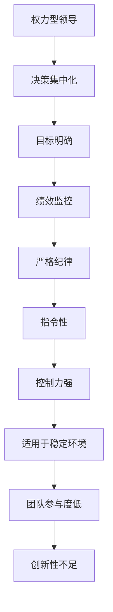
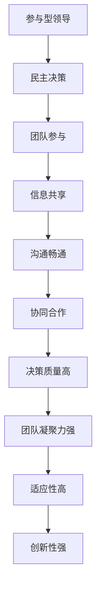
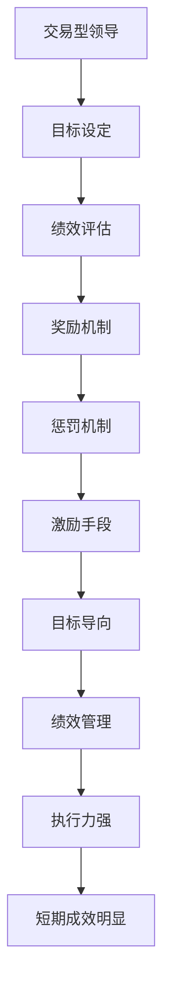
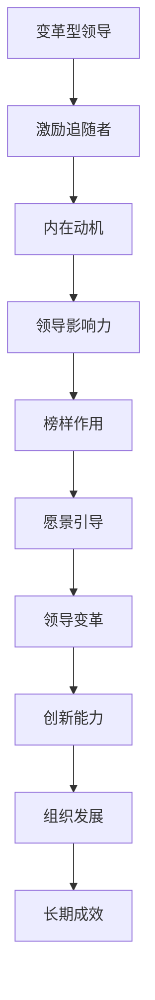
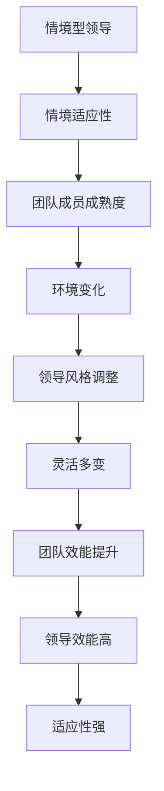

                 

## 第2章 领导力基础

### 2.1 领导力定义与类型

#### 2.1.1 领导力的定义

领导力是一个多层次、多维度的概念，其定义因时代和学科的不同而有所差异。传统的领导力定义侧重于领导者对组织、团队或个人的控制和指导能力。而现代的领导力定义则更加强调领导者的变革能力、影响力与影响力，以及领导者与追随者之间的互动关系。

##### 2.1.1.1 领导力的传统定义

在传统的领导力定义中，领导被视为一种权力和地位的象征。领导者拥有指挥、控制和管理的权力，通过权威来影响他人。这种定义强调领导者的角色和责任，忽视了领导者的变革能力和影响力。

例如，早期管理学中著名的“领导者-追随者模型”认为，领导者的核心职责是确保组织目标的实现，领导者通过制定计划、分配资源、监控绩效等手段来控制追随者。

##### 2.1.1.2 领导力的现代定义

现代领导力理论更加关注领导者的变革能力和影响力，强调领导者与追随者之间的互动和信任关系。这种定义认为，领导是一种影响力，通过激励、鼓舞和引导他人来实现共同的目标。

例如，变革型领导理论（Transformational Leadership Theory）认为，领导者通过激发追随者的内在动机，提升其自我效能感，从而实现组织变革。领导者不仅仅是管理者，更是变革的推动者和榜样。

#### 2.1.2 领导力的类型

领导力的类型多种多样，不同的领导风格适用于不同的情境和目标。以下是几种常见的领导力类型：

##### 2.1.2.1 权力型领导

权力型领导（Authoritative Leadership）是指领导者通过权威和正式权力来指导团队成员。这种领导风格强调决策的集中化和控制，领导者通常负责制定目标和策略，并要求团队成员遵守。



##### 2.1.2.2 参与型领导

参与型领导（Participative Leadership）是指领导者鼓励团队成员参与决策过程，以提升团队凝聚力和决策质量。这种领导风格强调民主和合作，领导者与团队成员之间的互动更加密切。



##### 2.1.2.3 交易型领导

交易型领导（Transactional Leadership）是指领导者通过奖励和惩罚来激励团队成员。这种领导风格强调绩效管理和目标导向，领导者通过设定明确的期望和奖励机制来确保团队成员的积极性。



##### 2.1.2.4 变革型领导

变革型领导（Transformational Leadership）是指领导者通过激发追随者的内在动机，引导他们实现共同的目标。这种领导风格强调领导者的变革能力和影响力，通过激励、鼓舞和榜样作用来推动组织变革。



##### 2.1.2.5 情境型领导

情境型领导（Situational Leadership）是指领导者根据不同情境和团队成员的特点，灵活调整领导风格。这种领导风格强调适应性，领导者根据团队成员的成熟度和工作环境的变化来选择合适的领导方式。



通过以上对领导力定义和类型的分析，我们可以看到，领导力不仅仅是权力和地位的象征，更是一种影响力、变革能力和团队互动的艺术。不同的领导风格适用于不同的情境和目标，领导者需要根据实际情况灵活调整领导方式，以实现组织的目标和发展。

### 2.2 领导力的发展历程

领导力的发展历程可以追溯到古代，不同历史时期和不同文化背景下，领导理论不断演进和变革。以下是对领导力发展历程的简要概述。

#### 2.2.1 古代领导理论

在古代，领导理论主要源于宗教、哲学和军事领域。不同的文化和文明对领导有不同的理解和描述。

- **中国：** 中国古代的领导理论深受儒家、道家和法家思想的影响。儒家强调仁爱、德行和礼仪，主张以德治国；道家追求无为而治，强调顺应自然；法家主张严刑峻法，强调统治者的权威。这些思想为中国的领导实践提供了丰富的哲学基础。

- **西方：** 古希腊和古罗马时期，领导理论主要源于政治和军事实践。柏拉图的《理想国》和亚里士多德的《政治学》提出了关于领导者的品德、能力和责任的重要观点。古罗马的军事领导理论强调纪律、组织和战略。

#### 2.2.2 现代领导理论

现代领导理论起源于20世纪初，随着工业化和企业的发展，领导理论逐渐形成体系。以下是几种重要的现代领导理论：

- **行为科学学派：** 行为科学学派强调研究领导者的行为模式，通过实证研究分析领导行为对团队和组织的影响。这一学派的重要成果包括领导行为分类（如领导风格调查问卷）和领导行为与绩效的关系研究。

- **人本主义学派：** 人本主义学派认为，领导者应关注人的内在需求，通过激励和赋能来提高团队效能。代表理论包括马斯洛的需求层次理论和赫兹伯格的双因素理论。

- **权变理论：** 权变理论认为，领导效果取决于领导风格与情境的匹配。这一理论提出了领导风格情境适应的概念，为领导者提供了灵活应对不同情境的策略。

#### 2.2.3 当代领导理论

当代领导理论在继承和发展现代领导理论的基础上，进一步深化了对领导力本质和作用的认识。以下是几种重要的当代领导理论：

- **情境领导理论：** 情境领导理论强调领导者应根据团队成员的成熟度和环境变化灵活调整领导风格。这一理论通过领导风格与情境的匹配，提高领导效能。

- **领导行为模型：** 领导行为模型关注领导者的行为特征和领导行为对团队和组织的影响。代表理论包括路径-目标理论和领导生命周期理论。

- **领导力五要素模型：** 领导力五要素模型从五个维度（情境敏感性、目标导向、人际关系、情感智慧和变革能力）全面解析领导力的本质。这一模型为领导者提供了系统化的领导力提升路径。

通过以上对领导力发展历程的梳理，我们可以看到，领导力理论不断演进，从传统的权力和控制，到现代的关注行为和情境适应，再到当代的全面领导力提升，领导力研究逐渐走向深入和全面。这为我们理解和实践领导力提供了宝贵的理论指导。

#### 2.3 领导力与管理者职责

领导力与管理者职责既有联系也有区别。领导力是一种能力，而管理者职责则是一系列具体的任务和责任。以下是对这两者关系的详细分析。

##### 2.3.1 管理者职责的概述

管理者职责可以概括为三个核心方面：计划、组织和控制。

- **计划：** 管理者需要制定组织的目标和策略，明确组织的愿景和使命，制定具体的行动计划。计划是管理过程的基础，它为组织提供了前进的方向。

- **组织：** 管理者需要设计和优化组织的结构，分配资源，确保组织的运行高效。组织包括确定组织中的职位、职责和关系，建立有效的沟通和协作机制。

- **控制：** 管理者需要监控组织的运行，确保计划得以实施。控制包括设定绩效指标，进行绩效评估，提供反馈，纠正偏差。控制是确保组织目标实现的关键。

##### 2.3.1.1 管理者的角色

管理者在组织中扮演多个角色，包括：

- **决策者：** 管理者需要制定决策，权衡不同的方案，选择最优的解决方案。

- **协调者：** 管理者需要协调组织内外的资源和活动，确保各部门之间的协作顺畅。

- **领导者：** 管理者需要领导团队，激励员工，塑造组织的文化。

- **代表者：** 管理者代表组织与外部利益相关者（如客户、供应商、政府等）进行沟通和协商。

##### 2.3.1.2 管理者的技能要求

管理者需要具备一系列技能，包括：

- **沟通能力：** 管理者需要能够清晰、有效地传达信息，建立良好的沟通渠道。

- **决策能力：** 管理者需要能够在不确定和复杂的环境中做出明智的决策。

- **团队管理能力：** 管理者需要能够领导团队，激励员工，提升团队绩效。

- **变革管理能力：** 管理者需要能够推动组织变革，适应环境变化。

- **战略规划能力：** 管理者需要能够制定组织战略，确保组织长期发展。

##### 2.3.2 领导力与管理的区别

领导力与管理者职责虽然有重叠，但两者在本质和目标上有所不同。

- **领导力：** 领导力更侧重于影响力、变革能力和团队互动。领导力是一种通过激励、鼓舞和榜样作用来推动组织变革的能力。领导力关注如何激发员工的内在动机，提升团队凝聚力。

- **管理：** 管理更侧重于计划、组织和控制。管理是一种通过设定目标、分配资源、监控绩效来确保组织运行高效的过程。管理关注如何确保组织的日常运营和目标实现。

- **关系：** 领导力强调领导者与追随者之间的互动和信任，管理则更注重组织结构和流程的优化。

- **目标：** 领导力旨在推动组织变革，提升组织效能；管理则旨在确保组织目标的实现，维持组织运行。

通过以上分析，我们可以看到，领导力与管理者职责虽然密不可分，但各自有着独特的目标和侧重点。领导者需要具备管理者的技能，同时更需要具备领导力，以推动组织的发展和变革。

### 3.1 影响力因素分析

影响力是指一个人或组织能够对他人或组织产生显著影响的能力。在领导力中，影响力是一个至关重要的因素，它决定了领导者的成功与否。影响力不仅体现在个人特质上，还涉及到知识、技能和人际关系等方面。以下是对影响力的主要因素进行分析。

#### 3.1.1 个人特质与影响力

个人特质是影响力的基础。以下是几个关键的个人特质：

- **自信：** 自信的人往往能够吸引他人的注意，他们对自己的能力和决策有信心，这种自信会传递给他人，增加他人对他们的信任和依赖。

- **诚信：** 诚信是建立信任的关键。一个诚信的领导者会坚持自己的原则，言行一致，这种诚信会赢得他人的尊重和信任。

- **正直：** 正直是领导者的人格特质，它代表了领导者的道德品质。一个正直的领导者会遵守社会规范和道德准则，这种正直会增强他人的信任感。

- **领导魅力：** 领导魅力是指领导者具有吸引他人并激发其积极性的能力。领导魅力可以来源于领导者的智慧、勇气、激情和远见。

#### 3.1.2 知识与技能

知识和技能是影响力的另一个重要因素。以下是几个关键的知识和技能：

- **专业知识：** 专业知识是领导者影响他人的基础。一个拥有丰富专业知识的领导者能够提供有价值的见解和建议，从而赢得他人的尊重和信任。

- **沟通技能：** 沟通技能是领导者必须具备的能力。一个优秀的沟通者能够清晰地表达自己的想法，有效地倾听他人的意见，建立良好的沟通渠道。

- **决策能力：** 决策能力是领导者必须具备的关键技能。一个能够做出明智决策的领导者能够引导组织走向正确的方向。

- **战略规划能力：** 战略规划能力是领导者对组织未来发展方向的把握。一个具备战略规划能力的领导者能够制定明确的战略目标，并制定实现目标的计划。

#### 3.1.3 个人关系网络

个人关系网络是影响力的一个重要组成部分。以下是几个关键的关系网络：

- **内部网络：** 内部网络包括领导者与组织内部成员的关系。一个拥有广泛内部网络的领导者能够更好地了解组织内部的动态和员工的需求，从而更好地发挥影响力。

- **外部网络：** 外部网络包括领导者与组织外部的利益相关者（如客户、供应商、合作伙伴等）的关系。一个拥有广泛外部网络的领导者能够更好地协调组织与外部环境的关系，从而增加组织的竞争力。

- **社会网络：** 社会网络包括领导者与社交圈中的朋友、同事、导师等的关系。一个拥有广泛社会网络的领导者能够获得更多的资源和支持，从而增强自己的影响力。

#### 3.1.4 影响力因素的综合分析

个人特质、知识和技能以及个人关系网络是影响力的关键因素。个人特质提供了基础，知识和技能提升了影响力，个人关系网络则扩展了影响力的范围。

- **个人特质：** 个人特质是影响力的核心，它决定了领导者的基本形象和风格。一个具备良好个人特质的领导者能够更容易地赢得他人的信任和支持。

- **知识和技能：** 知识和技能是影响力的支撑，它们使领导者能够提供有价值的建议和指导。一个具备丰富专业知识和技能的领导者能够更好地解决组织面临的问题。

- **个人关系网络：** 个人关系网络是影响力的扩展，它使领导者能够更广泛地影响他人和组织。一个拥有广泛个人关系网络的领导者能够更好地协调内外部资源，推动组织的发展。

通过以上分析，我们可以看到，影响力是一个多维度的概念，它不仅取决于个人特质，还与知识和技能以及个人关系网络密切相关。领导者需要全面发展这些因素，以提升自己的影响力，从而更好地推动组织的发展。

### 3.2 建立可信度和权威

建立可信度和权威是领导者影响力的关键因素之一。一个有权威的领导者能够在团队中树立威信，赢得员工的尊重和信任，从而有效地推动组织目标的实现。以下是如何建立可信度和权威的几个关键策略。

#### 3.2.1 可信度的影响因素

可信度是指一个人在他人心中建立起来的信任和信赖程度。建立可信度需要从多个方面入手：

- **言行一致：** 一个领导者必须做到言行一致，言出必行。只有这样，团队成员才会相信领导者的承诺和决策。

- **透明沟通：** 领导者需要保持与团队成员之间的沟通透明，及时分享信息，解释决策背后的逻辑和原因。

- **诚信正直：** 诚信正直是建立可信度的基石。领导者必须遵守道德规范，坚守诚信原则，言行一致。

- **专业知识：** 领导者必须拥有专业的知识和技能，能够在关键时刻提供有价值的建议和解决方案。

#### 3.2.2 提升可信度的策略

以下是一些提升可信度的具体策略：

- **建立良好的人际关系：** 领导者需要建立良好的人际关系，与团队成员保持密切的联系。通过倾听和关心，领导者可以赢得员工的信任和支持。

- **持续学习和成长：** 领导者需要不断学习和提升自己的专业知识和技能，以保持自己的竞争力。这不仅能提升个人的可信度，也能为团队树立榜样。

- **公开透明：** 领导者需要在决策过程中保持透明，公开解释决策的原因和逻辑。这有助于团队成员理解领导的决策，并增强对领导者的信任。

- **兑现承诺：** 领导者必须兑现自己的承诺，这不仅包括对团队成员的承诺，也包括对组织的承诺。兑现承诺能够增强团队成员对领导者的信任。

- **建立信任机制：** 领导者可以建立一系列信任机制，如定期反馈、绩效评估、透明沟通等，以增强团队成员之间的信任。

#### 3.2.3 建立权威

建立权威是指领导者通过自身的权力和影响力，在团队中树立起一种不可动摇的威信。以下是一些建立权威的策略：

- **明确角色和职责：** 领导者需要明确自己的角色和职责，并在团队中树立起明确的权威。这包括制定明确的目标、计划和策略，并确保团队成员清楚自己的职责。

- **树立榜样：** 领导者需要通过自己的言行树立榜样，以赢得团队成员的尊重和信任。这包括遵守职业道德、积极参与工作、承担责任等。

- **决策能力：** 领导者需要具备出色的决策能力，能够在关键时刻做出明智的决策。这不仅能增强个人的权威，也能提高团队的执行力。

- **有效的沟通：** 领导者需要通过有效的沟通，传达自己的意图和决策，确保团队成员理解并接受。这包括清晰的表达、积极的倾听和有效的反馈。

- **建立信任：** 领导者需要通过建立信任，赢得团队成员的支持。这包括透明沟通、诚信正直、兑现承诺等。

通过以上策略，领导者可以有效地建立可信度和权威，从而在团队中树立起自己的领导地位。这不仅能提高团队的执行力，也能推动组织目标的实现。

### 3.3 语言技巧与非语言沟通

在领导力中，有效的沟通是建立影响力、传递信息、协调团队的关键。沟通技巧包括语言技巧和非语言沟通，二者共同作用，决定着沟通的效果。以下是对语言技巧和非语言沟通的详细分析。

#### 3.3.1 语言沟通技巧

语言沟通技巧是指领导者通过语言表达思想、传递信息、建立联系的能力。以下是几个关键的语言沟通技巧：

- **清晰表达：** 清晰表达是有效沟通的基础。领导者需要用简单、明确的语言表达自己的想法，避免使用复杂、模糊的术语。清晰的表达能够确保信息的准确传递，减少误解和混淆。

- **有效的倾听：** 倾听是沟通的重要组成部分。领导者需要积极倾听他人的意见和需求，理解他人的观点。有效的倾听不仅能增强与他人的信任，也能帮助领导者更好地理解团队的需求和问题。

- **沟通的时机：** 沟通的时机对沟通效果至关重要。领导者需要选择合适的时机进行沟通，避免在压力或情绪波动时进行重要沟通。合适的时机能够确保沟通的冷静和理性，提高沟通的有效性。

- **情感表达：** 情感表达是沟通中的软技巧。领导者需要学会在适当的时候表达自己的情感，如鼓励、激励和关心。情感表达能够增强与他人的情感联系，提高沟通的效果。

#### 3.3.2 非语言沟通

非语言沟通是指通过肢体语言、面部表情、眼神交流、声音等非语言方式进行的沟通。非语言沟通在领导力中发挥着重要作用，以下是对几种关键的非语言沟通的分析：

- **肢体语言：** 肢体语言包括站姿、手势、面部表情等。领导者需要通过积极的肢体语言表达自信和开放的态度。例如，开放的姿态（如双手自然放置）能表达欢迎和友好，而防御性的姿态（如双手交叉）则可能传达出不信任或紧张的情绪。

- **面部表情：** 面部表情是非语言沟通的重要部分。领导者需要学会通过面部表情传达情感和态度。例如，微笑可以传达友好和鼓励，而皱眉则可能传达出不满或不信任。

- **眼神交流：** 眼神交流是建立信任和联系的重要方式。领导者需要保持适当的眼神交流，表明对对方的尊重和关注。适当的眼神交流能够增强沟通的效果，提高双方的信任度。

- **声音语言：** 声音语言包括语调、音量、节奏等。领导者需要学会通过声音语言传达情感和态度。例如，高音调的声音可能传达出兴奋或焦虑，而低音调的声音则可能传达出稳定和自信。

#### 3.3.3 语言技巧与非语言沟通的结合

语言技巧和非语言沟通是相辅相成的，二者共同作用，决定着沟通的效果。以下是几种结合语言技巧和非语言沟通的策略：

- **一致性表达：** 语言和非语言信号的一致性是有效沟通的关键。领导者需要在语言表达和非语言表达上保持一致，以增强沟通的力度和效果。

- **情感共鸣：** 领导者需要通过语言和非语言方式表达情感，与团队成员建立情感共鸣。例如，通过真诚的微笑和肯定的眼神，表达对团队成员的支持和鼓励。

- **情境适应：** 领导者需要根据不同的沟通情境，灵活调整语言和非语言沟通的方式。例如，在紧张或压力大的情境中，领导者可能需要通过降低声音、放松肢体语言来缓解紧张情绪。

- **反馈机制：** 领导者需要建立有效的反馈机制，通过语言和非语言方式收集团队成员的反馈。有效的反馈机制能够帮助领导者了解沟通的效果，及时调整沟通策略。

通过以上对语言技巧和非语言沟通的详细分析，我们可以看到，有效的沟通是领导力的关键要素。领导者需要通过掌握语言技巧和非语言沟通，提高沟通的效果，从而更好地建立影响力、传递信息和协调团队。

### 4.1 感召力的特征

感召力是一种独特的领导品质，它能够激发他人追随和认同的欲望。感召力的特征决定了其独特性和影响力。以下是感召力的几个关键特征：

#### 4.1.1 激情与热情

感召力的核心在于领导者的激情与热情。一个具有感召力的领导者能够通过自己的热情和激情感染他人，使团队成员感受到共同奋斗的动力。激情不仅体现在领导者对工作的热爱上，还体现在他们对待团队成员的积极态度和鼓励。

#### 4.1.2 明确的愿景

具有感召力的领导者能够清晰地描绘组织的愿景，并使团队成员对愿景产生认同感。明确的愿景是感召力的基础，它为团队成员提供了共同的目标和方向。领导者需要通过不断的沟通和激励，使团队成员对愿景充满信心和期待。

#### 4.1.3 信念与价值观

信念与价值观是感召力的另一个重要特征。具有感召力的领导者拥有坚定的信念和明确的价值观，他们能够将这种信念和价值观传递给团队成员，使团队成员在追求共同目标的过程中保持一致。信念和价值观不仅是领导者行动的指南针，也是团队凝聚力的源泉。

#### 4.1.4 情感智慧与同理心

感召力不仅依赖于理性思考和策略规划，更需要情感智慧和同理心。一个具有感召力的领导者能够理解他人的情感需求，关心团队成员的福祉，并通过情感交流建立深厚的信任关系。情感智慧和同理心使领导者能够更好地激发团队成员的热情和动力。

#### 4.1.5 榜样的力量

具有感召力的领导者以身作则，通过自己的行为和言行树立榜样。他们不仅要求团队成员遵循组织的价值观和行为规范，自己也会以身作则，为团队成员树立榜样。榜样的力量是感召力的重要体现，它能够激励团队成员追求卓越。

#### 4.1.6 领导者的魅力

领导者的魅力是感召力的外在表现。具有感召力的领导者往往具备独特的个性魅力，他们的言行举止能够吸引他人的注意，激发他人的追随欲望。领导者的魅力不仅取决于他们的外表，更取决于他们的内在品质和领导能力。

通过以上对感召力特征的详细分析，我们可以看到，感召力是一种复杂而独特的领导品质，它不仅依赖于领导者的个人特质和魅力，还需要明确的愿景、信念和价值观，以及情感智慧与同理心。领导者需要通过培养这些特征，提升自己的感召力，从而更好地影响和激励团队成员。

### 4.2 塑造个人品牌

在当今竞争激烈的职场环境中，塑造个人品牌已经成为提升个人影响力、实现职业发展的重要策略。个人品牌是指一个人在公众心目中的形象和认知，它决定了个人在社会中的地位和声誉。以下是塑造个人品牌的几个关键策略。

#### 4.2.1 个人品牌的重要性

个人品牌的重要性不容忽视，它对个人的职业发展和社会影响力有着深远的影响：

- **增强竞争力：** 一个良好的个人品牌能够提高个人在职场中的竞争力。在求职和晋升过程中，拥有强大个人品牌的个人更容易获得机会和认可。

- **扩大影响力：** 个人品牌能够帮助个人在职场中建立广泛的人脉和影响力。一个有影响力的个人品牌能够吸引更多的资源和机会，为个人的职业发展提供支持。

- **提升职业形象：** 塑造良好的个人品牌有助于提升个人的职业形象，使个人在公众心目中更加专业、可靠和有吸引力。

- **实现职业目标：** 一个清晰的个人品牌有助于个人明确职业发展方向，并制定实现职业目标的策略。通过个人品牌，个人能够更好地展示自己的专业能力和价值，从而实现职业上的成功。

#### 4.2.2 塑造个人品牌的策略

以下是一些塑造个人品牌的策略：

- **明确个人品牌定位：** 个人品牌定位是个人品牌的起点，它决定了个人品牌的核心价值和特色。明确个人品牌定位有助于个人在职场中树立独特的形象。例如，一个技术专家可以专注于专业领域的技术创新和解决方案，而一个管理专家可以专注于团队管理和领导力发展。

- **塑造个人品牌形象：** 个人品牌形象是通过个人言行和行为表现塑造的。一个积极的个人品牌形象能够吸引他人的注意和认可。个人需要通过良好的职业行为、专业知识和人际关系来塑造自己的品牌形象。

- **建立专业声誉：** 专业声誉是个人品牌的重要组成部分。通过在专业领域取得显著成就、发表专业文章、参与行业讨论和演讲等方式，个人能够建立自己的专业声誉，提升个人品牌的影响力。

- **利用社交媒体：** 社交媒体是塑造个人品牌的重要工具。通过在社交媒体上分享专业知识和经验、参与行业讨论、建立专业网络，个人能够扩大自己的影响力，提升个人品牌的知名度。

- **持续学习和提升：** 持续学习和提升是保持个人品牌活力的重要策略。个人需要不断更新自己的知识和技能，紧跟行业动态，保持自己的专业竞争力。

- **提供价值：** 提供价值是建立个人品牌的基石。个人需要通过专业知识和技能为他人提供帮助和价值，从而赢得他人的信任和尊重。

通过以上策略，个人可以有效地塑造自己的品牌，提升在职场中的竞争力和影响力。塑造个人品牌不仅需要明确的定位和持续的努力，还需要在专业领域提供真正的价值。一个成功的个人品牌能够为个人的职业发展提供强大的支持和推动力。

### 4.3 激发他人热情与认同感

在领导过程中，激发团队成员的热情与认同感是提升团队绩效和实现组织目标的关键。以下是一些具体的方法和策略，帮助领导者激发团队成员的热情与认同感。

#### 4.3.1 了解他人需求

了解团队成员的需求是激发其热情与认同感的基础。领导者需要通过多种方式了解团队成员的兴趣、职业目标、生活状况等，从而更好地满足他们的需求：

- **开展一对一沟通：** 领导者可以通过定期与团队成员进行一对一沟通，了解他们的个人情况和职业需求。这种沟通能够帮助领导者建立信任，同时也为团队成员提供表达意见和建议的机会。

- **进行问卷调查：** 领导者可以设计问卷，通过匿名方式了解团队成员的意见和建议。这种方式能够收集到更多真实的反馈，有助于领导者了解团队成员的普遍需求。

- **倾听与反馈：** 领导者需要培养倾听的技能，耐心倾听团队成员的想法和感受。在倾听过程中，领导者需要给予积极的反馈，表明对团队成员意见的重视。

#### 4.3.2 提供激励措施

激励是激发团队成员热情与认同感的重要手段。领导者可以通过以下方式提供激励措施：

- **物质激励：** 物质激励包括奖金、晋升、福利等。领导者需要根据组织的财务状况和团队成员的表现，合理设置物质激励措施。适当的物质激励能够提高团队成员的工作积极性和满意度。

- **精神激励：** 精神激励包括认可、赞扬、培训等。领导者可以通过公开表扬、颁发荣誉证书、提供职业发展机会等方式，对表现优秀的团队成员进行精神激励。精神激励能够增强团队成员的归属感和成就感。

- **个性化激励：** 个性化激励是根据团队成员的个人需求和兴趣设置的。例如，为对某个领域有浓厚兴趣的团队成员提供专项培训，或为其安排适合的职务。个性化激励能够更好地满足团队成员的需求，提高其工作热情。

#### 4.3.3 培养共同价值观

共同价值观是团队成员认同感和团队凝聚力的重要来源。领导者需要通过以下方式培养共同价值观：

- **明确价值观：** 领导者需要明确组织的价值观，并通过内部沟通将价值观传递给团队成员。明确的价值观能够为团队成员提供共同的行动指南，帮助他们更好地理解组织的目标和愿景。

- **价值观实践：** 领导者需要在日常工作中践行组织的价值观，以身作则。例如，在决策过程中考虑团队合作和长期发展，避免短视行为。通过实践价值观，领导者能够树立榜样，促进团队成员对价值观的认同。

- **价值观宣传：** 领导者可以通过内部宣传、培训和活动，强化团队成员对价值观的认知和认同。例如，组织团队建设活动、举办价值观讲座等，让团队成员在互动中加深对价值观的理解。

#### 4.3.4 建立信任关系

信任关系是激发团队成员热情与认同感的重要基础。领导者需要通过以下方式建立信任关系：

- **透明沟通：** 领导者需要保持与团队成员之间的沟通透明，及时分享信息，解释决策背后的逻辑和原因。透明沟通能够增强团队成员对领导的信任。

- **尊重与支持：** 领导者需要尊重团队成员的意见和贡献，并提供必要的支持和资源。尊重与支持能够增强团队成员的自信心和责任感。

- **公正对待：** 领导者需要公正对待团队成员，避免偏袒和不公平行为。公正对待能够增强团队成员对领导的信任。

通过以上方法和策略，领导者可以有效地激发团队成员的热情与认同感，提升团队绩效和实现组织目标。了解他人需求、提供激励措施、培养共同价值观和建立信任关系是激发团队成员热情与认同感的关键要素。领导者需要根据实际情况灵活运用这些策略，以实现最佳效果。

### 5.1 领导风格与决策

领导风格是指领导者通过何种方式影响和引导团队行为的过程，而决策则是在复杂情境下选择最佳行动方案的过程。有效的领导风格和决策能力对于团队的成功至关重要。以下是对领导风格与决策的详细探讨。

#### 5.1.1 领导风格

领导风格反映了领导者在领导过程中的行为方式和态度。不同的领导风格适用于不同的情境和团队需求。以下是几种常见的领导风格：

- **权威型领导（Authoritative Leadership）：** 权威型领导强调领导者的权力和控制。领导者做出决策，并为团队成员设定明确的目标和期望。这种领导风格在紧急情况下或需要迅速行动时效果较好。

  ```mermaid
  graph TD
  A[权威型领导] --> B[决策集中]
  B --> C[目标明确]
  C --> D[指令性强]
  D --> E[控制力强]
  E --> F[快速执行]
  F --> G[适用于紧急情况]
  G --> H[团队参与度低]
  ```

- **民主型领导（Democratic Leadership）：** 民主型领导鼓励团队成员参与决策过程，通过讨论和协商达成共识。这种领导风格有助于提高团队成员的参与感和满意度，增强团队的凝聚力和创造力。

  ```mermaid
  graph TD
  A[民主型领导] --> B[决策参与]
  B --> C[信息共享]
  C --> D[团队共识]
  D --> E[沟通畅通]
  E --> F[团队凝聚力高]
  F --> G[创造力强]
  G --> H[适用于稳定环境]
  ```

- **参与型领导（Participative Leadership）：** 参与型领导与民主型领导类似，也强调团队成员的参与和决策的民主化。然而，参与型领导更多地关注团队成员的个人需求和价值观，通过激励和赋能来提升团队绩效。

  ```mermaid
  graph TD
  A[参与型领导] --> B[激励赋能]
  B --> C[关注需求]
  C --> D[价值观一致]
  D --> E[目标导向]
  E --> F[团队绩效高]
  F --> G[适应性强]
  ```

- **变革型领导（Transformational Leadership）：** 变革型领导注重激发团队成员的内在动机，通过激励、鼓舞和榜样作用推动团队实现变革。这种领导风格在面临重大变革或挑战时尤为重要。

  ```mermaid
  graph TD
  A[变革型领导] --> B[激励追随者]
  B --> C[内在动机]
  C --> D[领导影响力]
  D --> E[榜样作用]
  E --> F[愿景引导]
  F --> G[领导变革]
  G --> H[创新能力]
  ```

#### 5.1.2 决策过程

决策是在复杂情境下选择最佳行动方案的过程。有效的决策过程能够帮助领导者做出明智的决策，提高团队和组织的绩效。以下是决策过程的几个关键步骤：

1. **识别问题：** 决策的第一步是识别问题。领导者需要明确团队或组织面临的挑战和机会，分析问题的性质和影响。

2. **收集信息：** 在识别问题后，领导者需要收集与问题相关的信息。这包括市场数据、历史记录、专家意见等。全面的信息有助于领导者做出更准确的决策。

3. **分析信息：** 收集信息后，领导者需要对信息进行深入分析。通过分析，领导者可以识别问题的根本原因，制定可能的解决方案。

4. **评估方案：** 在分析信息的基础上，领导者需要评估不同的解决方案。评估的标准包括可行性、成本效益、风险等。领导者需要选择最优方案。

5. **制定决策：** 在评估方案后，领导者需要制定最终的决策。决策应明确行动步骤、责任人和时间表。

6. **执行决策：** 决策制定后，领导者需要确保决策得到有效执行。执行过程中，领导者需要监控进展，及时调整策略。

7. **评估结果：** 决策执行后，领导者需要对结果进行评估。通过评估，领导者可以总结经验教训，为未来的决策提供参考。

通过以上对领导风格和决策过程的探讨，我们可以看到，领导风格和决策能力对于团队和组织的成功至关重要。领导者需要根据不同情境灵活调整领导风格，并通过有效的决策过程，确保团队和组织的长远发展。

### 5.2 团队建设与领导力

团队建设是提升团队绩效和实现组织目标的关键。有效的团队建设需要领导者的引导和推动，而领导力在这一过程中发挥着至关重要的作用。以下是对团队建设与领导力关系的详细分析。

#### 5.2.1 团队建设的重要性

团队建设是指通过一系列活动和管理措施，提高团队成员之间的协作和沟通，从而实现团队的整体绩效。团队建设的重要性体现在以下几个方面：

- **提升协作效率：** 通过团队建设，团队成员能够更好地理解彼此的职责和角色，提高协作效率。团队成员之间的信任和尊重有助于减少摩擦和冲突，提升团队的凝聚力。

- **增强创新能力：** 团队建设鼓励团队成员分享知识和经验，促进创新思维的产生。通过团队协作，团队成员能够相互启发，共同解决复杂问题，从而提高组织的创新能力。

- **提升员工满意度：** 团队建设有助于提高员工的工作满意度和幸福感。通过团队活动和团队文化建设，员工能够感受到组织的关怀和支持，从而增强对工作的热情和投入。

- **实现组织目标：** 团队建设有助于确保团队目标的明确和一致，提高团队成员的执行力。通过团队协作，团队成员能够共同为实现组织目标而努力，从而提升组织的整体绩效。

#### 5.2.2 领导力在团队建设中的应用

领导力在团队建设中扮演着关键角色。领导者需要通过以下方式推动团队建设：

- **建立共同愿景：** 领导者需要与团队成员共同确定团队的愿景和目标，确保团队成员对团队的方向和目标有清晰的认识。共同愿景是团队凝聚力和动力的源泉。

- **培养团队文化：** 领导者需要通过制定和宣传团队文化，塑造团队的价值观和行为规范。积极向上的团队文化能够增强团队成员的归属感和认同感，提高团队的凝聚力。

- **促进沟通与协作：** 领导者需要建立有效的沟通渠道，确保团队成员之间的信息畅通。领导者可以通过定期会议、团队活动等方式，促进团队成员之间的沟通和协作。

- **提供支持和资源：** 领导者需要为团队成员提供必要的支持和资源，帮助他们克服困难和挑战。领导者可以通过培训、辅导和激励等方式，提升团队成员的能力和士气。

- **解决冲突和问题：** 领导者需要及时解决团队中的冲突和问题，确保团队运行顺畅。领导者需要通过倾听、沟通和协商等方式，找到解决问题的最佳方案。

- **激励和认可：** 领导者需要通过激励和认可，激发团队成员的工作热情和积极性。领导者可以通过奖金、晋升、荣誉等方式，对团队成员的成就和贡献给予认可和奖励。

#### 5.2.3 团队沟通与冲突管理

团队沟通和冲突管理是团队建设的重要组成部分。以下是对这些方面的分析：

- **团队沟通：** 团队沟通是指团队成员之间相互传递和交流信息的过程。有效的团队沟通能够提高团队的工作效率和协作水平。以下是几个关键点：

  - **明确沟通目标：** 团队成员在沟通前需要明确沟通的目标和目的，确保信息传递的准确性。

  - **积极倾听：** 团队成员需要学会积极倾听他人的意见和需求，理解他人的观点。倾听是沟通的重要部分，能够增强团队成员之间的信任和尊重。

  - **使用清晰的语言：** 使用简单、明确的语言进行沟通，避免使用专业术语或模糊的表述，以确保信息的准确传递。

  - **建立沟通渠道：** 团队领导者需要建立有效的沟通渠道，确保团队成员之间的信息畅通。这可以包括定期会议、邮件、即时通讯工具等。

- **冲突管理：** 冲突是团队中不可避免的现象，有效的冲突管理能够减少冲突带来的负面影响，提高团队的工作效率。以下是几个关键点：

  - **识别冲突类型：** 冲突可以分为建设性冲突和破坏性冲突。建设性冲突有助于团队创新和改进，而破坏性冲突则可能损害团队关系和工作效率。领导者需要识别冲突的类型，采取相应的管理策略。

  - **解决冲突：** 领导者需要及时解决团队中的冲突。解决冲突的方法可以包括直接对话、调解、妥协等。在解决冲突时，领导者需要确保公平和公正，避免偏袒和不公平行为。

  - **预防冲突：** 领导者可以通过建立良好的沟通机制、明确团队目标和职责、培养团队文化等方式，预防冲突的发生。

  - **提供反馈：** 领导者需要为团队成员提供及时的反馈，帮助团队成员了解自己的行为和表现。通过反馈，团队成员可以改进自己的行为，减少冲突。

通过以上对团队建设与领导力关系的详细分析，我们可以看到，领导力在团队建设中起着至关重要的作用。领导者需要通过建立共同愿景、培养团队文化、促进沟通与协作、提供支持和资源、解决冲突和问题以及激励和认可等方式，推动团队建设，提高团队的整体绩效。有效的团队建设不仅有助于提高团队的工作效率，还能增强团队成员的归属感和认同感，从而实现组织的目标。

### 5.3 领导力发展与持续提升

领导力的发展与持续提升是领导者职业生涯中的重要任务。在快速变化的商业环境中，领导者需要不断适应新的挑战和机遇，提升自身的领导能力，以推动组织的成功。以下是如何实现领导力发展与持续提升的方法和策略。

#### 5.3.1 领导力发展的重要性

领导力发展对于个人和组织的成功至关重要。以下是领导力发展的重要性体现在以下几个方面：

- **提升领导效能：** 通过领导力发展，领导者能够掌握先进的领导理念和技能，提高领导效能。有效的领导力能够激发团队成员的潜力，提高团队绩效，实现组织目标。

- **适应变化：** 领导力发展帮助领导者适应快速变化的环境。在当今的商业世界中，变化是常态，领导者需要具备敏捷的思维和适应能力，以应对不断变化的市场需求和竞争环境。

- **增强团队凝聚力：** 领导力发展有助于建立积极向上的团队文化，增强团队凝聚力。通过培养团队成员的信任和合作精神，领导者能够打造高效的团队，提高组织的整体竞争力。

- **实现职业发展：** 领导力发展是职业发展的关键。提升领导能力可以帮助领导者获得更多的职业机会，实现职业晋升，从而在职业生涯中取得更大的成功。

#### 5.3.2 持续提升领导力的方法

以下是几种持续提升领导力的方法和策略：

- **自我反思与成长：** 自我反思是领导力发展的基础。领导者需要定期反思自己的行为、决策和领导风格，识别自己的优势和不足。通过自我反思，领导者可以找到改进的方向，不断提升自己的领导能力。

- **学习与培训：** 领导者需要不断学习新的知识和技能，以适应不断变化的环境。参加培训课程、阅读领导力书籍、参与行业研讨会等方式都是有效的学习途径。通过学习，领导者可以掌握先进的领导理念和最佳实践，提升自己的领导能力。

- **反馈与改进：** 领导者需要建立有效的反馈机制，从团队成员、上级和同事那里获取反馈。通过反馈，领导者可以了解自己的表现，识别改进的机会。领导者需要勇于接受批评，并及时调整自己的行为和决策，以不断提升领导能力。

- **实践与经验积累：** 实践是检验领导能力的最佳方式。领导者需要在实际工作中运用所学知识和技能，通过实践积累经验。在实践过程中，领导者可以不断反思和改进，提高自己的领导水平。

- **建立导师关系：** 寻找一位导师可以帮助领导者快速提升领导能力。导师可以提供指导、建议和支持，帮助领导者克服困难，解决职业发展中的问题。通过与导师的互动，领导者可以学习到宝贵的经验和智慧。

#### 5.3.3 领导力提升的挑战与机遇

领导力提升过程中，领导者可能会面临一系列挑战和机遇。以下是几个关键的挑战和应对策略：

- **时间管理：** 领导者往往面临繁忙的工作日程，难以找到时间进行自我反思和学习。为了克服这一挑战，领导者需要制定合理的时间管理计划，确保有足够的时间进行领导力发展。

- **持续变化：** 商业环境的变化对领导力提出了新的要求。领导者需要不断更新自己的知识和技能，以适应变化。为此，领导者需要保持开放的心态，积极拥抱变化，不断学习和成长。

- **团队多样性：** 随着团队的多样性增加，领导者需要掌握跨文化沟通和管理的技能。为了应对这一挑战，领导者需要提高自己的跨文化敏感性和适应性，学习并应用多元化的管理策略。

- **技术创新：** 科技的发展对领导力也提出了新的要求。领导者需要了解和应用最新的技术工具，提高工作效率和决策能力。为此，领导者需要关注科技动态，积极学习新技术。

通过以上对领导力发展与持续提升的详细分析，我们可以看到，领导力发展是一个持续的过程，需要领导者不断学习、实践和反思。领导者需要面对挑战，抓住机遇，不断提升自己的领导能力，以实现个人和组织的成功。

### 6.1 领导力案例分析

在探讨领导力时，通过实际案例的分析可以更深入地理解领导力的应用和实践。以下是几个优秀领导力案例的介绍和分析。

#### 6.1.1 企业的成功领导案例

**案例一：谷歌的领导力**

谷歌（Google）以其创新的商业模式和强大的企业文化而闻名。其创始人拉里·佩奇和谢尔盖·布林通过变革型领导力带领公司走向成功。以下是谷歌领导力的几个关键特点：

- **愿景引导：** 佩奇和布林在创业初期就明确了公司的愿景，即“整合全球信息，让所有人都可以访问并从中受益”。这一愿景为谷歌的员工提供了清晰的方向和动力。

- **激励与认可：** 谷歌通过内部竞争和奖励机制激励员工。公司提供丰厚的奖金、股票期权以及灵活的工作环境，使员工能够全身心地投入到工作中。

- **创新文化：** 谷歌鼓励员工创新，提供时间和资源进行自由探索。这种创新文化使得谷歌能够不断推出新的产品和服务，保持市场领先地位。

- **员工参与：** 谷歌的领导层通过开放沟通和员工参与，确保员工能够对公司的决策和发展有更多的话语权。这种参与感增强了员工的归属感和责任感。

**案例二：苹果公司的领导力**

苹果公司（Apple Inc.）是另一个通过优秀领导力实现成功的典型案例。史蒂夫·乔布斯（Steve Jobs）是苹果公司的创始人之一，他的领导风格对公司的成功产生了深远的影响。以下是乔布斯领导力的几个关键特点：

- **愿景与激情：** 乔布斯对产品的设计和用户体验有着极高的要求，他通过激情和愿景激发了员工的工作热情和创造力。

- **卓越的标准：** 乔布斯对产品有着近乎苛刻的标准，他要求每个细节都要达到最佳。这种高标准推动苹果公司在产品质量和技术创新上不断突破。

- **榜样作用：** 乔布斯以身作则，通过自己的言行树立了榜样。他的领导风格和对工作的执着激励了员工追求卓越。

- **用户至上：** 乔布斯始终将用户需求放在首位，通过了解用户的需求和反馈，苹果公司能够不断推出满足用户期望的产品。

#### 6.1.2 政府机构的领导力案例

**案例三：新加坡的领导力**

新加坡是一个成功的例子，展示了领导力在政府机构中的应用。李光耀（Lee Kuan Yew）是新加坡的开国总理，他在领导新加坡取得经济和社会发展方面的成就。以下是新加坡领导力的几个关键特点：

- **长期规划：** 李光耀注重长期规划，通过制定明确的发展目标和策略，确保新加坡能够持续发展。

- **高效治理：** 新加坡政府建立了高效、廉洁的治理体系，通过严格的法律法规和高效的执行能力，确保政府的运作高效。

- **跨部门协作：** 李光耀强调跨部门协作，通过协调不同政府部门的工作，确保政策的一致性和有效性。

- **关注民生：** 新加坡政府重视民生问题，通过提供良好的教育、医疗和社会福利，提高了人民的生活质量。

通过以上案例的分析，我们可以看到，无论是企业还是政府机构，优秀的领导力都是实现成功的关键因素。有效的领导力不仅能够激发员工的潜力，提高团队的绩效，还能推动组织实现长期目标。这些案例为我们提供了宝贵的经验和启示，帮助我们更好地理解和应用领导力。

### 6.2 领导力在组织变革中的应用

组织变革是组织发展过程中不可避免的一部分，它涉及到组织结构、文化、流程等方面的调整和优化。有效的领导力在组织变革中发挥着关键作用，能够推动变革的顺利进行，并确保变革的目标得以实现。以下是对领导力在组织变革中的应用的详细分析。

#### 6.2.1 变革型领导力在组织变革中的作用

变革型领导力（Transformational Leadership）是一种通过激发追随者的内在动机和积极性，推动组织实现重大变革的领导风格。变革型领导力在组织变革中具有以下几个关键作用：

- **愿景引导：** 变革型领导者能够清晰地描绘组织的愿景，并使团队成员理解并认同这一愿景。愿景引导有助于增强团队成员的变革意识和参与度，推动变革的落实。

- **激励与鼓舞：** 变革型领导者通过激励和鼓舞团队成员，激发他们的工作热情和创造力。在变革过程中，领导者需要不断激励团队成员，克服困难和挑战，保持积极的态度。

- **建立信任：** 变革型领导者通过建立信任，促进团队成员之间的合作和协作。信任是变革成功的关键，领导者需要通过透明沟通、诚信正直和关心团队成员等方式建立信任。

- **示范作用：** 变革型领导者以身作则，通过自己的行为和言行树立榜样。领导者的示范作用能够激发团队成员的跟随和效仿，推动变革文化的形成。

#### 6.2.2 变革型领导力在组织变革中的实施

要有效地应用变革型领导力推动组织变革，领导者需要采取以下措施：

- **明确变革愿景：** 领导者需要明确组织的变革愿景，并将其传达给所有团队成员。明确的愿景能够为变革提供方向和动力，帮助团队成员理解变革的意义和价值。

- **建立支持团队：** 领导者需要建立一支支持变革的团队，包括核心团队成员和变革推动者。这些团队成员将负责实施变革计划和解决变革过程中的问题。

- **沟通与透明：** 领导者需要通过透明沟通，及时向团队成员传递变革的信息，解释变革的原因和目标。沟通的透明度有助于减少团队成员的疑虑和抵触，增强他们对变革的支持。

- **培训与发展：** 领导者需要为团队成员提供必要的培训和发展机会，帮助他们适应变革带来的新要求和挑战。培训和发展能够提高团队成员的能力和信心，增强他们对变革的适应能力。

- **激励与认可：** 领导者需要通过激励和认可，激励团队成员积极参与变革。领导者可以通过奖金、晋升、荣誉等方式，对团队成员的成就和贡献给予认可和奖励。

#### 6.2.3 变革过程中的领导力挑战

在组织变革过程中，领导者可能会面临一系列挑战，需要采取相应的策略应对：

- **变革阻力：** 变革往往会触及到员工的利益和习惯，导致变革阻力。领导者需要通过有效的沟通和激励机制，降低变革阻力，增强团队成员对变革的支持。

- **领导力不足：** 变革过程中，领导者需要具备适应变革的领导能力。如果领导力不足，可能会影响变革的推进和效果。领导者需要通过学习和培训，提升自己的领导能力，以应对变革的挑战。

- **资源限制：** 变革需要投入大量的时间和资源，领导者需要确保资源的合理分配和有效利用。在资源有限的情况下，领导者需要优先考虑关键变革项目的实施。

- **外部环境变化：** 组织变革受到外部环境的影响，如市场需求、竞争压力、政策法规等。领导者需要密切关注外部环境的变化，灵活调整变革策略，以应对外部环境的挑战。

通过以上对领导力在组织变革中的应用的分析，我们可以看到，有效的领导力是推动组织变革成功的关键。领导者需要通过明确变革愿景、建立支持团队、沟通与透明、培训与发展、激励与认可等方式，克服变革过程中的挑战，确保变革目标的实现。变革型领导力在组织变革中发挥着重要作用，为领导者提供了有效的策略和方法，以应对变革的复杂性和挑战。

### 6.3 个人影响力与职业发展

个人影响力在职业发展中起着至关重要的作用。一个具有强大个人影响力的个体不仅能够获得同事和上司的认可，还能在关键时刻推动项目成功，实现职业目标。以下是个人影响力在职业发展中的作用及其对职业晋升的影响。

#### 6.3.1 个人影响力在职业发展中的作用

个人影响力是指在职业生涯中，个体通过自己的行为、知识和能力，对他人产生积极影响的能力。以下是个人影响力在职业发展中的几个关键作用：

- **建立信任和合作关系：** 个人影响力能够帮助个体建立广泛的信任和合作关系。在职场中，信任是合作的基石，具有强大个人影响力的个体能够更容易地与他人建立互信，形成高效的工作团队。

- **提升个人品牌价值：** 个人影响力有助于提升个人的品牌价值。一个有影响力的个体能够在组织中树立专业形象，成为行业内的专家或领袖，从而为个人的职业发展创造更多的机会。

- **推动职业发展：** 个人影响力能够为个体的职业发展提供强有力的支持。具有强大影响力的个体更容易获得领导层的关注和认可，从而在晋升和职业发展方面获得更多的机会。

- **提高沟通效果：** 个人影响力有助于提高沟通效果。一个有影响力的个体能够更有效地传达自己的观点和意见，获得他人的支持和认同，从而提高决策的质量和执行效果。

#### 6.3.2 建立个人影响力的策略

要建立个人影响力，个体需要采取一系列策略，包括提升个人能力、建立良好的人际关系和持续学习等。以下是几个关键策略：

- **提升个人能力：** 个人能力是建立影响力的基础。个体需要通过不断学习和实践，提升自己的专业技能和综合素质。这包括学习新技能、掌握行业最新动态、提高解决问题的能力等。

- **建立良好的人际关系：** 个人影响力很大程度上取决于人际关系。个体需要注重与同事、上司和下属的沟通和互动，建立良好的人际关系。这包括倾听他人的意见、关心他人的需求、提供帮助和支持等。

- **树立专业形象：** 个体需要通过自己的言行树立专业形象。这包括遵守职业道德、保持专业态度、积极参与行业活动等。一个专业形象能够增强个体在职场中的认可度和影响力。

- **展现领导才能：** 个体需要通过实际行动展现自己的领导才能。这包括承担领导角色、带领团队完成任务、在关键时刻做出明智决策等。领导才能的展现能够增强个体在团队中的影响力和号召力。

- **持续学习与成长：** 个人影响力需要不断学习和成长来维持和提升。个体需要保持学习的态度，不断更新自己的知识和技能，适应职场变化和挑战。

#### 6.3.3 个人影响力与职业晋升的关系

个人影响力对职业晋升有着直接的影响。以下是如何通过个人影响力提升职业晋升的几个方面：

- **获得领导层的关注：** 具有强大个人影响力的个体更容易引起领导层的关注。通过出色的表现和积极的人际关系，个体能够获得领导层的认可，从而为职业晋升创造机会。

- **赢得同事的支持：** 个人影响力有助于赢得同事的支持和合作。在职场中，同事的支持对职业晋升至关重要。一个有影响力的个体能够更容易地获得同事的认可和支持，从而在晋升竞争中占据优势。

- **提升项目成功率：** 具有个人影响力的个体能够更有效地推动项目成功。在关键项目中表现出色，能够提升个体在组织中的价值和地位，从而为职业晋升奠定基础。

- **拓展职业发展路径：** 个人影响力能够为个体拓展职业发展路径。一个有影响力的个体能够获得更多的职业机会，包括跨部门调动、跨国项目参与等，从而提升职业发展的广度和深度。

通过以上对个人影响力与职业发展的分析，我们可以看到，个人影响力在职业发展中扮演着至关重要的角色。通过提升个人能力、建立良好的人际关系、树立专业形象、展现领导才能和持续学习，个体可以增强自己的个人影响力，从而实现职业目标的提升和职业发展的成功。

### 7.1 领导力面临的挑战

在当今快速变化和竞争激烈的商业环境中，领导者面临着诸多挑战。这些挑战不仅影响领导者的个人表现，还可能对整个组织的成功产生深远的影响。以下是对领导力面临的主要挑战的详细分析。

#### 7.1.1 领导环境的变化

领导环境的变化是领导者面临的首要挑战。随着全球化、数字化和技术进步的加速，商业环境变得更加复杂和动态。以下是一些主要变化及其影响：

- **全球化：** 全球化使得领导者需要处理跨国和跨文化管理问题。领导者必须具备跨文化沟通和协作的能力，以应对不同文化背景下的工作方式和管理风格。

- **数字化：** 数字化转型带来了新的商业模式和运营方式。领导者需要适应数字化环境，利用数据和技术优化决策过程，提高组织的敏捷性和创新能力。

- **技术进步：** 技术的快速发展，如人工智能、机器学习和大数据分析，对领导者提出了新的要求。领导者需要具备技术理解和应用能力，以利用新技术提升组织的效率和竞争力。

- **市场不确定性：** 市场的不确定性增加了领导者的挑战。领导者需要具备快速适应和应对变化的能力，以应对市场的波动和不确定性。

#### 7.1.2 领导力发展的挑战

领导力发展是一个持续的过程，但领导者在这个过程中也会面临一些挑战。以下是一些常见的领导力发展挑战：

- **个人成长：** 领导者需要不断学习和成长，以适应新的领导环境和挑战。然而，个人的时间和精力有限，领导者需要在工作和个人成长之间找到平衡。

- **领导力转移：** 随着组织的发展，领导者需要将部分权力和责任转移给下一代领导者。这个过程可能会引发领导者的焦虑和不安，需要领导者具备放手和信任的能力。

- **持续学习：** 领导者需要不断更新自己的知识和技能，以保持竞争力。然而，快速变化的环境使得学习变得更加复杂和困难，领导者需要找到有效的学习方法和途径。

- **领导力危机：** 领导者可能会面临信任危机，如不公正、腐败或道德问题。这些危机可能会对领导者的声誉和组织的声誉产生负面影响，需要领导者具备危机管理和恢复信任的能力。

#### 7.1.3 新型领导者的挑战

新型领导者，特别是在快速变化的环境中，面临着独特的挑战。以下是一些新型领导者面临的挑战：

- **创新能力：** 新型领导者需要具备创新能力和创业精神，以推动组织创新和持续发展。然而，创新往往伴随着风险和不确定性，领导者需要具备勇气和决心。

- **适应性：** 新型领导者需要具备高度适应性，能够快速适应新的环境和变化。这要求领导者具备灵活的思维和开放的心态，以应对不确定性。

- **跨领域领导：** 新型领导者往往需要跨领域领导，管理涉及多个业务领域或职能部门的团队。这要求领导者具备跨领域知识和整合能力，以实现不同领域之间的协同效应。

- **全球视野：** 新型领导者需要具备全球视野，能够理解和应对不同国家和地区的市场和环境。这要求领导者具备跨文化沟通和协作能力，以推动全球化战略的实施。

通过以上对领导力面临的挑战的分析，我们可以看到，领导者在快速变化和竞争激烈的商业环境中面临着诸多挑战。这些挑战不仅考验领导者的个人能力，也考验他们的决策和适应能力。领导者需要不断学习和成长，以应对这些挑战，推动组织的成功。

### 7.2 处理冲突与挑战

在领导过程中，冲突是不可避免的现象，无论是组织内部还是跨部门之间，冲突都会对工作氛围和效率产生负面影响。有效的冲突管理是领导力的重要组成部分，能够帮助领导者解决冲突，促进团队和谐，提升组织绩效。以下是如何处理冲突与挑战的详细分析。

#### 7.2.1 冲突的类型与原因

冲突可以分为建设性冲突和破坏性冲突。建设性冲突有助于团队创新和问题解决，而破坏性冲突则可能损害团队关系和工作效率。以下是冲突的几种类型及其原因：

- **类型1：沟通障碍**  
  原因：沟通不畅、信息传递错误、误解或缺乏有效沟通渠道。

- **类型2：目标差异**  
  原因：团队成员对组织目标或个人目标有不同的理解和期望。

- **类型3：资源分配**  
  原因：资源有限，需要分配给不同的项目或团队，导致利益冲突。

- **类型4：价值观差异**  
  原因：团队成员持有不同的价值观或信仰，导致行为和决策上的冲突。

- **类型5：权力斗争**  
  原因：团队成员或部门争夺权力和资源，导致内部竞争和摩擦。

#### 7.2.2 冲突管理策略

有效的冲突管理策略能够帮助领导者解决冲突，促进团队和谐。以下是一些关键策略：

- **预防策略**  
  预防是冲突管理的最佳策略。领导者可以通过以下措施预防冲突的发生：

  - **建立清晰的沟通渠道：** 领导者需要确保团队成员能够通过多种渠道进行有效沟通，减少误解和冲突。

  - **明确目标和期望：** 领导者需要明确组织的目标和期望，确保团队成员对目标有共同的理解。

  - **提供培训：** 领导者可以提供沟通和协作培训，帮助团队成员提高沟通技能和协作能力。

  - **促进团队建设：** 领导者可以通过团队建设活动，增强团队成员之间的信任和凝聚力。

- **解决策略**  
  当冲突发生时，领导者需要采取以下措施解决冲突：

  - **识别冲突类型：** 领导者需要首先识别冲突的类型，确定冲突的性质和原因。

  - **倾听和理解：** 领导者需要倾听各方的意见和需求，理解冲突的根源，确保公平对待。

  - **寻求共识：** 领导者需要寻求各方的共识，通过协商和妥协找到解决问题的方案。

  - **采取行动：** 领导者需要采取具体的行动，解决冲突并防止再次发生。

  - **提供反馈：** 领导者需要为团队成员提供及时的反馈，帮助团队成员了解冲突解决的效果和改进的方向。

#### 7.2.3 挑战应对策略

在处理冲突与挑战时，领导者不仅需要解决冲突本身，还需要应对挑战，确保组织的稳定和发展。以下是一些关键策略：

- **危机管理**  
  领导者需要具备危机管理能力，能够快速应对突发事件和危机。以下是一些危机管理策略：

  - **建立危机应对机制：** 领导者需要建立危机应对机制，确保在危机发生时能够迅速响应和采取行动。

  - **明确责任和角色：** 领导者需要明确各方的责任和角色，确保在危机处理中职责明确，协同合作。

  - **沟通和协调：** 领导者需要保持与各方沟通和协调，确保信息畅通，减少误解和冲突。

  - **快速决策：** 领导者需要具备快速决策能力，在危机处理中做出明智的决策，确保危机得到有效控制。

- **持续改进**  
  领导者需要通过持续改进，提升组织的应对能力和适应性。以下是一些持续改进策略：

  - **定期评估：** 领导者需要定期评估组织的运营和管理，识别存在的问题和改进的机会。

  - **员工参与：** 领导者可以鼓励员工参与改进过程，通过员工建议和反馈，提高改进效果。

  - **培训和发展：** 领导者需要提供培训和发展的机会，帮助员工提升技能和能力，以应对挑战。

  - **建立反馈机制：** 领导者需要建立反馈机制，确保改进措施得到有效执行，并根据反馈进行调整和优化。

通过以上对处理冲突与挑战的分析，我们可以看到，有效的冲突管理和挑战应对是领导力的重要组成部分。领导者需要通过预防策略、解决策略和持续改进策略，应对冲突和挑战，确保组织的稳定和发展。

### 7.3 持续适应与变革

在快速变化的商业环境中，持续适应与变革是组织保持竞争力和活力的关键。领导者需要具备高度的适应能力和变革能力，以应对不断变化的市场需求和环境。以下是如何持续适应与变革的详细分析。

#### 7.3.1 变革的重要性

变革是组织发展的必经之路，它不仅能够推动组织实现长期目标，还能提高组织的适应能力和创新能力。以下是变革的重要性和影响：

- **适应变化的环境：** 商业环境变化迅速，组织需要具备快速适应变化的能力，以保持竞争力。通过变革，组织能够调整战略、优化流程，适应新的市场和环境。

- **激发创新和创造力：** 变革能够激发员工的创新和创造力，推动组织实现突破性发展。变革过程中，员工会面对新的挑战和机遇，从而激发他们的创新思维和工作热情。

- **提升组织效能：** 变革有助于提高组织的效率和效能。通过优化流程、改进技术、整合资源，组织能够减少浪费，提高运营效率，实现更高效的产出。

- **增强组织凝聚力：** 变革能够增强组织的凝聚力和团队精神。在变革过程中，员工共同面对挑战和困难，通过合作和协作，增强对组织的归属感和认同感。

#### 7.3.2 持续适应的策略

要实现持续适应，领导者需要采取一系列策略，包括领导力提升、员工参与、文化变革等。以下是一些关键策略：

- **提升领导力：** 领导者需要具备变革领导力，能够引导和推动组织变革。领导者需要具备以下能力：

  - **愿景规划：** 领导者需要明确组织的愿景和目标，为变革提供明确的方向。

  - **沟通能力：** 领导者需要具备强大的沟通能力，能够有效地传达变革的目标和意义，赢得员工的支持。

  - **变革管理：** 领导者需要掌握变革管理的方法和技巧，能够应对变革过程中的挑战和阻力。

  - **创新能力：** 领导者需要具备创新能力，能够推动组织实现突破性发展。

- **员工参与：** 员工是变革的主体，他们的参与和认同对于变革的成功至关重要。以下是一些员工参与的策略：

  - **培训和发展：** 组织需要为员工提供培训和发展机会，提高他们的技能和能力，以适应变革。

  - **沟通和反馈：** 组织需要建立有效的沟通和反馈机制，确保员工能够表达意见和建议，参与变革过程。

  - **激励机制：** 组织需要建立激励机制，鼓励员工积极参与变革，并对他们的贡献给予认可和奖励。

- **文化变革：** 变革不仅仅是技术和流程的调整，更需要文化层面的变革。以下是一些文化变革的策略：

  - **价值观重构：** 组织需要重构价值观，使之与变革目标一致，增强员工对变革的认同感。

  - **文化宣传：** 组织需要通过多种渠道宣传变革文化，树立榜样，推动文化变革的落地。

  - **文化融合：** 组织需要促进文化融合，消除变革过程中的文化障碍，增强团队的凝聚力和认同感。

#### 7.3.3 持续变革的管理

持续变革需要系统化的管理和监督，以确保变革目标的实现。以下是一些关键的管理策略：

- **变革规划：** 组织需要制定详细的变革规划，明确变革的目标、步骤、时间和资源需求。规划应包括变革的目标、策略、实施计划和风险控制措施。

- **变革实施：** 组织需要按照变革规划，逐步实施变革。在实施过程中，领导者需要密切关注变革进展，及时调整策略和措施，确保变革的顺利进行。

- **变革监控：** 组织需要建立变革监控机制，监控变革的进展和效果。通过定期评估和反馈，组织可以及时发现和解决变革过程中的问题，确保变革目标的实现。

- **持续改进：** 变革不是一次性的活动，而是一个持续的过程。组织需要不断评估和改进变革措施，以适应不断变化的环境和需求。通过持续改进，组织可以不断提升变革的效果，实现长期发展。

通过以上对持续适应与变革的分析，我们可以看到，持续适应和变革是组织保持竞争力和活力的重要策略。领导者需要提升自身的领导力，促进员工参与，推动文化变革，并实施系统化的管理，以确保变革目标的实现。持续适应与变革不仅能够提升组织的绩效，还能推动组织的长期发展。

### 8.1 领导力艺术的概念

领导力艺术是指领导者在实际工作中运用创造性和灵活性的能力，以适应不断变化的环境和挑战。这种艺术不仅仅是领导理论的应用，更是一种深层次的理解和掌握，它体现了领导者的人格魅力和综合素质。以下是领导力艺术的概念及其重要性的详细分析。

#### 8.1.1 领导力艺术的定义

领导力艺术可以定义为领导者通过直觉、经验、智慧和创造力，在复杂的情境中做出明智决策和有效领导的能力。它超越了传统的领导理论和模型，强调领导者在实际操作中的灵活性和适应性。以下是领导力艺术的几个关键特征：

- **创造性：** 领导力艺术鼓励领导者运用创新思维，寻找独特的解决方案，突破传统框架的限制。

- **灵活性：** 领导力艺术强调领导者能够根据不同的情境和需求，灵活调整领导风格和行为。

- **直觉：** 领导力艺术依赖于领导者的直觉，使他们能够在没有明确答案的情况下做出正确决策。

- **经验智慧：** 领导力艺术是领导者多年实践和经验的结晶，它体现在领导者对情境的敏锐洞察力和判断力。

- **适应性：** 领导力艺术要求领导者能够快速适应环境变化，灵活应对突发事件。

#### 8.1.2 领导力艺术的重要性

领导力艺术对组织和个人都具有重要意义，以下是几个关键点：

- **应对不确定性：** 在快速变化的商业环境中，领导者需要具备应对不确定性的能力。领导力艺术使领导者能够灵活应对复杂情境，找到创新的解决方案。

- **激发团队潜力：** 领导力艺术能够激发团队成员的潜力，通过创造性的领导方式，推动团队实现更高的绩效和成就。

- **建立信任和尊重：** 领导力艺术通过领导者的智慧和魅力，建立与团队成员之间的信任和尊重，形成积极向上的团队文化。

- **推动组织变革：** 领导力艺术能够推动组织变革，鼓励员工拥抱变化，实现组织的长期发展。

- **提升领导效能：** 领导力艺术使领导者能够更高效地实现组织目标，通过创造性和灵活性，提升领导效能。

#### 8.1.3 领导力艺术的表现

领导力艺术在领导者的行为和决策中表现得尤为明显，以下是几个关键表现：

- **灵活应变：** 领导者能够根据不同的情境和团队需求，灵活调整领导风格和行为，以实现最佳效果。

- **直觉判断：** 领导者能够依靠直觉和经验，在关键时刻做出明智的决策，引导团队走向正确的方向。

- **激励鼓舞：** 领导者能够通过激励和鼓舞，激发团队成员的热情和动力，推动团队实现目标。

- **智慧决策：** 领导者能够运用智慧，分析复杂的信息，找到最佳的解决方案，为组织发展提供指导。

- **创造性思维：** 领导者能够运用创造性思维，探索新的方法和策略，推动组织的创新和变革。

通过以上对领导力艺术概念的详细分析，我们可以看到，领导力艺术是领导者综合素质的体现，它超越了传统的领导理论，强调在复杂情境中的创造性和灵活性。领导力艺术对组织和个人都具有重要意义，它能够帮助领导者应对不确定性，激发团队潜力，建立信任和尊重，推动组织变革，提升领导效能。领导者需要不断培养和提升领导力艺术，以在快速变化的商业环境中取得成功。

### 8.2 领导力艺术的表现

领导力艺术在领导者的行为和决策中表现得尤为明显，以下是对领导力艺术表现的详细分析。

#### 8.2.1 语言艺术的运用

语言艺术是领导力艺术的重要组成部分，它决定了领导者如何有效地传达信息、激励团队和建立信任。以下是语言艺术在领导力艺术中的几个关键方面：

- **演讲与表达的技巧：** 领导者需要具备出色的演讲和表达能力，能够在各种场合清晰、有力地传达自己的思想和意图。演讲技巧包括语言的流畅性、语调的抑扬顿挫、姿态和表情的配合等。

- **沟通的艺术：** 领导者需要掌握有效的沟通技巧，包括倾听、提问、回应和反馈。通过积极倾听，领导者能够理解团队成员的需求和问题，通过有效的回应和反馈，领导者能够建立与团队成员的信任关系。

- **激励性语言：** 领导者需要运用激励性语言，激发团队成员的积极性和创造力。激励性语言包括鼓励的话语、正面的评价和激励性的承诺等。

- **情感表达：** 领导者需要能够通过语言表达情感，与团队成员建立情感联系。情感表达能够增强团队成员的归属感和认同感，提高团队的凝聚力。

#### 8.2.2 行为艺术的展现

行为艺术是领导力艺术的外在表现，它反映了领导者的行为方式和决策风格。以下是行为艺术在领导力艺术中的几个关键方面：

- **领导者的形象塑造：** 领导者需要通过自己的行为塑造积极的形象，成为团队成员的榜样。领导者的形象包括穿着、举止、态度和价值观等。

- **行为的一致性：** 领导者的行为需要与价值观和承诺一致，以建立信任和尊重。行为的一致性能够增强团队成员对领导者的信任，提高团队的执行力。

- **决策风格：** 领导者的决策风格对团队的行为和绩效有重要影响。有效的决策风格包括逻辑性、分析性和灵活性。领导者需要能够在不同情境下做出明智的决策，以推动组织的发展。

- **领导者的态度：** 领导者的态度对团队成员的情绪和行为有显著影响。积极的领导者态度能够激发团队成员的积极性和创造力，而消极的态度则可能抑制团队成员的潜力。

#### 8.2.3 领导力艺术的综合表现

领导力艺术是语言艺术和行为艺术的综合体现，它反映了领导者的综合素质和领导能力。以下是领导力艺术综合表现的几个关键方面：

- **创造性和灵活性：** 领导力艺术要求领导者具备创造性和灵活性，能够适应不断变化的环境和挑战。创造性和灵活性使领导者能够找到创新的解决方案，灵活应对复杂情境。

- **情感智慧与同理心：** 领导力艺术强调领导者的情感智慧与同理心，能够理解团队成员的情感需求，提供支持和关心。情感智慧与同理心能够增强团队的凝聚力，提高团队的工作满意度。

- **决策能力：** 领导力艺术要求领导者具备出色的决策能力，能够在不确定和复杂的环境中做出明智的决策。出色的决策能力使领导者能够引导团队走向正确的方向，实现组织的目标。

- **领导影响力：** 领导力艺术要求领导者具备强大的影响力，能够通过自己的言行影响和激励团队成员。领导影响力使领导者能够推动团队实现目标，提升组织的绩效。

通过以上对领导力艺术表现的详细分析，我们可以看到，领导力艺术是领导者综合素质的体现，它通过语言艺术和行为艺术的综合运用，有效地传达信息、激励团队和建立信任。领导者需要不断培养和提升领导力艺术，以在快速变化的商业环境中取得成功。

### 8.3 领导力艺术的培养

领导力艺术是一种通过实践和反思不断发展和完善的技能。领导者需要通过多种途径和方法，提升自身的领导力艺术，以应对不断变化的环境和挑战。以下是如何培养领导力艺术的几个关键策略。

#### 8.3.1 艺术感的培养

艺术感是领导力艺术的核心，它要求领导者具备创造性和灵活性。以下是培养艺术感的几个策略：

- **感性思维：** 领导者需要培养感性思维，学会从不同角度和视角看待问题。感性思维能够帮助领导者更全面地理解情境，找到创新的解决方案。

- **情感智慧：** 领导者需要提高情感智慧，学会理解和管理自己的情感，同时能够理解和应对团队成员的情感。情感智慧能够增强领导者的同理心和人际交往能力。

- **反思与自我提升：** 领导者需要通过反思自己的行为和决策，识别优点和不足，不断提升自己的领导力艺术。反思是领导力发展的关键，它能够帮助领导者从经验中学习，不断改进。

- **跨领域学习：** 领导者需要跨领域学习，掌握不同的知识和技能。跨领域学习能够扩展领导者的思维，提高他们的创造性和适应性。

#### 8.3.2 实践与反思

实践是培养领导力艺术的根本途径，通过实际操作和经验积累，领导者能够不断提升自己的领导力。以下是实践与反思的几个关键策略：

- **实际操作：** 领导者需要积极参与实际工作，通过实践锻炼自己的领导能力。实践是理论知识的检验场，只有通过实际操作，领导者才能更好地理解和应用理论知识。

- **反馈与改进：** 领导者需要建立有效的反馈机制，从同事、下属和上级那里获取反馈，了解自己的优点和不足。通过反馈，领导者可以及时调整自己的行为和决策，不断改进。

- **模拟训练：** 领导者可以通过模拟训练，模拟实际工作中的场景，锻炼自己的领导力。模拟训练能够帮助领导者提高决策能力和应对复杂情境的能力。

- **反思与总结：** 领导者需要定期反思自己的行为和决策，总结经验教训。反思是领导力发展的关键，它能够帮助领导者从实践中学习，不断提升自己的领导力艺术。

#### 8.3.3 情境适应

领导力艺术的培养需要领导者具备高度的情境适应能力。以下是提高情境适应能力的几个策略：

- **灵活调整：** 领导者需要根据不同的情境和需求，灵活调整自己的领导风格和行为。灵活调整能够帮助领导者适应不同的环境和挑战。

- **情境敏感性：** 领导者需要具备情境敏感性，能够敏锐地识别和理解不同情境的特点和需求。情境敏感性使领导者能够做出更明智的决策，推动组织的发展。

- **持续学习：** 领导者需要不断学习新的知识和技能，以适应快速变化的环境。持续学习能够帮助领导者提升自己的领导力艺术，保持竞争力。

- **跨界合作：** 领导者需要跨界合作，与不同领域的专家和同事交流，拓展自己的视野和思维方式。跨界合作能够帮助领导者提高情境适应能力，增强创新能力。

通过以上对领导力艺术培养的详细分析，我们可以看到，领导力艺术是一种通过实践和反思不断发展和完善的技能。领导者需要通过培养艺术感、实践与反思、情境适应等多种途径，提升自身的领导力艺术，以应对不断变化的环境和挑战。领导力艺术的培养是一个持续的过程，它要求领导者具备创造性和灵活性，不断提高自己的领导能力和影响力。

### 9.1 科技对领导力的影响

随着科技的快速发展，人工智能、大数据、云计算等新兴技术正在深刻地改变我们的工作和生活方式。这些技术不仅提高了工作效率，还带来了新的管理挑战和机遇。以下是科技对领导力的影响及其在企业管理中的应用。

#### 9.1.1 人工智能与领导力

人工智能（AI）的迅速发展正在改变企业运营和管理的方式。以下是人工智能对领导力的影响：

- **自动化决策：** 人工智能可以在数据分析的基础上，提供更为精确和快速的决策支持。领导者可以利用AI技术进行市场预测、资源分配和风险控制，从而做出更明智的决策。

- **数据分析：** 人工智能能够对大量数据进行分析，发现隐藏的趋势和模式。领导者可以通过数据分析，了解员工的工作表现、团队的协作情况以及组织的整体运营状况。

- **自动化流程：** 人工智能可以自动化许多重复性和标准化的任务，如数据录入、报告生成和日常管理等。这有助于领导者将更多精力投入到战略性决策和团队管理上。

- **智能助手：** 人工智能助手可以协助领导者处理日常任务，如日程安排、会议提醒和文件管理，从而提高工作效率。

#### 9.1.2 数字化背景下的领导力

数字化转型的推进要求领导者具备新的技能和思维方式。以下是数字化背景下的领导力挑战：

- **技术理解：** 领导者需要具备基本的技术理解，能够与技术人员进行有效的沟通，理解AI、大数据等新兴技术的应用场景和局限性。

- **持续学习：** 数字化环境变化迅速，领导者需要具备持续学习的能力，不断更新自己的知识和技能，以适应新技术带来的变化。

- **创新能力：** 领导者需要具备创新能力，能够引导团队探索新技术，推动组织实现数字化转型。

- **跨领域协作：** 数字化环境下，领导者需要具备跨领域协作的能力，能够整合不同部门和技术团队，推动项目的顺利进行。

#### 9.1.3 人工智能在企业管理中的应用

人工智能在企业管理中的应用越来越广泛，以下是一些典型的应用场景：

- **人力资源管理：** 人工智能可以用于招聘、绩效评估和员工发展。通过分析候选人的简历、面试表现和历史数据，AI可以帮助企业找到最合适的候选人。在绩效评估方面，AI可以提供更为客观和全面的评估报告。

- **销售和市场营销：** 人工智能可以分析客户数据，预测客户行为，帮助企业制定更有效的营销策略。AI还可以自动化销售流程，提高销售效率。

- **供应链管理：** 人工智能可以优化供应链流程，提高库存管理效率，减少物流成本。通过预测需求和市场变化，AI可以帮助企业调整生产和供应计划。

- **客户服务：** 人工智能可以提供24/7的智能客服，通过自然语言处理和语音识别技术，解决客户的常见问题，提高客户满意度。

通过以上对科技对领导力的影响及其在企业管理中的应用的详细分析，我们可以看到，科技的发展为领导力带来了新的机遇和挑战。领导者需要适应科技环境的变化，提升自身的科技素养和创新能力，以应对数字化时代的管理需求。人工智能和其他新兴技术不仅提高了工作效率，还为领导者提供了更多的工具和方法，帮助他们更好地管理团队和实现组织目标。

### 9.2 全球化背景下的领导力

全球化背景下，企业面临着前所未有的机遇和挑战。领导者需要具备跨文化沟通和协作能力，以应对全球市场的复杂性和多样性。以下是对全球化对领导力影响的详细分析，以及如何培养跨文化领导力。

#### 9.2.1 全球化对领导力的影响

全球化对领导力的影响主要体现在以下几个方面：

- **文化多样性：** 全球化使得企业面临的文化多样性更加显著。领导者需要能够理解和尊重不同文化，有效管理多元文化团队。

- **跨文化沟通：** 领导者需要具备跨文化沟通能力，能够在不同文化背景下进行有效的沟通和协作。跨文化沟通不仅涉及语言的差异，还包括非语言沟通、价值观和习惯的差异。

- **全球协作：** 全球化要求领导者具备全球视野，能够协调不同地区和国家的团队，实现跨国项目的顺利进行。

- **市场适应性：** 全球化使得市场环境更加动态和复杂，领导者需要具备快速适应和调整能力，以应对全球市场的变化。

- **道德和合规：** 全球化背景下，企业需要遵守不同国家和地区的法律法规，领导者需要具备合规意识，确保企业的运营符合道德和法律标准。

#### 9.2.2 跨文化领导力的培养

为了在全球化背景下取得成功，领导者需要培养跨文化领导力。以下是几个关键策略：

- **文化敏感性：** 领导者需要培养文化敏感性，了解不同文化的价值观、习惯和行为模式。通过学习不同文化的特点和差异，领导者可以更好地理解和尊重团队成员，减少文化冲突。

- **跨文化沟通技巧：** 领导者需要掌握跨文化沟通技巧，包括有效的倾听、清晰的表达和适当的非语言沟通。领导者可以通过多种渠道，如培训、交流活动和跨文化对话，提升跨文化沟通能力。

- **全球视野：** 领导者需要具备全球视野，了解全球市场的动态和趋势。通过关注国际新闻、参与国际交流和培训，领导者可以拓宽视野，提升全球领导力。

- **多元化团队管理：** 领导者需要学会管理多元化团队，尊重团队成员的差异，激发团队的创造力。领导者可以通过建立多元化的领导团队，促进不同文化之间的交流和融合。

- **持续学习和成长：** 领导者需要持续学习和成长，不断提升自己的跨文化领导力。这包括参加跨文化领导力培训、阅读相关书籍和研究报告，以及与跨文化专家交流。

通过以上对全球化对领导力影响的详细分析，我们可以看到，全球化背景下的领导力不仅要求领导者具备跨文化沟通和协作能力，还需要具备全球视野和市场适应性。领导者需要通过培养文化敏感性、跨文化沟通技巧、全球视野和多元化团队管理能力，提升自身的跨文化领导力，以在全球化背景下取得成功。

### 9.3 未来领导力的趋势

随着科技的不断进步和社会环境的变迁，未来领导力将面临新的挑战和机遇。以下是未来领导力的几个发展趋势及其对组织管理的影响。

#### 9.3.1 未来领导力的趋势

1. **数字素养提升：** 随着数字化时代的到来，领导者需要具备更高的数字素养，包括对新兴技术的理解和应用能力。领导者需要熟悉人工智能、大数据分析、区块链等技术，以适应数字化运营和管理的需求。

2. **情感智能：** 情感智能在领导力中的作用日益凸显。未来领导力将更加注重领导者对员工的情感关怀和同理心，通过情感智能提升团队的凝聚力和工作效率。

3. **可持续领导：** 可持续领导将成为未来领导力的重要趋势。领导者需要关注环境保护、社会责任和可持续发展，通过绿色管理和环保策略，推动组织的可持续发展。

4. **灵活工作模式：** 随着远程工作和灵活工作模式的普及，领导者需要适应新的工作方式，提升远程管理和协作能力。灵活工作模式要求领导者具备更强的沟通技巧和团队管理能力。

5. **跨领域领导：** 未来领导力将更加注重跨领域领导能力。领导者需要具备跨学科知识和跨行业经验，能够整合不同领域的资源，推动创新和变革。

6. **全球化思维：** 全球化进程的加速使得领导者需要具备全球视野和跨文化领导能力。领导者需要能够理解和应对不同国家和地区的市场环境和文化差异。

#### 9.3.2 对组织管理的影响

未来领导力的趋势将对组织管理产生深远的影响，以下是几个关键影响：

1. **组织结构变革：** 未来领导力的发展将推动组织结构的变革，从传统的层级结构向扁平化、网络化的结构转变。这种变革有助于提高组织的灵活性和响应速度。

2. **人力资源管理：** 未来领导力要求领导者具备更高的人力资源管理能力，包括员工培训、绩效管理和人才发展。领导者需要关注员工的成长和发展，提供灵活的职业发展路径。

3. **技术创新：** 未来领导力强调技术创新和管理，领导者需要推动组织在技术领域的创新和应用。技术创新将提高组织的竞争力，推动业务的持续发展。

4. **企业文化塑造：** 未来领导力将更加注重企业文化的塑造，通过建立积极、开放和包容的企业文化，增强团队的凝聚力和工作效率。

5. **跨领域协作：** 未来领导力要求领导者具备跨领域协作能力，能够整合不同部门和专业领域的资源，推动跨领域的合作和创新。

6. **全球战略规划：** 未来领导力的发展将推动组织制定和实施全球战略，领导者需要具备全球化思维和跨文化领导能力，以应对全球市场的机遇和挑战。

通过以上对未来领导力趋势及其对组织管理影响的详细分析，我们可以看到，未来领导力将面临新的挑战和机遇。领导者需要不断提升自身的数字素养、情感智能、可持续领导能力、灵活工作模式适应能力、跨领域协作能力和全球化思维，以应对未来领导环境的变化，推动组织的持续发展和成功。

### 10.1 领导力的艺术总结

领导力的艺术是一种深层次的理解和掌握，它体现了领导者的人格魅力和综合素质。在本文中，我们详细探讨了领导力的艺术，从定义、特征到培养方法，再到其在实际中的应用，进行了全面的阐述。以下是领导力艺术的核心要点和总结。

#### 10.1.1 领导力的重要性

领导力是组织成功的关键因素之一。它不仅影响组织的绩效和员工满意度，还决定着组织的长远发展。有效的领导力能够激发员工的潜力，推动创新和变革，建立积极的组织文化。

#### 10.1.2 影响力与感召力的结合

领导力的核心在于影响力与感召力的结合。影响力是指领导者对他人产生积极影响的能力，而感召力则是领导者通过激发他人的内在动机和热情，实现共同目标的能力。两者的结合能够增强领导者的号召力和领导效能。

#### 10.1.3 领导力艺术的体现

领导力艺术是领导者综合素质的体现，它包括创造性思维、情感智慧、灵活应变、情境适应等多方面的能力。领导者需要通过语言艺术和行为艺术的综合运用，有效地传达信息、激励团队和建立信任。

#### 10.1.4 领导力艺术的培养

培养领导力艺术需要通过实践与反思、情境适应、跨领域学习等多方面的努力。领导者需要不断学习新的知识和技能，提升自身的艺术感和创新能力，以适应不断变化的环境和挑战。

#### 10.1.5 领导力艺术的实践应用

在实际工作中，领导力艺术的实践应用体现在以下几个方面：

- **有效沟通：** 领导者需要具备出色的沟通能力，能够清晰、有力地传达自己的思想和意图，同时能够倾听和理解团队成员的需求和问题。

- **激励鼓舞：** 领导者需要通过激励和鼓舞，激发团队成员的热情和动力，推动团队实现目标。

- **情境适应：** 领导者需要根据不同的情境和需求，灵活调整自己的领导风格和行为，以实现最佳效果。

- **创新思维：** 领导者需要具备创造性思维，能够找到创新的解决方案，突破传统框架的限制。

- **团队合作：** 领导者需要建立积极的团队合作氛围，促进团队成员之间的信任和协作，提升团队的整体绩效。

通过以上对领导力艺术的总结，我们可以看到，领导力的艺术是一种深层次的综合素质，它不仅关乎领导者的个人能力和素质，还涉及到对组织和管理体系的深刻理解。领导者需要通过不断学习和实践，提升自身的领导力艺术，以应对复杂多变的商业环境，推动组织的持续发展和成功。

### 10.2 影响力与感召力的培养方法

要提升影响力与感召力，领导者需要采取一系列系统性的培养方法。以下是对影响力与感召力培养方法的详细分析。

#### 10.2.1 培养影响力的方法

1. **建立个人品牌：** 个人品牌是影响力的重要基础。领导者需要通过自己的专业知识和卓越的工作表现，树立专业形象和声誉。这可以通过发表专业文章、参与行业讨论、参与专业活动等方式实现。

2. **提升沟通能力：** 沟通能力是影响力的重要组成部分。领导者需要通过有效的语言表达、倾听技巧和人际沟通，建立与他人的信任和合作关系。

3. **建立个人信誉：** 信誉是影响力的核心。领导者需要通过诚信、正直和透明，建立自己的个人信誉，赢得他人的尊重和信任。

4. **扩大人际关系网络：** 人际关系网络是影响力的扩展。领导者需要积极拓展和维护自己的人际关系网络，包括同事、合作伙伴、行业专家等，以增强自己的影响力。

5. **提供价值和帮助：** 领导者需要通过提供价值和帮助，建立自己在团队和组织中的地位。这可以通过协助团队成员解决问题、提供职业发展机会和资源支持等方式实现。

#### 10.2.2 培养感召力的方法

1. **塑造个人愿景：** 感召力源于领导者对个人愿景的清晰表达和坚定信念。领导者需要明确自己的愿景，并通过演讲、写作等方式，向团队成员传递这一愿景。

2. **培养激情与热情：** 感召力往往来源于领导者对工作的激情和热情。领导者需要通过自己的言行，展示对工作的热爱和执着，激发团队成员的热情和动力。

3. **建立共同价值观：** 感召力需要建立在共同价值观的基础上。领导者需要与团队成员共同确定组织的价值观，并通过实际行动，践行这些价值观。

4. **激发他人认同感：** 领导者需要通过激励和鼓舞，激发团队成员的认同感。这可以通过建立共同目标、提供激励措施和建立信任关系等方式实现。

5. **树立榜样作用：** 感召力很大程度上来源于领导者的榜样作用。领导者需要以身作则，通过自己的行为和决策，树立榜样，影响和激励团队成员。

#### 10.2.3 综合培养方法

1. **自我反思与成长：** 领导者需要通过自我反思和持续成长，不断提升自己的领导力。这可以通过阅读领导力书籍、参加领导力培训、反思自己的行为和决策等方式实现。

2. **实践与反馈：** 领导者需要在实际工作中，通过实践和反馈，不断改进自己的领导方法。这可以通过尝试新的领导策略、寻求反馈和调整自己的行为等方式实现。

3. **建立导师关系：** 领导者可以寻找一位导师，通过导师的指导和支持，提升自己的领导力。导师可以提供宝贵的经验和智慧，帮助领导者克服职业发展中的困难。

4. **跨领域学习：** 领导者需要通过跨领域学习，提升自己的知识和技能，增强自己的竞争力。这可以通过学习新兴技术、参与跨学科项目和交流学习等方式实现。

通过以上对影响力与感召力培养方法的详细分析，我们可以看到，培养影响力与感召力需要领导者采取一系列系统性的方法和策略。领导者需要通过建立个人品牌、提升沟通能力、建立个人信誉、扩大人际关系网络等方式，提升自己的影响力。同时，通过塑造个人愿景、培养激情与热情、建立共同价值观、激发他人认同感和树立榜样作用等方式，提升感召力。综合运用这些方法，领导者可以不断提升自己的领导力，实现个人和组织的成功。

### 10.3 如何应用本书知识提升领导力

为了将本书中的知识应用到实际工作中，提升领导力，我们可以采取以下步骤和方法：

#### 10.3.1 领导力自我评估

**步骤1：自我反思**
- **回顾过往经历：** 思考自己过去的领导行为和决策，包括成功和失败的案例。
- **识别优势与不足：** 分析自己的优势（如沟通技巧、决策能力）和需要改进的方面（如情境适应能力、情感智慧）。

**步骤2：使用评估工具**
- **360度评估：** 通过同事、下属和上级的反馈，全面了解自己的领导风格和影响力。
- **领导力素质评估量表：** 使用专业的评估工具，如“领导者影响力评估量表”，量化自己的领导能力。

**步骤3：设定目标**
- **确定发展目标：** 根据自我评估和反馈结果，设定具体的领导力提升目标。
- **制定行动计划：** 制定详细的行动计划，包括学习计划、实践方法和时间表。

#### 10.3.2 领导力实践与反思

**步骤1：行动计划实施**
- **学习与实践：** 按照行动计划，进行学习新知识和技能，并在实际工作中应用。
- **角色扮演：** 通过模拟领导情境，练习新的领导技巧和策略。

**步骤2：反馈与改进**
- **定期反馈：** 定期与同事、下属和上级进行沟通，获取反馈。
- **反思与调整：** 对领导实践进行反思，识别改进的机会，并调整行动计划。

**步骤3：持续学习与成长**
- **参加培训课程：** 参加领导力相关的培训课程，获取专业的指导和支持。
- **阅读与研究：** 阅读领导力相关的书籍和文章，研究成功的领导案例。

#### 10.3.3 应用案例

**案例1：提升沟通能力**
- **具体行动：** 通过参加沟通技巧培训，学习有效沟通的技巧，并在团队会议、项目汇报等场合中实践。
- **反馈与改进：** 定期收集团队成员的反馈，反思沟通中的不足，调整沟通方式，提高沟通效果。

**案例2：建立团队文化**
- **具体行动：** 通过团队建设活动和价值观研讨会，培养积极向上的团队文化。
- **反馈与改进：** 定期评估团队文化的现状和团队成员的满意度，根据反馈进行调整和优化。

**案例3：情境适应能力**
- **具体行动：** 通过参与跨部门项目，提升在不同情境下的适应能力。
- **反馈与改进：** 在项目结束后，进行反思和总结，识别情境适应中的挑战和改进点。

通过以上对领导力自我评估、领导力实践与反思以及具体应用案例的分析，我们可以看到，将本书中的知识应用到实际工作中，提升领导力，需要采取系统性的方法。领导者需要通过自我反思、使用评估工具、设定目标、学习与实践、反馈与改进、持续学习与成长等多方面的努力，不断提升自己的领导能力，实现个人和组织的成功。

### 附录：领导力工具与资源

#### A.1 领导力评估工具

为了帮助领导者更好地评估和提升自己的领导力，以下是几个常用的领导力评估工具：

- **360度评估：** 360度评估是一种全面的评估方法，通过同事、下属和上级的反馈，对领导者的领导能力进行全方位评估。这种方法能够提供多角度的反馈，帮助领导者了解自己在领导风格、沟通能力、决策能力等方面的表现。

- **领导力素质评估量表：** 领导力素质评估量表是一套标准化的评估工具，用于评估领导者的各项素质，如影响力、沟通能力、团队合作能力等。这些量表通常包含一系列行为和情境描述，评估者可以根据自身情况选择最符合的选项。

#### A.2 影响力与感召力培养方法

以下是一些培养影响力与感召力的具体方法：

- **个人品牌建设策略：** 个人品牌建设是提升影响力的关键。领导者可以通过在专业领域发表文章、参与行业活动、提供专业意见等方式，树立自己的专业形象和声誉。

- **演讲与沟通技巧训练：** 演讲和沟通技巧是影响力的重要组成部分。领导者可以通过参加演讲课程、阅读相关书籍、观看优秀演讲视频等方式，提升自己的演讲和沟通能力。

#### A.3 领导力学习资源推荐

为了帮助领导者不断学习和提升自己的领导力，以下是几个推荐的学习资源：

- **领导力书籍推荐：** 《领导力五项修炼》、《变革之舞：领导力、变革与管理实践》、《领导力艺术》等。

- **领导力在线课程推荐：** Coursera上的《领导力基础》、《变革型领导力》等课程，edX上的《领导力与团队合作》等。

- **领导力研讨会与培训推荐：** 诸如领导力论坛、领导力研讨会、领导力工作坊等，这些都是提升领导力的良好平台，提供了实践机会和交流空间。

通过附录中提供的领导力评估工具、影响力与感召力培养方法以及领导力学习资源推荐，领导者可以系统地提升自己的领导能力，实现个人和组织的成功发展。附录中的资源和方法不仅提供了理论指导，还通过实践和反思，帮助领导者不断改进自己的领导行为和决策能力。

