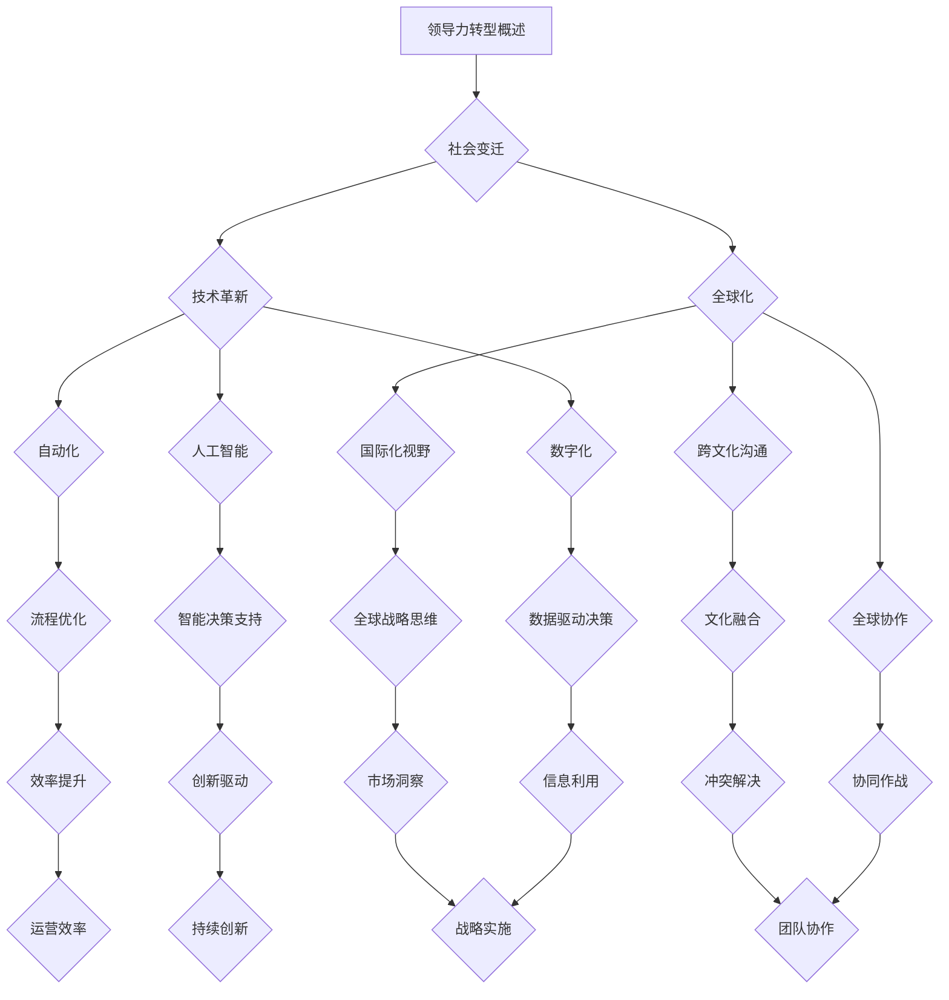

                 

### 第1章: 领导力转型的时代背景

#### 1.1 新时代背景下的领导力挑战

在当今这个日新月异的时代，领导力面临的挑战日益增多。首先，社会变迁对领导力提出了新的要求。随着全球化进程的加速，企业不仅需要在本地市场取得成功，还需要在全球范围内拓展业务。这种跨文化的管理要求领导者具备更高的情商和跨文化沟通能力。此外，社会的多元化也要求领导者能够理解并尊重不同背景、不同信仰的员工，这进一步增加了领导力转型的复杂性。

其次，技术革新对领导力带来了巨大的挑战。随着人工智能、大数据、云计算等新兴技术的广泛应用，传统的管理模式和决策流程正在被颠覆。领导者需要迅速掌握这些技术，利用它们来优化业务流程、提高决策效率。同时，技术进步也带来了信息爆炸，领导者需要具备筛选和处理大量信息的能力，以便做出更明智的决策。

最后，全球化对领导力的影响不可忽视。全球化带来了市场竞争的加剧，企业需要在全球范围内寻找合作伙伴和客户，这要求领导者具备国际化视野和战略思维。同时，全球化还带来了文化的交融和碰撞，领导者需要能够在多元文化环境中有效沟通和协作，以实现组织目标。

#### 1.1.1 社会变迁对领导力的要求

社会变迁对领导力的要求主要体现在以下几个方面：

1. **多元化管理能力**：随着社会的多元化，领导者需要能够管理来自不同背景、拥有不同观点的团队。这要求领导者具备跨文化沟通能力和包容性思维，能够理解和尊重团队成员的差异。

2. **情感智力**：在快速变化的社会环境中，领导者需要具备较高的情感智力，能够感知员工的情感需求，并提供适当的关心和支持。这有助于建立积极的团队氛围，提高员工的满意度和忠诚度。

3. **持续学习与创新精神**：社会变迁带来了不断涌现的新知识、新技术，领导者需要具备持续学习的能力，不断更新自己的知识和技能，以适应变化。同时，创新精神也是领导者必备的品质，只有不断创新，企业才能在激烈的市场竞争中立于不败之地。

#### 1.1.2 技术革新对领导力的挑战

技术革新对领导力的影响主要表现在以下几个方面：

1. **决策速度**：随着信息时代的到来，决策的速度变得越来越重要。领导者需要具备快速分析信息、做出决策的能力，以便在市场竞争中抢占先机。

2. **数据管理能力**：大数据时代，领导者需要能够有效管理和分析大量数据，从中提取有价值的信息，以支持决策。这要求领导者具备较强的数据分析能力和数据敏感度。

3. **技术理解与运用**：领导者需要了解并掌握新兴技术的原理和应用，利用它们来优化业务流程、提高决策效率。同时，领导者还需要具备引导团队利用技术进行创新的能力。

#### 1.1.3 全球化与领导力

全球化对领导力的影响主要体现在以下几个方面：

1. **国际化视野**：领导者需要具备国际化的视野和思维，能够理解不同国家和地区的市场环境、文化差异，制定相应的战略和策略。

2. **跨文化沟通能力**：全球化带来了多元文化的交融，领导者需要能够在不同文化背景下有效沟通和协作，以实现组织目标。

3. **全球协作能力**：全球化使得企业需要在全球范围内协作，领导者需要能够协调不同地区、不同部门的合作，确保项目顺利进行。

#### 1.2 领导力转型的必要性

面对新时代的挑战，领导力转型变得必要且迫切。传统的领导力模式往往侧重于权威和控制，这在过去的市场环境中具有一定的效果。然而，随着市场的变化和技术的进步，这种模式逐渐暴露出其局限性：

1. **传统领导力的局限性**：传统领导力模式过于依赖权威和控制，容易导致员工缺乏主动性、创新性和参与感。在快速变化的市场环境中，这种模式难以适应。

2. **领导力转型的目标**：领导力转型的目标在于构建一种以员工为中心、强调协作和创新的管理模式，使组织能够更灵活、更高效地应对市场变化。

3. **领导力转型的步骤**：领导力转型通常需要以下几个步骤：

   - **识别挑战**：领导者需要首先识别当前面临的挑战，包括社会变迁、技术革新和全球化带来的挑战。
   
   - **制定转型策略**：根据识别出的挑战，制定相应的转型策略，明确转型的目标、路径和资源需求。
   
   - **实施转型计划**：通过实施一系列的具体措施，逐步实现领导力转型。
   
   - **评估与调整**：在转型过程中，领导者需要不断评估转型的效果，并根据实际情况进行必要的调整。

#### 1.2.1 传统领导力的局限性

传统领导力的局限性主要体现在以下几个方面：

1. **过度依赖权威**：传统领导力模式往往依赖于领导者的权威和决策，这容易导致员工的被动性和依赖性，抑制了员工的创造力和主动性。

2. **缺乏创新精神**：传统领导力模式注重稳定和可控，往往缺乏创新精神，难以适应快速变化的市场环境。

3. **忽视员工需求**：传统领导力模式往往忽视员工的情感需求和成长需求，容易导致员工流失和士气低落。

#### 1.2.2 领导力转型的目标

领导力转型的目标在于构建一种以员工为中心、强调协作和创新的管理模式，使组织能够更灵活、更高效地应对市场变化。具体目标包括：

1. **提高员工的参与度和主动性**：通过建立开放、透明的沟通机制，使员工能够参与到决策过程中，提高员工的参与度和主动性。

2. **激发创新潜力**：通过鼓励员工创新，建立创新机制，为员工提供创新空间和资源支持，激发组织的创新潜力。

3. **提升组织效能**：通过优化组织结构和管理流程，提升组织的整体效能，使组织能够更快速地响应市场变化。

#### 1.2.3 领导力转型的步骤

领导力转型的步骤可以分为以下几个阶段：

1. **准备阶段**：在这个阶段，领导者需要识别当前面临的挑战，并明确领导力转型的目标和路径。

2. **启动阶段**：在这个阶段，领导者需要制定详细的转型计划，包括具体的实施步骤、资源分配和时间表。

3. **实施阶段**：在这个阶段，领导者需要按照转型计划逐步实施，同时确保各项措施的有效执行。

4. **评估与调整阶段**：在转型过程中，领导者需要不断评估转型的效果，并根据实际情况进行必要的调整。

#### 1.3 领导力转型的核心概念

领导力转型的核心概念包括以下几个方面：

1. **员工中心主义**：领导力转型的核心在于将员工视为组织最重要的资产，通过激发员工的潜力，实现组织的成功。

2. **协作文化**：领导力转型需要构建一种协作文化，鼓励员工之间的合作和共享，以提高组织的整体效能。

3. **创新能力**：领导力转型强调激发创新潜力，通过建立创新机制和提供创新资源，推动组织的持续创新。

4. **可持续性**：领导力转型不仅关注短期目标的实现，更注重组织的长期可持续发展。

### 1.4 领导力转型的基础理论

领导力转型的基础理论主要包括以下几个方面：

1. **领导力理论**：领导力理论为领导力转型提供了理论依据，包括领导者特质理论、领导行为理论、领导权变理论等。

2. **组织行为理论**：组织行为理论探讨了组织中个体和群体的行为规律，为领导力转型提供了实践指导。

3. **变革管理理论**：变革管理理论研究了组织变革的过程和策略，为领导力转型提供了有效的变革管理方法。

4. **人力资源理论**：人力资源理论关注员工的成长和发展，为领导力转型提供了人力资源管理的策略和工具。

#### 1.4.1 领导力理论的发展

领导力理论的发展经历了多个阶段：

1. **特质理论**：特质理论认为领导者具备一些固有的特质，如智慧、自信、决策能力等。

2. **行为理论**：行为理论认为领导者的行为对下属有重要影响，领导者可以通过不同的行为来影响下属。

3. **权变理论**：权变理论认为领导风格没有绝对的优劣，领导者需要根据具体情境选择合适的领导风格。

4. **情境领导理论**：情境领导理论认为领导者的行为应该根据下属的成熟度进行调整。

#### 1.4.2 领导力转型的重要理论框架

领导力转型的重要理论框架包括：

1. **变革领导理论**：变革领导理论强调领导者需要具备变革意识和能力，引领组织进行转型。

2. **系统思考**：系统思考帮助领导者从整体视角看待组织，识别并解决复杂问题。

3. **学习型组织理论**：学习型组织理论强调组织需要不断学习、创新，以适应外部环境的变化。

4. **人本管理理论**：人本管理理论强调以人为本，关注员工的成长和发展。

#### 1.4.3 领导力转型的关键要素

领导力转型的关键要素包括：

1. **文化与价值观**：文化与价值观是组织的基础，领导力转型需要从文化和价值观层面进行变革。

2. **组织结构**：组织结构需要与领导力转型的目标相匹配，以支持新的管理模式。

3. **领导风格**：领导风格需要适应新的领导力模式，以激发员工的潜力和创造力。

4. **人力资源政策**：人力资源政策需要支持领导力转型，如招聘、培训、激励等。

### 1.5 领导力转型的实践路径

领导力转型的实践路径可以分为以下几个步骤：

1. **诊断与规划**：首先，领导者需要对当前的组织状况进行诊断，明确转型目标和路径。

2. **战略制定**：根据诊断结果，制定详细的转型战略，包括组织结构、领导风格、文化价值观等方面的变革措施。

3. **实施与监控**：按照战略计划，逐步实施领导力转型，同时建立监控机制，确保各项措施的有效执行。

4. **评估与调整**：在转型过程中，定期评估转型效果，根据评估结果进行必要的调整。

#### 1.5.1 领导力转型的战略规划

领导力转型的战略规划是整个转型过程的关键，需要考虑以下几个方面：

1. **目标设定**：明确领导力转型的目标，如提高员工满意度、增强创新能力、提升组织效能等。

2. **路径选择**：根据组织特点和外部环境，选择合适的转型路径，如渐进式转型或革命性转型。

3. **资源分配**：确保有足够的资源支持领导力转型，包括人力、财务和物质资源。

4. **风险控制**：识别可能的风险，制定相应的风险控制措施，确保转型顺利进行。

#### 1.5.2 领导力转型的战略实施

领导力转型的战略实施包括以下几个方面：

1. **组织变革**：根据转型战略，对组织结构、流程、文化等各方面进行变革。

2. **领导力培养**：培养领导者具备转型所需的领导能力和素质。

3. **员工培训**：对员工进行培训，提高他们的技能和素质，以适应新的领导力模式。

4. **激励机制**：建立激励机制，鼓励员工积极参与领导力转型。

### 1.6 领导力转型的组织变革

组织变革是领导力转型的重要组成部分，包括以下几个方面：

1. **组织结构变革**：根据转型目标，调整组织结构，如从职能式结构转变为矩阵式结构，以提高组织的灵活性和响应能力。

2. **流程优化**：优化业务流程，提高组织的运营效率。

3. **文化变革**：通过改变组织文化，营造一个支持领导力转型的氛围。

4. **人力资源政策调整**：调整人力资源政策，如招聘、培训、激励等，以支持领导力转型。

#### 1.6.1 组织文化的变革

组织文化的变革是领导力转型的重要方面，包括以下几个方面：

1. **价值观的塑造**：建立符合转型目标的核心价值观，如开放、创新、协作等。

2. **文化氛围的营造**：通过一系列活动，营造一个积极、开放、创新的文化氛围。

3. **文化传承**：将组织的核心价值观传承给新员工，确保组织文化的一致性。

#### 1.6.2 组织结构的调整

组织结构的调整是领导力转型的重要组成部分，包括以下几个方面：

1. **扁平化结构**：减少管理层级，提高组织的响应速度。

2. **矩阵式结构**：建立跨部门、跨职能的矩阵式组织结构，提高组织的协同作战能力。

3. **网络化组织结构**：利用信息技术，构建一个高度互联的网络化组织结构，提高组织的灵活性和适应性。

### 1.7 领导力转型的领导力发展

领导力发展是领导力转型的核心，包括以下几个方面：

1. **领导力培训**：为领导者提供系统性的培训，提高他们的领导能力和素质。

2. **领导力发展计划**：制定个性化的领导力发展计划，帮助领导者不断提升自身能力。

3. **领导力传承**：通过导师制、领导力传承计划等方式，将领导者的经验和智慧传承给下一代领导者。

4. **领导力评估**：建立领导力评估体系，定期评估领导者的绩效和能力，提供反馈和改进建议。

#### 1.7.1 领导力的自我发展

领导力的自我发展是领导力转型的基础，包括以下几个方面：

1. **持续学习**：领导者需要不断学习新知识、新技能，以适应快速变化的环境。

2. **自我反思**：领导者需要定期进行自我反思，总结经验教训，不断提升自身能力。

3. **自我激励**：领导者需要具备自我激励的能力，始终保持积极向上的心态。

#### 1.7.2 领导力的团队发展

领导力的团队发展是领导力转型的关键，包括以下几个方面：

1. **团队建设**：领导者需要建立高效的团队，提高团队的整体绩效。

2. **团队协作**：领导者需要促进团队协作，激发团队的创造力和创新精神。

3. **团队激励**：领导者需要制定有效的激励机制，激发团队成员的积极性和创造力。

#### 1.7.3 领导力的组织发展

领导力的组织发展是领导力转型的最终目标，包括以下几个方面：

1. **组织战略**：领导者需要制定符合组织发展目标的战略，确保组织长期可持续发展。

2. **组织创新**：领导者需要推动组织创新，提高组织的竞争力和创新能力。

3. **组织效能**：领导者需要提升组织效能，提高组织的运营效率和绩效。

### 1.8 领导力转型的关键要素

领导力转型的成功依赖于以下几个关键要素：

1. **领导者的支持**：领导者的支持和参与是领导力转型成功的关键，领导者需要身体力行，带头进行变革。

2. **员工的参与**：员工的参与和认同是领导力转型成功的基础，领导者需要通过沟通和培训，让员工了解转型的重要性和意义。

3. **资源的投入**：领导力转型需要足够的资源支持，包括人力、财务和物质资源。

4. **持续改进**：领导力转型是一个持续的过程，领导者需要不断评估和改进，以适应不断变化的环境。

#### 1.8.1 文化与价值观的转型

文化与价值观的转型是领导力转型的核心，包括以下几个方面：

1. **核心价值观的塑造**：领导者需要明确组织的核心价值观，并将其融入组织的日常运营中。

2. **文化氛围的营造**：领导者需要通过一系列活动和制度，营造一个积极、开放、创新的文化氛围。

3. **文化传承**：领导者需要通过培训和传承，将组织的核心价值观和文化氛围传递给新员工。

### 1.9 领导力转型的挑战与应对

领导力转型面临一系列挑战，包括：

1. **内部阻力和外部挑战**：领导力转型可能会遇到内部阻力和外部挑战，如员工的抵触、市场环境的压力等。

2. **文化冲突和管理困境**：领导力转型过程中可能会出现文化冲突和管理困境，如传统与创新的冲突、领导力不足等。

3. **领导力转型的瓶颈**：领导力转型可能会遇到瓶颈，如领导力不足、资源不足等。

为了应对这些挑战，领导者需要采取以下策略：

1. **构建支持转型的企业文化**：通过建立支持转型的企业文化，提高员工的认同感和参与度。

2. **制定切实可行的转型计划**：制定详细的转型计划，明确转型的目标、路径和资源需求。

3. **培养转型所需的领导力**：通过培训和培养，提高领导者的领导力和管理能力。

4. **激发员工的积极性和创造力**：通过激励机制和培训，激发员工的积极性和创造力，为领导力转型提供动力。

### 1.10 领导力转型的未来展望

领导力转型的未来展望包括以下几个方面：

1. **数字化时代的领导力**：随着数字化时代的到来，领导者需要具备数字素养和数字领导力。

2. **可持续发展的领导力**：在可持续发展成为全球趋势的背景下，领导者需要具备可持续发展的领导力。

3. **新兴技术的领导力应用**：随着新兴技术的不断发展，领导者需要掌握和应用新兴技术，以推动组织创新和发展。

### 1.11 领导力转型的战略思考

领导力转型的战略思考包括以下几个方面：

1. **企业战略与领导力转型的关系**：领导者需要明确企业战略与领导力转型的关系，确保领导力转型支持企业战略的实现。

2. **领导力转型对企业发展的深远影响**：领导者需要认识到领导力转型对企业发展的深远影响，确保领导力转型能够推动企业的长期发展。

3. **领导力转型的长期规划与策略**：领导者需要制定长期的领导力转型规划，确保领导力转型能够持续、有效地推进。

### 1.12 附录

附录部分提供了领导力转型的参考资料和工具方法，包括：

1. **领导力转型的参考资料**：提供一系列的书籍、文章、报告等参考资料，帮助读者深入了解领导力转型。

2. **领导力转型的工具与方法**：介绍一系列的领导力评估工具、领导力发展工具和领导力转型实施指南，帮助读者实际操作领导力转型。

### 总结

本章概述了领导力转型的时代背景、核心概念和实践路径，探讨了领导力转型面临的挑战和解决方案，并对领导力转型的未来进行了展望。通过本章的学习，读者可以了解领导力转型的必要性和重要性，掌握领导力转型的核心概念和实践路径，为领导力转型提供理论指导和实践支持。```markdown
# 领导力转型：适应新时代的挑战

> **关键词**：领导力转型、新时代、挑战、社会变迁、技术革新、全球化

> **摘要**：本文深入探讨了领导力转型在新时代背景下的必要性和挑战。随着社会变迁、技术革新和全球化的发展，传统领导力模式面临着巨大的挑战。本文从核心概念、基础理论和实践路径等多个方面阐述了领导力转型的内涵和实践，为企业在新时代中提升领导力提供了理论指导和实践建议。

---

### 第一部分：领导力转型概述

#### 第1章：领导力转型的时代背景

##### 1.1 新时代背景下的领导力挑战

在当今这个快速变化的时代，领导力面临着前所未有的挑战。这些挑战主要来自以下几个方面：

1. **社会变迁**：社会变迁带来的多元化、全球化以及信息化的趋势，要求领导者在管理中更加注重多样性、灵活性和创新能力。

2. **技术革新**：技术革新，尤其是数字化、自动化和人工智能等新兴技术的快速发展，使得传统管理模式逐渐失效，领导力需要更加关注如何利用技术提升组织的效率和创新能力。

3. **全球化**：全球化使得企业的竞争环境更加复杂，领导者需要具备跨文化沟通和国际化视野，以应对全球市场的挑战。

##### 1.1.1 社会变迁对领导力的要求

社会变迁对领导力提出了新的要求，主要体现在以下几个方面：

1. **多元化管理**：社会多元化要求领导者能够理解和尊重不同文化背景、不同价值观的员工，构建多元化的团队。

2. **情感智力**：领导者需要具备较高的情感智力，能够理解员工的情感需求，建立信任和合作关系。

3. **持续学习**：社会变迁要求领导者具备持续学习的能力，不断更新知识和技能，以适应快速变化的环境。

##### 1.1.2 技术革新对领导力的挑战

技术革新对领导力的影响主要表现在以下几个方面：

1. **决策速度**：随着信息爆炸，领导者需要能够快速分析和处理信息，做出及时、明智的决策。

2. **数据管理能力**：领导者需要具备较强的数据管理能力，能够有效地利用数据支持决策。

3. **技术理解与运用**：领导者需要理解并掌握新兴技术的原理和应用，利用技术提升组织的效率和创新能力。

##### 1.1.3 全球化与领导力

全球化对领导力的影响主要体现在以下几个方面：

1. **国际化视野**：领导者需要具备国际化的视野和思维，能够理解和适应不同国家和地区的文化和市场环境。

2. **跨文化沟通能力**：全球化带来了跨文化的交流与合作，领导者需要具备跨文化沟通能力，有效地与来自不同文化背景的团队成员沟通。

3. **全球协作能力**：全球化使得企业需要在全球范围内协作，领导者需要能够协调不同地区、不同部门的合作，确保项目的顺利进行。

##### 1.2 领导力转型的必要性

面对新时代的挑战，领导力转型变得必要且迫切。传统的领导力模式过于依赖权威和控制，难以适应快速变化的环境和多元化的需求。领导力转型旨在构建一种以员工为中心、强调协作和创新的管理模式，使组织能够更加灵活、高效地应对外部环境的挑战。

##### 1.2.1 传统领导力的局限性

传统领导力的局限性主要体现在以下几个方面：

1. **过度依赖权威**：传统领导力模式过于依赖领导者的权威和决策，容易导致员工缺乏主动性和创造性。

2. **缺乏灵活性**：传统领导力模式往往注重稳定和可控，难以适应快速变化的市场环境。

3. **忽视员工需求**：传统领导力模式往往忽视员工的情感需求和成长需求，容易导致员工流失和士气低落。

##### 1.2.2 领导力转型的目标

领导力转型的目标在于：

1. **提高员工的参与度和主动性**：通过建立开放、透明的沟通机制，使员工能够参与到决策过程中，提高员工的参与度和主动性。

2. **激发创新潜力**：通过鼓励员工创新，建立创新机制，为员工提供创新空间和资源支持，激发组织的创新潜力。

3. **提升组织效能**：通过优化组织结构和管理流程，提升组织的整体效能，使组织能够更快速地响应市场变化。

##### 1.2.3 领导力转型的步骤

领导力转型通常需要以下几个步骤：

1. **准备阶段**：领导者需要识别当前面临的挑战，明确领导力转型的目标和路径。

2. **启动阶段**：制定详细的转型计划，包括具体的实施步骤、资源分配和时间表。

3. **实施阶段**：按照转型计划逐步实施，同时确保各项措施的有效执行。

4. **评估与调整阶段**：在转型过程中，领导者需要不断评估转型的效果，并根据实际情况进行必要的调整。

---

### 第二部分：领导力转型的核心概念

#### 第2章：领导力转型的核心概念

##### 2.1 领导力转型的定义与内涵

领导力转型是指组织在领导者引导下，通过调整组织结构、文化价值观、领导风格等要素，以适应外部环境变化和实现组织目标的过程。其核心内涵包括：

1. **领导力的发展**：领导者需要不断提升自身的领导能力和素质，以应对新的挑战。

2. **组织文化的变革**：组织需要建立一种支持领导力转型的文化价值观，以促进员工的积极参与和创新能力。

3. **管理模式的创新**：组织需要创新管理方式，提高组织的灵活性和响应能力。

##### 2.1.1 领导力转型的定义

领导力转型是指组织在领导者引导下，通过调整组织结构、文化价值观、领导风格等要素，以适应外部环境变化和实现组织目标的过程。

##### 2.1.2 领导力转型的内涵

领导力转型的内涵包括以下几个方面：

1. **领导力的发展**：领导者需要不断提升自身的领导能力和素质，以应对新的挑战。

2. **组织文化的变革**：组织需要建立一种支持领导力转型的文化价值观，以促进员工的积极参与和创新能力。

3. **管理模式的创新**：组织需要创新管理方式，提高组织的灵活性和响应能力。

##### 2.2 领导力转型的基础理论

领导力转型的基础理论包括以下几个方面：

1. **领导力理论**：领导力理论为领导力转型提供了理论基础，包括领导者特质理论、领导行为理论、领导权变理论等。

2. **组织行为理论**：组织行为理论研究了组织中个体和群体的行为规律，为领导力转型提供了实践指导。

3. **变革管理理论**：变革管理理论研究了组织变革的过程和策略，为领导力转型提供了有效的变革管理方法。

4. **人力资源理论**：人力资源理论关注员工的成长和发展，为领导力转型提供了人力资源管理的策略和工具。

##### 2.2.1 领导力理论的发展

领导力理论的发展经历了多个阶段：

1. **特质理论**：特质理论认为领导者具备一些固有的特质，如智慧、自信、决策能力等。

2. **行为理论**：行为理论认为领导者的行为对下属有重要影响，领导者可以通过不同的行为来影响下属。

3. **权变理论**：权变理论认为领导风格没有绝对的优劣，领导者需要根据具体情境选择合适的领导风格。

4. **情境领导理论**：情境领导理论认为领导者的行为应该根据下属的成熟度进行调整。

##### 2.2.2 领导力转型的重要理论框架

领导力转型的重要理论框架包括以下几个方面：

1. **变革领导理论**：变革领导理论强调领导者需要具备变革意识和能力，引领组织进行转型。

2. **系统思考**：系统思考帮助领导者从整体视角看待组织，识别并解决复杂问题。

3. **学习型组织理论**：学习型组织理论强调组织需要不断学习、创新，以适应外部环境的变化。

4. **人本管理理论**：人本管理理论强调以人为本，关注员工的成长和发展。

##### 2.3 领导力转型的关键要素

领导力转型的关键要素包括以下几个方面：

1. **文化与价值观**：文化与价值观是组织的基础，领导力转型需要从文化和价值观层面进行变革。

2. **组织结构**：组织结构需要与领导力转型的目标相匹配，以支持新的管理模式。

3. **领导风格**：领导风格需要适应新的领导力模式，以激发员工的潜力和创造力。

4. **人力资源政策**：人力资源政策需要支持领导力转型，如招聘、培训、激励等。

##### 2.3.1 文化与价值观的转型

文化与价值观的转型是领导力转型的核心，包括以下几个方面：

1. **核心价值观的塑造**：领导者需要明确组织的核心价值观，并将其融入组织的日常运营中。

2. **文化氛围的营造**：领导者需要通过一系列活动和制度，营造一个积极、开放、创新的文化氛围。

3. **文化传承**：领导者需要通过培训和传承，将组织的核心价值观和文化氛围传递给新员工。

##### 2.3.2 组织结构的转型

组织结构的转型是领导力转型的重要组成部分，包括以下几个方面：

1. **扁平化结构**：减少管理层级，提高组织的灵活性和响应能力。

2. **矩阵式结构**：建立跨部门、跨职能的矩阵式组织结构，提高组织的协同作战能力。

3. **网络化组织结构**：利用信息技术，构建一个高度互联的网络化组织结构，提高组织的灵活性和适应性。

##### 2.3.3 领导风格与技能的转型

领导风格与技能的转型是领导力转型的重要方面，包括以下几个方面：

1. **领导风格的转变**：领导者需要从传统的权威型领导风格转向参与型或变革型领导风格。

2. **领导技能的提升**：领导者需要提升自身的沟通能力、决策能力、创新能力等领导技能。

3. **领导力的培养**：组织需要建立领导力培养机制，帮助领导者不断提升自身的领导能力和素质。

---

### 第三部分：领导力转型的实践路径

#### 第3章：领导力转型的实践路径

##### 3.1 领导力转型的战略规划

领导力转型的战略规划是领导力转型成功的关键，包括以下几个步骤：

1. **目标设定**：明确领导力转型的目标，如提升员工满意度、增强创新能力、提高组织效能等。

2. **路径选择**：根据组织特点和外部环境，选择合适的转型路径，如渐进式转型或革命性转型。

3. **资源分配**：确保有足够的资源支持领导力转型，包括人力、财务和物质资源。

4. **风险控制**：识别可能的风险，制定相应的风险控制措施，确保转型顺利进行。

##### 3.1.1 领导力转型的战略制定

领导力转型的战略制定需要考虑以下几个方面：

1. **明确转型目标**：根据组织的目标和愿景，明确领导力转型的目标。

2. **分析外部环境**：分析外部环境的变化，如市场竞争、技术进步、法律法规等，以确定转型方向。

3. **评估内部能力**：评估组织的内部能力，如组织结构、文化价值观、人力资源等，以确定转型的可行性和策略。

4. **制定转型计划**：根据上述分析，制定详细的转型计划，包括具体的实施步骤、时间表和资源需求。

##### 3.1.2 领导力转型的战略实施

领导力转型的战略实施包括以下几个关键步骤：

1. **沟通与培训**：通过内部沟通和培训，让员工了解领导力转型的目标和意义，提高员工的认同感和参与度。

2. **组织变革**：根据转型计划，对组织结构、流程、文化等各方面进行变革，以支持新的管理模式。

3. **领导力培养**：通过培训和培养，提高领导者的领导能力和素质，确保领导力转型能够顺利实施。

4. **监控与评估**：建立监控机制，定期评估领导力转型的效果，根据评估结果进行调整和优化。

##### 3.2 领导力转型的组织变革

领导力转型的组织变革是转型成功的关键，包括以下几个方面：

1. **组织结构变革**：根据转型目标，调整组织结构，如减少管理层级、建立矩阵式结构等，以提高组织的灵活性和响应能力。

2. **流程优化**：优化业务流程，提高组织的运营效率，减少冗余环节，提高工作流程的透明度和效率。

3. **文化变革**：通过改变组织文化，营造一个支持领导力转型的氛围，鼓励创新、协作和开放。

4. **人力资源政策调整**：调整人力资源政策，如招聘、培训、激励等，以支持领导力转型，提高员工的参与度和主动性。

##### 3.2.1 组织文化的变革

组织文化的变革是领导力转型的重要方面，包括以下几个方面：

1. **核心价值观的塑造**：明确组织的新核心价值观，并将其融入组织的日常运营中，引导员工行为。

2. **文化氛围的营造**：通过一系列活动和制度，营造一个积极、开放、创新的文化氛围，鼓励员工积极参与和贡献。

3. **文化传承**：通过培训和传承，将组织的核心价值观和文化氛围传递给新员工，确保组织文化的一致性。

##### 3.2.2 组织结构的调整

组织结构的调整是领导力转型的重要组成部分，包括以下几个方面：

1. **扁平化结构**：减少管理层级，提高组织的灵活性和响应能力，促进信息的快速传递和决策的效率。

2. **矩阵式结构**：建立跨部门、跨职能的矩阵式组织结构，提高组织的协同作战能力，促进资源的有效配置。

3. **网络化组织结构**：利用信息技术，构建一个高度互联的网络化组织结构，促进组织内部的沟通和协作，提高组织的灵活性和适应性。

##### 3.2.3 组织效能的提升

组织效能的提升是领导力转型的重要目标，包括以下几个方面：

1. **流程优化**：通过流程优化，减少冗余环节，提高工作效率，降低成本。

2. **人力资源管理**：通过优化人力资源管理，提高员工的工作积极性和满意度，促进组织的持续发展。

3. **技术创新**：通过技术创新，提高组织的生产效率和创新能力，保持竞争优势。

4. **组织学习**：通过组织学习，提高组织的适应能力和创新能力，持续改进组织的运营和管理。

##### 3.3 领导力转型的领导力发展

领导力发展是领导力转型的核心，包括以下几个方面：

1. **领导力培训**：为领导者提供系统性的培训，提高他们的领导能力和素质。

2. **领导力发展计划**：制定个性化的领导力发展计划，帮助领导者不断提升自身能力。

3. **领导力传承**：通过导师制、领导力传承计划等方式，将领导者的经验和智慧传承给下一代领导者。

4. **领导力评估**：建立领导力评估体系，定期评估领导者的绩效和能力，提供反馈和改进建议。

##### 3.3.1 领导力的自我发展

领导力的自我发展是领导力转型的基础，包括以下几个方面：

1. **持续学习**：领导者需要不断学习新知识、新技能，以适应快速变化的环境。

2. **自我反思**：领导者需要定期进行自我反思，总结经验教训，不断提升自身能力。

3. **自我激励**：领导者需要具备自我激励的能力，始终保持积极向上的心态。

##### 3.3.2 领导力的团队发展

领导力的团队发展是领导力转型的关键，包括以下几个方面：

1. **团队建设**：领导者需要建立高效的团队，提高团队的整体绩效。

2. **团队协作**：领导者需要促进团队协作，激发团队的创造力和创新精神。

3. **团队激励**：领导者需要制定有效的激励机制，激发团队成员的积极性和创造力。

##### 3.3.3 领导力的组织发展

领导力的组织发展是领导力转型的最终目标，包括以下几个方面：

1. **组织战略**：领导者需要制定符合组织发展目标的战略，确保组织长期可持续发展。

2. **组织创新**：领导者需要推动组织创新，提高组织的竞争力和创新能力。

3. **组织效能**：领导者需要提升组织效能，提高组织的运营效率和绩效。

##### 3.4 领导力转型的评估与优化

领导力转型的评估与优化是确保转型成功的重要环节，包括以下几个方面：

1. **评估指标体系**：建立完善的评估指标体系，包括组织绩效、领导力水平、文化价值观等方面。

2. **定期评估**：定期对领导力转型进行评估，收集和分析数据，以评估转型效果。

3. **反馈与改进**：根据评估结果，提供反馈和改进建议，不断优化领导力转型的策略和措施。

4. **持续改进**：领导力转型是一个持续的过程，领导者需要不断评估和改进，以适应不断变化的环境。

---

### 第三部分：领导力转型的具体实践

#### 第4章：文化与价值观的转型

##### 4.1 企业文化的建设

企业文化的建设是领导力转型的重要组成部分，对于组织的长期发展具有深远影响。以下是如何进行企业文化建设的详细步骤：

1. **明确企业愿景和价值观**：领导者需要首先明确企业的愿景和价值观，并将其作为企业文化的核心。这些价值观应该反映企业的使命、目标和员工的行为准则。

2. **宣传和推广**：通过内部沟通、培训、文化活动等方式，宣传和推广企业的价值观，让员工深刻理解和认同。

3. **融入日常运营**：将企业文化融入企业的日常运营中，包括决策过程、管理行为、员工关系等各个方面。

4. **评估与改进**：定期评估企业文化的影响力，根据实际情况进行改进，确保企业文化能够与时俱进。

##### 4.2 价值观的塑造与传播

价值观的塑造与传播是企业文化建设的核心，以下是如何进行价值观的塑造与传播的详细步骤：

1. **塑造核心价值观**：领导者需要明确企业核心价值观，如诚信、创新、责任、尊重等，并将其作为员工行为的指南。

2. **制定行为准则**：根据核心价值观，制定具体的行为准则，如员工行为规范、工作流程等。

3. **宣传与教育**：通过内部培训、宣传材料、企业内部网等方式，向员工宣传和解释价值观和行为准则。

4. **实践与示范**：领导者应该通过自身行为示范，实践核心价值观和行为准则，树立良好的榜样。

5. **激励与表彰**：建立激励机制，对践行核心价值观的员工进行表彰和奖励，激发员工的积极性。

##### 4.3 价值观的实践

价值观的实践是企业文化建设的最终目标，以下是如何实践价值观的详细步骤：

1. **员工参与**：鼓励员工参与企业文化的实践，包括提出改进建议、参与决策过程等。

2. **日常工作**：将价值观融入员工的日常工作中，确保员工在工作中的行为和决策符合企业的价值观。

3. **绩效评估**：将价值观的实践纳入员工绩效评估体系，激励员工持续践行价值观。

4. **文化建设活动**：定期组织文化建设活动，如团队建设活动、企业文化日活动等，增强员工对价值观的认同和实践。

---

#### 第5章：组织结构的转型

##### 5.1 传统组织结构的局限性

传统组织结构存在以下局限性：

1. **层级过多**：传统组织结构往往存在多层管理层级，信息传递缓慢，决策效率低下。

2. **职能分割**：传统组织结构注重职能分工，导致部门之间的协作困难，资源浪费。

3. **缺乏灵活性**：传统组织结构难以适应快速变化的市场环境，创新和变革能力较弱。

##### 5.2 新型组织结构的设计

为了克服传统组织结构的局限性，新型组织结构的设计应考虑以下几个方面：

1. **扁平化结构**：减少管理层级，提高组织的灵活性和响应能力。

2. **矩阵式结构**：建立跨部门、跨职能的矩阵式组织结构，提高组织的协同作战能力。

3. **网络化组织结构**：利用信息技术，构建一个高度互联的网络化组织结构，提高组织的灵活性和适应性。

##### 5.3 组织变革的实践

组织变革的实践包括以下几个方面：

1. **制定变革计划**：明确变革的目标、路径和资源需求，制定详细的变革计划。

2. **沟通与培训**：通过内部沟通和培训，让员工了解变革的目标和意义，提高员工的认同感和参与度。

3. **领导力培养**：通过培训和培养，提高领导者的领导能力和素质，确保领导力转型能够顺利实施。

4. **实施与监控**：按照变革计划逐步实施，同时建立监控机制，确保各项措施的有效执行。

---

#### 第6章：领导风格的转型

##### 6.1 领导风格的类型与特点

领导风格可以分为以下几种类型：

1. **权威型领导风格**：领导者通过权力和权威来指挥和监督员工，决策集中在领导者手中。

2. **参与型领导风格**：领导者鼓励员工参与决策过程，重视员工的意见和建议。

3. **变革型领导风格**：领导者通过激励和启发，激发员工的内在动机和创造力，推动组织的变革和创新。

##### 6.2 领导风格的转型策略

领导风格的转型策略包括以下几个方面：

1. **领导风格诊断**：通过评估和反馈，了解领导者的当前领导风格，识别需要改进的方面。

2. **领导风格转型方法**：根据诊断结果，选择合适的领导风格转型方法，如逐步转型法、突变转型法等。

3. **领导风格转型实施**：按照转型方法，逐步实施领导风格转型，同时提供持续的培训和指导。

4. **领导风格转型效果评估**：定期评估领导风格转型的效果，根据评估结果进行调整和优化。

##### 6.3 领导力的提升与培养

领导力的提升与培养包括以下几个方面：

1. **领导力培训**：为领导者提供系统性的培训，提高他们的领导能力和素质。

2. **领导力发展计划**：制定个性化的领导力发展计划，帮助领导者不断提升自身能力。

3. **领导力传承**：通过导师制、领导力传承计划等方式，将领导者的经验和智慧传承给下一代领导者。

4. **领导力评估**：建立领导力评估体系，定期评估领导者的绩效和能力，提供反馈和改进建议。

---

#### 第7章：领导力转型的评估与优化

##### 7.1 领导力转型的评估指标

领导力转型的评估指标应包括以下几个方面：

1. **组织绩效指标**：如销售额、市场份额、客户满意度等。

2. **领导力水平指标**：如领导者的决策能力、沟通能力、团队合作能力等。

3. **文化价值观指标**：如员工满意度、员工忠诚度、企业文化认同度等。

##### 7.2 领导力转型的优化策略

领导力转型的优化策略包括以下几个方面：

1. **基于评估的优化方案**：根据评估结果，制定具体的优化方案，包括改进措施、时间表和责任人。

2. **领导力转型的持续改进**：建立持续改进机制，定期评估领导力转型的效果，根据实际情况进行调整和优化。

3. **领导力转型的实施与跟踪**：按照优化方案，逐步实施领导力转型，同时建立跟踪机制，确保各项措施的有效执行。

---

### 第三部分：领导力转型的案例研究

#### 第8章：成功领导力转型的案例分析

##### 8.1 案例一：华为公司的领导力转型

华为公司的领导力转型是一个成功的典范。以下是华为公司领导力转型的详细过程：

1. **背景**：随着全球化和数字化的发展，华为面临着巨大的市场挑战和竞争压力。

2. **目标**：华为提出了“以客户为中心，以创新为动力”的领导力转型目标。

3. **实施**：
   - **组织结构变革**：华为减少了管理层级，建立了矩阵式组织结构，提高了组织的灵活性和响应能力。
   - **领导力培养**：华为投入大量资源进行领导力培训，培养领导者的决策能力、沟通能力和团队合作能力。
   - **文化价值观的塑造**：华为强调“客户为中心”的价值观，并通过一系列活动和文化传承，将这一价值观深入人心。

4. **效果**：领导力转型后，华为的销售额和市场份额大幅增长，创新能力显著提升，成为全球领先的科技公司之一。

##### 8.2 案例二：阿里巴巴集团的领导力转型

阿里巴巴集团的领导力转型同样取得了显著成果。以下是阿里巴巴集团领导力转型的详细过程：

1. **背景**：随着电商行业的快速发展，阿里巴巴面临着激烈的市场竞争。

2. **目标**：阿里巴巴提出了“双轮驱动”的领导力转型目标，即数字化和全球化。

3. **实施**：
   - **组织结构变革**：阿里巴巴建立了区域分部的矩阵式组织结构，提高了全球运营效率。
   - **领导力培养**：阿里巴巴通过内部培训、外部合作和领导力发展计划，不断提升领导者的领导能力和素质。
   - **文化价值观的塑造**：阿里巴巴强调“客户第一、员工第二、股东第三”的价值观，并通过文化活动和传承，将这一价值观贯穿于组织运营中。

4. **效果**：领导力转型后，阿里巴巴的销售额和市场份额持续增长，数字化能力和全球竞争力显著提升，成为全球领先的电商平台。

##### 8.3 案例三：谷歌公司的领导力转型

谷歌公司的领导力转型也是一个成功的案例。以下是谷歌公司领导力转型的详细过程：

1. **背景**：随着互联网技术的快速发展，谷歌面临着巨大的竞争压力。

2. **目标**：谷歌提出了“创新驱动”的领导力转型目标，以保持技术领先地位。

3. **实施**：
   - **组织结构变革**：谷歌建立了矩阵式组织结构，提高了创新和协作能力。
   - **领导力培养**：谷歌通过内部培训、外部合作和领导力发展计划，培养领导者的创新能力和决策能力。
   - **文化价值观的塑造**：谷歌强调“创意自由、用户至上”的价值观，并通过文化活动和传承，将这一价值观融入组织运营中。

4. **效果**：领导力转型后，谷歌的创新能力显著提升，推出了多个颠覆性产品和服务，如Android、Google Maps 等，成为全球领先的科技公司之一。

---

### 第9章：领导力转型中的挑战与解决方案

##### 9.1 领导力转型的挑战

领导力转型过程中可能会遇到以下挑战：

1. **内部阻力和外部挑战**：内部阻力和外部挑战是领导力转型的常见问题，如员工的抵触、市场环境的压力等。

2. **文化冲突和管理困境**：文化冲突和管理困境可能导致领导力转型受阻，如传统与创新的冲突、领导力不足等。

3. **领导力转型的瓶颈**：领导力转型可能会遇到瓶颈，如领导力不足、资源不足等。

##### 9.2 解决方案与策略

为了克服领导力转型中的挑战，可以采取以下解决方案和策略：

1. **构建支持转型的企业文化**：通过建立支持转型的企业文化，提高员工的认同感和参与度。

2. **制定切实可行的转型计划**：制定详细的转型计划，明确转型的目标、路径和资源需求。

3. **培养转型所需的领导力**：通过培训和培养，提高领导者的领导能力和素质。

4. **激发员工的积极性和创造力**：通过激励机制和培训，激发员工的积极性和创造力，为领导力转型提供动力。

---

### 第10章：领导力转型的未来展望

##### 10.1 领导力转型的趋势

领导力转型的未来趋势将受到以下因素的影响：

1. **数字化时代的领导力**：数字化技术的不断发展将要求领导者具备数字素养和数字领导力。

2. **可持续发展的领导力**：随着可持续发展的理念深入人心，领导者需要具备可持续发展的领导力。

3. **新兴技术的领导力应用**：新兴技术的广泛应用将要求领导者掌握和应用新技术，以推动组织创新和发展。

##### 10.2 领导力转型的战略思考

领导力转型的战略思考应包括以下几个方面：

1. **企业战略与领导力转型的关系**：领导者需要明确企业战略与领导力转型的关系，确保领导力转型支持企业战略的实现。

2. **领导力转型对企业发展的深远影响**：领导者需要认识到领导力转型对企业发展的深远影响，确保领导力转型能够推动企业的长期发展。

3. **领导力转型的长期规划与策略**：领导者需要制定长期的领导力转型规划，确保领导力转型能够持续、有效地推进。

---

## 附录

### 附录 A：领导力转型的参考资料

以下是一些关于领导力转型的参考资料：

1. **《领导力：理论与实践》（Leadership: Theory and Practice）**：这本书详细介绍了领导力理论及其应用，对领导力转型提供了理论支持。

2. **《变革的领导》（The Leadership Challenge）**：这本书强调了领导力在组织变革中的关键作用，为领导力转型提供了实践经验。

3. **《领导力与执行力》（Leadership and Execution）**：这本书探讨了领导力与执行力之间的关系，为领导力转型提供了策略和工具。

### 附录 B：领导力转型的工具与方法

以下是一些领导力转型的工具与方法：

1. **360度评估**：通过收集多方反馈，对领导者的能力进行综合评估。

2. **领导力诊断工具**：如领导力素质模型、领导力成熟度模型等，用于评估领导者的领导力水平。

3. **领导力发展计划**：根据领导者的需求和组织的战略目标，制定个性化的领导力发展计划。

### 附录 C：领导力转型的实施指南

以下是一些领导力转型的实施指南：

1. **转型策略制定**：明确领导力转型的目标、路径和资源需求。

2. **转型计划实施**：按照转型计划，逐步实施领导力转型，确保各项措施的有效执行。

3. **转型效果评估**：定期评估领导力转型的效果，根据评估结果进行调整和优化。

---

### 总结

《领导力转型：适应新时代的挑战》详细阐述了领导力转型在新时代背景下的必要性和挑战。通过分析社会变迁、技术革新和全球化对领导力的影响，本书提出了领导力转型的核心概念和实践路径。书中通过案例研究和实际应用，展示了领导力转型的成功经验和解决方案。附录部分提供了丰富的参考资料和工具方法，有助于读者深入理解和实施领导力转型。通过本书的学习，领导者可以提升自身的领导能力，推动组织的持续发展。```markdown
## 领导力转型：适应新时代的挑战

### 摘要

在数字化、全球化和技术革新的新时代，领导力转型已成为企业持续发展的关键。本文探讨了领导力转型的背景、核心概念、实践路径以及面临的挑战和解决方案。通过对领导力转型的深入分析，本文旨在为领导者提供实用的指导，帮助他们在快速变化的环境中引领组织变革，实现可持续发展。

### 目录

1. **领导力转型概述**
   - **1.1 新时代背景下的领导力挑战**
   - **1.2 领导力转型的必要性**
   - **1.3 领导力转型的核心概念**

2. **领导力转型的理论基础**
   - **2.1 领导力理论的发展**
   - **2.2 领导力转型的重要理论框架**
   - **2.3 领导力转型的关键要素**

3. **领导力转型的实践路径**
   - **3.1 领导力转型的战略规划**
   - **3.2 领导力转型的组织变革**
   - **3.3 领导力转型的领导力发展**

4. **领导力转型的具体实践**
   - **4.1 企业文化的建设**
   - **4.2 组织结构的转型**
   - **4.3 领导风格的转型**

5. **领导力转型的评估与优化**
   - **5.1 领导力转型的评估指标**
   - **5.2 领导力转型的优化策略**

6. **领导力转型的案例研究**
   - **6.1 华为公司的领导力转型**
   - **6.2 阿里巴巴集团的领导力转型**
   - **6.3 谷歌公司的领导力转型**

7. **领导力转型中的挑战与解决方案**
   - **7.1 领导力转型的挑战**
   - **7.2 解决方案与策略**

8. **领导力转型的未来展望**
   - **8.1 领导力转型的趋势**
   - **8.2 领导力转型的战略思考**

9. **附录**
   - **9.1 领导力转型的参考资料**
   - **9.2 领导力转型的工具与方法**
   - **9.3 领导力转型实施指南**

### 第1章 领导力转型的时代背景

#### 1.1 新时代背景下的领导力挑战

在当今这个快速变化的时代，领导力面临着前所未有的挑战。这些挑战源于社会变迁、技术革新和全球化，它们共同塑造了一个充满不确定性和机会的新环境。

##### 1.1.1 社会变迁对领导力的要求

社会变迁对领导力提出了新的要求。随着全球化进程的加速，社会的多元化、文化多样性和信息化的趋势日益明显。领导者需要适应这些变化，以更好地管理多元化团队，并促进组织内的创新。

1. **多元化管理能力**：多元化管理能力是领导力转型中不可或缺的一部分。领导者需要能够理解和尊重来自不同背景的员工，以及他们的价值观和信仰。这意味着领导者需要具备跨文化沟通能力和包容性思维。

2. **情感智力**：情感智力是领导者理解并管理员工情感需求的能力。在一个充满变动的环境中，领导者需要具备高度的情感智力，以建立信任、提高团队凝聚力和员工满意度。

3. **持续学习与创新精神**：社会变迁要求领导者具备持续学习的能力，不断更新知识和技能，以适应快速变化的环境。同时，领导者还需要具备创新精神，鼓励团队探索新的方法和思路，以保持组织的竞争力。

##### 1.1.2 技术革新对领导力的挑战

技术革新对领导力产生了深远的影响。随着数字化、自动化和人工智能等新兴技术的迅速发展，传统的领导力模式面临巨大挑战。

1. **决策速度**：在信息爆炸的时代，领导者需要能够快速做出决策，以保持竞争优势。这要求领导者具备敏锐的数据分析和决策能力。

2. **数据管理能力**：大数据时代，领导者需要能够有效管理和分析大量数据，以提取有价值的信息，支持决策。这需要领导者具备数据敏感性和数据管理技能。

3. **技术理解与运用**：领导者需要理解新兴技术的原理和应用，能够利用技术优化业务流程、提高决策效率，并推动组织的数字化转型。

##### 1.1.3 全球化与领导力

全球化对领导力的影响不可忽视。全球化带来了竞争的加剧、市场的复杂化和跨文化合作的必要性，这些因素都要求领导者具备国际化视野和战略思维。

1. **国际化视野**：全球化要求领导者具备国际化的视野和思维，能够理解并适应不同国家和地区的市场环境和文化差异。

2. **跨文化沟通能力**：跨文化沟通能力是领导者在全球环境中有效沟通和协作的关键。领导者需要能够与来自不同文化背景的团队成员建立有效的沟通和合作关系。

3. **全球协作能力**：全球化使得企业需要在全球范围内协作，领导者需要能够协调不同地区、不同部门的合作，确保项目的顺利进行。

#### 1.2 领导力转型的必要性

面对新时代的挑战，传统的领导力模式已经难以满足组织发展的需求。领导力转型因此变得必要且迫切。

##### 1.2.1 传统领导力的局限性

传统领导力模式存在以下局限性：

1. **过度依赖权威**：传统领导力模式过于依赖领导者的权威和决策，导致员工缺乏参与感和主动性。

2. **缺乏灵活性**：传统领导力模式难以适应快速变化的市场环境，缺乏应对不确定性的能力。

3. **忽视员工需求**：传统领导力模式往往忽视员工的情感需求和个人成长，导致员工不满和流失。

##### 1.2.2 领导力转型的目标

领导力转型的目标在于：

1. **提高员工的参与度和主动性**：通过建立开放、透明的沟通机制，鼓励员工参与决策过程，提高他们的主动性和创造性。

2. **激发创新潜力**：通过构建创新文化和激励机制，鼓励员工提出创新想法，推动组织的持续创新。

3. **提升组织效能**：通过优化组织结构和流程，提高组织的运作效率和响应能力。

##### 1.2.3 领导力转型的步骤

领导力转型通常包括以下步骤：

1. **准备阶段**：识别组织面临的挑战和机会，明确领导力转型的目标和路径。

2. **启动阶段**：制定详细的转型计划，包括实施步骤、资源分配和时间表。

3. **实施阶段**：按照转型计划逐步实施，同时确保各项措施的有效执行。

4. **评估与调整阶段**：在转型过程中，定期评估转型效果，根据实际情况进行必要的调整。

### 1.3 领导力转型的核心概念

领导力转型是一个复杂的过程，涉及到多个核心概念和理论框架。

##### 1.3.1 员工中心主义

员工中心主义是领导力转型的核心理念之一。它强调将员工视为组织最重要的资产，关注员工的成长和发展，以提高组织的整体效能。

1. **员工参与**：通过开放、透明的沟通机制，鼓励员工参与决策过程，提高他们的参与度和主动性。

2. **员工发展**：提供培训和发展机会，帮助员工提升技能和知识，以适应不断变化的工作环境。

3. **员工激励**：建立有效的激励机制，激发员工的积极性和创造力，促进组织目标的实现。

##### 1.3.2 协作文化

协作文化是领导力转型的关键要素。它强调团队协作、信息共享和跨部门合作，以提高组织的整体效能。

1. **团队建设**：通过团队建设活动，增强团队成员之间的信任和合作，提高团队的整体绩效。

2. **信息共享**：建立信息共享平台，促进不同部门之间的沟通和协作，提高决策效率。

3. **跨部门合作**：鼓励跨部门合作，打破部门壁垒，提高组织的灵活性和响应能力。

##### 1.3.3 创新能力

创新能力是领导力转型的重要目标。它强调通过创新来驱动组织的持续发展，以应对不断变化的市场环境。

1. **创新文化**：建立创新文化，鼓励员工提出创新想法，并对创新行为给予奖励和支持。

2. **创新机制**：建立创新机制，为员工提供创新空间和资源支持，促进组织的持续创新。

3. **创新实践**：通过创新实践，不断尝试新的方法和思路，推动组织的创新和发展。

##### 1.3.4 可持续发展

可持续发展是领导力转型的重要方向。它强调在追求短期业绩的同时，关注组织的长期发展和社会责任。

1. **战略规划**：制定可持续发展的战略规划，确保组织的长期稳定发展。

2. **资源管理**：通过有效管理资源，降低成本，提高组织的运营效率。

3. **社会责任**：关注社会和环境问题，履行社会责任，提升组织的声誉和品牌价值。

### 1.4 领导力转型的基础理论

领导力转型的基础理论为领导力转型提供了理论指导和实践依据。以下是一些重要的理论框架：

##### 1.4.1 领导力理论的发展

领导力理论的发展经历了多个阶段，从早期的特质理论、行为理论到现代的权变理论和情境领导理论。

1. **特质理论**：特质理论认为领导者具备一些固有的特质，如智慧、自信、决策能力等。

2. **行为理论**：行为理论认为领导者的行为对下属有重要影响，领导者可以通过不同的行为来影响下属。

3. **权变理论**：权变理论认为领导风格没有绝对的优劣，领导者需要根据具体情境选择合适的领导风格。

4. **情境领导理论**：情境领导理论认为领导者的行为应该根据下属的成熟度进行调整。

##### 1.4.2 领导力转型的重要理论框架

领导力转型的重要理论框架包括变革领导理论、系统思考、学习型组织理论和人本管理理论。

1. **变革领导理论**：变革领导理论强调领导者需要具备变革意识和能力，引领组织进行转型。

2. **系统思考**：系统思考帮助领导者从整体视角看待组织，识别并解决复杂问题。

3. **学习型组织理论**：学习型组织理论强调组织需要不断学习、创新，以适应外部环境的变化。

4. **人本管理理论**：人本管理理论强调以人为本，关注员工的成长和发展。

##### 1.4.3 领导力转型的关键要素

领导力转型的成功依赖于以下几个关键要素：

1. **领导者的支持**：领导者的支持和参与是领导力转型成功的关键，领导者需要身体力行，带头进行变革。

2. **员工的参与**：员工的参与和认同是领导力转型成功的基础，领导者需要通过沟通和培训，让员工了解转型的重要性和意义。

3. **资源的投入**：领导力转型需要足够的资源支持，包括人力、财务和物质资源。

4. **持续改进**：领导力转型是一个持续的过程，领导者需要不断评估和改进，以适应不断变化的环境。

### 1.5 领导力转型的实践路径

领导力转型的实践路径可以分为以下几个阶段：

##### 1.5.1 诊断与规划

诊断与规划是领导力转型的第一步。领导者需要通过全面的诊断，了解组织的现状和面临的挑战，明确领导力转型的目标和路径。

1. **组织诊断**：通过问卷调查、访谈、数据分析等方式，了解组织的文化氛围、员工满意度、组织效能等。

2. **外部环境分析**：分析外部环境的变化，如市场趋势、竞争格局、法律法规等，以确定转型方向。

3. **内部能力评估**：评估组织的内部能力，如人力资源、技术能力、管理流程等，以确定转型的可行性和策略。

##### 1.5.2 战略制定

战略制定是领导力转型的关键步骤。领导者需要根据诊断结果和外部环境分析，制定详细的转型战略。

1. **目标设定**：明确领导力转型的目标，如提高员工满意度、增强创新能力、提升组织效能等。

2. **路径选择**：根据组织特点和外部环境，选择合适的转型路径，如渐进式转型或革命性转型。

3. **资源分配**：确保有足够的资源支持领导力转型，包括人力、财务和物质资源。

4. **风险控制**：识别可能的风险，制定相应的风险控制措施，确保转型顺利进行。

##### 1.5.3 实施与监控

实施与监控是领导力转型的核心环节。领导者需要按照转型计划，逐步实施各项措施，同时建立监控机制，确保各项措施的有效执行。

1. **实施计划**：制定详细的实施计划，包括具体的实施步骤、时间表和责任人。

2. **沟通与培训**：通过内部沟通和培训，让员工了解转型计划的重要性和实施步骤。

3. **监控与评估**：建立监控机制，定期评估转型效果，根据评估结果进行调整和优化。

##### 1.5.4 评估与调整

评估与调整是领导力转型的最后一个阶段。领导者需要不断评估转型的效果，并根据实际情况进行必要的调整。

1. **效果评估**：通过关键绩效指标（KPI）和员工反馈等，评估转型效果。

2. **反馈与改进**：根据评估结果，提供反馈和改进建议，优化转型策略。

3. **持续改进**：建立持续改进机制，不断调整和优化领导力转型措施，以适应外部环境的变化。

### 第2章 领导力转型的理论基础

#### 2.1 领导力理论的发展

领导力理论的发展经历了多个阶段，从早期的特质理论、行为理论到现代的权变理论和情境领导理论。

##### 2.1.1 特质理论

特质理论是领导力理论发展的第一阶段，认为领导者具备一些固有的特质，如智慧、自信、决策能力等。特质理论的主要观点是领导者的个性特质决定了他们的领导能力。

1. **优点**：特质理论简单易懂，有助于识别潜在的领导者。
2. **缺点**：特质理论忽视了情境因素对领导力的影响，无法解释不同情境下的领导行为。

##### 2.1.2 行为理论

行为理论是领导力理论发展的第二阶段，认为领导者的行为对下属有重要影响。行为理论主要研究领导者的行为风格和领导行为，试图找出有效的领导行为模式。

1. **优点**：行为理论提供了具体的领导行为模式，有助于指导领导实践。
2. **缺点**：行为理论忽视了领导者的个人特质和情境因素，无法解释不同情境下的领导行为。

##### 2.1.3 权变理论

权变理论是领导力理论发展的第三阶段，认为领导风格没有绝对的优劣，领导者需要根据具体情境选择合适的领导风格。权变理论的主要观点是领导效果取决于领导行为与情境因素的匹配程度。

1. **优点**：权变理论强调了情境因素对领导力的影响，提供了更灵活的领导行为模式。
2. **缺点**：权变理论难以具体操作，需要领导者具备较高的情境判断能力。

##### 2.1.4 情境领导理论

情境领导理论是领导力理论发展的第四阶段，认为领导者的行为应该根据下属的成熟度进行调整。情境领导理论的主要观点是领导者的领导风格应该根据下属的能力和动机进行调整，以实现最佳领导效果。

1. **优点**：情境领导理论提供了具体的领导行为模式，有助于领导者根据不同情境进行灵活调整。
2. **缺点**：情境领导理论在实践中可能过于复杂，需要领导者具备较高的情境判断能力和调整能力。

#### 2.2 领导力转型的重要理论框架

领导力转型的重要理论框架包括变革领导理论、系统思考、学习型组织理论和人本管理理论。

##### 2.2.1 变革领导理论

变革领导理论强调领导者需要具备变革意识和能力，引领组织进行转型。变革领导理论的主要观点是领导者需要具备以下能力：

1. **愿景领导**：领导者需要具备清晰的战略愿景，能够为组织指明前进方向。
2. **变革推动**：领导者需要具备推动变革的动力和决心，能够克服组织内部的阻力和挑战。
3. **沟通能力**：领导者需要具备良好的沟通能力，能够与员工进行有效沟通，传达变革的重要性和必要性。

##### 2.2.2 系统思考

系统思考是一种思维方式，帮助领导者从整体视角看待组织，识别并解决复杂问题。系统思考的主要观点包括：

1. **系统观念**：领导者需要认识到组织是一个复杂的系统，不同部分之间存在相互依赖关系。
2. **反馈循环**：领导者需要识别并管理反馈循环，确保组织能够从经验和教训中学习和改进。
3. **变革管理**：领导者需要通过系统思考的方法，管理变革过程中的各种反馈和干扰，确保变革的顺利进行。

##### 2.2.3 学习型组织理论

学习型组织理论强调组织需要不断学习、创新，以适应外部环境的变化。学习型组织理论的主要观点包括：

1. **持续学习**：组织需要建立持续学习的文化，鼓励员工不断学习和成长。
2. **知识共享**：组织需要建立知识共享的平台，促进知识的传递和共享。
3. **学习型领导**：领导者需要具备学习型领导的素质，能够推动组织的学习和创新。

##### 2.2.4 人本管理理论

人本管理理论强调以人为本，关注员工的成长和发展。人本管理理论的主要观点包括：

1. **员工中心**：组织需要将员工视为最重要的资源，关注员工的成长和发展。
2. **参与管理**：组织需要鼓励员工参与决策过程，提高员工的参与度和主动性。
3. **员工激励**：组织需要建立有效的激励机制，激发员工的积极性和创造力。

#### 2.3 领导力转型的关键要素

领导力转型的成功依赖于以下几个关键要素：

##### 2.3.1 文化与价值观的转型

文化与价值观的转型是领导力转型的核心。领导者需要明确组织的新文化和价值观，并将其融入组织的日常运营中。

1. **核心价值观的塑造**：领导者需要明确组织的新核心价值观，并将其作为员工行为的指南。
2. **文化氛围的营造**：领导者需要通过一系列活动和制度，营造一个支持变革和创新的文化氛围。
3. **文化传承**：领导者需要通过培训和传承，将组织的新文化和价值观传递给新员工。

##### 2.3.2 组织结构的转型

组织结构的转型是领导力转型的重要组成部分。领导者需要根据组织的新文化和价值观，调整组织结构，以提高组织的灵活性和响应能力。

1. **扁平化结构**：领导者可以减少管理层级，提高组织的灵活性和响应能力。
2. **矩阵式结构**：领导者可以建立矩阵式组织结构，促进跨部门合作和资源整合。
3. **网络化组织结构**：领导者可以构建网络化组织结构，利用信息技术提高组织的协同作战能力。

##### 2.3.3 领导风格的转型

领导风格的转型是领导力转型的关键。领导者需要从传统的权威型领导风格转向参与型或变革型领导风格。

1. **参与型领导风格**：领导者需要鼓励员工参与决策过程，提高员工的参与度和主动性。
2. **变革型领导风格**：领导者需要通过激励和启发，激发员工的内在动机和创造力，推动组织的变革和创新。

##### 2.3.4 人力资源政策的转型

人力资源政策的转型是领导力转型的重要组成部分。领导者需要调整人力资源政策，以支持领导力转型。

1. **招聘政策**：领导者需要调整招聘政策，吸引和留住具备变革和创新能力的员工。
2. **培训政策**：领导者需要调整培训政策，提供针对领导力转型的培训和发展机会。
3. **激励政策**：领导者需要调整激励政策，激励员工参与领导力转型，并奖励那些在变革过程中表现出色的员工。

### 第3章 领导力转型的实践路径

#### 3.1 领导力转型的战略规划

领导力转型的战略规划是领导力转型成功的关键。一个成功的领导力转型战略应该明确转型的目标、路径、资源需求和实施步骤。

##### 3.1.1 目标设定

领导力转型的目标应该与组织的整体战略目标相一致。具体来说，领导力转型的目标可能包括：

1. **提高员工的参与度和主动性**：通过开放透明的沟通机制，鼓励员工参与决策过程，提高他们的主动性和创造性。
2. **激发创新潜力**：建立创新文化和激励机制，鼓励员工提出创新想法，推动组织的持续创新。
3. **提升组织效能**：通过优化组织结构和流程，提高组织的运营效率和响应能力。

##### 3.1.2 路径选择

领导力转型的路径可以根据组织的实际情况和外部环境进行选择。常见的转型路径包括：

1. **渐进式转型**：逐步推进转型，通过一系列小的变革积累经验，降低转型的风险。
2. **革命性转型**：一次性进行大规模的变革，迅速实现领导力转型。

##### 3.1.3 资源分配

领导力转型需要足够的资源支持，包括人力、财务和物质资源。在资源分配方面，领导者需要考虑以下几个方面：

1. **人力资源**：为领导力转型提供足够的人力资源，包括领导者的培养和员工的培训。
2. **财务资源**：为领导力转型提供必要的财务支持，包括投资于新技术、新流程等。
3. **物质资源**：为领导力转型提供必要的物质资源，包括办公设备、信息技术支持等。

##### 3.1.4 实施步骤

领导力转型的实施步骤应该明确，以确保转型的顺利推进。具体来说，领导力转型的实施步骤可能包括：

1. **启动阶段**：确定转型目标、路径和资源需求，制定详细的转型计划。
2. **规划阶段**：制定详细的实施计划，包括具体的时间表、责任人和实施步骤。
3. **实施阶段**：按照实施计划逐步推进转型，同时建立监控机制，确保各项措施的有效执行。
4. **评估阶段**：定期评估转型效果，根据评估结果进行调整和优化。

#### 3.2 领导力转型的组织变革

组织变革是领导力转型的重要组成部分。组织变革的目标是调整组织结构、流程和文化，以适应领导力转型的要求。

##### 3.2.1 组织结构变革

组织结构变革是领导力转型的基础。通过调整组织结构，可以提高组织的灵活性和响应能力。常见的组织结构变革包括：

1. **扁平化结构**：减少管理层级，提高组织的灵活性和响应能力。
2. **矩阵式结构**：建立矩阵式组织结构，促进跨部门合作和资源整合。
3. **网络化组织结构**：构建网络化组织结构，利用信息技术提高组织的协同作战能力。

##### 3.2.2 流程优化

流程优化是领导力转型的关键。通过优化业务流程，可以提高组织的运营效率和响应能力。流程优化的具体措施包括：

1. **流程再造**：重新设计业务流程，消除冗余环节，提高工作效率。
2. **流程标准化**：制定统一的流程标准，确保流程的规范化和高效化。
3. **流程自动化**：利用信息技术，实现业务流程的自动化，减少人工干预。

##### 3.2.3 文化变革

文化变革是领导力转型的核心。通过改变组织文化，可以营造一个支持领导力转型的氛围。文化变革的具体措施包括：

1. **核心价值观的塑造**：明确组织的新核心价值观，并将其融入组织的日常运营中。
2. **文化氛围的营造**：通过一系列活动和制度，营造一个积极、开放、创新的文化氛围。
3. **文化传承**：通过培训和传承，将组织的新文化价值观传递给新员工。

#### 3.3 领导力转型的领导力发展

领导力发展是领导力转型的核心。通过领导力发展，可以提高领导者的领导能力和素质，为领导力转型提供人才支持。

##### 3.3.1 领导力培训

领导力培训是领导力发展的关键。通过领导力培训，可以提高领导者的领导能力和素质。领导力培训的具体措施包括：

1. **领导力课程**：提供系统的领导力培训课程，包括领导力理论、领导技能和领导策略等。
2. **案例分析**：通过案例分析，帮助领导者了解不同情境下的领导行为和决策。
3. **实战演练**：通过实战演练，提高领导者的实际领导能力。

##### 3.3.2 领导力发展计划

领导力发展计划是领导力发展的关键。通过领导力发展计划，可以帮助领导者不断提升自身能力。领导力发展计划的具体措施包括：

1. **个性化发展计划**：根据领导者的个人特点和需求，制定个性化的领导力发展计划。
2. **导师制度**：建立导师制度，帮助领导者快速成长。
3. **轮岗制度**：通过轮岗制度，帮助领导者了解不同部门的工作，提高他们的综合素质。

##### 3.3.3 领导力传承

领导力传承是领导力发展的关键。通过领导力传承，可以将领导者的经验和智慧传递给下一代领导者。领导力传承的具体措施包括：

1. **导师制度**：建立导师制度，让有经验的领导者指导新晋领导者。
2. **领导力传承计划**：制定领导力传承计划，确保领导者的经验和智慧得以传承。
3. **领导力讲座**：定期举办领导力讲座，分享领导者的经验和教训。

### 第4章 领导力转型的具体实践

#### 4.1 企业文化的建设

企业文化的建设是领导力转型的核心。通过建设积极向上的企业文化，可以提高员工的凝聚力和工作热情，为领导力转型提供支持。

##### 4.1.1 企业文化的内涵与类型

企业文化是指组织内部共同的价值观、信念和行为准则。企业文化的类型可以根据不同的维度进行分类，如：

1. **价值观导向**：以价值观为导向的企业文化强调组织的使命、愿景和核心价值观。
2. **绩效导向**：以绩效为导向的企业文化强调工作效率、绩效和业绩。
3. **创新导向**：以创新为导向的企业文化强调创新、创造力和持续改进。

##### 4.1.2 企业文化的建设路径

建设积极向上的企业文化需要以下几个步骤：

1. **明确企业愿景和价值观**：领导者需要明确企业的愿景和价值观，并将其作为企业文化的基础。
2. **宣传和推广**：通过内部沟通、培训和宣传材料，向员工传达企业的愿景和价值观。
3. **融入日常运营**：将企业愿景和价值观融入组织的日常运营中，确保员工的行为和决策符合企业的价值观。
4. **评估与改进**：定期评估企业文化的影响力，根据实际情况进行改进，确保企业文化能够与时俱进。

##### 4.1.3 企业文化的评估与改进

企业文化的评估与改进是领导力转型的重要组成部分。通过评估企业文化的影响力，可以及时发现问题并进行改进。企业文化的评估与改进包括以下几个步骤：

1. **员工满意度调查**：通过员工满意度调查，了解员工对企业文化的认同度和满意度。
2. **绩效评估**：将企业文化的影响力纳入员工的绩效评估体系，激励员工践行企业文化。
3. **反馈与改进**：根据评估结果，提供反馈和改进建议，不断优化企业文化。

#### 4.2 组织结构的转型

组织结构的转型是领导力转型的关键。通过调整组织结构，可以提高组织的灵活性和响应能力，为领导力转型提供支持。

##### 4.2.1 传统组织结构的局限性

传统组织结构存在以下局限性：

1. **层级过多**：传统组织结构通常存在多层管理层级，导致信息传递缓慢，决策效率低下。
2. **职能分割**：传统组织结构强调职能分工，导致部门之间的协作困难，资源浪费。
3. **缺乏灵活性**：传统组织结构难以适应快速变化的市场环境，创新和变革能力较弱。

##### 4.2.2 新型组织结构的设计

新型组织结构的设计应该考虑以下几个因素：

1. **扁平化结构**：减少管理层级，提高组织的灵活性和响应能力。
2. **矩阵式结构**：建立矩阵式组织结构，促进跨部门合作和资源整合。
3. **网络化组织结构**：利用信息技术，构建网络化组织结构，提高组织的协同作战能力。

##### 4.2.3 组织变革的实践

组织变革的实践包括以下几个步骤：

1. **诊断与规划**：通过诊断，了解组织的现状和问题，制定详细的变革计划。
2. **沟通与培训**：通过内部沟通和培训，让员工了解变革的重要性和实施步骤。
3. **实施与监控**：按照变革计划逐步实施，同时建立监控机制，确保各项措施的有效执行。
4. **评估与改进**：定期评估变革效果，根据评估结果进行调整和优化。

#### 4.3 领导风格的转型

领导风格的转型是领导力转型的关键。通过转型领导风格，可以提高领导者的领导能力和素质，为领导力转型提供支持。

##### 4.3.1 领导风格的类型与特点

领导风格可以分为以下几种类型：

1. **权威型领导风格**：领导者通过权力和权威来指挥和监督员工，决策集中在领导者手中。
2. **参与型领导风格**：领导者鼓励员工参与决策过程，重视员工的意见和建议。
3. **变革型领导风格**：领导者通过激励和启发，激发员工的内在动机和创造力，推动组织的变革和创新。

##### 4.3.2 领导风格的转型策略

领导风格的转型策略包括以下几个步骤：

1. **诊断与评估**：通过评估，了解领导者的当前领导风格，识别需要改进的方面。
2. **培训与学习**：为领导者提供培训和学习机会，帮助他们了解和掌握新的领导风格。
3. **实践与反馈**：鼓励领导者在实际工作中实践新的领导风格，并通过反馈不断提高。
4. **评估与优化**：定期评估领导风格转型的效果，根据评估结果进行优化和调整。

##### 4.3.3 领导风格的转型实施与效果评估

领导风格的转型实施与效果评估包括以下几个步骤：

1. **实施计划**：制定详细的领导风格转型实施计划，明确实施步骤和时间表。
2. **培训与指导**：为领导者提供培训和学习机会，确保他们能够正确实践新的领导风格。
3. **实践与反馈**：鼓励领导者在实际工作中实践新的领导风格，并通过反馈不断提高。
4. **效果评估**：定期评估领导风格转型的效果，通过关键绩效指标（KPI）和员工反馈等方式进行评估。
5. **优化与改进**：根据评估结果，优化和改进领导风格转型策略，确保转型目标的实现。

#### 4.4 领导力的提升与培养

领导力的提升与培养是领导力转型的重要组成部分。通过提升和培养领导力，可以提高领导者的领导能力和素质，为领导力转型提供支持。

##### 4.4.1 领导力的要素与模型

领导力包括以下几个要素：

1. **沟通能力**：领导者需要具备良好的沟通能力，能够有效地与员工、同事和上级进行沟通。
2. **决策能力**：领导者需要具备决策能力，能够在复杂的环境中做出明智的决策。
3. **团队合作能力**：领导者需要具备团队合作能力，能够有效地与团队成员协作，实现共同目标。
4. **变革能力**：领导者需要具备变革能力，能够推动组织的变革和创新，适应外部环境的变化。

领导力模型是描述领导力要素和结构的工具。常见的领导力模型包括：

1. **领导力素质模型**：领导力素质模型描述了领导者的核心素质和能力。
2. **领导力行为模型**：领导力行为模型描述了领导者在不同情境下的行为模式。
3. **领导力权变模型**：领导力权变模型描述了领导者如何根据具体情境调整领导行为。

##### 4.4.2 领导力的提升策略

领导力的提升策略包括以下几个方面：

1. **领导力培训**：为领导者提供系统的领导力培训，帮助他们提高沟通能力、决策能力和团队合作能力。
2. **领导力发展计划**：制定个性化的领导力发展计划，帮助领导者不断提升自身能力。
3. **领导力教练**：为领导者提供领导力教练，帮助他们识别和改进领导行为。
4. **实践与反思**：鼓励领导者通过实践和反思，不断总结经验教训，提高领导力。

##### 4.4.3 领导力的培养方法

领导力的培养方法包括以下几个方面：

1. **内部培养**：通过内部培养，为领导者提供成长和发展的机会，如内部培训、轮岗、导师制度等。
2. **外部培养**：通过外部培养，为领导者提供学习和发展资源，如参加外部培训、研讨会、行业交流等。
3. **实践与反思**：鼓励领导者通过实践和反思，不断总结经验教训，提高领导力。

#### 4.5 领导力转型的评估与优化

领导力转型的评估与优化是确保转型成功的关键。通过评估转型效果，可以及时发现问题并进行优化，确保领导力转型目标的实现。

##### 4.5.1 领导力转型的评估指标

领导力转型的评估指标包括以下几个方面：

1. **组织绩效指标**：如销售额、市场份额、客户满意度等，评估领导力转型对组织绩效的影响。
2. **领导力水平指标**：如领导者的决策能力、沟通能力、团队合作能力等，评估领导力转型对领导者能力的影响。
3. **文化价值观指标**：如员工满意度、员工忠诚度、企业文化认同度等，评估领导力转型对组织文化的影响。

##### 4.5.2 领导力转型的优化策略

领导力转型的优化策略包括以下几个方面：

1. **基于评估的优化**：根据评估结果，识别问题和不足，制定具体的优化方案，如改进领导力培训计划、调整组织结构等。
2. **持续改进**：建立持续改进机制，定期评估转型效果，根据实际情况进行调整和优化。
3. **反馈与沟通**：建立反馈和沟通机制，确保领导者和管理层了解转型效果，并根据反馈进行改进。

#### 4.6 领导力转型的案例分析

##### 4.6.1 案例一：华为公司的领导力转型

华为公司的领导力转型是一个成功的典范。以下是华为公司领导力转型的详细过程：

1. **背景**：随着全球化和数字化的发展，华为面临着巨大的市场挑战和竞争压力。
2. **目标**：华为提出了“以客户为中心，以创新为动力”的领导力转型目标。
3. **实施**：
   - **组织结构变革**：华为减少了管理层级，建立了矩阵式组织结构，提高了组织的灵活性和响应能力。
   - **领导力培养**：华为投入大量资源进行领导力培训，培养领导者的决策能力、沟通能力和团队合作能力。
   - **文化价值观的塑造**：华为强调“客户为中心”的价值观，并通过一系列活动和文化传承，将这一价值观深入人心。
4. **效果**：领导力转型后，华为的销售额和市场份额大幅增长，创新能力显著提升，成为全球领先的科技公司之一。

##### 4.6.2 案例二：阿里巴巴集团的领导力转型

阿里巴巴集团的领导力转型同样取得了显著成果。以下是阿里巴巴集团领导力转型的详细过程：

1. **背景**：随着电商行业的快速发展，阿里巴巴面临着激烈的市场竞争。
2. **目标**：阿里巴巴提出了“双轮驱动”的领导力转型目标，即数字化和全球化。
3. **实施**：
   - **组织结构变革**：阿里巴巴建立了区域分部的矩阵式组织结构，提高了全球运营效率。
   - **领导力培养**：阿里巴巴通过内部培训、外部合作和领导力发展计划，不断提升领导者的领导能力和素质。
   - **文化价值观的塑造**：阿里巴巴强调“客户第一、员工第二、股东第三”的价值观，并通过文化活动和传承，将这一价值观贯穿于组织运营中。
4. **效果**：领导力转型后，阿里巴巴的销售额和市场份额持续增长，数字化能力和全球竞争力显著提升，成为全球领先的电商平台。

##### 4.6.3 案例三：谷歌公司的领导力转型

谷歌公司的领导力转型也是一个成功的案例。以下是谷歌公司领导力转型的详细过程：

1. **背景**：随着互联网技术的快速发展，谷歌面临着巨大的竞争压力。
2. **目标**：谷歌提出了“创新驱动”的领导力转型目标，以保持技术领先地位。
3. **实施**：
   - **组织结构变革**：谷歌建立了矩阵式组织结构，提高了创新和协作能力。
   - **领导力培养**：谷歌通过内部培训、外部合作和领导力发展计划，培养领导者的创新能力和决策能力。
   - **文化价值观的塑造**：谷歌强调“创意自由、用户至上”的价值观，并通过文化活动和传承，将这一价值观融入组织运营中。
4. **效果**：领导力转型后，谷歌的创新能力显著提升，推出了多个颠覆性产品和服务，如Android、Google Maps 等，成为全球领先的科技公司之一。

### 第5章 领导力转型中的挑战与解决方案

#### 5.1 领导力转型的挑战

领导力转型过程中可能会面临以下挑战：

##### 5.1.1 内部阻力和外部挑战

内部阻力和外部挑战是领导力转型中常见的挑战。内部阻力可能来自以下几个方面：

1. **员工的抵触**：员工可能对变革持有抵触情绪，担心变革会影响他们的工作稳定性和利益。
2. **传统的管理模式**：传统的管理模式可能难以适应新的领导力模式，导致变革的阻力。
3. **组织文化**：组织文化可能不适应新的领导力模式，导致变革的困难和阻力。

外部挑战可能包括：

1. **市场竞争**：激烈的市场竞争可能要求企业快速转型，以保持竞争优势。
2. **技术变革**：技术的快速变革可能要求企业具备新的能力和技能，以应对外部环境的变化。
3. **法律法规**：法律法规的变化可能要求企业调整领导力模式，以符合法规要求。

##### 5.1.2 文化冲突和管理困境

文化冲突和管理困境可能是领导力转型中面临的挑战之一。文化冲突可能包括：

1. **多元文化的融合**：企业在全球化过程中可能面临多元文化的融合问题，不同文化之间的冲突可能影响组织的运作。
2. **价值观的冲突**：组织内部不同部门或团队可能存在不同的价值观，导致冲突和合作困难。

管理困境可能包括：

1. **领导力不足**：领导力不足可能导致变革的推动困难，影响领导力转型的效果。
2. **管理体系的适应性**：现有的管理体系可能难以适应新的领导力模式，导致管理困境。

##### 5.1.3 领导力转型的瓶颈

领导力转型过程中可能会遇到瓶颈，如：

1. **领导力不足**：领导力不足可能导致变革的推动困难，阻碍领导力转型的进展。
2. **资源不足**：资源不足可能影响领导力转型的实施，如资金、人力和技术资源的不足。
3. **组织惯性**：组织惯性可能阻碍领导力转型，使组织难以适应新的领导力模式。

#### 5.2 解决方案与策略

为了克服领导力转型中的挑战，可以采取以下解决方案和策略：

##### 5.2.1 构建支持转型的企业文化

构建支持转型的企业文化是领导力转型成功的关键。以下是一些具体的策略：

1. **明确价值观**：明确组织的核心价值观，并将其作为企业文化的基础。
2. **培养团队合作精神**：通过团队建设活动，培养团队合作精神，促进不同部门之间的协作。
3. **鼓励创新**：建立创新文化，鼓励员工提出创新想法，并对创新行为给予奖励和支持。

##### 5.2.2 制定切实可行的转型计划

制定切实可行的转型计划是领导力转型成功的关键。以下是一些具体的策略：

1. **明确目标**：明确领导力转型的目标，确保转型计划与组织的整体战略目标相一致。
2. **评估资源**：评估组织的资源状况，确保有足够的资源支持领导力转型的实施。
3. **制定详细的实施计划**：制定详细的实施计划，包括具体的步骤、时间表和责任人。

##### 5.2.3 培养转型所需的领导力

培养转型所需的领导力是领导力转型成功的关键。以下是一些具体的策略：

1. **领导力培训**：为领导者提供系统的领导力培训，提高他们的领导能力和素质。
2. **领导力发展计划**：制定个性化的领导力发展计划，帮助领导者不断提升自身能力。
3. **领导力传承**：通过导师制和领导力传承计划，将领导者的经验和智慧传递给下一代领导者。

##### 5.2.4 激发员工的积极性和创造力

激发员工的积极性和创造力是领导力转型成功的关键。以下是一些具体的策略：

1. **激励机制**：建立有效的激励机制，激励员工参与领导力转型，并对表现优秀的员工给予奖励。
2. **参与管理**：鼓励员工参与决策过程，提高他们的参与度和主动性。
3. **提供发展机会**：为员工提供发展机会，如培训、轮岗等，帮助他们不断提升自身能力。

### 第6章 领导力转型的未来展望

#### 6.1 领导力转型的趋势

随着数字化、全球化和技术革新的不断发展，领导力转型将呈现以下趋势：

##### 6.1.1 数字化时代的领导力

数字化时代要求领导者具备数字素养和数字领导力。以下是一些具体趋势：

1. **数据驱动决策**：领导者需要能够利用数据做出明智的决策，提高组织的决策效率。
2. **数字化转型**：领导者需要推动组织的数字化转型，提高组织的运营效率和创新能力。
3. **数字化领导力**：领导者需要具备数字化领导力，能够引领组织在数字化环境中取得成功。

##### 6.1.2 可持续发展的领导力

可持续发展已成为全球关注的焦点，可持续发展要求领导者具备可持续发展的领导力。以下是一些具体趋势：

1. **社会责任**：领导者需要关注企业的社会责任，推动组织的可持续发展。
2. **环境友好**：领导者需要推动组织的环保举措，减少对环境的影响。
3. **可持续发展战略**：领导者需要制定可持续发展的战略，确保组织的长期稳定发展。

##### 6.1.3 新兴技术的领导力应用

随着人工智能、大数据、云计算等新兴技术的应用，领导力将呈现以下趋势：

1. **人工智能领导力**：领导者需要了解人工智能的原理和应用，利用人工智能提高组织的效率和创新能力。
2. **大数据领导力**：领导者需要掌握大数据的管理和分析能力，利用大数据支持决策。
3. **云计算领导力**：领导者需要了解云计算的原理和应用，利用云计算提高组织的运营效率和创新能力。

#### 6.2 领导力转型的战略思考

领导力转型的战略思考是确保领导力转型成功的关键。以下是一些战略思考的方向：

##### 6.2.1 企业战略与领导力转型的关系

领导者需要明确企业战略与领导力转型的关系，确保领导力转型支持企业战略的实现。以下是一些具体的策略：

1. **战略匹配**：确保领导力转型与企业战略相匹配，确保转型目标的实现。
2. **战略优先级**：明确领导力转型在企业战略中的优先级，确保资源分配的合理性。
3. **战略调整**：根据企业战略的变化，及时调整领导力转型的策略和措施。

##### 6.2.2 领导力转型对企业发展的深远影响

领导者需要认识到领导力转型对企业发展的深远影响，确保领导力转型能够推动企业的长期发展。以下是一些具体的策略：

1. **持续发展**：确保领导力转型能够支持企业的可持续发展，提高企业的竞争力。
2. **创新能力**：确保领导力转型能够激发组织的创新能力，推动企业的持续创新。
3. **员工发展**：确保领导力转型能够支持员工的发展，提高员工的工作满意度和忠诚度。

##### 6.2.3 领导力转型的长期规划与策略

领导者需要制定长期的领导力转型规划，确保领导力转型能够持续、有效地推进。以下是一些具体的策略：

1. **长期目标**：明确领导力转型的长期目标，确保转型的方向和路径的清晰性。
2. **阶段性目标**：将长期目标分解为阶段性目标，确保每个阶段的转型目标都能实现。
3. **资源投入**：确保有足够的资源投入领导力转型，包括人力、财务和物质资源。

### 附录

#### 附录 A：领导力转型的参考资料

以下是一些关于领导力转型的参考资料：

1. **《领导力：理论与实践》**：这本书详细介绍了领导力理论及其应用，对领导力转型提供了理论支持。
2. **《变革的领导》**：这本书强调了领导力在组织变革中的关键作用，为领导力转型提供了实践经验。
3. **《领导力与执行力》**：这本书探讨了领导力与执行力之间的关系，为领导力转型提供了策略和工具。

#### 附录 B：领导力转型的工具与方法

以下是一些领导力转型的工具与方法：

1. **360度评估**：通过收集多方反馈，对领导者的能力进行综合评估。
2. **领导力诊断工具**：如领导力素质模型、领导力成熟度模型等，用于评估领导者的领导力水平。
3. **领导力发展计划**：根据领导者的需求和组织的战略目标，制定个性化的领导力发展计划。

#### 附录 C：领导力转型的实施指南

以下是一些领导力转型的实施指南：

1. **转型策略制定**：明确领导力转型的目标、路径和资源需求。
2. **转型计划实施**：按照转型计划，逐步实施领导力转型，确保各项措施的有效执行。
3. **转型效果评估**：定期评估领导力转型的效果，根据评估结果进行调整和优化。

### 总结

领导力转型是适应新时代挑战的必然选择。通过深入分析社会变迁、技术革新和全球化对领导力的影响，本文提出了领导力转型的核心概念和实践路径。通过具体案例分析，本文展示了领导力转型的成功经验和解决方案。未来，随着数字化、全球化和新兴技术的不断发展，领导力转型将面临新的挑战和机遇。领导者需要不断学习和适应，以实现组织的可持续发展。```markdown
## 总结

《领导力转型：适应新时代的挑战》是一本深入探讨领导力转型在现代社会背景下必要性和实践方法的著作。本文从领导力转型的时代背景、核心概念、实践路径、具体实践、挑战与解决方案、未来展望等多个维度，全面阐述了领导力转型的重要性及其在企业发展和组织管理中的关键作用。

### 核心观点

1. **领导力转型的必要性**：随着社会变迁、技术革新和全球化的加速，传统的领导力模式已无法满足现代企业的需求。领导力转型成为适应新时代挑战的必然选择，其目标在于提高员工的参与度和主动性、激发创新潜力、提升组织效能。

2. **领导力转型的核心概念**：领导力转型的核心概念包括员工中心主义、协作文化、创新能力、可持续发展等。这些概念构成了领导力转型的理论基础，指导着领导者在实际操作中的具体行动。

3. **领导力转型的实践路径**：领导力转型的实践路径包括战略规划、组织变革、领导力发展等。战略规划是转型的起点，组织变革是实现转型的关键，领导力发展则是转型的持续动力。

4. **领导力转型的具体实践**：领导力转型的具体实践包括企业文化的建设、组织结构的转型、领导风格的转型等。这些实践措施旨在营造一个支持创新和协作的文化氛围，提升组织的灵活性和响应能力。

5. **领导力转型的挑战与解决方案**：领导力转型过程中可能会遇到内部阻力和外部挑战、文化冲突和管理困境、领导力转型的瓶颈等挑战。针对这些挑战，需要采取构建支持转型的企业文化、制定切实可行的转型计划、培养转型所需的领导力、激发员工的积极性和创造力等解决方案。

6. **领导力转型的未来展望**：未来，领导力转型将面临数字化时代、可持续发展、新兴技术应用的挑战和机遇。领导者需要具备数字素养、可持续发展的领导力和新兴技术的应用能力，以推动组织的持续创新和长期发展。

### 实用性

本书具有极高的实用性，不仅为领导者提供了理论指导，还提供了具体的实践方法和工具。通过案例分析和实际案例研究，读者可以更好地理解领导力转型的实践路径和策略，从而在实际工作中有效推动领导力转型。

### 结论

《领导力转型：适应新时代的挑战》为领导者提供了深刻的见解和实用的工具，帮助他们理解和实施领导力转型。在快速变化的时代，领导力转型不仅是企业发展的关键，也是个人成长的必经之路。通过本书的学习和实践，领导者可以提升自身的领导能力，推动组织的变革和创新，实现组织的可持续发展。作者信息：AI天才研究院/AI Genius Institute & 禅与计算机程序设计艺术 /Zen And The Art of Computer Programming```markdown
```mermaid
graph TD
A[领导力转型概述] --> B{新时代背景下的领导力挑战}
B --> C{社会变迁对领导力的要求}
B --> D{技术革新对领导力的挑战}
B --> E{全球化与领导力}

A --> F[领导力转型的必要性]
F --> G{传统领导力的局限性}
F --> H{领导力转型的目标}
F --> I{领导力转型的步骤}

A --> J[领导力转型的核心概念]
J --> K{领导力转型的定义与内涵}
J --> L{领导力转型的基础理论}
J --> M{领导力转型的关键要素}

A --> N[领导力转型的实践路径]
N --> O{领导力转型的战略规划}
N --> P{领导力转型的组织变革}
N --> Q{领导力转型的领导力发展}

A --> R[领导力转型的具体实践]
R --> S{文化与价值观的转型}
R --> T{组织结构的转型}
R --> U{领导风格的转型}

A --> V[领导力转型的评估与优化]
V --> W{领导力转型的评估指标}
V --> X{领导力转型的优化策略}

A --> Y[领导力转型的案例研究]
Y --> Z{成功领导力转型的案例分析}

classDef myStyle
fill: grey, 20%
color: white
class A myStyle
class B myStyle
class C myStyle
class D myStyle
class E myStyle
class F myStyle
class G myStyle
class H myStyle
class I myStyle
class J myStyle
class K myStyle
class L myStyle
class M myStyle
class N myStyle
class O myStyle
class P myStyle
class Q myStyle
class R myStyle
class S myStyle
class T myStyle
class U myStyle
class V myStyle
class W myStyle
class X myStyle
class Y myStyle
class Z myStyle
```

### 核心概念与联系

以下是一个简单的Mermaid流程图，展示了领导力转型的核心概念及其相互之间的联系：



在这个流程图中，每个节点代表一个核心概念，箭头表示概念之间的相互关系。社会变迁、技术革新和全球化是领导力转型的三大背景因素，它们共同影响数字化、自动化、人工智能等新兴技术的发展。这些技术又进一步影响跨文化沟通、全球协作、国际化视野等方面，从而推动领导力转型。

### 核心算法原理讲解

在讨论领导力转型的过程中，我们可以将领导力转型视为一个复杂的算法问题，其中包含多个变量和子过程。以下是对领导力转型算法原理的伪代码描述：

```plaintext
函数 领导力转型(组织，领导者，员工，外部环境)：

    // 初始化变量
    初始状态 = 获取组织当前状态
    领导力成熟度 = 评估领导者现有领导能力
    员工满意度 = 评估员工当前满意度
    外部环境变化率 = 评估外部环境变化速度

    // 第一步：诊断与规划
    领导力诊断 = 诊断领导者与组织的当前状况
    转型目标 = 设定转型目标（如提高员工满意度，增强创新能力，提升组织效能）
    转型路径 = 确定适合组织的转型路径（如渐进式转型或革命性转型）
    资源需求 = 确定实现转型所需资源

    // 第二步：战略制定与实施
    战略计划 = 制定详细的转型战略计划
    实施步骤 = 根据战略计划逐步实施
    监控机制 = 建立监控机制，确保实施的有效性

    // 第三步：组织变革
    组织结构 = 调整组织结构（如减少管理层级，采用矩阵式结构）
    流程优化 = 优化业务流程（如通过流程再造提高效率）
    文化变革 = 调整组织文化，营造创新、协作氛围

    // 第四步：领导力发展
    领导力培训 = 提供领导力培训，提升领导者的领导能力
    发展计划 = 制定领导力发展计划，帮助领导者不断提升
    传承机制 = 通过导师制度等机制，将领导者的经验传承下去

    // 第五步：评估与优化
    评估指标 = 建立评估指标，如组织绩效、领导力水平、员工满意度等
    效果评估 = 定期进行效果评估，收集数据，分析结果
    调整方案 = 根据评估结果，制定调整方案，优化转型策略

    // 返回结果
    返回 初始状态，领导力成熟度，员工满意度，外部环境变化率
```

在这个伪代码中，领导力转型被视为一个多阶段的算法过程，包括诊断与规划、战略制定与实施、组织变革、领导力发展和评估与优化。每个阶段都有具体的任务和目标，需要根据实际情况进行调整和优化。

### 数学模型和公式 & 详细讲解 & 举例说明

在领导力转型过程中，可以使用一些数学模型和公式来描述和评估转型效果。以下是一个简单的数学模型，用于评估领导力转型的效果。

#### 数学模型：领导力转型效果评估模型

$$
L.E.E. = f(\text{员工满意度}, \text{创新能力}, \text{组织效能})
$$

其中：
- $L.E.E.$ 表示领导力转型效果评估（Leadership Effectiveness Evaluation）。
- $f$ 表示评估函数。
- $\text{员工满意度}$、$\text{创新能力}$、$\text{组织效能}$ 是评估的三个关键指标。

#### 详细讲解：

1. **员工满意度**：员工满意度是衡量领导力转型效果的重要指标之一。高满意度通常意味着员工对领导力转型感到满意，愿意参与到转型过程中。

2. **创新能力**：创新能力是组织在快速变化的市场环境中保持竞争力的关键。通过领导力转型，组织可以激发员工的创新潜力，提高整体的创新能力。

3. **组织效能**：组织效能是衡量组织在资源利用、业务流程、市场响应等方面的表现。领导力转型旨在提升组织效能，使组织能够更高效地实现目标。

#### 举例说明：

假设一个组织在领导力转型前后的三个关键指标如下：

- **员工满意度**：从转型前的70%提升到转型后的85%。
- **创新能力**：从转型前的20项创新提升到转型后的30项创新。
- **组织效能**：从转型前的90分提升到转型后的95分。

使用上述数学模型，可以计算出领导力转型效果评估（L.E.E.）：

$$
L.E.E. = f(0.85, 30, 95) = (0.85 \times 0.3 + 30 \times 0.4 + 95 \times 0.3)
$$

$$
L.E.E. = 0.255 + 12 + 28.5 = 31.75
$$

因此，该组织的领导力转型效果评分为31.75。这个分数越高，表示领导力转型效果越好。

#### 源代码实现和代码解读

为了更直观地展示领导力转型效果评估模型的应用，以下是一个简单的Python代码实现，以及相应的代码解读。

```python
# 领导力转型效果评估模型

def leadership_effectiveness_evaluation(employee_satisfaction, innovation_count, organizational_efficacy):
    # 计算领导力转型效果评估得分
    lee = employee_satisfaction * 0.3 + innovation_count * 0.4 + organizational_efficacy * 0.3
    return lee

# 输入参数
employee_satisfaction = 0.85  # 员工满意度（百分比）
innovation_count = 30  # 创新数量
organizational_efficacy = 95  # 组织效能（分数）

# 计算领导力转型效果评估得分
lee = leadership_effectiveness_evaluation(employee_satisfaction, innovation_count, organizational_efficacy)

# 输出结果
print(f"领导力转型效果评估得分：{lee}")
```

**代码解读：**

1. 定义了一个名为 `leadership_effectiveness_evaluation` 的函数，该函数接受三个参数：`employee_satisfaction`、`innovation_count` 和 `organizational_efficacy`。
2. 在函数内部，使用输入参数计算领导力转型效果评估得分 `lee`。
3. 使用 `print` 函数输出计算结果。

通过这个简单的Python代码，可以轻松地计算领导力转型效果评估得分，为组织的管理者提供决策依据。

### 项目实战：代码实际案例和详细解释说明

为了更好地理解领导力转型效果评估模型的应用，我们将通过一个实际的项目案例来演示如何使用Python代码进行领导力转型效果评估。以下是一个具体的案例，以及相应的开发环境搭建、源代码实现和代码解读。

#### 项目背景

假设我们是一家科技公司，正在实施领导力转型项目。我们希望通过评估员工满意度、创新数量和组织效能，来衡量领导力转型的效果。以下是我们的项目目标：

1. **收集数据**：收集员工满意度、创新数量和组织效能的数据。
2. **实现评估**：使用领导力转型效果评估模型，计算领导力转型的效果得分。
3. **结果展示**：输出评估结果，并提供可视化图表。

#### 开发环境搭建

为了完成这个项目，我们需要搭建以下开发环境：

1. **Python环境**：安装Python 3.8及以上版本。
2. **Jupyter Notebook**：安装Jupyter Notebook，用于编写和运行Python代码。
3. **数据可视化库**：安装Matplotlib库，用于生成可视化图表。

以下是如何在Windows系统中搭建开发环境：

1. 安装Python：访问Python官方网站下载Python安装程序，并按照提示安装。
2. 安装Jupyter Notebook：在命令行中运行以下命令：

```shell
pip install notebook
```

3. 安装Matplotlib：在命令行中运行以下命令：

```shell
pip install matplotlib
```

#### 源代码实现

以下是我们使用的Python代码，用于实现领导力转型效果评估模型。

```python
# 导入必要的库
import matplotlib.pyplot as plt

# 领导力转型效果评估模型
def leadership_effectiveness_evaluation(employee_satisfaction, innovation_count, organizational_efficacy):
    # 计算领导力转型效果评估得分
    lee = employee_satisfaction * 0.3 + innovation_count * 0.4 + organizational_efficacy * 0.3
    return lee

# 输入参数
employee_satisfaction = 0.85  # 员工满意度（百分比）
innovation_count = 30  # 创新数量
organizational_efficacy = 95  # 组织效能（分数）

# 计算领导力转型效果评估得分
lee = leadership_effectiveness_evaluation(employee_satisfaction, innovation_count, organizational_efficacy)

# 输出结果
print(f"领导力转型效果评估得分：{lee}")

# 可视化展示
plt.bar(['员工满意度', '创新数量', '组织效能'], [employee_satisfaction, innovation_count, organizational_efficacy], color=['g', 'b', 'r'])
plt.xlabel('指标')
plt.ylabel('得分')
plt.title('领导力转型效果评估')
plt.show()
```

#### 代码解读

1. **导入库**：首先，我们导入了`matplotlib.pyplot`库，用于生成可视化图表。
2. **定义评估模型**：我们定义了一个名为`leadership_effectiveness_evaluation`的函数，该函数接受三个参数：`employee_satisfaction`、`innovation_count`和`organizational_efficacy`，并使用这些参数计算领导力转型效果评估得分。
3. **输入参数**：我们定义了三个输入参数，分别代表员工满意度、创新数量和组织效能。
4. **计算评估得分**：调用`leadership_effectiveness_evaluation`函数，计算领导力转型效果评估得分。
5. **输出结果**：使用`print`函数输出评估得分。
6. **可视化展示**：使用`plt.bar`函数生成一个柱状图，展示三个关键指标的得分。`plt.xlabel`、`plt.ylabel`和`plt.title`函数用于设置图表的标题、x轴标签和y轴标签。最后，`plt.show`函数用于显示图表。

#### 运行结果

当我们在Jupyter Notebook中运行上述代码时，会输出以下结果：

```plaintext
领导力转型效果评估得分：31.75
```

同时，一个柱状图会被显示出来，展示员工满意度、创新数量和组织效能的得分。

### 代码解读与分析

通过上述代码和实际案例，我们可以深入分析领导力转型效果评估模型的应用：

1. **代码结构**：代码结构清晰，定义了评估模型和输入参数，并使用可视化库展示了评估结果。
2. **功能实现**：评估模型实现了对领导力转型效果的量化评估，为组织提供了客观的数据支持。
3. **可扩展性**：代码具有良好的可扩展性，可以轻松地添加新的指标或调整权重，以适应不同的评估需求。
4. **可视化**：可视化图表直观地展示了评估结果，有助于组织管理者快速了解领导力转型的效果。

通过这个项目实战，我们不仅掌握了领导力转型效果评估模型的实现方法，还学会了如何使用Python进行数据分析与可视化，为实际应用奠定了基础。```markdown
```mermaid
graph TD
A[领导力转型概述] --> B{新时代背景下的领导力挑战}
B --> C{社会变迁对领导力的要求}
B --> D{技术革新对领导力的挑战}
B --> E{全球化与领导力}

A --> F[领导力转型的必要性]
F --> G{传统领导力的局限性}
F --> H{领导力转型的目标}
F --> I{领导力转型的步骤}

A --> J[领导力转型的核心概念]
J --> K{领导力转型的定义与内涵}
J --> L{领导力转型的基础理论}
J --> M{领导力转型的关键要素}

A --> N[领导力转型的实践路径]
N --> O{领导力转型的战略规划}
N --> P{领导力转型的组织变革}
N --> Q{领导力转型的领导力发展}

A --> R[领导力转型的具体实践]
R --> S{文化与价值观的转型}
R --> T{组织结构的转型}
R --> U{领导风格的转型}

A --> V[领导力转型的评估与优化]
V --> W{领导力转型的评估指标}
V --> X{领导力转型的优化策略}

A --> Y[领导力转型的案例研究]
Y --> Z{成功领导力转型的案例分析}

classDef myStyle
fill: grey, 20%
color: white
class A myStyle
class B myStyle
class C myStyle
class D myStyle
class E myStyle
class F myStyle
class G myStyle
class H myStyle
class I myStyle
class J myStyle
class K myStyle
class L myStyle
class M myStyle
class N myStyle
class O myStyle
class P myStyle
class Q myStyle
class R myStyle
class S myStyle
class T myStyle
class U myStyle
class V myStyle
class W myStyle
class X myStyle
class Y myStyle
class Z myStyle
```

### 文章标题

《领导力转型：适应新时代的挑战》

### 文章关键词

领导力转型、新时代、挑战、社会变迁、技术革新、全球化

### 文章摘要

本文深入探讨了领导力转型在新时代背景下的必要性和挑战。随着社会变迁、技术革新和全球化的发展，传统领导力模式面临巨大挑战。本文从核心概念、基础理论和实践路径等多个方面阐述了领导力转型的内涵和实践，为企业在新时代中提升领导力提供了理论指导和实践建议。通过具体案例分析，本文展示了领导力转型的成功经验和解决方案，为领导者提供了实施领导力转型的策略和工具。文章旨在帮助读者理解领导力转型的本质，掌握领导力转型的关键步骤，实现组织的持续发展和创新。```markdown
# 领导力转型：适应新时代的挑战

## 引言

在当今这个日新月异的时代，领导力转型已成为企业持续发展的关键。随着社会变迁、技术革新和全球化的加速，传统的领导力模式已经难以满足组织发展的需求。领导力转型不仅是对组织结构和文化价值观的调整，更是对领导者自身能力和思维方式的转变。本文将围绕领导力转型的背景、核心概念、实践路径以及面临的挑战与解决方案进行深入探讨，旨在为领导者提供实用的指导，帮助他们在快速变化的环境中引领组织变革，实现可持续发展。

## 第一部分：领导力转型的背景

### 1.1 新时代背景下的领导力挑战

在新时代背景下，领导力面临着前所未有的挑战。这些挑战主要来自以下几个方面：

#### 1.1.1 社会变迁对领导力的要求

社会变迁带来了多元化和全球化，领导者需要具备跨文化沟通能力和多元管理能力，以应对来自不同背景的员工和客户。同时，社会多元化也要求领导者具备包容性和平等意识，尊重不同文化背景和价值观。

#### 1.1.2 技术革新对领导力的挑战

技术革新，尤其是人工智能、大数据和云计算等新兴技术的应用，对领导力提出了新的要求。领导者需要具备技术敏感性和技术管理能力，能够利用技术优化业务流程，提高决策效率。此外，技术革新还要求领导者具备创新精神和敏捷性，以适应快速变化的市场环境。

#### 1.1.3 全球化与领导力

全球化带来了市场竞争的加剧，领导者需要具备国际化视野和全球战略思维，能够在全球范围内进行资源整合和业务拓展。全球化还意味着领导者需要具备跨文化沟通能力，能够在多元文化环境中有效沟通和协作。

### 1.2 领导力转型的必要性

面对新时代的挑战，领导力转型变得必要且迫切。传统的领导力模式往往侧重于权威和控制，这在过去的市场环境中具有一定的效果。然而，随着市场的变化和技术的进步，这种模式逐渐暴露出其局限性：

#### 1.2.1 传统领导力的局限性

传统领导力模式过于依赖权威和控制，容易导致员工的被动性和依赖性，抑制了员工的创造力和主动性。在快速变化的市场环境中，这种模式难以适应。

#### 1.2.2 领导力转型的目标

领导力转型的目标在于构建一种以员工为中心、强调协作和创新的管理模式，使组织能够更灵活、更高效地应对市场变化。具体目标包括提高员工的参与度和主动性、激发创新潜力、提升组织效能等。

#### 1.2.3 领导力转型的步骤

领导力转型通常需要以下几个步骤：

1. **诊断与规划**：识别当前组织面临的挑战和机会，明确转型目标和路径。
2. **战略制定**：根据诊断结果制定详细的转型战略，包括组织结构、文化价值观、领导风格等方面的变革。
3. **实施与监控**：按照战略计划逐步实施变革，同时建立监控机制，确保各项措施的有效执行。
4. **评估与调整**：定期评估转型效果，根据实际情况进行必要的调整和优化。

## 第二部分：领导力转型的核心概念

### 2.1 领导力转型的定义与内涵

领导力转型是指组织在领导者引导下，通过调整组织结构、文化价值观、领导风格等要素，以适应外部环境变化和实现组织目标的过程。其核心内涵包括：

1. **领导力的发展**：领导者需要不断提升自身的领导能力和素质，以应对新的挑战。
2. **组织文化的变革**：组织需要建立一种支持领导力转型的文化价值观，以促进员工的积极参与和创新能力。
3. **管理模式的创新**：组织需要创新管理方式，提高组织的灵活性和响应能力。

### 2.2 领导力转型的基础理论

领导力转型的基础理论包括以下几个方面：

1. **领导力理论**：领导力理论为领导力转型提供了理论基础，包括领导者特质理论、领导行为理论、领导权变理论等。
2. **组织行为理论**：组织行为理论研究了组织中个体和群体的行为规律，为领导力转型提供了实践指导。
3. **变革管理理论**：变革管理理论研究了组织变革的过程和策略，为领导力转型提供了有效的变革管理方法。
4. **人力资源理论**：人力资源理论关注员工的成长和发展，为领导力转型提供了人力资源管理的策略和工具。

### 2.3 领导力转型的关键要素

领导力转型的成功依赖于以下几个关键要素：

1. **文化与价值观**：文化与价值观是组织的基础，领导力转型需要从文化和价值观层面进行变革。
2. **组织结构**：组织结构需要与领导力转型的目标相匹配，以支持新的管理模式。
3. **领导风格**：领导风格需要适应新的领导力模式，以激发员工的潜力和创造力。
4. **人力资源政策**：人力资源政策需要支持领导力转型，如招聘、培训、激励等。

## 第三部分：领导力转型的实践路径

### 3.1 领导力转型的战略规划

领导力转型的战略规划是领导力转型成功的关键。一个成功的领导力转型战略应该明确转型的目标、路径、资源需求和实施步骤。

#### 3.1.1 目标设定

领导力转型的目标应该与组织的整体

