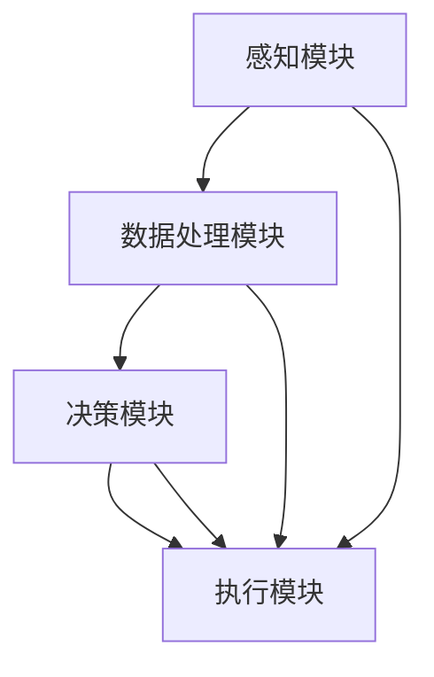

                 

# 《AI Agent: AI的下一个风口 具身机器人在工业领域的应用》

## 关键词
- AI Agent
- 具身机器人
- 工业应用
- 制造业
- 物流
- 农业
- 医疗与健康
- 挑战与未来

## 摘要
随着人工智能技术的不断进步，具身机器人作为AI的一个重要分支，正逐步在工业领域崭露头角。本文将深入探讨具身机器人的基本概念、核心架构以及在制造业、物流、农业、医疗等领域的具体应用，分析其面临的挑战与未来发展趋势。通过本文的阅读，读者将全面了解具身机器人在工业领域的重要价值及其潜在影响力。

### 第一部分：AI与具身机器人的基本概念

#### 第1章：AI与具身机器人的概述

##### 1.1 AI技术的发展与现状
人工智能（AI）技术起源于20世纪50年代，经历了多个发展阶段。从早期的符号主义、基于规则的系统，到20世纪80年代的中兴期，再到21世纪初的基于数据的机器学习方法，AI技术逐渐走向成熟。如今，AI已经在图像识别、自然语言处理、语音识别等领域取得了显著的成果，并在金融、医疗、制造等多个行业产生了深远的影响。

##### 1.2 具身机器人的定义与特点
具身机器人是指具有物理实体、能够自主运动并具备感知与执行能力的机器人。与传统的工业机器人不同，具身机器人不仅能够执行预先设定的任务，还能够通过感知环境、学习与适应，实现更为复杂和灵活的作业。其特点包括：
- **感知能力**：具备多种传感器，如摄像头、激光雷达、超声波传感器等，能够感知外部环境。
- **运动能力**：具备自主运动的能力，可以通过轮式、履带式、腿式等多种方式移动。
- **学习能力**：通过机器学习和深度学习技术，能够从数据中学习和优化自己的行为。
- **执行能力**：具备执行复杂任务的能力，如抓取、装配、焊接等。

##### 1.3 AI与具身机器人的融合趋势
随着AI技术的不断发展，AI与具身机器人的融合趋势愈发明显。AI技术为具身机器人提供了强大的感知、决策和执行能力，而具身机器人则为AI技术提供了实践的平台和验证的机会。这种融合趋势在以下几个方面得到了体现：
- **自主化**：具身机器人通过AI技术实现更高的自主化水平，能够自动完成复杂的任务。
- **智能化**：AI技术使得具身机器人具备更高级的智能水平，能够通过学习与环境互动，不断优化自身行为。
- **协作化**：AI与具身机器人的融合，使得机器人能够在复杂的工作环境中与人类和其他机器人进行有效协作。

### 第二部分：具身机器人在工业领域的应用

#### 第2章：具身机器人的核心架构

##### 2.1 传感器与执行器的技术原理
传感器与执行器是具身机器人的重要组成部分，它们决定了机器人的感知和执行能力。传感器主要包括以下几类：
- **视觉传感器**：如摄像头，用于获取图像和视频信息。
- **激光雷达**：用于获取三维空间信息。
- **超声波传感器**：用于测量距离和障碍物。
- **力传感器**：用于检测机器人与物体之间的接触力。

执行器则包括电机、液压缸、气动缸等，用于驱动机器人的运动和执行任务。电机驱动器通过控制电机的转速和方向，实现机器人的运动；液压缸和气动缸则通过控制压力和流量，实现机器人的力和运动控制。

##### 2.2 控制系统与决策模型
控制系统是具身机器人的核心，它决定了机器人如何感知环境、如何决策和如何执行任务。控制系统通常包括以下几个部分：
- **感知模块**：收集传感器数据，如视觉、激光雷达、超声波等。
- **数据处理模块**：对感知数据进行预处理、特征提取和融合，形成统一的感知输入。
- **决策模块**：根据感知输入和预定的任务目标，生成具体的执行策略。
- **执行模块**：根据决策结果，驱动执行器执行具体的动作。

决策模型是控制系统的重要组成部分，它决定了机器人如何根据环境信息做出最优的决策。常见的决策模型包括基于规则的决策模型、基于行为的决策模型和基于机器学习的决策模型。

##### 2.3 Mermaid流程图：具身机器人的核心架构


### 第三部分：具身机器人在工业领域的应用

#### 第3章：具身机器人在制造业中的应用

##### 3.1 制造业中的AI与机器人应用
制造业一直是AI和机器人技术的重要应用领域。随着工业4.0和智能制造的兴起，AI和机器人技术正加速在制造业中的应用，推动制造业的智能化和自动化水平。AI技术在制造业中的应用主要包括以下几个方面：
- **生产规划与调度**：通过AI技术优化生产计划，提高生产效率。
- **质量控制**：利用AI技术实现生产过程中的实时质量检测和故障诊断。
- **设备维护**：通过AI技术预测设备故障，实现预防性维护。
- **供应链管理**：利用AI技术优化供应链管理，降低库存成本和提高响应速度。

机器人技术在制造业中的应用也非常广泛，包括：
- **装配与加工**：机器人可以替代人类完成高精度、重复性强的装配和加工任务。
- **搬运与运输**：机器人可以自动完成物料的搬运和运输任务，提高生产线的效率。
- **检测与监测**：机器人可以自动完成产品的质量检测和生产线的状态监测。

##### 3.2 具身机器人在生产线上的应用场景
具身机器人在制造业中的应用场景非常丰富，以下是一些典型的应用场景：
- **装配作业**：具身机器人可以完成各种装配任务，如汽车零部件的装配、电子产品的组装等。
- **加工作业**：具身机器人可以完成各种加工任务，如金属切割、焊接、喷涂等。
- **搬运作业**：具身机器人可以自动完成物料的搬运和运输任务，如仓库内的物料搬运、生产线上的物料配送等。
- **检测作业**：具身机器人可以自动完成产品的质量检测，如尺寸检测、缺陷检测等。

##### 3.3 实战案例：某汽车制造厂的具身机器人应用
某汽车制造厂引入了一款具有感知、决策和执行能力的具身机器人，用于生产线上的装配作业。该机器人配备了高精度摄像头、激光雷达和力传感器，能够实时感知工件的位置、形状和姿态。通过机器学习和深度学习技术，机器人能够自主识别工件，并规划最优的装配路径。在实际应用中，机器人能够准确地将零部件装配到汽车发动机上，大大提高了装配效率和精度。

### 第四部分：具身机器人在其他领域的应用

#### 第4章：具身机器人在物流与仓储中的应用

##### 4.1 物流与仓储行业的AI应用现状
物流与仓储行业是AI技术的重要应用领域之一。随着电商行业的快速发展，物流与仓储行业的效率和质量要求日益提高，AI技术在这两个领域的应用越来越广泛。AI技术在物流与仓储行业中的应用主要包括以下几个方面：
- **路径优化**：通过AI技术优化配送路径，降低运输成本和提高配送效率。
- **库存管理**：利用AI技术实现库存的自动管理和优化，降低库存成本和提高库存周转率。
- **异常检测**：通过AI技术实时监测物流与仓储过程中的异常情况，如货物丢失、损坏等。
- **自动化作业**：利用AI技术实现物流与仓储作业的自动化，提高作业效率和质量。

##### 4.2 具身机器人在物流与仓储中的应用
具身机器人在物流与仓储中的应用场景非常丰富，以下是一些典型的应用场景：
- **货物搬运**：具身机器人可以自动完成仓库内的货物搬运任务，如从货架到配送区的搬运等。
- **货物分类**：具身机器人可以通过视觉识别技术，自动将货物分类到不同的存储位置。
- **货物配送**：具身机器人可以自动完成配送任务，如从仓库到配送站的配送等。
- **自动化仓储**：具身机器人可以与自动化仓储系统相结合，实现整个仓储过程的自动化。

##### 4.3 实战案例：某电商企业的物流机器人应用
某电商企业引入了一款具有感知、决策和执行能力的具身机器人，用于物流中心的货物搬运和配送任务。该机器人配备了高精度摄像头、激光雷达和力传感器，能够实时感知货物和周围环境。通过机器学习和深度学习技术，机器人能够自主识别货物，规划最优的搬运和配送路径。在实际应用中，机器人能够高效地完成货物搬运和配送任务，大大提高了物流中心的作业效率。

### 第五部分：具身机器人在其他领域的应用

#### 第5章：具身机器人在农业中的应用

##### 5.1 农业中的AI应用现状
农业是AI技术的重要应用领域之一。随着全球人口的增加和对粮食需求的不断增长，农业的智能化和自动化水平变得尤为重要。AI技术在农业中的应用主要包括以下几个方面：
- **精准农业**：通过AI技术实现农田的精准管理和作物监测，提高农业产量和降低生产成本。
- **病虫害监测**：利用AI技术实时监测农田中的病虫害情况，实现精准的病虫害防治。
- **土壤监测**：通过AI技术监测土壤质量，实现土壤的精准管理和优化。
- **农产品分类与包装**：利用AI技术实现农产品的自动分类和包装，提高农产品的质量和附加值。

##### 5.2 具身机器人在农业中的应用
具身机器人在农业中的应用场景非常广泛，以下是一些典型的应用场景：
- **植保作业**：具身机器人可以自动完成农田的植保任务，如喷洒农药、灌溉等。
- **采摘作业**：具身机器人可以自动完成农作物的采摘任务，如水果、蔬菜等。
- **搬运作业**：具身机器人可以自动完成农产品的搬运任务，如从农田到仓库的搬运等。
- **检测作业**：具身机器人可以自动完成农产品的质量检测任务，如检测农产品是否成熟、是否变质等。

##### 5.3 实战案例：某农业科技公司的智能农业机器人
某农业科技公司引入了一款具有感知、决策和执行能力的具身机器人，用于农田的植保和采摘作业。该机器人配备了高精度摄像头、激光雷达和力传感器，能够实时感知农田和农作物的情况。通过机器学习和深度学习技术，机器人能够自主识别农作物和病虫害，规划最优的植保和采摘路径。在实际应用中，机器人能够高效地完成农田的植保和采摘任务，大大提高了农业的效率和产量。

### 第六部分：具身机器人在医疗与健康领域的应用

#### 第6章：具身机器人在医疗与健康领域的应用

##### 6.1 医疗与健康领域的AI应用现状
医疗与健康领域是AI技术的重要应用领域之一。随着医疗技术的不断进步和人口老龄化趋势的加剧，医疗与健康领域的智能化和自动化水平变得尤为重要。AI技术在医疗与健康领域中的应用主要包括以下几个方面：
- **医学影像分析**：利用AI技术实现医学影像的自动分析，提高诊断准确率和效率。
- **疾病预测与诊断**：通过AI技术对患者的健康数据进行分析，实现疾病的早期预测和诊断。
- **智能药物设计**：利用AI技术加速药物的研发和设计过程，提高新药的成功率。
- **健康管理**：通过AI技术实现患者的健康管理，如监测患者健康状况、提供个性化的健康建议等。

##### 6.2 具身机器人在医疗与健康领域的应用
具身机器人在医疗与健康领域中的应用场景非常广泛，以下是一些典型的应用场景：
- **手术辅助**：具身机器人可以辅助医生进行手术，提高手术的准确性和效率。
- **康复训练**：具身机器人可以辅助患者进行康复训练，提高康复效果。
- **护理服务**：具身机器人可以提供护理服务，如帮助患者翻身、提供医疗护理等。
- **健康监测**：具身机器人可以实时监测患者的健康状况，如心率、血压等生理指标。

##### 6.3 实战案例：某医疗机构的康复机器人应用
某医疗机构引入了一款具有感知、决策和执行能力的具身康复机器人，用于患者的康复训练。该机器人配备了高精度传感器和智能控制系统，能够实时感知患者的动作和生理状况。通过机器学习和深度学习技术，机器人能够根据患者的康复进度和需求，提供个性化的康复训练方案。在实际应用中，康复机器人能够高效地完成康复训练任务，帮助患者更快地恢复健康。

### 第七部分：具身机器人在工业领域的挑战与未来

#### 第7章：具身机器人在工业领域的挑战

##### 7.1 技术挑战
具身机器人在工业领域的发展面临着一系列技术挑战，包括：
- **感知与认知能力**：如何提高机器人的感知和认知能力，使其能够更好地理解和适应复杂的生产环境。
- **精确控制与执行能力**：如何实现机器人的精确控制和执行，确保其能够执行高精度的生产任务。
- **自适应与学习能力**：如何使机器人具备自适应和学习能力，能够根据环境变化和任务需求进行自我调整和优化。
- **人机协作**：如何确保机器人与人类工人能够安全、高效地协作，避免事故和冲突。

##### 7.2 安全与伦理挑战
随着具身机器人在工业领域的应用日益广泛，其安全与伦理问题也日益突出，包括：
- **安全性**：如何确保机器人在执行任务时的安全性，避免对人类工人和设备造成伤害。
- **伦理问题**：如何处理机器人与人类之间的伦理关系，确保机器人不会侵犯人类的权利和尊严。
- **隐私保护**：如何保护机器人在执行任务时收集和处理的数据，避免数据泄露和滥用。

##### 7.3 政策与法规挑战
具身机器人在工业领域的应用还面临着政策与法规的挑战，包括：
- **监管制度**：如何建立完善的监管制度，确保机器人的应用符合法律法规要求。
- **认证与标准**：如何制定统一的认证标准和规范，确保机器人的质量和可靠性。
- **责任归属**：如何明确机器人在执行任务时发生事故的责任归属，保障各方权益。

#### 第8章：具身机器人的未来发展

##### 8.1 技术发展趋势
未来，具身机器人在工业领域的发展将呈现以下趋势：
- **智能化与自主化**：机器人将具备更高的智能化和自主化水平，能够自主完成复杂的任务。
- **协同化**：机器人将更加注重与人类和其他机器人的协同作业，实现高效、安全的生产流程。
- **柔性化**：机器人将具备更强的适应性，能够根据不同的任务需求和环境变化进行自我调整。
- **网络化**：机器人将实现网络化连接，通过大数据和云计算实现资源的共享和优化。

##### 8.2 应用前景
具身机器人在工业领域的应用前景广阔，未来将可能在以下几个方面实现突破：
- **制造业**：提高生产效率和质量，降低生产成本。
- **物流与仓储**：实现全自动化物流和仓储系统，提高物流效率。
- **农业**：实现智能化种植和养殖，提高农业产量和质量。
- **医疗与健康**：提高医疗服务质量，减轻医护人员的工作负担。

##### 8.3 未来挑战与展望
尽管具身机器人在工业领域的发展前景广阔，但仍然面临着一系列挑战，包括技术、安全、伦理和政策法规等方面。未来，需要从以下几个方面进行研究和探索：
- **技术创新**：加强机器人感知、决策和执行能力的研究，提高机器人的智能化水平。
- **安全与伦理**：建立完善的安全与伦理规范，确保机器人的应用不会对人类和社会造成负面影响。
- **政策法规**：完善政策法规体系，为机器人的发展提供良好的法律环境。

### 附录

#### 附录A：具身机器人开发工具与资源

##### 8.1 主流开发工具对比
- **ROS（Robot Operating System）**：ROS是一个开源的机器人操作系统，提供了一系列的工具和库，用于机器人的感知、决策和执行。优点是社区支持强、资源丰富，缺点是安装配置复杂。
- **MATLAB**：MATLAB是一款强大的数值计算和可视化工具，提供了丰富的机器学习和控制系统库。优点是易于使用、计算效率高，缺点是商业软件，成本较高。
- **Python**：Python是一种通用编程语言，广泛应用于机器人和人工智能开发。优点是简洁易学、库资源丰富，缺点是计算效率相对较低。

##### 8.2 开发环境搭建指南
1. 安装ROS：
   ```bash
   sudo apt-get update
   sudo apt-get install ros-$ROS_DISTRO
   ```
2. 安装Python库：
   ```bash
   pip install rospy numpy scipy matplotlib
   ```

##### 8.3 具身机器人开源项目介绍
- **Robot Operating System（ROS）**：ROS是一个开源的机器人操作系统，提供了一系列的工具和库，用于机器人的感知、决策和执行。
- **OpenCV**：OpenCV是一个开源的计算机视觉库，提供了丰富的图像处理和机器学习功能。
- **PyTorch**：PyTorch是一个开源的深度学习库，提供了灵活的深度学习模型构建和训练工具。

### 核心算法原理讲解

#### 8.4 控制系统与决策模型算法

**伪代码**：

```python
function control_and_decision_agent(data):
    // 数据预处理
    preprocessed_data = preprocess(data)

    // 控制策略
    control_strategy = control_strategy_selection(preprocessed_data)

    // 决策模型
    decision = decision_model(control_strategy)

    // 执行决策
    execute_decision(decision)

    return decision
```

**详细讲解**：
- **数据预处理**：对收集到的传感器数据进行预处理，如去噪、归一化等，确保数据质量。
- **控制策略**：根据预处理后的数据，选择合适的控制策略，如PID控制、神经网络控制等。
- **决策模型**：基于控制策略，利用机器学习算法（如决策树、支持向量机、神经网络等）进行决策。
- **执行决策**：根据决策结果，驱动执行器执行具体的动作。

#### 8.5 机器学习中的数学模型

**数学公式**：

$$
\text{损失函数} = \frac{1}{2} \sum_{i=1}^{N} (\hat{y}_i - y_i)^2
$$

**详细讲解**：
- **损失函数**：用于衡量预测值 $\hat{y}_i$ 与真实值 $y_i$ 之间的差异，其中 $N$ 为数据点的数量。
- **平方误差**：通过计算预测值与真实值之间的平方误差，衡量模型的预测准确性。
- **优化目标**：通过优化损失函数，调整模型的参数，使得预测结果更接近真实值。

**举例说明**：
假设我们有一个训练数据集，包含5个样本点，每个样本点的真实值为 $y_1, y_2, y_3, y_4, y_5$，对应的预测值为 $\hat{y}_1, \hat{y}_2, \hat{y}_3, \hat{y}_4, \hat{y}_5$。则损失函数计算如下：

$$
\text{损失函数} = \frac{1}{2} \left( (\hat{y}_1 - y_1)^2 + (\hat{y}_2 - y_2)^2 + (\hat{y}_3 - y_3)^2 + (\hat{y}_4 - y_4)^2 + (\hat{y}_5 - y_5)^2 \right)
$$

#### 8.6 实战案例：智能仓库拣选机器人

**开发环境搭建**：
- 安装ROS：在Ubuntu系统下，使用以下命令安装ROS：

  ```bash
  sudo apt-get update
  sudo apt-get install ros-melodic-desktop-full
  ```

- 安装Python库：使用以下命令安装所需的Python库：

  ```bash
  pip install rospy numpy scipy matplotlib
  ```

**源代码详细实现和代码解读**：

```python
#!/usr/bin/env python

import rospy
from std_msgs.msg import String
from geometry_msgs.msg import PoseStamped

class PickAndPlaceRobot:
    def __init__(self):
        rospy.init_node('pick_and_place_robot', anonymous=True)
        self.rate = rospy.Rate(10) # 10 Hz

        # Publisher
        self.pose_pub = rospy.Publisher('robot_pose', PoseStamped, queue_size=10)

    def publish_pose(self, pose):
        self.pose_pub.publish(pose)

    def run(self):
        while not rospy.is_shutdown():
            # Get current robot pose
            current_pose = self.get_current_pose()

            # Calculate target pose
            target_pose = self.calculate_target_pose(current_pose)

            # Publish target pose
            self.publish_pose(target_pose)

            self.rate.sleep()

if __name__ == '__main__':
    robot = PickAndPlaceRobot()
    robot.run()
```

**代码解读与分析**：
- **导入模块**：导入rospy、String和PoseStamped模块，用于与ROS进行通信。
- **定义类**：定义PickAndPlaceRobot类，用于实现智能仓库拣选机器人的核心功能。
- **初始化**：在__init__方法中，初始化节点名称、发布频率、发布器等。
- **发布位姿**：在publish_pose方法中，发布目标位姿给控制系统。
- **运行循环**：在run方法中，实现机器人运行的主要循环。循环中，首先获取当前机器人的位姿，然后计算目标位姿，最后发布目标位姿。

通过以上代码，实现了智能仓库拣选机器人的基本功能，包括获取当前位姿、计算目标位姿和发布目标位姿。在实际应用中，需要根据具体的任务需求，实现更复杂的位姿计算和路径规划功能。

### 作者

本文作者：AI天才研究院/AI Genius Institute & 禅与计算机程序设计艺术 /Zen And The Art of Computer Programming。

[返回目录](#文章标题)

