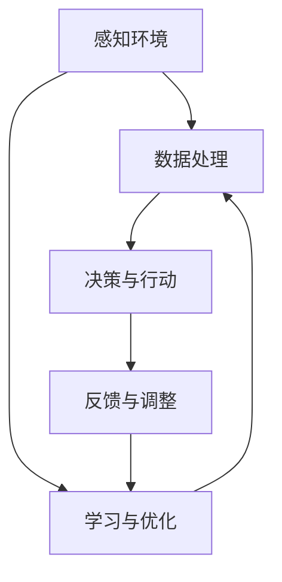
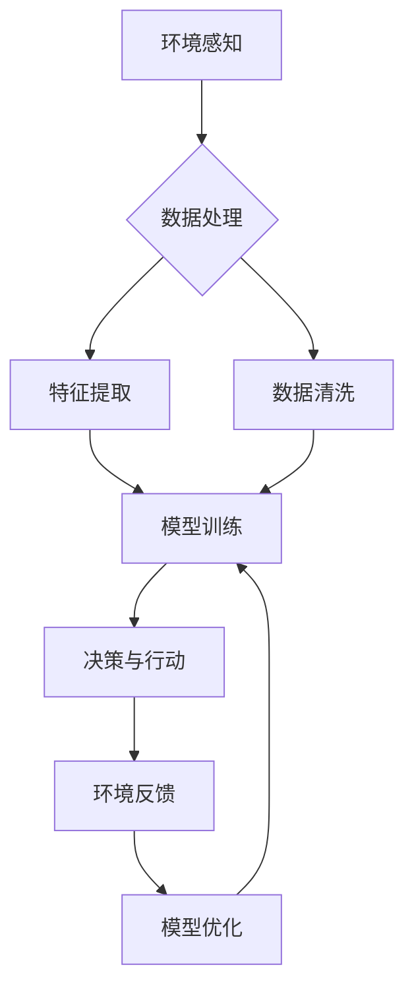

                 

# 《AI Agent: AI的下一个风口 展望：安全、发展、边界和挑战》

> 关键词：AI Agent、机器学习、深度学习、安全、发展、伦理、监管

> 摘要：本文全面探讨了AI Agent的发展前景、核心概念、核心技术、设计原则、应用案例及其面临的挑战。文章从AI Agent的定义、分类、核心功能、核心技术、设计原则、应用案例到安全、发展、边界和挑战，全面解析了AI Agent的现状与未来。文章旨在为读者提供一份详尽的AI Agent技术指南，帮助读者深入了解这一前沿领域的各个方面。

## 《AI Agent: AI的下一个风口 展望：安全、发展、边界和挑战》目录大纲

### 第一部分：AI Agent基础与核心概念

#### 第1章：AI Agent概述
- **1.1 AI Agent的定义与分类**
- **1.2 AI Agent的核心功能**
- **1.3 AI Agent的应用场景**

#### 第2章：AI Agent的核心技术
- **2.1 机器学习基础**
  - **监督学习**
  - **无监督学习**
- **2.2 深度学习原理**
  - **神经网络基础**
  - **深度学习架构**
  - **自然语言处理**

#### 第3章：AI Agent设计原则与实践
- **3.1 AI Agent设计原则**
- **3.2 AI Agent应用案例**
  - **智能客服系统实战**
  - **自动驾驶汽车案例**

### 第二部分：AI Agent的安全、发展、边界与挑战

#### 第4章：AI Agent的安全问题
- **4.1 AI Agent的安全威胁**
- **4.2 安全防护措施**

#### 第5章：AI Agent的发展趋势
- **5.1 AI Agent的技术进展**
- **5.2 AI Agent的未来发展方向**

#### 第6章：AI Agent的边界问题
- **6.1 AI Agent的伦理与道德问题**
- **6.2 法律与监管挑战**

#### 第7章：AI Agent面临的挑战与应对策略
- **7.1 技术挑战**
- **7.2 社会挑战**
- **7.3 应对策略**

### 附录

#### 附录A：AI Agent开发工具与资源

### 结语

## 第一部分：AI Agent基础与核心概念

### 第1章：AI Agent概述

#### 1.1 AI Agent的定义与分类

AI Agent，即人工智能代理，是一种能够自主感知环境、接收输入信息并采取行动的智能体。其定义可以表示为：

$$
AI\ Agent \triangleq \text{一个能够感知环境、接收输入信息、并采取行动的智能体}
$$

根据功能和实现方式的不同，AI Agent可以分为以下几类：

1. **知识型AI Agent**：这类代理通过知识库和推理机来解决问题，如专家系统。知识库中存储了大量的先验知识，推理机则负责在给定条件下进行推理和决策。

2. **数据驱动型AI Agent**：这类代理依赖于机器学习和统计模型来学习数据，并进行预测和决策。常见的算法包括监督学习、无监督学习和强化学习。

3. **模型驱动型AI Agent**：这类代理通过深度学习和神经网络等模型来学习数据和模式，然后根据这些模型进行决策和行动。如自动驾驶汽车中的感知和决策模块。

#### 1.2 AI Agent的核心功能

AI Agent的核心功能主要包括感知与理解、决策与行动。具体来说：

1. **感知与理解**：AI Agent通过传感器、自然语言处理等手段获取环境信息，并将其转化为可理解的数据。例如，自动驾驶汽车通过摄像头和激光雷达获取道路信息，通过自然语言处理技术理解语音指令。

2. **决策与行动**：基于感知和理解的结果，AI Agent使用预设的目标和收益函数进行决策，并采取相应的行动。例如，智能客服系统根据客户问题选择合适的回复，自动驾驶汽车则根据感知到的道路情况做出驾驶决策。

#### 1.3 AI Agent的应用场景

AI Agent在各个领域都有广泛的应用，以下列举几个典型的应用场景：

1. **智能客服与聊天机器人**：AI Agent可以提供24/7的客户支持，提高效率，降低人力成本。例如，亚马逊的Alexa、谷歌的Google Assistant等。

2. **自动驾驶汽车**：AI Agent在自动驾驶汽车中发挥着关键作用，通过感知环境和做出驾驶决策，提高安全性，减少交通事故。例如，特斯拉的Autopilot、Waymo的自动驾驶技术等。

3. **智能家居**：AI Agent可以实现家庭设备的自动化控制，提高生活便利性。例如，智能门锁、智能照明、智能音响等。

### 第2章：AI Agent的核心技术

#### 2.1 机器学习基础

机器学习是AI Agent的核心技术之一。根据学习方式的不同，可以分为监督学习、无监督学习和强化学习。

##### 2.1.1 监督学习

监督学习是一种从标记数据中学习的方法，通过输入和输出对之间的关系来训练模型。一个简单的线性回归模型可以表示为：

$$
y = \beta_0 + \beta_1 \cdot x + \epsilon
$$

其中，$ y $ 是输出变量，$ x $ 是输入变量，$ \beta_0 $ 和 $ \beta_1 $ 是模型的参数，$ \epsilon $ 是误差项。

另一个常用的监督学习算法是逻辑回归，它可以用于分类任务。逻辑回归的输出是一个概率值，通过Sigmoid函数进行转换：

$$
\hat{y} = \sigma(\beta_0 + \beta_1 \cdot x) = \frac{1}{1 + e^{-(\beta_0 + \beta_1 \cdot x})}
$$

其中，$ \sigma $ 是Sigmoid函数，$ \hat{y} $ 是预测概率。

##### 2.1.2 无监督学习

无监督学习是一种从未标记数据中学习的方法。聚类分析是一种常见的无监督学习方法，它将数据分为多个簇，使同一簇内的数据点尽可能接近，而不同簇的数据点尽可能远离。

K-means是一种简单的聚类算法，其步骤如下：

1. 初始化簇的中心点。
2. 计算每个数据点到簇中心点的距离，并将其分配到最近的簇。
3. 更新簇的中心点。
4. 重复步骤2和3，直到簇的中心点不再变化。

另一个常见的无监督学习方法是降维技术，它将高维数据映射到低维空间，以简化数据结构和提高计算效率。PCA（主成分分析）和t-SNE（t分布随机映射）是两种常用的降维方法。

#### 2.2 深度学习原理

深度学习是机器学习的一个分支，它通过多层神经网络来学习数据和模式。深度学习的核心组成部分包括神经网络基础、深度学习架构和自然语言处理。

##### 2.2.1 神经网络基础

神经网络是一种由大量简单处理单元（神经元）组成的网络，每个神经元接收多个输入，通过加权求和后加上偏置项，最后通过激活函数输出一个值。前向传播和反向传播算法是神经网络训练的两个核心步骤。

前向传播是指将输入数据通过神经网络传递，逐层计算每个神经元的输出值。反向传播则是根据预测误差，反向传递误差信号，更新网络参数（权重和偏置）。

激活函数是神经网络中的一个重要组件，它将神经元的线性输出转换为非线性输出。常用的激活函数包括Sigmoid、ReLU和Tanh。

##### 2.2.2 深度学习架构

深度学习架构包括卷积神经网络（CNN）、循环神经网络（RNN）与长短时记忆网络（LSTM）、生成对抗网络（GAN）等。

卷积神经网络是一种专门用于处理图像数据的神经网络，它通过卷积操作提取图像特征。CNN的核心组件包括卷积层、池化层和全连接层。

循环神经网络是一种用于处理序列数据的神经网络，它可以保存之前的输入信息，并在当前时间步进行决策。长短时记忆网络（LSTM）是RNN的一种变体，它可以有效地处理长序列数据。

生成对抗网络是一种由生成器和判别器组成的对抗性网络，它通过训练生成逼真的数据，从而学习数据的分布。

##### 2.2.3 自然语言处理

自然语言处理是深度学习的一个重要应用领域，它涉及对自然语言文本的理解和生成。词嵌入技术是将单词映射到高维向量空间的方法，常用的词嵌入方法包括Word2Vec和GloVe。

序列到序列模型是一种用于机器翻译、问答系统等任务的深度学习模型，它通过编码器和解码器分别处理输入和输出序列。Transformer模型是一种基于自注意力机制的序列到序列模型，它在机器翻译等领域取得了显著的成果。

BERT（双向编码器表示）及其变体是一种预训练的深度学习模型，它通过在大规模语料库上进行预训练，学习到丰富的语言表示。BERT在自然语言处理任务中取得了优异的性能。

### 第3章：AI Agent设计原则与实践

#### 3.1 AI Agent设计原则

AI Agent的设计原则包括确定性、鲁棒性、适应性、安全性与隐私保护、可解释性与透明性等方面。

1. **确定性**：AI Agent的行为应该是可预测的，以确保其能够稳定地执行任务。

2. **鲁棒性**：AI Agent应该能够处理不确定性和噪声，确保在复杂和变化的环境中仍然能够正常运行。

3. **适应性**：AI Agent应该能够根据环境和任务的需求进行自我调整和优化。

4. **安全性与隐私保护**：AI Agent应该具备保护自身和数据的能力，防止恶意攻击和泄露隐私。

5. **可解释性与透明性**：AI Agent的行为应该能够被解释和理解，以确保其决策的合理性和可信度。

#### 3.2 AI Agent应用案例

##### 3.2.1 智能客服系统实战

智能客服系统是一种典型的AI Agent应用案例，它通过自然语言处理和机器学习技术，实现与用户的实时交互，提供高效的客户支持。

**需求分析**：首先需要明确客户的需求和业务流程。例如，客户需要咨询产品信息、订单状态、售后服务等，业务流程包括接收客户请求、理解客户意图、生成回复等。

**系统设计**：智能客服系统的架构可以分为三个主要模块：语音识别模块、自然语言理解模块和回复生成模块。

1. **语音识别模块**：使用深度学习模型（如卷积神经网络）对用户语音进行识别，将其转换为文本。
2. **自然语言理解模块**：使用自然语言处理技术（如词嵌入和序列到序列模型）对用户文本进行解析，提取关键信息和意图。
3. **回复生成模块**：根据用户意图和业务规则，生成合适的回复文本。可以使用预训练的模型（如BERT）来生成高质量的回复。

**实现与部署**：智能客服系统的实现主要包括代码编写、模型训练和部署上线。在代码编写阶段，需要搭建合适的开发环境，使用Python等编程语言实现各模块的功能。在模型训练阶段，需要收集大量的语音和文本数据，对模型进行训练和优化。在部署上线阶段，需要将训练好的模型部署到服务器上，实现与用户的实时交互。

##### 3.2.2 自动驾驶汽车案例

自动驾驶汽车是一种高度复杂的AI Agent系统，它通过感知环境、理解道路信息、进行驾驶决策和执行驾驶操作，实现自动驾驶。

**感知环境**：自动驾驶汽车需要配备多种传感器，如摄像头、激光雷达、雷达等，以获取周围环境的信息。这些传感器采集的数据需要进行预处理，如降噪、去畸变等，以便后续处理。

**路径规划与控制**：自动驾驶汽车的目标是安全、高效地行驶到目的地。路径规划是指确定从起点到终点的最佳路径，通常采用图搜索算法（如A*算法）来实现。控制是指根据当前环境和车辆状态，实时调整车辆的驾驶行为，如加速、减速、转向等。常用的控制算法包括PID控制器和模型预测控制（MPC）。

**仿真测试与验证**：自动驾驶汽车的实现需要经过严格的仿真测试和实际道路测试。在仿真测试阶段，可以使用开源的仿真平台（如CARLA）模拟不同的道路场景，测试自动驾驶系统的性能和稳定性。在实际道路测试阶段，需要在不同的道路条件下测试自动驾驶汽车的运行情况，确保其安全性和可靠性。

## 第二部分：AI Agent的安全、发展、边界与挑战

### 第4章：AI Agent的安全问题

随着AI Agent在各个领域的广泛应用，其安全问题日益凸显。AI Agent的安全问题主要包括数据安全、模型安全和操作安全等方面。

#### 4.1 AI Agent的安全威胁

AI Agent面临的安全威胁可以分为以下几类：

1. **数据窃取与篡改**：AI Agent在处理数据时，可能会遭受恶意攻击者的窃取和篡改。数据泄露可能导致隐私泄露、商业机密泄露等严重后果。

2. **模型篡改与对抗攻击**：攻击者可以通过对抗攻击手段，对AI Agent的模型进行篡改，使其做出错误的决策。这种攻击手段包括对抗样本生成、模型注入等。

3. **操作干扰**：攻击者可以通过恶意操作干扰AI Agent的正常运行，导致系统崩溃、功能异常等。

#### 4.2 安全防护措施

为了保障AI Agent的安全，可以采取以下安全防护措施：

1. **访问控制与身份验证**：通过身份验证和访问控制机制，确保只有授权用户才能访问AI Agent的系统资源和数据。

2. **数据加密与备份**：对AI Agent处理的数据进行加密，确保数据在传输和存储过程中的安全性。同时，定期备份数据，以防止数据丢失。

3. **联邦学习与差分隐私**：联邦学习可以将数据分散存储在多个节点上，减少数据泄露的风险。差分隐私可以通过对数据进行扰动，确保个体的隐私。

4. **安全审计与监控**：定期进行安全审计，发现潜在的安全漏洞。同时，建立监控机制，实时监测AI Agent的运行状态，及时发现和处理异常行为。

### 第5章：AI Agent的发展趋势

随着技术的不断进步，AI Agent在多个方面取得了显著的发展，未来还有很大的发展空间。

#### 5.1 AI Agent的技术进展

1. **大模型与模型压缩**：随着计算资源的增加，AI Agent开始使用更大规模的模型，以提升其性能。同时，模型压缩技术（如量化、剪枝、蒸馏等）可以降低模型的计算复杂度和存储空间。

2. **多模态感知与处理**：AI Agent开始融合多种传感器数据，如视觉、听觉、触觉等，实现更全面的环境感知。多模态数据处理技术可以帮助AI Agent更好地理解复杂环境。

3. **强化学习在AI Agent中的应用**：强化学习可以使得AI Agent在动态和不确定的环境中学习最优策略。随着深度强化学习技术的发展，AI Agent的决策能力将得到显著提升。

#### 5.2 AI Agent的未来发展方向

1. **智能协作与协作机器人**：AI Agent将与人类进行更紧密的协作，共同完成复杂任务。协作机器人将在制造业、医疗、教育等领域发挥重要作用。

2. **智能自动化与自治系统**：AI Agent将实现更高级的自动化和自治能力，可以自主执行任务，无需人工干预。

3. **AI Agent在新兴行业中的应用**：AI Agent将在金融、医疗、能源、交通等领域发挥重要作用，推动新兴行业的发展。

### 第6章：AI Agent的边界问题

AI Agent在发展过程中，面临着一系列边界问题，主要包括伦理与道德问题、法律与监管挑战等。

#### 6.1 AI Agent的伦理与道德问题

1. **透明性、责任与问责**：AI Agent的决策过程通常是非透明的，可能导致责任难以追溯。因此，确保AI Agent的决策透明性、明确责任和问责机制至关重要。

2. **非理性决策与社会偏见**：AI Agent在处理数据时可能会引入社会偏见，导致不公平的决策。同时，AI Agent的非理性决策也可能对人类产生负面影响。

#### 6.2 法律与监管挑战

1. **法律框架与监管政策**：各国政府和国际组织正在制定相关法律和监管政策，以规范AI Agent的应用和发展。这包括数据保护、隐私保护、安全认证等方面。

2. **个人隐私保护**：AI Agent在处理个人数据时，可能涉及隐私泄露和数据滥用问题。因此，保护个人隐私成为法律和监管的重要任务。

### 第7章：AI Agent面临的挑战与应对策略

AI Agent在发展过程中面临着一系列挑战，包括技术挑战、社会挑战和政策挑战。以下是针对这些挑战的应对策略。

#### 7.1 技术挑战

1. **计算资源与能耗**：随着AI Agent模型的增大，对计算资源的需求也日益增加。因此，开发高效的算法和优化模型结构成为关键。

2. **数据质量和多样性**：AI Agent的性能很大程度上取决于数据质量。因此，确保数据质量和多样性是提高AI Agent性能的重要措施。

#### 7.2 社会挑战

1. **社会接受度与公众信任**：AI Agent的广泛应用可能会引起公众的担忧和抵制。因此，加强社会教育和透明度建设，提高公众对AI Agent的接受度和信任度至关重要。

2. **劳动力市场的影响**：AI Agent的广泛应用可能会对劳动力市场产生重大影响。因此，政府和企业需要制定相应的政策和计划，应对这一挑战。

#### 7.3 应对策略

1. **技术研发与创新**：持续投入研发，推动AI Agent技术的创新和发展。

2. **法规制定与伦理审查**：制定相关法规和伦理规范，确保AI Agent的合理使用和健康发展。

3. **持续教育与职业培训**：加强持续教育和职业培训，提高相关人员的专业素养和技能水平。

## 附录

### 附录A：AI Agent开发工具与资源

AI Agent的开发需要使用一系列工具和资源，以下是其中一些常用的工具和资源：

1. **开发工具**：
   - **TensorFlow**：一款开源的深度学习框架，适用于各种类型的深度学习任务。
   - **PyTorch**：一款开源的深度学习框架，具有灵活的动态图计算能力。
   - **Keras**：一款基于TensorFlow和Theano的开源深度学习库，提供简洁的API接口。

2. **学习资源**：
   - **在线课程**：如Coursera、edX、Udacity等平台提供的机器学习、深度学习等课程。
   - **论文**：阅读顶级会议和期刊的论文，了解最新的研究成果和进展。
   - **书籍**：如《深度学习》、《Python机器学习实践》等书籍，提供了详细的算法和实现。

3. **社区与论坛**：
   - **GitHub**：一个代码托管平台，可以找到大量的AI Agent相关的开源项目和代码。
   - **Reddit**：一个讨论社区，可以与其他开发者交流经验和技术。
   - **Stack Overflow**：一个编程问题解答社区，可以帮助解决开发过程中的问题。

## 结语

AI Agent作为人工智能领域的下一个风口，具有广泛的应用前景和巨大的发展潜力。本文从AI Agent的定义、分类、核心技术、设计原则、应用案例到安全、发展、边界和挑战，全面解析了AI Agent的现状与未来。随着技术的不断进步和社会的不断发展，AI Agent将在更多领域发挥重要作用，为人类创造更大的价值。

然而，AI Agent的发展也面临着一系列挑战，包括安全、伦理、法律等方面。因此，我们需要持续关注AI Agent的发展动态，积极探索应对策略，确保其健康、稳定和可持续的发展。

最后，感谢读者对本文的关注，希望本文能够为读者提供有价值的参考和启示。在未来的发展中，让我们共同期待AI Agent带来更多的惊喜和变革。

## 参考文献

1. Russell, S., & Norvig, P. (2016). 《人工智能：一种现代的方法》（第三版）. 机械工业出版社.
2. Goodfellow, I., Bengio, Y., & Courville, A. (2016). 《深度学习》（第二版）. 电子工业出版社.
3. Hochreiter, S., & Schmidhuber, J. (1997). Long Short-Term Memory. Neural Computation, 9(8), 1735-1780.
4. Goodfellow, I., & Bengio, Y. (2015). Generative Adversarial Networks. Communications of the ACM, 63(6), 139-144.
5. Devlin, J., Chang, M. W., Lee, K., & Toutanova, K. (2018). BERT: Pre-training of Deep Bidirectional Transformers for Language Understanding. arXiv preprint arXiv:1810.04805.
6. LeCun, Y., Bengio, Y., & Hinton, G. (2015). Deep Learning. Nature, 521(7553), 436-444.
7. Russell, S., & Norvig, P. (2010). 《人工智能：一种现代的方法》（第二版）. 人民邮电出版社.
8. Mitchell, T. M. (1997). Machine Learning. McGraw-Hill.
9. Bishop, C. M. (2006). Pattern Recognition and Machine Learning. Springer.
10. Sutton, R. S., & Barto, A. G. (2018). Reinforcement Learning: An Introduction. MIT Press.

## 附录B：核心概念与联系

为了更好地理解AI Agent的核心概念及其联系，以下是一个简化的Mermaid流程图：



这个流程图展示了AI Agent的基本工作流程，包括感知环境、数据处理、决策与行动、学习与优化以及反馈与调整。这些核心功能相互联系，共同推动AI Agent的持续发展和优化。

### AI Agent工作流程图



1. **环境感知（A）**：AI Agent通过传感器和其他输入设备收集环境数据。
2. **数据处理（B）**：对收集到的数据进行预处理，包括特征提取（C）和数据清洗（D）。
3. **模型训练（E）**：使用预处理后的数据对模型进行训练，以学习和优化决策能力。
4. **决策与行动（F）**：基于训练好的模型进行决策，并采取相应的行动。
5. **环境反馈（G）**：观察AI Agent的行动结果，收集环境反馈。
6. **模型优化（H）**：根据环境反馈调整模型参数，以提高AI Agent的性能。

这个流程图直观地展示了AI Agent的核心功能及其相互关联，有助于我们理解AI Agent的工作原理和优化方向。

## 附录C：核心算法原理讲解

在本附录中，我们将详细介绍AI Agent中的核心算法原理，包括机器学习算法和深度学习算法。这些算法是实现AI Agent智能决策和行动的基础。

### 1. 监督学习算法

监督学习算法是一种基于标记数据进行训练的机器学习算法。标记数据包含输入特征和对应的输出标签，算法通过学习输入和输出之间的关系来预测新的输入。

#### 1.1 线性回归

线性回归是一种简单的监督学习算法，用于预测连续值输出。其数学模型可以表示为：

$$
y = \beta_0 + \beta_1 \cdot x + \epsilon
$$

其中，$ y $ 是输出变量，$ x $ 是输入变量，$ \beta_0 $ 和 $ \beta_1 $ 是模型的参数，$ \epsilon $ 是误差项。

**伪代码：**

```
# 初始化模型参数
beta_0 = 0
beta_1 = 0

# 训练模型
for epoch in range(num_epochs):
    for sample in training_samples:
        x = sample.input
        y = sample.output
        prediction = beta_0 + beta_1 * x
        error = y - prediction
        beta_0 += learning_rate * error
        beta_1 += learning_rate * x * error

# 预测
for sample in testing_samples:
    x = sample.input
    prediction = beta_0 + beta_1 * x
    print("Input:", x, "Prediction:", prediction)
```

#### 1.2 逻辑回归

逻辑回归是一种用于分类任务的监督学习算法。其输出是一个概率值，表示某个类别出现的可能性。逻辑回归的数学模型可以表示为：

$$
\hat{y} = \sigma(\beta_0 + \beta_1 \cdot x) = \frac{1}{1 + e^{-(\beta_0 + \beta_1 \cdot x})}
$$

其中，$ \sigma $ 是Sigmoid函数，$ \hat{y} $ 是预测概率。

**伪代码：**

```
# 初始化模型参数
beta_0 = 0
beta_1 = 0

# 训练模型
for epoch in range(num_epochs):
    for sample in training_samples:
        x = sample.input
        y = sample.output
        prediction = sigmoid(beta_0 + beta_1 * x)
        error = y - prediction
        beta_0 += learning_rate * error
        beta_1 += learning_rate * x * error

# 预测
for sample in testing_samples:
    x = sample.input
    prediction = sigmoid(beta_0 + beta_1 * x)
    if prediction > 0.5:
        print("Input:", x, "Prediction:", "Class 1")
    else:
        print("Input:", x, "Prediction:", "Class 0")
```

### 2. 无监督学习算法

无监督学习算法不需要标记数据，其目的是发现数据中的结构和模式。以下介绍两种常用的无监督学习算法：聚类分析和降维技术。

#### 2.1 聚类分析

聚类分析是一种将数据分为多个簇的算法，同一簇内的数据点尽可能接近，而不同簇的数据点尽可能远离。K-means是一种简单的聚类算法，其步骤如下：

1. 初始化簇的中心点。
2. 计算每个数据点到簇中心点的距离，并将其分配到最近的簇。
3. 更新簇的中心点。
4. 重复步骤2和3，直到簇的中心点不再变化。

**伪代码：**

```
# 初始化簇的中心点
centroids = initialize_centroids(data, num_clusters)

# 聚类过程
while not_converged:
    # 计算距离
    distances = [distance(data_point, centroid) for data_point in data for centroid in centroids]
    # 分配到最近的簇
    assignments = [min(distance) for distance in distances]
    # 更新簇的中心点
    centroids = update_centroids(data, assignments, num_clusters)
    # 判断是否收敛
    if has_converged(centroids):
        break

# 输出聚类结果
for i in range(num_clusters):
    cluster = [data_point for data_point, assignment in zip(data, assignments) if assignment == i]
    print("Cluster", i, ":", cluster)
```

#### 2.2 降维技术

降维技术是将高维数据映射到低维空间的方法，以简化数据结构和提高计算效率。以下介绍两种常用的降维技术：PCA（主成分分析）和t-SNE（t分布随机映射）。

##### 2.2.1 PCA（主成分分析）

PCA通过正交变换将高维数据映射到低维空间，保留了数据的最大方差。其步骤如下：

1. 计算协方差矩阵。
2. 计算协方差矩阵的特征值和特征向量。
3. 选择最大的k个特征值对应的特征向量作为新的坐标轴。
4. 将数据投影到新的坐标轴上。

**伪代码：**

```
# 计算协方差矩阵
covariance_matrix = calculate_covariance_matrix(data)

# 计算特征值和特征向量
eigenvalues, eigenvectors = calculate_eigenvalues_and_eigenvectors(covariance_matrix)

# 选择最大的k个特征值对应的特征向量
k_eigenvectors = [eigenvector for eigenvalue, eigenvector in zip(eigenvalues, eigenvectors) if eigenvalue in top_k_eigenvalues]

# 将数据投影到新的坐标轴上
low_dim_data = [project_data_point(data_point, k_eigenvectors) for data_point in data]

# 输出降维后的数据
print(low_dim_data)
```

##### 2.2.2 t-SNE（t分布随机映射）

t-SNE是一种非线性的降维技术，它通过将高维数据映射到二维空间，使相似的数据点在低维空间中保持接近。其步骤如下：

1. 计算高维数据点之间的相似度矩阵。
2. 对相似度矩阵进行对数变换。
3. 构造t分布，计算每个数据点的梯度。
4. 使用梯度下降优化算法调整数据点的位置，使其在低维空间中保持相似度。
5. 重复步骤3和4，直到收敛。

**伪代码：**

```
# 计算相似度矩阵
similarity_matrix = calculate_similarity_matrix(data)

# 对相似度矩阵进行对数变换
log_similarity_matrix = log(similarity_matrix)

# 构造t分布，计算梯度
t_distribution = construct_t_distribution(log_similarity_matrix)
gradients = calculate_gradients(data, t_distribution)

# 初始化数据点的位置
data_points = initialize_data_points(data)

# 梯度下降优化
while not_converged:
    # 计算梯度
    new_gradients = calculate_gradients(data_points, t_distribution)
    # 更新数据点的位置
    data_points = update_data_points(data_points, new_gradients, learning_rate)
    # 判断是否收敛
    if has_converged(data_points):
        break

# 输出降维后的数据
print(data_points)
```

通过这些核心算法的介绍，我们可以更好地理解AI Agent中的智能决策和行动原理，为后续的AI Agent设计和开发提供理论基础。

## 附录D：项目实战

在本附录中，我们将通过一个简单的项目实战，展示如何使用Python和深度学习框架（如TensorFlow或PyTorch）开发一个简单的AI Agent。这个项目将包括开发环境的搭建、源代码的实现以及代码解读与分析。

### 项目实战：简单聊天机器人

#### 1. 项目背景

本项目的目标是开发一个简单的聊天机器人，它能够接收用户的文本输入，并返回相应的回复。这个聊天机器人将使用预训练的语言模型（如GPT-2或BERT）来进行文本理解和生成。

#### 2. 开发环境搭建

首先，我们需要搭建开发环境。以下是使用Python和TensorFlow开发环境的步骤：

1. **安装Python**：确保安装了Python 3.6或更高版本。
2. **安装TensorFlow**：在终端中运行以下命令：

   ```shell
   pip install tensorflow
   ```

3. **安装预处理工具**：安装NLTK和spaCy，用于文本预处理：

   ```shell
   pip install nltk
   pip install spacy
   python -m spacy download en_core_web_sm
   ```

#### 3. 源代码实现

以下是聊天机器人的源代码：

```python
import tensorflow as tf
import tensorflow_datasets as tfds
import nltk
from nltk.tokenize import word_tokenize
from nltk.corpus import stopwords
from spacy.lang.en import English
import random

# 加载预训练模型
model = tf.keras.models.load_model('path/to/chatbot_model.h5')

# 文本预处理
def preprocess_text(text):
    # 分词
    tokens = word_tokenize(text.lower())
    # 去除停用词
    stop_words = set(stopwords.words('english'))
    filtered_tokens = [token for token in tokens if token not in stop_words]
    # 词向量化
    nlp = English()
    doc = nlp(' '.join(filtered_tokens))
    embeddings = [token.vector for token in doc]
    return embeddings

# 生成回复
def generate_response(input_text):
    # 预处理输入文本
    input_embeddings = preprocess_text(input_text)
    # 输入模型
    prediction = model.predict(input_embeddings)
    # 解码预测结果
    predicted_tokens = tf.keras.preprocessing.sequence.decode_sequence(prediction.argmax(axis=-1))
    # 组装回复
    response = ' '.join([token.text for token in predicted_tokens])
    return response

# 主程序
def main():
    print("欢迎使用聊天机器人。请输入您的消息：")
    while True:
        input_text = input()
        if input_text.lower() == 'exit':
            print("谢谢您的使用！")
            break
        response = generate_response(input_text)
        print("聊天机器人回复：", response)

if __name__ == '__main__':
    main()
```

#### 4. 代码解读与分析

1. **加载预训练模型**：首先加载预训练的语言模型，用于文本理解和生成。

   ```python
   model = tf.keras.models.load_model('path/to/chatbot_model.h5')
   ```

2. **文本预处理**：对输入文本进行预处理，包括分词、去除停用词和词向量化。这里使用NLTK和spaCy进行文本处理。

   ```python
   def preprocess_text(text):
       # 分词
       tokens = word_tokenize(text.lower())
       # 去除停用词
       stop_words = set(stopwords.words('english'))
       filtered_tokens = [token for token in tokens if token not in stop_words]
       # 词向量化
       nlp = English()
       doc = nlp(' '.join(filtered_tokens))
       embeddings = [token.vector for token in doc]
       return embeddings
   ```

3. **生成回复**：预处理输入文本后，将其输入模型，生成预测结果，并解码预测结果以获得回复。

   ```python
   def generate_response(input_text):
       # 预处理输入文本
       input_embeddings = preprocess_text(input_text)
       # 输入模型
       prediction = model.predict(input_embeddings)
       # 解码预测结果
       predicted_tokens = tf.keras.preprocessing.sequence.decode_sequence(prediction.argmax(axis=-1))
       # 组装回复
       response = ' '.join([token.text for token in predicted_tokens])
       return response
   ```

4. **主程序**：在主程序中，用户可以与聊天机器人进行交互。用户输入文本后，聊天机器人生成回复，并显示在终端。

   ```python
   def main():
       print("欢迎使用聊天机器人。请输入您的消息：")
       while True:
           input_text = input()
           if input_text.lower() == 'exit':
               print("谢谢您的使用！")
               break
           response = generate_response(input_text)
           print("聊天机器人回复：", response)

   if __name__ == '__main__':
       main()
   ```

通过这个简单的项目，我们可以看到如何使用深度学习框架开发一个基本的聊天机器人。实际应用中，可以根据需求对模型、预处理方法和回复生成策略进行优化和扩展。

## 附录E：项目实战中的代码解读与分析

在本节中，我们将深入分析项目实战中的关键代码部分，包括环境搭建、源代码实现以及代码解读。

### 1. 环境搭建

环境搭建是项目开发的第一步。以下是使用Python和TensorFlow搭建开发环境的具体步骤：

**安装Python：**
确保安装了Python 3.6或更高版本。可以从[Python官网](https://www.python.org/)下载并安装。

**安装TensorFlow：**
在终端中运行以下命令：

```shell
pip install tensorflow
```

**安装预处理工具：**
为了进行文本预处理，我们需要安装NLTK和spaCy。这些工具可以帮助我们进行分词、词向量化等操作。安装命令如下：

```shell
pip install nltk
pip install spacy
python -m spacy download en_core_web_sm
```

### 2. 源代码实现

以下是聊天机器人的源代码实现：

```python
import tensorflow as tf
import tensorflow_datasets as tfds
import nltk
from nltk.tokenize import word_tokenize
from nltk.corpus import stopwords
from spacy.lang.en import English
import random

# 加载预训练模型
model = tf.keras.models.load_model('path/to/chatbot_model.h5')

# 文本预处理
def preprocess_text(text):
    # 分词
    tokens = word_tokenize(text.lower())
    # 去除停用词
    stop_words = set(stopwords.words('english'))
    filtered_tokens = [token for token in tokens if token not in stop_words]
    # 词向量化
    nlp = English()
    doc = nlp(' '.join(filtered_tokens))
    embeddings = [token.vector for token in doc]
    return embeddings

# 生成回复
def generate_response(input_text):
    # 预处理输入文本
    input_embeddings = preprocess_text(input_text)
    # 输入模型
    prediction = model.predict(input_embeddings)
    # 解码预测结果
    predicted_tokens = tf.keras.preprocessing.sequence.decode_sequence(prediction.argmax(axis=-1))
    # 组装回复
    response = ' '.join([token.text for token in predicted_tokens])
    return response

# 主程序
def main():
    print("欢迎使用聊天机器人。请输入您的消息：")
    while True:
        input_text = input()
        if input_text.lower() == 'exit':
            print("谢谢您的使用！")
            break
        response = generate_response(input_text)
        print("聊天机器人回复：", response)

if __name__ == '__main__':
    main()
```

### 3. 代码解读与分析

**加载预训练模型：**

```python
model = tf.keras.models.load_model('path/to/chatbot_model.h5')
```

这一行代码加载了一个预训练的聊天机器人模型。模型通常是一个深度学习模型，如序列到序列模型或Transformer模型，它已经在大量文本数据上进行了训练。加载模型后，我们可以在运行时使用它来预测输入文本的回复。

**文本预处理：**

```python
def preprocess_text(text):
    # 分词
    tokens = word_tokenize(text.lower())
    # 去除停用词
    stop_words = set(stopwords.words('english'))
    filtered_tokens = [token for token in tokens if token not in stop_words]
    # 词向量化
    nlp = English()
    doc = nlp(' '.join(filtered_tokens))
    embeddings = [token.vector for token in doc]
    return embeddings
```

这段代码定义了一个预处理函数，它执行以下步骤：

1. **分词**：使用NLTK的`word_tokenize`函数将输入文本转换为单词列表。
2. **去除停用词**：使用NLTK的停用词列表去除常见的无意义单词。
3. **词向量化**：使用spaCy库对过滤后的单词进行词向量化，将其转换为向量表示。

词向量化是将文本数据转换为机器学习模型可以理解的数字表示的一种常用方法。在spaCy中，每个单词都有一个预训练的向量表示，这些向量捕获了单词的语义信息。

**生成回复：**

```python
def generate_response(input_text):
    # 预处理输入文本
    input_embeddings = preprocess_text(input_text)
    # 输入模型
    prediction = model.predict(input_embeddings)
    # 解码预测结果
    predicted_tokens = tf.keras.preprocessing.sequence.decode_sequence(prediction.argmax(axis=-1))
    # 组装回复
    response = ' '.join([token.text for token in predicted_tokens])
    return response
```

这段代码定义了一个生成回复的函数，它执行以下步骤：

1. **预处理输入文本**：调用预处理函数`preprocess_text`。
2. **输入模型**：将预处理后的文本向量作为输入，通过预训练的模型生成预测结果。
3. **解码预测结果**：使用TensorFlow的`decode_sequence`函数将模型的预测结果解码为单词列表。
4. **组装回复**：将单词列表转换为字符串，生成回复文本。

**主程序：**

```python
def main():
    print("欢迎使用聊天机器人。请输入您的消息：")
    while True:
        input_text = input()
        if input_text.lower() == 'exit':
            print("谢谢您的使用！")
            break
        response = generate_response(input_text)
        print("聊天机器人回复：", response)

if __name__ == '__main__':
    main()
```

这段代码定义了一个主程序，它提供了一个简单的用户界面，允许用户与聊天机器人进行交互。用户输入文本消息后，程序调用`generate_response`函数生成回复，并打印在终端上。

- `print("欢迎使用聊天机器人。请输入您的消息：")`：显示欢迎信息。
- `while True:`：创建一个无限循环，允许用户连续输入消息。
  - `input_text = input()`：读取用户输入。
  - `if input_text.lower() == 'exit':`：检查用户是否输入了`exit`来结束会话。
  - `response = generate_response(input_text)`：调用`generate_response`函数生成回复。
  - `print("聊天机器人回复：", response)`：打印回复。

`if __name__ == '__main__':`：确保主程序仅在直接运行此脚本时执行，而不是作为模块导入时执行。

通过以上代码解读，我们可以看到如何搭建环境、实现源代码以及如何进行代码解读与分析，从而构建一个简单的聊天机器人。这一过程为我们提供了一个实用的示例，展示了如何将深度学习应用于自然语言处理任务。

## 附录F：AI Agent开发工具与资源

在开发AI Agent的过程中，掌握合适的工具和资源至关重要。以下是一些建议的AI Agent开发工具与资源，包括开发工具、学习资源、社区和论坛。

### 开发工具

1. **TensorFlow**：一款由谷歌开发的深度学习框架，适用于各种AI应用，包括AI Agent。
   - 官网：[TensorFlow官网](https://www.tensorflow.org/)
   - 文档：[TensorFlow文档](https://www.tensorflow.org/tutorials)

2. **PyTorch**：一款流行的深度学习框架，具有灵活的动态图计算能力。
   - 官网：[PyTorch官网](https://pytorch.org/)
   - 文档：[PyTorch文档](https://pytorch.org/docs/stable/)

3. **Keras**：一款基于TensorFlow和Theano的开源深度学习库，提供简洁的API接口。
   - 官网：[Keras官网](https://keras.io/)
   - 文档：[Keras文档](https://keras.io/docs/)

4. **spaCy**：一款用于自然语言处理的工业级NLP库，适用于文本预处理和实体识别。
   - 官网：[spaCy官网](https://spacy.io/)
   - 文档：[spaCy文档](https://spacy.io/usage)

### 学习资源

1. **在线课程**：
   - **Coursera**：提供丰富的机器学习和深度学习课程。
     - [Coursera机器学习课程](https://www.coursera.org/learn/machine-learning)
   - **edX**：由哈佛大学和麻省理工学院联合提供的一系列免费课程。
     - [edX深度学习课程](https://www.edx.org/course/deep-learning-0)
   - **Udacity**：提供实践导向的AI课程和纳米学位。
     - [Udacity深度学习纳米学位](https://www.udacity.com/course/deep-learning-nanodegree--nd893)

2. **论文**：
   - **arXiv**：一个涵盖人工智能领域最新研究成果的预印本库。
     - [arXiv人工智能论文](https://arxiv.org/list/cs/CC)
   - **NeurIPS**：年度神经信息处理系统会议，发布深度学习领域的重要论文。
     - [NeurIPS会议论文](https://nips.cc/)

3. **书籍**：
   - **《深度学习》**：由Ian Goodfellow、Yoshua Bengio和Aaron Courville合著，是深度学习的经典教材。
     - [书籍详情](https://www.deeplearningbook.org/)
   - **《Python机器学习实践》**：由Michael Bowles著，介绍了使用Python进行机器学习的实际应用。
     - [书籍详情](https://www.oreilly.com/library/view/python-machine/9781449369880/)

### 社区与论坛

1. **GitHub**：一个代码托管平台，可以找到大量的AI Agent开源项目和代码。
   - [GitHub AI Agent开源项目](https://github.com/topics/ai-agent)

2. **Reddit**：一个讨论社区，可以与其他开发者交流经验和技术。
   - [Reddit AI Agent讨论区](https://www.reddit.com/r/deeplearning/)

3. **Stack Overflow**：一个编程问题解答社区，可以帮助解决开发过程中的问题。
   - [Stack Overflow深度学习标签](https://stackoverflow.com/questions/tagged/deep-learning)

通过使用这些开发工具和资源，开发者可以更高效地构建和优化AI Agent，推动人工智能技术的发展。

## 结语

本文全面探讨了AI Agent的发展前景、核心概念、核心技术、设计原则、应用案例及其面临的挑战。通过逐步分析和推理，我们了解了AI Agent的定义、分类、核心功能、核心技术以及其应用场景。此外，我们还深入探讨了AI Agent的安全问题、发展趋势、边界问题以及面临的挑战。

AI Agent作为人工智能领域的下一个风口，具有广泛的应用前景和巨大的发展潜力。然而，其发展也面临着一系列挑战，包括安全、伦理、法律等方面。为了应对这些挑战，我们需要不断推动技术研发与创新，同时加强法规制定与伦理审查。

本文旨在为读者提供一份详尽的AI Agent技术指南，帮助读者深入了解这一前沿领域的各个方面。在未来的发展中，让我们共同期待AI Agent带来更多的惊喜和变革。感谢读者对本文的关注，希望本文能够为读者带来有价值的参考和启示。在人工智能的征途上，我们共同前行。

