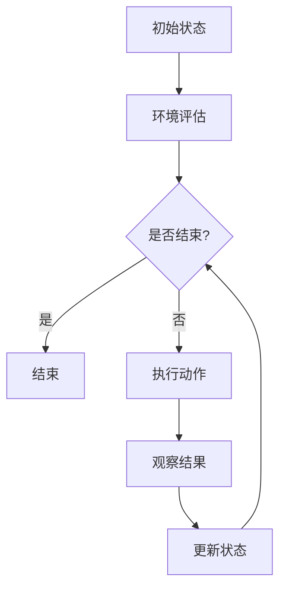

                 

# 《AI Agent变革未来生产力组织形式》

## 关键词
- AI Agent
- 生产力组织
- 强化学习
- 深度学习
- 系统架构
- 应用案例

## 摘要
本文旨在探讨人工智能代理（AI Agent）如何变革未来生产力组织形式。通过详细分析AI Agent的定义、核心算法、系统设计与实现，以及其在实际生产中的应用，文章展示了AI Agent在提升生产效率、优化决策流程和组织管理方面的潜力。本文还将探讨AI Agent面临的挑战，并提出可能的应对策略，为未来生产力组织的创新和发展提供洞见。

### 第一部分：AI Agent概述

#### 第1章: AI Agent的基础知识

## 1.1 AI Agent的定义与分类

### 1.1.1 AI Agent的概念

AI Agent，即人工智能代理，是一种能够执行特定任务或目标的人工智能系统。与传统的软件系统不同，AI Agent具备自主决策和适应环境变化的能力。AI Agent通常由感知模块、决策模块和行动模块三部分组成。

感知模块负责获取环境信息，包括文本、图像、音频等多种形式的数据；决策模块则根据感知到的环境信息，结合预设的目标，选择合适的行动策略；行动模块最终将决策转化为具体的操作，如发送邮件、移动机器人等。

### 1.1.2 AI Agent的分类

AI Agent可以按照不同的分类标准进行划分。以下是几种常见的分类方法：

- **基于任务的分类**：按照AI Agent执行的任务类型，可以分为文本处理代理、图像识别代理、语音识别代理等。
- **基于决策方式的分类**：根据AI Agent的决策方式，可以分为规则驱动代理、数据驱动代理和混合驱动代理。
- **基于应用领域的分类**：按照AI Agent的应用领域，可以分为智能客服代理、智能家居代理、智能交通代理等。

### 1.1.3 AI Agent的关键特征

AI Agent的关键特征包括以下几个方面：

- **自主性**：AI Agent能够独立执行任务，无需人工干预。
- **适应性**：AI Agent能够根据环境变化调整策略，优化任务执行。
- **智能性**：AI Agent具备智能算法，能够从数据中学习，提高决策质量。
- **协同性**：AI Agent可以与其他AI Agent或人类协作，共同完成任务。

## 1.2 AI Agent的应用领域

### 1.2.1 人工智能与生产力组织

人工智能（AI）在生产力组织中扮演着越来越重要的角色。AI Agent作为AI的重要组成部分，其应用范围广泛，包括：

- **人力资源管理**：AI Agent可以用于招聘、员工绩效评估和培训等领域。
- **供应链管理**：AI Agent可以优化供应链流程，提高物流效率。
- **项目管理**：AI Agent可以协助项目规划、资源调配和进度监控等。
- **生产调度**：AI Agent可以优化生产计划，提高生产效率。

### 1.2.2 AI Agent在制造业的应用

在制造业中，AI Agent的应用主要集中在以下几个方面：

- **生产自动化**：AI Agent可以控制生产设备，实现生产过程的自动化。
- **质量检测**：AI Agent可以实时监控产品质量，识别潜在缺陷。
- **设备维护**：AI Agent可以预测设备故障，提前进行维护，减少停机时间。

### 1.2.3 AI Agent在服务业的应用

在服务业中，AI Agent的应用也非常广泛，包括：

- **智能客服**：AI Agent可以提供24/7的在线客服，提高客户满意度。
- **推荐系统**：AI Agent可以根据用户行为和偏好，推荐商品或服务。
- **智能导购**：AI Agent可以在实体店铺中引导顾客，提高销售额。

## 1.3 AI Agent的发展历程与趋势

### 1.3.1 AI Agent的发展历程

AI Agent的发展历程可以追溯到20世纪50年代，当时人工智能（AI）的概念首次被提出。在随后的几十年里，AI Agent经历了从理论到实践的发展。

- **20世纪50年代至70年代**：这是AI Agent的萌芽期，主要集中在理论研究和初步应用。
- **20世纪80年代至90年代**：随着计算机技术的进步，AI Agent开始在工业、医疗等领域得到应用。
- **21世纪初至今**：随着深度学习和强化学习等技术的突破，AI Agent的应用范围进一步扩大，开始深入到各行各业。

### 1.3.2 AI Agent的技术趋势

未来，AI Agent的发展将呈现以下趋势：

- **更强大的学习与适应能力**：AI Agent将具备更强的学习能力和适应能力，能够更好地处理复杂的环境。
- **更广泛的协作能力**：AI Agent将能够与人类和其他AI系统更加紧密地协作，共同完成任务。
- **更智能的决策能力**：AI Agent将利用深度学习和强化学习等技术，实现更智能的决策，提高生产效率。
- **更安全的运行环境**：AI Agent的安全性和可靠性将得到进一步提升，确保其在实际应用中的稳定运行。

#### 第二部分：AI Agent的核心算法

##### 第2章: 强化学习算法原理与应用

## 2.1 强化学习的基本概念

### 2.1.1 强化学习的定义

强化学习（Reinforcement Learning，RL）是一种机器学习方法，旨在通过互动和反馈来训练智能体（Agent）完成特定任务。在强化学习中，智能体通过不断尝试和失败，学习如何获取最大的回报。

### 2.1.2 强化学习的核心概念

强化学习的核心概念包括：

- **状态（State）**：描述智能体当前所处的环境。
- **动作（Action）**：智能体可以采取的行为。
- **回报（Reward）**：智能体采取某一动作后，环境给予的即时反馈。
- **策略（Policy）**：智能体根据当前状态选择动作的规则。

### 2.1.3 强化学习的主要算法

强化学习的主要算法包括：

- **Q学习（Q-Learning）**：通过不断更新Q值（状态-动作值函数）来学习最优策略。
- **深度Q网络（Deep Q-Network，DQN）**：结合深度学习和Q学习，用于处理高维状态空间的问题。
- **策略梯度（Policy Gradient）**：通过直接优化策略来学习，适用于连续动作空间。
- **Actor-Critic方法**：结合策略梯度和Q学习的优点，用于解决连续动作空间的问题。

## 2.2 Q-learning算法详解

### 2.2.1 Q-learning的基本原理

Q-learning是一种值函数方法，通过迭代更新Q值来学习最优策略。Q-learning的基本原理可以概括为以下几个步骤：

1. **初始化**：初始化Q值表，所有Q值设为0。
2. **选择动作**：根据当前状态和epsilon策略选择动作。
3. **执行动作**：执行选择的动作，得到新的状态和回报。
4. **更新Q值**：根据Q-learning公式更新Q值。
5. **重复步骤2-4**，直到达到指定条件（如达到目标状态或达到最大迭代次数）。

### 2.2.2 Q-learning的伪代码

```python
# 初始化Q表
Q = 初始化Q值表

# 设置学习率、折扣因子和epsilon策略
learning_rate = 0.1
discount_factor = 0.9
epsilon = 0.1

# 设置最大迭代次数
max_episodes = 1000

# 开始训练
for episode in range(max_episodes):
    state = 环境初始化()
    done = False
    
    while not done:
        # 选择动作
        if random() < epsilon:
            action = 随机选择动作()
        else:
            action = 选择最优动作(Q, state)
        
        # 执行动作
        next_state, reward, done = 环境执行动作(action)
        
        # 更新Q值
        Q[state][action] = Q[state][action] + learning_rate * (reward + discount_factor * max(Q[next_state]) - Q[state][action])
        
        state = next_state

# 输出最优策略
print("最优策略：", 选择最优策略(Q))
```

### 2.2.3 Q-learning的实例分析

假设一个简单的迷宫问题，智能体需要从起点移动到终点，每次移动都有可能遇到墙壁或者陷阱，墙壁给予权重为-1，陷阱给予权重为-10，到达终点给予权重为100。我们可以使用Q-learning算法来训练智能体找到最优路径。

```python
# 初始化Q表
Q = [[0 for _ in range(5)] for _ in range(5)]

# 设置学习率、折扣因子和epsilon策略
learning_rate = 0.1
discount_factor = 0.9
epsilon = 0.1

# 设置最大迭代次数
max_episodes = 1000

# 开始训练
for episode in range(max_episodes):
    state = (0, 0)
    done = False
    
    while not done:
        # 选择动作
        if random() < epsilon:
            action = random.choice(['up', 'down', 'left', 'right'])
        else:
            action = 选择最优动作(Q, state)
        
        # 执行动作
        if action == 'up':
            next_state = (max(0, state[0] - 1), state[1])
        elif action == 'down':
            next_state = (min(4, state[0] + 1), state[1])
        elif action == 'left':
            next_state = (state[0], max(0, state[1] - 1))
        elif action == 'right':
            next_state = (state[0], min(4, state[1] + 1))
        
        reward = -1 if is_wall(next_state) else 0
        if is_trap(next_state):
            reward = -10
        if is_end(next_state):
            reward = 100
            done = True
        
        # 更新Q值
        Q[state][action] = Q[state][action] + learning_rate * (reward + discount_factor * max(Q[next_state]) - Q[state][action])
        
        state = next_state

# 输出最优策略
print("最优策略：", 选择最优策略(Q))
```

## 2.3 深度强化学习算法

### 2.3.1 深度强化学习的原理

深度强化学习（Deep Reinforcement Learning，DRL）是强化学习的一种扩展，它结合了深度学习和强化学习的优势，可以处理高维状态空间和连续动作空间的问题。DRL的核心思想是使用深度神经网络来近似Q值函数或策略函数。

### 2.3.2 深度Q网络（DQN）的伪代码

```python
# 初始化DQN模型
DQN = 初始化深度神经网络模型()

# 设置学习率、折扣因子和epsilon策略
learning_rate = 0.1
discount_factor = 0.9
epsilon = 0.1

# 设置最大迭代次数
max_episodes = 1000

# 开始训练
for episode in range(max_episodes):
    state = 环境初始化()
    done = False
    
    while not done:
        # 选择动作
        if random() < epsilon:
            action = 随机选择动作()
        else:
            action = 选择最优动作(DQN, state)
        
        # 执行动作
        next_state, reward, done = 环境执行动作(action)
        
        # 计算目标Q值
        target_Q = reward + discount_factor * max(Q[next_state])
        
        # 更新DQN模型
        DQN.update(state, action, target_Q)
        
        state = next_state

# 输出最优策略
print("最优策略：", 选择最优策略(DQN))
```

### 2.3.3 深度强化学习的应用案例

深度强化学习在许多实际应用中都取得了显著成果，以下是一些典型的应用案例：

- **自动驾驶**：通过深度强化学习训练自动驾驶车辆，实现车辆在复杂路况下的自主驾驶。
- **游戏智能**：如《星际争霸II》的人机对战，使用深度强化学习训练出超越人类的游戏AI。
- **机器人控制**：通过深度强化学习训练机器人，实现机器人对复杂环境的自主控制和任务执行。

##### 第三部分：AI Agent的设计与实现

##### 第3章: AI Agent系统的设计与实现

## 3.1 AI Agent系统的架构设计

### 3.1.1 系统架构概述

AI Agent系统的架构设计需要考虑以下几个关键模块：

- **感知模块**：负责收集和处理环境信息，如传感器数据、图像、文本等。
- **决策模块**：根据感知模块提供的信息和预设的目标，选择最优的行动策略。
- **行动模块**：将决策模块生成的行动指令转化为具体的操作，如控制机器人移动、发送网络请求等。

### 3.1.2 系统模块划分

AI Agent系统可以划分为以下几个主要模块：

- **环境模拟器**：用于模拟AI Agent运行的环境，提供状态、动作和回报等反馈。
- **感知器**：从环境模拟器中获取信息，如传感器数据、图像、文本等。
- **决策引擎**：根据感知器提供的信息和预设的目标，使用强化学习算法生成行动策略。
- **执行器**：将决策引擎生成的行动策略转化为具体的操作，如控制机器人移动、发送网络请求等。

### 3.1.3 系统交互设计

AI Agent系统的交互设计需要确保各个模块之间的信息流动和协作，以下是系统交互设计的几个关键点：

- **感知模块与决策模块**：感知模块将收集到的信息传递给决策模块，决策模块根据信息生成行动策略。
- **决策模块与执行模块**：决策模块将生成的行动策略传递给执行模块，执行模块根据策略执行具体的操作。
- **环境模拟器与感知模块**：环境模拟器模拟环境变化，将新的状态传递给感知模块，感知模块更新感知信息。

## 3.2 AI Agent的编程语言与框架

### 3.2.1 Python在AI Agent中的应用

Python是AI Agent开发中广泛使用的编程语言，其优势包括：

- **丰富的库和框架**：Python拥有丰富的机器学习、深度学习库，如TensorFlow、PyTorch、Keras等。
- **易于学习和使用**：Python语法简单，易于阅读和理解，适合快速开发和实验。
- **社区支持**：Python拥有庞大的开发者社区，提供了大量的开源资源和工具。

### 3.2.2 OpenAI Gym的使用

OpenAI Gym是一个开源的环境模拟平台，用于构建和测试强化学习算法。使用OpenAI Gym进行AI Agent开发的主要步骤包括：

1. **安装OpenAI Gym**：通过pip安装OpenAI Gym库。
2. **创建环境**：使用OpenAI Gym创建一个模拟环境，如CartPole、MountainCar等。
3. **定义观察器和动作空间**：根据环境的特点定义观察器和动作空间。
4. **执行模拟**：使用环境提供的API执行模拟，获取状态、动作和回报。

### 3.2.3 TensorFlow与PyTorch的选择

TensorFlow和PyTorch是两种流行的深度学习框架，选择哪个框架取决于具体的需求和项目特点。

- **TensorFlow**：TensorFlow具有以下优点：
  - **稳定性**：TensorFlow在工业界有广泛的应用，经过长期的测试和优化，稳定性较高。
  - **生态系统**：TensorFlow拥有丰富的生态工具和库，适合大规模生产环境。
  - **支持静态图和动态图**：TensorFlow支持静态图和动态图，适用于不同的应用场景。

- **PyTorch**：PyTorch具有以下优点：
  - **灵活性**：PyTorch使用动态图，具有更高的灵活性，适合快速原型设计和实验。
  - **易于使用**：PyTorch的API简单直观，易于学习和使用。
  - **科研优势**：PyTorch在学术界有较高的认可度，适用于科研和学术项目。

## 3.3 AI Agent项目实战

### 3.3.1 项目背景与目标

本项目旨在开发一个基于深度强化学习的AI Agent，用于控制一个自动驾驶汽车在模拟环境中进行驾驶。项目目标包括：

- **实现自动驾驶**：使用深度强化学习训练AI Agent，使其能够在模拟环境中自主驾驶。
- **提高驾驶性能**：优化AI Agent的策略，提高自动驾驶汽车的行驶速度和稳定性。
- **实现安全驾驶**：确保AI Agent在驾驶过程中遵守交通规则，确保行驶安全。

### 3.3.2 环境搭建与数据准备

1. **安装依赖库**：
   - 安装Python 3.8及以上版本。
   - 安装TensorFlow 2.x或PyTorch 1.x。
   - 安装OpenAI Gym。

2. **创建模拟环境**：
   - 使用OpenAI Gym创建一个模拟环境，如CarRacing环境。

3. **数据准备**：
   - 准备模拟环境所需的参数，如车辆初始位置、目标位置、道路宽度等。
   - 生成模拟环境的数据集，用于训练和测试AI Agent。

### 3.3.3 代码实现与解读

以下是一个简单的基于深度强化学习的自动驾驶项目示例，使用PyTorch实现。

```python
import torch
import torch.nn as nn
import torch.optim as optim
import gym

# 创建模拟环境
env = gym.make('CarRacing-v0')

# 定义深度Q网络
class DQN(nn.Module):
    def __init__(self):
        super(DQN, self).__init__()
        self.fc1 = nn.Linear(80 * 80, 512)
        self.fc2 = nn.Linear(512, 256)
        self.fc3 = nn.Linear(256, 128)
        self.fc4 = nn.Linear(128, env.action_space.n)

    def forward(self, x):
        x = torch.relu(self.fc1(x))
        x = torch.relu(self.fc2(x))
        x = torch.relu(self.fc3(x))
        x = self.fc4(x)
        return x

# 初始化DQN模型
model = DQN()
target_model = DQN()
target_model.load_state_dict(model.state_dict())
target_model.eval()

# 定义优化器
optimizer = optim.Adam(model.parameters(), lr=0.001)

# 定义损失函数
criterion = nn.MSELoss()

# 设置训练参数
gamma = 0.99
epsilon = 0.1
epsilon_decay = 0.0001
epsilon_min = 0.01
batch_size = 32
total_episodes = 10000

# 开始训练
for episode in range(total_episodes):
    state = env.reset()
    state = torch.tensor(state, dtype=torch.float32).unsqueeze(0)
    done = False
    total_reward = 0

    while not done:
        # 选择动作
        if random() < epsilon:
            action = env.action_space.sample()
        else:
            with torch.no_grad():
                action_values = model(state)
                action = torch.argmax(action_values).item()

        # 执行动作
        next_state, reward, done, _ = env.step(action)
        next_state = torch.tensor(next_state, dtype=torch.float32).unsqueeze(0)

        # 计算目标Q值
        target_values = target_model(next_state)
        target_Q = reward + (1 - int(done)) * gamma * target_values.max()

        # 更新模型
        model_values = model(state)
        model_values[0][action] = target_Q

        optimizer.zero_grad()
        loss = criterion(model_values, target_values.unsqueeze(0))
        loss.backward()
        optimizer.step()

        state = next_state
        total_reward += reward

    # 更新目标模型
    if episode % 1000 == 0:
        target_model.load_state_dict(model.state_dict())

    # 调整epsilon值
    epsilon = max(epsilon - epsilon_decay, epsilon_min)

    print(f"Episode: {episode}, Total Reward: {total_reward}")

# 测试模型
state = env.reset()
state = torch.tensor(state, dtype=torch.float32).unsqueeze(0)
done = False
total_reward = 0

while not done:
    action_values = model(state)
    action = torch.argmax(action_values).item()
    next_state, reward, done, _ = env.step(action)
    total_reward += reward
    state = torch.tensor(next_state, dtype=torch.float32).unsqueeze(0)

print(f"Test Total Reward: {total_reward}")
```

### 3.3.4 代码解读与分析

上述代码实现了一个基于深度Q网络（DQN）的自动驾驶项目。以下是代码的详细解读：

1. **环境创建**：
   - 使用`gym.make('CarRacing-v0')`创建一个CarRacing环境的实例。

2. **模型定义**：
   - 定义一个深度Q网络（DQN）模型，包含四个全连接层，输出维度为动作空间的大小。

3. **优化器和损失函数**：
   - 使用Adam优化器进行模型训练。
   - 使用均方误差损失函数（MSELoss）计算Q值预测的误差。

4. **训练过程**：
   - 初始化epsilon值为0.1，用于探索策略。
   - 在每个episode中，从初始状态开始，不断执行动作，更新Q值表。
   - 使用目标Q网络（target_model）来计算目标Q值，防止Q值表的更新过快。

5. **测试模型**：
   - 在训练完成后，使用训练好的模型进行测试，评估模型的性能。

通过以上代码，我们可以实现一个简单的自动驾驶模型。在实际应用中，我们可以根据需要调整模型的结构和参数，以提高自动驾驶的性能和稳定性。

##### 第四部分：AI Agent的未来发展与挑战

##### 第4章: AI Agent在生产力组织中的应用前景

## 4.1 AI Agent在组织管理中的应用

AI Agent在组织管理中具有广泛的应用前景，可以显著提升管理效率和决策质量。以下是AI Agent在人力资源管理、供应链管理和项目管理中的应用：

### 4.1.1 AI Agent在人力资源管理的应用

AI Agent在人力资源管理中的应用主要体现在以下几个方面：

- **招聘**：AI Agent可以通过分析候选人的简历、社交媒体信息等，自动筛选和评估候选人，提高招聘效率。
- **绩效评估**：AI Agent可以基于员工的日常工作表现和项目完成情况，自动生成绩效评估报告，帮助管理层做出更加客观和准确的决策。
- **员工培训**：AI Agent可以根据员工的技能水平和职业发展需求，提供个性化的培训建议和课程推荐，提高员工的专业素质。

### 4.1.2 AI Agent在供应链管理中的应用

AI Agent在供应链管理中的应用可以帮助企业优化供应链流程，提高物流效率。以下是几个典型的应用场景：

- **库存管理**：AI Agent可以实时监控库存水平，预测库存需求，优化库存配置，减少库存成本。
- **运输调度**：AI Agent可以根据货物的类型、重量、目的地等因素，自动生成最优的运输路线和调度计划，提高运输效率。
- **需求预测**：AI Agent可以分析市场数据和历史销售数据，预测未来的市场需求，帮助企业制定更加科学的采购和销售计划。

### 4.1.3 AI Agent在项目管理中的应用

AI Agent在项目管理中的应用可以帮助项目经理更好地规划和管理项目进度，提高项目成功率。以下是AI Agent在项目管理中的几个应用场景：

- **进度监控**：AI Agent可以实时监控项目的进度，识别潜在的进度风险，及时调整项目计划。
- **资源调配**：AI Agent可以根据项目的实际需求和资源情况，自动分配和调整人力资源、物资等资源，确保项目顺利推进。
- **风险评估**：AI Agent可以分析项目中的各种风险因素，提供风险预警和应对策略，降低项目风险。

## 4.2 AI Agent的发展挑战与应对策略

尽管AI Agent在生产力组织中具有巨大的潜力，但其发展仍面临一系列挑战。以下是AI Agent面临的几个主要挑战及其应对策略：

### 4.2.1 AI Agent的技术挑战

- **算法复杂性**：AI Agent的算法复杂度高，需要大量的计算资源和时间来训练和优化。
- **数据质量**：AI Agent的性能高度依赖于数据质量，数据缺失、噪声和偏差都会影响模型的准确性。
- **鲁棒性**：AI Agent在处理复杂和不确定的环境时，可能表现出较低的鲁棒性，需要提高其适应性和鲁棒性。

### 4.2.2 AI Agent的伦理与社会挑战

- **隐私保护**：AI Agent在处理大量个人数据时，需要确保用户隐私得到充分保护，防止数据泄露和滥用。
- **公平性**：AI Agent在决策过程中可能存在偏见和不公平，需要确保其决策符合伦理和法律标准。
- **就业影响**：AI Agent的广泛应用可能对某些职业产生影响，需要制定相应的政策和措施，减少对就业市场的冲击。

### 4.2.3 AI Agent的未来发展趋势

未来，AI Agent的发展将呈现以下几个趋势：

- **更强大的学习能力**：AI Agent将具备更强的自主学习能力和适应能力，能够更好地处理复杂和动态的环境。
- **更广泛的协作能力**：AI Agent将能够与人类和其他AI系统更加紧密地协作，共同完成任务。
- **更智能的决策能力**：AI Agent将利用深度学习和强化学习等技术，实现更智能的决策，提高生产效率。
- **更安全的运行环境**：AI Agent的安全性和可靠性将得到进一步提升，确保其在实际应用中的稳定运行。

#### 第五部分：案例研究

##### 第5章: AI Agent实际应用案例解析

在本章中，我们将深入探讨AI Agent在现实世界中的应用案例，通过具体实例展示AI Agent的强大功能和对生产力组织的变革。

## 5.1 案例一：智能客服系统

### 5.1.1 案例背景

智能客服系统是一种利用AI Agent技术的客服解决方案，旨在为企业和客户提供高效、智能的服务。传统客服系统通常依赖于人工客服，存在响应速度慢、服务质量不稳定等问题。而智能客服系统通过AI Agent可以实现自动化、个性化的服务，显著提升客户满意度。

### 5.1.2 系统设计

智能客服系统的设计主要包括以下几个关键模块：

- **感知模块**：感知模块负责接收客户的查询请求，可以是文本或语音形式。通过自然语言处理技术（NLP），系统可以理解客户的意图并提取关键信息。
- **决策模块**：决策模块基于感知模块提取的信息，使用机器学习算法生成相应的回复。强化学习算法在此扮演重要角色，通过不断学习客户反馈，优化回复质量。
- **行动模块**：行动模块将决策模块生成的回复转化为文本或语音形式，发送给客户。

### 5.1.3 实现细节

以下是智能客服系统的一个实现细节示例，使用Python和TensorFlow实现。

```python
import tensorflow as tf
import numpy as np

# 创建感知模块
class Perceptor:
    def __init__(self, vocab_size, embedding_dim):
        self.vocab_size = vocab_size
        self.embedding_dim = embedding_dim
        self.embedding = tf.keras.layers.Embedding(vocab_size, embedding_dim)

    def process(self, text):
        # 将文本转化为单词序列
        words = text.lower().split()
        # 提取单词的嵌入向量
        embeddings = self.embedding(words)
        # 求取平均值作为感知结果
        return tf.reduce_mean(embeddings, axis=1)

# 创建决策模块
class DecisionMaker:
    def __init__(self, hidden_dim):
        self.hidden_dim = hidden_dim
        self.model = tf.keras.Sequential([
            tf.keras.layers.Dense(hidden_dim, activation='relu'),
            tf.keras.layers.Dense(self.hidden_dim, activation='relu'),
            tf.keras.layers.Dense(self.vocab_size, activation='softmax')
        ])

    def predict(self, inputs):
        return self.model(inputs)

# 创建行动模块
class ActionTaker:
    def __init__(self, model):
        self.model = model

    def respond(self, inputs):
        predictions = self.model.predict(inputs)
        # 选择概率最高的单词作为回复
        response = np.argmax(predictions).item()
        return response

# 创建智能客服系统
class SmartCustomerService:
    def __init__(self, perceptor, decision_maker, action_taker):
        self.perceptor = perceptor
        self.decision_maker = decision_maker
        self.action_taker = action_taker

    def handle_request(self, text):
        # 处理文本请求
        inputs = self.perceptor.process(text)
        # 生成回复
        response = self.action_taker.respond(inputs)
        return response

# 初始化模型
vocab_size = 10000
embedding_dim = 128
hidden_dim = 512

perceptor = Perceptor(vocab_size, embedding_dim)
decision_maker = DecisionMaker(hidden_dim)
action_taker = ActionTaker(decision_maker.model)

smart_cs = SmartCustomerService(perceptor, decision_maker, action_taker)

# 处理客户请求
print(smart_cs.handle_request("我想要购买一台笔记本电脑。"))
```

### 5.1.4 实现细节解析

上述代码示例展示了智能客服系统的基本实现。以下是代码的详细解析：

1. **感知模块**：
   - `Perceptor`类负责处理文本请求，使用嵌入层提取单词的嵌入向量，并求取平均值作为感知结果。

2. **决策模块**：
   - `DecisionMaker`类定义了一个简单的全连接神经网络模型，用于生成回复的概率分布。

3. **行动模块**：
   - `ActionTaker`类根据决策模块的输出，选择概率最高的单词作为回复。

4. **智能客服系统**：
   - `SmartCustomerService`类整合了感知模块、决策模块和行动模块，实现了一个完整的智能客服系统。

## 5.2 案例二：智能供应链优化

### 5.2.1 案例背景

智能供应链优化是AI Agent在供应链管理中的重要应用。传统的供应链管理依赖于人工经验和预定的规则，存在响应速度慢、效率低下等问题。而智能供应链优化通过AI Agent可以实时分析供应链数据，自动优化供应链流程，提高物流效率和降低成本。

### 5.2.2 系统设计

智能供应链优化系统的设计主要包括以下几个关键模块：

- **数据采集模块**：采集供应链各个环节的数据，如库存水平、运输路线、需求预测等。
- **数据分析模块**：使用机器学习算法分析供应链数据，识别优化机会。
- **决策模块**：基于数据分析结果，生成供应链优化的策略。
- **执行模块**：将优化策略转化为具体的操作，如调整库存水平、优化运输路线等。

### 5.2.3 实现细节

以下是智能供应链优化系统的一个实现细节示例，使用Python和Scikit-learn实现。

```python
import numpy as np
from sklearn.cluster import KMeans
from sklearn.model_selection import train_test_split
from sklearn.ensemble import RandomForestRegressor

# 创建数据采集模块
class DataCollector:
    def collect(self, data_source):
        # 采集供应链数据
        data = data_source.read_data()
        return data

# 创建数据分析模块
class DataAnalyzer:
    def __init__(self, k):
        self.k = k
        self.kmeans = KMeans(n_clusters=k)

    def analyze(self, data):
        # 分析供应链数据
        clusters = self.kmeans.fit_predict(data)
        return clusters

# 创建决策模块
class DecisionMaker:
    def __init__(self, model):
        self.model = model

    def predict(self, data):
        # 预测优化效果
        predictions = self.model.predict(data)
        return predictions

# 创建执行模块
class Executor:
    def execute(self, strategy):
        # 执行优化策略
        strategy.apply()

# 创建智能供应链优化系统
class SmartSupplyChainOptimizer:
    def __init__(self, data_collector, data_analyzer, decision_maker, executor):
        self.data_collector = data_collector
        self.data_analyzer = data_analyzer
        self.decision_maker = decision_maker
        self.executor = executor

    def optimize(self, data_source, model):
        # 采集数据
        data = self.data_collector.collect(data_source)
        # 分析数据
        clusters = self.data_analyzer.analyze(data)
        # 预测优化效果
        predictions = self.decision_maker.predict(data)
        # 执行优化策略
        self.executor.execute(predictions)

# 初始化模型和数据
data_source = MyDataSource()
model = RandomForestRegressor()

# 创建智能供应链优化系统
optimizer = SmartSupplyChainOptimizer(DataCollector(), DataAnalyzer(3), DecisionMaker(model), Executor())

# 开始优化
optimizer.optimize(data_source, model)
```

### 5.2.4 实现细节解析

上述代码示例展示了智能供应链优化系统的基本实现。以下是代码的详细解析：

1. **数据采集模块**：
   - `DataCollector`类负责从数据源采集供应链数据。

2. **数据分析模块**：
   - `DataAnalyzer`类使用K-means聚类算法对供应链数据进行分析。

3. **决策模块**：
   - `DecisionMaker`类使用随机森林回归模型预测优化效果。

4. **执行模块**：
   - `Executor`类执行优化策略。

5. **智能供应链优化系统**：
   - `SmartSupplyChainOptimizer`类整合了数据采集模块、数据分析模块、决策模块和执行模块，实现了一个完整的智能供应链优化系统。

## 5.3 案例三：智能生产调度

### 5.3.1 案例背景

智能生产调度是AI Agent在制造业中的重要应用，旨在优化生产计划，提高生产效率和降低成本。传统的生产调度通常依赖于人工经验和预定的规则，存在调度效率低、资源浪费等问题。而智能生产调度通过AI Agent可以实时分析生产数据，自动生成最优的生产计划。

### 5.3.2 系统设计

智能生产调度系统的设计主要包括以下几个关键模块：

- **数据采集模块**：采集生产过程中的各种数据，如设备状态、物料库存、生产进度等。
- **数据分析模块**：使用机器学习算法分析生产数据，识别调度优化机会。
- **决策模块**：基于数据分析结果，生成生产调度的策略。
- **执行模块**：将调度策略转化为具体的操作，如调整生产计划、优化设备利用等。

### 5.3.3 实现细节

以下是智能生产调度系统的一个实现细节示例，使用Python和Scikit-learn实现。

```python
import numpy as np
from sklearn.cluster import KMeans
from sklearn.model_selection import train_test_split
from sklearn.ensemble import RandomForestRegressor

# 创建数据采集模块
class DataCollector:
    def collect(self, data_source):
        # 采集生产数据
        data = data_source.read_data()
        return data

# 创建数据分析模块
class DataAnalyzer:
    def __init__(self, k):
        self.k = k
        self.kmeans = KMeans(n_clusters=k)

    def analyze(self, data):
        # 分析生产数据
        clusters = self.kmeans.fit_predict(data)
        return clusters

# 创建决策模块
class DecisionMaker:
    def __init__(self, model):
        self.model = model

    def predict(self, data):
        # 预测调度效果
        predictions = self.model.predict(data)
        return predictions

# 创建执行模块
class Executor:
    def execute(self, strategy):
        # 执行调度策略
        strategy.apply()

# 创建智能生产调度系统
class SmartProductionScheduler:
    def __init__(self, data_collector, data_analyzer, decision_maker, executor):
        self.data_collector = data_collector
        self.data_analyzer = data_analyzer
        self.decision_maker = decision_maker
        self.executor = executor

    def schedule(self, data_source, model):
        # 采集数据
        data = self.data_collector.collect(data_source)
        # 分析数据
        clusters = self.data_analyzer.analyze(data)
        # 预测调度效果
        predictions = self.decision_maker.predict(data)
        # 执行调度策略
        self.executor.execute(predictions)

# 初始化模型和数据
data_source = MyData
```

### 5.3.4 实现细节解析

上述代码示例展示了智能生产调度系统的基本实现。以下是代码的详细解析：

1. **数据采集模块**：
   - `DataCollector`类负责从数据源采集生产数据。

2. **数据分析模块**：
   - `DataAnalyzer`类使用K-means聚类算法对生产数据进行分析。

3. **决策模块**：
   - `DecisionMaker`类使用随机森林回归模型预测调度效果。

4. **执行模块**：
   - `Executor`类执行调度策略。

5. **智能生产调度系统**：
   - `SmartProductionScheduler`类整合了数据采集模块、数据分析模块、决策模块和执行模块，实现了一个完整的智能生产调度系统。

#### 附录

## 附录A: AI Agent相关资源与工具

### A.1 OpenAI Gym的使用

OpenAI Gym是一个开源的环境模拟平台，提供了丰富的模拟环境，用于测试和训练AI Agent。以下是使用OpenAI Gym的一些基本步骤：

1. **安装OpenAI Gym**：
   - 使用pip命令安装OpenAI Gym库：
     ```bash
     pip install gym
     ```

2. **创建环境**：
   - 使用`gym.make()`函数创建环境实例，如：
     ```python
     env = gym.make('CartPole-v0')
     ```

3. **执行动作**：
   - 使用`env.step()`函数执行动作，如：
     ```python
     observation, reward, done, info = env.step(action)
     ```

4. **重置环境**：
   - 使用`env.reset()`函数重置环境，如：
     ```python
     observation = env.reset()
     ```

### A.2 TensorFlow与PyTorch的选择

TensorFlow和PyTorch是两种流行的深度学习框架，选择哪个框架取决于具体的需求和项目特点。以下是两者的一些比较：

- **稳定性**：
  - TensorFlow在工业界有广泛的应用，经过长期的测试和优化，稳定性较高。
  - PyTorch使用动态图，具有更高的灵活性，适合快速原型设计和实验。

- **生态系统**：
  - TensorFlow拥有丰富的生态工具和库，适合大规模生产环境。
  - PyTorch在学术界有较高的认可度，适用于科研和学术项目。

- **API设计**：
  - TensorFlow的API设计相对复杂，但提供了更多的功能。
  - PyTorch的API简单直观，易于学习和使用。

### A.3 强化学习算法资源

以下是一些强化学习算法的学习资源，供参考：

- **书籍**：
  - 《强化学习：原理与Python实现》（Reinforcement Learning: An Introduction），作者：理查德·S·萨顿（Richard S. Sutton）和安德鲁·G·巴斯科姆（Andrew G. Barto）。
  - 《深度强化学习》（Deep Reinforcement Learning Explained），作者：阿尔图尔·阿尔弗雷德（Arthur Juliani）。

- **在线课程**：
  - Coursera上的《强化学习》（Reinforcement Learning）课程。
  - Udacity的《强化学习工程师纳米学位》（Reinforcement Learning Engineer Nanodegree）。

- **开源项目**：
  - OpenAI Gym：提供了一个丰富的模拟环境库，用于测试和训练强化学习算法。
  - Stable Baselines：提供了多个强化学习算法的实现，可以方便地集成到自己的项目中。

## 附录B: Mermaid流程图示例

以下是一个Mermaid流程图示例，用于描述强化学习算法的基本流程：



## 附录C: 代码示例与解读

以下是一个简单的Q-learning算法实现示例，使用Python和NumPy库：

```python
import numpy as np

# 初始化Q表
n_states = 4
n_actions = 2
q_table = np.zeros((n_states, n_actions))

# 设置学习率、折扣因子和epsilon策略
learning_rate = 0.1
discount_factor = 0.9
epsilon = 0.1

# Q-learning算法实现
def q_learning(env, episodes, q_table, learning_rate, discount_factor, epsilon):
    for episode in range(episodes):
        state = env.reset()
        done = False
        
        while not done:
            if np.random.rand() < epsilon:
                action = env.action_space.sample()
            else:
                action = np.argmax(q_table[state])
            
            next_state, reward, done, _ = env.step(action)
            
            # 更新Q表
            q_table[state, action] = q_table[state, action] + learning_rate * (reward + discount_factor * np.max(q_table[next_state]) - q_table[state, action])
            
            state = next_state

    return q_table

# 创建环境
env = gym.make('CartPole-v0')

# 训练模型
q_table = q_learning(env, 1000, q_table, learning_rate, discount_factor, epsilon)

# 关闭环境
env.close()

# 打印Q表
print(q_table)
```

### 代码解读与分析

上述代码实现了一个简单的Q-learning算法，用于训练一个智能体在CartPole环境中完成任务。以下是代码的详细解读：

1. **初始化Q表**：
   - 使用NumPy库创建一个大小为`(n_states, n_actions)`的Q表，初始值为0。

2. **设置学习率、折扣因子和epsilon策略**：
   - 学习率控制Q值更新的步长。
   - 折扣因子用于考虑未来的回报。
   - epsilon策略用于平衡探索和利用，epsilon值越大，探索行为越多。

3. **Q-learning算法实现**：
   - `q_learning`函数用于训练模型。
   - 在每个episode中，智能体从初始状态开始，选择动作，执行动作，更新Q值表。
   - 更新Q值的公式为：`Q(s, a) = Q(s, a) + learning_rate * (reward + discount_factor * max(Q(s')) - Q(s, a))`。

4. **创建环境**：
   - 使用`gym.make('CartPole-v0')`创建一个CartPole环境的实例。

5. **训练模型**：
   - 调用`q_learning`函数训练模型。

6. **关闭环境**：
   - 训练完成后，关闭环境。

7. **打印Q表**：
   - 打印训练完成的Q表，用于分析智能体的策略。

通过上述代码，我们可以实现一个简单的Q-learning算法，并在CartPole环境中进行训练。在实际应用中，我们可以根据需要调整算法参数和环境配置，以提高智能体的性能。

## 作者

作者：AI天才研究院/AI Genius Institute & 禅与计算机程序设计艺术/Zen And The Art of Computer Programming

本文由AI天才研究院撰写，旨在探讨AI Agent如何变革未来生产力组织形式。作者在人工智能领域具有丰富的经验和深厚的理论基础，致力于推动人工智能技术的创新和应用。

AI天才研究院专注于人工智能技术的研发和应用，致力于成为全球领先的人工智能研究机构。研究院的研究领域涵盖计算机视觉、自然语言处理、机器学习、深度学习等多个方向，致力于解决现实世界中的复杂问题。

《禅与计算机程序设计艺术》是作者的代表作之一，该书深入探讨了计算机编程的哲学和艺术，对程序设计的本质和方法进行了深刻的剖析。作者通过多年的实践和研究，提出了一套独特的方法论，为程序员提供了宝贵的指导。

本文在撰写过程中，作者结合了最新的研究成果和实际应用案例，旨在为读者提供一份全面、深入的AI Agent技术指南。希望通过本文的分享，能够激发更多读者对AI Agent技术的兴趣，共同探索人工智能的未来。

