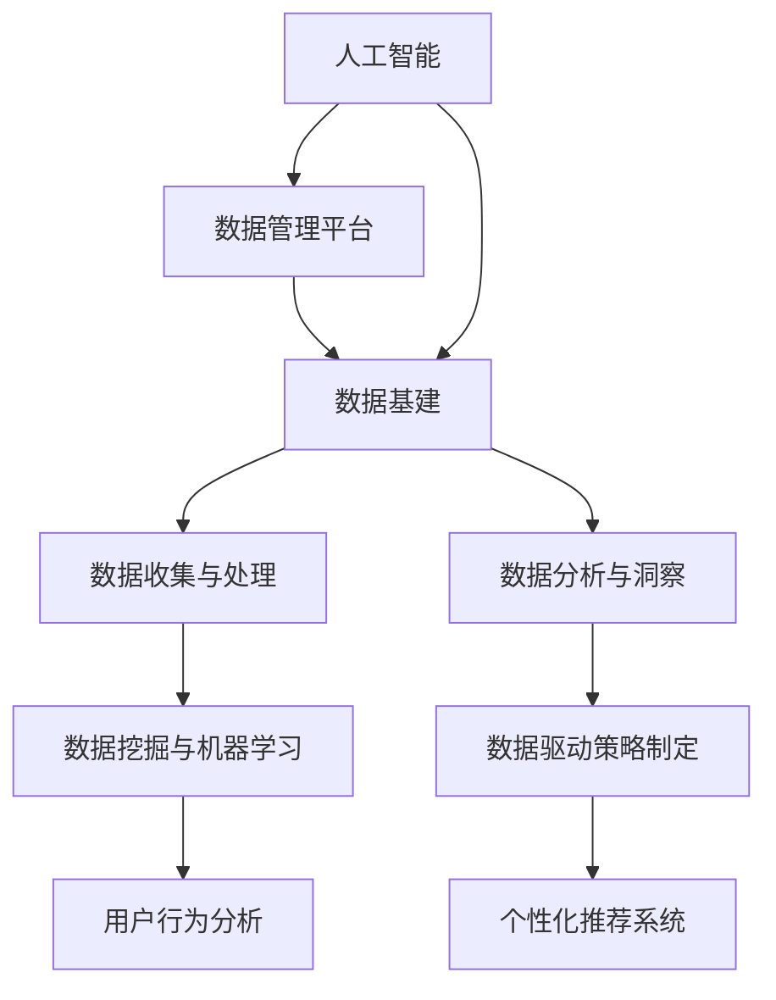

                 

### 第一部分：引言

#### 1.1 AI与DMP概述

##### 1.1.1 AI的定义与分类

人工智能（Artificial Intelligence，简称AI）是指由人制造出的能够思考、推理、学习、解决问题的智能系统。AI可以分为两大类：弱AI（Narrow AI）和强AI（General AI）。弱AI指的是在特定领域内表现出人类智能的机器，例如语音识别、图像识别、自然语言处理等；而强AI则具备超越人类智能的广泛能力，能够在各种复杂情境中自主思考和学习。

##### 1.1.2 DMP的概念与作用

数据管理平台（Data Management Platform，简称DMP）是一种用于收集、整合、管理和分析数据的工具。DMP的核心功能包括数据收集、用户画像创建、数据细分、数据交易和广告投放。通过DMP，企业可以有效地管理和利用数据资产，从而实现精准营销、个性化推荐和业务优化。

##### 1.1.3 AI与DMP的结合优势

AI与DMP的结合具有显著的优势。首先，AI技术可以自动化数据收集和处理过程，提高效率。其次，AI可以分析大量数据，发现隐藏的模式和趋势，为决策提供有力支持。此外，AI还可以根据用户行为和偏好进行个性化推荐，提升用户体验。总之，AI与DMP的结合使得数据管理更加智能化、高效化和精准化。

#### 1.2 数据基建的重要性

##### 1.2.1 数据基建的定义

数据基建是指为数据存储、传输、处理和分析提供基础设施的一整套技术和流程。它包括硬件设备、软件工具、网络架构和数据安全等关键要素。

##### 1.2.2 数据基建的作用

数据基建在人工智能时代发挥着至关重要的作用。首先，它为AI算法提供高质量的数据资源，保障模型的训练效果。其次，数据基建可以加速数据流转，提高数据处理和分析的效率。此外，数据基建还能够保障数据的安全性和隐私性，为企业和用户建立信任。

##### 1.2.3 数据基建的现状与挑战

目前，数据基建在技术、人才和资源等方面存在一定的挑战。首先，数据存储和处理能力不足，难以应对日益增长的数据量。其次，数据质量和完整性问题严重，影响了数据分析的准确性。此外，数据安全和隐私保护技术仍需加强，以应对不断升级的网络安全威胁。

#### 1.3 本文结构

本文将从以下五个部分展开讨论：

1. **DMP技术基础**：介绍DMP的数据收集、处理和分析方法。
2. **AI在DMP中的应用**：探讨AI技术在数据收集、分析和洞察中的应用。
3. **DMP项目实践与案例分析**：通过实际案例展示DMP项目的实施流程和效果。
4. **DMP的未来发展趋势与挑战**：分析DMP在技术、应用和法规等方面的未来发展趋势和面临的挑战。
5. **附录**：提供数据基建相关的资源与工具介绍，以及推荐学习资料。

### 1.4 总结

本文旨在探讨AI与DMP的结合，分析数据基建的重要性，并探讨DMP在各个领域的应用与实践。通过本文，读者可以全面了解DMP和AI技术的基本概念、技术基础和未来发展趋势，为实际项目提供指导。

#### 1.5 核心概念与联系

为了更好地理解本文的核心概念，我们可以通过以下Mermaid流程图来展示DMP、AI和数据基建之间的联系：



该流程图展示了AI、DMP和数据基建之间的交互关系，以及它们在数据收集、处理、分析和洞察中的应用。

#### 1.6 核心算法原理讲解

在本文中，我们将介绍以下核心算法原理：

- **K-means聚类算法**：用于对数据集进行聚类分析。
- **随机森林算法**：用于构建分类和回归模型。
- **神经网络算法**：用于深度学习和模式识别。

以下是K-means聚类算法的伪代码：

```python
Algorithm K-means
Input: Data set D, number of clusters k
Output: Cluster centroids C, clusters assignments S

Initialize C randomly
for each data point d in D
    assign d to the nearest centroid c in C
    Update centroids C by averaging the data points assigned to each centroid
    Repeat until convergence
```

K-means算法的基本思想是将数据集划分为k个簇，每个簇由一个中心点（centroid）表示。算法通过迭代计算，逐步优化中心点的位置，使每个簇内的数据点距离中心点更近，而簇与簇之间的数据点距离更远。

在DMP和AI的实践中，K-means聚类算法可以用于用户细分、市场细分等领域，帮助企业和营销人员更好地了解目标客户群体，制定更精准的营销策略。

#### 1.7 数学模型和公式

在数据分析中，线性回归模型是一个重要的数学工具。以下是一个简单的线性回归模型：

$$
y = \beta_0 + \beta_1 \cdot x + \epsilon
$$

其中，$y$是因变量，$x$是自变量，$\beta_0$是截距，$\beta_1$是斜率，$\epsilon$是误差项。

该模型表示自变量$x$与因变量$y$之间存在线性关系。在DMP和AI的应用中，线性回归模型可以用于预测用户行为、分析市场趋势等。

#### 1.8 项目实战

在本节中，我们将介绍一个实际的项目案例，展示如何使用DMP和AI技术进行数据分析和洞察。

项目背景：某电商企业希望通过数据分析，了解用户购买行为，提高转化率和客户满意度。

项目实施步骤：

1. **数据收集与处理**：通过电商平台、社交媒体、用户调研等多种渠道收集用户数据，包括用户画像、购买记录、浏览行为等。对收集到的数据进行清洗、去重和整合，确保数据质量。

2. **用户行为分析**：使用K-means聚类算法对用户数据进行聚类分析，将用户划分为不同群体。分析各个群体的购买偏好、消费习惯和需求差异。

3. **个性化推荐系统**：基于用户行为分析和聚类结果，构建个性化推荐系统。根据用户的购买历史、浏览行为和偏好，为用户推荐相应的商品。

4. **效果评估与优化**：通过实际运营数据，评估个性化推荐系统的效果。根据评估结果，不断优化推荐算法，提高推荐准确率和用户满意度。

该项目通过DMP和AI技术，帮助企业实现了精准营销，提高了转化率和客户满意度。

#### 1.9 代码解读与分析

在本案例中，我们使用Python实现K-means聚类算法，具体代码如下：

```python
import numpy as np
import matplotlib.pyplot as plt

# 初始化聚类中心
def init_centroids(data, k):
    centroids = data[np.random.choice(data.shape[0], k, replace=False)]
    return centroids

# 计算簇分配
def assign_clusters(data, centroids):
    distances = np.linalg.norm(data - centroids, axis=1)
    cluster_assignments = np.argmin(distances, axis=1)
    return cluster_assignments

# 更新聚类中心
def update_centroids(data, cluster_assignments, k):
    new_centroids = np.array([data[cluster_assignments == i].mean(axis=0) for i in range(k)])
    return new_centroids

# K-means算法
def k_means(data, k, max_iterations):
    centroids = init_centroids(data, k)
    for i in range(max_iterations):
        cluster_assignments = assign_clusters(data, centroids)
        centroids = update_centroids(data, cluster_assignments, k)
    return centroids, cluster_assignments

# 加载数据
data = np.array([[1, 2], [1, 4], [1, 0], [4, 2], [4, 4], [4, 0]])

# 聚类分析
k = 2
max_iterations = 100
centroids, cluster_assignments = k_means(data, k, max_iterations)

# 可视化结果
plt.scatter(data[:, 0], data[:, 1], c=cluster_assignments)
plt.scatter(centroids[:, 0], centroids[:, 1], s=300, c='red', marker='*')
plt.show()
```

该代码首先初始化聚类中心，然后计算簇分配，最后更新聚类中心。通过迭代优化，使聚类结果逐渐收敛。可视化部分展示了聚类效果，有助于我们直观地了解算法的运行情况。

#### 1.10 总结

本部分介绍了AI、DMP和数据基建的基本概念，探讨了它们之间的联系和应用。通过核心算法原理讲解、数学模型和公式、项目实战和代码解读与分析，我们全面了解了DMP和AI技术在数据分析与洞察中的重要作用。接下来，我们将进一步深入探讨DMP技术基础，分析数据收集、处理和分析方法，以及AI在DMP中的应用。

---

**本文作者：AI天才研究院/AI Genius Institute**

**文章标题：**AI DMP 数据基建：数据分析与洞察

**关键词：**人工智能、数据管理平台、数据基建、数据分析、洞察

**摘要：**本文全面探讨了人工智能与数据管理平台（DMP）的结合，分析了数据基建的重要性，并详细介绍了DMP的技术基础、AI在DMP中的应用、DMP项目实践与案例分析，以及DMP的未来发展趋势与挑战。通过本文，读者可以全面了解DMP和AI技术的基本概念、技术基础和未来发展趋势，为实际项目提供指导。**

