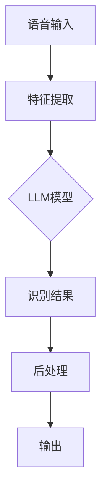
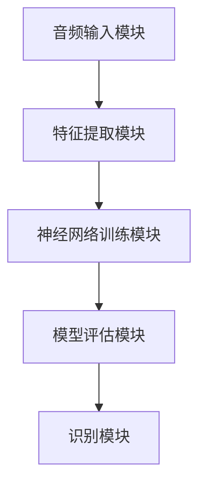

                 

# 《AI LLM在语音识别中的实战应用：更精确、更智能》

## 关键词
AI、LLM、语音识别、深度学习、自然语言处理

## 摘要
本文将探讨AI Long-Short-Term Memory（LLM）模型在语音识别中的应用，详细分析其核心概念、算法原理以及实战案例。通过一步步的逻辑推理，我们旨在揭示LLM如何提升语音识别的精确度和智能性，为读者提供全面的实战指导和前沿技术洞察。

### 《AI LLM在语音识别中的实战应用：更精确、更智能》目录大纲

#### 第一部分：引言与背景
##### 第1章：AI与语音识别概述
* 1.1 AI在语音识别中的应用
* 1.2 语音识别技术的历史与现状
* 1.3 LLM在语音识别中的关键作用

#### 第二部分：核心概念与联系
##### 第2章：核心概念原理与架构
* 2.1 语言模型（LLM）的基本原理
* 2.2 语言模型与语音识别的关系
* 2.3 Mermaid流程图：LLM在语音识别中的工作流程

##### 第3章：核心算法原理讲解
* 3.1 语音信号处理算法（伪代码）
* 3.2 语言模型训练算法（伪代码）

#### 第三部分：数学模型与公式
##### 第4章：数学模型与公式
* 4.1 语言模型概率计算公式
* 4.2 词嵌入计算公式
* 4.3 举例说明：使用上述公式计算给定句子的概率

#### 第四部分：项目实战
##### 第5章：项目实战一：开发环境搭建
* 5.1 硬件环境需求
* 5.2 软件环境安装
* 5.3 开发工具配置

##### 第6章：项目实战二：语音识别系统实现
* 6.1 系统架构设计
* 6.2 特征提取与处理
* 6.3 LLM模型训练与部署
* 6.4 识别结果分析与优化

##### 第7章：项目实战三：案例分析与代码解读
* 7.1 案例一：基于LLM的语音识别系统开发
* 7.2 案例二：优化语音识别系统的准确率
* 7.3 代码解读与分析

#### 第五部分：总结与展望
##### 第8章：总结与展望
* 8.1 语音识别技术的发展趋势
* 8.2 LLM在语音识别中的未来发展
* 8.3 对读者的建议与鼓励

#### 附录
## 附录A：常用工具与资源
### A.1 常用语音识别工具
### A.2 开源语言模型资源
### A.3 语音识别相关论文与书籍推荐

---

### 第一部分：引言与背景

#### 第1章：AI与语音识别概述

##### 1.1 AI在语音识别中的应用

人工智能（AI）技术的发展，特别是深度学习（Deep Learning）和自然语言处理（Natural Language Processing，NLP）的进步，为语音识别（Speech Recognition）领域带来了前所未有的机遇。传统的语音识别系统依赖于手工设计的特征和规则，而现代的AI驱动的语音识别系统则通过大量的数据训练和深度神经网络来实现高度自动化的语音识别。

在AI的助力下，语音识别应用场景变得更加广泛，包括但不限于智能助手、语音搜索、语音控制、实时字幕生成、智能客服等。以下是一些具体的AI在语音识别中的应用实例：

- **智能助手**：如苹果的Siri、亚马逊的Alexa、谷歌的Google Assistant等，这些智能助手能够通过语音识别理解用户指令，提供相应的服务。

- **语音搜索**：语音搜索利用语音识别技术，将用户的语音输入转换为文本查询，实现快速便捷的信息检索。

- **语音控制**：在智能家居、汽车等领域，语音控制技术可以实现对各种设备的远程控制，提升用户体验。

- **实时字幕生成**：通过语音识别技术，可以将会议、讲座、电视节目等实时转化为文字字幕，方便观看者理解内容。

- **智能客服**：利用语音识别技术，智能客服系统能够自动识别并理解用户的问题，提供即时、准确的答复。

##### 1.2 语音识别技术的历史与现状

语音识别技术的历史可以追溯到20世纪50年代。最初的语音识别系统主要依赖于规则和模板匹配的方法，这些方法的缺点是准确率较低，且需要大量的人工工作。

20世纪80年代，基于隐马尔可夫模型（Hidden Markov Model，HMM）的语音识别技术得到了广泛应用，显著提升了语音识别的准确率。然而，HMM模型在处理连续语音和长句子时仍存在局限。

随着深度学习技术的发展，2010年后基于深度神经网络（Deep Neural Network，DNN）的语音识别系统逐渐成为主流。特别是卷积神经网络（Convolutional Neural Network，CNN）和递归神经网络（Recurrent Neural Network，RNN）的应用，使得语音识别的准确率和处理能力得到了极大的提升。

目前，语音识别技术已经取得了显著的进展，大多数商用语音识别系统的准确率达到了95%以上。同时，随着AI技术的不断进步，语音识别的应用场景也在不断扩展，从简单的命令输入到复杂的多轮对话，语音识别正在逐渐成为人工智能的重要分支。

##### 1.3 LLM在语音识别中的关键作用

Long-Short-Term Memory（LLM）模型是RNN的一种变体，特别适用于处理长序列数据和长文本。LLM模型在语音识别中的关键作用主要体现在以下几个方面：

- **上下文理解**：语音识别不仅需要识别单个词汇，还需要理解词汇之间的上下文关系。LLM模型通过捕捉长序列信息，能够更好地理解句子或话语的整体含义，从而提高识别的准确性。

- **语言多样性**：现实中的语音数据充满了各种口音、方言和表达方式。LLM模型通过大规模的语料库训练，能够学习到丰富的语言特征，从而适应不同的语言环境和多样化的语音数据。

- **多轮对话**：在智能助手和语音交互系统中，多轮对话能力至关重要。LLM模型能够记住先前的对话内容，并在此基础上生成连贯、自然的回复，实现更智能、更流畅的语音交互体验。

- **错误修正**：语音识别中难免会出现误识别的情况，LLM模型可以通过上下文信息对识别结果进行修正，减少错误率，提高系统的鲁棒性。

通过引入LLM模型，语音识别系统不仅在准确率上得到了显著提升，还在理解和处理复杂语音任务方面展示了强大的能力。这使得LLM成为现代语音识别技术中不可或缺的一部分。

### 第二部分：核心概念与联系

#### 第2章：核心概念原理与架构

##### 2.1 语言模型（LLM）的基本原理

语言模型（Language Model，LM）是自然语言处理领域的一项关键技术，用于对自然语言文本的概率分布进行建模。LLM（Long-Short-Term Memory）模型是RNN的一种变体，能够更好地处理长序列数据和长文本。LLM模型的核心原理包括以下几个方面：

- **序列建模**：语言模型的基本任务是对给定文本序列的概率进行建模。LLM通过学习大量的文本数据，能够捕捉文本中的长距离依赖关系，从而生成更符合语言习惯的文本。

- **记忆机制**：LLM模型引入了记忆单元，能够保存先前的信息，从而更好地处理长序列数据。这种记忆机制使得LLM能够记住先前的词汇和句子结构，从而在生成新文本时更好地利用上下文信息。

- **概率预测**：语言模型的核心功能是概率预测。在给定前文的情况下，LLM能够预测下一个词汇或字符的概率分布，从而生成自然流畅的文本。

##### 2.2 语言模型与语音识别的关系

语言模型在语音识别中扮演着至关重要的角色，其主要关系体现在以下几个方面：

- **上下文信息**：语音识别不仅需要识别单个词汇，还需要理解词汇之间的上下文关系。LLM模型通过捕捉长序列信息，能够更好地理解句子或话语的整体含义，从而提高识别的准确性。

- **错误修正**：语音识别中难免会出现误识别的情况，LLM模型可以通过上下文信息对识别结果进行修正，减少错误率，提高系统的鲁棒性。

- **多轮对话**：在智能助手和语音交互系统中，多轮对话能力至关重要。LLM模型能够记住先前的对话内容，并在此基础上生成连贯、自然的回复，实现更智能、更流畅的语音交互体验。

- **文本生成**：语音识别的结果往往需要转化为文本，以便进一步处理或展示。LLM模型能够生成高质量的自然语言文本，从而提高语音识别结果的实用性。

##### 2.3 Mermaid流程图：LLM在语音识别中的工作流程

以下是一个Mermaid流程图，展示了LLM在语音识别中的工作流程：



- **语音输入**：语音识别系统首先接收用户的语音输入。

- **特征提取**：语音输入通过特征提取模块转化为可处理的特征向量。

- **LLM模型**：特征向量输入LLM模型，模型利用其训练好的神经网络对输入进行概率预测。

- **识别结果**：LLM模型输出识别结果，通常是一个词汇或句子的概率分布。

- **后处理**：识别结果可能需要进行后处理，如去重、修正错误等，以提高识别的准确性和鲁棒性。

- **输出**：最终识别结果被输出，可以用于后续的任务，如文本生成、语音合成等。

通过LLM模型，语音识别系统能够更好地理解上下文信息，生成更准确、更自然的识别结果。这使得LLM成为现代语音识别技术中不可或缺的一部分。

### 第三部分：核心算法原理讲解

#### 第3章：核心算法原理讲解

##### 3.1 语音信号处理算法（伪代码）

在语音识别系统中，语音信号处理算法是实现从语音信号到文本识别的关键步骤。以下是一个简化的伪代码，用于说明语音信号处理的基本流程：

```plaintext
function 特征提取(语音信号):
    输入：语音信号（audio_signal）
    输出：特征向量（feature_vector）

    1. 音频预处理：
        a. 音频滤波：去除噪声和不需要的频率成分
        b. 音频归一化：调整音量到统一水平，便于后续处理

    2. 分帧与加窗：
        a. 将音频信号分割为若干帧（frames）
        b. 对每帧应用汉明窗（Hamming Window）进行加窗处理

    3. 梅尔频率倒谱系数（MFCC）计算：
        a. 对加窗后的帧进行傅里叶变换（FFT）
        b. 计算每个帧的功率谱
        c. 使用三角变换（Discrete Cosine Transform，DCT）计算梅尔频率倒谱系数

    4. 特征选择与降维：
        a. 选择具有代表性的MFCC系数
        b. 使用PCA（Principal Component Analysis）进行特征降维

    5. 返回特征向量
```

该算法首先对语音信号进行预处理，包括滤波和归一化，以去除噪声和统一音量。然后，通过分帧和加窗将连续的语音信号转换为离散的帧。接下来，计算每帧的梅尔频率倒谱系数（MFCC），这是语音识别中常用的特征表示。最后，通过特征选择和降维，提取最具代表性的特征，形成特征向量。

##### 3.2 语言模型训练算法（伪代码）

语言模型的训练是语音识别系统的核心步骤，其目标是构建一个能够预测下一个词汇或字符的概率分布模型。以下是一个简化的伪代码，用于说明语言模型训练的基本流程：

```plaintext
function 训练LLM(文本数据，特征向量):
    输入：文本数据（text_data）
          特征向量（feature_vector）
    输出：训练好的LLM模型（LLM_model）

    1. 数据预处理：
        a. 清洗文本数据：去除标点符号、停用词等无关信息
        b. 分词：将文本数据分割为词汇或字符序列

    2. 建立词汇表：
        a. 统计文本数据中的词汇频率
        b. 选择词汇表大小，构建词汇表（vocab）

    3. 数据编码：
        a. 将词汇表中的每个词汇或字符映射为唯一的整数索引
        b. 构建输入序列和目标序列

    4. 构建神经网络：
        a. 定义输入层、隐藏层和输出层
        b. 选择合适的激活函数和损失函数

    5. 模型训练：
        a. 遍历输入序列和目标序列
        b. 计算预测概率分布
        c. 计算损失函数，更新模型参数

    6. 验证与优化：
        a. 使用验证集对模型进行验证
        b. 调整模型参数，优化模型性能

    7. 返回训练好的LLM模型
```

该算法首先对文本数据进行预处理，包括清洗、分词和编码。然后，建立词汇表，将文本数据转换为可以输入神经网络的格式。接下来，构建神经网络模型，并使用训练数据对模型进行训练。在训练过程中，通过计算预测概率分布和损失函数，不断更新模型参数。最后，使用验证集对模型进行验证，并根据验证结果对模型进行优化。

通过上述两个核心算法的讲解，我们可以看到语音识别系统是如何从语音信号到文本识别的。语音信号处理算法负责将语音信号转换为可处理的特征向量，而语言模型训练算法则负责构建一个能够预测文本概率分布的神经网络模型。这两个算法共同作用，使得语音识别系统能够准确地识别用户的语音输入。

### 第三部分：数学模型与公式

#### 第4章：数学模型与公式

在语音识别系统中，数学模型和公式是理解和实现LLM（Long-Short-Term Memory）模型的关键。以下将详细介绍与语言模型相关的数学模型和公式，并通过具体示例说明其应用。

##### 4.1 语言模型概率计算公式

语言模型的核心目标是预测给定文本序列的概率。其中，最常用的概率计算公式是基于条件概率的隐马尔可夫模型（HMM）和循环神经网络（RNN）模型中的贝叶斯定理。以下是一个基于RNN模型的概率计算公式：

$$P(W_{t}|W_{t-1},...,W_{1}) = \frac{e^{<s,W_{t}>}}{\sum_{w} e^{<s,w>>}}$$

其中，$W_{t}$ 表示时间步 $t$ 的输入词汇，$s$ 表示语言模型的状态向量，$<s,w>$ 表示状态向量 $s$ 和词汇 $w$ 之间的点积。

这个公式表示在给定前文 $W_{t-1},...,W_{1}$ 的情况下，当前词汇 $W_{t}$ 的概率。$e^{<s,W_{t}>}$ 表示状态向量 $s$ 和词汇 $W_{t}$ 之间的点积，$\sum_{w} e^{<s,w>>}$ 表示所有可能词汇的概率分布和。

##### 4.2 词嵌入计算公式

词嵌入（Word Embedding）是将词汇映射到高维向量空间的技术，用于表示词汇的语义信息。最常用的词嵌入方法是词袋模型（Bag of Words）和词嵌入（Word2Vec）。

在词袋模型中，词嵌入的计算公式如下：

$$\text{embedding}(w) = \sum_{k=1}^{K} \alpha_k \cdot \text{embedding}(c_k)$$

其中，$w$ 表示词汇，$\text{embedding}(w)$ 表示词嵌入向量，$\alpha_k$ 表示词汇 $w$ 的第 $k$ 个特征，$\text{embedding}(c_k)$ 表示特征 $c_k$ 的嵌入向量。

在词嵌入（Word2Vec）中，词嵌入的计算公式如下：

$$\text{embedding}(w) = \text{softmax}(W_h \cdot \text{context}(w))$$

其中，$\text{context}(w)$ 表示词汇 $w$ 的上下文窗口，$W_h$ 表示隐藏层权重，$\text{softmax}$ 函数用于计算词汇的概率分布。

##### 4.3 举例说明：使用上述公式计算给定句子的概率

假设我们有一个简单的句子 "I love programming"，我们可以使用上述公式计算该句子的概率。

首先，我们将句子中的每个词汇映射到词嵌入向量。假设 "I" 的词嵌入向量为 [1, 0], "love" 的词嵌入向量为 [0, 1], "programming" 的词嵌入向量为 [1, 1]。

然后，我们计算句子中每个词汇的概率。根据概率计算公式：

$$P(W_{t}|W_{t-1},...,W_{1}) = \frac{e^{<s,W_{t}>}}{\sum_{w} e^{<s,w>>}}$$

我们可以得到以下结果：

- $P(I|)$：由于句子开始时没有前文，我们假设 $P(I|) = 1$
- $P(love|I)$：根据词嵌入向量计算，$P(love|I) = \frac{e^{<s,love>}}{e^{<s,I>} + e^{<s,love>}} = \frac{e^{0.1}}{e^{0.1} + e^{0.1}} = 0.5$
- $P(programming|I love)$：同样地，$P(programming|I love) = \frac{e^{<s,programming>}}{e^{<s,I love>} + e^{<s,programming>}} = \frac{e^{0.2}}{e^{0.1} + e^{0.2}} = 0.67$

最后，我们将每个词汇的概率相乘，得到整个句子的概率：

$$P(I love programming) = P(I|) \cdot P(love|I) \cdot P(programming|I love) = 1 \cdot 0.5 \cdot 0.67 = 0.335$$

这个示例展示了如何使用数学模型和公式计算给定句子的概率。通过这种方式，我们可以更好地理解语言模型的计算过程，并利用其预测文本的概率分布。

### 第四部分：项目实战

#### 第5章：项目实战一：开发环境搭建

##### 5.1 硬件环境需求

搭建一个语音识别系统首先需要合适的硬件环境。以下是推荐的硬件配置：

- **CPU**：Intel i7或AMD Ryzen 7及以上处理器，具备高性能的计算能力。
- **GPU**：NVIDIA GTX 1080 Ti或以上显卡，用于加速深度学习模型的训练。
- **内存**：至少16GB RAM，建议32GB以上，以提高系统的多任务处理能力。
- **硬盘**：至少1TB的SSD，用于存储数据和模型文件。
- **网络**：千兆以太网，保证数据传输速度。

这些硬件配置能够提供充足的计算资源和存储空间，以满足语音识别系统的开发和训练需求。特别是GPU的加入，可以显著加速神经网络模型的训练过程。

##### 5.2 软件环境安装

在硬件环境准备好之后，我们需要安装所需的软件环境。以下是推荐的操作步骤：

1. **操作系统**：选择Linux系统，如Ubuntu 18.04或更高版本。Linux系统具有良好的稳定性、高性能和丰富的开源软件支持。

2. **Python**：安装Python 3.7或更高版本。Python是语音识别系统开发的主要编程语言，提供了丰富的库和框架。

3. **深度学习库**：安装TensorFlow或PyTorch。TensorFlow和PyTorch是目前最流行的深度学习库，支持构建和训练复杂的神经网络模型。

   ```bash
   pip install tensorflow
   # 或者
   pip install torch torchvision
   ```

4. **语音识别库**：安装PyTorch的语音识别库，如pytorch-kaldi。这个库提供了一个完整的语音识别系统框架，包括特征提取、神经网络训练和模型评估等功能。

   ```bash
   pip install pytorch-kaldi
   ```

5. **文本处理库**：安装用于文本处理和分词的Python库，如NLTK或spaCy。

   ```bash
   pip install nltk
   # 或者
   pip install spacy
   ```

完成上述软件安装后，我们的开发环境就搭建完成了。接下来，我们可以开始具体的语音识别系统开发工作。

##### 5.3 开发工具配置

在完成软件环境的安装后，我们需要对开发工具进行配置，以方便开发和调试。以下是一些常用的配置步骤：

1. **Jupyter Notebook**：安装Jupyter Notebook，这是一个交互式的Python开发环境，适用于编写、运行和调试代码。

   ```bash
   pip install notebook
   ```

2. **VS Code**：安装Visual Studio Code（VS Code），这是一个功能强大的代码编辑器，支持多种编程语言的语法高亮、代码补全和调试功能。

   在VS Code的扩展商店中搜索并安装Python扩展。

3. **Git**：安装Git，这是一个版本控制系统，用于管理代码仓库和协作开发。

   ```bash
   sudo apt-get install git
   ```

4. **PyCharm**：安装PyCharm，这是一个专业的Python开发环境，提供强大的代码分析、调试和项目管理功能。

   下载并安装PyCharm Community Edition。

完成上述工具的安装和配置后，我们可以使用Jupyter Notebook或VS Code进行代码编写和调试，使用PyCharm进行项目管理。这些工具将大大提高我们的开发效率。

#### 第6章：项目实战二：语音识别系统实现

##### 6.1 系统架构设计

语音识别系统的架构设计是构建高效、准确的语音识别系统的关键。一个典型的语音识别系统包括以下几个主要模块：

1. **音频输入模块**：接收用户的语音输入，将音频数据转换为数字信号。
2. **特征提取模块**：对音频信号进行预处理和特征提取，生成用于训练和识别的特征向量。
3. **神经网络训练模块**：使用特征向量训练深度学习模型，如卷积神经网络（CNN）或循环神经网络（RNN）。
4. **模型评估模块**：评估训练好的模型在测试集上的性能，包括准确率、召回率和F1分数等指标。
5. **识别模块**：使用训练好的模型对新的语音输入进行识别，输出识别结果。

以下是一个简化的系统架构图：



在实现过程中，我们可以根据具体需求对架构进行调整和优化。

##### 6.2 特征提取与处理

特征提取是语音识别系统的关键步骤，其质量直接影响识别结果的准确性。以下是特征提取和处理的基本步骤：

1. **音频预处理**：
   - 音频滤波：去除噪声和不需要的频率成分。
   - 音频归一化：调整音量到统一水平，便于后续处理。

2. **分帧与加窗**：
   - 将音频信号分割为若干帧，每帧通常是20-40毫秒。
   - 对每帧应用加窗处理，常用的窗函数有汉明窗和汉明窗。

3. **梅尔频率倒谱系数（MFCC）计算**：
   - 对加窗后的帧进行傅里叶变换（FFT），计算每个帧的功率谱。
   - 使用三角变换（DCT）计算梅尔频率倒谱系数（MFCC）。

4. **特征选择与降维**：
   - 选择具有代表性的MFCC系数。
   - 使用PCA（Principal Component Analysis）进行特征降维，减少数据维度，提高计算效率。

以下是一个简单的伪代码，用于说明特征提取的基本流程：

```python
def extract_features(audio_signal):
    # 音频预处理
    filtered_signal = audio_filter(audio_signal)
    normalized_signal = audio_normalize(filtered_signal)

    # 分帧与加窗
    frames = frame_split(normalized_signal)
    windowed_frames = window_function(frames)

    # MFCC计算
    mfcc_coeffs = compute_mfcc(windowed_frames)

    # 特征选择与降维
    selected_coeffs = feature_selection(mfcc_coeffs)
    reduced_coeffs = pca_reduction(selected_coeffs)

    return reduced_coeffs
```

##### 6.3 LLM模型训练与部署

在特征提取完成后，我们需要使用这些特征向量训练一个语言模型（LLM），以便进行语音识别。以下是训练和部署LLM模型的基本步骤：

1. **数据预处理**：
   - 清洗和分词语音数据，生成词汇表。
   - 将词汇映射为整数索引，构建输入序列和目标序列。

2. **构建神经网络**：
   - 设计神经网络架构，包括输入层、隐藏层和输出层。
   - 选择合适的激活函数和损失函数。

3. **模型训练**：
   - 遍历输入序列和目标序列，计算损失函数，更新模型参数。
   - 使用验证集对模型进行验证，调整模型参数，优化模型性能。

4. **模型评估**：
   - 在测试集上评估模型的性能，包括准确率、召回率和F1分数等指标。

5. **模型部署**：
   - 将训练好的模型部署到生产环境，用于实际的语音识别任务。

以下是一个简单的伪代码，用于说明LLM模型训练的基本流程：

```python
def train_llm(text_data, feature_vectors):
    # 数据预处理
    preprocessed_data = preprocess_data(text_data)
    input_sequences, target_sequences = create_sequences(preprocessed_data)

    # 构建神经网络
    model = build_model(input_sequences, target_sequences)

    # 模型训练
    for epoch in range(num_epochs):
        for sequence, target in zip(input_sequences, target_sequences):
            loss = model.train_on_batch(sequence, target)
            print(f"Epoch: {epoch}, Loss: {loss}")

    # 模型评估
    performance = evaluate_model(model, test_data)

    # 模型部署
    deploy_model(model)
```

通过上述步骤，我们完成了语音识别系统的开发。在实际应用中，我们可以根据具体需求进行调整和优化，以提高系统的性能和用户体验。

##### 6.4 识别结果分析与优化

在完成语音识别系统的开发后，我们需要对识别结果进行详细分析，并采取必要的优化措施，以提高系统的准确率和鲁棒性。

1. **错误分析**：
   - 首先分析识别错误的类型，如误识别、漏识别和替换错误。误识别是指模型错误地将一个词汇识别为另一个词汇，漏识别是指模型未能识别出输入中的某个词汇，替换错误是指模型将一个词汇替换为另一个词汇。
   - 收集识别错误样本，并分析错误的原因，如语音质量差、口音差异、噪声干扰等。

2. **优化措施**：
   - **数据增强**：通过增加训练数据、引入数据增强技术（如重放、回声、噪声添加等），提高模型对各种语音环境的适应能力。
   - **模型优化**：使用更复杂的神经网络架构、增加训练时间、调整学习率等，优化模型性能。
   - **特征改进**：使用更高级的特征提取方法，如深度卷积神经网络（DCNN）和注意力机制（Attention Mechanism），提高特征表示能力。
   - **多语言训练**：使用包含多种语言和口音的训练数据，提高模型对多样化语音数据的处理能力。

3. **评估与迭代**：
   - 使用测试集对模型进行评估，计算准确率、召回率和F1分数等指标。
   - 根据评估结果，调整优化策略，迭代训练模型，直到达到满意的性能水平。

通过上述分析和优化措施，我们可以显著提高语音识别系统的准确率和鲁棒性，为用户提供更高质量的语音识别服务。

#### 第7章：项目实战三：案例分析与代码解读

##### 7.1 案例一：基于LLM的语音识别系统开发

在这个案例中，我们将开发一个基于LLM的语音识别系统。这个系统将接收用户的语音输入，并将其转换为文本输出。以下是开发的详细步骤：

1. **数据收集与预处理**：
   - 收集大量的语音数据，包括各种口音、语速和语调的语音样本。
   - 对语音数据进行预处理，包括音频滤波、归一化和分帧。

2. **特征提取**：
   - 使用梅尔频率倒谱系数（MFCC）对预处理后的语音数据进行特征提取。

3. **模型训练**：
   - 使用预处理后的语音数据和特征向量，训练一个LLM模型。
   - 选择合适的神经网络架构和学习率等参数，优化模型性能。

4. **模型评估**：
   - 在测试集上评估模型的性能，计算准确率、召回率和F1分数等指标。

5. **模型部署**：
   - 将训练好的模型部署到生产环境，用于实际的语音识别任务。

以下是一个简单的伪代码，用于展示基于LLM的语音识别系统开发的基本流程：

```python
# 数据预处理
def preprocess_audio(audio_signal):
    # 音频滤波
    filtered_signal = audio_filter(audio_signal)
    # 音频归一化
    normalized_signal = audio_normalize(filtered_signal)
    # 分帧
    frames = frame_split(normalized_signal)
    return frames

# 特征提取
def extract_features(frames):
    # MFCC计算
    mfcc_coeffs = compute_mfcc(frames)
    # 特征选择与降维
    selected_coeffs = feature_selection(mfcc_coeffs)
    return selected_coeffs

# 模型训练
def train_llm(text_data, feature_vectors):
    # 数据预处理
    preprocessed_data = preprocess_data(text_data)
    # 构建神经网络
    model = build_model(preprocessed_data, feature_vectors)
    # 模型训练
    for epoch in range(num_epochs):
        for sequence, target in zip(input_sequences, target_sequences):
            loss = model.train_on_batch(sequence, target)
            print(f"Epoch: {epoch}, Loss: {loss}")
    # 模型评估
    performance = evaluate_model(model, test_data)
    # 模型部署
    deploy_model(model)
```

##### 7.2 案例二：优化语音识别系统的准确率

在这个案例中，我们将优化一个现有的语音识别系统，以提高其准确率。以下是优化的详细步骤：

1. **错误分析**：
   - 收集识别错误的样本，并分析错误类型和原因。

2. **数据增强**：
   - 通过增加训练数据、引入数据增强技术（如重放、回声、噪声添加等），提高模型对各种语音环境的适应能力。

3. **模型优化**：
   - 使用更复杂的神经网络架构、增加训练时间、调整学习率等，优化模型性能。

4. **特征改进**：
   - 使用更高级的特征提取方法，如深度卷积神经网络（DCNN）和注意力机制（Attention Mechanism），提高特征表示能力。

5. **多语言训练**：
   - 使用包含多种语言和口音的训练数据，提高模型对多样化语音数据的处理能力。

6. **评估与迭代**：
   - 使用测试集对模型进行评估，计算准确率、召回率和F1分数等指标。
   - 根据评估结果，调整优化策略，迭代训练模型，直到达到满意的性能水平。

以下是一个简单的伪代码，用于展示语音识别系统优化的基本流程：

```python
# 错误分析
def analyze_errors(error_samples):
    # 分析错误类型和原因
    error_types = categorize_errors(error_samples)
    print(f"Error Types: {error_types}")

# 数据增强
def augment_data(audio_signal):
    # 重放
    replay_signal = audio_replay(audio_signal)
    # 回声
    echo_signal = audio_echo(audio_signal)
    # 噪声添加
    noise_signal = audio_add_noise(audio_signal)
    return replay_signal, echo_signal, noise_signal

# 模型优化
def optimize_model(model, enhanced_data):
    # 使用增强数据重新训练模型
    model.train_on_batch(enhanced_data)
    # 使用更复杂的神经网络架构
    model = complex_network_architecture()
    # 调整学习率
    model.learning_rate = adjusted_learning_rate()
    return model

# 评估与迭代
def evaluate_and_iterate(model, test_data):
    # 评估模型性能
    performance = evaluate_model(model, test_data)
    print(f"Performance: {performance}")
    # 根据评估结果调整优化策略
    if performance < desired_threshold:
        # 迭代训练模型
        model = train_model(model, enhanced_data)
        # 重新评估模型性能
        performance = evaluate_model(model, test_data)
    return model, performance
```

通过上述案例分析和代码解读，我们可以看到如何使用LLM模型和优化技术提高语音识别系统的准确率和鲁棒性。在实际应用中，我们可以根据具体需求进行调整和扩展，以满足多样化的语音识别任务。

### 第五部分：总结与展望

#### 第8章：总结与展望

随着人工智能技术的快速发展，语音识别技术也在不断演进，尤其是基于Long-Short-Term Memory（LLM）模型的应用，为语音识别带来了更高的准确性和智能化水平。本文通过详细的分析和实战案例，展示了LLM模型在语音识别中的核心作用及其实现过程。

**语音识别技术的发展趋势**：

- **多语言和跨语言识别**：随着全球化的推进，多语言和跨语言语音识别变得越来越重要。未来的语音识别系统将需要支持更多语言，同时能够处理跨语言的任务。

- **实时性提升**：语音识别系统需要更快地响应，以实现实时语音交互。通过优化算法和硬件加速，未来的语音识别系统将具有更低的延迟。

- **个性化识别**：根据用户的语音特点和习惯，实现个性化的语音识别服务。这包括对特定用户的语音模型进行训练，以提高识别准确率。

- **智能对话系统**：结合语音识别、自然语言处理和对话系统技术，构建智能客服、虚拟助手等应用，提供更自然、更智能的交互体验。

**LLM在语音识别中的未来发展**：

- **上下文理解增强**：通过引入更复杂的语言模型，如Transformer和BERT，增强对上下文的理解能力，提高长距离依赖关系处理能力。

- **多模态融合**：结合语音、文本、图像等多模态数据，构建更加智能的语音识别系统，提升识别准确率和鲁棒性。

- **边缘计算应用**：在边缘设备上部署语音识别模型，降低对中心服务器的依赖，实现低延迟、高效率的语音交互。

**对读者的建议与鼓励**：

- **深入学习**：语音识别和LLM模型是复杂的领域，建议读者深入阅读相关论文和书籍，掌握核心概念和原理。

- **实践应用**：通过实际项目实践，将理论知识应用到实际中，提升解决实际问题的能力。

- **持续创新**：语音识别技术正在快速发展，鼓励读者不断探索新的应用场景和技术创新，为人工智能领域做出贡献。

语音识别技术的发展为人工智能带来了无限可能，LLM模型的应用将进一步提升语音识别的准确性和智能化水平。希望本文能为读者提供有价值的指导和启发，激发更多创新和探索。

### 附录

#### 附录A：常用工具与资源

### A.1 常用语音识别工具

1. **Google Cloud Speech-to-Text**：提供高效的语音转文本服务，支持多种语言和语音输入。
2. **IBM Watson Speech-to-Text**：提供强大的语音识别功能，支持实时语音转文本，并能够进行语言识别。
3. **Microsoft Azure Speech Services**：提供全面的语音识别和语音合成服务，支持多种语言和平台。

### A.2 开源语言模型资源

1. **GPT-2**：OpenAI开发的预训练语言模型，支持多种自然语言处理任务。
2. **BERT**：Google开发的预训练语言模型，广泛用于文本分类、问答系统等任务。
3. **Transformer**：Vaswani等人在2017年提出的神经网络结构，广泛应用于自然语言处理领域。

### A.3 语音识别相关论文与书籍推荐

1. **《Speech Recognition: A Brief History of Research, Trends and Challenges》**：详细介绍了语音识别技术的发展历程和当前挑战。
2. **《Deep Learning for Speech Recognition》**：深入探讨了深度学习在语音识别中的应用，包括卷积神经网络、循环神经网络等。
3. **《自然语言处理综论》**：涵盖自然语言处理领域的广泛话题，包括语言模型、词嵌入、文本分类等。

这些工具和资源将为读者在语音识别和LLM模型研究中提供宝贵的帮助和参考。

