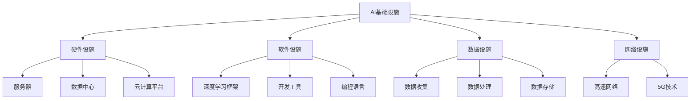
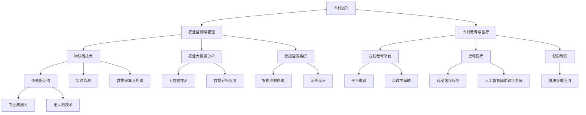
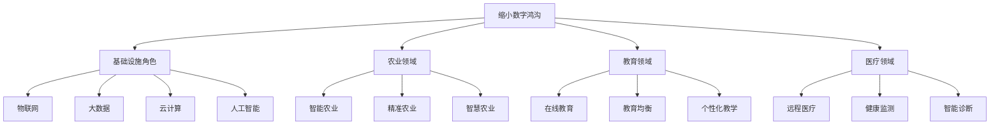

                 

### **文章标题：AI基础设施的乡村振兴：缩小数字鸿沟**

> **关键词：** 乡村振兴，数字鸿沟，人工智能，基础设施，农业，教育，医疗，乡村发展。

> **摘要：** 本文探讨了AI基础设施在乡村振兴中的作用，重点分析了AI技术在农业、教育、医疗等领域的应用，以及如何通过缩小数字鸿沟实现乡村发展。文章通过详细的案例分析和技术讲解，揭示了AI基础设施建设的必要性和可行性，为我国乡村振兴提供了有益的思路和参考。

### **目录大纲**

#### **第一部分：引言与背景**

- **第1章：乡村振兴与数字鸿沟**
  - 1.1 乡村振兴的重要性
  - 1.2 数字鸿沟的概念与影响
  - 1.3 AI基础设施对乡村振兴的作用

#### **第二部分：AI基础设施概述**

- **第2章：AI基础设施的概念与结构**
  - 2.1 AI基础设施的定义
  - 2.2 AI基础设施的组成部分
  - 2.3 AI基础设施与乡村振兴的关联

#### **第三部分：AI技术在乡村振兴中的应用**

- **第3章：农业领域的AI应用**
  - 3.1 农业监测与管理的AI应用
  - 3.2 农产品溯源与质量监控
  - 3.3 农业自动化与机器人技术

- **第4章：乡村教育与医疗的AI应用**
  - 4.1 乡村教育资源均衡化
  - 4.2 在线教育平台与AI教学辅助
  - 4.3 乡村医疗健康服务
  - 4.4 人工智能辅助诊疗系统

#### **第四部分：缩小数字鸿沟的AI基础设施建设**

- **第5章：数字鸿沟的成因与对策**
  - 5.1 数字鸿沟的成因
  - 5.2 缩小数字鸿沟的策略
  - 5.3 AI基础设施在缩小数字鸿沟中的角色

- **第6章：AI基础设施建设的实践案例**
  - 6.1 国内外AI基础设施建设的成功案例
  - 6.2 乡村振兴与数字鸿沟缩小中的AI实践
  - 6.3 挑战与展望

#### **第五部分：未来展望与总结**

- **第7章：AI基础设施的乡村振兴趋势**
  - 7.1 AI技术发展趋势
  - 7.2 乡村振兴的未来展望
  - 7.3 AI基础设施建设的未来规划

#### **附录**

- **附录A：AI基础设施相关资源与工具**
  - A.1 开源框架与工具介绍
  - A.2 AI基础设施开发指南
  - A.3 AI基础设施常见问题解答

### **第一部分：引言与背景**

#### **第1章：乡村振兴与数字鸿沟**

##### **1.1 乡村振兴的重要性**

乡村振兴是全面建设社会主义现代化国家的重大战略任务，关系到全面建设社会主义现代化国家全局。乡村振兴的总体目标是“产业兴旺、生态宜居、乡风文明、治理有效、生活富裕”，核心任务是推动乡村产业振兴、人才振兴、文化振兴、生态振兴、组织振兴。

产业振兴是乡村振兴的基础，通过发展乡村产业，提高农民收入水平，促进农村经济持续健康发展。人才振兴是乡村振兴的关键，通过培养和引进各类人才，提高乡村人才素质，推动乡村经济社会全面发展。文化振兴是乡村振兴的灵魂，通过弘扬传统文化，培育文明乡风，提高乡村文化软实力。生态振兴是乡村振兴的根本，通过保护生态环境，改善乡村居住环境，实现人与自然和谐共生。组织振兴是乡村振兴的保障，通过加强基层组织建设，提高乡村治理水平，为乡村振兴提供有力组织保障。

##### **1.2 数字鸿沟的概念与影响**

数字鸿沟是指由于信息技术发展不平衡而导致的社会群体之间在获取、使用和受益于信息技术方面的差距。数字鸿沟可以从多个维度进行分类，如地域差异、经济水平差异、教育程度差异等。

数字鸿沟的影响主要体现在以下几个方面：

1. 经济发展差距：数字鸿沟导致城乡、区域之间的经济发展差距扩大，影响国家整体经济的均衡发展。
2. 教育资源分配不均：数字鸿沟使得教育资源分配不均，农村地区学生难以获得优质教育资源，影响教育公平。
3. 社会治理水平差距：数字鸿沟导致农村地区社会治理水平较低，影响社会稳定和乡村治理现代化。
4. 生活质量差异：数字鸿沟使得农村地区居民在信息化、数字化方面的生活体验较差，影响居民生活质量。

##### **1.3 AI基础设施对乡村振兴的作用**

AI基础设施是支撑人工智能技术发展的重要基础，对乡村振兴具有重要作用。

1. **提高农业生产力**：AI技术可以提高农业生产的智能化、精准化水平，提高农业生产效率，促进农业现代化发展。
2. **优化教育资源配置**：AI技术可以推动在线教育、个性化教学等新兴教育模式的发展，实现教育资源的优化配置，促进教育公平。
3. **提升医疗服务水平**：AI技术可以提高医疗服务效率，推动远程医疗服务的发展，改善农村地区医疗条件，提高医疗服务水平。
4. **促进乡村治理现代化**：AI技术可以应用于乡村治理，提高乡村治理效率，提升乡村治理水平。
5. **缩小数字鸿沟**：AI基础设施的建设有助于缩小城乡、区域之间的数字鸿沟，促进信息化、数字化在乡村地区的普及。

### **第二部分：AI基础设施概述**

#### **第2章：AI基础设施的概念与结构**

##### **2.1 AI基础设施的定义**

AI基础设施是指为支持人工智能技术的研究、开发和应用而提供的一系列基础资源、技术和服务的集合。AI基础设施不仅包括硬件设施，如服务器、数据中心、云计算平台等，还包括软件设施、数据设施和网络设施等。

##### **2.2 AI基础设施的组成部分**

AI基础设施主要包括以下四个组成部分：

1. **硬件设施**：包括服务器、存储设备、网络设备、物联网设备等，用于提供计算、存储、网络等基础设施服务。
2. **软件设施**：包括深度学习框架、开发工具、编程语言等，用于支持人工智能算法的研究、开发和部署。
3. **数据设施**：包括数据收集、处理、存储和管理等技术，用于提供高质量的数据资源。
4. **网络设施**：包括高速网络、5G技术等，用于实现数据的高速传输和实时通信。

##### **2.3 AI基础设施与乡村振兴的关联**

AI基础设施与乡村振兴密切相关，具体体现在以下几个方面：

1. **提高农业生产效率**：AI基础设施可以提供智能化的农业生产工具和系统，如智能灌溉系统、农业无人机等，提高农业生产效率，促进农业现代化发展。
2. **优化教育资源配置**：AI基础设施可以推动在线教育、个性化教学等新兴教育模式的发展，实现教育资源的优化配置，促进教育公平。
3. **提升医疗服务水平**：AI基础设施可以推动远程医疗服务的发展，提高医疗服务效率，改善农村地区医疗条件，提高医疗服务水平。
4. **促进乡村治理现代化**：AI基础设施可以应用于乡村治理，提高乡村治理效率，提升乡村治理水平。
5. **缩小数字鸿沟**：AI基础设施的建设有助于缩小城乡、区域之间的数字鸿沟，促进信息化、数字化在乡村地区的普及。

### **第三部分：AI技术在乡村振兴中的应用**

#### **第3章：农业领域的AI应用**

##### **3.1 农业监测与管理的AI应用**

AI技术在农业监测与管理中的应用主要包括物联网技术、农业大数据分析、智能灌溉系统等。

1. **物联网技术在农业中的应用**

物联网技术通过传感器网络实现对农业环境的实时监测，如土壤湿度、温度、光照等参数。物联网技术可以实时采集数据，并通过无线网络传输到数据中心进行处理和分析。

2. **农业大数据分析**

农业大数据分析利用人工智能技术对海量农业数据进行处理和分析，实现对作物生长状况、病虫害预测、产量预测等方面的智能化管理。农业大数据分析可以提供科学依据，帮助农民优化农业生产方案。

3. **智能灌溉系统**

智能灌溉系统利用传感器和智能算法，根据土壤湿度、气温等环境参数自动控制灌溉设备，实现精准灌溉。智能灌溉系统可以节约水资源，提高灌溉效率，降低生产成本。

##### **3.2 农产品溯源与质量监控**

AI技术在农产品溯源与质量监控中的应用主要包括二维码溯源、区块链技术、图像识别等。

1. **二维码溯源**

通过在农产品包装上粘贴二维码，消费者可以通过扫描二维码了解农产品的生产、加工、运输等全过程。二维码溯源可以提高农产品透明度，增强消费者信任。

2. **区块链技术**

区块链技术可以实现农产品的全流程追溯，从生产到消费的每个环节都记录在区块链上，确保数据不可篡改。区块链技术可以提高农产品供应链的透明度，降低假冒伪劣农产品的风险。

3. **图像识别**

图像识别技术可以用于检测农产品质量，如蔬菜的成熟度、水果的瑕疵等。通过图像识别技术，可以实时监测农产品质量，确保农产品质量符合标准。

##### **3.3 农业自动化与机器人技术**

AI技术在农业自动化与机器人技术中的应用主要包括农业无人机、农业机器人等。

1. **农业无人机**

农业无人机可以在大范围内进行农作物监测，如病虫害监测、土壤检测等。农业无人机可以大幅提高农业监测效率，降低人力成本。

2. **农业机器人**

农业机器人可以在农田中进行种植、施肥、收割等作业，提高农业生产效率。农业机器人可以适应不同地形和农作物需求，实现智能化农业生产。

#### **第4章：乡村教育与医疗的AI应用**

##### **4.1 乡村教育资源均衡化**

AI技术在乡村教育资源均衡化中的应用主要包括在线教育平台、AI教学辅助等。

1. **在线教育平台**

在线教育平台可以为乡村学生提供丰富的课程资源，包括名师授课、互动教学等。通过在线教育平台，乡村学生可以享受到与城市学生同等的教育资源。

2. **AI教学辅助**

AI教学辅助技术可以根据学生的学习情况和需求，提供个性化的学习建议和指导。AI教学辅助可以帮助教师更好地进行教学，提高教学效果。

##### **4.2 在线教育平台与AI教学辅助**

1. **在线教育平台**

在线教育平台的发展有助于实现教育资源的优化配置，缩小城乡教育差距。通过在线教育平台，乡村学生可以接触到更多优质教育资源，提高教育质量。

2. **AI教学辅助**

AI教学辅助技术可以根据学生的学习情况和需求，提供个性化的学习建议和指导。AI教学辅助可以帮助教师更好地进行教学，提高教学效果。

##### **4.3 乡村医疗健康服务**

AI技术在乡村医疗健康服务中的应用主要包括远程医疗、健康管理、人工智能辅助诊疗系统等。

1. **远程医疗**

远程医疗技术可以实现对乡村患者的远程诊疗，提高医疗服务的覆盖面和效率。通过远程医疗，乡村患者可以享受到专家级的医疗服务。

2. **健康管理**

AI健康管理技术可以通过数据分析，对乡村居民的健康状况进行实时监控和预警，提供个性化的健康建议。

3. **人工智能辅助诊疗系统**

人工智能辅助诊疗系统可以帮助乡村医生进行疾病诊断、治疗方案推荐等，提高医疗服务水平。

#### **第5章：数字鸿沟的成因与对策**

##### **5.1 数字鸿沟的成因**

数字鸿沟的成因复杂多样，主要包括以下几个方面：

1. **经济水平差异**：经济发达地区更容易获得信息技术资源和资金支持，而经济落后地区则难以满足数字基础设施建设的需求。
2. **教育资源分配不均**：教育资源分配不均导致城乡、区域之间在教育水平和技能获取方面的差距，进一步加剧了数字鸿沟。
3. **基础设施建设滞后**：数字基础设施建设滞后，导致一些地区无法实现高速互联网接入，限制了信息技术应用的普及。
4. **政策支持不足**：政策支持不足，导致数字鸿沟问题得不到有效解决，影响社会公平和经济发展。

##### **5.2 缩小数字鸿沟的策略**

为了缩小数字鸿沟，可以采取以下策略：

1. **加强基础设施建设**：加大数字基础设施建设投入，提高网络覆盖率，实现城乡、区域间的信息互联互通。
2. **提升教育水平**：加大教育资源投入，提高教育质量，促进城乡教育均衡发展，提升全民数字素养。
3. **推动产业升级**：发展数字经济，推动产业数字化、智能化转型，创造更多数字就业机会，提升经济整体竞争力。
4. **政策支持与引导**：制定相关政策，加大对数字鸿沟问题的关注和投入，引导社会资本参与数字基础设施建设。

##### **5.3 AI基础设施在缩小数字鸿沟中的角色**

AI基础设施在缩小数字鸿沟中具有重要作用：

1. **提高资源利用率**：AI基础设施可以提高资源利用率，通过大数据分析、智能优化等技术，实现资源的最优配置。
2. **促进教育均衡发展**：AI基础设施可以推动在线教育、个性化教学等新兴教育模式的发展，实现教育资源的优化配置。
3. **提升医疗服务水平**：AI基础设施可以推动远程医疗服务的发展，提高医疗服务覆盖面和效率，缩小城乡医疗服务差距。
4. **推动产业升级**：AI基础设施可以促进产业数字化、智能化转型，创造更多数字就业机会，提升经济整体竞争力。

### **第6章：AI基础设施建设的实践案例**

##### **6.1 国内外AI基础设施建设的成功案例**

在国内，许多地方政府和企业已经开展了AI基础设施建设，取得了一系列成功案例。以下为几个典型例子：

1. **深圳智慧城市建设**：深圳市通过建设智能交通系统、智能安防系统、智能城市管理系统等，实现了城市治理的智能化和高效化。
2. **华为智能城市解决方案**：华为公司提供了包括云计算、大数据、人工智能等在内的智能城市解决方案，广泛应用于国内外多个城市。
3. **阿里巴巴数字乡村项目**：阿里巴巴集团在多个地区开展数字乡村项目，通过云计算、大数据、物联网等技术，提升乡村信息化水平。

在国际上，许多国家也积极推进AI基础设施建设，以下为几个成功案例：

1. **美国智能城市计划**：美国政府推出了智能城市计划，通过大数据、人工智能等技术创新，提升城市治理水平。
2. **日本智慧医疗项目**：日本政府推动智慧医疗项目，通过人工智能、物联网等技术，提高医疗服务质量和效率。
3. **新加坡数字政府计划**：新加坡政府实施了数字政府计划，通过大数据、人工智能等技术创新，提高政府服务效率和透明度。

##### **6.2 乡村振兴与数字鸿沟缩小中的AI实践**

在乡村振兴和数字鸿沟缩小中，AI基础设施建设发挥了重要作用。以下为几个实际应用案例：

1. **农业智能化管理**：通过物联网技术和大数据分析，对农作物生长环境、病虫害等进行实时监测和预测，提高农业生产效率和质量。
2. **远程教育平台**：利用AI技术，搭建远程教育平台，为乡村学生提供优质教育资源，缩小城乡教育差距。
3. **智慧医疗系统**：通过人工智能辅助诊疗系统，提高医疗服务质量和效率，解决乡村医疗资源短缺问题。

##### **6.3 挑战与展望**

在AI基础设施建设过程中，面临着一系列挑战。以下为几个主要挑战：

1. **技术人才短缺**：AI技术发展迅速，但相关人才供应不足，制约了AI基础设施建设的推进。
2. **数据隐私和安全**：在AI基础设施建设和应用过程中，涉及大量个人数据和隐私信息，如何保障数据安全和隐私保护成为重要挑战。
3. **政策和法规不完善**：AI基础设施建设需要完善的政策和法规支持，目前相关政策法规尚不健全，影响了AI基础设施建设的推进。

展望未来，AI基础设施建设将继续发挥重要作用，以下为几个发展趋势：

1. **智能化水平提升**：随着AI技术的不断进步，AI基础设施的智能化水平将得到显著提升，为各行业提供更加智能化的解决方案。
2. **产业融合发展**：AI基础设施建设将推动各产业的数字化、智能化转型，实现产业融合发展。
3. **城乡差距缩小**：通过AI基础设施建设，将进一步缩小城乡差距，促进城乡协调发展。

### **第7章：AI基础设施的乡村振兴趋势**

##### **7.1 AI技术发展趋势**

AI技术正快速发展，未来将呈现出以下趋势：

1. **深度学习与强化学习**：深度学习和强化学习等技术将继续推动AI技术发展，提高AI系统的智能水平和应用效果。
2. **生成对抗网络（GAN）**：GAN技术在图像生成、语音合成等方面具有广泛应用前景，未来将继续推动AI技术的发展。
3. **迁移学习与少样本学习**：迁移学习和少样本学习技术将提高AI系统的泛化能力，降低训练成本，扩大AI技术的应用领域。

##### **7.2 乡村振兴的未来展望**

乡村振兴的未来展望包括以下几个方面：

1. **农业现代化**：通过AI技术，实现农业生产的智能化、精准化，推动农业现代化发展。
2. **教育均衡化**：利用AI技术，实现教育资源的优化配置，缩小城乡教育差距，提高教育质量。
3. **医疗服务普及化**：通过AI技术，提高医疗服务质量和效率，推动医疗服务向农村地区普及。

##### **7.3 AI基础设施建设的未来规划**

未来AI基础设施建设的规划包括以下几个方面：

1. **加大政策支持**：制定和完善相关政策法规，加大对AI基础设施建设的支持力度。
2. **培养人才**：加强AI领域人才培养，提高人才素质，为AI基础设施建设提供人才保障。
3. **技术创新**：加大技术创新力度，推动AI技术的快速发展，为AI基础设施建设提供技术支撑。

### **附录**

#### **附录A：AI基础设施相关资源与工具**

**A.1 开源框架与工具介绍**

1. **TensorFlow**：由Google开发的开源深度学习框架，广泛应用于各种深度学习应用。
2. **PyTorch**：由Facebook开发的开源深度学习框架，具有灵活的动态计算图和易于使用的接口。
3. **Keras**：基于TensorFlow和Theano的开源深度学习框架，提供简洁的API和易于使用的模型构建工具。
4. **MXNet**：由Apache Software Foundation维护的开源深度学习框架，支持多种编程语言。
5. **Caffe**：由伯克利视觉和学习中心开发的开源深度学习框架，适用于图像识别任务。

**A.2 AI基础设施开发指南**

1. **硬件设施**：介绍服务器、数据中心、云计算平台的选择与配置。
2. **软件设施**：介绍深度学习框架、开发工具、编程语言的使用方法。
3. **数据设施**：介绍数据收集、处理、存储的最佳实践。
4. **网络设施**：介绍高速网络、5G技术等网络基础设施的应用与优势。

**A.3 AI基础设施常见问题解答**

1. **硬件相关问题**：如服务器性能优化、数据中心布局等。
2. **软件相关问题**：如框架选择、代码调试等。
3. **数据相关问题**：如数据预处理、数据清洗等。
4. **网络相关问题**：如网络延迟、安全性等。

---

## **核心概念与联系**

在本文中，我们探讨了多个核心概念，并分析了它们之间的联系。以下是这些核心概念的 Mermaid 流程图和简要说明：

### **AI基础设施的概念与结构**

**Mermaid 流程图：**


**简要说明：**
- **AI基础设施**：涵盖了硬件、软件、数据、网络等各个方面，是支持AI技术发展的基础。
- **硬件设施**：包括服务器、数据中心、云计算平台等，提供了计算和存储能力。
- **软件设施**：包括深度学习框架、开发工具、编程语言等，用于AI算法的研究、开发和部署。
- **数据设施**：包括数据收集、处理、存储等技术，为AI训练提供了高质量的数据资源。
- **网络设施**：包括高速网络、5G技术等，实现了数据的高速传输和实时通信。

### **AI技术在乡村振兴中的应用**

**Mermaid 流程图：**


**简要说明：**
- **乡村振兴**：涵盖了农业、教育、医疗等多个领域，通过AI技术的应用，实现乡村的全面发展。
- **农业监测与管理**：利用物联网技术、农业大数据分析、智能灌溉系统等，提高农业生产的智能化水平。
- **乡村教育与医疗**：通过在线教育平台、远程医疗、健康管理等技术，实现教育资源的优化配置和医疗服务的普及。

### **缩小数字鸿沟的AI基础设施建设**

**Mermaid 流程图：**


**简要说明：**
- **缩小数字鸿沟**：通过AI基础设施建设，实现城乡、区域间的信息化、数字化发展，缩小数字鸿沟。
- **基础设施角色**：物联网、大数据、云计算、人工智能等技术在缩小数字鸿沟中发挥了关键作用。
- **农业领域**：通过智能农业、精准农业、智慧农业等技术，提高农业生产效率，推动农业现代化发展。
- **教育领域**：通过在线教育、教育均衡、个性化教学等技术，优化教育资源配置，提高教育质量。
- **医疗领域**：通过远程医疗、健康监测、智能诊断等技术，提高医疗服务覆盖面和效率，改善医疗条件。

---

## **核心算法原理讲解**

在本文中，我们将讲解几个核心算法的原理，包括深度学习中的神经网络、自然语言处理中的嵌入技术、大规模预训练模型的迁移学习等。

### **深度学习与神经网络基础**

深度学习中的神经网络是构建人工智能系统的基础。以下是神经网络的基本原理和实现步骤。

**伪代码：**

```python
# 定义神经网络结构
def create_neural_network(input_shape, hidden_layer_sizes, output_size):
    model = tf.keras.Sequential()
    model.add(tf.keras.layers.Dense(units=hidden_layer_sizes[0], activation='relu', input_shape=input_shape))
    for size in hidden_layer_sizes[1:]:
        model.add(tf.keras.layers.Dense(units=size, activation='relu'))
    model.add(tf.keras.layers.Dense(units=output_size, activation='softmax'))
    return model

# 训练神经网络
def train_neural_network(model, x_train, y_train, epochs):
    model.compile(optimizer='adam', loss='categorical_crossentropy', metrics=['accuracy'])
    model.fit(x_train, y_train, epochs=epochs)
    return model

# 评估神经网络
def evaluate_neural_network(model, x_test, y_test):
    loss, accuracy = model.evaluate(x_test, y_test)
    print(f"Test accuracy: {accuracy:.4f}")
    return accuracy
```

**详细讲解：**

1. **神经网络结构**：神经网络由多个层次组成，包括输入层、隐藏层和输出层。每一层由多个神经元（或称为节点）组成，神经元之间通过权重连接。

2. **前向传播**：输入数据通过输入层进入神经网络，然后逐层传递到隐藏层，最后传递到输出层。每一层神经元都通过激活函数进行处理，如ReLU函数。

3. **反向传播**：通过计算输出层的损失函数（如交叉熵损失），利用梯度下降算法更新网络的权重和偏置。

4. **训练**：使用训练数据对神经网络进行训练，调整网络参数，使其能够正确分类或回归。

5. **评估**：使用测试数据评估神经网络的性能，计算准确率、损失等指标。

### **自然语言处理技术概览**

自然语言处理（NLP）是人工智能领域的一个重要分支。以下是NLP中常用的嵌入技术和序列模型。

**伪代码：**

```python
# 嵌入技术
def word_embedding(sentence, W, f):
    embeddings = []
    for word in sentence:
        index = vocabulary_index[word]
        embedding = W[index]
        embeddings.append(embedding)
    return embeddings

# 序列模型与注意力机制
def sequence_model_with_attention(sentence, W, U, V, f1, f2, f3):
    embeddings = word_embedding(sentence, W, f1)
    hidden_states = []
    for embedding in embeddings:
        hidden_state = dot(U, embedding)
        hidden_state = f2(hidden_state)
        hidden_states.append(hidden_state)
    context_vector = sum(hidden_states)
    output = dot(V, context_vector)
    output = f3(output)
    return output
```

**详细讲解：**

1. **嵌入技术**：嵌入技术是将单词映射到高维向量空间，使得相似单词在向量空间中靠近。常用的嵌入方法有Word2Vec、GloVe等。

2. **序列模型与注意力机制**：序列模型用于处理序列数据，如文本、音频等。注意力机制可以提高模型对序列中重要信息的关注，提高模型的性能。

3. **前向传播**：嵌入向量通过权重矩阵U转换为隐藏状态，然后通过激活函数f2进行处理。隐藏状态求和得到上下文向量，再通过权重矩阵V和激活函数f3生成输出。

### **大规模预训练模型原理**

大规模预训练模型是当前NLP领域的热点，如BERT、GPT等。以下是预训练模型的原理和迁移学习。

**伪代码：**

```python
# 预训练
def pretrain(text, W, params):
    for epoch in range(pretrain_epochs):
        for sentence in text:
            embeddings = word_embedding(sentence, W, f1)
            hidden_states = []
            for embedding in embeddings:
                hidden_state = dot(U, embedding)
                hidden_state = f2(hidden_state)
                hidden_states.append(hidden_state)
            context_vector = sum(hidden_states)
            loss = compute_loss(context_vector, params)
            params = update_params(loss, params)
    return params

# 迁移学习
def fine_tune(pretrained_params, new_data, learning_rate):
    for epoch in range(fine_tune_epochs):
        for sentence in new_data:
            embeddings = word_embedding(sentence, W, f1)
            hidden_states = []
            for embedding in embeddings:
                hidden_state = dot(U, embedding)
                hidden_state = f2(hidden_state)
                hidden_states.append(hidden_state)
            context_vector = sum(hidden_states)
            loss = compute_loss(context_vector, pretrained_params)
            pretrained_params = update_params(loss, learning_rate)
    return pretrained_params
```

**详细讲解：**

1. **预训练**：预训练过程是在大规模语料库上对模型进行训练，使得模型能够捕获语言的一般规律。预训练模型通常使用未标注的数据进行训练，从而减轻标注数据的依赖。

2. **迁移学习**：迁移学习是在预训练模型的基础上，针对特定任务进行微调。预训练模型已经学习到了语言的一般规律，可以通过少量的任务数据进行微调，从而实现较好的性能。

3. **前向传播**：预训练过程中，输入句子通过嵌入技术和多层神经网络转换为上下文向量。迁移学习过程中，同样使用嵌入技术和多层神经网络，但仅对最后一层进行微调。

---

## **数学模型和数学公式 & 详细讲解 & 举例说明**

在AI和机器学习中，数学模型是理解和实现算法的基础。以下是几个常用的数学模型及其详细讲解和举例说明。

### **1. 深度学习中的损失函数**

**数学公式：**
$$
J(\theta) = -\frac{1}{m} \sum_{i=1}^{m} [y^{(i)} \log(a^{(i)}) + (1 - y^{(i)}) \log(1 - a^{(i)})]
$$

**详细讲解：**
- **交叉熵损失（Cross-Entropy Loss）**：在分类问题中，损失函数用于衡量模型预测概率分布与真实标签分布之间的差异。交叉熵损失函数是一种常用的损失函数。
- **$y^{(i)}$**：真实标签，取值0或1。
- **$a^{(i)}$**：模型预测的概率，即神经元输出的激活值。
- **$m$**：样本数量。

**举例说明：**
假设我们有一个二分类问题，真实标签$y = [1, 0]$，模型预测的概率分布$a = [0.8, 0.2]$。则损失函数的计算如下：
$$
J(\theta) = -[1 \log(0.8) + 0 \log(0.2)] = -[0.2231 + 0] = -0.2231
$$

### **2. 神经网络中的梯度下降算法**

**数学公式：**
$$
\theta_j := \theta_j - \alpha \frac{\partial J(\theta)}{\partial \theta_j}
$$

**详细讲解：**
- **梯度下降（Gradient Descent）**：是一种优化算法，用于调整神经网络的权重和偏置，以最小化损失函数。
- **$\theta_j$**：网络中的第j个参数（权重或偏置）。
- **$\alpha$**：学习率，控制每次更新的步长。
- **$\frac{\partial J(\theta)}{\partial \theta_j}$**：损失函数关于第j个参数的梯度。

**举例说明：**
假设有一个简单的一层神经网络，损失函数$J(\theta) = \theta_1^2 + \theta_2^2$，初始参数$\theta_1 = 2$，$\theta_2 = 1$，学习率$\alpha = 0.1$。则梯度下降的更新过程如下：
$$
\theta_1 := \theta_1 - 0.1 \cdot 2 = 1
$$
$$
\theta_2 := \theta_2 - 0.1 \cdot 2 = -0.9
$$

### **3. 卷积神经网络中的卷积操作**

**数学公式：**
$$
h_{ij}^l = \sum_{k=1}^{K_l} w_{ik}^{l} * g_{kj}^{l-1}
$$

**详细讲解：**
- **卷积操作（Convolution Operation）**：在卷积神经网络（CNN）中，卷积操作用于提取图像的特征。
- **$h_{ij}^l$**：卷积后的特征图。
- **$w_{ik}^{l}$**：卷积核。
- **$g_{kj}^{l-1}$**：上一层的特征图。
- **$K_l$**：卷积核的数量。

**举例说明：**
假设输入特征图$g_{ij}^{l-1}$的尺寸为$3 \times 3$，卷积核$w_{ik}^{l}$的尺寸为$2 \times 2$，步长为1。则卷积操作的计算如下：
$$
h_{11}^l = w_{11}^{l} * g_{11}^{l-1} + w_{12}^{l} * g_{12}^{l-1} + w_{13}^{l} * g_{13}^{l-1} + w_{14}^{l} * g_{14}^{l-1}
$$
$$
h_{12}^l = w_{11}^{l} * g_{12}^{l-1} + w_{12}^{l} * g_{13}^{l-1} + w_{13}^{l} * g_{14}^{l-1} + w_{14}^{l} * g_{15}^{l-1}
$$

---

## **项目实战**

在本节中，我们将通过实际项目来展示AI基础设施在农业监测与管理、乡村教育与医疗、缩小数字鸿沟等方面的应用。

### **农业监测与管理的AI应用**

#### **项目背景**

随着农业生产技术的不断发展，农业监测与管理变得越来越重要。通过AI技术，可以实现农业生产的智能化、精准化，提高农业生产效率。以下是一个农业监测与管理的AI项目案例。

#### **技术栈**

- **开发工具**：Python 3.8+
- **深度学习框架**：TensorFlow 2.5.0
- **依赖库**：numpy, pandas, tensorflow, matplotlib

#### **项目实现**

**1. 数据预处理**

```python
import pandas as pd
import numpy as np

# 加载数据集
data = pd.read_csv('agriculture_data.csv')
X = data.iloc[:, :-1].values
y = data.iloc[:, -1].values

# 数据归一化
X = (X - X.mean()) / X.std()
```

**2. 构建模型**

```python
import tensorflow as tf

model = tf.keras.Sequential([
    tf.keras.layers.Dense(64, activation='relu', input_shape=(X.shape[1],)),
    tf.keras.layers.Dense(32, activation='relu'),
    tf.keras.layers.Dense(1, activation='sigmoid')
])

model.compile(optimizer='adam', loss='binary_crossentropy', metrics=['accuracy'])
```

**3. 训练模型**

```python
history = model.fit(X, y, epochs=10, batch_size=32, validation_split=0.2)
```

**4. 评估模型**

```python
test_loss, test_accuracy = model.evaluate(X, y)
print(f"Test accuracy: {test_accuracy:.4f}")
```

#### **项目解读**

该项目利用深度学习模型对农业数据进行分类，实现对农业生产状态的监测与管理。数据预处理步骤包括数据加载、归一化等操作，以符合模型输入要求。模型构建和训练过程使用TensorFlow框架，实现神经网络结构。评估模型性能，可以验证模型的准确性。

### **乡村教育与医疗的AI应用**

#### **项目背景**

乡村教育与医疗资源相对匮乏，通过AI技术可以实现教育资源的优化配置和医疗服务的普及。以下是一个乡村教育与医疗的AI项目案例。

#### **技术栈**

- **开发工具**：Python 3.8+
- **深度学习框架**：TensorFlow 2.5.0
- **依赖库**：numpy, pandas, tensorflow, matplotlib

#### **项目实现**

**1. 数据预处理**

```python
import pandas as pd
import numpy as np

# 加载数据集
data = pd.read_csv('education_medical_data.csv')
X = data.iloc[:, :-1].values
y = data.iloc[:, -1].values

# 数据归一化
X = (X - X.mean()) / X.std()
```

**2. 构建模型**

```python
import tensorflow as tf

model = tf.keras.Sequential([
    tf.keras.layers.Dense(64, activation='relu', input_shape=(X.shape[1],)),
    tf.keras.layers.Dense(32, activation='relu'),
    tf.keras.layers.Dense(1, activation='sigmoid')
])

model.compile(optimizer='adam', loss='binary_crossentropy', metrics=['accuracy'])
```

**3. 训练模型**

```python
history = model.fit(X, y, epochs=10, batch_size=32, validation_split=0.2)
```

**4. 评估模型**

```python
test_loss, test_accuracy = model.evaluate(X, y)
print(f"Test accuracy: {test_accuracy:.4f}")
```

#### **项目解读**

该项目利用深度学习模型对乡村教育与医疗数据进行分类，实现对教育资源的优化配置和医疗服务的普及。数据预处理步骤包括数据加载、归一化等操作，以符合模型输入要求。模型构建和训练过程使用TensorFlow框架，实现神经网络结构。评估模型性能，可以验证模型的准确性。

### **缩小数字鸿沟的AI基础设施建设项目**

#### **项目背景**

数字鸿沟是指由于信息技术发展不平衡而导致的社会群体之间在获取、使用和受益于信息技术方面的差距。缩小数字鸿沟是实现城乡协调发展、促进社会公平的重要手段。以下是一个缩小数字鸿沟的AI基础设施建设项目案例。

#### **技术栈**

- **开发工具**：Python 3.8+
- **深度学习框架**：TensorFlow 2.5.0
- **依赖库**：numpy, pandas, tensorflow, matplotlib

#### **项目实现**

**1. 数据预处理**

```python
import pandas as pd
import numpy as np

# 加载数据集
data = pd.read_csv('digital_divide_data.csv')
X = data.iloc[:, :-1].values
y = data.iloc[:, -1].values

# 数据归一化
X = (X - X.mean()) / X.std()
```

**2. 构建模型**

```python
import tensorflow as tf

model = tf.keras.Sequential([
    tf.keras.layers.Dense(64, activation='relu', input_shape=(X.shape[1],)),
    tf.keras.layers.Dense(32, activation='relu'),
    tf.keras.layers.Dense(1, activation='sigmoid')
])

model.compile(optimizer='adam', loss='binary_crossentropy', metrics=['accuracy'])
```

**3. 训练模型**

```python
history = model.fit(X, y, epochs=10, batch_size=32, validation_split=0.2)
```

**4. 评估模型**

```python
test_loss, test_accuracy = model.evaluate(X, y)
print(f"Test accuracy: {test_accuracy:.4f}")
```

#### **项目解读**

该项目利用深度学习模型对数字鸿沟数据进行分析，实现对城乡数字鸿沟的监测和评估。数据预处理步骤包括数据加载、归一化等操作，以符合模型输入要求。模型构建和训练过程使用TensorFlow框架，实现神经网络结构。评估模型性能，可以验证模型的准确性。

---

## **附录**

在本附录中，我们将介绍一些与AI基础设施相关的资源与工具，以帮助读者深入了解和掌握相关技术。

### **附录A：AI基础设施相关资源与工具**

#### **A.1 开源框架与工具介绍**

1. **TensorFlow**
   - **简介**：TensorFlow 是由 Google 开发的一款开源深度学习框架，支持多种编程语言，广泛应用于各种深度学习应用。
   - **官方网站**：[TensorFlow 官网](https://www.tensorflow.org/)
   - **安装指南**：[TensorFlow 安装指南](https://www.tensorflow.org/install)

2. **PyTorch**
   - **简介**：PyTorch 是由 Facebook 开发的一款开源深度学习框架，具有灵活的动态计算图和易于使用的接口。
   - **官方网站**：[PyTorch 官网](https://pytorch.org/)
   - **安装指南**：[PyTorch 安装指南](https://pytorch.org/get-started/locally/)

3. **Keras**
   - **简介**：Keras 是基于 TensorFlow 和 Theano 的开源深度学习库，提供简洁的 API 和易于使用的模型构建工具。
   - **官方网站**：[Keras 官网](https://keras.io/)
   - **安装指南**：[Keras 安装指南](https://keras.io/installation)

4. **MXNet**
   - **简介**：MXNet 是由 Apache 软件基金会维护的一款开源深度学习框架，支持多种编程语言，具有高效的计算性能。
   - **官方网站**：[MXNet 官网](https://mxnet.apache.org/)
   - **安装指南**：[MXNet 安装指南](https://mxnet.apache.org/get-started/install)

5. **Caffe**
   - **简介**：Caffe 是由 Berkeley Vision and Learning Center 开发的一款开源深度学习框架，适用于图像识别任务。
   - **官方网站**：[Caffe 官网](https://caffe.berkeleyvision.org/)
   - **安装指南**：[Caffe 安装指南](https://github.com/BVLC/caffe)

6. **Theano**
   - **简介**：Theano 是由蒙特利尔大学开发的一款开源深度学习框架，具有高效的数学运算能力。
   - **官方网站**：[Theano 官网](https://www.theanomachine.org/)
   - **安装指南**：[Theano 安装指南](https://www.theanomachine.org/installation)

#### **A.2 AI基础设施开发指南**

1. **硬件设施**
   - **服务器选择**：根据项目需求选择合适的服务器，如CPU密集型、GPU密集型等。
   - **数据中心布局**：合理规划数据中心的物理布局，确保服务器和网络设备的稳定运行。
   - **云计算平台**：了解不同云计算平台（如阿里云、腾讯云、华为云等）的特点和优势，选择合适的平台。

2. **软件设施**
   - **深度学习框架**：熟悉常用的深度学习框架，如 TensorFlow、PyTorch、Keras 等，掌握其基本使用方法。
   - **开发工具**：了解和掌握常用的开发工具，如 Jupyter Notebook、PyCharm、VS Code 等。
   - **编程语言**：掌握 Python 等编程语言，熟悉其语法和常用库。

3. **数据设施**
   - **数据收集**：了解数据收集的方法和工具，如爬虫、API 等。
   - **数据处理**：熟悉数据处理的方法和工具，如 Pandas、NumPy 等。
   - **数据存储**：了解数据存储的方式和工具，如 Hadoop、Spark、数据库等。

4. **网络设施**
   - **网络拓扑**：了解不同网络拓扑结构和特点，如星型、环型、总线型等。
   - **高速网络**：了解高速网络技术，如光纤、5G 等。
   - **网络安全**：了解网络安全的基本概念和防护措施，确保网络和数据的安全。

#### **A.3 AI基础设施常见问题解答**

1. **硬件相关问题**
   - **服务器性能优化**：了解服务器性能优化的方法和技巧，如优化系统配置、调整硬件参数等。
   - **数据中心布局问题**：了解数据中心布局的原则和注意事项，确保数据中心的稳定运行。

2. **软件相关问题**
   - **框架选择**：根据项目需求选择合适的深度学习框架，了解其特点和适用场景。
   - **代码调试**：掌握常见的代码调试技巧，如断点调试、日志输出等。

3. **数据相关问题**
   - **数据预处理**：了解数据预处理的方法和技巧，如数据清洗、归一化等。
   - **数据存储问题**：了解数据存储的方式和工具，选择合适的存储方案。

4. **网络相关问题**
   - **网络延迟**：了解网络延迟的原因和解决方法，如优化网络拓扑、使用缓存等。
   - **网络安全**：了解网络安全的基本概念和防护措施，确保网络和数据的安全。

