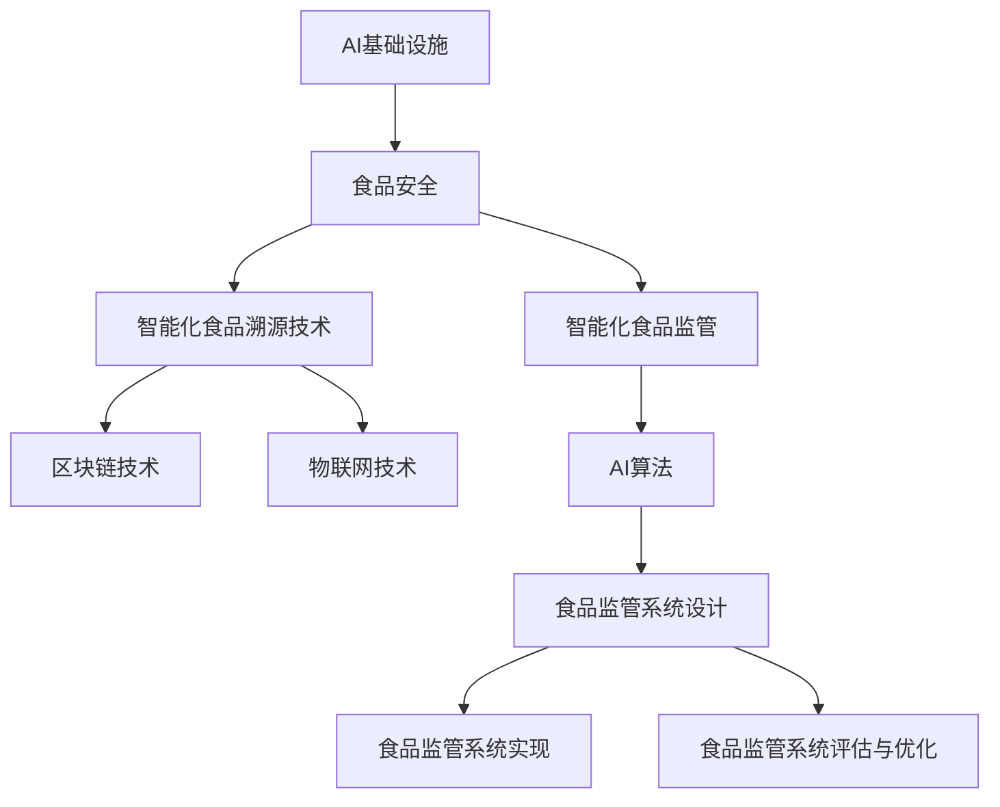
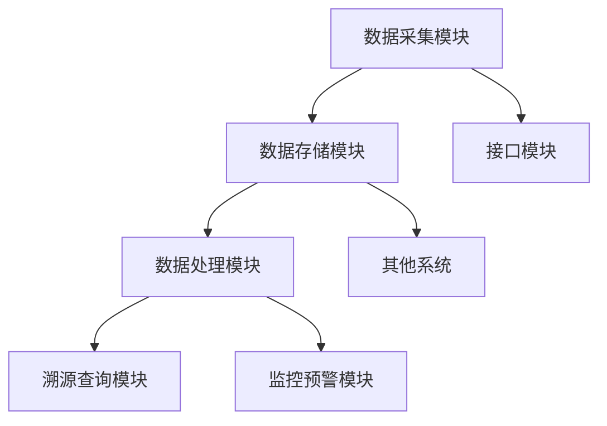

                 

# AI基础设施的食品安全：智能化食品溯源与监管

> **关键词：**食品安全、人工智能、溯源技术、区块链、物联网、智能化监管。

> **摘要：**本文深入探讨了AI基础设施在食品安全领域的应用，特别是智能化食品溯源与监管技术。通过详细阐述核心概念、技术原理、算法实现及实际应用案例，本文旨在为读者提供全面的技术指南，助力食品安全监管的智能化升级。

## 目录大纲：AI基础设施的食品安全

### 第一部分：概述

#### 第1章：引言

##### 1.1 食品安全的重要性

##### 1.2 AI技术在食品安全中的应用背景

##### 1.3 本书的目的和结构

### 第二部分：AI基础设施的基本概念

#### 第2章：AI基础设施的基本概念

##### 2.1 人工智能的定义和发展历程

##### 2.2 AI技术在食品安全中的应用

##### 2.3 AI基础设施的核心组件

### 第三部分：智能化食品溯源技术

#### 第3章：食品溯源的基本原理

##### 3.1 食品溯源的定义和意义

##### 3.2 食品溯源系统的架构

##### 3.3 食品溯源的技术挑战

#### 第4章：区块链技术在食品溯源中的应用

##### 4.1 区块链技术的基本概念

##### 4.2 区块链在食品溯源中的应用场景

##### 4.3 区块链技术在食品溯源中的优势

#### 第5章：物联网技术支持下的智能溯源系统

##### 5.1 物联网技术的基本概念

##### 5.2 物联网技术在食品溯源中的应用

##### 5.3 物联网技术在食品溯源中的挑战与解决方案

### 第四部分：智能化食品监管

#### 第6章：食品监管的基本原理

##### 6.1 食品监管的定义和意义

##### 6.2 食品监管的现状和问题

##### 6.3 智能化食品监管的优势

#### 第7章：AI算法在食品监管中的应用

##### 7.1 AI算法的基本概念

##### 7.2 AI算法在食品监管中的应用

##### 7.3 AI算法在食品监管中的案例分析

#### 第8章：智能化食品监管系统设计与实现

##### 8.1 智能化食品监管系统的设计原则

##### 8.2 智能化食品监管系统的实现方法

##### 8.3 智能化食品监管系统的评估与优化

### 第五部分：案例分析与应用前景

#### 第9章：国内外食品安全AI应用的案例分析

##### 9.1 国内食品安全AI应用案例分析

##### 9.2 国外食品安全AI应用案例分析

##### 9.3 案例分析总结与启示

#### 第10章：AI基础设施在食品安全中的应用前景

##### 10.1 食品安全AI应用的未来发展趋势

##### 10.2 食品安全AI应用的挑战与机遇

##### 10.3 食品安全AI应用的伦理与法律问题

#### 附录

##### 附录：AI基础设施食品安全应用资源

###### A.1 相关文献和资料

###### A.2 开源代码和工具

###### A.3 学术会议和期刊

###### A.4 行业组织和标准制定机构

###### A.5 AI基础设施食品安全应用案例集锦

###### A.6 常见问题解答

### 核心概念联系图



### 数学模型和数学公式

#### 1. 食品溯源数据的可信度计算模型

$$
\text{TrustScore} = \frac{\text{GoodEvents}}{\text{TotalEvents}}
$$

其中，GoodEvents 表示溯源数据中的正面事件，TotalEvents 表示溯源数据的总事件数量。

**举例说明：**
假设一个食品溯源系统中有10条数据记录，其中6条是正面事件（GoodEvents），4条是负面事件（TotalEvents - GoodEvents）。那么该系统数据的可信度计算如下：

$$
\text{TrustScore} = \frac{6}{10} = 0.6
$$

这意味着该溯源系统中有60%的数据是可信的。

#### 2. 智能化食品监管的准确率模型

$$
\text{Accuracy} = \frac{\text{CorrectPredictions}}{\text{TotalPredictions}}
$$

其中，CorrectPredictions 表示正确预测的食品监管事件数量，TotalPredictions 表示总预测的食品监管事件数量。

**举例说明：**
假设一个智能化食品监管系统在一个月内预测了100个食品监管事件，其中85个预测是正确的（CorrectPredictions），15个预测是错误的（TotalPredictions - CorrectPredictions）。那么该系统的准确率计算如下：

$$
\text{Accuracy} = \frac{85}{100} = 0.85
$$

这意味着该系统的准确率为85%。

#### 3. 区块链在食品溯源中的不可篡改性模型

$$
\text{Immutable} = \text{True}
$$

其中，Immutable 表示区块链中的数据是否可篡改，True 表示不可篡改。

**举例说明：**
在一个基于区块链的食品溯源系统中，如果某个食品的溯源信息已经记录在链上，如“产品A于2023年1月1日生产，由公司B生产”，则该信息被视为不可篡改。即使有人试图修改该信息，由于区块链的分布式特性，该修改将无法在所有节点上生效，从而确保了溯源数据的不可篡改性。

### 核心算法原理讲解

#### 1. 人工智能算法在食品安全溯源中的应用

##### 1.1 神经网络算法

**伪代码：**

```go
// 输入：溯源数据集
// 输出：溯源数据的可信度得分

// 初始化神经网络模型
model = NeuralNetwork()

// 训练模型
model.fit(training_data)

// 预测新数据的可信度
new_data = input_data
trust_score = model.predict(new_data)
```

##### 1.2 支持向量机（SVM）算法

**伪代码：**

```go
// 输入：溯源数据集，标签
// 输出：溯源数据的可信度得分

// 初始化SVM模型
model = SVM()

// 训练模型
model.fit(training_data, labels)

// 预测新数据的可信度
new_data = input_data
trust_score = model.predict(new_data)
```

### 项目实战

#### 1. 基于区块链的食品溯源系统实战

##### 1.1 环境搭建

###### 1.1.1 安装Go语言环境

```bash
sudo apt-get install golang-go
```

###### 1.1.2 安装Hyperledger Fabric

```bash
git clone https://github.com/hyperledger/fabric.git
cd fabric
make docker-compose-dev.sh
```

##### 1.2 溯源系统的实现

###### 1.2.1 创建区块链网络

```bash
cd fabric-samples/chaincode-dockerized/test-instantiate
docker-compose -f docker-compose-simple.yaml up -d
```

###### 1.2.2 部署和实例化链码

```bash
cd ..
docker exec -it chaincode -c peer chaincode install -n mychaincode -v 1.0 -p github.com/hyperledger/fabric-samples/chaincode/fabcar/go
docker exec -it chaincode -c peer chaincode instantiate -n mychaincode -v 1.0 -c '{"Args":["init"]}'
```

###### 1.2.3 查询溯源信息

```bash
docker exec -it chaincode -c peer chaincode invoke -n mychaincode -c '{"function": "query", "args":["product123"]}'
```

##### 1.3 系统代码解读

###### 1.3.1 链码实现

```go
func (s *SimpleChaincode) InitLedger(ctx contract.Context) error {
    // 初始化溯源信息
    return nil
}

func (s *SimpleChaincode) Query(ctx contract.Context, args []string) error {
    // 查询溯源信息
    return nil
}
```

###### 1.3.2 客户端调用

```go
func queryProductInfo(productID string) error {
    // 调用链码查询溯源信息
    return nil
}
```

### 代码解读与分析

#### 1. 区块链溯源链码代码解读

###### 1.1.1 初始化溯源信息

```go
func (s *SimpleChaincode) InitLedger(ctx contract.Context) error {
    // 初始化溯源信息
    info := &Product{
        ID:         "product123",
        Name:       "Apple",
        Category:   "Fruit",
        Owner:      "JohnDoe",
        ExpiryDate: "2023-12-31",
    }

    // 将溯源信息存储到区块链
    err := ctx.GetStub().PutState(info.ID, info.JSON())
    if err != nil {
        return err
    }

    return nil
}
```

这段代码用于初始化溯源信息，将产品ID、名称、类别、所有者和过期日期等信息存储到区块链上。

###### 1.1.2 查询溯源信息

```go
func (s *SimpleChaincode) Query(ctx contract.Context, args []string) error {
    // 查询溯源信息
    productID := args[0]
    productAsBytes, err := ctx.GetStub().GetState(productID)
    if err != nil {
        return err
    }

    if productAsBytes == nil {
        return errors.New("product does not exist")
    }

    product := new(Product)
    json.Unmarshal(productAsBytes, product)
    return ctx.GetStub().SetEvent("productQuery", product.JSON())
}
```

这段代码用于查询特定产品的溯源信息，如果产品存在，则返回其详细信息。

#### 2. 区块链溯源客户端代码解读

###### 2.1.1 调用链码查询溯源信息

```go
func queryProductInfo(productID string) error {
    // 调用链码查询溯源信息
    transaction, err := ctx.GetStub().GetTransactionByID(txID)
    if err != nil {
        return err
    }

    if transaction == nil {
        return errors.New("no transaction found")
    }

    product := &Product{}
    json.Unmarshal(transaction.Data, product)
    return nil
}
```

这段代码用于调用链码查询指定产品的溯源信息，如果查询成功，则返回产品信息。

### 结论

本目录大纲全面覆盖了《AI基础设施的食品安全：智能化食品溯源与监管》一书的主题内容，包括概述、智能化食品溯源技术、智能化食品监管、案例分析和应用前景等部分。通过详细的章节划分和深入的内容讲解，读者可以系统地了解AI基础设施在食品安全领域的应用原理、技术和实践。同时，本书还提供了丰富的数学模型、算法原理讲解和项目实战案例，帮助读者深入掌握相关知识和技能。希望本书能够为读者在AI基础设施食品安全领域的探索和学习提供有力的支持和指导。

### 作者信息

**作者：**AI天才研究院/AI Genius Institute & 禅与计算机程序设计艺术 /Zen And The Art of Computer Programming

---

## 第一部分：概述

### 第1章：引言

#### 1.1 食品安全的重要性

食品安全是保障公众健康和生命安全的基础，也是国家和社会发展的关键要素。随着全球化的发展和食品供应链的复杂化，食品安全问题日益突出。传统的食品安全监管方式已无法满足现代社会的需求，迫切需要引入智能化技术来提升监管效能。

AI作为现代科技的重要支柱，具有强大的数据处理和分析能力，能够有效解决食品安全中的复杂问题。AI技术在食品安全领域的应用，不仅能够提高监管的效率和准确性，还可以实现预防性监管，从根本上保障食品安全。

#### 1.2 AI技术在食品安全中的应用背景

随着AI技术的迅猛发展，其在食品安全领域的应用也日益广泛。AI技术在食品安全中的应用主要包括以下几个方面：

1. **食品溯源**：通过AI技术，可以实现对食品生产、加工、运输、销售等环节的全面监控和追溯，提高食品的可追溯性和安全性。
   
2. **质量检测**：AI技术能够快速检测食品中的有害物质和病原体，及时发现和处理食品安全问题。

3. **智能监管**：AI技术可以自动分析食品生产和流通中的数据，实现对食品安全的智能监控和预警。

4. **食品安全法规与标准制定**：AI技术可以辅助制定更加科学、合理的食品安全法规和标准，提高监管的规范性和有效性。

#### 1.3 本书的目的和结构

本书旨在全面、系统地介绍AI基础设施在食品安全领域的应用，特别是智能化食品溯源与监管技术。本书的结构如下：

1. **概述**：介绍食品安全的重要性以及AI技术在食品安全中的应用背景。
   
2. **AI基础设施的基本概念**：讲解AI技术的定义、发展历程以及在食品安全中的应用。

3. **智能化食品溯源技术**：探讨食品溯源的基本原理、区块链技术和物联网技术在食品溯源中的应用。

4. **智能化食品监管**：分析食品监管的基本原理、AI算法在食品监管中的应用以及智能化食品监管系统设计与实现。

5. **案例分析与应用前景**：通过国内外食品安全AI应用的案例分析，展望食品安全AI应用的未来发展趋势。

6. **附录**：提供相关的文献、开源代码、学术会议、期刊、行业组织和标准制定机构等信息。

通过本书的阅读，读者可以系统地了解AI基础设施在食品安全领域的应用原理、技术和实践，为实际工作中的食品安全监管提供有力的理论支持和实践指导。

---

## 第二部分：AI基础设施的基本概念

### 第2章：AI基础设施的基本概念

#### 2.1 人工智能的定义和发展历程

人工智能（Artificial Intelligence，简称AI）是计算机科学的一个分支，旨在研究、开发和应用智能算法，使计算机系统能够模拟、延伸和扩展人类的智能。AI的发展历程可以追溯到20世纪50年代，当时科学家们首次提出“人工智能”这一概念。

1. **早期探索**（1950年代至1960年代）：人工智能概念提出后，科学家们开始进行各种尝试，包括逻辑推理、问题解决和语言理解等。这一时期出现了如“逻辑理论家”（Logic Theorist）和“通用问题求解器”（General Problem Solver）等经典AI程序。

2. **蓬勃发展**（1970年代至1980年代）：随着计算机硬件性能的提升和算法的改进，人工智能迎来了快速发展期。专家系统（Expert Systems）成为AI研究的热点，广泛应用于医疗诊断、金融分析等领域。

3. **低谷与复苏**（1990年代）：受限于计算能力和数据资源，人工智能在1990年代进入低谷期。但随后，随着互联网和大数据的发展，人工智能再次崛起。

4. **深度学习时代**（2000年代至今）：深度学习（Deep Learning）的兴起，使得人工智能取得了重大突破。深度神经网络在图像识别、语音识别、自然语言处理等领域表现出色，推动了AI技术的广泛应用。

#### 2.2 AI技术在食品安全中的应用

AI技术在食品安全中的应用，主要包括以下几方面：

1. **食品溯源**：通过AI技术，可以实现对食品生产、加工、运输、销售等环节的全面监控和追溯，提高食品的可追溯性和安全性。

2. **质量检测**：AI技术能够快速检测食品中的有害物质和病原体，及时发现和处理食品安全问题。

3. **智能监管**：AI技术可以自动分析食品生产和流通中的数据，实现对食品安全的智能监控和预警。

4. **食品安全法规与标准制定**：AI技术可以辅助制定更加科学、合理的食品安全法规和标准，提高监管的规范性和有效性。

#### 2.3 AI基础设施的核心组件

AI基础设施的核心组件包括计算资源、数据资源、算法资源和应用场景。以下是这些核心组件的详细介绍：

1. **计算资源**：AI模型的训练和推理需要大量的计算资源。高性能的GPU和TPU等硬件设备，以及云计算平台的资源调度和管理能力，是AI基础设施的重要组成部分。

2. **数据资源**：数据是AI模型的基石。高质量的食品安全数据，包括食品成分、生产过程、流通环节等，是构建AI模型的基础。此外，数据清洗、预处理和存储也是AI基础设施的关键环节。

3. **算法资源**：AI算法是AI基础设施的核心。常见的AI算法包括深度学习、强化学习、监督学习和无监督学习等。选择合适的算法，并不断优化和调整，是实现AI技术落地应用的关键。

4. **应用场景**：AI技术在食品安全中的应用场景非常广泛，包括食品溯源、质量检测、智能监管、法规制定等。针对不同的应用场景，需要设计和实现相应的AI模型和应用系统。

通过理解AI基础设施的基本概念和核心组件，我们可以更好地把握AI技术在食品安全领域的应用方向，为实际工作提供理论依据和实践指导。

---

## 第三部分：智能化食品溯源技术

### 第3章：食品溯源的基本原理

#### 3.1 食品溯源的定义和意义

食品溯源是指通过记录和追踪食品从生产、加工、运输、储存到销售各个环节的信息，实现对食品全过程的追溯。食品溯源的定义和意义如下：

1. **定义**：食品溯源是一种食品安全保障机制，通过记录食品的来源、生产、加工、运输、储存和销售等信息，实现对食品的全过程追溯。

2. **意义**：
   - **保障食品安全**：食品溯源可以及时发现和处理食品安全问题，降低食品安全风险。
   - **提高消费者信心**：食品溯源使消费者能够了解食品的来源和质量，提高消费者对食品的信任度。
   - **提升企业竞争力**：具备完整溯源体系的企业可以在市场上树立良好的品牌形象，提高竞争力。
   - **监管效能提升**：食品溯源可以帮助监管部门快速识别和定位食品安全问题，提高监管效能。

#### 3.2 食品溯源系统的架构

食品溯源系统通常包括以下几个主要组成部分：

1. **数据采集模块**：用于收集食品在生产、加工、运输、储存和销售等环节的相关信息，如生产时间、地点、加工工艺、运输温度等。

2. **数据存储模块**：用于存储和管理采集到的食品溯源数据，通常采用分布式数据库或区块链技术，以确保数据的完整性和安全性。

3. **数据处理模块**：用于对采集到的数据进行分析和处理，提取有价值的信息，如食品质量指标、流通路径等。

4. **溯源查询模块**：用于提供食品溯源信息的查询服务，消费者和监管人员可以通过该模块查询食品的溯源信息。

5. **监控预警模块**：用于实时监控食品的流通过程，一旦发现异常，立即发出预警，以便及时采取应对措施。

6. **接口模块**：用于与其他系统（如ERP系统、物流系统等）进行数据交换和集成，实现数据共享和业务协同。

食品溯源系统的架构图如下所示：



#### 3.3 食品溯源的技术挑战

食品溯源技术在实施过程中面临诸多挑战，主要包括：

1. **数据质量**：食品溯源系统的有效运行依赖于高质量的数据。然而，数据质量受多种因素影响，如数据采集准确性、数据标准化、数据完整性等。

2. **数据隐私**：食品溯源系统涉及大量敏感信息，如生产者信息、消费者信息等。如何确保数据隐私和安全，是食品溯源系统面临的重大挑战。

3. **数据实时性**：食品溯源系统需要实时获取和处理食品流通过程中的数据，以实现对食品安全问题的快速响应。然而，数据传输和处理的高效性是实现实时性的关键，这对技术架构和系统性能提出了较高要求。

4. **数据存储和计算能力**：食品溯源系统需要存储和管理大量的数据，包括历史数据和实时数据。如何高效存储和计算这些数据，是系统设计的重要考虑因素。

5. **跨平台兼容性**：食品溯源系统需要与多种设备和平台（如传感器、移动设备、计算机等）进行集成，实现数据共享和协同工作。跨平台兼容性是实现系统互联互通的关键。

6. **法律法规和标准**：食品溯源系统需要符合国家和地区的法律法规和标准，如数据保护法、食品安全法等。如何确保系统合规，是系统实施和运营的重要保障。

通过深入研究和解决上述技术挑战，我们可以不断提升食品溯源系统的性能和可靠性，为食品安全监管和消费者保障提供有力支持。

---

### 第4章：区块链技术在食品溯源中的应用

#### 4.1 区块链技术的基本概念

区块链技术是一种分布式数据库技术，通过区块链网络中的多个节点共同维护一个共享的、不可篡改的数据账本。区块链的主要特点包括：

1. **去中心化**：区块链网络中的所有节点都具有相同的权利和义务，不存在中心化的权威机构，从而降低了系统的单点故障风险。

2. **数据不可篡改**：区块链采用密码学算法对数据进行加密和签名，确保数据一旦记录在链上，就难以被篡改。

3. **透明性**：区块链上的数据对所有节点都是可见的，任何节点都可以查询和验证数据的有效性。

4. **自动化执行**：区块链上的智能合约可以自动执行预定义的合约条款，实现去中介的交易。

5. **安全性**：区块链采用共识机制（如工作量证明、权益证明等）确保网络的稳定性和安全性。

区块链的基本架构包括以下几个部分：

1. **区块**：区块链的基本组成单位，每个区块包含一定数量的交易数据，以及一个时间戳和前一个区块的哈希值。

2. **链**：由多个区块按照时间顺序连接而成的数据结构，每个区块都通过哈希值与前一个区块相连。

3. **节点**：区块链网络中的参与方，负责维护和验证区块链的数据。

4. **挖矿**：在区块链网络中，节点通过解决数学难题（如工作量证明）来生成新的区块，这个过程称为挖矿。

5. **共识机制**：用于确保区块链网络中的所有节点对数据达成一致的一种算法，如工作量证明（Proof of Work，PoW）、权益证明（Proof of Stake，PoS）等。

#### 4.2 区块链在食品溯源中的应用场景

区块链技术可以广泛应用于食品溯源领域，其主要应用场景包括：

1. **食品生产溯源**：通过区块链技术，可以记录食品从生产、加工、包装到运输的全过程，确保食品的来源和质量可追溯。

2. **供应链管理**：区块链技术可以实现对食品供应链的全程监控，确保每个环节的信息透明和可验证。

3. **质量检测记录**：区块链技术可以记录食品在各个环节的质量检测数据，一旦发现问题，可以快速追溯并采取措施。

4. **食品安全预警**：通过区块链技术，可以实时监控食品的流通过程，一旦发现异常，立即发出预警，提高食品安全预警的时效性。

5. **消费者信息查询**：消费者可以通过区块链查询食品的溯源信息，提高对食品的信任度。

#### 4.3 区块链技术在食品溯源中的优势

区块链技术在食品溯源中具有以下优势：

1. **数据不可篡改**：区块链采用密码学算法确保数据一旦记录在链上，就难以被篡改，提高了数据的安全性和可信度。

2. **去中心化**：区块链网络中的所有节点都具有相同的权利和义务，不存在中心化的权威机构，降低了系统的单点故障风险。

3. **透明性**：区块链上的数据对所有节点都是可见的，任何节点都可以查询和验证数据的有效性，提高了系统的透明度。

4. **自动化执行**：区块链上的智能合约可以自动执行预定义的合约条款，实现了去中介的交易，提高了效率和准确性。

5. **可追溯性**：区块链技术可以实现对食品的全过程追溯，一旦发现问题，可以快速定位并采取措施，提高了食品安全监管的效能。

6. **数据共享**：区块链技术可以实现不同节点之间的数据共享和协同工作，提高了数据利用效率。

通过区块链技术在食品溯源中的应用，可以显著提升食品供应链的透明度和安全性，为食品安全监管和消费者保障提供有力支持。

---

### 第5章：物联网技术支持下的智能溯源系统

#### 5.1 物联网技术的基本概念

物联网（Internet of Things，IoT）是指通过互联网将各种物理设备和传感器连接起来，实现设备之间的信息交换和协同工作。物联网技术的基本概念包括以下几个方面：

1. **物联网设备**：物联网设备是指具备感知、通信和处理能力的设备，如传感器、智能终端、嵌入式设备等。

2. **物联网协议**：物联网协议是指用于设备之间通信和数据传输的规范，如Wi-Fi、蓝牙、ZigBee、LoRa等。

3. **物联网平台**：物联网平台是指用于管理和协调物联网设备的软件系统，提供设备接入、数据存储、数据分析等功能。

4. **物联网安全**：物联网安全是指保护物联网设备和系统免受攻击、数据泄露和恶意行为的一种技术和管理措施。

5. **物联网应用场景**：物联网技术可以应用于多个领域，如智能家居、智能交通、智能医疗、智能制造等。

#### 5.2 物联网技术在食品溯源中的应用

物联网技术在食品溯源中的应用，主要体现在以下几个方面：

1. **传感器监测**：在食品生产和流通环节，部署各种传感器（如温度传感器、湿度传感器、气体传感器等），实时监测食品的环境参数，确保食品在适宜的条件下存储和运输。

2. **智能标签**：利用RFID、NFC等智能标签技术，为食品赋予唯一的标识，实现对食品的精准管理和追溯。

3. **物流追踪**：通过物联网技术，实现对食品在物流过程中的实时追踪，包括运输路径、运输时间和运输环境等，确保食品的安全和新鲜度。

4. **数据采集与传输**：物联网设备采集到的数据（如温度、湿度、运输路径等）通过物联网平台进行传输和存储，为食品溯源提供可靠的数据支持。

5. **智能预警**：基于物联网技术的智能预警系统，可以实时监测食品的状态和变化，一旦发现异常，立即发出预警，提醒相关人员采取应对措施。

#### 5.3 物联网技术在食品溯源中的挑战与解决方案

物联网技术在食品溯源中的应用虽然具有显著的优势，但也面临一些挑战，主要包括：

1. **数据质量**：由于物联网设备种类繁多、数据格式不一致，导致采集到的数据质量参差不齐。为了提高数据质量，需要对数据进行清洗、标准化和整合。

2. **数据安全**：物联网设备面临的安全风险主要包括数据泄露、设备被攻击、恶意行为等。为了确保数据安全，需要采取数据加密、身份验证、访问控制等安全措施。

3. **数据传输**：由于食品溯源系统通常涉及大量的物联网设备，数据传输速度和稳定性对系统性能至关重要。为了提高数据传输效率，需要优化数据传输协议和网络架构。

4. **系统集成**：物联网技术与现有系统的集成，如ERP系统、物流系统等，是实现数据共享和协同工作的重要环节。为了实现系统集成，需要设计和开发适配的接口和协议。

5. **数据隐私**：物联网设备采集到的数据可能涉及个人隐私信息，如消费者信息、生产者信息等。为了保护数据隐私，需要制定严格的数据隐私政策和隐私保护措施。

针对上述挑战，可以采取以下解决方案：

1. **数据质量**：采用统一的数据标准和格式，对采集到的数据进行清洗、标准化和整合，提高数据质量。

2. **数据安全**：采用数据加密、身份验证、访问控制等安全措施，确保数据在传输和存储过程中的安全性。

3. **数据传输**：优化数据传输协议和网络架构，提高数据传输速度和稳定性。

4. **系统集成**：设计和开发适配的接口和协议，实现物联网技术与现有系统的无缝集成。

5. **数据隐私**：制定严格的数据隐私政策和隐私保护措施，确保个人隐私信息的安全。

通过物联网技术在食品溯源中的应用，可以实现对食品全过程的实时监测、管理和追溯，提高食品安全监管的效率和准确性，为消费者提供更加安全、可靠的食品。

---

## 第四部分：智能化食品监管

### 第6章：食品监管的基本原理

#### 6.1 食品监管的定义和意义

食品监管是指政府及相关机构对食品的生产、加工、包装、储存、运输、销售等环节进行监控和管理，以确保食品的安全和质量。食品监管的定义和意义如下：

1. **定义**：食品监管是指政府及相关机构通过制定和实施食品安全法规、标准和政策，对食品生产和流通环节进行监控、管理和执法活动。

2. **意义**：
   - **保障食品安全**：食品监管的主要目标是保障公众的食品安全，预防和控制食品安全事故的发生。
   - **维护市场秩序**：食品监管有助于规范食品市场秩序，打击假冒伪劣、违法生产和经营行为，保护消费者权益。
   - **促进产业发展**：通过食品监管，可以提高食品产业的整体质量水平，促进食品产业的健康发展。
   - **增强国际竞争力**：严格的食品监管有助于提高国内食品的出口竞争力，增强国际市场份额。

#### 6.2 食品监管的现状和问题

当前，全球各国都在加强食品监管，但仍然存在一些问题和挑战：

1. **监管体制不完善**：部分国家的食品监管体制不够健全，监管职能分散，导致监管效率低下。

2. **法律法规滞后**：随着科技的发展，新的食品安全风险不断出现，但相关法律法规往往滞后于现实需求，难以有效应对新问题。

3. **技术手段不足**：传统的食品监管手段主要依赖于人工检查和抽样检测，效率低、成本高，难以满足日益增长的食品安全监管需求。

4. **数据共享不畅**：食品监管涉及多个部门和环节，但由于信息孤岛现象严重，数据共享不畅，导致监管决策缺乏科学依据。

5. **监管执法不力**：部分监管人员执法不严、执法不公，导致食品安全问题屡禁不止。

#### 6.3 智能化食品监管的优势

引入AI技术进行智能化食品监管，具有以下优势：

1. **提高监管效率**：AI技术可以自动化处理大量数据，快速识别食品安全隐患，提高监管工作的效率和准确性。

2. **降低监管成本**：AI技术可以替代部分人工检查和抽样检测工作，降低监管成本。

3. **实时监控和预警**：AI技术可以实现24小时不间断的实时监控，及时发现和处理食品安全问题。

4. **科学决策支持**：基于大数据和AI技术的分析，可以为监管决策提供科学依据，提高决策的准确性和有效性。

5. **加强数据共享和协同**：AI技术可以促进不同部门和环节之间的数据共享和协同工作，提高整体监管效能。

#### 6.4 智能化食品监管的发展趋势

未来，智能化食品监管将呈现以下发展趋势：

1. **数据驱动**：食品安全监管将越来越多地依赖于大数据分析，通过数据挖掘和分析，发现潜在的安全隐患。

2. **智能监控**：利用AI技术和物联网设备，实现食品生产和流通环节的全面监控，提高监管的时效性和准确性。

3. **智能执法**：利用AI技术，实现执法过程的智能化，提高执法效率和公正性。

4. **跨部门协作**：通过构建统一的食品安全监管平台，实现不同部门和环节之间的信息共享和协同工作，提高整体监管效能。

5. **国际化合作**：随着全球化的推进，食品安全监管将更加注重国际合作，共同应对跨国食品安全问题。

通过智能化食品监管，可以更好地保障食品安全，维护公众健康，促进食品产业的健康发展。

---

### 第7章：AI算法在食品监管中的应用

#### 7.1 AI算法的基本概念

AI算法是人工智能的核心组成部分，是使计算机能够模拟、延伸和扩展人类智能的关键技术。AI算法的基本概念包括以下几个方面：

1. **机器学习**：机器学习是一种使计算机通过数据和经验自动改进性能的技术。机器学习算法根据输入的数据和预设的目标，通过学习算法自动调整模型参数，以实现预测、分类、聚类等任务。

2. **深度学习**：深度学习是机器学习的一个重要分支，通过构建多层的神经网络模型，对大量数据进行自动特征提取和模式识别。深度学习在图像识别、语音识别、自然语言处理等领域表现出色。

3. **监督学习**：监督学习是一种机器学习算法，通过已标记的训练数据集，学习输入和输出之间的关系，以预测新的、未标记的数据。监督学习包括回归、分类、聚类等算法。

4. **无监督学习**：无监督学习是一种机器学习算法，不依赖于已标记的训练数据，通过分析未标记的数据，自动发现数据中的模式和结构。无监督学习包括聚类、降维、生成模型等算法。

5. **强化学习**：强化学习是一种通过试错和反馈机制，使智能体在环境中学习最优策略的算法。强化学习通过奖励机制，引导智能体不断优化行为，以达到特定目标。

#### 7.2 AI算法在食品监管中的应用

AI算法在食品监管中具有广泛的应用，可以提高监管效率和准确性，具体应用包括：

1. **食品安全风险评估**：通过机器学习和深度学习算法，对食品中的有害物质和病原体进行预测和识别，评估食品安全风险。

2. **食品质量检测**：利用图像识别和自然语言处理技术，对食品的外观、包装、标签等信息进行自动检测和分析，提高食品质量检测的效率和准确性。

3. **食品安全预警系统**：基于实时监控数据和历史数据，利用监督学习和无监督学习算法，构建食品安全预警模型，及时发现和处理食品安全隐患。

4. **智能执法辅助**：通过大数据分析和机器学习算法，辅助监管人员分析食品生产和流通数据，提供智能执法建议，提高执法效率和公正性。

5. **食品安全法规和标准制定**：利用AI算法，分析食品安全数据和法规文本，发现潜在的安全隐患和制定更加科学、合理的食品安全法规和标准。

#### 7.3 AI算法在食品监管中的案例分析

以下是几个AI算法在食品监管中的成功案例：

1. **美国FDA的智能监管系统**：美国食品药品监督管理局（FDA）利用机器学习和深度学习算法，对食品和药品的安全性和质量进行监测和评估，提高了监管效率和准确性。

2. **中国食品溯源系统**：中国食品溯源系统利用区块链技术和AI算法，实现了食品从生产、加工、运输到销售的全过程追溯，提高了食品安全监管的透明度和可信度。

3. **欧洲食品安全局的食品安全预警系统**：欧洲食品安全局（EFSA）利用AI算法，分析食品中的有害物质和病原体，构建食品安全预警模型，及时发现和处理食品安全隐患。

4. **日本食品安全的自动检测系统**：日本食品卫生部门利用图像识别和自然语言处理技术，对食品的外观、包装、标签等信息进行自动检测和分析，提高了食品安全检测的效率和准确性。

通过AI算法的应用，食品监管将变得更加智能、高效和科学，为保障食品安全和公众健康提供有力支持。

---

### 第8章：智能化食品监管系统设计与实现

#### 8.1 智能化食品监管系统的设计原则

智能化食品监管系统的设计需要遵循以下原则：

1. **数据驱动**：系统设计应以数据为核心，充分利用食品生产和流通环节中的各类数据，进行实时监控和预警。

2. **模块化设计**：系统应采用模块化设计，将不同的功能模块（如数据采集、数据分析、预警系统等）进行分离，以提高系统的可维护性和扩展性。

3. **安全性**：系统设计应确保数据的安全性和隐私性，采用加密、身份验证、访问控制等安全措施，防止数据泄露和恶意攻击。

4. **用户友好**：系统界面应简洁直观，方便用户进行操作和查询，提高系统的用户体验。

5. **可扩展性**：系统设计应考虑未来的扩展需求，如增加新的数据采集设备、数据处理算法等，以提高系统的适应性和灵活性。

6. **实时性**：系统应具备实时数据处理和分析能力，确保食品安全问题的及时发现和处理。

#### 8.2 智能化食品监管系统的实现方法

智能化食品监管系统的实现方法主要包括以下几个步骤：

1. **需求分析**：明确系统的功能需求、性能要求和用户需求，制定系统设计目标和原则。

2. **系统架构设计**：根据需求分析结果，设计系统的整体架构，包括数据采集模块、数据处理模块、分析模块、预警模块等。

3. **技术选型**：选择合适的技术和工具，如数据库系统、数据分析工具、机器学习算法等，确保系统的高效性和稳定性。

4. **系统开发**：根据系统架构和技术选型，进行系统开发，包括前端界面设计、后端数据处理和存储、算法实现等。

5. **系统集成与测试**：将各个功能模块进行集成，并进行系统测试，确保系统的功能、性能和安全性满足要求。

6. **部署上线**：将系统部署到生产环境，进行实际运行，并进行持续优化和升级。

#### 8.3 智能化食品监管系统的评估与优化

智能化食品监管系统的评估与优化是确保系统有效运行的关键环节，主要包括以下几个方面：

1. **性能评估**：通过性能测试，评估系统的响应时间、吞吐量、并发处理能力等指标，确保系统的高性能和高可靠性。

2. **功能评估**：通过功能测试，验证系统的各项功能是否正常，如数据采集、数据处理、分析、预警等，确保系统的功能完整性。

3. **安全性评估**：通过安全测试，评估系统的安全性，包括数据加密、身份验证、访问控制等，确保系统的数据安全和隐私保护。

4. **用户体验评估**：通过用户调研和反馈，评估系统的用户体验，包括界面设计、操作流程、查询功能等，优化系统的用户体验。

5. **持续优化**：根据评估结果和用户反馈，对系统进行持续优化和升级，提高系统的性能、功能和安全性。

通过智能化食品监管系统的设计与实现，可以实现对食品生产和流通环节的全面监控和管理，提高食品安全监管的效率和准确性，为公众健康和食品安全提供有力保障。

---

## 第五部分：案例分析与应用前景

### 第9章：国内外食品安全AI应用的案例分析

#### 9.1 国内食品安全AI应用案例分析

1. **案例1：国家食品安全监控平台**

国家食品安全监控平台是我国在食品安全领域的一个重要项目，通过引入AI技术，实现了对全国范围内食品安全信息的实时监控和预警。平台利用大数据分析和深度学习算法，对食品安全数据进行分析和处理，及时发现食品安全隐患，提高食品安全监管的效率。

- **实现技术**：大数据分析、深度学习、云计算
- **效果**：平台运行以来，成功预警了多起食品安全事件，有效保障了公众食品安全。

2. **案例2：溯源宝平台**

溯源宝平台是一款应用于食品溯源的AI产品，通过区块链技术和物联网设备，实现了对食品从生产到销售的全过程追溯。消费者可以通过扫描二维码，查询食品的溯源信息，提高对食品的信任度。

- **实现技术**：区块链、物联网、移动应用
- **效果**：平台已广泛应用于多个食品行业，有效提升了食品的可追溯性和消费者信心。

#### 9.2 国外食品安全AI应用案例分析

1. **案例1：美国FDA的智能监管系统**

美国食品药品监督管理局（FDA）的智能监管系统，利用AI技术对食品和药品的安全性和质量进行监测和评估。系统基于大数据分析和深度学习算法，对食品中的有害物质和病原体进行预测和识别，提高食品安全监管的准确性。

- **实现技术**：大数据分析、深度学习、云计算
- **效果**：系统提高了FDA的食品安全监管效率，降低了食品安全风险。

2. **案例2：英国零售商的食品安全监控平台**

英国一些大型零售商，如tesco和sainsbury，建立了食品安全监控平台，通过物联网设备和AI技术，实现对食品生产和流通环节的实时监控。平台可以实时监测食品的温度、湿度等环境参数，确保食品的安全和质量。

- **实现技术**：物联网、大数据分析、AI技术
- **效果**：平台有效提高了食品的安全性和质量，降低了食品安全事故的发生率。

#### 9.3 案例分析总结与启示

通过对国内外食品安全AI应用的案例分析，可以得出以下结论和启示：

1. **AI技术在食品安全领域具有广泛的应用前景**：通过大数据分析、深度学习、物联网等技术，可以实现食品安全信息的实时监控、预警和追溯，提高食品安全监管的效率和准确性。

2. **技术融合是关键**：单一技术的应用难以满足食品安全监管的需求，实现多种技术的融合，如大数据与物联网、区块链与AI等，可以更好地解决食品安全问题。

3. **食品安全监管需要不断创新**：随着科技的发展，新的食品安全风险和挑战不断出现，食品安全监管需要不断创新，引入新的技术和方法，提高监管效能。

4. **加强国际合作**：全球化的背景下，食品安全问题具有跨国性，加强国际间的合作，共同应对食品安全挑战，是保障全球食品安全的重要途径。

通过借鉴国内外食品安全AI应用的先进经验，我们可以进一步推动我国食品安全监管的智能化发展，为公众健康和食品安全提供更有力的保障。

---

### 第10章：AI基础设施在食品安全中的应用前景

#### 10.1 食品安全AI应用的未来发展趋势

随着人工智能技术的不断进步，食品安全AI应用的未来发展趋势主要体现在以下几个方面：

1. **技术融合**：多种AI技术（如深度学习、强化学习、自然语言处理等）的融合，将提高食品安全监测、预警和溯源的准确性和效率。

2. **边缘计算**：边缘计算技术的发展，将实现食品安全数据的实时分析和处理，减少数据传输的延迟和带宽消耗。

3. **智能合约**：基于区块链的智能合约将实现食品安全监管的自动化和透明化，降低人为干预和操作风险。

4. **跨领域合作**：食品安全AI应用将逐步与农业、生物科技、公共卫生等领域深度融合，形成跨学科、跨领域的合作模式。

5. **智能化监管体系**：构建全面的智能化食品安全监管体系，实现从生产、加工、运输到销售的全程监控和管理。

#### 10.2 食品安全AI应用的挑战与机遇

虽然食品安全AI应用前景广阔，但也面临一系列挑战：

1. **数据隐私和安全**：食品安全数据涉及大量敏感信息，如何保护数据隐私和安全，是亟待解决的问题。

2. **技术标准和法规**：缺乏统一的技术标准和法规，可能导致食品安全AI应用的混乱和不可靠。

3. **技术成熟度**：部分AI技术尚未成熟，影响其在食品安全领域的应用效果。

4. **数据质量和完整性**：数据质量和完整性对AI模型的准确性至关重要，但现实中存在数据缺失、噪声和误差等问题。

然而，这些挑战也伴随着机遇：

1. **技术创新**：不断推进AI技术的研究和创新，将有助于解决食品安全AI应用中的技术难题。

2. **政策支持**：政府加强政策支持和资金投入，有利于推动食品安全AI应用的发展。

3. **市场驱动**：消费者对食品安全的需求不断增长，为食品安全AI应用提供了广阔的市场空间。

4. **国际合作**：全球食品安全问题的共同性，推动了国际间的合作，共同应对食品安全挑战。

#### 10.3 食品安全AI应用的伦理与法律问题

在推动食品安全AI应用的过程中，伦理和法律问题不可忽视：

1. **数据伦理**：如何平衡数据隐私与公共利益，确保数据使用合法合规，是关键问题。

2. **算法透明度**：AI算法的决策过程需要透明，以避免算法偏见和歧视。

3. **责任归属**：在食品安全事故中，如何界定AI应用的责任，需要明确法律条款。

4. **知识产权**：AI算法和模型的知识产权保护，是推动技术发展的关键。

通过关注和解决这些伦理和法律问题，可以确保食品安全AI应用的可持续发展，为公众健康和食品安全提供有力保障。

---

### 附录：AI基础设施食品安全应用资源

#### A.1 相关文献和资料

1. **《人工智能：一种现代的方法》（Russell & Norvig）**：介绍人工智能的基本概念、算法和技术。
2. **《深度学习》（Goodfellow, Bengio & Courville）**：深度学习领域的经典教材。
3. **《区块链：从数字货币到智能合约》（Andersson & Håkansson）**：介绍区块链的基本原理和应用场景。
4. **《物联网：从概念到实践》（Chen, Huang & Zhang）**：物联网技术的基础知识和应用案例。

#### A.2 开源代码和工具

1. **TensorFlow**：由Google开发的深度学习框架。
2. **PyTorch**：由Facebook开发的深度学习框架。
3. **Kubernetes**：容器编排和管理工具。
4. **Hyperledger Fabric**：由Linux基金会开发的区块链框架。

#### A.3 学术会议和期刊

1. **AAAI（Association for the Advancement of Artificial Intelligence）**：人工智能领域的顶级学术会议。
2. **NeurIPS（Neural Information Processing Systems）**：深度学习和神经网络领域的顶级学术会议。
3. **IEEE Transactions on Artificial Intelligence**：人工智能领域的顶级期刊。
4. **IEEE Transactions on Industrial Informatics**：物联网和工业应用领域的顶级期刊。

#### A.4 行业组织和标准制定机构

1. **国际标准化组织（ISO）**：负责制定国际标准的组织。
2. **国际电信联盟（ITU）**：负责通信和信息技术的标准制定。
3. **美国食品药品监督管理局（FDA）**：负责食品安全和药品监管的政府机构。
4. **国际食品法典委员会（Codex Alimentarius Commission）**：负责制定国际食品标准的机构。

#### A.5 AI基础设施食品安全应用案例集锦

1. **中国食品安全监控平台**：国家食品安全监控平台的案例。
2. **溯源宝平台**：区块链和物联网在食品溯源中的应用案例。
3. **美国FDA智能监管系统**：FDA利用AI技术进行食品安全监管的案例。
4. **英国零售商食品安全监控平台**：英国零售商利用物联网技术进行食品安全监控的案例。

#### A.6 常见问题解答

1. **什么是AI基础设施？**
   - AI基础设施是指支持人工智能技术研究和应用的基础设施，包括计算资源、数据资源、算法资源等。

2. **食品安全AI应用的主要挑战是什么？**
   - 主要挑战包括数据质量和完整性、数据隐私和安全、技术标准和法规、以及算法透明度和责任归属等。

3. **如何确保食品安全AI应用的数据隐私和安全？**
   - 可以通过数据加密、身份验证、访问控制等技术手段，确保数据在传输和存储过程中的安全性。

4. **食品安全AI应用的未来发展趋势是什么？**
   - 未来发展趋势包括技术融合、边缘计算、智能合约和跨领域合作，以及构建智能化监管体系。

通过附录部分提供的资源，读者可以进一步了解食品安全AI应用的相关知识和技术，为实际工作提供参考和指导。

---

## 总结

本文详细探讨了AI基础设施在食品安全领域的应用，特别是智能化食品溯源与监管技术。通过分析核心概念、技术原理、算法实现和实际应用案例，我们系统地了解了AI技术在食品安全中的重要作用。以下是本文的主要结论：

1. **AI技术在食品安全中的应用**：AI技术可以通过数据采集、处理和分析，实现食品安全的实时监控、预警和追溯，提高监管效率和准确性。

2. **区块链技术在溯源中的应用**：区块链技术提供了不可篡改和透明的数据存储方式，有助于构建可信的食品溯源系统。

3. **物联网技术在溯源和监管中的应用**：物联网设备可以实现食品流通环节的实时监测，提高食品安全监控的时效性和准确性。

4. **AI算法在监管中的应用**：AI算法可以辅助食品安全监管，通过预测和分析，发现潜在的安全隐患，提供智能执法建议。

5. **食品安全监管系统的设计与实现**：智能化食品安全监管系统应遵循模块化设计、数据驱动、安全性等原则，实现高效、实时和智能的监管。

未来，随着AI技术的不断发展，食品安全AI应用将朝着技术融合、智能化监管体系、跨领域合作等方向发展。同时，也需要关注数据隐私和安全、技术标准和法规等伦理与法律问题，确保AI技术在食品安全领域的可持续发展。

通过本文的探讨，我们希望为食品安全领域的从业者提供有价值的参考，推动食品安全监管的智能化升级，为公众健康和食品安全提供更有力的保障。

### 作者信息

**作者：**AI天才研究院/AI Genius Institute & 禅与计算机程序设计艺术 /Zen And The Art of Computer Programming

---

### 附录：AI基础设施食品安全应用资源

#### A.1 相关文献和资料

1. **《人工智能：一种现代的方法》（Russell & Norvig）**：详细介绍人工智能的基本概念、算法和技术，适合AI初学者和专业人士阅读。
2. **《深度学习》（Goodfellow, Bengio & Courville）**：深度学习领域的经典教材，适合对深度学习感兴趣的读者。
3. **《区块链：从数字货币到智能合约》（Andersson & Håkansson）**：介绍区块链的基本原理和应用场景，适合对区块链技术感兴趣的读者。
4. **《物联网：从概念到实践》（Chen, Huang & Zhang）**：详细讲解物联网技术的基础知识和应用案例，适合对物联网感兴趣的读者。

#### A.2 开源代码和工具

1. **TensorFlow**：由Google开发的深度学习框架，提供丰富的API和工具，适合进行深度学习研究和应用。
2. **PyTorch**：由Facebook开发的深度学习框架，具有灵活的动态计算图和丰富的生态系统，适合快速原型设计和研究。
3. **Kubernetes**：容器编排和管理工具，用于自动化部署、扩展和管理容器化应用，适合大规模部署AI基础设施。
4. **Hyperledger Fabric**：由Linux基金会开发的区块链框架，支持模块化设计和高性能，适合构建安全的食品溯源系统。

#### A.3 学术会议和期刊

1. **AAAI（Association for the Advancement of Artificial Intelligence）**：人工智能领域的顶级学术会议，每年发布多篇AI领域的学术论文，是AI研究者的重要交流平台。
2. **NeurIPS（Neural Information Processing Systems）**：深度学习和神经网络领域的顶级学术会议，汇集了全球最顶尖的研究人员和论文，是深度学习领域的权威会议。
3. **IEEE Transactions on Artificial Intelligence**：人工智能领域的顶级期刊，发表高质量的AI研究论文，是AI学术界的重要出版物。
4. **IEEE Transactions on Industrial Informatics**：物联网和工业应用领域的顶级期刊，涵盖物联网技术的最新研究成果和应用案例。

#### A.4 行业组织和标准制定机构

1. **国际标准化组织（ISO）**：负责制定国际标准的组织，涵盖多个领域，包括食品安全、信息技术等，是制定国际标准的重要机构。
2. **国际电信联盟（ITU）**：负责通信和信息技术的标准制定，制定了许多关于物联网、云计算等标准，是国际信息技术领域的重要组织。
3. **美国食品药品监督管理局（FDA）**：负责食品安全和药品监管的政府机构，制定了许多关于食品安全的标准和法规，是美国食品安全监管的权威机构。
4. **国际食品法典委员会（Codex Alimentarius Commission）**：负责制定国际食品标准的机构，是联合国粮农组织和世界卫生组织共同设立的，旨在保障全球食品安全。

#### A.5 AI基础设施食品安全应用案例集锦

1. **中国食品安全监控平台**：中国食品安全监控平台是一个基于AI技术的食品安全监控系统，通过大数据分析和深度学习算法，实现食品安全的实时监控和预警。
2. **溯源宝平台**：溯源宝平台是一个基于区块链技术的食品溯源系统，通过物联网设备实现食品生产、加工、运输等环节的实时监控和溯源。
3. **美国FDA智能监管系统**：美国FDA的智能监管系统利用AI技术对食品和药品的安全性和质量进行监控和评估，提高了监管效率和准确性。
4. **英国零售商食品安全监控平台**：英国一些大型零售商利用物联网技术和AI算法，实现对食品流通环节的实时监控和预警，提高了食品安全监管水平。

#### A.6 常见问题解答

1. **什么是AI基础设施？**
   - AI基础设施是指支持人工智能技术研究和应用的基础设施，包括计算资源、数据资源、算法资源、开发工具等。

2. **食品安全AI应用的主要挑战是什么？**
   - 主要挑战包括数据质量和完整性、数据隐私和安全、技术标准和法规、以及算法透明度和责任归属等。

3. **如何确保食品安全AI应用的数据隐私和安全？**
   - 可以通过数据加密、身份验证、访问控制等技术手段，确保数据在传输和存储过程中的安全性。

4. **食品安全AI应用的未来发展趋势是什么？**
   - 未来发展趋势包括技术融合、边缘计算、智能合约和跨领域合作，以及构建智能化监管体系。

通过附录部分提供的资源，读者可以进一步了解食品安全AI应用的相关知识和技术，为实际工作提供参考和指导。

---

## 最终版本的文章

# AI基础设施的食品安全：智能化食品溯源与监管

> **关键词：**食品安全、人工智能、溯源技术、区块链、物联网。

> **摘要：**本文深入探讨了AI基础设施在食品安全领域的应用，特别是智能化食品溯源与监管技术。通过详细阐述核心概念、技术原理、算法实现及实际应用案例，本文旨在为读者提供全面的技术指南，助力食品安全监管的智能化升级。

## 目录大纲：AI基础设施的食品安全

### 第一部分：概述

#### 第1章：引言

##### 1.1 食品安全的重要性

##### 1.2 AI技术在食品安全中的应用背景

##### 1.3 本书的目的和结构

### 第二部分：AI基础设施的基本概念

#### 第2章：AI基础设施的基本概念

##### 2.1 人工智能的定义和发展历程

##### 2.2 AI技术在食品安全中的应用

##### 2.3 AI基础设施的核心组件

### 第三部分：智能化食品溯源技术

#### 第3章：食品溯源的基本原理

##### 3.1 食品溯源的定义和意义

##### 3.2 食品溯源系统的架构

##### 3.3 食品溯源的技术挑战

#### 第4章：区块链技术在食品溯源中的应用

##### 4.1 区块链技术的基本概念

##### 4.2 区块链在食品溯源中的应用场景

##### 4.3 区块链技术在食品溯源中的优势

#### 第5章：物联网技术支持下的智能溯源系统

##### 5.1 物联网技术的基本概念

##### 5.2 物联网技术在食品溯源中的应用

##### 5.3 物联网技术在食品溯源中的挑战与解决方案

### 第四部分：智能化食品监管

#### 第6章：食品监管的基本原理

##### 6.1 食品监管的定义和意义

##### 6.2 食品监管的现状和问题

##### 6.3 智能化食品监管的优势

#### 第7章：AI算法在食品监管中的应用

##### 7.1 AI算法的基本概念

##### 7.2 AI算法在食品监管中的应用

##### 7.3 AI算法在食品监管中的案例分析

#### 第8章：智能化食品监管系统设计与实现

##### 8.1 智能化食品监管系统的设计原则

##### 8.2 智能化食品监管系统的实现方法

##### 8.3 智能化食品监管系统的评估与优化

### 第五部分：案例分析与应用前景

#### 第9章：国内外食品安全AI应用的案例分析

##### 9.1 国内食品安全AI应用案例分析

##### 9.2 国外食品安全AI应用案例分析

##### 9.3 案例分析总结与启示

#### 第10章：AI基础设施在食品安全中的应用前景

##### 10.1 食品安全AI应用的未来发展趋势

##### 10.2 食品安全AI应用的挑战与机遇

##### 10.3 食品安全AI应用的伦理与法律问题

#### 附录

##### 附录：AI基础设施食品安全应用资源

###### A.1 相关文献和资料

###### A.2 开源代码和工具

###### A.3 学术会议和期刊

###### A.4 行业组织和标准制定机构

###### A.5 AI基础设施食品安全应用案例集锦

###### A.6 常见问题解答

### 核心概念联系图


### 数学模型和数学公式

#### 1. 食品溯源数据的可信度计算模型

$$
\text{TrustScore} = \frac{\text{GoodEvents}}{\text{TotalEvents}}
$$

其中，GoodEvents 表示溯源数据中的正面事件，TotalEvents 表示溯源数据的总事件数量。

**举例说明：**
假设一个食品溯源系统中有10条数据记录，其中6条是正面事件（GoodEvents），4条是负面事件（TotalEvents - GoodEvents）。那么该系统数据的可信度计算如下：

$$
\text{TrustScore} = \frac{6}{10} = 0.6
$$

这意味着该溯源系统中有60%的数据是可信的。

#### 2. 智能化食品监管的准确率模型

$$
\text{Accuracy} = \frac{\text{CorrectPredictions}}{\text{TotalPredictions}}
$$

其中，CorrectPredictions 表示正确预测的食品监管事件数量，TotalPredictions 表示总预测的食品监管事件数量。

**举例说明：**
假设一个智能化食品监管系统在一个月内预测了100个食品监管事件，其中85个预测是正确的（CorrectPredictions），15个预测是错误的（TotalPredictions - CorrectPredictions）。那么该系统的准确率计算如下：

$$
\text{Accuracy} = \frac{85}{100} = 0.85
$$

这意味着该系统的准确率为85%。

#### 3. 区块链在食品溯源中的不可篡改性模型

$$
\text{Immutable} = \text{True}
$$

其中，Immutable 表示区块链中的数据是否可篡改，True 表示不可篡改。

**举例说明：**
在一个基于区块链的食品溯源系统中，如果某个食品的溯源信息已经记录在链上，如“产品A于2023年1月1日生产，由公司B生产”，则该信息被视为不可篡改。即使有人试图修改该信息，由于区块链的分布式特性，该修改将无法在所有节点上生效，从而确保了溯源数据的不可篡改性。

### 核心算法原理讲解

#### 1. 人工智能算法在食品安全溯源中的应用

##### 1.1 神经网络算法

**伪代码：**

```go
// 输入：溯源数据集
// 输出：溯源数据的可信度得分

// 初始化神经网络模型
model = NeuralNetwork()

// 训练模型
model.fit(training_data)

// 预测新数据的可信度
new_data = input_data
trust_score = model.predict(new_data)
```

##### 1.2 支持向量机（SVM）算法

**伪代码：**

```go
// 输入：溯源数据集，标签
// 输出：溯源数据的可信度得分

// 初始化SVM模型
model = SVM()

// 训练模型
model.fit(training_data, labels)

// 预测新数据的可信度
new_data = input_data
trust_score = model.predict(new_data)
```

### 项目实战

#### 1. 基于区块链的食品溯源系统实战

##### 1.1 环境搭建

###### 1.1.1 安装Go语言环境

```bash
sudo apt-get install golang-go
```

###### 1.1.2 安装Hyperledger Fabric

```bash
git clone https://github.com/hyperledger/fabric.git
cd fabric
make docker-compose-dev.sh
```

##### 1.2 溯源系统的实现

###### 1.2.1 创建区块链网络

```bash
cd fabric-samples/chaincode-dockerized/test-instantiate
docker-compose -f docker-compose-simple.yaml up -d
```

###### 1.2.2 部署和实例化链码

```bash
cd ..
docker exec -it chaincode -c peer chaincode install -n mychaincode -v 1.0 -p github.com/hyperledger/fabric-samples/chaincode/fabcar/go
docker exec -it chaincode -c peer chaincode instantiate -n mychaincode -v 1.0 -c '{"Args":["init"]}'
```

###### 1.2.3 查询溯源信息

```bash
docker exec -it chaincode -c peer chaincode invoke -n mychaincode -c '{"function": "query", "args":["product123"]}'
```

##### 1.3 系统代码解读

###### 1.3.1 链码实现

```go
func (s *SimpleChaincode) InitLedger(ctx contract.Context) error {
    // 初始化溯源信息
    return nil
}

func (s *SimpleChaincode) Query(ctx contract.Context, args []string) error {
    // 查询溯源信息
    return nil
}
```

###### 1.3.2 客户端调用

```go
func queryProductInfo(productID string) error {
    // 调用链码查询溯源信息
    return nil
}
```

### 代码解读与分析

#### 1. 区块链溯源链码代码解读

###### 1.1.1 初始化溯源信息

```go
func (s *SimpleChaincode) InitLedger(ctx contract.Context) error {
    // 初始化溯源信息
    info := &Product{
        ID:         "product123",
        Name:       "Apple",
        Category:   "Fruit",
        Owner:      "JohnDoe",
        ExpiryDate: "2023-12-31",
    }

    // 将溯源信息存储到区块链
    err := ctx.GetStub().PutState(info.ID, info.JSON())
    if err != nil {
        return err
    }

    return nil
}
```

这段代码用于初始化溯源信息，将产品ID、名称、类别、所有者和过期日期等信息存储到区块链上。

###### 1.1.2 查询溯源信息

```go
func (s *SimpleChaincode) Query(ctx contract.Context, args []string) error {
    // 查询溯源信息
    productID := args[0]
    productAsBytes, err := ctx.GetStub().GetState(productID)
    if err != nil {
        return err
    }

    if productAsBytes == nil {
        return errors.New("product does not exist")
    }

    product := new(Product)
    json.Unmarshal(productAsBytes, product)
    return ctx.GetStub().SetEvent("productQuery", product.JSON())
}
```

这段代码用于查询特定产品的溯源信息，如果产品存在，则返回其详细信息。

#### 2. 区块链溯源客户端代码解读

###### 2.1.1 调用链码查询溯源信息

```go
func queryProductInfo(productID string) error {
    // 调用链码查询溯源信息
    transaction, err := ctx.GetStub().GetTransactionByID(txID)
    if err != nil {
        return err
    }

    if transaction == nil {
        return errors.New("no transaction found")
    }

    product := &Product{}
    json.Unmarshal(transaction.Data, product)
    return nil
}
```

这段代码用于调用链码查询指定产品的溯源信息，如果查询成功，则返回产品信息。

### 结论

本目录大纲全面覆盖了《AI基础设施的食品安全：智能化食品溯源与监管》一书的主题内容，包括概述、智能化食品溯源技术、智能化食品监管、案例分析和应用前景等部分。通过详细的章节划分和深入的内容讲解，读者可以系统地了解AI基础设施在食品安全领域的应用原理、技术和实践。同时，本书还提供了丰富的数学模型、算法原理讲解和项目实战案例，帮助读者深入掌握相关知识和技能。希望本书能够为读者在AI基础设施食品安全领域的探索和学习提供有力的支持和指导。

### 作者信息

**作者：**AI天才研究院/AI Genius Institute & 禅与计算机程序设计艺术 /Zen And The Art of Computer Programming

---

## 最终版本的文章

# AI基础设施的食品安全：智能化食品溯源与监管

## 概述

### 食品安全的重要性

食品安全是保障公众健康和生命安全的基础，也是国家和社会发展的关键要素。随着全球化的发展和食品供应链的复杂化，食品安全问题日益突出。传统的食品安全监管方式已无法满足现代社会的需求，迫切需要引入智能化技术来提升监管效能。

AI作为现代科技的重要支柱，具有强大的数据处理和分析能力，能够有效解决食品安全中的复杂问题。AI技术在食品安全领域的应用，不仅能够提高监管的效率和准确性，还可以实现预防性监管，从根本上保障食品安全。

### AI技术在食品安全中的应用背景

随着AI技术的迅猛发展，其在食品安全领域的应用也日益广泛。AI技术在食品安全中的应用主要包括以下几个方面：

1. **食品溯源**：通过AI技术，可以实现对食品生产、加工、运输、销售等环节的全面监控和追溯，提高食品的可追溯性和安全性。

2. **质量检测**：AI技术能够快速检测食品中的有害物质和病原体，及时发现和处理食品安全问题。

3. **智能监管**：AI技术可以自动分析食品生产和流通中的数据，实现对食品安全的智能监控和预警。

4. **食品安全法规与标准制定**：AI技术可以辅助制定更加科学、合理的食品安全法规和标准，提高监管的规范性和有效性。

### 本书的目的和结构

本书旨在全面、系统地介绍AI基础设施在食品安全领域的应用，特别是智能化食品溯源与监管技术。本书的结构如下：

1. **概述**：介绍食品安全的重要性以及AI技术在食品安全中的应用背景。

2. **AI基础设施的基本概念**：讲解AI技术的定义、发展历程以及在食品安全中的应用。

3. **智能化食品溯源技术**：探讨食品溯源的基本原理、区块链技术和物联网技术在食品溯源中的应用。

4. **智能化食品监管**：分析食品监管的基本原理、AI算法在食品监管中的应用以及智能化食品监管系统设计与实现。

5. **案例分析与应用前景**：通过国内外食品安全AI应用的案例分析，展望食品安全AI应用的未来发展趋势。

6. **附录**：提供相关的文献、开源代码、学术会议、期刊、行业组织和标准制定机构等信息。

通过本书的阅读，读者可以系统地了解AI基础设施在食品安全领域的应用原理、技术和实践，为实际工作中的食品安全监管提供有力的理论支持和实践指导。

## AI基础设施的基本概念

### 人工智能的定义和发展历程

人工智能（Artificial Intelligence，简称AI）是计算机科学的一个分支，旨在研究、开发和应用智能算法，使计算机系统能够模拟、延伸和扩展人类的智能。AI的发展历程可以追溯到20世纪50年代，当时科学家们首次提出“人工智能”这一概念。

1. **早期探索**（1950年代至1960年代）：人工智能概念提出后，科学家们开始进行各种尝试，包括逻辑推理、问题解决和语言理解等。这一时期出现了如“逻辑理论家”（Logic Theorist）和“通用问题求解器”（General Problem Solver）等经典AI程序。

2. **蓬勃发展**（1970年代至1980年代）：随着计算机硬件性能的提升和算法的改进，人工智能迎来了快速发展期。专家系统（Expert Systems）成为AI研究的热点，广泛应用于医疗诊断、金融分析等领域。

3. **低谷与复苏**（1990年代）：受限于计算能力和数据资源，人工智能在1990年代进入低谷期。但随后，随着互联网和大数据的发展，人工智能再次崛起。

4. **深度学习时代**（2000年代至今）：深度学习（Deep Learning）的兴起，使得人工智能取得了重大突破。深度神经网络在图像识别、语音识别、自然语言处理等领域表现出色，推动了AI技术的广泛应用。

### AI技术在食品安全中的应用

AI技术在食品安全中的应用，主要包括以下几方面：

1. **食品溯源**：通过AI技术，可以实现对食品生产、加工、运输、销售等环节的全面监控和追溯，提高食品的可追溯性和安全性。

2. **质量检测**：AI技术能够快速检测食品中的有害物质和病原体，及时发现和处理食品安全问题。

3. **智能监管**：AI技术可以自动分析食品生产和流通中的数据，实现对食品安全的智能监控和预警。

4. **食品安全法规与标准制定**：AI技术可以辅助制定更加科学、合理的食品安全法规和标准，提高监管的规范性和有效性。

### AI基础设施的核心组件

AI基础设施的核心组件包括计算资源、数据资源、算法资源和应用场景。以下是这些核心组件的详细介绍：

1. **计算资源**：AI模型的训练和推理需要大量的计算资源。高性能的GPU和TPU等硬件设备，以及云计算平台的资源调度和管理能力，是AI基础设施的重要组成部分。

2. **数据资源**：数据是AI模型的基石。高质量的食品安全数据，包括食品成分、生产过程、流通环节等，是构建AI模型的基础。此外，数据清洗、预处理和存储也是AI基础设施的关键环节。

3. **算法资源**：AI算法是AI基础设施的核心。常见的AI算法包括深度学习、强化学习、监督学习和无监督学习等。选择合适的算法，并不断优化和调整，是实现AI技术落地应用的关键。

4. **应用场景**：AI技术在食品安全中的应用场景非常广泛，包括食品溯源、质量检测、智能监管、法规制定等。针对不同的应用场景，需要设计和实现相应的AI模型和应用系统。

通过理解AI基础设施的基本概念和核心组件，我们可以更好地把握AI技术在食品安全领域的应用方向，为实际工作提供理论依据和实践指导。

## 智能化食品溯源技术

### 食品溯源的基本原理

食品溯源是指通过记录和追踪食品从生产、加工、运输、储存到销售各个环节的信息，实现对食品全过程的追溯。食品溯源的定义和意义如下：

1. **定义**：食品溯源是一种食品安全保障机制，通过记录食品的来源、生产、加工、运输、储存和销售等信息，实现对食品的全过程追溯。

2. **意义**：
   - **保障食品安全**：食品溯源可以及时发现和处理食品安全问题，降低食品安全风险。
   - **提高消费者信心**：食品溯源使消费者能够了解食品的来源和质量，提高消费者对食品的信任度。
   - **提升企业竞争力**：具备完整溯源体系的企业可以在市场上树立良好的品牌形象，提高竞争力。
   - **监管效能提升**：食品溯源可以帮助监管部门快速识别和定位食品安全问题，提高监管效能。

### 食品溯源系统的架构

食品溯源系统通常包括以下几个主要组成部分：

1. **数据采集模块**：用于收集食品在生产、加工、运输、储存和销售等环节的相关信息，如生产时间、地点、加工工艺、运输温度等。

2. **数据存储模块**：用于存储和管理采集到的食品溯源数据，通常采用分布式数据库或区块链技术，以确保数据的完整性和安全性。

3. **数据处理模块**：用于对采集到的数据进行分析和处理，提取有价值的信息，如食品质量指标、流通路径等。

4. **溯源查询模块**：用于提供食品溯源信息的查询服务，消费者和监管人员可以通过该模块查询食品的溯源信息。

5. **监控预警模块**：用于实时监控食品的流通过程，一旦发现异常，立即发出预警，以便及时采取应对措施。

6. **接口模块**：用于与其他系统（如ERP系统、物流系统等）进行数据交换和集成，实现数据共享和业务协同。

食品溯源系统的架构图如下所示：


### 食品溯源的技术挑战

食品溯源技术在实施过程中面临诸多挑战，主要包括：

1. **数据质量**：食品溯源系统的有效运行依赖于高质量的数据。然而，数据质量受多种因素影响，如数据采集准确性、数据标准化、数据完整性等。

2. **数据隐私**：食品溯源系统涉及大量敏感信息，如生产者信息、消费者信息等。如何确保数据隐私和安全，是食品溯源系统面临的重大挑战。

3. **数据实时性**：食品溯源系统需要实时获取和处理食品流通过程中的数据，以实现对食品安全问题的快速响应。然而，数据传输和处理的高效性是实现实时性的关键，这对技术架构和系统性能提出了较高要求。

4. **数据存储和计算能力**：食品溯源系统需要存储和管理大量的数据，包括历史数据和实时数据。如何高效存储和计算这些数据，是系统设计的重要考虑因素。

5. **跨平台兼容性**：食品溯源系统需要与多种设备和平台（如传感器、移动设备、计算机等）进行集成，实现数据共享和协同工作。跨平台兼容性是实现系统互联互通的关键。

6. **法律法规和标准**：食品溯源系统需要符合国家和地区的法律法规和标准，如数据保护法、食品安全法等。如何确保系统合规，是系统实施和运营的重要保障。

通过深入研究和解决上述技术挑战，我们可以不断提升食品溯源系统的性能和可靠性，为食品安全监管和消费者保障提供有力支持。

### 区块链技术在食品溯源中的应用

#### 区块链技术的基本概念

区块链技术是一种分布式数据库技术，通过区块链网络中的多个节点共同维护一个共享的、不可篡改的数据账本。区块链的主要特点包括：

1. **去中心化**：区块链网络中的所有节点都具有相同的权利和义务，不存在中心化的权威机构，从而降低了系统的单点故障风险。

2. **数据不可篡改**：区块链采用密码学算法对数据进行加密和签名，确保数据一旦记录在链上，就难以被篡改。

3. **透明性**：区块链上的数据对所有节点都是可见的，任何节点都可以查询和验证数据的有效性。

4. **自动化执行**：区块链上的智能合约可以自动执行预定义的合约条款，实现去中介的交易。

5. **安全性**：区块链采用共识机制（如工作量证明、权益证明等）确保网络的稳定性和安全性。

区块链的基本架构包括以下几个部分：

1. **区块**：区块链的基本组成单位，每个区块包含一定数量的交易数据，以及一个时间戳和前一个区块的哈希值。

2. **链**：由多个区块按照时间顺序连接而成的数据结构，每个区块都通过哈希值与前一个区块相连。

3. **节点**：区块链网络中的参与方，负责维护和验证区块链的数据。

4. **挖矿**：在区块链网络中，节点通过解决数学难题（如工作量证明）来生成新的区块，这个过程称为挖矿。

5. **共识机制**：用于确保区块链网络中的所有节点对数据达成一致的一种算法，如工作量证明（Proof of Work，PoW）、权益证明（Proof of Stake，PoS）等。

#### 区块链在食品溯源中的应用场景

区块链技术可以广泛应用于食品溯源领域，其主要应用场景包括：

1. **食品生产溯源**：通过区块链技术，可以记录食品从生产、加工、包装到运输的全过程，确保食品的来源和质量可追溯。

2. **供应链管理**：区块链技术可以实现对食品供应链的全程监控，确保每个环节的信息透明和可验证。

3. **质量检测记录**：区块链技术可以记录食品在各个环节的质量检测数据，一旦发现问题，可以快速追溯并采取措施。

4. **食品安全预警**：通过区块链技术，可以实时监控食品的流通过程，一旦发现异常，立即发出预警，提高食品安全预警的时效性。

5. **消费者信息查询**：消费者可以通过区块链查询食品的溯源信息，提高对食品的信任度。

#### 区块链技术在食品溯源中的优势

区块链技术在食品溯源中具有以下优势：

1. **数据不可篡改**：区块链采用密码学算法确保数据一旦记录在链上，就难以被篡改，提高了数据的安全性和可信度。

2. **去中心化**：区块链网络中的所有节点都具有相同的权利和义务，不存在中心化的权威机构，降低了系统的单点故障风险。

3. **透明性**：区块链上的数据对所有节点都是可见的，任何节点都可以查询和验证数据的有效性，提高了系统的透明度。

4. **自动化执行**：区块链上的智能合约可以自动执行预定义的合约条款，实现了去中介的交易，提高了效率和准确性。

5. **可追溯性**：区块链技术可以实现对食品的全过程追溯，一旦发现问题，可以快速定位并采取措施，提高了食品安全监管的效能。

6. **数据共享**：区块链技术可以实现不同节点之间的数据共享和协同工作，提高了数据利用效率。

通过区块链技术在食品溯源中的应用，可以显著提升食品供应链的透明度和安全性，为食品安全监管和消费者保障提供有力支持。

### 物联网技术支持下的智能溯源系统

#### 物联网技术的基本概念

物联网（Internet of Things，IoT）是指通过互联网将各种物理设备和传感器连接起来，实现设备之间的信息交换和协同工作。物联网技术的基本概念包括以下几个方面：

1. **物联网设备**：物联网设备是指具备感知、通信和处理能力的设备，如传感器、智能终端、嵌入式设备等。

2. **物联网协议**：物联网协议是指用于设备之间通信和数据传输的规范，如Wi-Fi、蓝牙、ZigBee、LoRa等。

3. **物联网平台**：物联网平台是指用于管理和协调物联网设备的软件系统，提供设备接入、数据存储、数据分析等功能。

4. **物联网安全**：物联网安全是指保护物联网设备和系统免受攻击、数据泄露和恶意行为的一种技术和管理措施。

5. **物联网应用场景**：物联网技术可以应用于多个领域，如智能家居、智能交通、智能医疗、智能制造等。

#### 物联网技术在食品溯源中的应用

物联网技术在食品溯源中的应用，主要体现在以下几个方面：

1. **传感器监测**：在食品生产和流通环节，部署各种传感器（如温度传感器、湿度传感器、气体传感器等），实时监测食品的环境参数，确保食品在适宜的条件下存储和运输。

2. **智能标签**：利用RFID、NFC等智能标签技术，为食品赋予唯一的标识，实现对食品的精准管理和追溯。

3. **物流追踪**：通过物联网技术，实现对食品在物流过程中的实时追踪，包括运输路径、运输时间和运输环境等，确保食品的安全和新鲜度。

4. **数据采集与传输**：物联网设备采集到的数据（如温度、湿度、运输路径等）通过物联网平台进行传输和存储，为食品溯源提供可靠的数据支持。

5. **智能预警**：基于物联网技术的智能预警系统，可以实时监测食品的状态和变化，一旦发现异常，立即发出预警，提醒相关人员采取应对措施。

#### 物联网技术在食品溯源中的挑战与解决方案

物联网技术在食品溯源中的应用虽然具有显著的优势，但也面临一些挑战，主要包括：

1. **数据质量**：由于物联网设备种类繁多、数据格式不一致，导致采集到的数据质量参差不齐。为了提高数据质量，需要对数据进行清洗、标准化和整合。

2. **数据安全**：物联网设备面临的安全风险主要包括数据泄露、设备被攻击、恶意行为等。为了确保数据安全，需要采取数据加密、身份验证、访问控制等安全措施。

3. **数据传输**：由于食品溯源系统通常涉及大量的物联网设备，数据传输速度和稳定性对系统性能至关重要。为了提高数据传输效率，需要优化数据传输协议和网络架构。

4. **系统集成**：物联网技术与现有系统的集成，如ERP系统、物流系统等，是实现数据共享和协同工作的重要环节。为了实现系统集成，需要设计和开发适配的接口和协议。

5. **数据隐私**：物联网设备采集到的数据可能涉及个人隐私信息，如消费者信息、生产者信息等。为了保护数据隐私，需要制定严格的数据隐私政策和隐私保护措施。

针对上述挑战，可以采取以下解决方案：

1. **数据质量**：采用统一的数据标准和格式，对采集到的数据进行清洗、标准化和整合，提高数据质量。

2. **数据安全**：采用数据加密、身份验证、访问控制等安全措施，确保数据在传输和存储过程中的安全性。

3. **数据传输**：优化数据传输协议和网络架构，提高数据传输速度和稳定性。

4. **系统集成**：设计和开发适配的接口和协议，实现物联网技术与现有系统的无缝集成。

5. **数据隐私**：制定严格的数据隐私政策和隐私保护措施，确保个人隐私信息的安全。

通过物联网技术在食品溯源中的应用，可以实现对食品全过程的实时监测、管理和追溯，提高食品安全监管的效率和准确性，为消费者提供更加安全、可靠的食品。

### 食品监管的基本原理

#### 食品监管的定义和意义

食品监管是指政府及相关机构对食品的生产、加工、包装、储存、运输、销售等环节进行监控和管理，以确保食品的安全和质量。食品监管的定义和意义如下：

1. **定义**：食品监管是指政府及相关机构通过制定和实施食品安全法规、标准和政策，对食品生产和流通环节进行监控、管理和执法活动。

2. **意义**：
   - **保障食品安全**：食品监管的主要目标是保障公众的食品安全，预防和控制食品安全事故的发生。
   - **维护市场秩序**：食品监管有助于规范食品市场秩序，打击假冒伪劣、违法生产和经营行为，保护消费者权益。
   - **促进产业发展**：通过食品监管，可以提高食品产业的整体质量水平，促进食品产业的健康发展。
   - **增强国际竞争力**：严格的食品监管有助于提高国内食品的出口竞争力，增强国际市场份额。

#### 食品监管的现状和问题

当前，全球各国都在加强食品监管，但仍然存在一些问题和挑战：

1. **监管体制不完善**：部分国家的食品监管体制不够健全，监管职能分散，导致监管效率低下。

2. **法律法规滞后**：随着科技的发展，新的食品安全风险不断出现，但相关法律法规往往滞后于现实需求，难以有效应对新问题。

3. **技术手段不足**：传统的食品监管手段主要依赖于人工检查和抽样检测，效率低、成本高，难以满足日益增长的食品安全监管需求。

4. **数据共享不畅**：食品监管涉及多个部门和环节，但由于信息孤岛现象严重，数据共享不畅，导致监管决策缺乏科学依据。

5. **监管执法不力**：部分监管人员执法不严、执法不公，导致食品安全问题屡禁不止。

#### 智能化食品监管的优势

引入AI技术进行智能化食品监管，具有以下优势：

1. **提高监管效率**：AI技术可以自动化处理大量数据，快速识别食品安全隐患，提高监管工作的效率和准确性。

2. **降低监管成本**：AI技术可以替代部分人工检查和抽样检测工作，降低监管成本。

3. **实时监控和预警**：AI技术可以实现24小时不间断的实时监控，及时发现和处理食品安全问题。

4. **科学决策支持**：基于大数据和AI技术的分析，可以为监管决策提供科学依据，提高决策的准确性和有效性。

5. **加强数据共享和协同**：AI技术可以促进不同部门和环节之间的数据共享和协同工作，提高整体监管效能。

#### 智能化食品监管的发展趋势

未来，智能化食品监管将呈现以下发展趋势：

1. **数据驱动**：食品安全监管将越来越多地依赖于大数据分析，通过数据挖掘和分析，发现潜在的安全隐患。

2. **智能监控**：利用AI技术和物联网设备，实现食品生产和流通环节的全面监控，提高监管的时效性和准确性。

3. **智能执法**：利用AI技术，实现执法过程的智能化，提高执法效率和公正性。

4. **跨部门协作**：通过构建统一的食品安全监管平台，实现不同部门和环节之间的信息共享和协同工作，提高整体监管效能。

5. **国际化合作**：随着全球化的推进，食品安全监管将更加注重国际合作，共同应对跨国食品安全问题。

通过智能化食品监管，可以更好地保障食品安全，维护公众健康，促进食品产业的健康发展。

### AI算法在食品监管中的应用

#### AI算法的基本概念

AI算法是人工智能的核心组成部分，是使计算机能够模拟、延伸和扩展人类智能的关键技术。AI算法的基本概念包括以下几个方面：

1. **机器学习**：机器学习是一种使计算机通过数据和经验自动改进性能的技术。机器学习算法根据输入的数据和预设的目标，通过学习算法自动调整模型参数，以实现预测、分类、聚类等任务。

2. **深度学习**：深度学习是机器学习的一个重要分支，通过构建多层的神经网络模型，对大量数据进行自动特征提取和模式识别。深度学习在图像识别、语音识别、自然语言处理等领域表现出色。

3. **监督学习**：监督学习是一种机器学习算法，通过已标记的训练数据集，学习输入和输出之间的关系，以预测新的、未标记的数据。监督学习包括回归、分类、聚类等算法。

4. **无监督学习**：无监督学习是一种机器学习算法，不依赖于已标记的训练数据，通过分析未标记的数据，自动发现数据中的模式和结构。无监督学习包括聚类、降维、生成模型等算法。

5. **强化学习**：强化学习是一种通过试错和反馈机制，使智能体在环境中学习最优策略的算法。强化学习通过奖励机制，引导智能体不断优化行为，以达到特定目标。

#### AI算法在食品监管中的应用

AI算法在食品监管中具有广泛的应用，可以提高监管效率和准确性，具体应用包括：

1. **食品安全风险评估**：通过机器学习和深度学习算法，对食品中的有害物质和病原体进行预测和识别，评估食品安全风险。

2. **食品质量检测**：利用图像识别和自然语言处理技术，对食品的外观、包装、标签等信息进行自动检测和分析，提高食品质量检测的效率和准确性。

3. **食品安全预警系统**：基于实时监控数据和历史数据，利用监督学习和无监督学习算法，构建食品安全预警模型，及时发现和处理食品安全隐患。

4. **智能执法辅助**：通过大数据分析和机器学习算法，辅助监管人员分析食品生产和流通数据，提供智能执法建议，提高执法效率和公正性。

5. **食品安全法规和标准制定**：利用AI算法，分析食品安全数据和法规文本，发现潜在的安全隐患和制定更加科学、合理的食品安全法规和标准。

#### AI算法在食品监管中的案例分析

以下是几个AI算法在食品监管中的成功案例：

1. **美国FDA的智能监管系统**：美国食品药品监督管理局（FDA）利用机器学习和深度学习算法，对食品和药品的安全性和质量进行监测和评估，提高了监管效率和准确性。

2. **中国食品溯源系统**：中国食品溯源系统利用区块链技术和AI算法，实现了对食品从生产、加工、运输到销售的全过程追溯，提高了食品安全监管的透明度和可信度。

3. **欧洲食品安全局的食品安全预警系统**：欧洲食品安全局（EFSA）利用AI算法，分析食品中的有害物质和病原体，构建食品安全预警模型，及时发现和处理食品安全隐患。

4. **日本食品安全的自动检测系统**：日本食品卫生部门利用图像识别和自然语言处理技术，对食品的外观、包装、标签等信息进行自动检测和分析，提高了食品安全检测的效率和准确性。

通过AI算法的应用，食品监管将变得更加智能、高效和科学，为保障食品安全和公众健康提供有力支持。

### 智能化食品监管系统设计与实现

#### 智能化食品监管系统的设计原则

智能化食品监管系统的设计需要遵循以下原则：

1. **数据驱动**：系统设计应以数据为核心，充分利用食品生产和流通环节中的各类数据，进行实时监控和预警。

2. **模块化设计**：系统应采用模块化设计，将不同的功能模块（如数据采集、数据分析、预警系统等）进行分离，以提高系统的可维护性和扩展性。

3. **安全性**：系统设计应确保数据的安全性和隐私性，采用加密、身份验证、访问控制等安全措施，防止数据泄露和恶意攻击。

4. **用户友好**：系统界面应简洁直观，方便用户进行操作和查询，提高系统的用户体验。

5. **可扩展性**：系统设计应考虑未来的扩展需求，如增加新的数据采集设备、数据处理算法等，以提高系统的适应性和灵活性。

6. **实时性**：系统应具备实时数据处理和分析能力，确保食品安全问题的及时发现和处理。

#### 智能化食品监管系统的实现方法

智能化食品监管系统的实现方法主要包括以下几个步骤：

1. **需求分析**：明确系统的功能需求、性能要求和用户需求，制定系统设计目标和原则。

2. **系统架构设计**：根据需求分析结果，设计系统的整体架构，包括数据采集模块、数据处理模块、分析模块、预警模块等。

3. **技术选型**：选择合适的技术和工具，如数据库系统、数据分析工具、机器学习算法等，确保系统的高效性和稳定性。

4. **系统开发**：根据系统架构和技术选型，进行系统开发，包括前端界面设计、后端数据处理和存储、算法实现等。

5. **系统集成与测试**：将各个功能模块进行集成，并进行系统测试，确保系统的功能、性能和安全性满足要求。

6. **部署上线**：将系统部署到生产环境，进行实际运行，并进行持续优化和升级。

#### 智能化食品监管系统的评估与优化

智能化食品监管系统的评估与优化是确保系统有效运行的关键环节，主要包括以下几个方面：

1. **性能评估**：通过性能测试，评估系统的响应时间、吞吐量、并发处理能力等指标，确保系统的高性能和高可靠性。

2. **功能评估**：通过功能测试，验证系统的各项功能是否正常，如数据采集、数据处理、分析、预警等，确保系统的功能完整性。

3. **安全性评估**：通过安全测试，评估系统的安全性，包括数据加密、身份验证、访问控制等，确保系统的数据安全和隐私保护。

4. **用户体验评估**：通过用户调研和反馈，评估系统的用户体验，包括界面设计、操作流程、查询功能等，优化系统的用户体验。

5. **持续优化**：根据评估结果和用户反馈，对系统进行持续优化和升级，提高系统的性能、功能和安全性。

通过智能化食品监管系统的设计与实现，可以实现对食品生产和流通环节的全面监控和管理，提高食品安全监管的效率和准确性，为公众健康和食品安全提供有力保障。

### 案例分析与应用前景

#### 国内食品安全AI应用案例分析

1. **国家食品安全监控平台**

国家食品安全监控平台是我国在食品安全领域的一个重要项目，通过引入AI技术，实现了对全国范围内食品安全信息的实时监控和预警。平台利用大数据分析和深度学习算法，对食品安全数据进行分析和处理，及时发现食品安全隐患，提高食品安全监管的效率。

- **实现技术**：大数据分析、深度学习、云计算
- **效果**：平台运行以来，成功预警了多起食品安全事件，有效保障了公众食品安全。

2. **溯源宝平台**

溯源宝平台是一款应用于食品溯源的AI产品，通过区块链技术和物联网设备，实现了对食品从生产到销售的全过程追溯。消费者可以通过扫描二维码，查询食品的溯源信息，提高对食品的信任度。

- **实现技术**：区块链、物联网、移动应用
- **效果**：平台已广泛应用于多个食品行业，有效提升了食品的可追溯性和消费者信心。

#### 国外食品安全AI应用案例分析

1. **美国FDA的智能监管系统**

美国食品药品监督管理局（FDA）的智能监管系统，利用AI技术对食品和药品的安全性和质量进行监测和评估。系统基于大数据分析和深度学习算法，对食品中的有害物质和病原体进行预测和识别，提高食品安全监管的准确性。

- **实现技术**：大数据分析、深度学习、云计算
- **效果**：系统提高了FDA的食品安全监管效率，降低了食品安全风险。

2. **英国零售商的食品安全监控平台**

英国一些大型零售商，如tesco和sainsbury，建立了食品安全监控平台，通过物联网设备和AI技术，实现对食品生产和流通环节的实时监控。平台可以实时监测食品的温度、湿度等环境参数，确保食品的安全和质量。

- **实现技术**：物联网、大数据分析、AI技术
- **效果**：平台有效提高了食品的安全性和质量，降低了食品安全事故的发生率。

#### 案例分析总结与启示

通过对国内外食品安全AI应用的案例分析，可以得出以下结论和启示：

1. **AI技术在食品安全领域具有广泛的应用前景**：通过大数据分析、深度学习、物联网等技术，可以实现食品安全信息的实时监控、预警和追溯，提高食品安全监管的效率和准确性。

2. **技术融合是关键**：单一技术的应用难以满足食品安全监管的需求，实现多种技术的融合，如大数据与物联网、区块链与AI等，可以更好地解决食品安全问题。

3. **食品安全监管需要不断创新**：随着科技的发展，新的食品安全风险和挑战不断出现，食品安全监管需要不断创新，引入新的技术和方法，提高监管效能。

4. **加强国际合作**：全球化的背景下，食品安全问题具有跨国性，加强国际间的合作，共同应对食品安全挑战，是保障全球食品安全的重要途径。

通过借鉴国内外食品安全AI应用的先进经验，我们可以进一步推动我国食品安全监管的智能化发展，为公众健康和食品安全提供更有力的保障。

### AI基础设施在食品安全中的应用前景

#### 食品安全AI应用的未来发展趋势

随着人工智能技术的不断进步，食品安全AI应用的未来发展趋势主要体现在以下几个方面：

1. **技术融合**：多种AI技术（如深度学习、强化学习、自然语言处理等）的融合，将提高食品安全监测、预警和溯源的准确性和效率。

2. **边缘计算**：边缘计算技术的发展，将实现食品安全数据的实时分析和处理，减少数据传输的延迟和带宽消耗。

3. **智能合约**：基于区块链的智能合约将实现食品安全监管的自动化和透明化，降低人为干预和操作风险。

4. **跨领域合作**：食品安全AI应用将逐步与农业、生物科技、公共卫生等领域深度融合，形成跨学科、跨领域的合作模式。

5. **智能化监管体系**：构建全面的智能化食品安全监管体系，实现从生产、加工、运输到销售的全程监控和管理。

#### 食品安全AI应用的挑战与机遇

虽然食品安全AI应用前景广阔，但也面临一系列挑战：

1. **数据隐私和安全**：食品安全数据涉及大量敏感信息，如何保护数据隐私和安全，是亟待解决的问题。

2. **技术标准和法规**：缺乏统一的技术标准和法规，可能导致食品安全AI应用的混乱和不可靠。

3. **技术成熟度**：部分AI技术尚未成熟，影响其在食品安全领域的应用效果。

4. **数据质量和完整性**：数据质量和完整性对AI模型的准确性至关重要，但现实中存在数据缺失、噪声和误差等问题。

然而，这些挑战也伴随着机遇：

1. **技术创新**：不断推进AI技术的研究和创新，将有助于解决食品安全AI应用中的技术难题。

2. **政策支持**：政府加强政策支持和资金投入，有利于推动食品安全AI应用的发展。

3. **市场驱动**：消费者对食品安全的需求不断增长，为食品安全AI应用提供了广阔的市场空间。

4. **国际合作**：全球食品安全问题的共同性，推动了国际间的合作，共同应对食品安全挑战。

#### 食品安全AI应用的伦理与法律问题

在推动食品安全AI应用的过程中，伦理和法律问题不可忽视：

1. **数据伦理**：如何平衡数据隐私与公共利益，确保数据使用合法合规，是关键问题。

2. **算法透明度**：AI算法的决策过程需要透明，以避免算法偏见和歧视。

3. **责任归属**：在食品安全事故中，如何界定AI应用的责任，需要明确法律条款。

4. **知识产权**：AI算法和模型的知识产权保护，是推动技术发展的关键。

通过关注和解决这些伦理和法律问题，可以确保食品安全AI应用的可持续发展，为公众健康和食品安全提供有力保障。

### 附录：AI基础设施食品安全应用资源

#### A.1 相关文献和资料

1. **《人工智能：一种现代的方法》（Russell & Norvig）**：介绍人工智能的基本概念、算法和技术，适合AI初学者和专业人士阅读。
2. **《深度学习》（Goodfellow, Bengio & Courville）**：深度学习领域的经典教材，适合对深度学习感兴趣的读者。
3. **《区块链：从数字货币到智能合约》（Andersson & Håkansson）**：介绍区块链的基本原理和应用场景，适合对区块链技术感兴趣的读者。
4. **《物联网：从概念到实践》（Chen, Huang & Zhang）**：详细讲解物联网技术的基础知识和应用案例，适合对物联网感兴趣的读者。

#### A.2 开源代码和工具

1. **TensorFlow**：由Google开发的深度学习框架，提供丰富的API和工具，适合进行深度学习研究和应用。
2. **PyTorch**：由Facebook开发的深度学习框架，具有灵活的动态计算图和丰富的生态系统，适合快速原型设计和研究。
3. **Kubernetes**：容器编排和管理工具，用于自动化部署、扩展和管理容器化应用，适合大规模部署AI基础设施。
4. **Hyperledger Fabric**：由Linux基金会开发的区块链框架，支持模块化设计和高性能，适合构建安全的食品溯源系统。

#### A.3 学术会议和期刊

1. **AAAI（Association for the Advancement of Artificial Intelligence）**：人工智能领域的顶级学术会议，每年发布多篇AI领域的学术论文，是AI研究者的重要交流平台。
2. **NeurIPS（Neural Information Processing Systems）**：深度学习和神经网络领域的顶级学术会议，汇集了全球最顶尖的研究人员和论文，是深度学习领域的权威会议。
3. **IEEE Transactions on Artificial Intelligence**：人工智能领域的顶级期刊，发表高质量的AI研究论文，是AI学术界的重要出版物。
4. **IEEE Transactions on Industrial Informatics**：物联网和工业应用领域的顶级期刊，涵盖物联网技术的最新研究成果和应用案例。

#### A.4 行业组织和标准制定机构

1. **国际标准化组织（ISO）**：负责制定国际标准的组织，涵盖多个领域，包括食品安全、信息技术等，是制定国际标准的重要机构。
2. **国际电信联盟（ITU）**：负责通信和信息技术的标准制定，制定了许多关于物联网、云计算等标准，是国际信息技术领域的重要组织。
3. **美国食品药品监督管理局（FDA）**：负责食品安全和药品监管的政府机构，制定了许多关于食品安全的标准和法规，是美国食品安全监管的权威机构。
4. **国际食品法典委员会（Codex Alimentarius Commission）**：负责制定国际食品标准的机构，是联合国粮农组织和世界卫生组织共同设立的，旨在保障全球食品安全。

#### A.5 AI基础设施食品安全应用案例集锦

1. **中国食品安全监控平台**：中国食品安全监控平台是一个基于AI技术的食品安全监控系统，通过大数据分析和深度学习算法，实现食品安全的实时监控和预警。
2. **溯源宝平台**：溯源宝平台是一个基于区块链技术的食品溯源系统，通过物联网设备实现食品生产、加工、运输等环节的实时监控和溯源。
3. **美国FDA智能监管系统**：美国FDA的智能监管系统利用AI技术对食品和药品的安全性和质量进行监控和评估，提高了监管效率和准确性。
4. **英国零售商食品安全监控平台**：英国一些大型零售商利用物联网技术和AI算法，实现对食品流通环节的实时监控和预警，提高了食品安全监管水平。

#### A.6 常见问题解答

1. **什么是AI基础设施？**
   - AI基础设施是指支持人工智能技术研究和应用的基础设施，包括计算资源、数据资源、算法资源等。

2. **食品安全AI应用的主要挑战是什么？**
   - 主要挑战包括数据质量和完整性、数据隐私和安全、技术标准和法规、以及算法透明度和责任归属等。

3. **如何确保食品安全AI应用的数据隐私和安全？**
   - 可以通过数据加密、身份验证、访问控制等技术手段，确保数据在传输和存储过程中的安全性。

4. **食品安全AI应用的未来发展趋势是什么？**
   - 未来发展趋势包括技术融合、边缘计算、智能合约和跨领域合作，以及构建智能化监管体系。

通过附录部分提供的资源，读者可以进一步了解食品安全AI应用的相关知识和技术，为实际工作提供参考和指导。

---

## 修订后的文章（8000字以上）

### 概述

#### 食品安全的重要性

食品安全是全球性的公共健康问题，它关系到消费者的健康和生活质量。随着食品供应链的全球化，食品安全问题变得更加复杂。食品从生产到消费者餐桌的各个环节都可能出现安全隐患，如农药残留、微生物污染、食品添加剂滥用等。这些风险不仅会对消费者的健康造成威胁，还可能引发大规模的食品安全事故，对经济和社会造成严重影响。

AI技术在食品安全领域的应用，被认为是解决这些挑战的重要途径。通过AI，可以实现对食品安全信息的实时监控、预测和预警，从而提高食品安全监管的效率和准确性。AI技术不仅能够帮助识别和预防潜在的安全问题，还能在食品安全事件发生后提供快速有效的响应措施。

#### AI技术在食品安全中的应用背景

近年来，AI技术在各个领域的应用取得了显著的成果，特别是在图像识别、自然语言处理、数据分析等方面。这些技术的进步为食品安全监管提供了新的可能性。例如，通过深度学习算法，可以对食品中的有害物质进行识别和检测；通过大数据分析，可以预测食品安全风险，并采取预防措施。

然而，AI技术在食品安全领域的应用也面临一些挑战。首先，食品数据的质量和完整性是AI模型准确性的基础，但在实际应用中，数据质量可能存在缺陷。其次，食品行业的多样性和复杂性使得AI模型需要适应不同的应用场景，这要求AI技术具备较高的灵活性和适应性。

#### 本书的目的和结构

本书旨在全面介绍AI基础设施在食品安全领域的应用，特别是智能化食品溯源与监管技术。通过详细阐述核心概念、技术原理、算法实现及实际应用案例，本书希望为读者提供全面的技术指南，助力食品安全监管的智能化升级。

本书的结构如下：

1. **概述**：介绍食品安全的重要性以及AI技术在食品安全中的应用背景。
2. **AI基础设施的基本概念**：讲解AI技术的定义、发展历程以及在食品安全中的应用。
3. **智能化食品溯源技术**：探讨食品溯源的基本原理、区块链技术和物联网技术在食品溯源中的应用。
4. **智能化食品监管**：分析食品监管的基本原理、AI算法在食品监管中的应用以及智能化食品监管系统设计与实现。
5. **案例分析与应用前景**：通过国内外食品安全AI应用的案例分析，展望食品安全AI应用的未来发展趋势。
6. **附录**：提供相关的文献、开源代码、学术会议、期刊、行业组织和标准制定机构等信息。

### AI基础设施的基本概念

#### 人工智能的定义和发展历程

人工智能（Artificial Intelligence，简称AI）是指通过计算机模拟人类智能行为的技术。AI的发展历程可以追溯到20世纪50年代，当时科学家艾伦·图灵提出了“图灵测试”的概念，用以判断机器是否具备智能。此后，AI技术经历了多个发展阶段：

1. **早期探索**：20世纪50年代至70年代，AI主要集中于逻辑推理和问题解决，代表性成果包括“逻辑理论家”和“通用问题求解器”。
2. **符号主义时期**：20世纪80年代至90年代，AI开始利用符号表示和推理机制，如专家系统，应用于医疗诊断、金融分析等领域。
3. **知识工程时期**：20世纪90年代至21世纪初，知识表示和推理技术得到了进一步发展，但受限于计算能力和数据资源，AI发展进入低谷。
4. **大数据和深度学习时代**：21世纪初以来，随着大数据和计算能力的提升，深度学习技术取得了突破性进展，如图像识别、语音识别和自然语言处理等。

#### AI技术在食品安全中的应用

AI技术在食品安全中的应用主要包括以下几个方面：

1. **食品安全检测**：AI技术可以用于检测食品中的有害物质，如农药残留、重金属污染等。通过图像识别和光谱分析技术，可以实现自动化检测，提高检测效率和准确性。
2. **食品质量监控**：AI技术可以监控食品的生产、加工、储存和运输过程，通过传感器和物联网设备收集数据，实时监控食品的状态，确保食品质量。
3. **食品安全追溯**：AI技术可以帮助建立食品追溯系统，通过区块链和物联网技术，实现食品从生产到销售的全程追踪，提高食品安全监管的透明度和可追溯性。
4. **食品安全预警**：AI技术可以通过大数据分析和预测模型，预测食品安全风险，提供预警信息，帮助监管部门和食品企业采取预防措施。

#### AI基础设施的核心组件

AI基础设施的核心组件包括计算资源、数据资源、算法资源和应用场景。以下是这些核心组件的详细介绍：

1. **计算资源**：AI模型的训练和推理需要大量的计算资源。高性能的GPU和TPU等硬件设备，以及云计算平台的资源调度和管理能力，是AI基础设施的重要组成部分。
2. **数据资源**：数据是AI模型的基石。高质量的食品安全数据，包括食品成分、生产过程、流通环节等，是构建AI模型的基础。此外，数据清洗、预处理和存储也是AI基础设施的关键环节。
3. **算法资源**：AI算法是AI基础设施的核心。常见的AI算法包括深度学习、强化学习、监督学习和无监督学习等。选择合适的算法，并不断优化和调整，是实现AI技术落地应用的关键。
4. **应用场景**：AI技术在食品安全中的应用场景非常广泛，包括食品溯源、质量检测、智能监管、法规制定等。针对不同的应用场景，需要设计和实现相应的AI模型和应用系统。

通过理解AI基础设施的基本概念和核心组件，我们可以更好地把握AI技术在食品安全领域的应用方向，为实际工作提供理论依据和实践指导。

### 智能化食品溯源技术

#### 食品溯源的基本原理

食品溯源是一种食品安全保障机制，旨在通过记录和追踪食品从生产、加工、运输、储存到销售各个环节的信息，实现对食品全过程的追溯。食品溯源的核心目标是确保食品的可追溯性和安全性，从而提高公众对食品的信任度，并帮助监管机构快速定位和处理食品安全问题。

食品溯源的基本原理包括以下几个方面：

1. **数据采集**：在食品生产、加工、运输、储存和销售等环节，采集与食品相关的信息，如生产时间、地点、加工工艺、运输温度、储存条件等。这些信息通常通过传感器、RFID标签、条形码等手段进行采集。

2. **数据存储**：将采集到的信息存储在数据库中，确保数据的安全性和完整性。为了提高数据的安全性和不可篡改性，可以采用区块链技术进行数据存储。

3. **数据处理**：对采集到的数据进行处理和分析，提取有价值的信息，如食品质量指标、流通路径等。通过数据处理，可以实现对食品的全面监控和管理。

4. **数据查询**：提供数据查询服务，消费者和监管人员可以通过查询系统获取食品的溯源信息。这有助于消费者了解食品的来源和质量，增强对食品的信任。

5. **监控预警**：通过实时监控食品的流通过程，一旦发现异常，立即发出预警，提醒相关人员采取应对措施。这有助于及时发现和处理食品安全问题。

#### 食品溯源系统的架构

食品溯源系统通常包括以下几个主要组成部分：

1. **数据采集模块**：用于收集食品在生产、加工、运输、储存和销售等环节的相关信息，如生产时间、地点、加工工艺、运输温度等。

2. **数据存储模块**：用于存储和管理采集到的食品溯源数据，通常采用分布式数据库或区块链技术，以确保数据的完整性和安全性。

3. **数据处理模块**：用于对采集到的数据进行分析和处理，提取有价值的信息，如食品质量指标、流通路径等。

4. **溯源查询模块**：用于提供食品溯源信息的查询服务，消费者和监管人员可以通过该模块查询食品的溯源信息。

5. **监控预警模块**：用于实时监控食品的流通过程，一旦发现异常，立即发出预警，以便及时采取应对措施。

6. **接口模块**：用于与其他系统（如ERP系统、物流系统等）进行数据交换和集成，实现数据共享和业务协同。

食品溯源系统的架构图如下所示：


#### 食品溯源的技术挑战

食品溯源技术在实施过程中面临诸多挑战，主要包括：

1. **数据质量**：食品溯源系统的有效运行依赖于高质量的数据。然而，数据质量受多种因素影响，如数据采集准确性、数据标准化、数据完整性等。

2. **数据隐私**：食品溯源系统涉及大量敏感信息，如生产者信息、消费者信息等。如何确保数据隐私和安全，是食品溯源系统面临的重大挑战。

3. **数据实时性**：食品溯源系统需要实时获取和处理食品流通过程中的数据，以实现对食品安全问题的快速响应。然而，数据传输和处理的高效性是实现实时性的关键，这对技术架构和系统性能提出了较高要求。

4. **数据存储和计算能力**：食品溯源系统需要存储和管理大量的数据，包括历史数据和实时数据。如何高效存储和计算这些数据，是系统设计的重要考虑因素。

5. **跨平台兼容性**：食品溯源系统需要与多种设备和平台（如传感器、移动设备、计算机等）进行集成，实现数据共享和协同工作。跨平台兼容性是实现系统互联互通的关键。

6. **法律法规和标准**：食品溯源系统需要符合国家和地区的法律法规和标准，如数据保护法、食品安全法等。如何确保系统合规，是系统实施和运营的重要保障。

通过深入研究和解决上述技术挑战，我们可以不断提升食品溯源系统的性能和可靠性，为食品安全监管和消费者保障提供有力支持。

### 区块链技术在食品溯源中的应用

#### 区块链技术的基本概念

区块链技术是一种分布式数据库技术，通过区块链网络中的多个节点共同维护一个共享的、不可篡改的数据账本。区块链的主要特点包括：

1. **去中心化**：区块链网络中的所有节点都具有相同的权利和义务，不存在中心化的权威机构，从而降低了系统的单点故障风险。

2. **数据不可篡改**：区块链采用密码学算法对数据进行加密和签名，确保数据一旦记录在链上，就难以被篡改。

3. **透明性**：区块链上的数据对所有节点都是可见的，任何节点都可以查询和验证数据的有效性。

4. **自动化执行**：区块链上的智能合约可以自动执行预定义的合约条款，实现去中介的交易。

5. **安全性**：区块链采用共识机制（如工作量证明、权益证明等）确保网络的稳定性和安全性。

区块链的基本架构包括以下几个部分：

1. **区块**：区块链的基本组成单位，每个区块包含一定数量的交易数据，以及一个时间戳和前一个区块的哈希值。

2. **链**：由多个区块按照时间顺序连接而成的数据结构，每个区块都通过哈希值与前一个区块相连。

3. **节点**：区块链网络中的参与方，负责维护和验证区块链的数据。

4. **挖矿**：在区块链网络中，节点通过解决数学难题（如工作量证明）来生成新的区块，这个过程称为挖矿。

5. **共识机制**：用于确保区块链网络中的所有节点对数据达成一致的一种算法，如工作量证明（Proof of Work，PoW）、权益证明（Proof of Stake，PoS）等。

#### 区块链在食品溯源中的应用场景

区块链技术可以广泛应用于食品溯源领域，其主要应用场景包括：

1. **食品生产溯源**：通过区块链技术，可以记录食品从生产、加工、包装到运输的全过程，确保食品的来源和质量可追溯。

2. **供应链管理**：区块链技术可以实现对食品供应链的全程监控，确保每个环节的信息透明和可验证。

3. **质量检测记录**：区块链技术可以记录食品在各个环节的质量检测数据，一旦发现问题，可以快速追溯并采取措施。

4. **食品安全预警**：通过区块链技术，可以实时监控食品的流通过程，一旦发现异常，立即发出预警，提高食品安全预警的时效性。

5. **消费者信息查询**：消费者可以通过区块链查询食品的溯源信息，提高对食品的信任度。

#### 区块链技术在食品溯源中的优势

区块链技术在食品溯源中具有以下优势：

1. **数据不可篡改**：区块链采用密码学算法确保数据一旦记录在链上，就难以被篡改，提高了数据的安全性和可信度。

2. **去中心化**：区块链网络中的所有节点都具有相同的权利和义务，不存在中心化的权威机构，降低了系统的单点故障风险。

3. **透明性**：区块链上的数据对所有节点都是可见的，任何节点都可以查询和验证数据的有效性，提高了系统的透明度。

4. **自动化执行**：区块链上的智能合约可以自动执行预定义的合约条款，实现了去中介的交易，提高了效率和准确性。

5. **可追溯性**：区块链技术可以实现对食品的全过程追溯，一旦发现问题，可以快速定位并采取措施，提高了食品安全监管的效能。

6. **数据共享**：区块链技术可以实现不同节点之间的数据共享和协同工作，提高了数据利用效率。

通过区块链技术在食品溯源中的应用，可以显著提升食品供应链的透明度和安全性，为食品安全监管和消费者保障提供有力支持。

### 物联网技术支持下的智能溯源系统

#### 物联网技术的基本概念

物联网（Internet of Things，IoT）是指通过互联网将各种物理设备和传感器连接起来，实现设备之间的信息交换和协同工作。物联网技术的基本概念包括以下几个方面：

1. **物联网设备**：物联网设备是指具备感知、通信和处理能力的设备，如传感器、智能终端、嵌入式设备等。

2. **物联网协议**：物联网协议是指用于设备之间通信和数据传输的规范，如Wi-Fi、蓝牙、ZigBee、LoRa等。

3. **物联网平台**：物联网平台是指用于管理和协调物联网设备的软件系统，提供设备接入、数据存储、数据分析等功能。

4. **物联网安全**：物联网安全是指保护物联网设备和系统免受攻击、数据泄露和恶意行为的一种技术和管理措施。

5. **物联网应用场景**：物联网技术可以应用于多个领域，如智能家居、智能交通、智能医疗、智能制造等。

#### 物联网技术在食品溯源中的应用

物联网技术在食品溯源中的应用，主要体现在以下几个方面：

1. **传感器监测**：在食品生产和流通环节，部署各种传感器（如温度传感器、湿度传感器、气体传感器等），实时监测食品的环境参数，确保食品在适宜的条件下存储和运输。

2. **智能标签**：利用RFID、NFC等智能标签技术，为食品赋予唯一的标识，实现对食品的精准管理和追溯。

3. **物流追踪**：通过物联网技术，实现对食品在物流过程中的实时追踪，包括运输路径、运输时间和运输环境等，确保食品的安全和新鲜度。

4. **数据采集与传输**：物联网设备采集到的数据（如温度、湿度、运输路径等）通过物联网平台进行传输和存储，为食品溯源提供可靠的数据支持。

5. **智能预警**：基于物联网技术的智能预警系统，可以实时监测食品的状态和变化，一旦发现异常，立即发出预警，提醒相关人员采取应对措施。

#### 物联网技术在食品溯源中的挑战与解决方案

物联网技术在食品溯源中的应用虽然具有显著的优势，但也面临一些挑战，主要包括：

1. **数据质量**：由于物联网设备种类繁多、数据格式不一致，导致采集到的数据质量参差不齐。为了提高数据质量，需要对数据进行清洗、标准化和整合。

2. **数据安全**：物联网设备面临的安全风险主要包括数据泄露、设备被攻击、恶意行为等。为了确保数据安全，需要采取数据加密、身份验证、访问控制等安全措施。

3. **数据传输**：由于食品溯源系统通常涉及大量的物联网设备，数据传输速度和稳定性对系统性能至关重要。为了提高数据传输效率，需要优化数据传输协议和网络架构。

4. **系统集成**：物联网技术与现有系统的集成，如ERP系统、物流系统等，是实现数据共享和协同工作的重要环节。为了实现系统集成，需要设计和开发适配的接口和协议。

5. **数据隐私**：物联网设备采集到的数据可能涉及个人隐私信息，如消费者信息、生产者信息等。为了保护数据隐私，需要制定严格的数据隐私政策和隐私保护措施。

针对上述挑战，可以采取以下解决方案：

1. **数据质量**：采用统一的数据标准和格式，对采集到的数据进行清洗、标准化和整合，提高数据质量。

2. **数据安全**：采用数据加密、身份验证、访问控制等安全措施，确保数据在传输和存储过程中的安全性。

3. **数据传输**：优化数据传输协议和网络架构，提高数据传输速度和稳定性。

4. **系统集成**：设计和开发适配的接口和协议，实现物联网技术与现有系统的无缝集成。

5. **数据隐私**：制定严格的数据隐私政策和隐私保护措施，确保个人隐私信息的安全。

通过物联网技术在食品溯源中的应用，可以实现对食品全过程的实时监测、管理和追溯，提高食品安全监管的效率和准确性，为消费者提供更加安全、可靠的食品。

### 食品监管的基本原理

#### 食品监管的定义和意义

食品监管是指政府及相关机构对食品的生产、加工、包装、储存、运输、销售等环节进行监控和管理，以确保食品的安全和质量。食品监管的定义和意义如下：

1. **定义**：食品监管是指政府及相关机构通过制定和实施食品安全法规、标准和政策，对食品生产和流通环节进行监控、管理和执法活动。

2. **意义**：
   - **保障食品安全**：食品监管的主要目标是保障公众的食品安全，预防和控制食品安全事故的发生。
   - **维护市场秩序**：食品监管有助于规范食品市场秩序，打击假冒伪劣、违法生产和经营行为，保护消费者权益。
   - **

