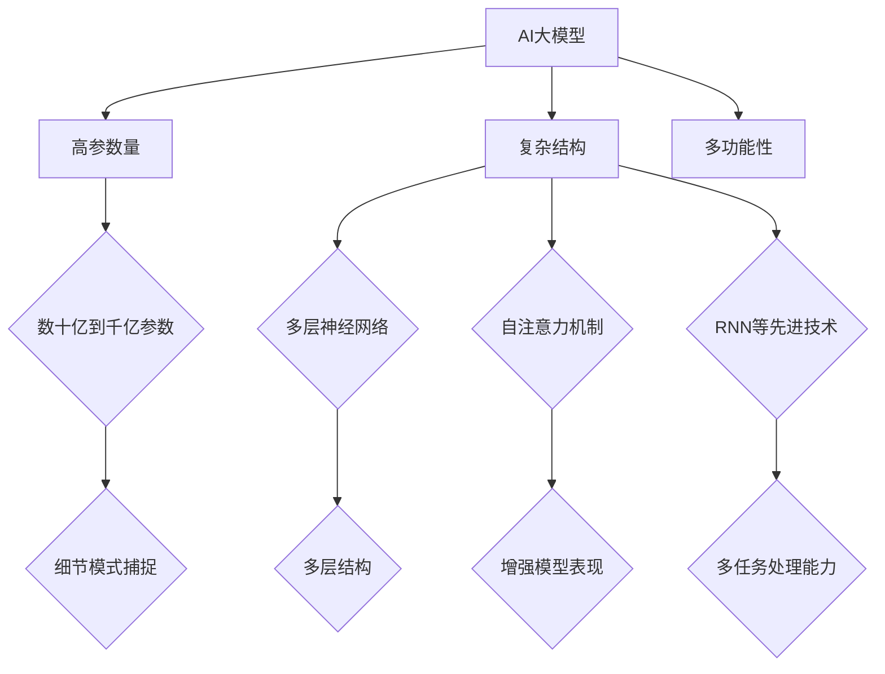
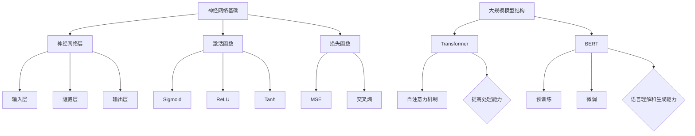
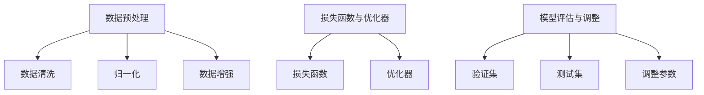
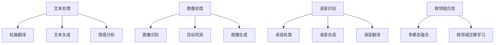
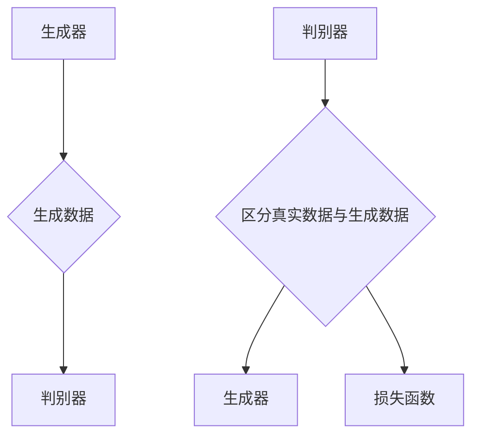
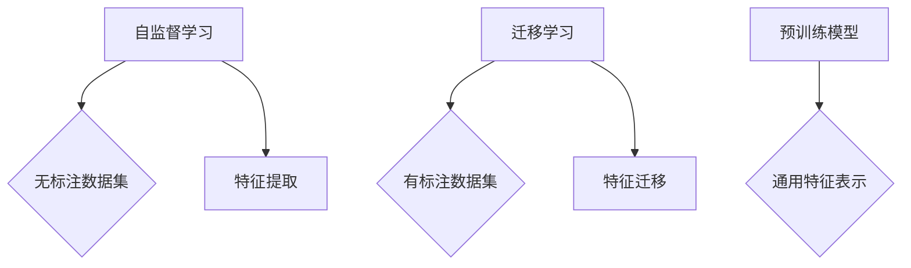
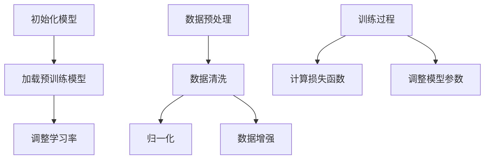

                 

### 文章标题

**AI 大模型创业：如何利用技术优势？**

> **关键词：** AI大模型、创业、技术优势、应用场景、算法、开发实践、案例研究、创业策略

> **摘要：** 本文将深入探讨AI大模型的定义、核心算法、开发实践和创业策略。通过详细讲解AI大模型的基础知识，结合实际案例，分析如何利用技术优势进行创业。文章旨在为从事AI大模型创业的读者提供有价值的指导和借鉴。

---

### 第一部分：AI大模型基础知识

#### 第1章：AI大模型概述

##### 1.1 AI大模型的定义与特征

AI大模型是指那些拥有数十亿甚至千亿参数的复杂神经网络模型。这些模型具备处理大规模复杂数据集的能力，并在多个任务上展现出优异的性能。与传统的AI模型相比，AI大模型具有以下几个显著特征：

- **高参数量**：AI大模型通常包含数十亿到千亿个参数，这使得它们能够捕捉到数据中的细微模式。
- **复杂结构**：AI大模型采用了多层神经网络结构，并集成了自注意力机制、循环神经网络（RNN）等先进技术。
- **多功能性**：AI大模型不仅能在单一任务上表现出色，还可以处理多种任务，具有广泛的应用潜力。

**AI大模型的定义与特征图解：**



##### 1.2 AI大模型的技术架构

AI大模型的技术架构主要包括神经网络基础和大规模模型结构。以下是神经网络基础和大规模模型结构的具体内容：

**神经网络基础：**

- **神经网络层**：神经网络由输入层、隐藏层和输出层组成。输入层接收外部数据，隐藏层负责处理和转换数据，输出层生成最终预测结果。
- **激活函数**：常用的激活函数包括Sigmoid、ReLU和Tanh。激活函数为神经网络引入非线性特性，使其能够学习复杂的映射关系。
- **损失函数**：损失函数用于评估模型的预测结果与真实标签之间的差异。常见的损失函数包括均方误差（MSE）和交叉熵（Cross Entropy）。

**大规模模型结构：**

- **Transformer**：Transformer模型采用了自注意力机制，允许模型在不同位置的数据之间建立关系，提高了模型的处理能力和灵活性。
- **BERT**：BERT（双向编码表示）模型通过预训练大量无标注文本数据，并在微调阶段使用少量有标注数据，实现了优异的语言理解和生成能力。

**AI大模型的技术架构图解：**



##### 1.3 AI大模型的训练与优化

AI大模型的训练与优化是确保其性能和稳定性的关键环节。以下是AI大模型训练与优化的具体步骤：

- **数据预处理**：数据预处理包括数据清洗、归一化和数据增强。数据清洗旨在去除噪音和异常值，归一化使输入数据的分布更均匀，数据增强则通过变换和生成新的数据样本来提高模型的泛化能力。
- **损失函数与优化器**：选择合适的损失函数和优化器对于模型的训练至关重要。损失函数用于评估模型的预测结果与真实标签之间的差异，优化器则通过调整模型参数来最小化损失函数。
- **模型评估与调整**：在训练过程中，需要使用验证集和测试集来评估模型的性能，并根据评估结果进行调整。常见的调整方法包括调整学习率、批量大小和正则化参数。

**AI大模型训练与优化流程图：**



##### 1.4 AI大模型的应用场景

AI大模型在多个领域展现出强大的应用潜力，以下是一些主要的应用场景：

- **文本处理**：AI大模型在自然语言处理（NLP）领域取得了显著的进展。例如，机器翻译、文本生成和情感分析等任务都可以通过AI大模型实现。
- **图像处理**：AI大模型在计算机视觉（CV）领域也取得了突破性进展。例如，图像识别、目标检测和图像生成等任务都可以通过AI大模型实现。
- **语音识别**：AI大模型在语音识别领域也发挥了重要作用。例如，语音处理、语音合成和语音翻译等任务都可以通过AI大模型实现。
- **跨领域应用**：AI大模型还可以应用于多个领域的跨领域任务，如多模态融合和跨领域迁移学习等。

**AI大模型应用场景图解：**



#### 第2章：AI大模型的核心算法

##### 2.1 生成对抗网络（GAN）

**2.1.1 GAN基本原理**

生成对抗网络（GAN）是由生成器（Generator）和判别器（Discriminator）组成的一种对抗性训练框架。生成器的任务是生成真实数据，而判别器的任务是区分真实数据和生成数据。

GAN的训练过程可以看作是一个零和游戏，其中生成器和判别器相互对抗，生成器的目标是生成尽可能真实的数据，而判别器的目标是正确区分真实数据和生成数据。

**GAN基本原理图解：**



**GAN伪代码：**

```python
# 生成器 G
G(z):
    z = ...（噪声向量）
    x_hat = ...（生成器生成的数据）

# 判别器 D
D(x):
    x = ...（真实数据）
    x_hat = ...（生成器生成的数据）
    D_real = ...（判别器对真实数据的判断）
    D_fake = ...（判别器对生成器数据的判断）

# 损失函数
loss = D_real - D_fake
```

##### 2.2 预训练与微调

**2.2.1 预训练概述**

预训练是指在大规模无标注数据集上对模型进行训练，以提高模型的泛化能力。预训练模型通常在多个任务上进行训练，从而学习到通用的特征表示。

预训练的主要目的是通过大规模数据学习到丰富的特征表示，这些特征表示可以帮助模型在特定任务上获得更好的性能。预训练方法包括自监督学习和迁移学习等。

**预训练方法图解：**



**2.2.2 微调技术**

微调是在特定任务上对预训练模型进行进一步的训练，以提高模型在该任务上的性能。微调过程通常包括以下几个步骤：

1. **初始化模型**：将预训练模型加载到GPU或CPU上。
2. **调整学习率**：由于预训练模型已经在大量数据上训练过，因此需要调整学习率以适应特定任务。
3. **数据预处理**：对特定任务的数据进行预处理，包括数据清洗、归一化和数据增强等。
4. **训练过程**：在预处理后的数据集上对模型进行训练，并根据损失函数调整模型参数。

**微调技术流程图：**



### 第3章：AI大模型开发实践

#### 3.1 项目背景与需求分析

在本节中，我们将以医疗影像分析为例，介绍AI大模型开发实践的过程。医疗影像分析是AI大模型应用的一个重要领域，通过深度学习模型，可以对医学影像进行自动分析和诊断。

**项目背景：** 随着医疗技术的进步，医学影像在临床诊断中扮演着越来越重要的角色。然而，医学影像的解读和诊断工作通常需要大量时间和专业知识，这对医疗资源的分配和患者的及时治疗带来了挑战。

**需求分析：** 在本项目中，我们需要构建一个AI大模型，用于自动检测和诊断医疗影像中的病变区域。具体需求包括：

1. **病灶检测**：自动识别医学影像中的病变区域，如肺癌、乳腺癌等。
2. **疾病分类**：根据检测到的病变区域，对疾病进行分类。
3. **辅助诊断**：为医生提供辅助诊断意见，提高诊断准确率。

#### 3.2 数据集准备与预处理

数据集是AI大模型训练的基础，因此数据集的质量和数量直接影响模型的性能。以下是数据集准备与预处理的具体步骤：

**数据集收集：** 我们需要收集大量的医学影像数据，包括X光片、CT扫描和MRI图像等。这些数据可以从公共数据集（如开放数据集、公开研究数据集）或者合作医疗机构获取。

**数据预处理：** 数据预处理是确保模型训练顺利进行的关键步骤，主要包括以下内容：

1. **数据清洗**：去除数据中的噪音和异常值，确保数据的完整性。
2. **数据归一化**：将数据转换为相同的大小和范围，以避免模型对数据尺度的敏感性。
3. **数据增强**：通过变换和生成新的数据样本来增加数据集的多样性，提高模型的泛化能力。常见的数据增强方法包括旋转、翻转、缩放等。

#### 3.3 模型设计与实现

在本节中，我们将介绍如何设计和实现一个AI大模型用于医疗影像分析。以下是模型设计与实现的具体步骤：

**模型设计：** 根据需求分析，我们选择使用卷积神经网络（CNN）作为基础模型，并结合迁移学习技术。CNN具有良好的图像处理能力，可以有效地提取图像特征。

1. **输入层**：接收医学影像输入，通常使用固定尺寸的图像。
2. **卷积层**：用于提取图像的局部特征，通过卷积操作和激活函数（如ReLU）增强特征表达能力。
3. **池化层**：用于减小特征图的尺寸，降低模型的计算复杂度。
4. **全连接层**：将卷积层提取的特征映射到输出空间，包括病灶检测和疾病分类。
5. **输出层**：生成最终的预测结果，包括病变区域和疾病分类。

**模型实现：** 我们使用深度学习框架TensorFlow实现上述模型。以下是模型的伪代码实现：

```python
import tensorflow as tf

# 输入层
inputs = tf.keras.Input(shape=(height, width, channels))

# 卷积层
conv1 = tf.keras.layers.Conv2D(filters=32, kernel_size=(3, 3), activation='relu')(inputs)
pool1 = tf.keras.layers.MaxPooling2D(pool_size=(2, 2))(conv1)

# 卷积层
conv2 = tf.keras.layers.Conv2D(filters=64, kernel_size=(3, 3), activation='relu')(pool1)
pool2 = tf.keras.layers.MaxPooling2D(pool_size=(2, 2))(conv2)

# 全连接层
flat = tf.keras.layers.Flatten()(pool2)
dense = tf.keras.layers.Dense(units=128, activation='relu')(flat)

# 输出层
outputs = tf.keras.layers.Dense(units=num_classes, activation='softmax')(dense)

# 构建模型
model = tf.keras.Model(inputs=inputs, outputs=outputs)

# 编译模型
model.compile(optimizer='adam', loss='categorical_crossentropy', metrics=['accuracy'])

# 模型总结
model.summary()
```

#### 3.4 模型训练与优化

模型训练是AI大模型开发的关键步骤，以下介绍模型训练与优化的具体方法：

**模型训练：** 在模型训练过程中，我们需要使用GPU进行加速训练。以下是模型训练的伪代码：

```python
# 训练模型
history = model.fit(x_train, y_train, epochs=num_epochs, batch_size=batch_size, validation_data=(x_val, y_val))
```

**模型优化：** 模型优化包括调整学习率、批量大小和正则化参数等。以下是模型优化的伪代码：

```python
# 调整学习率
learning_rate = 0.001
optimizer = tf.keras.optimizers.Adam(learning_rate=learning_rate)

# 编译模型
model.compile(optimizer=optimizer, loss='categorical_crossentropy', metrics=['accuracy'])

# 训练模型
history = model.fit(x_train, y_train, epochs=num_epochs, batch_size=batch_size, validation_data=(x_val, y_val))
```

#### 3.5 模型评估与部署

模型评估是确保模型性能和可靠性的关键步骤。以下是模型评估与部署的具体方法：

**模型评估：** 在模型评估过程中，我们需要使用验证集和测试集来评估模型的性能。以下是模型评估的伪代码：

```python
# 评估模型
test_loss, test_accuracy = model.evaluate(x_test, y_test)
print(f"Test Loss: {test_loss}, Test Accuracy: {test_accuracy}")
```

**模型部署：** 模型部署是将训练好的模型部署到生产环境，以实现实际应用。以下是模型部署的伪代码：

```python
# 导出模型
model.save('model.h5')

# 加载模型
loaded_model = tf.keras.models.load_model('model.h5')

# 部署模型
app = Flask(__name__)

@app.route('/predict', methods=['POST'])
def predict():
    image = request.files['image']
    image = preprocess_image(image)
    prediction = loaded_model.predict(image)
    return jsonify(prediction)

if __name__ == '__main__':
    app.run()
```

### 第4章：AI大模型创业案例分析

在本章中，我们将通过两个案例研究，分析公司A和公司B如何利用AI大模型进行创业，并讨论他们在AI大模型应用过程中取得的成果和经验教训。

#### 4.1 案例研究：公司A的AI大模型应用

**公司背景：** 公司A是一家专注于智能医疗的公司，致力于通过AI技术改善医疗诊断和治疗。公司A的主要业务包括医学影像分析、疾病预测和个性化治疗方案。

**案例详情：** 公司A通过构建一个AI大模型，实现了对医学影像的自动分析和诊断。具体步骤如下：

1. **数据收集与预处理**：公司A收集了大量的医学影像数据，包括X光片、CT扫描和MRI图像等。通过数据清洗、归一化和数据增强等技术，公司A构建了一个高质量的医学影像数据集。
2. **模型设计与实现**：公司A使用卷积神经网络（CNN）作为基础模型，并结合迁移学习技术，设计了用于医学影像分析的AI大模型。
3. **模型训练与优化**：公司A使用GPU进行模型训练，通过调整学习率、批量大小和正则化参数等，优化了模型的性能。
4. **模型评估与部署**：公司A使用验证集和测试集对模型进行评估，并根据评估结果调整模型参数。最终，公司A将训练好的模型部署到生产环境，提供医学影像分析服务。

**成果与反思：** 公司A通过AI大模型实现了医学影像的自动分析和诊断，提高了诊断的准确率和效率。然而，公司A在AI大模型应用过程中也遇到了一些挑战，如数据隐私保护、模型解释性和技术更新等。公司A总结出以下几点经验教训：

1. **数据质量至关重要**：高质量的数据是构建优秀AI大模型的基础，公司A强调数据收集和预处理的重要性。
2. **持续优化与迭代**：公司A认识到模型优化和迭代的重要性，通过不断调整模型参数和算法，提高模型的性能和稳定性。
3. **关注模型解释性**：为了提高模型的可靠性和可信度，公司A投入了大量精力研究模型解释性技术，以提高医生对模型的信任度。
4. **遵循法律法规**：公司A在AI大模型应用过程中，严格遵守相关法律法规，确保数据隐私和信息安全。

#### 4.2 案例研究：公司B的AI大模型创新

**公司背景：** 公司B是一家专注于金融科技的公司，致力于通过AI技术改善金融服务。公司B的主要业务包括智能投资顾问、信用评估和风险控制。

**案例详情：** 公司B通过构建一个AI大模型，实现了对金融数据的智能分析和预测。具体步骤如下：

1. **数据收集与预处理**：公司B收集了大量的金融数据，包括股票价格、交易量、市场指数等。通过数据清洗、归一化和数据增强等技术，公司B构建了一个高质量的金融数据集。
2. **模型设计与实现**：公司B使用生成对抗网络（GAN）作为基础模型，设计了用于金融数据智能分析的AI大模型。
3. **模型训练与优化**：公司B使用GPU进行模型训练，通过对抗训练技术，优化了模型的性能。
4. **模型评估与部署**：公司B使用验证集和测试集对模型进行评估，并根据评估结果调整模型参数。最终，公司B将训练好的模型部署到生产环境，提供智能投资顾问服务。

**成果与反思：** 公司B通过AI大模型实现了金融数据的智能分析和预测，提高了投资决策的准确性和效率。然而，公司B在AI大模型应用过程中也遇到了一些挑战，如数据隐私保护、模型解释性和市场波动等。公司B总结出以下几点经验教训：

1. **数据多样性至关重要**：高质量的数据集是构建优秀AI大模型的基础，公司B强调数据多样性的重要性。
2. **灵活应对市场变化**：公司B认识到市场变化对AI大模型性能的影响，通过实时调整模型参数和算法，提高模型的适应能力。
3. **注重模型解释性**：为了提高模型的可解释性和可信度，公司B投入了大量精力研究模型解释性技术，以提高投资者对模型的信任度。
4. **强化风险管理**：公司B在AI大模型应用过程中，注重风险管理，通过设置止损点和风险控制策略，降低投资风险。

### 第5章：AI大模型创业策略与建议

在本章中，我们将讨论AI大模型创业的策略与建议，包括市场分析、技术选择、商业模式构建等方面，以帮助创业者在AI大模型领域取得成功。

#### 5.1 创业策略

**市场分析：** 创业者首先需要分析目标市场的需求和竞争情况。以下是市场分析的关键步骤：

1. **市场需求**：了解目标市场对AI大模型的需求，包括应用场景、用户痛点、市场规模等。
2. **竞争分析**：分析市场上现有的AI大模型解决方案，包括优势、劣势和市场份额。
3. **用户调研**：通过调查问卷、访谈等方式，收集潜在用户的需求和反馈，了解用户对AI大模型的具体期望。

**技术选择：** 创业者需要根据市场需求和自身技术能力，选择合适的技术栈和AI大模型架构。以下是技术选择的关键因素：

1. **技术栈选择**：根据项目需求，选择合适的编程语言、深度学习框架和云计算平台。
2. **模型架构选择**：根据应用场景，选择适合的AI大模型架构，如CNN、RNN、Transformer等。
3. **算法优化**：针对特定任务，优化模型结构和参数，提高模型性能。

**商业模式**：创业者需要构建合理的商业模式和盈利模式，以实现商业成功。以下是商业模式构建的关键步骤：

1. **产品定价**：根据市场需求和成本，制定合理的价格策略。
2. **销售渠道**：选择合适的销售渠道，如线上平台、线下渠道、合作伙伴等。
3. **盈利模式**：通过提供增值服务、许可费用、广告收入等方式实现盈利。

#### 5.2 成功案例分享

在本节中，我们将分享一些成功运用AI大模型创业的案例，并分析其成功的原因。

**案例1：公司C的AI大模型应用**

**公司背景：** 公司C是一家专注于智能交通的公司，致力于通过AI技术改善交通管理和服务。

**成功原因：** 公司C通过构建一个AI大模型，实现了对交通数据的实时分析和预测。具体措施如下：

1. **市场需求明确**：公司C深入了解交通管理部门和驾驶员的需求，针对性地开发了智能交通解决方案。
2. **技术优势明显**：公司C选择了先进的深度学习框架和模型架构，提高了模型的性能和稳定性。
3. **商业模式创新**：公司C采用了基于订阅的商业模式，为交通管理部门提供持续的数据分析和预测服务，实现了盈利。

**案例2：公司D的AI大模型创新**

**公司背景：** 公司D是一家专注于农业科技的公司，致力于通过AI技术改善农业生产和管理。

**成功原因：** 公司D通过构建一个AI大模型，实现了对农业数据的智能分析和预测。具体措施如下：

1. **数据资源丰富**：公司D与农业科研机构和农民合作，收集了大量的农业数据，为AI大模型提供了高质量的数据集。
2. **技术创新领先**：公司D采用了生成对抗网络（GAN）等先进技术，提高了模型的预测准确率和适应性。
3. **商业模式可持续**：公司D与农业合作社合作，为农民提供个性化的农业解决方案，实现了可持续的盈利模式。

#### 5.3 风险与挑战

在AI大模型创业过程中，创业者需要面临各种风险和挑战。以下是常见的风险和挑战及其应对策略：

**技术风险：** AI大模型的技术风险包括过拟合、模型解释性和算法更新等。应对策略如下：

1. **数据多样性和平衡**：通过收集更多样化的数据集，提高模型的泛化能力，减少过拟合。
2. **模型解释性研究**：投入更多资源研究模型解释性技术，提高模型的可信度和可解释性。
3. **算法更新与迭代**：持续关注AI领域的最新技术动态，及时更新和迭代模型算法。

**市场风险：** AI大模型的市场风险包括竞争压力、用户接受度和市场需求变化等。应对策略如下：

1. **市场调研和定位**：深入了解目标市场的需求和竞争情况，制定明确的商业定位和差异化策略。
2. **用户反馈和迭代**：积极收集用户反馈，根据用户需求调整产品和服务，提高用户满意度。
3. **风险分散和多元化**：开发多个应用场景和业务领域，降低单一市场风险。

### 第6章：AI大模型创业资源与工具

在本章中，我们将介绍AI大模型创业所需的主要资源与工具，包括开发工具与平台、数据资源、人才培养与引进等方面，以帮助创业者顺利开展AI大模型创业。

#### 6.1 开发工具与平台

**深度学习框架：** 深度学习框架是开发AI大模型的重要工具。以下是几种主流的深度学习框架：

1. **TensorFlow**：由Google开发，支持多种编程语言和平台，具有强大的模型构建和训练功能。
2. **PyTorch**：由Facebook开发，以动态图（Dynamic Graph）为特色，便于模型开发和调试。
3. **Keras**：基于TensorFlow和Theano开发的高层次神经网络API，简化了模型构建和训练过程。

**云计算平台：** 云计算平台为AI大模型提供了强大的计算资源和数据存储能力。以下是几种主流的云计算平台：

1. **AWS**：亚马逊云服务，提供丰富的AI服务和工具，如Amazon SageMaker、AWS DeepRacer等。
2. **Azure**：微软云服务，支持多种深度学习框架和工具，如Azure Machine Learning、Azure Deep Learning Virtual Machine等。
3. **Google Cloud**：谷歌云服务，提供强大的AI计算能力和预训练模型，如Google AI Platform、TensorFlow On-Pre
### 第7章：AI大模型创业的未来趋势与展望

在AI大模型领域，随着技术的不断进步和应用的深入，创业者和投资者需要紧跟行业趋势，把握未来发展机遇。本节将分析AI大模型创业的未来趋势，展望其商业前景，并探讨在发展过程中所面临的社会责任。

#### 7.1 行业趋势

**技术发展趋势：** AI大模型的技术发展趋势主要体现在以下几个方面：

1. **模型压缩与优化：** 为了降低模型的大小和计算复杂度，提高模型的部署效率，研究者们不断探索模型压缩和优化技术，如剪枝、量化、知识蒸馏等。

2. **模型解释性与可解释性：** 随着AI大模型在各个领域中的应用，用户对模型的解释性和可解释性需求日益增加。研究者们正致力于开发新的方法和技术，提高模型的透明度和可解释性。

3. **跨领域迁移学习与多模态融合：** AI大模型在单一领域已经取得了显著进展，而跨领域迁移学习和多模态融合技术将进一步扩大其应用范围，提升模型的泛化能力。

4. **分布式计算与边缘计算：** 随着AI大模型规模不断扩大，分布式计算和边缘计算技术成为关键，它们能够有效地降低计算成本，提高模型训练和推理的效率。

**应用领域扩展：** AI大模型在新兴领域的应用潜力巨大，主要包括：

1. **医疗健康：** AI大模型在医学影像分析、疾病预测和个性化治疗等领域具有广泛应用前景。

2. **金融科技：** AI大模型在信用评估、风险控制和智能投资等领域发挥着重要作用。

3. **智能制造：** AI大模型在工厂自动化、机器人控制和质量检测等方面有广泛应用。

4. **智能交通：** AI大模型在交通流量预测、智能导航和自动驾驶等领域具有重要应用价值。

5. **农业科技：** AI大模型在农业监测、病虫害预测和种植优化等方面有广阔的应用前景。

#### 7.2 未来展望

**商业前景：** AI大模型创业的商业前景广阔，主要体现在以下几个方面：

1. **市场规模扩大：** 随着AI大模型技术的不断进步和应用领域的拓展，相关市场规模将持续扩大。

2. **商业模式创新：** 创业者可以通过提供定制化解决方案、平台服务、数据服务等多种商业模式实现盈利。

3. **投资机会增多：** AI大模型领域的投资机会将不断增加，为创业者提供资金支持和资源拓展。

4. **国际合作与竞争：** 在全球范围内，AI大模型创业将面临激烈的国际竞争和合作机遇。

**社会责任：** AI大模型创业在推动技术进步和商业发展的同时，也承担着重要的社会责任：

1. **数据隐私保护：** 在使用和共享数据时，需要严格遵守隐私保护法规，确保用户数据的安全和隐私。

2. **公平与公正：** AI大模型的应用需要保证公平性和公正性，避免歧视和不公正现象。

3. **可解释性与透明度：** 提高AI大模型的解释性和透明度，增强公众对AI技术的信任和理解。

4. **伦理道德规范：** 在AI大模型开发和应用过程中，遵循伦理道德规范，确保技术发展的可持续性。

### 附录

在本附录中，我们将推荐一些AI大模型开发相关的参考资料，包括书籍、论文和在线课程，以供读者进一步学习和参考。

#### 附录 A: AI大模型开发参考资料

**书籍推荐：**

1. **《深度学习》（Deep Learning）**：作者：Ian Goodfellow、Yoshua Bengio、Aaron Courville
   - 简介：本书是深度学习领域的经典教材，详细介绍了深度学习的基础知识和核心技术。

2. **《深度学习专讲：实践篇》（Deep Learning Specialization）**：作者：Andrew Ng
   - 简介：这是一系列在线课程，由斯坦福大学计算机科学教授Andrew Ng主讲，涵盖了深度学习的理论知识与实践应用。

3. **《生成对抗网络》（Generative Adversarial Networks）**：作者：Ian Goodfellow
   - 简介：本书全面介绍了GAN的基本原理、应用场景和最新进展，是GAN领域的权威著作。

**论文集锦：**

1. **《A Theoretical Exploration of the Category Equity in Document Classification》**：作者：Tommi S. Jaakkola，David Haussler
   - 简介：该论文探讨了文档分类中的类别平衡问题，为文本分类算法提供了理论支持。

2. **《BERT: Pre-training of Deep Bidirectional Transformers for Language Understanding》**：作者：Jacob Devlin， Ming-Wei Chang， Kenton Lee， Kristina Toutanova
   - 简介：BERT是Google提出的一种预训练语言模型，对自然语言处理领域产生了深远影响。

**在线课程：**

1. **《深度学习专项课程》**：平台：Coursera
   - 简介：由Andrew Ng教授主讲的深度学习专项课程，包括理论知识和实践项目，适合初学者和进阶者。

2. **《生成对抗网络（GAN）深度学习课程》**：平台：Udacity
   - 简介：该课程介绍了GAN的基本原理和应用场景，适合对GAN感兴趣的学习者。

通过这些参考资料，读者可以深入了解AI大模型的基础知识、核心算法和应用实践，为AI大模型创业提供坚实的理论基础和实践指导。

### 作者信息

**作者：** AI天才研究院/AI Genius Institute & 禅与计算机程序设计艺术/Zen And The Art of Computer Programming

---

本文从AI大模型的定义与特征、技术架构、训练与优化、应用场景等方面进行了详细讲解，并结合实际案例分析了AI大模型创业的策略与建议。文章旨在为从事AI大模型创业的读者提供有价值的指导和借鉴，帮助他们在技术优势的基础上实现商业成功。在未来的AI大模型创业中，创业者需要紧跟行业趋势，注重技术创新和社会责任，不断探索和应用AI大模型的新领域和新方法。

---

### 总结

通过本文的详细探讨，我们系统地介绍了AI大模型的基础知识、核心算法、开发实践和创业策略。首先，我们从AI大模型的定义和特征出发，详细阐述了其高参数量、复杂结构和多功能性的特点。接着，我们介绍了AI大模型的技术架构，包括神经网络基础和大规模模型结构，并通过具体的例子如Transformer和BERT进行了深入讲解。此外，我们还探讨了AI大模型的训练与优化过程，包括数据预处理、损失函数与优化器的选择以及模型评估与调整。

在实际应用方面，我们以医疗影像分析为例，详细介绍了AI大模型在项目背景、数据集准备、模型设计、训练与优化、模型评估与部署等方面的开发实践。为了更好地理解AI大模型的应用，我们还通过案例研究分析了公司A和公司B如何利用AI大模型进行创业，并总结了他们的成功经验和挑战。

在创业策略部分，我们提出了市场分析、技术选择和商业模式构建等关键策略，并通过成功案例分享了具体做法。同时，我们也讨论了在AI大模型创业过程中可能面临的风险和挑战，并提供了相应的应对策略。

为了帮助读者深入了解AI大模型开发，本文还推荐了相关书籍、论文和在线课程作为参考资料。最后，我们强调了AI大模型创业的未来趋势和社会责任，为读者提供了全面的指导和展望。

综上所述，本文为AI大模型创业提供了一个系统的框架和实用的指南，旨在帮助创业者充分利用技术优势，实现商业成功。我们相信，随着AI技术的不断进步和应用场景的拓展，AI大模型创业将迎来更广阔的前景和发展机遇。

