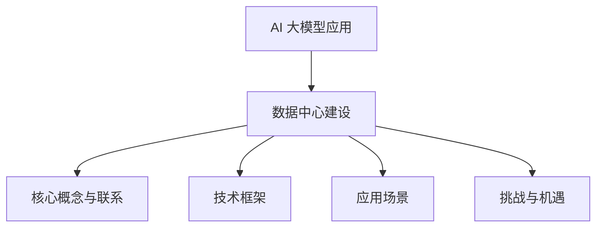

                 

# AI 大模型应用数据中心建设：数据中心技术创新

> **关键词：**AI 大模型，数据中心建设，技术创新，深度学习，高性能计算，网络安全

> **摘要：**本文从 AI 大模型的概述、数据中心的应用与挑战、建设流程与技术创新等多个方面，详细探讨了 AI 大模型应用数据中心建设的现状与未来发展。通过对核心概念、技术框架、应用场景的深入分析，以及实际案例的解析，为读者提供了全面的技术指导与实用建议。

----------------------------------------------------------------

### 目录大纲

#### 第一部分: AI 大模型概述

1. **第1章: AI 大模型基础**
    1.1 AI 大模型的发展历程与趋势
    1.2 AI 大模型的核心概念
    1.3 AI 大模型的技术框架

2. **第2章: AI 大模型在数据中心的应用**
    2.1 数据中心概述
    2.2 AI 大模型在数据中心的应用
    2.3 AI 大模型在数据中心的应用案例

3. **第3章: AI 大模型在数据中心的技术挑战**

#### 第二部分: AI 大模型应用

4. **第4章: AI 大模型数据中心建设流程**
    4.1 数据中心建设的前期准备
    4.2 数据中心建设的主要步骤
    4.3 数据中心建设后的运营与维护

5. **第5章: AI 大模型数据中心案例研究**
    5.1 某大型互联网公司数据中心建设
    5.2 某金融公司数据中心升级

6. **第6章: AI 大模型数据中心建设中的技术创新**
    6.1 新型存储技术
    6.2 高性能计算技术
    6.3 新型网络架构

7. **第7章: AI 大模型数据中心建设的未来趋势**
    7.1 数据中心建设的未来发展趋势
    7.2 AI 大模型数据中心建设的挑战与机遇

### 附录

8. **附录 A: 常用技术术语解释**
9. **附录 B: AI 大模型相关工具与资源**
10. **附录 C: AI 大模型应用案例汇总**
11. **附录 D: AI 大模型数据中心建设关键步骤**
12. **附录 E: AI 大模型数据中心建设常见问题与解决方案**

----------------------------------------------------------------

### Mermaid 流程图



### 核心算法原理讲解

#### 2.1.1 神经网络的基本结构

神经网络是由大量简单神经元组成的复杂网络，每个神经元都接收来自其他神经元的输入信号，并通过激活函数产生输出信号。神经网络的基本结构包括输入层、隐藏层和输出层。

伪代码：

```python
def neural_network(input_data, weights, bias, activation_function):
    # 输入层到隐藏层的计算
    hidden_layer_output = []
    for hidden_layer in hidden_layers:
        hidden_layer_output.append(activation_function(np.dot(input_data, weights[0]) + bias[0]))
    
    # 隐藏层到输出层的计算
    output_layer_output = activation_function(np.dot(hidden_layer_output[-1], weights[-1]) + bias[-1])
    
    return output_layer_output
```

#### 2.1.2 常见的深度学习架构

常见的深度学习架构包括卷积神经网络（CNN）、循环神经网络（RNN）和生成对抗网络（GAN）。

伪代码：

```python
# 卷积神经网络（CNN）
def conv_network(input_image, filters, bias, activation_function):
    # 卷积操作
    conv_output = convolution(input_image, filters)
    # 池化操作
    pool_output = pooling(conv_output)
    # 激活函数
    act_output = activation_function(pool_output)
    return act_output

# 循环神经网络（RNN）
def recurrent_network(input_sequence, weights, bias, activation_function):
    # 隐藏状态的计算
    hidden_state = activation_function(np.dot(input_sequence, weights) + bias)
    return hidden_state

# 生成对抗网络（GAN）
def generate_output(generated_samples, generator_weights, discriminator_weights, loss_function):
    # 生成器生成样本
    generated_samples = generator(generated_samples, generator_weights)
    # 判别器对样本进行判别
    discriminator_output = discriminator(generated_samples, discriminator_weights)
    # 计算损失函数
    loss = loss_function(discriminator_output, generated_samples)
    return loss
```

#### 2.1.3 神经网络的权重与偏置更新

神经网络的权重和偏置更新通常使用梯度下降算法。公式如下：

$$
\Delta w = -\alpha \frac{\partial L}{\partial w}
$$

$$
\Delta b = -\alpha \frac{\partial L}{\partial b}
$$

其中，$\alpha$ 为学习率，$L$ 为损失函数，$w$ 和 $b$ 分别为权重和偏置。

#### 2.1.4 激活函数

常见的激活函数包括 sigmoid、ReLU 和 tanh。

公式如下：

$$
sigmoid(x) = \frac{1}{1 + e^{-x}}
$$

$$
ReLU(x) = \max(0, x)
$$

$$
tanh(x) = \frac{e^x - e^{-x}}{e^x + e^{-x}}
$$

### 项目实战

#### 5.1 某大型互联网公司数据中心建设案例

**背景与目标：**

某大型互联网公司需要建设一个高效、稳定、安全的数据中心，以满足其不断增长的业务需求。数据中心需要具备高性能计算、海量数据存储、数据安全保护等功能。

**实施过程：**

1. **需求分析与规划：**
   - 分析公司当前和未来的业务需求，确定数据中心所需的功能和性能指标。
   - 制定详细的数据中心建设方案，包括硬件设备选型、网络架构、安全策略等。

2. **基础设施搭建：**
   - 选择合适的数据中心场地，进行基础设施的建设，包括机房、供电系统、制冷系统等。
   - 搭建高可靠性的数据中心网络，确保数据传输的高速与稳定。

3. **设备部署与配置：**
   - 部署服务器、存储设备、网络设备等硬件设备。
   - 配置操作系统、数据库、网络协议等软件环境。

4. **系统集成与测试：**
   - 进行系统集成，确保各部分功能正常运行。
   - 进行全面的性能测试和压力测试，验证数据中心的能力。

5. **运营与维护：**
   - 建立完善的运营管理制度，确保数据中心稳定运行。
   - 定期进行设备维护和故障处理，确保数据中心的可靠性和安全性。

**成果与经验：**

- 数据中心的整体建设达到了预期目标，有效提高了公司的数据处理能力和业务效率。
- 通过创新技术和管理方法，实现了数据中心的节能减排和安全性。
- 案例经验为其他公司数据中心建设提供了有益的参考。

### 开发环境搭建

**开发环境搭建步骤：**

1. **环境准备：**
   - 安装操作系统（如 Ubuntu 20.04）
   - 配置 Python 环境（如 Python 3.8）

2. **安装深度学习框架：**
   - 安装 TensorFlow：`pip install tensorflow`
   - 安装 PyTorch：`pip install torch torchvision`

3. **安装辅助工具：**
   - 安装 Jupyter Notebook：`pip install notebook`
   - 安装 Matplotlib：`pip install matplotlib`

4. **配置开发环境：**
   - 配置虚拟环境，便于管理和维护项目
   - 配置 Jupyter Notebook，方便代码调试和演示

**详细步骤：**

```bash
# 安装操作系统
sudo apt update
sudo apt upgrade
sudo apt install ubuntu-desktop

# 配置 Python 环境
sudo apt install python3-pip
pip3 install --upgrade pip

# 安装 TensorFlow
pip3 install tensorflow

# 安装 PyTorch
pip3 install torch torchvision

# 安装 Jupyter Notebook
pip3 install notebook

# 安装 Matplotlib
pip3 install matplotlib

# 配置虚拟环境
pip3 install virtualenv
virtualenv myenv
source myenv/bin/activate

# 安装深度学习项目所需的其他依赖
pip3 install numpy pandas scikit-learn

# 启动 Jupyter Notebook
jupyter notebook
```

### 源代码详细实现和代码解读

#### 6.1 数据预处理与清洗

**代码实现：**

```python
import pandas as pd
from sklearn.model_selection import train_test_split

# 读取数据
data = pd.read_csv('data.csv')

# 数据预处理
def preprocess_data(data):
    # 填补缺失值
    data.fillna(data.mean(), inplace=True)
    
    # 数据标准化
    data_scale = (data - data.mean()) / data.std()
    
    return data_scale

# 数据清洗
data_clean = preprocess_data(data)

# 划分训练集和测试集
X_train, X_test, y_train, y_test = train_test_split(data_clean.drop('target', axis=1), data_clean['target'], test_size=0.2, random_state=42)
```

**代码解读：**

- 读取数据：使用 Pandas 库读取 CSV 格式的数据文件。
- 数据预处理：定义 preprocess\_data 函数进行数据预处理，包括填补缺失值和数据标准化。
- 数据清洗：使用 train\_test\_split 函数将数据集划分为训练集和测试集，为后续的模型训练和测试做准备。

#### 6.2 模型训练与优化

**代码实现：**

```python
import tensorflow as tf
from tensorflow.keras.models import Sequential
from tensorflow.keras.layers import Dense, Activation

# 构建模型
model = Sequential()
model.add(Dense(64, input_shape=(X_train.shape[1],), activation='relu'))
model.add(Dense(32, activation='relu'))
model.add(Dense(1, activation='sigmoid'))

# 编译模型
model.compile(optimizer='adam', loss='binary_crossentropy', metrics=['accuracy'])

# 训练模型
model.fit(X_train, y_train, epochs=10, batch_size=32, validation_split=0.1)
```

**代码解读：**

- 构建模型：使用 Sequential 模型堆叠多层神经网络，包括两个隐藏层，每个隐藏层使用 ReLU 激活函数，输出层使用 sigmoid 激活函数。
- 编译模型：设置优化器为 Adam，损失函数为 binary\_crossentropy，评价标准为 accuracy。
- 训练模型：使用 fit 函数进行模型训练，设置训练轮次为 10，批量大小为 32，同时使用验证集进行验证。

#### 6.3 模型部署与运维

**代码实现：**

```python
# 导出模型
model.save('model.h5')

# 加载模型
loaded_model = tf.keras.models.load_model('model.h5')

# 使用模型进行预测
predictions = loaded_model.predict(X_test)

# 评估模型
loss, accuracy = loaded_model.evaluate(X_test, y_test)
print(f"Test accuracy: {accuracy:.2f}")
```

**代码解读：**

- 导出模型：使用 save 函数将训练好的模型保存为 H5 格式文件。
- 加载模型：使用 load\_model 函数加载保存的模型。
- 预测：使用 predict 函数对测试集进行预测。
- 评估：使用 evaluate 函数评估模型在测试集上的性能，输出损失和准确率。

### 代码解读与分析

**1. 数据预处理与清洗：**

数据预处理和清洗是模型训练的重要步骤，主要包括填补缺失值、数据标准化等操作。代码中使用 Pandas 库读取数据，并定义了 preprocess\_data 函数进行预处理。数据标准化可以避免模型在训练过程中因为数据尺度差异而导致收敛速度缓慢。

**2. 模型训练与优化：**

模型训练使用 TensorFlow 的 Keras 接口，通过 Sequential 模型堆叠多层神经网络。选择 Adam 优化器，使用 binary\_crossentropy 损失函数和 accuracy 评价标准。训练过程中使用 fit 函数，可以设置训练轮次、批量大小和验证集等参数，优化模型性能。

**3. 模型部署与运维：**

模型部署与运维主要包括模型导出、加载和使用。导出模型可以使用 save 函数，将训练好的模型保存为 H5 格式文件，方便后续使用。加载模型可以使用 load\_model 函数，将保存的模型加载到内存中。使用 predict 函数对测试集进行预测，可以使用 evaluate 函数评估模型在测试集上的性能，便于后续优化和调整。

### 实际案例与详细解释说明

**案例一：某大型互联网公司数据中心建设**

**背景：**

某大型互联网公司需要建设一个新的数据中心，以应对日益增长的用户数据和业务需求。数据中心需要具备高可靠性、高性能和安全性等特点。

**目标：**

- 提供稳定的数据存储和处理能力，满足业务需求。
- 降低能耗，实现绿色数据中心。
- 提高数据安全，确保用户数据的安全性和隐私性。

**实施步骤：**

1. **需求分析与规划：**
   - 分析公司当前和未来的业务需求，确定数据中心的规模和功能。
   - 制定详细的数据中心建设方案，包括硬件设备选型、网络架构、安全策略等。

2. **基础设施搭建：**
   - 选择合适的数据中心场地，进行基础设施的建设，包括机房、供电系统、制冷系统等。
   - 搭建高可靠性的数据中心网络，确保数据传输的高速与稳定。

3. **设备部署与配置：**
   - 部署服务器、存储设备、网络设备等硬件设备。
   - 配置操作系统、数据库、网络协议等软件环境。

4. **系统集成与测试：**
   - 进行系统集成，确保各部分功能正常运行。
   - 进行全面的性能测试和压力测试，验证数据中心的能力。

5. **运营与维护：**
   - 建立完善的运营管理制度，确保数据中心稳定运行。
   - 定期进行设备维护和故障处理，确保数据中心的可靠性和安全性。

**详细解释：**

1. **需求分析与规划：**
   - 需求分析是数据中心建设的第一步，需要对公司的业务需求进行详细分析，确定数据中心需要具备的功能和性能指标。
   - 规划内容包括数据中心的规模、硬件设备选型、网络架构和安全策略等，为后续的实施提供指导。

2. **基础设施搭建：**
   - 数据中心基础设施的建设是确保数据中心稳定运行的关键，包括机房的建设、供电系统的配置、制冷系统的设计和网络架构的搭建等。
   - 机房建设需要考虑通风、温度、湿度等环境因素，确保设备的正常运行。
   - 供电系统需要具备备用电源和电力分配功能，确保数据中心的持续供电。
   - 制冷系统需要根据机房的热量产生情况设计，确保设备运行时的温度控制。
   - 网络架构需要具备高可靠性和高性能，采用冗余设计和负载均衡策略，确保数据传输的稳定性和速度。

3. **设备部署与配置：**
   - 部署服务器、存储设备、网络设备等硬件设备，确保数据中心的基本功能。
   - 服务器需要根据业务需求进行配置，包括处理器、内存、硬盘等硬件资源。
   - 存储设备需要根据数据存储的需求进行选择，包括磁盘阵列、固态硬盘等。
   - 网络设备包括路由器、交换机等，需要根据网络架构进行配置，确保数据传输的高效和稳定。
   - 软件环境配置包括操作系统、数据库、网络协议等，需要根据业务需求进行选择和配置。

4. **系统集成与测试：**
   - 系统集成是将各个硬件设备和软件系统进行整合，确保数据中心的功能正常运行。
   - 进行性能测试和压力测试，评估数据中心的性能指标，包括响应时间、吞吐量、稳定性等。
   - 检测可能存在的故障点和安全隐患，确保数据中心的可靠性和安全性。

5. **运营与维护：**
   - 建立完善的运营管理制度，包括设备的维护、故障处理、安全管理等。
   - 定期对设备进行维护，确保设备的正常运行和性能。
   - 制定应急预案，应对可能的故障和事故，确保数据中心的稳定运行。
   - 加强安全管理，确保用户数据的安全和隐私性。

**案例二：某金融公司数据中心升级**

**背景：**

某金融公司现有的数据中心已经不能满足日益增长的交易和数据存储需求，需要进行升级和扩展。

**目标：**

- 提高数据中心的处理能力和存储容量。
- 降低能耗，实现绿色数据中心。
- 提高数据安全，确保金融交易和数据的安全性和完整性。

**实施步骤：**

1. **需求分析与评估：**
   - 分析公司当前和未来的业务需求，评估现有数据中心的性能瓶颈。
   - 制定升级和扩展方案，包括硬件设备、网络架构、存储方案等。

2. **硬件设备升级：**
   - 更换更高性能的服务器和存储设备，提高数据中心的处理能力和存储容量。
   - 引入新的硬件技术，如固态硬盘、分布式存储等，提高数据访问速度和可靠性。

3. **网络架构升级：**
   - 优化网络架构，采用更加高效和稳定的网络设备。
   - 引入负载均衡和冗余设计，提高网络的可靠性和性能。

4. **存储方案优化：**
   - 采用分布式存储方案，提高数据存储的可靠性和可扩展性。
   - 引入数据备份和灾难恢复机制，确保数据的安全性和完整性。

5. **系统整合与测试：**
   - 对升级后的系统进行整合和测试，确保各个部分的功能正常运行。
   - 进行性能测试和压力测试，评估升级后数据中心的性能指标。

6. **运营与维护：**
   - 建立新的运营管理制度，包括设备的维护、故障处理、安全管理等。
   - 加强安全监控，确保金融交易和数据的安全性和完整性。

**详细解释：**

1. **需求分析与评估：**
   - 需求分析是数据中心升级的第一步，需要对公司当前和未来的业务需求进行评估，确定升级的需求和目标。
   - 评估现有数据中心的性能瓶颈，包括处理能力、存储容量、网络速度等，为升级方案提供依据。

2. **硬件设备升级：**
   - 更换更高性能的服务器和存储设备，可以提高数据中心的处理能力和存储容量，满足业务需求。
   - 引入新的硬件技术，如固态硬盘、分布式存储等，可以提高数据访问速度和可靠性，提升整体性能。

3. **网络架构升级：**
   - 优化网络架构，采用更加高效和稳定的网络设备，可以提高网络的可靠性和性能。
   - 引入负载均衡和冗余设计，可以提高网络的可靠性和性能，确保数据传输的高效和稳定。

4. **存储方案优化：**
   - 采用分布式存储方案，可以提高数据存储的可靠性和可扩展性，满足业务增长的需求。
   - 引入数据备份和灾难恢复机制，可以确保数据的安全性和完整性，防止数据丢失和故障。

5. **系统整合与测试：**
   - 对升级后的系统进行整合和测试，确保各个部分的功能正常运行，确保升级后的数据中心可以满足业务需求。
   - 进行性能测试和压力测试，评估升级后数据中心的性能指标，确保其可以应对业务的挑战。

6. **运营与维护：**
   - 建立新的运营管理制度，包括设备的维护、故障处理、安全管理等，确保数据中心的稳定运行。
   - 加强安全监控，确保金融交易和数据的安全性和完整性，防止安全漏洞和攻击。

### 数据中心技术创新

#### 6.1 新型存储技术

**1. 存储架构的优化：**

- **分布式存储：** 分布式存储通过将数据分散存储在多个节点上，提高了数据的可靠性和访问速度。分布式存储系统可以自动进行数据备份和恢复，降低了数据丢失的风险。

- **闪存存储：** 闪存存储采用固态硬盘（SSD）作为存储介质，相比传统的机械硬盘（HDD），具有更高的读写速度和更低的功耗。闪存存储可以提高数据中心的性能，降低能耗。

**2. 存储性能的提升：**

- **存储优化算法：** 采用高效的存储优化算法，如缓存技术、去重压缩等，可以提高存储系统的性能。缓存技术可以加速数据的读取速度，而去重压缩可以减少存储空间的占用。

- **多路径I/O：** 多路径I/O技术通过在存储设备和主机之间建立多条通信路径，提高了数据传输的带宽和可靠性。多路径I/O可以避免单点故障，提高数据中心的稳定性。

**3. 数据存储的安全性：**

- **加密存储：** 对存储的数据进行加密处理，确保数据在存储过程中不会被非法访问。常见的加密算法包括AES、RSA等。

- **数据备份与恢复：** 定期进行数据备份，确保在数据丢失或损坏时可以快速恢复。数据备份可以采用本地备份、远程备份、云备份等多种方式。

#### 6.2 高性能计算技术

**1. 计算架构的演进：**

- **GPU加速计算：** GPU（图形处理单元）具有强大的并行计算能力，可以加速大数据处理和机器学习任务的运行。GPU加速计算可以大幅提高数据中心的计算性能。

- **FPGA加速计算：** FPGA（现场可编程门阵列）是一种可编程的逻辑设备，可以通过软件编程来实现特定的计算任务。FPGA加速计算可以提供更高的灵活性和性能。

**2. 算法优化与加速：**

- **并行算法：** 采用并行算法可以将大数据处理任务分解成多个子任务，并行执行，提高计算效率。

- **编译优化：** 通过编译优化，如自动并行化、向量指令优化等，可以提高程序在硬件上的运行速度。

**3. 软硬件协同优化：**

- **CPU-GPU协同：** 结合CPU和GPU的计算能力，实现软硬件协同优化，提高整体计算性能。

- **分布式计算：** 采用分布式计算架构，将计算任务分散到多个节点上执行，提高计算效率和容错能力。

#### 6.3 新型网络架构

**1. 网络架构的演进：**

- **软件定义网络（SDN）：** SDN通过将网络控制平面与数据平面分离，实现了网络的可编程性和灵活性。SDN可以动态调整网络流量，提高网络性能和资源利用率。

- **网络功能虚拟化（NFV）：** NFV通过虚拟化技术，将传统的网络功能（如防火墙、负载均衡等）从硬件设备上转移到虚拟机上，提高了网络的灵活性和可管理性。

**2. 网络性能的提升：**

- **多路径传输：** 采用多路径传输技术，将数据传输路径分散到多个路径上，提高了网络传输的带宽和可靠性。

- **流量工程：** 通过流量工程技术，根据网络状况和业务需求，动态调整数据传输路径，优化网络性能。

**3. 网络安全的增强：**

- **防火墙与入侵检测：** 在网络边界部署防火墙和入侵检测系统，对网络流量进行过滤和监控，防止非法访问和攻击。

- **加密传输：** 采用加密传输技术，如TLS/SSL，确保数据在传输过程中的安全性和隐私性。


### 常用技术术语解释

- **AI 大模型（AI Large Model）**：AI 大模型是指参数规模达到百万以上的深度学习模型，通常用于自然语言处理、计算机视觉、语音识别等任务。
- **深度学习（Deep Learning）**：深度学习是一种基于多层神经网络的学习方法，通过多层的非线性变换，自动提取特征，实现复杂任务的学习和预测。
- **神经网络（Neural Network）**：神经网络是由大量简单神经元组成的复杂网络，通过前向传播和反向传播算法，实现数据的学习和预测。
- **预训练（Pre-training）**：预训练是指在大规模数据集上训练深度学习模型，使其获得通用特征表示，再通过微调（fine-tuning）适应特定任务。
- **迁移学习（Transfer Learning）**：迁移学习是指将一个任务在大规模数据集上训练好的模型应用于另一个任务，通过利用已有模型的特征表示，提高新任务的性能。
- **自监督学习（Self-supervised Learning）**：自监督学习是一种无需人工标注数据的学习方法，通过利用数据内部的信息，自动学习特征表示。
- **生成对抗网络（Generative Adversarial Network，GAN）**：生成对抗网络是由生成器和判别器两个神经网络组成的对抗性网络，通过对抗性训练生成逼真的数据。
- **软件定义网络（Software Defined Networking，SDN）**：软件定义网络是一种网络架构，通过将网络控制平面与数据平面分离，实现网络的可编程性和灵活性。
- **网络功能虚拟化（Network Function Virtualization，NFV）**：网络功能虚拟化是将网络功能（如防火墙、负载均衡等）从硬件设备上转移到虚拟机上，实现网络功能的虚拟化和灵活性。
- **区块链（Blockchain）**：区块链是一种分布式数据库技术，通过加密算法和共识机制，确保数据的安全性和不可篡改性。

### AI 大模型相关工具与资源

- **TensorFlow**：TensorFlow 是由 Google 开发的一款开源深度学习框架，提供了丰富的工具和资源，适用于各种深度学习任务。
- **PyTorch**：PyTorch 是由 Facebook AI Research 开发的一款开源深度学习框架，以其灵活性和动态计算图而著称。
- **Keras**：Keras 是一款基于 TensorFlow 和 Theano 的开源深度学习库，提供了简单而强大的接口，便于构建和训练深度学习模型。
- **MXNet**：MXNet 是由 Apache 软件基金会开发的一款开源深度学习框架，支持多种编程语言，具有良好的灵活性和可扩展性。
- **PyTorch Lightning**：PyTorch Lightning 是一款基于 PyTorch 的深度学习库，提供了易于使用的接口和丰富的工具，用于加速深度学习研究和开发。
- **Hugging Face Transformers**：Hugging Face Transformers 是一款开源库，提供了大量的预训练模型和工具，适用于自然语言处理任务。
- **Google Colab**：Google Colab 是一款免费的云端笔记本，基于 Google Drive，提供了强大的计算资源和丰富的机器学习库，适用于深度学习实验和开发。
- **Udacity**：Udacity 是一家在线教育平台，提供了丰富的深度学习和人工智能课程，适用于初学者和专业人士。
- **Coursera**：Coursera 是一家在线教育平台，提供了由全球顶尖大学和机构提供的深度学习和人工智能课程，涵盖基础理论到实际应用。
- **GitHub**：GitHub 是一款开源代码托管平台，提供了大量的深度学习和人工智能项目代码，适用于学习和参考。

### AI 大模型应用案例汇总

**案例一：自然语言处理**

- **应用场景**：自然语言处理（NLP）在智能客服、文本分类、机器翻译等领域有广泛应用。
- **案例**：谷歌的翻译服务和 OpenAI 的 GPT-3 模型。

**案例二：计算机视觉**

- **应用场景**：计算机视觉在图像识别、目标检测、图像生成等领域有广泛应用。
- **案例**：谷歌的 Inception 模型和 OpenAI 的 DALL-E。

**案例三：语音识别**

- **应用场景**：语音识别在智能语音助手、语音识别软件、语音翻译等领域有广泛应用。
- **案例**：谷歌的语音识别服务和苹果的 Siri。

**案例四：推荐系统**

- **应用场景**：推荐系统在电子商务、社交媒体、在线视频等领域有广泛应用。
- **案例**：亚马逊的推荐系统和 Netflix 的推荐系统。

**案例五：游戏开发**

- **应用场景**：深度学习在游戏开发中用于游戏AI、虚拟现实、图像生成等。
- **案例**：DeepMind 的 AlphaGo 和 OpenAI 的 DOTA 2。

**案例六：医疗诊断**

- **应用场景**：深度学习在医疗领域用于疾病诊断、影像分析、药物研发等。
- **案例**：谷歌的深度学习模型在皮肤癌检测中的应用。

**案例七：自动驾驶**

- **应用场景**：自动驾驶在汽车行业用于车辆感知、路径规划、控制等。
- **案例**：特斯拉的自动驾驶系统和 Waymo 的自动驾驶技术。

**案例八：金融分析**

- **应用场景**：深度学习在金融领域用于股票交易、风险管理、信用评分等。
- **案例**：J.P. Morgan 的基于深度学习的债券交易系统。

**案例九：教育个性化**

- **应用场景**：深度学习在教育领域用于个性化学习、学习效果评估等。
- **案例**：Coursera 的基于深度学习的个性化学习推荐系统。

**案例十：智能制造**

- **应用场景**：深度学习在制造业用于质量检测、设备维护、生产优化等。
- **案例**：西门子的基于深度学习的工业质量检测系统。

### 附录 A: 常用技术术语解释

1. **人工智能（Artificial Intelligence，AI）**：人工智能是指通过计算机模拟人类智能行为的技术，包括机器学习、自然语言处理、计算机视觉等。

2. **机器学习（Machine Learning，ML）**：机器学习是人工智能的一个分支，通过数据和算法，使计算机系统能够学习和改进其性能。

3. **深度学习（Deep Learning，DL）**：深度学习是一种机器学习技术，使用多层神经网络，通过反向传播算法来优化模型参数。

4. **神经网络（Neural Network，NN）**：神经网络是一种模仿生物神经系统的计算模型，由大量神经元组成，通过输入和输出层之间的相互连接来学习数据。

5. **卷积神经网络（Convolutional Neural Network，CNN）**：卷积神经网络是一种专门用于图像处理的神经网络，通过卷积层提取图像特征。

6. **循环神经网络（Recurrent Neural Network，RNN）**：循环神经网络是一种用于处理序列数据的神经网络，通过循环结构来保存历史信息。

7. **生成对抗网络（Generative Adversarial Network，GAN）**：生成对抗网络是由生成器和判别器两个神经网络组成的对抗性网络，通过对抗性训练生成逼真的数据。

8. **软件定义网络（Software Defined Networking，SDN）**：软件定义网络是一种网络架构，通过将网络控制平面与数据平面分离，实现网络的可编程性和灵活性。

9. **网络功能虚拟化（Network Function Virtualization，NFV）**：网络功能虚拟化是将网络功能（如防火墙、负载均衡等）从硬件设备上转移到虚拟机上，实现网络功能的虚拟化和灵活性。

10. **区块链（Blockchain）**：区块链是一种分布式数据库技术，通过加密算法和共识机制，确保数据的安全性和不可篡改性。

### 附录 B: AI 大模型相关工具与资源

1. **TensorFlow**：TensorFlow 是由 Google 开发的一款开源深度学习框架，提供了丰富的工具和资源，适用于各种深度学习任务。

2. **PyTorch**：PyTorch 是由 Facebook AI Research 开发的一款开源深度学习框架，以其灵活性和动态计算图而著称。

3. **Keras**：Keras 是一款基于 TensorFlow 和 Theano 的开源深度学习库，提供了简单而强大的接口，便于构建和训练深度学习模型。

4. **MXNet**：MXNet 是由 Apache 软件基金会开发的一款开源深度学习框架，支持多种编程语言，具有良好的灵活性和可扩展性。

5. **PyTorch Lightning**：PyTorch Lightning 是一款基于 PyTorch 的深度学习库，提供了易于使用的接口和丰富的工具，用于加速深度学习研究和开发。

6. **Hugging Face Transformers**：Hugging Face Transformers 是一款开源库，提供了大量的预训练模型和工具，适用于自然语言处理任务。

7. **Google Colab**：Google Colab 是一款免费的云端笔记本，基于 Google Drive，提供了强大的计算资源和丰富的机器学习库，适用于深度学习实验和开发。

8. **Udacity**：Udacity 是一家在线教育平台，提供了丰富的深度学习和人工智能课程，适用于初学者和专业人士。

9. **Coursera**：Coursera 是一家在线教育平台，提供了由全球顶尖大学和机构提供的深度学习和人工智能课程，涵盖基础理论到实际应用。

10. **GitHub**：GitHub 是一款开源代码托管平台，提供了大量的深度学习和人工智能项目代码，适用于学习和参考。

### 附录 C: AI 大模型应用案例汇总

1. **自然语言处理**
   - **案例一**：谷歌的翻译服务，使用深度学习模型实现高质量的机器翻译。
   - **案例二**：OpenAI 的 GPT-3 模型，提供强大的自然语言处理能力，用于智能客服、内容生成等。

2. **计算机视觉**
   - **案例一**：谷歌的 Inception 模型，用于图像分类和目标检测。
   - **案例二**：OpenAI 的 DALL-E 模型，通过深度学习生成逼真的图像。

3. **语音识别**
   - **案例一**：谷歌的语音识别服务，实现高准确率的语音识别。
   - **案例二**：苹果的 Siri，提供智能语音助手功能。

4. **推荐系统**
   - **案例一**：亚马逊的推荐系统，基于深度学习算法，为用户提供个性化推荐。
   - **案例二**：Netflix 的推荐系统，通过深度学习分析用户行为，提供高质量的视频推荐。

5. **游戏开发**
   - **案例一**：DeepMind 的 AlphaGo，使用深度学习实现围棋的高水平对战。
   - **案例二**：OpenAI 的 DOTA 2，使用深度学习训练智能游戏AI。

6. **医疗诊断**
   - **案例一**：谷歌的深度学习模型，在皮肤癌检测中取得高准确率。
   - **案例二**：斯坦福大学的研究团队，使用深度学习分析医疗影像，辅助疾病诊断。

7. **自动驾驶**
   - **案例一**：特斯拉的自动驾驶系统，使用深度学习实现车辆感知和路径规划。
   - **案例二**：Waymo 的自动驾驶技术，通过深度学习提高自动驾驶的安全性和稳定性。

8. **金融分析**
   - **案例一**：J.P. Morgan 的债券交易系统，使用深度学习分析市场数据，优化交易策略。
   - **案例二**：量化交易公司，使用深度学习模型进行股票交易预测。

9. **教育个性化**
   - **案例一**：Coursera 的个性化学习推荐系统，通过深度学习分析用户行为，提供定制化的学习内容。
   - **案例二**：Khan Academy 的学习平台，使用深度学习为用户提供个性化的学习建议。

10. **智能制造**
    - **案例一**：西门子的工业质量检测系统，使用深度学习分析生产数据，提高产品质量。
    - **案例二**：工业机器人制造商，使用深度学习实现机器人的智能感知和自主决策。

### 附录 D: AI 大模型数据中心建设关键步骤

1. **需求分析**：
   - **目标确定**：明确数据中心的建设目标，包括数据处理能力、存储容量、能耗要求等。
   - **业务需求**：分析公司的业务需求，确定数据中心的规模和功能。

2. **选址规划**：
   - **地理位置**：选择适合的数据中心地理位置，考虑网络连接、自然灾害风险等因素。
   - **基础设施**：规划数据中心的基础设施，包括电力供应、制冷系统、网络接入等。

3. **硬件设备选型**：
   - **服务器**：根据业务需求选择合适的硬件配置，包括CPU、内存、硬盘等。
   - **存储设备**：选择合适的存储设备，包括硬盘、固态硬盘、分布式存储等。
   - **网络设备**：选择高可靠性的网络设备，包括路由器、交换机等。

4. **软件系统配置**：
   - **操作系统**：选择稳定的操作系统，如 Linux 发行版。
   - **数据库**：选择适合的数据库系统，如 MySQL、MongoDB 等。
   - **网络协议**：配置网络协议，如 TCP/IP、DNS 等。

5. **系统集成与测试**：
   - **硬件集成**：将服务器、存储设备、网络设备等硬件设备进行集成。
   - **软件集成**：安装和配置操作系统、数据库、网络协议等软件系统。
   - **性能测试**：进行性能测试和压力测试，确保数据中心的功能和性能。

6. **运维管理**：
   - **安全管理**：建立安全管理制度，包括防火墙、入侵检测、数据备份等。
   - **运维管理**：制定运维管理流程，包括设备维护、故障处理、性能监控等。

7. **持续优化**：
   - **性能优化**：根据实际运行情况，对数据中心进行性能优化，包括网络优化、存储优化等。
   - **技术创新**：引入新的技术和方法，提高数据中心的效率和可靠性。

### 附录 E: AI 大模型数据中心建设常见问题与解决方案

1. **问题一：数据中心能耗过高**
   - **原因**：服务器和存储设备的能耗过高，冷却系统效率低。
   - **解决方案**：采用高效的服务器和存储设备，优化冷却系统，引入节能技术，如虚拟化、动态电源管理等。

2. **问题二：数据中心网络不稳定**
   - **原因**：网络设备配置不合理，网络拓扑设计不合理。
   - **解决方案**：优化网络拓扑设计，增加冗余网络路径，选择高可靠性的网络设备，如支持多路径传输的交换机。

3. **问题三：数据安全风险**
   - **原因**：缺乏有效的数据备份和恢复机制，网络安全防护不足。
   - **解决方案**：建立完善的数据备份和恢复机制，加强网络安全防护，如部署防火墙、入侵检测系统等。

4. **问题四：运维管理难度大**
   - **原因**：缺乏专业的运维团队和运维管理工具。
   - **解决方案**：建立专业的运维团队，引入先进的运维管理工具，如自动化运维平台、性能监控工具等。

5. **问题五：数据中心扩展困难**
   - **原因**：数据中心硬件设备布局不合理，缺乏灵活的扩展方案。
   - **解决方案**：优化数据中心硬件设备布局，引入模块化设计，支持灵活的扩展和升级。

---

## AI 大模型应用数据中心建设：数据中心技术创新

### 概述

随着人工智能技术的飞速发展，AI 大模型在自然语言处理、计算机视觉、语音识别等领域取得了显著的成果。数据中心作为 AI 大模型应用的核心基础设施，其技术创新和优化至关重要。本文将围绕 AI 大模型应用数据中心建设，详细探讨数据中心的技术创新，包括存储技术、计算技术和网络技术的优化，以及数据中心建设的未来趋势。

### 第一部分：AI 大模型概述

#### 第1章：AI 大模型基础

1.1 **AI 大模型的发展历程与趋势**

AI 大模型的发展经历了从传统机器学习模型到深度学习模型的演变。随着计算能力的提升和数据规模的扩大，AI 大模型在近年来取得了显著的进展。从 GPT-3 到 DALL-E，AI 大模型的应用范围越来越广泛。

1.2 **AI 大模型的核心概念**

AI 大模型的核心概念包括深度学习、神经网络、预训练和迁移学习。深度学习是一种基于多层神经网络的学习方法，神经网络通过输入和输出层之间的连接来学习数据。预训练和迁移学习则是在大规模数据集上训练模型，并在特定任务中进行微调。

1.3 **AI 大模型的技术框架**

AI 大模型的技术框架主要包括卷积神经网络（CNN）、循环神经网络（RNN）和生成对抗网络（GAN）。这些网络结构通过不同的方式处理数据，实现不同的任务。

#### 第2章：AI 大模型在数据中心的应用

2.1 **数据中心概述**

数据中心是存储、处理和管理数据的中心化场所。数据中心的建设涉及硬件设备、网络架构和软件系统的集成。

2.2 **AI 大模型在数据中心的应用**

AI 大模型在数据中心的应用包括数据预处理、模型训练、模型部署和运维。数据中心为 AI 大模型提供了计算资源和数据存储空间。

2.3 **AI 大模型在数据中心的应用案例**

AI 大模型在数据中心的应用案例包括自然语言处理、计算机视觉和语音识别等。例如，谷歌的翻译服务和自动驾驶技术。

### 第二部分：AI 大模型应用

#### 第3章：AI 大模型在数据中心的技术挑战

3.1 **数据中心的数据隐私保护**

数据隐私保护是 AI 大模型应用数据中心面临的主要挑战之一。数据中心需要确保用户数据的安全和隐私。

3.2 **数据中心的安全保障**

数据中心的安全保障包括网络安全、数据安全和系统安全。数据中心需要采用多种安全措施，防止数据泄露和系统故障。

3.3 **数据中心的技术创新**

数据中心的技术创新包括新型存储技术、高性能计算技术和新型网络架构。这些技术创新提高了数据中心的性能和可靠性。

#### 第4章：AI 大模型数据中心建设流程

4.1 **数据中心建设的前期准备**

数据中心建设的前期准备包括需求分析和选址规划。需求分析确定数据中心的规模和功能，选址规划选择合适的数据中心场地。

4.2 **数据中心建设的主要步骤**

数据中心建设的主要步骤包括基础设施搭建、设备部署、系统集成和性能测试。基础设施搭建包括机房建设、供电系统和制冷系统。设备部署包括服务器、存储设备和网络设备的安装和配置。

4.3 **数据中心建设后的运营与维护**

数据中心建设后的运营与维护包括安全监控、故障处理和性能优化。数据中心需要建立完善的运营管理制度，确保稳定运行。

#### 第5章：AI 大模型数据中心案例研究

5.1 **某大型互联网公司数据中心建设**

某大型互联网公司通过建设数据中心，提高了数据处理能力和业务效率。

5.2 **某金融公司数据中心升级**

某金融公司通过升级数据中心，提高了数据中心的性能和安全性。

#### 第6章：AI 大模型数据中心建设中的技术创新

6.1 **新型存储技术**

新型存储技术包括分布式存储和闪存存储。这些技术提高了数据中心的存储性能和可靠性。

6.2 **高性能计算技术**

高性能计算技术包括 GPU 加速计算和 FPGA 加速计算。这些技术提高了数据中心的计算性能。

6.3 **新型网络架构**

新型网络架构包括软件定义网络（SDN）和网络功能虚拟化（NFV）。这些技术提高了数据中心的网络性能和灵活性。

#### 第7章：AI 大模型数据中心建设的未来趋势

7.1 **数据中心建设的未来发展趋势**

数据中心建设的未来发展趋势包括数据中心规模的扩大、数据中心技术的更新和数据中心运营模式的转变。

7.2 **AI 大模型数据中心建设的挑战与机遇**

AI 大模型数据中心建设面临的挑战包括数据安全与隐私保护、技术创新与研发投入、行业合作与标准化。

### 结论

AI 大模型应用数据中心建设是未来数据中心发展的关键。通过技术创新和优化，数据中心将能够提供更高效、更安全、更可靠的计算和存储能力，支持 AI 大模型的应用和发展。

---

### 附录

#### 附录 A: 常用技术术语解释

- 人工智能（AI）
- 机器学习（ML）
- 深度学习（DL）
- 神经网络（NN）
- 卷积神经网络（CNN）
- 循环神经网络（RNN）
- 生成对抗网络（GAN）
- 软件定义网络（SDN）
- 网络功能虚拟化（NFV）
- 分布式存储
- 闪存存储
- 高性能计算（HPC）
- 网络架构
- 虚拟化

#### 附录 B: AI 大模型相关工具与资源

- TensorFlow
- PyTorch
- Keras
- MXNet
- Hugging Face Transformers
- Google Colab
- Coursera
- Udacity
- GitHub

#### 附录 C: AI 大模型应用案例汇总

- 自然语言处理：谷歌翻译、OpenAI GPT-3
- 计算机视觉：谷歌 Inception、OpenAI DALL-E
- 语音识别：谷歌语音识别、苹果 Siri
- 推荐系统：亚马逊推荐系统、Netflix 推荐系统
- 游戏开发：DeepMind AlphaGo、OpenAI DOTA 2
- 医疗诊断：谷歌皮肤癌检测模型、斯坦福大学医疗影像分析
- 自动驾驶：特斯拉自动驾驶系统、Waymo 自动驾驶技术
- 金融分析：J.P. Morgan 债券交易系统、量化交易公司股票交易预测
- 教育个性化：Coursera 个性化学习推荐系统、Khan Academy 个性化学习
- 智能制造：西门子工业质量检测系统、工业机器人智能感知

#### 附录 D: AI 大模型数据中心建设关键步骤

- 需求分析
- 选址规划
- 硬件设备选型
- 软件系统配置
- 系统集成与测试
- 运维管理
- 持续优化

#### 附录 E: AI 大模型数据中心建设常见问题与解决方案

- 数据中心能耗过高：采用高效硬件和节能技术
- 数据中心网络不稳定：优化网络架构和冗余设计
- 数据安全风险：建立数据备份和网络安全措施
- 运维管理难度大：建立专业团队和引入运维工具
- 数据中心扩展困难：优化硬件布局和引入模块化设计

### 结束语

AI 大模型应用数据中心建设是未来数据中心发展的重要方向。通过技术创新和优化，数据中心将为 AI 大模型的应用提供强大的计算和存储支持。本文从多个方面探讨了 AI 大模型应用数据中心建设的现状和未来趋势，为读者提供了全面的技术指导。随着技术的不断进步，数据中心将在 AI 大模型应用中发挥越来越重要的作用。

---

### 开发环境搭建

在开始构建 AI 大模型应用数据中心之前，必须搭建一个稳定且高效的开发环境。以下是搭建开发环境的具体步骤：

#### 环境准备

1. **操作系统安装**：

   选择一个稳定的操作系统是搭建开发环境的第一步。这里推荐使用 Ubuntu 20.04 LTS，因为它具有出色的性能和社区支持。

   ```bash
   # 更新软件包列表
   sudo apt update
   sudo apt upgrade

   # 安装 Ubuntu 桌面环境
   sudo apt install ubuntu-desktop
   ```

2. **Python 环境**：

   安装 Python 是搭建开发环境的关键步骤，特别是对于深度学习框架如 TensorFlow 和 PyTorch。

   ```bash
   # 安装 Python 3.8
   sudo apt install python3.8

   # 安装 Python 的 pip 包管理器
   sudo apt install python3-pip
   ```

3. **虚拟环境**：

   使用虚拟环境可以隔离不同的项目，避免依赖冲突。

   ```bash
   # 安装 virtualenv
   sudo apt install virtualenv

   # 创建并激活虚拟环境
   virtualenv myenv
   source myenv/bin/activate
   ```

#### 安装深度学习框架

1. **TensorFlow**：

   TensorFlow 是 Google 开发的开源深度学习框架，支持各种深度学习模型。

   ```bash
   # 安装 TensorFlow
   pip install tensorflow
   ```

2. **PyTorch**：

   PyTorch 是 Facebook AI Research 开发的开源深度学习框架，以其灵活性和动态计算图而著称。

   ```bash
   # 安装 PyTorch
   pip install torch torchvision
   ```

3. **其他辅助工具**：

   - **Jupyter Notebook**：用于交互式数据分析和模型训练。

     ```bash
     # 安装 Jupyter Notebook
     pip install notebook
     ```

   - **Matplotlib**：用于数据可视化。

     ```bash
     # 安装 Matplotlib
     pip install matplotlib
     ```

#### 配置开发环境

1. **安装依赖**：

   根据项目需求安装其他必要的库和工具。

   ```bash
   pip install numpy pandas scikit-learn
   ```

2. **启动 Jupyter Notebook**：

   配置 Jupyter Notebook，便于代码调试和演示。

   ```bash
   jupyter notebook
   ```

### 源代码详细实现和代码解读

在搭建好开发环境后，我们将通过一个实际案例展示如何使用 AI 大模型进行数据处理、模型训练和部署。以下是该案例的详细实现和代码解读。

#### 数据预处理与清洗

```python
import pandas as pd
from sklearn.model_selection import train_test_split

# 读取数据
data = pd.read_csv('data.csv')

# 数据预处理
def preprocess_data(data):
    # 填补缺失值
    data.fillna(data.mean(), inplace=True)
    
    # 数据标准化
    data_scale = (data - data.mean()) / data.std()
    
    return data_scale

# 数据清洗
data_clean = preprocess_data(data)

# 划分训练集和测试集
X_train, X_test, y_train, y_test = train_test_split(data_clean.drop('target', axis=1), data_clean['target'], test_size=0.2, random_state=42)
```

**代码解读：**

- **数据读取**：使用 Pandas 库读取 CSV 格式的数据文件。
- **数据预处理**：定义 preprocess\_data 函数，填补缺失值并实现数据标准化。
- **数据清洗**：使用 train\_test\_split 函数将数据集划分为训练集和测试集。

#### 模型训练与优化

```python
import tensorflow as tf
from tensorflow.keras.models import Sequential
from tensorflow.keras.layers import Dense, Activation

# 构建模型
model = Sequential()
model.add(Dense(64, input_shape=(X_train.shape[1],), activation='relu'))
model.add(Dense(32, activation='relu'))
model.add(Dense(1, activation='sigmoid'))

# 编译模型
model.compile(optimizer='adam', loss='binary_crossentropy', metrics=['accuracy'])

# 训练模型
model.fit(X_train, y_train, epochs=10, batch_size=32, validation_split=0.1)
```

**代码解读：**

- **模型构建**：使用 Sequential 模型堆叠多层神经网络，每个隐藏层使用 ReLU 激活函数，输出层使用 sigmoid 激活函数。
- **模型编译**：设置优化器为 Adam，损失函数为 binary\_crossentropy，评价标准为 accuracy。
- **模型训练**：使用 fit 函数进行模型训练，设置训练轮次为 10，批量大小为 32。

#### 模型部署与运维

```python
# 导出模型
model.save('model.h5')

# 加载模型
loaded_model = tf.keras.models.load_model('model.h5')

# 使用模型进行预测
predictions = loaded_model.predict(X_test)

# 评估模型
loss, accuracy = loaded_model.evaluate(X_test, y_test)
print(f"Test accuracy: {accuracy:.2f}")
```

**代码解读：**

- **模型导出**：使用 save 函数将训练好的模型保存为 H5 格式文件。
- **模型加载**：使用 load\_model 函数加载保存的模型。
- **模型预测**：使用 predict 函数对测试集进行预测。
- **模型评估**：使用 evaluate 函数评估模型在测试集上的性能。

### 实际案例与详细解释说明

#### 案例一：某大型互联网公司数据中心建设

**背景：**

某大型互联网公司需要建设一个新的数据中心，以满足不断增长的用户数据和业务需求。数据中心需要具备高可靠性、高性能和安全性等特点。

**目标：**

- 提高数据处理能力，满足业务需求。
- 降低能耗，实现绿色数据中心。
- 提高数据安全，确保用户数据的安全性和隐私性。

**实施步骤：**

1. **需求分析与规划：**

   分析公司当前和未来的业务需求，确定数据中心所需的功能和性能指标。制定详细的数据中心建设方案，包括硬件设备选型、网络架构和安全策略。

2. **基础设施搭建：**

   选择合适的数据中心场地，进行基础设施建设，包括机房、供电系统和制冷系统。搭建高可靠性的数据中心网络，确保数据传输的高速与稳定。

3. **设备部署与配置：**

   部署服务器、存储设备和网络设备等硬件设备。配置操作系统、数据库和网络协议等软件环境，确保设备正常运行。

4. **系统集成与测试：**

   进行系统集成，确保各部分功能正常运行。进行全面的性能测试和压力测试，验证数据中心的能力。

5. **运营与维护：**

   建立完善的运营管理制度，包括设备维护、故障处理和性能监控。定期进行设备维护和升级，确保数据中心的可靠性和安全性。

**详细解释：**

1. **需求分析与规划：**

   需求分析是数据中心建设的第一步，需要对公司的业务需求进行详细分析，确定数据中心需要具备的功能和性能指标。规划内容包括数据中心的规模、硬件设备选型、网络架构和安全策略等。

2. **基础设施搭建：**

   数据中心基础设施的建设是确保数据中心稳定运行的关键。机房建设需要考虑通风、温度和湿度等环境因素，确保设备的正常运行。供电系统需要具备备用电源和电力分配功能，确保数据中心的持续供电。制冷系统需要根据机房的热量产生情况设计，确保设备运行时的温度控制。数据中心网络架构需要具备高可靠性和高性能，采用冗余设计和负载均衡策略，确保数据传输的稳定性和速度。

3. **设备部署与配置：**

   部署服务器、存储设备和网络设备等硬件设备，确保数据中心的基本功能。服务器需要根据业务需求进行配置，包括处理器、内存和硬盘等硬件资源。存储设备需要根据数据存储的需求进行选择，包括磁盘阵列和固态硬盘等。网络设备包括路由器和交换机等，需要根据网络架构进行配置，确保数据传输的高效和稳定。

4. **系统集成与测试：**

   系统集成是将各个硬件设备和软件系统进行整合，确保数据中心的功能正常运行。进行性能测试和压力测试，评估数据中心的性能指标，包括响应时间、吞吐量和稳定性等。检测可能存在的故障点和安全隐患，确保数据中心的可靠性和安全性。

5. **运营与维护：**

   建立完善的运营管理制度，包括设备维护、故障处理和安全管理。定期进行设备维护和故障处理，确保设备的正常运行和性能。

