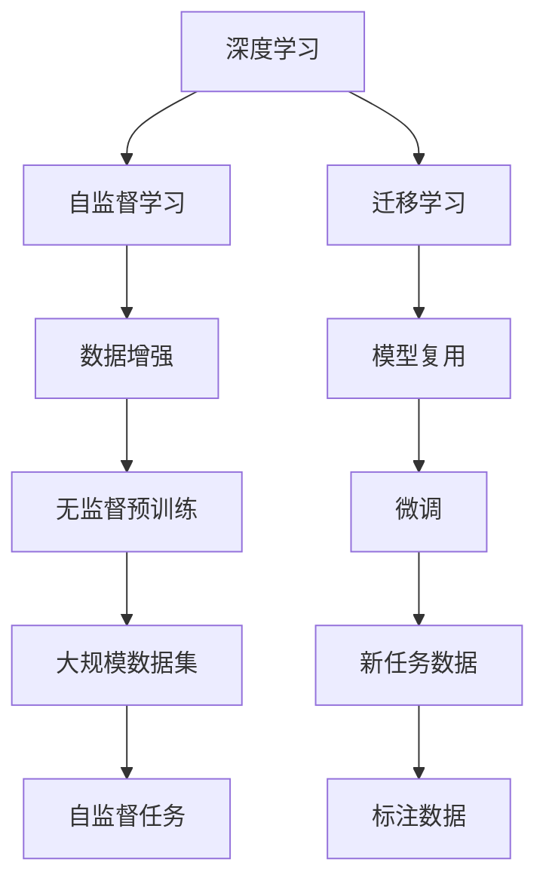
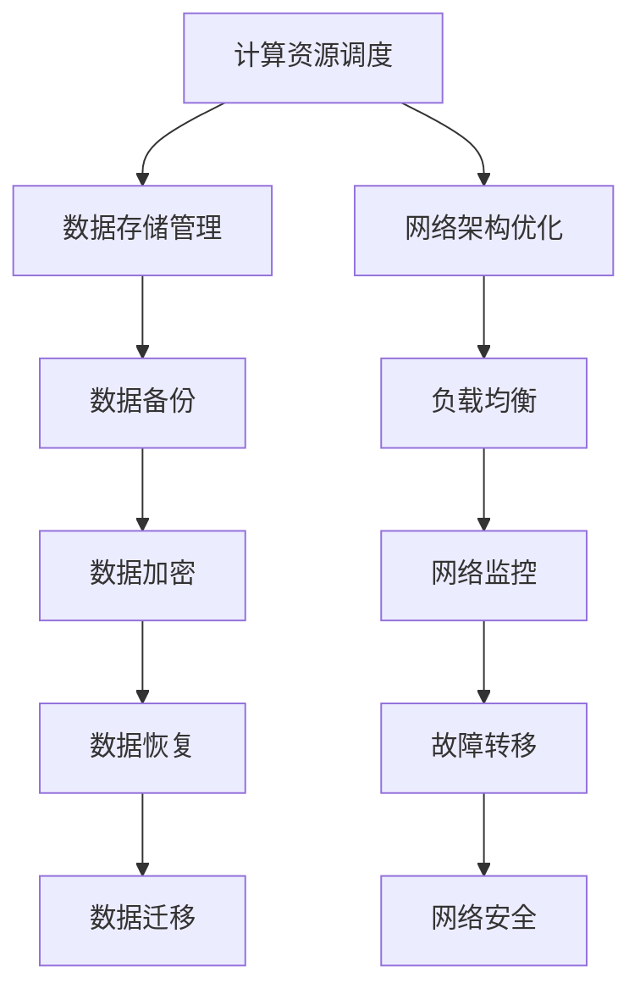

                 

# AI 大模型应用数据中心建设：数据中心投资与建设

> **关键词：** AI大模型、数据中心建设、投资评估、基础设施、运维管理、能效优化、边缘计算

> **摘要：** 本文将详细探讨AI大模型应用数据中心的建设，包括核心概念、核心技术、投资评估、基础设施建设、运维管理以及未来发展趋势。通过分析数据中心在AI大模型应用中的关键作用，本文旨在为读者提供一个全面、系统的建设指南。

## 第一部分：AI大模型应用概述

### 第1章：AI大模型应用概述

#### 1.1 AI大模型技术简介

##### 1.1.1 AI大模型的发展历程

AI大模型是指具有数亿至数千亿参数的深度学习模型，它们在训练过程中使用大量数据进行自监督学习和迁移学习。AI大模型的发展历程可以追溯到20世纪90年代，当时深度学习开始崭露头角。随着计算能力和数据资源的提升，特别是近年来GPU等专用硬件的普及，AI大模型在自然语言处理、计算机视觉、语音识别等领域取得了显著成果。

**核心概念与联系**

AI大模型的核心概念包括：

- **深度学习**：一种模拟人脑神经元连接的网络结构，用于处理复杂数据。
- **自监督学习**：无需标注数据的训练方法，通过数据自身的结构进行学习。
- **迁移学习**：将已有模型的知识迁移到新任务上，提高新任务的性能。

**Mermaid 流程图**



##### 1.1.2 AI大模型在数据中心建设中的应用

数据中心是存储、处理和分发大量数据的关键设施，对于AI大模型训练和应用至关重要。数据中心的建设目标包括：

- **高效性**：优化计算资源，提高数据处理的效率。
- **可靠性**：确保数据中心的稳定运行，减少故障率。
- **可扩展性**：支持未来业务增长，适应规模扩展。

**核心概念与联系**

数据中心在AI大模型应用中的核心联系包括：

- **计算资源调度**：根据任务需求，动态分配计算资源。
- **数据存储管理**：确保数据的安全、可靠和快速访问。
- **网络架构优化**：提高数据传输速度和可靠性。

**Mermaid 流程图**



### 第2章：AI大模型核心技术

#### 2.1 深度学习基础

##### 2.1.1 神经网络与深度学习

神经网络是由多个神经元组成的层次结构，用于模拟人脑的信息处理能力。深度学习是神经网络的一种形式，通过增加网络深度来提高模型的复杂度和性能。

**核心算法原理讲解**

```python
# 神经网络基本结构
class NeuralNetwork:
    def __init__(self):
        # 初始化权重和偏置
        self.weights = ...
        self.biases = ...

    def forward(self, x):
        # 前向传播
        return ...

    def backward(self, output, expected_output):
        # 反向传播
        return ...

    def update_weights(self, delta_weights, delta_biases):
        # 更新权重和偏置
        self.weights += delta_weights
        self.biases += delta_biases
```

**数学模型和公式**

$$
\text{激活函数}：\sigma(z) = \frac{1}{1 + e^{-z}}
$$

$$
\text{损失函数}：\text{MSE} = \frac{1}{2}\sum_{i=1}^{n}(y_i - \hat{y}_i)^2
$$

**举例说明**

假设有一个包含一个输入层、一个隐藏层和一个输出层的神经网络，输入数据为 $[0.5, 0.3]$，隐藏层节点数为3，输出层节点数为2。权重和偏置随机初始化。

- **前向传播**：计算隐藏层和输出层的激活值。
- **反向传播**：计算损失函数的梯度，更新权重和偏置。

##### 2.1.2 AI大模型算法原理

AI大模型算法主要基于深度学习，包括自动学习算法、模型优化算法和评估算法等。

**自动学习算法**

自动学习算法是指计算机系统通过学习大量数据来改进其性能的过程。主要分为以下几类：

- **监督学习**：有标注数据作为训练集，通过模型预测标签。
- **无监督学习**：没有标注数据，通过发现数据中的内在结构。
- **半监督学习**：既有标注数据，又有未标注数据，利用未标注数据辅助训练。

**数学模型和公式**

$$
\text{监督学习}：\min_{\theta} \sum_{i=1}^{m} (h_\theta(x^{(i)}) - y^{(i)})^2
$$

$$
\text{无监督学习}：\min_{\theta} \sum_{i=1}^{m} \| h_\theta(x^{(i)}) - \mu_i \|^2
$$

**举例说明**

假设有一个监督学习任务，包含输入 $x$ 和标签 $y$。使用梯度下降法优化模型参数 $\theta$。

- **损失函数**：MSE。
- **前向传播**：计算模型输出 $h_\theta(x)$。
- **反向传播**：计算损失函数的梯度。
- **参数更新**：使用梯度下降法更新参数。

## 第二部分：数据中心投资与建设

### 第3章：数据中心投资评估

#### 3.1 数据中心投资评估方法

数据中心投资评估方法主要包括成本效益分析、风险分析和财务分析等。

**成本效益分析**

成本效益分析是指对数据中心建设的成本和效益进行评估，计算投资回报率（ROI）等指标。

**数学模型和公式**

$$
ROI = \frac{\text{净收益}}{\text{总投资}} \times 100\%
$$

**举例说明**

假设数据中心建设总投资为1000万元，年净收益为200万元，使用寿命为10年。

- **ROI**：20%
- **净现值（NPV）**：通过折现未来现金流计算项目的现值。

**风险分析**

风险分析是指评估数据中心建设过程中可能遇到的风险，包括技术风险、市场风险、运营风险等。

**数学模型和公式**

$$
\text{风险系数} = \frac{\text{风险损失}}{\text{风险概率}}
$$

**举例说明**

假设数据中心建设过程中，技术风险的概率为30%，风险损失为500万元。

- **风险系数**：16.67

**财务分析**

财务分析是指通过财务指标评估数据中心的财务状况，包括资产负债表、现金流量表等。

**数学模型和公式**

$$
\text{资产回报率（ROA）} = \frac{\text{净利润}}{\text{总资产}} \times 100\%
$$

$$
\text{流动比率} = \frac{\text{流动资产}}{\text{流动负债}}
$$

**举例说明**

假设数据中心的净利润为100万元，总资产为5000万元，流动资产为2000万元，流动负债为1000万元。

- **ROA**：2%
- **流动比率**：2

### 第3章：数据中心建设规划

#### 3.2 数据中心选址规划

数据中心选址规划是数据中心建设的关键环节，涉及多个因素，包括地理位置、能源供应、网络连接等。

**选址因素**

- **地理位置**：数据中心应选择交通便利、地质稳定的地方。
- **能源供应**：数据中心应选择电力供应稳定、价格合理的地区。
- **网络连接**：数据中心应选择网络连接速度快、带宽充足的地区。

**选址标准**

- **可靠性**：确保数据中心的持续运行。
- **可扩展性**：支持未来的业务增长。
- **安全性**：确保数据中心的数据安全。

#### 3.3 数据中心基础设施建设

数据中心基础设施建设包括服务器与存储设备、网络设备、环境控制等。

**服务器与存储设备**

- **服务器配置**：CPU、GPU、内存等。
- **存储设备选择**：HDD、SSD、分布式存储系统等。

**网络设备**

- **网络架构**：数据中心内部网络、外部网络等。
- **网络设备配置**：路由器、交换机、防火墙等。

**环境控制**

- **温湿度控制**：保证数据中心的温度和湿度适宜。
- **电力供应**：UPS、发电机等。

### 第4章：数据中心运维与管理

#### 4.1 数据中心运维概述

数据中心运维包括设备管理、故障处理、性能优化等。

**运维目标**

- **高可用性**：确保数据中心服务持续可用。
- **高性能**：优化数据中心性能，满足业务需求。
- **安全性**：确保数据中心的安全和稳定。

#### 4.2 数据中心安全管理

数据中心安全管理包括物理安全、网络安全、数据安全等。

**安全管理策略**

- **物理安全**：防止未经授权的物理访问。
- **网络安全**：防范网络攻击和入侵。
- **数据安全**：确保数据的安全存储和传输。

#### 4.3 数据中心能效管理

数据中心能效管理包括能效优化、能耗监测等。

**能效优化**

- **节能技术**：降低数据中心能耗的技术和措施。
- **能效监测**：实时监测数据中心能耗情况，优化能源使用。

### 第5章：AI大模型应用案例

#### 5.1 AI大模型应用领域

AI大模型在自然语言处理、计算机视觉、语音识别等领域有广泛的应用。

**自然语言处理**

- **文本分类**：利用AI大模型进行文本分类。
- **机器翻译**：基于AI大模型的机器翻译技术。

**计算机视觉**

- **图像识别**：利用AI大模型进行图像识别。
- **目标检测**：基于AI大模型的目标检测技术。

**语音识别**

- **语音识别**：利用AI大模型进行语音识别。
- **语音合成**：基于AI大模型的语音合成技术。

#### 5.2 数据中心与AI大模型应用结合

数据中心与AI大模型应用结合可以大幅提升数据处理能力和性能。

**案例分析**

- **大规模训练**：利用数据中心进行大规模AI大模型训练。
- **实时推理**：数据中心在AI大模型实时推理中的作用。

### 附录

#### 附录A：参考资料与工具

- **AI大模型开发工具**：TensorFlow、PyTorch、JAX、MXNet等。
- **数据中心建设参考资料**：数据中心建设标准、数据中心技术发展动态。

## 作者

**作者：AI天才研究院/AI Genius Institute & 禅与计算机程序设计艺术 /Zen And The Art of Computer Programming**

---

文章标题：AI大模型应用数据中心建设：数据中心投资与建设

文章关键词：AI大模型、数据中心建设、投资评估、基础设施、运维管理、能效优化、边缘计算

文章摘要：本文详细探讨了AI大模型应用数据中心的建设，包括核心概念、核心技术、投资评估、基础设施建设、运维管理以及未来发展趋势。通过分析数据中心在AI大模型应用中的关键作用，本文为读者提供了一个全面、系统的建设指南。

