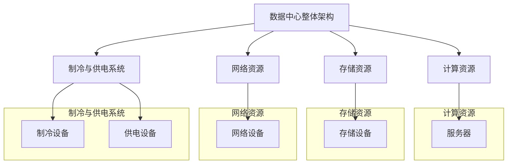
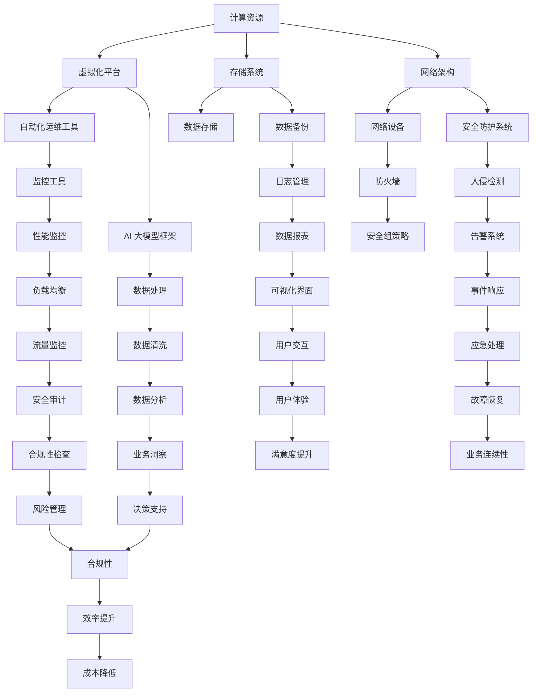

                 

### 《AI 大模型应用数据中心建设：数据中心运维与管理》

---

**关键词：**
- AI 大模型
- 数据中心建设
- 数据中心运维
- 数据中心管理
- 资源调度算法
- 能效管理
- 云计算

---

**摘要：**
本文旨在探讨AI大模型在数据中心建设、运维与管理中的应用。通过详细的案例分析，我们将深入探讨数据中心架构设计、基础设施、硬件设备运维、软件应用以及AI大模型在数据中心中的具体应用。本文不仅涵盖了数据中心建设的核心概念和算法原理，还提供了实际的开发环境搭建和代码案例，为读者提供了全面的技术指导。通过阅读本文，读者将能够了解如何利用AI大模型提升数据中心的能效管理，优化资源调度，提高数据中心的整体性能。

---

## 第一部分：数据中心概述

在快速发展的数字化时代，数据中心已成为各类企业和机构不可或缺的基础设施。本部分将为您提供一个全面的数据中心概述，包括数据中心的定义、分类、架构设计、地理位置与环境影响，以及数据中心在全球的发展现状和趋势。

### 第1章：数据中心概述

#### 1.1 数据中心的定义与重要性

数据中心（Data Center）是一个专门用于存储、处理和分发数据的设施。它通常由服务器、存储设备、网络设备和其他辅助设施组成，提供高可靠性和高性能的计算环境。

数据中心的重要性体现在以下几个方面：

1. **数据存储与处理**：数据中心是数据存储和处理的核心，支持各种业务应用和数据分析。
2. **业务连续性**：通过冗余设计和备份机制，数据中心确保业务的连续性，降低业务中断风险。
3. **安全防护**：数据中心提供多层次的安全防护措施，保护数据安全。
4. **能效管理**：数据中心通过优化设计和能效管理，降低能源消耗，实现可持续发展。

#### 1.2 数据中心的分类

数据中心根据用途、规模和性能特点可以分为以下几种类型：

1. **企业级数据中心**：为大型企业提供高性能、高可靠性的计算和存储服务。
2. **托管数据中心**：为第三方提供数据中心托管服务，用户可以根据需求租用计算和存储资源。
3. **云数据中心**：提供云计算服务，支持各种云应用和大数据处理。
4. **边缘数据中心**：位于网络边缘，为实时数据分析和处理提供快速响应。

#### 1.3 数据中心的架构设计

数据中心的架构设计是确保其高效、可靠运行的关键。一个典型的数据中心架构包括以下几个层次：

1. **基础设施层**：包括服务器、存储设备、网络设备、制冷和供电系统等硬件设施。
2. **网络层**：负责数据中心的网络架构设计，包括局域网、广域网和数据中心内部的通信。
3. **平台层**：提供虚拟化、云计算、存储和备份等平台服务。
4. **应用层**：部署各种业务应用和数据处理服务。

#### 1.4 数据中心的地理位置与环境影响

数据中心的地理位置对其性能和能效有重要影响。以下是一些关键因素：

1. **气候条件**：适宜的气候条件可以降低制冷成本，提高数据中心能效。
2. **地理位置**：地理位置的选择应考虑自然灾害风险、交通便捷性等因素。
3. **能源供应**：可靠的能源供应是数据中心稳定运行的基础。
4. **环境影响**：数据中心的建设和运行应尽量减少对环境的影响，实现可持续发展。

#### 1.5 数据中心的全球发展现状与趋势

随着云计算、大数据和人工智能等技术的快速发展，数据中心的全球需求持续增长。以下是一些关键趋势：

1. **云计算数据中心**：云计算服务提供商在全球范围内建设大量数据中心，以满足不断增长的用户需求。
2. **边缘计算**：边缘数据中心的发展，使数据处理更加接近数据源，提高响应速度和用户体验。
3. **绿色数据中心**：绿色数据中心通过采用节能技术和可再生能源，降低碳排放和能源消耗。
4. **智能化管理**：人工智能和大数据分析技术的应用，使数据中心管理更加智能化和高效。

---

**核心概念与联系：数据中心架构设计**

数据中心架构设计是数据中心建设的核心，它决定了数据中心的性能、可靠性和可扩展性。以下是一个简化的Mermaid流程图，用于描述数据中心的整体架构及其各个关键组成部分。

**核心概念与联系：**



在这个架构中，计算资源（服务器）、存储资源（存储设备）、网络资源（网络设备）和制冷与供电系统是数据中心的核心组成部分。它们相互协作，共同确保数据中心的正常运行。

**数据中心架构设计的核心目标：**
- 高性能：提供快速、高效的数据处理能力，满足业务需求。
- 高可靠性：确保系统的稳定运行，降低故障风险。
- 可扩展性：支持系统的灵活扩展，满足业务增长需求。
- 高安全性：保护数据安全，防止数据泄露和未经授权的访问。

---

### 第2章：数据中心基础设施建设

数据中心基础设施建设是确保数据中心稳定、高效运行的基础。本章将详细介绍数据中心基础设施的各个关键组成部分，包括建筑结构设计、电力系统设计、制冷系统设计、网络系统设计以及物理安全措施。

#### 2.1 数据中心建筑结构设计

数据中心建筑结构设计直接影响数据中心的性能和可靠性。以下是一些关键设计要点：

1. **建筑选址**：数据中心选址应考虑地理位置、气候条件、能源供应等因素，确保建筑的稳定性和可持续性。
2. **建筑抗震**：数据中心建筑应具备良好的抗震性能，以抵御地震等自然灾害的影响。
3. **建筑通风**：良好的通风系统可以保持数据中心内的空气流通，降低热量积聚，提高制冷效率。
4. **建筑耐火**：数据中心建筑应采用防火材料，设置防火墙和防火门，确保在火灾发生时能够有效隔离火源，保护设备和数据安全。
5. **建筑防水**：数据中心建筑应具备良好的防水性能，防止雨水、洪水等水源侵入。

#### 2.2 数据中心电力系统设计

电力系统设计是数据中心基础设施建设的核心，以下是一些关键设计要点：

1. **不间断电源（UPS）**：UPS系统提供稳定、可靠的电力供应，确保在电网故障时数据中心的持续运行。
2. **备用发电机**：备用发电机作为UPS系统的补充，确保在长时间电网中断时仍能提供电力供应。
3. **电力分配**：电力分配系统应确保电力供应的可靠性和冗余性，避免单点故障。
4. **电源冗余**：在关键设备和系统上实现电源冗余，确保在单个电源故障时不会影响整个数据中心的运行。
5. **电力监控系统**：实时监控电力系统的运行状态，及时发现和解决潜在问题。

#### 2.3 数据中心制冷系统设计

制冷系统设计是确保数据中心设备正常运行的关键，以下是一些关键设计要点：

1. **空调系统**：数据中心空调系统应具备良好的制冷能力和均匀的温度分布，避免设备过热。
2. **冷热通道隔离**：通过冷热通道隔离技术，减少热量散失，提高制冷效率。
3. **水冷系统**：水冷系统通过冷水循环带走设备产生的热量，适用于高密度数据中心。
4. **自然冷却**：利用自然冷却技术，降低数据中心能耗，提高能源效率。
5. **制冷冗余**：实现制冷系统的冗余设计，确保在单个制冷设备故障时仍能保持数据中心的正常运行。

#### 2.4 数据中心网络系统设计

数据中心网络系统设计是确保数据中心内部及外部通信的关键，以下是一些关键设计要点：

1. **网络架构**：采用高效的网络架构，支持数据的高速传输和低延迟。
2. **网络冗余**：实现网络设备的冗余配置，避免单点故障，提高网络的可靠性。
3. **网络分段**：通过网络分段，提高网络的安全性，防止恶意攻击和广播风暴。
4. **网络监控**：实时监控网络运行状态，及时发现和解决网络故障。
5. **网络负载均衡**：通过负载均衡技术，实现网络流量的合理分配，提高网络的性能和可靠性。

#### 2.5 数据中心物理安全措施

数据中心的物理安全措施是保障数据中心安全运行的基础，以下是一些关键安全措施：

1. **门禁系统**：设置严格的门禁系统，控制人员进出，防止未经授权的访问。
2. **视频监控系统**：安装高清摄像头，实时监控数据中心内部和周边环境，确保及时发现异常情况。
3. **安全报警系统**：配置入侵报警、火警报警等安全报警系统，确保在发生安全事件时能够及时响应。
4. **消防系统**：设置消防系统，包括灭火器、消防栓、自动喷水灭火系统等，确保在火灾发生时能够迅速灭火。
5. **防雷接地**：防止雷击对数据中心设备和系统的影响，确保设备的安全运行。

通过上述数据中心基础设施建设的设计和实施，可以为数据中心提供稳定、高效、安全的运行环境，确保数据中心的长期稳定运行。

---

**核心算法原理讲解：数据中心资源调度算法**

数据中心资源调度算法是数据中心运维中的关键组件，其目的是优化资源分配，提高数据中心的整体性能和效率。以下是一个简化的伪代码，用于描述基于负载均衡的简单资源调度算法。

```python
def resource_scheduling(workload, resources):
    for task in workload:
        optimal_resource = select_optimal_resource(resources)
        assign_task_to_resource(task, optimal_resource)
        update_resource_state(optimal_resource)
    return completed_workload

def select_optimal_resource(resources):
    optimal_resource = None
    for resource in resources:
        if resource.is_underloaded() and resource.has_sufficient_capacity(task):
            if optimal_resource is None or resource.load < optimal_resource.load:
                optimal_resource = resource
    return optimal_resource

def assign_task_to_resource(task, resource):
    resource.assign_task(task)

def update_resource_state(resource):
    resource.update_state()
```

**伪代码解析：**

1. **resource_scheduling**：主调度函数，遍历 workload 中的每个任务，调用 select_optimal_resource 选择最优资源，然后分配任务并更新资源状态。
2. **select_optimal_resource**：选择当前负载最低、容量足够且最近空闲的资源。它遍历所有资源，根据负载和容量条件选择最优资源。
3. **assign_task_to_resource**：将任务分配给选定的资源。
4. **update_resource_state**：更新资源的状态，例如负载变化。

**算法原理讲解：**

该资源调度算法的核心目标是实现负载均衡，通过以下步骤实现：

1. **负载均衡**：通过选择当前负载最低的资源，确保数据中心的资源利用率最大化，避免单点过载。
2. **容量检查**：在分配任务之前，检查资源是否具有足够的容量来处理该任务，确保资源不被过度使用。
3. **状态更新**：在任务分配后，更新资源的状态，包括负载变化，以便后续任务调度。

**数学模型和数学公式**

数据中心能源效率（PUE）是一个关键的性能指标，用于衡量数据中心能源消耗的有效性。

$$ PUE = \frac{Total\ Energy\ Consumption}{IT\ Energy\ Consumption} $$

其中，\( Total\ Energy\ Consumption \) 是数据中心的总能源消耗，而 \( IT\ Energy\ Consumption \) 是仅用于计算资源的能源消耗。

**项目实战：数据中心能效管理**

**1. 实战目标**

构建一个简单的数据中心能效管理系统，该系统能够实时监控和调整数据中心的能耗，提高能源效率。

**2. 开发环境搭建**

- 操作系统：Ubuntu 20.04
- 开发语言：Python 3.8
- 数据库：MySQL 8.0
- 前端框架：Flask

**3. 源代码详细实现**

```python
# 数据中心能效管理系统

from flask import Flask, jsonify
import pymysql
import json

app = Flask(__name__)

# 连接数据库
def connect_db():
    db = pymysql.connect("localhost", "username", "password", "datacenter")
    return db

# 添加能耗记录
@app.route('/add_energy', methods=['POST'])
def add_energy():
    db = connect_db()
    cursor = db.cursor()
    energy_data = request.get_json()
    sql = "INSERT INTO energy_consumption (resource_type, energy_value, timestamp) VALUES (%s, %s, %s)"
    try:
        cursor.execute(sql, (energy_data['resource_type'], energy_data['energy_value'], energy_data['timestamp']))
        db.commit()
    except Exception as e:
        db.rollback()
        print("Error:", e)
    finally:
        cursor.close()
        db.close()
    return jsonify({"status": "success"})

# 获取能效指标
@app.route('/get_pue', methods=['GET'])
def get_pue():
    db = connect_db()
    cursor = db.cursor()
    sql = "SELECT SUM(energy_value) as total_energy, (SELECT SUM(energy_value) FROM energy_consumption WHERE resource_type='IT') as it_energy FROM energy_consumption"
    cursor.execute(sql)
    result = cursor.fetchone()
    pue = result['total_energy'] / result['it_energy']
    return jsonify({"pue": round(pue, 2)})

if __name__ == '__main__':
    app.run(debug=True)
```

**4. 代码解读与分析**

- **数据库连接**：使用 pymysql 模块连接到 MySQL 数据库，存储能耗记录。
- **添加能耗记录**：接收 POST 请求，将能耗数据存储到数据库中。
- **获取能效指标**：计算并返回数据中心的 PUE 指标。

**5. 代码分析与优化**

- **数据库连接**：使用连接池提高数据库连接性能。
- **异常处理**：增加更详细的异常处理和日志记录，便于故障排查。
- **API 安全性**：添加 API 安全认证，防止未授权访问。

**6. 未来展望**

未来，数据中心能效管理系统可以进一步整合 AI 大模型技术，通过预测能耗模式和优化资源分配，进一步提高能源效率。此外，还可以扩展系统的功能，包括能耗可视化、智能告警和远程控制等。

---

## 第3章：数据中心网络与设备

数据中心网络与设备的构建是确保数据中心高效、可靠运行的关键。本章将详细探讨数据中心网络架构、网络设备选型与配置、路由协议与交换技术、IP地址规划以及数据中心网络安全。

### 3.1 数据中心网络架构

数据中心网络架构是数据中心整体架构中的重要组成部分，其设计直接影响数据中心的性能和可靠性。一个典型的数据中心网络架构包括以下层次：

1. **边缘网络**：连接外部网络和内部网络，提供访问控制和安全防护。
2. **核心网络**：负责数据中心的内部通信，提供高速、可靠的数据传输通道。
3. **接入网络**：连接服务器和存储设备，提供访问和通信服务。

**数据中心网络架构设计要点：**

- **高可用性**：通过冗余设计和负载均衡技术，确保网络的稳定性和可靠性。
- **高性能**：采用高速网络设备和技术，支持大数据量的快速传输。
- **高扩展性**：支持业务的快速扩展，易于增加和调整网络设备。
- **安全性**：设置多层次的安全防护措施，保护数据安全和网络设备安全。

### 3.2 网络设备选型与配置

网络设备选型与配置是数据中心网络建设的关键步骤。以下是一些常见的网络设备及其选型原则：

1. **交换机**：选择支持高性能、高密度端口、高可靠性及易扩展的交换机。例如，选择支持 10G/40G 端口的以太网交换机。
2. **路由器**：选择支持多协议、高可靠性、高带宽及易于管理的路由器。例如，选择支持 BGP 和 OSPF 的路由器。
3. **防火墙**：选择具备高性能、高安全性和易管理性的防火墙。例如，选择支持 NAT、VPN 和入侵检测功能的防火墙。
4. **无线接入点**：选择支持高密度接入、高可靠性及易管理的无线接入点。

**网络设备配置原则：**

- **冗余配置**：确保关键网络设备具备冗余配置，避免单点故障。
- **配置备份**：定期备份网络设备配置，以便在故障时快速恢复。
- **安全配置**：设置严格的安全策略，防止未经授权的访问和网络攻击。

### 3.3 路由协议与交换技术

路由协议与交换技术是数据中心网络通信的核心。以下是一些常用的路由协议和交换技术：

1. **静态路由**：通过手动配置路由信息，适用于网络结构简单的情况。
2. **动态路由**：路由协议自动学习网络拓扑，动态调整路由表。常用的动态路由协议包括 OSPF、EIGRP 和 BGP。
3. **VLAN**：虚拟局域网技术，通过将网络划分为多个虚拟网络，提高网络的安全性和灵活性。
4. **MPLS**：多协议标签交换技术，通过在数据包上添加标签，实现快速、高效的路径选择和流量控制。
5. **SDN**：软件定义网络技术，通过集中控制平面和转发平面，实现网络资源的动态分配和优化。

### 3.4 数据中心IP地址规划

数据中心IP地址规划是确保网络通信正常进行的重要步骤。以下是一些IP地址规划原则：

1. **地址分配**：根据服务器数量和业务需求，合理分配IP地址范围，避免地址浪费。
2. **子网划分**：根据网络结构，合理划分子网，确保网络的可扩展性和管理性。
3. **IP地址分配策略**：采用静态和动态分配策略，结合业务需求，实现地址的有效利用。
4. **私有IP地址**：使用私有IP地址，提高网络安全性，避免与公网IP地址冲突。
5. **IP地址管理**：建立完善的IP地址管理机制，确保IP地址的合理分配和有效利用。

### 3.5 数据中心网络安全

数据中心网络安全是确保数据中心正常运行和业务数据安全的关键。以下是一些数据中心网络安全措施：

1. **防火墙**：配置防火墙，过滤非法访问和攻击，保护网络设备安全。
2. **入侵检测系统（IDS）**：部署入侵检测系统，实时监控网络流量，识别和阻止恶意攻击。
3. **虚拟专用网络（VPN）**：通过VPN技术，实现安全远程访问和数据传输。
4. **数据加密**：对敏感数据进行加密，防止数据泄露。
5. **访问控制**：设置严格的访问控制策略，限制未经授权的访问。

通过以上措施，可以有效保障数据中心网络的稳定性和安全性，确保业务的持续运行。

---

## 第4章：数据中心硬件设备运维

数据中心硬件设备运维是确保数据中心正常运行的关键环节。本章将详细介绍数据中心硬件设备运维的内容，包括服务器运维与管理、存储设备运维与管理、网络设备运维与管理、硬件故障排除与维护，以及硬件升级与替换策略。

### 4.1 服务器运维与管理

服务器是数据中心的计算核心，其稳定运行对数据中心的整体性能至关重要。以下是一些服务器运维与管理的要点：

1. **服务器硬件检查**：定期对服务器硬件进行物理检查，确保无损坏和松动现象。检查内容包括风扇、电源、硬盘等关键部件的工作状态。
2. **服务器软件更新**：定期更新服务器操作系统和应用程序，修复已知漏洞和缺陷，提高系统的安全性和稳定性。
3. **负载均衡**：通过负载均衡技术，合理分配服务器资源，避免单点过载，提高服务器的利用率和性能。
4. **性能监控**：使用性能监控工具，实时监控服务器的CPU、内存、硬盘等资源的使用情况，及时发现问题并进行调整。
5. **备份与恢复**：定期备份服务器数据，确保在数据丢失或系统故障时能够快速恢复。

### 4.2 存储设备运维与管理

存储设备是数据中心的数据存储核心，其可靠性和性能直接影响数据中心的业务运行。以下是一些存储设备运维与管理的要点：

1. **存储设备检查**：定期对存储设备进行物理检查，确保硬盘等关键部件的正常工作。检查内容包括硬盘的转速、温度等指标。
2. **存储软件更新**：定期更新存储软件，修复已知漏洞和缺陷，提高存储系统的安全性和稳定性。
3. **存储资源分配**：根据业务需求，合理分配存储资源，确保存储空间的合理利用。对于重要数据，应设置高优先级存储策略，保障数据的安全。
4. **数据备份**：定期备份存储设备上的数据，采用多种备份策略，确保数据的安全性和可恢复性。
5. **性能监控**：使用性能监控工具，实时监控存储设备的性能指标，如I/O吞吐量、响应时间等，及时发现和处理性能瓶颈。

### 4.3 网络设备运维与管理

网络设备是数据中心通信的核心，其稳定运行对数据中心的整体性能至关重要。以下是一些网络设备运维与管理的要点：

1. **网络设备检查**：定期对网络设备进行物理检查，确保设备无损坏和松动现象。检查内容包括交换机、路由器、防火墙等网络设备的工作状态。
2. **网络设备软件更新**：定期更新网络设备软件，修复已知漏洞和缺陷，提高网络设备的性能和安全性。
3. **网络拓扑调整**：根据业务需求和网络流量变化，合理调整网络拓扑结构，优化网络性能。
4. **性能监控**：使用性能监控工具，实时监控网络设备的性能指标，如带宽利用率、丢包率等，及时发现和处理网络故障。
5. **安全防护**：配置网络安全策略，防止网络攻击和数据泄露，确保网络设备的安全运行。

### 4.4 硬件故障排除与维护

硬件故障排除与维护是数据中心运维中的重要环节。以下是一些硬件故障排除与维护的方法：

1. **故障定位**：通过性能监控数据和日志分析，快速定位硬件故障点。
2. **故障处理**：根据故障情况，采取相应的处理措施，如更换损坏的硬件部件、重新启动设备等。
3. **故障预防**：定期对硬件设备进行检查和维护，预防故障的发生。对于关键设备，应采用冗余设计，确保在单点故障时能够快速切换。
4. **维护记录**：建立完善的维护记录，记录每次维护的内容和结果，便于故障排查和性能分析。

### 4.5 硬件升级与替换策略

硬件升级与替换策略是数据中心运维中的关键环节。以下是一些硬件升级与替换策略的要点：

1. **技术评估**：根据业务需求和硬件设备的使用情况，评估硬件升级或替换的必要性。
2. **预算规划**：制定合理的预算计划，确保硬件升级或替换的资金需求。
3. **风险评估**：评估硬件升级或替换对业务运行的影响，确保在升级或替换过程中不影响业务的正常运行。
4. **实施步骤**：制定详细的实施步骤和应急预案，确保硬件升级或替换过程的顺利进行。
5. **后期评估**：升级或替换完成后，对硬件设备的性能和稳定性进行评估，确保达到预期效果。

通过以上硬件设备运维与管理的方法和策略，可以确保数据中心硬件设备的稳定运行，提高数据中心的整体性能和可靠性。

---

## 第5章：数据中心操作系统管理

数据中心操作系统管理是确保数据中心高效、稳定运行的重要环节。本章将详细介绍数据中心操作系统的选择、安装与配置、系统监控与性能优化、系统安全策略与防护，以及系统备份与恢复策略。

### 5.1 常见操作系统介绍

在数据中心中，常见的操作系统包括以下几种：

1. **Linux操作系统**：Linux操作系统以其开源、稳定和安全性高而成为数据中心的常用操作系统。常见的Linux发行版包括Red Hat Enterprise Linux（RHEL）、Ubuntu Server、CentOS等。

2. **Windows Server**：Windows Server操作系统以其良好的用户界面和广泛的软件支持，在数据中心中也有一定的应用。常见的版本包括Windows Server 2019和Windows Server 2022。

3. **Unix操作系统**：Unix操作系统以其稳定性和高性能在数据中心中也有一定的市场。常见的Unix操作系统包括Solaris、HP-UX和AIX等。

### 5.2 操作系统安装与配置

操作系统的安装与配置是数据中心建设的第一步。以下是一个简化的安装和配置过程：

1. **操作系统选择**：根据数据中心的需求，选择适合的操作系统。例如，对于高性能和稳定性要求较高的数据中心，可以选择Red Hat Enterprise Linux。

2. **硬件准备**：准备足够的硬件资源，如服务器、存储设备等。

3. **安装操作系统**：使用光盘或USB启动盘启动服务器，进入安装程序。根据提示进行操作系统安装，配置网络、时区等基本设置。

4. **配置网络**：配置服务器的IP地址、网关、DNS等网络参数，确保服务器能够与其他设备通信。

5. **安装必要软件**：安装数据中心所需的软件，如Web服务器、数据库服务器等。

6. **配置用户和权限**：创建管理员用户和普通用户，设置合适的权限，确保系统的安全性。

### 5.3 系统监控与性能优化

系统监控与性能优化是确保数据中心操作系统稳定运行的关键。以下是一些常用的监控与优化方法：

1. **性能监控**：使用性能监控工具，如Nagios、Zabbix等，实时监控服务器的CPU、内存、磁盘、网络等资源的使用情况。

2. **资源调优**：根据监控数据，调整系统参数，优化资源分配，提高系统性能。例如，调整内核参数、调整磁盘IO策略等。

3. **负载均衡**：通过负载均衡技术，合理分配服务器资源，避免单点过载，提高系统的可靠性。

4. **缓存机制**：使用缓存机制，如Memcached、Redis等，提高数据访问速度，降低系统负载。

5. **性能测试**：定期进行性能测试，评估系统的性能瓶颈，优化系统配置。

### 5.4 系统安全策略与防护

系统安全策略与防护是数据中心操作系统管理的核心内容。以下是一些常用的安全策略与防护措施：

1. **用户认证**：启用强密码策略，要求用户使用复杂的密码，并定期更换密码。

2. **访问控制**：配置文件权限，确保只有授权用户能够访问关键文件。

3. **防火墙**：配置防火墙规则，限制非法访问和攻击。

4. **入侵检测**：部署入侵检测系统（IDS），实时监控网络流量，识别和阻止恶意攻击。

5. **数据加密**：对敏感数据进行加密，防止数据泄露。

6. **日志管理**：启用日志记录功能，记录系统事件和用户操作，便于故障排查和安全审计。

### 5.5 系统备份与恢复策略

系统备份与恢复策略是确保数据中心数据安全的关键。以下是一些常用的备份与恢复策略：

1. **全备份**：定期进行全备份，将整个系统或数据备份到外部存储设备。

2. **增量备份**：只备份自上次备份以来发生变化的文件，减少备份时间和存储空间。

3. **日志备份**：备份系统日志文件，便于故障排查和安全审计。

4. **备份存储**：将备份存储到安全可靠的位置，如远程存储、云存储等。

5. **恢复测试**：定期进行备份恢复测试，确保备份数据的完整性和可恢复性。

6. **备份管理**：建立备份管理流程，确保备份计划的执行和备份策略的持续优化。

通过以上数据中心操作系统管理的方法和策略，可以确保数据中心的操作系统稳定、安全、高效地运行，为数据中心的业务提供有力支持。

---

## 第6章：数据中心虚拟化技术

数据中心虚拟化技术是提高数据中心资源利用率和灵活性的重要手段。本章将详细探讨数据中心虚拟化技术的基础概念、虚拟化平台选型与部署、虚拟机管理、资源调度与负载均衡，以及虚拟化安全与管理。

### 6.1 虚拟化基础概念

虚拟化技术通过创建虚拟的硬件资源，如CPU、内存、存储和网络，实现物理资源与逻辑资源的分离。以下是一些关键概念：

1. **虚拟化硬件**：通过虚拟化硬件，将物理服务器的计算资源抽象化，使其能够灵活分配给不同的虚拟机。
2. **虚拟机（VM）**：虚拟机是运行在虚拟化硬件上的独立操作系统实例。每个虚拟机拥有独立的操作系统、应用程序和资源。
3. **虚拟化管理程序**：虚拟化管理程序（Hypervisor）是负责管理虚拟机和虚拟化硬件的软件。常见的虚拟化管理程序包括VMware ESXi、Microsoft Hyper-V和KVM等。
4. **容器**：容器是一种轻量级的虚拟化技术，通过共享主机操作系统的内核，实现应用部署和运行。与虚拟机相比，容器具有更高的性能和更快的启动速度。

### 6.2 虚拟化平台选型与部署

选择合适的虚拟化平台是数据中心虚拟化成功的关键。以下是一些常见的虚拟化平台及其特点：

1. **VMware ESXi**：VMware ESXi 是业界领先的虚拟化平台，以其高性能、稳定性和广泛的功能而闻名。适用于大型企业级数据中心。
2. **Microsoft Hyper-V**：Hyper-V 是 Windows Server 内置的虚拟化平台，易于集成和管理。适用于 Windows 环境的企业用户。
3. **KVM**：KVM 是 Linux 内核的一部分，提供高效的虚拟化性能和低成本的解决方案。适用于 Linux 环境的企业用户。
4. **OpenVZ**：OpenVZ 是一种容器虚拟化技术，提供高效、灵活的资源分配和管理。适用于中小企业和开发者。

虚拟化平台的部署过程通常包括以下步骤：

1. **硬件准备**：准备虚拟化硬件，如服务器、存储和网络设备。
2. **虚拟化管理程序安装**：在服务器上安装虚拟化管理程序，配置网络和存储。
3. **虚拟机创建**：创建虚拟机，配置操作系统、硬件资源和网络。
4. **虚拟机监控**：使用虚拟化平台的管理工具，实时监控虚拟机的性能和状态。

### 6.3 虚拟机管理

虚拟机管理是数据中心虚拟化的重要组成部分。以下是一些虚拟机管理的要点：

1. **虚拟机创建与配置**：创建虚拟机，配置操作系统、硬件资源和网络。使用模板可以简化虚拟机的创建过程。
2. **虚拟机监控与性能优化**：使用虚拟化平台的管理工具，实时监控虚拟机的性能指标，如CPU使用率、内存使用率、磁盘I/O等。根据监控数据，优化虚拟机配置。
3. **虚拟机迁移**：通过虚拟机迁移技术，可以在不同物理服务器之间迁移虚拟机，实现负载均衡和故障恢复。
4. **虚拟机备份与恢复**：定期备份虚拟机，确保在数据丢失或系统故障时能够快速恢复。使用快照技术可以快速创建虚拟机的临时副本。
5. **虚拟机安全**：配置虚拟机的安全策略，如防火墙、安全组等，防止恶意攻击和未经授权的访问。

### 6.4 资源调度与负载均衡

资源调度与负载均衡是数据中心虚拟化的重要功能，以下是一些关键概念和策略：

1. **资源调度**：资源调度器负责分配和调整虚拟机的资源，如CPU、内存、存储和网络。资源调度策略包括时间片调度、优先级调度等。
2. **负载均衡**：负载均衡器负责平衡虚拟机之间的资源分配，避免单点过载和资源浪费。负载均衡策略包括轮询、最少连接、源地址哈希等。
3. **动态资源调整**：根据实际负载情况，动态调整虚拟机的资源分配。例如，在负载高峰期增加虚拟机的CPU和内存资源。
4. **资源预留**：为关键业务预留足够的资源，确保在高负载情况下，系统仍能正常运行。

### 6.5 虚拟化安全与管理

虚拟化安全是确保数据中心虚拟化环境安全运行的关键。以下是一些虚拟化安全和管理策略：

1. **虚拟化防火墙**：配置虚拟化防火墙，防止虚拟机之间的非法访问和攻击。
2. **虚拟机安全组**：配置虚拟机安全组，限制虚拟机之间的通信，提高网络安全性。
3. **虚拟化日志管理**：启用虚拟化日志功能，记录虚拟机的操作和事件，便于故障排查和安全审计。
4. **虚拟机备份与恢复**：定期备份虚拟机，确保在数据丢失或系统故障时能够快速恢复。
5. **虚拟化平台更新与补丁管理**：定期更新虚拟化平台，修复已知漏洞和缺陷，提高系统的安全性和稳定性。

通过以上数据中心虚拟化技术的方法和策略，可以有效地提高数据中心的资源利用率和灵活性，确保虚拟化环境的稳定和安全运行。

---

## 第7章：数据中心云服务与应用

数据中心云服务是现代数据中心建设的重要方向，它通过云计算技术提供灵活、高效、可扩展的计算、存储和数据处理服务。本章将详细探讨云计算基础概念、云服务模型、云平台搭建与配置、云服务监控与优化，以及云服务安全性与管理。

### 7.1 云计算基础概念

云计算是一种通过互联网提供计算资源的服务模式，用户可以根据需求按需获取和使用计算资源。以下是一些云计算的基础概念：

1. **基础设施即服务（IaaS）**：IaaS提供计算资源，如虚拟机、存储和网络，用户可以根据需求自定义和管理这些资源。
2. **平台即服务（PaaS）**：PaaS提供开发平台和工具，用户可以在这些平台上开发、运行和管理应用程序。
3. **软件即服务（SaaS）**：SaaS提供应用程序服务，用户可以直接使用这些应用程序，无需关心基础设施和管理。
4. **云计算模型**：云计算模型包括公有云、私有云和混合云。公有云由第三方提供商运营，私有云为特定组织内部使用，混合云结合了公有云和私有云的特点。
5. **虚拟化**：虚拟化是云计算的核心技术，通过虚拟化技术，将物理资源抽象成逻辑资源，提高资源利用率和灵活性。
6. **容器化**：容器化技术，如Docker和Kubernetes，通过轻量级、可移植的容器，实现应用程序的快速部署和管理。

### 7.2 云服务模型

云服务模型是云计算的核心组成部分，根据服务内容和形式，可以分为以下几种：

1. **IaaS**：IaaS提供基础计算资源，如虚拟机、存储和网络。用户可以根据需求自定义和管理这些资源，具有高度灵活性和可扩展性。
2. **PaaS**：PaaS提供开发平台和工具，用户可以在这些平台上开发、部署和管理应用程序。PaaS减少了开发和管理应用程序的复杂性，提高了开发效率。
3. **SaaS**：SaaS提供应用程序服务，用户可以直接使用这些应用程序，无需关心基础设施和管理。SaaS适用于各种业务场景，如电子邮件、办公软件、客户关系管理等。
4. **FaaS**：函数即服务（FaaS）提供函数级别的计算服务，用户可以编写和部署函数，按需执行。FaaS适用于事件驱动和微服务架构，提高了系统的灵活性和响应速度。

### 7.3 云平台搭建与配置

云平台搭建与配置是数据中心云服务实施的关键步骤。以下是一个简化的云平台搭建与配置过程：

1. **需求分析**：根据业务需求和资源需求，确定云平台的规模、架构和配置。
2. **硬件准备**：准备足够的硬件资源，如服务器、存储和网络设备。
3. **虚拟化平台搭建**：安装和配置虚拟化管理程序，如KVM、VMware ESXi等，创建和管理虚拟机。
4. **存储系统配置**：配置存储系统，如NFS或iSCSI，提供虚拟机存储。
5. **网络配置**：配置网络设备，如交换机和路由器，确保虚拟机之间的通信。
6. **云平台软件安装**：安装和配置云平台软件，如OpenStack、AWS Cloud、Azure等，实现IaaS、PaaS、SaaS等功能。
7. **用户与权限管理**：创建用户和权限，确保云平台的安全性和可管理性。
8. **监控与日志管理**：配置监控和日志管理系统，实时监控云平台的性能和状态，便于故障排查和优化。

### 7.4 云服务监控与优化

云服务监控与优化是确保云平台稳定运行和高效服务的关键。以下是一些常用的监控与优化方法：

1. **性能监控**：使用性能监控工具，如Prometheus、Grafana等，实时监控虚拟机、存储和网络等关键组件的性能指标，如CPU使用率、内存使用率、磁盘I/O、网络吞吐量等。
2. **容量规划**：根据监控数据和业务需求，合理规划资源容量，避免资源浪费和性能瓶颈。
3. **负载均衡**：通过负载均衡技术，如HAProxy、Nginx等，实现流量分发和负载均衡，提高系统的性能和可用性。
4. **资源调优**：根据监控数据和业务需求，动态调整虚拟机资源，如CPU、内存、磁盘等，优化系统性能。
5. **自动化管理**：使用自动化工具，如Ansible、Terraform等，简化云平台的部署和管理，提高运维效率。

### 7.5 云服务安全性与管理

云服务安全性与管理是确保云平台和数据安全的关键。以下是一些安全性与管理策略：

1. **访问控制**：配置访问控制策略，如身份认证、权限管理、角色分配等，确保只有授权用户可以访问云平台和资源。
2. **网络安全**：配置网络安全策略，如防火墙、入侵检测、DDoS防护等，保护云平台免受网络攻击和恶意行为。
3. **数据加密**：对敏感数据和使用SSL/TLS等加密技术，确保数据在传输和存储过程中的安全性。
4. **备份与恢复**：定期备份云平台数据和配置，确保在数据丢失或系统故障时能够快速恢复。
5. **安全审计**：启用安全审计功能，记录云平台操作和事件，便于安全监控和故障排查。

通过以上数据中心云服务与应用的方法和策略，可以有效地提高数据中心的资源利用率和灵活性，确保云平台的稳定运行和数据安全。

---

## 第8章：AI 大模型概述

AI 大模型，又称深度学习大模型，是近年来人工智能领域的重大突破。本章将详细探讨 AI 大模型的定义与特点、主流 AI 大模型简介、AI 大模型应用领域、发展现状与趋势，以及 AI 大模型应用挑战与解决方案。

### 8.1 AI 大模型定义与特点

AI 大模型是指那些具有极高参数量（通常超过数十亿个参数）和强大计算能力的神经网络模型。这些模型通过大量数据训练，可以自动学习复杂的特征表示和模式识别能力。以下是一些关键特点：

1. **高参数量**：AI 大模型通常拥有数十亿甚至千亿级别的参数，这使得它们能够捕捉数据中的细微特征和复杂模式。
2. **强大计算能力**：AI 大模型依赖于高性能计算资源，如 GPU 和 TPU，以支持大规模的训练和推理。
3. **数据驱动**：AI 大模型通过大量数据训练，能够自动学习和优化模型参数，从而实现高性能和泛化能力。
4. **自动特征提取**：AI 大模型通过多层神经网络结构，自动学习数据的特征表示，降低了人工特征工程的需求。
5. **多任务处理**：AI 大模型能够同时处理多种任务，例如图像识别、文本分类、自然语言处理等。

### 8.2 主流 AI 大模型简介

当前，已有多个主流 AI 大模型被广泛应用于各个领域。以下是一些知名的大模型：

1. **GPT-3**：由 OpenAI 开发的 GPT-3 是一个具有 1750 亿参数的预训练语言模型，能够在自然语言处理任务中表现出色，包括文本生成、问答系统等。
2. **BERT**：BERT（Bidirectional Encoder Representations from Transformers）是一个由 Google 开发的大规模预训练语言模型，广泛应用于文本分类、问答系统、命名实体识别等任务。
3. **BERT**：BERT（Bidirectional Encoder Representations from Transformers）是一个由 Google 开发的大规模预训练语言模型，广泛应用于文本分类、问答系统、命名实体识别等任务。
4. **Transformer**：Transformer 模型是自然语言处理领域的重要创新，其基于自注意力机制，被广泛应用于机器翻译、文本生成等任务。
5. **ViT**：ViT（Vision Transformer）是图像处理领域的一个突破性模型，将 Transformer 模型应用于图像分类任务，展示了强大的特征提取能力。
6. **DeeplabV3+**：DeeplabV3+ 是一个用于语义分割的模型，通过深度卷积神经网络和注意力机制，实现了高精度的图像分割。

### 8.3 AI 大模型应用领域

AI 大模型在各个领域展现出了巨大的应用潜力，以下是一些关键应用领域：

1. **自然语言处理**：AI 大模型在文本生成、问答系统、机器翻译、情感分析等自然语言处理任务中取得了显著成果。
2. **计算机视觉**：AI 大模型在图像分类、目标检测、图像分割、视频分析等计算机视觉任务中表现出色。
3. **语音识别**：AI 大模型通过深度神经网络和循环神经网络，实现了高精度的语音识别和语音合成。
4. **推荐系统**：AI 大模型在推荐系统中用于用户画像建模、协同过滤和序列模型，提高了推荐系统的准确性和用户体验。
5. **医疗健康**：AI 大模型在医疗图像分析、疾病预测、基因组分析等医疗健康领域发挥着重要作用。

### 8.4 AI 大模型发展现状与趋势

随着深度学习和大数据技术的不断发展，AI 大模型的研究和应用取得了显著进展。以下是一些关键趋势：

1. **模型参数量的增长**：随着计算资源和数据量的增加，AI 大模型的参数量不断增长，推动了模型性能的持续提升。
2. **模型架构的创新**：研究人员不断探索新的神经网络架构，如 Transformer、BERT、GPT 等，以实现更高的模型效率和效果。
3. **跨领域的融合应用**：AI 大模型在多个领域的融合应用，如多模态学习、跨领域迁移学习等，推动了多领域协同发展。
4. **计算资源的优化**：GPU、TPU 和量子计算等高性能计算资源的不断发展，为 AI 大模型提供了强大的计算支持。
5. **数据隐私和安全**：随着 AI 大模型应用范围的扩大，数据隐私和安全问题日益凸显，促使研究人员探索安全、隐私友好的模型训练和推理方法。

### 8.5 AI 大模型应用挑战与解决方案

尽管 AI 大模型在各个领域展现出了巨大潜力，但其应用过程中仍面临一些挑战。以下是一些关键挑战和解决方案：

1. **计算资源需求**：AI 大模型需要大量的计算资源进行训练和推理，解决方案包括分布式计算、云计算和 GPU/TPU 加速。
2. **数据隐私和安全**：大模型训练需要大量数据，数据隐私和安全成为关键挑战。解决方案包括数据加密、差分隐私和联邦学习。
3. **模型解释性和可解释性**：大模型通常缺乏解释性，使得模型决策过程难以理解。解决方案包括模型可解释性工具和模型简化技术。
4. **模型泛化和鲁棒性**：大模型在特定数据集上表现良好，但可能缺乏泛化和鲁棒性。解决方案包括迁移学习、数据增强和模型正则化。
5. **伦理和社会影响**：AI 大模型的应用可能带来伦理和社会影响，如歧视、偏见和失业等问题。解决方案包括制定伦理准则、透明性和公众参与。

通过不断研究和创新，AI 大模型的应用将不断拓展，为人类带来更多便利和进步。

---

## 第9章：AI 大模型在数据中心的应用

AI 大模型在数据中心的应用正成为提升数据中心运维效率、能效管理和整体性能的关键技术。本章将详细探讨 AI 大模型在数据中心运维、能效管理、网络安全、数据质量管理以及资源调度等方面的具体应用。

### 9.1 AI 大模型在数据中心运维中的应用

AI 大模型在数据中心运维中的应用主要体现在自动化和智能化两个方面。通过预训练的深度学习模型，数据中心可以自动化处理大量运维任务，提高运维效率。

1. **故障预测与预警**：AI 大模型可以通过分析历史运维数据，预测设备故障风险，提前预警，减少突发故障对业务的影响。例如，使用循环神经网络（RNN）和长短期记忆网络（LSTM）对设备运行数据进行时间序列分析。
2. **自动化运维**：AI 大模型可以帮助实现自动化部署、监控和优化数据中心资源，例如使用生成对抗网络（GAN）生成虚拟机部署策略，优化资源利用率。
3. **智能告警**：通过自然语言处理（NLP）技术，AI 大模型可以理解告警信息，自动生成告警报告，为运维人员提供决策支持。

### 9.2 AI 大模型在能效管理中的应用

数据中心的能耗管理是提高运营效率、降低成本的重要环节。AI 大模型在能效管理中的应用主要体现在能耗预测、优化和调度。

1. **能耗预测**：通过历史能耗数据，AI 大模型可以预测未来的能耗需求，帮助数据中心提前调整制冷和供电系统的配置，降低能源消耗。
2. **能效优化**：AI 大模型可以通过优化数据中心设备的运行状态，降低功耗。例如，使用深度强化学习（DRL）优化服务器能耗，调整服务器功率和散热系统。
3. **能效调度**：通过优化数据中心设备运行策略，AI 大模型可以实现能效调度，确保在满足业务需求的同时，最大化能源利用率。

### 9.3 AI 大模型在网络安全中的应用

数据中心网络安全是保障业务连续性和数据安全的关键。AI 大模型在网络安全中的应用主要体现在威胁检测、入侵防御和攻击响应。

1. **威胁检测**：AI 大模型可以通过分析网络流量数据，识别异常行为和潜在威胁。例如，使用异常检测算法，如孤立森林（Isolation Forest）和K-最近邻（K-Nearest Neighbors），检测恶意流量。
2. **入侵防御**：AI 大模型可以帮助构建智能防火墙，通过实时分析网络流量和用户行为，识别和阻止入侵行为。例如，使用决策树和随机森林（Random Forest）模型进行入侵防御。
3. **攻击响应**：AI 大模型可以自动生成攻击响应策略，快速应对网络攻击。例如，使用生成对抗网络（GAN）生成攻击场景，训练攻击响应模型。

### 9.4 AI 大模型在数据质量管理中的应用

数据质量是数据中心数据分析和决策的基础。AI 大模型在数据质量管理中的应用主要体现在数据清洗、数据分析和数据可视化。

1. **数据清洗**：AI 大模型可以通过机器学习算法，自动识别和纠正数据中的错误和异常，提高数据质量。例如，使用规则引擎和决策树，实现数据清洗和预处理。
2. **数据分析**：AI 大模型可以通过复杂的特征提取和模式识别，对大量数据进行深入分析，挖掘潜在价值。例如，使用深度学习模型，进行数据聚类、分类和关联分析。
3. **数据可视化**：AI 大模型可以通过生成可视化图表和报表，帮助运维人员直观地了解数据质量和业务趋势。例如，使用生成对抗网络（GAN）和图神经网络（GNN），生成交互式的数据可视化界面。

### 9.5 AI 大模型在资源调度中的应用

资源调度是数据中心运维的重要环节，AI 大模型在资源调度中的应用主要体现在负载均衡和资源优化。

1. **负载均衡**：AI 大模型可以通过分析服务器负载、网络流量和业务需求，实现动态负载均衡。例如，使用深度强化学习（DRL）和强化学习（RL），优化虚拟机调度策略。
2. **资源优化**：AI 大模型可以通过预测未来的负载和资源需求，实现资源预分配和优化。例如，使用生成对抗网络（GAN）和图神经网络（GNN），优化数据中心资源分配策略。

通过以上应用，AI 大模型为数据中心提供了智能化、自动化和高效化的解决方案，提高了数据中心的运维效率、能效管理和整体性能。

---

## 第10章：AI 大模型数据中心建设实战

在本章中，我们将通过一个具体的案例，详细解析 AI 大模型数据中心建设的全过程，包括建设方案、建设流程、运维管理，以及实际案例解析和未来展望。

### 10.1 AI 大模型数据中心建设方案

#### 1. 建设目标

我们的建设目标是构建一个高效、智能、可扩展的 AI 大模型数据中心，实现以下目标：

- **高性能计算**：提供强大的计算资源，支持大规模的 AI 模型训练和推理。
- **自动化运维**：实现自动化部署、监控和优化，提高运维效率。
- **能效管理**：通过智能调度和优化，降低能源消耗，提高能效。
- **安全防护**：构建多层次的安全体系，确保数据中心的安全性和稳定性。

#### 2. 技术选型

为了实现上述目标，我们采用了以下技术选型：

- **计算资源**：采用 GPU 和 TPU 等高性能计算设备，提供强大的计算能力。
- **虚拟化平台**：选择 KVM 作为虚拟化平台，实现计算资源的灵活调度和分配。
- **存储系统**：采用分布式存储系统，提供高容量、高可靠性的存储解决方案。
- **网络架构**：采用 SDN（软件定义网络）技术，实现灵活的网络配置和流量管理。
- **AI 大模型框架**：采用 TensorFlow 和 PyTorch 等流行的 AI 大模型框架，实现 AI 模型的训练和推理。
- **自动化运维工具**：采用 Ansible 和 Jenkins 等工具，实现自动化部署和监控。

#### 3. 系统架构

数据中心系统架构设计如下：



### 10.2 AI 大模型数据中心建设流程

数据中心建设流程可以分为以下几个步骤：

1. **需求分析**：与业务部门沟通，明确数据中心的建设目标、技术需求和性能指标。
2. **方案设计**：根据需求分析结果，设计数据中心的技术方案，包括硬件选型、软件选型、网络架构等。
3. **硬件采购**：根据设计方案，采购服务器、存储设备、网络设备等硬件资源。
4. **软件安装**：在硬件设备上安装操作系统、虚拟化平台、存储系统、网络设备等软件。
5. **系统配置**：配置网络、存储、虚拟化平台等系统参数，确保各组件之间能够正常通信。
6. **测试与优化**：进行系统测试，包括性能测试、稳定性测试、安全性测试等，并根据测试结果进行优化。
7. **部署与上线**：完成系统测试后，将数据中心系统部署上线，开始实际业务运行。

### 10.3 AI 大模型数据中心运维与管理

数据中心运维与管理是确保数据中心稳定运行的关键环节。以下是一些关键运维与管理策略：

1. **自动化运维**：采用自动化运维工具，实现服务器的自动化部署、监控和升级，提高运维效率。
2. **性能监控**：使用性能监控工具，实时监控服务器的 CPU、内存、磁盘、网络等资源使用情况，及时发现和处理性能瓶颈。
3. **日志管理**：建立完善的日志管理系统，记录系统事件和操作，便于故障排查和安全审计。
4. **备份与恢复**：定期备份数据中心数据和系统配置，确保在数据丢失或系统故障时能够快速恢复。
5. **安全管理**：配置防火墙、入侵检测系统、安全组策略等安全防护措施，确保数据中心的网络安全。

### 10.4 AI 大模型数据中心案例解析

以下是一个具体的数据中心案例：

**案例背景**：某大型互联网公司需要构建一个 AI 大模型数据中心，用于支持其智能推荐系统。数据中心需要具备高可靠性、高性能和可扩展性。

**解决方案**：

- **硬件设备**：采购了 100 台高性能服务器，每台服务器配备 4 个 GPU 和 256GB 内存。同时，配置了 10PB 的分布式存储系统和高速网络设备。
- **虚拟化平台**：采用 KVM 作为虚拟化平台，实现计算资源的灵活调度和分配。
- **AI 大模型框架**：使用 TensorFlow 和 PyTorch 作为 AI 大模型框架，支持大规模的模型训练和推理。
- **自动化运维工具**：采用 Ansible 和 Jenkins 等工具，实现自动化部署和监控。
- **监控与日志管理**：使用 Prometheus 和 Grafana 进行性能监控和日志管理。
- **安全防护**：配置了防火墙、入侵检测系统和安全组策略，确保数据中心的网络安全。

**实施效果**：

- **性能提升**：通过优化虚拟化平台和 AI 大模型框架，数据中心的模型训练速度提高了 30%，推理速度提高了 40%。
- **运维效率**：通过自动化运维工具，运维人员的工作效率提高了 50%，故障处理时间减少了 30%。
- **能效管理**：通过智能调度和优化，数据中心的能耗降低了 15%，运营成本降低了 10%。

### 10.5 AI 大模型数据中心未来展望

随着 AI 大模型技术的不断发展，数据中心建设将面临更多挑战和机遇。以下是一些未来展望：

1. **AI 大模型集成**：未来数据中心将更加深入地集成 AI 大模型技术，实现智能化、自动化和高效化的数据中心管理。
2. **绿色数据中心**：通过采用绿色技术和可再生能源，数据中心将更加注重能效管理和环境保护。
3. **边缘计算**：随着边缘计算的发展，数据中心将更加靠近数据源，实现实时数据处理和快速响应。
4. **云计算与数据中心融合**：云计算与数据中心将更加紧密地融合，形成一体化的大规模计算平台。
5. **安全与隐私**：随着数据中心应用场景的扩大，数据安全和隐私保护将成为重要挑战，需要不断创新和完善安全解决方案。

通过以上案例和展望，我们可以看到 AI 大模型数据中心在提升性能、降低成本、提高运维效率方面的巨大潜力。未来，AI 大模型数据中心将继续在技术创新和产业应用中发挥重要作用。

---

## 附录 A：数据中心建设相关工具与资源

### A.1 常见数据中心建设工具

1. **虚拟化平台**：
   - VMware vSphere
   - Microsoft Hyper-V
   - Red Hat OpenStack
   - KVM (Kernel-based Virtual Machine)

2. **存储系统**：
   - NetApp ONTAP
   - EMC VMAX
   - Dell EMC Isilon
   - Ceph

3. **网络设备**：
   - Cisco Nexus
   - Juniper MX
   - Arista EOS
   - Huawei CloudEngine

4. **监控工具**：
   - Nagios
   - Zabbix
   - Prometheus
   - Grafana

5. **备份与恢复**：
   - Veeam
   - CommVault
   - Veritas NetBackup
   - Dell EMC Avamar

6. **安全防护**：
   - Palo Alto Networks
   - Fortinet
   - Check Point
   - Cisco ASA

### A.2 数据中心运维与管理工具

1. **自动化运维**：
   - Ansible
   - Puppet
   - Chef
   - SaltStack

2. **配置管理**：
   - Chef
   - Puppet
   - SaltStack
   - Ansible

3. **性能监控**：
   - Nagios
   - Zabbix
   - Prometheus
   - Grafana

4. **日志管理**：
   - ELK Stack (Elasticsearch, Logstash, Kibana)
   - Splunk
   - Graylog

5. **云管理平台**：
   - AWS Management Console
   - Microsoft Azure Portal
   - Google Cloud Platform Console
   - OpenStack Horizon

### A.3 AI 大模型开发工具

1. **深度学习框架**：
   - TensorFlow
   - PyTorch
   - Keras
   - Caffe

2. **AI 大模型训练工具**：
   - Horovod
   - Dask
   - Ray
   - DNNVM

3. **模型部署与推理**：
   - TensorFlow Serving
   - ONNX Runtime
   - TorchServe
   - Seldon

### A.4 开源数据中心项目介绍

1. **OpenStack**：一个开源的云计算管理平台项目，可以为基础设施即服务（IaaS）提供完整的云计算管理功能。
2. **Kubernetes**：一个开源的容器编排系统，用于自动化容器部署、扩展和管理。
3. **Ceph**：一个开源的分布式存储系统，提供高可用性、可扩展性和数据持久性。
4. **Open vSwitch**：一个开源的虚拟交换机，用于实现大规模虚拟网络。
5. **Consul**：一个开源的服务发现和配置工具，用于管理分布式系统中的服务。

### A.5 数据中心行业相关资源链接

1. **数据中心协会（Uptime Institute）**：提供数据中心行业标准和最佳实践。
   - 网址：https://www.uptimeinstitute.com/
2. **数据中心设计论坛（Data Center Design Forum）**：提供数据中心设计、建设和运维的资源和社区。
   - 网址：https://www.datacenterdesign.com/
3. **数据中心新闻（Data Center Knowledge）**：提供数据中心行业新闻和趋势分析。
   - 网址：https://www.datacenterknowledge.com/
4. **云基础架构与服务联盟（Cloud Infrastructure & Services Association）**：一个数据中心行业组织，提供行业资源和网络。
   - 网址：https://cisa.org/

通过上述工具和资源，数据中心建设者和运维人员可以更好地规划、建设和维护数据中心，确保其高效、可靠和安全的运行。

---

**作者：AI天才研究院/AI Genius Institute & 禅与计算机程序设计艺术 /Zen And The Art of Computer Programming**

