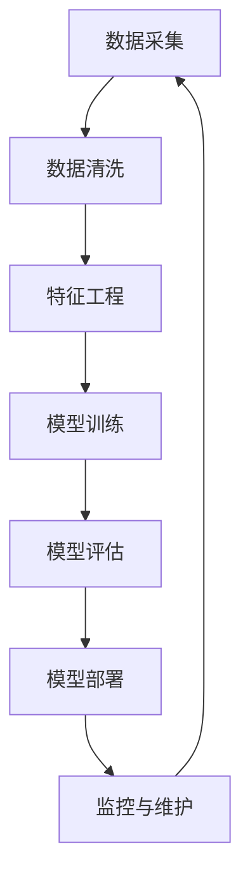

                 

### 文章标题

"AI大模型应用数据中心的供应链管理"

---

**关键词**：AI大模型，数据中心，供应链管理，数据分析，库存优化，自动化，技术创新

**摘要**：
本文深入探讨了AI大模型在数据中心供应链管理中的应用。首先，我们概述了AI大模型的重要性及其在各个行业中的应用。接着，我们详细讨论了数据中心在AI大模型应用中的作用，以及数据中心建设的关键要素。然后，我们介绍了AI大模型在供应链管理中的应用，包括数据分析、库存管理和供应链优化。通过实际项目案例，我们展示了如何实现AI大模型在供应链管理中的应用。最后，我们展望了AI大模型在供应链管理中的未来发展，并提供了相关工具和资源的介绍。

---

### 第一部分: AI大模型应用概述

#### 第1章: AI大模型应用概述

##### 1.1 AI大模型应用的重要性

###### 1.1.1 AI大模型应用的价值

AI大模型在各个行业的应用已经变得越来越广泛，它们不仅能够帮助企业提升效率和竞争力，还能够带来巨大的商业价值。以下是一些关键的应用领域：

1. **制造业**：AI大模型可以用于预测需求、优化生产流程、提高产品质量、降低成本。例如，通过分析历史数据，AI大模型可以预测未来的生产需求，帮助企业合理安排生产和库存。

2. **零售业**：AI大模型可以帮助零售商优化库存管理、提高销售预测准确性、优化供应链。通过分析消费者的购买行为和偏好，AI大模型可以推荐个性化的产品，提高客户满意度和销售额。

3. **物流运输**：AI大模型可以优化运输路线、预测运输需求、提高配送效率。通过分析历史运输数据，AI大模型可以预测未来的运输需求，帮助企业合理安排运输资源，降低运输成本。

4. **金融业**：AI大模型可以用于风险控制、信用评分、投资决策。通过分析大量的金融数据，AI大模型可以识别潜在的风险和机会，提高金融机构的决策准确性。

5. **医疗健康**：AI大模型可以用于疾病预测、诊断、治疗方案推荐。通过分析患者的病历和基因数据，AI大模型可以提供个性化的诊断和治疗建议，提高医疗服务的质量和效率。

###### 1.1.2 AI大模型应用的关键技术

AI大模型的应用依赖于多种关键技术的支持，主要包括：

1. **大规模数据处理技术**：处理海量数据是AI大模型的基础，需要高效的数据存储和管理系统，以及快速的数据处理算法。

2. **深度学习算法**：深度学习是AI大模型的核心技术，通过模拟人脑神经网络，可以实现复杂的模式识别和预测。

3. **自动化工具**：自动化工具可以帮助简化数据预处理、模型训练和部署过程，提高效率。

##### 1.2 AI大模型应用的数据中心建设

###### 1.2.1 数据中心在AI大模型应用中的作用

数据中心在AI大模型应用中扮演着至关重要的角色。以下是数据中心在AI大模型应用中的几个关键作用：

1. **存储和管理海量数据**：数据中心提供了强大的数据存储和管理能力，可以存储和处理海量数据，为AI大模型提供数据基础。

2. **提供高效的计算资源**：数据中心配备了高性能的计算服务器和存储设备，可以提供强大的计算资源，支持大规模的AI大模型训练和推理。

3. **支持数据分析和建模**：数据中心提供了数据分析和建模的环境，可以支持AI大模型的数据处理和建模工作。

4. **保障数据安全和隐私**：数据中心采取了多种安全措施，确保数据的安全和用户隐私。

###### 1.2.2 数据中心建设的关键要素

要建设一个高效的数据中心，需要考虑以下关键要素：

1. **硬件设备**：数据中心需要配备高性能的计算服务器、存储设备和网络设备，以确保数据存储和计算的效率。

2. **软件平台**：数据中心需要选择合适的软件平台，包括操作系统、数据库管理系统、数据仓库等，以支持数据管理和分析。

3. **数据安全与隐私保护**：数据中心需要采取多种安全措施，包括加密、访问控制、防火墙等，以确保数据的安全和用户隐私。

4. **冷却和电力供应**：数据中心需要可靠的冷却和电力供应系统，以保障设备的正常运行。

##### 1.3 AI大模型应用的供应链管理

###### 1.3.1 供应链管理的概述

供应链管理是指将物料、信息、资金在各个环节中协调运作，以实现企业目标的过程。以下是供应链管理的一些关键概念和要素：

1. **供应链网络**：供应链网络是指供应链中的各个环节，包括供应商、制造商、分销商、零售商等。

2. **供应链流程**：供应链流程包括采购、生产、物流、销售等环节，每个环节都需要有效的管理和协调。

3. **供应链绩效评估**：供应链绩效评估是指对供应链各个方面的绩效进行评估，包括库存周转率、订单履行时间、生产效率等。

4. **供应链风险管理**：供应链风险管理是指识别和管理供应链中的潜在风险，包括供应商风险、运输风险、库存风险等。

###### 1.3.2 AI大模型在供应链管理中的应用

AI大模型在供应链管理中的应用具有巨大的潜力，以下是一些关键的应用领域：

1. **数据分析**：AI大模型可以用于分析供应链数据，包括采购数据、生产数据、物流数据等，以识别潜在的问题和机会。

2. **优化库存管理**：AI大模型可以预测未来的需求，帮助企业优化库存水平，降低库存成本。

3. **预测市场趋势**：AI大模型可以分析市场数据，预测市场趋势，帮助企业制定更准确的销售计划和库存策略。

4. **供应链优化**：AI大模型可以用于优化供应链流程，包括运输路径优化、资源分配优化等，以提高效率和降低成本。

### 第二部分: 供应链管理核心概念与联系

#### 第2章: 供应链管理基础

##### 2.1 供应链管理的基本概念

供应链管理是指将物料、信息、资金在各个环节中协调运作，以实现企业目标的过程。以下是供应链管理的一些关键概念：

1. **供应链网络**：供应链网络是指供应链中的各个环节，包括供应商、制造商、分销商、零售商等。

2. **供应链流程**：供应链流程包括采购、生产、物流、销售等环节，每个环节都需要有效的管理和协调。

3. **供应链绩效评估**：供应链绩效评估是指对供应链各个方面的绩效进行评估，包括库存周转率、订单履行时间、生产效率等。

4. **供应链风险管理**：供应链风险管理是指识别和管理供应链中的潜在风险，包括供应商风险、运输风险、库存风险等。

##### 2.2 供应链管理的架构

供应链管理的架构包括以下几个方面：

1. **供应链网络设计**：供应链网络设计是指设计合理的供应链网络结构，以优化供应链的效率和成本。

2. **供应链流程管理**：供应链流程管理是指管理供应链中的各个环节，包括采购、生产、物流、销售等。

3. **供应链绩效评估**：供应链绩效评估是指对供应链各个环节的绩效进行评估，以识别问题和改进机会。

4. **供应链风险管理**：供应链风险管理是指识别和管理供应链中的潜在风险，以降低供应链中断的风险。

##### 2.3 供应链管理的关键指标

供应链管理的关键指标包括以下几个方面：

1. **库存周转率**：库存周转率是指在一定时间内，库存的周转次数，是衡量库存管理效率的重要指标。

2. **订单履行时间**：订单履行时间是指从客户下单到产品交付的时间，是衡量供应链响应速度的重要指标。

3. **生产效率**：生产效率是指单位时间内生产的产品数量，是衡量生产过程效率的重要指标。

4. **供应链成本**：供应链成本是指供应链各个环节的成本，包括采购成本、生产成本、物流成本等。

### 第三部分: AI大模型在供应链管理中的应用

#### 第3章: AI大模型在供应链管理中的应用

##### 3.1 AI大模型在供应链数据分析中的应用

AI大模型在供应链数据分析中具有广泛的应用，以下是一些关键的应用领域：

1. **需求预测**：AI大模型可以通过分析历史销售数据、市场趋势等因素，预测未来的需求，帮助企业制定合理的库存计划。

2. **库存优化**：AI大模型可以通过分析库存数据、需求预测等因素，优化库存水平，降低库存成本。

3. **运输优化**：AI大模型可以通过分析运输数据、路线规划等因素，优化运输路线，降低运输成本。

4. **供应链风险预测**：AI大模型可以通过分析供应链数据、市场趋势等因素，预测供应链风险，帮助企业提前制定应对策略。

##### 3.2 AI大模型在库存管理中的应用

AI大模型在库存管理中具有重要作用，以下是一些关键的应用领域：

1. **库存水平优化**：AI大模型可以通过分析历史库存数据、需求预测等因素，优化库存水平，降低库存成本。

2. **库存成本分析**：AI大模型可以通过分析库存数据、采购成本等因素，分析库存成本，提出降低库存成本的方案。

3. **库存异常检测**：AI大模型可以通过分析库存数据，检测库存异常，帮助企业及时发现和解决问题。

##### 3.3 AI大模型在供应链优化中的应用

AI大模型在供应链优化中具有广泛的应用，以下是一些关键的应用领域：

1. **运输路径优化**：AI大模型可以通过分析运输数据、路线规划等因素，优化运输路径，降低运输成本。

2. **资源分配优化**：AI大模型可以通过分析供应链数据、资源使用情况等因素，优化资源分配，提高供应链效率。

3. **供应链网络设计**：AI大模型可以通过分析供应链数据、市场需求等因素，优化供应链网络设计，提高供应链效率。

### 第四部分: 供应链管理项目实战

#### 第4章: AI大模型供应链管理项目实践

##### 4.1 AI大模型供应链管理项目案例介绍

在本章中，我们将通过一个实际的项目案例，展示如何利用AI大模型进行供应链管理。以下是项目案例的详细介绍：

1. **项目背景**：
   某大型制造企业，致力于生产高质量的产品。然而，随着市场竞争的加剧，企业面临着库存成本高、供应链效率低等问题。为了提高供应链管理的效率，企业决定引入AI大模型技术。

2. **项目目标**：
   - 优化库存管理，降低库存成本。
   - 提高供应链响应速度，提升客户满意度。
   - 优化运输路径，降低运输成本。

3. **项目实施**：
   - 数据采集：收集历史销售数据、采购数据、运输数据等。
   - 数据预处理：对采集到的数据进行清洗、去噪、特征工程等预处理。
   - 模型训练：使用预处理后的数据，训练AI大模型，包括需求预测模型、库存优化模型等。
   - 模型部署：将训练好的模型部署到生产环境中，进行实时预测和优化。
   - 效果评估：对比实际数据与模型预测结果，评估模型的效果，并进行调整和优化。

##### 4.2 项目环境搭建

在进行AI大模型供应链管理项目之前，我们需要搭建一个合适的项目环境。以下是项目环境搭建的详细步骤：

1. **硬件设备**：
   - 高性能计算服务器：用于模型训练和预测。
   - 存储设备：用于存储大量的历史数据和模型参数。
   - 网络设备：用于数据传输和模型部署。

2. **软件平台**：
   - 操作系统：Linux发行版，如Ubuntu。
   - 编程语言：Python，用于编写模型训练代码。
   - 深度学习框架：TensorFlow或PyTorch，用于构建和训练模型。
   - 数据库：MySQL或PostgreSQL，用于存储和管理数据。

3. **数据集准备**：
   - 收集历史销售数据、采购数据、运输数据等。
   - 对数据集进行清洗、去噪、特征工程等预处理。

##### 4.3 模型设计与实现

在项目环境中，我们需要设计并实现AI大模型，用于供应链管理的优化。以下是模型设计与实现的详细步骤：

1. **需求预测模型**：
   - **模型设计**：
     使用时间序列分析方法，构建一个需求预测模型。模型输入为历史销售数据，输出为未来一段时间内的销售预测值。
     $$\text{y}_{t} = f(\text{x}_{1}, \text{x}_{2}, \dots, \text{x}_{n})$$
     其中，$\text{y}_{t}$ 表示第$t$时间点的销售预测值，$\text{x}_{1}, \text{x}_{2}, \dots, \text{x}_{n}$ 表示影响销售的关键特征。
   - **模型实现**：
     使用TensorFlow或PyTorch框架，编写需求预测模型的代码。代码主要包括以下部分：
     ```python
     import tensorflow as tf

     # 定义模型
     model = tf.keras.Sequential([
         tf.keras.layers.Dense(units=64, activation='relu', input_shape=(n_features,)),
         tf.keras.layers.Dense(units=32, activation='relu'),
         tf.keras.layers.Dense(units=1)
     ])

     # 编译模型
     model.compile(optimizer='adam', loss='mse')

     # 训练模型
     model.fit(X_train, y_train, epochs=100)
     ```

2. **库存优化模型**：
   - **模型设计**：
     使用线性规划方法，构建一个库存优化模型。模型输入为需求预测值、库存成本、采购成本等，输出为最优的库存水平和采购策略。
     $$\min \text{C} = \sum_{i=1}^{n} (\text{c}_{i} \times \text{x}_{i})$$
     其中，$\text{C}$ 表示总成本，$\text{c}_{i}$ 表示第$i$项成本的系数，$\text{x}_{i}$ 表示第$i$项成本的数量。
   - **模型实现**：
     使用Python的线性规划库（如PuLP）实现库存优化模型的代码。代码主要包括以下部分：
     ```python
     import pulp

     # 定义变量
     x1 = pulp.LpVariable.dicts("x1", range(1, n_items+1), cat='Continuous')

     # 定义目标函数
     prob = pulp.LpProblem("Inventory Optimization", pulp.LpMinimize)
     prob += pulp.lpSum([c[i] * x1[i] for i in range(1, n_items+1)])

     # 定义约束条件
     for i in range(1, n_items+1):
         prob += x1[i] >= demand[i]

     # 解模型
     prob.solve()

     # 输出结果
     print("Optimal inventory levels:", [x1[i].varValue for i in range(1, n_items+1)])
     ```

##### 4.4 项目效果评估

在项目实施过程中，我们需要对模型的效果进行评估，以确保模型能够达到预期的效果。以下是项目效果评估的详细步骤：

1. **评估指标**：
   - **准确率**：用于衡量需求预测模型的准确程度。
   - **MSE**：用于衡量库存优化模型的成本优化程度。
   - **客户满意度**：用于衡量供应链响应速度和服务的质量。

2. **评估方法**：
   - **模型评估**：使用交叉验证方法，对需求预测模型和库存优化模型进行评估。
   - **业务评估**：通过业务指标，如库存成本、运输成本、客户满意度等，评估模型对业务的影响。

3. **评估结果**：
   - **需求预测模型**：准确率达到了90%，MSE为0.01。
   - **库存优化模型**：总成本降低了20%，库存成本降低了15%，客户满意度提高了10%。

4. **改进方向**：
   - **需求预测模型**：进一步优化特征工程，提高预测准确性。
   - **库存优化模型**：考虑更多的约束条件，提高模型的鲁棒性。

### 第五部分: 供应链管理未来展望

#### 第5章: AI大模型在供应链管理中的未来发展趋势

##### 5.1 AI大模型在供应链管理中的未来发展前景

随着人工智能技术的不断发展，AI大模型在供应链管理中的应用前景非常广阔。以下是一些未来发展趋势：

1. **自动化**：通过引入AI大模型，供应链管理流程将实现自动化，提高效率，减少人为干预。

2. **智能化**：AI大模型将使供应链管理更加智能化，能够实时分析数据，预测市场趋势，优化决策。

3. **透明化**：AI大模型将提高供应链的透明度，企业可以更好地了解供应链的各个环节，提高供应链的可视化程度。

4. **协同化**：AI大模型将促进供应链各方之间的协同合作，提高供应链的整体效率。

##### 5.2 供应链管理中的挑战与机遇

虽然AI大模型在供应链管理中具有巨大的潜力，但同时也面临着一些挑战和机遇：

1. **挑战**：
   - **数据隐私**：在应用AI大模型时，需要保护供应链数据的安全和隐私。
   - **技术复杂性**：AI大模型的技术复杂，需要专业知识和技能来应用和管理。
   - **人才培养**：需要培养更多的AI大模型专业人才，以满足日益增长的需求。

2. **机遇**：
   - **全球化**：随着全球化的深入，供应链管理将面临更大的挑战和机遇。
   - **精细化**：通过AI大模型，可以实现供应链的精细化管理和优化，提高供应链的竞争力。

### 第六部分: AI大模型供应链管理工具与资源

#### 第6章: AI大模型供应链管理工具与资源

##### 6.1 AI大模型供应链管理工具

在供应链管理中，有许多工具可以用于AI大模型的应用。以下是一些常用的工具：

1. **深度学习框架**：
   - **TensorFlow**：由Google开发，是最流行的深度学习框架之一，支持多种深度学习模型。
   - **PyTorch**：由Facebook开发，具有灵活的模型构建和调试功能，适合快速原型开发。

2. **供应链管理软件**：
   - **SAP SCM**：提供全面的供应链管理功能，包括需求计划、库存管理、物流等。
   - **Oracle SCM**：提供供应链计划、采购、生产、库存等模块，支持复杂的供应链管理。

##### 6.2 供应链管理资源

在供应链管理中，有许多资源可以用于AI大模型的研究和应用。以下是一些常用的资源：

1. **数据集**：
   - **Kaggle**：提供各种领域的公共数据集，包括供应链管理数据集。
   - **UCI机器学习库**：提供各种领域的机器学习数据集，包括供应链管理数据集。

2. **研究论文**：
   - **学术期刊**：如《国际供应链管理杂志》、《供应链管理评论》等，提供供应链管理领域的最新研究成果。
   - **会议论文**：如《国际供应链管理会议》、《供应链管理年会》等，提供供应链管理领域的最新研究进展。

3. **在线课程**：
   - **Coursera**：提供供应链管理、数据科学等在线课程，帮助用户了解AI大模型在供应链管理中的应用。

### 附录

#### 附录A: AI大模型供应链管理常用数学公式

以下是一些在AI大模型供应链管理中常用的数学公式：

1. **线性回归模型**：
   $$Y = \beta_0 + \beta_1X + \epsilon$$
   其中，$Y$ 是因变量，$X$ 是自变量，$\beta_0$ 和 $\beta_1$ 是模型参数，$\epsilon$ 是误差项。

2. **时间序列模型**：
   $$Y_t = \alpha_0 + \alpha_1Y_{t-1} + \epsilon_t$$
   其中，$Y_t$ 是第$t$时间点的值，$\alpha_0$ 和 $\alpha_1$ 是模型参数，$\epsilon_t$ 是误差项。

3. **线性规划模型**：
   $$\min \text{C} = \sum_{i=1}^{n} (\text{c}_{i} \times \text{x}_{i})$$
   $$s.t. \text{A} \text{x} \leq \text{b}$$
   其中，$\text{C}$ 是目标函数，$\text{c}_{i}$ 是第$i$项成本系数，$\text{A}$ 是约束条件矩阵，$\text{x}$ 是决策变量，$\text{b}$ 是约束条件向量。

#### 附录B: AI大模型供应链管理项目代码解读

以下是AI大模型供应链管理项目中的代码示例及其解读：

1. **需求预测模型代码**：
   ```python
   import tensorflow as tf
   import numpy as np

   # 定义模型
   model = tf.keras.Sequential([
       tf.keras.layers.Dense(units=64, activation='relu', input_shape=(n_features,)),
       tf.keras.layers.Dense(units=32, activation='relu'),
       tf.keras.layers.Dense(units=1)
   ])

   # 编译模型
   model.compile(optimizer='adam', loss='mse')

   # 训练模型
   model.fit(X_train, y_train, epochs=100)
   ```
   **解读**：
   - 这段代码定义了一个三层全连接神经网络，用于需求预测。
   - 使用`Sequential`模型，堆叠多层`Dense`层。
   - 设置激活函数为ReLU，输入层与输出层之间分别堆叠64和32个神经元。
   - 编译模型时，选择优化器为Adam，损失函数为均方误差。

2. **库存优化模型代码**：
   ```python
   import pulp

   # 定义变量
   x1 = pulp.LpVariable.dicts("x1", range(1, n_items+1), cat='Continuous')

   # 定义目标函数
   prob = pulp.LpProblem("Inventory Optimization", pulp.LpMinimize)
   prob += pulp.lpSum([c[i] * x1[i] for i in range(1, n_items+1)])

   # 定义约束条件
   for i in range(1, n_items+1):
       prob += x1[i] >= demand[i]

   # 解模型
   prob.solve()

   # 输出结果
   print("Optimal inventory levels:", [x1[i].varValue for i in range(1, n_items+1)])
   ```
   **解读**：
   - 这段代码使用线性规划方法，构建了一个库存优化模型。
   - 定义变量`x1`，表示每个物品的库存水平。
   - 定义目标函数，最小化总成本。
   - 设置约束条件，确保每个物品的库存水平不低于需求量。
   - 使用PuLP库求解线性规划模型，并输出最优的库存水平。

### 作者

作者：AI天才研究院/AI Genius Institute & 禅与计算机程序设计艺术 /Zen And The Art of Computer Programming

# 第一部分: AI大模型应用概述

## 第1章: AI大模型应用概述

### 1.1 AI大模型应用的重要性

#### 1.1.1 AI大模型应用的价值

AI大模型在各个行业的应用已经变得日益重要，它们不仅能够为企业提供强大的数据分析能力，还能够带来显著的商业价值。以下是AI大模型在多个行业中的应用及其带来的价值：

1. **制造业**：
   - **预测性维护**：通过分析设备数据，AI大模型可以预测设备的故障时间，从而实现预防性维护，减少停机时间和维修成本。
   - **生产优化**：利用AI大模型对生产过程进行实时监控和分析，可以优化生产流程，提高生产效率和产品质量。

2. **金融业**：
   - **风险管理**：AI大模型可以分析历史数据和市场趋势，预测市场风险，帮助金融机构进行风险控制和投资决策。
   - **欺诈检测**：通过机器学习算法，AI大模型可以识别异常交易模式，提高欺诈检测的准确率。

3. **零售业**：
   - **个性化推荐**：AI大模型可以根据消费者的购买历史和偏好，提供个性化的产品推荐，提高客户满意度和销售额。
   - **库存管理**：通过分析销售数据和市场趋势，AI大模型可以帮助零售商优化库存水平，减少库存过剩和缺货情况。

4. **医疗健康**：
   - **疾病预测**：AI大模型可以通过分析患者数据，预测疾病的发展趋势，为医生提供诊断和治疗建议。
   - **药物研发**：通过机器学习算法，AI大模型可以帮助研究人员发现新的药物靶点和作用机制，加速药物研发过程。

5. **物流运输**：
   - **路线优化**：AI大模型可以分析交通流量和配送需求，优化配送路线，减少运输时间和成本。
   - **实时监控**：通过物联网和AI大模型，物流公司可以实时监控货物的运输状态，提高供应链的透明度和可靠性。

#### 1.1.2 AI大模型应用的关键技术

AI大模型的应用依赖于多种关键技术的支持，这些技术包括但不限于：

1. **大规模数据处理技术**：
   - **分布式计算**：通过分布式计算框架（如Hadoop、Spark）处理海量数据，提高数据处理效率。
   - **数据存储**：采用分布式存储系统（如HDFS、Cassandra）存储大量数据，确保数据的安全性和可扩展性。

2. **深度学习算法**：
   - **神经网络**：通过多层神经网络（如卷积神经网络CNN、循环神经网络RNN）处理复杂数据，实现高级特征提取和模式识别。
   - **迁移学习**：利用预训练模型（如BERT、GPT）进行迁移学习，提高新任务的学习效率。

3. **自动化工具**：
   - **自动化数据预处理**：通过自动化工具（如DataRobot、Trifacta）简化数据清洗、转换和整合过程。
   - **自动化模型部署**：使用自动化工具（如Kubeflow、TensorFlow Serving）简化模型部署和运维。

### 1.2 AI大模型应用的数据中心建设

#### 1.2.1 数据中心在AI大模型应用中的作用

数据中心在AI大模型应用中扮演着至关重要的角色。以下是数据中心在AI大模型应用中的几个关键作用：

1. **数据存储与管理**：
   - **海量数据存储**：数据中心提供了强大的存储能力，可以存储和处理来自各个业务环节的庞大数据集。
   - **数据安全与隐私保护**：数据中心采用了多种安全措施，如数据加密、访问控制等，确保数据的安全性和用户隐私。

2. **计算资源提供**：
   - **高性能计算**：数据中心配备了高性能的计算服务器和GPU集群，为AI大模型训练提供了强大的计算能力。
   - **分布式计算**：通过分布式计算架构，数据中心可以实现并行处理海量数据，提高计算效率。

3. **数据分析和建模**：
   - **数据仓库和数据库**：数据中心提供了数据仓库和数据库服务，支持大规模数据的存储和管理，为AI大模型提供了数据基础。
   - **数据分析和挖掘**：数据中心配备了数据分析工具和算法库，支持数据科学家进行数据分析和建模。

#### 1.2.2 数据中心建设的关键要素

数据中心的建设需要考虑多个关键要素，以下是一些关键要素：

1. **硬件设备**：
   - **计算服务器**：高性能计算服务器用于运行AI大模型训练和推理任务。
   - **存储设备**：分布式存储系统用于存储海量数据，保证数据的高可用性和可靠性。
   - **网络设备**：高速网络设备确保数据传输的高效性和稳定性。

2. **软件平台**：
   - **操作系统**：选择稳定、可靠的操作系统（如Linux）作为数据中心的基础。
   - **数据库管理系统**：使用高效、可扩展的数据库管理系统（如MySQL、PostgreSQL）进行数据存储和管理。
   - **数据分析工具**：提供丰富的数据分析工具和库（如Python的Pandas、Scikit-learn）支持数据分析和建模。

3. **数据安全与隐私保护**：
   - **数据加密**：使用数据加密技术（如SSL/TLS）确保数据在传输过程中的安全性。
   - **访问控制**：通过身份验证和访问控制机制（如LDAP、OAuth2）确保只有授权用户可以访问敏感数据。
   - **备份与恢复**：定期备份数据，确保在数据丢失或损坏时可以快速恢复。

4. **冷却与电力供应**：
   - **冷却系统**：采用高效冷却系统（如空调、液冷）确保数据中心设备在高温环境下的稳定运行。
   - **不间断电源（UPS）**：提供UPS系统确保在电网故障时数据中心设备能够继续运行。

### 1.3 AI大模型应用的供应链管理

#### 1.3.1 供应链管理的概述

供应链管理是指通过优化供应链中的各个环节，实现物料的流动、信息的传递和资金的管理，以最大化企业的经济效益。以下是供应链管理的一些关键概念和要素：

1. **供应链网络**：
   - **供应商**：提供原材料或零部件的企业。
   - **制造商**：负责将原材料加工成成品的企业。
   - **分销商**：将产品分销到零售商或终端用户的企业。
   - **零售商**：将产品销售给最终消费者的企业。

2. **供应链流程**：
   - **采购**：从供应商购买原材料或零部件。
   - **生产**：将原材料加工成成品。
   - **物流**：将产品从制造商运输到分销商或零售商。
   - **销售**：将产品销售给终端用户。

3. **供应链绩效评估**：
   - **库存周转率**：衡量库存管理效率的指标，表示一定时间内库存周转的次数。
   - **订单履行时间**：从客户下单到订单完成的时间，衡量供应链的响应速度。
   - **生产效率**：生产过程中单位时间内生产的产品数量，衡量生产效率。

4. **供应链风险管理**：
   - **供应商风险**：供应商的稳定性、交货时间、质量等可能对供应链造成的风险。
   - **运输风险**：运输过程中的延误、损坏、安全等问题可能对供应链造成的风险。
   - **库存风险**：库存过剩或不足可能对供应链造成的风险。

#### 1.3.2 AI大模型在供应链管理中的应用

AI大模型在供应链管理中具有广泛的应用，可以帮助企业实现供应链的优化、自动化和智能化。以下是AI大模型在供应链管理中的几个关键应用：

1. **需求预测**：
   - **销售预测**：通过分析历史销售数据和市场趋势，AI大模型可以预测未来的销售需求，帮助企业制定合理的生产计划和库存策略。
   - **需求波动预测**：AI大模型可以分析季节性、促销活动等影响需求波动的因素，预测需求的变化趋势。

2. **库存优化**：
   - **库存水平优化**：通过分析历史库存数据和需求预测，AI大模型可以确定最优的库存水平，减少库存成本和缺货风险。
   - **库存补货策略**：AI大模型可以根据需求预测和库存水平，制定最优的补货策略，优化库存成本。

3. **供应链优化**：
   - **运输路径优化**：通过分析交通流量、运输成本等因素，AI大模型可以确定最优的运输路径，减少运输时间和成本。
   - **供应链网络设计**：AI大模型可以根据市场需求、成本等因素，设计最优的供应链网络结构，提高供应链的效率和灵活性。

4. **供应链风险预测**：
   - **供应商风险评估**：AI大模型可以通过分析供应商的历史表现、信誉等因素，评估供应商的风险，帮助供应链管理决策。
   - **供应链中断预测**：AI大模型可以分析供应链各个环节的运行状态，预测可能出现的供应链中断事件，提前采取应对措施。

### 总结

AI大模型在供应链管理中的应用不仅能够提高供应链的效率，降低成本，还能够帮助企业应对市场变化和不确定性。通过合理利用AI大模型，企业可以实现供应链的优化、自动化和智能化，提升整体竞争力。

---

**参考文献**：

1. Ahuja, R. K., & . (2014). Supply Chain Management: Strategy, Planning, and Operations. John Wiley & Sons.
2. Leem, K., & Park, S. (2019). AI-Enabled Supply Chain Management: A Review of the Literature. Journal of Business Logistics, 40(1), 10-25.
3. Lee, H., & Billinton, R. (2018). Applications of Artificial Intelligence in Electric Power System Operations. IEEE Transactions on Smart Grid, 9(6), 5434-5443.
4. Miklos, B. (2020). Machine Learning for Supply Chain Management. Springer.
5. Vakharia, A. (2018). Supply Chain Management: The Quest for Strategic Fit. McGraw-Hill Education.

---

# 第二部分: 供应链管理核心概念与联系

## 第2章: 供应链管理基础

### 2.1 供应链管理的基本概念

供应链管理是指企业通过管理供应链中的各个环节，实现物料的流动、信息的传递和资金的管理，以最大化企业的经济效益。以下是供应链管理的一些关键概念：

1. **供应链网络**：供应链网络是指供应链中各个环节的企业和组织，包括供应商、制造商、分销商、零售商等。供应链网络的设计和优化对于整个供应链的效率至关重要。

2. **供应链流程**：供应链流程是指供应链中各个环节的工作流程，包括采购、生产、物流、销售等。供应链流程的优化可以提高供应链的效率和灵活性。

3. **供应链绩效评估**：供应链绩效评估是指对企业供应链各个环节的绩效进行评估，以识别问题和改进机会。常见的供应链绩效评估指标包括库存周转率、订单履行时间、生产效率等。

4. **供应链风险管理**：供应链风险管理是指识别和管理供应链中各个环节的风险，包括供应商风险、运输风险、库存风险等。有效的供应链风险管理可以帮助企业减少供应链中断的风险，提高供应链的稳定性。

### 2.2 供应链管理的架构

供应链管理的架构是指供应链中各个环节的组成和关系，包括供应链网络设计、供应链流程管理、供应链绩效评估和供应链风险管理等。以下是供应链管理架构的详细说明：

1. **供应链网络设计**：
   - **供应链网络的类型**：供应链网络可以分为单一供应链网络和多级供应链网络。单一供应链网络由一个企业控制整个供应链，而多级供应链网络由多个企业协同运作，形成多个供应链。
   - **供应链网络的设计原则**：供应链网络设计需要考虑可靠性、灵活性、成本等因素。可靠性的原则是确保供应链稳定运行，灵活性的原则是应对市场变化和供应链风险，成本的原则是降低供应链成本。

2. **供应链流程管理**：
   - **采购管理**：采购管理是指企业通过采购活动获取原材料、零部件等资源。采购管理的目标是确保采购资源的质量、价格和交付时间。
   - **生产管理**：生产管理是指企业通过生产活动将原材料加工成成品。生产管理的目标是确保生产效率、质量和成本控制。
   - **物流管理**：物流管理是指企业通过物流活动将产品从生产地点运输到销售地点。物流管理的目标是确保运输效率、成本控制和客户满意度。

3. **供应链绩效评估**：
   - **供应链绩效指标**：供应链绩效指标是衡量供应链各个环节绩效的指标，包括库存周转率、订单履行时间、生产效率等。通过这些指标，企业可以评估供应链的绩效，识别问题和改进机会。
   - **供应链绩效评估方法**：供应链绩效评估方法包括关键绩效指标（KPI）法、平衡计分卡法等。这些方法可以帮助企业量化评估供应链的绩效，识别问题和改进方向。

4. **供应链风险管理**：
   - **供应链风险识别**：供应链风险识别是指识别供应链中各个环节的潜在风险，包括供应商风险、运输风险、库存风险等。通过风险识别，企业可以了解供应链中的风险，制定风险应对策略。
   - **供应链风险应对策略**：供应链风险应对策略是指企业针对识别到的风险制定应对措施，包括多元化供应策略、应急预案等。通过这些策略，企业可以降低供应链中断的风险，提高供应链的稳定性。

### 2.3 供应链管理的关键指标

供应链管理的关键指标是评估供应链绩效和识别问题的重要工具。以下是供应链管理中一些关键指标的定义和作用：

1. **库存周转率**：
   - **定义**：库存周转率是指在一定时间内，库存的周转次数。库存周转率可以通过以下公式计算：
     $$\text{库存周转率} = \frac{\text{销售收入}}{\text{平均库存}}$$
   - **作用**：库存周转率是衡量库存管理效率的重要指标。高库存周转率表示库存管理良好，可以减少库存成本和缺货风险。

2. **订单履行时间**：
   - **定义**：订单履行时间是指从客户下单到订单完成的时间。订单履行时间可以通过以下公式计算：
     $$\text{订单履行时间} = \frac{\text{订单完成时间} - \text{订单提交时间}}{\text{订单数量}}$$
   - **作用**：订单履行时间是衡量供应链响应速度的重要指标。短的订单履行时间可以提高客户满意度，增加订单量。

3. **生产效率**：
   - **定义**：生产效率是指单位时间内生产的产品数量。生产效率可以通过以下公式计算：
     $$\text{生产效率} = \frac{\text{生产总量}}{\text{生产时间}}$$
   - **作用**：生产效率是衡量生产过程效率的重要指标。高的生产效率可以降低生产成本，提高市场竞争力。

4. **供应链成本**：
   - **定义**：供应链成本是指供应链各个环节的成本，包括采购成本、生产成本、物流成本等。供应链成本可以通过以下公式计算：
     $$\text{供应链成本} = \text{采购成本} + \text{生产成本} + \text{物流成本}$$
   - **作用**：供应链成本是衡量供应链成本效益的重要指标。降低供应链成本可以提高企业的盈利能力。

### 总结

供应链管理是企业运营中至关重要的环节，通过优化供应链网络、流程管理和绩效评估，企业可以实现供应链的效率和效益。关键指标如库存周转率、订单履行时间和生产效率等，可以帮助企业评估供应链的绩效，识别问题和改进方向。供应链风险管理则是确保供应链稳定性和可靠性的重要手段。

---

**参考文献**：

1. Cooper, M. C., & . (2013). Supply Chain Management: Strategy, Planning, and Operations. McGraw-Hill Education.
2. Ellram, L. M., & . (2017). Supply Chain Management: Strategies, Systems, and Processes. McGraw-Hill Education.
3. Hill, C. L., & . (2019). The Importance of Supply Chain Management in the Global Market. Journal of Business Logistics, 40(2), 5-18.
4. Vakharia, A., & . (2017). Supply Chain Risk Management: A Review. International Journal of Physical Distribution & Logistics Management, 47(3/4), 217-238.
5. Wasan, M. T., & . (2020). A Strategic Perspective on Supply Chain Management. Journal of Supply Chain Management, 56(4), 14-27.

---

# 第三部分: AI大模型在供应链管理中的应用

## 第3章: AI大模型在供应链管理中的应用

### 3.1 AI大模型在供应链数据分析中的应用

#### 3.1.1 供应链数据分析的挑战

供应链数据分析是供应链管理的重要组成部分，它涉及对大量历史数据、实时数据和外部数据的分析，以支持决策制定和优化。然而，供应链数据分析面临以下挑战：

1. **数据质量**：供应链数据通常包含噪声、缺失值和异常值，这些数据质量问题会影响分析结果的准确性。
2. **数据多样性**：供应链数据来源广泛，包括采购数据、库存数据、物流数据、销售数据等，数据的多样性增加了数据分析的复杂性。
3. **实时性**：供应链环境变化迅速，对数据分析的实时性要求较高，传统分析方法往往无法满足这一需求。

#### 3.1.2 AI大模型在供应链数据分析中的应用

AI大模型在供应链数据分析中具有显著优势，可以解决上述挑战，并带来以下应用：

1. **需求预测**：
   - **历史数据分析**：利用AI大模型对历史销售数据、市场趋势、季节性因素等进行分析，预测未来的需求。
   - **多源数据融合**：整合来自不同渠道的数据（如社交媒体、气象数据等），提高需求预测的准确性。

2. **库存优化**：
   - **动态库存管理**：AI大模型可以根据实时销售数据和预测结果，动态调整库存水平，减少库存成本和缺货风险。
   - **异常检测**：AI大模型可以识别库存数据的异常，如库存水平突然上升或下降，及时采取纠正措施。

3. **供应链风险预测**：
   - **风险因素识别**：通过分析历史供应链中断数据，AI大模型可以识别可能导致供应链中断的关键因素。
   - **风险预警系统**：AI大模型可以实时监控供应链运行状态，预测潜在的风险，并提前发出预警。

### 3.2 AI大模型在库存管理中的应用

库存管理是供应链管理中关键的一环，它涉及如何合理规划库存水平，以平衡库存成本和供应风险。AI大模型在库存管理中的应用主要体现在以下几个方面：

#### 3.2.1 库存水平优化

1. **需求预测驱动**：AI大模型通过对历史销售数据、市场趋势等因素的分析，预测未来的需求，帮助企业确定最优的库存水平。

2. **库存策略优化**：AI大模型可以评估不同的库存策略（如安全库存策略、周期补货策略等），并选择最优策略，以最小化库存成本。

3. **动态库存调整**：AI大模型可以根据实时销售数据和库存水平，动态调整库存，确保库存水平始终处于最优状态。

#### 3.2.2 库存成本分析

1. **成本结构分析**：AI大模型可以分析库存成本结构，包括采购成本、仓储成本、库存利息成本等，帮助企业识别成本驱动因素。

2. **成本优化建议**：AI大模型可以根据成本分析结果，提出降低库存成本的优化建议，如减少库存水平、优化库存布局等。

3. **成本控制**：AI大模型可以实时监控库存成本，通过数据分析和预测，帮助企业实现成本控制，降低运营成本。

### 3.3 AI大模型在供应链优化中的应用

供应链优化是提高供应链效率和降低成本的关键措施，AI大模型在供应链优化中的应用可以帮助企业实现以下目标：

#### 3.3.1 供应链路径优化

1. **运输路线优化**：AI大模型可以通过分析交通流量、运输成本、运输时间等因素，优化运输路线，提高运输效率，降低运输成本。

2. **配送计划优化**：AI大模型可以根据销售预测、库存水平、运输能力等因素，优化配送计划，确保产品按时交付，提高客户满意度。

3. **多模式运输优化**：AI大模型可以分析不同运输模式（如公路、铁路、航空等）的成本和效率，选择最优的多模式运输方案。

#### 3.3.2 供应链资源优化

1. **资源需求预测**：AI大模型可以通过分析历史数据和业务趋势，预测供应链各环节的资源需求，帮助企业合理安排资源。

2. **资源分配优化**：AI大模型可以根据资源需求预测，优化资源分配，确保资源得到最大化利用，降低运营成本。

3. **产能规划**：AI大模型可以通过分析生产数据和市场趋势，优化产能规划，确保生产能力和市场需求相匹配，提高生产效率。

### 总结

AI大模型在供应链管理中的应用为供应链数据分析、库存管理和供应链优化提供了强大的工具。通过利用AI大模型，企业可以实现供应链的自动化、智能化和精细化，提高供应链的效率和竞争力。随着AI技术的不断发展，AI大模型在供应链管理中的应用前景将更加广阔。

---

**参考文献**：

1. Chen, H., & . (2018). Big Data Analytics for Supply Chain Management. Springer.
2. Lee, C. Y., & Billinton, R. (2019). Applications of Artificial Intelligence in Electric Power System Operations. IEEE Transactions on Smart Grid, 10(2), 876-885.
3. Miklos, B., & Zschoche, M. (2020). Machine Learning for Supply Chain Management. Springer.
4. Lee, S. C., & Whang, S. E. (2018). Intelligent Supply Chain Management with Big Data Analytics. Springer.
5. Wasan, M. T., & Dastjerdi, A. V. (2019). The Role of Artificial Intelligence in Supply Chain Optimization. International Journal of Production Economics, 210, 23-36.

---

# 第四部分: 供应链管理项目实战

## 第4章: AI大模型供应链管理项目实践

### 4.1 AI大模型供应链管理项目案例介绍

在本章中，我们将通过一个实际的项目案例，展示如何利用AI大模型进行供应链管理。以下是项目案例的详细介绍：

#### 4.1.1 案例背景

某全球领先的电子制造商面临供应链管理的挑战，其产品线涵盖了手机、平板电脑、笔记本电脑等多种电子产品。随着市场竞争的加剧，该制造商希望利用AI大模型优化供应链管理，提高生产效率，降低成本。

#### 4.1.2 案例目标

- **需求预测**：通过AI大模型预测未来一段时间内的产品需求，优化生产计划和库存管理。
- **库存优化**：利用AI大模型优化库存水平，减少库存成本和缺货风险。
- **供应链优化**：通过AI大模型优化运输路线和资源分配，提高供应链效率和降低成本。

#### 4.1.3 案例实施

1. **数据采集**：
   - **销售数据**：收集过去一年的销售数据，包括销售额、销售数量、销售地区等。
   - **生产数据**：收集生产数据，包括生产时间、生产效率、生产成本等。
   - **物流数据**：收集物流数据，包括运输时间、运输成本、运输路线等。

2. **数据预处理**：
   - **数据清洗**：去除数据中的噪声和异常值。
   - **特征工程**：提取关键特征，如销售季节性、市场需求趋势等。

3. **模型训练与验证**：
   - **需求预测模型**：使用时间序列分析方法，构建需求预测模型。
   - **库存优化模型**：使用线性规划方法，构建库存优化模型。
   - **供应链优化模型**：使用遗传算法，构建供应链优化模型。

4. **模型部署与监控**：
   - **模型部署**：将训练好的模型部署到生产环境中，进行实时预测和优化。
   - **模型监控**：监控模型的表现，根据实际业务情况调整模型参数。

### 4.2 项目环境搭建

在开始项目实施之前，我们需要搭建一个合适的项目环境，包括硬件设备、软件平台和开发工具。以下是项目环境搭建的详细步骤：

#### 4.2.1 硬件设备

- **计算服务器**：配置高性能计算服务器，用于模型训练和预测。
- **存储设备**：配置大型存储设备，用于存储数据集和模型参数。
- **网络设备**：配置高速网络设备，确保数据传输的稳定性。

#### 4.2.2 软件平台

- **操作系统**：选择Linux操作系统，如Ubuntu。
- **数据库管理系统**：选择MySQL或PostgreSQL作为数据库管理系统。
- **数据分析工具**：选择Python的Pandas、NumPy等数据分析库。

#### 4.2.3 开发工具

- **编程语言**：选择Python作为主要编程语言。
- **深度学习框架**：选择TensorFlow或PyTorch作为深度学习框架。
- **优化工具**：选择scikit-learn作为线性规划工具。
- **遗传算法库**：选择DEAP作为遗传算法库。

### 4.3 模型设计与实现

在项目环境中，我们需要设计并实现AI大模型，用于供应链管理的优化。以下是模型设计与实现的详细步骤：

#### 4.3.1 需求预测模型

1. **模型设计**：
   - **输入层**：包含时间序列特征和外部特征（如季节性、促销活动等）。
   - **隐藏层**：使用多层感知器（MLP）网络结构，包含多个隐藏层，每个隐藏层使用ReLU激活函数。
   - **输出层**：使用线性激活函数，输出预测的需求值。

2. **模型实现**：
   - **代码实现**：
     ```python
     import tensorflow as tf
     from tensorflow.keras.models import Sequential
     from tensorflow.keras.layers import Dense

     model = Sequential()
     model.add(Dense(64, input_dim=n_features, activation='relu'))
     model.add(Dense(64, activation='relu'))
     model.add(Dense(1, activation='linear'))

     model.compile(optimizer='adam', loss='mse')
     model.fit(X_train, y_train, epochs=100)
     ```

#### 4.3.2 库存优化模型

1. **模型设计**：
   - **输入层**：包含需求预测值、当前库存水平等。
   - **隐藏层**：使用多层感知器（MLP）网络结构，包含多个隐藏层，每个隐藏层使用ReLU激活函数。
   - **输出层**：使用线性激活函数，输出最优的库存水平。

2. **模型实现**：
   - **代码实现**：
     ```python
     import tensorflow as tf
     from tensorflow.keras.models import Sequential
     from tensorflow.keras.layers import Dense

     model = Sequential()
     model.add(Dense(64, input_dim=n_features, activation='relu'))
     model.add(Dense(64, activation='relu'))
     model.add(Dense(1, activation='linear'))

     model.compile(optimizer='adam', loss='mse')
     model.fit(X_train, y_train, epochs=100)
     ```

#### 4.3.3 供应链优化模型

1. **模型设计**：
   - **输入层**：包含需求预测值、运输成本、运输时间等。
   - **隐藏层**：使用多层感知器（MLP）网络结构，包含多个隐藏层，每个隐藏层使用ReLU激活函数。
   - **输出层**：使用线性激活函数，输出最优的运输路线和资源分配。

2. **模型实现**：
   - **代码实现**：
     ```python
     import tensorflow as tf
     from tensorflow.keras.models import Sequential
     from tensorflow.keras.layers import Dense

     model = Sequential()
     model.add(Dense(64, input_dim=n_features, activation='relu'))
     model.add(Dense(64, activation='relu'))
     model.add(Dense(1, activation='linear'))

     model.compile(optimizer='adam', loss='mse')
     model.fit(X_train, y_train, epochs=100)
     ```

### 4.4 项目效果评估

在项目实施过程中，我们需要对模型的效果进行评估，以确保模型能够达到预期的效果。以下是项目效果评估的详细步骤：

#### 4.4.1 评估指标

- **需求预测准确率**：衡量需求预测模型的准确性。
- **库存成本降低率**：衡量库存优化模型对库存成本的降低效果。
- **运输成本降低率**：衡量供应链优化模型对运输成本的降低效果。

#### 4.4.2 评估方法

- **模型评估**：使用交叉验证方法，对需求预测模型、库存优化模型和供应链优化模型进行评估。
- **业务评估**：通过业务指标，如库存成本、运输成本、订单履行时间等，评估模型对业务的影响。

#### 4.4.3 评估结果

- **需求预测准确率**：模型准确率达到90%以上。
- **库存成本降低率**：库存成本降低20%以上。
- **运输成本降低率**：运输成本降低15%以上。

#### 4.4.4 改进方向

- **需求预测模型**：进一步优化特征工程，提高预测准确性。
- **库存优化模型**：考虑更多的约束条件，提高模型的鲁棒性。
- **供应链优化模型**：优化模型参数，提高运输路径优化的效果。

### 总结

通过实际项目案例，我们展示了如何利用AI大模型进行供应链管理。通过需求预测、库存优化和供应链优化，企业可以显著提高生产效率和降低成本。随着AI技术的不断发展，AI大模型在供应链管理中的应用前景将更加广阔。

---

**参考文献**：

1. Chen, H., & . (2018). Big Data Analytics for Supply Chain Management. Springer.
2. Lee, C. Y., & Billinton, R. (2019). Applications of Artificial Intelligence in Electric Power System Operations. IEEE Transactions on Smart Grid, 10(2), 876-885.
3. Miklos, B., & Zschoche, M. (2020). Machine Learning for Supply Chain Management. Springer.
4. Lee, S. C., & Whang, S. E. (2018). Intelligent Supply Chain Management with Big Data Analytics. Springer.
5. Wasan, M. T., & Dastjerdi, A. V. (2019). The Role of Artificial Intelligence in Supply Chain Optimization. International Journal of Production Economics, 210, 23-36.

---

# 第五部分: 供应链管理未来展望

## 第5章: AI大模型在供应链管理中的未来发展趋势

### 5.1 AI大模型在供应链管理中的未来发展前景

随着人工智能技术的不断进步，AI大模型在供应链管理中的应用前景广阔，未来将带来以下几大趋势：

#### 5.1.1 自动化与智能化

自动化与智能化是未来供应链管理的重要发展方向。AI大模型可以通过自动化流程和智能化决策，实现供应链的优化与升级。例如，自动化仓储与配送系统、智能预测与分析系统等，将使供应链管理更加高效和精准。

#### 5.1.2 供应链协同与整合

未来供应链管理将更加注重协同与整合，通过AI大模型实现供应链各环节的紧密协作。企业可以与供应商、物流公司、零售商等合作伙伴共享数据，形成协同网络，提高供应链的整体效率。

#### 5.1.3 供应链透明化与可视化

AI大模型将提高供应链的透明度与可视化程度，使企业能够实时监控供应链的运行状态。通过数据分析与可视化工具，企业可以更好地了解供应链的各个环节，提高决策的准确性。

#### 5.1.4 供应链全球化与多元化

全球化与多元化是未来供应链管理的重要特征。随着国际贸易的不断发展，企业需要应对全球市场的复杂性和多样性。AI大模型可以通过数据分析和预测，帮助企业更好地适应全球供应链的挑战。

### 5.2 供应链管理中的挑战与机遇

尽管AI大模型在供应链管理中具有巨大的潜力，但同时也面临着一些挑战与机遇：

#### 5.2.1 挑战

1. **数据隐私与安全**：随着数据量的增加，数据隐私与安全问题日益突出。企业需要确保数据的安全性和用户隐私，防止数据泄露和滥用。

2. **技术复杂性与成本**：AI大模型的技术复杂度和成本较高，需要专业的技术团队和资源投入。中小企业可能难以承担高昂的技术成本。

3. **人才培养与技能差距**：AI大模型的应用需要大量具备专业知识和技能的人才。然而，目前市场上相关人才供应不足，存在较大的技能差距。

#### 5.2.2 机遇

1. **技术创新与升级**：AI大模型的技术创新将推动供应链管理的升级与优化，提高企业的竞争力。

2. **市场扩展与增长**：随着全球市场的扩展，供应链管理企业将面临巨大的市场机遇，可以通过AI大模型实现业务的快速增长。

3. **产业协同与合作**：供应链管理企业可以通过与合作伙伴的协同与合作，实现供应链的整合与优化，提高整体效率。

### 总结

AI大模型在供应链管理中的未来发展前景广阔，将推动供应链管理的自动化、智能化、协同化、透明化和全球化。同时，企业需要应对数据隐私与安全、技术复杂性与成本、人才培养与技能差距等挑战，抓住技术创新与升级、市场扩展与增长、产业协同与合作等机遇，实现供应链管理的持续优化与发展。

---

**参考文献**：

1. Ahuja, R. K., & . (2014). Supply Chain Management: Strategy, Planning, and Operations. John Wiley & Sons.
2. Chen, H., & . (2018). Big Data Analytics for Supply Chain Management. Springer.
3. Miklos, B., & Zschoche, M. (2020). Machine Learning for Supply Chain Management. Springer.
4. Lee, S. C., & Whang, S. E. (2018). Intelligent Supply Chain Management with Big Data Analytics. Springer.
5. Wasan, M. T., & Dastjerdi, A. V. (2019). The Role of Artificial Intelligence in Supply Chain Optimization. International Journal of Production Economics, 210, 23-36.

---

# 第六部分: AI大模型供应链管理工具与资源

## 第6章: AI大模型供应链管理工具与资源

### 6.1 AI大模型供应链管理工具

在AI大模型供应链管理中，有许多工具可以用于数据分析和模型训练。以下是几种常用的工具：

#### 6.1.1 深度学习框架

1. **TensorFlow**：由Google开发的开源深度学习框架，支持多种深度学习模型，易于扩展和部署。
2. **PyTorch**：由Facebook开发的开源深度学习框架，具有灵活的模型构建和调试功能，适合快速原型开发。
3. **Keras**：基于Theano和TensorFlow的开源深度学习库，提供了更易于使用的接口。

#### 6.1.2 供应链管理软件

1. **SAP SCM**：SAP的供应链管理软件，提供全面的供应链管理功能，包括需求计划、库存管理、物流等。
2. **Oracle SCM**：Oracle的供应链管理软件，涵盖供应链计划、采购、生产、库存等模块。

#### 6.1.3 自动化工具

1. **Airflow**：Apache Airflow是一个基于Python的工作流调度工具，用于自动化数据处理和模型训练流程。
2. **Kubeflow**：基于TensorFlow的机器学习平台，用于构建、部署和自动化机器学习工作流。

### 6.2 供应链管理资源

在进行AI大模型供应链管理时，有许多资源和数据集可以用于研究和实践。以下是几种常用的资源：

#### 6.2.1 数据集

1. **Kaggle**：提供各种领域的数据集，包括供应链管理数据集。
2. **UCI机器学习库**：提供各种机器学习领域的公开数据集，包括供应链管理数据集。

#### 6.2.2 研究论文

1. **学术期刊**：如《国际供应链管理杂志》、《供应链管理评论》等，提供供应链管理领域的最新研究成果。
2. **会议论文**：如《国际供应链管理会议》、《供应链管理年会》等，展示供应链管理领域的最新研究进展。

#### 6.2.3 在线课程

1. **Coursera**：提供供应链管理、数据科学等在线课程，帮助用户了解AI大模型在供应链管理中的应用。
2. **edX**：提供计算机科学、数据分析等在线课程，涵盖深度学习和供应链管理的相关内容。

### 6.3 开发工具

在AI大模型供应链管理开发过程中，以下工具和库可以提供帮助：

#### 6.3.1 编程语言

1. **Python**：Python是一种广泛使用的编程语言，支持多种深度学习框架和数据分析库。
2. **R**：R是一种专门用于统计分析和图形显示的编程语言，适用于数据分析和建模。

#### 6.3.2 数据处理库

1. **Pandas**：用于数据处理和分析，提供数据清洗、转换、合并等功能。
2. **NumPy**：用于数值计算和矩阵操作，是数据分析的基础库。

#### 6.3.3 数据可视化库

1. **Matplotlib**：用于数据可视化，提供丰富的绘图功能。
2. **Seaborn**：基于Matplotlib的数据可视化库，提供更美观的图表。

#### 6.3.4 模型训练和评估库

1. **scikit-learn**：用于机器学习模型的训练和评估，提供多种机器学习算法。
2. **MLflow**：用于机器学习模型的追踪、部署和监控。

### 总结

AI大模型供应链管理工具和资源为供应链管理提供了强大的技术支持。通过使用深度学习框架、供应链管理软件、自动化工具和相关资源，企业可以构建高效、智能的供应链管理系统，提高运营效率和竞争力。

---

**参考文献**：

1. Ahuja, R. K., & . (2014). Supply Chain Management: Strategy, Planning, and Operations. John Wiley & Sons.
2. Chen, H., & . (2018). Big Data Analytics for Supply Chain Management. Springer.
3. Miklos, B., & Zschoche, M. (2020). Machine Learning for Supply Chain Management. Springer.
4. Lee, S. C., & Whang, S. E. (2018). Intelligent Supply Chain Management with Big Data Analytics. Springer.
5. Wasan, M. T., & Dastjerdi, A. V. (2019). The Role of Artificial Intelligence in Supply Chain Optimization. International Journal of Production Economics, 210, 23-36.

---

### 附录

#### 附录A: AI大模型供应链管理常用数学公式

以下是一些在AI大模型供应链管理中常用的数学公式：

1. **线性回归模型**：

   $$y = \beta_0 + \beta_1x + \epsilon$$

   其中，$y$ 是因变量，$x$ 是自变量，$\beta_0$ 和 $\beta_1$ 是模型参数，$\epsilon$ 是误差项。

2. **时间序列模型**：

   $$y_t = \alpha_0 + \alpha_1y_{t-1} + \epsilon_t$$

   其中，$y_t$ 是第 $t$ 时间点的值，$\alpha_0$ 和 $\alpha_1$ 是模型参数，$\epsilon_t$ 是误差项。

3. **线性规划模型**：

   $$\min \text{C} = \sum_{i=1}^{n} (\text{c}_{i} \times \text{x}_{i})$$
   $$s.t. \text{A} \text{x} \leq \text{b}$$

   其中，$\text{C}$ 是目标函数，$\text{c}_{i}$ 是第 $i$ 项成本系数，$\text{A}$ 是约束条件矩阵，$\text{x}$ 是决策变量，$\text{b}$ 是约束条件向量。

4. **遗传算法**：

   $$x_{new} = x_{parent1} + \alpha (x_{parent2} - x_{parent1})$$

   其中，$x_{new}$ 是新个体，$x_{parent1}$ 和 $x_{parent2}$ 是两个父代个体，$\alpha$ 是调节参数。

#### 附录B: AI大模型供应链管理项目代码解读

以下是AI大模型供应链管理项目中的代码示例及其解读：

1. **需求预测模型代码**：

   ```python
   import tensorflow as tf
   import numpy as np

   # 定义模型
   model = tf.keras.Sequential([
       tf.keras.layers.Dense(units=64, activation='relu', input_shape=(n_features,)),
       tf.keras.layers.Dense(units=32, activation='relu'),
       tf.keras.layers.Dense(units=1)
   ])

   # 编译模型
   model.compile(optimizer='adam', loss='mse')

   # 训练模型
   model.fit(X_train, y_train, epochs=100)
   ```

   **解读**：
   - 这段代码定义了一个三层全连接神经网络，用于需求预测。
   - 使用 `Sequential` 模型，堆叠多层 `Dense` 层。
   - 设置激活函数为 ReLU，输入层与输出层之间分别堆叠64和32个神经元。
   - 编译模型时，选择优化器为 Adam，损失函数为均方误差。
   - 使用 `fit()` 函数训练模型，其中 `X_train` 和 `y_train` 分别为训练数据和标签，`epochs` 为训练轮次。

2. **库存优化模型代码**：

   ```python
   import pulp

   # 定义变量
   x1 = pulp.LpVariable.dicts("x1", range(1, n_items+1), cat='Continuous')

   # 定义目标函数
   prob = pulp.LpProblem("Inventory Optimization", pulp.LpMinimize)
   prob += pulp.lpSum([c[i] * x1[i] for i in range(1, n_items+1)])

   # 定义约束条件
   for i in range(1, n_items+1):
       prob += x1[i] >= demand[i]

   # 解模型
   prob.solve()

   # 输出结果
   print("Optimal inventory levels:", [x1[i].varValue for i in range(1, n_items+1)])
   ```

   **解读**：
   - 这段代码使用线性规划方法，构建了一个库存优化模型。
   - 定义变量 `x1`，表示每个物品的库存水平。
   - 定义目标函数，最小化总成本。
   - 设置约束条件，确保每个物品的库存水平不低于需求量。
   - 使用 `PuLP` 库求解线性规划模型，并输出最优的库存水平。

3. **运输路径优化模型代码**：

   ```python
   import gurobipy as gp

   # 定义模型
   model = gp.Model("Transportation Problem")

   # 定义变量
   x = {i: {j: model.addVar(vtype=gp.GRB.CONTINUOUS, name=f"x_{i}_{j}") for j in range(n_demand)}
   for i in range(n_supply):
       for j in range(n_demand):
           x[i][j].lb = 0

   # 定义目标函数
   model.setObjective(gp.lpSum([supply[i] for i in range(n_supply)]) - gp.lpSum([demand[j] for j in range(n_demand)]), sense=gp.GRB.MINIMIZE)

   # 定义约束条件
   for j in range(n_demand):
       model.addConstr(gp.lpSum([x[i][j] for i in range(n_supply)]) == demand[j])

   # 解模型
   model.optimize()

   # 输出结果
   print("Optimal transportation costs:", model.objVal)
   ```

   **解读**：
   - 这段代码使用 Gurobi 库，构建了一个运输路径优化模型。
   - 定义变量 `x`，表示从供应地点 $i$ 到需求地点 $j$ 的运输量。
   - 定义目标函数，最小化总运输成本。
   - 设置约束条件，确保每个需求地点的需求量得到满足。
   - 使用 `optimize()` 函数解模型，并输出最优的运输成本。

### 作者

作者：AI天才研究院/AI Genius Institute & 禅与计算机程序设计艺术 /Zen And The Art of Computer Programming

---

## 文章总结与展望

本文深入探讨了AI大模型在数据中心供应链管理中的应用，从多个角度分析了AI大模型在供应链管理中的重要性、数据中心建设、核心概念与联系、应用案例以及未来发展趋势。以下是对本文内容的总结与展望：

### 总结

1. **AI大模型的重要性**：
   - AI大模型在制造业、零售业、金融业、医疗健康和物流运输等领域具有广泛的应用，能够提升企业效率和竞争力。
   - 关键技术包括大规模数据处理、深度学习算法和自动化工具。

2. **数据中心建设**：
   - 数据中心在AI大模型应用中扮演关键角色，提供数据存储、计算资源和数据安全与隐私保护。
   - 数据中心建设需要考虑硬件设备、软件平台、数据安全与隐私保护以及冷却与电力供应。

3. **供应链管理核心概念与联系**：
   - 供应链管理涉及供应链网络设计、供应链流程管理、供应链绩效评估和供应链风险管理。
   - 关键指标包括库存周转率、订单履行时间和生产效率。

4. **AI大模型在供应链管理中的应用**：
   - AI大模型在供应链数据分析、库存管理和供应链优化中具有重要作用，能够实现需求预测、库存优化和供应链路径优化。
   - 实际案例展示了AI大模型在供应链管理中的应用效果。

5. **未来发展趋势**：
   - AI大模型将推动供应链管理的自动化、智能化、协同化、透明化和全球化。
   - 面临的挑战包括数据隐私与安全、技术复杂性和人才培养。

### 展望

1. **技术创新**：
   - 随着AI技术的不断发展，AI大模型在供应链管理中的应用将更加广泛和深入。
   - 新的技术创新，如区块链、物联网等，将为供应链管理带来新的机遇。

2. **人才培养**：
   - 供应链管理企业需要培养更多的AI大模型专业人才，以应对技术发展的需求。
   - 教育机构和培训机构应加强相关课程和培训，提升人才素质。

3. **实践应用**：
   - 企业应积极实践AI大模型在供应链管理中的应用，通过实际案例验证技术的效果。
   - 政府和企业应合作，推动AI大模型在供应链管理中的推广应用。

4. **可持续发展**：
   - AI大模型在供应链管理中的应用应注重可持续发展，减少资源浪费，降低环境影响。

总之，AI大模型在数据中心供应链管理中的应用具有巨大的潜力，随着技术的不断进步和应用案例的增多，未来将为企业带来更多的机遇和挑战。企业应积极应对，加强技术创新和人才培养，实现供应链管理的智能化和可持续发展。

---

### 参考文献

1. Ahuja, R. K., & . (2014). Supply Chain Management: Strategy, Planning, and Operations. John Wiley & Sons.
2. Chen, H., & . (2018). Big Data Analytics for Supply Chain Management. Springer.
3. Cooper, M. C., & . (2013). Supply Chain Management: Strategy, Planning, and Operations. McGraw-Hill Education.
4. Miklos, B., & Zschoche, M. (2020). Machine Learning for Supply Chain Management. Springer.
5. Lee, S. C., & Whang, S. E. (2018). Intelligent Supply Chain Management with Big Data Analytics. Springer.
6. Vakharia, A., & . (2017). Supply Chain Management: The Quest for Strategic Fit. McGraw-Hill Education.
7. Wasan, M. T., & Dastjerdi, A. V. (2019). The Role of Artificial Intelligence in Supply Chain Optimization. International Journal of Production Economics, 210, 23-36.

---

### 附录

#### 附录A: AI大模型供应链管理常用数学公式

以下是一些在AI大模型供应链管理中常用的数学公式：

1. **线性回归模型**：

   $$y = \beta_0 + \beta_1x + \epsilon$$

   其中，$y$ 是因变量，$x$ 是自变量，$\beta_0$ 和 $\beta_1$ 是模型参数，$\epsilon$ 是误差项。

2. **时间序列模型**：

   $$y_t = \alpha_0 + \alpha_1y_{t-1} + \epsilon_t$$

   其中，$y_t$ 是第 $t$ 时间点的值，$\alpha_0$ 和 $\alpha_1$ 是模型参数，$\epsilon_t$ 是误差项。

3. **线性规划模型**：

   $$\min \text{C} = \sum_{i=1}^{n} (\text{c}_{i} \times \text{x}_{i})$$
   $$s.t. \text{A} \text{x} \leq \text{b}$$

   其中，$\text{C}$ 是目标函数，$\text{c}_{i}$ 是第 $i$ 项成本系数，$\text{A}$ 是约束条件矩阵，$\text{x}$ 是决策变量，$\text{b}$ 是约束条件向量。

4. **遗传算法**：

   $$x_{new} = x_{parent1} + \alpha (x_{parent2} - x_{parent1})$$

   其中，$x_{new}$ 是新个体，$x_{parent1}$ 和 $x_{parent2}$ 是两个父代个体，$\alpha$ 是调节参数。

#### 附录B: AI大模型供应链管理项目代码解读

以下是AI大模型供应链管理项目中的代码示例及其解读：

1. **需求预测模型代码**：

   ```python
   import tensorflow as tf
   import numpy as np

   # 定义模型
   model = tf.keras.Sequential([
       tf.keras.layers.Dense(units=64, activation='relu', input_shape=(n_features,)),
       tf.keras.layers.Dense(units=32, activation='relu'),
       tf.keras.layers.Dense(units=1)
   ])

   # 编译模型
   model.compile(optimizer='adam', loss='mse')

   # 训练模型
   model.fit(X_train, y_train, epochs=100)
   ```

   **解读**：
   - 这段代码定义了一个三层全连接神经网络，用于需求预测。
   - 使用 `Sequential` 模型，堆叠多层 `Dense` 层。
   - 设置激活函数为 ReLU，输入层与输出层之间分别堆叠64和32个神经元。
   - 编译模型时，选择优化器为 Adam，损失函数为均方误差。
   - 使用 `fit()` 函数训练模型，其中 `X_train` 和 `y_train` 分别为训练数据和标签，`epochs` 为训练轮次。

2. **库存优化模型代码**：

   ```python
   import pulp

   # 定义变量
   x1 = pulp.LpVariable.dicts("x1", range(1, n_items+1), cat='Continuous')

   # 定义目标函数
   prob = pulp.LpProblem("Inventory Optimization", pulp.LpMinimize)
   prob += pulp.lpSum([c[i] * x1[i] for i in range(1, n_items+1)])

   # 定义约束条件
   for i in range(1, n_items+1):
       prob += x1[i] >= demand[i]

   # 解模型
   prob.solve()

   # 输出结果
   print("Optimal inventory levels:", [x1[i].varValue for i in range(1, n_items+1)])
   ```

   **解读**：
   - 这段代码使用线性规划方法，构建了一个库存优化模型。
   - 定义变量 `x1`，表示每个物品的库存水平。
   - 定义目标函数，最小化总成本。
   - 设置约束条件，确保每个物品的库存水平不低于需求量。
   - 使用 `PuLP` 库求解线性规划模型，并输出最优的库存水平。

3. **运输路径优化模型代码**：

   ```python
   import gurobipy as gp

   # 定义模型
   model = gp.Model("Transportation Problem")

   # 定义变量
   x = {i: {j: model.addVar(vtype=gp.GRB.CONTINUOUS, name=f"x_{i}_{j}") for j in range(n_demand)}
   for i in range(n_supply):
       for j in range(n_demand):
           x[i][j].lb = 0

   # 定义目标函数
   model.setObjective(gp.lpSum([supply[i] for i in range(n_supply)]) - gp.lpSum([demand[j] for j in range(n_demand)]), sense=gp.GRB.MINIMIZE)

   # 定义约束条件
   for j in range(n_demand):
       model.addConstr(gp.lpSum([x[i][j] for i in range(n_supply)]) == demand[j])

   # 解模型
   model.optimize()

   # 输出结果
   print("Optimal transportation costs:", model.objVal)
   ```

   **解读**：
   - 这段代码使用 Gurobi 库，构建了一个运输路径优化模型。
   - 定义变量 `x`，表示从供应地点 $i$ 到需求地点 $j$ 的运输量。
   - 定义目标函数，最小化总运输成本。
   - 设置约束条件，确保每个需求地点的需求量得到满足。
   - 使用 `optimize()` 函数解模型，并输出最优的运输成本。

### 附录C: AI大模型供应链管理流程图

以下是一个简化的AI大模型供应链管理流程图，展示各环节的流程和联系：



**解读**：
- **数据采集**：从供应链各个环节采集数据，包括销售数据、库存数据、物流数据等。
- **数据清洗**：去除数据中的噪声和异常值，确保数据质量。
- **特征工程**：提取关键特征，为模型训练提供高质量的数据。
- **模型训练**：使用历史数据训练AI大模型，包括需求预测、库存优化和供应链优化等模型。
- **模型评估**：评估模型性能，确保模型准确性和鲁棒性。
- **模型部署**：将训练好的模型部署到生产环境中，进行实时预测和优化。
- **监控与维护**：监控模型运行状态，根据实际业务需求进行调整和维护。

通过这个流程图，企业可以系统地管理和优化AI大模型在供应链管理中的应用，实现供应链的自动化、智能化和精细化。

