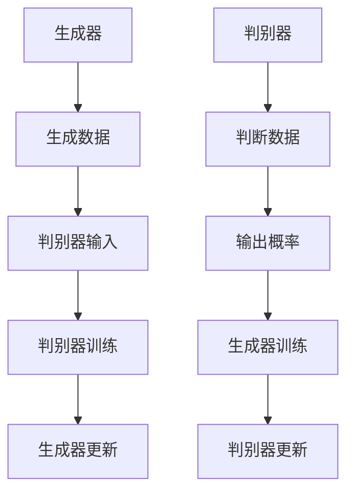

                 

### 第一部分：AI时代的创作概述

#### 第1章 AI时代的创作概述

##### 1.1 AI时代的发展背景

**1.1.1 AI技术的崛起**

人工智能（AI）作为一门学科，起源于20世纪50年代。随着计算机技术的飞速发展，AI技术逐渐成为研究的热点。尤其是近年来，深度学习等前沿技术的突破，使得AI在图像识别、自然语言处理、语音识别等领域取得了显著的成果。

**1.1.2 内容创作的变革**

内容创作一直是人类文化传承和交流的重要方式。然而，随着互联网的普及和信息技术的发展，内容创作的形式和方式也发生了巨大变革。传统的内容创作主要依赖于人类的创意和智慧，而AI的出现使得机器可以参与甚至主导内容创作，极大地拓展了创作的边界。

**1.1.3 人类与AI的协同创作**

在AI时代，人类与AI不再是简单的工具与被工具的关系，而是可以实现深度协同创作的伙伴。人类提供创意、情感和价值观，AI则提供计算能力、数据处理能力和算法支持。二者结合，可以创造出更丰富、更有创意的内容。

##### 1.2 AI内容创作的核心概念

**1.2.1 生成对抗网络（GAN）**

生成对抗网络（GAN）是AI内容创作的重要技术之一。GAN由生成器和判别器组成，通过训练生成器和判别器的对抗关系，实现数据的生成。GAN在图像生成、语音合成等方面有广泛应用。

**1.2.2 自然语言处理（NLP）**

自然语言处理（NLP）是AI的一个重要分支，涉及文本的生成、理解、翻译等。NLP技术使得机器可以理解和生成人类语言，为AI内容创作提供了基础。

**1.2.3 计算机视觉（CV）**

计算机视觉（CV）是AI的另一个重要分支，涉及图像的识别、分类、生成等。CV技术使得机器可以理解和生成视觉信息，为AI内容创作提供了视觉支持。

##### 1.3 AI内容创作的重要性

**1.3.1 提高创作效率**

AI可以自动化很多创作流程，大大提高创作的效率。例如，自动写作工具可以快速生成文章，图像生成工具可以快速生成图片，视频生成工具可以快速生成视频。

**1.3.2 拓展创作领域**

AI可以拓展人类的创作领域。例如，通过AI技术，人们可以创作出以前无法想象的内容，如超现实的图像、复杂的音乐等。

**1.3.3 增强用户体验**

AI可以更好地理解用户的需求和喜好，从而提供更个性化的内容。例如，个性化推荐系统可以根据用户的兴趣和习惯，推荐最适合他们的内容。

##### 1.4 AI内容创作的发展趋势

**1.4.1 跨领域融合**

AI内容创作的发展趋势之一是跨领域融合。例如，将图像生成技术与自然语言处理技术结合，可以生成具有丰富内容和视觉冲击力的图像和视频。

**1.4.2 智能化**

随着AI技术的发展，内容创作将越来越智能化。AI将能够更深入地理解和分析用户需求，提供更智能、更个性化的内容。

**1.4.3 个性化定制**

个性化定制是AI内容创作的重要方向。通过分析用户数据，AI可以提供量身定制的内容，满足用户的个性化需求。

##### 1.5 总结

AI时代的到来，带来了内容创作方式的变革。AI不仅可以提高创作效率，拓展创作领域，还可以提供更个性化的内容。在未来，AI与人类将实现更深度的协同创作，创造出前所未有的内容形式。这是AI时代内容创作的重要趋势和前景。

### 2. AI内容创作的技术基础

#### 第2章 AI内容创作的技术基础

##### 2.1 生成对抗网络（GAN）原理

**2.1.1 GAN的基本架构**

生成对抗网络（GAN）由生成器（Generator）和判别器（Discriminator）组成。生成器负责生成数据，判别器负责判断生成数据是否真实。二者通过对抗训练，不断优化，最终达到一个平衡状态。

**2.1.2 GAN的训练过程**

GAN的训练过程主要包括两个阶段：生成器和判别器的训练。在生成器训练阶段，生成器生成数据，判别器判断数据的真实性。在判别器训练阶段，生成器和判别器同时训练，通过对抗关系，不断优化。

**2.1.3 GAN的变体与应用**

GAN有多种变体，如深度GAN（DeepGAN）、条件GAN（cGAN）、循环GAN（Ragan）等。不同变体适用于不同的应用场景。例如，cGAN可以生成带有标签的数据，Ragan可以生成序列数据。

##### 2.2 自然语言处理（NLP）基础

**2.2.1 语言模型**

语言模型是NLP的基础，用于预测下一个单词或词组。常见的语言模型有n-gram模型、循环神经网络（RNN）模型和变换器（Transformer）模型。

**2.2.2 序列到序列模型**

序列到序列（Seq2Seq）模型是一种用于序列数据转换的模型，如机器翻译。Seq2Seq模型通过编码器和解码器，将输入序列转换为输出序列。

**2.2.3 Transformer模型**

Transformer模型是一种基于自注意力机制的模型，广泛应用于NLP任务。Transformer模型通过多头自注意力机制，可以捕捉输入序列中的长距离依赖关系。

##### 2.3 计算机视觉（CV）技术

**2.3.1 卷积神经网络（CNN）**

卷积神经网络（CNN）是CV的基础模型，用于图像分类、目标检测等任务。CNN通过卷积层、池化层和全连接层，对图像进行特征提取和分类。

**2.3.2 图像生成对抗网络（GAN）**

图像生成对抗网络（GAN）是GAN在CV领域的应用。GAN通过生成器和判别器的对抗训练，可以生成逼真的图像。

**2.3.3 目标检测与识别**

目标检测与识别是CV的重要任务，用于识别图像中的目标并定位其位置。常见的目标检测算法有R-CNN、SSD、YOLO等。

##### 2.4 多模态内容创作

**2.4.1 图文转换**

图文转换是将图像转换为文本或将文本转换为图像的技术。常见的图文转换方法有图像文本生成模型和文本图像生成模型。

**2.4.2 视频生成**

视频生成是将图像序列转换为视频的技术。常见的视频生成方法有视频生成对抗网络（VGAN）和循环视频生成模型（CycleGAN）。

**2.4.3 跨模态检索**

跨模态检索是利用图像和文本信息进行检索的技术。常见的跨模态检索方法有基于视觉的文本检索（ViT）和基于文本的视觉检索（Text-VQA）。

##### 2.5 AI内容创作的挑战与优化

**2.5.1 数据集质量与多样性**

数据集质量与多样性是AI内容创作的重要挑战。高质量、多样化的数据集可以提升模型的效果，但收集和处理这样的数据集需要大量的时间和资源。

**2.5.2 模型解释性与透明度**

模型解释性与透明度是AI内容创作的另一个挑战。用户需要了解AI是如何生成内容的，以便更好地理解和接受AI创作的内容。

**2.5.3 道德与法律问题**

道德与法律问题是AI内容创作必须考虑的。AI创作的内容可能会涉及版权、隐私等问题，需要制定相应的规范和法律。

##### 2.6 总结

AI内容创作的技术基础包括生成对抗网络（GAN）、自然语言处理（NLP）和计算机视觉（CV）等。这些技术为AI内容创作提供了强大的支持，但也面临数据集质量、模型解释性和道德法律等问题。通过不断优化和创新，AI内容创作将在未来取得更大的发展。

### 第三部分：AI内容创作应用实战

#### 第3章 AI内容创作应用实战

##### 3.1 AI驱动的内容生成

**3.1.1 文本生成**

文本生成是AI内容创作的重要应用之一。常见的文本生成模型有生成式模型和抽取式模型。生成式模型如GPT-3，可以生成连贯、有创意的文本。抽取式模型如BERT，可以从给定文本中提取关键信息，生成新的文本。

**3.1.2 图像生成**

图像生成是AI内容创作的另一个重要应用。常见的图像生成模型有生成对抗网络（GAN）和变分自编码器（VAE）。GAN可以通过对抗训练生成高质量的图像，VAE可以通过概率分布生成图像。

**3.1.3 视频生成**

视频生成是将图像序列转换为视频的技术。常见的视频生成模型有视频生成对抗网络（VGAN）和循环视频生成模型（CycleGAN）。VGAN可以通过对抗训练生成连续的图像序列，CycleGAN可以通过图像到图像的转换生成新的视频。

##### 3.2 个性化内容推荐系统

**3.2.1 推荐算法基础**

个性化内容推荐系统是AI内容创作的重要应用。推荐算法的基础是协同过滤（Collaborative Filtering）和基于内容的推荐（Content-Based Filtering）。协同过滤通过用户行为数据推荐相似用户喜欢的物品，基于内容的推荐通过物品的属性推荐用户可能喜欢的物品。

**3.2.2 个性化推荐模型**

个性化推荐模型是基于机器学习的推荐算法。常见的个性化推荐模型有矩阵分解（Matrix Factorization）、深度学习（Deep Learning）和图神经网络（Graph Neural Networks）。矩阵分解通过将用户和物品表示为低维向量，计算相似度进行推荐。深度学习通过神经网络模型捕捉用户和物品的复杂关系。图神经网络通过图结构捕捉用户和物品的交互关系。

**3.2.3 实际应用案例**

实际应用案例包括电子商务平台的商品推荐、社交媒体的帖子推荐、视频平台的视频推荐等。通过个性化推荐，平台可以提供更符合用户兴趣的内容，提高用户体验和满意度。

##### 3.3 智能交互与对话系统

**3.3.1 对话系统架构**

智能交互与对话系统是AI内容创作的重要应用。对话系统架构通常包括语音识别、自然语言理解、对话管理和语音合成。语音识别将用户的语音转换为文本，自然语言理解将文本转换为语义信息，对话管理根据语义信息生成回复，语音合成将回复转换为语音。

**3.3.2 语言理解与生成**

语言理解与生成是对话系统的核心。语言理解涉及语义分析、实体识别和意图识别。语义分析将文本转换为语义表示，实体识别识别文本中的实体，意图识别识别用户的意图。语言生成涉及模板匹配、生成式模型和抽取式模型。模板匹配根据预设的模板生成回复，生成式模型生成连贯、有创意的回复，抽取式模型从已有文本中抽取回复。

**3.3.3 实时交互案例**

实时交互案例包括智能客服、虚拟助手和智能语音助手等。通过实时交互，AI可以更好地理解用户的需求，提供个性化的服务，提高用户体验。

##### 3.4 跨领域内容创作

**3.4.1 融合图像与文本**

融合图像与文本是跨领域内容创作的重要方向。常见的融合方法有图像文本生成（Image-Text Generation）和文本图像生成（Text-to-Image Generation）。图像文本生成将图像和文本结合生成新的图像，文本图像生成将文本转换为图像。

**3.4.2 音乐与视频创作**

音乐与视频创作是跨领域内容创作的另一个重要方向。常见的创作方法有音乐生成（Music Generation）和视频生成（Video Generation）。音乐生成通过算法生成新的音乐，视频生成通过图像和视频的生成，生成新的视频。

**3.4.3 实践案例分享**

实践案例分享包括艺术创作、电影制作和游戏设计等。通过跨领域内容创作，AI可以生成独特的艺术作品、电影和游戏，拓展人类创作的边界。

##### 3.5 AI内容创作的商业应用

**3.5.1 广告与营销**

AI内容创作的商业应用包括广告与营销。AI可以生成个性化的广告内容，提高广告的效果和转化率。

**3.5.2 娱乐与游戏**

AI内容创作的商业应用还包括娱乐与游戏。AI可以生成个性化的游戏内容，提高用户体验和游戏乐趣。

**3.5.3 教育与培训**

AI内容创作的商业应用还包括教育与培训。AI可以生成个性化的教育内容，提高教学效果和学生的学习兴趣。

##### 3.6 总结

AI内容创作应用实战涵盖了文本生成、图像生成、视频生成、个性化推荐、智能交互、跨领域创作和商业应用等多个方面。通过AI技术，可以创造出丰富、多样、个性化的内容，提高用户体验和商业价值。

### 第四部分：AI内容创作的未来趋势与挑战

#### 第4章 AI内容创作的未来趋势与挑战

##### 4.1 AI内容创作的未来趋势

**4.1.1 深度学习技术的进步**

深度学习技术的进步将继续推动AI内容创作的发展。随着计算能力的提升和数据量的增加，深度学习模型将变得更加复杂和高效，可以生成更加逼真和有创意的内容。

**4.1.2 新型生成模型**

新型生成模型如生成式模型（Generative Models）和变分自编码器（Variational Autoencoders, VAEs）等将继续发展和完善。这些模型可以更有效地生成高质量的内容，拓宽AI内容创作的领域。

**4.1.3 交互式内容创作**

交互式内容创作将是未来的重要趋势。通过用户与AI的互动，AI可以实时响应用户需求，生成定制化的内容，提供更个性化和沉浸式的体验。

##### 4.2 AI内容创作的挑战

**4.2.1 技术与伦理问题**

AI内容创作的技术与伦理问题是未来需要重点关注和解决的。如何确保AI生成的内容不违反道德和法律规范，如何处理AI创作的版权问题，都是需要深入探讨的问题。

**4.2.2 内容版权与版权保护**

内容版权是AI内容创作的重要挑战。如何保护创作者的版权，防止AI生成的内容侵犯他人的版权，是亟待解决的问题。同时，如何确保AI生成的内容可以被合法地使用和传播，也需要制定相应的法律和规范。

**4.2.3 人机协同创作**

人机协同创作是AI内容创作的重要方向，但也面临着挑战。如何实现人类与AI的深度协作，使AI能够更好地理解人类的创意和需求，是一个复杂的问题。此外，如何确保AI在协同创作中不过度干预，保持人类的创作主导地位，也是需要解决的问题。

##### 4.3 AI内容创作的发展方向

**4.3.1 跨领域合作**

跨领域合作是AI内容创作的发展方向之一。通过不同领域的知识和技术融合，可以创造出更具创意和影响的内容。例如，将AI技术与艺术、设计、媒体等领域的结合，可以生成新的艺术作品和媒体内容。

**4.3.2 智能化创作工具**

智能化创作工具是AI内容创作的另一个发展方向。通过开发和优化AI创作工具，可以降低创作门槛，提高创作效率和质量。例如，智能写作助手、图像生成助手、视频编辑助手等，可以辅助创作者完成创作任务。

**4.3.3 可解释性与透明度**

可解释性与透明度是AI内容创作的重要发展方向。通过提高AI模型的解释性和透明度，用户可以更好地理解AI是如何生成内容的，增强对AI创作的信任和接受度。同时，这也有助于解决AI内容创作中的伦理和法律问题。

##### 4.4 总结

AI内容创作的未来充满机遇与挑战。随着深度学习技术的进步和新型生成模型的发展，AI内容创作将变得更加多样化和个性化。同时，技术与伦理问题、内容版权保护和人机协同创作等挑战也需要得到解决。通过跨领域合作、智能化创作工具和可解释性的提高，AI内容创作将迎来更加美好的未来。

### 附录

#### 附录 A: AI内容创作工具与资源

**A.1 主流AI框架介绍**

**A.1.1 TensorFlow**

TensorFlow是一个开源的机器学习和深度学习框架，由Google开发。它提供了丰富的API，支持多种编程语言，可以部署在各种设备上。

- 官网：[TensorFlow官网](https://www.tensorflow.org/)
- 教程：[TensorFlow教程](https://www.tensorflow.org/tutorials)

**A.1.2 PyTorch**

PyTorch是一个开源的机器学习和深度学习框架，由Facebook开发。它提供了简洁的API和动态计算图，非常适合研究和开发。

- 官网：[PyTorch官网](https://pytorch.org/)
- 教程：[PyTorch教程](https://pytorch.org/tutorials/beginner/basics/)

**A.1.3 Keras**

Keras是一个高层次的神经网络API，可以与TensorFlow和Theano等框架集成。它提供了简单易用的API，适合快速原型开发和实验。

- 官网：[Keras官网](https://keras.io/)
- 教程：[Keras教程](https://keras.io/getting-started/)

**A.1.4 其他框架概述**

除了上述框架，还有其他一些流行的AI框架，如MXNet、Caffe、Theano等。这些框架各有特点，适用于不同的应用场景。

- MXNet：[MXNet官网](https://mxnet.incubator.apache.org/)
- Caffe：[Caffe官网](http://caffe.berkeleyvision.org/)
- Theano：[Theano官网](https://www.theanocode.com/)

**A.2 内容生成工具推荐**

**A.2.1 自动写作工具**

- GPT-3：[GPT-3官网](https://openai.com/blog/better-future-gpt3/)
- ChatGPT：[ChatGPT官网](https://chat.openai.com/)
- 自动写作助手：[自动写作助手官网](https://www.automaticwritingassistant.com/)

**A.2.2 图像生成工具**

- GANPaint：[GANPaint官网](https://deepmind.com/research/open-source/ganpaint/)
- DeepArt：[DeepArt官网](https://deepart.io/)
- DALL-E：[DALL-E官网](https://openai.com/blog/dall-e/)

**A.2.3 视频生成工具**

- DeepArt：[DeepArt官网](https://deepart.io/)
- GANimation：[GANimation官网](https://www.ganimation.ai/)
- DeepVideo：[DeepVideo官网](https://deepvideo.ai/)

**A.3 实用资源与学习资料**

**A.3.1 在线课程与教程**

- fast.ai：[fast.ai官网](https://www.fast.ai/)
- Coursera：[Coursera AI课程](https://www.coursera.org/courses?query=ai)
- edX：[edX AI课程](https://www.edx.org/course/search?category=ai)

**A.3.2 论文与报告**

- arXiv：[arXiv AI论文](https://arxiv.org/list/cs.AI/new)
- NeurIPS：[NeurIPS会议论文](https://nips.cc/)
- ICML：[ICML会议论文](https://icml.cc/)

**A.3.3 社区与论坛**

- AI论坛：[AI论坛](https://www.ai-forum.com/)
- GitHub：[AI GitHub仓库](https://github.com/topics/ai)
- Stack Overflow：[AI Stack Overflow](https://stackoverflow.com/questions/tagged/artificial-intelligence)

**A.4 开发环境搭建**

**A.4.1 操作系统配置**

- Ubuntu：[Ubuntu安装教程](https://www.ubuntu.com/tutorials/install-ubuntu)
- Windows：[Windows安装教程](https://www.microsoft.com/zh-cn/windows/how-to-install-windows)

**A.4.2 编译工具安装**

- GCC：[GCC安装教程](https://gcc.gnu.org/install/)
- Make：[Make安装教程](https://www.gnu.org/software/make/manual/make.html)

**A.4.3 软件包管理与版本控制**

- pip：[pip安装教程](https://pip.pypa.io/en/stable/installing/)
- conda：[conda安装教程](https://docs.conda.io/en/latest/install/)
- Git：[Git安装教程](https://git-scm.com/book/zh/v2/%E5%85%A5%E9%97%A8-%E5%AE%89%E8%A3%85-Git)

**A.5 AI内容创作案例精选**

**A.5.1 文本生成案例**

- 自动写作工具生成新闻文章。
- 自动写作助手生成营销文案。

**A.5.2 图像生成案例**

- GANPaint生成艺术画作。
- DeepArt生成肖像画作。

**A.5.3 视频生成案例**

- GANimation生成动画视频。
- DeepVideo生成视频特效。

**A.6 总结**

通过上述工具和资源，开发者可以轻松搭建AI内容创作环境，学习相关技术和知识，并进行实践和探索。附录部分提供了丰富的学习资源和案例，帮助开发者更好地了解和掌握AI内容创作。

