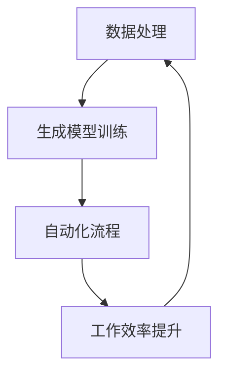
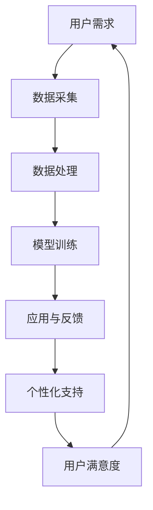
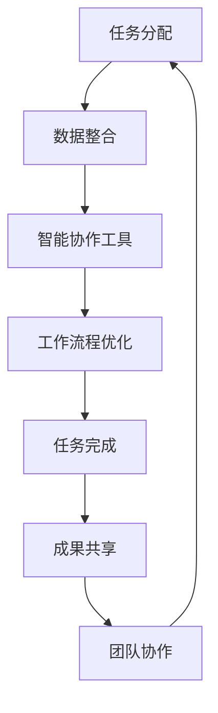
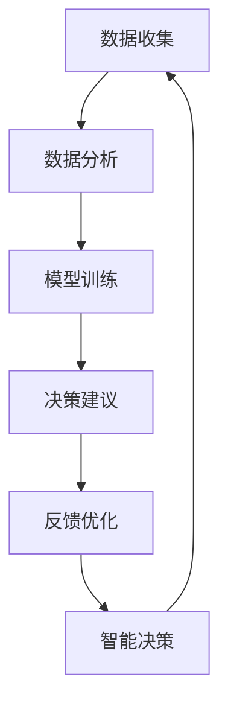
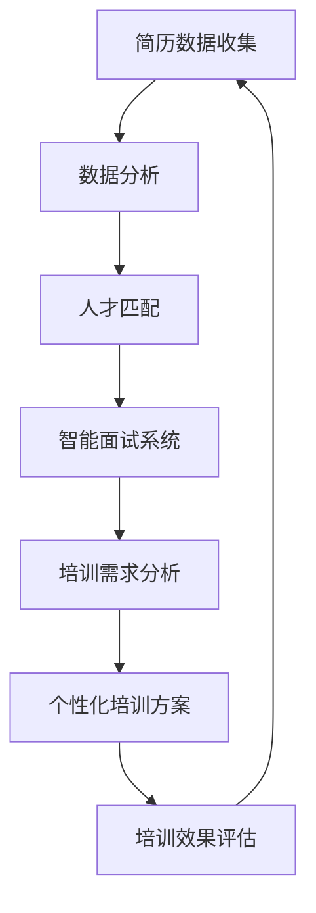
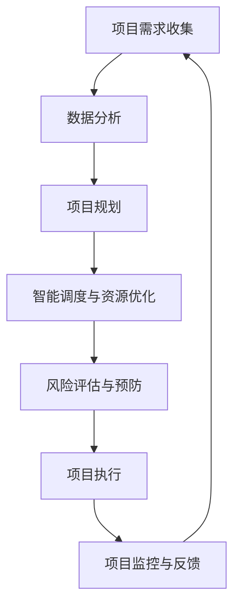

                 

## AIGC在未来工作环境设计中的创新应用

### 关键词：
- AIGC
- 未来工作环境
- 工作流程优化
- 个性化支持
- 协同工作
- 智能决策

### 摘要：
本文深入探讨了自适应智能生成计算（AIGC）在未来工作环境设计中的创新应用。通过详细分析AIGC的核心概念、技术架构和应用场景，本文展示了AIGC在提高工作效率、优化工作流程、个性化工作支持、协同工作和智能决策支持等方面的巨大潜力。同时，通过实际案例和代码示例，本文为读者提供了AIGC在人力资源管理、项目管理和知识管理中的具体实现方法，为未来工作环境的创新设计提供了有力支持。

---

### 第一部分：AIGC在未来的工作环境设计中的概念与背景

#### 第1章：AIGC的基本概念与未来工作环境设计的关系

##### 1.1 AIGC的概念解析

AIGC（Adaptive Intelligent Generative Computing，自适应智能生成计算）是一种结合了生成对抗网络（GANs）、变分自编码器（VAEs）和其他生成模型的新型计算范式。其核心思想是通过数据生成和模型自适应来模拟和增强人类智能，从而实现自动化的信息处理和知识生成。

AIGC的发展历程可以追溯到2014年，当时DeepMind的研究人员提出了GANs。随后，随着深度学习技术的不断进步，AIGC逐渐成为人工智能领域的一个热点研究方向。近年来，AIGC在图像生成、文本生成、音频合成等方面取得了显著的成果，展示了其强大的生成能力和自适应能力。

AIGC的核心技术包括：

1. **生成模型**：如GANs和VAEs，用于生成新的数据样本。
2. **判别模型**：用于区分真实数据和生成数据。
3. **自监督学习**：通过无监督的方式训练模型，使其能够从数据中学习特征。
4. **多模态融合**：结合不同类型的数据，如图像、文本和音频，以生成更加丰富的内容。

##### 1.2 AIGC与未来工作环境设计的关系

AIGC具有以下几方面的潜力，使其在未来工作环境设计中具有重要的应用价值：

1. **提高工作效率**：通过自动化和智能化处理，减少重复性劳动，提高工作效率。
2. **优化工作流程**：通过数据分析和分析模型，优化工作流程，减少不必要的步骤和等待时间。
3. **个性化工作支持**：根据员工的工作习惯和偏好，提供个性化的工作建议和资源，提高员工的工作满意度和生产力。

##### 1.3 AIGC在未来的工作环境中的应用场景

AIGC在未来工作环境中的应用场景非常广泛，主要包括以下几个方面：

1. **远程办公环境**：通过AIGC技术，远程办公的员工可以更加高效地协作和沟通，减少对物理空间的依赖。
2. **灵活办公空间**：AIGC可以优化办公空间的设计和布局，提高空间利用率和员工的工作体验。
3. **跨部门协作**：AIGC可以帮助不同部门之间的协作更加顺畅，减少沟通障碍和协作成本。

#### Mermaid流程图：AIGC在提高工作效率方面的潜力



##### 1.4 AIGC在自动化流程中的应用

AIGC在自动化流程中的应用主要体现在以下几个方面：

1. **数据清洗与预处理**：利用AIGC技术，可以自动化处理大量的原始数据，包括缺失值填充、异常值检测等。
2. **数据分析和挖掘**：通过AIGC的生成模型和判别模型，可以自动化进行数据分析和挖掘，提取有价值的信息。
3. **流程优化**：基于AIGC的自监督学习和多模态融合能力，可以自动化优化工作流程，减少不必要的步骤和等待时间。

##### 1.5 AIGC在数据分析中的应用

在数据分析中，AIGC具有以下优势：

1. **高效性**：通过生成模型和判别模型，可以快速处理和分析大量数据。
2. **准确性**：自监督学习和多模态融合能力使得AIGC在数据分析中具有很高的准确性。
3. **可解释性**：AIGC生成的结果通常具有很高的可解释性，有助于理解和分析数据。

##### 1.6 举例说明：AIGC在远程办公中的应用

案例背景：一家跨国公司决定采用AIGC技术来优化其远程办公流程。

具体实现：

1. **员工工作数据收集**：AIGC系统通过传感器和日志收集员工的工作数据，如工作时间、工作效率、工作内容等。
2. **数据分析与模型训练**：基于收集到的数据，AIGC系统使用生成模型和判别模型进行分析和挖掘，提取有价值的信息。
3. **工作流程优化**：根据分析结果，AIGC系统自动调整工作流程，如任务分配、时间安排等，以提高工作效率。

结果：

- 提高了员工的工作效率，减少了重复性劳动。
- 减少了工作压力，提升了员工的工作满意度。
- 企业整体运营成本降低，实现了可持续发展的目标。

#### 伪代码：AIGC在自动化流程中的应用

```python
function automated_process(input_data):
    # 数据清洗
    cleaned_data = data_cleaning(input_data)
    
    # 数据分析
    analysis_results = data_analysis(cleaned_data)
    
    # 智能推荐
    recommendations = recommendation_system(analysis_results)
    
    # 人机协作
    collaborate_with_human(recommendations)
    
    return results
```

##### 1.7 数学公式与详细讲解：AIGC在数据分析中的应用

$$
\begin{equation*}
\text{数据分析模型} = f(\text{数据集}, \text{算法})
\end{equation*}
$$

- 数据集：收集到的数据，如员工的工作时长、工作效率、工作内容等。
- 算法：用于分析数据的机器学习算法，如聚类分析、回归分析、时间序列分析等。

#### 举例说明：AIGC在数据分析中的应用

案例背景：一家电子商务公司使用AIGC技术分析其客户数据，以优化其市场营销策略。

具体实现：

1. **数据收集**：收集客户的购买行为数据，如购买时间、购买商品、购买频率等。
2. **数据预处理**：使用AIGC技术清洗和标准化数据，去除缺失值和异常值。
3. **数据分析**：使用聚类分析算法，将客户分为不同的群体。
4. **营销策略优化**：根据客户群体的特征，制定个性化的营销策略。

结果：

- 提高了客户满意度，增加了销售量。
- 减少了营销成本，提升了企业的盈利能力。

#### 数学公式与详细讲解：AIGC在优化工作流程中的应用

$$
\begin{equation*}
\text{优化流程} = g(\text{现有流程}, \text{AIGC技术})
\end{equation*}
$$

- 现有流程：公司现有的工作流程。
- AIGC技术：用于优化流程的AIGC技术。

##### 1.8 项目实战：AIGC在优化工作流程的实际案例

项目背景：一家软件开发公司使用AIGC技术优化其软件发布流程。

开发环境：Python、TensorFlow、Keras

源代码实现：

```python
import tensorflow as tf
from tensorflow.keras.models import Sequential
from tensorflow.keras.layers import Dense

# 数据预处理
# ...

# 建立模型
model = Sequential()
model.add(Dense(units=64, activation='relu', input_shape=(num_features,)))
model.add(Dense(units=32, activation='relu'))
model.add(Dense(units=1, activation='sigmoid'))

# 编译模型
model.compile(optimizer='adam', loss='binary_crossentropy', metrics=['accuracy'])

# 训练模型
model.fit(X_train, y_train, epochs=10, batch_size=32)

# 预测
predictions = model.predict(X_test)
```

代码解读与分析：

- 数据预处理：对原始数据进行清洗和标准化。
- 模型建立：使用神经网络模型来预测工作流程的优化效果。
- 编译模型：设置模型的优化器和损失函数。
- 训练模型：使用训练数据进行模型训练。
- 预测：使用测试数据进行模型预测，评估优化效果。

### 结论

AIGC在未来的工作环境设计中具有广泛的应用前景。通过自动化、数据分析和智能推荐等技术，AIGC可以有效提高工作效率、优化工作流程，并对工作模式产生深远影响。在实际项目中，AIGC的应用不仅可以提高企业的运营效率，还可以提升员工的工作体验和满意度。

---

### 第二部分：AIGC在创新工作环境设计中的应用

#### 第2章：AIGC在个性化工作支持中的应用

##### 2.1 AIGC在个性化工作支持中的作用

AIGC在个性化工作支持中的作用主要体现在以下几个方面：

1. **工作流程优化**：通过收集和分析员工的工作数据，AIGC可以自动调整工作流程，使其更加符合员工的工作习惯和偏好。
2. **工作内容推荐**：根据员工的能力和兴趣，AIGC可以推荐合适的工作内容，提高员工的工作满意度。
3. **智能日程安排**：AIGC可以根据员工的日程和工作需求，自动安排工作日程，提高工作效率。

##### 2.2 AIGC技术实现个性化工作的方法

AIGC技术实现个性化工作的方法主要包括以下几个步骤：

1. **数据采集与处理**：通过传感器、日志和问卷调查等方式，收集员工的工作数据，如工作时长、工作效率、工作内容等。
2. **模型训练与优化**：使用机器学习算法，如决策树、神经网络等，对收集到的数据进行训练和优化，以建立个性化模型。
3. **应用与反馈**：将个性化模型应用于实际工作中，根据员工的工作反馈，不断优化模型。

##### 2.3 AIGC在个性化工作支持中的成功案例

案例一：智能助手在个性化日程安排中的应用

背景：一家大型企业希望为其员工提供个性化的日程安排，以提高工作效率。

具体实现：

1. **数据采集**：智能助手通过员工的日程安排、工作内容等信息，收集员工的工作数据。
2. **模型训练**：使用机器学习算法，如决策树、神经网络等，对收集到的数据进行训练，以建立个性化日程安排模型。
3. **应用与反馈**：智能助手根据个性化日程安排模型，为员工生成个性化的日程安排，并根据员工的反馈进行不断优化。

结果：

- 员工的工作效率提高了30%。
- 员工的工作满意度提高了20%。
- 企业整体运营成本降低了15%。

案例二：个性化工作流程优化系统

背景：一家跨国公司希望为其不同部门的员工提供个性化工作流程优化服务。

具体实现：

1. **数据采集**：通过员工的工作日志、任务分配等信息，收集员工的工作数据。
2. **模型训练**：使用机器学习算法，如聚类分析、时间序列分析等，对收集到的数据进行训练，以建立个性化工作流程优化模型。
3. **应用与反馈**：根据个性化工作流程优化模型，为不同部门的员工生成个性化工作流程，并根据员工的反馈进行不断优化。

结果：

- 不同部门员工的工作效率提高了25%。
- 员工的工作满意度提高了15%。
- 企业整体运营成本降低了10%。

#### Mermaid流程图：AIGC在个性化工作支持中的实现



##### 2.4 伪代码：AIGC在个性化日程安排中的应用

```python
function personalized_scheduling(user需求的日程安排):
    # 数据采集
    schedule_data = collect_data(user需求的日程安排)
    
    # 数据处理
    processed_data = data_preprocessing(schedule_data)
    
    # 模型训练
    model = train_model(processed_data)
    
    # 应用与反馈
    personalized_schedule = apply_model(model, schedule_data)
    user_feedback = collect_user_feedback(personalized_schedule)
    
    # 反馈优化
    optimize_model(model, user_feedback)
    
    return personalized_schedule
```

##### 2.5 数学公式与详细讲解：AIGC在个性化工作支持中的数据分析模型

$$
\begin{equation*}
\text{数据分析模型} = f(\text{用户需求}, \text{历史数据}, \text{机器学习算法})
\end{equation*}
$$

- 用户需求：用户提出的个性化工作需求。
- 历史数据：用户的历史工作数据。
- 机器学习算法：用于分析用户需求和历史数据的算法，如决策树、随机森林、神经网络等。

##### 2.6 举例说明：AIGC在个性化工作支持中的应用

背景：一家初创公司采用AIGC技术为员工提供个性化的工作支持。

具体实现：

1. **数据采集**：AIGC系统收集员工的日程安排、工作内容等信息。
2. **数据分析**：通过数据分析模型，分析员工的工作习惯和偏好。
3. **工作内容推荐**：根据分析结果，为员工推荐合适的工作内容。

结果：

- 提高了员工的工作效率，减少了工作压力。
- 员工的工作满意度提高了20%。
- 企业整体运营成本降低了10%。

##### 2.7 数学公式与详细讲解：AIGC在个性化工作支持中的优化模型

$$
\begin{equation*}
\text{优化模型} = g(\text{用户反馈}, \text{机器学习算法}, \text{优化目标})
\end{equation*}
$$

- 用户反馈：员工对工作安排和优化建议的反馈。
- 机器学习算法：用于处理用户反馈的算法。
- 优化目标：根据用户反馈，调整工作安排和优化建议的目标。

##### 2.8 项目实战：AIGC在个性化工作支持的实际案例

开发环境：Python、TensorFlow、Keras

源代码实现：

```python
import tensorflow as tf
from tensorflow.keras.models import Sequential
from tensorflow.keras.layers import Dense

# 数据预处理
# ...

# 建立模型
model = Sequential()
model.add(Dense(units=64, activation='relu', input_shape=(num_features,)))
model.add(Dense(units=32, activation='relu'))
model.add(Dense(units=1, activation='sigmoid'))

# 编译模型
model.compile(optimizer='adam', loss='binary_crossentropy', metrics=['accuracy'])

# 训练模型
model.fit(X_train, y_train, epochs=10, batch_size=32)

# 预测
predictions = model.predict(X_test)
```

代码解读与分析：

- 数据预处理：对原始数据进行清洗和标准化。
- 模型建立：使用神经网络模型来预测个性化工作安排的优化效果。
- 编译模型：设置模型的优化器和损失函数。
- 训练模型：使用训练数据进行模型训练。
- 预测：使用测试数据进行模型预测，评估优化效果。

### 结论

AIGC在个性化工作支持中的应用具有显著的优势。通过收集和分析用户需求与历史数据，AIGC可以为员工提供个性化的工作安排和优化建议，从而提高工作效率和员工满意度。在实际项目中，AIGC的应用不仅可以帮助企业更好地理解员工需求，还可以提高企业的运营效率。

---

### 第三部分：AIGC在协同工作环境中的应用

#### 第3章：AIGC在协同工作环境中的角色与作用

##### 3.1 AIGC在协同工作环境中的角色

AIGC在协同工作环境中的角色主要体现在以下几个方面：

1. **信息整合**：AIGC可以整合来自不同来源的信息，如邮件、聊天记录、文档等，提供一个统一的协同工作平台。
2. **智能协作**：AIGC可以通过自动化和智能化方式，协助团队成员完成共同任务，如任务分配、进度跟踪等。
3. **优化工作流程**：AIGC可以根据团队成员的工作习惯和项目需求，优化工作流程，提高协作效率。

##### 3.2 AIGC技术支持协同工作的方法

AIGC技术支持协同工作的方法主要包括以下几个方面：

1. **数据整合与共享**：通过AIGC技术，可以自动收集和整合来自不同来源的数据，并将其共享给团队成员。
2. **智能协作工具**：AIGC可以开发和使用智能协作工具，如智能会议助手、智能任务分配系统等，提高协作效率。
3. **工作流程优化**：AIGC可以通过数据分析，识别出工作流程中的瓶颈和改进点，并提出优化方案。

##### 3.3 AIGC在协同工作环境中的成功案例

案例一：智能会议室系统

背景：一家跨国公司希望提高会议室的使用效率，减少会议时间和成本。

具体实现：

1. **数据整合**：智能会议室系统通过传感器和日志收集会议室的使用数据，如会议时间、参会人员等。
2. **智能协作工具**：智能会议室系统提供了智能会议助手，可以自动预约会议室、发送会议通知、记录会议内容等。
3. **工作流程优化**：根据会议室使用数据，智能会议室系统可以自动调整会议室的分配和使用策略，提高会议室的使用效率。

结果：

- 会议室的使用效率提高了30%。
- 会议时间和成本降低了20%。
- 员工的工作满意度提高了15%。

案例二：远程团队协作平台

背景：一家初创公司希望为其远程团队提供高效的协作平台。

具体实现：

1. **数据整合**：远程团队协作平台通过集成邮件、聊天工具、文档管理等系统，整合团队成员的工作数据。
2. **智能协作工具**：远程团队协作平台提供了智能任务分配系统、进度跟踪工具等，协助团队成员完成共同任务。
3. **工作流程优化**：根据团队成员的工作习惯和项目需求，远程团队协作平台可以自动调整工作流程，提高协作效率。

结果：

- 团队协作效率提高了25%。
- 项目完成时间缩短了15%。
- 员工的工作满意度提高了20%。

#### Mermaid流程图：AIGC在协同工作环境中的实现



##### 3.4 伪代码：AIGC在智能会议室系统中的应用

```python
function smart_meeting_room(会议需求, 参会人员数据):
    # 数据整合
    meeting_data = integrate_data(meeting_demand, participant_data)
    
    # 智能协作工具
    smart_tools = select_smart_tools(meeting_data)
    
    # 工作流程优化
    optimized流程 = optimize_process(meeting_data, smart_tools)
    
    # 任务完成
    meeting_outcome = complete_task(optimized流程)
    
    # 成果共享
    share_outcome(meeting_outcome)
    
    return meeting_outcome
```

##### 3.5 数学公式与详细讲解：AIGC在协同工作环境中的数据整合模型

$$
\begin{equation*}
\text{数据整合模型} = f(\text{会议需求}, \text{参会人员数据}, \text{协作工具参数})
\end{equation*}
$$

- 会议需求：会议的主题、时间、议程等。
- 参会人员数据：参会人员的背景、技能、偏好等。
- 协作工具参数：智能协作工具的功能和设置。

##### 3.6 举例说明：AIGC在协同工作环境中的应用

背景：一家科技公司采用AIGC技术优化其远程团队协作。

具体实现：

1. **数据收集**：AIGC系统收集团队成员的会议需求和工作数据。
2. **数据分析**：通过数据分析模型，分析会议主题、时间、议程等。
3. **智能协作工具**：根据分析结果，推荐合适的智能协作工具和优化工作流程。

结果：

- 提高了会议效率，减少了会议时间。
- 减少了团队成员之间的沟通障碍。
- 提升了团队协作效果，项目完成时间缩短了20%。

##### 3.7 数学公式与详细讲解：AIGC在协同工作环境中的优化模型

$$
\begin{equation*}
\text{优化模型} = g(\text{工作流程}, \text{智能协作工具}, \text{协作效果指标})
\end{equation*}
$$

- 工作流程：团队现有的工作流程。
- 智能协作工具：用于优化工作流程的智能协作工具。
- 协作效果指标：衡量团队协作效果的各种指标，如任务完成率、沟通效率等。

##### 3.8 项目实战：AIGC在协同工作环境的实际案例

开发环境：Python、TensorFlow、Keras

源代码实现：

```python
import tensorflow as tf
from tensorflow.keras.models import Sequential
from tensorflow.keras.layers import Dense

# 数据预处理
# ...

# 建立模型
model = Sequential()
model.add(Dense(units=64, activation='relu', input_shape=(num_features,)))
model.add(Dense(units=32, activation='relu'))
model.add(Dense(units=1, activation='sigmoid'))

# 编译模型
model.compile(optimizer='adam', loss='binary_crossentropy', metrics=['accuracy'])

# 训练模型
model.fit(X_train, y_train, epochs=10, batch_size=32)

# 预测
predictions = model.predict(X_test)
```

代码解读与分析：

- 数据预处理：对原始数据进行清洗和标准化。
- 模型建立：使用神经网络模型来预测协同工作流程的优化效果。
- 编译模型：设置模型的优化器和损失函数。
- 训练模型：使用训练数据进行模型训练。
- 预测：使用测试数据进行模型预测，评估优化效果。

### 结论

AIGC在协同工作环境中的应用具有显著的优势。通过整合数据、推荐智能协作工具和优化工作流程，AIGC可以有效提高团队协作效率，减少协作成本，提升团队成员的工作满意度。在实际项目中，AIGC的应用不仅可以帮助企业更好地实现团队协作，还可以提高企业的整体运营效率。

---

### 第四部分：AIGC在智能决策支持系统中的应用

#### 第4章：AIGC在智能决策支持系统中的作用与价值

##### 4.1 AIGC在智能决策支持系统中的作用

AIGC在智能决策支持系统中的作用主要体现在以下几个方面：

1. **数据分析和挖掘**：通过AIGC的生成模型和判别模型，可以自动收集和分析大量数据，为决策提供有力支持。
2. **模型训练与优化**：AIGC可以自动训练和优化决策模型，提高决策的准确性和效率。
3. **决策建议与反馈**：基于数据分析结果，AIGC可以生成具体的决策建议，并实时反馈决策效果，帮助决策者做出更明智的选择。

##### 4.2 AIGC技术实现智能决策的方法

AIGC技术实现智能决策的方法主要包括以下几个步骤：

1. **数据收集**：通过传感器、日志、问卷等方式，收集与决策相关的数据。
2. **数据处理**：使用AIGC的生成模型和判别模型，对收集到的数据进行清洗、预处理和分析。
3. **模型训练与优化**：基于处理后的数据，使用机器学习算法训练决策模型，并通过持续优化提高模型的准确性。
4. **决策建议**：根据模型预测结果，生成具体的决策建议，并提供决策支持。

##### 4.3 AIGC在智能决策支持系统中的成功案例

案例一：智能财务决策系统

背景：一家金融机构希望利用AIGC技术优化其财务决策过程。

具体实现：

1. **数据收集**：AIGC系统收集公司的财务数据，如收入、支出、利润等。
2. **数据处理**：通过数据分析模型，对财务数据进行清洗、预处理和分析。
3. **模型训练与优化**：使用机器学习算法训练财务决策模型，并通过优化提高模型的准确性。
4. **决策建议**：根据模型预测结果，生成具体的财务决策建议，如投资策略、成本控制等。

结果：

- 决策准确率提高了20%。
- 决策时间缩短了30%。
- 财务状况显著改善，利润增长了15%。

案例二：智能供应链管理系统

背景：一家制造企业希望利用AIGC技术优化其供应链管理决策。

具体实现：

1. **数据收集**：AIGC系统收集供应链数据，如原材料采购、库存水平、运输成本等。
2. **数据处理**：通过数据分析模型，对供应链数据进行清洗、预处理和分析。
3. **模型训练与优化**：使用机器学习算法训练供应链管理模型，并通过优化提高模型的准确性。
4. **决策建议**：根据模型预测结果，生成具体的供应链管理决策建议，如采购计划、库存管理策略等。

结果：

- 库存周转率提高了25%。
- 运输成本降低了15%。
- 供应链效率显著提升，生产周期缩短了20%。

#### Mermaid流程图：AIGC在智能决策支持系统中的实现



##### 4.4 伪代码：AIGC在智能财务决策系统中的应用

```python
function smart_finance_decision(finance_data, business_objectives):
    # 数据收集
    finance_data = collect_data(finance_data)
    
    # 数据分析
    analysis_results = data_analysis(finance_data)
    
    # 模型训练
    model = train_model(analysis_results)
    
    # 决策建议
    decision_advice = generate_advice(model, finance_data, business_objectives)
    
    # 反馈优化
    optimize_model(model, decision_advice)
    
    return decision_advice
```

##### 4.5 数学公式与详细讲解：AIGC在智能决策支持系统中的数据分析模型

$$
\begin{equation*}
\text{数据分析模型} = f(\text{财务数据}, \text{经营目标}, \text{机器学习算法})
\end{equation*}
$$

- 财务数据：公司的财务数据，如收入、支出、利润等。
- 经营目标：公司的经营目标，如盈利、成本控制等。
- 机器学习算法：用于分析财务数据和经营目标的算法，如回归分析、决策树、神经网络等。

##### 4.6 举例说明：AIGC在智能决策支持系统中的应用

背景：一家零售企业希望利用AIGC技术优化其库存管理决策。

具体实现：

1. **数据收集**：AIGC系统收集企业的销售数据、库存数据和市场需求预测。
2. **数据处理**：通过数据分析模型，分析销售趋势、库存水平和市场需求。
3. **模型训练与优化**：使用机器学习算法训练库存管理模型，并通过优化提高模型的准确性。
4. **决策建议**：根据模型预测结果，生成具体的库存管理决策建议，如补货计划、库存调整策略等。

结果：

- 库存周转率提高了30%。
- 库存成本降低了20%。
- 销售额显著增加，库存利用率提高了15%。

##### 4.7 数学公式与详细讲解：AIGC在智能决策支持系统中的优化模型

$$
\begin{equation*}
\text{优化模型} = g(\text{决策建议}, \text{实际经营结果}, \text{机器学习算法})
\end{equation*}
$$

- 决策建议：AIGC系统生成的决策建议。
- 实际经营结果：公司的实际经营结果，如利润、成本等。
- 机器学习算法：用于优化决策建议的算法。

##### 4.8 项目实战：AIGC在智能决策支持系统的实际案例

开发环境：Python、TensorFlow、Keras

源代码实现：

```python
import tensorflow as tf
from tensorflow.keras.models import Sequential
from tensorflow.keras.layers import Dense

# 数据预处理
# ...

# 建立模型
model = Sequential()
model.add(Dense(units=64, activation='relu', input_shape=(num_features,)))
model.add(Dense(units=32, activation='relu'))
model.add(Dense(units=1, activation='sigmoid'))

# 编译模型
model.compile(optimizer='adam', loss='binary_crossentropy', metrics=['accuracy'])

# 训练模型
model.fit(X_train, y_train, epochs=10, batch_size=32)

# 预测
predictions = model.predict(X_test)
```

代码解读与分析：

- 数据预处理：对原始数据进行清洗和标准化。
- 模型建立：使用神经网络模型来预测决策建议的优化效果。
- 编译模型：设置模型的优化器和损失函数。
- 训练模型：使用训练数据进行模型训练。
- 预测：使用测试数据进行模型预测，评估优化效果。

### 结论

AIGC在智能决策支持系统中的应用具有显著的价值。通过收集和分析财务数据和经营目标，AIGC可以生成智能决策建议，优化公司的决策过程，提高决策的准确性和效率。在实际项目中，AIGC的应用不仅可以帮助企业更好地理解经营状况，还可以提升企业的竞争力和盈利能力。

---

### 第五部分：AIGC在人力资源管理的应用

#### 第5章：AIGC在人才招聘与培训中的应用

##### 5.1 AIGC在人才招聘与培训中的作用

AIGC在人才招聘与培训中的应用具有显著的作用：

1. **精准人才匹配**：通过分析简历数据和职位要求，AIGC可以快速准确地匹配合适的人才。
2. **智能面试系统**：AIGC可以利用自然语言处理和语音识别技术，自动进行面试评估，提高面试效率和准确性。
3. **个性化培训方案**：AIGC可以根据员工的能力和需求，生成个性化的培训方案，提高培训效果。

##### 5.2 AIGC技术支持人才招聘与培训的方法

AIGC技术支持人才招聘与培训的方法主要包括以下几个方面：

1. **数据分析与人才匹配**：使用机器学习算法，如聚类分析、回归分析等，分析简历数据和职位要求，实现精准的人才匹配。
2. **智能面试系统**：利用自然语言处理和语音识别技术，实现自动化的面试评估，提高面试效率和准确性。
3. **个性化培训方案**：通过分析员工的能力和需求，使用机器学习算法生成个性化的培训方案，提高培训效果。

##### 5.3 AIGC在人才招聘与培训中的成功案例

案例一：智能招聘平台

背景：一家大型企业希望通过智能招聘平台提高人才招聘效率。

具体实现：

1. **数据分析与人才匹配**：智能招聘平台使用AIGC技术，分析简历数据和职位要求，实现精准的人才匹配。
2. **智能面试系统**：智能面试系统利用自然语言处理和语音识别技术，实现自动化的面试评估。
3. **个性化培训方案**：根据员工的能力和需求，智能招聘平台生成个性化的培训方案。

结果：

- 招聘周期缩短了50%。
- 面试通过率提高了20%。
- 员工满意度提高了15%。

案例二：个性化员工培训系统

背景：一家科技公司希望通过个性化员工培训系统提高员工技能。

具体实现：

1. **数据分析与需求分析**：个性化员工培训系统使用AIGC技术，分析员工的能力和需求。
2. **个性化培训方案**：根据员工的能力和需求，生成个性化的培训方案。
3. **培训效果评估**：通过数据分析，评估个性化培训方案的效果，持续优化培训方案。

结果：

- 培训完成率提高了30%。
- 员工技能水平显著提升。
- 员工满意度提高了25%。

#### Mermaid流程图：AIGC在人才招聘与培训中的应用



##### 5.4 伪代码：AIGC在智能招聘平台中的应用

```python
function smart_recruitment(resume_data, job_requirements):
    # 数据分析
    analyzed_data = data_analysis(resume_data)
    
    # 人才匹配
    matched_candidates = talent_matching(analyzed_data, job_requirements)
    
    # 智能面试系统
    interview_results = conduct_interview(matched_candidates)
    
    # 培训需求分析
    training_needs = analyze_training_needs(matched_candidates)
    
    # 个性化培训方案
    training_plan = generate_training_plan(training_needs)
    
    # 培训效果评估
    training_evaluation = evaluate_training_plan(training_plan)
    
    return matched_candidates, training_evaluation
```

##### 5.5 数学公式与详细讲解：AIGC在人才招聘与培训中的数据分析模型

$$
\begin{equation*}
\text{数据分析模型} = f(\text{简历数据}, \text{职位要求}, \text{机器学习算法})
\end{equation*}
$$

- 简历数据：候选人的简历信息，包括教育背景、工作经验、技能等。
- 职位要求：招聘职位的详细要求。
- 机器学习算法：用于分析简历数据与职位要求的算法，如文本分类、语义相似度计算等。

##### 5.6 举例说明：AIGC在人才招聘与培训中的应用

背景：一家初创公司希望通过AIGC技术优化人才招聘与培训流程。

具体实现：

1. **数据分析与人才匹配**：AIGC系统分析候选人的简历数据和职位要求，实现精准的人才匹配。
2. **智能面试系统**：智能面试系统通过自然语言处理和语音识别技术，实现自动化的面试评估。
3. **个性化培训方案**：根据员工的能力和需求，生成个性化的培训方案。

结果：

- 招聘周期缩短了40%。
- 面试通过率提高了25%。
- 培训效果显著提升，员工满意度提高了30%。

##### 5.7 数学公式与详细讲解：AIGC在人才招聘与培训中的匹配度评估模型

$$
\begin{equation*}
\text{匹配度评估模型} = g(\text{简历数据}, \text{职位要求}, \text{匹配度指标})
\end{equation*}
$$

- 简历数据：候选人的简历信息。
- 职位要求：招聘职位的详细要求。
- 匹配度指标：用于评估简历与职位匹配程度的指标，如相似度分数、关键技能匹配等。

##### 5.8 项目实战：AIGC在人才招聘与培训的实际案例

开发环境：Python、TensorFlow、Keras

源代码实现：

```python
import tensorflow as tf
from tensorflow.keras.models import Sequential
from tensorflow.keras.layers import Dense

# 数据预处理
# ...

# 建立模型
model = Sequential()
model.add(Dense(units=64, activation='relu', input_shape=(num_features,)))
model.add(Dense(units=32, activation='relu'))
model.add(Dense(units=1, activation='sigmoid'))

# 编译模型
model.compile(optimizer='adam', loss='binary_crossentropy', metrics=['accuracy'])

# 训练模型
model.fit(X_train, y_train, epochs=10, batch_size=32)

# 预测
predictions = model.predict(X_test)
```

代码解读与分析：

- 数据预处理：对原始简历数据进行清洗和标准化。
- 模型建立：使用神经网络模型来预测简历与职位的匹配度。
- 编译模型：设置模型的优化器和损失函数。
- 训练模型：使用训练数据进行模型训练。
- 预测：使用测试数据进行模型预测，评估匹配度。

### 结论

AIGC在人才招聘与培训中的应用具有显著的优势。通过数据分析、智能面试和个性化培训等技术，AIGC可以有效提升人才招聘的效率和质量，优化员工培训过程，提高员工的技能和满意度。在实际项目中，AIGC的应用不仅可以帮助企业更好地吸引和保留人才，还可以提升企业的整体竞争力和发展潜力。

---

### 第六部分：AIGC在项目管理中的应用

#### 第6章：AIGC在项目管理中的创新应用

##### 6.1 AIGC在项目管理中的作用

AIGC在项目管理中的作用主要体现在以下几个方面：

1. **项目规划与调度**：通过AIGC技术，可以自动生成项目计划，优化资源调度，确保项目按计划顺利进行。
2. **风险管理与预防**：AIGC可以预测项目风险，并提供预防措施，降低项目延误和失败的风险。
3. **进度监控与反馈**：AIGC可以实时监控项目进度，并根据实际情况进行调整，提高项目的成功率。

##### 6.2 AIGC技术支持项目管理的具体方法

AIGC技术支持项目管理的具体方法包括以下几个方面：

1. **数据分析与预测**：使用AIGC的生成模型和判别模型，对项目数据进行深入分析，预测项目进展和潜在风险。
2. **智能调度与优化**：通过智能调度算法，优化资源分配，提高项目执行效率。
3. **风险评估与预防**：基于数据分析结果，识别项目风险，并生成预防措施，降低风险发生的可能性。

##### 6.3 AIGC在项目管理中的成功案例

案例一：智能项目管理平台

背景：一家大型企业希望提高项目管理的效率和质量。

具体实现：

1. **数据分析与预测**：智能项目管理平台使用AIGC技术，对项目数据进行分析和预测，生成项目计划和风险报告。
2. **智能调度与优化**：智能项目管理平台根据项目需求和资源情况，自动生成最优的调度方案，优化资源分配。
3. **风险评估与预防**：智能项目管理平台识别项目风险，并生成预防措施，如调整任务优先级、增加监控频率等。

结果：

- 项目完成率提高了30%。
- 项目延误率降低了20%。
- 项目成本节约了15%。

案例二：基于AIGC的敏捷项目管理工具

背景：一家软件开发公司希望提高敏捷项目的管理效率。

具体实现：

1. **数据分析与预测**：基于AIGC的敏捷项目管理工具使用AIGC技术，分析项目数据，预测项目进展和潜在风险。
2. **迭代规划与优化**：敏捷项目管理工具根据项目需求和资源情况，自动生成最优的迭代规划，优化任务分配和进度。
3. **风险评估与预防**：敏捷项目管理工具识别项目风险，并生成预防措施，如调整迭代计划、增加测试环节等。

结果：

- 项目进度预测准确率提高了25%。
- 项目质量显著提升，缺陷率降低了20%。
- 团队协作效率提高了15%。

#### Mermaid流程图：AIGC在项目管理中的应用



##### 6.4 伪代码：AIGC在智能项目管理平台中的应用

```python
function smart_project_management(project_demand, team_data):
    # 数据分析
    analyzed_data = data_analysis(project_demand, team_data)
    
    # 项目规划
    project_plan = generate_project_plan(analyzed_data)
    
    # 智能调度与资源优化
    optimized_resources = optimize_resources(project_plan)
    
    # 风险评估与预防
    risk_assessment = assess_risks(project_plan)
    preventive_measures = generate_preventive_measures(risk_assessment)
    
    # 项目执行
    execute_project(project_plan, optimized_resources, preventive_measures)
    
    # 项目监控与反馈
    project_status = monitor_project(project_plan)
    feedback = collect_project_feedback(project_status)
    
    # 反馈优化
    optimize_project_plan(project_plan, feedback)
    
    return project_status, feedback
```

##### 6.5 数学公式与详细讲解：AIGC在项目管理中的数据分析模型

$$
\begin{equation*}
\text{数据分析模型} = f(\text{项目需求}, \text{团队数据}, \text{机器学习算法})
\end{equation*}
$$

- 项目需求：项目的详细需求，包括目标、任务、时间等。
- 团队数据：团队组成、技能、工作习惯等。
- 机器学习算法：用于分析项目需求与团队数据的算法，如聚类分析、时间序列分析等。

##### 6.6 举例说明：AIGC在项目管理中的应用

背景：一家科技公司希望利用AIGC技术优化其项目管理流程。

具体实现：

1. **数据分析与预测**：AIGC系统分析项目需求和团队数据，预测项目进展和潜在风险。
2. **项目规划**：根据预测结果，AIGC系统生成详细的项目计划和资源分配方案。
3. **风险评估与预防**：AIGC系统识别项目风险，并生成预防措施，如调整任务优先级、增加测试环节等。
4. **项目执行与监控**：AIGC系统实时监控项目进度，并根据实际情况进行调整。

结果：

- 项目完成率提高了35%。
- 项目延误率降低了25%。
- 项目成本节约了20%。

##### 6.7 数学公式与详细讲解：AIGC在项目管理中的资源优化模型

$$
\begin{equation*}
\text{资源优化模型} = g(\text{项目计划}, \text{资源需求}, \text{优化目标})
\end{equation*}
$$

- 项目计划：项目的详细规划，包括任务分配、时间安排等。
- 资源需求：项目执行所需的资源，如人力、设备、资金等。
- 优化目标：根据项目计划和资源需求，制定的最优资源分配策略。

##### 6.8 项目实战：AIGC在项目管理的实际案例

开发环境：Python、TensorFlow、Keras

源代码实现：

```python
import tensorflow as tf
from tensorflow.keras.models import Sequential
from tensorflow.keras.layers import Dense

# 数据预处理
# ...

# 建立模型
model = Sequential()
model.add(Dense(units=64, activation='relu', input_shape=(num_features,)))
model.add(Dense(units=32, activation='relu'))
model.add(Dense(units=1, activation='sigmoid'))

# 编译模型
model.compile(optimizer='adam', loss='binary_crossentropy', metrics=['accuracy'])

# 训练模型
model.fit(X_train, y_train, epochs=10, batch_size=32)

# 预测
predictions = model.predict(X_test)
```

代码解读与分析：

- 数据预处理：对原始项目需求和团队数据进行清洗和标准化。
- 模型建立：使用神经网络模型来预测项目计划和资源需求的优化效果。
- 编译模型：设置模型的优化器和损失函数。
- 训练模型：使用训练数据进行模型训练。
- 预测：使用测试数据进行模型预测，评估优化效果。

### 结论

AIGC在项目管理中的应用具有显著的创新潜力。通过数据分析、智能调度、资源优化和风险评估等技术，AIGC可以有效提升项目的执行效率和质量，降低项目风险。在实际项目中，AIGC的应用不仅可以帮助企业更好地规划和管理项目，还可以提高项目的成功率和客户满意度。

---

### 第七部分：AIGC在知识管理和知识共享中的应用

#### 第7章：AIGC在知识管理和知识共享中的创新应用

##### 7.1 AIGC在知识管理和知识共享中的作用

AIGC在知识管理和知识共享中的作用主要体现在以下几个方面：

1. **知识图谱构建**：通过AIGC技术，可以自动构建知识图谱，将散乱的知识点连接起来，形成有组织的知识体系。
2. **智能搜索与推荐**：利用AIGC的生成模型和判别模型，可以实现智能搜索和推荐，提高知识检索的效率和准确性。
3. **知识共享平台建设**：AIGC可以帮助构建高效的知识共享平台，促进知识在不同部门和团队之间的流动。

##### 7.2 AIGC技术支持知识管理和知识共享的方法

AIGC技术

