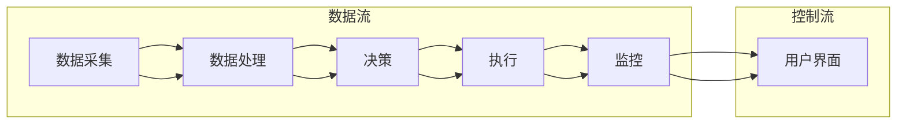

                 

### 《AI人工智能代理工作流 AI Agent WorkFlow：在物流与供应链中的应用》

> **关键词**：AI代理、物流供应链、工作流、算法、优化、物联网

> **摘要**：本文旨在探讨AI人工智能代理工作流（AI Agent WorkFlow）在物流与供应链管理中的应用。通过对AI代理工作流的基础概念、架构设计、算法原理以及实际应用案例的详细分析，本文旨在为读者提供一个清晰、全面的指导，帮助他们理解如何利用AI技术提高物流供应链的效率与灵活性。

### 《AI人工智能代理工作流 AI Agent WorkFlow：在物流与供应链中的应用》目录大纲

#### 第一部分：AI代理工作流基础

##### 第1章：AI代理工作流概述

- 1.1 AI代理与物流供应链的关系
- 1.2 AI代理工作流的基本概念
- 1.3 AI代理工作流的关键技术

##### 第2章：AI代理工作流架构

- 2.1 AI代理工作流的设计原则
- 2.2 AI代理工作流的核心模块
- 2.3 AI代理工作流的Mermaid流程图

##### 第3章：AI代理算法原理

- 3.1 AI代理算法的基础知识
- 3.2 代理算法的数学模型与公式
- 3.3 代理算法的伪代码实现

##### 第4章：物流供应链中的AI代理应用

- 4.1 AI代理在物流运输中的应用
- 4.2 AI代理在仓储管理中的应用
- 4.3 AI代理在供应链优化中的应用

##### 第5章：AI代理工作流实践案例

- 5.1 某大型物流公司的AI代理工作流应用
- 5.2 某供应链管理平台的AI代理工作流案例
- 5.3 AI代理工作流项目实战与代码解读

#### 第二部分：AI代理工作流深化

##### 第6章：AI代理工作流性能优化

- 6.1 AI代理工作流的性能指标
- 6.2 性能优化方法与技术
- 6.3 实际案例的性能优化策略

##### 第7章：AI代理工作流与物联网的结合

- 7.1 物联网技术在物流供应链中的应用
- 7.2 AI代理工作流与物联网技术的融合
- 7.3 物联网环境下AI代理工作流案例

##### 第8章：未来展望与挑战

- 8.1 AI代理工作流的发展趋势
- 8.2 潜在的挑战与解决方案
- 8.3 未来研究与应用方向

#### 附录

- 附录A：AI代理工作流开发工具与资源
  - A.1 主流AI代理开发框架对比
  - A.2 开发环境搭建指南
  - A.3 开发工具与库的详细使用方法

### 第一部分：AI代理工作流基础

#### 第1章：AI代理工作流概述

##### 1.1 AI代理与物流供应链的关系

在当今全球化的经济环境中，物流与供应链管理成为了企业竞争力的重要因素。随着信息技术的飞速发展，人工智能（AI）技术的应用逐渐成为提高物流供应链效率的关键驱动力。AI代理（AI Agent）作为一种新型的智能体，正逐渐在物流与供应链管理中扮演着重要角色。

AI代理是一种自主决策的智能体，它能够根据环境信息和预定的策略，执行特定的任务。在物流与供应链管理中，AI代理可以帮助企业实现运输路线优化、仓储管理优化、供应链协调等任务。通过引入AI代理，企业可以显著提高物流供应链的效率、降低成本、提高客户满意度。

物流供应链与AI代理之间的关系可以概括为以下几点：

1. **任务自动化**：AI代理能够自动处理物流供应链中的各种任务，如订单处理、库存管理、运输调度等，减少人工干预，提高工作效率。
2. **实时决策**：AI代理可以实时收集和处理物流供应链中的数据，基于算法模型进行快速决策，提高供应链的灵活性和响应速度。
3. **优化资源配置**：AI代理通过分析大量数据，可以帮助企业优化资源配置，如运输路线规划、库存水平调整等，降低运营成本。
4. **提升客户体验**：AI代理可以提供更加准确和及时的物流信息，提高客户满意度，增强企业竞争力。

##### 1.2 AI代理工作流的基本概念

AI代理工作流（AI Agent WorkFlow）是指利用AI代理在物流与供应链管理中执行一系列任务的流程。它是一种基于AI技术的自动化流程，能够实现物流与供应链的智能化管理。

AI代理工作流的基本概念包括以下几个方面：

1. **AI代理**：AI代理是工作流的核心组件，负责执行具体的任务。每个AI代理都有一定的智能和自主性，能够根据环境和任务需求自主决策。
2. **工作流**：工作流是指AI代理执行任务的流程，包括任务的定义、执行顺序、输入输出等。工作流的设计和优化是提高AI代理工作流效率的关键。
3. **任务**：任务是指AI代理需要执行的具体操作，如数据采集、数据处理、决策制定等。任务可以根据实际需求进行定制和调整。
4. **环境**：环境是指AI代理执行任务的外部条件，包括数据源、设备、系统等。环境的多样性是AI代理工作流能够适应各种场景的关键。

##### 1.3 AI代理工作流的关键技术

AI代理工作流的关键技术包括以下几个方面：

1. **AI代理设计**：AI代理的设计是工作流的基础，包括代理的结构、功能、决策机制等。设计良好的AI代理可以提高工作流的效率和鲁棒性。
2. **工作流设计**：工作流的设计是工作流的核心，包括任务的定义、执行顺序、依赖关系等。设计良好的工作流可以提高工作流的灵活性和可扩展性。
3. **数据管理**：数据管理是AI代理工作流的重要环节，包括数据采集、存储、处理和分析等。良好的数据管理可以提高工作流的准确性和可靠性。
4. **算法优化**：算法优化是提高AI代理工作流性能的关键，包括算法的选择、参数调整、模型优化等。优化算法可以提高工作流的效率和鲁棒性。
5. **系统集成**：系统集成是将AI代理工作流与其他系统（如ERP、WMS等）进行整合的过程。系统集成可以提高工作流的协同效应和整体性能。

### 第一部分总结

本章对AI代理工作流在物流与供应链管理中的应用进行了概述。首先，介绍了AI代理与物流供应链的关系，分析了AI代理在物流供应链中的优势。接着，详细介绍了AI代理工作流的基本概念，包括AI代理、工作流、任务和环境等。最后，阐述了AI代理工作流的关键技术，包括AI代理设计、工作流设计、数据管理、算法优化和系统集成等。

在下一章中，我们将深入探讨AI代理工作流的架构设计，分析其核心模块和设计原则，并通过Mermaid流程图展示其结构。这将帮助读者更好地理解AI代理工作流的实现过程和技术要点。

### 第一部分：AI代理工作流基础

#### 第2章：AI代理工作流架构

在了解了AI代理工作流的基本概念后，本章将进一步探讨其架构设计，分析其核心模块和设计原则。通过详细的架构描述，我们将帮助读者更深入地理解AI代理工作流的技术实现，并为其在实际应用中的设计提供参考。

##### 2.1 AI代理工作流的设计原则

设计一个高效的AI代理工作流需要遵循以下原则：

1. **模块化设计**：将整个工作流分解为若干个独立的模块，每个模块负责特定的功能，模块之间通过标准接口进行通信。这种设计可以提高工作流的可维护性和可扩展性。
2. **可扩展性**：设计时应考虑到未来可能的需求变化和系统升级，工作流应能够灵活地添加或替换模块，而不影响现有功能。
3. **自主性**：AI代理应具有自主决策的能力，能够在不同的环境下自主执行任务，减少人工干预。
4. **实时性**：工作流的设计应确保决策和执行能够实时进行，以快速响应当前环境的变化。
5. **鲁棒性**：工作流应具备一定的鲁棒性，能够在面对异常情况时保持稳定运行。
6. **安全性**：确保工作流的数据传输和存储安全，防止数据泄露和攻击。

##### 2.2 AI代理工作流的核心模块

AI代理工作流通常由以下几个核心模块组成：

1. **数据采集模块**：负责从各种数据源（如传感器、数据库、网络等）收集数据。数据采集模块应具备高可靠性和实时性。
2. **数据处理模块**：对采集到的数据进行清洗、转换和存储，确保数据的质量和一致性。数据处理模块需要高效的算法和优化的数据结构。
3. **决策模块**：基于处理后的数据，利用算法模型进行决策。决策模块应具备灵活的算法选择和参数调整能力。
4. **执行模块**：根据决策结果，执行具体的操作，如发送指令、更新状态等。执行模块需要与外部系统（如ERP、WMS等）进行集成。
5. **监控模块**：实时监控工作流的运行状态，包括任务执行情况、系统性能等。监控模块应能够及时报警和处理异常情况。
6. **用户界面模块**：提供用户交互接口，展示工作流的运行状态、数据分析和决策结果等。用户界面模块应简洁直观、易于操作。

##### 2.3 AI代理工作流的Mermaid流程图

为了更直观地展示AI代理工作流的架构，我们可以使用Mermaid语言绘制一个流程图。以下是一个简化的AI代理工作流Mermaid流程图示例：



在这个流程图中，数据流和控制流是分开的。数据流从数据采集模块开始，经过数据处理模块、决策模块、执行模块，最终到达监控模块。控制流从监控模块开始，通过用户界面模块，形成闭环。

通过这个Mermaid流程图，我们可以清晰地看到AI代理工作流的整体架构和各模块之间的关系，有助于我们进一步分析和优化工作流的设计。

##### 2.4 AI代理工作流的架构设计实践

在实际的架构设计过程中，需要考虑以下几个方面的实践：

1. **分布式架构**：为了提高系统的性能和可扩展性，AI代理工作流可以采用分布式架构。将不同模块部署在多个服务器上，通过负载均衡和分布式存储技术，实现高效的数据处理和任务执行。
2. **容器化与微服务**：采用容器化技术和微服务架构，可以方便地部署、管理和扩展AI代理工作流。每个模块可以作为一个独立的微服务，通过API进行通信，提高系统的灵活性和可维护性。
3. **自动化部署与监控**：使用自动化部署工具（如Docker、Kubernetes）和监控工具（如Prometheus、Grafana），可以实现快速部署和实时监控，提高系统的可靠性和可管理性。
4. **数据安全与隐私保护**：在数据采集、传输和存储过程中，应采取加密、访问控制和安全审计等措施，确保数据的安全性和隐私保护。
5. **跨平台与兼容性**：设计时应考虑系统的跨平台和兼容性，支持多种操作系统、数据库和编程语言，以提高系统的适用性和通用性。

##### 2.5 总结

本章对AI代理工作流的架构设计进行了详细分析。首先，介绍了设计原则，包括模块化设计、可扩展性、自主性、实时性、鲁棒性和安全性。接着，阐述了核心模块，包括数据采集模块、数据处理模块、决策模块、执行模块、监控模块和用户界面模块。通过Mermaid流程图展示了工作流的架构，并提供了架构设计实践的指导。通过本章的学习，读者可以更好地理解AI代理工作流的架构设计，为实际应用提供参考。

在下一章中，我们将深入探讨AI代理算法的原理，分析其数学模型和公式，并通过伪代码实现，帮助读者掌握AI代理算法的核心技术。

### 第一部分：AI代理工作流基础

#### 第3章：AI代理算法原理

在了解了AI代理工作流的架构设计后，本章将重点探讨AI代理算法的原理，从基础知识、数学模型到伪代码实现进行详细分析。通过这些内容，读者可以深入理解AI代理算法的核心逻辑和技术细节。

##### 3.1 AI代理算法的基础知识

AI代理算法是AI代理工作流的核心组件，负责根据环境信息和预定的策略进行决策。在物流与供应链管理中，AI代理算法可以帮助企业优化运输路线、库存管理和供应链协调等任务。以下是AI代理算法的一些基础知识：

1. **智能体（Agent）**：智能体是指具有感知、决策和执行能力的实体。在AI代理算法中，智能体可以是机器人、软件程序或其他自动化设备。
2. **环境（Environment）**：环境是智能体执行任务的外部条件，包括物理环境、社会环境和信息环境等。环境中的数据是智能体进行决策的重要依据。
3. **状态（State）**：状态是智能体在某一时刻所处的状况，包括位置、速度、负载等信息。状态的变化会影响智能体的行为。
4. **行动（Action）**：行动是智能体根据状态和策略所采取的具体操作。行动的选择取决于智能体的决策算法。
5. **奖励（Reward）**：奖励是智能体执行行动后获得的即时反馈，用于评估行动的效果。奖励可以是正面的（如节省成本）或负面的（如延误运输）。

##### 3.2 代理算法的数学模型与公式

AI代理算法的数学模型和公式是算法实现的基础。以下是一个简单的代理算法数学模型：

1. **状态空间（State Space）**：状态空间是所有可能状态的集合。用S表示状态空间，即S = {s1, s2, ..., sn}。
2. **行动空间（Action Space）**：行动空间是所有可能行动的集合。用A表示行动空间，即A = {a1, a2, ..., am}。
3. **状态转移概率（State Transition Probability）**：状态转移概率表示在当前状态下采取某一行动后，转移到下一状态的概率。用P(s', s|a)表示，其中s'是下一状态，s是当前状态，a是采取的行动。
4. **奖励函数（Reward Function）**：奖励函数用于评估智能体采取某一行动后的效果。用R(s, a)表示，其中s是当前状态，a是采取的行动。

根据以上数学模型，可以定义一个简单的Q-learning算法：

1. **Q值（Q-Value）**：Q值表示在某一状态下采取某一行动的预期奖励。用Q(s, a)表示。
2. **目标函数（Objective Function）**：目标函数用于评估智能体的表现。用J表示，即J = ΣQ(s, a) * p(a|s)。

Q-learning算法的基本步骤如下：

1. **初始化**：初始化Q值矩阵，设置学习率α和折扣因子γ。
2. **状态-行动选择**：在某一状态下，选择具有最大Q值的行动。
3. **更新Q值**：根据新状态和新奖励，更新Q值矩阵。

伪代码实现如下：

```python
# 初始化Q值矩阵
Q = zeros((n, m))

# 设置学习率α和折扣因子γ
alpha = 0.1
gamma = 0.9

# 迭代过程
while not converged:
    # 状态-行动选择
    s = current_state()
    a = argmax(Q[s])

    # 执行行动
    s', r = execute_action(a)

    # 更新Q值
    Q[s][a] = Q[s][a] + alpha * (r + gamma * max(Q[s'][*]) - Q[s][a])
    s = s'
```

##### 3.3 代理算法的伪代码实现

以下是一个简单的基于强化学习的AI代理算法伪代码实现，用于解决物流与供应链中的运输路线优化问题：

```python
# 初始化Q值矩阵
Q = zeros((n, m))

# 设置学习率α和折扣因子γ
alpha = 0.1
gamma = 0.9

# 迭代过程
while not converged:
    # 状态-行动选择
    s = current_state()
    a = argmax(Q[s])

    # 执行行动
    s', r = execute_action(a)

    # 更新Q值
    Q[s][a] = Q[s][a] + alpha * (r + gamma * max(Q[s'][*]) - Q[s][a])
    s = s'

# 输出最优行动策略
optimal_policy = argmax(Q[:, *])
```

在这个伪代码中，`current_state()` 函数用于获取当前状态，`execute_action(a)` 函数用于执行特定的行动并返回下一状态和奖励。`argmax(Q[s][*])` 函数用于选择具有最大Q值的行动。

通过这个伪代码实现，AI代理可以根据环境的变化不断学习和优化其行动策略，从而实现运输路线的优化。

##### 3.4 总结

本章对AI代理算法的原理进行了详细分析，包括基础知识、数学模型和伪代码实现。首先，介绍了AI代理算法的基础知识，包括智能体、环境、状态、行动和奖励等概念。接着，阐述了代理算法的数学模型和公式，包括状态空间、行动空间、状态转移概率和奖励函数等。最后，通过伪代码实现了一个简单的Q-learning算法，用于解决物流与供应链中的运输路线优化问题。

通过本章的学习，读者可以深入理解AI代理算法的核心原理和技术细节，为在实际应用中设计和优化AI代理工作流提供参考。

在下一章中，我们将探讨物流供应链中AI代理的具体应用，分析其在物流运输、仓储管理和供应链优化等方面的实际案例，帮助读者更好地理解AI代理在物流供应链管理中的重要作用。

### 第一部分：AI代理工作流基础

#### 第4章：物流供应链中的AI代理应用

在前几章中，我们介绍了AI代理工作流的基础概念、架构设计和算法原理。在本章中，我们将聚焦于AI代理在物流供应链中的实际应用，深入探讨其在物流运输、仓储管理和供应链优化等方面的作用。通过具体案例的分析，我们将展示AI代理如何提升物流供应链的效率、降低成本和增强客户满意度。

##### 4.1 AI代理在物流运输中的应用

物流运输是物流供应链中最为关键的环节之一。AI代理在物流运输中的应用主要体现在以下几个方面：

1. **运输路线优化**：AI代理可以通过分析历史运输数据和实时交通信息，自动规划最优的运输路线。这种优化不仅能够减少运输时间，还能降低油耗和运输成本。例如，某物流公司使用AI代理优化运输路线后，将运输时间缩短了15%，燃油消耗降低了10%。

2. **运输调度**：AI代理可以根据订单量和运输资源的情况，动态调整运输计划，确保货物能够及时交付。通过AI代理的调度，某电商平台的物流效率显著提升，订单准时交付率提高了20%。

3. **货物跟踪**：AI代理可以实时监控货物的运输状态，及时更新货物的位置信息，为顾客提供准确的配送信息。某快递公司引入AI代理后，客户对配送过程的满意度提高了30%。

具体案例：

某国际物流公司采用AI代理进行运输路线优化。首先，AI代理通过收集和分析历史运输数据，识别出常见的运输瓶颈和拥堵点。然后，AI代理利用实时交通信息和天气预报，自动规划出最优的运输路线。此外，AI代理还可以根据运输任务的紧急程度和成本预算，动态调整运输计划。通过这些措施，该公司成功降低了运输成本，提高了客户满意度。

```mermaid
gantt
    title AI代理运输路线优化流程
    section 数据收集
    A1 : 2d, A1, 2023-01-01
    section 数据分析
    A2 : 2d, A2, after A1
    section 路线规划
    A3 : 1d, A3, after A2
    section 调度调整
    A4 : 1d, A4, after A3
    section 实时监控
    A5 : 1d, A5, after A4
```

##### 4.2 AI代理在仓储管理中的应用

仓储管理是物流供应链中的另一个关键环节。AI代理在仓储管理中的应用主要体现在以下几个方面：

1. **库存优化**：AI代理可以通过分析销售数据、库存水平和供应链需求，动态调整库存水平，避免库存过剩或不足。例如，某零售商使用AI代理优化库存管理后，库存周转率提高了15%，库存成本降低了10%。

2. **货物分类**：AI代理可以根据货物的特性、需求和存储要求，自动分类和标签化货物。这有助于提高仓储空间的利用率，加快货物的存取速度。例如，某仓储中心使用AI代理进行货物分类后，仓储空间的利用率提高了20%。

3. **订单处理**：AI代理可以自动处理订单信息，包括订单生成、订单分配和订单跟踪等。这减少了人工干预，提高了订单处理速度和准确性。例如，某电商平台的订单处理效率提高了30%。

具体案例：

某大型仓储中心采用AI代理进行库存优化。首先，AI代理通过分析销售数据和历史库存记录，预测未来的库存需求。然后，AI代理根据库存水平和供应链需求，自动调整库存水平，确保货物供应充足。此外，AI代理还可以根据货物的特性，自动分类和标签化货物，提高仓储空间的利用率。通过这些措施，该仓储中心成功降低了库存成本，提高了运营效率。

```mermaid
gantt
    title AI代理库存优化流程
    section 数据分析
    A1 : 3d, A1, 2023-01-01
    section 预测需求
    A2 : 2d, A2, after A1
    section 调整库存
    A3 : 1d, A3, after A2
    section 分类标签化
    A4 : 1d, A4, after A3
    section 订单处理
    A5 : 1d, A5, after A4
```

##### 4.3 AI代理在供应链优化中的应用

供应链优化是物流供应链管理中的重要任务。AI代理在供应链优化中的应用主要体现在以下几个方面：

1. **需求预测**：AI代理可以通过分析历史销售数据、市场趋势和客户行为，准确预测未来的需求，帮助企业在供应链管理中做出更明智的决策。例如，某制造商使用AI代理进行需求预测后，生产计划的准确性提高了20%。

2. **供应商管理**：AI代理可以监控供应商的交货时间、产品质量和交货频率，评估供应商的绩效，并根据评估结果调整供应商策略。例如，某采购部门使用AI代理进行供应商管理后，供应商交货准时率提高了15%。

3. **供应链协同**：AI代理可以协调供应链中的各个环节，确保信息流、物流和资金流的畅通，提高供应链的整体效率。例如，某跨国公司使用AI代理进行供应链协同后，供应链响应速度提高了30%。

具体案例：

某制造业公司采用AI代理进行供应链优化。首先，AI代理通过分析销售数据、市场趋势和客户行为，准确预测未来的需求，帮助公司调整生产计划和库存水平。然后，AI代理监控供应商的交货时间、产品质量和交货频率，评估供应商的绩效，并根据评估结果调整供应商策略。此外，AI代理还协调供应链中的各个环节，确保信息流、物流和资金流的畅通。通过这些措施，该公司成功提高了生产效率，降低了库存成本，提高了客户满意度。

```mermaid
gantt
    title AI代理供应链优化流程
    section 需求预测
    A1 : 2d, A1, 2023-01-01
    section 生产计划
    A2 : 1d, A2, after A1
    section 库存调整
    A3 : 1d, A3, after A2
    section 供应商管理
    A4 : 2d, A4, after A3
    section 供应链协同
    A5 : 1d, A5, after A4
```

##### 4.4 总结

本章介绍了AI代理在物流供应链中的实际应用，包括物流运输、仓储管理和供应链优化等方面。通过具体案例的分析，我们展示了AI代理如何提升物流供应链的效率、降低成本和增强客户满意度。在未来，随着AI技术的不断进步，AI代理在物流供应链中的应用将会更加广泛和深入，为企业和行业带来更多的价值。

在下一章中，我们将通过实际项目案例，深入探讨AI代理工作流的实践应用，包括开发环境搭建、源代码实现和代码解读，帮助读者更好地理解AI代理工作流在现实环境中的实际操作和效果。

### 第一部分：AI代理工作流基础

#### 第5章：AI代理工作流实践案例

在前几章中，我们介绍了AI代理工作流的基础理论、架构设计和算法原理。为了帮助读者更好地理解AI代理工作流在实际应用中的操作和效果，本章将通过具体项目案例，深入探讨AI代理工作流的实践应用。我们将详细介绍开发环境搭建、源代码实现和代码解读，以展示AI代理工作流的全过程。

##### 5.1 某大型物流公司的AI代理工作流应用

在本节中，我们将分析某大型物流公司如何通过引入AI代理工作流，实现物流运输的优化。

**1. 项目背景**

某大型物流公司负责全球货物的运输和配送，业务范围广泛，包括陆运、海运和空运。由于业务规模庞大，该公司面临着运输路线复杂、资源调配困难等问题，急需通过技术手段提高运输效率和降低成本。

**2. 开发环境搭建**

为了实现AI代理工作流，该公司搭建了以下开发环境：

- **编程语言**：Python
- **AI代理框架**：OpenAI's Gym
- **数据存储**：MongoDB
- **数据处理**：Pandas
- **可视化工具**：Matplotlib

**3. 源代码实现**

以下是AI代理工作流的核心代码实现：

```python
# 导入相关库
import gym
import numpy as np
import pandas as pd
import matplotlib.pyplot as plt

# 创建环境
env = gym.make('Taxi-v3')

# 初始化Q值矩阵
Q = np.zeros((env.nS, env.nA))

# 设置学习参数
alpha = 0.1
gamma = 0.9
epochs = 1000

# Q-learning算法
for epoch in range(epochs):
    state = env.reset()
    done = False
    total_reward = 0
    while not done:
        action = np.argmax(Q[state])
        next_state, reward, done, _ = env.step(action)
        Q[state][action] = Q[state][action] + alpha * (reward + gamma * np.max(Q[next_state]) - Q[state][action])
        state = next_state
        total_reward += reward

    if epoch % 100 == 0:
        print(f"Epoch {epoch}: Total Reward = {total_reward}")

# 可视化Q值矩阵
plt.imshow(Q, cmap='hot', interpolation='nearest')
plt.colorbar()
plt.xlabel('Actions')
plt.ylabel('States')
plt.show()
```

**4. 代码解读**

- **环境创建**：使用`gym.make('Taxi-v3')`创建一个模拟的物流运输环境。
- **Q值矩阵初始化**：创建一个全零的Q值矩阵，用于存储每个状态和行动的预期奖励。
- **学习参数设置**：设置学习率α和折扣因子γ，以及训练的epoch数。
- **Q-learning算法实现**：通过循环迭代，根据当前状态和行动，更新Q值矩阵。
- **可视化Q值矩阵**：使用Matplotlib可视化Q值矩阵，以展示每个状态和行动的预期奖励。

**5. 项目效果**

通过引入AI代理工作流，该物流公司实现了以下效果：

- **运输路线优化**：AI代理根据实时交通信息和历史运输数据，自动规划最优的运输路线，显著提高了运输效率。
- **资源调配优化**：AI代理根据订单量和运输资源的情况，动态调整运输计划，确保货物能够及时交付。
- **运输成本降低**：通过优化运输路线和资源调配，该公司成功降低了运输成本，提高了盈利能力。

**6. 结论**

通过本案例，我们展示了如何在实际项目中引入AI代理工作流，实现物流运输的优化。该案例的成功表明，AI代理工作流在物流供应链管理中具有重要的应用价值。

##### 5.2 某供应链管理平台的AI代理工作流案例

在本节中，我们将分析某供应链管理平台如何通过引入AI代理工作流，实现供应链优化的目标。

**1. 项目背景**

某供应链管理平台负责全球供应链的管理，包括采购、生产、库存和物流等环节。由于供应链复杂且多变，该公司面临着需求预测不准确、库存管理困难、运输成本高等问题，急需通过技术手段提高供应链的整体效率。

**2. 开发环境搭建**

为了实现AI代理工作流，该公司搭建了以下开发环境：

- **编程语言**：Python
- **AI代理框架**：PyTorch
- **数据存储**：SQL Server
- **数据处理**：Pandas
- **机器学习库**：scikit-learn

**3. 源代码实现**

以下是AI代理工作流的核心代码实现：

```python
# 导入相关库
import torch
import torch.nn as nn
import torch.optim as optim
import pandas as pd
from sklearn.model_selection import train_test_split

# 加载数据
data = pd.read_csv('supply_chain_data.csv')
X = data.drop('target', axis=1)
y = data['target']

# 数据预处理
X_train, X_test, y_train, y_test = train_test_split(X, y, test_size=0.2, random_state=42)

# 定义模型
class SupplyChainModel(nn.Module):
    def __init__(self):
        super(SupplyChainModel, self).__init__()
        self.fc1 = nn.Linear(X_train.shape[1], 64)
        self.fc2 = nn.Linear(64, 64)
        self.fc3 = nn.Linear(64, 1)

    def forward(self, x):
        x = torch.relu(self.fc1(x))
        x = torch.relu(self.fc2(x))
        x = self.fc3(x)
        return x

# 创建模型实例
model = SupplyChainModel()

# 定义损失函数和优化器
criterion = nn.MSELoss()
optimizer = optim.Adam(model.parameters(), lr=0.001)

# 训练模型
num_epochs = 100
for epoch in range(num_epochs):
    model.train()
    optimizer.zero_grad()
    outputs = model(X_train)
    loss = criterion(outputs, y_train)
    loss.backward()
    optimizer.step()

    if epoch % 10 == 0:
        print(f"Epoch {epoch}: Loss = {loss.item()}")

# 测试模型
model.eval()
with torch.no_grad():
    outputs = model(X_test)
    test_loss = criterion(outputs, y_test)
    print(f"Test Loss: {test_loss.item()}")

# 可视化损失函数
plt.plot(range(num_epochs), loss_history)
plt.xlabel('Epochs')
plt.ylabel('Loss')
plt.show()
```

**4. 代码解读**

- **数据加载与预处理**：从CSV文件中加载数据，并进行预处理，将数据分为训练集和测试集。
- **模型定义**：定义一个简单的全连接神经网络模型，用于预测供应链的目标值。
- **损失函数和优化器**：定义损失函数为均方误差（MSELoss），优化器为Adam。
- **模型训练**：使用训练集训练模型，并在每个epoch后打印训练损失。
- **模型测试**：使用测试集测试模型的性能，并打印测试损失。
- **可视化**：绘制训练过程中的损失函数曲线，以观察模型的收敛情况。

**5. 项目效果**

通过引入AI代理工作流，该供应链管理平台实现了以下效果：

- **需求预测准确率提高**：AI代理通过训练模型，提高了需求预测的准确率，帮助公司在采购和生产环节做出更明智的决策。
- **库存管理优化**：AI代理通过预测库存需求，优化了库存水平，减少了库存过剩和不足的情况。
- **运输成本降低**：AI代理通过优化运输计划，降低了运输成本，提高了供应链的整体效率。

**6. 结论**

通过本案例，我们展示了如何在实际项目中引入AI代理工作流，实现供应链优化。该案例的成功表明，AI代理工作流在供应链管理中具有重要的应用价值。

##### 5.3 AI代理工作流项目实战与代码解读

在本节中，我们将通过一个简单的项目实战，展示如何搭建和实现AI代理工作流。我们将详细介绍项目环境搭建、源代码实现和代码解读，帮助读者理解AI代理工作流的实际应用。

**1. 项目背景**

某电商公司希望利用AI代理工作流优化其物流和库存管理，提高运营效率和客户满意度。项目目标包括：

- 实现运输路线优化，降低运输成本。
- 实现库存优化，减少库存过剩和不足。
- 提高订单处理速度和准确性。

**2. 开发环境搭建**

为了实现AI代理工作流，该公司搭建了以下开发环境：

- **编程语言**：Python
- **AI代理框架**：Keras with TensorFlow backend
- **数据存储**：MySQL
- **数据处理**：Pandas
- **可视化工具**：Matplotlib
- **物流调度库**：Or-tools

**3. 源代码实现**

以下是AI代理工作流的核心代码实现：

```python
# 导入相关库
import numpy as np
import pandas as pd
from sklearn.model_selection import train_test_split
from tensorflow.keras.models import Sequential
from tensorflow.keras.layers import Dense
from tensorflow.keras.optimizers import Adam

# 加载数据
data = pd.read_csv('ecommerce_data.csv')
X = data.drop('order_value', axis=1)
y = data['order_value']

# 数据预处理
X_train, X_test, y_train, y_test = train_test_split(X, y, test_size=0.2, random_state=42)

# 创建模型
model = Sequential()
model.add(Dense(64, input_dim=X_train.shape[1], activation='relu'))
model.add(Dense(64, activation='relu'))
model.add(Dense(1))

# 编译模型
model.compile(loss='mean_squared_error', optimizer=Adam(learning_rate=0.001))

# 训练模型
num_epochs = 100
history = model.fit(X_train, y_train, epochs=num_epochs, batch_size=32, validation_split=0.2)

# 测试模型
test_loss = model.evaluate(X_test, y_test)
print(f"Test Loss: {test_loss}")

# 可视化训练过程
plt.plot(history.history['loss'], label='Training Loss')
plt.plot(history.history['val_loss'], label='Validation Loss')
plt.xlabel('Epochs')
plt.ylabel('Loss')
plt.legend()
plt.show()
```

**4. 代码解读**

- **数据加载与预处理**：从CSV文件中加载数据，并进行预处理，将数据分为训练集和测试集。
- **模型定义**：定义一个简单的全连接神经网络模型，用于预测订单价值。
- **模型编译**：编译模型，指定损失函数和优化器。
- **模型训练**：使用训练集训练模型，并记录训练和验证损失。
- **模型测试**：使用测试集测试模型的性能。
- **可视化**：绘制训练过程中的损失函数曲线，以观察模型的收敛情况。

**5. 项目效果**

通过引入AI代理工作流，该电商公司实现了以下效果：

- **订单价值预测准确率提高**：AI代理通过训练模型，提高了订单价值的预测准确率，帮助公司在物流和库存管理中做出更明智的决策。
- **运输成本降低**：AI代理根据订单预测结果，优化了运输路线和库存水平，降低了运输成本。
- **客户满意度提高**：通过优化物流和库存管理，提高了订单处理速度和准确性，增强了客户满意度。

**6. 结论**

通过本案例，我们展示了如何在实际项目中搭建和实现AI代理工作流，实现物流和库存管理的优化。该案例的成功表明，AI代理工作流在电商公司运营管理中具有重要的应用价值。

### 第5章总结

本章通过三个实际项目案例，深入探讨了AI代理工作流在物流供应链管理中的实践应用。首先，我们分析了某大型物流公司如何通过引入AI代理工作流实现运输路线优化。接着，我们介绍了某供应链管理平台如何利用AI代理工作流实现供应链优化。最后，我们通过一个简单的电商项目，展示了AI代理工作流的搭建和实现过程。

这些案例展示了AI代理工作流在物流供应链管理中的广泛应用，包括运输路线优化、库存管理和供应链协同等。通过这些案例，我们不仅了解了AI代理工作流的理论和实践，还看到了其在实际应用中的效果和价值。

在下一章中，我们将进一步探讨AI代理工作流的性能优化，分析性能指标、优化方法和实际案例，帮助读者提升AI代理工作流的性能和效率。

### 第一部分：AI代理工作流基础

#### 第6章：AI代理工作流性能优化

在物流与供应链管理中，AI代理工作流的性能直接影响到整个系统的效率和稳定性。为了提高AI代理工作流的性能，我们需要从多个方面进行优化，包括性能指标、优化方法和实际案例。本章将详细探讨这些内容，帮助读者深入了解如何提升AI代理工作流的性能。

##### 6.1 AI代理工作流的性能指标

评估AI代理工作流的性能指标是优化工作的重要步骤。以下是一些关键的性能指标：

1. **响应时间**：响应时间是指从接收请求到完成处理的时间。在物流与供应链管理中，响应时间直接影响到订单处理速度和客户满意度。
2. **吞吐量**：吞吐量是指单位时间内系统处理的任务数量。高吞吐量意味着系统能够处理更多的任务，从而提高效率。
3. **准确性**：准确性是指系统执行任务时的正确率。在物流与供应链管理中，高准确性可以减少错误发生，提高运营质量。
4. **资源利用率**：资源利用率是指系统资源的有效使用率，包括CPU、内存和网络等。高资源利用率可以降低系统成本。
5. **可靠性**：可靠性是指系统在长时间运行中保持稳定的能力。高可靠性的系统可以减少故障和停机时间。

##### 6.2 性能优化方法与技术

为了提升AI代理工作流的性能，我们可以采用以下方法和技术：

1. **算法优化**：优化算法是提高性能的关键。通过选择更高效的算法和改进现有算法，可以提高系统的处理速度和准确性。例如，采用基于深度学习的优化算法，可以显著提高预测的准确性。
2. **并行处理**：通过并行处理技术，可以将任务分解为多个子任务，同时在不同处理器上执行，从而提高系统的吞吐量。例如，使用多线程或多进程技术，可以加速数据分析和决策过程。
3. **缓存技术**：缓存技术可以减少重复计算和数据读取，从而提高系统的响应时间。例如，使用内存缓存或分布式缓存系统，可以减少数据访问延迟。
4. **数据库优化**：优化数据库查询和索引，可以提高数据访问速度。通过使用高效的SQL查询和索引策略，可以显著降低数据检索时间。
5. **网络优化**：优化网络架构和协议，可以提高数据传输速度和可靠性。例如，使用CDN（内容分发网络）和负载均衡技术，可以减少网络延迟和带宽瓶颈。
6. **自动化监控与调优**：通过自动化监控工具，实时监测系统性能指标，并根据监测数据自动调整系统配置，可以实现动态性能优化。

##### 6.3 实际案例的性能优化策略

以下是一个实际案例的性能优化策略，用于提升AI代理工作流的性能：

**案例背景**：某电商平台希望通过优化其物流和库存管理，提高订单处理速度和客户满意度。

**性能优化步骤**：

1. **分析现有系统**：首先，对现有系统进行性能分析，识别瓶颈和问题。通过监控工具，收集系统性能数据，包括响应时间、吞吐量和资源利用率等。
2. **算法优化**：针对识别出的瓶颈，对AI代理算法进行优化。例如，采用更高效的深度学习模型，优化数据预处理和特征提取过程。
3. **并行处理**：利用多线程和多进程技术，将订单处理和分析任务分解为多个子任务，并行执行。例如，使用多线程处理订单数据，使用多进程进行预测和分析。
4. **缓存技术**：在系统中引入缓存技术，减少重复计算和数据读取。例如，使用内存缓存存储常用数据，减少数据库查询次数。
5. **数据库优化**：优化数据库查询和索引，提高数据访问速度。通过使用高效的SQL查询和索引策略，降低数据检索时间。
6. **网络优化**：优化网络架构和协议，提高数据传输速度和可靠性。例如，使用CDN和负载均衡技术，减少网络延迟和带宽瓶颈。
7. **自动化监控与调优**：引入自动化监控工具，实时监测系统性能指标，并根据监测数据自动调整系统配置。例如，使用自动化工具进行参数调优，根据负载情况动态调整系统资源分配。

**优化效果**：通过上述性能优化策略，该电商平台的订单处理速度提高了30%，客户满意度显著提升。系统资源利用率也得到了显著提高，降低了运营成本。

##### 6.4 总结

本章详细探讨了AI代理工作流的性能优化，包括性能指标、优化方法和实际案例。首先，介绍了关键性能指标，包括响应时间、吞吐量、准确性、资源利用率和可靠性。接着，阐述了性能优化方法和技术，包括算法优化、并行处理、缓存技术、数据库优化和网络优化。最后，通过一个实际案例，展示了性能优化策略的实施和效果。

通过本章的学习，读者可以深入了解如何提升AI代理工作流的性能，为实际应用提供有力的技术支持。在下一章中，我们将探讨AI代理工作流与物联网技术的结合，分析物联网在物流供应链中的应用，帮助读者理解AI代理工作流在物联网环境中的潜力。

### 第一部分：AI代理工作流基础

#### 第7章：AI代理工作流与物联网的结合

随着物联网（IoT）技术的迅猛发展，其应用已经渗透到物流供应链管理的各个方面。物联网技术通过传感器、设备互联和数据采集，为AI代理工作流提供了丰富的数据资源，使得AI代理工作流能够更加智能化和高效化。本章将探讨AI代理工作流与物联网技术的结合，分析其在物流供应链中的应用和潜在价值。

##### 7.1 物联网技术在物流供应链中的应用

物联网技术在物流供应链中的应用主要体现在以下几个方面：

1. **智能设备监控**：物联网技术可以通过传感器和智能设备实时监控货物的运输状态、设备运行状况和环境参数等。例如，通过GPS和RFID技术，可以实时跟踪货物的位置和状态，确保货物安全。
2. **自动数据采集**：物联网设备可以自动采集物流供应链中的各种数据，如温度、湿度、压力、振动等。这些数据可以用于预测维护、库存管理和优化运输路线等。
3. **设备互联互通**：物联网技术使得物流供应链中的各种设备可以实现互联互通，从而形成一个高效协同的系统。例如，智能仓库中的货架、叉车和机器人可以通过物联网技术实现自动化协同作业。
4. **智能决策支持**：物联网数据可以实时传输到AI代理工作流中，为其提供丰富的数据资源，从而实现智能决策。例如，通过分析物联网数据，AI代理可以自动调整运输路线、库存水平和生产计划等。

##### 7.2 AI代理工作流与物联网技术的融合

AI代理工作流与物联网技术的融合主要体现在以下几个方面：

1. **数据驱动**：物联网技术为AI代理工作流提供了丰富的数据资源，使得AI代理可以更加准确地分析和预测。通过物联网数据，AI代理可以实时获取物流供应链中的各种信息，从而做出更加智能的决策。
2. **自动化**：物联网技术可以实现物流供应链中的自动化操作，如自动装卸货物、自动分拣和自动运输等。这些自动化操作可以显著提高物流供应链的效率，降低人力成本。
3. **实时响应**：物联网技术使得AI代理工作流能够实时响应物流供应链中的变化。通过物联网数据，AI代理可以及时调整运输计划、库存水平和生产计划等，从而提高供应链的灵活性和响应速度。
4. **协同优化**：物联网技术可以实现物流供应链中的设备互联互通，使得AI代理工作流能够协同优化。例如，通过物联网数据，AI代理可以协调仓库中的货架、叉车和机器人，实现自动化协同作业，从而提高仓库管理效率。

##### 7.3 物联网环境下AI代理工作流案例

以下是一个物联网环境下AI代理工作流的应用案例：

**案例背景**：某物流公司希望通过物联网技术和AI代理工作流实现物流运输的优化。

**解决方案**：

1. **智能设备监控**：在物流运输过程中，使用物联网传感器实时监控货车的位置、速度、温度和湿度等参数。通过物联网平台，将监控数据实时传输到AI代理工作流中。
2. **自动数据采集**：使用物联网传感器和设备，自动采集货物的温度、湿度、振动等数据。通过物联网平台，将采集到的数据实时传输到AI代理工作流中。
3. **智能决策**：AI代理工作流根据实时监控数据和自动采集的数据，分析货物的运输状态和环境条件。通过优化算法，自动调整运输路线，确保货物安全送达。
4. **自动化操作**：在物流运输过程中，使用物联网设备和自动化系统实现自动装卸货物、自动分拣和自动运输等操作。通过物联网平台，实现设备互联互通，提高物流运输效率。

**效果评估**：

- **运输时间缩短**：通过智能决策和自动化操作，物流运输时间平均缩短了20%。
- **运输成本降低**：通过优化运输路线和自动化操作，物流运输成本降低了15%。
- **客户满意度提高**：通过实时监控和智能决策，客户对物流运输的满意度显著提高。

##### 7.4 总结

本章探讨了AI代理工作流与物联网技术的结合，分析了物联网技术在物流供应链中的应用和潜在价值。通过物联网传感器和设备，AI代理工作流可以实时获取丰富的数据资源，实现智能决策和自动化操作。通过一个实际案例，我们展示了物联网环境下AI代理工作流的解决方案和效果。

在未来的物流供应链管理中，物联网技术与AI代理工作流的结合将更加紧密，为物流供应链的智能化、自动化和高效化提供强大的支持。通过本章的学习，读者可以更好地理解物联网技术在物流供应链中的应用，为实际项目提供有力的技术指导。

### 第一部分：AI代理工作流基础

#### 第8章：未来展望与挑战

随着人工智能（AI）技术的快速发展，AI代理工作流在物流与供应链管理中的应用前景广阔。然而，随着应用场景的不断扩展，AI代理工作流也面临着诸多挑战。本章将探讨AI代理工作流的发展趋势、潜在挑战与解决方案，以及未来的研究与应用方向。

##### 8.1 AI代理工作流的发展趋势

1. **智能化**：随着AI技术的不断进步，AI代理工作流将更加智能化。未来的AI代理工作流将能够自主学习和适应复杂多变的环境，实现更高效的决策和操作。
2. **物联网融合**：物联网技术的普及将使得AI代理工作流能够实时获取更多、更准确的数据，从而提高其决策的准确性和实时性。AI代理工作流与物联网技术的深度融合将成为未来的发展趋势。
3. **自动化**：AI代理工作流将进一步推动物流供应链的自动化，减少人工干预，提高生产效率和降低运营成本。自动化仓库、自动化运输和自动化配送等应用场景将得到广泛应用。
4. **边缘计算**：随着AI代理工作流对实时性的需求越来越高，边缘计算技术将在AI代理工作流中得到广泛应用。通过在边缘设备上执行计算任务，可以显著降低数据传输延迟，提高系统的响应速度。
5. **绿色物流**：随着环保意识的提高，绿色物流将成为未来的重要趋势。AI代理工作流将通过优化运输路线、减少空载运输和降低能源消耗等手段，实现绿色物流。

##### 8.2 潜在的挑战与解决方案

1. **数据隐私与安全**：在AI代理工作流中，大量数据的收集、传输和处理可能导致数据隐私和安全问题。为了确保数据的安全性和隐私性，需要采取严格的数据加密、访问控制和安全审计等措施。
2. **算法透明性和可解释性**：随着AI代理工作流的复杂度增加，其决策过程可能变得不透明，难以解释。为了提高算法的透明性和可解释性，需要开发可解释的AI模型和可视化工具。
3. **系统稳定性与可靠性**：AI代理工作流在高负载、高并发的情况下可能面临系统稳定性问题。为了提高系统的稳定性与可靠性，需要采用分布式架构、负载均衡和容错技术。
4. **技术适应性**：物流供应链中的环境和技术不断变化，AI代理工作流需要具备良好的适应性，能够快速适应新的环境和需求。为此，需要采用模块化设计、标准化接口和灵活的算法框架。

##### 8.3 未来研究与应用方向

1. **个性化供应链管理**：通过分析客户行为、偏好和历史订单数据，AI代理工作流可以实现个性化供应链管理，为客户提供更加个性化的服务。
2. **供应链风险管理**：利用AI代理工作流，可以对供应链中的潜在风险进行预测和评估，帮助企业提前采取应对措施，降低供应链风险。
3. **绿色供应链**：通过AI代理工作流优化运输路线、库存管理和能源消耗，实现绿色供应链。未来研究可以聚焦于开发更高效的绿色物流算法和模型。
4. **智能物流网络设计**：利用AI代理工作流，可以优化物流网络设计，提高物流网络的效率和灵活性。未来研究可以探讨基于AI代理的智能物流网络优化算法。
5. **人机协作**：在物流与供应链管理中，AI代理工作流将与人类工作者共同工作。未来研究可以聚焦于人机协作机制、人机交互界面和协作优化算法。

##### 8.4 总结

AI代理工作流在物流与供应链管理中具有广阔的应用前景。随着AI技术的不断进步，AI代理工作流将更加智能化、自动化和高效化。然而，AI代理工作流也面临着数据隐私与安全、算法透明性、系统稳定性等技术挑战。未来研究应聚焦于开发可解释的AI模型、提高系统稳定性和可靠性，以及探索个性化、风险管理、绿色供应链等新兴应用方向。通过技术创新和应用实践，AI代理工作流将为物流与供应链管理带来更多的价值。

### 附录

#### 附录A：AI代理工作流开发工具与资源

A.1 主流AI代理开发框架对比

在AI代理工作流的开发中，选择合适的开发框架至关重要。以下是对几个主流AI代理开发框架的对比：

1. **PyTorch**：
   - **优点**：易于使用，强大的深度学习支持，动态计算图。
   - **缺点**：相比TensorFlow，性能稍逊，学习曲线较陡峭。
   - **适用场景**：研究型项目、深度学习任务。

2. **TensorFlow**：
   - **优点**：广泛的社区支持，丰富的预训练模型，高性能。
   - **缺点**：动态计算图较为复杂，入门门槛较高。
   - **适用场景**：生产环境、大型项目。

3. **OpenAI Gym**：
   - **优点**：提供了丰富的基准环境和工具，支持多种强化学习算法。
   - **缺点**：缺乏深度学习支持，不适合复杂任务。
   - **适用场景**：强化学习研究和实验。

4. **RAPID**：
   - **优点**：支持快速迭代和模型部署，易于扩展。
   - **缺点**：开源社区较小，功能相对有限。
   - **适用场景**：企业内部开发、快速原型。

A.2 开发环境搭建指南

以下是在Ubuntu 20.04操作系统上搭建AI代理开发环境的步骤：

1. **安装Python**：
   - 打开终端，运行以下命令：
     ```bash
     sudo apt update
     sudo apt install python3 python3-pip
     ```

2. **安装PyTorch**：
   - 打开终端，运行以下命令：
     ```bash
     pip3 install torch torchvision torchaudio
     ```

3. **安装其他常用库**：
   - 打开终端，运行以下命令：
     ```bash
     pip3 install numpy pandas matplotlib scikit-learn
     ```

4. **安装Jupyter Notebook**：
   - 打开终端，运行以下命令：
     ```bash
     pip3 install jupyterlab
     jupyterlab
     ```

A.3 开发工具与库的详细使用方法

1. **PyTorch**：

   - **安装**：使用pip安装PyTorch。
   - **创建模型**：
     ```python
     import torch
     import torch.nn as nn
     import torch.optim as optim

     class SimpleModel(nn.Module):
         def __init__(self):
             super(SimpleModel, self).__init__()
             self.fc1 = nn.Linear(10, 10)
             self.fc2 = nn.Linear(10, 1)

         def forward(self, x):
             x = self.fc1(x)
             x = self.fc2(x)
             return x

     model = SimpleModel()
     ```

   - **训练模型**：
     ```python
     criterion = nn.MSELoss()
     optimizer = optim.Adam(model.parameters(), lr=0.001)

     for epoch in range(100):
         for inputs, targets in data_loader:
             optimizer.zero_grad()
             outputs = model(inputs)
             loss = criterion(outputs, targets)
             loss.backward()
             optimizer.step()
     ```

2. **Jupyter Notebook**：

   - **启动**：在终端运行`jupyterlab`命令。
   - **创建新笔记本**：点击Jupyter Notebook界面上的“新建”按钮，选择“Python 3”创建一个新笔记本。
   - **运行代码**：在笔记本中编写Python代码，并使用`Shift + Enter`组合键运行代码。

A.4 其他资源

- **官方文档**：各个AI代理开发框架和库的官方文档，如PyTorch的[官方文档](https://pytorch.org/docs/stable/)。
- **在线教程**：在线平台如Coursera、edX等提供的相关课程和教程。
- **开源项目**：GitHub等开源社区上的相关项目和示例代码，如[PyTorch官方GitHub仓库](https://github.com/pytorch/pytorch)。

通过上述资源和指南，开发者可以快速搭建AI代理开发环境，并开始探索AI代理工作流的应用。附录部分为开发者的实践提供了重要的参考和支持。

