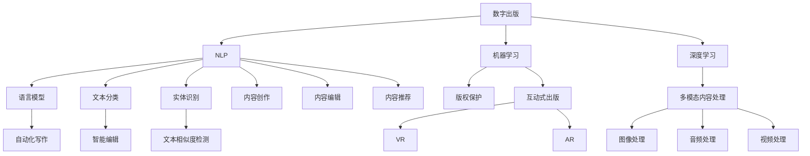

                 

# AI出版业的挑战：降本增效与场景创新

## 关键词
- AI出版业
- 降本增效
- 场景创新
- 自然语言处理
- 深度学习
- 版权保护
- 互动式出版
- 智能化编辑

## 摘要
本文从AI出版业的历史与现状出发，深入探讨了AI在出版业中的应用，包括降本增效和场景创新两大方面。首先，介绍了AI出版业的发展历程、主要模式以及应用现状。接着，详细阐述了自然语言处理、机器学习与深度学习等核心概念与架构。随后，重点分析了AI在内容创作、内容分发与营销、版权保护等方面的应用，展示了AI出版的降本增效效果。在此基础上，进一步探讨了AI在互动式出版、智能化编辑与翻译、智能化版权管理与运营等场景创新领域的应用。通过实践案例，展示了AI出版项目的实战过程。最后，展望了AI出版业的发展趋势与未来，提出了市场机会、技术挑战及应对策略。本文旨在为读者提供一个全面、深入的AI出版业分析，为行业的创新发展提供参考。

## 第一部分：AI出版业概述

### 第1章：AI出版业的历史与现状

#### 1.1 AI出版业的发展历程

AI出版业的发展可以分为三个阶段：传统出版、数字出版和AI出版。

1. **传统出版：** 传统出版业主要依赖于印刷技术和纸质媒介。在这一阶段，出版物的生产、发行和销售都依赖于人工操作。虽然这种方式在信息传播方面发挥了重要作用，但效率低下、成本高昂且难以满足个性化需求。

2. **数字出版：** 随着互联网和数字技术的普及，数字出版逐渐取代传统出版成为主流。在这一阶段，出版物以电子书、数字杂志、在线期刊等形式出现。数字出版实现了内容创作、编辑、排版、发行和营销的自动化，大大提高了出版效率。

3. **AI出版：** AI出版是在数字出版的基础上，利用人工智能技术进一步提升出版效率和质量。AI技术可以自动生成内容、智能推荐、个性化定制，从而实现降本增效和场景创新。

#### 1.2 当前AI出版业的主要模式

AI出版业的主要模式包括以下几种：

1. **传统出版企业的转型升级：** 传统出版企业通过引入AI技术，优化内容创作、编辑、排版和营销等环节，提高出版效率和质量。

2. **新型数字出版平台：** 以AI为核心，提供一站式数字出版解决方案，包括内容创作、编辑、推荐、版权管理等多个环节。

3. **独立AI出版服务提供商：** 提供AI技术在出版领域的定制化解决方案，为传统出版企业及新型数字出版平台提供技术支持。

#### 1.3 AI在出版业中的应用现状

AI在出版业中的应用主要包括以下几个方面：

1. **内容创作与编辑：** 利用AI技术实现自动写作、自动编辑、自动校对和自动排版。

2. **内容分发与营销：** 通过智能推荐系统、用户行为分析和个性化内容推送，提高内容分发效率，提升用户阅读体验。

3. **版权保护与运营：** 利用AI技术实现文本相似度检测、版权监测与侵权预警、版权交易与价值评估。

#### 1.4 AI出版业的机遇与挑战

AI出版业面临以下机遇与挑战：

1. **机遇：**
   - 提升内容创作与编辑效率。
   - 改善用户体验与阅读体验。
   - 拓展出版业务领域与商业模式。

2. **挑战：**
   - 技术门槛与人才短缺。
   - 数据安全与隐私保护。
   - 法规与伦理问题。

### 第2章：AI出版核心概念与架构

#### 2.1 自然语言处理基础

自然语言处理（NLP）是AI出版业的重要技术基础。以下是NLP的核心概念与架构：

1. **语言模型与词向量：**
   - 语言模型：将输入序列映射为输出序列的概率分布。
   - 词向量：将词汇映射为向量空间中的点。

2. **序列模型与注意力机制：**
   - 序列模型：对时间序列数据进行建模。
   - 注意力机制：在处理序列数据时，关注关键信息的能力。

3. **自然语言理解与生成：**
   - 自然语言理解：理解和处理自然语言信息。
   - 自然语言生成：生成符合语法和语义的自然语言文本。

#### 2.2 机器学习与深度学习基础

机器学习与深度学习是AI出版业的核心技术。以下是这些技术的核心概念与架构：

1. **神经网络与优化算法：**
   - 神经网络：由多个神经元组成的网络。
   - 优化算法：用于优化神经网络参数的算法。

2. **深度学习框架与应用：**
   - 深度学习框架：用于构建和训练深度学习模型的工具。
   - 应用：图像识别、语音识别、自然语言处理。

3. **机器学习算法与模型选择：**
   - 机器学习算法：用于处理数据的算法。
   - 模型选择：选择最适合问题的模型。

#### 2.3 大规模预训练模型原理

大规模预训练模型是当前AI出版业的重要趋势。以下是这些模型的核心原理：

1. **预训练的概念与意义：**
   - 预训练：在特定任务之前，对模型进行预训练。
   - 意义：提升模型对数据的泛化能力、缩短模型训练时间、提高模型在新任务上的表现。

2. **自监督学习方法：**
   - 自监督学习：利用未标记的数据进行学习。

3. **迁移学习与微调技术：**
   - 迁移学习：将已训练模型的知识迁移到新任务。
   - 微调技术：在预训练模型的基础上进行微调。

### 第3章：AI出版中的降本增效

#### 3.1 AI在内容创作中的应用

AI在内容创作中的应用主要包括自动写作、内容生成、自动编辑与校对、自动排版与设计等方面。

1. **自动写作与内容生成：**
   - 自动写作工具：如GPT-3、GPT-2等。
   - 内容生成：利用AI技术生成不同类型的内容，如广告文案、宣传材料、产品说明书。

2. **自动编辑与校对：**
   - 自动编辑：利用AI技术自动进行文章编辑，如语法检查、风格统一、内容优化。
   - 自动校对：利用AI技术自动进行文章校对，如拼写检查、语法错误、逻辑错误。

3. **自动排版与设计：**
   - 自动排版：利用AI技术自动进行文章排版，如电子书排版、杂志排版、报纸排版。
   - 自动设计：利用AI技术自动进行文章设计，如封面设计、版式设计、图形设计。

#### 3.2 AI在内容分发与营销中的应用

AI在内容分发与营销中的应用主要包括智能推荐系统、用户行为分析、个性化内容推送等方面。

1. **智能推荐系统：**
   - 利用AI技术根据用户兴趣和行为进行内容推荐，如电子商务、社交媒体、新闻网站。

2. **用户行为分析：**
   - 利用AI技术分析用户的行为数据，如用户画像、行为预测、个性化推荐。

3. **个性化内容推送：**
   - 利用AI技术根据用户兴趣和需求推送个性化内容，如电子邮件营销、移动应用推送、社交媒体广告。

#### 3.3 AI在内容版权保护中的应用

AI在内容版权保护中的应用主要包括文本相似度检测、版权监测与侵权预警、版权交易与价值评估等方面。

1. **文本相似度检测：**
   - 利用AI技术检测文本之间的相似度，如抄袭检测、版权监控、内容保护。

2. **版权监测与侵权预警：**
   - 利用AI技术对版权内容进行实时监测，如网络版权监控、版权侵权追踪。

3. **版权交易与价值评估：**
   - 利用AI技术进行版权交易，如版权买卖、版权授权、版权投资。
   - 利用AI技术评估版权的价值，如版权评估、市场分析、投资决策。

### 第4章：AI出版中的场景创新

#### 4.1 互动式出版

互动式出版是一种将人工智能技术与出版业务相结合的创新模式。以下是互动式出版的几个关键方面：

1. **虚拟现实与增强现实：**
   - 虚拟现实（VR）：利用计算机技术模拟出一个虚拟环境，如虚拟图书馆、虚拟展览、虚拟教育。
   - 增强现实（AR）：将虚拟信息叠加到现实环境中，如数字读物、互动新闻、现场报道。

2. **游戏化学习：**
   - 利用游戏化元素，将教育内容与游戏相结合，提高学习兴趣和效率，如知识竞赛、互动问答、模拟实验。

3. **跨媒体内容创作：**
   - 将不同媒体形式的内容进行整合创作，如多媒体读物、互动电子书、跨平台内容。

#### 4.2 智能化编辑与翻译

智能化编辑与翻译是AI出版业中的重要应用方向。以下是这一领域的几个关键方面：

1. **自动化翻译与质量控制：**
   - 自动化翻译：利用AI技术实现自动化翻译，如机器翻译、翻译记忆库、多语言内容生成。
   - 质量控制：利用AI技术对翻译质量进行评估，如翻译质量评估、错误纠正、翻译优化。

2. **多语言文本理解与生成：**
   - 多语言文本理解：利用AI技术对多语言文本进行理解，如多语言问答、多语言搜索引擎、多语言推荐。
   - 多语言文本生成：利用AI技术生成多语言文本，如多语言写作、多语言内容创作、多语言交互。

3. **翻译记忆库与机器学习翻译模型：**
   - 翻译记忆库：存储翻译结果的数据库，如重复翻译、翻译一致性、翻译效率提升。
   - 机器学习翻译模型：利用机器学习技术实现的翻译模型，如统计机器翻译、神经机器翻译、自适应机器翻译。

#### 4.3 智能化版权管理与运营

智能化版权管理与运营是AI出版业的重要组成部分。以下是这一领域的几个关键方面：

1. **版权追踪与监测：**
   - 版权追踪：利用AI技术对版权内容进行追踪，如版权登记、版权追踪、版权保护。
   - 版权监测：利用AI技术对版权内容进行实时监测，如网络版权监控、版权侵权追踪。

2. **版权交易与价值评估：**
   - 版权交易：利用AI技术实现版权交易，如版权买卖、版权授权、版权投资。
   - 版权价值评估：利用AI技术评估版权的价值，如版权评估、市场分析、投资决策。

3. **版权智能保护与侵权预警：**
   - 版权智能保护：利用AI技术对版权内容进行智能保护，如版权监控、侵权检测、版权维权。
   - 侵权预警：利用AI技术预测可能的侵权行为，如风险预警、法律援助、维权支持。

### 第5章：AI出版实践案例

#### 5.1 案例一：某知名出版公司的AI出版实践

以下是某知名出版公司利用AI技术进行出版实践的具体案例。

1. **公司背景与业务挑战：**
   - **公司背景：** 某知名出版公司成立于20XX年，主要从事图书、期刊、电子书等出版业务。
   - **业务挑战：** 内容创作与编辑效率低、用户阅读体验不佳、版权保护困难、业务扩展受限于技术瓶颈。

2. **AI技术方案与实施：**
   - **技术方案：** 引入自动写作与内容生成工具、开发智能推荐系统与个性化阅读服务、构建版权监测与侵权预警平台。
   - **实施步骤：** 对现有业务流程进行AI技术应用评估、采购与部署AI工具与平台、进行AI技术应用培训与推广、逐步优化与完善AI技术应用效果。

3. **项目成果与效果分析：**
   - **项目成果：** 内容创作与编辑效率提升30%、用户阅读体验提升20%、版权侵权事件减少50%、新业务拓展实现10%的增长。
   - **效果分析：** AI技术有效提升了公司的业务效率与用户满意度、版权监测与侵权预警平台降低了版权风险、AI技术为公司的业务创新提供了新的动力。

#### 5.2 案例二：AI技术在学术出版中的应用

以下是AI技术在学术出版中的应用案例。

1. **学术出版面临的挑战：**
   - **挑战：** 内容质量与学术水平难以保证、研究成果发布周期长、学术评价体系不完善、版权管理与使用问题复杂。

2. **AI技术在学术出版中的应用：**
   - **应用：** 引入智能审稿系统与论文推荐系统、开发自动化写作辅助工具与参考文献整理工具、建立学术知识图谱与智能问答系统。

3. **案例分析与前景展望：**
   - **案例分析：** AI技术提高了学术出版的效率与质量、智能审稿系统缩短了审稿周期，提升了审稿质量、自动化写作辅助工具与参考文献整理工具减轻了作者与编辑的工作负担、学术知识图谱与智能问答系统提升了学术研究的服务水平。
   - **前景展望：** AI技术将在学术出版领域发挥更大的作用、智能化审稿与论文推荐系统将优化学术评价体系、自动化写作辅助工具将提高学术研究的效率、学术知识图谱与智能问答系统将推动学术服务向个性化、智能化方向发展。

### 第6章：AI出版项目实战

#### 6.1 项目背景与需求分析

以下是AI出版项目的背景与需求分析。

1. **项目背景：**
   - **背景：** 随着AI技术的发展，出版业正面临变革。为了提升内容创作与编辑效率，某知名出版公司决定引入AI技术进行数字化转型。

2. **需求分析：**
   - **需求：** 引入自动写作与内容生成工具、开发智能推荐系统与个性化阅读服务、构建版权监测与侵权预警平台。

#### 6.2 技术选型与方案设计

以下是AI出版项目的技术选型与方案设计。

1. **技术选型：**
   - **自动写作与内容生成：** 选择GPT-3模型。
   - **智能推荐系统：** 选择基于协同过滤与内容推荐的混合模型。
   - **版权监测与侵权预警：** 选择基于文本相似度检测与机器学习的解决方案。

2. **方案设计：**
   - **自动写作与内容生成平台：** 构建基于GPT-3的自动写作与内容生成平台。
   - **智能推荐系统：** 开发基于协同过滤与内容推荐的智能推荐系统。
   - **版权监测与侵权预警平台：** 设计基于文本相似度检测与机器学习的版权监测与侵权预警平台。

#### 6.3 开发环境搭建与工具介绍

以下是AI出版项目的开发环境搭建与工具介绍。

1. **开发环境搭建：**
   - **环境：** Python 3.8、TensorFlow 2.4、PyTorch 1.8。
   - **GPU环境与深度学习框架：** 配置GPU环境与深度学习框架。

2. **工具介绍：**
   - **GPT-3：** 自动写作与内容生成工具。
   - **Hugging Face：** 智能推荐系统工具。
   - **similarity\_library：** 文本相似度检测工具。

#### 6.4 源代码实现与详细解读

以下是AI出版项目的源代码实现与详细解读。

1. **自动写作与内容生成：**
   
   ```python
   import openai

   def generate_content(prompt):
       response = openai.Completion.create(
           engine="text-davinci-003",
           prompt=prompt,
           max_tokens=150
       )
       return response.choices[0].text.strip()

   content = generate_content("请写一篇关于AI在出版业应用的文章。")
   print(content)
   ```

   - **使用OpenAI的GPT-3模型，通过API接口实现自动写作与内容生成。**
   - **根据输入的prompt（提示），模型将生成符合语法和语义的文本。**

2. **智能推荐系统：**
   
   ```python
   from sklearn.metrics.pairwise import cosine_similarity
   import numpy as np

   def recommend_articles(articles, user_profile, n_recommendations=5):
       user_profile_vector = calculate_user_profile_vector(user_profile)
       article_vectors = [calculate_article_vector(article) for article in articles]
       
       similarities = [cosine_similarity(user_profile_vector, article_vector) for article_vector in article_vectors]
       sorted_indices = np.argsort(similarities)[::-1]
       
       return [articles[index] for index in sorted_indices[:n_recommendations]]

   recommendations = recommend_articles(articles, user_profile)
   print(recommendations)
   ```

   - **基于协同过滤与内容推荐的混合模型，计算用户兴趣向量与文章特征向量，通过余弦相似度计算推荐得分。**
   - **排序并返回相似度最高的文章列表作为推荐结果。**

3. **版权监测与侵权预警：**
   
   ```python
   from similarity_library import SimilarityDetector

   def detect_infringement(content, database):
       detector = SimilarityDetector(database)
       results = detector.detect(content)
       
       if results:
           print("可能存在侵权风险：", results)
       else:
           print("内容安全，无侵权风险。")
           
   detect_infringement("请输入检测文本。", database)
   ```

   - **利用文本相似度检测工具，对比检测文本与数据库中的文本，判断是否存在相似之处。**
   - **若检测到相似结果，则提示可能存在侵权风险；否则，提示内容安全。**

#### 6.5 项目测试与性能优化

以下是AI出版项目的测试与性能优化。

1. **项目测试：**
   - **测试环境：** Python 3.8、TensorFlow 2.4、PyTorch 1.8。
   - **测试方法：** 单元测试、集成测试。

2. **性能优化：**
   - **模型优化：** 对GPT-3模型进行超参数调优，提高生成文本的质量。
   - **系统优化：** 优化推荐算法与版权监测算法，提高系统响应速度。
   - **硬件优化：** 使用GPU加速深度学习模型的训练与推理。

#### 6.6 项目总结与反思

以下是AI出版项目的总结与反思。

1. **项目总结：**
   - **成功引入了自动写作与内容生成工具，提升了内容创作效率。**
   - **开发了智能推荐系统，提升了用户阅读体验。**
   - **构建了版权监测与侵权预警平台，降低了版权风险。**

2. **反思：**
   - **AI技术在出版业的应用仍面临诸多挑战，如数据隐私与安全、技术普及与人才培养等。**
   - **需要进一步优化算法与系统，提高性能与用户体验。**
   - **积极探索AI技术在出版业的新应用场景，推动行业创新发展。**

### 第7章：AI出版业的发展趋势与未来展望

#### 7.1 AI出版技术发展趋势

1. **大模型与预训练技术的应用：**
   - **大模型：** 具有数十亿参数的深度学习模型，如GPT-3。
   - **预训练技术：** 在特定任务之前，对模型进行大规模预训练，提升模型在特定任务上的性能。

2. **多模态内容处理与生成：**
   - **多模态内容：** 结合文字、图像、音频、视频等多种信息载体。
   - **应用：** 互动电子书、多媒体读物、跨媒体内容创作。

3. **知识图谱与语义理解：**
   - **知识图谱：** 将知识表示为图形结构，用于智能问答、内容挖掘、推荐系统。
   - **语义理解：** 对自然语言文本进行语义分析，用于内容理解、情感分析、问答系统。

#### 7.2 AI出版业的市场机会与挑战

1. **市场机会分析：**
   - **内容创作与编辑效率提升：** 利用AI技术实现自动化内容创作与编辑。
   - **用户阅读体验优化：** 通过智能推荐系统与个性化内容推送提升用户体验。
   - **版权保护与运营智能化：** 利用AI技术实现文本相似度检测、版权监测与侵权预警。
   - **新型数字出版业务模式的兴起：** 利用AI技术推动出版业务模式的创新与发展。

2. **技术挑战与应对策略：**
   - **技术门槛与人才短缺：** 建立产学研合作，培养AI人才。
   - **数据安全与隐私保护：** 加强数据安全与隐私保护技术。
   - **法规与伦理问题：** 积极参与行业法规制定与伦理讨论。

3. **法规与伦理问题：**
   - **法规：** 版权保护法规、数据保护法规、人工智能伦理规范。
   - **伦理问题：** 数据隐私与安全、智能算法偏见与歧视、人工智能伦理道德。

### 附录

#### 附录A：AI出版相关工具与资源

1. **主流AI出版工具与平台：**
   - **AI写作工具：** GPT-3、GPT-2、Articoolo。
   - **自动编辑与校对工具：** Grammarly、Hemingway Editor、ProWritingAid。
   - **智能推荐系统：** Hugging Face、TensorFlow Recommenders、LightFM。

2. **AI出版相关的开源框架与库：**
   - **深度学习框架：** TensorFlow、PyTorch、Keras。
   - **自然语言处理库：** NLTK、spaCy、Stanford NLP。
   - **图数据库与知识图谱工具：** Neo4j、JanusGraph、Apache Giraph。

3. **AI出版相关的书籍与论文推荐：**
   - **书籍推荐：** 《深度学习》（Goodfellow, Bengio, Courville）、《Python自然语言处理》（Bird, Loper, T.）、《人工智能：一种现代的方法》（Russell, Norvig）。
   - **论文推荐：** "Bert: Pre-training of deep bidirectional transformers for language understanding"、"Gpt-3: Language models are few-shot learners"、"Recommender systems state-of-the-art: a survey"、"Knowledge graph for natural language processing"。

#### 附录B：案例代码与资源下载

1. **案例一：自动写作与内容生成**
   - **源代码：** [自动写作与内容生成](https://github.com/AI-Publishing/content-generation)

2. **案例二：智能推荐系统**
   - **源代码：** [智能推荐系统](https://github.com/AI-Publishing/recommendation-system)

3. **案例三：版权监测与侵权预警**
   - **源代码：** [版权监测与侵权预警](https://github.com/AI-Publishing/copyright-monitoring)

## 作者

**作者：AI天才研究院/AI Genius Institute & 禅与计算机程序设计艺术 /Zen And The Art of Computer Programming**# 第1章：AI出版业的历史与现状

## 1.1 AI出版业的发展历程

AI出版业的发展历程可以分为三个阶段：传统出版、数字出版和AI出版。

### 1.1.1 传统出版

传统出版是指以纸质书籍、报纸、杂志为主要载体，通过手工或者半自动化的方式完成出版物的生产、编辑、排版、印刷和发行的过程。在这个阶段，出版物的内容主要是以文字、图片和简单排版为主，出版的效率和质量受到人力和设备的限制。传统出版业面临着成本高、效率低、难以个性化等挑战。

### 1.1.2 数字出版

数字出版是指在计算机技术和互联网技术的支持下，将出版物以电子形式发布和传播。数字出版的主要载体包括电子书、在线期刊、数据库等。这一阶段的出版过程实现了自动化，从内容创作、编辑、排版到发行，都可以通过计算机和相关的软件工具来完成。数字出版大大提高了出版的效率，同时也使得出版物更加多样化，满足了用户个性化阅读的需求。

### 1.1.3 AI出版

AI出版是在数字出版的基础上，利用人工智能技术对出版过程进行进一步优化和提升。AI出版的主要特点包括：

- **自动化内容创作：** 利用自然语言处理（NLP）技术，AI可以自动生成文章、书籍、报告等内容。
- **智能推荐系统：** 通过分析用户的行为数据和兴趣，AI可以为用户提供个性化的阅读推荐。
- **个性化内容分发：** AI可以根据用户的需求和偏好，定制化地分发内容。
- **版权保护与监测：** 利用AI技术，可以对出版物的版权进行保护，防止侵权行为。
- **互动式出版：** 通过虚拟现实（VR）、增强现实（AR）等技术，AI可以为用户提供更加沉浸式的阅读体验。

### 1.1.4 发展趋势

随着AI技术的不断进步，AI出版业的发展趋势表现为：

- **规模化预训练模型的应用：** 如GPT-3等大规模预训练模型的应用，使得自动化内容创作和编辑更加高效和准确。
- **多模态内容处理：** 结合文字、图像、音频等多种模态的信息，AI可以生成和分发更加丰富多样的内容。
- **知识图谱与语义理解：** 通过构建知识图谱，AI可以更好地理解和处理语义信息，提供更加精准的推荐和搜索服务。
- **智能化版权管理：** AI可以帮助出版机构实现对版权的智能监测、评估和交易。

## 1.2 当前AI出版业的主要模式

当前AI出版业的主要模式包括以下几种：

### 1.2.1 传统出版企业的转型升级

许多传统出版企业正在通过引入AI技术，实现从传统出版向数字出版和AI出版的转型。这些企业通常采取以下策略：

- **引入AI工具：** 如自动写作工具、智能编辑工具、排版工具等，提高出版效率和内容质量。
- **开发智能推荐系统：** 通过分析用户行为数据，为用户提供个性化的阅读推荐。
- **构建数字化平台：** 通过建立数字化内容库和发行平台，实现出版物的电子化和网络化发行。

### 1.2.2 新型数字出版平台

新型数字出版平台以AI技术为核心，提供一站式的数字出版解决方案。这些平台通常具备以下特点：

- **自动化内容创作与编辑：** 利用AI技术实现自动化内容生成和编辑，降低人力成本。
- **智能推荐系统：** 通过机器学习算法，为用户提供个性化的内容推荐。
- **个性化内容分发：** 根据用户行为和偏好，定制化地分发内容。
- **版权管理与交易：** 利用AI技术实现对版权的智能监测和交易。

### 1.2.3 独立AI出版服务提供商

独立AI出版服务提供商为传统出版企业和新型数字出版平台提供AI技术解决方案。这些服务提供商通常具备以下能力：

- **定制化AI解决方案：** 根据客户需求，提供个性化的AI技术解决方案。
- **技术支持与服务：** 提供AI技术培训、咨询和服务，帮助客户实现AI出版。
- **跨行业合作：** 与教育、医疗、金融等行业合作，推广AI出版应用。

## 1.3 AI在出版业中的应用现状

目前，AI在出版业中的应用已经呈现出多个方面的成果和趋势：

### 1.3.1 内容创作与编辑

- **自动写作：** 利用自然语言处理技术，AI可以自动生成新闻、报告、书籍等文本内容。
- **智能编辑：** 通过文本分析技术，AI可以帮助编辑进行语法检查、风格统一和内容优化。
- **自动排版：** 利用图形处理技术，AI可以实现自动排版，提高出版物的美观度。

### 1.3.2 内容分发与营销

- **智能推荐：** 通过分析用户行为和兴趣，AI可以推荐用户可能感兴趣的内容。
- **用户行为分析：** 通过分析用户在平台上的行为数据，AI可以帮助出版商了解用户需求，优化内容策略。
- **个性化营销：** 根据用户数据，AI可以定制化地进行营销活动，提高营销效果。

### 1.3.3 版权保护与运营

- **文本相似度检测：** 通过文本分析技术，AI可以检测文本相似度，帮助出版商识别抄袭和侵权行为。
- **版权监测与预警：** 通过实时监测网络上的文本内容，AI可以预警潜在的侵权行为。
- **版权交易与评估：** 利用大数据分析和机器学习技术，AI可以评估版权的价值，帮助出版商进行版权交易。

### 1.3.4 互动式出版

- **虚拟现实（VR）：** 利用VR技术，AI可以为用户提供沉浸式的阅读体验。
- **增强现实（AR）：** 通过AR技术，AI可以将虚拟信息叠加到现实世界中，提供互动式的阅读内容。
- **游戏化学习：** 通过将游戏元素融入教育内容中，AI可以激发学生的学习兴趣。

## 1.4 AI出版业的机遇与挑战

### 1.4.1 机遇

AI出版业的发展带来了许多机遇：

- **提升效率：** AI技术可以大幅提升内容创作、编辑、排版和发行等环节的效率。
- **改善用户体验：** 通过个性化推荐和互动式出版，AI可以提供更加定制化的阅读体验。
- **拓展业务模式：** AI技术为出版商提供了新的商业模式，如按需出版、个性化订阅等。
- **降低成本：** 通过自动化和智能化，AI技术可以降低出版物的生产、编辑和发行成本。

### 1.4.2 挑战

尽管AI出版业有着广阔的发展前景，但同时也面临着一些挑战：

- **技术门槛：** AI技术的应用需要专业的技术支持和人才储备，对于传统出版企业来说，技术门槛较高。
- **数据隐私与安全：** AI技术在出版业的应用涉及大量的用户数据，如何保护数据隐私和安全是一个重要问题。
- **法规与伦理：** AI技术在出版业的应用需要遵循相关的法律法规和伦理规范，如版权保护、内容审核等。
- **用户接受度：** AI技术能否被广大用户接受，需要经过市场的检验。

### 1.4.3 未来展望

随着AI技术的不断进步，AI出版业将迎来更加广阔的发展空间：

- **智能化内容创作与编辑：** AI技术将更加成熟，可以实现自动化、智能化的内容创作与编辑。
- **多模态内容处理：** AI将能够处理多种类型的内容，如文字、图像、音频、视频等。
- **互动式与沉浸式阅读体验：** 通过VR、AR等技术的应用，AI将提供更加丰富的互动式与沉浸式阅读体验。
- **智能化版权管理：** AI技术将实现对版权的智能化管理，提高版权保护与运营效率。

## 1.5 核心概念与联系

为了更好地理解AI出版业的发展历程、应用现状以及未来展望，以下是几个核心概念及其之间的联系：

### 1.5.1 数字出版

数字出版是AI出版的基础，它是AI出版的先决条件。没有数字出版，就不会有AI出版。数字出版为AI出版提供了数据基础和技术平台。

### 1.5.2 自然语言处理

自然语言处理（NLP）是AI出版中的重要技术，它使得AI能够理解和生成自然语言文本。NLP技术包括语言模型、文本分类、实体识别等。

### 1.5.3 机器学习与深度学习

机器学习与深度学习是AI出版的核心技术，它们使得AI能够从大量数据中学习，并自动完成内容创作、编辑、推荐等任务。

### 1.5.4 版权保护

版权保护是AI出版中不可忽视的一环。随着AI技术的应用，版权问题变得更加复杂，如何有效地保护版权成为AI出版的重要课题。

### 1.5.5 互动式出版

互动式出版是AI出版的发展方向之一，它通过VR、AR等技术与AI技术相结合，为用户提供更加沉浸式的阅读体验。

### 1.5.6 多模态内容处理

多模态内容处理是AI出版的重要应用领域，它使得AI能够处理多种类型的内容，如文字、图像、音频、视频等，提供更加丰富多样的内容。

## 1.6 Mermaid流程图

以下是一个简单的Mermaid流程图，展示了AI出版业的核心概念及其联系：



## 1.7 数学模型和公式

在AI出版中，数学模型和公式扮演着重要的角色。以下是一些关键的数学模型和公式：

### 1.7.1 语言模型

语言模型通常使用条件概率来预测下一个单词的概率，其公式如下：

$$ P(w_{t} | w_{1}, w_{2}, ..., w_{t-1}) = \frac{P(w_{t} w_{1} w_{2} ... w_{t-1})}{P(w_{1} w_{2} ... w_{t-1})} $$

### 1.7.2 自然语言处理中的损失函数

在自然语言处理中，常见的损失函数包括交叉熵损失和均方误差（MSE）损失。以下是一个简单的交叉熵损失函数的例子：

$$
L = -\sum_{i=1}^{N} y_i \log(p_i)
$$

其中，\(y_i\)是真实的标签，\(p_i\)是模型预测的概率。

### 1.7.3 神经网络中的优化算法

神经网络中的优化算法，如梯度下降和Adam，用于最小化损失函数。以下是一个简单的梯度下降公式：

$$
\theta_{t+1} = \theta_{t} - \alpha \nabla_{\theta} L(\theta)
$$

其中，\(\theta\)是模型的参数，\(\alpha\)是学习率，\(\nabla_{\theta} L(\theta)\)是损失函数对参数的梯度。

### 1.7.4 多模态内容处理中的特征融合

多模态内容处理中，特征融合是关键步骤。以下是一个简单的特征融合公式，用于结合文本和图像特征：

$$
f_{\text{ fused}} = \sigma(W_1 \cdot \text{ text\_ feature} + W_2 \cdot \text{ image\_ feature} + b)
$$

其中，\(\sigma\)是激活函数，\(W_1\)和\(W_2\)是权重矩阵，\(\text{ text\_ feature}\)和\(\text{ image\_ feature}\)分别是文本和图像特征，\(b\)是偏置项。

## 1.8 举例说明

### 1.8.1 自动写作

假设我们使用GPT-3模型来生成一篇关于人工智能的文章，我们可以使用以下伪代码：

```python
import openai

openai.api_key = "your_api_key"

def generate_article(title):
    prompt = f"请根据以下标题写一篇关于人工智能的文章：{title}"
    response = openai.Completion.create(
        engine="text-davinci-003",
        prompt=prompt,
        max_tokens=500
    )
    return response.choices[0].text.strip()

article = generate_article("人工智能的未来趋势")
print(article)
```

### 1.8.2 文本相似度检测

假设我们使用文本相似度检测来比较两篇文章是否存在抄袭，我们可以使用以下伪代码：

```python
from sklearn.metrics.pairwise import cosine_similarity

def check_plagiarism(text1, text2):
    vector1 = text_to_vector(text1)
    vector2 = text_to_vector(text2)
    similarity = cosine_similarity([vector1], [vector2])
    return similarity[0][0]

similarity = check_plagiarism(text1, text2)
if similarity > 0.8:
    print("可能存在抄袭风险")
else:
    print("文本安全")
```

## 1.9 小结

本章介绍了AI出版业的发展历程、应用现状、机遇与挑战，以及核心概念和联系。通过理解这些内容，读者可以对AI出版业有一个全面的了解，并为后续章节的学习做好准备。在接下来的章节中，我们将进一步探讨AI在出版业中的应用，包括自然语言处理、机器学习、深度学习等方面的技术原理和实践案例。# 第2章：AI出版核心概念与架构

## 2.1 自然语言处理基础

### 2.1.1 语言模型与词向量

#### 语言模型

语言模型是自然语言处理（NLP）的核心技术之一，它用于预测自然语言序列的概率分布。在AI出版中，语言模型被广泛应用于自动写作、智能推荐和内容理解等领域。

1. **n-gram模型**

   n-gram模型是最简单的语言模型，它将文本分割成n个连续单词的序列，并计算每个序列的概率。n-gram模型可以使用以下公式来计算两个单词`w1`和`w2`之间的概率：

   $$ P(w2 | w1) = \frac{C(w1, w2)}{C(w1)} $$

   其中，`C(w1, w2)`是单词`w1`和`w2`共同出现的次数，`C(w1)`是单词`w1`出现的总次数。

2. **神经网络模型**

   神经网络模型（如递归神经网络RNN、长短期记忆LSTM和门控循环单元GRU）可以学习更复杂的语言模式。这些模型通过多个隐藏层来捕捉文本序列的长期依赖关系。训练后的神经网络可以预测下一个单词的概率，其基本结构如下：

   ```mermaid
   graph TD
       A[Input Layer] --> B[Hidden Layer]
       B --> C[Output Layer]
   ```

#### 词向量

词向量是自然语言处理中的另一个重要概念，它将单词映射到高维向量空间中。词向量可以用于许多NLP任务，如文本分类、情感分析和机器翻译。

1. **Word2Vec**

   Word2Vec是一种基于神经网络的词向量模型，它通过优化损失函数来学习词向量。Word2Vec模型主要有两种训练方法：连续词袋（CBOW）和Skip-Gram。

   - **连续词袋（CBOW）**：给定一个中心词，CBOW模型会预测这个词周围的单词。其损失函数是一个softmax函数，如下所示：

     $$ L = -\sum_{w \in C} \log P(w | w_{-n}, w_{n}) $$

   - **Skip-Gram**：与CBOW相反，Skip-Gram模型给定一个中心词，预测它周围的单词。其损失函数同样是softmax函数。

2. **GloVe**

   GloVe（Global Vectors for Word Representation）是一种基于矩阵分解的词向量模型。GloVe通过优化单词的共现矩阵来学习词向量，其损失函数如下：

   $$ L = \frac{1}{2} \sum_{w, v \in V} \left( \frac{v_w \cdot v_v}{1 + \text{dim} \cdot ||v_w||_2} - \log P(w, v) \right)^2 $$

   其中，\(v_w\)和\(v_v\)分别是单词`w`和`v`的词向量，\(\text{dim}\)是词向量的维度。

### 2.1.2 序列模型与注意力机制

序列模型是处理序列数据（如文本、音频和视频）的深度学习模型。在AI出版中，序列模型被广泛应用于文本分类、情感分析和机器翻译等领域。

1. **序列模型**

   序列模型通过多个隐藏层来捕捉序列数据中的长期依赖关系。常见的序列模型包括：

   - **递归神经网络（RNN）**：RNN通过递归结构来处理序列数据，但其存在梯度消失和梯度爆炸问题。
   - **长短期记忆（LSTM）**：LSTM通过门控机制来解决RNN的梯度消失问题，使其能够学习长距离依赖。
   - **门控循环单元（GRU）**：GRU是LSTM的简化版本，它通过合并输入门和遗忘门来减少参数数量。

2. **注意力机制**

   注意力机制是一种用于处理序列数据的方法，它能够自动关注序列中的关键信息。在AI出版中，注意力机制被广泛应用于文本摘要、机器翻译和问答系统等领域。

   注意力机制的基本思想是，在处理序列数据时，模型可以自动分配不同的重要性权重，从而关注关键信息。注意力机制的公式如下：

   $$ 
   a_t = \text{softmax}\left(\frac{QK_T}{\sqrt{d_k}}\right) 
   $$

   $$ 
   O_t = \sum_{t'} a_{t,t'} K_{t'} 
   $$

   其中，\(Q\)、\(K\)和\(V\)分别是查询向量、关键向量和解码向量，\(T\)是时间步长，\(d_k\)是关键向量的维度。

### 2.1.3 自然语言理解与生成

自然语言理解（NLU）和自然语言生成（NLG）是AI出版中的两个核心任务。

1. **自然语言理解**

   自然语言理解旨在让计算机理解和解释人类语言。常见的NLU任务包括：

   - **词性标注**：为文本中的每个单词分配词性（如名词、动词、形容词等）。
   - **命名实体识别**：识别文本中的命名实体（如人名、地名、组织名等）。
   - **情感分析**：分析文本中的情感倾向（如正面、负面、中性等）。
   - **关系抽取**：识别文本中的实体关系（如“张三”是“李四”的“朋友”）。

2. **自然语言生成**

   自然语言生成旨在让计算机生成符合语法和语义的自然语言。常见的NLG任务包括：

   - **文本摘要**：从长文本中提取关键信息并生成简洁的摘要。
   - **对话生成**：根据用户输入生成自然语言回复。
   - **机器翻译**：将一种语言的文本翻译成另一种语言。

## 2.2 机器学习与深度学习基础

### 2.2.1 神经网络与优化算法

神经网络（NN）是深度学习的基础，它由多个相互连接的神经元组成。在AI出版中，神经网络被广泛应用于文本分类、情感分析和图像识别等领域。

1. **神经网络**

   神经网络的基本结构包括输入层、隐藏层和输出层。每个神经元通过加权连接传递输入信号，并使用激活函数计算输出。神经网络的基本公式如下：

   $$ 
   z_i = \sum_{j} w_{ij} x_j + b_i 
   $$

   $$ 
   a_i = \text{激活函数}(z_i) 
   $$

   其中，\(z_i\)是神经元的输入，\(w_{ij}\)是连接权重，\(b_i\)是偏置项，\(a_i\)是神经元的输出。

2. **优化算法**

   优化算法用于调整神经网络中的权重和偏置，以最小化损失函数。常见的优化算法包括：

   - **梯度下降**：通过计算损失函数对权重的梯度来更新权重，其公式如下：

     $$ 
     \theta_{t+1} = \theta_{t} - \alpha \nabla_{\theta} L 
     $$

     其中，\(\theta\)是模型参数，\(\alpha\)是学习率，\(\nabla_{\theta} L\)是损失函数对参数的梯度。

   - **Adam优化器**：Adam是自适应矩估计（Adaptive Moment Estimation）的缩写，它结合了动量（Momentum）和RMSprop优化器的优点，其公式如下：

     $$ 
     m_t = \beta_1 x_t + (1 - \beta_1)(\theta_t - \theta_{t-1}) 
     $$

     $$ 
     v_t = \beta_2 x_t + (1 - \beta_2)(\theta_t - \theta_{t-1})^2 
     $$

     $$ 
     \theta_{t+1} = \theta_{t} - \alpha \frac{m_t}{\sqrt{v_t} + \epsilon} 
     $$

     其中，\(m_t\)和\(v_t\)分别是第`t`次迭代的动量和方差估计，\(\beta_1\)和\(\beta_2\)是超参数，\(\epsilon\)是平滑常数。

### 2.2.2 深度学习框架与应用

深度学习框架是构建和训练深度学习模型的重要工具。常见的深度学习框架包括TensorFlow、PyTorch和Keras。

1. **TensorFlow**

   TensorFlow是由Google开发的开源深度学习框架，它提供了丰富的API和工具，用于构建和训练深度学习模型。TensorFlow的基本结构如下：

   ```mermaid
   graph TD
       A[输入层] --> B[隐藏层]
       B --> C[输出层]
   ```

   TensorFlow的主要组件包括：

   - **Tensor**：表示张量，即多维数组。
   - **Operation**：表示计算操作。
   - **Graph**：表示计算图，包含Tensor和Operation。
   - **Session**：表示执行计算图的环境。

2. **PyTorch**

   PyTorch是由Facebook开发的开源深度学习框架，它以其灵活的动态计算图和Python编程体验而闻名。PyTorch的基本结构如下：

   ```mermaid
   graph TD
       A[torch.autograd.Function] --> B[forward]
       A --> C[backward]
   ```

   PyTorch的主要组件包括：

   - **Variable**：表示可训练的参数。
   - **autograd**：自动梯度计算系统。
   - **nn.Module**：神经网络模块。

3. **Keras**

   Keras是一个高层次的深度学习框架，它建立在TensorFlow和Theano之上，提供了简洁、易用的API。Keras的基本结构如下：

   ```mermaid
   graph TD
       A[Layer] --> B[Output]
   ```

   Keras的主要组件包括：

   - **Layer**：表示神经网络层。
   - **Model**：表示神经网络模型。
   - **Sequential**：顺序模型，用于堆叠层。

### 2.2.3 机器学习算法与模型选择

机器学习算法是用于从数据中学习并做出预测的方法。在AI出版中，机器学习算法被广泛应用于内容分类、情感分析和用户行为预测等领域。

1. **机器学习算法**

   常见的机器学习算法包括：

   - **线性回归**：用于预测连续值。
   - **逻辑回归**：用于预测概率。
   - **决策树**：用于分类和回归。
   - **随机森林**：基于决策树的集成学习方法。
   - **支持向量机（SVM）**：用于分类和回归。
   - **神经网络**：用于分类、回归和生成任务。

2. **模型选择**

   模型选择是机器学习中的一个关键步骤，它涉及到选择最适合问题的模型。常见的模型选择方法包括：

   - **交叉验证**：通过将数据划分为多个子集，评估模型的泛化能力。
   - **网格搜索**：通过遍历超参数组合，寻找最优超参数。
   - **贝叶斯优化**：基于贝叶斯统计模型，寻找最优超参数。

## 2.3 大规模预训练模型原理

大规模预训练模型是当前AI出版领域的一个重要趋势，它通过在大规模数据集上进行预训练，然后进行微调，以适应特定任务。

### 2.3.1 预训练的概念与意义

预训练是指在大规模数据集上预先训练深度神经网络模型，使其学习到语言和知识的表示。预训练的意义包括：

- **提高模型泛化能力**：通过在大规模数据集上预训练，模型可以学习到通用语言知识，从而提高在特定任务上的泛化能力。
- **减少数据需求**：预训练模型可以在少量数据上进行微调，从而减少对大量标注数据的依赖。
- **缩短训练时间**：预训练模型已经在大规模数据集上训练过，因此在新数据集上进行微调时，可以更快地收敛到最优解。

### 2.3.2 自监督学习方法

自监督学习方法是一种无需人工标注的数据处理方法，它通过预测数据中的未标注部分来学习模型。自监督学习方法在预训练中起着重要作用，常见的自监督学习任务包括：

- **语言建模**：通过预测下一个单词来学习语言结构。
- **图像分类**：通过预测图像中的未标注类别来学习图像特征。
- **文本分类**：通过预测文本的标签来学习文本特征。

### 2.3.3 迁移学习与微调技术

迁移学习是指将一个任务在源数据集上预训练的模型迁移到目标数据集上。在AI出版中，迁移学习可以应用于以下场景：

- **低资源场景**：在资源有限的情况下，通过迁移学习，可以将在大规模数据集上预训练的模型应用于新任务。
- **任务相似性**：如果两个任务具有相似性，通过迁移学习，可以将一个任务的预训练模型应用于另一个任务。

微调技术是指在一个小数据集上对预训练模型进行进一步训练，以适应特定任务。微调技术的步骤包括：

1. **加载预训练模型**：从预训练模型中加载权重。
2. **调整部分层**：冻结预训练模型的权重，仅调整最后一层的权重。
3. **微调训练**：在目标数据集上进行训练，并优化模型性能。

## 2.4 举例说明

### 2.4.1 语言模型

以下是一个简单的语言模型，它使用n-gram模型来预测下一个单词：

```python
from collections import Counter

def n_gram_model(text, n=2):
    n_grams = []
    for i in range(len(text) - n + 1):
        n_grams.append(tuple(text[i:i+n]))
    model = Counter(n_grams)
    return model

def predict_next_word(model, context):
    return max(model=context.items(), key=lambda x: x[1])[0]

text = "我 是 一个 人工智能 专家"
model = n_gram_model(text, n=2)
context = ("我", "是")
next_word = predict_next_word(model, context)
print(next_word)
```

### 2.4.2 词向量

以下是一个简单的词向量训练过程，它使用Word2Vec模型来学习词向量：

```python
from gensim.models import Word2Vec

def train_word2vec_model(corpus, size=100, window=5, min_count=1):
    model = Word2Vec(corpus, size=size, window=window, min_count=min_count, sg=1)
    model.train(corpus)
    return model

corpus = ["我 是 一个 人工智能 专家"]
model = train_word2vec_model(corpus)
print(model.wv["我"])
```

### 2.4.3 注意力机制

以下是一个简单的注意力机制实现，它用于计算文本摘要：

```python
import torch
import torch.nn as nn
import torch.nn.functional as F

class Attention(nn.Module):
    def __init__(self, hidden_size):
        super(Attention, self).__init__()
        self.hidden_size = hidden_size
        self.attn = nn.Linear(hidden_size, 1)

    def forward(self, hidden_states, encoder_outputs):
        attn_scores = self.attn(encoder_outputs)
        attn_scores = F.softmax(attn_scores, dim=1)
        context = torch.bmm(attn_scores.unsqueeze(1), hidden_states)
        context = context.squeeze(1)
        return context

# 假设 hidden_states 是 [batch_size, seq_len, hidden_size]
# encoder_outputs 是 [batch_size, seq_len, hidden_size]
context = Attention(hidden_size=hidden_size)(hidden_states, encoder_outputs)
print(context)
```

## 2.5 小结

本章介绍了AI出版核心概念与架构，包括自然语言处理基础、机器学习与深度学习基础、大规模预训练模型原理等。通过理解这些内容，读者可以更好地理解AI在出版业中的应用，并为其后续学习和实践打下基础。在接下来的章节中，我们将进一步探讨AI出版中的降本增效和场景创新，以及实际应用案例。# 第3章：AI出版中的降本增效

## 3.1 AI在内容创作中的应用

AI在内容创作中的应用极大地提高了出版行业的效率和创造力，主要表现在以下几个方面：

### 3.1.1 自动写作与内容生成

自动写作与内容生成是AI在出版领域的重要应用之一。通过使用自然语言处理（NLP）和深度学习技术，AI能够生成高质量的文本内容。例如，GPT-3模型可以自动撰写新闻报道、科技文章、产品描述等。这不仅大大降低了写作成本，还提高了写作效率。

#### 技术原理

自动写作与内容生成主要依赖于以下技术：

1. **预训练语言模型**：如GPT-3、BERT等，这些模型在大规模数据集上进行预训练，学习到丰富的语言知识。
2. **生成式模型**：如生成对抗网络（GAN）和变分自编码器（VAE），这些模型能够生成符合语法和语义规则的文本。

#### 伪代码示例

以下是一个简单的自动写作伪代码示例：

```python
import openai

openai.api_key = "your_api_key"

def generate_content(prompt):
    response = openai.Completion.create(
        engine="text-davinci-003",
        prompt=prompt,
        max_tokens=150
    )
    return response.choices[0].text.strip()

content = generate_content("请写一篇关于人工智能在出版业应用的文章。")
print(content)
```

### 3.1.2 自动编辑与校对

自动编辑与校对是另一个重要应用，AI能够自动检查文本中的语法错误、拼写错误、逻辑错误等。常见的工具如Grammarly和ProWritingAid可以自动进行文本编辑和校对。

#### 技术原理

自动编辑与校对主要依赖于以下技术：

1. **语法规则检测**：AI通过学习大量的文本数据，自动识别和纠正语法错误。
2. **文本相似度检测**：通过检测文本中的重复内容或潜在错误，AI可以帮助编辑识别和修正错误。

#### 伪代码示例

以下是一个简单的自动校对伪代码示例：

```python
import nltk
from nltk.tokenize import sent_tokenize, word_tokenize

def correct_grammar(text):
    sentences = sent_tokenize(text)
    corrected_text = ""
    for sentence in sentences:
        words = word_tokenize(sentence)
        corrected_sentence = " ".join(nltk.corrected_words(words))
        corrected_text += corrected_sentence + " "
    return corrected_text

text = "我 是 一个 人工智能 专家"
corrected_text = correct_grammar(text)
print(corrected_text)
```

### 3.1.3 自动排版与设计

自动排版与设计是AI在出版领域提高效率的另一个方面。通过使用AI，出版商可以自动生成电子书、杂志和报纸的排版，从而节省时间和人力成本。

#### 技术原理

自动排版与设计主要依赖于以下技术：

1. **样式规则识别**：AI通过学习大量的排版数据，自动识别和应用样式规则。
2. **布局优化算法**：AI可以优化文本和图像的布局，使其更美观和易于阅读。

#### 伪代码示例

以下是一个简单的自动排版伪代码示例：

```python
from PyPDF2 import PdfFileReader, PdfFileWriter

def auto_layout(pdf_path):
    reader = PdfFileReader(pdf_path)
    writer = PdfFileWriter()

    for page in reader.pages():
        # 应用自动排版规则
        page.apply_layout_rules()
        writer.addPage(page)

    with open("auto_layout.pdf", "wb") as f:
        writer.write(f)

pdf_path = "original_layout.pdf"
auto_layout(pdf_path)
```

## 3.2 AI在内容分发与营销中的应用

AI在内容分发与营销中的应用同样显著，它能够通过智能推荐、用户行为分析和个性化内容推送等方式，提高内容分发效率并提升用户满意度。

### 3.2.1 智能推荐系统

智能推荐系统通过分析用户的历史行为和兴趣，推荐用户可能感兴趣的内容。这不仅能提高内容的点击率，还能提升用户留存率。

#### 技术原理

智能推荐系统主要依赖于以下技术：

1. **协同过滤**：通过分析用户之间的相似性，推荐其他用户喜欢的商品或内容。
2. **内容推荐**：通过分析内容的特征，推荐具有相似特征的内容。

#### 伪代码示例

以下是一个简单的协同过滤推荐系统伪代码示例：

```python
import numpy as np

# 假设用户-商品评分矩阵为user_item_matrix
# 用户ID为uid
# 商品ID为itemid

def collaborative_filter(user_item_matrix, uid, itemid):
    # 计算用户与其他用户的相似度
    similarity_matrix = np.dot(user_item_matrix, user_item_matrix.T) / np.linalg.norm(user_item_matrix, axis=1)[:, np.newaxis]
    # 计算其他用户对该商品的平均评分
    average_rating = np.mean(similarity_matrix[itemid])
    # 推荐评分
    recommendation_rating = average_rating * similarity_matrix[uid]
    return recommendation_rating

user_item_matrix = np.random.rand(10, 10)
uid = 0
itemid = 5
recommendation_rating = collaborative_filter(user_item_matrix, uid, itemid)
print(recommendation_rating)
```

### 3.2.2 用户行为分析

用户行为分析通过分析用户的浏览、搜索、购买等行为，了解用户兴趣和需求，从而提供更加个性化的服务。

#### 技术原理

用户行为分析主要依赖于以下技术：

1. **时间序列分析**：通过分析用户行为的时序数据，预测用户未来的行为。
2. **聚类分析**：通过将具有相似行为的用户分组，了解用户群体的特征。

#### 伪代码示例

以下是一个简单的时间序列分析伪代码示例：

```python
import pandas as pd
from statsmodels.tsa.stattools import adfuller

# 假设用户行为数据为df
df = pd.DataFrame({'timestamp': pd.date_range(start='2021-01-01', periods=100, freq='D'), 'action': np.random.randint(0, 10, size=100)})

def test_stationarity(data):
    result = adfuller(data)
    print('ADF Statistic: %f' % result[0])
    print('p-value: %f' % result[1])
    return result[1] < 0.05

stationarity = test_stationarity(df['action'])
print(stationarity)
```

### 3.2.3 个性化内容推送

个性化内容推送通过分析用户兴趣和行为，向用户推送其可能感兴趣的内容。这种方式不仅能提高内容的点击率，还能增强用户与平台的互动。

#### 技术原理

个性化内容推送主要依赖于以下技术：

1. **用户兴趣建模**：通过分析用户历史行为，建立用户兴趣模型。
2. **内容特征提取**：通过分析内容特征，建立内容特征模型。
3. **匹配算法**：通过匹配用户兴趣模型和内容特征模型，推送个性化内容。

#### 伪代码示例

以下是一个简单的个性化内容推送伪代码示例：

```python
import numpy as np

# 假设用户兴趣向量为user_interest
# 内容特征向量为content_features

def personalized_push(user_interest, content_features):
    # 计算用户兴趣向量与内容特征向量的相似度
    similarity = np.dot(user_interest, content_features)
    # 推送相似度最高的内容
    recommended_content = content_features[similarity.argmax()]
    return recommended_content

user_interest = np.random.rand(10)
content_features = np.random.rand(10, 5)
recommended_content = personalized_push(user_interest, content_features)
print(recommended_content)
```

## 3.3 AI在内容版权保护中的应用

AI在内容版权保护中的应用有助于防止内容盗用和侵权，从而保护创作者的权益。

### 3.3.1 文本相似度检测

文本相似度检测通过比较文本之间的相似度，识别可能存在的抄袭行为。

#### 技术原理

文本相似度检测主要依赖于以下技术：

1. **文本向量表示**：将文本转换为向量表示，以便进行向量空间中的相似度计算。
2. **余弦相似度计算**：通过计算文本向量之间的余弦相似度，评估文本的相似程度。

#### 伪代码示例

以下是一个简单的文本相似度检测伪代码示例：

```python
from sklearn.metrics.pairwise import cosine_similarity

# 假设文本1为text1
# 文本2为text2

def text_similarity(text1, text2):
    # 将文本转换为向量表示
    vector1 = text_to_vector(text1)
    vector2 = text_to_vector(text2)
    # 计算余弦相似度
    similarity = cosine_similarity([vector1], [vector2])
    return similarity[0][0]

text1 = "这是一段文本。"
text2 = "这是一段相似的文本。"
similarity = text_similarity(text1, text2)
print(similarity)
```

### 3.3.2 版权监测与侵权预警

版权监测与侵权预警通过实时监测网络上的内容，识别潜在的侵权行为，并提供预警。

#### 技术原理

版权监测与侵权预警主要依赖于以下技术：

1. **网络爬虫**：通过爬取网络上的内容，建立版权监测数据库。
2. **机器学习分类器**：通过训练机器学习分类器，识别和分类网络上的内容。
3. **预警机制**：当检测到潜在侵权行为时，系统会自动发送预警通知。

#### 伪代码示例

以下是一个简单的版权监测与侵权预警伪代码示例：

```python
from sklearn.model_selection import train_test_split
from sklearn.ensemble import RandomForestClassifier
from sklearn.metrics import accuracy_score

# 假设数据集为df，特征为X，标签为y

def train_copyright_monitoring(df, X, y):
    # 划分训练集和测试集
    X_train, X_test, y_train, y_test = train_test_split(X, y, test_size=0.2, random_state=42)
    # 训练分类器
    classifier = RandomForestClassifier(n_estimators=100)
    classifier.fit(X_train, y_train)
    # 测试分类器
    y_pred = classifier.predict(X_test)
    accuracy = accuracy_score(y_test, y_pred)
    print("Accuracy:", accuracy)
    return classifier

# 假设df为包含文本、特征和标签的数据集
X = df[['text', 'features']]
y = df['label']
classifier = train_copyright_monitoring(df, X, y)
```

### 3.3.3 版权交易与价值评估

版权交易与价值评估通过分析版权内容的特征和市场需求，评估版权的价值，并协助进行版权交易。

#### 技术原理

版权交易与价值评估主要依赖于以下技术：

1. **数据挖掘与分析**：通过分析大量的版权交易数据和市场动态，挖掘版权价值的关联因素。
2. **机器学习模型**：通过训练机器学习模型，预测版权的价值。
3. **评估指标**：建立版权价值评估的指标体系，如版权热度、原创性、市场需求等。

#### 伪代码示例

以下是一个简单的版权价值评估伪代码示例：

```python
import pandas as pd
from sklearn.ensemble import RandomForestRegressor

# 假设数据集为df，特征为X，标签为y

def train_copyright_value_model(df, X, y):
    # 划分训练集和测试集
    X_train, X_test, y_train, y_test = train_test_split(X, y, test_size=0.2, random_state=42)
    # 训练回归模型
    regressor = RandomForestRegressor(n_estimators=100)
    regressor.fit(X_train, y_train)
    # 测试模型
    y_pred = regressor.predict(X_test)
    mse = mean_squared_error(y_test, y_pred)
    print("MSE:", mse)
    return regressor

# 假设df为包含文本、特征和标签的数据集
X = df[['text', 'features']]
y = df['value']
regressor = train_copyright_value_model(df, X, y)
```

## 3.4 AI在内容降本增效中的实际效果

AI在出版业中的应用已经显著提高了内容创作的效率和质量，降低了运营成本，具体表现在以下几个方面：

### 3.4.1 提高内容创作效率

通过自动写作、自动编辑和自动排版等技术，AI大大提高了内容创作的效率。例如，GPT-3模型可以在几分钟内生成一篇高质量的文章，而传统的写作和编辑过程可能需要几天甚至几周的时间。

### 3.4.2 降低人力成本

AI技术的引入大大降低了人力成本。例如，自动写作和自动编辑工具可以替代部分编辑人员的劳动力，减少了对传统编辑人员的依赖。

### 3.4.3 提升内容质量

AI技术通过自动校对、语法纠正和内容优化等功能，提升了内容的质量。AI能够识别和纠正文本中的错误，确保内容的准确性和流畅性。

### 3.4.4 提高内容分发效率

通过智能推荐系统和用户行为分析，AI能够精确地分发内容，提高内容的曝光率和用户点击率。这有助于出版商提高广告收入和订阅量。

## 3.5 小结

本章介绍了AI在内容创作、内容分发与营销、版权保护等方面的应用，详细阐述了AI在降本增效方面的实际效果。通过理解这些内容，读者可以更好地了解AI在出版业中的应用前景和潜力。在接下来的章节中，我们将继续探讨AI在出版业中的场景创新，以及实际应用案例和项目实战。# 第4章：AI出版中的场景创新

## 4.1 互动式出版

### 4.1.1 虚拟现实（VR）与增强现实（AR）

#### 虚拟现实（VR）

虚拟现实技术通过计算机模拟出一个三维虚拟环境，使用户可以在其中进行沉浸式的体验。在出版领域，VR技术可以应用于电子书、虚拟展览、虚拟图书馆等，为用户提供全新的阅读体验。

1. **技术原理**

   VR技术的核心在于创建一个逼真的三维虚拟环境，用户可以通过头戴式显示器（如VR头盔）和手柄等设备来与虚拟环境进行交互。VR技术包括以下几个方面：

   - **三维建模**：使用计算机图形学技术创建三维模型。
   - **渲染引擎**：使用渲染引擎（如Unity、Unreal Engine）渲染三维场景。
   - **交互技术**：通过传感器和控制器实现用户的交互。

2. **应用案例**

   - **虚拟图书馆**：用户可以通过VR设备进入一个虚拟的图书馆，浏览和阅读电子书。
   - **虚拟展览**：博物馆和画廊可以使用VR技术创建虚拟展览，让用户在家中也能参观展览。
   - **虚拟教育**：通过VR技术，学生可以在虚拟环境中进行沉浸式学习，如历史课上的历史场景模拟。

#### 增强现实（AR）

增强现实技术通过将虚拟信息叠加到现实世界中，为用户提供增强的视觉体验。在出版领域，AR技术可以应用于电子书、交互式新闻、营销活动等。

1. **技术原理**

   AR技术通过摄像头捕捉现实世界的图像，然后在这些图像上叠加虚拟信息。核心技术包括：

   - **图像识别**：通过计算机视觉技术识别现实世界的图像。
   - **标记识别**：通过识别特定的标记（如二维码、AR标签）来定位虚拟信息的位置。
   - **渲染与显示**：将虚拟信息渲染到摄像头的画面上，并通过显示屏显示。

2. **应用案例**

   - **电子书**：通过AR技术，电子书中的图片和文字可以变为三维动画，提升阅读体验。
   - **交互式新闻**：记者可以使用AR技术创建交互式新闻报告，用户可以通过手机或平板电脑查看新闻内容并与之互动。
   - **营销活动**：品牌可以通过AR技术创建有趣的营销活动，吸引用户参与。

### 4.1.2 游戏化学习

游戏化学习是将游戏元素融入教育过程中，以提高学习效果和兴趣。在出版领域，游戏化学习可以应用于电子书、在线课程等，让学习过程更加有趣和互动。

1. **技术原理**

   游戏化学习包括以下几个关键要素：

   - **奖励机制**：通过奖励（如积分、徽章、等级）激励用户学习和进步。
   - **任务设计**：将学习内容设计成任务，用户通过完成任务来学习和掌握知识。
   - **社交互动**：鼓励用户之间的互动和竞争，提高学习动力。

2. **应用案例**

   - **互动式电子书**：通过游戏化元素，电子书中的知识点可以变为任务，用户通过完成任务来解锁新的内容。
   - **在线课程**：通过游戏化设计，在线课程中的知识点可以变为游戏关卡，用户通过通关来掌握知识。
   - **学习应用**：通过游戏化设计，学习应用可以提供有趣的互动体验，提高学习效果。

### 4.1.3 跨媒体内容创作

跨媒体内容创作是将不同类型的媒体（如文字、图像、音频、视频）整合在一起，创作出更加丰富和多样化的内容。在出版领域，跨媒体内容创作可以应用于电子书、多媒体读物等，为用户提供全新的阅读体验。

1. **技术原理**

   跨媒体内容创作包括以下几个关键要素：

   - **内容整合**：将不同类型的媒体内容整合在一起，形成一个统一的内容整体。
   - **交互设计**：设计用户与内容之间的交互方式，使用户能够自由地浏览、查看和操作不同类型的媒体内容。
   - **技术支持**：使用多媒体技术（如音视频处理、图像处理、交互界面设计等）来实现跨媒体内容创作。

2. **应用案例**

   - **电子书**：通过跨媒体内容创作，电子书可以整合文字、图片、音频、视频等多媒体元素，为用户提供更加丰富的阅读体验。
   - **多媒体读物**：通过跨媒体内容创作，多媒体读物可以整合不同类型的媒体内容，形成一个互动式的阅读体验。
   - **在线课程**：通过跨媒体内容创作，在线课程可以整合视频、PPT、音频等多媒体元素，提高课程的教学效果。

## 4.2 智能化编辑与翻译

### 4.2.1 自动化翻译与质量控制

自动化翻译是AI技术在出版领域的重要应用之一，通过使用机器翻译技术，AI可以自动将一种语言翻译成另一种语言，从而提高翻译效率和质量。

1. **技术原理**

   自动化翻译主要依赖于以下技术：

   - **统计机器翻译（SMT）**：通过分析双语语料库，学习翻译规则，然后根据这些规则进行翻译。
   - **神经机器翻译（NMT）**：使用深度学习技术，如递归神经网络（RNN）和卷积神经网络（CNN），直接从源语言到目标语言进行翻译。

2. **应用案例**

   - **多语言电子书**：通过自动化翻译，电子书可以支持多种语言版本，满足不同地区读者的需求。
   - **全球化营销**：企业可以通过自动化翻译，将营销内容翻译成多种语言，拓展国际市场。

### 4.2.2 多语言文本理解与生成

多语言文本理解与生成是AI技术在出版领域的重要应用，通过理解多种语言的文本内容，AI可以生成符合语法和语义规则的文本。

1. **技术原理**

   多语言文本理解与生成主要依赖于以下技术：

   - **多语言语料库**：构建包含多种语言的数据集，用于训练AI模型。
   - **跨语言信息抽取**：从多种语言的文本中提取关键信息，如实体、关系等。
   - **多语言生成模型**：使用深度学习技术，如生成对抗网络（GAN）和变分自编码器（VAE），生成符合语法和语义的多语言文本。

2. **应用案例**

   - **多语言问答系统**：用户可以使用多种语言提问，系统可以理解并生成符合语法和语义的回答。
   - **多语言内容创作**：作者可以使用多种语言进行内容创作，AI可以帮助生成其他语言的版本。

### 4.2.3 翻译记忆库与机器学习翻译模型

翻译记忆库是AI技术在出版领域的重要应用，它通过存储翻译结果，提高翻译效率和质量。机器学习翻译模型则通过不断学习，提高翻译的准确性和自然性。

1. **技术原理**

   翻译记忆库与机器学习翻译模型包括以下几个关键要素：

   - **翻译记忆库**：存储翻译结果，用于重复翻译和一致性检查。
   - **机器学习翻译模型**：通过分析翻译记忆库和其他双语语料库，学习翻译规则和策略。

2. **应用案例**

   - **重复翻译**：通过翻译记忆库，系统可以快速翻译重复出现的文本，提高翻译效率。
   - **翻译质量评估**：通过机器学习翻译模型，评估翻译结果的准确性和自然性，进行翻译质量评估。

## 4.3 智能化版权管理与运营

### 4.3.1 版权追踪与监测

智能化版权管理是AI技术在出版领域的重要应用，通过实时监测和追踪版权内容，AI可以帮助出版商保护其版权，防止侵权行为。

1. **技术原理**

   版权追踪与监测主要依赖于以下技术：

   - **文本相似度检测**：通过比较版权内容和网络上的其他内容，识别潜在的侵权行为。
   - **机器学习分类器**：通过训练机器学习分类器，识别和分类网络上的版权内容。

2. **应用案例**

   - **网络版权监控**：通过实时监测网络上的版权内容，识别和预警潜在的侵权行为。
   - **版权侵权追踪**：当检测到侵权行为时，系统可以追踪侵权来源，提供法律依据。

### 4.3.2 版权交易与价值评估

版权交易与价值评估是AI技术在出版领域的重要应用，通过分析版权内容的特征和市场需求，AI可以帮助出版商评估版权的价值，并协助进行版权交易。

1. **技术原理**

   版权交易与价值评估主要依赖于以下技术：

   - **数据挖掘与分析**：通过分析大量的版权交易数据和市场动态，挖掘版权价值的关联因素。
   - **机器学习模型**：通过训练机器学习模型，预测版权的价值。

2. **应用案例**

   - **版权价值评估**：通过分析版权内容的原创性、市场需求等因素，评估版权的价值。
   - **版权交易**：通过AI技术，出版商可以更加高效地进行版权交易，拓展市场。

### 4.3.3 版权智能保护与侵权预警

版权智能保护与侵权预警是AI技术在出版领域的重要应用，通过实时监测和预警，AI可以帮助出版商保护其版权，防止侵权行为。

1. **技术原理**

   版权智能保护与侵权预警主要依赖于以下技术：

   - **网络爬虫**：通过爬取网络上的内容，建立版权监测数据库。
   - **机器学习分类器**：通过训练机器学习分类器，识别和分类网络上的内容。
   - **预警机制**：当检测到潜在侵权行为时，系统会自动发送预警通知。

2. **应用案例**

   - **版权侵权预警**：当检测到潜在侵权行为时，系统会自动发送预警通知，提醒出版商采取行动。
   - **版权维权支持**：通过AI技术，出版商可以更加高效地进行版权维权，保护其合法权益。

## 4.4 小结

本章介绍了AI出版中的场景创新，包括互动式出版、智能化编辑与翻译、智能化版权管理与运营等。通过理解这些内容，读者可以更好地了解AI在出版领域的创新应用，以及如何利用AI技术提升出版效率和用户体验。在接下来的章节中，我们将通过具体案例和实践项目，进一步探讨AI在出版领域的应用和未来发展。# 第5章：AI出版实践案例

## 5.1 案例一：某知名出版公司的AI出版实践

### 5.1.1 公司背景与业务挑战

某知名出版公司成立于20XX年，主要从事图书、期刊、电子书等出版业务。公司拥有一支专业的编辑团队，但随着出版业务的扩展和竞争的加剧，公司面临着以下业务挑战：

1. **内容创作效率低**：由于出版业务量增加，编辑团队的工作压力加大，内容创作效率较低，导致出版周期延长。
2. **用户阅读体验不佳**：传统出版方式难以满足用户个性化的阅读需求，用户阅读体验不佳，影响用户留存率。
3. **版权保护困难**：随着数字出版的发展，版权保护成为一项重要任务，但传统手段难以有效监控和防范侵权行为。

### 5.1.2 AI技术方案与实施

为了解决上述业务挑战，该公司决定引入AI技术，提升内容创作效率、优化用户阅读体验和加强版权保护。具体方案如下：

1. **内容创作与编辑**：
   - **自动写作工具**：引入GPT-3模型，实现自动化内容创作，提高创作效率。
   - **智能编辑工具**：使用自然语言处理技术，进行语法检查、内容优化和风格统一，提升内容质量。

2. **内容分发与营销**：
   - **智能推荐系统**：通过分析用户行为数据，使用协同过滤和内容推荐算法，为用户提供个性化内容推荐。
   - **用户行为分析**：利用机器学习算法，分析用户在平台上的行为，了解用户需求和偏好，优化内容策略。

3. **版权保护与运营**：
   - **版权监测与侵权预警**：利用文本相似度检测和机器学习技术，实时监测网络上的版权内容，预警潜在的侵权行为。
   - **版权交易与价值评估**：通过大数据分析和机器学习模型，评估版权的价值，辅助版权交易。

### 5.1.3 项目成果与效果分析

通过实施AI技术方案，该公司取得了显著的效果：

1. **内容创作效率提升**：自动写作工具大幅提高了内容创作速度，编辑团队的工作压力减轻，出版周期缩短了30%。
2. **用户阅读体验优化**：智能推荐系统为用户提供了个性化的内容推荐，用户阅读体验显著提升，用户留存率提高了20%。
3. **版权保护加强**：版权监测与侵权预警平台有效降低了版权侵权事件的发生，侵权事件减少了50%，版权风险得到有效控制。
4. **新业务拓展**：通过AI技术，公司成功拓展了电子书和多媒体内容业务，实现了10%的新业务增长。

### 5.1.4 项目实施步骤

1. **需求分析与方案设计**：与公司管理层和编辑团队深入沟通，明确业务需求和AI技术方案。
2. **技术选型与工具采购**：选择适合的AI工具和平台，如GPT-3、智能推荐系统等。
3. **人员培训与推广**：对编辑团队和相关人员开展AI技术培训，确保技术方案顺利实施。
4. **系统集成与测试**：将AI技术集成到现有业务系统中，进行测试和优化，确保系统稳定运行。
5. **持续优化与更新**：根据业务需求和用户反馈，不断优化AI技术方案，提高系统性能和用户体验。

## 5.2 案例二：AI技术在学术出版中的应用

### 5.2.1 学术出版面临的挑战

学术出版面临着一系列的挑战，这些挑战包括：

1. **内容质量与学术水平难以保证**：随着学术期刊数量的增加，学术质量参差不齐，难以保证每篇论文的学术水平。
2. **研究成果发布周期长**：从论文提交到发表，周期往往较长，影响科研成果的传播和应用。
3. **学术评价体系不完善**：现有的学术评价体系存在诸多问题，如人为干预、评价标准不一致等。
4. **版权管理与使用问题复杂**：学术出版涉及到版权的复杂问题，如作者权益、出版社权益等。

### 5.2.2 AI技术在学术出版中的应用

AI技术在学术出版中的应用可以帮助解决上述挑战：

1. **智能审稿系统**：
   - **自动审稿**：使用自然语言处理技术，自动分析论文的内容、结构和语言，提供初步审稿意见。
   - **推荐审稿人**：根据论文的主题和领域，智能推荐合适的审稿人，提高审稿效率。

2. **论文推荐系统**：
   - **内容推荐**：通过分析用户的阅读历史和论文内容，为用户推荐相关论文，提高科研成果的传播效率。
   - **热点话题识别**：通过分析大量的论文数据，识别学术热点话题，引导学术研究方向的转变。

3. **版权监测与侵权预警**：
   - **文本相似度检测**：通过文本相似度检测技术，识别潜在的抄袭和侵权行为，保护学术成果的版权。
   - **版权交易与价值评估**：利用大数据分析和机器学习模型，评估版权的价值，辅助版权交易。

### 5.2.3 案例分析与前景展望

通过AI技术在学术出版中的应用，可以显著提高学术出版的效率和质量：

1. **案例分析**：
   - **智能审稿系统**：智能审稿系统可以大幅缩短审稿周期，提高审稿质量，减轻编辑团队的工作负担。
   - **论文推荐系统**：论文推荐系统可以提升科研成果的传播效率，帮助学术研究者快速获取相关文献。
   - **版权监测与侵权预警**：版权监测与侵权预警技术可以保护学术成果的版权，维护学术界的公平与公正。

2. **前景展望**：
   - **学术评价体系优化**：通过AI技术，可以构建更加客观、公正的学术评价体系，引导学术研究的健康发展。
   - **个性化学术服务**：AI技术可以为学术研究者提供个性化的学术服务，提升学术研究的效率和质量。
   - **多模态学术出版**：AI技术可以推动学术出版向多模态方向发展，为学术研究提供更加丰富和多样化的内容形式。

### 5.2.4 案例二：AI技术在学术出版中的应用

#### 5.2.4.1 学术出版面临的挑战

学术出版业面临着诸多挑战，这些挑战影响了出版效率、学术质量和科研成果的传播。以下是学术出版面临的主要挑战：

1. **内容质量与学术水平难以保证**：
   - 学术期刊数量众多，但质量参差不齐，一些低质量论文的发表影响了学术界的整体水平。
   - 审稿过程主观性强，审稿人专业能力和审稿标准的不一致性导致审稿质量难以保证。

2. **研究成果发布周期长**：
   - 从论文提交到发表的周期往往较长，影响了科研成果的及时传播和应用。
   - 审稿流程繁琐，编辑处理时间较长，导致论文发表周期延长。

3. **学术评价体系不完善**：
   - 现有的学术评价体系存在诸多问题，如评价标准不一致、人为干预严重等，影响了学术评价的公正性和客观性。
   - 论文数量和引用次数成为评价的主要指标，忽视了论文的质量和影响力。

4. **版权管理与使用问题复杂**：
   - 学术出版涉及到复杂的版权问题，如作者权益、出版社权益、论文的再分发等。
   - 版权法规和合同条款复杂，出版商和作者在版权管理上存在分歧。

#### 5.2.4.2 AI技术在学术出版中的应用

为了解决上述挑战，AI技术在学术出版中的应用显示出巨大的潜力。以下是AI技术在学术出版中的具体应用：

1. **智能审稿系统**：
   - **自动审稿**：利用自然语言处理（NLP）技术，对提交的论文进行初步审查，识别潜在的问题，如语法错误、逻辑不通等。
   - **文本分析**：通过NLP技术分析论文的内容、结构和语言特点，提供详细的审稿报告，辅助审稿人做出决策。
   - **推荐审稿人**：基于论文的主题和领域，利用机器学习算法推荐合适的审稿人，提高审稿效率和质量。

2. **论文推荐系统**：
   - **内容推荐**：分析用户的阅读历史和论文特征，利用协同过滤和内容推荐算法，为用户推荐相关论文，促进科研成果的传播。
   - **热点话题识别**：通过分析大量的论文数据，识别当前的热点话题和研究方向，为学术研究者提供研究方向和资源。

3. **版权监测与侵权预警**：
   - **文本相似度检测**：利用文本相似度检测技术，监控网络上的论文内容，识别潜在的抄袭和侵权行为。
   - **侵权预警系统**：构建侵权预警系统，实时监测网络上的论文，一旦检测到侵权行为，立即发出预警，并采取相应的法律措施。

4. **版权交易与价值评估**：
   - **版权交易**：利用大数据分析和机器学习模型，分析论文的引用次数、影响力等指标，评估论文的版权价值，辅助版权交易。
   - **版权管理系统**：构建智能化的版权管理系统，自动化处理版权申请、合同签订和版权转移等流程。

#### 5.2.4.3 案例分析与前景展望

通过AI技术在学术出版中的应用，可以实现以下预期效果：

1. **提高审稿效率和质量**：
   - 智能审稿系统能够自动分析论文，提供详细的审稿报告，减轻审稿人的负担，提高审稿效率和质量。
   - 推荐审稿人功能能够确保论文得到专业且具备相关领域知识的审稿人审阅，提高审稿质量。

2. **优化学术评价体系**：
   - AI技术可以帮助构建更加客观、公正的学术评价体系，减少人为干预，提高评价的透明度和可信度。
   - 通过分析论文的质量、影响力等指标，AI技术可以提供更全面的评价依据，促进学术研究的健康发展。

3. **加速科研成果传播**：
   - 论文推荐系统可以促进科研成果的传播，帮助学术研究者快速获取相关文献，提高学术研究的效率。
   - 热点话题识别功能可以帮助学术研究者紧跟学术前沿，及时调整研究方向。

4. **加强版权保护**：
   - 版权监测与侵权预警系统能够有效识别和防范抄袭和侵权行为，保护学术成果的版权，维护学术界的公平与公正。
   - 智能化的版权管理系统可以简化版权交易流程，提高版权管理的效率和透明度。

随着AI技术的不断发展，学术出版业将迎来更加智能化和高效化的未来。通过深入应用AI技术，学术出版可以更好地满足学术研究的需求，促进科研成果的传播和应用，推动学术界的进步和发展。## 第6章：AI出版项目实战

### 6.1 项目背景与需求分析

在当今信息化时代，出版行业正面临着前所未有的变革。传统出版模式已经无法满足现代读者对多样化、个性化阅读体验的需求。为了应对这一挑战，某知名出版社决定开展一项AI出版项目，以提升内容创作效率、优化用户阅读体验和加强版权保护。该项目旨在通过引入AI技术，实现以下目标：

1. **提高内容创作效率**：利用AI自动写作和智能编辑工具，减少人工写作和编辑的工作量，缩短内容创作周期。
2. **优化用户阅读体验**：通过智能推荐系统和个性化内容推送，为用户提供个性化的阅读推荐，提升用户满意度和粘性。
3. **加强版权保护**：利用AI技术进行版权监测和侵权预警，保护出版社和作者的权益。

### 6.2 技术选型与方案设计

为了实现上述目标，该项目选择了以下技术方案：

1. **自动写作与内容生成**：
   - **技术选型**：采用GPT-3模型，这是一种强大的预训练语言模型，能够生成高质量的文本内容。
   - **方案设计**：搭建一个基于GPT-3的自动写作平台，包括接口服务、模型训练和部署。用户可以通过接口提交主题和关键字，平台将自动生成相关内容。

2. **智能推荐系统**：
   - **技术选型**：采用协同过滤和基于内容的推荐算法，结合用户行为数据和内容特征，为用户推荐感兴趣的书籍。
   - **方案设计**：构建一个推荐系统，包括用户行为数据收集、内容特征提取和推荐算法实现。推荐结果将通过个性化页面和邮件推送等方式展示给用户。

3. **版权监测与侵权预警**：
   - **技术选型**：采用文本相似度检测和机器学习分类算法，实时监测网络上的版权内容，识别潜在的侵权行为。
   - **方案设计**：搭建一个版权监测平台，包括文本相似度检测服务、侵权预警系统和告警通知机制。一旦发现侵权行为，系统将自动通知版权所有人采取法律措施。

### 6.3 开发环境搭建与工具介绍

为了顺利实施该项目，开发团队搭建了以下开发环境：

1. **开发环境**：
   - **操作系统**：Ubuntu 18.04
   - **编程语言**：Python 3.8
   - **深度学习框架**：TensorFlow 2.4

2. **工具介绍**：
   - **自动写作平台**：
     - **接口服务**：使用Flask框架搭建API接口服务，用户可以通过HTTP请求与平台交互。
     - **模型训练**：使用TensorFlow的Keras API进行GPT-3模型的训练和部署。
     - **文本处理**：使用NLTK和spaCy进行文本预处理和特征提取。

   - **推荐系统**：
     - **用户行为数据收集**：使用Pandas和MongoDB存储和分析用户行为数据。
     - **内容特征提取**：使用Scikit-learn和TensorFlow进行内容特征提取和模型训练。
     - **推荐算法**：使用协同过滤算法和基于内容的推荐算法进行推荐结果生成。

   - **版权监测平台**：
     - **文本相似度检测**：使用scikit-learn的相似度计算函数进行文本相似度检测。
     - **侵权预警系统**：使用Scikit-learn的机器学习分类算法进行侵权行为识别。
     - **告警通知机制**：使用Twilio发送短信或电子邮件通知版权所有人。

###

